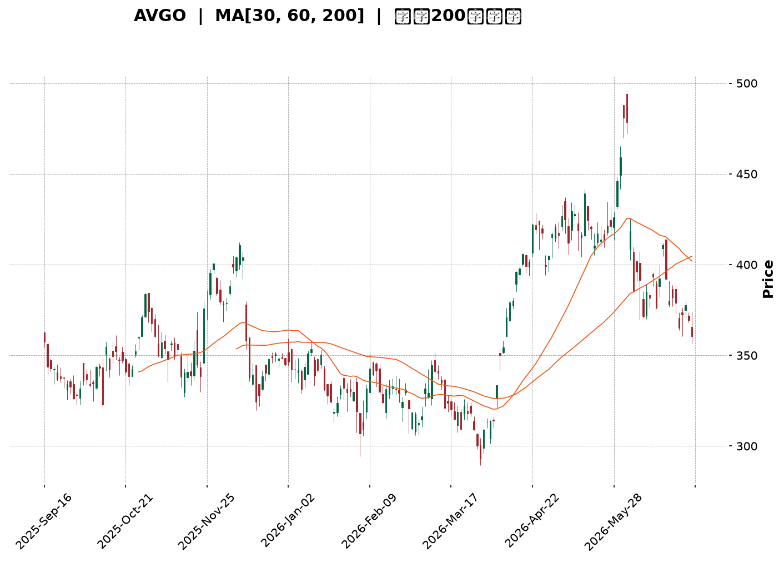
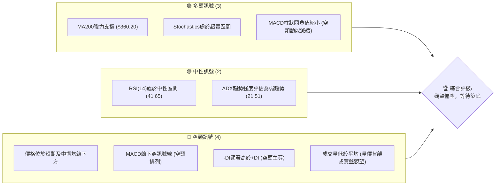
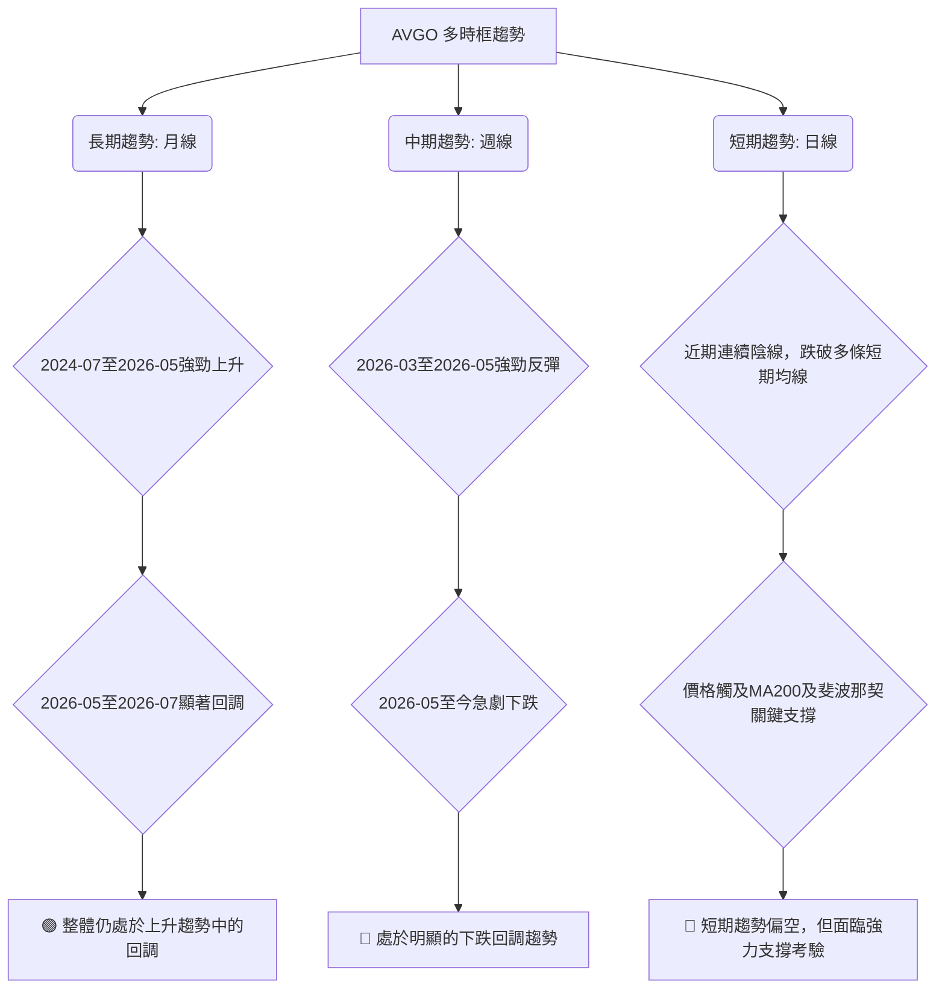
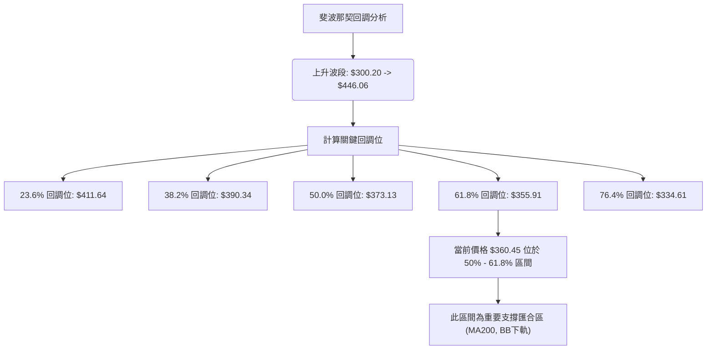

<details>
<summary>📊 靜態圖表 (點擊展開)</summary>

</details>

<html>
<head><meta charset="utf-8" /></head>
<body>
    <div style="height:500px; width:100%;">                        <script>window.PlotlyConfig = {MathJaxConfig: 'local'};</script>
        <script charset="utf-8" src="https://cdn.plot.ly/plotly-3.6.0.min.js" integrity="sha256-QaOVwtVY0T02VaHrr6pnoHLCwayMJp4O5n4YyaE3rJk=" crossorigin="anonymous"></script>                <div id="candlestick-chart" class="plotly-graph-div" style="height:100%; width:100%;"></div>            <script>                window.PLOTLYENV=window.PLOTLYENV || {};                                if (document.getElementById("candlestick-chart")) {                    Plotly.newPlot(                        "candlestick-chart",                        [{"close":{"dtype":"f8","bdata":"AAAAQBpWdkAAAADgbnp1QAAAAIBobXVAAAAAQOVmdUAAAACAbg51QAAAAGDREHVAAAAAgLQWdUAAAACgoeN0QAAAAKCmynRAAAAAoClhdEAAAACAJIF0QAAAAECDuHRAAAAAwLkEdUAAAACgvwd1QAAAAADt2XRAAAAAQJDodEAAAABAMXl1QAAAACCOcXVAAAAAQCItdEAAAAAAZSt2QAAAACBlY3VAAAAA4PPVdUAAAABA0gJ2QAAAAKAhtnVAAAAAILO0dUAAAACgAUx1QAAAAOB0JnVAAAAA4PBldUAAAADggAJ2QAAAAECEgHZAAAAAgEMud0AAAACAQ\u002f13QAAAAKDzZXdAAAAAIB\u002f5dkAAAADgeIh2QAAAAKCo33VAAAAAwKtPdkAAAADAuxl2QAAAAAC5t3VAAAAAoEhGdkAAAAAg+t91QAAAAKDYE3ZAAAAAgF0hdUAAAADg0kh1QAAAAMDYS3VAAAAAgKMpdUAAAAAgHgd2QAAAAAAyjnVAAAAAwN0kdUAAAACAqH13QAAAAOAl7ndAAAAAgKu1eEAAAADgbQt5QAAAAMDa\u002fndAAAAA4Bi3d0AAAACA0qd3QAAAAGCBrndAAAAAIAtBeEAAAADg1e14QAAAAKBpQHlAAAAAgLKqeUAAAABgr0F5QAAAAEDJXnZAAAAAAKkedUAAAAAgXjZ1QAAAAABAQ3RAAAAAYKqAdEAAAABAaSd1QAAAAEAmQ3VAAAAAYJvAdUAAAABA9M51QAAAAOBm7XVAAAAAILnBdUAAAABADsl1QAAAAKBGjXVAAAAAoIGldUAAAADAjWJ1QAAAAAAiaHVAAAAAINRjdUAAAADgJ7R0QAAAAEBDe3VAAAAAYK3udUAAAACg7xR2QAAAAABIKnVAAAAAQC1cdUAAAADgtOZ1QAAAAKARtnRAAAAA4H15dEAAAADguUR0QAAAAGAB7nNAAAAAIIY6dEAAAAAAGbl0QAAAAGBFwHRAAAAAQEKYdEAAAABgWKF0QAAAAOBQnnRAAAAAIHjyc0AAAADAtS5zQAAAACDtVXNAAAAAoCu7dEAAAADA12p1QAAAAGAMM3VAAAAAQAhYdUAAAADgRZ90QAAAACCgP3RAAAAAwBy1dEAAAABAk8R0QAAAACA6zHRAAAAAoN22dEAAAACgCpJ0QAAAAOC5RHRAAAAAIHKxdEAAAAAgTwh0QAAAAAAJ5nNAAAAA4GXac0AAAADAAotzQAAAAIDVxXNAAAAAQMe4dEAAAAAARpR0QAAAAECyh3VAAAAAgClVdUAAAADgD0V1QAAAAIDK63RAAAAAYKQPdEAAAADgozt0QAAAAIAXAnRAAAAAwFOsc0AAAACAqOpzQAAAACDtVXNAAAAAoAEgdEAAAADAl9xzQAAAAEDm5HNAAAAAoOVOc0AAAAAgR8NyQAAAAEAkT3JAAAAAwFVQc0AAAAAA6o9zQAAAAODYoHNAAAAAIO6ec0AAAACAE9d0QAAAACA34XVAAAAAQJYldkAAAADgZy93QAAAACBmsndAAAAAQNrCd0AAAABgfcF4QAAAACBy3XhAAAAAoFxeeUAAAADg+e94QAAAAGCNGHlAAAAAwLZfekAAAABAbDR6QAAAAMB4YXpAAAAAgKAYekAAAADAK\u002fN4QAAAAADzTHlAAAAAgFMMekAAAAAg1El6QAAAAEB4\u002fXlAAAAAgPSqekAAAACgSIx6QAAAAICHvnlAAAAA4CDVekAAAABADLx6QAAAAOAyKnpAAAAAQBoCekAAAABghXF7QAAAAEBKiHpAAAAAILlAekAAAAAguqZ5QAAAACCZEXpAAAAAgKPeeUAAAAAAxdd5QAAAAKB9VXpAAAAAABhTekAAAACgfp56QAAAAEAG4XtAAAAAAOSzfEAAAADg8Qx+QAAAAGCQ531AAAAAAPgjekAAAACA7RF4QAAAAKCSv3hAAAAAIKV4eEAAAABAMTh3QAAAACBfD3hAAAAA4HXXd0AAAACAFJV4QAAAAODVgXdAAAAAYHeEeEAAAABAM6t5QAAAAIAUgnhAAAAAYGbCd0AAAADAHuF3QAAAAGCPrndAAAAA4FHQdkAAAABAM0d3QAAAAAAAnHdAAAAAoHAVd0AAAABAM4d2QA=="},"high":{"dtype":"f8","bdata":"AKA2+XqwdkCvR\u002fPL\u002fVR2QP\u002fxA7tiwnVA61z7PwV8dUCEoJ4gz4t1QLOWAua8dHVA8ZeCzPQidUCzBpsC0QJ1QAObaYMLE3VAkZKD1WMydUDrcj7aR5N0QMZU1+gQAXVAztXMvsOadUBfod3asGd1QCJWwkdlY3VA0hXvkZwDdUC2F3livYl1QCTB4rn9lXVAwaBpkFbKdUALiyoTCVZ2QAtAd7Zzy3VAuUWNaVpWdkDvog1hc5N2QE7qabA50HVAgW\u002fm+aQpdkBnbQA4S9J1QEoLvSEhoXVAkOOGtDeKdUA5yB\u002fw2UR2QC11VoWni3ZArPV+Pps\u002fd0BKzzAWOAV4QKHyMzXyA3hAnlBZmVeLd0BiX7P6LEx3QEaAwVdN7nZADGXjrGKtdkBtvTqRlpd2QDSNCQVkCHZAzzXRX+ZfdkBrjS7V+H12QKCrxK7rTXZAEur4XUb5dUBHwXy0GW11QCNIxqDL43VAjEX9G36gdUBE6BC091p2QDeUffe+X3dAb2VoYoSqdUDR9Ykn8L13QIwfn7x4H3hAiy2nv0PaeEA8XzTWEAx5QMK7pEx2k3hAtxVZzul0eEDpXlIstsJ3QIPGabcC3HdARtls5mN1eEBDOQrUUlB5QF2YK2SYSnlA8nimcMrEeUBInx6+TXB5QIPEJTfwvXdAB2uRubh\u002fdkCbqPvZA5l1QPFn9KDainVA6QBtXYTidEBlkx13k1h1QPBZFf6Bj3VAZILIPzPNdUCCyB\u002fwCfl1QEdptolB\u002f3VADgiSHrXQdUBoScdUK\u002fZ1QOvGpqyIyXVAd841d2F1dkDsFaW3oRt2QKFhRoBNvHVAbZVkK6rGdUCEv8egsmZ1QGpnzz7XoXVA4DgkOJ4JdkBUP3nDumJ2QOWpWWVy1nVALHxLgVjGdUDHuEmoVxN2QN\u002fQrPMdgnVA9Jq6pBTpdEBhaor+DPx0QCsk53XuDHRACd1nLJR3dECq5XyCgNh0QLdi1ObfK3VA3qYN53jrdEDDLewlVw91QNgP87U57XRAgHeZtn8adUBJc+W3ZeVzQLkRMixOVXRAtptW+1PcdED4fr\u002fYv\u002fB1QPJ\u002f\u002fVK5q3VAg77AwM+edUAzxTwTTpB1QCk98vJ80XRAd35jnkjodEAHU\u002fwNPQp1QOL5WHoqE3VA2RZ7msktdUAJWKhUHxR1QH\u002fpRTuucXRAuQ6KodXqdED9eKMjGlZ0QADqKnw17XNAvATWqNjtc0AF40T1h6tzQGoGl05LF3RAcyBvgy7udEDKGIn+\u002fGN1QEtiGw9gs3VAT2lVn4D9dUDyCnMip4h1QNwcFflSKXVA1fZ30UARdUDNLLlo3n90QGG0AtnPY3RADF5DyO1DdEBO2O4vViF0QFl0RcNHBXRAHDQXDm1fdEA\u002fkQi0Mj50QNmxS7eZPHRAo8qeFLXGc0BmUKy7OTBzQK53rDidBHNAv9Z8Uh1dc0CB8BT9p7RzQOrKAXgVo3NASenSf2a+c0ApPsKV89l0QBTcQGhJGXZA238wmCFidkAbliODR393QNda13AhxHdAjoeIitDad0BR+4WLPcd4QN4DK2vG8HhA+uIupWVheUBZLyTNcVx5QKzFmV5lL3lAi0+iEIBoekAqJ6UaG8p6QLlHg0BBhXpAbYX9zE9hekALhHQrs1J5QD00LQX8T3lAPPDnmYAbekDhyU1kBWh6QAG9tm6QcnpAF3rMeEgLe0AILRZn0E97QKXY8ZYOnXpAZU1ZgwAle0BjLbWWbw97QOLRYMSVynpAFBlB934fekAMWrZdk5p7QPq6Km4EAntAmCT1lX1VekA5hjcYohR6QH50LgP\u002fd3pAqDPRClNZekAhuuaiODV6QK7kIkv0KXtAK2bHcNsBe0DwgnwvBNB6QLkSyPYMA3xA+03PRQQVfUCm81\u002fzwoB+QK0rUS58435AdafkwOWcekDlDVMNn515QGVMjzxBI3lAe\u002fA6kZtzeUBkz32jNBN4QE9XGfAmTnhAJQZiavIFeEAPG0vfLrl4QEIHEgW8cnhAyc3JNkUAeUCf8SojxMB5QAAAAIA96nlAAAAA4FFweEAAAAAA10t4QAAAAMDMTHhAAAAAQApbd0AAAAAgXIN3QAAAAIDruXdAAAAAAABcd0AAAAAAAGB3QA=="},"hovertemplate":"\u003cb\u003e%{x|%Y-%m-%d}\u003c\u002fb\u003e\u003cbr\u003e\u958b: $%{open:.2f}\u003cbr\u003e\u9ad8: $%{high:.2f}\u003cbr\u003e\u4f4e: $%{low:.2f}\u003cbr\u003e\u6536: $%{close:.2f}\u003cextra\u003e\u003c\u002fextra\u003e","low":{"dtype":"f8","bdata":"zUzy7UomdkDlB22iQTB1QCdiPjqhVHVAkgkxy7nfdEBuhRJH6AB1QFkn2dNE8nRA0AKsCzK\u002fdEBqGLyfnVd0QJCLiIrNi3RAbh1G\u002fZdbdEDgM9yb0Cx0QNrGYq4QK3RAlQ+8YRvWdEAoX8wo5910QAA2cvogy3RAUaj+4ihMdEAUiT7DQqx0QMYR2RUMKHVAz6hqvecjdEB4nOx6sFl1QO4RoEMdHHVAPhIsrQOZdUDSEYc\u002frbh1QBj5sAoYLnVAK8\u002fttGyedUATS+XQhjZ1QCOPs3Y+2nRANBXQKwwodUB23dMPy851QMsBmzqeEXZAa1g2jyeIdkBHyu6TwzF3QJB3bZH2\u002f3ZAjUV6pwuxdkAMPcJCZ392QC1aB9Wz0HVA4UZLLjnCdUCD44z96Ot1QEZr4TE\u002f9nRAtSwm6SMKdkDZhqelirt1QPB7hI6F23VA8JgDmsPEdEB3iNxgnnN0QOvcF1o5+nRAaAy3Zz7adEA3un7hrf50QJHGo+8ZdHVAoEHF\u002fTafdEAKKgNnj5t1QLKlyCPaGndAgR3DZvzRd0BsRAaFJa94QHd+nB5D73dACYOIocaad0CPiRa6WQl3QEze4RfoZndA+RgHsA7wd0A2o20V97J4QOm7T9LklHhAOrExOlXVeEA1wrsn5H94QMiKhXy7EnZAljFOwBD6dEAyUaGPFdN0QIU+RYAP+nNAOj76CjkddECiszX3n6t0QImN67a3\u002f3RA636jjsIUdUCPQzXt2p11QFkfZTiUp3VAKSy8h8x2dUD7vr+kScB1QM+79JhvgnVAOl\u002fz16qEdUALL0VnPfR0QFeEa90mDHVA9xhhLVvqdEATlhaEl5R0QOhoM41qxHRAnAxCxS07dUDwsT8f9Nl1QF6svRoV03RA8\u002f5QC6hGdUAgNBenmGx1QIf918ZQqXRA+QjbhikwdEAbqv1kKTt0QDSmF2xQj3NA3ShrHfPGc0AAY8+9HV10QI086PADWHRAm11qGKzxc0DpRsPl\u002f3F0QGWG0\u002fPeSHRAYL6mdUY4c0CXkZtsdWNyQOcpgqYwGXNAoU\u002fW2Dmyc0CVnWaq+5Z0QB5MHMV7KXVAjVtW2T3IdEB3thZ0m4V0QBciSTf5N3RA1739nGKyc0DutLPIdmB0QNIe0CqFh3RAkSnRBu2FdECDgik3BEJ0QKyNExe8lHNAWjTQzCSBdEAetUwhzCxzQLCSSdDLTXNATABzDykhc0Cb5JVPWSRzQBoVTKqIaXNAvGaMrIIddEC+t1SNLGN0QHuvLJbBJnRACndkYsk4dUCpInWcqA91QOV2kkyxr3RA9CFkOQEEdEDflG5PKu5zQBfdrchewXNAxqN39kSmc0CKW5gyCzZzQMk9j16FTHNAx5Fb7+qmc0BvOIPUeqVzQCdPCyeDw3NAP\u002fk+PudKc0Dclw0XXaZyQNRnnlQHGHJAMy2anfJ9ckAgDEKb1F9zQBuNjPhe1HJA0LVLnKJcc0CtqkPlqRR0QCgz7ezRX3VAL3cq8hzvdUC\u002fgUdT\u002f4N2QEU2kbhWDndAllUb\u002fpp7d0BO0PIqXw94QMqUNDyue3hAxeMED9ryeECBu4bkY7R4QFC5r\u002fAkn3hAUViUBYZDeUDbldaZPBJ6QBaQPjdsg3lAt0BA25jfeUCRiPUGbKB4QO07ur1ywnhAqnVPz3U5eUCkAcHnB8p5QFap0DwgjnlA8pvLd\u002f8qekCjCyjU6hF6QPKfaQSHWnlAiTvibojVeUDzoYGgDYZ6QLlz+fs7fHlAyfygupBCeUATh+DB7u55QP3D5qIvMnpAr\u002fLxiHHbeUDpAbeYf1N5QJCO0ohRrHlAGeOzF5+deUBQ8dYP\u002fZh5QNbKIA11BXpAWlznQU\u002f9eUBMpKdbsdV5QM9VpYac7HpAfEO84laYe0AsvVYod1t9QEWLIGdKfn1AJqZ1ifgleUDcXP\u002fnsA94QD7YD5u0a3hA0o1iq+obd0DSAO8EVil3QEBdzVduH3dA+AmN8HeGd0AnWxFwxj94QEw0PX7XfXdASL6Jt7ngd0CeAbrD1Et5QAAAAGCPfnhAAAAAYI+Kd0AAAAAgXI93QAAAAEAzS3dAAAAAoEe9dkAAAAAgXId2QAAAAIA9KndAAAAA4HoAd0AAAABA4UZ2QA=="},"name":"\u50f9\u683c","open":{"dtype":"f8","bdata":"ACBcuFmsdkBl2A9Z1kN2QOOGElZEt3VAgurwA0pidUATFH3JWEh1QBcqWnOAJXVAmrNRet0ddUCWlqv9JbJ0QJX\u002fas3K+HRAq\u002fFOWwridEDbBN7Ue4R0QCXj\u002frwjZXRAztXMvsOadUDF32GtjDl1QKPOJI\u002fE4HRASCj6mG3ydEC1DbOeWr90QDmeCZYrfXVAZPHGXXF3dUDghoZV3ex1QDh9FircwnVAIYvLsukHdkB00U4i\u002fCx2QEW5zBuWunVAqJ5xyUD9dUDzUf+zysB1QJEc0hbVlXVANBXQKwwodUAOxapauuh1QEyaKgRneHZAsj9PIZaJdkBHyu6TwzF3QKHyMzXyA3hARd1uR5eCd0AGLjVp1B53QA4w+gxaSHZADq5Ay\u002fPOdUBQjxBzpmF2QG3th1h1A3ZA\u002ft2Br3w+dkDMiH4cg092QPEg6AC3QHZAYRfyNe7ZdUDuV6W99pl0QOZCh7nRHnVA35cYHplUdUAcBnnU+ix1QJFTNW9dv3ZAGMcnqMhzdUDXtemNrJx1QMnMZoiO7HdAF6zo4Gv2d0CR2XHH\u002fdF4QK5riY9kinhAO\u002fhyBlYieEDez4DsHZ53QF5dRb3vqHdA4qBqZ0kAeEAbKcrfygN5QHfcAt1xyHhAEoUad1b\u002feEDiN0mnLil5QCBpMeh6nXdAH3dIvPh9dkC5zeHFW+J0QPFn9KDainVAuJy6LAridEDSDQSet7d0QD7FOAYpjHVArg+gTvI4dUCy+TdPctZ1QPP46DVY3HVA6mOC0gq3dUBksTLy98p1QFFm540kx3VA\u002fLmZbcP3dUBk1rkzAhd2QBH\u002fKk5sZXVAg2A2byJHdUCL\u002fWnIWVh1QJ3dM3vgCnVAnAxCxS07dUBYysShW\u002fl1QM9nmSAHu3VAjyxrLGu9dUDuo4pn\u002fI91QJJ1or5kbXVAcyuzQHXkdECoaPpF6OF0QPLFX6YM4nNAnQjaKgXqc0BAe+Ssy4h0QNMkBqqzGXVA52lgXW61dEAOhcO8hLN0QOCGbQqcTnRACr05zxD4dEBJc+W3ZeVzQPSykCz7knNAJmjFmM3uc0At9plc5Zh0QPOSM5Edo3VAeNY8RG+YdUBZWIvOFml1QM+yZwU7inRAdpabcxvoc0Cp46wb+IR0QIEPaNuavHRA3H0WHD6ydEAOs3NJfbB0QDES7hizFXRArSka+mqYdEDEmXa301R0QN4eWor0WHNAscDP1pdDc0BJU6DAnn1zQKqRkq9XqHNAHy2nj32PdEAaOqrSM3F0QHYzhl3IYHRAjClmizO3dUCzsZVqUlV1QA04TsQBCHVAVwmE8AwHdUAHGtLWLE10QA\u002fpXtoHSXRA4MKHGRD0c0C7M97KK3VzQM8spSgf73NAtsam0PXXc0DSTp\u002fO6PdzQFqvr6hIIXRAqArqWWGYc0BuzrpUMilzQK7J5xZQxnJAB576v6uuckCwItJG\u002f41zQC4ZmzwkAHNA93QejP6oc0BmuGVca2N0QFTERmAb83VAwqqihOT7dUBiZHMM6oV2QGFeVc42EXdAk6caZNiUd0D62YIFOVR4QKvRb3UDpnhA82r+oEMEeUA06ClW8VB5QCNgJT127HhAd5vA7GNleUCBFoWkj1t6QGwOooHvhHpAytEzngw9ekCRB6bE1vp4QHOqD1\u002fMLXlADgm5fNDteUA5xqTw8eZ5QEVfEz7yGHpA6cZXROZPekDD3smf8i17QJNXypB0UnpAsma1pC8yekA+kCC+G696QOPF26QsbHpAZFbPd3LyeUA\u002fC\u002fLgJAF6QPq6Km4EAntA8oog2OdLekAGGC43wpJ5QMtbvemFwnlAoukYGljOeUDpuETRSA16QDHnw1drHXpAWp8ZeV+GekA3TbC1l0d6QDIGaBJBBHtA8HSacg8WfEA4iBRFSIB+QLuu13r4335A7bfx1H+FeUAha\u002fBBdG95QM0JGIm9H3lAIwTLFZsPeUDsDtzIWs53QIyPb6axQ3dAVmEbktHxd0CpfpYWKa54QPf3Fn9+WXhAOQOLPohBeEBRNcG07I55QAAAAGCP2nlAAAAAgOudd0AAAACA6yl4QAAAAKBHKXhAAAAAQDMnd0AAAACA61l3QAAAAOCjbHdAAAAAgOs9d0AAAAAgrtt2QA=="},"x":["2025-09-16T00:00:00-04:00","2025-09-17T00:00:00-04:00","2025-09-18T00:00:00-04:00","2025-09-19T00:00:00-04:00","2025-09-22T00:00:00-04:00","2025-09-23T00:00:00-04:00","2025-09-24T00:00:00-04:00","2025-09-25T00:00:00-04:00","2025-09-26T00:00:00-04:00","2025-09-29T00:00:00-04:00","2025-09-30T00:00:00-04:00","2025-10-01T00:00:00-04:00","2025-10-02T00:00:00-04:00","2025-10-03T00:00:00-04:00","2025-10-06T00:00:00-04:00","2025-10-07T00:00:00-04:00","2025-10-08T00:00:00-04:00","2025-10-09T00:00:00-04:00","2025-10-10T00:00:00-04:00","2025-10-13T00:00:00-04:00","2025-10-14T00:00:00-04:00","2025-10-15T00:00:00-04:00","2025-10-16T00:00:00-04:00","2025-10-17T00:00:00-04:00","2025-10-20T00:00:00-04:00","2025-10-21T00:00:00-04:00","2025-10-22T00:00:00-04:00","2025-10-23T00:00:00-04:00","2025-10-24T00:00:00-04:00","2025-10-27T00:00:00-04:00","2025-10-28T00:00:00-04:00","2025-10-29T00:00:00-04:00","2025-10-30T00:00:00-04:00","2025-10-31T00:00:00-04:00","2025-11-03T00:00:00-05:00","2025-11-04T00:00:00-05:00","2025-11-05T00:00:00-05:00","2025-11-06T00:00:00-05:00","2025-11-07T00:00:00-05:00","2025-11-10T00:00:00-05:00","2025-11-11T00:00:00-05:00","2025-11-12T00:00:00-05:00","2025-11-13T00:00:00-05:00","2025-11-14T00:00:00-05:00","2025-11-17T00:00:00-05:00","2025-11-18T00:00:00-05:00","2025-11-19T00:00:00-05:00","2025-11-20T00:00:00-05:00","2025-11-21T00:00:00-05:00","2025-11-24T00:00:00-05:00","2025-11-25T00:00:00-05:00","2025-11-26T00:00:00-05:00","2025-11-28T00:00:00-05:00","2025-12-01T00:00:00-05:00","2025-12-02T00:00:00-05:00","2025-12-03T00:00:00-05:00","2025-12-04T00:00:00-05:00","2025-12-05T00:00:00-05:00","2025-12-08T00:00:00-05:00","2025-12-09T00:00:00-05:00","2025-12-10T00:00:00-05:00","2025-12-11T00:00:00-05:00","2025-12-12T00:00:00-05:00","2025-12-15T00:00:00-05:00","2025-12-16T00:00:00-05:00","2025-12-17T00:00:00-05:00","2025-12-18T00:00:00-05:00","2025-12-19T00:00:00-05:00","2025-12-22T00:00:00-05:00","2025-12-23T00:00:00-05:00","2025-12-24T00:00:00-05:00","2025-12-26T00:00:00-05:00","2025-12-29T00:00:00-05:00","2025-12-30T00:00:00-05:00","2025-12-31T00:00:00-05:00","2026-01-02T00:00:00-05:00","2026-01-05T00:00:00-05:00","2026-01-06T00:00:00-05:00","2026-01-07T00:00:00-05:00","2026-01-08T00:00:00-05:00","2026-01-09T00:00:00-05:00","2026-01-12T00:00:00-05:00","2026-01-13T00:00:00-05:00","2026-01-14T00:00:00-05:00","2026-01-15T00:00:00-05:00","2026-01-16T00:00:00-05:00","2026-01-20T00:00:00-05:00","2026-01-21T00:00:00-05:00","2026-01-22T00:00:00-05:00","2026-01-23T00:00:00-05:00","2026-01-26T00:00:00-05:00","2026-01-27T00:00:00-05:00","2026-01-28T00:00:00-05:00","2026-01-29T00:00:00-05:00","2026-01-30T00:00:00-05:00","2026-02-02T00:00:00-05:00","2026-02-03T00:00:00-05:00","2026-02-04T00:00:00-05:00","2026-02-05T00:00:00-05:00","2026-02-06T00:00:00-05:00","2026-02-09T00:00:00-05:00","2026-02-10T00:00:00-05:00","2026-02-11T00:00:00-05:00","2026-02-12T00:00:00-05:00","2026-02-13T00:00:00-05:00","2026-02-17T00:00:00-05:00","2026-02-18T00:00:00-05:00","2026-02-19T00:00:00-05:00","2026-02-20T00:00:00-05:00","2026-02-23T00:00:00-05:00","2026-02-24T00:00:00-05:00","2026-02-25T00:00:00-05:00","2026-02-26T00:00:00-05:00","2026-02-27T00:00:00-05:00","2026-03-02T00:00:00-05:00","2026-03-03T00:00:00-05:00","2026-03-04T00:00:00-05:00","2026-03-05T00:00:00-05:00","2026-03-06T00:00:00-05:00","2026-03-09T00:00:00-04:00","2026-03-10T00:00:00-04:00","2026-03-11T00:00:00-04:00","2026-03-12T00:00:00-04:00","2026-03-13T00:00:00-04:00","2026-03-16T00:00:00-04:00","2026-03-17T00:00:00-04:00","2026-03-18T00:00:00-04:00","2026-03-19T00:00:00-04:00","2026-03-20T00:00:00-04:00","2026-03-23T00:00:00-04:00","2026-03-24T00:00:00-04:00","2026-03-25T00:00:00-04:00","2026-03-26T00:00:00-04:00","2026-03-27T00:00:00-04:00","2026-03-30T00:00:00-04:00","2026-03-31T00:00:00-04:00","2026-04-01T00:00:00-04:00","2026-04-02T00:00:00-04:00","2026-04-06T00:00:00-04:00","2026-04-07T00:00:00-04:00","2026-04-08T00:00:00-04:00","2026-04-09T00:00:00-04:00","2026-04-10T00:00:00-04:00","2026-04-13T00:00:00-04:00","2026-04-14T00:00:00-04:00","2026-04-15T00:00:00-04:00","2026-04-16T00:00:00-04:00","2026-04-17T00:00:00-04:00","2026-04-20T00:00:00-04:00","2026-04-21T00:00:00-04:00","2026-04-22T00:00:00-04:00","2026-04-23T00:00:00-04:00","2026-04-24T00:00:00-04:00","2026-04-27T00:00:00-04:00","2026-04-28T00:00:00-04:00","2026-04-29T00:00:00-04:00","2026-04-30T00:00:00-04:00","2026-05-01T00:00:00-04:00","2026-05-04T00:00:00-04:00","2026-05-05T00:00:00-04:00","2026-05-06T00:00:00-04:00","2026-05-07T00:00:00-04:00","2026-05-08T00:00:00-04:00","2026-05-11T00:00:00-04:00","2026-05-12T00:00:00-04:00","2026-05-13T00:00:00-04:00","2026-05-14T00:00:00-04:00","2026-05-15T00:00:00-04:00","2026-05-18T00:00:00-04:00","2026-05-19T00:00:00-04:00","2026-05-20T00:00:00-04:00","2026-05-21T00:00:00-04:00","2026-05-22T00:00:00-04:00","2026-05-26T00:00:00-04:00","2026-05-27T00:00:00-04:00","2026-05-28T00:00:00-04:00","2026-05-29T00:00:00-04:00","2026-06-01T00:00:00-04:00","2026-06-02T00:00:00-04:00","2026-06-03T00:00:00-04:00","2026-06-04T00:00:00-04:00","2026-06-05T00:00:00-04:00","2026-06-08T00:00:00-04:00","2026-06-09T00:00:00-04:00","2026-06-10T00:00:00-04:00","2026-06-11T00:00:00-04:00","2026-06-12T00:00:00-04:00","2026-06-15T00:00:00-04:00","2026-06-16T00:00:00-04:00","2026-06-17T00:00:00-04:00","2026-06-18T00:00:00-04:00","2026-06-22T00:00:00-04:00","2026-06-23T00:00:00-04:00","2026-06-24T00:00:00-04:00","2026-06-25T00:00:00-04:00","2026-06-26T00:00:00-04:00","2026-06-29T00:00:00-04:00","2026-06-30T00:00:00-04:00","2026-07-01T00:00:00-04:00","2026-07-02T00:00:00-04:00"],"type":"candlestick"},{"hovertemplate":"MA30: $%{y:.2f}\u003cextra\u003e\u003c\u002fextra\u003e","line":{"color":"#2196F3","dash":"dash","width":2},"mode":"lines","name":"MA30","x":["2025-09-16T00:00:00-04:00","2025-09-17T00:00:00-04:00","2025-09-18T00:00:00-04:00","2025-09-19T00:00:00-04:00","2025-09-22T00:00:00-04:00","2025-09-23T00:00:00-04:00","2025-09-24T00:00:00-04:00","2025-09-25T00:00:00-04:00","2025-09-26T00:00:00-04:00","2025-09-29T00:00:00-04:00","2025-09-30T00:00:00-04:00","2025-10-01T00:00:00-04:00","2025-10-02T00:00:00-04:00","2025-10-03T00:00:00-04:00","2025-10-06T00:00:00-04:00","2025-10-07T00:00:00-04:00","2025-10-08T00:00:00-04:00","2025-10-09T00:00:00-04:00","2025-10-10T00:00:00-04:00","2025-10-13T00:00:00-04:00","2025-10-14T00:00:00-04:00","2025-10-15T00:00:00-04:00","2025-10-16T00:00:00-04:00","2025-10-17T00:00:00-04:00","2025-10-20T00:00:00-04:00","2025-10-21T00:00:00-04:00","2025-10-22T00:00:00-04:00","2025-10-23T00:00:00-04:00","2025-10-24T00:00:00-04:00","2025-10-27T00:00:00-04:00","2025-10-28T00:00:00-04:00","2025-10-29T00:00:00-04:00","2025-10-30T00:00:00-04:00","2025-10-31T00:00:00-04:00","2025-11-03T00:00:00-05:00","2025-11-04T00:00:00-05:00","2025-11-05T00:00:00-05:00","2025-11-06T00:00:00-05:00","2025-11-07T00:00:00-05:00","2025-11-10T00:00:00-05:00","2025-11-11T00:00:00-05:00","2025-11-12T00:00:00-05:00","2025-11-13T00:00:00-05:00","2025-11-14T00:00:00-05:00","2025-11-17T00:00:00-05:00","2025-11-18T00:00:00-05:00","2025-11-19T00:00:00-05:00","2025-11-20T00:00:00-05:00","2025-11-21T00:00:00-05:00","2025-11-24T00:00:00-05:00","2025-11-25T00:00:00-05:00","2025-11-26T00:00:00-05:00","2025-11-28T00:00:00-05:00","2025-12-01T00:00:00-05:00","2025-12-02T00:00:00-05:00","2025-12-03T00:00:00-05:00","2025-12-04T00:00:00-05:00","2025-12-05T00:00:00-05:00","2025-12-08T00:00:00-05:00","2025-12-09T00:00:00-05:00","2025-12-10T00:00:00-05:00","2025-12-11T00:00:00-05:00","2025-12-12T00:00:00-05:00","2025-12-15T00:00:00-05:00","2025-12-16T00:00:00-05:00","2025-12-17T00:00:00-05:00","2025-12-18T00:00:00-05:00","2025-12-19T00:00:00-05:00","2025-12-22T00:00:00-05:00","2025-12-23T00:00:00-05:00","2025-12-24T00:00:00-05:00","2025-12-26T00:00:00-05:00","2025-12-29T00:00:00-05:00","2025-12-30T00:00:00-05:00","2025-12-31T00:00:00-05:00","2026-01-02T00:00:00-05:00","2026-01-05T00:00:00-05:00","2026-01-06T00:00:00-05:00","2026-01-07T00:00:00-05:00","2026-01-08T00:00:00-05:00","2026-01-09T00:00:00-05:00","2026-01-12T00:00:00-05:00","2026-01-13T00:00:00-05:00","2026-01-14T00:00:00-05:00","2026-01-15T00:00:00-05:00","2026-01-16T00:00:00-05:00","2026-01-20T00:00:00-05:00","2026-01-21T00:00:00-05:00","2026-01-22T00:00:00-05:00","2026-01-23T00:00:00-05:00","2026-01-26T00:00:00-05:00","2026-01-27T00:00:00-05:00","2026-01-28T00:00:00-05:00","2026-01-29T00:00:00-05:00","2026-01-30T00:00:00-05:00","2026-02-02T00:00:00-05:00","2026-02-03T00:00:00-05:00","2026-02-04T00:00:00-05:00","2026-02-05T00:00:00-05:00","2026-02-06T00:00:00-05:00","2026-02-09T00:00:00-05:00","2026-02-10T00:00:00-05:00","2026-02-11T00:00:00-05:00","2026-02-12T00:00:00-05:00","2026-02-13T00:00:00-05:00","2026-02-17T00:00:00-05:00","2026-02-18T00:00:00-05:00","2026-02-19T00:00:00-05:00","2026-02-20T00:00:00-05:00","2026-02-23T00:00:00-05:00","2026-02-24T00:00:00-05:00","2026-02-25T00:00:00-05:00","2026-02-26T00:00:00-05:00","2026-02-27T00:00:00-05:00","2026-03-02T00:00:00-05:00","2026-03-03T00:00:00-05:00","2026-03-04T00:00:00-05:00","2026-03-05T00:00:00-05:00","2026-03-06T00:00:00-05:00","2026-03-09T00:00:00-04:00","2026-03-10T00:00:00-04:00","2026-03-11T00:00:00-04:00","2026-03-12T00:00:00-04:00","2026-03-13T00:00:00-04:00","2026-03-16T00:00:00-04:00","2026-03-17T00:00:00-04:00","2026-03-18T00:00:00-04:00","2026-03-19T00:00:00-04:00","2026-03-20T00:00:00-04:00","2026-03-23T00:00:00-04:00","2026-03-24T00:00:00-04:00","2026-03-25T00:00:00-04:00","2026-03-26T00:00:00-04:00","2026-03-27T00:00:00-04:00","2026-03-30T00:00:00-04:00","2026-03-31T00:00:00-04:00","2026-04-01T00:00:00-04:00","2026-04-02T00:00:00-04:00","2026-04-06T00:00:00-04:00","2026-04-07T00:00:00-04:00","2026-04-08T00:00:00-04:00","2026-04-09T00:00:00-04:00","2026-04-10T00:00:00-04:00","2026-04-13T00:00:00-04:00","2026-04-14T00:00:00-04:00","2026-04-15T00:00:00-04:00","2026-04-16T00:00:00-04:00","2026-04-17T00:00:00-04:00","2026-04-20T00:00:00-04:00","2026-04-21T00:00:00-04:00","2026-04-22T00:00:00-04:00","2026-04-23T00:00:00-04:00","2026-04-24T00:00:00-04:00","2026-04-27T00:00:00-04:00","2026-04-28T00:00:00-04:00","2026-04-29T00:00:00-04:00","2026-04-30T00:00:00-04:00","2026-05-01T00:00:00-04:00","2026-05-04T00:00:00-04:00","2026-05-05T00:00:00-04:00","2026-05-06T00:00:00-04:00","2026-05-07T00:00:00-04:00","2026-05-08T00:00:00-04:00","2026-05-11T00:00:00-04:00","2026-05-12T00:00:00-04:00","2026-05-13T00:00:00-04:00","2026-05-14T00:00:00-04:00","2026-05-15T00:00:00-04:00","2026-05-18T00:00:00-04:00","2026-05-19T00:00:00-04:00","2026-05-20T00:00:00-04:00","2026-05-21T00:00:00-04:00","2026-05-22T00:00:00-04:00","2026-05-26T00:00:00-04:00","2026-05-27T00:00:00-04:00","2026-05-28T00:00:00-04:00","2026-05-29T00:00:00-04:00","2026-06-01T00:00:00-04:00","2026-06-02T00:00:00-04:00","2026-06-03T00:00:00-04:00","2026-06-04T00:00:00-04:00","2026-06-05T00:00:00-04:00","2026-06-08T00:00:00-04:00","2026-06-09T00:00:00-04:00","2026-06-10T00:00:00-04:00","2026-06-11T00:00:00-04:00","2026-06-12T00:00:00-04:00","2026-06-15T00:00:00-04:00","2026-06-16T00:00:00-04:00","2026-06-17T00:00:00-04:00","2026-06-18T00:00:00-04:00","2026-06-22T00:00:00-04:00","2026-06-23T00:00:00-04:00","2026-06-24T00:00:00-04:00","2026-06-25T00:00:00-04:00","2026-06-26T00:00:00-04:00","2026-06-29T00:00:00-04:00","2026-06-30T00:00:00-04:00","2026-07-01T00:00:00-04:00","2026-07-02T00:00:00-04:00"],"y":{"dtype":"f8","bdata":"AAAAAAAA+H8AAAAAAAD4fwAAAAAAAPh\u002fAAAAAAAA+H8AAAAAAAD4fwAAAAAAAPh\u002fAAAAAAAA+H8AAAAAAAD4fwAAAAAAAPh\u002fAAAAAAAA+H8AAAAAAAD4fwAAAAAAAPh\u002fAAAAAAAA+H8AAAAAAAD4fwAAAAAAAPh\u002fAAAAAAAA+H8AAAAAAAD4fwAAAAAAAPh\u002fAAAAAAAA+H8AAAAAAAD4fwAAAAAAAPh\u002fAAAAAAAA+H8AAAAAAAD4fwAAAAAAAPh\u002fAAAAAAAA+H8AAAAAAAD4fwAAAAAAAPh\u002fAAAAAAAA+H8AAAAAAAD4f7y7u2uvTnVA7+7u\u002fuNVdUC8u7t7UWt1QLy7u+sifHVAAAAAQIuJdUAiIiIyJZZ1QM3MzDwKnXVAERER4XindUBVVVUVz7F1QImIiBi2uXVAvLu7y+HJdUBVVVWVk9V1QO\u002fu7n4n4XVAMzMz4xvidUAiIiIyR+R1QCIiIlIT6HVAERERoT7qdUCamZm5+e51QO\u002fu7h7u73VAq6qqGjD4dUDv7u6edgN2QGZmZrYnGXZAVVVV1a0xdkAzMzPjkEt2QGZmZoYOX3ZAzczMDDRwdkDNzMycVIR2QBEREaHumXZA7+7uXk2ydkCrqqqaNst2QO\u002fu7i6t4nZAVVVVFeT3dkCrqqp6tAJ3QM3MzMzu+XZAAAAAEB7qdkB3d3fn2N52QO\u002fu7q4Z0XZAREREtKrBdkAzMzPjlrl2QBERESG0tXZAvLu7az+xdkCJiIgorrB2QJqZmRlmr3ZAzczMfL60dkC8u7u7BLl2QAAAABAzu3ZAEREREVS\u002fdkCamZnJ17l2QM3MzPySuHZARERERKy6dkBmZma246J2QKuqqkr+jXZAd3d3J0t2dkDe3d2tAl12QHd3d6fbRHZAvLu7u8IwdkB3d3dHyiF2QImIiDhxCHZAd3d3xzDodUBERESUa8B1QERERLQBk3VAMzMz05lkdUBVVVUl6j11QDMzM\u002fMYMHVA7+7uDp4rdUBmZmZmpiZ1QO\u002fu7n6vKXVAZmZmFvIkdUDe3d1NHxR1QHd3d3euA3VAq6qqivf6dEAiIiJCofd0QKuqqgpr8XRAVVVVJeXtdEARERER+ON0QKuqqurY2HRA3t3djdXQdECJiIh4kct0QDMzMxNfxnRAAAAAIJvAdEBEREQEeL90QKuqqhoetXRAAAAAEIuqdEDv7u4+Dpl0QImIiFg\u002fjnRA3t3dXWOBdEBERETUQ210QDMzM9NBZXRA7+7u3l1ndEDNzMysBGp0QERERLSsd3RAzczMjBiBdECamZnpwoV0QImIiEg2h3RAzczMfKiCdECrqqqaRH90QN7d3X0PenRAIiIi8rh3dEBVVVXF\u002fH10QFVVVcX8fXRAREREtNB4dEDe3d1Nimt0QGZmZuZmYHRAERER4QdPdEDe3d0NKj90QERERGSdLnRARERE5LgidEC8u7v7bhh0QGZmZkZ0DnRA3t3dfR8FdEBmZmaWbAd0QO\u002fu7n4sFXRAmpmZGZQhdEAzMzNTezx0QERERNTkXHRAq6qqCj5+dECJiIiYuap0QAAAAMAt1nRAzczM3NT9dEBmZmaGBSN1QKuqqjpzQXVAAAAA8HdsdUDe3d2dlJZ1QN7d3X0rxXVAzczMXKv4dUAAAACg6yB2QDMzMxMVTnZAd3d3d3uEdkCamZnJ2rp2QBEREbGj83ZAZmZmlngrd0BEREQEh2R3QKuqqspylndAd3d396fWd0CamZmJrhp4QO\u002fu7o63XXhAVVVVtdeWeEDv7u6eGNp4QM3MzMwCFXlAIiIioppNeUCJiIi4qHZ5QImIiLhnmnlA3t3dbSy6eUAzMzMz2tB5QLy7u\u002fta53lAiYiI6Dr9eUCamZlZIQ16QM3MzHzZJnpA7+7u7kxDekDNzMzM7m56QO\u002fu7m73l3pAvLu7m\u002fmVekDv7u4uwoN6QM3MzBzUdXpAZmZmZvZnekARERFRMll6QCIiIlKcTnpAIiIiIsg7ekBmZmY2OS16QCIiIiIJGHpAERERoa8FekCrqqrqLv55QM3MzIyi83lAIiIiImnZeUAiIiLiC8F5QERERMTbq3lAq6qqWpmQeUBVVVUVDm15QM3MzKwcVHlAmpmZuRE5eUCJiIgYax55QA=="},"type":"scatter"},{"hovertemplate":"MA60: $%{y:.2f}\u003cextra\u003e\u003c\u002fextra\u003e","line":{"color":"#9C27B0","dash":"dash","width":2},"mode":"lines","name":"MA60","x":["2025-09-16T00:00:00-04:00","2025-09-17T00:00:00-04:00","2025-09-18T00:00:00-04:00","2025-09-19T00:00:00-04:00","2025-09-22T00:00:00-04:00","2025-09-23T00:00:00-04:00","2025-09-24T00:00:00-04:00","2025-09-25T00:00:00-04:00","2025-09-26T00:00:00-04:00","2025-09-29T00:00:00-04:00","2025-09-30T00:00:00-04:00","2025-10-01T00:00:00-04:00","2025-10-02T00:00:00-04:00","2025-10-03T00:00:00-04:00","2025-10-06T00:00:00-04:00","2025-10-07T00:00:00-04:00","2025-10-08T00:00:00-04:00","2025-10-09T00:00:00-04:00","2025-10-10T00:00:00-04:00","2025-10-13T00:00:00-04:00","2025-10-14T00:00:00-04:00","2025-10-15T00:00:00-04:00","2025-10-16T00:00:00-04:00","2025-10-17T00:00:00-04:00","2025-10-20T00:00:00-04:00","2025-10-21T00:00:00-04:00","2025-10-22T00:00:00-04:00","2025-10-23T00:00:00-04:00","2025-10-24T00:00:00-04:00","2025-10-27T00:00:00-04:00","2025-10-28T00:00:00-04:00","2025-10-29T00:00:00-04:00","2025-10-30T00:00:00-04:00","2025-10-31T00:00:00-04:00","2025-11-03T00:00:00-05:00","2025-11-04T00:00:00-05:00","2025-11-05T00:00:00-05:00","2025-11-06T00:00:00-05:00","2025-11-07T00:00:00-05:00","2025-11-10T00:00:00-05:00","2025-11-11T00:00:00-05:00","2025-11-12T00:00:00-05:00","2025-11-13T00:00:00-05:00","2025-11-14T00:00:00-05:00","2025-11-17T00:00:00-05:00","2025-11-18T00:00:00-05:00","2025-11-19T00:00:00-05:00","2025-11-20T00:00:00-05:00","2025-11-21T00:00:00-05:00","2025-11-24T00:00:00-05:00","2025-11-25T00:00:00-05:00","2025-11-26T00:00:00-05:00","2025-11-28T00:00:00-05:00","2025-12-01T00:00:00-05:00","2025-12-02T00:00:00-05:00","2025-12-03T00:00:00-05:00","2025-12-04T00:00:00-05:00","2025-12-05T00:00:00-05:00","2025-12-08T00:00:00-05:00","2025-12-09T00:00:00-05:00","2025-12-10T00:00:00-05:00","2025-12-11T00:00:00-05:00","2025-12-12T00:00:00-05:00","2025-12-15T00:00:00-05:00","2025-12-16T00:00:00-05:00","2025-12-17T00:00:00-05:00","2025-12-18T00:00:00-05:00","2025-12-19T00:00:00-05:00","2025-12-22T00:00:00-05:00","2025-12-23T00:00:00-05:00","2025-12-24T00:00:00-05:00","2025-12-26T00:00:00-05:00","2025-12-29T00:00:00-05:00","2025-12-30T00:00:00-05:00","2025-12-31T00:00:00-05:00","2026-01-02T00:00:00-05:00","2026-01-05T00:00:00-05:00","2026-01-06T00:00:00-05:00","2026-01-07T00:00:00-05:00","2026-01-08T00:00:00-05:00","2026-01-09T00:00:00-05:00","2026-01-12T00:00:00-05:00","2026-01-13T00:00:00-05:00","2026-01-14T00:00:00-05:00","2026-01-15T00:00:00-05:00","2026-01-16T00:00:00-05:00","2026-01-20T00:00:00-05:00","2026-01-21T00:00:00-05:00","2026-01-22T00:00:00-05:00","2026-01-23T00:00:00-05:00","2026-01-26T00:00:00-05:00","2026-01-27T00:00:00-05:00","2026-01-28T00:00:00-05:00","2026-01-29T00:00:00-05:00","2026-01-30T00:00:00-05:00","2026-02-02T00:00:00-05:00","2026-02-03T00:00:00-05:00","2026-02-04T00:00:00-05:00","2026-02-05T00:00:00-05:00","2026-02-06T00:00:00-05:00","2026-02-09T00:00:00-05:00","2026-02-10T00:00:00-05:00","2026-02-11T00:00:00-05:00","2026-02-12T00:00:00-05:00","2026-02-13T00:00:00-05:00","2026-02-17T00:00:00-05:00","2026-02-18T00:00:00-05:00","2026-02-19T00:00:00-05:00","2026-02-20T00:00:00-05:00","2026-02-23T00:00:00-05:00","2026-02-24T00:00:00-05:00","2026-02-25T00:00:00-05:00","2026-02-26T00:00:00-05:00","2026-02-27T00:00:00-05:00","2026-03-02T00:00:00-05:00","2026-03-03T00:00:00-05:00","2026-03-04T00:00:00-05:00","2026-03-05T00:00:00-05:00","2026-03-06T00:00:00-05:00","2026-03-09T00:00:00-04:00","2026-03-10T00:00:00-04:00","2026-03-11T00:00:00-04:00","2026-03-12T00:00:00-04:00","2026-03-13T00:00:00-04:00","2026-03-16T00:00:00-04:00","2026-03-17T00:00:00-04:00","2026-03-18T00:00:00-04:00","2026-03-19T00:00:00-04:00","2026-03-20T00:00:00-04:00","2026-03-23T00:00:00-04:00","2026-03-24T00:00:00-04:00","2026-03-25T00:00:00-04:00","2026-03-26T00:00:00-04:00","2026-03-27T00:00:00-04:00","2026-03-30T00:00:00-04:00","2026-03-31T00:00:00-04:00","2026-04-01T00:00:00-04:00","2026-04-02T00:00:00-04:00","2026-04-06T00:00:00-04:00","2026-04-07T00:00:00-04:00","2026-04-08T00:00:00-04:00","2026-04-09T00:00:00-04:00","2026-04-10T00:00:00-04:00","2026-04-13T00:00:00-04:00","2026-04-14T00:00:00-04:00","2026-04-15T00:00:00-04:00","2026-04-16T00:00:00-04:00","2026-04-17T00:00:00-04:00","2026-04-20T00:00:00-04:00","2026-04-21T00:00:00-04:00","2026-04-22T00:00:00-04:00","2026-04-23T00:00:00-04:00","2026-04-24T00:00:00-04:00","2026-04-27T00:00:00-04:00","2026-04-28T00:00:00-04:00","2026-04-29T00:00:00-04:00","2026-04-30T00:00:00-04:00","2026-05-01T00:00:00-04:00","2026-05-04T00:00:00-04:00","2026-05-05T00:00:00-04:00","2026-05-06T00:00:00-04:00","2026-05-07T00:00:00-04:00","2026-05-08T00:00:00-04:00","2026-05-11T00:00:00-04:00","2026-05-12T00:00:00-04:00","2026-05-13T00:00:00-04:00","2026-05-14T00:00:00-04:00","2026-05-15T00:00:00-04:00","2026-05-18T00:00:00-04:00","2026-05-19T00:00:00-04:00","2026-05-20T00:00:00-04:00","2026-05-21T00:00:00-04:00","2026-05-22T00:00:00-04:00","2026-05-26T00:00:00-04:00","2026-05-27T00:00:00-04:00","2026-05-28T00:00:00-04:00","2026-05-29T00:00:00-04:00","2026-06-01T00:00:00-04:00","2026-06-02T00:00:00-04:00","2026-06-03T00:00:00-04:00","2026-06-04T00:00:00-04:00","2026-06-05T00:00:00-04:00","2026-06-08T00:00:00-04:00","2026-06-09T00:00:00-04:00","2026-06-10T00:00:00-04:00","2026-06-11T00:00:00-04:00","2026-06-12T00:00:00-04:00","2026-06-15T00:00:00-04:00","2026-06-16T00:00:00-04:00","2026-06-17T00:00:00-04:00","2026-06-18T00:00:00-04:00","2026-06-22T00:00:00-04:00","2026-06-23T00:00:00-04:00","2026-06-24T00:00:00-04:00","2026-06-25T00:00:00-04:00","2026-06-26T00:00:00-04:00","2026-06-29T00:00:00-04:00","2026-06-30T00:00:00-04:00","2026-07-01T00:00:00-04:00","2026-07-02T00:00:00-04:00"],"y":{"dtype":"f8","bdata":"AAAAAAAA+H8AAAAAAAD4fwAAAAAAAPh\u002fAAAAAAAA+H8AAAAAAAD4fwAAAAAAAPh\u002fAAAAAAAA+H8AAAAAAAD4fwAAAAAAAPh\u002fAAAAAAAA+H8AAAAAAAD4fwAAAAAAAPh\u002fAAAAAAAA+H8AAAAAAAD4fwAAAAAAAPh\u002fAAAAAAAA+H8AAAAAAAD4fwAAAAAAAPh\u002fAAAAAAAA+H8AAAAAAAD4fwAAAAAAAPh\u002fAAAAAAAA+H8AAAAAAAD4fwAAAAAAAPh\u002fAAAAAAAA+H8AAAAAAAD4fwAAAAAAAPh\u002fAAAAAAAA+H8AAAAAAAD4fwAAAAAAAPh\u002fAAAAAAAA+H8AAAAAAAD4fwAAAAAAAPh\u002fAAAAAAAA+H8AAAAAAAD4fwAAAAAAAPh\u002fAAAAAAAA+H8AAAAAAAD4fwAAAAAAAPh\u002fAAAAAAAA+H8AAAAAAAD4fwAAAAAAAPh\u002fAAAAAAAA+H8AAAAAAAD4fwAAAAAAAPh\u002fAAAAAAAA+H8AAAAAAAD4fwAAAAAAAPh\u002fAAAAAAAA+H8AAAAAAAD4fwAAAAAAAPh\u002fAAAAAAAA+H8AAAAAAAD4fwAAAAAAAPh\u002fAAAAAAAA+H8AAAAAAAD4fwAAAAAAAPh\u002fAAAAAAAA+H8AAAAAAAD4f1VVVU2uGHZAIiIiCuQmdkAzMzP7Ajd2QERERNwIO3ZAAAAAqNQ5dkDNzMwMfzp2QN7d3fURN3ZAq6qqypE0dkBERET8sjV2QM3MzBy1N3ZAvLu7m5A9dkDv7u7eIEN2QERERMxGSHZAAAAAMG1LdkDv7u72pU52QBERETGjUXZAERERWclUdkCamZnBaFR2QN7d3Y1AVHZAd3d3L25ZdkCrqqoqLVN2QImIiACTU3ZAZmZmfvxTdkCJiIjISVR2QO\u002fu7hb1UXZAREREZHtQdkAiIiJyD1N2QM3MzOwvUXZAMzMzEz9NdkB3d3cX0UV2QJqZmXHXOnZARERE9D4udkAAAABQTyB2QAAAAOADFXZAd3d3D94KdkDv7u6mvwJ2QO\u002fu7pZk\u002fXVAVVVVZU7zdUCJiIgY2+Z1QEREREyx3HVAMzMzexvWdUBVVVW1J9R1QCIiIpJo0HVAERER0VHRdUBmZmZmfs51QFVVVf0FynVAd3d3zxTIdUARERGhtMJ1QAAAAAh5v3VAIiIisqO9dUBVVVXdLbF1QKuqqjKOoXVAvLu7G2uQdUBmZmZ2CHt1QAAAAICNaXVAzczMDBNZdUDe3d0Nh0d1QN7d3YXZNnVAMzMzU8cndUCJiIggOBV1QERERDRXBXVAAAAAMNnydEB3d3eH1uF0QN7d3Z2n23RA3t3dRSPXdECJiIiA9dJ0QGZmZn7f0XRAREREhFXOdECamZkJDsl0QGZmZp7VwHRAd3d3H+S5dEAAAADIlbF0QImIiPjoqHRAMzMzg3aedEB3d3cPkZF0QHd3dye7g3RAEREROcd5dEAiIiI6AHJ0QM3MzKxpanRA7+7uTt1idEBVVVVNcmN0QM3MzEwlZXRAzczMlA9mdEARERHJxGp0QGZmZhaSdXRAREREtNB\u002fdEBmZma2\u002fot0QJqZmcm3nXRA3t3dXZmydECamZkZhcZ0QHd3d\u002feP3HRAZmZmPsj2dEC8u7vDKw51QDMzM+MwJnVAzczM7Kk9dUBVVVUdGFB1QImIiEgSZHVAzczMNBp+dUB3d3fHa5x1QDMzMzvQuHVAVVVVpSTSdUARERGpCOh1QImIiNhs+3VARERE7NcSdkC8u7tL7Cx2QJqZmXkqRnZAzczMTMhcdkBVVVXNQ3l2QJqZmYm7kXZAAAAAEF2pdkB3d3enCr92QLy7uxvK13ZAvLu7Q+DtdkAzMzPDqgZ3QAAAAOgfIndAmpmZebw9d0ARERF57Vt3QGZmZp6DfndA3t3d5ZCgd0CamZkp+sh3QM3MzFS17HdA3t3dxTgBeEBmZmZmKw14QFVVVc1\u002fHXhAmpmZ4VAweECJiIj4Dj14QKuqqrJYTnhAzczMzCFgeEAAAAAACnR4QJqZmWnWhXhAvLu7G5SYeEB3d3f3WrF4QLy7u6sKxXhAzczMjAjYeEDe3d013e14QJqZmanJBHlAAAAAiLgTeUAiIiJakyN5QM3MzLyPNHlA3t3dLVZDeUCJiIjoiUp5QA=="},"type":"scatter"},{"hovertemplate":"MA200: $%{y:.2f}\u003cextra\u003e\u003c\u002fextra\u003e","line":{"color":"#FF6F00","dash":"solid","width":2},"mode":"lines","name":"MA200","x":["2025-09-16T00:00:00-04:00","2025-09-17T00:00:00-04:00","2025-09-18T00:00:00-04:00","2025-09-19T00:00:00-04:00","2025-09-22T00:00:00-04:00","2025-09-23T00:00:00-04:00","2025-09-24T00:00:00-04:00","2025-09-25T00:00:00-04:00","2025-09-26T00:00:00-04:00","2025-09-29T00:00:00-04:00","2025-09-30T00:00:00-04:00","2025-10-01T00:00:00-04:00","2025-10-02T00:00:00-04:00","2025-10-03T00:00:00-04:00","2025-10-06T00:00:00-04:00","2025-10-07T00:00:00-04:00","2025-10-08T00:00:00-04:00","2025-10-09T00:00:00-04:00","2025-10-10T00:00:00-04:00","2025-10-13T00:00:00-04:00","2025-10-14T00:00:00-04:00","2025-10-15T00:00:00-04:00","2025-10-16T00:00:00-04:00","2025-10-17T00:00:00-04:00","2025-10-20T00:00:00-04:00","2025-10-21T00:00:00-04:00","2025-10-22T00:00:00-04:00","2025-10-23T00:00:00-04:00","2025-10-24T00:00:00-04:00","2025-10-27T00:00:00-04:00","2025-10-28T00:00:00-04:00","2025-10-29T00:00:00-04:00","2025-10-30T00:00:00-04:00","2025-10-31T00:00:00-04:00","2025-11-03T00:00:00-05:00","2025-11-04T00:00:00-05:00","2025-11-05T00:00:00-05:00","2025-11-06T00:00:00-05:00","2025-11-07T00:00:00-05:00","2025-11-10T00:00:00-05:00","2025-11-11T00:00:00-05:00","2025-11-12T00:00:00-05:00","2025-11-13T00:00:00-05:00","2025-11-14T00:00:00-05:00","2025-11-17T00:00:00-05:00","2025-11-18T00:00:00-05:00","2025-11-19T00:00:00-05:00","2025-11-20T00:00:00-05:00","2025-11-21T00:00:00-05:00","2025-11-24T00:00:00-05:00","2025-11-25T00:00:00-05:00","2025-11-26T00:00:00-05:00","2025-11-28T00:00:00-05:00","2025-12-01T00:00:00-05:00","2025-12-02T00:00:00-05:00","2025-12-03T00:00:00-05:00","2025-12-04T00:00:00-05:00","2025-12-05T00:00:00-05:00","2025-12-08T00:00:00-05:00","2025-12-09T00:00:00-05:00","2025-12-10T00:00:00-05:00","2025-12-11T00:00:00-05:00","2025-12-12T00:00:00-05:00","2025-12-15T00:00:00-05:00","2025-12-16T00:00:00-05:00","2025-12-17T00:00:00-05:00","2025-12-18T00:00:00-05:00","2025-12-19T00:00:00-05:00","2025-12-22T00:00:00-05:00","2025-12-23T00:00:00-05:00","2025-12-24T00:00:00-05:00","2025-12-26T00:00:00-05:00","2025-12-29T00:00:00-05:00","2025-12-30T00:00:00-05:00","2025-12-31T00:00:00-05:00","2026-01-02T00:00:00-05:00","2026-01-05T00:00:00-05:00","2026-01-06T00:00:00-05:00","2026-01-07T00:00:00-05:00","2026-01-08T00:00:00-05:00","2026-01-09T00:00:00-05:00","2026-01-12T00:00:00-05:00","2026-01-13T00:00:00-05:00","2026-01-14T00:00:00-05:00","2026-01-15T00:00:00-05:00","2026-01-16T00:00:00-05:00","2026-01-20T00:00:00-05:00","2026-01-21T00:00:00-05:00","2026-01-22T00:00:00-05:00","2026-01-23T00:00:00-05:00","2026-01-26T00:00:00-05:00","2026-01-27T00:00:00-05:00","2026-01-28T00:00:00-05:00","2026-01-29T00:00:00-05:00","2026-01-30T00:00:00-05:00","2026-02-02T00:00:00-05:00","2026-02-03T00:00:00-05:00","2026-02-04T00:00:00-05:00","2026-02-05T00:00:00-05:00","2026-02-06T00:00:00-05:00","2026-02-09T00:00:00-05:00","2026-02-10T00:00:00-05:00","2026-02-11T00:00:00-05:00","2026-02-12T00:00:00-05:00","2026-02-13T00:00:00-05:00","2026-02-17T00:00:00-05:00","2026-02-18T00:00:00-05:00","2026-02-19T00:00:00-05:00","2026-02-20T00:00:00-05:00","2026-02-23T00:00:00-05:00","2026-02-24T00:00:00-05:00","2026-02-25T00:00:00-05:00","2026-02-26T00:00:00-05:00","2026-02-27T00:00:00-05:00","2026-03-02T00:00:00-05:00","2026-03-03T00:00:00-05:00","2026-03-04T00:00:00-05:00","2026-03-05T00:00:00-05:00","2026-03-06T00:00:00-05:00","2026-03-09T00:00:00-04:00","2026-03-10T00:00:00-04:00","2026-03-11T00:00:00-04:00","2026-03-12T00:00:00-04:00","2026-03-13T00:00:00-04:00","2026-03-16T00:00:00-04:00","2026-03-17T00:00:00-04:00","2026-03-18T00:00:00-04:00","2026-03-19T00:00:00-04:00","2026-03-20T00:00:00-04:00","2026-03-23T00:00:00-04:00","2026-03-24T00:00:00-04:00","2026-03-25T00:00:00-04:00","2026-03-26T00:00:00-04:00","2026-03-27T00:00:00-04:00","2026-03-30T00:00:00-04:00","2026-03-31T00:00:00-04:00","2026-04-01T00:00:00-04:00","2026-04-02T00:00:00-04:00","2026-04-06T00:00:00-04:00","2026-04-07T00:00:00-04:00","2026-04-08T00:00:00-04:00","2026-04-09T00:00:00-04:00","2026-04-10T00:00:00-04:00","2026-04-13T00:00:00-04:00","2026-04-14T00:00:00-04:00","2026-04-15T00:00:00-04:00","2026-04-16T00:00:00-04:00","2026-04-17T00:00:00-04:00","2026-04-20T00:00:00-04:00","2026-04-21T00:00:00-04:00","2026-04-22T00:00:00-04:00","2026-04-23T00:00:00-04:00","2026-04-24T00:00:00-04:00","2026-04-27T00:00:00-04:00","2026-04-28T00:00:00-04:00","2026-04-29T00:00:00-04:00","2026-04-30T00:00:00-04:00","2026-05-01T00:00:00-04:00","2026-05-04T00:00:00-04:00","2026-05-05T00:00:00-04:00","2026-05-06T00:00:00-04:00","2026-05-07T00:00:00-04:00","2026-05-08T00:00:00-04:00","2026-05-11T00:00:00-04:00","2026-05-12T00:00:00-04:00","2026-05-13T00:00:00-04:00","2026-05-14T00:00:00-04:00","2026-05-15T00:00:00-04:00","2026-05-18T00:00:00-04:00","2026-05-19T00:00:00-04:00","2026-05-20T00:00:00-04:00","2026-05-21T00:00:00-04:00","2026-05-22T00:00:00-04:00","2026-05-26T00:00:00-04:00","2026-05-27T00:00:00-04:00","2026-05-28T00:00:00-04:00","2026-05-29T00:00:00-04:00","2026-06-01T00:00:00-04:00","2026-06-02T00:00:00-04:00","2026-06-03T00:00:00-04:00","2026-06-04T00:00:00-04:00","2026-06-05T00:00:00-04:00","2026-06-08T00:00:00-04:00","2026-06-09T00:00:00-04:00","2026-06-10T00:00:00-04:00","2026-06-11T00:00:00-04:00","2026-06-12T00:00:00-04:00","2026-06-15T00:00:00-04:00","2026-06-16T00:00:00-04:00","2026-06-17T00:00:00-04:00","2026-06-18T00:00:00-04:00","2026-06-22T00:00:00-04:00","2026-06-23T00:00:00-04:00","2026-06-24T00:00:00-04:00","2026-06-25T00:00:00-04:00","2026-06-26T00:00:00-04:00","2026-06-29T00:00:00-04:00","2026-06-30T00:00:00-04:00","2026-07-01T00:00:00-04:00","2026-07-02T00:00:00-04:00"],"y":{"dtype":"f8","bdata":"AAAAAAAA+H8AAAAAAAD4fwAAAAAAAPh\u002fAAAAAAAA+H8AAAAAAAD4fwAAAAAAAPh\u002fAAAAAAAA+H8AAAAAAAD4fwAAAAAAAPh\u002fAAAAAAAA+H8AAAAAAAD4fwAAAAAAAPh\u002fAAAAAAAA+H8AAAAAAAD4fwAAAAAAAPh\u002fAAAAAAAA+H8AAAAAAAD4fwAAAAAAAPh\u002fAAAAAAAA+H8AAAAAAAD4fwAAAAAAAPh\u002fAAAAAAAA+H8AAAAAAAD4fwAAAAAAAPh\u002fAAAAAAAA+H8AAAAAAAD4fwAAAAAAAPh\u002fAAAAAAAA+H8AAAAAAAD4fwAAAAAAAPh\u002fAAAAAAAA+H8AAAAAAAD4fwAAAAAAAPh\u002fAAAAAAAA+H8AAAAAAAD4fwAAAAAAAPh\u002fAAAAAAAA+H8AAAAAAAD4fwAAAAAAAPh\u002fAAAAAAAA+H8AAAAAAAD4fwAAAAAAAPh\u002fAAAAAAAA+H8AAAAAAAD4fwAAAAAAAPh\u002fAAAAAAAA+H8AAAAAAAD4fwAAAAAAAPh\u002fAAAAAAAA+H8AAAAAAAD4fwAAAAAAAPh\u002fAAAAAAAA+H8AAAAAAAD4fwAAAAAAAPh\u002fAAAAAAAA+H8AAAAAAAD4fwAAAAAAAPh\u002fAAAAAAAA+H8AAAAAAAD4fwAAAAAAAPh\u002fAAAAAAAA+H8AAAAAAAD4fwAAAAAAAPh\u002fAAAAAAAA+H8AAAAAAAD4fwAAAAAAAPh\u002fAAAAAAAA+H8AAAAAAAD4fwAAAAAAAPh\u002fAAAAAAAA+H8AAAAAAAD4fwAAAAAAAPh\u002fAAAAAAAA+H8AAAAAAAD4fwAAAAAAAPh\u002fAAAAAAAA+H8AAAAAAAD4fwAAAAAAAPh\u002fAAAAAAAA+H8AAAAAAAD4fwAAAAAAAPh\u002fAAAAAAAA+H8AAAAAAAD4fwAAAAAAAPh\u002fAAAAAAAA+H8AAAAAAAD4fwAAAAAAAPh\u002fAAAAAAAA+H8AAAAAAAD4fwAAAAAAAPh\u002fAAAAAAAA+H8AAAAAAAD4fwAAAAAAAPh\u002fAAAAAAAA+H8AAAAAAAD4fwAAAAAAAPh\u002fAAAAAAAA+H8AAAAAAAD4fwAAAAAAAPh\u002fAAAAAAAA+H8AAAAAAAD4fwAAAAAAAPh\u002fAAAAAAAA+H8AAAAAAAD4fwAAAAAAAPh\u002fAAAAAAAA+H8AAAAAAAD4fwAAAAAAAPh\u002fAAAAAAAA+H8AAAAAAAD4fwAAAAAAAPh\u002fAAAAAAAA+H8AAAAAAAD4fwAAAAAAAPh\u002fAAAAAAAA+H8AAAAAAAD4fwAAAAAAAPh\u002fAAAAAAAA+H8AAAAAAAD4fwAAAAAAAPh\u002fAAAAAAAA+H8AAAAAAAD4fwAAAAAAAPh\u002fAAAAAAAA+H8AAAAAAAD4fwAAAAAAAPh\u002fAAAAAAAA+H8AAAAAAAD4fwAAAAAAAPh\u002fAAAAAAAA+H8AAAAAAAD4fwAAAAAAAPh\u002fAAAAAAAA+H8AAAAAAAD4fwAAAAAAAPh\u002fAAAAAAAA+H8AAAAAAAD4fwAAAAAAAPh\u002fAAAAAAAA+H8AAAAAAAD4fwAAAAAAAPh\u002fAAAAAAAA+H8AAAAAAAD4fwAAAAAAAPh\u002fAAAAAAAA+H8AAAAAAAD4fwAAAAAAAPh\u002fAAAAAAAA+H8AAAAAAAD4fwAAAAAAAPh\u002fAAAAAAAA+H8AAAAAAAD4fwAAAAAAAPh\u002fAAAAAAAA+H8AAAAAAAD4fwAAAAAAAPh\u002fAAAAAAAA+H8AAAAAAAD4fwAAAAAAAPh\u002fAAAAAAAA+H8AAAAAAAD4fwAAAAAAAPh\u002fAAAAAAAA+H8AAAAAAAD4fwAAAAAAAPh\u002fAAAAAAAA+H8AAAAAAAD4fwAAAAAAAPh\u002fAAAAAAAA+H8AAAAAAAD4fwAAAAAAAPh\u002fAAAAAAAA+H8AAAAAAAD4fwAAAAAAAPh\u002fAAAAAAAA+H8AAAAAAAD4fwAAAAAAAPh\u002fAAAAAAAA+H8AAAAAAAD4fwAAAAAAAPh\u002fAAAAAAAA+H8AAAAAAAD4fwAAAAAAAPh\u002fAAAAAAAA+H8AAAAAAAD4fwAAAAAAAPh\u002fAAAAAAAA+H8AAAAAAAD4fwAAAAAAAPh\u002fAAAAAAAA+H8AAAAAAAD4fwAAAAAAAPh\u002fAAAAAAAA+H8AAAAAAAD4fwAAAAAAAPh\u002fAAAAAAAA+H8AAAAAAAD4fwAAAAAAAPh\u002fAAAAAAAA+H9SuB7dLYN2QA=="},"type":"scatter"}],                        {"template":{"data":{"barpolar":[{"marker":{"line":{"color":"rgb(17,17,17)","width":0.5},"pattern":{"fillmode":"overlay","size":10,"solidity":0.2}},"type":"barpolar"}],"bar":[{"error_x":{"color":"#f2f5fa"},"error_y":{"color":"#f2f5fa"},"marker":{"line":{"color":"rgb(17,17,17)","width":0.5},"pattern":{"fillmode":"overlay","size":10,"solidity":0.2}},"type":"bar"}],"carpet":[{"aaxis":{"endlinecolor":"#A2B1C6","gridcolor":"#506784","linecolor":"#506784","minorgridcolor":"#506784","startlinecolor":"#A2B1C6"},"baxis":{"endlinecolor":"#A2B1C6","gridcolor":"#506784","linecolor":"#506784","minorgridcolor":"#506784","startlinecolor":"#A2B1C6"},"type":"carpet"}],"choropleth":[{"colorbar":{"outlinewidth":0,"ticks":""},"type":"choropleth"}],"contourcarpet":[{"colorbar":{"outlinewidth":0,"ticks":""},"type":"contourcarpet"}],"contour":[{"colorbar":{"outlinewidth":0,"ticks":""},"colorscale":[[0.0,"#0d0887"],[0.1111111111111111,"#46039f"],[0.2222222222222222,"#7201a8"],[0.3333333333333333,"#9c179e"],[0.4444444444444444,"#bd3786"],[0.5555555555555556,"#d8576b"],[0.6666666666666666,"#ed7953"],[0.7777777777777778,"#fb9f3a"],[0.8888888888888888,"#fdca26"],[1.0,"#f0f921"]],"type":"contour"}],"heatmap":[{"colorbar":{"outlinewidth":0,"ticks":""},"colorscale":[[0.0,"#0d0887"],[0.1111111111111111,"#46039f"],[0.2222222222222222,"#7201a8"],[0.3333333333333333,"#9c179e"],[0.4444444444444444,"#bd3786"],[0.5555555555555556,"#d8576b"],[0.6666666666666666,"#ed7953"],[0.7777777777777778,"#fb9f3a"],[0.8888888888888888,"#fdca26"],[1.0,"#f0f921"]],"type":"heatmap"}],"histogram2dcontour":[{"colorbar":{"outlinewidth":0,"ticks":""},"colorscale":[[0.0,"#0d0887"],[0.1111111111111111,"#46039f"],[0.2222222222222222,"#7201a8"],[0.3333333333333333,"#9c179e"],[0.4444444444444444,"#bd3786"],[0.5555555555555556,"#d8576b"],[0.6666666666666666,"#ed7953"],[0.7777777777777778,"#fb9f3a"],[0.8888888888888888,"#fdca26"],[1.0,"#f0f921"]],"type":"histogram2dcontour"}],"histogram2d":[{"colorbar":{"outlinewidth":0,"ticks":""},"colorscale":[[0.0,"#0d0887"],[0.1111111111111111,"#46039f"],[0.2222222222222222,"#7201a8"],[0.3333333333333333,"#9c179e"],[0.4444444444444444,"#bd3786"],[0.5555555555555556,"#d8576b"],[0.6666666666666666,"#ed7953"],[0.7777777777777778,"#fb9f3a"],[0.8888888888888888,"#fdca26"],[1.0,"#f0f921"]],"type":"histogram2d"}],"histogram":[{"marker":{"pattern":{"fillmode":"overlay","size":10,"solidity":0.2}},"type":"histogram"}],"mesh3d":[{"colorbar":{"outlinewidth":0,"ticks":""},"type":"mesh3d"}],"parcoords":[{"line":{"colorbar":{"outlinewidth":0,"ticks":""}},"type":"parcoords"}],"pie":[{"automargin":true,"type":"pie"}],"scatter3d":[{"line":{"colorbar":{"outlinewidth":0,"ticks":""}},"marker":{"colorbar":{"outlinewidth":0,"ticks":""}},"type":"scatter3d"}],"scattercarpet":[{"marker":{"colorbar":{"outlinewidth":0,"ticks":""}},"type":"scattercarpet"}],"scattergeo":[{"marker":{"colorbar":{"outlinewidth":0,"ticks":""}},"type":"scattergeo"}],"scattergl":[{"marker":{"line":{"color":"#283442"}},"type":"scattergl"}],"scattermapbox":[{"marker":{"colorbar":{"outlinewidth":0,"ticks":""}},"type":"scattermapbox"}],"scattermap":[{"marker":{"colorbar":{"outlinewidth":0,"ticks":""}},"type":"scattermap"}],"scatterpolargl":[{"marker":{"colorbar":{"outlinewidth":0,"ticks":""}},"type":"scatterpolargl"}],"scatterpolar":[{"marker":{"colorbar":{"outlinewidth":0,"ticks":""}},"type":"scatterpolar"}],"scatter":[{"marker":{"line":{"color":"#283442"}},"type":"scatter"}],"scatterternary":[{"marker":{"colorbar":{"outlinewidth":0,"ticks":""}},"type":"scatterternary"}],"surface":[{"colorbar":{"outlinewidth":0,"ticks":""},"colorscale":[[0.0,"#0d0887"],[0.1111111111111111,"#46039f"],[0.2222222222222222,"#7201a8"],[0.3333333333333333,"#9c179e"],[0.4444444444444444,"#bd3786"],[0.5555555555555556,"#d8576b"],[0.6666666666666666,"#ed7953"],[0.7777777777777778,"#fb9f3a"],[0.8888888888888888,"#fdca26"],[1.0,"#f0f921"]],"type":"surface"}],"table":[{"cells":{"fill":{"color":"#506784"},"line":{"color":"rgb(17,17,17)"}},"header":{"fill":{"color":"#2a3f5f"},"line":{"color":"rgb(17,17,17)"}},"type":"table"}]},"layout":{"annotationdefaults":{"arrowcolor":"#f2f5fa","arrowhead":0,"arrowwidth":1},"autotypenumbers":"strict","coloraxis":{"colorbar":{"outlinewidth":0,"ticks":""}},"colorscale":{"diverging":[[0,"#8e0152"],[0.1,"#c51b7d"],[0.2,"#de77ae"],[0.3,"#f1b6da"],[0.4,"#fde0ef"],[0.5,"#f7f7f7"],[0.6,"#e6f5d0"],[0.7,"#b8e186"],[0.8,"#7fbc41"],[0.9,"#4d9221"],[1,"#276419"]],"sequential":[[0.0,"#0d0887"],[0.1111111111111111,"#46039f"],[0.2222222222222222,"#7201a8"],[0.3333333333333333,"#9c179e"],[0.4444444444444444,"#bd3786"],[0.5555555555555556,"#d8576b"],[0.6666666666666666,"#ed7953"],[0.7777777777777778,"#fb9f3a"],[0.8888888888888888,"#fdca26"],[1.0,"#f0f921"]],"sequentialminus":[[0.0,"#0d0887"],[0.1111111111111111,"#46039f"],[0.2222222222222222,"#7201a8"],[0.3333333333333333,"#9c179e"],[0.4444444444444444,"#bd3786"],[0.5555555555555556,"#d8576b"],[0.6666666666666666,"#ed7953"],[0.7777777777777778,"#fb9f3a"],[0.8888888888888888,"#fdca26"],[1.0,"#f0f921"]]},"colorway":["#636efa","#EF553B","#00cc96","#ab63fa","#FFA15A","#19d3f3","#FF6692","#B6E880","#FF97FF","#FECB52"],"font":{"color":"#f2f5fa"},"geo":{"bgcolor":"rgb(17,17,17)","lakecolor":"rgb(17,17,17)","landcolor":"rgb(17,17,17)","showlakes":true,"showland":true,"subunitcolor":"#506784"},"hoverlabel":{"align":"left"},"hovermode":"closest","mapbox":{"style":"dark"},"paper_bgcolor":"rgb(17,17,17)","plot_bgcolor":"rgb(17,17,17)","polar":{"angularaxis":{"gridcolor":"#506784","linecolor":"#506784","ticks":""},"bgcolor":"rgb(17,17,17)","radialaxis":{"gridcolor":"#506784","linecolor":"#506784","ticks":""}},"scene":{"xaxis":{"backgroundcolor":"rgb(17,17,17)","gridcolor":"#506784","gridwidth":2,"linecolor":"#506784","showbackground":true,"ticks":"","zerolinecolor":"#C8D4E3"},"yaxis":{"backgroundcolor":"rgb(17,17,17)","gridcolor":"#506784","gridwidth":2,"linecolor":"#506784","showbackground":true,"ticks":"","zerolinecolor":"#C8D4E3"},"zaxis":{"backgroundcolor":"rgb(17,17,17)","gridcolor":"#506784","gridwidth":2,"linecolor":"#506784","showbackground":true,"ticks":"","zerolinecolor":"#C8D4E3"}},"shapedefaults":{"line":{"color":"#f2f5fa"}},"sliderdefaults":{"bgcolor":"#C8D4E3","bordercolor":"rgb(17,17,17)","borderwidth":1,"tickwidth":0},"ternary":{"aaxis":{"gridcolor":"#506784","linecolor":"#506784","ticks":""},"baxis":{"gridcolor":"#506784","linecolor":"#506784","ticks":""},"bgcolor":"rgb(17,17,17)","caxis":{"gridcolor":"#506784","linecolor":"#506784","ticks":""}},"title":{"x":0.05},"updatemenudefaults":{"bgcolor":"#506784","borderwidth":0},"xaxis":{"automargin":true,"gridcolor":"#283442","linecolor":"#506784","ticks":"","title":{"standoff":15},"zerolinecolor":"#283442","zerolinewidth":2},"yaxis":{"automargin":true,"gridcolor":"#283442","linecolor":"#506784","ticks":"","title":{"standoff":15},"zerolinecolor":"#283442","zerolinewidth":2}}},"xaxis":{"rangeslider":{"visible":false},"title":{"text":"\u65e5\u671f"}},"font":{"size":11},"title":{"text":"AVGO  |  MA(30\u002f60\u002f200)  |  \u6700\u8fd1200\u4ea4\u6613\u65e5"},"yaxis":{"title":{"text":"\u80a1\u50f9 (USD)"}},"hovermode":"x unified","height":500},                        {"responsive": true}                    )                };            </script>        </div>
</body>
</html>

# AVGO 技術分析報告

> **報告日期**：2026-07-05 ｜ **語言**：繁體中文 ｜ **數據來源**：Yahoo Finance ｜ **當前價格**：$360.45

---

## 目錄

| 章節 | 內容 |
|------|------|
| [1. 技術面概覽](#1-技術面概覽) | 訊號儀表板、核心指標、評分卡 |
| [2. 趨勢分析](#2-趨勢分析) | 多時框趨勢、長中短期走勢 |
| [3. 圖表形態分析](#3-圖表形態分析) | 形態識別、K線組合、目標價 |
| [4. 支撐與阻力](#4-支撐與阻力) | 關鍵價位、斐波那契回調 |
| [5. 技術指標深度解讀](#5-技術指標深度解讀) | MA/RSI/MACD/布林/成交量 |
| [6. 動能與波動率](#6-動能與波動率) | 動能評估、ATR、Beta |
| [7. 多時框架總結](#7-多時框架總結) | 時框架評分矩陣 |
| [8. 交易策略建議](#8-交易策略建議) | 多空策略、風險報酬比 |
| [9. 風險提示與監控](#9-風險提示與監控) | 監控指標、風險場景 |
| [📋 報告總結](#-報告總結) | 綜合結論與評級 |

---

## 1. 技術面概覽

AVGO (Broadcom Inc.) 在經歷了過去一年多的強勁上漲後，近期面臨顯著回調。當前股價 $360.45 正處於關鍵的長期移動平均線 (MA200) 和斐波那契回調位附近，多空雙方在此展開激烈角力。短期與中期趨勢偏空，但長期上升趨勢的支撐依然存在。

### 🎯 技術訊號儀表板


**儀表板解讀**：
當前AVGO的技術訊號呈現多空交織的複雜局面。多頭訊號主要來自於價格觸及重要的長期支撐位，以及動能指標呈現超賣或空頭動能減緩的初步跡象。然而，空頭訊號在短期和中期趨勢中佔據主導，價格明顯受壓於短期移動平均線下方，且MACD發出賣出訊號。中性訊號則表明市場缺乏明確的方向性趨勢，且RSI尚未進入明確的超賣區。綜合來看，市場情緒偏向謹慎觀望，存在進一步探底的可能性，但下方支撐的強度不容忽視。

### 📊 核心指標速覽表

| 指標類別 | 指標名稱 | 當前數值 | 訊號 | 解讀 |
|----------|----------|----------|------|------|
| **價格** | 當前價格 | $360.45 | 🟡 | 位於52W區間42.7%，處於長期MA200附近 |
| **均線** | MA20 | $383.98 | 🔴 | 價格位於MA20下方，短期趨勢偏空 |
| **均線** | MA50 | $408.89 | 🔴 | 價格位於MA50下方，中期趨勢偏空 |
| **均線** | MA200 | $360.20 | 🟢 | 價格略高於MA200，MA200提供關鍵支撐 |
| **動能** | RSI(14) | 41.65 | 🟡 | 處於中性區間，但接近超賣區 |
| **動能** | MACD | -11.553 | 🔴 | MACD線位於訊號線下方，空頭排列 |
| **波動** | ATR(14) | $15.50 | 🟡 | 每日波動約4.30%，波動率中等偏高 |
| **趨勢** | ADX(14) | 21.51 | 🟡 | 趨勢強度較弱，市場處於盤整或弱趨勢 |
| **趨勢** | -DI(14) | 32.76 | 🔴 | 空頭力量主導當前市場動能 |
| **布林** | BB %B | 0.09 | 🟢 | 價格接近布林通道下軌，可能超賣 |
| **成交量** | 量比(20日) | 0.76x | 🔴 | 成交量低於平均，下跌動能不足或買盤觀望 |

### 🏆 技術評分卡

```
╔══════════════════════════════════════════════════════════════╗
║                    技術評分卡 — AVGO (2026-07-05)                ║
╠══════════════════════════════════════════════════════════════╣
║ 趨勢強度      █████░░░░░░░░░░░░░░░  25/100  🔴 (弱勢盤整，空頭主導)   ║
║ 動能指標      ███████░░░░░░░░░░░░░  35/100  🔴 (MACD空頭，RSI中性，Stoch超賣) ║
║ 支撐穩定度    █████████████░░░░░░░  65/100  🟢 (MA200與斐波那契提供強支撐) ║
║ 成交量配合    ████░░░░░░░░░░░░░░░░  20/100  🔴 (下跌量能不足，OBV疲弱) ║
║ 形態完整度    ██████░░░░░░░░░░░░░░  30/100  🟡 (處於回調整理，形態未明) ║
║ 均線排列      ████░░░░░░░░░░░░░░░░  20/100  🔴 (短期均線空頭排列，價格承壓) ║
╠══════════════════════════════════════════════════════════════╣
║ 綜合評分      ██████░░░░░░░░░░░░░░  33/100  ⚖️ 觀望偏空 (短期承壓，長期有支撐) ║
╚══════════════════════════════════════════════════════════════╝
```
**評分卡解讀**：
AVGO的綜合技術評分顯示當前市場情緒偏向謹慎觀望，甚至略帶空頭傾向。儘管長期支撐位顯示出一定的穩定性，但短期和中期的趨勢指標、動能指標以及均線排列均呈現負面訊號，表明股價在未來一段時間內可能仍將面臨下行壓力或盤整。成交量配合不佳也未能為當前的下跌提供明確的買盤支持。投資者應密切關注關鍵支撐位的表現，並等待更明確的築底訊號出現。

---

## 2. 趨勢分析

### 🌐 多時框趨勢分析


**多時框趨勢解讀**：
從多時框架來看，AVGO的長期趨勢在過去兩年表現強勁，從2024年7月的$157.71一路飆升至2026年5月的$446.06，顯示出明確的牛市格局。儘管近期出現了顯著的回調，但只要不跌破更深層次的長期支撐，其整體上升趨勢的結構並未被破壞。中期趨勢則明確顯示為一個從高點$446.06開始的下跌趨勢，股價已跌破所有中期移動平均線。短期趨勢同樣偏空，價格近期連續走低，但值得注意的是，當前價格已來到多個關鍵支撐位的匯合處，預計將在此區域面臨強勁的買盤抵抗。

### 📈 長期趨勢 — 12個月走勢圖（Unicode）

```
AVGO 月線走勢圖（2025年7月 - 2026年7月）

價格軸 ($)
$450 ┤                                     ●(446.06)
$430 ┤                                   ╱
$410 ┤                           ●(416.77)
$390 ┤                 ●(400.71)
$370 ┤               ╱         ╱
$350 ┤         ●(367.57)     ╱
$330 ┤     ●(328.07)       ╱
$310 ┤   ╱               ╱ ●(309.02) ←低點
$290 ┤●(291.56)           ╱
     └─────────────────────────────────────────────────────
      25-Jul 25-Aug 25-Sep 25-Oct 25-Nov 25-Dec 26-Jan 26-Feb 26-Mar 26-Apr 26-May 26-Jun 26-Jul
                                                                   ●(360.45) ←現在
```
**走勢特徵分析表格**：

| 階段名稱 | 時間區間 | 價格區間 | 漲跌幅 | 走勢特徵 | 訊號 |
|----------|----------|----------|--------|----------|------|
| **長期上升** | 2025-07 ~ 2026-05 | $291.56 ~ $446.06 | +53.07% | 股價持續創高，多頭勢頭強勁，期間僅有輕微回調。 | 🟢 |
| **高位盤整/回調** | 2025-11 ~ 2026-03 | $400.71 ~ $309.02 | -22.88% | 經歷一次較大幅度回調，但隨後迅速收復失地。 | 🟡 |
| **次波上升** | 2026-03 ~ 2026-05 | $309.02 ~ $446.06 | +44.20% | 再次發力上攻，突破前高並創下新高，顯示多頭韌性。 | 🟢 |
| **近期急跌** | 2026-05 ~ 2026-07 | $446.06 ~ $360.45 | -19.20% | 股價從高點快速回落，跌破多條短期均線，空頭力量佔優。 | 🔴 |

### 📊 中期趨勢（週線分析）

AVGO在2026年3月底從$300.20的低點啟動了一波強勁的反彈，並在2026年5月底達到$446.06的高點，漲幅超過40%。然而，從6月開始，股價遭遇了快速且大幅度的回調，連續數週收陰，並跌破了MA20和MA50等中期均線。當前價格$360.45已經回吐了這波反彈的約50%至61.8%的斐波那契回調區間。

```
AVGO 中期壓力與支撐示意圖 (週線)

$450 ┤                                     R (446.06 - 高點阻力)
$430 ┤                                   ╱
$410 ┤                          R (411.64 - Fib 23.6%, 較強阻力)
$390 ┤                        R (390.34 - Fib 38.2%)
$370 ┤                      R (373.13 - Fib 50%)
$360 ╠═════════════════════► 現價 ($360.45)
$350 ┤                      S (355.91 - Fib 61.8%, 強支撐)
$330 ┤                    S (334.61 - Fib 76.4%)
$310 ┤                  S (300.20 - 前期重要支撐)
$290 ┤
     └────────────────────────────────────────────────────────
```
**中期趨勢解讀**：
中期趨勢目前呈現明顯的下跌回調格局。股價在$446.06形成一個階段性高點後，遭遇強勁賣壓。目前價格正處於斐波那契50%至61.8%的關鍵回調區間，同時MA200 ($360.20) 也在此處提供強大支撐。若此區域能有效止跌並形成築底形態，則有望重啟升勢；反之，若跌破此關鍵支撐，則中期趨勢可能轉為更深的調整，甚至有測試$334.61 (Fib 76.4%) 或 $300.20 (前期低點) 的風險。

### ⚡ 趨勢強度評估（ADX 解讀）

```mermaid
graph TD
    A[ADX趨勢強度評估] --> B{ADX(14)數值: 21.51}
    B --> C{ADX < 25?}
    C -- 是 --> D[弱趨勢 或 盤整行情]
    C -- 否 --> E[強趨勢行情]

    B --> F{DI+ (16.64) vs DI- (32.76)}
    F -- DI- > DI+ --> G[空頭主導]
    F -- DI+ > DI- --> H[多頭主導]

    D --> I[AVGO當前處於弱勢盤整或弱下跌趨勢，且空頭力量佔據主導地位。]
    G --> I
```
**ADX強度對照表**：

| ADX數值範圍 | 趨勢強度 | 市場狀態 |
|-------------|----------|----------|
| 0-25        | 弱趨勢/盤整 | 市場方向不明確，波動性可能較低，或處於趨勢轉折前。 |
| 25-50       | 中等趨勢 | 趨勢明確，動能良好，適合趨勢追蹤策略。 |
| 50-75       | 強趨勢   | 趨勢非常強勁，價格單邊運行，可能處於超買或超賣狀態。 |
| 75-100      | 極強趨勢 | 極端趨勢，通常不易持續，可能面臨快速反轉風險。 |

**ADX解讀**：
AVGO的ADX(14)數值為21.51，明確指示當前市場處於**弱趨勢或盤整行情**。這意味著在近期的大幅下跌之後，股價可能進入了一個暫時的穩定或震盪區間，缺乏強勁的單邊動能。
進一步分析DI指標，+DI為16.64，而-DI為32.76。由於**-DI顯著高於+DI**，這表明儘管趨勢強度不強，但市場中的空頭力量目前佔據主導地位。綜合來看，AVGO當前處於一個具有空頭偏向的弱勢盤整階段，市場正在尋找新的方向。投資者應避免追漲殺跌，等待趨勢重新確立。

---

## 3. 圖表形態分析

### 🔍 形態識別系統

```mermaid
graph TD
    A[AVGO 圖表形態分析] --> B{近期價格走勢}
    B --> C[從$300.20到$446.06的上升趨勢]
    B --> D[從$446.06到$360.45的下跌回調]

    C --> E[上升趨勢中的修正]
    D --> F[潛在的旗形整理 或 下降楔形]

    F --> G{當前價格處於斐波那契50%-61.8%回調區間}
    G --> H[MA200 ($360.20) 提供強力支撐]
    H --> I[潛在的底部形成區間]

    I --> J[觀點：目前處於上升趨勢中的健康回調，形態尚未完全確認，但有築底跡象。]
```
**形態識別解讀**：
AVGO在過去幾個月的走勢中，從2026年3月底的低點$300.20開始了一波強勁的上升趨勢，最高觸及$446.06。隨後，股價進入了顯著的回調階段，目前已回落至$360.45。這種在強勁上升後的快速回調，若伴隨成交量縮小（如AVGO當前情況），則可能形成**旗形整理 (Flag Pattern)** 或 **下降楔形 (Falling Wedge)** 等看漲整理形態。這些形態通常被視為上升趨勢中的健康修正，預示著在整理結束後，股價有望繼續上漲。然而，目前的整理形態尚未完全清晰，需要更多時間和價格行為來確認。當前價格落在斐波那契50%-61.8%的黃金回調區間，並與MA200重合，這是一個非常關鍵的潛在底部形成區域。

### 🕯️ 重要K線形態分析

| 日期 | 收盤價 | K線形態 (週線) | 解讀 | 訊號 |
|------|--------|-----------------|------|------|
| 2026-05-31 | $446.06 | **長上影線陰線** | 在高點附近出現，顯示上方賣壓沉重，多頭上攻受阻。 | 🔴 |
| 2026-06-07 | $385.12 | **長陰線** | 實體較大，伴隨大量，確認空頭力量強勁，跌破多條短期均線。 | 🔴 |
| 2026-06-14 | $381.47 | **小陰線** | 下跌動能略有減緩，但仍未能止跌。 | 🟡 |
| 2026-06-21 | $410.70 | **長陽線** | 嘗試反彈，但未能站穩，隨後再次下跌，顯示反彈無力。 | 🟡 |
| 2026-06-28 | $365.02 | **長陰線** | 再次出現長陰線，確認空頭趨勢延續，跌破MA200。 | 🔴 |
| 2026-07-05 | $360.45 | **小陰線** | 實體較小，下跌動能進一步減緩，但仍在MA200附近震盪。 | 🟡 |

**K線形態解讀**：
從近期的週線K線形態來看，AVGO在2026年5月底的高點$446.06附近出現帶有長上影線的陰線，這是潛在反轉的早期訊號。隨後，6月初出現了伴隨較大成交量的長陰線，確認了下跌趨勢的啟動。雖然中間有一次嘗試性的反彈（2026-06-21的長陽線），但未能有效延續，隨後又被長陰線吞噬，顯示反彈無力。最近兩週的K線顯示，雖然仍是陰線，但實體相對縮小，且成交量有所減少，這可能暗示下跌動能正在減弱，股價在當前支撐位附近有築底的潛在可能性，但尚未出現明確的止跌反轉K線形態，如錘子線或早晨之星等。

### 📉 ASCII 走勢形態示意圖

```
AVGO 近期走勢形態示意圖 (潛在回調整理)

$450 ┤          ● (446.06) <-- 前期高點
$430 ┤         ╱ \
$410 ┤        ╱   \ R1 (潛在阻力區)
$390 ┤       ╱     \
$370 ┤      ╱       ● (360.45) <-- 現價
$350 ┤     ╱       / \ S1 (MA200 & Fib 61.8% 關鍵支撐)
$330 ┤    ╱       /   \
$310 ┤   ● (300.20) <-- 前期低點
$290 ┤
     └───────────────────────────────────
      時間軸 -->

形態描述：
股價從 $300.20 上漲至 $446.06 形成上升旗杆，
隨後從 $446.06 回落至 $360.45，形成潛在的「旗形整理」或「下降楔形」的旗面。
此整理形態通常被視為上升趨勢中的健康修正。
```
**走勢形態解讀**：
AVGO的近期走勢呈現從$300.20到$446.06的強勁「旗杆」式上漲，隨後伴隨著一波顯著的回調，形成了類似「旗面」的修正走勢。這種形態在技術分析中常被解讀為在主要趨勢中的暫時停頓，若能在此整理區間內築底成功，則有望延續原有的上升趨勢。當前價格位於旗面的底部區域，並受到MA200和斐波那契關鍵回調位的強力支撐，這為潛在的止跌反彈提供了基礎。

### 🎯 形態目標價計算

由於當前形態尚未完全確認，我們暫不直接計算形態目標價。但若未來確認為**旗形整理**，則其上漲目標價通常會將旗杆的高度（從$300.20到$446.06，高度為$145.86）從旗形突破點開始疊加。
- **旗杆高度**： $446.06 - $300.20 = $145.86
- **潛在突破點**： 假設在$380.00-$390.00區間突破旗形上沿
- **形態上漲目標價估算**： $385.00 (突破點) + $145.86 = $530.86

然而，在形態確認之前，我們將主要依賴斐波那契回調位和前期高低點作為目標和支撐。一旦形態確認並有效突破，上述目標價將具有更高的參考價值。

---

## 4. 支撐與阻力

### 🗺️ 關鍵價位分布圖（Unicode）

```
AVGO 價位結構分布圖
═══════════════════════════════════════════════════════════
$494.22 ║████████████████████████████████████║ 52週高點 / 強阻力 R4
$446.06 ║████████████████████████████████████║ 前期高點 / 強阻力 R3
$411.64 ║████████████████████████████████    ║ 斐波那契23.6% / 關鍵阻力 R2
$390.34 ║████████████████████████████████████║ 斐波那契38.2% / 阻力 R1 (MA20, MA50上方)
$383.98 ║████████████████████████████████    ║ MA20 / 布林通道中軌
$360.45 ╠════════════════════════════════════╣ ◄ 現價
$360.20 ║▓▓▓▓▓▓▓▓▓▓▓▓▓▓▓▓▓▓▓▓▓▓▓▓▓▓▓▓▓▓▓▓▓▓▓▓║ MA200 / 強支撐 S1
$355.91 ║▓▓▓▓▓▓▓▓▓▓▓▓▓▓▓▓▓▓▓▓▓▓▓▓▓▓▓▓▓▓▓▓▓▓▓▓║ 斐波那契61.8% / 布林通道下軌 / 強支撐 S2
$334.61 ║████████████████████████████████████║ 斐波那契76.4% / 支撐 S3
$300.20 ║████████████████████████████████████║ 前期低點 / 強支撐 S4
$260.82 ║████████████████████████████████████║ 52週低點 / 極強支撐 S5
═══════════════════════════════════════════════════════════
```
**關鍵價位解讀**：
AVGO目前正位於多個關鍵支撐位的匯合處，包括MA200 ($360.20) 和斐波那契61.8%回調位 ($355.91)。這使得$355.00-$360.50區間成為一個極其重要的支撐區域。如果此區域能有效守住，則股價有望止跌反彈。上方的阻力首先來自於斐波那契50%回調位($373.13)和短期移動平均線MA20($383.98)，隨後是斐波那契38.2%回調位($390.34)和斐波那契23.6%回調位($411.64)。突破這些阻力將為股價重回上升通道奠定基礎。

### 🚧 阻力位分析表

| 阻力級別 | 價位 | 形成原因 | 突破難度 | 重要性 |
|----------|------|----------|----------|--------|
| **R1**   | $373.13 | 斐波那契50%回調位 | 中等 | 🟢 (短期反彈目標) |
| **R2**   | $383.98 | MA20 / 布林通道中軌 | 中等 | 🟢 (短期趨勢扭轉關鍵) |
| **R3**   | $390.34 | 斐波那契38.2%回調位 | 中等偏高 | 🟡 (回調結束初步確認) |
| **R4**   | $411.64 | 斐波那契23.6%回調位 | 高 | 🟡 (重回強勢區間) |
| **R5**   | $446.06 | 前期高點 | 極高 | 🔴 (測試歷史新高) |

### 🛡️ 支撐位分析表

| 支撐級別 | 價位 | 形成原因 | 守住機率 | 重要性 |
|----------|------|----------|----------|--------|
| **S1**   | $360.20 | MA200 | 高 | 🟢 (長期趨勢生命線，現價附近) |
| **S2**   | $355.39 | 布林通道下軌 | 高 | 🟢 (短期超賣區，與S3形成匯合) |
| **S3**   | $355.91 | 斐波那契61.8%回調位 | 高 | 🟢 (黃金回調位，與S2形成匯合) |
| **S4**   | $334.61 | 斐波那契76.4%回調位 | 中等 | 🟡 (若S1-S3失守，此為次級防線) |
| **S5**   | $300.20 | 前期低點 | 極高 | 🔴 (中期趨勢關鍵，若失守恐轉熊) |

### 📐 斐波那契回調位分析

我們以2026年3月29日的低點$300.20作為起點，2026年5月31日的高點$446.06作為終點，計算AVGO的回調位。

- **起點**：$300.20
- **終點**：$446.06
- **總漲幅**：$145.86


**斐波那契回調位詳情**：

| 回調比例 | 價位 | 意義 | 訊號 |
|----------|------|------|------|
| **23.6%** | $411.64 | 輕微回調，若在此止跌意味著極強勢。 | 🟡 |
| **38.2%** | $390.34 | 較常見的回調深度，若在此止跌仍屬強勢。 | 🟡 |
| **50.0%** | $373.13 | 心理上的中點回調，多空力量拉鋸。 | 🟢 |
| **61.8%** | $355.91 | 黃金分割點，極其重要的支撐位，若能守住則上升趨勢有望延續。 | 🟢 |
| **76.4%** | $334.61 | 深度回調，若跌至此處則上升趨勢面臨較大考驗。 | 🔴 |

**斐波那契分析解讀**：
當前AVGO價格$360.45位於斐波那契50%回調位($373.13)和61.8%回調位($355.91)之間。特別是61.8%回調位$355.91，與MA200 ($360.20)和布林通道下軌 ($355.39) 形成強大的支撐匯合區。這是一個極其關鍵的區域，如果股價能夠在此區間獲得有效支撐並形成反轉形態，將是對長期多頭趨勢的有力確認。反之，若此區域被有效跌破，則可能預示著更深層次的回調，目標將指向76.4%回調位$334.61甚至前期低點$300.20。

---

## 5. 技術指標深度解讀

### 🎛️ 指標訊號總覽

```mermaid
graph TD
    A[AVGO 指標訊號總覽] --> B(價格行為: 360.45)
    B --> C1[MA20/50: 🔴 價格下方]
    B --> C2[MA200: 🟢 價格上方]
    B --> C3[BB %B: 🟢 接近下軌]

    A --> D(動能指標)
    D --> E1[RSI(14): 🟡 41.65 (中性偏弱)]
    D --> E2[MACD: 🔴 空頭排列 (-11.553 < -9.135)]
    D --> E3[Stoch %K/%D: 🟢 6.91 / 18.40 (超賣)]

    A --> F(趨勢強度與方向)
    F --> G1[ADX(14): 🟡 21.51 (弱趨勢)]
    F --> G2[DI+/-: 🔴 -DI > +DI (空頭主導)]

    A --> H(成交量)
    H --> I1[量比: 🔴 0.76x (低於平均)]
    H --> I2[OBV: 🔴 下降 (量價背離)]

    C1 & C2 & C3 & E1 & E2 & E3 & G1 & G2 & I1 & I2 --> J[綜合判斷: 短期偏空，長期遇強支撐，動能超賣跡象，需觀察築底。]
```
**指標訊號總覽解讀**：
AVGO的各項技術指標呈現出短期空頭壓力與長期支撐及超賣訊號之間的拉鋸。價格行為顯示股價已跌破短期和中期均線，但仍在長期MA200上方徘徊，並觸及布林通道下軌，暗示短期超賣。動能指標MACD處於空頭排列，但Stochastics已進入超賣區，且MACD柱狀圖負值縮小，這可能預示著下跌動能的減緩。ADX確認當前為弱趨勢，且空頭佔據主導。成交量則顯示下跌過程中量能不足，這既可以解讀為賣壓減輕，也可以解讀為買盤觀望。整體而言，市場正處於一個關鍵的轉折點，需要進一步的價格行為來確認方向。

### 📈 移動平均線排列分析

```mermaid
graph TD
    A[AVGO 移動平均線分析] --> B{當前價格 $360.45}

    B --> C1[MA5: $369.00 (價格下方)]
    B --> C2[MA10: $378.90 (價格下方)]
    B --> C3[MA20: $383.98 (價格下方)]
    B --> C4[MA50: $408.89 (價格下方)]
    B --> C5[MA60: $404.66 (價格下方)]
    B --> C6[MA120: $365.44 (價格下方)]
    B --> C7[MA240: $351.05 (價格上方)]

    C1 --> D1[短期均線: 🔴 空頭排列 (MA5 < MA10 < MA20)]
    C2 --> D1
    C3 --> D1
    D1 --> E1[價格完全位於短期均線下方，短期趨勢極度疲軟。]

    C4 --> D2[中期均線: 🔴 價格位於MA50/60下方]
    C5 --> D2
    D2 --> E2[中期趨勢偏空，均線下行。]

    C6 --> D3[長期均線: 🟡 MA120上方，MA240下方 (混合)]
    C7 --> D3
    D3 --> E3[價格正在測試MA200 ($360.20) 支撐，但仍在MA240上方，長期趨勢基礎未變。]

    E1 & E2 & E3 --> F[綜合判斷: 短期與中期均線呈現空頭排列，價格受壓嚴重。然而，MA200和MA240等長期均線仍提供下方支撐，顯示長期趨勢尚未完全逆轉。]
```
**移動平均線排列分析解讀**：
AVGO的移動平均線系統呈現典型的短期和中期空頭排列，而長期均線則提供了關鍵支撐，顯示出市場的複雜性。
- **短期均線 (MA5, MA10, MA20)**：當前價格$360.45顯著低於所有短期均線 ($369.00, $378.90, $383.98)，且MA5 < MA10 < MA20的排列趨勢明確，這是一個強烈的**短期空頭訊號**。表明短期內賣壓沉重，反彈動能不足。
- **中期均線 (MA50, MA60, MA120)**：價格同樣位於MA50 ($408.89)、MA60 ($404.66) 和MA120 ($365.44) 下方。雖然MA60略低於MA50，排列有些混亂，但整體上價格在中期均線下方運行，確認了**中期趨勢的疲軟**。
- **長期均線 (MA200, MA240)**：值得注意的是，當前價格$360.45略高於MA200 ($360.20)，且顯著高於MA240 ($351.05)。MA200作為一條重要的長期趨勢線，目前正在充當關鍵支撐。MA240也保持上升趨勢。這表明儘管短期和中期趨勢惡化，但**長期上升趨勢的基礎尚未被完全破壞**。
**綜合結論**：AVGO正處於短期和中期下跌趨勢，面臨來自上方均線的強大阻力。然而，MA200和MA240的長期支撐為股價提供了潛在的止跌點。這是一個多空拉鋸的關鍵時刻，MA200能否守住將對後市走勢產生重大影響。

### 📉 RSI(14) 分析

**RSI(14) 數值進度條**：
RSI(14): 41.65 ▓▓▓▓▓▓▓▓░░░░░░░░░░░░  (41.65%) 🟡 中性偏弱

**超買超賣區間分析**：
- **超買區 (RSI > 70)**：AVGO在2026年4月和5月曾多次進入超買區，最高達93.9 (2026-04-19)，顯示當時多頭極度強勢。然而，這也預示著後續可能的回調風險。
- **超賣區 (RSI < 30)**：當前RSI 41.65尚未進入超賣區。最近一次進入超賣區是在2026年3月29日，當時RSI為23.6，隨後股價從$300.20開始了一波強勁反彈。
- **當前中性偏弱**：RSI 41.65位於中性區間 (30-70) 偏下的位置，但尚未達到傳統意義上的超賣水平。這表明儘管股價大幅下跌，但市場情緒尚未完全悲觀到極點，或者說，下跌動能仍有釋放空間，但已接近超賣邊緣。

**背離判斷**：
- **無明顯背離**：根據提供的數據，**AVGO目前沒有出現明顯的RSI頂背離或底背離訊號**。在2026年5月股價創新高時，RSI也隨之創高，未見頂背離。而在目前的下跌過程中，RSI隨價格下跌，也未見底背離。雖然Stochastics已進入超賣區，但RSI的表現相對謹慎，未提供明確的背離反轉訊號。這意味著當前的下跌是順應趨勢的正常調整，而非由背離引發的強力反轉。

**RSI分析總結**：
RSI指標顯示AVGO目前處於中性偏弱的狀態，雖然接近超賣區，但尚未進入。這使得其止跌反彈的依據略顯不足，需要其他指標的配合。缺乏明確的背離訊號也意味著當前市場尚未積累足夠的反轉動能。

### 📊 MACD(12/26/9) 訊號解讀

```mermaid
graph TD
    A[AVGO MACD分析] --> B(MACD線: -11.553)
    A --> C(訊號線: -9.135)
    A --> D(MACD柱狀圖: -2.418)

    B --> E{MACD線 < 訊號線?}
    E -- 是 --> F[🔴 空頭排列 (賣出訊號)]
    F --> G[MACD線持續在訊號線下方，確認下跌趨勢。]

    D --> H{柱狀圖為負值?}
    H -- 是 --> I[🔴 空頭動能佔優]
    H --> J{柱狀圖負值變化: 從-3.312到-2.418}
    J --> K[🟢 負值縮小 (空頭動能減緩)]
    K --> L[雖然仍是空頭，但下跌勢頭可能正在減弱，需觀察是否築底。]

    F & G & I & L --> M[綜合判斷: MACD整體仍處於空頭排列，確認下跌趨勢。但柱狀圖負值縮小，暗示空頭動能有所減緩，可能為後續止跌反彈提供基礎。]
```
**MACD訊號解讀**：
AVGO的MACD指標提供了一個複雜的訊號：
- **MACD線與訊號線**：MACD線 (-11.553) 位於訊號線 (-9.135) 下方，這是一個明確的**空頭排列訊號 (🔴)**，表明短期動能弱於中期動能，確認了當前的下跌趨勢。
- **MACD柱狀圖**：柱狀圖為負值 (-2.418)，表示空頭力量佔優。然而，值得注意的是，最近一週的柱狀圖數值從前一週的-3.312上升至-2.418。這意味著**MACD柱狀圖的負值正在縮小 (🟢)**，雖然仍處於空頭區域，但空頭動能正在減弱。這是一個潛在的積極訊號，可能預示著下跌趨勢的減速，甚至為未來的止跌反彈創造條件。
**背離判斷**：
- **無明顯背離**：與RSI類似，MACD目前**沒有出現明顯的頂背離或底背離訊號**。股價下跌，MACD也隨之下跌，並未形成底背離。

**MACD分析總結**：
MACD指標的整體訊號是空頭，但柱狀圖負值縮小是一個關鍵的觀察點，它暗示了當前下跌趨勢的動能正在減弱。這與Stochastics的超賣訊號相呼應，表明市場可能正在接近一個短期底部。

### 📦 布林通道分析

```
AVGO 布林通道示意圖
═══════════════════════════════════════════════════════════
$412.56 ║████████████████████████████████████║ BB上軌
$383.98 ║▓▓▓▓▓▓▓▓▓▓▓▓▓▓▓▓▓▓▓▓▓▓▓▓▓▓▓▓▓▓▓▓▓▓▓▓║ BB中軌 (MA20)
$360.45 ╠════════════════════════════════════╣ ◄ 現價
$355.39 ║████████████████████████████████████║ BB下軌
═══════════════════════════════════════════════════════════
```
**布林通道分析解讀**：
- **價格位置**：當前AVGO的收盤價$360.45非常接近布林通道下軌 ($355.39)。布林通道%B值為0.09，這是一個極低的數值，表明價格已觸及或接近通道的底部。
- **超賣訊號**：價格觸及布林通道下軌通常被視為一個**短期超賣訊號 (🟢)**，暗示股價在短期內可能會有反彈的需求。
- **波動率**：雖然數據沒有直接提供布林通道的寬度，但ATR(14)為$15.50 (佔股價的4.30%)，顯示出中等偏高的波動性。價格在通道內快速移動並觸及邊界，表明市場仍有活躍的交投。
- **中軌阻力**：布林通道中軌 (MA20) 位於$383.98，將成為股價反彈時的首個重要阻力位。

**布林通道分析總結**：
布林通道分析強化了當前股價處於短期超賣狀態的判斷，與Stochastics和MACD柱狀圖的訊號相互印證。這增加了AVGO在當前關鍵支撐位附近止跌反彈的可能性。

### 💹 成交量分析（量價配合度）

```mermaid
graph TD
    A[AVGO 成交量分析] --> B(最新成交量: 26.7M)
    B --> C1[20日均量: 35.3M]
    B --> C2[50日均量: 27.2M]

    C1 --> D1{量比 (最新/20日均量): 0.76x}
    D1 --> E1[🔴 成交量明顯低於近期平均水平]

    A --> F(OBV趨勢)
    F --> G1[OBV < MA]
    G1 --> H1[🔴 量能疲弱，未能確認價格下跌]

    E1 & H1 --> I[綜合判斷: 價格下跌時成交量縮小，OBV趨勢疲弱。這可能表明賣壓減輕，但買盤也未積極入場，市場觀望情緒濃厚。]
```
**成交量分析解讀**：
- **最新成交量與均量比較**：當前成交量為26,749,500股，顯著低於20日均量 (35,360,260股，量比0.76x) 和50日均量 (27,280,644股)。這表明在近期價格下跌的過程中，**成交量呈現縮小趨勢 (🔴)**。
- **量價配合**：在技術分析中，價格下跌而成交量縮小，這是一種模棱兩可的訊號。它可能意味著：
    1.  **賣壓減輕**：市場中願意低價拋售的籌碼減少，下跌動能不足。
    2.  **買盤觀望**：在關鍵支撐位附近，買方仍在等待更明確的底部訊號或更低的價格。
- **OBV趨勢**：提供的數據顯示「OBV趨勢: OBV < MA → 量能疲弱」。這是一個**空頭訊號 (🔴)**，表明儘管價格下跌，但累積的買入壓力不足，或者說，下跌過程中資金流出較多。OBV未能為當前的下跌提供買盤支撐。

**成交量分析總結**：
AVGO的成交量分析表明，目前的下跌是在相對較低的成交量下進行的。這雖然可能暗示賣壓減輕，為潛在的止跌反彈創造條件，但OBV的疲弱也說明市場缺乏積極的買盤入場，使得反彈的持續性存疑。投資者應密切關注未來成交量的變化，放量上漲將是止跌反彈的有力確認訊號。

---

## 6. 動能與波動率

### ⚡ 動能評估四象限

| 象限 | 動能 (RSI, MACD) | 波動 (ATR%) | 當前狀態 | 評估 | 訊號 |
|------|--------------------|-------------|----------|------|------|
| Q1   | 強                 | 低          | -        | 最佳機會 (趨勢明確，風險較低) | 🟢 |
| Q2   | 弱                 | 低          | -        | 謹慎觀望 (趨勢不明，波動小，缺乏機會) | 🟡 |
| Q3   | 強                 | 高          | -        | 高風險高收益 (趨勢強勁，但波動大，風險高) | 🟡 |
| **Q4** | 弱                 | 高          | ✓        | **避免進場 / 觀望** (趨勢不明，波動大，易受損) | 🔴 |

**動能評估四象限分析**：
AVGO的RSI(14)為41.65 (中性偏弱)，MACD為空頭排列但柱狀圖負值縮小，Stochastics超賣。整體動能趨於疲弱，但有減速跡象。波動率方面，ATR(14)為$15.50，佔股價的4.30%，相對於一般大盤股而言，這屬於**中等偏高的波動率**。綜合來看，AVGO目前處於**弱動能、高波動**的Q4象限。這表明市場缺乏明確的方向性趨勢，且價格波動劇烈，容易造成交易者的損失。在這種情況下，建議投資者保持謹慎，避免盲目進場，等待動能增強或波動率降低，趨勢更加明確後再考慮操作。

### 📊 ATR 波動率分析

- **ATR(14) 數值**：$15.50
- **佔價格比例**：4.30%
**ATR分析**：
ATR (Average True Range) 衡量的是市場的波動性。AVGO的ATR(14)為$15.50，這表示在過去14天中，AVGO平均每日的價格波動範圍大約是$15.50。相對於其當前股價$360.45，4.30%的波動率屬於**中等偏高水平**。
- **高波動性影響**：高波動性意味著價格在短時間內可能出現較大的漲跌幅，這對日內交易者和短線交易者來說可能提供更多的機會，但也伴隨著更高的風險。對於中長線投資者，高波動率可能增加持倉的心理壓力。
- **止損距離建議**：根據ATR，我們可以設定合理的止損距離。一般建議將止損設置在1-2倍ATR之外，以避免被正常市場波動「洗出」。
    - **保守止損**：1.5 * $15.50 = $23.25。若買入價為$360.45，止損點約為$360.45 - $23.25 = $337.20。
    - **激進止損**：1 * $15.50 = $15.50。若買入價為$360.45，止損點約為$360.45 - $15.50 = $344.95。
    - 結合技術支撐位，一個更合理的止損點應考慮在$355.91 (Fib 61.8%) 和 $355.39 (BB下軌) 下方，如$354.00，這大約是0.4倍ATR的距離，對於短期交易相對激進。若考慮更深的回調，可設在$334.61 (Fib 76.4%) 附近，這約為1.6倍ATR。

### 📐 Beta 與市場相關性

提供的數據中沒有AVGO的Beta值。
**Beta分析**：
Beta值衡量個股相對於整體市場（如S&P 500指數）的波動性。
- **Beta > 1**：表示股票波動性大於市場，通常是成長型股票或科技股的特徵。AVGO作為半導體和基礎設施軟體解決方案提供商，屬於科技行業，預計其Beta值會大於1。
- **Beta < 1**：表示股票波動性小於市場，通常是防禦型股票的特徵。
- **Beta = 1**：表示股票波動性與市場一致。
由於AVGO是科技股，通常具有較高的成長性和波動性，預計其Beta值會偏高 (例如1.2-1.8)。這意味著在市場上漲時，AVGO可能漲幅更大；在市場下跌時，其跌幅也可能更大。投資者在配置AVGO時，應考慮其對投資組合整體波動性的影響。在當前市場整體波動較大的環境下，高Beta股票的風險會相應增加。

---

## 7. 多時框架總結

### 📋 時框架評分表

| 時框架 | 趨勢方向 | 動能 | 均線排列 | 形態 | 綜合評分 | 建議 |
|--------|----------|------|----------|------|----------|------|
| **長期** | 🟢 上升   | 🟡 減弱 | 🟢 支撐 | 🟢 整理 | 7/10     | 逢低關注 |
| **中期** | 🔴 下跌   | 🔴 疲軟 | 🔴 空頭 | 🟡 回調 | 3/10     | 謹慎觀望 |
| **短期** | 🔴 下跌   | 🟡 超賣 | 🔴 空頭 | 🟡 築底 | 4/10     | 等待築底 |

**時框架評分表解讀**：
- **長期**：AVGO的長期趨勢依然向上，儘管近期經歷深度回調，但股價仍位於MA200等長期重要支撐上方，且過去一年多漲幅巨大。動能雖有所減弱，但整體仍處於上升趨勢中的健康整理。
- **中期**：中期趨勢已轉為下跌，股價跌破MA50、MA60等中期均線，且動能指標顯示疲軟。目前處於回調階段，尚未見明顯止跌訊號。
- **短期**：短期趨勢同樣偏空，價格位於所有短期均線下方。然而，Stochastics和布林通道顯示超賣，MACD空頭動能減緩，且股價觸及MA200和斐波那契黃金回調位，暗示短期可能面臨築底。

### 🔲 綜合訊號矩陣

```mermaid
graph TD
    A[AVGO 綜合訊號矩陣] --> B(長期訊號)
    B --> B1[🟢 趨勢: 上升]
    B --> B2[🟢 支撐: 強力MA200]
    B --> B3[🟡 形態: 健康回調]

    A --> C(中期訊號)
    C --> C1[🔴 趨勢: 下跌]
    C --> C2[🔴 均線: 空頭排列]
    C --> C3[🔴 動能: 疲軟]

    A --> D(短期訊號)
    D --> D1[🔴 趨勢: 下跌]
    D --> D2[🟢 超賣: Stochastics, BB下軌]
    D --> D3[🟡 動能: 空頭減緩 (MACD Hist)]
    D --> D4[🟢 支撐: MA200, Fib 61.8% 匯合]

    B & C & D --> E[結論: 長期趨勢樂觀，但中期和短期均處於下跌回調。當前價格位於關鍵長期支撐位，且短期指標顯示超賣和空頭動能減弱，存在築底反彈的機會，但需謹慎確認。]
```
**綜合訊號矩陣分析**：
AVGO的綜合訊號矩陣清晰地展示了長期與短期趨勢的矛盾。長期來看，AVGO仍處於一個健康的上升趨勢中，MA200提供了堅實的支撐，且當前的回調被視為趨勢中的修正。然而，中期和短期趨勢則明確指向下跌，股價已跌破多條關鍵均線，動能指標也顯示疲軟或空頭主導。
最關鍵的觀察點是當前價格$360.45所處的位置，它不僅緊貼MA200，也位於斐波那契61.8%的黃金回調位附近，同時布林通道顯示短期超賣，Stochastics也處於超賣區。MACD柱狀圖負值縮小則暗示空頭動能正在減弱。這些因素共同構成了一個潛在的強力支撐區和短期反彈的機會。
**結論**：AVGO正處於一個關鍵的轉折點。長期投資者可在當前支撐位附近尋找逢低買入的機會，但需注意中期和短期的下行壓力。短期交易者應等待明確的築底訊號和反轉K線形態出現，並嚴格控制風險。

---

## 8. 交易策略建議

基於AVGO當前的多空交織訊號，尤其是在關鍵長期支撐位附近的表現，我們提出以下交易策略，並強調風險管理的重要性。

### 🗺️ 策略決策流程圖

```mermaid
graph TD
    A[AVGO 交易策略決策] --> B{股價是否守住 $355.00 - $360.50 關鍵支撐區?}

    B -- 是 --> C[確認止跌訊號 (K線反轉, 量能放大)]
    C --> D[🟢 執行多頭策略 (策略A: 反彈做多)]

    B -- 否 --> E[跌破 $355.00 並放量]
    E --> F[🔴 執行空頭策略 (策略C: 跌破做空)]

    C -- 未確認 --> G[🟡 觀望等待，不進場]
    E -- 未放量 --> G

    D --> H[監控目標價與止損點]
    F --> H
```

### 🟢 多頭策略詳情

此策略基於AVGO在MA200和斐波那契61.8%回調位等關鍵支撐區止跌反彈的假設。

| 策略要素 | **策略 A：關鍵支撐反彈做多** | **策略 B：突破整理區做多** |
|----------|--------------------------------|------------------------------|
| **進場條件** | 股價在$355.00 - $360.50區間獲得支撐，出現明確止跌K線形態 (如錘子線、啟明星)，且成交量略有放大。 | 股價有效突破短期阻力位$383.98 (MA20/BB中軌) 並站穩，且伴隨成交量放大。 |
| **進場價格** | $361.00 - $363.00 (確認止跌後) | $385.00 - $387.00 (突破確認後) |
| **目標價 T1** | $373.13 (斐波那契50%回調位) | $390.34 (斐波那契38.2%回調位) |
| **目標價 T2** | $383.98 (MA20 / 布林通道中軌) | $411.64 (斐波那契23.6%回調位) |
| **止損價格** | $354.00 (略低於斐波那契61.8%和布林下軌) | $375.00 (跌破斐波那契50%回調位) |
| **風險報酬比** | (以進場$362.00計算) <br> T1: (373.13-362)/(362-354) = 11.13/8 = 1.39:1 <br> T2: (383.98-362)/(362-354) = 21.98/8 = 2.75:1 | (以進場$386.00計算) <br> T1: (390.34-386)/(386-375) = 4.34/11 = 0.39:1 <br> T2: (411.64-386)/(386-375) = 25.64/11 = 2.33:1 |
| **成功機率** | 60% (基於強支撐和超賣訊號) | 50% (需量能配合突破) |
| **建議倉位** | 中等偏低 (5-10%) | 中等偏低 (5-8%) |

### 🔴 空頭策略詳情

此策略基於AVGO未能守住關鍵支撐區，並可能進一步下跌的假設。

| 策略要素 | **策略 C：跌破關鍵支撐做空** |
|----------|--------------------------------|
| **進場條件** | 股價有效跌破$355.00 (斐波那契61.8%和布林下軌下方)，且伴隨成交量放大。 |
| **進場價格** | $354.00 - $352.00 (跌破確認後) |
| **目標價 T1** | $334.61 (斐波那契76.4%回調位) |
| **目標價 T2** | $300.20 (前期低點，中期趨勢關鍵支撐) |
| **止損價格** | $362.00 (站回MA200上方) |
| **風險報酬比** | (以進場$353.00計算) <br> T1: (353-334.61)/(362-353) = 18.39/9 = 2.04:1 <br> T2: (353-300.20)/(362-353) = 52.8/9 = 5.87:1 |
| **成功機率** | 45% (若支撐失守，則下行空間較大) |
| **建議倉位** | 中等偏低 (5-8%) |

### ⭐ 整體訊號強度評星

```
做多訊號強度：★★☆☆☆  (2/5星) (有潛在超賣和強支撐，但趨勢未逆轉)
做空訊號強度：★★★☆☆  (3/5星) (短期趨勢偏空，均線壓力大，若支撐失守則下行空間大)
整體可信度：  ★★★☆☆  (3/5星) (市場處於關鍵轉折點，需謹慎確認)
```
**評星解讀**：
AVGO的做多訊號主要來自於股價已跌至關鍵長期支撐位，且部分動能指標顯示超賣，空頭動能減弱，存在技術性反彈的需求。然而，由於短期和中期趨勢仍偏空，多條均線形成上方阻力，因此做多訊號強度僅為兩星。做空訊號則來自於短期和中期均線的空頭排列、MACD的賣出訊號以及空頭力量的短期主導，若關鍵支撐失守，則下行空間可觀，故給予三星。整體可信度為三星，表明當前市場存在一定的交易機會，但風險與機會並存，需要交易者具備精準的判斷和嚴格的風險控制。

---

## 9. 風險提示與監控

### ✅ 關鍵監控指標 Checklist

```
╔══════════════════════════════════════════════════════════════╗
║                    AVGO 關鍵監控指標 Checklist                 ║
╠══════════════════════════════════════════════════════════════╣
║ [ ] 價格是否有效站穩 $360.20 (MA200)？                       ║
║ [ ] 價格是否有效站穩 $355.91 (斐波那契61.8%)？               ║
║ [ ] 是否出現明確的止跌反轉K線形態 (如錘子線、早晨之星)？     ║
║ [ ] 反彈時成交量是否顯著放大？                               ║
║ [ ] RSI是否進入超賣區 (<30) 後向上反轉？                     ║
║ [ ] MACD是否出現黃金交叉 (MACD線穿過訊號線)？               ║
║ [ ] MACD柱狀圖負值是否持續縮小並轉正？                       ║
║ [ ] ADX是否開始上升，且+DI是否反超-DI？                      ║
║ [ ] 價格是否突破MA20 ($383.98) 和MA50 ($408.89)？             ║
║ [ ] 52週低點 $260.82 是否有被測試的風險？                     ║
╚══════════════════════════════════════════════════════════════╝
```

### ⚠️ 風險場景分析

```mermaid
graph TD
    A[AVGO 風險場景分析] --> B(樂觀情境: 止跌反彈)
    B --> B1[股價在 $355.00 - $360.50 區間獲得強力支撐]
    B1 --> B2[出現明確築底訊號，並伴隨成交量放大]
    B2 --> B3[突破 $383.98 和 $411.64 等阻力位]
    B3 --> B4[📈 重啟上升趨勢，目標 $446.06 甚至更高]

    A --> C(基本情境: 盤整築底)
    C --> C1[股價在 $355.00 - $360.50 區間震盪整理]
    C1 --> C2[短期內未能突破關鍵阻力，也未跌破關鍵支撐]
    C2 --> C3[⚖️ 進入一段時間的區間震盪，等待新的催化劑]

    A --> D(悲觀情境: 支撐失守，繼續下跌)
    D --> D1[股價有效跌破 $355.00 關鍵支撐區，並伴隨放量]
    D1 --> D2[跌破 $334.61 (斐波那契76.4%)，甚至測試 $300.20 (前期低點)]
    D2 --> D3[📉 中期趨勢轉熊，面臨更深層次的調整]
```
**風險場景分析解讀**：
- **樂觀情境 (🟢)**：如果AVGO在當前$355.00-$360.50的強力支撐區成功築底，並伴隨積極的量價配合和動能指標改善，則有望止跌反彈。一旦突破短期阻力位，股價有望重回上升趨勢，甚至挑戰前期高點$446.06。
- **基本情境 (🟡)**：股價在當前支撐位附近形成一個盤整區間，短期內多空力量均衡，未能形成明確的突破或跌破。市場可能需要更多時間來消化賣壓，並等待新的基本面或技術面訊號。
- **悲觀情境 (🔴)**：如果$355.00-$360.50的關鍵支撐區被有效跌破，且伴隨放量下跌，則表明空頭力量佔據絕對優勢。股價可能加速下行，首先測試斐波那契76.4%回調位$334.61，甚至可能回測中期低點$300.20。這將對AVGO的長期上升趨勢構成嚴峻考驗。

### 🛡️ 風險管理重要提醒

1.  **倉位管理**：鑑於當前市場的不確定性，建議採用較為保守的倉位管理策略，避免重倉單一股票。即使看好長期前景，也應分批建倉，以平滑成本並應對潛在的波動。
2.  **嚴格止損**：無論採用何種策略，都必須設定並嚴格執行止損點。一旦價格觸及止損位，應果斷離場，避免損失擴大。止損點應基於技術分析的關鍵價位（如支撐位、斐波那契回調位）和ATR波動率來設定。
3.  **多指標確認**：不要僅憑單一指標做出交易決策。在進場前，務必等待多個指標（如K線形態、成交量、RSI、MACD等）形成一致的買入或賣出訊號，以提高交易的成功率。
4.  **動態調整**：市場環境變化迅速，交易策略應保持靈活性。密切關注股價走勢、成交量變化及宏觀經濟新聞，並根據最新的市場資訊動態調整交易計畫。
5.  **心理素質**：在波動劇烈的市場中，保持冷靜和客觀的交易心理至關重要。避免情緒化交易，堅持紀律性操作。

---

## 📋 報告總結

```
╔══════════════════════════════════════════════════════════════════╗
║                     AVGO 技術分析報告總結                          ║
╠══════════════════════════════════════════════════════════════════╣
║ 報告日期：2026-07-05                                               ║
║ 當前價格：$360.45                                                  ║
║ 分析評級：⚖️ 觀望偏空 (短期承壓，長期有支撐，等待築底確認)           ║
╠══════════════════════════════════════════════════════════════════╣
║ 關鍵結論：                                                         ║
║ ├─ 長期趨勢：🟢 仍處於強勁上升趨勢中的健康回調，MA200提供關鍵支撐。  ║
║ ├─ 中期趨勢：🔴 處於明顯的下跌回調趨勢，價格受壓於中期均線。        ║
║ ├─ 短期趨勢：🔴 偏空，但多項指標顯示短期超賣，空頭動能減弱。        ║
║ ├─ 關鍵支撐：$360.20 (MA200), $355.91 (斐波那契61.8%), $355.39 (BB下軌)。 ║
║ ├─ 關鍵阻力：$373.13 (斐波那契50%), $383.98 (MA20)。                 ║
║ └─ 分析師目標：均值 $523.73 (顯示長期潛力，但短期需消化回調)。      ║
╠══════════════════════════════════════════════════════════════════╣
║ 最優策略組合：                                                     ║
║ 1. 🥇 最佳機會：等待股價在 $355.00 - $360.50 區間築底成功，並出現明確的止跌反轉K線形態和成交量配合，可考慮**策略 A (關鍵支撐反彈做多)**，目標價 $373.13, $383.98。 ║
║ 2. 🥈 次選機會：若股價未能守住關鍵支撐，並有效跌破 $355.00 且放量，可考慮**策略 C (跌破關鍵支撐做空)**，目標價 $334.61, $300.20。 ║
║ 3. 🥉 保守選擇：在明確的趨勢訊號出現前，保持觀望，避免盲目進場。密切監控關鍵支撐與阻力位的得失。 ║
╚══════════════════════════════════════════════════════════════════╝
```

---

> ⚠️ **免責聲明**：本報告為 AI 自動生成之技術分析，所有數據及估算均基於提供的歷史價格資訊。本報告**僅供研究與學術參考**，**不構成任何投資建議**。投資有風險，入市需謹慎。

---

*報告生成時間：2026-07-05 ｜ 數據來源：Yahoo Finance ｜ 分析框架：多時框技術分析*