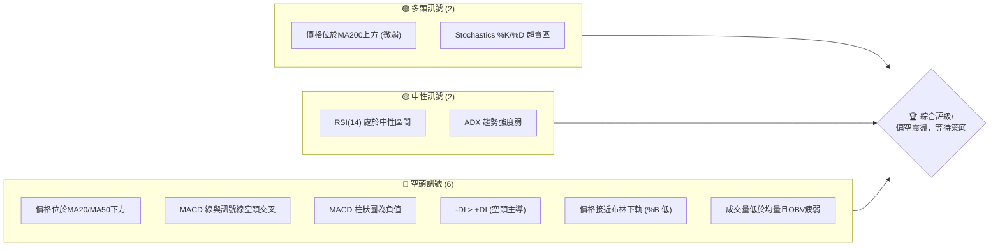
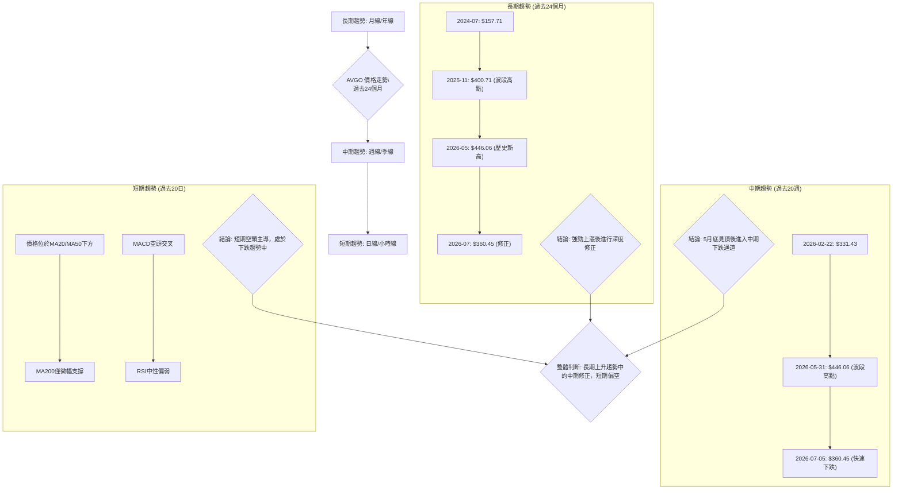
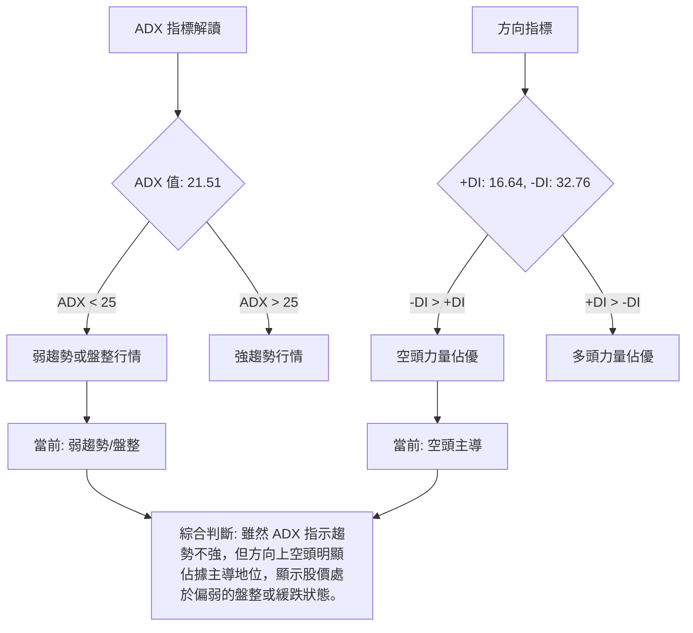
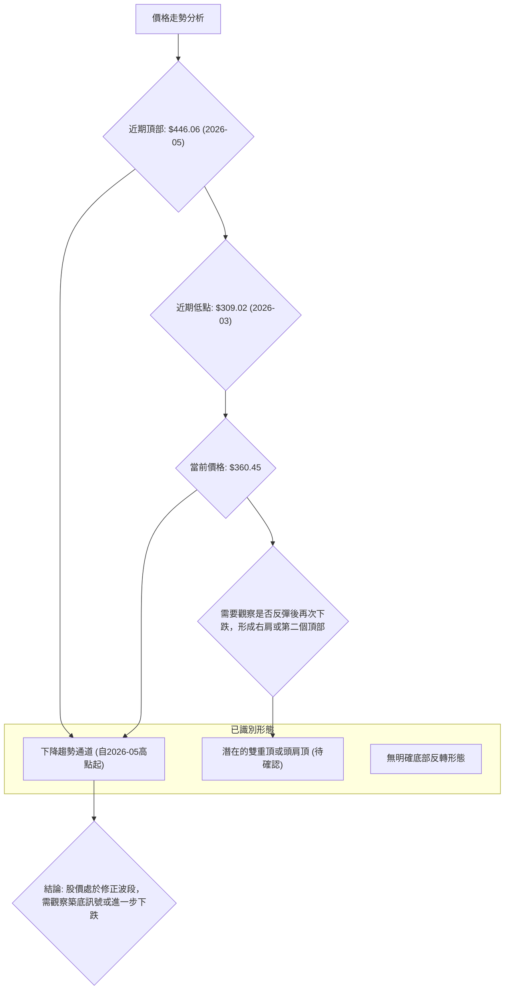
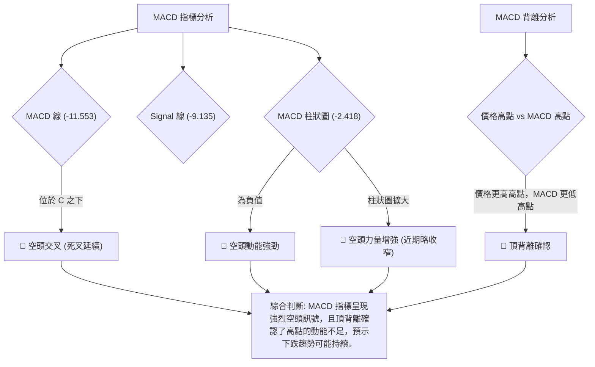
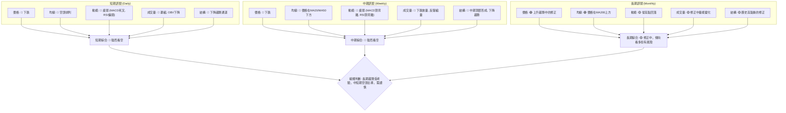
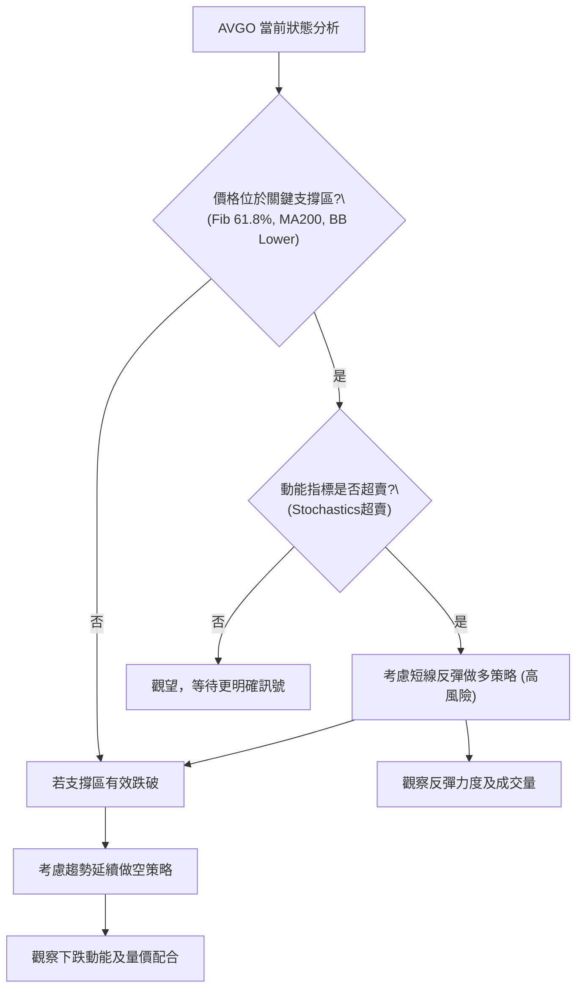
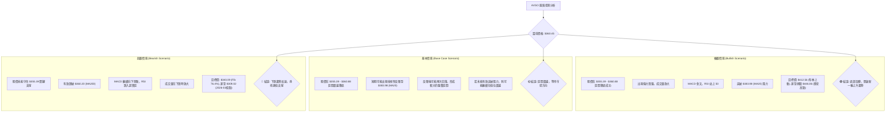

<details>
<summary>📊 靜態圖表 (點擊展開)</summary>

</details>

<html>
<head><meta charset="utf-8" /></head>
<body>
    <div style="height:500px; width:100%;">                        <script>window.PlotlyConfig = {MathJaxConfig: 'local'};</script>
        <script charset="utf-8" src="https://cdn.plot.ly/plotly-3.6.0.min.js" integrity="sha256-QaOVwtVY0T02VaHrr6pnoHLCwayMJp4O5n4YyaE3rJk=" crossorigin="anonymous"></script>                <div id="candlestick-chart" class="plotly-graph-div" style="height:100%; width:100%;"></div>            <script>                window.PLOTLYENV=window.PLOTLYENV || {};                                if (document.getElementById("candlestick-chart")) {                    Plotly.newPlot(                        "candlestick-chart",                        [{"close":{"dtype":"f8","bdata":"AAAAQBpWdkAAAADAbnp1QAAAAIBobXVAAAAAQOVmdUAAAACAbg51QAAAAIDREHVAAAAAgLQWdUAAAACgoeN0QAAAAMCmynRAAAAAoClhdEAAAACgJIF0QAAAAGCDuHRAAAAAwLkEdUAAAACgvwd1QAAAAADt2XRAAAAAQJDodEAAAABgMXl1QAAAAECOcXVAAAAAYCItdEAAAADgZCt2QAAAACBlY3VAAAAA4PPVdUAAAABA0gJ2QAAAAKAhtnVAAAAAALO0dUAAAACgAUx1QAAAAOB0JnVAAAAA4PBldUAAAADggAJ2QAAAAGCEgHZAAAAAgEMud0AAAACAQ\u002f13QAAAAKDzZXdAAAAAIB\u002f5dkAAAAAAeYh2QAAAAKCo33VAAAAAwKtPdkAAAADAuxl2QAAAAAC5t3VAAAAAwEhGdkAAAAAg+t91QAAAAMDYE3ZAAAAAgF0hdUAAAAAA00h1QAAAAMDYS3VAAAAAgKMpdUAAAAAAHgd2QAAAAAAyjnVAAAAAoN0kdUAAAACAqH13QAAAAOAl7ndAAAAAgKu1eEAAAADgbQt5QAAAAMDa\u002fndAAAAA4Bi3d0AAAACA0qd3QAAAAECBrndAAAAAIAtBeEAAAADg1e14QAAAAKBpQHlAAAAAgLKqeUAAAABgr0F5QAAAAEDJXnZAAAAAAKkedUAAAAAAXjZ1QAAAAOA\u002fQ3RAAAAAYKqAdEAAAAAgaSd1QAAAAEAmQ3VAAAAAYJvAdUAAAABA9M51QAAAAOBm7XVAAAAAILnBdUAAAABADsl1QAAAAKBGjXVAAAAAoIGldUAAAADAjWJ1QAAAAAAiaHVAAAAAINRjdUAAAADgJ7R0QAAAAEBDe3VAAAAAYK3udUAAAACg7xR2QAAAAABIKnVAAAAAQC1cdUAAAADgtOZ1QAAAAKARtnRAAAAA4H15dEAAAADguUR0QAAAAGAB7nNAAAAAIIY6dEAAAAAAGbl0QAAAAGBFwHRAAAAAQEKYdEAAAABgWKF0QAAAAOBQnnRAAAAAIHjyc0AAAADAtS5zQAAAACDtVXNAAAAAoCu7dEAAAADA12p1QAAAAGAMM3VAAAAAQAhYdUAAAADgRZ90QAAAACCgP3RAAAAAwBy1dEAAAABAk8R0QAAAACA6zHRAAAAAoN22dEAAAACgCpJ0QAAAAOC5RHRAAAAAIHKxdEAAAAAgTwh0QAAAAAAJ5nNAAAAA4GXac0AAAADAAotzQAAAAIDVxXNAAAAAQMe4dEAAAAAARpR0QAAAAECyh3VAAAAAgClVdUAAAADgD0V1QAAAAIDK63RAAAAAYKQPdEAAAADgozt0QAAAAIAXAnRAAAAAwFOsc0AAAACAqOpzQAAAACDtVXNAAAAAoAEgdEAAAADAl9xzQAAAAEDm5HNAAAAAoOVOc0AAAAAgR8NyQAAAAEAkT3JAAAAAwFVQc0AAAAAA6o9zQAAAAODYoHNAAAAAIO6ec0AAAACAE9d0QAAAACA34XVAAAAAQJYldkAAAADgZy93QAAAACBmsndAAAAAQNrCd0AAAABgfcF4QAAAACBy3XhAAAAAoFxeeUAAAADg+e94QAAAAGCNGHlAAAAAwLZfekAAAABAbDR6QAAAAMB4YXpAAAAAgKAYekAAAADAK\u002fN4QAAAAADzTHlAAAAAgFMMekAAAAAg1El6QAAAAEB4\u002fXlAAAAAgPSqekAAAACgSIx6QAAAAICHvnlAAAAA4CDVekAAAABADLx6QAAAAOAyKnpAAAAAQBoCekAAAABghXF7QAAAAEBKiHpAAAAAILlAekAAAAAguqZ5QAAAACCZEXpAAAAAgKPeeUAAAAAAxdd5QAAAAKB9VXpAAAAAABhTekAAAACgfp56QAAAAEAG4XtAAAAAAOSzfEAAAADg8Qx+QAAAAGCQ531AAAAAAPgjekAAAACA7RF4QAAAAKCSv3hAAAAAIKV4eEAAAABAMTh3QAAAACBfD3hAAAAA4HXXd0AAAACAFJV4QAAAAODVgXdAAAAAYHeEeEAAAABAM6t5QAAAAIAUgnhAAAAAYGbCd0AAAADAHuF3QAAAAGCPrndAAAAA4FHQdkAAAABAM0d3QAAAAAAAnHdAAAAAoHAVd0AAAABAM4d2QA=="},"high":{"dtype":"f8","bdata":"AKA2+XqwdkCUp62q\u002fVR2QP\u002fxA7tiwnVA61z7PwV8dUCEoJ4gz4t1QHdfmga9dHVA8ZeCzPQidUCzBpsC0QJ1QKgG2aMLE3VAkZKD1WMydUCAwVr6R5N0QOtgRwkRAXVAztXMvsOadUBfod3asGd1QCJWwkdlY3VA0hXvkZwDdUB3wJGCvYl1QJ0gGdr9lXVAVvr4slbKdUCG\u002fuzyCFZ2QAtAd7Zzy3VAuUWNaVpWdkDvog1hc5N2QE7qabA50HVAcAc62aQpdkBnbQA4S9J1QEoLvSEhoXVAkOOGtDeKdUA5yB\u002fw2UR2QPRLZqWni3ZArPV+Pps\u002fd0BKzzAWOAV4QKHyMzXyA3hAnlBZmVeLd0A3TMkbLUx3QEaAwVdN7nZADGXjrGKtdkBtvTqRlpd2QDSNCQVkCHZAyQL2f+ZfdkBrjS7V+H12QIHYGM\u002frTXZAEur4XUb5dUCCS7PUGW11QCNIxqDL43VAjEX9G36gdUAEGZeT91p2QDeUffe+X3dA8B+eQYSqdUDR9Ykn8L13QIwfn7x4H3hAiy2nv0PaeEA8XzTWEAx5QMK7pEx2k3hAtxVZzul0eEDpXlIstsJ3QERJLJcC3HdARtls5mN1eEBDOQrUUlB5QF2YK2SYSnlA8nimcMrEeUBInx6+TXB5QIPEJTfwvXdAB2uRubh\u002fdkAC2Ga5A5l1QP8I737ainVA6QBtXYTidED6M9NWk1h1QPBZFf6Bj3VAZILIPzPNdUCCyB\u002fwCfl1QEdptolB\u002f3VADgiSHrXQdUBoScdUK\u002fZ1QOvGpqyIyXVAd841d2F1dkDsFaW3oRt2QKFhRoBNvHVAbZVkK6rGdUCEv8egsmZ1QGpnzz7XoXVA4DgkOJ4JdkBUP3nDumJ2QOWpWWVy1nVALHxLgVjGdUDHuEmoVxN2QN\u002fQrPMdgnVA9Jq6pBTpdEBhaor+DPx0QCsk53XuDHRACd1nLJR3dECq5XyCgNh0QLdi1ObfK3VA3qYN53jrdEDDLewlVw91QNgP87U57XRAgHeZtn8adUBJc+W3ZeVzQLkRMixOVXRAtptW+1PcdED4fr\u002fYv\u002fB1QPJ\u002f\u002fVK5q3VAg77AwM+edUAzxTwTTpB1QCk98vJ80XRAd35jnkjodEAHU\u002fwNPQp1QOL5WHoqE3VA2RZ7msktdUAJWKhUHxR1QH\u002fpRTuucXRAuQ6KodXqdED9eKMjGlZ0QADqKnw17XNAvATWqNjtc0AF40T1h6tzQGoGl05LF3RAcyBvgy7udEDKGIn+\u002fGN1QEtiGw9gs3VAT2lVn4D9dUDyCnMip4h1QNwcFflSKXVA1fZ30UARdUDNLLlo3n90QGG0AtnPY3RADF5DyO1DdEBO2O4vViF0QFl0RcNHBXRAHDQXDm1fdEA\u002fkQi0Mj50QNmxS7eZPHRAo8qeFLXGc0BmUKy7OTBzQK53rDidBHNAv9Z8Uh1dc0CB8BT9p7RzQOrKAXgVo3NASenSf2a+c0ApPsKV89l0QBTcQGhJGXZA238wmCFidkAbliODR393QNda13AhxHdAjoeIitDad0BR+4WLPcd4QN4DK2vG8HhA+uIupWVheUBZLyTNcVx5QKzFmV5lL3lAi0+iEIBoekAqJ6UaG8p6QLlHg0BBhXpAbYX9zE9hekALhHQrs1J5QD00LQX8T3lAPPDnmYAbekDhyU1kBWh6QAG9tm6QcnpAF3rMeEgLe0AILRZn0E97QKXY8ZYOnXpAZU1ZgwAle0BjLbWWbw97QOLRYMSVynpAFBlB934fekAMWrZdk5p7QPq6Km4EAntAmCT1lX1VekA5hjcYohR6QH50LgP\u002fd3pAqDPRClNZekAhuuaiODV6QK7kIkv0KXtAK2bHcNsBe0DwgnwvBNB6QLkSyPYMA3xA+03PRQQVfUCm81\u002fzwoB+QK0rUS58435AdafkwOWcekDlDVMNn515QGVMjzxBI3lAe\u002fA6kZtzeUBkz32jNBN4QE9XGfAmTnhAJQZiavIFeEAPG0vfLrl4QEIHEgW8cnhAyc3JNkUAeUCf8SojxMB5QAAAAIA96nlAAAAA4FFweEAAAAAA10t4QAAAAMDMTHhAAAAAQApbd0AAAAAgXIN3QAAAAIDruXdAAAAAAABcd0AAAAAAAGB3QA=="},"hovertemplate":"\u003cb\u003e%{x|%Y-%m-%d}\u003c\u002fb\u003e\u003cbr\u003e\u958b: $%{open:.2f}\u003cbr\u003e\u9ad8: $%{high:.2f}\u003cbr\u003e\u4f4e: $%{low:.2f}\u003cbr\u003e\u6536: $%{close:.2f}\u003cextra\u003e\u003c\u002fextra\u003e","low":{"dtype":"f8","bdata":"zUzy7UomdkCQi9uCQTB1QCdiPjqhVHVAkgkxy7nfdEBuhRJH6AB1QH2\u002fqvNE8nRA0AKsCzK\u002fdEBqGLyfnVd0QCHRJ6rNi3RAbh1G\u002fZdbdEAKmVi70Cx0QDpViM0QK3RAlQ+8YRvWdEAoX8wo5910QAA2cvogy3RAUaj+4ihMdECuJA3iQqx0QNRfazUMKHVA0wVc3ecjdED8TRtcsFl1QO4RoEMdHHVAPhIsrQOZdUDSEYc\u002frbh1QBj5sAoYLnVA\u002f6UOlWyedUATS+XQhjZ1QCOPs3Y+2nRANBXQKwwodUB23dMPy851QH9M\u002fVmeEXZAa1g2jyeIdkBHyu6TwzF3QJB3bZH2\u002f3ZAjUV6pwuxdkAMXLViZ392QC1aB9Wz0HVA4UZLLjnCdUCD44z96Ot1QEZr4TE\u002f9nRAhMXPCCQKdkDZhqelirt1QGXYMq6F23VA8JgDmsPEdEDC\u002fZt\u002fnnN0QOvcF1o5+nRAaAy3Zz7adEAx4f7Crf50QJHGo+8ZdHVATYeP3jafdEAKKgNnj5t1QLKlyCPaGndAgR3DZvzRd0BsRAaFJa94QHd+nB5D73dACYOIocaad0CPiRa6WQl3QNydQvjnZndA+RgHsA7wd0A2o20V97J4QOm7T9LklHhAOrExOlXVeEA1wrsn5H94QMiKhXy7EnZAljFOwBD6dEBxFzdwFdN0QEPUuGAP+nNAOj76CjkddECl9PDXn6t0QImN67a3\u002f3RA636jjsIUdUCPQzXt2p11QFkfZTiUp3VAKSy8h8x2dUD7vr+kScB1QM+79JhvgnVAOl\u002fz16qEdUALL0VnPfR0QFeEa90mDHVA9xhhLVvqdEATlhaEl5R0QOhoM41qxHRAnAxCxS07dUDwsT8f9Nl1QF6svRoV03RA8\u002f5QC6hGdUAgNBenmGx1QIf918ZQqXRA+QjbhikwdEAbqv1kKTt0QDSmF2xQj3NA3ShrHfPGc0AAY8+9HV10QI086PADWHRAm11qGKzxc0DpRsPl\u002f3F0QGWG0\u002fPeSHRAYL6mdUY4c0CXkZtsdWNyQOcpgqYwGXNAoU\u002fW2Dmyc0CVnWaq+5Z0QB5MHMV7KXVAjVtW2T3IdEB3thZ0m4V0QBciSTf5N3RA1739nGKyc0DutLPIdmB0QNIe0CqFh3RAkSnRBu2FdECDgik3BEJ0QKyNExe8lHNAWjTQzCSBdEAetUwhzCxzQLCSSdDLTXNATABzDykhc0Cb5JVPWSRzQBoVTKqIaXNAvGaMrIIddEC+t1SNLGN0QHuvLJbBJnRACndkYsk4dUCpInWcqA91QOV2kkyxr3RA9CFkOQEEdEDflG5PKu5zQBfdrchewXNAxqN39kSmc0CKW5gyCzZzQMk9j16FTHNAx5Fb7+qmc0BvOIPUeqVzQCdPCyeDw3NAP\u002fk+PudKc0Dclw0XXaZyQNRnnlQHGHJAMy2anfJ9ckAgDEKb1F9zQBuNjPhe1HJA0LVLnKJcc0CtqkPlqRR0QCgz7ezRX3VAL3cq8hzvdUC\u002fgUdT\u002f4N2QEU2kbhWDndAllUb\u002fpp7d0BO0PIqXw94QMqUNDyue3hAxeMED9ryeECBu4bkY7R4QFC5r\u002fAkn3hAUViUBYZDeUDbldaZPBJ6QBaQPjdsg3lAt0BA25jfeUCRiPUGbKB4QO07ur1ywnhAqnVPz3U5eUCkAcHnB8p5QFap0DwgjnlA8pvLd\u002f8qekCjCyjU6hF6QPKfaQSHWnlAiTvibojVeUDzoYGgDYZ6QLlz+fs7fHlAyfygupBCeUATh+DB7u55QP3D5qIvMnpAr\u002fLxiHHbeUDpAbeYf1N5QJCO0ohRrHlAGeOzF5+deUBQ8dYP\u002fZh5QNbKIA11BXpAWlznQU\u002f9eUBMpKdbsdV5QM9VpYac7HpAfEO84laYe0AsvVYod1t9QEWLIGdKfn1AJqZ1ifgleUDcXP\u002fnsA94QD7YD5u0a3hA0o1iq+obd0DSAO8EVil3QEBdzVduH3dA+AmN8HeGd0AnWxFwxj94QEw0PX7XfXdASL6Jt7ngd0CeAbrD1Et5QAAAAGCPfnhAAAAAYI+Kd0AAAAAgXI93QAAAAEAzS3dAAAAAoEe9dkAAAAAgXId2QAAAAIA9KndAAAAA4HoAd0AAAABA4UZ2QA=="},"name":"\u50f9\u683c","open":{"dtype":"f8","bdata":"ACBcuFmsdkAFx+M31kN2QOOGElZEt3VAgurwA0pidUATFH3JWEh1QJ2VeZOAJXVAmrNRet0ddUCWlqv9JbJ0QIADsu3K+HRAq\u002fFOWwridEC4O+P0e4R0QGQhftwjZXRAztXMvsOadUDF32GtjDl1QKPOJI\u002fE4HRASCj6mG3ydEBFHZ69Wr90QHzzGrYrfXVAwNHSf3F3dUC5yOA13ex1QDh9FircwnVAIYvLsukHdkB00U4i\u002fCx2QEW5zBuWunVAUqgGqUD9dUDzUf+zysB1QJEc0hbVlXVANBXQKwwodUAOxapauuh1QEYQHyRneHZAsj9PIZaJdkBHyu6TwzF3QKHyMzXyA3hARd1uR5eCd0AktQqK1B53QA4w+gxaSHZADq5Ay\u002fPOdUBQjxBzpmF2QG3th1h1A3ZAl6p2z3w+dkDMiH4cg092QLwpKSG3QHZAYRfyNe7ZdUCSc57c9pl0QOZCh7nRHnVA35cYHplUdUAz6rW1+ix1QJFTNW9dv3ZAYlewh8hzdUDXtemNrJx1QMnMZoiO7HdAF6zo4Gv2d0CR2XHH\u002fdF4QK5riY9kinhAO\u002fhyBlYieEDez4DsHZ53QMXjTJ3vqHdA4qBqZ0kAeEAbKcrfygN5QHfcAt1xyHhAEoUad1b\u002feEDiN0mnLil5QCBpMeh6nXdAH3dIvPh9dkA0iWCmW+J0QP8I737ainVAuJy6LAridED6A61+t7d0QD7FOAYpjHVArg+gTvI4dUCy+TdPctZ1QPP46DVY3HVA6mOC0gq3dUBksTLy98p1QFFm540kx3VA\u002fLmZbcP3dUBk1rkzAhd2QBH\u002fKk5sZXVAg2A2byJHdUCL\u002fWnIWVh1QJ3dM3vgCnVAnAxCxS07dUBYysShW\u002fl1QM9nmSAHu3VAjyxrLGu9dUDuo4pn\u002fI91QJJ1or5kbXVAcyuzQHXkdECoaPpF6OF0QPLFX6YM4nNAnQjaKgXqc0BAe+Ssy4h0QNMkBqqzGXVA52lgXW61dEAOhcO8hLN0QOCGbQqcTnRACr05zxD4dEBJc+W3ZeVzQPSykCz7knNAJmjFmM3uc0At9plc5Zh0QPOSM5Edo3VAeNY8RG+YdUBZWIvOFml1QM+yZwU7inRAdpabcxvoc0Cp46wb+IR0QIEPaNuavHRA3H0WHD6ydEAOs3NJfbB0QDES7hizFXRArSka+mqYdEDEmXa301R0QN4eWor0WHNAscDP1pdDc0BJU6DAnn1zQKqRkq9XqHNAHy2nj32PdEAaOqrSM3F0QHYzhl3IYHRAjClmizO3dUCzsZVqUlV1QA04TsQBCHVAVwmE8AwHdUAHGtLWLE10QA\u002fpXtoHSXRA4MKHGRD0c0C7M97KK3VzQM8spSgf73NAtsam0PXXc0DSTp\u002fO6PdzQFqvr6hIIXRAqArqWWGYc0BuzrpUMilzQK7J5xZQxnJAB576v6uuckCwItJG\u002f41zQC4ZmzwkAHNA93QejP6oc0BmuGVca2N0QFTERmAb83VAwqqihOT7dUBiZHMM6oV2QGFeVc42EXdAk6caZNiUd0D62YIFOVR4QKvRb3UDpnhA82r+oEMEeUA06ClW8VB5QCNgJT127HhAd5vA7GNleUCBFoWkj1t6QGwOooHvhHpAytEzngw9ekCRB6bE1vp4QHOqD1\u002fMLXlADgm5fNDteUA5xqTw8eZ5QEVfEz7yGHpA6cZXROZPekDD3smf8i17QJNXypB0UnpAsma1pC8yekA+kCC+G696QOPF26QsbHpAZFbPd3LyeUA\u002fC\u002fLgJAF6QPq6Km4EAntA8oog2OdLekAGGC43wpJ5QMtbvemFwnlAoukYGljOeUDpuETRSA16QDHnw1drHXpAWp8ZeV+GekA3TbC1l0d6QDIGaBJBBHtA8HSacg8WfEA4iBRFSIB+QLuu13r4335A7bfx1H+FeUAha\u002fBBdG95QM0JGIm9H3lAIwTLFZsPeUDsDtzIWs53QIyPb6axQ3dAVmEbktHxd0CpfpYWKa54QPf3Fn9+WXhAOQOLPohBeEBRNcG07I55QAAAAGCP2nlAAAAAgOudd0AAAACA6yl4QAAAAKBHKXhAAAAAQDMnd0AAAACA61l3QAAAAOCjbHdAAAAAgOs9d0AAAAAgrtt2QA=="},"x":["2025-09-16T00:00:00-04:00","2025-09-17T00:00:00-04:00","2025-09-18T00:00:00-04:00","2025-09-19T00:00:00-04:00","2025-09-22T00:00:00-04:00","2025-09-23T00:00:00-04:00","2025-09-24T00:00:00-04:00","2025-09-25T00:00:00-04:00","2025-09-26T00:00:00-04:00","2025-09-29T00:00:00-04:00","2025-09-30T00:00:00-04:00","2025-10-01T00:00:00-04:00","2025-10-02T00:00:00-04:00","2025-10-03T00:00:00-04:00","2025-10-06T00:00:00-04:00","2025-10-07T00:00:00-04:00","2025-10-08T00:00:00-04:00","2025-10-09T00:00:00-04:00","2025-10-10T00:00:00-04:00","2025-10-13T00:00:00-04:00","2025-10-14T00:00:00-04:00","2025-10-15T00:00:00-04:00","2025-10-16T00:00:00-04:00","2025-10-17T00:00:00-04:00","2025-10-20T00:00:00-04:00","2025-10-21T00:00:00-04:00","2025-10-22T00:00:00-04:00","2025-10-23T00:00:00-04:00","2025-10-24T00:00:00-04:00","2025-10-27T00:00:00-04:00","2025-10-28T00:00:00-04:00","2025-10-29T00:00:00-04:00","2025-10-30T00:00:00-04:00","2025-10-31T00:00:00-04:00","2025-11-03T00:00:00-05:00","2025-11-04T00:00:00-05:00","2025-11-05T00:00:00-05:00","2025-11-06T00:00:00-05:00","2025-11-07T00:00:00-05:00","2025-11-10T00:00:00-05:00","2025-11-11T00:00:00-05:00","2025-11-12T00:00:00-05:00","2025-11-13T00:00:00-05:00","2025-11-14T00:00:00-05:00","2025-11-17T00:00:00-05:00","2025-11-18T00:00:00-05:00","2025-11-19T00:00:00-05:00","2025-11-20T00:00:00-05:00","2025-11-21T00:00:00-05:00","2025-11-24T00:00:00-05:00","2025-11-25T00:00:00-05:00","2025-11-26T00:00:00-05:00","2025-11-28T00:00:00-05:00","2025-12-01T00:00:00-05:00","2025-12-02T00:00:00-05:00","2025-12-03T00:00:00-05:00","2025-12-04T00:00:00-05:00","2025-12-05T00:00:00-05:00","2025-12-08T00:00:00-05:00","2025-12-09T00:00:00-05:00","2025-12-10T00:00:00-05:00","2025-12-11T00:00:00-05:00","2025-12-12T00:00:00-05:00","2025-12-15T00:00:00-05:00","2025-12-16T00:00:00-05:00","2025-12-17T00:00:00-05:00","2025-12-18T00:00:00-05:00","2025-12-19T00:00:00-05:00","2025-12-22T00:00:00-05:00","2025-12-23T00:00:00-05:00","2025-12-24T00:00:00-05:00","2025-12-26T00:00:00-05:00","2025-12-29T00:00:00-05:00","2025-12-30T00:00:00-05:00","2025-12-31T00:00:00-05:00","2026-01-02T00:00:00-05:00","2026-01-05T00:00:00-05:00","2026-01-06T00:00:00-05:00","2026-01-07T00:00:00-05:00","2026-01-08T00:00:00-05:00","2026-01-09T00:00:00-05:00","2026-01-12T00:00:00-05:00","2026-01-13T00:00:00-05:00","2026-01-14T00:00:00-05:00","2026-01-15T00:00:00-05:00","2026-01-16T00:00:00-05:00","2026-01-20T00:00:00-05:00","2026-01-21T00:00:00-05:00","2026-01-22T00:00:00-05:00","2026-01-23T00:00:00-05:00","2026-01-26T00:00:00-05:00","2026-01-27T00:00:00-05:00","2026-01-28T00:00:00-05:00","2026-01-29T00:00:00-05:00","2026-01-30T00:00:00-05:00","2026-02-02T00:00:00-05:00","2026-02-03T00:00:00-05:00","2026-02-04T00:00:00-05:00","2026-02-05T00:00:00-05:00","2026-02-06T00:00:00-05:00","2026-02-09T00:00:00-05:00","2026-02-10T00:00:00-05:00","2026-02-11T00:00:00-05:00","2026-02-12T00:00:00-05:00","2026-02-13T00:00:00-05:00","2026-02-17T00:00:00-05:00","2026-02-18T00:00:00-05:00","2026-02-19T00:00:00-05:00","2026-02-20T00:00:00-05:00","2026-02-23T00:00:00-05:00","2026-02-24T00:00:00-05:00","2026-02-25T00:00:00-05:00","2026-02-26T00:00:00-05:00","2026-02-27T00:00:00-05:00","2026-03-02T00:00:00-05:00","2026-03-03T00:00:00-05:00","2026-03-04T00:00:00-05:00","2026-03-05T00:00:00-05:00","2026-03-06T00:00:00-05:00","2026-03-09T00:00:00-04:00","2026-03-10T00:00:00-04:00","2026-03-11T00:00:00-04:00","2026-03-12T00:00:00-04:00","2026-03-13T00:00:00-04:00","2026-03-16T00:00:00-04:00","2026-03-17T00:00:00-04:00","2026-03-18T00:00:00-04:00","2026-03-19T00:00:00-04:00","2026-03-20T00:00:00-04:00","2026-03-23T00:00:00-04:00","2026-03-24T00:00:00-04:00","2026-03-25T00:00:00-04:00","2026-03-26T00:00:00-04:00","2026-03-27T00:00:00-04:00","2026-03-30T00:00:00-04:00","2026-03-31T00:00:00-04:00","2026-04-01T00:00:00-04:00","2026-04-02T00:00:00-04:00","2026-04-06T00:00:00-04:00","2026-04-07T00:00:00-04:00","2026-04-08T00:00:00-04:00","2026-04-09T00:00:00-04:00","2026-04-10T00:00:00-04:00","2026-04-13T00:00:00-04:00","2026-04-14T00:00:00-04:00","2026-04-15T00:00:00-04:00","2026-04-16T00:00:00-04:00","2026-04-17T00:00:00-04:00","2026-04-20T00:00:00-04:00","2026-04-21T00:00:00-04:00","2026-04-22T00:00:00-04:00","2026-04-23T00:00:00-04:00","2026-04-24T00:00:00-04:00","2026-04-27T00:00:00-04:00","2026-04-28T00:00:00-04:00","2026-04-29T00:00:00-04:00","2026-04-30T00:00:00-04:00","2026-05-01T00:00:00-04:00","2026-05-04T00:00:00-04:00","2026-05-05T00:00:00-04:00","2026-05-06T00:00:00-04:00","2026-05-07T00:00:00-04:00","2026-05-08T00:00:00-04:00","2026-05-11T00:00:00-04:00","2026-05-12T00:00:00-04:00","2026-05-13T00:00:00-04:00","2026-05-14T00:00:00-04:00","2026-05-15T00:00:00-04:00","2026-05-18T00:00:00-04:00","2026-05-19T00:00:00-04:00","2026-05-20T00:00:00-04:00","2026-05-21T00:00:00-04:00","2026-05-22T00:00:00-04:00","2026-05-26T00:00:00-04:00","2026-05-27T00:00:00-04:00","2026-05-28T00:00:00-04:00","2026-05-29T00:00:00-04:00","2026-06-01T00:00:00-04:00","2026-06-02T00:00:00-04:00","2026-06-03T00:00:00-04:00","2026-06-04T00:00:00-04:00","2026-06-05T00:00:00-04:00","2026-06-08T00:00:00-04:00","2026-06-09T00:00:00-04:00","2026-06-10T00:00:00-04:00","2026-06-11T00:00:00-04:00","2026-06-12T00:00:00-04:00","2026-06-15T00:00:00-04:00","2026-06-16T00:00:00-04:00","2026-06-17T00:00:00-04:00","2026-06-18T00:00:00-04:00","2026-06-22T00:00:00-04:00","2026-06-23T00:00:00-04:00","2026-06-24T00:00:00-04:00","2026-06-25T00:00:00-04:00","2026-06-26T00:00:00-04:00","2026-06-29T00:00:00-04:00","2026-06-30T00:00:00-04:00","2026-07-01T00:00:00-04:00","2026-07-02T00:00:00-04:00"],"type":"candlestick"},{"hovertemplate":"MA30: $%{y:.2f}\u003cextra\u003e\u003c\u002fextra\u003e","line":{"color":"#2196F3","dash":"dash","width":2},"mode":"lines","name":"MA30","x":["2025-09-16T00:00:00-04:00","2025-09-17T00:00:00-04:00","2025-09-18T00:00:00-04:00","2025-09-19T00:00:00-04:00","2025-09-22T00:00:00-04:00","2025-09-23T00:00:00-04:00","2025-09-24T00:00:00-04:00","2025-09-25T00:00:00-04:00","2025-09-26T00:00:00-04:00","2025-09-29T00:00:00-04:00","2025-09-30T00:00:00-04:00","2025-10-01T00:00:00-04:00","2025-10-02T00:00:00-04:00","2025-10-03T00:00:00-04:00","2025-10-06T00:00:00-04:00","2025-10-07T00:00:00-04:00","2025-10-08T00:00:00-04:00","2025-10-09T00:00:00-04:00","2025-10-10T00:00:00-04:00","2025-10-13T00:00:00-04:00","2025-10-14T00:00:00-04:00","2025-10-15T00:00:00-04:00","2025-10-16T00:00:00-04:00","2025-10-17T00:00:00-04:00","2025-10-20T00:00:00-04:00","2025-10-21T00:00:00-04:00","2025-10-22T00:00:00-04:00","2025-10-23T00:00:00-04:00","2025-10-24T00:00:00-04:00","2025-10-27T00:00:00-04:00","2025-10-28T00:00:00-04:00","2025-10-29T00:00:00-04:00","2025-10-30T00:00:00-04:00","2025-10-31T00:00:00-04:00","2025-11-03T00:00:00-05:00","2025-11-04T00:00:00-05:00","2025-11-05T00:00:00-05:00","2025-11-06T00:00:00-05:00","2025-11-07T00:00:00-05:00","2025-11-10T00:00:00-05:00","2025-11-11T00:00:00-05:00","2025-11-12T00:00:00-05:00","2025-11-13T00:00:00-05:00","2025-11-14T00:00:00-05:00","2025-11-17T00:00:00-05:00","2025-11-18T00:00:00-05:00","2025-11-19T00:00:00-05:00","2025-11-20T00:00:00-05:00","2025-11-21T00:00:00-05:00","2025-11-24T00:00:00-05:00","2025-11-25T00:00:00-05:00","2025-11-26T00:00:00-05:00","2025-11-28T00:00:00-05:00","2025-12-01T00:00:00-05:00","2025-12-02T00:00:00-05:00","2025-12-03T00:00:00-05:00","2025-12-04T00:00:00-05:00","2025-12-05T00:00:00-05:00","2025-12-08T00:00:00-05:00","2025-12-09T00:00:00-05:00","2025-12-10T00:00:00-05:00","2025-12-11T00:00:00-05:00","2025-12-12T00:00:00-05:00","2025-12-15T00:00:00-05:00","2025-12-16T00:00:00-05:00","2025-12-17T00:00:00-05:00","2025-12-18T00:00:00-05:00","2025-12-19T00:00:00-05:00","2025-12-22T00:00:00-05:00","2025-12-23T00:00:00-05:00","2025-12-24T00:00:00-05:00","2025-12-26T00:00:00-05:00","2025-12-29T00:00:00-05:00","2025-12-30T00:00:00-05:00","2025-12-31T00:00:00-05:00","2026-01-02T00:00:00-05:00","2026-01-05T00:00:00-05:00","2026-01-06T00:00:00-05:00","2026-01-07T00:00:00-05:00","2026-01-08T00:00:00-05:00","2026-01-09T00:00:00-05:00","2026-01-12T00:00:00-05:00","2026-01-13T00:00:00-05:00","2026-01-14T00:00:00-05:00","2026-01-15T00:00:00-05:00","2026-01-16T00:00:00-05:00","2026-01-20T00:00:00-05:00","2026-01-21T00:00:00-05:00","2026-01-22T00:00:00-05:00","2026-01-23T00:00:00-05:00","2026-01-26T00:00:00-05:00","2026-01-27T00:00:00-05:00","2026-01-28T00:00:00-05:00","2026-01-29T00:00:00-05:00","2026-01-30T00:00:00-05:00","2026-02-02T00:00:00-05:00","2026-02-03T00:00:00-05:00","2026-02-04T00:00:00-05:00","2026-02-05T00:00:00-05:00","2026-02-06T00:00:00-05:00","2026-02-09T00:00:00-05:00","2026-02-10T00:00:00-05:00","2026-02-11T00:00:00-05:00","2026-02-12T00:00:00-05:00","2026-02-13T00:00:00-05:00","2026-02-17T00:00:00-05:00","2026-02-18T00:00:00-05:00","2026-02-19T00:00:00-05:00","2026-02-20T00:00:00-05:00","2026-02-23T00:00:00-05:00","2026-02-24T00:00:00-05:00","2026-02-25T00:00:00-05:00","2026-02-26T00:00:00-05:00","2026-02-27T00:00:00-05:00","2026-03-02T00:00:00-05:00","2026-03-03T00:00:00-05:00","2026-03-04T00:00:00-05:00","2026-03-05T00:00:00-05:00","2026-03-06T00:00:00-05:00","2026-03-09T00:00:00-04:00","2026-03-10T00:00:00-04:00","2026-03-11T00:00:00-04:00","2026-03-12T00:00:00-04:00","2026-03-13T00:00:00-04:00","2026-03-16T00:00:00-04:00","2026-03-17T00:00:00-04:00","2026-03-18T00:00:00-04:00","2026-03-19T00:00:00-04:00","2026-03-20T00:00:00-04:00","2026-03-23T00:00:00-04:00","2026-03-24T00:00:00-04:00","2026-03-25T00:00:00-04:00","2026-03-26T00:00:00-04:00","2026-03-27T00:00:00-04:00","2026-03-30T00:00:00-04:00","2026-03-31T00:00:00-04:00","2026-04-01T00:00:00-04:00","2026-04-02T00:00:00-04:00","2026-04-06T00:00:00-04:00","2026-04-07T00:00:00-04:00","2026-04-08T00:00:00-04:00","2026-04-09T00:00:00-04:00","2026-04-10T00:00:00-04:00","2026-04-13T00:00:00-04:00","2026-04-14T00:00:00-04:00","2026-04-15T00:00:00-04:00","2026-04-16T00:00:00-04:00","2026-04-17T00:00:00-04:00","2026-04-20T00:00:00-04:00","2026-04-21T00:00:00-04:00","2026-04-22T00:00:00-04:00","2026-04-23T00:00:00-04:00","2026-04-24T00:00:00-04:00","2026-04-27T00:00:00-04:00","2026-04-28T00:00:00-04:00","2026-04-29T00:00:00-04:00","2026-04-30T00:00:00-04:00","2026-05-01T00:00:00-04:00","2026-05-04T00:00:00-04:00","2026-05-05T00:00:00-04:00","2026-05-06T00:00:00-04:00","2026-05-07T00:00:00-04:00","2026-05-08T00:00:00-04:00","2026-05-11T00:00:00-04:00","2026-05-12T00:00:00-04:00","2026-05-13T00:00:00-04:00","2026-05-14T00:00:00-04:00","2026-05-15T00:00:00-04:00","2026-05-18T00:00:00-04:00","2026-05-19T00:00:00-04:00","2026-05-20T00:00:00-04:00","2026-05-21T00:00:00-04:00","2026-05-22T00:00:00-04:00","2026-05-26T00:00:00-04:00","2026-05-27T00:00:00-04:00","2026-05-28T00:00:00-04:00","2026-05-29T00:00:00-04:00","2026-06-01T00:00:00-04:00","2026-06-02T00:00:00-04:00","2026-06-03T00:00:00-04:00","2026-06-04T00:00:00-04:00","2026-06-05T00:00:00-04:00","2026-06-08T00:00:00-04:00","2026-06-09T00:00:00-04:00","2026-06-10T00:00:00-04:00","2026-06-11T00:00:00-04:00","2026-06-12T00:00:00-04:00","2026-06-15T00:00:00-04:00","2026-06-16T00:00:00-04:00","2026-06-17T00:00:00-04:00","2026-06-18T00:00:00-04:00","2026-06-22T00:00:00-04:00","2026-06-23T00:00:00-04:00","2026-06-24T00:00:00-04:00","2026-06-25T00:00:00-04:00","2026-06-26T00:00:00-04:00","2026-06-29T00:00:00-04:00","2026-06-30T00:00:00-04:00","2026-07-01T00:00:00-04:00","2026-07-02T00:00:00-04:00"],"y":{"dtype":"f8","bdata":"AAAAAAAA+H8AAAAAAAD4fwAAAAAAAPh\u002fAAAAAAAA+H8AAAAAAAD4fwAAAAAAAPh\u002fAAAAAAAA+H8AAAAAAAD4fwAAAAAAAPh\u002fAAAAAAAA+H8AAAAAAAD4fwAAAAAAAPh\u002fAAAAAAAA+H8AAAAAAAD4fwAAAAAAAPh\u002fAAAAAAAA+H8AAAAAAAD4fwAAAAAAAPh\u002fAAAAAAAA+H8AAAAAAAD4fwAAAAAAAPh\u002fAAAAAAAA+H8AAAAAAAD4fwAAAAAAAPh\u002fAAAAAAAA+H8AAAAAAAD4fwAAAAAAAPh\u002fAAAAAAAA+H8AAAAAAAD4fxEREXGvTnVAREREBORVdUAiIiKCUWt1QCIiIvIifHVAZmZmRouJdUCamZk5JZZ1QDMzM0MKnXVAd3d353indUC8u7sbz7F1QN7d3R22uXVAIiIi0uHJdUCrqqqak9V1QERERIQn4XVAiYiI6BvidUCJiIg4R+R1QImIiFgT6HVAd3d3pz7qdUDe3d29+e51QCIiIiLu73VAvLu7GzD4dUARERGhdgN2QImIiLgnGXZAd3d3160xdkBVVVXlkEt2QImIiIgOX3ZAAAAAEDRwdkAAAACgVIR2QDMzM6PumXZAERERYU2ydkDNzMycNst2QAAAADCt4nZAZmZmFuT3dkC8u7t7tAJ3QN7d3c3u+XZAERERER7qdkBmZmbm2N52QM3MzKwZ0XZAIiIisqrBdkAAAADglrl2QN7d3R20tXZAd3d3Zz+xdkBEREQkrrB2QERERBRmr3ZAd3d3d760dkBVVVW1BLl2QJqZmQkzu3ZAq6qqClS\u002fdkBERETE17l2QHd3d\u002feSuHZAAAAAQKy6dkAiIiKy46J2QGZmZkb+jXZAMzMzI0t2dkCamZmpAl12QDMzM6PbRHZAd3d3t8IwdkAzMzNDyiF2QFVVVTVxCHZARERExDDodUARERGRa8B1QBEREbEBk3VAAAAA0JlkdUAiIiIi6j11QAAAAPAYMHVAvLu7C54rdUBERERkpiZ1QN7d3X2vKXVAVVVVFfIkdUDe3d1NHxR1QHd3d3euA3VAq6qqivf6dEAiIiJCofd0QKuqqgpr8XRAVVVVJeXtdEARERER+ON0QKuqqurY2HRA3t3djdXQdECJiIh4kct0QDMzMxNfxnRAAAAAIJvAdEBEREQEeL90QKuqqhoetXRAAAAAEIuqdEDv7u4+Dpl0QImIiFg\u002fjnRA3t3dXWOBdEBERETUQ210QDMzM9NBZXRA7+7u3l1ndEDNzMysBGp0QERERLSsd3RAzczMjBiBdECamZnpwoV0QImIiEg2h3RAzczMfKiCdECrqqqaRH90QN7d3X0PenRAIiIi8rh3dEBVVVXF\u002fH10QFVVVcX8fXRAREREtNB4dEDe3d1Nimt0QGZmZuZmYHRAERER4QdPdEDe3d0NKj90QERERGSdLnRARERE5LgidEC8u7v7bhh0QGZmZkZ0DnRA3t3dfR8FdEBmZmaWbAd0QO\u002fu7n4sFXRAmpmZGZQhdEAzMzNTezx0QERERNTkXHRAq6qqCj5+dECJiIiYuap0QAAAAMAt1nRAzczM3NT9dEBmZmaGBSN1QKuqqjpzQXVAAAAA8HdsdUDe3d2dlJZ1QN7d3X0rxXVAzczMXKv4dUAAAACg6yB2QDMzMxMVTnZAd3d3d3uEdkCamZnJ2rp2QBEREbGj83ZAZmZmlngrd0BEREQEh2R3QKuqqspylndAd3d396fWd0CamZmJrhp4QO\u002fu7o63XXhAVVVVtdeWeEDv7u6eGNp4QM3MzMwCFXlAIiIioppNeUCJiIi4qHZ5QImIiLhnmnlA3t3dbSy6eUAzMzMz2tB5QLy7u\u002fta53lAiYiI6Dr9eUCamZlZIQ16QM3MzHzZJnpA7+7u7kxDekDNzMzM7m56QO\u002fu7m73l3pAvLu7m\u002fmVekDv7u4uwoN6QM3MzBzUdXpAZmZmZvZnekARERFRMll6QCIiIlKcTnpAIiIiIsg7ekBmZmY2OS16QCIiIiIJGHpAERERoa8FekCrqqrqLv55QM3MzIyi83lAIiIiImnZeUAiIiLiC8F5QERERMTbq3lAq6qqWpmQeUBVVVUVDm15QM3MzKwcVHlAmpmZuRE5eUCJiIgYax55QA=="},"type":"scatter"},{"hovertemplate":"MA60: $%{y:.2f}\u003cextra\u003e\u003c\u002fextra\u003e","line":{"color":"#9C27B0","dash":"dash","width":2},"mode":"lines","name":"MA60","x":["2025-09-16T00:00:00-04:00","2025-09-17T00:00:00-04:00","2025-09-18T00:00:00-04:00","2025-09-19T00:00:00-04:00","2025-09-22T00:00:00-04:00","2025-09-23T00:00:00-04:00","2025-09-24T00:00:00-04:00","2025-09-25T00:00:00-04:00","2025-09-26T00:00:00-04:00","2025-09-29T00:00:00-04:00","2025-09-30T00:00:00-04:00","2025-10-01T00:00:00-04:00","2025-10-02T00:00:00-04:00","2025-10-03T00:00:00-04:00","2025-10-06T00:00:00-04:00","2025-10-07T00:00:00-04:00","2025-10-08T00:00:00-04:00","2025-10-09T00:00:00-04:00","2025-10-10T00:00:00-04:00","2025-10-13T00:00:00-04:00","2025-10-14T00:00:00-04:00","2025-10-15T00:00:00-04:00","2025-10-16T00:00:00-04:00","2025-10-17T00:00:00-04:00","2025-10-20T00:00:00-04:00","2025-10-21T00:00:00-04:00","2025-10-22T00:00:00-04:00","2025-10-23T00:00:00-04:00","2025-10-24T00:00:00-04:00","2025-10-27T00:00:00-04:00","2025-10-28T00:00:00-04:00","2025-10-29T00:00:00-04:00","2025-10-30T00:00:00-04:00","2025-10-31T00:00:00-04:00","2025-11-03T00:00:00-05:00","2025-11-04T00:00:00-05:00","2025-11-05T00:00:00-05:00","2025-11-06T00:00:00-05:00","2025-11-07T00:00:00-05:00","2025-11-10T00:00:00-05:00","2025-11-11T00:00:00-05:00","2025-11-12T00:00:00-05:00","2025-11-13T00:00:00-05:00","2025-11-14T00:00:00-05:00","2025-11-17T00:00:00-05:00","2025-11-18T00:00:00-05:00","2025-11-19T00:00:00-05:00","2025-11-20T00:00:00-05:00","2025-11-21T00:00:00-05:00","2025-11-24T00:00:00-05:00","2025-11-25T00:00:00-05:00","2025-11-26T00:00:00-05:00","2025-11-28T00:00:00-05:00","2025-12-01T00:00:00-05:00","2025-12-02T00:00:00-05:00","2025-12-03T00:00:00-05:00","2025-12-04T00:00:00-05:00","2025-12-05T00:00:00-05:00","2025-12-08T00:00:00-05:00","2025-12-09T00:00:00-05:00","2025-12-10T00:00:00-05:00","2025-12-11T00:00:00-05:00","2025-12-12T00:00:00-05:00","2025-12-15T00:00:00-05:00","2025-12-16T00:00:00-05:00","2025-12-17T00:00:00-05:00","2025-12-18T00:00:00-05:00","2025-12-19T00:00:00-05:00","2025-12-22T00:00:00-05:00","2025-12-23T00:00:00-05:00","2025-12-24T00:00:00-05:00","2025-12-26T00:00:00-05:00","2025-12-29T00:00:00-05:00","2025-12-30T00:00:00-05:00","2025-12-31T00:00:00-05:00","2026-01-02T00:00:00-05:00","2026-01-05T00:00:00-05:00","2026-01-06T00:00:00-05:00","2026-01-07T00:00:00-05:00","2026-01-08T00:00:00-05:00","2026-01-09T00:00:00-05:00","2026-01-12T00:00:00-05:00","2026-01-13T00:00:00-05:00","2026-01-14T00:00:00-05:00","2026-01-15T00:00:00-05:00","2026-01-16T00:00:00-05:00","2026-01-20T00:00:00-05:00","2026-01-21T00:00:00-05:00","2026-01-22T00:00:00-05:00","2026-01-23T00:00:00-05:00","2026-01-26T00:00:00-05:00","2026-01-27T00:00:00-05:00","2026-01-28T00:00:00-05:00","2026-01-29T00:00:00-05:00","2026-01-30T00:00:00-05:00","2026-02-02T00:00:00-05:00","2026-02-03T00:00:00-05:00","2026-02-04T00:00:00-05:00","2026-02-05T00:00:00-05:00","2026-02-06T00:00:00-05:00","2026-02-09T00:00:00-05:00","2026-02-10T00:00:00-05:00","2026-02-11T00:00:00-05:00","2026-02-12T00:00:00-05:00","2026-02-13T00:00:00-05:00","2026-02-17T00:00:00-05:00","2026-02-18T00:00:00-05:00","2026-02-19T00:00:00-05:00","2026-02-20T00:00:00-05:00","2026-02-23T00:00:00-05:00","2026-02-24T00:00:00-05:00","2026-02-25T00:00:00-05:00","2026-02-26T00:00:00-05:00","2026-02-27T00:00:00-05:00","2026-03-02T00:00:00-05:00","2026-03-03T00:00:00-05:00","2026-03-04T00:00:00-05:00","2026-03-05T00:00:00-05:00","2026-03-06T00:00:00-05:00","2026-03-09T00:00:00-04:00","2026-03-10T00:00:00-04:00","2026-03-11T00:00:00-04:00","2026-03-12T00:00:00-04:00","2026-03-13T00:00:00-04:00","2026-03-16T00:00:00-04:00","2026-03-17T00:00:00-04:00","2026-03-18T00:00:00-04:00","2026-03-19T00:00:00-04:00","2026-03-20T00:00:00-04:00","2026-03-23T00:00:00-04:00","2026-03-24T00:00:00-04:00","2026-03-25T00:00:00-04:00","2026-03-26T00:00:00-04:00","2026-03-27T00:00:00-04:00","2026-03-30T00:00:00-04:00","2026-03-31T00:00:00-04:00","2026-04-01T00:00:00-04:00","2026-04-02T00:00:00-04:00","2026-04-06T00:00:00-04:00","2026-04-07T00:00:00-04:00","2026-04-08T00:00:00-04:00","2026-04-09T00:00:00-04:00","2026-04-10T00:00:00-04:00","2026-04-13T00:00:00-04:00","2026-04-14T00:00:00-04:00","2026-04-15T00:00:00-04:00","2026-04-16T00:00:00-04:00","2026-04-17T00:00:00-04:00","2026-04-20T00:00:00-04:00","2026-04-21T00:00:00-04:00","2026-04-22T00:00:00-04:00","2026-04-23T00:00:00-04:00","2026-04-24T00:00:00-04:00","2026-04-27T00:00:00-04:00","2026-04-28T00:00:00-04:00","2026-04-29T00:00:00-04:00","2026-04-30T00:00:00-04:00","2026-05-01T00:00:00-04:00","2026-05-04T00:00:00-04:00","2026-05-05T00:00:00-04:00","2026-05-06T00:00:00-04:00","2026-05-07T00:00:00-04:00","2026-05-08T00:00:00-04:00","2026-05-11T00:00:00-04:00","2026-05-12T00:00:00-04:00","2026-05-13T00:00:00-04:00","2026-05-14T00:00:00-04:00","2026-05-15T00:00:00-04:00","2026-05-18T00:00:00-04:00","2026-05-19T00:00:00-04:00","2026-05-20T00:00:00-04:00","2026-05-21T00:00:00-04:00","2026-05-22T00:00:00-04:00","2026-05-26T00:00:00-04:00","2026-05-27T00:00:00-04:00","2026-05-28T00:00:00-04:00","2026-05-29T00:00:00-04:00","2026-06-01T00:00:00-04:00","2026-06-02T00:00:00-04:00","2026-06-03T00:00:00-04:00","2026-06-04T00:00:00-04:00","2026-06-05T00:00:00-04:00","2026-06-08T00:00:00-04:00","2026-06-09T00:00:00-04:00","2026-06-10T00:00:00-04:00","2026-06-11T00:00:00-04:00","2026-06-12T00:00:00-04:00","2026-06-15T00:00:00-04:00","2026-06-16T00:00:00-04:00","2026-06-17T00:00:00-04:00","2026-06-18T00:00:00-04:00","2026-06-22T00:00:00-04:00","2026-06-23T00:00:00-04:00","2026-06-24T00:00:00-04:00","2026-06-25T00:00:00-04:00","2026-06-26T00:00:00-04:00","2026-06-29T00:00:00-04:00","2026-06-30T00:00:00-04:00","2026-07-01T00:00:00-04:00","2026-07-02T00:00:00-04:00"],"y":{"dtype":"f8","bdata":"AAAAAAAA+H8AAAAAAAD4fwAAAAAAAPh\u002fAAAAAAAA+H8AAAAAAAD4fwAAAAAAAPh\u002fAAAAAAAA+H8AAAAAAAD4fwAAAAAAAPh\u002fAAAAAAAA+H8AAAAAAAD4fwAAAAAAAPh\u002fAAAAAAAA+H8AAAAAAAD4fwAAAAAAAPh\u002fAAAAAAAA+H8AAAAAAAD4fwAAAAAAAPh\u002fAAAAAAAA+H8AAAAAAAD4fwAAAAAAAPh\u002fAAAAAAAA+H8AAAAAAAD4fwAAAAAAAPh\u002fAAAAAAAA+H8AAAAAAAD4fwAAAAAAAPh\u002fAAAAAAAA+H8AAAAAAAD4fwAAAAAAAPh\u002fAAAAAAAA+H8AAAAAAAD4fwAAAAAAAPh\u002fAAAAAAAA+H8AAAAAAAD4fwAAAAAAAPh\u002fAAAAAAAA+H8AAAAAAAD4fwAAAAAAAPh\u002fAAAAAAAA+H8AAAAAAAD4fwAAAAAAAPh\u002fAAAAAAAA+H8AAAAAAAD4fwAAAAAAAPh\u002fAAAAAAAA+H8AAAAAAAD4fwAAAAAAAPh\u002fAAAAAAAA+H8AAAAAAAD4fwAAAAAAAPh\u002fAAAAAAAA+H8AAAAAAAD4fwAAAAAAAPh\u002fAAAAAAAA+H8AAAAAAAD4fwAAAAAAAPh\u002fAAAAAAAA+H8AAAAAAAD4f4mIiFCuGHZAVVVVDeQmdkDv7u7+Ajd2QAAAAOAIO3ZAvLu7q9Q5dkAAAAAQfzp2QAAAAPgRN3ZAzczMzJE0dkDe3d39sjV2QN7d3R21N3ZAzczMnJA9dkB3d3ffIEN2QERERMxGSHZAAAAAMG1LdkDv7u72pU52QBERETGjUXZAERERWclUdkARERHBaFR2QM3MzIxAVHZA3t3dLW5ZdkCamZkpLVN2QHd3d\u002f+SU3ZAVVVVffxTdkB3d3fHSVR2QN7d3RX1UXZAvLu7Y3tQdkCamZlxD1N2QEREROwvUXZAq6qqEj9NdkDv7u4W0UV2QImIiHDXOnZAMzMz8z4udkDv7u5OTyB2QO\u002fu7t4DFXZAZmZmDt4KdkBVVVWlvwJ2QFVVVZVk\u002fXVAvLu7Y07zdUDv7u4W2+Z1QKuqqkqx3HVAEREReRvWdUAzMzOzJ9R1QHd3d49o0HVAZmZmzlHRdUAzMzNjfs51QCIiIvoFynVAREREzBTIdUBmZmaetMJ1QFVVVQV5v3VAAAAAsKO9dUAzMzPbLbF1QImIiDCOoXVAmpmZGWuQdUBERER0CHt1QN7d3X2NaXVAq6qqChNZdUC8u7sLh0d1QERERITZNnVAmpmZUccndUDv7u4eOBV1QKuqqjJXBXVAZmZmLtnydEDe3d2F1uF0QERERJyn23RARERERCPXdEB3d3d\u002f9dJ0QN7d3X3f0XRAvLu7g1XOdECamZkJDsl0QGZmZp7VwHRAd3d3H+S5dEAAAADIlbF0QImIiPjoqHRAMzMzg3aedEB3d3cPkZF0QHd3dye7g3RAEREROcd5dEAiIiI6AHJ0QM3MzKxpanRA7+7uTt1idEBVVVVNcmN0QM3MzEwlZXRAzczMlA9mdEARERHJxGp0QGZmZhaSdXRAREREtNB\u002fdEBmZma2\u002fot0QJqZmcm3nXRA3t3dXZmydECamZkZhcZ0QHd3d\u002feP3HRAZmZmPsj2dEC8u7vDKw51QDMzM+MwJnVAzczM7Kk9dUBVVVUdGFB1QImIiEgSZHVAzczMNBp+dUB3d3fHa5x1QDMzMzvQuHVAVVVVpSTSdUARERGpCOh1QImIiNhs+3VARERE7NcSdkC8u7tL7Cx2QJqZmXkqRnZAzczMTMhcdkBVVVXNQ3l2QJqZmYm7kXZAAAAAEF2pdkB3d3enCr92QLy7uxvK13ZAvLu7Q+DtdkAzMzPDqgZ3QAAAAOgfIndAmpmZebw9d0ARERF57Vt3QGZmZp6DfndA3t3d5ZCgd0CamZkp+sh3QM3MzFS17HdA3t3dxTgBeEBmZmZmKw14QFVVVc1\u002fHXhAmpmZ4VAweECJiIj4Dj14QKuqqrJYTnhAzczMzCFgeEAAAAAACnR4QJqZmWnWhXhAvLu7G5SYeEB3d3f3WrF4QLy7u6sKxXhAzczMjAjYeEDe3d013e14QJqZmanJBHlAAAAAiLgTeUAiIiJakyN5QM3MzLyPNHlA3t3dLVZDeUCJiIjoiUp5QA=="},"type":"scatter"},{"hovertemplate":"MA200: $%{y:.2f}\u003cextra\u003e\u003c\u002fextra\u003e","line":{"color":"#FF6F00","dash":"solid","width":2},"mode":"lines","name":"MA200","x":["2025-09-16T00:00:00-04:00","2025-09-17T00:00:00-04:00","2025-09-18T00:00:00-04:00","2025-09-19T00:00:00-04:00","2025-09-22T00:00:00-04:00","2025-09-23T00:00:00-04:00","2025-09-24T00:00:00-04:00","2025-09-25T00:00:00-04:00","2025-09-26T00:00:00-04:00","2025-09-29T00:00:00-04:00","2025-09-30T00:00:00-04:00","2025-10-01T00:00:00-04:00","2025-10-02T00:00:00-04:00","2025-10-03T00:00:00-04:00","2025-10-06T00:00:00-04:00","2025-10-07T00:00:00-04:00","2025-10-08T00:00:00-04:00","2025-10-09T00:00:00-04:00","2025-10-10T00:00:00-04:00","2025-10-13T00:00:00-04:00","2025-10-14T00:00:00-04:00","2025-10-15T00:00:00-04:00","2025-10-16T00:00:00-04:00","2025-10-17T00:00:00-04:00","2025-10-20T00:00:00-04:00","2025-10-21T00:00:00-04:00","2025-10-22T00:00:00-04:00","2025-10-23T00:00:00-04:00","2025-10-24T00:00:00-04:00","2025-10-27T00:00:00-04:00","2025-10-28T00:00:00-04:00","2025-10-29T00:00:00-04:00","2025-10-30T00:00:00-04:00","2025-10-31T00:00:00-04:00","2025-11-03T00:00:00-05:00","2025-11-04T00:00:00-05:00","2025-11-05T00:00:00-05:00","2025-11-06T00:00:00-05:00","2025-11-07T00:00:00-05:00","2025-11-10T00:00:00-05:00","2025-11-11T00:00:00-05:00","2025-11-12T00:00:00-05:00","2025-11-13T00:00:00-05:00","2025-11-14T00:00:00-05:00","2025-11-17T00:00:00-05:00","2025-11-18T00:00:00-05:00","2025-11-19T00:00:00-05:00","2025-11-20T00:00:00-05:00","2025-11-21T00:00:00-05:00","2025-11-24T00:00:00-05:00","2025-11-25T00:00:00-05:00","2025-11-26T00:00:00-05:00","2025-11-28T00:00:00-05:00","2025-12-01T00:00:00-05:00","2025-12-02T00:00:00-05:00","2025-12-03T00:00:00-05:00","2025-12-04T00:00:00-05:00","2025-12-05T00:00:00-05:00","2025-12-08T00:00:00-05:00","2025-12-09T00:00:00-05:00","2025-12-10T00:00:00-05:00","2025-12-11T00:00:00-05:00","2025-12-12T00:00:00-05:00","2025-12-15T00:00:00-05:00","2025-12-16T00:00:00-05:00","2025-12-17T00:00:00-05:00","2025-12-18T00:00:00-05:00","2025-12-19T00:00:00-05:00","2025-12-22T00:00:00-05:00","2025-12-23T00:00:00-05:00","2025-12-24T00:00:00-05:00","2025-12-26T00:00:00-05:00","2025-12-29T00:00:00-05:00","2025-12-30T00:00:00-05:00","2025-12-31T00:00:00-05:00","2026-01-02T00:00:00-05:00","2026-01-05T00:00:00-05:00","2026-01-06T00:00:00-05:00","2026-01-07T00:00:00-05:00","2026-01-08T00:00:00-05:00","2026-01-09T00:00:00-05:00","2026-01-12T00:00:00-05:00","2026-01-13T00:00:00-05:00","2026-01-14T00:00:00-05:00","2026-01-15T00:00:00-05:00","2026-01-16T00:00:00-05:00","2026-01-20T00:00:00-05:00","2026-01-21T00:00:00-05:00","2026-01-22T00:00:00-05:00","2026-01-23T00:00:00-05:00","2026-01-26T00:00:00-05:00","2026-01-27T00:00:00-05:00","2026-01-28T00:00:00-05:00","2026-01-29T00:00:00-05:00","2026-01-30T00:00:00-05:00","2026-02-02T00:00:00-05:00","2026-02-03T00:00:00-05:00","2026-02-04T00:00:00-05:00","2026-02-05T00:00:00-05:00","2026-02-06T00:00:00-05:00","2026-02-09T00:00:00-05:00","2026-02-10T00:00:00-05:00","2026-02-11T00:00:00-05:00","2026-02-12T00:00:00-05:00","2026-02-13T00:00:00-05:00","2026-02-17T00:00:00-05:00","2026-02-18T00:00:00-05:00","2026-02-19T00:00:00-05:00","2026-02-20T00:00:00-05:00","2026-02-23T00:00:00-05:00","2026-02-24T00:00:00-05:00","2026-02-25T00:00:00-05:00","2026-02-26T00:00:00-05:00","2026-02-27T00:00:00-05:00","2026-03-02T00:00:00-05:00","2026-03-03T00:00:00-05:00","2026-03-04T00:00:00-05:00","2026-03-05T00:00:00-05:00","2026-03-06T00:00:00-05:00","2026-03-09T00:00:00-04:00","2026-03-10T00:00:00-04:00","2026-03-11T00:00:00-04:00","2026-03-12T00:00:00-04:00","2026-03-13T00:00:00-04:00","2026-03-16T00:00:00-04:00","2026-03-17T00:00:00-04:00","2026-03-18T00:00:00-04:00","2026-03-19T00:00:00-04:00","2026-03-20T00:00:00-04:00","2026-03-23T00:00:00-04:00","2026-03-24T00:00:00-04:00","2026-03-25T00:00:00-04:00","2026-03-26T00:00:00-04:00","2026-03-27T00:00:00-04:00","2026-03-30T00:00:00-04:00","2026-03-31T00:00:00-04:00","2026-04-01T00:00:00-04:00","2026-04-02T00:00:00-04:00","2026-04-06T00:00:00-04:00","2026-04-07T00:00:00-04:00","2026-04-08T00:00:00-04:00","2026-04-09T00:00:00-04:00","2026-04-10T00:00:00-04:00","2026-04-13T00:00:00-04:00","2026-04-14T00:00:00-04:00","2026-04-15T00:00:00-04:00","2026-04-16T00:00:00-04:00","2026-04-17T00:00:00-04:00","2026-04-20T00:00:00-04:00","2026-04-21T00:00:00-04:00","2026-04-22T00:00:00-04:00","2026-04-23T00:00:00-04:00","2026-04-24T00:00:00-04:00","2026-04-27T00:00:00-04:00","2026-04-28T00:00:00-04:00","2026-04-29T00:00:00-04:00","2026-04-30T00:00:00-04:00","2026-05-01T00:00:00-04:00","2026-05-04T00:00:00-04:00","2026-05-05T00:00:00-04:00","2026-05-06T00:00:00-04:00","2026-05-07T00:00:00-04:00","2026-05-08T00:00:00-04:00","2026-05-11T00:00:00-04:00","2026-05-12T00:00:00-04:00","2026-05-13T00:00:00-04:00","2026-05-14T00:00:00-04:00","2026-05-15T00:00:00-04:00","2026-05-18T00:00:00-04:00","2026-05-19T00:00:00-04:00","2026-05-20T00:00:00-04:00","2026-05-21T00:00:00-04:00","2026-05-22T00:00:00-04:00","2026-05-26T00:00:00-04:00","2026-05-27T00:00:00-04:00","2026-05-28T00:00:00-04:00","2026-05-29T00:00:00-04:00","2026-06-01T00:00:00-04:00","2026-06-02T00:00:00-04:00","2026-06-03T00:00:00-04:00","2026-06-04T00:00:00-04:00","2026-06-05T00:00:00-04:00","2026-06-08T00:00:00-04:00","2026-06-09T00:00:00-04:00","2026-06-10T00:00:00-04:00","2026-06-11T00:00:00-04:00","2026-06-12T00:00:00-04:00","2026-06-15T00:00:00-04:00","2026-06-16T00:00:00-04:00","2026-06-17T00:00:00-04:00","2026-06-18T00:00:00-04:00","2026-06-22T00:00:00-04:00","2026-06-23T00:00:00-04:00","2026-06-24T00:00:00-04:00","2026-06-25T00:00:00-04:00","2026-06-26T00:00:00-04:00","2026-06-29T00:00:00-04:00","2026-06-30T00:00:00-04:00","2026-07-01T00:00:00-04:00","2026-07-02T00:00:00-04:00"],"y":{"dtype":"f8","bdata":"AAAAAAAA+H8AAAAAAAD4fwAAAAAAAPh\u002fAAAAAAAA+H8AAAAAAAD4fwAAAAAAAPh\u002fAAAAAAAA+H8AAAAAAAD4fwAAAAAAAPh\u002fAAAAAAAA+H8AAAAAAAD4fwAAAAAAAPh\u002fAAAAAAAA+H8AAAAAAAD4fwAAAAAAAPh\u002fAAAAAAAA+H8AAAAAAAD4fwAAAAAAAPh\u002fAAAAAAAA+H8AAAAAAAD4fwAAAAAAAPh\u002fAAAAAAAA+H8AAAAAAAD4fwAAAAAAAPh\u002fAAAAAAAA+H8AAAAAAAD4fwAAAAAAAPh\u002fAAAAAAAA+H8AAAAAAAD4fwAAAAAAAPh\u002fAAAAAAAA+H8AAAAAAAD4fwAAAAAAAPh\u002fAAAAAAAA+H8AAAAAAAD4fwAAAAAAAPh\u002fAAAAAAAA+H8AAAAAAAD4fwAAAAAAAPh\u002fAAAAAAAA+H8AAAAAAAD4fwAAAAAAAPh\u002fAAAAAAAA+H8AAAAAAAD4fwAAAAAAAPh\u002fAAAAAAAA+H8AAAAAAAD4fwAAAAAAAPh\u002fAAAAAAAA+H8AAAAAAAD4fwAAAAAAAPh\u002fAAAAAAAA+H8AAAAAAAD4fwAAAAAAAPh\u002fAAAAAAAA+H8AAAAAAAD4fwAAAAAAAPh\u002fAAAAAAAA+H8AAAAAAAD4fwAAAAAAAPh\u002fAAAAAAAA+H8AAAAAAAD4fwAAAAAAAPh\u002fAAAAAAAA+H8AAAAAAAD4fwAAAAAAAPh\u002fAAAAAAAA+H8AAAAAAAD4fwAAAAAAAPh\u002fAAAAAAAA+H8AAAAAAAD4fwAAAAAAAPh\u002fAAAAAAAA+H8AAAAAAAD4fwAAAAAAAPh\u002fAAAAAAAA+H8AAAAAAAD4fwAAAAAAAPh\u002fAAAAAAAA+H8AAAAAAAD4fwAAAAAAAPh\u002fAAAAAAAA+H8AAAAAAAD4fwAAAAAAAPh\u002fAAAAAAAA+H8AAAAAAAD4fwAAAAAAAPh\u002fAAAAAAAA+H8AAAAAAAD4fwAAAAAAAPh\u002fAAAAAAAA+H8AAAAAAAD4fwAAAAAAAPh\u002fAAAAAAAA+H8AAAAAAAD4fwAAAAAAAPh\u002fAAAAAAAA+H8AAAAAAAD4fwAAAAAAAPh\u002fAAAAAAAA+H8AAAAAAAD4fwAAAAAAAPh\u002fAAAAAAAA+H8AAAAAAAD4fwAAAAAAAPh\u002fAAAAAAAA+H8AAAAAAAD4fwAAAAAAAPh\u002fAAAAAAAA+H8AAAAAAAD4fwAAAAAAAPh\u002fAAAAAAAA+H8AAAAAAAD4fwAAAAAAAPh\u002fAAAAAAAA+H8AAAAAAAD4fwAAAAAAAPh\u002fAAAAAAAA+H8AAAAAAAD4fwAAAAAAAPh\u002fAAAAAAAA+H8AAAAAAAD4fwAAAAAAAPh\u002fAAAAAAAA+H8AAAAAAAD4fwAAAAAAAPh\u002fAAAAAAAA+H8AAAAAAAD4fwAAAAAAAPh\u002fAAAAAAAA+H8AAAAAAAD4fwAAAAAAAPh\u002fAAAAAAAA+H8AAAAAAAD4fwAAAAAAAPh\u002fAAAAAAAA+H8AAAAAAAD4fwAAAAAAAPh\u002fAAAAAAAA+H8AAAAAAAD4fwAAAAAAAPh\u002fAAAAAAAA+H8AAAAAAAD4fwAAAAAAAPh\u002fAAAAAAAA+H8AAAAAAAD4fwAAAAAAAPh\u002fAAAAAAAA+H8AAAAAAAD4fwAAAAAAAPh\u002fAAAAAAAA+H8AAAAAAAD4fwAAAAAAAPh\u002fAAAAAAAA+H8AAAAAAAD4fwAAAAAAAPh\u002fAAAAAAAA+H8AAAAAAAD4fwAAAAAAAPh\u002fAAAAAAAA+H8AAAAAAAD4fwAAAAAAAPh\u002fAAAAAAAA+H8AAAAAAAD4fwAAAAAAAPh\u002fAAAAAAAA+H8AAAAAAAD4fwAAAAAAAPh\u002fAAAAAAAA+H8AAAAAAAD4fwAAAAAAAPh\u002fAAAAAAAA+H8AAAAAAAD4fwAAAAAAAPh\u002fAAAAAAAA+H8AAAAAAAD4fwAAAAAAAPh\u002fAAAAAAAA+H8AAAAAAAD4fwAAAAAAAPh\u002fAAAAAAAA+H8AAAAAAAD4fwAAAAAAAPh\u002fAAAAAAAA+H8AAAAAAAD4fwAAAAAAAPh\u002fAAAAAAAA+H8AAAAAAAD4fwAAAAAAAPh\u002fAAAAAAAA+H8AAAAAAAD4fwAAAAAAAPh\u002fAAAAAAAA+H8AAAAAAAD4fwAAAAAAAPh\u002fAAAAAAAA+H8AAAAAAAD4fwAAAAAAAPh\u002fAAAAAAAA+H+amZndLYN2QA=="},"type":"scatter"}],                        {"template":{"data":{"barpolar":[{"marker":{"line":{"color":"rgb(17,17,17)","width":0.5},"pattern":{"fillmode":"overlay","size":10,"solidity":0.2}},"type":"barpolar"}],"bar":[{"error_x":{"color":"#f2f5fa"},"error_y":{"color":"#f2f5fa"},"marker":{"line":{"color":"rgb(17,17,17)","width":0.5},"pattern":{"fillmode":"overlay","size":10,"solidity":0.2}},"type":"bar"}],"carpet":[{"aaxis":{"endlinecolor":"#A2B1C6","gridcolor":"#506784","linecolor":"#506784","minorgridcolor":"#506784","startlinecolor":"#A2B1C6"},"baxis":{"endlinecolor":"#A2B1C6","gridcolor":"#506784","linecolor":"#506784","minorgridcolor":"#506784","startlinecolor":"#A2B1C6"},"type":"carpet"}],"choropleth":[{"colorbar":{"outlinewidth":0,"ticks":""},"type":"choropleth"}],"contourcarpet":[{"colorbar":{"outlinewidth":0,"ticks":""},"type":"contourcarpet"}],"contour":[{"colorbar":{"outlinewidth":0,"ticks":""},"colorscale":[[0.0,"#0d0887"],[0.1111111111111111,"#46039f"],[0.2222222222222222,"#7201a8"],[0.3333333333333333,"#9c179e"],[0.4444444444444444,"#bd3786"],[0.5555555555555556,"#d8576b"],[0.6666666666666666,"#ed7953"],[0.7777777777777778,"#fb9f3a"],[0.8888888888888888,"#fdca26"],[1.0,"#f0f921"]],"type":"contour"}],"heatmap":[{"colorbar":{"outlinewidth":0,"ticks":""},"colorscale":[[0.0,"#0d0887"],[0.1111111111111111,"#46039f"],[0.2222222222222222,"#7201a8"],[0.3333333333333333,"#9c179e"],[0.4444444444444444,"#bd3786"],[0.5555555555555556,"#d8576b"],[0.6666666666666666,"#ed7953"],[0.7777777777777778,"#fb9f3a"],[0.8888888888888888,"#fdca26"],[1.0,"#f0f921"]],"type":"heatmap"}],"histogram2dcontour":[{"colorbar":{"outlinewidth":0,"ticks":""},"colorscale":[[0.0,"#0d0887"],[0.1111111111111111,"#46039f"],[0.2222222222222222,"#7201a8"],[0.3333333333333333,"#9c179e"],[0.4444444444444444,"#bd3786"],[0.5555555555555556,"#d8576b"],[0.6666666666666666,"#ed7953"],[0.7777777777777778,"#fb9f3a"],[0.8888888888888888,"#fdca26"],[1.0,"#f0f921"]],"type":"histogram2dcontour"}],"histogram2d":[{"colorbar":{"outlinewidth":0,"ticks":""},"colorscale":[[0.0,"#0d0887"],[0.1111111111111111,"#46039f"],[0.2222222222222222,"#7201a8"],[0.3333333333333333,"#9c179e"],[0.4444444444444444,"#bd3786"],[0.5555555555555556,"#d8576b"],[0.6666666666666666,"#ed7953"],[0.7777777777777778,"#fb9f3a"],[0.8888888888888888,"#fdca26"],[1.0,"#f0f921"]],"type":"histogram2d"}],"histogram":[{"marker":{"pattern":{"fillmode":"overlay","size":10,"solidity":0.2}},"type":"histogram"}],"mesh3d":[{"colorbar":{"outlinewidth":0,"ticks":""},"type":"mesh3d"}],"parcoords":[{"line":{"colorbar":{"outlinewidth":0,"ticks":""}},"type":"parcoords"}],"pie":[{"automargin":true,"type":"pie"}],"scatter3d":[{"line":{"colorbar":{"outlinewidth":0,"ticks":""}},"marker":{"colorbar":{"outlinewidth":0,"ticks":""}},"type":"scatter3d"}],"scattercarpet":[{"marker":{"colorbar":{"outlinewidth":0,"ticks":""}},"type":"scattercarpet"}],"scattergeo":[{"marker":{"colorbar":{"outlinewidth":0,"ticks":""}},"type":"scattergeo"}],"scattergl":[{"marker":{"line":{"color":"#283442"}},"type":"scattergl"}],"scattermapbox":[{"marker":{"colorbar":{"outlinewidth":0,"ticks":""}},"type":"scattermapbox"}],"scattermap":[{"marker":{"colorbar":{"outlinewidth":0,"ticks":""}},"type":"scattermap"}],"scatterpolargl":[{"marker":{"colorbar":{"outlinewidth":0,"ticks":""}},"type":"scatterpolargl"}],"scatterpolar":[{"marker":{"colorbar":{"outlinewidth":0,"ticks":""}},"type":"scatterpolar"}],"scatter":[{"marker":{"line":{"color":"#283442"}},"type":"scatter"}],"scatterternary":[{"marker":{"colorbar":{"outlinewidth":0,"ticks":""}},"type":"scatterternary"}],"surface":[{"colorbar":{"outlinewidth":0,"ticks":""},"colorscale":[[0.0,"#0d0887"],[0.1111111111111111,"#46039f"],[0.2222222222222222,"#7201a8"],[0.3333333333333333,"#9c179e"],[0.4444444444444444,"#bd3786"],[0.5555555555555556,"#d8576b"],[0.6666666666666666,"#ed7953"],[0.7777777777777778,"#fb9f3a"],[0.8888888888888888,"#fdca26"],[1.0,"#f0f921"]],"type":"surface"}],"table":[{"cells":{"fill":{"color":"#506784"},"line":{"color":"rgb(17,17,17)"}},"header":{"fill":{"color":"#2a3f5f"},"line":{"color":"rgb(17,17,17)"}},"type":"table"}]},"layout":{"annotationdefaults":{"arrowcolor":"#f2f5fa","arrowhead":0,"arrowwidth":1},"autotypenumbers":"strict","coloraxis":{"colorbar":{"outlinewidth":0,"ticks":""}},"colorscale":{"diverging":[[0,"#8e0152"],[0.1,"#c51b7d"],[0.2,"#de77ae"],[0.3,"#f1b6da"],[0.4,"#fde0ef"],[0.5,"#f7f7f7"],[0.6,"#e6f5d0"],[0.7,"#b8e186"],[0.8,"#7fbc41"],[0.9,"#4d9221"],[1,"#276419"]],"sequential":[[0.0,"#0d0887"],[0.1111111111111111,"#46039f"],[0.2222222222222222,"#7201a8"],[0.3333333333333333,"#9c179e"],[0.4444444444444444,"#bd3786"],[0.5555555555555556,"#d8576b"],[0.6666666666666666,"#ed7953"],[0.7777777777777778,"#fb9f3a"],[0.8888888888888888,"#fdca26"],[1.0,"#f0f921"]],"sequentialminus":[[0.0,"#0d0887"],[0.1111111111111111,"#46039f"],[0.2222222222222222,"#7201a8"],[0.3333333333333333,"#9c179e"],[0.4444444444444444,"#bd3786"],[0.5555555555555556,"#d8576b"],[0.6666666666666666,"#ed7953"],[0.7777777777777778,"#fb9f3a"],[0.8888888888888888,"#fdca26"],[1.0,"#f0f921"]]},"colorway":["#636efa","#EF553B","#00cc96","#ab63fa","#FFA15A","#19d3f3","#FF6692","#B6E880","#FF97FF","#FECB52"],"font":{"color":"#f2f5fa"},"geo":{"bgcolor":"rgb(17,17,17)","lakecolor":"rgb(17,17,17)","landcolor":"rgb(17,17,17)","showlakes":true,"showland":true,"subunitcolor":"#506784"},"hoverlabel":{"align":"left"},"hovermode":"closest","mapbox":{"style":"dark"},"paper_bgcolor":"rgb(17,17,17)","plot_bgcolor":"rgb(17,17,17)","polar":{"angularaxis":{"gridcolor":"#506784","linecolor":"#506784","ticks":""},"bgcolor":"rgb(17,17,17)","radialaxis":{"gridcolor":"#506784","linecolor":"#506784","ticks":""}},"scene":{"xaxis":{"backgroundcolor":"rgb(17,17,17)","gridcolor":"#506784","gridwidth":2,"linecolor":"#506784","showbackground":true,"ticks":"","zerolinecolor":"#C8D4E3"},"yaxis":{"backgroundcolor":"rgb(17,17,17)","gridcolor":"#506784","gridwidth":2,"linecolor":"#506784","showbackground":true,"ticks":"","zerolinecolor":"#C8D4E3"},"zaxis":{"backgroundcolor":"rgb(17,17,17)","gridcolor":"#506784","gridwidth":2,"linecolor":"#506784","showbackground":true,"ticks":"","zerolinecolor":"#C8D4E3"}},"shapedefaults":{"line":{"color":"#f2f5fa"}},"sliderdefaults":{"bgcolor":"#C8D4E3","bordercolor":"rgb(17,17,17)","borderwidth":1,"tickwidth":0},"ternary":{"aaxis":{"gridcolor":"#506784","linecolor":"#506784","ticks":""},"baxis":{"gridcolor":"#506784","linecolor":"#506784","ticks":""},"bgcolor":"rgb(17,17,17)","caxis":{"gridcolor":"#506784","linecolor":"#506784","ticks":""}},"title":{"x":0.05},"updatemenudefaults":{"bgcolor":"#506784","borderwidth":0},"xaxis":{"automargin":true,"gridcolor":"#283442","linecolor":"#506784","ticks":"","title":{"standoff":15},"zerolinecolor":"#283442","zerolinewidth":2},"yaxis":{"automargin":true,"gridcolor":"#283442","linecolor":"#506784","ticks":"","title":{"standoff":15},"zerolinecolor":"#283442","zerolinewidth":2}}},"xaxis":{"rangeslider":{"visible":false},"title":{"text":"\u65e5\u671f"}},"font":{"size":11},"title":{"text":"AVGO  |  MA(30\u002f60\u002f200)  |  \u6700\u8fd1200\u4ea4\u6613\u65e5"},"yaxis":{"title":{"text":"\u80a1\u50f9 (USD)"}},"hovermode":"x unified","height":500},                        {"responsive": true}                    )                };            </script>        </div>
</body>
</html>

# AVGO 技術分析報告

> **報告日期**：2026-07-06 ｜ **語言**：繁體中文 ｜ **數據來源**：Yahoo Finance ｜ **當前價格**：$360.45

---

## 目錄

| 章節 | 內容 |
|------|------|
| [1. 技術面概覽](#1-技術面概覽) | 訊號儀表板、核心指標、評分卡 |
| [2. 趨勢分析](#2-趨勢分析) | 多時框趨勢、長中短期走勢 |
| [3. 圖表形態分析](#3-圖表形態分析) | 形態識別、K線組合、目標價 |
| [4. 支撐與阻力](#4-支撐與阻力) | 關鍵價位、斐波那契回調 |
| [5. 技術指標深度解讀](#5-技術指標深度解讀) | MA/RSI/MACD/布林/成交量 |
| [6. 動能與波動率](#6-動能與波動率) | 動能評估、ATR、Beta |
| [7. 多時框架總結](#7-多時框架總結) | 時框架評分矩陣 |
| [8. 交易策略建議](#8-交易策略建議) | 多空策略、風險報酬比 |
| [9. 風險提示與監控](#9-風險提示與監控) | 監控指標、風險場景 |

---

## 1. 技術面概覽

本章節將透過訊號儀表板、核心指標速覽表及技術評分卡，對 AVGO 當前的技術面狀況進行快速而全面的評估。

### 🎯 技術訊號儀表板

目前 AVGO 的技術訊號呈現多空交織且偏空的局面。雖然價格位於長期均線之上，且短期指標顯示超賣，但中期趨勢明顯向下，動能指標偏弱，且成交量未能有效配合反彈。



### 📊 核心指標速覽表

下表彙整了 AVGO 當前主要的技術指標數值及其對應的訊號與解讀：

| 指標類別 | 指標名稱 | 當前數值 | 訊號 | 解讀 |
|----------|----------|----------|------|------|
| **價格** | 當前價格 | $360.45 | 🟡 | 位於長期支撐區，但短期趨勢向下 |
| **均線** | MA20 | $383.98 | 🔴 | 價格遠低於短期均線，空頭壓力大 |
| **均線** | MA50 | $408.89 | 🔴 | 價格遠低於中期均線，趨勢轉弱 |
| **均線** | MA200 | $360.20 | 🟢 | 價格微幅高於長期均線，長期趨勢未完全破壞 |
| **動能** | RSI(14) | 41.65 | 🟡 | 處於中性偏弱區間，未見明顯買盤動能 |
| **動能** | MACD | -11.553 | 🔴 | MACD線位於訊號線下方，且柱狀圖為負，空頭動能強 |
| **波動** | ATR | $15.50 | 🟡 | 每日波動率約 4.30%，屬於中高波動水平 |

### 🏆 技術評分卡

綜合當前所有技術數據，對 AVGO 進行評分。當前評級顯示其技術面偏向空頭，需要謹慎對待。

```
技術評分卡 — AVGO (2026-07-06)
════════════════════════════════════════════════════
趨勢強度      ██████░░░░░░░░░░░░░░  30/100  🔴 (弱趨勢，空頭主導)
動能指標      ████░░░░░░░░░░░░░░░░  20/100  🔴 (MACD空頭，RSI偏弱)
支撐穩定度    ██████████░░░░░░░░░░  50/100  🟡 (位於關鍵斐波那契與MA200支撐)
成交量配合    ████░░░░░░░░░░░░░░░░  20/100  🔴 (量能疲弱，OBV下降)
形態完整度    ██████░░░░░░░░░░░░░░  30/100  🔴 (近期為修正走勢，無明顯底部形態)
均線排列      ██████░░░░░░░░░░░░░░  30/100  🔴 (短期均線空頭排列，價格在下方)
════════════════════════════════════════════════════
綜合評分      ██████░░░░░░░░░░░░░░  30/100  評級：偏空震盪
════════════════════════════════════════════════════
```

---

## 2. 趨勢分析

本章節將從長期、中期、短期三個時間框架對 AVGO 的價格走勢進行深入分析，並透過 ADX 指標評估趨勢強度。

### 🌐 多時框趨勢分析



**長期趨勢 (12-24個月)：**
AVGO 從 2024 年 7 月的 $157.71 一路強勁上漲，於 2025 年 11 月達到 $400.71 的波段高點，隨後經歷了短暫回調。進入 2026 年後，股價再次發力，於 2026 年 5 月創下 $446.06 的歷史新高。儘管近期出現大幅修正，但整體而言，從兩年的時間跨度來看，AVGO 仍處於一個顯著的上升趨勢中。目前的下跌可被視為長期趨勢中的一次深度回調。

**中期趨勢 (3-6個月)：**
從 2026 年 2 月底的 $331.43 附近開始，AVGO 經歷了一波強勁的反彈，並在 5 月底達到 $446.06 的中期高點。然而，自 5 月底以來，股價開始快速下跌，從 $446.06 下跌至目前的 $360.45，跌幅約 19.19%。這表明中期趨勢已經從上升轉為下降，股價正處於一個明顯的修正通道中。MA20 ($383.98) 和 MA50 ($408.89) 均已轉為向下，並對價格形成壓力。

**短期趨勢 (1-4週)：**
當前價格 $360.45 明顯位於短期均線 MA20 ($383.98) 和中期均線 MA50 ($408.89) 之下，顯示短期趨勢完全由空頭掌控。雖然價格非常接近 MA200 ($360.20)，但短期動能指標如 MACD 顯示空頭動能強勁。RSI 處於中性偏弱區間，未能提供強勁的買入訊號。整體而言，短期趨勢呈現下跌。

### 📈 長期趨勢 — 12個月走勢圖（Unicode）

下圖展示了 AVGO 過去 12 個月的月線收盤價走勢，清晰標示了關鍵的高低點。

```
AVGO 月線走勢圖（過去12個月）
價格軸 ($)
$450 ┤                                  ●(446.06, 2026-05高點)
$400 ┤                     ●(400.71) ●
$350 ┤           ●(367.57)             ●(360.45, 現在)
$300 ┤ ●(291.56) ●(295.23) ●(328.07)
$250 ┤
     └─────────────────────────────────────────────────────
      25-07 25-08 25-09 25-10 25-11 25-12 26-01 26-02 26-03 26-04 26-05 26-06 26-07(現在)
```

**走勢特徵分析表格**：

| 階段 | 時間段 | 起始價 | 結束價 | 漲跌幅 | 主要特徵 |
|------|----------|--------|--------|--------|----------|
| **強勁上漲** | 2025-07 至 2025-11 | $291.56 | $400.71 | +37.44% | 股價持續創高，動能強勁，為主要上升波段。 |
| **短期回調** | 2025-11 至 2026-03 | $400.71 | $309.02 | -22.88% | 經歷一波較深度的修正，回測關鍵支撐區域。 |
| **快速反彈** | 2026-03 至 2026-05 | $309.02 | $446.06 | +44.34% | 股價從低點迅速反彈並創下歷史新高，展現強勁買盤。 |
| **深度修正** | 2026-05 至 2026-07 | $446.06 | $360.45 | -19.19% | 股價從歷史高點快速回落，空頭力量佔優，短期趨勢轉弱。 |

### 📊 中期趨勢（週線分析）

中期走勢圖著重於近期的價格行為，尤其是在關鍵支撐與阻力之間的波動。

```
AVGO 近期壓力與支撐示意圖 (週線)
              R ($446.06)
                /|\
               / | \
              /  |  \
             /   |   \
            /    |    \
           /     |     \
          /      |      \
         /       |       \
        /        |        \
       /         |         \
      /          |          \
     /           |           \
    /            |            \
   /             |             \
  /              |              \
 P ($360.45) ----- S ($360.20) -- S' ($355.39)
```
- **中期頂部形成**：在 2026 年 5 月 31 日達到 $446.06 的高點後，股價開始快速下跌，形成了中期頂部。
- **下跌通道**：自此之後，股價一直處於一個下跌通道中，未能有效突破關鍵阻力位。
- **當前位置**：目前股價 $360.45 位於 MA200 ($360.20) 和布林下軌 ($355.39) 附近，這是一個重要的中期支撐區。若此區域失守，中期跌勢將可能加速。

### ⚡ 趨勢強度評估（ADX 解讀）

ADX 指標用於衡量趨勢的強度，而非方向。+DI 和 -DI 則指示趨勢的方向。



**ADX 強度對照表：**

| ADX 數值範圍 | 趨勢強度 | 市場狀態 |
|--------------|----------|----------|
| 0-25         | 弱趨勢   | 盤整、無趨勢或趨勢形成初期 |
| 25-50        | 強趨勢   | 明顯的上升或下降趨勢 |
| 50-75        | 非常強趨勢 | 趨勢非常強勁，可能接近超買/超賣 |
| 75-100       | 極強趨勢 | 極端趨勢，通常不可持續 |

**AVGO ADX 解讀：**
- **ADX(14) 數值為 21.51**：此數值低於 25，明確指示 AVGO 目前處於**弱趨勢或盤整行情**。這意味著市場缺乏明確的單邊方向性，多空雙方力量相對均衡，或者趨勢正在醞釀之中。
- **+DI 數值為 16.64，-DI 數值為 32.76**：由於 **-DI (32.76) 顯著高於 +DI (16.64)**，這表明在當前的弱趨勢或盤整行情中，**空頭力量佔據主導地位**。雖然整體趨勢不強，但下跌的動能和壓力比上漲的動能更大。
- **綜合判斷**：AVGO 目前處於一個偏弱的盤整或緩跌狀態。股價在尋找方向，但短期內空頭壓力較大。投資者應警惕趨勢可能向下突破，或者在築底完成前保持觀望。

---

## 3. 圖表形態分析

本章節將識別 AVGO 近期走勢中可能形成的圖表形態，分析關鍵 K 線組合，並據此計算潛在的形態目標價。

### 🔍 形態識別系統

根據過去幾個月的價格走勢，AVGO 從 2026 年 5 月的高點 $446.06 開始下跌，目前尚未形成明確的底部反轉形態，但近期走勢呈現高點下移、低點下移的下降趨勢。



**形態分析：**
- **下降趨勢通道**：自 2026 年 5 月 $446.06 高點以來，AVGO 股價呈現明顯的高點下移和低點下移，形成一個下降趨勢通道。目前股價在通道下沿附近尋求支撐。
- **潛在頂部形態 (待確認)**：雖然尚未完全確認，但從 $446.06 的高點回落，隨後在 6 月中旬反彈至 $410.70 附近後再次下跌，若後續反彈無力並跌破關鍵支撐，則可能形成較大的M頭（雙重頂）或頭肩頂形態。目前來看，更像是一個快速的修正，尚未達到典型的反轉形態結構。

### 🕯️ 重要K線形態分析

分析近期的週線 K 線走勢，以識別潛在的買賣訊號或趨勢延續訊號。

| 月份 | 收盤價 | K線形態 | 解讀 | 訊號 |
|------|--------|---------|------|------|
| 2026-05-31 | $446.06 | **長上影線陰線** (前一週) | 在高點附近出現長上影線，伴隨成交量放大，顯示上方賣壓沉重，是潛在的看跌訊號。 | 🔴 |
| 2026-06-07 | $385.12 | **大陰線** (長黑K) | 股價大幅下跌，實體較長，伴隨巨量，確認空頭力量強勁，跌破多個支撐。 | 🔴 |
| 2026-06-14 | $381.47 | **小陰線** | 股價繼續下跌，但跌幅收窄，可能意味著賣壓暫緩，但未見買盤介入。 | 🟡 |
| 2026-06-21 | $410.70 | **長陽線** (長紅K) | 股價從低點反彈，收出長陽線，伴隨較大成交量，顯示短暫買盤介入，但未能持續。 | 🟢 (短暫) |
| 2026-06-28 | $365.02 | **大陰線** | 股價再次大幅下跌，吞噬前一週反彈成果，確認空頭趨勢延續，賣壓強勁。 | 🔴 |
| 2026-07-05 | $360.45 | **小陰線/錘子線** (實體小，下影線短) | 股價在關鍵支撐位附近收出實體較小的陰線，可能暗示下跌動能減弱，或正在測試底部，但仍需其他訊號確認。 | 🟡 |

### 📉 ASCII 走勢形態示意圖

下圖描繪了 AVGO 近期從高點回落的走勢，並標示出潛在的下降趨勢線。

```
AVGO 近期走勢形態示意圖 (2026-05 至 2026-07)

價格 ($)
$450 ┤          ● (446.06 - 高點)
$425 ┤         / \
$400 ┤        /   \  ● (410.70 - 反彈高點)
$375 ┤       /     \ /
$350 ┤      /       ● (360.45 - 現價)
$325 ┤     /
$300 ┤    ● (309.02 - 3月低點)
     └──────────────────────────────────
       May        June       July

關鍵觀察：
- 從 $446.06 開始的下降趨勢線 (虛線)
- 股價在 $360.45 附近尋找支撐，此處接近長期均線和斐波那契回調位。
- 若能在此處築底成功，可能形成 W 底或頭肩底的初步結構。
- 若跌破 $360.00，則下跌趨勢將加速。
```

### 🎯 形態目標價計算

由於目前股價處於修正階段，尚未形成明確的底部反轉形態，因此暫不計算反轉形態的目標價。若後續下跌趨勢確認，則可根據頂部形態（如雙重頂）進行目標價計算。

**若假設為雙重頂（$446.06 為第一個頂部，若反彈後再次接近此價位失敗）**：
- **頸線位**：若以 $309.02 (2026-03) 作為修正前的低點，但近期低點尚未形成。若以 $360.20 (MA200) 為潛在頸線，則跌破將確認。
- **形態高度**：$446.06 (高點) - $360.20 (潛在頸線) = $85.86
- **下跌目標價**：$360.20 - $85.86 = $274.34
- **備註**：此為假設性計算，需等待形態的明確形成與頸線的有效跌破才能確認。目前股價位於 $360.45 附近，MA200 支撐仍在，此形態尚未完全確立。

---

## 4. 支撐與阻力

本章節將詳細分析 AVGO 的關鍵支撐與阻力價位，並結合斐波那契回調位，構建完整的價位結構圖。

### 🗺️ 關鍵價位分布圖（Unicode）

下圖以 ASCII 方框圖形式展示 AVGO 當前的關鍵價位結構，包括阻力位、支撐位及當前價格。

```
AVGO 價位結構分布圖
═══════════════════════════════════════════════════
$494.22 ║████████████████████████║ 強阻力 R3 (52週高點)
$446.06 ║████████████████████    ║ 阻力 R2 (歷史高點)
$412.56 ║████████████████████████║ 關鍵阻力 R1 (布林上軌)
$408.89 ║▓▓▓▓▓▓▓▓▓▓▓▓▓▓▓▓▓▓▓▓▓▓▓▓║ 阻力 (MA50)
$383.98 ║▓▓▓▓▓▓▓▓▓▓▓▓▓▓▓▓        ║ 阻力 (MA20, 布林中軌)
$360.45 ╠════════════════════════╣ ◄ 現價
$360.20 ║▓▓▓▓▓▓▓▓▓▓▓▓▓▓▓▓        ║ 近期支撐 S1 (MA200)
$355.39 ║████████████████████████║ 強支撐 S2 (布林下軌)
$309.02 ║████████████████████████║ 關鍵支撐 S3 (2026-03低點)
$260.82 ║████████████████████████║ 強支撐 S4 (52週低點)
═══════════════════════════════════════════════════
```

### 🚧 阻力位分析表

阻力位是股價上漲時可能遇到的賣壓區間。突破這些阻力位需要強勁的買盤動能和成交量。

| 阻力級別 | 價位 | 形成原因 | 突破難度 | 重要性 |
|----------|------|----------|----------|--------|
| **R1 (即時)** | $383.98 | MA20 / 布林中軌 | 中 | 短期反彈的首要考驗，突破則短期空頭壓力減輕。 |
| **R2 (短期)** | $408.89 | MA50 | 中高 | 突破則中期下跌趨勢可能暫緩。 |
| **R3 (中期)** | $412.56 | 布林上軌 | 高 | 突破則股價可能進入上升通道或強勢反彈。 |
| **R4 (關鍵)** | $446.06 | 歷史高點 (2026-05) | 非常高 | 突破則確立新一輪上升趨勢，否則可能形成雙重頂。 |
| **R5 (長期)** | $494.22 | 52週高點 | 極高 | 股價需強勢突破R4後才能挑戰此價位。 |

### 🛡️ 支撐位分析表

支撐位是股價下跌時可能獲得買盤支撐的區間。守住這些支撐位對維持股價穩定至關重要。

| 支撐級別 | 價位 | 形成原因 | 守住機率 | 重要性 |
|----------|------|----------|----------|--------|
| **S1 (即時)** | $360.20 | MA200 | 中 | 長期趨勢的最後一道防線，跌破則長期看漲觀點受損。 |
| **S2 (短期)** | $355.39 | 布林下軌 | 中高 | 價格在此處通常會產生超賣反彈，若跌破則跌勢可能加速。 |
| **S3 (關鍵)** | $309.02 | 2026年3月低點 | 高 | 重要的歷史支撐，跌破則可能觸發更深度的回調。 |
| **S4 (長期)** | $260.82 | 52週低點 | 非常高 | 最終的防線，跌破則長期趨勢可能轉為下降。 |

### 📐 斐波那契回調位分析

我們將以 2026 年 3 月的波段低點 $309.02 作為起點，2026 年 5 月的歷史高點 $446.06 作為終點，計算斐波那契回調位，以識別潛在的支撐區域。

- **波段高點 (100%)**：$446.06
- **波段低點 (0%)**：$309.02
- **波段總幅度**：$446.06 - $309.02 = $137.04

| 回調比例 | 斐波那契價位 | 當前價格相對位置 | 解讀 |
|----------|--------------|------------------|------|
| **23.6%** | $413.43 | 價格已跌破 | 短期反彈的第一個支撐，現已轉為阻力。 |
| **38.2%** | $393.73 | 價格已跌破 | 較重要的回調位，現已轉為阻力，與 MA20/MA50 接近。 |
| **50.0%** | $377.54 | 價格已跌破 | 心理關卡，若能站回則顯示買盤力量增強，現為重要阻力。 |
| **61.8%** | $360.88 | **當前價格($360.45)緊鄰** | **黃金分割位，非常強勁的支撐區域。與 MA200 ($360.20) 及布林下軌 ($355.39) 形成共振支撐區。** |
| **76.4%** | $340.09 | 價格尚未到達 | 若 61.8% 失守，此為下一個重要支撐。 |

**視覺化斐波那契回調：**

```
AVGO 斐波那契回調位示意圖 (從 $309.02 至 $446.06)

$446.06 ─────── 高點 (100%)
$413.43 ─────── 23.6% 回調
$393.73 ─────── 38.2% 回調
$377.54 ─────── 50.0% 回調
$360.88 ─────── 61.8% 回調 (★ 強支撐，現價 $360.45 緊鄰此處)
$340.09 ─────── 76.4% 回調
$309.02 ─────── 低點 (0%)
```

**結論**：當前股價 $360.45 位於 $360.88 (斐波那契 61.8% 回調位)、$360.20 (MA200) 和 $355.39 (布林下軌) 構成的強大支撐區域。此區域是多頭能否守住的關鍵。若此區域能有效支撐並形成反彈，將是潛在的買入機會；反之，若跌破此區域，則意味著中期下跌趨勢將進一步深化。

---

## 5. 技術指標深度解讀

本章節將對 AVGO 的主要技術指標進行深入分析，包括移動平均線、RSI、MACD、布林通道和成交量，並探討它們之間的相互關係與訊號確認。

### 🎛️ 指標訊號總覽

```mermaid
graph TD
    A["AVGO 技術指標分析"] --> B["移動平均線 MA"]
    A --> C["相對強弱指標 RSI"]
    A --> D["平滑異同移動平均線 MACD"]
    A --> E["布林通道 Bollinger Bands"]
    A --> F["成交量 Volume / OBV"]

    subgraph MA 分析
        B1["MA20: $383.98 (🔴 價格下方)"]
        B2["MA50: $408.89 (🔴 價格下方)"]
        B3["MA200: $360.20 (🟢 價格上方)"]
        B4["均線排列: 短期空頭，長期中性"]
        B --> B_RES{"結論: 短期空頭趨勢強，長期趨勢受考驗"}
    end

    subgraph RSI 分析
        C1["RSI(14): 41.65 (🟡 中性偏弱)"]
        C2["超買/超賣: 未達極端區"]
        C3["背離: 🔴 頂背離確認"]
        C --> C_RES{"結論: 動能疲弱，頂背離預示下跌"}
    end

    subgraph MACD 分析
        D1["MACD 線: -11.553 (🔴 負值)"]
        D2["Signal 線: -9.135 (🔴 負值)"]
        D3["MACD 柱狀圖: -2.418 (🔴 負值且擴大)"]
        D4["金叉/死叉: 🔴 死叉延續"]
        D5["背離: 🔴 頂背離確認"]
        D --> D_RES{"結論: 空頭動能強勁，跌勢持續"}
    end

    subgraph 布林通道分析
        E1["上軌: $412.56"]
        E2["中軌(MA20): $383.98"]
        E3["下軌: $355.39"]
        E4["%B: 0.09 (🟡 接近下軌，超賣)"]
        E --> E_RES{"結論: 股價運行於下半區，短期超賣但未見反轉"}
    end

    subgraph 成交量分析
        F1["最新成交量: 26.7M (🔴 低於均量)"]
        F2["20日均量: 35.3M"]
        F3["OBV趨勢: 🔴 下降，量能疲弱"]
        F --> F_RES{"結論: 下跌伴隨量能萎縮，反彈缺乏量能支持"}
    end

    B_RES & C_RES & D_RES & E_RES & F_RES --> G["綜合判斷: 偏空，但短期有超賣反彈機會，需確認築底"]
```



### 📈 移動平均線排列分析

AVGO 的均線系統顯示短期和中期趨勢向下，長期趨勢則處於邊緣。

| 均線類型 | 數值 (2026-07-06) | 當前價格 ($360.45) 相對位置 | 訊號 | 解讀 |
|----------|--------------------|----------------------------|------|------|
| MA5 (5日) | $369.00           | 價格下方，偏離 -2.32%     | 🔴   | 極短期趨勢向下，賣壓沉重。 |
| MA10 (10日) | $378.90           | 價格下方，偏離 -4.87%     | 🔴   | 短期趨勢向下，未能站穩。 |
| MA20 (20日) | $383.98           | 價格下方，偏離 -6.13%     | 🔴   | 短期下跌趨勢確立，MA20 構成強阻力。 |
| MA50 (50日) | $408.89           | 價格下方，偏離 -10.92%    | 🔴   | 中期下跌趨勢確立，MA50 遠離價格，顯示中期壓力大。 |
| MA120 (120日) | $365.44          | 價格下方，偏離 -1.36%     | 🔴   | 中長期趨勢偏弱，未能提供有效支撐。 |
| MA200 (200日) | $360.20          | **價格上方，偏離 +0.07%**  | 🟢   | **長期趨勢的關鍵支撐。價格僅微幅高於 MA200，多頭最後防線，若跌破則長期趨勢堪憂。** |

**均線排列：**
當前均線呈現**混合排列**。短期均線 (MA5, MA10, MA20, MA50) 均位於價格上方並向下傾斜，構成層層阻力，顯示短期和中期趨勢均為空頭。然而，價格仍勉強維持在 MA200 之上，這給長期多頭留下了一線希望。這種排列通常預示著**短期修正劇烈，但長期趨勢尚未完全破壞，處於築底或趨勢轉折的關鍵時刻**。

### 📉 RSI(14) 分析

RSI(14) 數值為 41.65，處於中性偏弱區間。

**RSI 強度進度條：**
RSI(14): ▓▓▓▓▓▓▓▓░░░░░░░░░░░░ (41.65 / 100) 🟡

**超買超賣區間分析：**
- **超買區 (RSI > 70)**：在 2026 年 4 月，RSI 曾高達 93.9 (4/19) 和 92.5 (4/26)，顯示當時股價嚴重超買，隨後股價從高點回落。
- **超賣區 (RSI < 30)**：目前 RSI 41.65 尚未進入超賣區。最近一次進入超賣區是在 2026 年 3 月 29 日，RSI 為 23.6，隨後股價出現了大幅反彈。
- **當前解讀**：RSI 處於中性偏弱區域，表明市場買賣力量相對均衡，但多頭動能不足以推動股價上漲。

**背離判斷：**
- **頂背離**：
    - **確認**：觀察 2026 年 4 月至 5 月的週線數據。
        - 價格在 2026 年 4 月 26 日達到 $422.09，RSI 為 92.5。
        - 價格在 2026 年 5 月 31 日達到 $446.06 (更高的高點)，RSI 卻為 57.8 (更低的 RSI)。
    - **結論**：**明確存在頂背離訊號 (🔴)**。這是一個強烈的看跌訊號，預示著股價在高點動能減弱，隨後發生的深度修正也印證了此背離的有效性。

### 📊 MACD(12/26/9) 訊號解讀

MACD 指標當前數值為 MACD 線 -11.553，Signal 線 -9.135，MACD 柱狀圖 -2.418。



**MACD 訊號解讀：**
- **MACD 線 (-11.553) 位於 Signal 線 (-9.135) 之下**：這是一個明確的**空頭交叉 (死叉)** 訊號，表示短期平均成本已跌破長期平均成本，看跌。
- **MACD 柱狀圖 (-2.418) 為負值**：這表示空頭動能佔優。雖然最新一週 (-2.418) 相較於前一週 (-3.312) 略有收窄，但仍為負值，整體空頭趨勢未變，僅是下跌動能略微減緩。
- **背離判斷**：
    - **頂背離**：
        - **確認**：觀察 2026 年 4 月至 5 月的週線數據。
            - 價格在 2026 年 4 月 26 日達到 $422.09，MACD 柱狀圖為 +6.061。
            - 價格在 2026 年 5 月 31 日達到 $446.06 (更高的高點)，MACD 柱狀圖卻為 -0.906 (由正轉負，形成更低的 MACD 柱狀圖高點)。
        - **結論**：**明確存在頂背離訊號 (🔴)**。MACD 頂背離與 RSI 頂背離相互確認，共同預示了隨後發生的深度修正。這是極其重要的看跌訊號。

**綜合 MACD 結論**：MACD 指標提供強烈的空頭訊號，不僅線路呈現死叉，柱狀圖也為負值，且之前的高點出現明顯的頂背離，這些都指向 AVGO 股價將繼續面臨下行壓力。

### 📦 布林通道分析

布林通道由三條線組成：上軌、中軌 (MA20) 和下軌，用於衡量價格波動範圍。

```
AVGO 布林通道示意圖
════════════════════════════════════════════════════
$412.56 ║████████████████████████║ ← 布林上軌 (BB Upper)
$383.98 ║████████████████████████║ ← 布林中軌 (MA20)
$360.45 ╠════════════════════════╣ ← 現價
$355.39 ║▓▓▓▓▓▓▓▓▓▓▓▓▓▓▓▓▓▓▓▓▓▓▓▓║ ← 布林下軌 (BB Lower)
════════════════════════════════════════════════════
```

**布林通道數據：**
- **上軌**：$412.56
- **中軌 (MA20)**：$383.98
- **下軌**：$355.39
- **%B (0.09)**：此數值表示當前價格位於下軌附近 (0 代表下軌，1 代表上軌)。

**布林通道解讀：**
- **價格位置**：當前價格 $360.45 位於布林通道的下半區，且非常接近下軌 ($355.39)。這表明股價處於弱勢，且有超賣的跡象。
- **%B 指標**：%B 數值為 0.09，非常接近 0，這通常預示著股價短期內可能出現超賣反彈。然而，這僅是短期訊號，若無其他買盤訊號配合，反彈可能無力。
- **通道寬度**：從數據來看，上軌 $412.56 和下軌 $355.39 之間的距離為 $57.17。ATR ($15.50) 相對於價格 ($360.45) 比例為 4.30%，顯示波動性中等偏高，通道開口較大，有利於趨勢發展。
- **綜合判斷**：布林通道顯示 AVGO 股價短期處於超賣狀態，可能會迎來技術性反彈。但由於價格位於中軌之下，整體趨勢仍偏空。中軌 $383.98 將成為重要的反彈阻力。

### 💹 成交量分析（量價配合度）

成交量是價格走勢的燃料。量價配合度可以驗證趨勢的有效性。

| 指標 | 數值 | 訊號 | 解讀 |
|------|------|------|------|
| 最新成交量 | 26,749,500 | 🔴 | 顯著低於平均水平。 |
| 20日均量 | 35,360,260 | - | 作為參考基準。 |
| 50日均量 | 27,280,644 | - | 作為參考基準。 |
| 量比 (vs 20日均量) | 0.76x | 🔴 | 交易量萎縮，市場活躍度下降。 |
| OBV 趨勢 | OBV < MA | 🔴 | 累積買盤動能不足，確認量能疲弱。 |

**成交量與價格配合分析：**
- **下跌伴隨巨量**：從 2026 年 5 月底的高點 $446.06 回落至 $385.12 (6/7)，成交量高達 2.51 億股，隨後幾週的下跌也伴隨較高成交量 (1.75 億、1.49 億、1.47 億)。這表明在下跌過程中存在大量拋售壓力，空頭力量強勁。
- **近期量能萎縮**：最新一週成交量 (1.03 億) 和日成交量 (26.7M) 均低於 20 日和 50 日均量，量比僅為 0.76x。在股價下跌至關鍵支撐位時，如果沒有放量，通常表示下跌動能暫緩，但反彈也缺乏足夠的買盤支持。
- **OBV 趨勢**：OBV 指標 (未提供具體數值，但描述為 OBV < MA) 顯示累積買盤動能疲弱，未能與價格走勢同步。這進一步確認了目前市場缺乏積極的買盤介入，任何反彈都可能缺乏持續性。

**綜合判斷**：當前量能萎縮，且 OBV 趨勢疲弱，這對多頭反彈非常不利。下跌過程中的巨量拋售顯示了市場的悲觀情緒。若要出現有效的反轉，必須看到成交量顯著放大，且 OBV 趨勢轉為上升。

---

## 6. 動能與波動率

本章節將評估 AVGO 的股價動能和波動率，以更好地理解其市場行為特徵，並為風險管理提供依據。

### ⚡ 動能評估四象限

動能評估四象限將股票分為四個類型，根據動能強度和波動率來判斷當前市場狀態和潛在交易機會。

| 象限 | 動能 | 波動 | 當前狀態 (AVGO) | 評估 |
|------|------|------|------------------|------|
| Q1 | 強 | 低 | - | 最佳機會 (趨勢穩定，風險較低) |
| Q2 | 弱 | 低 | - | 謹慎觀望 (缺乏方向，波動小) |
| Q3 | 強 | 高 | - | 高風險高收益 (趨勢強勁但波動大) |
| Q4 | 弱 | 高 | ✓ | **當前狀態** (方向不明，波動大) |

**AVGO 動能與波動率評估：**
- **動能**：
    - RSI(14) 41.65：處於中性偏弱區間，未能顯示強勁買盤動能。
    - MACD 柱狀圖 -2.418：負值，顯示空頭動能強勁。
    - 均線排列：短期空頭排列，價格位於短期均線下方。
    - **結論**：整體動能評估為**弱動能**。
- **波動率**：
    - ATR(14) $15.50：佔當前價格 $360.45 的 4.30%。
    - 歷史走勢：從 $446.06 跌至 $360.45，跌幅近 20%，顯示近期波動劇烈。
    - 布林通道：通道寬度相對較大，價格在通道內快速移動。
    - **結論**：整體波動率評估為**高波動**。

**綜合判斷**：AVGO 目前處於**弱動能、高波動**的第四象限。這是一個高風險的市場環境，意味著股價缺乏明確的方向性，但波動劇烈，容易出現快速的漲跌。在此類市場中，交易難度較大，容易被來回洗盤。建議投資者保持謹慎，等待趨勢明確或動能增強。

### 📊 ATR 波動率分析

平均真實波幅 (ATR) 衡量資產價格的波動性。AVGO 的 ATR(14) 為 $15.50。

**ATR(14) 數值：**
ATR(14): ▓▓▓▓▓▓▓▓▓▓▓▓▓▓▓▓░░░░ (4.30% of price) 🟡

**ATR 解讀：**
- **每日波動參考**：ATR 數值 $15.50 意味著在過去 14 天內，AVGO 每日的平均波動幅度約為 $15.50。
- **相對價格**：ATR 佔當前價格的 4.30%，這是一個相對較高的比例，表明 AVGO 是一支波動性較大的股票。高波動性意味著潛在的獲利機會更大，但同時風險也更高。
- **止損距離建議**：ATR 可以作為設定止損點的參考。
    - **1 ATR 止損**：從入場點向下 $15.50。例如，若在 $360.45 進場，1 ATR 止損點為 $360.45 - $15.50 = $344.95。
    - **1.5 ATR 止損**：從入場點向下 $15.50 * 1.5 = $23.25。止損點為 $360.45 - $23.25 = $337.20。
    - **2 ATR 止損**：從入場點向下 $15.50 * 2 = $31.00。止損點為 $360.45 - $31.00 = $329.45。
- **注意事項**：由於 AVGO 波動性較高，設定止損時需要預留足夠的空間，以避免被正常波動洗出。同時，高波動性也可能導致止損觸發後股價迅速反轉，因此需要結合其他指標進行綜合判斷。

### 📐 Beta 與市場相關性

報告未提供 AVGO 的 Beta 值。然而，作為半導體產業的領頭羊，AVGO 通常被視為成長型股票，其股價波動性可能高於大盤。

**一般產業特性：**
- **半導體產業**：半導體產業通常具有較高的 Beta 值，因為其業績與宏觀經濟週期和科技創新高度相關。在經濟擴張期，半導體公司通常表現優於大盤；在經濟衰退期，則可能表現差於大盤。
- **AVGO 特性**：Broadcom 作為提供基礎設施軟體和半導體解決方案的公司，其業務與數據中心、AI、5G 等高成長領域緊密相關。這類公司通常具有較高的成長潛力，但也伴隨更高的波動風險。

**市場相關性推測：**
- **高 Beta 傾向**：根據產業特性推測，AVGO 的 Beta 值很可能高於 1。這意味著當市場上漲 1% 時，AVGO 可能上漲超過 1%；反之，當市場下跌 1% 時，AVGO 可能下跌超過 1%。
- **影響**：高 Beta 股票在牛市中能提供更高的收益，但在熊市或市場修正時，其跌幅也可能更大。投資者在配置 AVGO 時，需考慮其對整體投資組合波動性的影響。

---

## 7. 多時框架總結

本章節將彙整各時間框架的技術分析結果，透過時框架評分表和綜合訊號矩陣，提供一個全面的技術面概覽，幫助投資者理解當前市場的複雜性。

### 📋 時框架評分表

下表總結了 AVGO 在不同時間框架下的趨勢、動能、均線排列和形態表現，並給出綜合評分和建議。

| 時框架 | 趨勢方向 | 動能 | 均線排列 | 形態 | 綜合評分 (1-100) | 建議 |
|--------|----------|------|----------|------|------------------|------|
| **長期** | 🟢 上升趨勢 | 🟡 中性偏弱 | 🟢 價格在MA200上方 | 🟡 修正中 | 60/100           | 長期看漲，但需等待短期修正結束。 |
| **中期** | 🔴 下降趨勢 | 🔴 疲弱     | 🔴 空頭排列       | 🔴 下降通道 | 30/100           | 中期趨勢偏空，需謹慎觀望。 |
| **短期** | 🔴 下降趨勢 | 🔴 疲弱     | 🔴 空頭排列       | 🔴 無底部形態 | 25/100           | 短期空頭主導，應避免逆勢操作。 |

**綜合評分解讀**：
- **長期**：儘管近期深度修正，AVGO 仍位於長期 MA200 之上，顯示長期上升趨勢的基礎尚存。但動能指標的疲軟和修正的深度對其構成挑戰。
- **中期與短期**：這兩個時間框架均呈現強烈的空頭訊號。股價在 MA20 和 MA50 之下，MACD 和 RSI 指標均顯示動能疲弱，且存在頂背離。這表明短期內股價仍將面臨下行壓力。

### 🔲 綜合訊號矩陣

下圖展示了短期、中期和長期各維度訊號的一致性分析。



**綜合訊號矩陣解讀**：
- **短期和中期**：兩個時間框架的訊號高度一致，均呈現強烈的空頭趨勢。價格、均線、動能和成交量都指向下跌。尤其 MACD 和 RSI 的頂背離確認了高點的動能衰竭。
- **長期**：長期趨勢雖然仍被定義為上升趨勢中的修正，但由於中期和短期的強烈空頭，長期趨勢的穩定性正受到嚴峻考驗。MA200 的支撐是長期多頭的最後一道防線。
- **整體結論**：AVGO 目前處於一個複雜且充滿挑戰的技術局面。雖然長期潛力仍在，但中期和短期的強勁修正使得當前風險較高。投資者應優先考慮風險控制，等待更明確的底部訊號或趨勢反轉確認。

---

## 8. 交易策略建議

基於上述詳盡的技術分析，AVGO 目前處於長期上升趨勢中的深度修正階段，中短期空頭力量佔優。然而，股價已跌至關鍵支撐區，包括斐波那契 61.8% 回調位、MA200 和布林下軌，且 Stochastics 指標顯示超賣。這提供了兩種潛在的交易策略：反彈做多 (高風險) 和跌破做空 (趨勢延續)。

### 🗺️ 策略決策流程圖



### 🟢 短線反彈做多策略 (高風險)

此策略基於股價在強勁支撐區的超賣反彈潛力，但由於是逆勢操作，風險較高，適合短線交易者。

| 策略要素 | 策略 A (短線反彈) |
|----------|--------------------|
| 進場條件 | 股價在 $360.00 - $361.00 區間獲得支撐，出現小幅反彈 K線 (如錘子線、啟明星)，且 Stochastics 在超賣區形成金叉。 |
| 進場價格 | $361.00 - $361.50 (確認支撐後進場) |
| 目標價 T1 | $383.98 (MA20 / 布林中軌) |
| 目標價 T2 | $393.73 (斐波那契 38.2% 回調位) |
| 止損價格 | $350.00 (跌破 $355.39 布林下軌及 $360.88 斐波那契 61.8% 回調位後，進一步下移至關鍵心理關口下方) |
| 風險報酬比 | T1: (383.98 - 361.50) / (361.50 - 350.00) = 2.05:1 <br> T2: (393.73 - 361.50) / (361.50 - 350.00) = 2.80:1 |
| 成功機率 | 40% (逆勢操作，成功機率較低，需嚴格止損) |
| 建議倉位 | 輕倉 (不超過總資金的 5%) |

### 🔴 趨勢延續做空策略 (中風險)

此策略基於中期下跌趨勢的延續，若關鍵支撐區被有效跌破，將確認空頭力量的進一步強化。

| 策略要素 | 策略 B (跌破做空) |
|----------|--------------------|
| 進場條件 | 股價有效跌破 $355.00 (布林下軌及斐波那契 61.8% 回調位)，並伴隨放量。MACD 繼續向下發散，RSI 跌破 40。 |
| 進場價格 | $354.50 - $355.00 (確認跌破後進場) |
| 目標價 T1 | $340.09 (斐波那契 76.4% 回調位) |
| 目標價 T2 | $309.02 (2026年3月低點) |
| 止損價格 | $365.00 (高於 MA200 及近期小反彈高點，確保跌破訊號的有效性) |
| 風險報酬比 | T1: (355.00 - 340.09) / (365.00 - 355.00) = 1.49:1 <br> T2: (355.00 - 309.02) / (365.00 - 355.00) = 4.59:1 |
| 成功機率 | 60% (順應中期趨勢，成功機率較高) |
| 建議倉位 | 中等倉位 (總資金的 5%-10%) |

### ⭐ 整體訊號強度評星

綜合考量當前多空訊號的強度與可信度：

```
做多訊號強度：★★☆☆☆  (2/5星) (僅基於超賣和關鍵支撐，逆勢風險高)
做空訊號強度：★★★☆☆  (3/5星) (中期趨勢向下，多指標確認，但短期處於關鍵支撐)
整體可信度：  ★★★☆☆  (3/5星) (市場方向不明，但空頭動能較強，需謹慎)
```

**策略選擇建議**：
- **保守型投資者**：建議觀望，等待股價在 $360.00 區域築底成功，或出現明確的底部反轉形態 (如 W 底、頭肩底)，並確認 MACD 金叉、RSI 站上 50、成交量放大後，再考慮進場。
- **激進型投資者**：可考慮**策略 A (短線反彈)**，但必須嚴格執行止損，並控制倉位。若 $355.00 關鍵支撐失守，則應立即止損並考慮**策略 B (跌破做空)**。

---

## 9. 風險提示與監控

本章節將列出 AVGO 交易中需要關注的風險點，並提供關鍵監控指標和應對建議，以確保風險管理到位。

### ✅ 關鍵監控指標 Checklist

以下為投資者在交易 AVGO 時應重點監控的技術指標和價格行為：

```
AVGO 關鍵監控指標 Checklist
════════════════════════════════════════════════════════
├─ 價格行為：
│  ├─ 🟢 價格是否能守住 $360.00 - $355.00 支撐區？
│  ├─ 🟢 是否出現底部 K 線反轉形態 (如錘子線、看漲吞噬)？
│  ├─ 🔴 是否有效跌破 $355.00，確認空頭趨勢延續？
│  └─ 🔴 是否能突破 $383.98 (MA20) 和 $393.73 (Fib 38.2%) 阻力？
├─ 動能指標：
│  ├─ 🟢 RSI 是否能站上 50，並遠離超賣區？
│  ├─ 🟢 MACD 是否形成金叉，且柱狀圖轉正並放大？
│  └─ 🔴 Stochastics 是否從超賣區反彈失敗，再次向下交叉？
├─ 成交量：
│  ├─ 🟢 反彈時是否伴隨顯著的成交量放大？
│  ├─ 🔴 下跌時是否持續放量，顯示拋售壓力不減？
│  └─ 🟢 OBV 趨勢是否能止跌回升，確認買盤介入？
├─ 均線系統：
│  ├─ 🟢 價格是否能重新站上 MA20 和 MA50？
│  └─ 🔴 均線是否形成更明確的空頭排列 (如 MA50 跌破 MA200)？
════════════════════════════════════════════════════════
```

### ⚠️ 風險場景分析



### 🛡️ 風險管理重要提醒

1.  **嚴格止損**：無論採取何種策略，務必設定並嚴格執行止損點。在波動性較高的股票如 AVGO 中，止損是保護資本的關鍵。
2.  **倉位管理**：避免重倉單一股票，尤其是在市場不確定性較高或股價處於修正階段時。建議採用輕倉或分批建倉策略。
3.  **多指標確認**：不要依賴單一指標的訊號。在做出交易決策前，應尋求多個不同類型指標 (趨勢、動能、量能) 的相互確認。
4.  **關注基本面**：雖然本報告為技術分析，但仍需關注公司的基本面消息、財報表現及產業前景，以避免技術訊號被突發的基本面變化所影響。
5.  **市場情緒**：留意整體大盤走勢和半導體產業板塊的表現。AVGO 作為高 Beta 股票，易受市場情緒影響。
6.  **耐心等待**：在趨勢不明朗或處於關鍵轉折點時，耐心等待更明確的訊號比盲目入場更重要。寧可錯過機會，也不要冒不必要的風險。

---

## 📋 報告總結

```
AVGO 技術分析報告總結
════════════════════════════════════════════════════════
報告日期：2026-07-06
當前價格：$360.45
分析評級：⚖️ 偏空震盪 (AVGO 處於長期上升趨勢中的深度修正階段，中短期空頭力量佔優，但已跌至關鍵支撐區，市場方向面臨選擇。)

關鍵結論：
├─ 長期趨勢：🟢 上升趨勢中的深度修正。價格勉強位於 MA200 之上。
├─ 中期趨勢：🔴 下降趨勢。自 2026-05 高點 $446.06 以來持續下跌。
├─ 短期趨勢：🔴 下降趨勢。價格位於 MA20/MA50 之下，MACD/RSI 顯示空頭動能強勁且存在頂背離。
├─ 關鍵支撐：$360.88 (Fib 61.8%)、$360.20 (MA200)、$355.39 (布林下軌)。此區域為多頭最後防線。
├─ 關鍵阻力：$383.98 (MA20/布林中軌)、$393.73 (Fib 38.2%)、$412.56 (布林上軌)。
└─ 分析師目標：$523.73 (平均目標價，顯示長期潛力，但與當前技術面存在較大差距。)

最優策略組合：
1. 🥇 **保守觀望**：等待 $355.39 - $360.88 支撐區築底成功，或出現明確反轉訊號 (如 MACD 金叉、RSI 站上 50、成交量放大)。此為當前最佳選擇。
2. 🥈 **短線反彈做多 (高風險)**：若股價在 $360.00 - $361.00 區間確認支撐，可輕倉博弈反彈，目標 $383.98/$393.73，止損 $350.00。需嚴格止損。
3. 🥉 **趨勢延續做空 (中風險)**：若股價有效跌破 $355.00 關鍵支撐，可考慮做空，目標 $340.09/$309.02，止損 $365.00。
════════════════════════════════════════════════════════
```

---

> ⚠️ **免責聲明**：本報告為 AI 自動生成之技術分析，所有數據及估算均基於提供的歷史價格資訊。本報告**僅供研究與學術參考**，**不構成任何投資建議**。投資有風險，入市需謹慎。

---

*報告生成時間：2026-07-06 ｜ 數據來源：Yahoo Finance ｜ 分析框架：多時框技術分析*