<details>
<summary>📊 靜態圖表 (點擊展開)</summary>
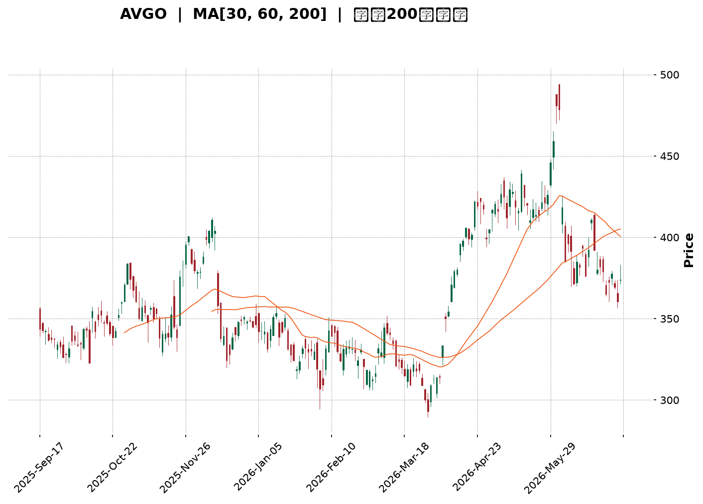
</details>

<html>
<head><meta charset="utf-8" /></head>
<body>
    <div style="height:500px; width:100%;">                        <script>window.PlotlyConfig = {MathJaxConfig: 'local'};</script>
        <script charset="utf-8" src="https://cdn.plot.ly/plotly-3.6.0.min.js" integrity="sha256-QaOVwtVY0T02VaHrr6pnoHLCwayMJp4O5n4YyaE3rJk=" crossorigin="anonymous"></script>                <div id="candlestick-chart" class="plotly-graph-div" style="height:100%; width:100%;"></div>            <script>                window.PLOTLYENV=window.PLOTLYENV || {};                                if (document.getElementById("candlestick-chart")) {                    Plotly.newPlot(                        "candlestick-chart",                        [{"close":{"dtype":"f8","bdata":"AAAA4G56dUAAAACAaG11QAAAAEDlZnVAAAAAgG4OdUAAAABg0RB1QAAAAIC0FnVAAAAAoKHjdEAAAACgpsp0QAAAAKApYXRAAAAAgCSBdEAAAABAg7h0QAAAAMC5BHVAAAAAoL8HdUAAAAAA7dl0QAAAAECQ6HRAAAAAQDF5dUAAAAAgjnF1QAAAAEAiLXRAAAAAAGUrdkAAAAAgZWN1QAAAAODz1XVAAAAAQNICdkAAAACgIbZ1QAAAACCztHVAAAAAoAFMdUAAAADgdCZ1QAAAAODwZXVAAAAA4IACdkAAAABAhIB2QAAAAIBDLndAAAAAgEP9d0AAAACg82V3QAAAACAf+XZAAAAA4HiIdkAAAACgqN91QAAAAMCrT3ZAAAAAwLsZdkAAAAAAubd1QAAAAKBIRnZAAAAAIPrfdUAAAACg2BN2QAAAAIBdIXVAAAAA4NJIdUAAAADA2Et1QAAAAICjKXVAAAAAIB4HdkAAAAAAMo51QAAAAMDdJHVAAAAAgKh9d0AAAADgJe53QAAAAICrtXhAAAAA4G0LeUAAAADA2v53QAAAAOAYt3dAAAAAgNKnd0AAAABgga53QAAAACALQXhAAAAA4NXteEAAAACgaUB5QAAAAICyqnlAAAAAYK9BeUAAAABAyV52QAAAAACpHnVAAAAAIF42dUAAAAAAQEN0QAAAAGCqgHRAAAAAQGkndUAAAABAJkN1QAAAAGCbwHVAAAAAQPTOdUAAAADgZu11QAAAACC5wXVAAAAAQA7JdUAAAACgRo11QAAAAKCBpXVAAAAAwI1idUAAAAAAImh1QAAAACDUY3VAAAAA4Ce0dEAAAABAQ3t1QAAAAGCt7nVAAAAAoO8UdkAAAAAASCp1QAAAAEAtXHVAAAAA4LTmdUAAAACgEbZ0QAAAAOB9eXRAAAAA4LlEdEAAAABgAe5zQAAAACCGOnRAAAAAABm5dEAAAABgRcB0QAAAAEBCmHRAAAAAYFihdEAAAADgUJ50QAAAACB48nNAAAAAwLUuc0AAAAAg7VVzQAAAAKAru3RAAAAAwNdqdUAAAABgDDN1QAAAAEAIWHVAAAAA4EWfdEAAAAAgoD90QAAAAMActXRAAAAAQJPEdEAAAAAgOsx0QAAAAKDdtnRAAAAAoAqSdEAAAADguUR0QAAAACBysXRAAAAAIE8IdEAAAAAACeZzQAAAAOBl2nNAAAAAwAKLc0AAAACA1cVzQAAAAEDHuHRAAAAAAEaUdEAAAABAsod1QAAAAIApVXVAAAAA4A9FdUAAAACAyut0QAAAAGCkD3RAAAAA4KM7dEAAAACAFwJ0QAAAAMBTrHNAAAAAgKjqc0AAAAAg7VVzQAAAAKABIHRAAAAAwJfcc0AAAABA5uRzQAAAAKDlTnNAAAAAIEfDckAAAABAJE9yQAAAAMBVUHNAAAAAAOqPc0AAAADg2KBzQAAAACDunnNAAAAAgBPXdEAAAAAgN+F1QAAAAECWJXZAAAAA4Gcvd0AAAAAgZrJ3QAAAAEDawndAAAAAYH3BeEAAAAAgct14QAAAAKBcXnlAAAAA4PnveEAAAABgjRh5QAAAAMC2X3pAAAAAQGw0ekAAAADAeGF6QAAAAICgGHpAAAAAwCvzeEAAAAAA80x5QAAAAIBTDHpAAAAAINRJekAAAABAeP15QAAAAID0qnpAAAAAoEiMekAAAACAh755QAAAAOAg1XpAAAAAQAy8ekAAAADgMip6QAAAAEAaAnpAAAAAYIVxe0AAAABASoh6QAAAACC5QHpAAAAAILqmeUAAAAAgmRF6QAAAAICj3nlAAAAAAMXXeUAAAACgfVV6QAAAAAAYU3pAAAAAoH6eekAAAABABuF7QAAAAADks3xAAAAA4PEMfkAAAABgkOd9QAAAAAD4I3pAAAAAgO0ReEAAAACgkr94QAAAACCleHhAAAAAQDE4d0AAAAAgXw94QAAAAOB113dAAAAAgBSVeEAAAADg1YF3QAAAAGB3hHhAAAAAQDOreUAAAACAFIJ4QAAAAGBmwndAAAAAwB7hd0AAAABgj653QAAAAOBR0HZAAAAAQDNHd0AAAAAAAJx3QAAAAKBwFXdAAAAAQDOHdkAAAABgZl53QA=="},"high":{"dtype":"f8","bdata":"r0fzy\u002f1UdkD\u002f8QO7YsJ1QOtc+z8FfHVAhKCeIM+LdUCzlgLmvHR1QPGXgsz0InVAswabAtECdUADm2mDCxN1QJGSg9VjMnVA63I+2keTdEDGVNfoEAF1QM7VzL7DmnVAX6Hd2rBndUAiVsJHZWN1QNIV75GcA3VAthd5Yr2JdUAkweK5\u002fZV1QMGgaZBWynVAC4sqEwlWdkALQHe2c8t1QLlFjWlaVnZA76INYXOTdkBO6mmwOdB1QIFv5vmkKXZAZ20AOEvSdUBKC70hIaF1QJDjhrQ3inVAOcgf8NlEdkAtdVaFp4t2QKz1fj6bP3dASs8wFjgFeECh8jM18gN4QJ5QWZlXi3dAYl+z+ixMd0BGgMFXTe52QAxl46xirXZAbb06kZaXdkA0jQkFZAh2QM810V\u002fmX3ZAa40u1fh9dkCgq8Su6012QBLq+F1G+XVAR8F8tBltdUAjSMagy+N1QIxF\u002fRt+oHVAROgQtPdadkA3lH33vl93QG9laGKEqnVA0fWJJ\u002fC9d0CMH5+8eB94QIstp79D2nhAPF801hAMeUDCu6RMdpN4QLcVWc7pdHhA6V5SLLbCd0CDxmm3Atx3QEbZbOZjdXhAQzkK1FJQeUBdmCtkmEp5QPJ4pnDKxHlASJ8evk1weUCDxCU38L13QAdrkbm4f3ZAm6j72QOZdUDxZ\u002fSg2op1QOkAbV2E4nRAZZMdd5NYdUDwWRX+gY91QGSCyD8zzXVAgsgf8An5dUBHabaJQf91QA4Ikh610HVAaEnHVCv2dUDrxqasiMl1QHfONXdhdXZA7BWlt6EbdkChYUaATbx1QG2VZCuqxnVAhL\u002fHoLJmdUBqZ88+16F1QOA4JDieCXZAVD95w7pidkDlqVllctZ1QCx8S4FYxnVAx7hJqFcTdkDf0KzzHYJ1QPSauqQU6XRAYWqK\u002fgz8dEArJOd17gx0QAndZyyUd3RAquV8goDYdEC3YtTm3yt1QN6mDed463RAwy3sJVcPdUDYD\u002fO1Oe10QIB3mbZ\u002fGnVASXPlt2Xlc0C5ETIsTlV0QLabVvtT3HRA+H6\u002f2L\u002fwdUDyf\u002f1Suat1QIO+wMDPnnVAM8U8E06QdUApPfLyfNF0QHd+Y55I6HRAB1P8DT0KdUDi+Vh6KhN1QNkWe5rJLXVACVioVB8UdUB\u002f6UU7rnF0QLkOiqHV6nRA\u002fXijIxpWdEAA6ip8Ne1zQLwE1qjY7XNABeNE9Yerc0BqBpdOSxd0QHMgb4Mu7nRAyhiJ\u002fvxjdUBLYhsPYLN1QE9pVZ+A\u002fXVA8gpzIqeIdUDcHBX5Uil1QNX2d9FAEXVAzSy5aN5\u002fdEBhtALZz2N0QAxeQ8jtQ3RATtjuL1YhdEBZdEXDRwV0QBw0Fw5tX3RAP5EItDI+dEDZsUu3mTx0QKPKnhS1xnNAZlCsuzkwc0Cud6w4nQRzQL\u002fWfFIdXXNAgfAU\u002fae0c0DqygF4FaNzQEnp0n9mvnNAKT7ClfPZdEAU3EBoSRl2QNt\u002fMJghYnZAG5Yjg0d\u002fd0DXWtdwIcR3QI6HiIrQ2ndAUfuFiz3HeEDeAytrxvB4QPriLqVlYXlAWS8kzXFceUCsxZleZS95QItPohCAaHpAKielGhvKekC5R4NAQYV6QG2F\u002fcxPYXpAC4R0K7NSeUA9NC0F\u002fE95QDzw55mAG3pA4clNZAVoekABvbZukHJ6QBd6zHhIC3tACC0WZ9BPe0Cl2PGWDp16QGVNWYMAJXtAYy21lm8Pe0Di0WDElcp6QBQZQfd+H3pADFq2XZOae0D6uipuBAJ7QJgk9ZV9VXpAOYY3GKIUekB+dC4D\u002f3d6QKgz0QpTWXpAIbrmojg1ekCu5CJL9Cl7QCtmx3DbAXtA8IJ8LwTQekC5Esj2DAN8QPtNz0UEFX1ApvNf88KAfkCtK1EufON+QHWn5MDlnHpA5Q1TDZ+deUBlTI88QSN5QHvwOpGbc3lAZM99ozQTeEBPVxnwJk54QCUGYmryBXhADxtL3y65eEBCBxIFvHJ4QMnNyTZFAHlAn\u002fEqI8TAeUAAAACAPep5QAAAAOBRcHhAAAAAANdLeEAAAADAzEx4QAAAAEAKW3dAAAAAIFyDd0AAAACA67l3QAAAAAAAXHdAAAAAAABgd0AAAABgj\u002fJ3QA=="},"hovertemplate":"\u003cb\u003e%{x|%Y-%m-%d}\u003c\u002fb\u003e\u003cbr\u003e\u958b: $%{open:.2f}\u003cbr\u003e\u9ad8: $%{high:.2f}\u003cbr\u003e\u4f4e: $%{low:.2f}\u003cbr\u003e\u6536: $%{close:.2f}\u003cextra\u003e\u003c\u002fextra\u003e","low":{"dtype":"f8","bdata":"5QdtokEwdUAnYj46oVR1QJIJMcu533RAboUSR+gAdUBZJ9nTRPJ0QNACrAsyv3RAahi8n51XdECQi4iKzYt0QG4dRv2XW3RA4DPcm9AsdEDaxmKuECt0QJUPvGEb1nRAKF\u002fMKOfddEAANnL6IMt0QFGo\u002fuIoTHRAFIk+w0KsdEDGEdkVDCh1QM+oar3nI3RAeJzserBZdUDuEaBDHRx1QD4SLK0DmXVA0hGHP624dUAY+bAKGC51QCvP7bRsnnVAE0vl0IY2dUAjj7N2Ptp0QDQV0CsMKHVAdt3TD8vOdUDLAZs6nhF2QGtYNo8niHZAR8ruk8Mxd0CQd22R9v92QI1FeqcLsXZADD3CQmd\u002fdkAtWgfVs9B1QOFGSy45wnVAg+OM\u002fejrdUBGa+ExP\u002fZ0QLUsJukjCnZA2YanpYq7dUDwe4SOhdt1QPCYA5rDxHRAd4jcYJ5zdEDr3BdaOfp0QGgMt2c+2nRAN7p+4a3+dECRxqPvGXR1QKBBxf02n3RACioDZ4+bdUCypcgj2hp3QIEdw2b80XdAbEQGhSWveEB3fpweQ+93QAmDiKHGmndAj4kWulkJd0BM3uEX6GZ3QPkYB7AO8HdANqNtFfeyeEDpu0\u002fS5JR4QDqxMTpV1XhANcK7J+R\u002feEDIioV8uxJ2QJYxTsAQ+nRAMlGhjxXTdECFPkWAD\u002fpzQDo++go5HXRAorM195+rdECJjeu2t\u002f90QOt+o47CFHVAj0M17dqddUBZH2U4lKd1QCksvIfMdnVA+76\u002fpEnAdUDPu\u002fSYb4J1QDpf89eqhHVACy9FZz30dEBXhGvdJgx1QPcYYS1b6nRAE5YWhJeUdEDoaDONasR0QJwMQsUtO3VA8LE\u002fH\u002fTZdUBerL0aFdN0QPP+UAuoRnVAIDQXp5hsdUCH\u002fdfGUKl0QPkI24YpMHRAG6r9ZCk7dEA0phdsUI9zQN0oax3zxnNAAGPPvR1ddECNPOjwA1h0QJtdahis8XNA6UbD5f9xdEBlhtPz3kh0QGC+pnVGOHNAl5GbbHVjckDnKYKmMBlzQKFP1tg5snNAlZ1mqvuWdEAeTBzFeyl1QI1bVtk9yHRAd7YWdJuFdEAXIkk3+Td0QNe9\u002fZxisnNA7rSzyHZgdEDSHtAqhYd0QJEp0QbthXRAg4IpNwRCdECsjRMXvJRzQFo00MwkgXRAHrVMIcwsc0CwkknQy01zQEwAcw8pIXNAm+SVT1kkc0AaFUyqiGlzQLxmjKyCHXRAvrdUjSxjdEB7ryyWwSZ0QAp3ZGLJOHVAqSJ1nKgPdUDldpJMsa90QPQhZDkBBHRA35RuTyruc0AX3a3IXsFzQMajd\u002fZEpnNAiluYMgs2c0DJPY9ehUxzQMeRW+\u002fqpnNAbziD1Hqlc0AnTwsng8NzQD\u002f5Pj7nSnNA3JcNF12mckDUZ55UBxhyQDMtmp3yfXJAIAxCm9Rfc0AbjYz4XtRyQNC1S5yiXHNArapD5akUdEAoM+3s0V91QC93KvIc73VAv4FHU\u002f+DdkBFNpG4Vg53QJZVG\u002f6ae3dATtDyKl8PeEDKlDQ8rnt4QMXjBA\u002fa8nhAgbuG5GO0eEBQua\u002fwJJ94QFFYlAWGQ3lA25XWmTwSekAWkD43bIN5QLdAQNuY33lAkYj1BmygeEDtO7q9csJ4QKp1T891OXlApAHB5wfKeUBWqdA8II55QPKby3f\u002fKnpAowso1OoRekDyn2kEh1p5QIk74m6I1XlA86GBoA2GekC5c\u002fn7O3x5QMn8oLqQQnlAE4fgwe7ueUD9w+aiLzJ6QK\u002fy8Yhx23lA6QG3mH9TeUCQjtKIUax5QBnjsxefnXlAUPHWD\u002f2YeUDWyiANdQV6QFpc50FP\u002fXlATKSnW7HVeUDPVaWGnOx6QHxDvOJWmHtALL1WKHdbfUBFiyBnSn59QCamdYn4JXlA3Fz\u002f57APeEA+2A+btGt4QNKNYqvqG3dA0gDvBFYpd0BAXc1Xbh93QPgJjfB3hndAJ1sRcMY\u002feEBMND1+1313QEi+ibe54HdAngG6w9RLeUAAAABgj354QAAAAGCPindAAAAAIFyPd0AAAABAM0t3QAAAAKBHvXZAAAAAIFyHdkAAAACAPSp3QAAAAOB6AHdAAAAAQOFGdkAAAABA4TJ3QA=="},"name":"\u50f9\u683c","open":{"dtype":"f8","bdata":"ZdgPWdZDdkDjhhJWRLd1QILq8ANKYnVAExR9yVhIdUAXKlpzgCV1QJqzUXrdHXVAlpar\u002fSWydECV\u002f2rNyvh0QKvxTlsK4nRA2wTe1HuEdEAl4\u002f68I2V0QM7VzL7DmnVAxd9hrYw5dUCjziSPxOB0QEgo+pht8nRAtQ2znlq\u002fdEA5ngmWK311QGTxxl1xd3VA4IaGVd3sdUA4fRYq3MJ1QCGLy7LpB3ZAdNFOIvwsdkBFucwblrp1QKiecclA\u002fXVA81H\u002fs8rAdUCRHNIW1ZV1QDQV0CsMKHVADsWqWrrodUBMmioEZ3h2QLI\u002fTyGWiXZAR8ruk8Mxd0Ch8jM18gN4QEXdbkeXgndABi41adQed0AOMPoMWkh2QA6uQMvzznVAUI8Qc6ZhdkBt7YdYdQN2QP7dga98PnZAzIh+HINPdkDxIOgAt0B2QGEX8jXu2XVA7lelvfaZdEDmQoe50R51QN+XGB6ZVHVAHAZ51PosdUCRUzVvXb92QBjHJ6jIc3VA17XpjaycdUDJzGaIjux3QBes6OBr9ndAkdlxx\u002f3ReECua4mPZIp4QDv4cgZWInhA3s+A7B2ed0BeXUW976h3QOKgamdJAHhAGynK38oDeUB33ALdcch4QBKFGndW\u002f3hA4jdJpy4peUAgaTHoep13QB93SLz4fXZAuc3hxVvidEDxZ\u002fSg2op1QLicuiwK4nRA0g0Enre3dEA+xTgGKYx1QK4PoE7yOHVAsvk3T3LWdUDz+Og1WNx1QOpjgtIKt3VAZLEy8vfKdUBRZueNJMd1QPy5mW3D93VAZNa5MwIXdkAR\u002fypObGV1QINgNm8iR3VAi\u002f1pyFlYdUCd3TN74Ap1QJwMQsUtO3VAWMrEoVv5dUDPZ5kgB7t1QI8sayxrvXVA7qOKZ\u002fyPdUCSdaK+ZG11QHMrs0B15HRAqGj6RejhdEDyxV+mDOJzQJ0I2ioF6nNAQHvkrMuIdEDTJAaqsxl1QOdpYF1utXRADoXDvISzdEDghm0KnE50QAq9Oc8Q+HRASXPlt2Xlc0D0spAs+5JzQCZoxZjN7nNALfaZXOWYdEDzkjORHaN1QHjWPERvmHVAWViLzhZpdUDPsmcFO4p0QHaWm3Mb6HNAqeOsG\u002fiEdECBD2jbmrx0QNx9Fhw+snRADrNzSX2wdEAxEu4YsxV0QK0pGvpqmHRAxJl2t9NUdEDeHlqK9FhzQLHAz9aXQ3NASVOgwJ59c0CqkZKvV6hzQB8tp499j3RAGjqq0jNxdEB2M4ZdyGB0QIwpZoszt3VAs7GValJVdUANOE7EAQh1QFcJhPAMB3VABxrS1ixNdEAP6V7aB0l0QODChxkQ9HNAuzPeyit1c0DPLKUoH+9zQLbGptD113NA0k6fzuj3c0Bar6+oSCF0QKgK6llhmHNAbs66VDIpc0CuyecWUMZyQAee+r+rrnJAsCLSRv+Nc0AuGZs8JABzQPd0Hoz+qHNAZrhlXGtjdEBUxEZgG\u002fN1QMKqooTk+3VAYmRzDOqFdkBhXlXONhF3QJOnGmTYlHdA+tmCBTlUeECr0W91A6Z4QPNq\u002fqBDBHlANOgpVvFQeUAjYCU9dux4QHebwOxjZXlAgRaFpI9bekBsDqKB74R6QMrRM54MPXpAkQemxNb6eEBzqg9fzC15QA4JuXzQ7XlAOcak8PHmeUBFXxM+8hh6QOnGV0TmT3pAw97Jn\u002fIte0CTV8qQdFJ6QLJmtaQvMnpAPpAgvhuvekDjxdukLGx6QGRWz3dy8nlAPwvy4CQBekD6uipuBAJ7QPKKINjnS3pABhguN8KSeUDLW73phcJ5QKLpGBpYznlA6bhE0UgNekAx58NXax16QFqfGXlfhnpAN02wtZdHekAyBmgSQQR7QPB0mnIPFnxAOIgURUiAfkC7rtd6+N9+QO238dR\u002fhXlAIWvwQXRveUDNCRiJvR95QCMEyxWbD3lA7A7cyFrOd0CMj2+msUN3QFZhG5LR8XdAqX6WFimueED39xZ\u002ffll4QDkDiz6IQXhAUTXBtOyOeUAAAABgj9p5QAAAAIDrnXdAAAAAgOspeEAAAACgRyl4QAAAAEAzJ3dAAAAAgOtZd0AAAADgo2x3QAAAAIDrPXdAAAAAIK7bdkAAAACAwll3QA=="},"x":["2025-09-17T00:00:00-04:00","2025-09-18T00:00:00-04:00","2025-09-19T00:00:00-04:00","2025-09-22T00:00:00-04:00","2025-09-23T00:00:00-04:00","2025-09-24T00:00:00-04:00","2025-09-25T00:00:00-04:00","2025-09-26T00:00:00-04:00","2025-09-29T00:00:00-04:00","2025-09-30T00:00:00-04:00","2025-10-01T00:00:00-04:00","2025-10-02T00:00:00-04:00","2025-10-03T00:00:00-04:00","2025-10-06T00:00:00-04:00","2025-10-07T00:00:00-04:00","2025-10-08T00:00:00-04:00","2025-10-09T00:00:00-04:00","2025-10-10T00:00:00-04:00","2025-10-13T00:00:00-04:00","2025-10-14T00:00:00-04:00","2025-10-15T00:00:00-04:00","2025-10-16T00:00:00-04:00","2025-10-17T00:00:00-04:00","2025-10-20T00:00:00-04:00","2025-10-21T00:00:00-04:00","2025-10-22T00:00:00-04:00","2025-10-23T00:00:00-04:00","2025-10-24T00:00:00-04:00","2025-10-27T00:00:00-04:00","2025-10-28T00:00:00-04:00","2025-10-29T00:00:00-04:00","2025-10-30T00:00:00-04:00","2025-10-31T00:00:00-04:00","2025-11-03T00:00:00-05:00","2025-11-04T00:00:00-05:00","2025-11-05T00:00:00-05:00","2025-11-06T00:00:00-05:00","2025-11-07T00:00:00-05:00","2025-11-10T00:00:00-05:00","2025-11-11T00:00:00-05:00","2025-11-12T00:00:00-05:00","2025-11-13T00:00:00-05:00","2025-11-14T00:00:00-05:00","2025-11-17T00:00:00-05:00","2025-11-18T00:00:00-05:00","2025-11-19T00:00:00-05:00","2025-11-20T00:00:00-05:00","2025-11-21T00:00:00-05:00","2025-11-24T00:00:00-05:00","2025-11-25T00:00:00-05:00","2025-11-26T00:00:00-05:00","2025-11-28T00:00:00-05:00","2025-12-01T00:00:00-05:00","2025-12-02T00:00:00-05:00","2025-12-03T00:00:00-05:00","2025-12-04T00:00:00-05:00","2025-12-05T00:00:00-05:00","2025-12-08T00:00:00-05:00","2025-12-09T00:00:00-05:00","2025-12-10T00:00:00-05:00","2025-12-11T00:00:00-05:00","2025-12-12T00:00:00-05:00","2025-12-15T00:00:00-05:00","2025-12-16T00:00:00-05:00","2025-12-17T00:00:00-05:00","2025-12-18T00:00:00-05:00","2025-12-19T00:00:00-05:00","2025-12-22T00:00:00-05:00","2025-12-23T00:00:00-05:00","2025-12-24T00:00:00-05:00","2025-12-26T00:00:00-05:00","2025-12-29T00:00:00-05:00","2025-12-30T00:00:00-05:00","2025-12-31T00:00:00-05:00","2026-01-02T00:00:00-05:00","2026-01-05T00:00:00-05:00","2026-01-06T00:00:00-05:00","2026-01-07T00:00:00-05:00","2026-01-08T00:00:00-05:00","2026-01-09T00:00:00-05:00","2026-01-12T00:00:00-05:00","2026-01-13T00:00:00-05:00","2026-01-14T00:00:00-05:00","2026-01-15T00:00:00-05:00","2026-01-16T00:00:00-05:00","2026-01-20T00:00:00-05:00","2026-01-21T00:00:00-05:00","2026-01-22T00:00:00-05:00","2026-01-23T00:00:00-05:00","2026-01-26T00:00:00-05:00","2026-01-27T00:00:00-05:00","2026-01-28T00:00:00-05:00","2026-01-29T00:00:00-05:00","2026-01-30T00:00:00-05:00","2026-02-02T00:00:00-05:00","2026-02-03T00:00:00-05:00","2026-02-04T00:00:00-05:00","2026-02-05T00:00:00-05:00","2026-02-06T00:00:00-05:00","2026-02-09T00:00:00-05:00","2026-02-10T00:00:00-05:00","2026-02-11T00:00:00-05:00","2026-02-12T00:00:00-05:00","2026-02-13T00:00:00-05:00","2026-02-17T00:00:00-05:00","2026-02-18T00:00:00-05:00","2026-02-19T00:00:00-05:00","2026-02-20T00:00:00-05:00","2026-02-23T00:00:00-05:00","2026-02-24T00:00:00-05:00","2026-02-25T00:00:00-05:00","2026-02-26T00:00:00-05:00","2026-02-27T00:00:00-05:00","2026-03-02T00:00:00-05:00","2026-03-03T00:00:00-05:00","2026-03-04T00:00:00-05:00","2026-03-05T00:00:00-05:00","2026-03-06T00:00:00-05:00","2026-03-09T00:00:00-04:00","2026-03-10T00:00:00-04:00","2026-03-11T00:00:00-04:00","2026-03-12T00:00:00-04:00","2026-03-13T00:00:00-04:00","2026-03-16T00:00:00-04:00","2026-03-17T00:00:00-04:00","2026-03-18T00:00:00-04:00","2026-03-19T00:00:00-04:00","2026-03-20T00:00:00-04:00","2026-03-23T00:00:00-04:00","2026-03-24T00:00:00-04:00","2026-03-25T00:00:00-04:00","2026-03-26T00:00:00-04:00","2026-03-27T00:00:00-04:00","2026-03-30T00:00:00-04:00","2026-03-31T00:00:00-04:00","2026-04-01T00:00:00-04:00","2026-04-02T00:00:00-04:00","2026-04-06T00:00:00-04:00","2026-04-07T00:00:00-04:00","2026-04-08T00:00:00-04:00","2026-04-09T00:00:00-04:00","2026-04-10T00:00:00-04:00","2026-04-13T00:00:00-04:00","2026-04-14T00:00:00-04:00","2026-04-15T00:00:00-04:00","2026-04-16T00:00:00-04:00","2026-04-17T00:00:00-04:00","2026-04-20T00:00:00-04:00","2026-04-21T00:00:00-04:00","2026-04-22T00:00:00-04:00","2026-04-23T00:00:00-04:00","2026-04-24T00:00:00-04:00","2026-04-27T00:00:00-04:00","2026-04-28T00:00:00-04:00","2026-04-29T00:00:00-04:00","2026-04-30T00:00:00-04:00","2026-05-01T00:00:00-04:00","2026-05-04T00:00:00-04:00","2026-05-05T00:00:00-04:00","2026-05-06T00:00:00-04:00","2026-05-07T00:00:00-04:00","2026-05-08T00:00:00-04:00","2026-05-11T00:00:00-04:00","2026-05-12T00:00:00-04:00","2026-05-13T00:00:00-04:00","2026-05-14T00:00:00-04:00","2026-05-15T00:00:00-04:00","2026-05-18T00:00:00-04:00","2026-05-19T00:00:00-04:00","2026-05-20T00:00:00-04:00","2026-05-21T00:00:00-04:00","2026-05-22T00:00:00-04:00","2026-05-26T00:00:00-04:00","2026-05-27T00:00:00-04:00","2026-05-28T00:00:00-04:00","2026-05-29T00:00:00-04:00","2026-06-01T00:00:00-04:00","2026-06-02T00:00:00-04:00","2026-06-03T00:00:00-04:00","2026-06-04T00:00:00-04:00","2026-06-05T00:00:00-04:00","2026-06-08T00:00:00-04:00","2026-06-09T00:00:00-04:00","2026-06-10T00:00:00-04:00","2026-06-11T00:00:00-04:00","2026-06-12T00:00:00-04:00","2026-06-15T00:00:00-04:00","2026-06-16T00:00:00-04:00","2026-06-17T00:00:00-04:00","2026-06-18T00:00:00-04:00","2026-06-22T00:00:00-04:00","2026-06-23T00:00:00-04:00","2026-06-24T00:00:00-04:00","2026-06-25T00:00:00-04:00","2026-06-26T00:00:00-04:00","2026-06-29T00:00:00-04:00","2026-06-30T00:00:00-04:00","2026-07-01T00:00:00-04:00","2026-07-02T00:00:00-04:00","2026-07-06T00:00:00-04:00"],"type":"candlestick"},{"hovertemplate":"MA30: $%{y:.2f}\u003cextra\u003e\u003c\u002fextra\u003e","line":{"color":"#2196F3","dash":"dash","width":2},"mode":"lines","name":"MA30","x":["2025-09-17T00:00:00-04:00","2025-09-18T00:00:00-04:00","2025-09-19T00:00:00-04:00","2025-09-22T00:00:00-04:00","2025-09-23T00:00:00-04:00","2025-09-24T00:00:00-04:00","2025-09-25T00:00:00-04:00","2025-09-26T00:00:00-04:00","2025-09-29T00:00:00-04:00","2025-09-30T00:00:00-04:00","2025-10-01T00:00:00-04:00","2025-10-02T00:00:00-04:00","2025-10-03T00:00:00-04:00","2025-10-06T00:00:00-04:00","2025-10-07T00:00:00-04:00","2025-10-08T00:00:00-04:00","2025-10-09T00:00:00-04:00","2025-10-10T00:00:00-04:00","2025-10-13T00:00:00-04:00","2025-10-14T00:00:00-04:00","2025-10-15T00:00:00-04:00","2025-10-16T00:00:00-04:00","2025-10-17T00:00:00-04:00","2025-10-20T00:00:00-04:00","2025-10-21T00:00:00-04:00","2025-10-22T00:00:00-04:00","2025-10-23T00:00:00-04:00","2025-10-24T00:00:00-04:00","2025-10-27T00:00:00-04:00","2025-10-28T00:00:00-04:00","2025-10-29T00:00:00-04:00","2025-10-30T00:00:00-04:00","2025-10-31T00:00:00-04:00","2025-11-03T00:00:00-05:00","2025-11-04T00:00:00-05:00","2025-11-05T00:00:00-05:00","2025-11-06T00:00:00-05:00","2025-11-07T00:00:00-05:00","2025-11-10T00:00:00-05:00","2025-11-11T00:00:00-05:00","2025-11-12T00:00:00-05:00","2025-11-13T00:00:00-05:00","2025-11-14T00:00:00-05:00","2025-11-17T00:00:00-05:00","2025-11-18T00:00:00-05:00","2025-11-19T00:00:00-05:00","2025-11-20T00:00:00-05:00","2025-11-21T00:00:00-05:00","2025-11-24T00:00:00-05:00","2025-11-25T00:00:00-05:00","2025-11-26T00:00:00-05:00","2025-11-28T00:00:00-05:00","2025-12-01T00:00:00-05:00","2025-12-02T00:00:00-05:00","2025-12-03T00:00:00-05:00","2025-12-04T00:00:00-05:00","2025-12-05T00:00:00-05:00","2025-12-08T00:00:00-05:00","2025-12-09T00:00:00-05:00","2025-12-10T00:00:00-05:00","2025-12-11T00:00:00-05:00","2025-12-12T00:00:00-05:00","2025-12-15T00:00:00-05:00","2025-12-16T00:00:00-05:00","2025-12-17T00:00:00-05:00","2025-12-18T00:00:00-05:00","2025-12-19T00:00:00-05:00","2025-12-22T00:00:00-05:00","2025-12-23T00:00:00-05:00","2025-12-24T00:00:00-05:00","2025-12-26T00:00:00-05:00","2025-12-29T00:00:00-05:00","2025-12-30T00:00:00-05:00","2025-12-31T00:00:00-05:00","2026-01-02T00:00:00-05:00","2026-01-05T00:00:00-05:00","2026-01-06T00:00:00-05:00","2026-01-07T00:00:00-05:00","2026-01-08T00:00:00-05:00","2026-01-09T00:00:00-05:00","2026-01-12T00:00:00-05:00","2026-01-13T00:00:00-05:00","2026-01-14T00:00:00-05:00","2026-01-15T00:00:00-05:00","2026-01-16T00:00:00-05:00","2026-01-20T00:00:00-05:00","2026-01-21T00:00:00-05:00","2026-01-22T00:00:00-05:00","2026-01-23T00:00:00-05:00","2026-01-26T00:00:00-05:00","2026-01-27T00:00:00-05:00","2026-01-28T00:00:00-05:00","2026-01-29T00:00:00-05:00","2026-01-30T00:00:00-05:00","2026-02-02T00:00:00-05:00","2026-02-03T00:00:00-05:00","2026-02-04T00:00:00-05:00","2026-02-05T00:00:00-05:00","2026-02-06T00:00:00-05:00","2026-02-09T00:00:00-05:00","2026-02-10T00:00:00-05:00","2026-02-11T00:00:00-05:00","2026-02-12T00:00:00-05:00","2026-02-13T00:00:00-05:00","2026-02-17T00:00:00-05:00","2026-02-18T00:00:00-05:00","2026-02-19T00:00:00-05:00","2026-02-20T00:00:00-05:00","2026-02-23T00:00:00-05:00","2026-02-24T00:00:00-05:00","2026-02-25T00:00:00-05:00","2026-02-26T00:00:00-05:00","2026-02-27T00:00:00-05:00","2026-03-02T00:00:00-05:00","2026-03-03T00:00:00-05:00","2026-03-04T00:00:00-05:00","2026-03-05T00:00:00-05:00","2026-03-06T00:00:00-05:00","2026-03-09T00:00:00-04:00","2026-03-10T00:00:00-04:00","2026-03-11T00:00:00-04:00","2026-03-12T00:00:00-04:00","2026-03-13T00:00:00-04:00","2026-03-16T00:00:00-04:00","2026-03-17T00:00:00-04:00","2026-03-18T00:00:00-04:00","2026-03-19T00:00:00-04:00","2026-03-20T00:00:00-04:00","2026-03-23T00:00:00-04:00","2026-03-24T00:00:00-04:00","2026-03-25T00:00:00-04:00","2026-03-26T00:00:00-04:00","2026-03-27T00:00:00-04:00","2026-03-30T00:00:00-04:00","2026-03-31T00:00:00-04:00","2026-04-01T00:00:00-04:00","2026-04-02T00:00:00-04:00","2026-04-06T00:00:00-04:00","2026-04-07T00:00:00-04:00","2026-04-08T00:00:00-04:00","2026-04-09T00:00:00-04:00","2026-04-10T00:00:00-04:00","2026-04-13T00:00:00-04:00","2026-04-14T00:00:00-04:00","2026-04-15T00:00:00-04:00","2026-04-16T00:00:00-04:00","2026-04-17T00:00:00-04:00","2026-04-20T00:00:00-04:00","2026-04-21T00:00:00-04:00","2026-04-22T00:00:00-04:00","2026-04-23T00:00:00-04:00","2026-04-24T00:00:00-04:00","2026-04-27T00:00:00-04:00","2026-04-28T00:00:00-04:00","2026-04-29T00:00:00-04:00","2026-04-30T00:00:00-04:00","2026-05-01T00:00:00-04:00","2026-05-04T00:00:00-04:00","2026-05-05T00:00:00-04:00","2026-05-06T00:00:00-04:00","2026-05-07T00:00:00-04:00","2026-05-08T00:00:00-04:00","2026-05-11T00:00:00-04:00","2026-05-12T00:00:00-04:00","2026-05-13T00:00:00-04:00","2026-05-14T00:00:00-04:00","2026-05-15T00:00:00-04:00","2026-05-18T00:00:00-04:00","2026-05-19T00:00:00-04:00","2026-05-20T00:00:00-04:00","2026-05-21T00:00:00-04:00","2026-05-22T00:00:00-04:00","2026-05-26T00:00:00-04:00","2026-05-27T00:00:00-04:00","2026-05-28T00:00:00-04:00","2026-05-29T00:00:00-04:00","2026-06-01T00:00:00-04:00","2026-06-02T00:00:00-04:00","2026-06-03T00:00:00-04:00","2026-06-04T00:00:00-04:00","2026-06-05T00:00:00-04:00","2026-06-08T00:00:00-04:00","2026-06-09T00:00:00-04:00","2026-06-10T00:00:00-04:00","2026-06-11T00:00:00-04:00","2026-06-12T00:00:00-04:00","2026-06-15T00:00:00-04:00","2026-06-16T00:00:00-04:00","2026-06-17T00:00:00-04:00","2026-06-18T00:00:00-04:00","2026-06-22T00:00:00-04:00","2026-06-23T00:00:00-04:00","2026-06-24T00:00:00-04:00","2026-06-25T00:00:00-04:00","2026-06-26T00:00:00-04:00","2026-06-29T00:00:00-04:00","2026-06-30T00:00:00-04:00","2026-07-01T00:00:00-04:00","2026-07-02T00:00:00-04:00","2026-07-06T00:00:00-04:00"],"y":{"dtype":"f8","bdata":"AAAAAAAA+H8AAAAAAAD4fwAAAAAAAPh\u002fAAAAAAAA+H8AAAAAAAD4fwAAAAAAAPh\u002fAAAAAAAA+H8AAAAAAAD4fwAAAAAAAPh\u002fAAAAAAAA+H8AAAAAAAD4fwAAAAAAAPh\u002fAAAAAAAA+H8AAAAAAAD4fwAAAAAAAPh\u002fAAAAAAAA+H8AAAAAAAD4fwAAAAAAAPh\u002fAAAAAAAA+H8AAAAAAAD4fwAAAAAAAPh\u002fAAAAAAAA+H8AAAAAAAD4fwAAAAAAAPh\u002fAAAAAAAA+H8AAAAAAAD4fwAAAAAAAPh\u002fAAAAAAAA+H8AAAAAAAD4f+\u002fu7v7jVXVAvLu7e1FrdUC8u7vrInx1QAAAAECLiXVAIiIiMiWWdUDNzMw8Cp11QBEREeF4p3VAVVVVFc+xdUCJiIgYtrl1QLy7u8vhyXVAVVVVlZPVdUDv7u5+J+F1QDMzM+Mb4nVAIiIiMkfkdUAiIiJSE+h1QBEREaE+6nVAmpmZufnudUDv7u4e7u91QKuqqhow+HVA7+7unnYDdkBmZma2Jxl2QFVVVdWtMXZAMzMz45BLdkBmZmaGDl92QM3MzAw0cHZAzczMnFSEdkARERGh7pl2QO\u002fu7l5NsnZAq6qqmjbLdkDv7u4ureJ2QFVVVRXk93ZAq6qqerQCd0DNzMzM7vl2QAAAABAe6nZAd3d359jedkDv7u6uGdF2QERERLSqwXZAMzMz45a5dkAREREhtLV2QLy7u2s\u002fsXZAiYiIKK6wdkCamZkZZq92QM3MzHy+tHZAvLu7uwS5dkAAAAAQM7t2QBERERFUv3ZAmpmZyde5dkDNzMz8krh2QERERESsunZAZmZmtuOidkCrqqpK\u002fo12QHd3dydLdnZA3t3drQJddkB3d3en20R2QLy7u7vCMHZAd3d3R8ohdkCJiIg4cQh2QHd3d8cw6HVARERElGvAdUBERES0AZN1QDMzM9OZZHVAVVVVJeo9dUAzMzPzGDB1QO\u002fu7g6eK3VAZmZmZqYmdUDv7u5+ryl1QGZmZhbyJHVA3t3dTR8UdUB3d3d3rgN1QKuqqor3+nRAIiIiQqH3dECrqqoKa\u002fF0QFVVVSXl7XRAEREREfjjdECrqqrq2Nh0QN7d3Y3V0HRAiYiIeJHLdEAzMzMTX8Z0QAAAACCbwHRAREREBHi\u002fdECrqqoaHrV0QAAAABCLqnRA7+7uPg6ZdECJiIhYP450QN7d3V1jgXRARERE1ENtdEAzMzPTQWV0QO\u002fu7t5dZ3RAzczMrARqdEBERES0rHd0QM3MzIwYgXRAmpmZ6cKFdECJiIhINod0QM3MzHyognRAq6qqmkR\u002fdEDe3d19D3p0QCIiIvK4d3RAVVVVxfx9dEBVVVXF\u002fH10QERERLTQeHRA3t3dTYprdEBmZmbmZmB0QBEREeEHT3RA3t3dDSo\u002fdEBERERknS50QEREROS4InRAvLu7+24YdEBmZmZGdA50QN7d3X0fBXRAZmZmlmwHdEDv7u5+LBV0QJqZmRmUIXRAMzMzU3s8dEBERETU5Fx0QKuqqgo+fnRAiYiImLmqdEAAAADALdZ0QM3MzNzU\u002fXRAZmZmhgUjdUCrqqo6c0F1QAAAAPB3bHVA3t3dnZSWdUDe3d19K8V1QM3MzFyr+HVAAAAAoOsgdkAzMzMTFU52QHd3d3d7hHZAmpmZydq6dkARERGxo\u002fN2QGZmZpZ4K3dAREREBIdkd0CrqqrKcpZ3QHd3d\u002fen1ndAmpmZia4aeEDv7u6Ot114QFVVVbXXlnhA7+7unhjaeEDNzMzMAhV5QCIiIqKaTXlAiYiIuKh2eUCJiIi4Z5p5QN7d3W0sunlAMzMzM9rQeUC8u7v7Wud5QImIiOg6\u002fXlAmpmZWSENekDNzMx82SZ6QO\u002fu7u5MQ3pAzczMzO5uekDv7u5u95d6QLy7u5v5lXpA7+7uLsKDekDNzMwc1HV6QGZmZmb2Z3pAERERUTJZekAiIiJSnE56QCIiIiLIO3pAZmZmNjktekAiIiIiCRh6QBEREaGvBXpAq6qq6i7+eUDNzMyMovN5QCIiIiJp2XlAIiIi4gvBeUBERETE26t5QKuqqlqZkHlAVVVVFQ5teUDNzMysHFR5QJqZmbkROXlAiYiIGGseeUDv7u7eYAd5QA=="},"type":"scatter"},{"hovertemplate":"MA60: $%{y:.2f}\u003cextra\u003e\u003c\u002fextra\u003e","line":{"color":"#9C27B0","dash":"dash","width":2},"mode":"lines","name":"MA60","x":["2025-09-17T00:00:00-04:00","2025-09-18T00:00:00-04:00","2025-09-19T00:00:00-04:00","2025-09-22T00:00:00-04:00","2025-09-23T00:00:00-04:00","2025-09-24T00:00:00-04:00","2025-09-25T00:00:00-04:00","2025-09-26T00:00:00-04:00","2025-09-29T00:00:00-04:00","2025-09-30T00:00:00-04:00","2025-10-01T00:00:00-04:00","2025-10-02T00:00:00-04:00","2025-10-03T00:00:00-04:00","2025-10-06T00:00:00-04:00","2025-10-07T00:00:00-04:00","2025-10-08T00:00:00-04:00","2025-10-09T00:00:00-04:00","2025-10-10T00:00:00-04:00","2025-10-13T00:00:00-04:00","2025-10-14T00:00:00-04:00","2025-10-15T00:00:00-04:00","2025-10-16T00:00:00-04:00","2025-10-17T00:00:00-04:00","2025-10-20T00:00:00-04:00","2025-10-21T00:00:00-04:00","2025-10-22T00:00:00-04:00","2025-10-23T00:00:00-04:00","2025-10-24T00:00:00-04:00","2025-10-27T00:00:00-04:00","2025-10-28T00:00:00-04:00","2025-10-29T00:00:00-04:00","2025-10-30T00:00:00-04:00","2025-10-31T00:00:00-04:00","2025-11-03T00:00:00-05:00","2025-11-04T00:00:00-05:00","2025-11-05T00:00:00-05:00","2025-11-06T00:00:00-05:00","2025-11-07T00:00:00-05:00","2025-11-10T00:00:00-05:00","2025-11-11T00:00:00-05:00","2025-11-12T00:00:00-05:00","2025-11-13T00:00:00-05:00","2025-11-14T00:00:00-05:00","2025-11-17T00:00:00-05:00","2025-11-18T00:00:00-05:00","2025-11-19T00:00:00-05:00","2025-11-20T00:00:00-05:00","2025-11-21T00:00:00-05:00","2025-11-24T00:00:00-05:00","2025-11-25T00:00:00-05:00","2025-11-26T00:00:00-05:00","2025-11-28T00:00:00-05:00","2025-12-01T00:00:00-05:00","2025-12-02T00:00:00-05:00","2025-12-03T00:00:00-05:00","2025-12-04T00:00:00-05:00","2025-12-05T00:00:00-05:00","2025-12-08T00:00:00-05:00","2025-12-09T00:00:00-05:00","2025-12-10T00:00:00-05:00","2025-12-11T00:00:00-05:00","2025-12-12T00:00:00-05:00","2025-12-15T00:00:00-05:00","2025-12-16T00:00:00-05:00","2025-12-17T00:00:00-05:00","2025-12-18T00:00:00-05:00","2025-12-19T00:00:00-05:00","2025-12-22T00:00:00-05:00","2025-12-23T00:00:00-05:00","2025-12-24T00:00:00-05:00","2025-12-26T00:00:00-05:00","2025-12-29T00:00:00-05:00","2025-12-30T00:00:00-05:00","2025-12-31T00:00:00-05:00","2026-01-02T00:00:00-05:00","2026-01-05T00:00:00-05:00","2026-01-06T00:00:00-05:00","2026-01-07T00:00:00-05:00","2026-01-08T00:00:00-05:00","2026-01-09T00:00:00-05:00","2026-01-12T00:00:00-05:00","2026-01-13T00:00:00-05:00","2026-01-14T00:00:00-05:00","2026-01-15T00:00:00-05:00","2026-01-16T00:00:00-05:00","2026-01-20T00:00:00-05:00","2026-01-21T00:00:00-05:00","2026-01-22T00:00:00-05:00","2026-01-23T00:00:00-05:00","2026-01-26T00:00:00-05:00","2026-01-27T00:00:00-05:00","2026-01-28T00:00:00-05:00","2026-01-29T00:00:00-05:00","2026-01-30T00:00:00-05:00","2026-02-02T00:00:00-05:00","2026-02-03T00:00:00-05:00","2026-02-04T00:00:00-05:00","2026-02-05T00:00:00-05:00","2026-02-06T00:00:00-05:00","2026-02-09T00:00:00-05:00","2026-02-10T00:00:00-05:00","2026-02-11T00:00:00-05:00","2026-02-12T00:00:00-05:00","2026-02-13T00:00:00-05:00","2026-02-17T00:00:00-05:00","2026-02-18T00:00:00-05:00","2026-02-19T00:00:00-05:00","2026-02-20T00:00:00-05:00","2026-02-23T00:00:00-05:00","2026-02-24T00:00:00-05:00","2026-02-25T00:00:00-05:00","2026-02-26T00:00:00-05:00","2026-02-27T00:00:00-05:00","2026-03-02T00:00:00-05:00","2026-03-03T00:00:00-05:00","2026-03-04T00:00:00-05:00","2026-03-05T00:00:00-05:00","2026-03-06T00:00:00-05:00","2026-03-09T00:00:00-04:00","2026-03-10T00:00:00-04:00","2026-03-11T00:00:00-04:00","2026-03-12T00:00:00-04:00","2026-03-13T00:00:00-04:00","2026-03-16T00:00:00-04:00","2026-03-17T00:00:00-04:00","2026-03-18T00:00:00-04:00","2026-03-19T00:00:00-04:00","2026-03-20T00:00:00-04:00","2026-03-23T00:00:00-04:00","2026-03-24T00:00:00-04:00","2026-03-25T00:00:00-04:00","2026-03-26T00:00:00-04:00","2026-03-27T00:00:00-04:00","2026-03-30T00:00:00-04:00","2026-03-31T00:00:00-04:00","2026-04-01T00:00:00-04:00","2026-04-02T00:00:00-04:00","2026-04-06T00:00:00-04:00","2026-04-07T00:00:00-04:00","2026-04-08T00:00:00-04:00","2026-04-09T00:00:00-04:00","2026-04-10T00:00:00-04:00","2026-04-13T00:00:00-04:00","2026-04-14T00:00:00-04:00","2026-04-15T00:00:00-04:00","2026-04-16T00:00:00-04:00","2026-04-17T00:00:00-04:00","2026-04-20T00:00:00-04:00","2026-04-21T00:00:00-04:00","2026-04-22T00:00:00-04:00","2026-04-23T00:00:00-04:00","2026-04-24T00:00:00-04:00","2026-04-27T00:00:00-04:00","2026-04-28T00:00:00-04:00","2026-04-29T00:00:00-04:00","2026-04-30T00:00:00-04:00","2026-05-01T00:00:00-04:00","2026-05-04T00:00:00-04:00","2026-05-05T00:00:00-04:00","2026-05-06T00:00:00-04:00","2026-05-07T00:00:00-04:00","2026-05-08T00:00:00-04:00","2026-05-11T00:00:00-04:00","2026-05-12T00:00:00-04:00","2026-05-13T00:00:00-04:00","2026-05-14T00:00:00-04:00","2026-05-15T00:00:00-04:00","2026-05-18T00:00:00-04:00","2026-05-19T00:00:00-04:00","2026-05-20T00:00:00-04:00","2026-05-21T00:00:00-04:00","2026-05-22T00:00:00-04:00","2026-05-26T00:00:00-04:00","2026-05-27T00:00:00-04:00","2026-05-28T00:00:00-04:00","2026-05-29T00:00:00-04:00","2026-06-01T00:00:00-04:00","2026-06-02T00:00:00-04:00","2026-06-03T00:00:00-04:00","2026-06-04T00:00:00-04:00","2026-06-05T00:00:00-04:00","2026-06-08T00:00:00-04:00","2026-06-09T00:00:00-04:00","2026-06-10T00:00:00-04:00","2026-06-11T00:00:00-04:00","2026-06-12T00:00:00-04:00","2026-06-15T00:00:00-04:00","2026-06-16T00:00:00-04:00","2026-06-17T00:00:00-04:00","2026-06-18T00:00:00-04:00","2026-06-22T00:00:00-04:00","2026-06-23T00:00:00-04:00","2026-06-24T00:00:00-04:00","2026-06-25T00:00:00-04:00","2026-06-26T00:00:00-04:00","2026-06-29T00:00:00-04:00","2026-06-30T00:00:00-04:00","2026-07-01T00:00:00-04:00","2026-07-02T00:00:00-04:00","2026-07-06T00:00:00-04:00"],"y":{"dtype":"f8","bdata":"AAAAAAAA+H8AAAAAAAD4fwAAAAAAAPh\u002fAAAAAAAA+H8AAAAAAAD4fwAAAAAAAPh\u002fAAAAAAAA+H8AAAAAAAD4fwAAAAAAAPh\u002fAAAAAAAA+H8AAAAAAAD4fwAAAAAAAPh\u002fAAAAAAAA+H8AAAAAAAD4fwAAAAAAAPh\u002fAAAAAAAA+H8AAAAAAAD4fwAAAAAAAPh\u002fAAAAAAAA+H8AAAAAAAD4fwAAAAAAAPh\u002fAAAAAAAA+H8AAAAAAAD4fwAAAAAAAPh\u002fAAAAAAAA+H8AAAAAAAD4fwAAAAAAAPh\u002fAAAAAAAA+H8AAAAAAAD4fwAAAAAAAPh\u002fAAAAAAAA+H8AAAAAAAD4fwAAAAAAAPh\u002fAAAAAAAA+H8AAAAAAAD4fwAAAAAAAPh\u002fAAAAAAAA+H8AAAAAAAD4fwAAAAAAAPh\u002fAAAAAAAA+H8AAAAAAAD4fwAAAAAAAPh\u002fAAAAAAAA+H8AAAAAAAD4fwAAAAAAAPh\u002fAAAAAAAA+H8AAAAAAAD4fwAAAAAAAPh\u002fAAAAAAAA+H8AAAAAAAD4fwAAAAAAAPh\u002fAAAAAAAA+H8AAAAAAAD4fwAAAAAAAPh\u002fAAAAAAAA+H8AAAAAAAD4fwAAAAAAAPh\u002fAAAAAAAA+H8AAAAAAAD4fyIiIgrkJnZAMzMz+wI3dkBERETcCDt2QAAAAKjUOXZAzczMDH86dkDe3d31ETd2QKuqqsqRNHZARERE\u002fLI1dkDNzMwctTd2QLy7u5uQPXZA7+7u3iBDdkBERETMRkh2QAAAADBtS3ZA7+7u9qVOdkARERExo1F2QBEREVnJVHZAmpmZwWhUdkDe3d2NQFR2QHd3dy9uWXZAq6qqKi1TdkCJiIgAk1N2QGZmZn78U3ZAiYiIyElUdkDv7u4W9VF2QERERGR7UHZAIiIicg9TdkDNzMzsL1F2QDMzMxM\u002fTXZAd3d3F9FFdkCamZlx1zp2QERERPQ+LnZAAAAAUE8gdkAAAADgAxV2QHd3dw\u002feCnZA7+7upr8CdkDv7u6WZP11QFVVVWVO83VAiYiIGNvmdUBERERMsdx1QDMzM3sb1nVAVVVVtSfUdUAiIiKSaNB1QBEREdFR0XVAZmZmZn7OdUBVVVX9Bcp1QHd3d88UyHVAERERobTCdUAAAAAIeb91QCIiIrKjvXVAVVVV3S2xdUCrqqoyjqF1QLy7uxtrkHVAZmZmdgh7dUAAAACAjWl1QM3MzAwTWXVA3t3dDYdHdUDe3d2F2TZ1QDMzM1PHJ3VAiYiIIDgVdUBEREQ0VwV1QAAAADDZ8nRAd3d3h9bhdEDe3d2dp9t0QN7d3UUj13RAiYiIgPXSdEBmZmZ+39F0QERERIRVznRAmpmZCQ7JdEBmZmae1cB0QHd3dx\u002fkuXRAAAAAyJWxdECJiIj46Kh0QDMzM4N2nnRAd3d3D5GRdEB3d3cnu4N0QBERETnHeXRAIiIiOgBydEDNzMysaWp0QO\u002fu7k7dYnRAVVVVTXJjdEDNzMxMJWV0QM3MzJQPZnRAERERycRqdEBmZmYWknV0QERERLTQf3RAZmZmtv6LdECamZnJt510QN7d3V2ZsnRAmpmZGYXGdEB3d3f3j9x0QGZmZj7I9nRAvLu7wysOdUAzMzPjMCZ1QM3MzOypPXVAVVVVHRhQdUCJiIhIEmR1QM3MzDQafnVAd3d3x2ucdUAzMzM70Lh1QFVVVaUk0nVAERERqQjodUCJiIjYbPt1QEREROzXEnZAvLu7S+wsdkCamZl5KkZ2QM3MzEzIXHZAVVVVzUN5dkCamZmJu5F2QAAAABBdqXZAd3d3pwq\u002fdkC8u7sbytd2QLy7u0Pg7XZAMzMzw6oGd0AAAADoHyJ3QJqZmXm8PXdAERERee1bd0BmZmaeg353QN7d3eWQoHdAmpmZKfrId0DNzMxUtex3QN7d3cU4AXhAZmZmZisNeEBVVVXNfx14QJqZmeFQMHhAiYiI+A49eECrqqqyWE54QM3MzMwhYHhAAAAAAAp0eECamZlp1oV4QLy7uxuUmHhAd3d391qxeEC8u7urCsV4QM3MzIwI2HhA3t3dNd3teECamZmpyQR5QAAAAIi4E3lAIiIiWpMjeUDNzMy8jzR5QN7d3S1WQ3lAiYiI6IlKeUC8u7tL5FB5QA=="},"type":"scatter"},{"hovertemplate":"MA200: $%{y:.2f}\u003cextra\u003e\u003c\u002fextra\u003e","line":{"color":"#FF6F00","dash":"solid","width":2},"mode":"lines","name":"MA200","x":["2025-09-17T00:00:00-04:00","2025-09-18T00:00:00-04:00","2025-09-19T00:00:00-04:00","2025-09-22T00:00:00-04:00","2025-09-23T00:00:00-04:00","2025-09-24T00:00:00-04:00","2025-09-25T00:00:00-04:00","2025-09-26T00:00:00-04:00","2025-09-29T00:00:00-04:00","2025-09-30T00:00:00-04:00","2025-10-01T00:00:00-04:00","2025-10-02T00:00:00-04:00","2025-10-03T00:00:00-04:00","2025-10-06T00:00:00-04:00","2025-10-07T00:00:00-04:00","2025-10-08T00:00:00-04:00","2025-10-09T00:00:00-04:00","2025-10-10T00:00:00-04:00","2025-10-13T00:00:00-04:00","2025-10-14T00:00:00-04:00","2025-10-15T00:00:00-04:00","2025-10-16T00:00:00-04:00","2025-10-17T00:00:00-04:00","2025-10-20T00:00:00-04:00","2025-10-21T00:00:00-04:00","2025-10-22T00:00:00-04:00","2025-10-23T00:00:00-04:00","2025-10-24T00:00:00-04:00","2025-10-27T00:00:00-04:00","2025-10-28T00:00:00-04:00","2025-10-29T00:00:00-04:00","2025-10-30T00:00:00-04:00","2025-10-31T00:00:00-04:00","2025-11-03T00:00:00-05:00","2025-11-04T00:00:00-05:00","2025-11-05T00:00:00-05:00","2025-11-06T00:00:00-05:00","2025-11-07T00:00:00-05:00","2025-11-10T00:00:00-05:00","2025-11-11T00:00:00-05:00","2025-11-12T00:00:00-05:00","2025-11-13T00:00:00-05:00","2025-11-14T00:00:00-05:00","2025-11-17T00:00:00-05:00","2025-11-18T00:00:00-05:00","2025-11-19T00:00:00-05:00","2025-11-20T00:00:00-05:00","2025-11-21T00:00:00-05:00","2025-11-24T00:00:00-05:00","2025-11-25T00:00:00-05:00","2025-11-26T00:00:00-05:00","2025-11-28T00:00:00-05:00","2025-12-01T00:00:00-05:00","2025-12-02T00:00:00-05:00","2025-12-03T00:00:00-05:00","2025-12-04T00:00:00-05:00","2025-12-05T00:00:00-05:00","2025-12-08T00:00:00-05:00","2025-12-09T00:00:00-05:00","2025-12-10T00:00:00-05:00","2025-12-11T00:00:00-05:00","2025-12-12T00:00:00-05:00","2025-12-15T00:00:00-05:00","2025-12-16T00:00:00-05:00","2025-12-17T00:00:00-05:00","2025-12-18T00:00:00-05:00","2025-12-19T00:00:00-05:00","2025-12-22T00:00:00-05:00","2025-12-23T00:00:00-05:00","2025-12-24T00:00:00-05:00","2025-12-26T00:00:00-05:00","2025-12-29T00:00:00-05:00","2025-12-30T00:00:00-05:00","2025-12-31T00:00:00-05:00","2026-01-02T00:00:00-05:00","2026-01-05T00:00:00-05:00","2026-01-06T00:00:00-05:00","2026-01-07T00:00:00-05:00","2026-01-08T00:00:00-05:00","2026-01-09T00:00:00-05:00","2026-01-12T00:00:00-05:00","2026-01-13T00:00:00-05:00","2026-01-14T00:00:00-05:00","2026-01-15T00:00:00-05:00","2026-01-16T00:00:00-05:00","2026-01-20T00:00:00-05:00","2026-01-21T00:00:00-05:00","2026-01-22T00:00:00-05:00","2026-01-23T00:00:00-05:00","2026-01-26T00:00:00-05:00","2026-01-27T00:00:00-05:00","2026-01-28T00:00:00-05:00","2026-01-29T00:00:00-05:00","2026-01-30T00:00:00-05:00","2026-02-02T00:00:00-05:00","2026-02-03T00:00:00-05:00","2026-02-04T00:00:00-05:00","2026-02-05T00:00:00-05:00","2026-02-06T00:00:00-05:00","2026-02-09T00:00:00-05:00","2026-02-10T00:00:00-05:00","2026-02-11T00:00:00-05:00","2026-02-12T00:00:00-05:00","2026-02-13T00:00:00-05:00","2026-02-17T00:00:00-05:00","2026-02-18T00:00:00-05:00","2026-02-19T00:00:00-05:00","2026-02-20T00:00:00-05:00","2026-02-23T00:00:00-05:00","2026-02-24T00:00:00-05:00","2026-02-25T00:00:00-05:00","2026-02-26T00:00:00-05:00","2026-02-27T00:00:00-05:00","2026-03-02T00:00:00-05:00","2026-03-03T00:00:00-05:00","2026-03-04T00:00:00-05:00","2026-03-05T00:00:00-05:00","2026-03-06T00:00:00-05:00","2026-03-09T00:00:00-04:00","2026-03-10T00:00:00-04:00","2026-03-11T00:00:00-04:00","2026-03-12T00:00:00-04:00","2026-03-13T00:00:00-04:00","2026-03-16T00:00:00-04:00","2026-03-17T00:00:00-04:00","2026-03-18T00:00:00-04:00","2026-03-19T00:00:00-04:00","2026-03-20T00:00:00-04:00","2026-03-23T00:00:00-04:00","2026-03-24T00:00:00-04:00","2026-03-25T00:00:00-04:00","2026-03-26T00:00:00-04:00","2026-03-27T00:00:00-04:00","2026-03-30T00:00:00-04:00","2026-03-31T00:00:00-04:00","2026-04-01T00:00:00-04:00","2026-04-02T00:00:00-04:00","2026-04-06T00:00:00-04:00","2026-04-07T00:00:00-04:00","2026-04-08T00:00:00-04:00","2026-04-09T00:00:00-04:00","2026-04-10T00:00:00-04:00","2026-04-13T00:00:00-04:00","2026-04-14T00:00:00-04:00","2026-04-15T00:00:00-04:00","2026-04-16T00:00:00-04:00","2026-04-17T00:00:00-04:00","2026-04-20T00:00:00-04:00","2026-04-21T00:00:00-04:00","2026-04-22T00:00:00-04:00","2026-04-23T00:00:00-04:00","2026-04-24T00:00:00-04:00","2026-04-27T00:00:00-04:00","2026-04-28T00:00:00-04:00","2026-04-29T00:00:00-04:00","2026-04-30T00:00:00-04:00","2026-05-01T00:00:00-04:00","2026-05-04T00:00:00-04:00","2026-05-05T00:00:00-04:00","2026-05-06T00:00:00-04:00","2026-05-07T00:00:00-04:00","2026-05-08T00:00:00-04:00","2026-05-11T00:00:00-04:00","2026-05-12T00:00:00-04:00","2026-05-13T00:00:00-04:00","2026-05-14T00:00:00-04:00","2026-05-15T00:00:00-04:00","2026-05-18T00:00:00-04:00","2026-05-19T00:00:00-04:00","2026-05-20T00:00:00-04:00","2026-05-21T00:00:00-04:00","2026-05-22T00:00:00-04:00","2026-05-26T00:00:00-04:00","2026-05-27T00:00:00-04:00","2026-05-28T00:00:00-04:00","2026-05-29T00:00:00-04:00","2026-06-01T00:00:00-04:00","2026-06-02T00:00:00-04:00","2026-06-03T00:00:00-04:00","2026-06-04T00:00:00-04:00","2026-06-05T00:00:00-04:00","2026-06-08T00:00:00-04:00","2026-06-09T00:00:00-04:00","2026-06-10T00:00:00-04:00","2026-06-11T00:00:00-04:00","2026-06-12T00:00:00-04:00","2026-06-15T00:00:00-04:00","2026-06-16T00:00:00-04:00","2026-06-17T00:00:00-04:00","2026-06-18T00:00:00-04:00","2026-06-22T00:00:00-04:00","2026-06-23T00:00:00-04:00","2026-06-24T00:00:00-04:00","2026-06-25T00:00:00-04:00","2026-06-26T00:00:00-04:00","2026-06-29T00:00:00-04:00","2026-06-30T00:00:00-04:00","2026-07-01T00:00:00-04:00","2026-07-02T00:00:00-04:00","2026-07-06T00:00:00-04:00"],"y":{"dtype":"f8","bdata":"AAAAAAAA+H8AAAAAAAD4fwAAAAAAAPh\u002fAAAAAAAA+H8AAAAAAAD4fwAAAAAAAPh\u002fAAAAAAAA+H8AAAAAAAD4fwAAAAAAAPh\u002fAAAAAAAA+H8AAAAAAAD4fwAAAAAAAPh\u002fAAAAAAAA+H8AAAAAAAD4fwAAAAAAAPh\u002fAAAAAAAA+H8AAAAAAAD4fwAAAAAAAPh\u002fAAAAAAAA+H8AAAAAAAD4fwAAAAAAAPh\u002fAAAAAAAA+H8AAAAAAAD4fwAAAAAAAPh\u002fAAAAAAAA+H8AAAAAAAD4fwAAAAAAAPh\u002fAAAAAAAA+H8AAAAAAAD4fwAAAAAAAPh\u002fAAAAAAAA+H8AAAAAAAD4fwAAAAAAAPh\u002fAAAAAAAA+H8AAAAAAAD4fwAAAAAAAPh\u002fAAAAAAAA+H8AAAAAAAD4fwAAAAAAAPh\u002fAAAAAAAA+H8AAAAAAAD4fwAAAAAAAPh\u002fAAAAAAAA+H8AAAAAAAD4fwAAAAAAAPh\u002fAAAAAAAA+H8AAAAAAAD4fwAAAAAAAPh\u002fAAAAAAAA+H8AAAAAAAD4fwAAAAAAAPh\u002fAAAAAAAA+H8AAAAAAAD4fwAAAAAAAPh\u002fAAAAAAAA+H8AAAAAAAD4fwAAAAAAAPh\u002fAAAAAAAA+H8AAAAAAAD4fwAAAAAAAPh\u002fAAAAAAAA+H8AAAAAAAD4fwAAAAAAAPh\u002fAAAAAAAA+H8AAAAAAAD4fwAAAAAAAPh\u002fAAAAAAAA+H8AAAAAAAD4fwAAAAAAAPh\u002fAAAAAAAA+H8AAAAAAAD4fwAAAAAAAPh\u002fAAAAAAAA+H8AAAAAAAD4fwAAAAAAAPh\u002fAAAAAAAA+H8AAAAAAAD4fwAAAAAAAPh\u002fAAAAAAAA+H8AAAAAAAD4fwAAAAAAAPh\u002fAAAAAAAA+H8AAAAAAAD4fwAAAAAAAPh\u002fAAAAAAAA+H8AAAAAAAD4fwAAAAAAAPh\u002fAAAAAAAA+H8AAAAAAAD4fwAAAAAAAPh\u002fAAAAAAAA+H8AAAAAAAD4fwAAAAAAAPh\u002fAAAAAAAA+H8AAAAAAAD4fwAAAAAAAPh\u002fAAAAAAAA+H8AAAAAAAD4fwAAAAAAAPh\u002fAAAAAAAA+H8AAAAAAAD4fwAAAAAAAPh\u002fAAAAAAAA+H8AAAAAAAD4fwAAAAAAAPh\u002fAAAAAAAA+H8AAAAAAAD4fwAAAAAAAPh\u002fAAAAAAAA+H8AAAAAAAD4fwAAAAAAAPh\u002fAAAAAAAA+H8AAAAAAAD4fwAAAAAAAPh\u002fAAAAAAAA+H8AAAAAAAD4fwAAAAAAAPh\u002fAAAAAAAA+H8AAAAAAAD4fwAAAAAAAPh\u002fAAAAAAAA+H8AAAAAAAD4fwAAAAAAAPh\u002fAAAAAAAA+H8AAAAAAAD4fwAAAAAAAPh\u002fAAAAAAAA+H8AAAAAAAD4fwAAAAAAAPh\u002fAAAAAAAA+H8AAAAAAAD4fwAAAAAAAPh\u002fAAAAAAAA+H8AAAAAAAD4fwAAAAAAAPh\u002fAAAAAAAA+H8AAAAAAAD4fwAAAAAAAPh\u002fAAAAAAAA+H8AAAAAAAD4fwAAAAAAAPh\u002fAAAAAAAA+H8AAAAAAAD4fwAAAAAAAPh\u002fAAAAAAAA+H8AAAAAAAD4fwAAAAAAAPh\u002fAAAAAAAA+H8AAAAAAAD4fwAAAAAAAPh\u002fAAAAAAAA+H8AAAAAAAD4fwAAAAAAAPh\u002fAAAAAAAA+H8AAAAAAAD4fwAAAAAAAPh\u002fAAAAAAAA+H8AAAAAAAD4fwAAAAAAAPh\u002fAAAAAAAA+H8AAAAAAAD4fwAAAAAAAPh\u002fAAAAAAAA+H8AAAAAAAD4fwAAAAAAAPh\u002fAAAAAAAA+H8AAAAAAAD4fwAAAAAAAPh\u002fAAAAAAAA+H8AAAAAAAD4fwAAAAAAAPh\u002fAAAAAAAA+H8AAAAAAAD4fwAAAAAAAPh\u002fAAAAAAAA+H8AAAAAAAD4fwAAAAAAAPh\u002fAAAAAAAA+H8AAAAAAAD4fwAAAAAAAPh\u002fAAAAAAAA+H8AAAAAAAD4fwAAAAAAAPh\u002fAAAAAAAA+H8AAAAAAAD4fwAAAAAAAPh\u002fAAAAAAAA+H8AAAAAAAD4fwAAAAAAAPh\u002fAAAAAAAA+H8AAAAAAAD4fwAAAAAAAPh\u002fAAAAAAAA+H8AAAAAAAD4fwAAAAAAAPh\u002fAAAAAAAA+H8AAAAAAAD4fwAAAAAAAPh\u002fAAAAAAAA+H\u002fhehQqgIR2QA=="},"type":"scatter"}],                        {"template":{"data":{"barpolar":[{"marker":{"line":{"color":"rgb(17,17,17)","width":0.5},"pattern":{"fillmode":"overlay","size":10,"solidity":0.2}},"type":"barpolar"}],"bar":[{"error_x":{"color":"#f2f5fa"},"error_y":{"color":"#f2f5fa"},"marker":{"line":{"color":"rgb(17,17,17)","width":0.5},"pattern":{"fillmode":"overlay","size":10,"solidity":0.2}},"type":"bar"}],"carpet":[{"aaxis":{"endlinecolor":"#A2B1C6","gridcolor":"#506784","linecolor":"#506784","minorgridcolor":"#506784","startlinecolor":"#A2B1C6"},"baxis":{"endlinecolor":"#A2B1C6","gridcolor":"#506784","linecolor":"#506784","minorgridcolor":"#506784","startlinecolor":"#A2B1C6"},"type":"carpet"}],"choropleth":[{"colorbar":{"outlinewidth":0,"ticks":""},"type":"choropleth"}],"contourcarpet":[{"colorbar":{"outlinewidth":0,"ticks":""},"type":"contourcarpet"}],"contour":[{"colorbar":{"outlinewidth":0,"ticks":""},"colorscale":[[0.0,"#0d0887"],[0.1111111111111111,"#46039f"],[0.2222222222222222,"#7201a8"],[0.3333333333333333,"#9c179e"],[0.4444444444444444,"#bd3786"],[0.5555555555555556,"#d8576b"],[0.6666666666666666,"#ed7953"],[0.7777777777777778,"#fb9f3a"],[0.8888888888888888,"#fdca26"],[1.0,"#f0f921"]],"type":"contour"}],"heatmap":[{"colorbar":{"outlinewidth":0,"ticks":""},"colorscale":[[0.0,"#0d0887"],[0.1111111111111111,"#46039f"],[0.2222222222222222,"#7201a8"],[0.3333333333333333,"#9c179e"],[0.4444444444444444,"#bd3786"],[0.5555555555555556,"#d8576b"],[0.6666666666666666,"#ed7953"],[0.7777777777777778,"#fb9f3a"],[0.8888888888888888,"#fdca26"],[1.0,"#f0f921"]],"type":"heatmap"}],"histogram2dcontour":[{"colorbar":{"outlinewidth":0,"ticks":""},"colorscale":[[0.0,"#0d0887"],[0.1111111111111111,"#46039f"],[0.2222222222222222,"#7201a8"],[0.3333333333333333,"#9c179e"],[0.4444444444444444,"#bd3786"],[0.5555555555555556,"#d8576b"],[0.6666666666666666,"#ed7953"],[0.7777777777777778,"#fb9f3a"],[0.8888888888888888,"#fdca26"],[1.0,"#f0f921"]],"type":"histogram2dcontour"}],"histogram2d":[{"colorbar":{"outlinewidth":0,"ticks":""},"colorscale":[[0.0,"#0d0887"],[0.1111111111111111,"#46039f"],[0.2222222222222222,"#7201a8"],[0.3333333333333333,"#9c179e"],[0.4444444444444444,"#bd3786"],[0.5555555555555556,"#d8576b"],[0.6666666666666666,"#ed7953"],[0.7777777777777778,"#fb9f3a"],[0.8888888888888888,"#fdca26"],[1.0,"#f0f921"]],"type":"histogram2d"}],"histogram":[{"marker":{"pattern":{"fillmode":"overlay","size":10,"solidity":0.2}},"type":"histogram"}],"mesh3d":[{"colorbar":{"outlinewidth":0,"ticks":""},"type":"mesh3d"}],"parcoords":[{"line":{"colorbar":{"outlinewidth":0,"ticks":""}},"type":"parcoords"}],"pie":[{"automargin":true,"type":"pie"}],"scatter3d":[{"line":{"colorbar":{"outlinewidth":0,"ticks":""}},"marker":{"colorbar":{"outlinewidth":0,"ticks":""}},"type":"scatter3d"}],"scattercarpet":[{"marker":{"colorbar":{"outlinewidth":0,"ticks":""}},"type":"scattercarpet"}],"scattergeo":[{"marker":{"colorbar":{"outlinewidth":0,"ticks":""}},"type":"scattergeo"}],"scattergl":[{"marker":{"line":{"color":"#283442"}},"type":"scattergl"}],"scattermapbox":[{"marker":{"colorbar":{"outlinewidth":0,"ticks":""}},"type":"scattermapbox"}],"scattermap":[{"marker":{"colorbar":{"outlinewidth":0,"ticks":""}},"type":"scattermap"}],"scatterpolargl":[{"marker":{"colorbar":{"outlinewidth":0,"ticks":""}},"type":"scatterpolargl"}],"scatterpolar":[{"marker":{"colorbar":{"outlinewidth":0,"ticks":""}},"type":"scatterpolar"}],"scatter":[{"marker":{"line":{"color":"#283442"}},"type":"scatter"}],"scatterternary":[{"marker":{"colorbar":{"outlinewidth":0,"ticks":""}},"type":"scatterternary"}],"surface":[{"colorbar":{"outlinewidth":0,"ticks":""},"colorscale":[[0.0,"#0d0887"],[0.1111111111111111,"#46039f"],[0.2222222222222222,"#7201a8"],[0.3333333333333333,"#9c179e"],[0.4444444444444444,"#bd3786"],[0.5555555555555556,"#d8576b"],[0.6666666666666666,"#ed7953"],[0.7777777777777778,"#fb9f3a"],[0.8888888888888888,"#fdca26"],[1.0,"#f0f921"]],"type":"surface"}],"table":[{"cells":{"fill":{"color":"#506784"},"line":{"color":"rgb(17,17,17)"}},"header":{"fill":{"color":"#2a3f5f"},"line":{"color":"rgb(17,17,17)"}},"type":"table"}]},"layout":{"annotationdefaults":{"arrowcolor":"#f2f5fa","arrowhead":0,"arrowwidth":1},"autotypenumbers":"strict","coloraxis":{"colorbar":{"outlinewidth":0,"ticks":""}},"colorscale":{"diverging":[[0,"#8e0152"],[0.1,"#c51b7d"],[0.2,"#de77ae"],[0.3,"#f1b6da"],[0.4,"#fde0ef"],[0.5,"#f7f7f7"],[0.6,"#e6f5d0"],[0.7,"#b8e186"],[0.8,"#7fbc41"],[0.9,"#4d9221"],[1,"#276419"]],"sequential":[[0.0,"#0d0887"],[0.1111111111111111,"#46039f"],[0.2222222222222222,"#7201a8"],[0.3333333333333333,"#9c179e"],[0.4444444444444444,"#bd3786"],[0.5555555555555556,"#d8576b"],[0.6666666666666666,"#ed7953"],[0.7777777777777778,"#fb9f3a"],[0.8888888888888888,"#fdca26"],[1.0,"#f0f921"]],"sequentialminus":[[0.0,"#0d0887"],[0.1111111111111111,"#46039f"],[0.2222222222222222,"#7201a8"],[0.3333333333333333,"#9c179e"],[0.4444444444444444,"#bd3786"],[0.5555555555555556,"#d8576b"],[0.6666666666666666,"#ed7953"],[0.7777777777777778,"#fb9f3a"],[0.8888888888888888,"#fdca26"],[1.0,"#f0f921"]]},"colorway":["#636efa","#EF553B","#00cc96","#ab63fa","#FFA15A","#19d3f3","#FF6692","#B6E880","#FF97FF","#FECB52"],"font":{"color":"#f2f5fa"},"geo":{"bgcolor":"rgb(17,17,17)","lakecolor":"rgb(17,17,17)","landcolor":"rgb(17,17,17)","showlakes":true,"showland":true,"subunitcolor":"#506784"},"hoverlabel":{"align":"left"},"hovermode":"closest","mapbox":{"style":"dark"},"paper_bgcolor":"rgb(17,17,17)","plot_bgcolor":"rgb(17,17,17)","polar":{"angularaxis":{"gridcolor":"#506784","linecolor":"#506784","ticks":""},"bgcolor":"rgb(17,17,17)","radialaxis":{"gridcolor":"#506784","linecolor":"#506784","ticks":""}},"scene":{"xaxis":{"backgroundcolor":"rgb(17,17,17)","gridcolor":"#506784","gridwidth":2,"linecolor":"#506784","showbackground":true,"ticks":"","zerolinecolor":"#C8D4E3"},"yaxis":{"backgroundcolor":"rgb(17,17,17)","gridcolor":"#506784","gridwidth":2,"linecolor":"#506784","showbackground":true,"ticks":"","zerolinecolor":"#C8D4E3"},"zaxis":{"backgroundcolor":"rgb(17,17,17)","gridcolor":"#506784","gridwidth":2,"linecolor":"#506784","showbackground":true,"ticks":"","zerolinecolor":"#C8D4E3"}},"shapedefaults":{"line":{"color":"#f2f5fa"}},"sliderdefaults":{"bgcolor":"#C8D4E3","bordercolor":"rgb(17,17,17)","borderwidth":1,"tickwidth":0},"ternary":{"aaxis":{"gridcolor":"#506784","linecolor":"#506784","ticks":""},"baxis":{"gridcolor":"#506784","linecolor":"#506784","ticks":""},"bgcolor":"rgb(17,17,17)","caxis":{"gridcolor":"#506784","linecolor":"#506784","ticks":""}},"title":{"x":0.05},"updatemenudefaults":{"bgcolor":"#506784","borderwidth":0},"xaxis":{"automargin":true,"gridcolor":"#283442","linecolor":"#506784","ticks":"","title":{"standoff":15},"zerolinecolor":"#283442","zerolinewidth":2},"yaxis":{"automargin":true,"gridcolor":"#283442","linecolor":"#506784","ticks":"","title":{"standoff":15},"zerolinecolor":"#283442","zerolinewidth":2}}},"xaxis":{"rangeslider":{"visible":false},"title":{"text":"\u65e5\u671f"}},"font":{"size":11},"title":{"text":"AVGO  |  MA(30\u002f60\u002f200)  |  \u6700\u8fd1200\u4ea4\u6613\u65e5"},"yaxis":{"title":{"text":"\u80a1\u50f9 (USD)"}},"hovermode":"x unified","height":500},                        {"responsive": true}                    )                };            </script>        </div>
</body>
</html>

# AVGO 技術分析報告

> **報告日期**：2026-07-07 ｜ **語言**：繁體中文 ｜ **數據來源**：Yahoo Finance ｜ **當前價格**：$373.90

---

## 目錄

| 章節 | 內容 |
|------|------|
| [1. 技術面概覽](#1-技術面概覽) | 訊號儀表板、核心指標、評分卡 |
| [2. 趨勢分析](#2-趨勢分析) | 多時框趨勢、長中短期走勢 |
| [3. 圖表形態分析](#3-圖表形態分析) | 形態識別、K線組合、目標價 |
| [4. 支撐與阻力](#4-支撐與阻力) | 關鍵價位、斐波那契回調 |
| [5. 技術指標深度解讀](#5-技術指標深度解讀) | MA/RSI/MACD/布林/成交量 |
| [6. 動能與波動率](#6-動能與波動率) | 動能評估、ATR、Beta |
| [7. 多時框架總結](#7-多時框架總結) | 時框架評分矩陣 |
| [8. 交易策略建議](#8-交易策略建議) | 多空策略、風險報酬比 |
| [9. 風險提示與監控](#9-風險提示與監控) | 監控指標、風險場景 |

---

## 1. 技術面概覽

AVGO (Broadcom Inc.) 目前股價為 $373.90，正處於一個關鍵的轉折點。從長期來看，該股仍維持上升趨勢，但中短期內面臨下行壓力。多個指標顯示市場情緒複雜，存在潛在的看漲背離訊號，同時也伴隨著量能的疲軟和趨勢強度的減弱。本節將提供一個全面性的技術訊號儀表板、核心指標速覽及綜合評分卡，以快速掌握AVGO的當前技術狀況。

### 🎯 技術訊號儀表板

以下Mermaid圖表概括了AVGO當前的主要技術訊號，將其歸類為多頭、中性或空頭訊號，並給出綜合評級。

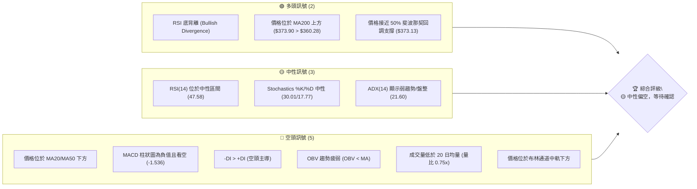

**儀表板解讀**：
當前AVGO的技術面呈現出多空交織的複雜局面。儘管長期趨勢仍由MA200支撐且存在RSI底背離的潛在看漲訊號，但短期內空頭力量佔據主導，價格未能有效站穩短期均線，MACD和成交量均發出看空訊號。ADX顯示當前市場處於盤整或弱勢趨勢，缺乏明確方向。綜合來看，市場需要更多明確訊號來確認未來的走勢。

### 📊 核心指標速覽表

下表彙整了AVGO當前的關鍵技術指標數值及其所傳達的訊號。

| 指標類別 | 指標名稱 | 當前數值 | 訊號 | 解讀 |
|----------|----------|----------|------|------|
| **價格** | 當前價格 | $373.90 | 🟡 | 位於52週區間 46.9% 處，中位偏下 |
| **均線** | MA20 | $381.76 | 🔴 | 價格位於短期均線下方，短期看空 |
| **均線** | MA50 | $407.93 | 🔴 | 價格位於中期均線下方，中期看空 |
| **均線** | MA200 | $360.28 | 🟢 | 價格位於長期均線上方，長期看多 |
| **動能** | RSI(14) | 47.58 | 🟡 | 位於中性區間，但存在底背離 |
| **動能** | MACD | -11.055 | 🔴 | MACD線在訊號線下方，柱狀圖為負，看空 |
| **波動** | ATR(14) | $16.51 | 🟡 | 每日波動約 4.42%，屬於中等偏高波動 |
| **趨勢** | ADX(14) | 21.60 | 🟡 | 趨勢強度弱，市場處於盤整階段 |
| **量能** | OBV趨勢 | OBV < MA | 🔴 | 量能疲弱，未確認價格走勢 |

### 🏆 技術評分卡

這張評分卡提供各項技術維度的量化評估，以100分為滿分，並以視覺化的進度條呈現。

```
╔══════════════════════════════════════════════════════════════╗
║             AVGO 技術評分卡 (2026-07-07)                     ║
╠══════════════════════════════════════════════════════════════╣
║ 趨勢強度      ████████░░░░░░░░░░░░  40/100  🟡 (ADX弱，MA混合) ║
║ 動能指標      ███████░░░░░░░░░░░░░  35/100  🔴 (MACD空，RSI中性)║
║ 支撐穩定度    ██████████████░░░░░░  70/100  🟢 (Fib 50%, MA200)║
║ 成交量配合    ████░░░░░░░░░░░░░░░░  20/100  🔴 (量縮，OBV弱)   ║
║ 形態完整度    ██████████░░░░░░░░░░  50/100  🟡 (潛在整理形態)   ║
║ 均線排列      ██████░░░░░░░░░░░░░░  30/100  🔴 (短期空，長期多) ║
╠══════════════════════════════════════════════════════════════╣
║ 綜合評分      ████████░░░░░░░░░░░░  41/100  🟡 (中性偏空)     ║
╚══════════════════════════════════════════════════════════════╝
```

**評分卡總結**：
AVGO的綜合技術評分顯示其目前處於一個中性偏空的狀態。儘管長期支撐相對穩固，但短期趨勢、動能和成交量均顯示出疲軟。RSI的底背離是一個值得關注的潛在積極訊號，可能預示著反彈的機會，但在缺乏其他指標確認之前，仍需保持謹慎。

---

## 2. 趨勢分析

對AVGO進行多時框架趨勢分析，可以更全面地理解其價格走勢的宏觀背景與當前微觀變化。從長期來看，該股展現出強勁的成長潛力，但在近期經歷了一次顯著的回調，目前處於盤整與方向選擇的階段。

### 🌐 多時框趨勢分析

以下Mermaid圖表展示了AVGO在不同時間框架下的趨勢判斷，從長期到短期進行層層遞進的分析。

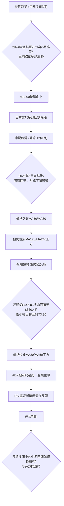

**多時框趨勢解讀**：
AVGO的長期走勢毫無疑問是強勁的多頭趨勢，股價從2024年的低點一路攀升至2026年5月的高點。MA200作為長期支撐線，目前仍穩固地位於價格下方，確認了這一長期結構。然而，從中期（週線）來看，自2026年5月的高點$446.06以來，股價經歷了顯著的回調，跌破了中期均線MA50和MA60，形成了一個下降通道。這種回調被視為長期上升趨勢中的健康修正。短期（日線）而言，市場處於盤整狀態，價格在短期內快速下跌後有所企穩。雖然ADX顯示趨勢強度不足且空頭佔優，但RSI的底背離訊號為短期反彈提供了潛在的依據。

### 📈 長期趨勢 — 12個月走勢圖（Unicode）

以下ASCII圖表展示了AVGO過去12個月的月線收盤價走勢，標註了關鍵的高點、低點及當前價格。

```
AVGO 月線走勢圖（過去12個月）
價格軸 ($)
$450 ┤                                  ●(446.06)
$440 ┤
$430 ┤
$420 ┤                      ●(416.77)
$410 ┤
$400 ┤              ●(400.71)
$390 ┤
$380 ┤                                        ●(377.75)
$370 ┤          ●(367.57)                       ●(373.90)←現在
$360 ┤                                  ●
$350 ┤                ●(344.83)
$340 ┤
$330 ┤            ●(328.07) ●(330.08)
$320 ┤                        ●(318.38)
$310 ┤                          ●(309.02)
$300 ┤
$290 ┤●(291.56)●(295.23)
     └──────────────────────────────────────────────────────────────────
      2025-07  2025-09  2025-11  2026-01  2026-03  2026-05  2026-07
```

**走勢特徵分析表格**：
下表詳細分析了AVGO過去12個月的價格走勢特徵、關鍵高低點及其對應的月度收盤價。

| 階段 | 月份區間 | 走勢特徵 | 關鍵價位 (收盤價) | 漲跌幅 (月度) | 累積漲跌幅 |
|------|----------|----------|-------------------|---------------|------------|
| **初期上漲** | 2025-07 ~ 2025-11 | 穩步上漲，動能強勁 | 低點: $291.56 (2025-07) <br> 高點: $400.71 (2025-11) | +3.1% ~ +10.2% | +37.4% |
| **首次回調** | 2025-12 ~ 2026-03 | 顯著回調，跌破$350 | 低點: $309.02 (2026-03) <br> 高點: $400.71 (2025-11) | -13.9% ~ -3.0% | -22.9% |
| **二次上漲** | 2026-04 ~ 2026-05 | 強勢反彈，創近期新高 | 低點: $309.02 (2026-03) <br> 高點: $446.06 (2026-05) | +34.8% ~ +7.0% | +44.3% |
| **近期回調** | 2026-06 ~ 2026-07 | 快速下跌，跌破$400 | 高點: $446.06 (2026-05) <br> 現價: $373.90 (2026-07) | -15.3% ~ -1.0% | -16.2% |

**分析**：
AVGO在過去12個月中呈現出先上漲後回調、再上漲再回調的「波浪式」上升趨勢。2026年5月創下的$446.06（月度收盤價）是近期的高點，但52週高點為$494.22，這表明在月度收盤價之外，日內或週內曾達到更高點。近期（2026年6月至7月）的回調幅度較大，從$446.06跌至$373.90，跌幅達16.2%，這使得股價回到了長期均線MA200上方，並接近重要的斐波那契回調支撐位。

### 📊 中期趨勢（週線分析）

中期趨勢主要由週線圖來判斷。從2026年5月的高點$446.06以來，AVGO的週線圖呈現出一個明顯的下跌趨勢。價格在$446.06、$429.32、$410.70等點形成一系列降低的高點，同時在$385.12、$365.02、$360.45等點形成一系列降低的低點（以週收盤價計），這構成了一個下降通道或下降楔形。

**近期壓力與支撐示意圖**：
```
AVGO 中期趨勢示意圖
══════════════════════════════════════════════════════════════════
$450 ┤                       R (446.06)
$440 ┤
$430 ┤                            R (429.32)
$420 ┤
$410 ┤                                 R (410.70)
$400 ┤
$390 ┤
$380 ┤                                    S (385.12)
$370 ┤                                        ◄ 現價 (373.90)
$360 ┤                                      S (365.02)
$350 ┤                                    S (360.45)
$340 ┤
$330 ┤
$320 ┤
$310 ┤
$300 ┤S (300.20)
     └──────────────────────────────────────────────────────────────
     時間軸
```
**分析**：
中期來看，AVGO的價格從5月高點$446.06開始回落，並連續跌破了多條短期及中期移動平均線。當前價格$373.90位於MA50 ($407.93) 和MA20 ($381.76) 的下方，顯示中期趨勢偏弱。然而，價格仍在MA200 ($360.28) 上方，這為中期下跌提供了重要的最後防線。從週線的收盤價來看，價格在$360.45（2026-07-05）形成了一個近期低點，隨後小幅反彈。如果能守住$360.28附近的MA200支撐，則中期回調有望結束。

### ⚡ 趨勢強度評估（ADX 解讀）

ADX (Average Directional Index) 用於衡量趨勢的強度，而非方向。+DI 和 -DI 則用於判斷趨勢的方向。

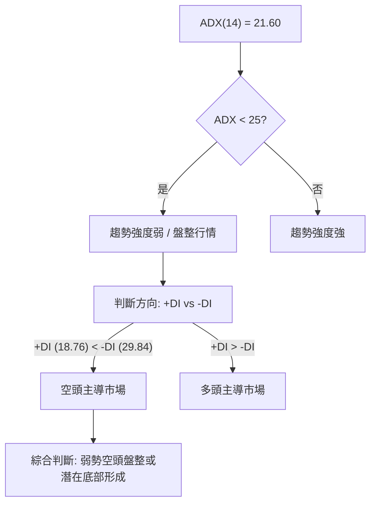

**ADX 強度對照表**：
| ADX 數值範圍 | 趨勢強度 | 市場判斷 |
|--------------|----------|----------|
| 0 - 25       | 弱趨勢   | 盤整、無趨勢 |
| 25 - 50      | 中等趨勢 | 趨勢形成、動能增強 |
| 50 - 75      | 強趨勢   | 趨勢明確、動能強勁 |
| 75 - 100     | 極強趨勢 | 趨勢極度強勁、可能超買/賣 |

**ADX 解讀**：
AVGO當前的ADX數值為21.60，根據對照表，這表明市場處於「弱趨勢」或「盤整行情」。這與我們觀察到的價格在經歷大幅回調後，目前缺乏明確方向的現象一致。此外，+DI (18.76) 明顯小於 -DI (29.84)，這表明在當前的弱勢趨勢中，空頭力量佔據主導地位。儘管ADX值低於25，通常意味著市場缺乏交易機會，但這也可能預示著在經歷一段區間震盪後，新的趨勢即將形成。投資者應密切關注ADX是否能突破25，以確認趨勢的啟動，同時關注+DI和-DI的交叉情況以判斷方向。

---

## 3. 圖表形態分析

圖表形態分析可以幫助我們識別市場心理和潛在的價格轉折點。儘管提供的數據是月度或週度收盤價，限制了對詳細K線形態的分析，但我們仍可以從價格的整體結構中識別出一些宏觀形態。

### 🔍 形態識別系統

從AVGO的歷史價格走勢和近期回調模式來看，我們目前主要觀察到一個潛在的**下降楔形 (Falling Wedge)** 形態，這通常被視為一個看漲的反轉形態。結合RSI的底背離，這一形態更具說服力。

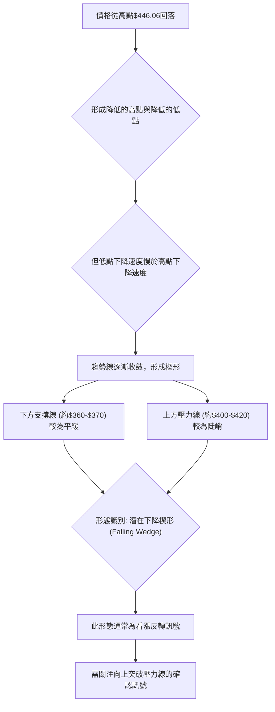

**形態解讀**：
自2026年5月高點$446.06以來，AVGO的價格呈現出震盪下跌的走勢。從週線圖來看，高點逐漸降低（$446.06 -> $429.32 -> $410.70），低點也逐漸降低（$385.12 -> $365.02 -> $360.45），但低點的下降斜率似乎較高點的下降斜率更為平緩，使得上下兩條趨勢線呈現收斂狀態，形成了潛在的下降楔形。這是一個典型的看漲反轉形態，暗示在下跌動能減弱後，股價有望向上突破。

### 🕯️ 重要K線形態分析

由於提供的數據是週收盤價，而非完整的K線（開盤、高、低、收），我們無法識別單一K線形態。然而，我們可以分析連續數週的價格行為和成交量變化，來推斷市場情緒。

| 月份區間 | 週收盤價區間 | RSI區間 | MACD柱狀圖區間 | 週成交量區間 | 市場情緒與K線特徵推斷 | 訊號 |
|----------|--------------|---------|----------------|--------------|--------------------------|------|
| 2026-03  | $300.20-$329.27 | 23.6-54.2 | -1.970-+1.026  | 111M-172M    | 底部震盪，出現超賣，隨後反彈。可能形成底部K線組合。 | 🟢 |
| 2026-04  | $314.05-$422.09 | 46.1-93.9 | -0.472-+9.261  | 90M-127M     | 強勢上漲，突破前期壓力。RSI極度超買，警示風險。 | 🟡 |
| 2026-05  | $413.49-$446.06 | 49.0-69.5 | -4.173-+0.366  | 85M-102M     | 高位震盪，量能縮減，動能轉弱，MACD柱狀圖轉負。 | 🔴 |
| 2026-06  | $365.02-$410.70 | 39.5-43.9 | -8.516--3.171  | 147M-251M    | 快速下跌，巨量拋售，形成長陰線實體或帶長上影線。 | 🔴 |
| 2026-07  | $360.45-$373.90 | 41.6-47.6 | -2.418--1.536  | 24M-103M     | 跌勢趨緩，量能縮小，RSI出現底背離。可能形成止跌K線。 | 🟢 |

**分析**：
從週度收盤價的變化來看，2026年3月底$300.20的低點伴隨著RSI的超賣（23.6），預示著一個潛在的買入機會。隨後4月份的強勁反彈，RSI飆升至93.9的極端超買區，顯示市場過熱。5月份價格在高位震盪，MACD柱狀圖轉負，預示動能減弱。6月份的巨量下跌則確認了回調的開始。而7月份最新的數據顯示，價格跌幅趨緩，成交量大幅萎縮，RSI出現底背離，這些都是止跌和潛在反轉的初步訊號。

### 📉 ASCII 走勢形態示意圖

以下ASCII圖表描繪了AVGO從2026年5月高點至今的潛在下降楔形形態。

```
AVGO 潛在下降楔形形態示意圖
══════════════════════════════════════════════════════════════════
$450 ┤          (R)
$440 ┤         / \
$430 ┤        /   \
$420 ┤       /     \ (R)
$410 ┤      /       \
$400 ┤     /         \
$390 ┤    /           \ (R)
$380 ┤   /             \
$370 ┤  /               ● (現價 $373.90)
$360 ┤ /                 \ (S)
$350 ┤/                   \
$340 ┤                     \
$330 ┤                      \
$320 ┤                       \
$310 ┤                        \
$300 ┤------------------------------------ (S)
     └──────────────────────────────────────────────────────────────
     時間軸

(R) - 降低的高點壓力線
(S) - 降低的低點支撐線 (斜率較緩)
```

**形態解讀**：
此示意圖直觀地展示了AVGO股價從高點回落的收斂形態。上方壓力線由一系列降低的高點連接而成，下方支撐線則由一系列降低的低點連接，但後者的斜率較前者平緩，導致兩線逐漸靠攏，形成楔形。這種形態通常在下跌趨勢末期出現，預示著賣壓正在減弱，買方力量逐漸積蓄，有望向上突破。

### 🎯 形態目標價計算

基於下降楔形形態，其目標價的計算通常是形態突破後的上漲幅度至少等於楔形最寬處的垂直距離，或回補至形態開始的高點。

1.  **形態開始高點 (頂部)**：$446.06 (2026年5月)
2.  **楔形寬度估計**：假設楔形在突破前的最寬處為2026年5月高點與2026年3月低點之間的波段，但更符合下降楔形的是其在下跌過程中形成的寬度。
    我們可以取2026年5月高點 $446.06 和2026年6月低點 $365.02 ($360.45) 形成的波段。
    假設楔形頂部壓力線與底部支撐線在突破點之前的最大垂直距離。
    如果我們考慮從 $446.06 開始的下跌，到 $360.45 結束，這是一個約 $85.61 的跌幅。
    **保守目標價估計**：
    若股價從當前位置 $373.90 向上突破，目標價至少是回補至形態開始的下跌點。
    -   **目標價 T1 (回補近期壓力)**：如果突破下降楔形，通常會先挑戰形態內的關鍵阻力位，例如 $407.93 (MA50) 和 $405.64 (BB上軌)。
    -   **目標價 T2 (形態高點)**：最理想的情況是回補至形態起始的高點 $446.06。
    -   **目標價 T3 (52週高點)**：如果市場情緒極度樂觀，甚至可能挑戰 $494.22 (52週高點)。

**計算方法與目標價**：
-   **頸線/壓力線突破**：下降楔形的突破點通常會是上漲的觸發點。當前上方壓力線約在 $390-$400 區間。
-   **形態高度**：取楔形開始處（2026年5月高點 $446.06）與隨後較低點（如2026年6月低點 $365.02 或2026年7月低點 $360.45）的垂直距離。
    垂直距離約 $446.06 - $360.45 = $85.61。
    若從當前價位 $373.90 向上突破，保守目標價可設定為突破點加上此距離的一半或三分之一。
    但更常見的目標價設定是回補至形態開始的高點。

**基於下降楔形形態的目標價推算**：
1.  **突破確認點**：假設價格成功突破上方壓力線，並站穩 $390.00。
2.  **最低目標價 (形態寬度投影)**：從突破點向上投影楔形的最大垂直距離。若以 $390.00 為突破點，加上 $85.61 的一部分，例如 $390.00 + ($85.61 * 0.5) = $390.00 + $42.80 = $432.80。
3.  **主要目標價 (回補高點)**：形態突破後，通常目標是回補至形態開始時的高點。
    -   **目標價 T1**：$405.64 (布林上軌 / 強阻力) - 這是短期的回補目標。
    -   **目標價 T2**：$446.06 (2026年5月高點) - 這是形態的完整回補目標。

---

## 4. 支撐與阻力

識別關鍵的支撐與阻力位對於制定交易策略至關重要。這些價位是過去買賣雙方激烈交鋒的區域，對未來的價格走勢具有引導作用。

### 🗺️ 關鍵價位分布圖（Unicode）

以下ASCII圖表清晰地展示了AVGO當前的關鍵支撐與阻力價位分布，以及現價所處的位置。

```
AVGO 價位結構分布圖
═══════════════════════════════════════════════════
$494.22 ║████████████████████████║ 52週高點 / 極強阻力 R4
$446.06 ║████████████████████████║ 強阻力 R3 (2026年5月高點)
$407.93 ║████████████████████    ║ 阻力 R2 (MA50)
$405.64 ║████████████████████████║ 關鍵阻力 R1 (布林上軌)
$381.76 ║▓▓▓▓▓▓▓▓▓▓▓▓▓▓▓▓        ║ 近期阻力 (MA20 / 布林中軌)
$373.90 ╠════════════════════════╣ ◄ 現價
$360.45 ║████████████████████████║ 近期支撐 S1 (2026年7月低點)
$360.28 ║████████████████████████║ 強支撐 S2 (MA200)
$357.87 ║████████████████████████║ 強支撐 S3 (布林下軌)
$355.77 ║████████████████████████║ 強支撐 S4 (61.8%斐波那契回調)
$300.20 ║████████████████████████║ 極強支撐 S5 (2026年3月低點)
$267.62 ║████████████████████████║ 52週低點 / 極強支撐 S6
═══════════════════════════════════════════════════
```

### 🚧 阻力位分析表

下表詳細分析了AVGO當前的關鍵阻力位、其形成原因、突破難度及重要性。

| 阻力級別 | 價位 | 形成原因 | 突破難度 | 重要性 |
|----------|------|----------|----------|--------|
| **R0**   | $381.76 | MA20 / 布林中軌 | 中等 | 短期趨勢轉變的關鍵 |
| **R1**   | $405.64 | 布林上軌 / 斐波那契23.6%回調 | 較高 | 中期反彈的初步目標 |
| **R2**   | $407.93 | MA50 | 較高 | 中期趨勢反轉的確認點 |
| **R3**   | $446.06 | 2026年5月高點 | 高 | 形態突破後的強勁目標 |
| **R4**   | $494.22 | 52週高點 | 極高 | 長期上漲趨勢的終極挑戰 |

**分析**：
AVGO目前面臨來自MA20和布林中軌的即時阻力$381.76。若能成功突破此處，則上方更強的阻力位於MA50 ($407.93) 和布林上軌 ($405.64) 附近，這些價位將是中期反彈的關鍵考驗。最重的阻力則來自於2026年5月高點$446.06以及52週高點$494.22。突破這些水平需要極大的買盤動能。

### 🛡️ 支撐位分析表

下表詳細分析了AVGO當前的關鍵支撐位、其形成原因、守住機率及重要性。

| 支撐級別 | 價位 | 形成原因 | 守住機率 | 重要性 |
|----------|------|----------|----------|--------|
| **S0**   | $373.13 | 50%斐波那契回調 | 中等 | 當前價格附近的關鍵心理支撐 |
| **S1**   | $360.45 | 2026年7月近期低點 | 較高 | 短期止跌的初步防線 |
| **S2**   | $360.28 | MA200 | 較高 | 長期上升趨勢的生命線，極其重要 |
| **S3**   | $357.87 | 布林下軌 | 較高 | 價格超賣區間的技術支撐 |
| **S4**   | $355.77 | 61.8%斐波那契回調 | 極高 | 技術分析中極強的反轉支撐位 |
| **S5**   | $300.20 | 2026年3月低點 | 極高 | 歷史性強支撐，若跌破則趨勢惡化 |

**分析**：
AVGO目前正處於一個強大的支撐區域。50%斐波那契回調位$373.13與當前價格$373.90極為接近，顯示此處存在買盤支撐。下方$360.45的近期低點、MA200的$360.28以及布林下軌$357.87共同構成了短期內的第一道防線。更為關鍵的支撐位於61.8%斐波那契回調位$355.77，這是技術分析中常被視為反轉點的強勁支撐。若這些支撐位都能被有效守住，則AVGO有望在此處築底反彈。

### 📐 斐波那契回調位分析

我們以2026年3月低點 ($300.20) 至2026年5月高點 ($446.06) 的上漲波段作為基準，計算其主要斐波那契回調位。

-   **上漲波段**：$446.06 - $300.20 = $145.86

| 斐波那契回調比例 | 回調價位 (從高點回撤) | 意義 |
|------------------|-----------------------|------|
| **23.6%**        | $446.06 - ($145.86 * 0.236) = **$411.59** | 淺層回調，若在此止跌顯示強勢 |
| **38.2%**        | $446.06 - ($145.86 * 0.382) = **$390.69** | 較常見的回調深度，可能出現反彈 |
| **50.0%**        | $446.06 - ($145.86 * 0.500) = **$373.13** | 心理學上的重要回調位，常有支撐 |
| **61.8%**        | $446.06 - ($145.86 * 0.618) = **$355.77** | 黃金分割點，極強的潛在反轉支撐 |
| **76.4%**        | $446.06 - ($145.86 * 0.764) = **$334.69** | 深度回調，趨勢可能面臨考驗 |

**斐波那契回調視覺化**：
```
AVGO 斐波那契回調示意圖 (從 $300.20 到 $446.06)
════════════════════════════════════════════════════════════════════════
$446.06 ═╗ (100% - 高點)
          ║
$411.59 ═╣ (23.6% 回調)
          ║
$390.69 ═╣ (38.2% 回調)
          ║
$373.90 ╠═══ 現價
$373.13 ═╣ (50.0% 回調) ◄◄◄ 關鍵！
          ║
$355.77 ═╣ (61.8% 回調) ◄◄◄ 黃金分割點！
          ║
$334.69 ═╣ (76.4% 回調)
          ║
$300.20 ═╝ (0% - 低點)
════════════════════════════════════════════════════════════════════════
```

**分析**：
AVGO當前價格$373.90非常接近其近期上漲波段的50%斐波那契回調位$373.13。這是一個極其重要的支撐區域，歷史上許多股票在50%回調處獲得支撐並反彈。如果此處未能守住，下一個強勁支撐將是61.8%斐波那契回調位$355.77，這與MA200 ($360.28) 和布林下軌 ($357.87) 構成了一個密集的支撐區，為潛在的反彈提供了堅實的基礎。

---

## 5. 技術指標深度解讀

本節將對AVGO的各項技術指標進行詳盡分析，探討它們如何相互作用，共同描繪出當前的市場圖景。

### 🎛️ 指標訊號總覽

以下Mermaid圖表展示了各個主要技術指標之間的訊號關係，以及它們如何匯聚成一個綜合判斷。

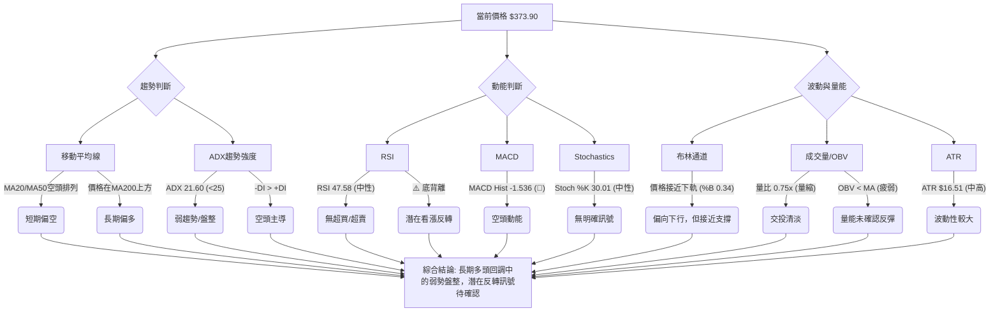

### 📈 移動平均線排列分析

移動平均線 (MA) 提供不同時間框架下的趨勢方向和支撐/阻力位。AVGO的均線系統顯示出短期與長期趨勢的背離。

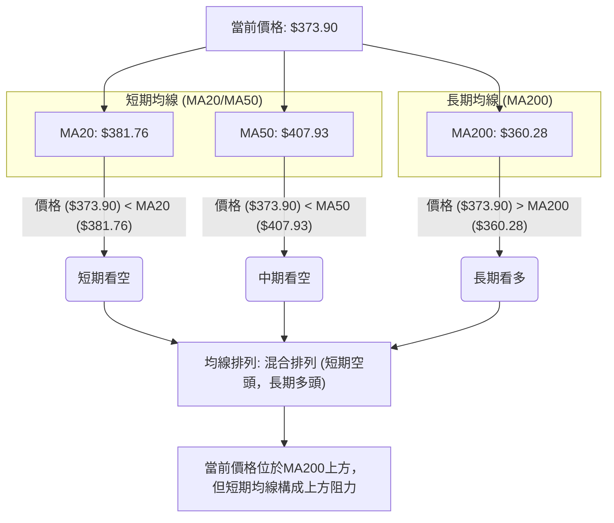

**均線排列狀態**：
| 均線類型 | 數值 | 價格關係 | 訊號 | 解讀 |
|----------|------|----------|------|------|
| MA20     | $381.76 | 價格下方 | 🔴 | 短期趨勢偏空，MA20構成即時阻力 |
| MA50     | $407.93 | 價格下方 | 🔴 | 中期趨勢偏空，MA50構成較強阻力 |
| MA200    | $360.28 | 價格上方 | 🟢 | 長期趨勢保持多頭，MA200提供關鍵支撐 |
| 均線排列 | 混合排列 | MA200 > 現價 > MA20 > MA50 (非標準空頭或多頭排列) | 🟡 | 市場處於長期多頭中的中期回調或短期盤整 |

**分析**：
AVGO的均線系統呈現「混合排列」。價格目前位於短期MA20 ($381.76) 和中期MA50 ($407.93) 的下方，這表明短期和中期趨勢均偏向空頭，這些均線將在股價反彈時構成阻力。然而，最關鍵的是價格仍穩穩地位於長期MA200 ($360.28) 的上方，這強烈暗示儘管經歷了大幅回調，但AVGO的長期上升趨勢結構並未被破壞。MA200將成為股價下跌的強勁支撐位。

### 📉 RSI(14) 分析

相對強弱指標 (RSI) 用於衡量價格變動的速度和幅度，判斷超買或超賣狀態。

-   **RSI(14) 數值**：47.58
-   **RSI 數值進度條**：
    RSI 強度：▓▓▓▓▓▓▓▓▓▓░░░░░░░░░░  47.58 (中性)
-   **超買超賣區間分析**：
    -   RSI 位於 30-70 的中性區間 (47.58)，既非超買也非超賣，表明市場情緒相對平衡。
    -   然而，值得注意的是，在2026年3月29日，RSI曾跌至23.6，進入超賣區，隨後價格出現強勁反彈。而在2026年4月19日，RSI飆升至93.9，達到極度超買，隨後價格開始回調。當前RSI位於47.58，顯示賣壓有所緩解，但買盤動能尚未完全恢復。
-   **背離判斷**：
    -   **⚠️ 底背離 (Bullish Divergence)**：數據明確指出AVGO存在RSI底背離。根據提供的週數據，我們可以觀察到：
        -   2026-06-07 收盤價 $385.12，RSI 39.5
        -   2026-07-05 收盤價 $360.45，RSI 41.6
        在此期間，價格創下了更低的收盤價（從$385.12到$360.45），但RSI卻創下了更高的低點（從39.5到41.6）。這種「價格創新低，RSI未創新低」的現象正是典型的底背離，這是一個重要的看漲反轉訊號，暗示賣壓正在減弱，多頭力量可能即將積蓄並推動股價反彈。這與前面形態分析中的下降楔形形態相互印證。

### 📊 MACD(12/26/9) 訊號解讀

平滑異同移動平均線 (MACD) 用於識別趨勢變化、動能和潛在的買賣訊號。

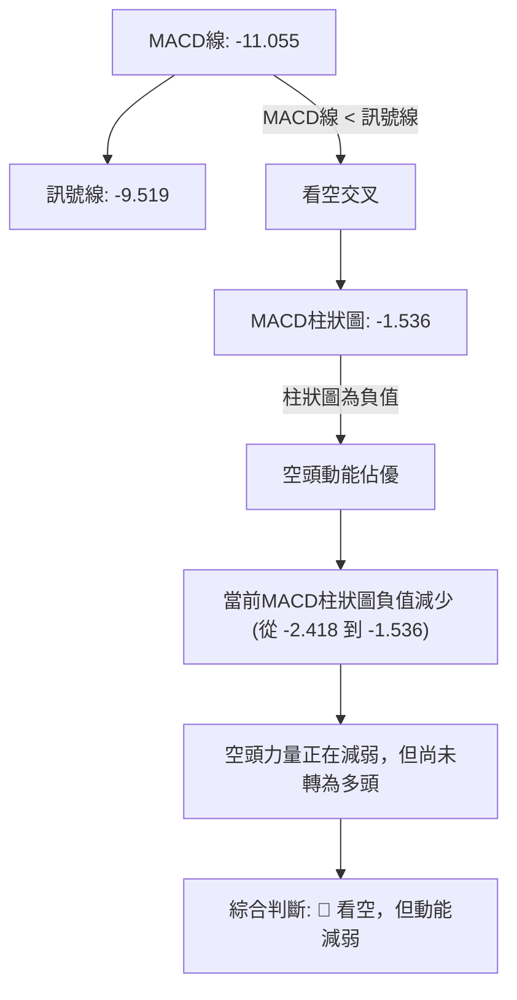

**MACD 分析**：
-   **MACD線 (-11.055) 位於訊號線 (-9.519) 下方**：這是一個典型的看空交叉，表明短期動能弱於中期動能，趨勢偏向下行。
-   **MACD柱狀圖 (-1.536) 為負值**：柱狀圖是MACD線與訊號線的差值，負值表明MACD線低於訊號線，確認了空頭動能的佔優。
-   **柱狀圖趨勢**：從2026-07-05的-2.418到2026-07-12的-1.536，柱狀圖的負值正在縮小。這是一個積極的訊號，表明空頭動能正在減弱，如果柱狀圖能進一步縮小並轉為正值，將會形成看漲交叉，確認短期反轉。
-   **背離判斷**：從MACD柱狀圖的趨勢來看，雖然價格在近期有創新低（以週收盤價計），但MACD柱狀圖並未創出更低的負值，反而有所收斂，這也間接支持了動能減弱和潛在底背離的觀點。

**綜合判斷**：MACD目前仍顯示空頭主導，但空頭動能正在減弱，需密切關注MACD線是否能向上穿越訊號線，形成黃金交叉。

### 📦 布林通道分析

布林通道 (Bollinger Bands) 用於衡量價格的波動率和相對高低。

-   **BB上軌**：$405.64
-   **BB中軌 (MA20)**：$381.76
-   **BB下軌**：$357.87
-   **當前收盤價**：$373.90
-   **BB %B**：0.34 (0=下軌, 0.5=中軌, 1=上軌)

**ASCII 布林通道示意圖**：
```
AVGO 布林通道示意圖
════════════════════════════════════════════════════════════════════════
$405.64 ═╗ (上軌)
          ║
$381.76 ═╣ (中軌 MA20)
          ║
$373.90 ╠═══ 現價
          ║
$357.87 ═╣ (下軌)
          ║
          ╚════════════════════════════════════════════════════════════════════════
```

**分析**：
AVGO的股價目前位於布林通道的中軌 ($381.76) 和下軌 ($357.87) 之間，且更靠近中軌 ($373.90 vs $381.76)。%B 值為0.34，表明價格處於通道的下半部分，這與當前偏弱的短期趨勢一致。通道整體呈現收斂跡象，暗示波動率可能正在下降，預示著在某個方向上可能會出現價格突破。如果價格能向上突破中軌，則有機會挑戰上軌；反之，若跌破下軌，則可能加速下跌。當前價格接近中軌，若能站穩中軌上方，將是止跌反彈的積極訊號。

### 💹 成交量分析（量價配合度）

成交量是價格走勢的「燃料」，其變化對於確認趨勢的有效性至關重要。

-   **最新成交量**：24,505,200
-   **20日均量**：32,536,550
-   **50日均量**：27,296,698
-   **量比 (最新/20日均量)**：0.75x

**OBV 趨勢**：OBV < MA → 量能疲弱

**分析**：
AVGO的最新成交量24,505,200股，遠低於其20日均量32,536,550股（量比0.75x），也低於50日均量。這表明當前市場交投清淡，缺乏足夠的買盤或賣盤動能來推動價格產生大幅變化。
-   **量價配合度**：在近期價格從高點回落的過程中，2026年6月份的下跌伴隨著巨量（251M, 175M），這確認了強勁的賣壓。而當前價格在低位企穩的反彈（從$360.45到$373.90）卻伴隨著縮量，這是一個**負面訊號**。縮量上漲通常被視為缺乏持續性的表現，意味著買盤力量不足以支持股價持續上揚。
-   **OBV趨勢**：OBV (On Balance Volume) 趨勢疲弱，顯示「OBV < MA」。OBV是一種累積性的量能指標，當OBV處於下降趨勢或低於其移動平均線時，表明累積的買盤壓力不足或賣盤壓力佔優，未能有效推動價格上漲。這與縮量上漲的判斷一致，均暗示當前反彈的質量不高。

**總結**：成交量分析顯示，AVGO的近期反彈缺乏量能配合，這使得其反彈的持續性存疑。若要確認止跌回升，必須看到成交量在股價上漲時顯著放大。

---

## 6. 動能與波動率

動能和波動率是衡量股票健康狀況和交易機會的兩個重要維度。動能評估股票價格變化的速度和強度，而波動率則反映價格變動的幅度。

### ⚡ 動能評估四象限

我們將AVGO當前的動能和波動率狀況進行分類，以判斷其所處的市場階段。

| 象限 | 動能 | 波動 | 當前狀態 (AVGO) | 評估 | 訊號 |
|------|------|------|-----------------|------|------|
| Q1   | 強   | 低   | -               | 最佳機會 (趨勢明確，風險可控) | - |
| Q2   | 弱   | 低   | ✓               | 謹慎觀望 (盤整或趨勢末期，等待方向) | 🟡 |
| Q3   | 強   | 高   | -               | 高風險高收益 (趨勢強勁，但波動大) | - |
| Q4   | 弱   | 高   | -               | 避免進場 (方向不明，風險高) | - |

**動能評估分析**：
-   **動能**：AVGO的MACD柱狀圖仍為負值，ADX顯示弱趨勢，且+DI < -DI，這些都表明當前動能偏弱。儘管RSI存在底背離，暗示潛在動能轉換，但尚未完全確認。因此，動能目前被評估為「弱」。
-   **波動**：ATR(14)為$16.51，佔價格的4.42%，這是一個中等偏高的波動率。相較於之前大幅下跌的階段，波動率有所收斂，但仍保持在一定水平。
-   **綜合判斷**：AVGO目前處於「弱動能、中等偏高波動」的狀態。這將其置於Q2象限，但由於波動率並非極低，更接近於Q4和Q2的邊緣。結合ADX的弱趨勢和MACD的看空，以及RSI底背離的潛在訊號，AVGO目前處於一個複雜的盤整階段，市場方向不明確，適合謹慎觀望，等待更明確的突破或反轉訊號。

### 📊 ATR 波動率分析

平均真實波幅 (ATR) 用於衡量資產價格的波動性，提供每日價格變動的平均範圍。

-   **ATR(14)**：$16.51
-   **佔價格百分比**：4.42%

**ATR 進度條**：
波動率強度：▓▓▓▓▓▓▓▓▓░░░░░░░░░░░░  44.2% (中等偏高)

**分析**：
AVGO當前的ATR(14)為$16.51，佔其收盤價$373.90的4.42%。這表明AVGO在過去14天內平均每日波動幅度約為$16.51。
-   **波動率水平**：4.42%的日波動率對於大型科技股而言屬於中等偏高水平。這意味著AVGO的價格變動相對活躍，適合日內交易者，但對於波段或長線投資者來說，需要更寬鬆的止損空間。
-   **止損距離建議**：ATR是設定止損點的良好參考。一般建議將止損設置在1到3倍ATR的範圍。
    -   **保守止損**：1 * ATR = $16.51。若進場，止損可設在進場價下方約$16.51。
    -   **標準止損**：1.5 * ATR = $24.76。
    -   **寬鬆止損**：2 * ATR = $33.02。
    例如，如果考慮在$373.90附近進場做多，一個合理的止損點可能在$373.90 - $24.76 = $349.14 附近，這也接近61.8%斐波那契回調位和MA200，提供了多重支撐。

### 📐 Beta 與市場相關性

Beta 值衡量單一股票相對於整體市場（如標準普爾500指數）的波動性。數據中未提供AVGO的Beta值。

**分析**：
由於數據中未提供AVGO的Beta值，我們無法直接量化其與大盤的相關性。然而，Broadcom Inc.作為一家大型半導體公司，通常會被視為科技板塊的重要組成部分。半導體行業的股票普遍具有較高的Beta值，因為它們的業績和股價對經濟週期和市場情緒變化較為敏感。因此，我們可以合理推斷AVGO的Beta值可能高於1，意味著其股價波動幅度可能大於整體市場。投資者在考慮AVGO時，應將其視為一個相對高波動的資產，其走勢可能放大市場的漲跌。

---

## 7. 多時框架總結

本節將對AVGO在不同時間框架下的技術訊號進行綜合評估，以形成一個全面的市場觀點。

### 📋 時框架評分表

下表總結了AVGO在短期、中期和長期時間框架下的關鍵技術指標表現，並給出了綜合評分和建議。

| 時框架 | 趨勢方向 | 動能 | 均線排列 | 形態 | 綜合評分 (1-10) | 建議 |
|--------|----------|------|----------|------|-----------------|------|
| **短期 (日線)** | 🔴 下跌後盤整 | 🟡 弱勢，但有底背離 | 🔴 價格在MA20/50下方 | 🟡 下降楔形 | 4/10 | 謹慎觀望，等待突破 |
| **中期 (週線)** | 🟡 回調中 | 🟡 減弱中 | 🔴 價格在MA50下方 | 🟡 下降楔形 | 5/10 | 尋找止跌訊號，逢低關注 |
| **長期 (月線)** | 🟢 上升趨勢 | 🟢 潛力強勁 | 🟢 價格在MA200上方 | 🟢 良好 | 8/10 | 長期看多，回調是買入機會 |

**分析**：
-   **短期**：AVGO短期內處於下跌後的盤整階段，儘管RSI底背離提供了潛在反彈的線索，但MACD和均線排列仍偏空，量能不足。綜合評分偏低，建議短期內保持謹慎。
-   **中期**：中期趨勢處於回調之中，但下降楔形形態和RSI底背離暗示中期下跌動能正在減弱。價格仍在MA200上方，為中期企穩提供了基礎。評分中性，可開始關注止跌訊號。
-   **長期**：長期來看，AVGO的上升趨勢依然強勁，價格穩固地位於MA200之上。當前的回調被視為健康修正，為長期投資者提供了逢低買入的機會。評分較高，長期前景樂觀。

### 🔲 綜合訊號矩陣

以下矩陣展示了AVGO在各個技術維度上的訊號一致性。

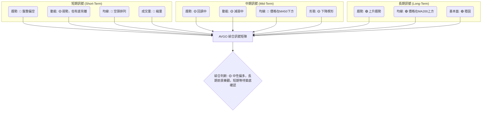

**矩陣分析**：
從綜合訊號矩陣來看，AVGO的短期和中期訊號大多偏空或中性，顯示出當前市場的疲軟和不確定性。價格未能站穩短期均線，MACD和成交量均提供負面訊號。然而，RSI的底背離和潛在的下降楔形形態為短期和中期帶來了一絲希望，預示著潛在的反轉。最重要的是，長期訊號依然強勁，價格始終位於MA200上方，表明當前的回調是長期牛市中的一次健康修正。

**總結**：AVGO目前處於一個複雜的市場階段，短期內仍有壓力，但長期前景依然樂觀。投資者應密切關注短期止跌訊號的確認，例如成交量放大、MACD轉為黃金交叉、價格成功突破短期均線和下降楔形上軌。

---

## 8. 交易策略建議

基於上述詳盡的技術分析，AVGO目前處於一個長期上升趨勢中的中期回調和短期盤整階段。雖然短期動能偏弱，但RSI底背離和斐波那契50%回調支撐提供了潛在的反彈機會。

### 🗺️ 策略決策流程圖

以下Mermaid流程圖展示了針對AVGO當前市場狀況的策略選擇邏輯。

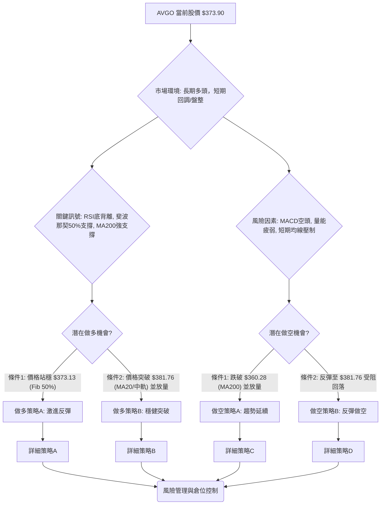

### 🟢 多頭策略詳情

考慮到RSI底背離和斐波那契50%回調支撐，AVGO存在潛在的反彈機會。

| 策略要素 | 策略 A：激進反彈策略 (Reversal Play) | 策略 B：穩健突破策略 (Breakout Play) |
|----------|--------------------------------------|--------------------------------------|
| **進場條件** | 價格在 $373.13 (50% Fib) 附近企穩，並出現明顯止跌K線（如錘頭線、啟明星組合）或RSI向上突破50。 | 價格向上突破 $381.76 (MA20/布林中軌)，並伴隨成交量放大至20日均量以上。 |
| **進場價格** | $374.00 - $375.00 | $382.00 - $383.00 |
| **目標價 T1** | $390.69 (38.2% Fib) | $405.64 (布林上軌) / $407.93 (MA50) |
| **目標價 T2** | $411.59 (23.6% Fib) / $407.93 (MA50) | $446.06 (2026年5月高點) |
| **止損價格** | $355.00 (略低於61.8% Fib $355.77 和MA200 $360.28) | $370.00 (略低於當前價和50% Fib，確保突破有效性) |
| **風險報酬比** | (以$374進場為例) <br> 風險: $374 - $355 = $19 <br> 報酬T1: $390.69 - $374 = $16.69 <br> 報酬T2: $411.59 - $374 = $37.59 <br> **約 1:0.9 ~ 1:2.0** | (以$382進場為例) <br> 風險: $382 - $370 = $12 <br> 報酬T1: $405.64 - $382 = $23.64 <br> 報酬T2: $446.06 - $382 = $64.06 <br> **約 1:2.0 ~ 1:5.3** |
| **成功機率** | 55% (潛在底背離支撐) | 60% (突破確認動能) |
| **建議倉位** | 10-15% | 15-20% |

### 🔴 空頭策略詳情

如果AVGO未能守住關鍵支撐並繼續下跌，則可考慮做空策略。

| 策略要素 | 策略 C：趨勢延續策略 (Breakdown Play) | 策略 D：反彈做空策略 (Fade the Rally) |
|----------|--------------------------------------|--------------------------------------|
| **進場條件** | 價格跌破 $355.77 (61.8% Fib & MA200) 並伴隨成交量放大。 | 價格反彈至 $381.76 (MA20/中軌) 或 $390.69 (38.2% Fib) 受阻，並出現明顯看跌K線形態。 |
| **進場價格** | $355.00 - $354.00 | $380.00 - $381.00 |
| **目標價 T1** | $334.69 (76.4% Fib) | $360.28 (MA200) / $357.87 (布林下軌) |
| **目標價 T2** | $300.20 (2026年3月低點) | $355.77 (61.8% Fib) |
| **止損價格** | $370.00 (上方約1.5倍ATR，確保跌破有效性) | $395.00 (略高於38.2% Fib，確保反彈受阻) |
| **風險報酬比** | (以$355進場為例) <br> 風險: $370 - $355 = $15 <br> 報酬T1: $355 - $334.69 = $20.31 <br> 報酬T2: $355 - $300.20 = $54.80 <br> **約 1:1.3 ~ 1:3.6** | (以$380進場為例) <br> 風險: $395 - $380 = $15 <br> 報酬T1: $380 - $360.28 = $19.72 <br> 報酬T2: $380 - $355.77 = $24.23 <br> **約 1:1.3 ~ 1:1.6** |
| **成功機率** | 50% (需市場恐慌情緒) | 55% (符合短期空頭趨勢) |
| **建議倉位** | 10-15% | 10-15% |

### ⭐ 整體訊號強度評星

綜合考量AVGO當前的多空訊號、形態分析和指標狀態，其整體交易訊號強度如下：

```
做多訊號強度：★★★☆☆  (3/5星) 考慮到RSI底背離和斐波那契支撐，有潛在反彈空間，但需確認。
做空訊號強度：★★☆☆☆  (2/5星) 短期偏空，但長期趨勢仍向上，且接近重要支撐，做空空間有限。
整體可信度：  ★★★☆☆  (3/5星) 市場處於關鍵轉折點，訊號複雜，需要耐心等待確認。
```

**結論**：AVGO目前更傾向於尋找築底反彈的機會，但由於空頭力量尚未完全消退且量能不足，建議採取穩健的做多策略，等待明確的突破訊號。如果支撐位未能守住，則空頭策略也應納入考慮，但風險相對較高。

---

## 9. 風險提示與監控

在複雜的市場環境下，風險管理和持續監控對於保護投資至關重要。

### ✅ 關鍵監控指標 Checklist

以下ASCII方框圖列出了在AVGO交易中需要密切關注的關鍵技術指標和價格行為。

```
╔══════════════════════════════════════════════════════════════╗
║               AVGO 關鍵監控指標清單                          ║
╠══════════════════════════════════════════════════════════════╣
║ [ ] 價格是否站穩 $373.13 (50%斐波那契回調)                     ║
║ [ ] 價格是否突破 $381.76 (MA20 / 布林中軌) 並放量              ║
║ [ ] RSI 是否向上突破 50，並保持在50上方                         ║
║ [ ] MACD 線是否向上穿越訊號線，柱狀圖轉為正值                  ║
║ [ ] 成交量是否在股價上漲時顯著放大 (超過20日均量)              ║
║ [ ] ADX 是否突破 25，且 +DI 向上穿越 -DI                       ║
║ [ ] 價格是否跌破 $355.77 (61.8%斐波那契回調 / MA200) 並放量    ║
║ [ ] 是否出現新的看跌K線形態或反轉訊號 (如雙頂、頭肩頂)         ║
║ [ ] 宏觀經濟或半導體產業是否有重大負面新聞                      ║
╚══════════════════════════════════════════════════════════════╝
```

### ⚠️ 風險場景分析

以下Mermaid圖表展示了AVGO未來可能的三種情境分析。

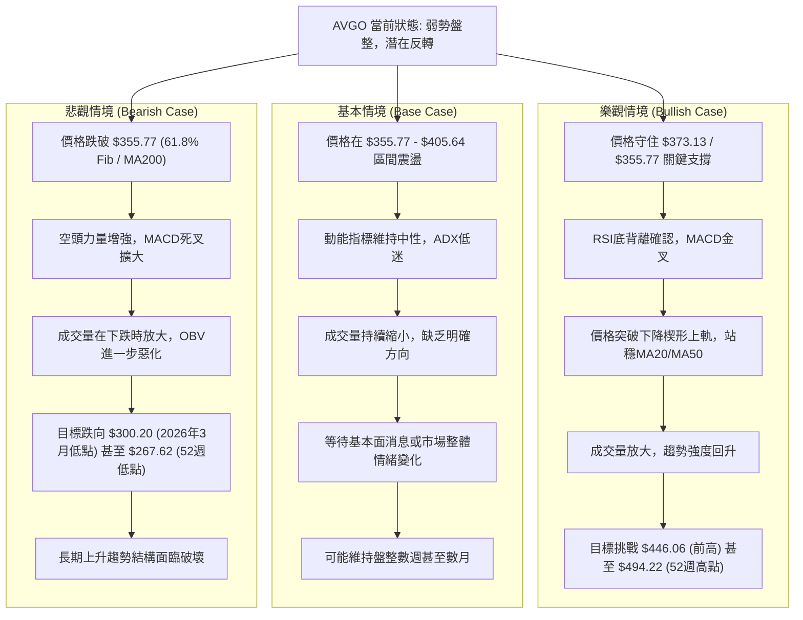

### 🛡️ 風險管理重要提醒

1.  **止損嚴格執行**：無論採取何種策略，都必須嚴格設置並執行止損點。ATR是設定止損距離的有效工具，建議將止損設置在1.5到2倍ATR的範圍外，以避免被正常波動洗出。
2.  **倉位控制**：在市場方向不明朗或波動較大時，應嚴格控制倉位大小，避免過度集中。建議單一股票倉位不超過總投資組合的10-20%。對於高風險策略，倉位應更小。
3.  **分批建倉/減倉**：可以考慮分批建倉以分散風險，並在達到目標價時分批減倉以鎖定利潤。
4.  **關注宏觀環境**：半導體行業對宏觀經濟和利率政策高度敏感。持續關注全球經濟數據、通脹報告和聯準會政策聲明，以及AI等新興技術的發展，這些都可能影響AVGO的股價走勢。
5.  **警惕假突破/假跌破**：在盤整行情中，價格常會出現假突破或假跌破，誘使交易者入場。應等待價格在突破或跌破關鍵價位後，有足夠的量能配合和持續性才能確認趨勢。
6.  **基本面配合**：雖然本報告是技術分析，但長期而言，基本面是股價的最終驅動力。關注公司財報、營收指引、新產品發布及分析師評級變化。

---

## 📋 報告總結

```
AVGO 技術分析報告總結
════════════════════════════════════════════════════════
報告日期：2026-07-07
當前價格：$373.90
分析評級：⚖️ 中性偏多 (長期趨勢向上，短期回調提供潛在買入機會，但需確認築底訊號)

關鍵結論：
├─ 長期趨勢：🟢 強勁上升趨勢，價格位於MA200上方，結構未被破壞。
├─ 中期趨勢：🟡 回調中，價格位於MA50下方，但RSI底背離和斐波那契支撐提供潛在反轉動力。
├─ 短期趨勢：🟡 弱勢盤整，MACD空頭，量能萎縮，但止跌訊號初現。
├─ 關鍵支撐：$373.13 (50% Fib), $360.28 (MA200), $355.77 (61.8% Fib)。
├─ 關鍵阻力：$381.76 (MA20/中軌), $407.93 (MA50), $446.06 (2026年5月高點)。
└─ 分析師目標：$523.73 (平均目標價，顯示長期看好)。

最優策略組合：
1. 🥇 **最佳機會**：等待價格在 $373.13 或 $355.77 附近築底成功，RSI底背離確認，MACD柱狀圖轉正，並伴隨成交量放大，可採取激進反彈做多策略，目標 $405.64 - $446.06。
2. 🥈 **次選機會**：價格成功突破 $381.76 (MA20/中軌) 並站穩，成交量顯著放大，則可採取穩健突破做多策略，目標 $405.64 - $446.06。
3. 🥉 **保守選擇**：若未能有效突破阻力，或跌破 $355.77 關鍵支撐，則觀望為主，或考慮反彈做空策略，但需嚴格控制風險。
════════════════════════════════════════════════════════
```

---

> ⚠️ **免責聲明**：本報告為 AI 自動生成之技術分析，所有數據及估算均基於提供的歷史價格資訊。本報告**僅供研究與學術參考**，**不構成任何投資建議**。投資有風險，入市需謹慎。

---

*報告生成時間：2026-07-07 ｜ 數據來源：Yahoo Finance ｜ 分析框架：多時框技術分析*