<details>
<summary>📊 靜態圖表 (點擊展開)</summary>
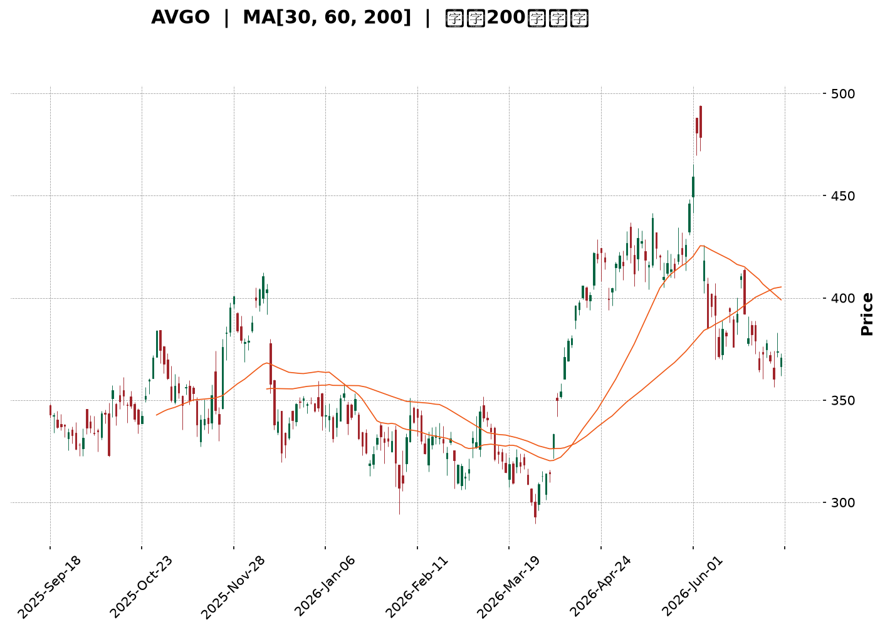
</details>

<html>
<head><meta charset="utf-8" /></head>
<body>
    <div style="height:500px; width:100%;">                        <script>window.PlotlyConfig = {MathJaxConfig: 'local'};</script>
        <script charset="utf-8" src="https://cdn.plot.ly/plotly-3.6.0.min.js" integrity="sha256-QaOVwtVY0T02VaHrr6pnoHLCwayMJp4O5n4YyaE3rJk=" crossorigin="anonymous"></script>                <div id="candlestick-chart" class="plotly-graph-div" style="height:100%; width:100%;"></div>            <script>                window.PLOTLYENV=window.PLOTLYENV || {};                                if (document.getElementById("candlestick-chart")) {                    Plotly.newPlot(                        "candlestick-chart",                        [{"close":{"dtype":"f8","bdata":"AAAAgGhtdUAAAABA5WZ1QAAAAIBuDnVAAAAAYNEQdUAAAABgtBZ1QAAAAMCh43RAAAAAwKbKdEAAAACAKWF0QAAAAKAkgXRAAAAAYIO4dEAAAADAuQR1QAAAAMC\u002fB3VAAAAA4OzZdEAAAABAkOh0QAAAAIAxeXVAAAAAQI5xdUAAAABAIi10QAAAAABlK3ZAAAAAIGVjdUAAAADg89V1QAAAAGDSAnZAAAAAgCG2dUAAAAAAs7R1QAAAAKABTHVAAAAA4HQmdUAAAADg8GV1QAAAAACBAnZAAAAAYISAdkAAAACAQy53QAAAAIBD\u002fXdAAAAAwPNld0AAAAAgH\u002fl2QAAAAOB4iHZAAAAAoKjfdUAAAADgq092QAAAAKC7GXZAAAAA4Li3dUAAAADASEZ2QAAAACD633VAAAAAwNgTdkAAAABgXSF1QAAAAODSSHVAAAAAwNhLdUAAAACgoyl1QAAAACAeB3ZAAAAAADKOdUAAAACA3SR1QAAAAICofXdAAAAA4CXud0AAAACAq7V4QAAAAMBtC3lAAAAAoNr+d0AAAADgGLd3QAAAAIDSp3dAAAAAQIGud0AAAAAgC0F4QAAAAMDV7XhAAAAAoGlAeUAAAABgsqp5QAAAAICvQXlAAAAAQMledkAAAAAAqR51QAAAAABeNnVAAAAA4D9DdEAAAABgqoB0QAAAACBpJ3VAAAAAQCZDdUAAAABgm8B1QAAAAED0znVAAAAA4GbtdUAAAAAgucF1QAAAAEAOyXVAAAAAwEaNdUAAAACggaV1QAAAAMCNYnVAAAAAACJodUAAAAAg1GN1QAAAAOAntHRAAAAAIEN7dUAAAABgre51QAAAAKDvFHZAAAAAAEgqdUAAAABALVx1QAAAAOC05nVAAAAAoBG2dEAAAADgfXl0QAAAAOC5RHRAAAAAgAHuc0AAAAAghjp0QAAAAAAZuXRAAAAAYEXAdEAAAABAQph0QAAAAEBYoXRAAAAA4FCedEAAAAAAePJzQAAAAOC1LnNAAAAAIO1Vc0AAAACgK7t0QAAAAMDXanVAAAAAYAwzdUAAAABACFh1QAAAAOBFn3RAAAAAAKA\u002fdEAAAADAHLV0QAAAAECTxHRAAAAAADrMdEAAAACg3bZ0QAAAAKAKknRAAAAA4LlEdEAAAAAgcrF0QAAAAABPCHRAAAAAAAnmc0AAAADgZdpzQAAAAMACi3NAAAAAYNXFc0AAAABAx7h0QAAAAABGlHRAAAAAYLKHdUAAAACgKVV1QAAAAOAPRXVAAAAAgMrrdEAAAABgpA90QAAAAOCjO3RAAAAAgBcCdEAAAADgU6xzQAAAAICo6nNAAAAAIO1Vc0AAAACgASB0QAAAAMCX3HNAAAAAQObkc0AAAACg5U5zQAAAACBHw3JAAAAAQCRPckAAAADAVVBzQAAAAADqj3NAAAAA4Nigc0AAAAAg7p5zQAAAAIAT13RAAAAAIDfhdUAAAABAliV2QAAAAOBnL3dAAAAAIGayd0AAAABA2sJ3QAAAAGB9wXhAAAAAIHLdeEAAAACgXF55QAAAAOD573hAAAAAYI0YeUAAAADAtl96QAAAAEBsNHpAAAAAwHhhekAAAACAoBh6QAAAAMAr83hAAAAAAPNMeUAAAACAUwx6QAAAACDUSXpAAAAAQHj9eUAAAACA9Kp6QAAAAKBIjHpAAAAAgIe+eUAAAADgINV6QAAAAEAMvHpAAAAA4DIqekAAAABAGgJ6QAAAAGCFcXtAAAAAQEqIekAAAAAguUB6QAAAACC6pnlAAAAAIJkRekAAAACAo955QAAAAADF13lAAAAAoH1VekAAAAAAGFN6QAAAAKB+nnpAAAAAQAbhe0AAAAAA5LN8QAAAAODxDH5AAAAAYJDnfUAAAAAA+CN6QAAAAIDtEXhAAAAAoJK\u002feEAAAAAgpXh4QAAAAEAxOHdAAAAAIF8PeEAAAADgddd3QAAAAIAUlXhAAAAA4NWBd0AAAABgd4R4QAAAAEAzq3lAAAAAgBSCeEAAAABgZsJ3QAAAAMAe4XdAAAAAYI+ud0AAAADgUdB2QAAAAEAzR3dAAAAAAACcd0AAAACgcBV3QAAAAEAzh3ZAAAAAYGZed0AAAADgeix3QA=="},"high":{"dtype":"f8","bdata":"\u002f\u002fEDu2LCdUDrXPs\u002fBXx1QISgniDPi3VAs5YC5rx0dUDrAHCs9CJ1QGTMyiLRAnVAqAbZowsTdUASCzu0YzJ1QIDBWvpHk3RA62BHCREBdUDO1cy+w5p1QCSeb\u002fuwZ3VATV3vJmVjdUDSFe+RnAN1QDdpqqK9iXVAnSAZ2v2VdUDBoGmQVsp1QAuLKhMJVnZAC0B3tnPLdUC5RY1pWlZ2QLTm34Fzk3ZAt3RDkDnQdUBwBzrZpCl2QGdtADhL0nVASgu9ISGhdUCQ44a0N4p1QMo+gBDaRHZA9EtmpaeLdkCs9X4+mz93QErPMBY4BXhAVQYMVvIDeECeUFmZV4t3QGJfs\u002fosTHdARoDBV03udkAvzmnNYq12QNiChHCWl3ZA3LCS5GMIdkDJAvZ\u002f5l92QGuNLtX4fXZAgdgYz+tNdkBB8LE8Rvl1QEfBfLQZbXVAI0jGoMvjdUCP\u002fbA8fqB1QEToELT3WnZAN5R9975fd0Bz2tMghKp1QNH1iSfwvXdAjB+fvHgfeECLLae\u002fQ9p4QASPM7YQDHlAkY3eK3aTeEC3FVnO6XR4QOleUiy2wndAREkslwLcd0BG2WzmY3V4QNTMi7NSUHlAXZgrZJhKeUDA8IVQysR5QBSwWd5NcHlAg8QlN\u002fC9d0AHa5G5uH92QALYZrkDmXVA\u002fwjvftqKdUDpAG1dhOJ0QPoz01aTWHVA8FkV\u002foGPdUBkgsg\u002fM811QILIH\u002fAJ+XVAR2m2iUH\u002fdUAOCJIetdB1QGhJx1Qr9nVAYD8AzYjJdUB3zjV3YXV2QOwVpbehG3ZAoWFGgE28dUBtlWQrqsZ1QIS\u002fx6CyZnVAmO+VHtehdUDgOCQ4ngl2QFQ\u002fecO6YnZA5alZZXLWdUAsfEuBWMZ1QMe4SahXE3ZA39Cs8x2CdUD0mrqkFOl0QGFqiv4M\u002fHRAL8wYlu4MdEAJ3WcslHd0QKrlfIKA2HRAt2LU5t8rdUDepg3neOt0QCCQQQVXD3VA2A\u002fztTntdEB4kL6Ufxp1QCs1Ftll5XNAuREyLE5VdEC2m1b7U9x0QPh+v9i\u002f8HVA8n\u002f9UrmrdUCDvsDAz551QDPFPBNOkHVALLkL0nzRdEB3fmOeSOh0QAdT\u002fA09CnVA3tPrWSoTdUDZFnuayS11QAlYqFQfFHVAf+lFO65xdEC5Doqh1ep0QJg0JwMaVnRAAOoqfDXtc0C8BNao2O1zQAXjRPWHq3NA6TATLksXdEBzIG+DLu50QMoYif78Y3VAvk1cL2CzdUAF7lHAgP11QPIKcyKniHVA3BwV+VIpdUDV9nfRQBF1QM0suWjef3RAYbQC2c9jdEDB9Tnp7UN0QE7Y7i9WIXRAWXRFw0cFdEAcNBcObV90QD+RCLQyPnRA2bFLt5k8dECjyp4UtcZzQGZQrLs5MHNArnesOJ0Ec0C\u002f1nxSHV1zQIHwFP2ntHNA6soBeBWjc0BJ6dJ\u002fZr5zQCk+wpXz2XRAFNxAaEkZdkDbfzCYIWJ2QBuWI4NHf3dA11rXcCHEd0COh4iK0Np3QFH7hYs9x3hA3gMra8bweED64i6lZWF5QFkvJM1xXHlArMWZXmUveUCLT6IQgGh6QConpRobynpAuUeDQEGFekBthf3MT2F6QAuEdCuzUnlAPTQtBfxPeUA88OeZgBt6QOHJTWQFaHpAAb22bpByekAXesx4SAt7QAgtFmfQT3tApdjxlg6dekBlTVmDACV7QGMttZZvD3tA4tFgxJXKekAUGUH3fh96QAxatl2TmntA+roqbgQCe0CYJPWVfVV6QDmGNxiiFHpAfnQuA\u002f93ekCoM9EKU1l6QCG65qI4NXpAruQiS\u002fQpe0ArZsdw2wF7QPCCfC8E0HpAuRLI9gwDfED7Tc9FBBV9QKbzX\u002fPCgH5ArStRLnzjfkB1p+TA5Zx6QOUNUw2fnXlAZUyPPEEjeUB78DqRm3N5QGTPfaM0E3hAT1cZ8CZOeEAlBmJq8gV4QA8bS98uuXhAQgcSBbxyeEDJzck2RQB5QJ\u002fxKiPEwHlAAAAAgD3qeUAAAADgUXB4QAAAAADXS3hAAAAAwMxMeEAAAABAClt3QAAAACBcg3dAAAAAgOu5d0AAAAAAAFx3QAAAAAAAYHdAAAAAYI\u002fyd0AAAAAgXE93QA=="},"hovertemplate":"\u003cb\u003e%{x|%Y-%m-%d}\u003c\u002fb\u003e\u003cbr\u003e\u958b: $%{open:.2f}\u003cbr\u003e\u9ad8: $%{high:.2f}\u003cbr\u003e\u4f4e: $%{low:.2f}\u003cbr\u003e\u6536: $%{close:.2f}\u003cextra\u003e\u003c\u002fextra\u003e","low":{"dtype":"f8","bdata":"J2I+OqFUdUCSCTHLud90QG6FEkfoAHVAWSfZ00TydEBRzDDsMb90QDub5b6dV3RAIdEnqs2LdED3207dl1t0QAqZWLvQLHRAOlWIzRArdECVD7xhG9Z0QOSyjEjn3XRAZeuI2iDLdEBRqP7iKEx0QEfA2wBDrHRA1F9rNQwodUDPqGq95yN0QHic7HqwWXVA7hGgQx0cdUA+EiytA5l1QOlGG1+tuHVAtXl56xcudUD\u002fpQ6VbJ51QBNL5dCGNnVAI4+zdj7adEA0FdArDCh1QASviC\u002fLznVAf0z9WZ4RdkBrWDaPJ4h2QEfK7pPDMXdAMvzhsPb\u002fdkCNRXqnC7F2QAw9wkJnf3ZALVoH1bPQdUCkZ4BNOcJ1QNM8z93o63VAM3\u002f+Ej\u002f2dECExc8IJAp2QNmGp6WKu3VAZdgyroXbdUBn1Y96w8R0QHeI3GCec3RA69wXWjn6dEDg\u002fj6HPtp0QDe6fuGt\u002fnRAkcaj7xl0dUD8zFm\u002fNp90QAoqA2ePm3VAsqXII9oad0CBHcNm\u002fNF3QLEtfGUlr3hAokmx\u002fkLvd0AJg4ihxpp3QI+JFrpZCXdA3J1C+Odmd0D5GAewDvB3QLs0ufX2snhA6btP0uSUeEAotDsbVdV4QPc4xkbkf3hAyIqFfLsSdkCWMU7AEPp0QHEXN3AV03RAQ9S4YA\u002f6c0A6PvoKOR10QKX08Nefq3RAiY3rtrf\u002fdEDrfqOOwhR1QI9DNe3anXVAWR9lOJSndUApLLyHzHZ1QPu+v6RJwHVAeqPkuG+CdUA6X\u002fPXqoR1QAsvRWc99HRAV4Rr3SYMdUD3GGEtW+p0QBOWFoSXlHRAr8lDbmrEdECcDELFLTt1QPCxPx\u002f02XVAXqy9GhXTdEDz\u002flALqEZ1QCA0F6eYbHVAh\u002f3XxlCpdED5CNuGKTB0QBuq\u002fWQpO3RA45t\u002fi1CPc0DdKGsd88ZzQABjz70dXXRAjTzo8ANYdECbXWoYrPFzQDq3DMb\u002fcXRAZYbT895IdECGcdFWRjhzQMGBSIt1Y3JA5ymCpjAZc0ChT9bYObJzQJWdZqr7lnRAHkwcxXspdUCNW1bZPch0QHe2FnSbhXRA3zlVF\u002fk3dEDXvf2cYrJzQO60s8h2YHRAqtU5C4WHdECRKdEG7YV0QIOCKTcEQnRArI0TF7yUc0BaNNDMJIF0QG5bqwLMLHNAsJJJ0MtNc0BMAHMPKSFzQJvklU9ZJHNArHXhiohpc0C8Zoysgh10QL63VI0sY3RA4BwgtMEmdECG5jmCyTh1QKkidZyoD3VA5XaSTLGvdED0IWQ5AQR0QN+Ubk8q7nNAF92tyF7Bc0BKyW0WRaZzQIpbmDILNnNAyT2PXoVMc0DHkVvv6qZzQG84g9R6pXNAJ08LJ4PDc0A\u002f+T4+50pzQNyXDRddpnJA1GeeVAcYckAzLZqd8n1yQCAMQpvUX3NAG42M+F7UckDQtUucolxzQK2qQ+WpFHRAKDPt7NFfdUAvdyryHO91QL+BR1P\u002fg3ZARTaRuFYOd0CWVRv+mnt3QE7Q8ipfD3hAypQ0PK57eEDF4wQP2vJ4QIG7huRjtHhAULmv8CSfeEBRWJQFhkN5QNuV1pk8EnpAFpA+N2yDeUC3QEDbmN95QJGI9QZsoHhA7Tu6vXLCeECqdU\u002fPdTl5QKQBwecHynlAVqnQPCCOeUDym8t3\u002fyp6QKMLKNTqEXpA8p9pBIdaeUCJO+JuiNV5QPOhgaANhnpAuXP5+zt8eUDJ\u002fKC6kEJ5QBOH4MHu7nlA\u002fcPmoi8yekCv8vGIcdt5QOkBt5h\u002fU3lAkI7SiFGseUAZ47MXn515QFDx1g\u002f9mHlA1sogDXUFekBaXOdBT\u002f15QEykp1ux1XlAz1WlhpzsekB8Q7ziVph7QCy9Vih3W31ARYsgZ0p+fUAmpnWJ+CV5QNxc\u002f+ewD3hAPtgPm7RreEDSjWKr6ht3QNIA7wRWKXdAQF3NV24fd0D4CY3wd4Z3QCdbEXDGP3hATDQ9ftd9d0BIvom3ueB3QJ4BusPUS3lAAAAAYI9+eEAAAABgj4p3QAAAACBcj3dAAAAAQDNLd0AAAACgR712QAAAACBch3ZAAAAAgD0qd0AAAADgegB3QAAAAEDhRnZAAAAAQOEyd0AAAAAAKaB2QA=="},"name":"\u50f9\u683c","open":{"dtype":"f8","bdata":"44YSVkS3dUCC6vADSmJ1QBMUfclYSHVAFypac4AldUA91kZa3R11QCDJXx0msnRAgAOy7cr4dEBplIQ6CuJ0QLg74\u002fR7hHRAZCF+3CNldEDO1cy+w5p1QO+mrc2MOXVAj04ab8TgdEBIKPqYbfJ0QNQsidxav3RAfPMatit9dUBk8cZdcXd1QOCGhlXd7HVAOH0WKtzCdUAhi8uy6Qd2QMkdjEL8LHZAVyjG+5W6dUBSqAapQP11QPNR\u002f7PKwHVAkRzSFtWVdUA0FdArDCh1QHhLhXq66HVARhAfJGd4dkCyP08hlol2QEfK7pPDMXdAVQYMVvIDeEBF3W5Hl4J3QAYuNWnUHndADjD6DFpIdkCBEIjq8851QOttqFKmYXZAk1UYOHUDdkCXqnbPfD52QMyIfhyDT3ZAvCkpIbdAdkBuldoU7tl1QO5Xpb32mXRA5kKHudEedUBZjVk+mVR1QBwGedT6LHVAkVM1b12\u002fdkCu5zhnyHN1QNe16Y2snHVAycxmiI7sd0AXrOjga\u002fZ3QEI9u6f90XhAt1XPbmSKeEA7+HIGViJ4QN7PgOwdnndAxeNMne+od0DioGpnSQB4QL\u002f5rb\u002fKA3lAd9wC3XHIeEBuKfBXVv94QF4sKscuKXlAIGkx6Hqdd0Afd0i8+H12QDSJYKZb4nRA\u002fwjvftqKdUC4nLosCuJ0QPoDrX63t3RAPsU4BimMdUCuD6BO8jh1QLL5N09y1nVA8\u002fjoNVjcdUDqY4LSCrd1QGSxMvL3ynVA51E9riTHdUD8uZltw\u002fd1QGTWuTMCF3ZAEf8qTmxldUCDYDZvIkd1QIv9achZWHVAHEjbW+AKdUCcDELFLTt1QFjKxKFb+XVAz2eZIAe7dUCPLGssa711QO6jimf8j3VAknWivmRtdUBzK7NAdeR0QKho+kXo4XRAg5NMxgzic0CdCNoqBepzQEB75KzLiHRA0yQGqrMZdUDnaWBdbrV0QK9Up5yEs3RA4IZtCpxOdEA6E5atEPh0QCs1Ftll5XNA9LKQLPuSc0AmaMWYze5zQC32mVzlmHRA85IzkR2jdUB41jxEb5h1QFlYi84WaXVAqMvx5DqKdEB2lptzG+hzQKnjrBv4hHRA4xiAu5q8dEDcfRYcPrJ0QA6zc0l9sHRAMRLuGLMVdECtKRr6aph0QM1e\u002fJbTVHRA3h5aivRYc0CxwM\u002fWl0NzQElToMCefXNALUzCj1eoc0AfLaePfY90QBo6qtIzcXRAbN\u002fPe8hgdEDLOfmrM7d1QLOxlWpSVXVADThOxAEIdUBXCYTwDAd1QAca0tYsTXRAD+le2gdJdEAAcvw5EPRzQLsz3sordXNAzyylKB\u002fvc0C2xqbQ9ddzQNJOn87o93NAWq+vqEghdECoCupZYZhzQG7OulQyKXNArsnnFlDGckAHnvq\u002fq65yQLAi0kb\u002fjXNALhmbPCQAc0D3dB6M\u002fqhzQGa4ZVxrY3RAVMRGYBvzdUDCqqKE5Pt1QGJkcwzqhXZAYV5VzjYRd0CTpxpk2JR3QPrZggU5VHhAq9FvdQOmeEDzav6gQwR5QDToKVbxUHlAI2AlPXbseEB3m8DsY2V5QIEWhaSPW3pAbA6ige+EekDK0TOeDD16QJEHpsTW+nhAc6oPX8wteUAOCbl80O15QDnGpPDx5nlARV8TPvIYekDpxldE5k96QMPeyZ\u002fyLXtAk1fKkHRSekCyZrWkLzJ6QD6QIL4br3pA48XbpCxsekBkVs93cvJ5QD8L8uAkAXpA+roqbgQCe0DyiiDY50t6QAYYLjfCknlAy1u96YXCeUCi6RgaWM55QOm4RNFIDXpAMefDV2sdekBanxl5X4Z6QDdNsLWXR3pAMgZoEkEEe0DwdJpyDxZ8QDiIFEVIgH5Au67XevjffkDtt\u002fHUf4V5QCFr8EF0b3lAzQkYib0feUAjBMsVmw95QOwO3MhazndAjI9vprFDd0BWYRuS0fF3QKl+lhYprnhA9\u002fcWf35ZeEA5A4s+iEF4QFE1wbTsjnlAAAAAYI\u002faeUAAAACA6513QAAAAIDrKXhAAAAAoEcpeEAAAABAMyd3QAAAAIDrWXdAAAAA4KNsd0AAAACA6z13QAAAACCu23ZAAAAAgMJZd0AAAADA9eh2QA=="},"x":["2025-09-18T00:00:00-04:00","2025-09-19T00:00:00-04:00","2025-09-22T00:00:00-04:00","2025-09-23T00:00:00-04:00","2025-09-24T00:00:00-04:00","2025-09-25T00:00:00-04:00","2025-09-26T00:00:00-04:00","2025-09-29T00:00:00-04:00","2025-09-30T00:00:00-04:00","2025-10-01T00:00:00-04:00","2025-10-02T00:00:00-04:00","2025-10-03T00:00:00-04:00","2025-10-06T00:00:00-04:00","2025-10-07T00:00:00-04:00","2025-10-08T00:00:00-04:00","2025-10-09T00:00:00-04:00","2025-10-10T00:00:00-04:00","2025-10-13T00:00:00-04:00","2025-10-14T00:00:00-04:00","2025-10-15T00:00:00-04:00","2025-10-16T00:00:00-04:00","2025-10-17T00:00:00-04:00","2025-10-20T00:00:00-04:00","2025-10-21T00:00:00-04:00","2025-10-22T00:00:00-04:00","2025-10-23T00:00:00-04:00","2025-10-24T00:00:00-04:00","2025-10-27T00:00:00-04:00","2025-10-28T00:00:00-04:00","2025-10-29T00:00:00-04:00","2025-10-30T00:00:00-04:00","2025-10-31T00:00:00-04:00","2025-11-03T00:00:00-05:00","2025-11-04T00:00:00-05:00","2025-11-05T00:00:00-05:00","2025-11-06T00:00:00-05:00","2025-11-07T00:00:00-05:00","2025-11-10T00:00:00-05:00","2025-11-11T00:00:00-05:00","2025-11-12T00:00:00-05:00","2025-11-13T00:00:00-05:00","2025-11-14T00:00:00-05:00","2025-11-17T00:00:00-05:00","2025-11-18T00:00:00-05:00","2025-11-19T00:00:00-05:00","2025-11-20T00:00:00-05:00","2025-11-21T00:00:00-05:00","2025-11-24T00:00:00-05:00","2025-11-25T00:00:00-05:00","2025-11-26T00:00:00-05:00","2025-11-28T00:00:00-05:00","2025-12-01T00:00:00-05:00","2025-12-02T00:00:00-05:00","2025-12-03T00:00:00-05:00","2025-12-04T00:00:00-05:00","2025-12-05T00:00:00-05:00","2025-12-08T00:00:00-05:00","2025-12-09T00:00:00-05:00","2025-12-10T00:00:00-05:00","2025-12-11T00:00:00-05:00","2025-12-12T00:00:00-05:00","2025-12-15T00:00:00-05:00","2025-12-16T00:00:00-05:00","2025-12-17T00:00:00-05:00","2025-12-18T00:00:00-05:00","2025-12-19T00:00:00-05:00","2025-12-22T00:00:00-05:00","2025-12-23T00:00:00-05:00","2025-12-24T00:00:00-05:00","2025-12-26T00:00:00-05:00","2025-12-29T00:00:00-05:00","2025-12-30T00:00:00-05:00","2025-12-31T00:00:00-05:00","2026-01-02T00:00:00-05:00","2026-01-05T00:00:00-05:00","2026-01-06T00:00:00-05:00","2026-01-07T00:00:00-05:00","2026-01-08T00:00:00-05:00","2026-01-09T00:00:00-05:00","2026-01-12T00:00:00-05:00","2026-01-13T00:00:00-05:00","2026-01-14T00:00:00-05:00","2026-01-15T00:00:00-05:00","2026-01-16T00:00:00-05:00","2026-01-20T00:00:00-05:00","2026-01-21T00:00:00-05:00","2026-01-22T00:00:00-05:00","2026-01-23T00:00:00-05:00","2026-01-26T00:00:00-05:00","2026-01-27T00:00:00-05:00","2026-01-28T00:00:00-05:00","2026-01-29T00:00:00-05:00","2026-01-30T00:00:00-05:00","2026-02-02T00:00:00-05:00","2026-02-03T00:00:00-05:00","2026-02-04T00:00:00-05:00","2026-02-05T00:00:00-05:00","2026-02-06T00:00:00-05:00","2026-02-09T00:00:00-05:00","2026-02-10T00:00:00-05:00","2026-02-11T00:00:00-05:00","2026-02-12T00:00:00-05:00","2026-02-13T00:00:00-05:00","2026-02-17T00:00:00-05:00","2026-02-18T00:00:00-05:00","2026-02-19T00:00:00-05:00","2026-02-20T00:00:00-05:00","2026-02-23T00:00:00-05:00","2026-02-24T00:00:00-05:00","2026-02-25T00:00:00-05:00","2026-02-26T00:00:00-05:00","2026-02-27T00:00:00-05:00","2026-03-02T00:00:00-05:00","2026-03-03T00:00:00-05:00","2026-03-04T00:00:00-05:00","2026-03-05T00:00:00-05:00","2026-03-06T00:00:00-05:00","2026-03-09T00:00:00-04:00","2026-03-10T00:00:00-04:00","2026-03-11T00:00:00-04:00","2026-03-12T00:00:00-04:00","2026-03-13T00:00:00-04:00","2026-03-16T00:00:00-04:00","2026-03-17T00:00:00-04:00","2026-03-18T00:00:00-04:00","2026-03-19T00:00:00-04:00","2026-03-20T00:00:00-04:00","2026-03-23T00:00:00-04:00","2026-03-24T00:00:00-04:00","2026-03-25T00:00:00-04:00","2026-03-26T00:00:00-04:00","2026-03-27T00:00:00-04:00","2026-03-30T00:00:00-04:00","2026-03-31T00:00:00-04:00","2026-04-01T00:00:00-04:00","2026-04-02T00:00:00-04:00","2026-04-06T00:00:00-04:00","2026-04-07T00:00:00-04:00","2026-04-08T00:00:00-04:00","2026-04-09T00:00:00-04:00","2026-04-10T00:00:00-04:00","2026-04-13T00:00:00-04:00","2026-04-14T00:00:00-04:00","2026-04-15T00:00:00-04:00","2026-04-16T00:00:00-04:00","2026-04-17T00:00:00-04:00","2026-04-20T00:00:00-04:00","2026-04-21T00:00:00-04:00","2026-04-22T00:00:00-04:00","2026-04-23T00:00:00-04:00","2026-04-24T00:00:00-04:00","2026-04-27T00:00:00-04:00","2026-04-28T00:00:00-04:00","2026-04-29T00:00:00-04:00","2026-04-30T00:00:00-04:00","2026-05-01T00:00:00-04:00","2026-05-04T00:00:00-04:00","2026-05-05T00:00:00-04:00","2026-05-06T00:00:00-04:00","2026-05-07T00:00:00-04:00","2026-05-08T00:00:00-04:00","2026-05-11T00:00:00-04:00","2026-05-12T00:00:00-04:00","2026-05-13T00:00:00-04:00","2026-05-14T00:00:00-04:00","2026-05-15T00:00:00-04:00","2026-05-18T00:00:00-04:00","2026-05-19T00:00:00-04:00","2026-05-20T00:00:00-04:00","2026-05-21T00:00:00-04:00","2026-05-22T00:00:00-04:00","2026-05-26T00:00:00-04:00","2026-05-27T00:00:00-04:00","2026-05-28T00:00:00-04:00","2026-05-29T00:00:00-04:00","2026-06-01T00:00:00-04:00","2026-06-02T00:00:00-04:00","2026-06-03T00:00:00-04:00","2026-06-04T00:00:00-04:00","2026-06-05T00:00:00-04:00","2026-06-08T00:00:00-04:00","2026-06-09T00:00:00-04:00","2026-06-10T00:00:00-04:00","2026-06-11T00:00:00-04:00","2026-06-12T00:00:00-04:00","2026-06-15T00:00:00-04:00","2026-06-16T00:00:00-04:00","2026-06-17T00:00:00-04:00","2026-06-18T00:00:00-04:00","2026-06-22T00:00:00-04:00","2026-06-23T00:00:00-04:00","2026-06-24T00:00:00-04:00","2026-06-25T00:00:00-04:00","2026-06-26T00:00:00-04:00","2026-06-29T00:00:00-04:00","2026-06-30T00:00:00-04:00","2026-07-01T00:00:00-04:00","2026-07-02T00:00:00-04:00","2026-07-06T00:00:00-04:00","2026-07-07T00:00:00-04:00"],"type":"candlestick"},{"hovertemplate":"MA30: $%{y:.2f}\u003cextra\u003e\u003c\u002fextra\u003e","line":{"color":"#2196F3","dash":"dash","width":2},"mode":"lines","name":"MA30","x":["2025-09-18T00:00:00-04:00","2025-09-19T00:00:00-04:00","2025-09-22T00:00:00-04:00","2025-09-23T00:00:00-04:00","2025-09-24T00:00:00-04:00","2025-09-25T00:00:00-04:00","2025-09-26T00:00:00-04:00","2025-09-29T00:00:00-04:00","2025-09-30T00:00:00-04:00","2025-10-01T00:00:00-04:00","2025-10-02T00:00:00-04:00","2025-10-03T00:00:00-04:00","2025-10-06T00:00:00-04:00","2025-10-07T00:00:00-04:00","2025-10-08T00:00:00-04:00","2025-10-09T00:00:00-04:00","2025-10-10T00:00:00-04:00","2025-10-13T00:00:00-04:00","2025-10-14T00:00:00-04:00","2025-10-15T00:00:00-04:00","2025-10-16T00:00:00-04:00","2025-10-17T00:00:00-04:00","2025-10-20T00:00:00-04:00","2025-10-21T00:00:00-04:00","2025-10-22T00:00:00-04:00","2025-10-23T00:00:00-04:00","2025-10-24T00:00:00-04:00","2025-10-27T00:00:00-04:00","2025-10-28T00:00:00-04:00","2025-10-29T00:00:00-04:00","2025-10-30T00:00:00-04:00","2025-10-31T00:00:00-04:00","2025-11-03T00:00:00-05:00","2025-11-04T00:00:00-05:00","2025-11-05T00:00:00-05:00","2025-11-06T00:00:00-05:00","2025-11-07T00:00:00-05:00","2025-11-10T00:00:00-05:00","2025-11-11T00:00:00-05:00","2025-11-12T00:00:00-05:00","2025-11-13T00:00:00-05:00","2025-11-14T00:00:00-05:00","2025-11-17T00:00:00-05:00","2025-11-18T00:00:00-05:00","2025-11-19T00:00:00-05:00","2025-11-20T00:00:00-05:00","2025-11-21T00:00:00-05:00","2025-11-24T00:00:00-05:00","2025-11-25T00:00:00-05:00","2025-11-26T00:00:00-05:00","2025-11-28T00:00:00-05:00","2025-12-01T00:00:00-05:00","2025-12-02T00:00:00-05:00","2025-12-03T00:00:00-05:00","2025-12-04T00:00:00-05:00","2025-12-05T00:00:00-05:00","2025-12-08T00:00:00-05:00","2025-12-09T00:00:00-05:00","2025-12-10T00:00:00-05:00","2025-12-11T00:00:00-05:00","2025-12-12T00:00:00-05:00","2025-12-15T00:00:00-05:00","2025-12-16T00:00:00-05:00","2025-12-17T00:00:00-05:00","2025-12-18T00:00:00-05:00","2025-12-19T00:00:00-05:00","2025-12-22T00:00:00-05:00","2025-12-23T00:00:00-05:00","2025-12-24T00:00:00-05:00","2025-12-26T00:00:00-05:00","2025-12-29T00:00:00-05:00","2025-12-30T00:00:00-05:00","2025-12-31T00:00:00-05:00","2026-01-02T00:00:00-05:00","2026-01-05T00:00:00-05:00","2026-01-06T00:00:00-05:00","2026-01-07T00:00:00-05:00","2026-01-08T00:00:00-05:00","2026-01-09T00:00:00-05:00","2026-01-12T00:00:00-05:00","2026-01-13T00:00:00-05:00","2026-01-14T00:00:00-05:00","2026-01-15T00:00:00-05:00","2026-01-16T00:00:00-05:00","2026-01-20T00:00:00-05:00","2026-01-21T00:00:00-05:00","2026-01-22T00:00:00-05:00","2026-01-23T00:00:00-05:00","2026-01-26T00:00:00-05:00","2026-01-27T00:00:00-05:00","2026-01-28T00:00:00-05:00","2026-01-29T00:00:00-05:00","2026-01-30T00:00:00-05:00","2026-02-02T00:00:00-05:00","2026-02-03T00:00:00-05:00","2026-02-04T00:00:00-05:00","2026-02-05T00:00:00-05:00","2026-02-06T00:00:00-05:00","2026-02-09T00:00:00-05:00","2026-02-10T00:00:00-05:00","2026-02-11T00:00:00-05:00","2026-02-12T00:00:00-05:00","2026-02-13T00:00:00-05:00","2026-02-17T00:00:00-05:00","2026-02-18T00:00:00-05:00","2026-02-19T00:00:00-05:00","2026-02-20T00:00:00-05:00","2026-02-23T00:00:00-05:00","2026-02-24T00:00:00-05:00","2026-02-25T00:00:00-05:00","2026-02-26T00:00:00-05:00","2026-02-27T00:00:00-05:00","2026-03-02T00:00:00-05:00","2026-03-03T00:00:00-05:00","2026-03-04T00:00:00-05:00","2026-03-05T00:00:00-05:00","2026-03-06T00:00:00-05:00","2026-03-09T00:00:00-04:00","2026-03-10T00:00:00-04:00","2026-03-11T00:00:00-04:00","2026-03-12T00:00:00-04:00","2026-03-13T00:00:00-04:00","2026-03-16T00:00:00-04:00","2026-03-17T00:00:00-04:00","2026-03-18T00:00:00-04:00","2026-03-19T00:00:00-04:00","2026-03-20T00:00:00-04:00","2026-03-23T00:00:00-04:00","2026-03-24T00:00:00-04:00","2026-03-25T00:00:00-04:00","2026-03-26T00:00:00-04:00","2026-03-27T00:00:00-04:00","2026-03-30T00:00:00-04:00","2026-03-31T00:00:00-04:00","2026-04-01T00:00:00-04:00","2026-04-02T00:00:00-04:00","2026-04-06T00:00:00-04:00","2026-04-07T00:00:00-04:00","2026-04-08T00:00:00-04:00","2026-04-09T00:00:00-04:00","2026-04-10T00:00:00-04:00","2026-04-13T00:00:00-04:00","2026-04-14T00:00:00-04:00","2026-04-15T00:00:00-04:00","2026-04-16T00:00:00-04:00","2026-04-17T00:00:00-04:00","2026-04-20T00:00:00-04:00","2026-04-21T00:00:00-04:00","2026-04-22T00:00:00-04:00","2026-04-23T00:00:00-04:00","2026-04-24T00:00:00-04:00","2026-04-27T00:00:00-04:00","2026-04-28T00:00:00-04:00","2026-04-29T00:00:00-04:00","2026-04-30T00:00:00-04:00","2026-05-01T00:00:00-04:00","2026-05-04T00:00:00-04:00","2026-05-05T00:00:00-04:00","2026-05-06T00:00:00-04:00","2026-05-07T00:00:00-04:00","2026-05-08T00:00:00-04:00","2026-05-11T00:00:00-04:00","2026-05-12T00:00:00-04:00","2026-05-13T00:00:00-04:00","2026-05-14T00:00:00-04:00","2026-05-15T00:00:00-04:00","2026-05-18T00:00:00-04:00","2026-05-19T00:00:00-04:00","2026-05-20T00:00:00-04:00","2026-05-21T00:00:00-04:00","2026-05-22T00:00:00-04:00","2026-05-26T00:00:00-04:00","2026-05-27T00:00:00-04:00","2026-05-28T00:00:00-04:00","2026-05-29T00:00:00-04:00","2026-06-01T00:00:00-04:00","2026-06-02T00:00:00-04:00","2026-06-03T00:00:00-04:00","2026-06-04T00:00:00-04:00","2026-06-05T00:00:00-04:00","2026-06-08T00:00:00-04:00","2026-06-09T00:00:00-04:00","2026-06-10T00:00:00-04:00","2026-06-11T00:00:00-04:00","2026-06-12T00:00:00-04:00","2026-06-15T00:00:00-04:00","2026-06-16T00:00:00-04:00","2026-06-17T00:00:00-04:00","2026-06-18T00:00:00-04:00","2026-06-22T00:00:00-04:00","2026-06-23T00:00:00-04:00","2026-06-24T00:00:00-04:00","2026-06-25T00:00:00-04:00","2026-06-26T00:00:00-04:00","2026-06-29T00:00:00-04:00","2026-06-30T00:00:00-04:00","2026-07-01T00:00:00-04:00","2026-07-02T00:00:00-04:00","2026-07-06T00:00:00-04:00","2026-07-07T00:00:00-04:00"],"y":{"dtype":"f8","bdata":"AAAAAAAA+H8AAAAAAAD4fwAAAAAAAPh\u002fAAAAAAAA+H8AAAAAAAD4fwAAAAAAAPh\u002fAAAAAAAA+H8AAAAAAAD4fwAAAAAAAPh\u002fAAAAAAAA+H8AAAAAAAD4fwAAAAAAAPh\u002fAAAAAAAA+H8AAAAAAAD4fwAAAAAAAPh\u002fAAAAAAAA+H8AAAAAAAD4fwAAAAAAAPh\u002fAAAAAAAA+H8AAAAAAAD4fwAAAAAAAPh\u002fAAAAAAAA+H8AAAAAAAD4fwAAAAAAAPh\u002fAAAAAAAA+H8AAAAAAAD4fwAAAAAAAPh\u002fAAAAAAAA+H8AAAAAAAD4fyIiIoJRa3VAMzMz8yJ8dUB3d3dHi4l1QJqZmTkllnVARERERAqddUCrqqrqeKd1QM3MzBzPsXVA3t3dHba5dUAzMzPT4cl1QLy7u5uT1XVAVVVVhSfhdUCJiIjoG+J1QGZmZjZH5HVAd3d3VxPodUB3d3enPup1QN7d3b357nVAIiIiIu7vdUC8u7sbMPh1QAAAAKB2A3ZAd3d3tycZdkBmZmbWrTF2QCIiIuKQS3ZAVVVVhQ5fdkDNzMwMNHB2QM3MzJxUhHZAAAAAoO6ZdkDe3d1dTbJ2QHd3d5c2y3ZAq6qqKq3idkAAAAAQ5Pd2QGZmZna0AndAd3d3x+75dkCrqqoKHup2QBEREeHY3nZAd3d3pxnRdkC8u7urqsF2QKuqqtqWuXZAmpmZGbS1dkAzMzNjP7F2QAAAACCusHZAAAAAEGavdkBERER0vrR2QDMzM7MEuXZAiYiICDO7dkCJiIgIVL92QBEREcHXuXZARERE9JK4dkDe3d09rLp2QAAAALDjonZAMzMzQ\u002f6NdkAAAAAgS3Z2QHd3d6cCXXZAIiIiottEdkBmZma2wjB2QCIiIkLKIXZARERENHEIdkAzMzPDMOh1QBEREZFrwHVAIiIisgGTdUAiIiLSmWR1QDMzMyPqPXVAERER8RgwdUDNzMwMnit1QERERGSmJnVA3t3dfa8pdUBEREQU8iR1QN7d3U0fFHVAd3d3d64DdUCrqqqK9\u002fp0QCIiIkKh93RAq6qqCmvxdEBVVVUl5e10QBERERH443RAiYiI6NjYdEC8u7uL1dB0QGZmZnaRy3RAAAAAEF\u002fGdEDNzMwcm8B0QBEREQF4v3RAiYiIGB61dEDe3d0Ni6p0QLy7uzsOmXRAVVVVVT+OdECrqqpaY4F0QBEREdFDbXRA7+7uzkFldECrqqraXWd0QImIiKgEanRAAAAAsKx3dECamZmJGIF0QGZmZubChXRAVVVVRTaHdECamZl5qIJ0QImIiJhEf3RAvLu7ew96dEAiIiLyuHd0QERERMT8fXRARERExPx9dEAzMzOz0Hh0QM3MzEyKa3RAVVVV5WZgdEAAAADgB090QM3MzAwqP3RAREREZJ0udEBERETkuCJ0QLy7u\u002ftuGHRAd3d3R3QOdEDv7u5+HwV0QHd3d5dsB3RAAAAAgCwVdECrqqoalCF0QFVVVVV7PHRAZmZm1uRcdEDNzMwMPn50QKuqqpq5qnRAMzMzwy3WdEAAAADg1P10QJqZmYkFI3VAzczMPHNBdUARERHxd2x1QO\u002fu7p6UlnVA7+7ufivFdUDe3d1dq\u002fh1QBEREaHrIHZAREREFBVOdkB3d3d3e4R2QJqZmcnaunZAERERsaPzdkBmZmaWeCt3QERERASHZHdAq6qqynKWd0B3d3f3p9Z3QJqZmYmuGnhA7+7ujrddeEBVVVW115Z4QO\u002fu7p4Y2nhAzczMzAIVeUAiIiKimk15QImIiLiodnlAiYiIuGeaeUDe3d1tLLp5QDMzMzPa0HlAvLu7+1rneUCJiIjoOv15QJqZmVkhDXpAzczMfNkmekDv7u7uTEN6QM3MzMzubnpA7+7ubveXekC8u7ub+ZV6QO\u002fu7i7Cg3pAzczMHNR1ekBmZmZm9md6QBEREVEyWXpAIiIiUpxOekAiIiIiyDt6QGZmZjY5LXpAIiIiIgkYekARERGhrwV6QKuqquou\u002fnlAzczMjKLzeUAiIiIiadl5QCIiIuILwXlARERExNureUCrqqpamZB5QFVVVRUObXlAzczMrBxUeUCamZm5ETl5QImIiBhrHnlA7+7u3mAHeUBERESEX\u002fB4QA=="},"type":"scatter"},{"hovertemplate":"MA60: $%{y:.2f}\u003cextra\u003e\u003c\u002fextra\u003e","line":{"color":"#9C27B0","dash":"dash","width":2},"mode":"lines","name":"MA60","x":["2025-09-18T00:00:00-04:00","2025-09-19T00:00:00-04:00","2025-09-22T00:00:00-04:00","2025-09-23T00:00:00-04:00","2025-09-24T00:00:00-04:00","2025-09-25T00:00:00-04:00","2025-09-26T00:00:00-04:00","2025-09-29T00:00:00-04:00","2025-09-30T00:00:00-04:00","2025-10-01T00:00:00-04:00","2025-10-02T00:00:00-04:00","2025-10-03T00:00:00-04:00","2025-10-06T00:00:00-04:00","2025-10-07T00:00:00-04:00","2025-10-08T00:00:00-04:00","2025-10-09T00:00:00-04:00","2025-10-10T00:00:00-04:00","2025-10-13T00:00:00-04:00","2025-10-14T00:00:00-04:00","2025-10-15T00:00:00-04:00","2025-10-16T00:00:00-04:00","2025-10-17T00:00:00-04:00","2025-10-20T00:00:00-04:00","2025-10-21T00:00:00-04:00","2025-10-22T00:00:00-04:00","2025-10-23T00:00:00-04:00","2025-10-24T00:00:00-04:00","2025-10-27T00:00:00-04:00","2025-10-28T00:00:00-04:00","2025-10-29T00:00:00-04:00","2025-10-30T00:00:00-04:00","2025-10-31T00:00:00-04:00","2025-11-03T00:00:00-05:00","2025-11-04T00:00:00-05:00","2025-11-05T00:00:00-05:00","2025-11-06T00:00:00-05:00","2025-11-07T00:00:00-05:00","2025-11-10T00:00:00-05:00","2025-11-11T00:00:00-05:00","2025-11-12T00:00:00-05:00","2025-11-13T00:00:00-05:00","2025-11-14T00:00:00-05:00","2025-11-17T00:00:00-05:00","2025-11-18T00:00:00-05:00","2025-11-19T00:00:00-05:00","2025-11-20T00:00:00-05:00","2025-11-21T00:00:00-05:00","2025-11-24T00:00:00-05:00","2025-11-25T00:00:00-05:00","2025-11-26T00:00:00-05:00","2025-11-28T00:00:00-05:00","2025-12-01T00:00:00-05:00","2025-12-02T00:00:00-05:00","2025-12-03T00:00:00-05:00","2025-12-04T00:00:00-05:00","2025-12-05T00:00:00-05:00","2025-12-08T00:00:00-05:00","2025-12-09T00:00:00-05:00","2025-12-10T00:00:00-05:00","2025-12-11T00:00:00-05:00","2025-12-12T00:00:00-05:00","2025-12-15T00:00:00-05:00","2025-12-16T00:00:00-05:00","2025-12-17T00:00:00-05:00","2025-12-18T00:00:00-05:00","2025-12-19T00:00:00-05:00","2025-12-22T00:00:00-05:00","2025-12-23T00:00:00-05:00","2025-12-24T00:00:00-05:00","2025-12-26T00:00:00-05:00","2025-12-29T00:00:00-05:00","2025-12-30T00:00:00-05:00","2025-12-31T00:00:00-05:00","2026-01-02T00:00:00-05:00","2026-01-05T00:00:00-05:00","2026-01-06T00:00:00-05:00","2026-01-07T00:00:00-05:00","2026-01-08T00:00:00-05:00","2026-01-09T00:00:00-05:00","2026-01-12T00:00:00-05:00","2026-01-13T00:00:00-05:00","2026-01-14T00:00:00-05:00","2026-01-15T00:00:00-05:00","2026-01-16T00:00:00-05:00","2026-01-20T00:00:00-05:00","2026-01-21T00:00:00-05:00","2026-01-22T00:00:00-05:00","2026-01-23T00:00:00-05:00","2026-01-26T00:00:00-05:00","2026-01-27T00:00:00-05:00","2026-01-28T00:00:00-05:00","2026-01-29T00:00:00-05:00","2026-01-30T00:00:00-05:00","2026-02-02T00:00:00-05:00","2026-02-03T00:00:00-05:00","2026-02-04T00:00:00-05:00","2026-02-05T00:00:00-05:00","2026-02-06T00:00:00-05:00","2026-02-09T00:00:00-05:00","2026-02-10T00:00:00-05:00","2026-02-11T00:00:00-05:00","2026-02-12T00:00:00-05:00","2026-02-13T00:00:00-05:00","2026-02-17T00:00:00-05:00","2026-02-18T00:00:00-05:00","2026-02-19T00:00:00-05:00","2026-02-20T00:00:00-05:00","2026-02-23T00:00:00-05:00","2026-02-24T00:00:00-05:00","2026-02-25T00:00:00-05:00","2026-02-26T00:00:00-05:00","2026-02-27T00:00:00-05:00","2026-03-02T00:00:00-05:00","2026-03-03T00:00:00-05:00","2026-03-04T00:00:00-05:00","2026-03-05T00:00:00-05:00","2026-03-06T00:00:00-05:00","2026-03-09T00:00:00-04:00","2026-03-10T00:00:00-04:00","2026-03-11T00:00:00-04:00","2026-03-12T00:00:00-04:00","2026-03-13T00:00:00-04:00","2026-03-16T00:00:00-04:00","2026-03-17T00:00:00-04:00","2026-03-18T00:00:00-04:00","2026-03-19T00:00:00-04:00","2026-03-20T00:00:00-04:00","2026-03-23T00:00:00-04:00","2026-03-24T00:00:00-04:00","2026-03-25T00:00:00-04:00","2026-03-26T00:00:00-04:00","2026-03-27T00:00:00-04:00","2026-03-30T00:00:00-04:00","2026-03-31T00:00:00-04:00","2026-04-01T00:00:00-04:00","2026-04-02T00:00:00-04:00","2026-04-06T00:00:00-04:00","2026-04-07T00:00:00-04:00","2026-04-08T00:00:00-04:00","2026-04-09T00:00:00-04:00","2026-04-10T00:00:00-04:00","2026-04-13T00:00:00-04:00","2026-04-14T00:00:00-04:00","2026-04-15T00:00:00-04:00","2026-04-16T00:00:00-04:00","2026-04-17T00:00:00-04:00","2026-04-20T00:00:00-04:00","2026-04-21T00:00:00-04:00","2026-04-22T00:00:00-04:00","2026-04-23T00:00:00-04:00","2026-04-24T00:00:00-04:00","2026-04-27T00:00:00-04:00","2026-04-28T00:00:00-04:00","2026-04-29T00:00:00-04:00","2026-04-30T00:00:00-04:00","2026-05-01T00:00:00-04:00","2026-05-04T00:00:00-04:00","2026-05-05T00:00:00-04:00","2026-05-06T00:00:00-04:00","2026-05-07T00:00:00-04:00","2026-05-08T00:00:00-04:00","2026-05-11T00:00:00-04:00","2026-05-12T00:00:00-04:00","2026-05-13T00:00:00-04:00","2026-05-14T00:00:00-04:00","2026-05-15T00:00:00-04:00","2026-05-18T00:00:00-04:00","2026-05-19T00:00:00-04:00","2026-05-20T00:00:00-04:00","2026-05-21T00:00:00-04:00","2026-05-22T00:00:00-04:00","2026-05-26T00:00:00-04:00","2026-05-27T00:00:00-04:00","2026-05-28T00:00:00-04:00","2026-05-29T00:00:00-04:00","2026-06-01T00:00:00-04:00","2026-06-02T00:00:00-04:00","2026-06-03T00:00:00-04:00","2026-06-04T00:00:00-04:00","2026-06-05T00:00:00-04:00","2026-06-08T00:00:00-04:00","2026-06-09T00:00:00-04:00","2026-06-10T00:00:00-04:00","2026-06-11T00:00:00-04:00","2026-06-12T00:00:00-04:00","2026-06-15T00:00:00-04:00","2026-06-16T00:00:00-04:00","2026-06-17T00:00:00-04:00","2026-06-18T00:00:00-04:00","2026-06-22T00:00:00-04:00","2026-06-23T00:00:00-04:00","2026-06-24T00:00:00-04:00","2026-06-25T00:00:00-04:00","2026-06-26T00:00:00-04:00","2026-06-29T00:00:00-04:00","2026-06-30T00:00:00-04:00","2026-07-01T00:00:00-04:00","2026-07-02T00:00:00-04:00","2026-07-06T00:00:00-04:00","2026-07-07T00:00:00-04:00"],"y":{"dtype":"f8","bdata":"AAAAAAAA+H8AAAAAAAD4fwAAAAAAAPh\u002fAAAAAAAA+H8AAAAAAAD4fwAAAAAAAPh\u002fAAAAAAAA+H8AAAAAAAD4fwAAAAAAAPh\u002fAAAAAAAA+H8AAAAAAAD4fwAAAAAAAPh\u002fAAAAAAAA+H8AAAAAAAD4fwAAAAAAAPh\u002fAAAAAAAA+H8AAAAAAAD4fwAAAAAAAPh\u002fAAAAAAAA+H8AAAAAAAD4fwAAAAAAAPh\u002fAAAAAAAA+H8AAAAAAAD4fwAAAAAAAPh\u002fAAAAAAAA+H8AAAAAAAD4fwAAAAAAAPh\u002fAAAAAAAA+H8AAAAAAAD4fwAAAAAAAPh\u002fAAAAAAAA+H8AAAAAAAD4fwAAAAAAAPh\u002fAAAAAAAA+H8AAAAAAAD4fwAAAAAAAPh\u002fAAAAAAAA+H8AAAAAAAD4fwAAAAAAAPh\u002fAAAAAAAA+H8AAAAAAAD4fwAAAAAAAPh\u002fAAAAAAAA+H8AAAAAAAD4fwAAAAAAAPh\u002fAAAAAAAA+H8AAAAAAAD4fwAAAAAAAPh\u002fAAAAAAAA+H8AAAAAAAD4fwAAAAAAAPh\u002fAAAAAAAA+H8AAAAAAAD4fwAAAAAAAPh\u002fAAAAAAAA+H8AAAAAAAD4fwAAAAAAAPh\u002fAAAAAAAA+H8AAAAAAAD4f0RERPwCN3ZAVVVV3Qg7dkARERGp1Dl2QFVVVQ1\u002fOnZA3t3d9RE3dkAzMzPLkTR2QLy7u\u002fuyNXZAvLu7G7U3dkAzMzObkD12QN7d3d0gQ3ZAq6qqykZIdkBmZmYubUt2QM3MzPSlTnZAAAAAMKNRdkAAAABYyVR2QHd3d79oVHZAMzMzi0BUdkDNzMwsbll2QAAAACgtU3ZAVVVV\u002fZJTdkAzMzN7\u002fFN2QM3MzMRJVHZAvLu7E\u002fVRdkCamZlhe1B2QHd3d28PU3ZAIiIi6i9RdkCJiIgQP012QERERBTRRXZAZmZmbtc6dkARERHxPi52QM3MzExPIHZARERE3AMVdkC8u7sL3gp2QKuqqqK\u002fAnZAq6qqkmT9dUAAAABgTvN1QERERBTb5nVAiYiISLHcdUDv7u52G9Z1QBEREbEn1HVAVVVVjWjQdUDNzMzMUdF1QCIiImJ+znVAiYiI+AXKdUAiIiLKFMh1QLy7u5u0wnVAIiIiAnm\u002fdUBVVVWto711QImIiNgtsXVA3t3dLY6hdUDv7u4Wa5B1QJqZmXEIe3VAvLu7e41pdUCJiIgIE1l1QJqZmQmHR3VAmpmZgdk2dUDv7u5Oxyd1QM3MzBw4FXVAERERMVcFdUDe3d0t2fJ0QM3MzITW4XRAMzMzm6fbdEAzMzNDI9d0QGZmZn710nRAzczMfN\u002fRdEAzMzODVc50QBEREQkOyXRA3t3dndXAdEDv7u4e5Ll0QHd3d8eVsXRAAAAA+OiodECrqqqCdp50QO\u002fu7g6RkXRAZmZmJruDdEAAAAA4x3l0QBERETkAcnRAvLu7q2lqdEDe3d1N3WJ0QERERExyY3RARERETCVldEBERESUD2Z0QImIiMjEanRA3t3dFZJ1dEC8u7uz0H90QN7d3bX+i3RAERERybeddEBVVVVdmbJ0QBERERmFxnRAZmZm9o\u002fcdEBVVVU9yPZ0QKuqqsIrDnVAIiIi4jAmdUC8u7vrqT11QM3MzBwYUHVAAAAASBJkdUDNzMw0Gn51QO\u002fu7sZrnHVAq6qqOtC4dUDNzMykJNJ1QImIiKgI6HVAAAAA2Gz7dUC8u7vr1xJ2QDMzM0vsLHZAmpmZeSpGdkDNzMxMyFx2QFVVVc1DeXZAIiIiiruRdkCJiIgQXal2QAAAAKgKv3ZAREREHMrXdkBERERE4O12QERERMSqBndAERER6R8id0Crqqp6vD13QCIiInrtW3dAAAAAoIN+d0B3d3fnkKB3QDMzMyv6yHdA3t3dVbXsd0BmZmbGOAF4QO\u002fu7mYrDXhA3t3dzX8deEAiIiLiUDB4QBEREfkOPXhAMzMzs1hOeEDNzMzMIWB4QAAAAAAKdHhAmpmZadaFeEC8u7sblJh4QHd3d\u002fdasXhAvLu7qwrFeEDNzMyMCNh4QN7d3TXd7XhAmpmZqckEeUAAAACIuBN5QCIiIlqTI3lAzczMvI80eUDe3d0tVkN5QImIiOiJSnlAvLu7S+RQeUARERH5RVV5QA=="},"type":"scatter"},{"hovertemplate":"MA200: $%{y:.2f}\u003cextra\u003e\u003c\u002fextra\u003e","line":{"color":"#FF6F00","dash":"solid","width":2},"mode":"lines","name":"MA200","x":["2025-09-18T00:00:00-04:00","2025-09-19T00:00:00-04:00","2025-09-22T00:00:00-04:00","2025-09-23T00:00:00-04:00","2025-09-24T00:00:00-04:00","2025-09-25T00:00:00-04:00","2025-09-26T00:00:00-04:00","2025-09-29T00:00:00-04:00","2025-09-30T00:00:00-04:00","2025-10-01T00:00:00-04:00","2025-10-02T00:00:00-04:00","2025-10-03T00:00:00-04:00","2025-10-06T00:00:00-04:00","2025-10-07T00:00:00-04:00","2025-10-08T00:00:00-04:00","2025-10-09T00:00:00-04:00","2025-10-10T00:00:00-04:00","2025-10-13T00:00:00-04:00","2025-10-14T00:00:00-04:00","2025-10-15T00:00:00-04:00","2025-10-16T00:00:00-04:00","2025-10-17T00:00:00-04:00","2025-10-20T00:00:00-04:00","2025-10-21T00:00:00-04:00","2025-10-22T00:00:00-04:00","2025-10-23T00:00:00-04:00","2025-10-24T00:00:00-04:00","2025-10-27T00:00:00-04:00","2025-10-28T00:00:00-04:00","2025-10-29T00:00:00-04:00","2025-10-30T00:00:00-04:00","2025-10-31T00:00:00-04:00","2025-11-03T00:00:00-05:00","2025-11-04T00:00:00-05:00","2025-11-05T00:00:00-05:00","2025-11-06T00:00:00-05:00","2025-11-07T00:00:00-05:00","2025-11-10T00:00:00-05:00","2025-11-11T00:00:00-05:00","2025-11-12T00:00:00-05:00","2025-11-13T00:00:00-05:00","2025-11-14T00:00:00-05:00","2025-11-17T00:00:00-05:00","2025-11-18T00:00:00-05:00","2025-11-19T00:00:00-05:00","2025-11-20T00:00:00-05:00","2025-11-21T00:00:00-05:00","2025-11-24T00:00:00-05:00","2025-11-25T00:00:00-05:00","2025-11-26T00:00:00-05:00","2025-11-28T00:00:00-05:00","2025-12-01T00:00:00-05:00","2025-12-02T00:00:00-05:00","2025-12-03T00:00:00-05:00","2025-12-04T00:00:00-05:00","2025-12-05T00:00:00-05:00","2025-12-08T00:00:00-05:00","2025-12-09T00:00:00-05:00","2025-12-10T00:00:00-05:00","2025-12-11T00:00:00-05:00","2025-12-12T00:00:00-05:00","2025-12-15T00:00:00-05:00","2025-12-16T00:00:00-05:00","2025-12-17T00:00:00-05:00","2025-12-18T00:00:00-05:00","2025-12-19T00:00:00-05:00","2025-12-22T00:00:00-05:00","2025-12-23T00:00:00-05:00","2025-12-24T00:00:00-05:00","2025-12-26T00:00:00-05:00","2025-12-29T00:00:00-05:00","2025-12-30T00:00:00-05:00","2025-12-31T00:00:00-05:00","2026-01-02T00:00:00-05:00","2026-01-05T00:00:00-05:00","2026-01-06T00:00:00-05:00","2026-01-07T00:00:00-05:00","2026-01-08T00:00:00-05:00","2026-01-09T00:00:00-05:00","2026-01-12T00:00:00-05:00","2026-01-13T00:00:00-05:00","2026-01-14T00:00:00-05:00","2026-01-15T00:00:00-05:00","2026-01-16T00:00:00-05:00","2026-01-20T00:00:00-05:00","2026-01-21T00:00:00-05:00","2026-01-22T00:00:00-05:00","2026-01-23T00:00:00-05:00","2026-01-26T00:00:00-05:00","2026-01-27T00:00:00-05:00","2026-01-28T00:00:00-05:00","2026-01-29T00:00:00-05:00","2026-01-30T00:00:00-05:00","2026-02-02T00:00:00-05:00","2026-02-03T00:00:00-05:00","2026-02-04T00:00:00-05:00","2026-02-05T00:00:00-05:00","2026-02-06T00:00:00-05:00","2026-02-09T00:00:00-05:00","2026-02-10T00:00:00-05:00","2026-02-11T00:00:00-05:00","2026-02-12T00:00:00-05:00","2026-02-13T00:00:00-05:00","2026-02-17T00:00:00-05:00","2026-02-18T00:00:00-05:00","2026-02-19T00:00:00-05:00","2026-02-20T00:00:00-05:00","2026-02-23T00:00:00-05:00","2026-02-24T00:00:00-05:00","2026-02-25T00:00:00-05:00","2026-02-26T00:00:00-05:00","2026-02-27T00:00:00-05:00","2026-03-02T00:00:00-05:00","2026-03-03T00:00:00-05:00","2026-03-04T00:00:00-05:00","2026-03-05T00:00:00-05:00","2026-03-06T00:00:00-05:00","2026-03-09T00:00:00-04:00","2026-03-10T00:00:00-04:00","2026-03-11T00:00:00-04:00","2026-03-12T00:00:00-04:00","2026-03-13T00:00:00-04:00","2026-03-16T00:00:00-04:00","2026-03-17T00:00:00-04:00","2026-03-18T00:00:00-04:00","2026-03-19T00:00:00-04:00","2026-03-20T00:00:00-04:00","2026-03-23T00:00:00-04:00","2026-03-24T00:00:00-04:00","2026-03-25T00:00:00-04:00","2026-03-26T00:00:00-04:00","2026-03-27T00:00:00-04:00","2026-03-30T00:00:00-04:00","2026-03-31T00:00:00-04:00","2026-04-01T00:00:00-04:00","2026-04-02T00:00:00-04:00","2026-04-06T00:00:00-04:00","2026-04-07T00:00:00-04:00","2026-04-08T00:00:00-04:00","2026-04-09T00:00:00-04:00","2026-04-10T00:00:00-04:00","2026-04-13T00:00:00-04:00","2026-04-14T00:00:00-04:00","2026-04-15T00:00:00-04:00","2026-04-16T00:00:00-04:00","2026-04-17T00:00:00-04:00","2026-04-20T00:00:00-04:00","2026-04-21T00:00:00-04:00","2026-04-22T00:00:00-04:00","2026-04-23T00:00:00-04:00","2026-04-24T00:00:00-04:00","2026-04-27T00:00:00-04:00","2026-04-28T00:00:00-04:00","2026-04-29T00:00:00-04:00","2026-04-30T00:00:00-04:00","2026-05-01T00:00:00-04:00","2026-05-04T00:00:00-04:00","2026-05-05T00:00:00-04:00","2026-05-06T00:00:00-04:00","2026-05-07T00:00:00-04:00","2026-05-08T00:00:00-04:00","2026-05-11T00:00:00-04:00","2026-05-12T00:00:00-04:00","2026-05-13T00:00:00-04:00","2026-05-14T00:00:00-04:00","2026-05-15T00:00:00-04:00","2026-05-18T00:00:00-04:00","2026-05-19T00:00:00-04:00","2026-05-20T00:00:00-04:00","2026-05-21T00:00:00-04:00","2026-05-22T00:00:00-04:00","2026-05-26T00:00:00-04:00","2026-05-27T00:00:00-04:00","2026-05-28T00:00:00-04:00","2026-05-29T00:00:00-04:00","2026-06-01T00:00:00-04:00","2026-06-02T00:00:00-04:00","2026-06-03T00:00:00-04:00","2026-06-04T00:00:00-04:00","2026-06-05T00:00:00-04:00","2026-06-08T00:00:00-04:00","2026-06-09T00:00:00-04:00","2026-06-10T00:00:00-04:00","2026-06-11T00:00:00-04:00","2026-06-12T00:00:00-04:00","2026-06-15T00:00:00-04:00","2026-06-16T00:00:00-04:00","2026-06-17T00:00:00-04:00","2026-06-18T00:00:00-04:00","2026-06-22T00:00:00-04:00","2026-06-23T00:00:00-04:00","2026-06-24T00:00:00-04:00","2026-06-25T00:00:00-04:00","2026-06-26T00:00:00-04:00","2026-06-29T00:00:00-04:00","2026-06-30T00:00:00-04:00","2026-07-01T00:00:00-04:00","2026-07-02T00:00:00-04:00","2026-07-06T00:00:00-04:00","2026-07-07T00:00:00-04:00"],"y":{"dtype":"f8","bdata":"AAAAAAAA+H8AAAAAAAD4fwAAAAAAAPh\u002fAAAAAAAA+H8AAAAAAAD4fwAAAAAAAPh\u002fAAAAAAAA+H8AAAAAAAD4fwAAAAAAAPh\u002fAAAAAAAA+H8AAAAAAAD4fwAAAAAAAPh\u002fAAAAAAAA+H8AAAAAAAD4fwAAAAAAAPh\u002fAAAAAAAA+H8AAAAAAAD4fwAAAAAAAPh\u002fAAAAAAAA+H8AAAAAAAD4fwAAAAAAAPh\u002fAAAAAAAA+H8AAAAAAAD4fwAAAAAAAPh\u002fAAAAAAAA+H8AAAAAAAD4fwAAAAAAAPh\u002fAAAAAAAA+H8AAAAAAAD4fwAAAAAAAPh\u002fAAAAAAAA+H8AAAAAAAD4fwAAAAAAAPh\u002fAAAAAAAA+H8AAAAAAAD4fwAAAAAAAPh\u002fAAAAAAAA+H8AAAAAAAD4fwAAAAAAAPh\u002fAAAAAAAA+H8AAAAAAAD4fwAAAAAAAPh\u002fAAAAAAAA+H8AAAAAAAD4fwAAAAAAAPh\u002fAAAAAAAA+H8AAAAAAAD4fwAAAAAAAPh\u002fAAAAAAAA+H8AAAAAAAD4fwAAAAAAAPh\u002fAAAAAAAA+H8AAAAAAAD4fwAAAAAAAPh\u002fAAAAAAAA+H8AAAAAAAD4fwAAAAAAAPh\u002fAAAAAAAA+H8AAAAAAAD4fwAAAAAAAPh\u002fAAAAAAAA+H8AAAAAAAD4fwAAAAAAAPh\u002fAAAAAAAA+H8AAAAAAAD4fwAAAAAAAPh\u002fAAAAAAAA+H8AAAAAAAD4fwAAAAAAAPh\u002fAAAAAAAA+H8AAAAAAAD4fwAAAAAAAPh\u002fAAAAAAAA+H8AAAAAAAD4fwAAAAAAAPh\u002fAAAAAAAA+H8AAAAAAAD4fwAAAAAAAPh\u002fAAAAAAAA+H8AAAAAAAD4fwAAAAAAAPh\u002fAAAAAAAA+H8AAAAAAAD4fwAAAAAAAPh\u002fAAAAAAAA+H8AAAAAAAD4fwAAAAAAAPh\u002fAAAAAAAA+H8AAAAAAAD4fwAAAAAAAPh\u002fAAAAAAAA+H8AAAAAAAD4fwAAAAAAAPh\u002fAAAAAAAA+H8AAAAAAAD4fwAAAAAAAPh\u002fAAAAAAAA+H8AAAAAAAD4fwAAAAAAAPh\u002fAAAAAAAA+H8AAAAAAAD4fwAAAAAAAPh\u002fAAAAAAAA+H8AAAAAAAD4fwAAAAAAAPh\u002fAAAAAAAA+H8AAAAAAAD4fwAAAAAAAPh\u002fAAAAAAAA+H8AAAAAAAD4fwAAAAAAAPh\u002fAAAAAAAA+H8AAAAAAAD4fwAAAAAAAPh\u002fAAAAAAAA+H8AAAAAAAD4fwAAAAAAAPh\u002fAAAAAAAA+H8AAAAAAAD4fwAAAAAAAPh\u002fAAAAAAAA+H8AAAAAAAD4fwAAAAAAAPh\u002fAAAAAAAA+H8AAAAAAAD4fwAAAAAAAPh\u002fAAAAAAAA+H8AAAAAAAD4fwAAAAAAAPh\u002fAAAAAAAA+H8AAAAAAAD4fwAAAAAAAPh\u002fAAAAAAAA+H8AAAAAAAD4fwAAAAAAAPh\u002fAAAAAAAA+H8AAAAAAAD4fwAAAAAAAPh\u002fAAAAAAAA+H8AAAAAAAD4fwAAAAAAAPh\u002fAAAAAAAA+H8AAAAAAAD4fwAAAAAAAPh\u002fAAAAAAAA+H8AAAAAAAD4fwAAAAAAAPh\u002fAAAAAAAA+H8AAAAAAAD4fwAAAAAAAPh\u002fAAAAAAAA+H8AAAAAAAD4fwAAAAAAAPh\u002fAAAAAAAA+H8AAAAAAAD4fwAAAAAAAPh\u002fAAAAAAAA+H8AAAAAAAD4fwAAAAAAAPh\u002fAAAAAAAA+H8AAAAAAAD4fwAAAAAAAPh\u002fAAAAAAAA+H8AAAAAAAD4fwAAAAAAAPh\u002fAAAAAAAA+H8AAAAAAAD4fwAAAAAAAPh\u002fAAAAAAAA+H8AAAAAAAD4fwAAAAAAAPh\u002fAAAAAAAA+H8AAAAAAAD4fwAAAAAAAPh\u002fAAAAAAAA+H8AAAAAAAD4fwAAAAAAAPh\u002fAAAAAAAA+H8AAAAAAAD4fwAAAAAAAPh\u002fAAAAAAAA+H8AAAAAAAD4fwAAAAAAAPh\u002fAAAAAAAA+H8AAAAAAAD4fwAAAAAAAPh\u002fAAAAAAAA+H8AAAAAAAD4fwAAAAAAAPh\u002fAAAAAAAA+H8AAAAAAAD4fwAAAAAAAPh\u002fAAAAAAAA+H8AAAAAAAD4fwAAAAAAAPh\u002fAAAAAAAA+H8AAAAAAAD4fwAAAAAAAPh\u002fAAAAAAAA+H+kcD2+q4Z2QA=="},"type":"scatter"}],                        {"template":{"data":{"barpolar":[{"marker":{"line":{"color":"rgb(17,17,17)","width":0.5},"pattern":{"fillmode":"overlay","size":10,"solidity":0.2}},"type":"barpolar"}],"bar":[{"error_x":{"color":"#f2f5fa"},"error_y":{"color":"#f2f5fa"},"marker":{"line":{"color":"rgb(17,17,17)","width":0.5},"pattern":{"fillmode":"overlay","size":10,"solidity":0.2}},"type":"bar"}],"carpet":[{"aaxis":{"endlinecolor":"#A2B1C6","gridcolor":"#506784","linecolor":"#506784","minorgridcolor":"#506784","startlinecolor":"#A2B1C6"},"baxis":{"endlinecolor":"#A2B1C6","gridcolor":"#506784","linecolor":"#506784","minorgridcolor":"#506784","startlinecolor":"#A2B1C6"},"type":"carpet"}],"choropleth":[{"colorbar":{"outlinewidth":0,"ticks":""},"type":"choropleth"}],"contourcarpet":[{"colorbar":{"outlinewidth":0,"ticks":""},"type":"contourcarpet"}],"contour":[{"colorbar":{"outlinewidth":0,"ticks":""},"colorscale":[[0.0,"#0d0887"],[0.1111111111111111,"#46039f"],[0.2222222222222222,"#7201a8"],[0.3333333333333333,"#9c179e"],[0.4444444444444444,"#bd3786"],[0.5555555555555556,"#d8576b"],[0.6666666666666666,"#ed7953"],[0.7777777777777778,"#fb9f3a"],[0.8888888888888888,"#fdca26"],[1.0,"#f0f921"]],"type":"contour"}],"heatmap":[{"colorbar":{"outlinewidth":0,"ticks":""},"colorscale":[[0.0,"#0d0887"],[0.1111111111111111,"#46039f"],[0.2222222222222222,"#7201a8"],[0.3333333333333333,"#9c179e"],[0.4444444444444444,"#bd3786"],[0.5555555555555556,"#d8576b"],[0.6666666666666666,"#ed7953"],[0.7777777777777778,"#fb9f3a"],[0.8888888888888888,"#fdca26"],[1.0,"#f0f921"]],"type":"heatmap"}],"histogram2dcontour":[{"colorbar":{"outlinewidth":0,"ticks":""},"colorscale":[[0.0,"#0d0887"],[0.1111111111111111,"#46039f"],[0.2222222222222222,"#7201a8"],[0.3333333333333333,"#9c179e"],[0.4444444444444444,"#bd3786"],[0.5555555555555556,"#d8576b"],[0.6666666666666666,"#ed7953"],[0.7777777777777778,"#fb9f3a"],[0.8888888888888888,"#fdca26"],[1.0,"#f0f921"]],"type":"histogram2dcontour"}],"histogram2d":[{"colorbar":{"outlinewidth":0,"ticks":""},"colorscale":[[0.0,"#0d0887"],[0.1111111111111111,"#46039f"],[0.2222222222222222,"#7201a8"],[0.3333333333333333,"#9c179e"],[0.4444444444444444,"#bd3786"],[0.5555555555555556,"#d8576b"],[0.6666666666666666,"#ed7953"],[0.7777777777777778,"#fb9f3a"],[0.8888888888888888,"#fdca26"],[1.0,"#f0f921"]],"type":"histogram2d"}],"histogram":[{"marker":{"pattern":{"fillmode":"overlay","size":10,"solidity":0.2}},"type":"histogram"}],"mesh3d":[{"colorbar":{"outlinewidth":0,"ticks":""},"type":"mesh3d"}],"parcoords":[{"line":{"colorbar":{"outlinewidth":0,"ticks":""}},"type":"parcoords"}],"pie":[{"automargin":true,"type":"pie"}],"scatter3d":[{"line":{"colorbar":{"outlinewidth":0,"ticks":""}},"marker":{"colorbar":{"outlinewidth":0,"ticks":""}},"type":"scatter3d"}],"scattercarpet":[{"marker":{"colorbar":{"outlinewidth":0,"ticks":""}},"type":"scattercarpet"}],"scattergeo":[{"marker":{"colorbar":{"outlinewidth":0,"ticks":""}},"type":"scattergeo"}],"scattergl":[{"marker":{"line":{"color":"#283442"}},"type":"scattergl"}],"scattermapbox":[{"marker":{"colorbar":{"outlinewidth":0,"ticks":""}},"type":"scattermapbox"}],"scattermap":[{"marker":{"colorbar":{"outlinewidth":0,"ticks":""}},"type":"scattermap"}],"scatterpolargl":[{"marker":{"colorbar":{"outlinewidth":0,"ticks":""}},"type":"scatterpolargl"}],"scatterpolar":[{"marker":{"colorbar":{"outlinewidth":0,"ticks":""}},"type":"scatterpolar"}],"scatter":[{"marker":{"line":{"color":"#283442"}},"type":"scatter"}],"scatterternary":[{"marker":{"colorbar":{"outlinewidth":0,"ticks":""}},"type":"scatterternary"}],"surface":[{"colorbar":{"outlinewidth":0,"ticks":""},"colorscale":[[0.0,"#0d0887"],[0.1111111111111111,"#46039f"],[0.2222222222222222,"#7201a8"],[0.3333333333333333,"#9c179e"],[0.4444444444444444,"#bd3786"],[0.5555555555555556,"#d8576b"],[0.6666666666666666,"#ed7953"],[0.7777777777777778,"#fb9f3a"],[0.8888888888888888,"#fdca26"],[1.0,"#f0f921"]],"type":"surface"}],"table":[{"cells":{"fill":{"color":"#506784"},"line":{"color":"rgb(17,17,17)"}},"header":{"fill":{"color":"#2a3f5f"},"line":{"color":"rgb(17,17,17)"}},"type":"table"}]},"layout":{"annotationdefaults":{"arrowcolor":"#f2f5fa","arrowhead":0,"arrowwidth":1},"autotypenumbers":"strict","coloraxis":{"colorbar":{"outlinewidth":0,"ticks":""}},"colorscale":{"diverging":[[0,"#8e0152"],[0.1,"#c51b7d"],[0.2,"#de77ae"],[0.3,"#f1b6da"],[0.4,"#fde0ef"],[0.5,"#f7f7f7"],[0.6,"#e6f5d0"],[0.7,"#b8e186"],[0.8,"#7fbc41"],[0.9,"#4d9221"],[1,"#276419"]],"sequential":[[0.0,"#0d0887"],[0.1111111111111111,"#46039f"],[0.2222222222222222,"#7201a8"],[0.3333333333333333,"#9c179e"],[0.4444444444444444,"#bd3786"],[0.5555555555555556,"#d8576b"],[0.6666666666666666,"#ed7953"],[0.7777777777777778,"#fb9f3a"],[0.8888888888888888,"#fdca26"],[1.0,"#f0f921"]],"sequentialminus":[[0.0,"#0d0887"],[0.1111111111111111,"#46039f"],[0.2222222222222222,"#7201a8"],[0.3333333333333333,"#9c179e"],[0.4444444444444444,"#bd3786"],[0.5555555555555556,"#d8576b"],[0.6666666666666666,"#ed7953"],[0.7777777777777778,"#fb9f3a"],[0.8888888888888888,"#fdca26"],[1.0,"#f0f921"]]},"colorway":["#636efa","#EF553B","#00cc96","#ab63fa","#FFA15A","#19d3f3","#FF6692","#B6E880","#FF97FF","#FECB52"],"font":{"color":"#f2f5fa"},"geo":{"bgcolor":"rgb(17,17,17)","lakecolor":"rgb(17,17,17)","landcolor":"rgb(17,17,17)","showlakes":true,"showland":true,"subunitcolor":"#506784"},"hoverlabel":{"align":"left"},"hovermode":"closest","mapbox":{"style":"dark"},"paper_bgcolor":"rgb(17,17,17)","plot_bgcolor":"rgb(17,17,17)","polar":{"angularaxis":{"gridcolor":"#506784","linecolor":"#506784","ticks":""},"bgcolor":"rgb(17,17,17)","radialaxis":{"gridcolor":"#506784","linecolor":"#506784","ticks":""}},"scene":{"xaxis":{"backgroundcolor":"rgb(17,17,17)","gridcolor":"#506784","gridwidth":2,"linecolor":"#506784","showbackground":true,"ticks":"","zerolinecolor":"#C8D4E3"},"yaxis":{"backgroundcolor":"rgb(17,17,17)","gridcolor":"#506784","gridwidth":2,"linecolor":"#506784","showbackground":true,"ticks":"","zerolinecolor":"#C8D4E3"},"zaxis":{"backgroundcolor":"rgb(17,17,17)","gridcolor":"#506784","gridwidth":2,"linecolor":"#506784","showbackground":true,"ticks":"","zerolinecolor":"#C8D4E3"}},"shapedefaults":{"line":{"color":"#f2f5fa"}},"sliderdefaults":{"bgcolor":"#C8D4E3","bordercolor":"rgb(17,17,17)","borderwidth":1,"tickwidth":0},"ternary":{"aaxis":{"gridcolor":"#506784","linecolor":"#506784","ticks":""},"baxis":{"gridcolor":"#506784","linecolor":"#506784","ticks":""},"bgcolor":"rgb(17,17,17)","caxis":{"gridcolor":"#506784","linecolor":"#506784","ticks":""}},"title":{"x":0.05},"updatemenudefaults":{"bgcolor":"#506784","borderwidth":0},"xaxis":{"automargin":true,"gridcolor":"#283442","linecolor":"#506784","ticks":"","title":{"standoff":15},"zerolinecolor":"#283442","zerolinewidth":2},"yaxis":{"automargin":true,"gridcolor":"#283442","linecolor":"#506784","ticks":"","title":{"standoff":15},"zerolinecolor":"#283442","zerolinewidth":2}}},"xaxis":{"rangeslider":{"visible":false},"title":{"text":"\u65e5\u671f"}},"font":{"size":11},"title":{"text":"AVGO  |  MA(30\u002f60\u002f200)  |  \u6700\u8fd1200\u4ea4\u6613\u65e5"},"yaxis":{"title":{"text":"\u80a1\u50f9 (USD)"}},"hovermode":"x unified","height":500},                        {"responsive": true}                    )                };            </script>        </div>
</body>
</html>

# AVGO 技術分析報告

> **報告日期**：2026-07-08 ｜ **語言**：繁體中文 ｜ **數據來源**：Yahoo Finance ｜ **當前價格**：$370.78

---

## 目錄

| 章節 | 內容 |
|------|------|
| [1. 技術面概覽](#1-技術面概覽) | 訊號儀表板、核心指標、評分卡 |
| [2. 趨勢分析](#2-趨勢分析) | 多時框趨勢、長中短期走勢 |
| [3. 圖表形態分析](#3-圖表形態分析) | 形態識別、K線組合、目標價 |
| [4. 支撐與阻力](#4-支撐與阻力) | 關鍵價位、斐波那契回調 |
| [5. 技術指標深度解讀](#5-技術指標深度解讀) | MA/RSI/MACD/布林/成交量 |
| [6. 動能與波動率](#6-動能與波動率) | 動能評估、ATR、Beta |
| [7. 多時框架總結](#7-多時框架總結) | 時框架評分矩陣 |
| [8. 交易策略建議](#8-交易策略建議) | 多空策略、風險報酬比 |
| [9. 風險提示與監控](#9-風險提示與監控) | 監控指標、風險場景 |

---

## 1. 技術面概覽

AVGO (Broadcom Inc.) 目前股價為 $370.78，在經歷了 2026 年 4-5 月的強勁上漲後，近兩個月呈現回調與盤整走勢。多數短期技術指標顯示偏空訊號，但股價已接近關鍵長期均線及斐波那契回調支撐位，且週線指標出現潛在底背離，暗示下方存在一定支撐。ADX 指標顯示當前市場處於弱勢趨勢或盤整格局，而非強勁的單邊趨勢。

### 🎯 技術訊號儀表板

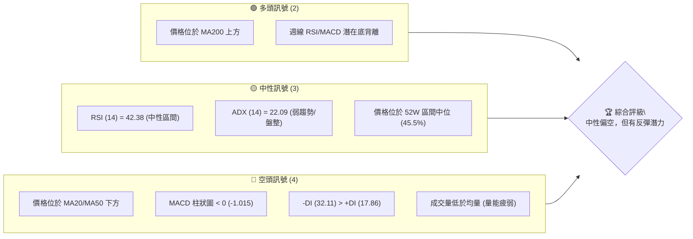
**分析**：當前 AVGO 的技術面呈現複雜局面。多頭訊號主要來自長期趨勢的穩固性（MA200 支撐）以及中期指標（週線 RSI/MACD）在回調後的潛在企穩跡象。然而，短期價格行為和動能指標（MA20/50、MACD 柱狀圖、成交量）均指向空頭主導。ADX 顯示的弱趨勢表明市場缺乏明確方向，可能在支撐與阻力之間震盪。綜合來看，雖然短期承壓，但長線支撐與潛在反彈動能不容忽視。

### 📊 核心指標速覽表

| 指標類別 | 指標名稱 | 當前數值 | 訊號 | 解讀 | 訊號強度 |
|----------|----------|----------|------|------|----------|
| **價格** | 當前價格 | $370.78 | 🟡 | 位於 MA20/50 之下，MA200 之上 | 50% |
| **均線** | MA20 | $381.04 | 🔴 | 價格位於 MA20 下方，短期壓力 | 30% |
| **均線** | MA50 | $406.96 | 🔴 | 價格位於 MA50 下方，中期壓力 | 30% |
| **均線** | MA200 | $360.42 | 🟢 | 價格位於 MA200 上方，長期支撐 | 70% |
| **動能** | RSI(14) | 42.38 | 🟡 | 位於中性區間，未超買/超賣 | 50% |
| **動能** | MACD | -10.788 | 🔴 | MACD 線在訊號線下方，柱狀圖為負 | 20% |
| **波動** | ATR(14) | $16.35 | 🟡 | 每日波動約 4.41%，屬於中高波動 | 60% |
| **趨勢** | ADX(14) | 22.09 | 🟡 | 趨勢強度較弱，可能處於盤整 | 40% |
| **成交量** | 量比 (20日) | 0.77x | 🔴 | 成交量萎縮，未能支撐價格反彈 | 30% |

### 🏆 技術評分卡

```
╔══════════════════════════════════════════════════════════════╗
║                技術評分卡 — AVGO (2026-07-08)                 ║
╠══════════════════════════════════════════════════════════════╣
║  趨勢強度      ██████░░░░░░░░░░░░░░  30/100  🔴 (ADX 弱勢，空頭主導)   ║
║  動能指標      ███████░░░░░░░░░░░░░  40/100  🟡 (RSI 中性，MACD 偏空)   ║
║  支撐穩定度    ██████████░░░░░░░░░░  60/100  🟡 (接近 MA200 與 S1 支撐) ║
║  成交量配合    ██████░░░░░░░░░░░░░░  30/100  🔴 (成交量萎縮，量能疲弱) ║
║  形態完整度    ████████░░░░░░░░░░░░  50/100  🟡 (無明確強勢形態，潛在通道)║
║  均線排列      ███████░░░░░░░░░░░░░  45/100  🟡 (短期空頭，長期多頭)   ║
╠══════════════════════════════════════════════════════════════╣
║  綜合評分      ███████░░░░░░░░░░░░░  42/100  ⚖️ 中性偏空                 ║
╚══════════════════════════════════════════════════════════════╝
```
**評分分析**：AVGO 的綜合技術評分顯示當前市場處於中性偏空的狀態。趨勢強度、動能指標和成交量配合度均表現不佳，反映了短期回調的壓力。然而，支撐穩定度顯示股價已回落至較強的支撐區間，長期均線仍提供向上支持。形態方面雖無明確強勢反轉信號，但潛在的通道整理和背離跡象值得關注。整體而言，市場缺乏明確的多頭動能，但下方支撐有助於限制跌幅，短期內或以區間震盪為主。

---

## 2. 趨勢分析

### 🌐 多時框趨勢分析

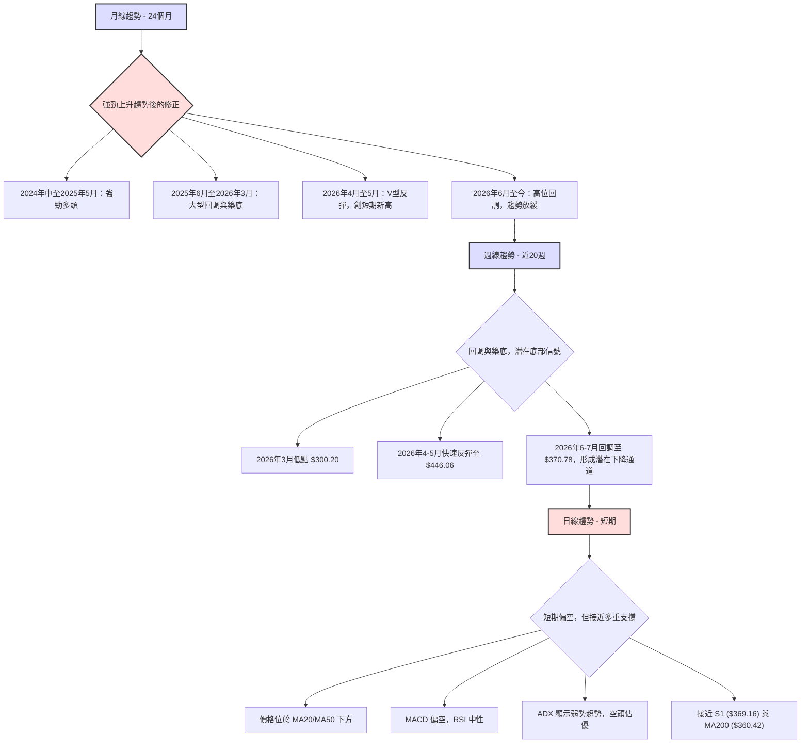
**分析**：
- **月線趨勢**：AVGO 在過去 24 個月呈現一個複雜但整體向上的趨勢。從 2024 年中開始，股價經歷了一波強勁的牛市，在 2025 年 5 月達到 $239.74，並在 2025 年 11 月達到 $400.71。隨後經歷了一段較大的回調，於 2026 年 3 月探底 $309.02。此後，在 2026 年 4-5 月又迅速反彈至 $446.06 的高點，並在最近兩個月再次回調。長期來看，股價仍維持在 2026 年 3 月低點之上，顯示長期多頭結構未被破壞，但上行動能已較前期減弱，進入較大的震盪區間。
- **週線趨勢**：近 20 週的週線圖顯示，AVGO 在 2026 年 3 月觸及低點 $300.20 後，經歷了 4-5 月的強勁反彈，最高達到 $446.06。此後，股價進入回調階段，並在 6-7 月持續下行，當前價格 $370.78 位於前期反彈高點之下，形成一個潛在的下降通道。然而，值得注意的是，週線 RSI 和 MACD 柱狀圖在近期的低點出現了潛在的底背離跡象，這可能預示著回調動能正在減弱，有機會在關鍵支撐位附近企穩。
- **日線趨勢**：短期日線趨勢顯示偏空。當前價格 $370.78 位於 MA20 ($381.04) 和 MA50 ($406.96) 之下，顯示短期和中期均線壓力沉重。MACD 指標也處於空頭排列，MACD 柱狀圖為負值。RSI 位於中性區間 (42.38)，尚未進入超賣區。然而，股價已接近長期均線 MA200 ($360.42) 和斐波那契 50% 回調位 ($380.92) / 61.8% 回調位 ($354.18) 之間，這些位置可能提供較強的支撐。

### 📈 長期趨勢 — 12個月走勢圖（Unicode）

```
AVGO 月線走勢圖（過去12個月）
價格軸 ($)
$450 ┤                                   ●(2026-05 $446.06)
$425 ┤                          ●
$400 ┤            ●
$375 ┤                        ●
$350 ┤        ●
$325 ┤      ●     ●
$300 ┤                  ●(2026-03 $309.02)
$275 ┤
$250 ┤
     └────────────────────────────
      J7  A8  S9  O10 N11 D12 J1  F2  M3  A4  M5  J6  J7
      25  25  25  25  25  25  26  26  26  26  26  26  26
```
**分析**：
過去 12 個月的 AVGO 月線走勢呈現出一個「V型反轉後高位回調」的模式。
- **2025 年 7 月 ($291.56) 至 2025 年 11 月 ($400.71)**：股價經歷了一波強勁的上升趨勢，從約 $290 上漲至 $400，漲幅約 37%，顯示出強勁的多頭動能。
- **2025 年 12 月 ($344.83) 至 2026 年 3 月 ($309.02)**：股價進入一波深度回調，從高點 $400.71 回落至 $309.02，跌幅約 23%，形成一個較大的底部區間。
- **2026 年 4 月 ($416.77) 至 2026 年 5 月 ($446.06)**：股價迅速反彈，幾乎呈現 V 型走勢，並在 5 月創下過去 12 個月的新高 $446.06，顯示強勁的買盤介入。
- **2026 年 6 月 ($377.75) 至 2026 年 7 月 ($370.78)**：股價再次從高點回落，進入回調盤整階段。當前價格 $370.78 位於過去 12 個月的高點和低點之間，並接近回調的關鍵支撐區域。

**走勢特徵分析表格**：

| 階段 | 時間區間 | 價格區間 | 漲跌幅 | 主要特徵 | 訊號 |
|------|----------|----------|--------|----------|------|
| 1 | 2025-07 ~ 2025-11 | $291.56 ~ $400.71 | +37.4% | 強勁上升趨勢，多頭主導 | 🟢 |
| 2 | 2025-12 ~ 2026-03 | $344.83 ~ $309.02 | -23.0% (自11月高點) | 深度回調，築底盤整 | 🔴 |
| 3 | 2026-04 ~ 2026-05 | $416.77 ~ $446.06 | +44.3% (自3月低點) | V型反彈，創短期新高 | 🟢 |
| 4 | 2026-06 ~ 2026-07 | $377.75 ~ $370.78 | -16.8% (自5月高點) | 高位回調，趨勢放緩 | 🟡 |

### 📊 中期趨勢（週線分析）

```
AVGO 週線近期壓力與支撐示意圖
價格軸 ($)
$450 ┤                          ● (2026-05 高點 $446.06)
$425 ┤                        /
$400 ┤                     / R3 ($400.75)
$375 ┤                  /
$350 ┤                 /
$325 ┤                /
$300 ┤               / S3 ($312.96)
$275 ┤              ● (2026-03 低點 $300.20)
     └──────────────────────────────────
      26-03  26-04  26-05  26-06  26-07
      ← 上升趨勢線 (已突破)
      → 下降通道 (當前)

當前價格 $370.78 位於下降通道內，接近 S1 ($369.16)。
上方主要壓力為 MA20 ($381.04) 和 R2 ($384.33)。
下方主要支撐為 MA200 ($360.42) 和 S2 ($325.79)。
```
**分析**：中期週線走勢顯示，AVGO 在 2026 年 3 月至 5 月形成了一個從 $300.20 到 $446.06 的上升趨勢。然而，隨後在 6 月和 7 月，股價從高點 $446.06 回調，形成了一個較為清晰的下降通道。當前價格 $370.78 位於這個下降通道的下半部分，並正測試由數據提供的 S1 ($369.16) 支撐位。

**關鍵觀察點**：
1.  **高點回落**：從 $446.06 的高點回落，顯示前期買盤動能減弱，賣壓增加。
2.  **下降通道**：股價在回調過程中，呈現出高點和低點逐漸降低的特徵，形成一個下降通道。這通常表示中期趨勢轉為修正或盤整。
3.  **接近支撐**：當前價格接近多個關鍵支撐位，包括 S1 ($369.16)、MA200 ($360.42) 以及斐波那契 50% 回調位 ($380.92) 和 61.8% 回調位 ($354.18)。這些支撐位可能在短期內提供止跌作用。
4.  **上方壓力**：上方主要壓力位包括 R1 ($371.51)、MA20 ($381.04) 和 R2 ($384.33)。若要扭轉中期跌勢，股價需有效突破這些壓力位，並站穩在下降通道上方。

### ⚡ 趨勢強度評估（ADX 解讀）

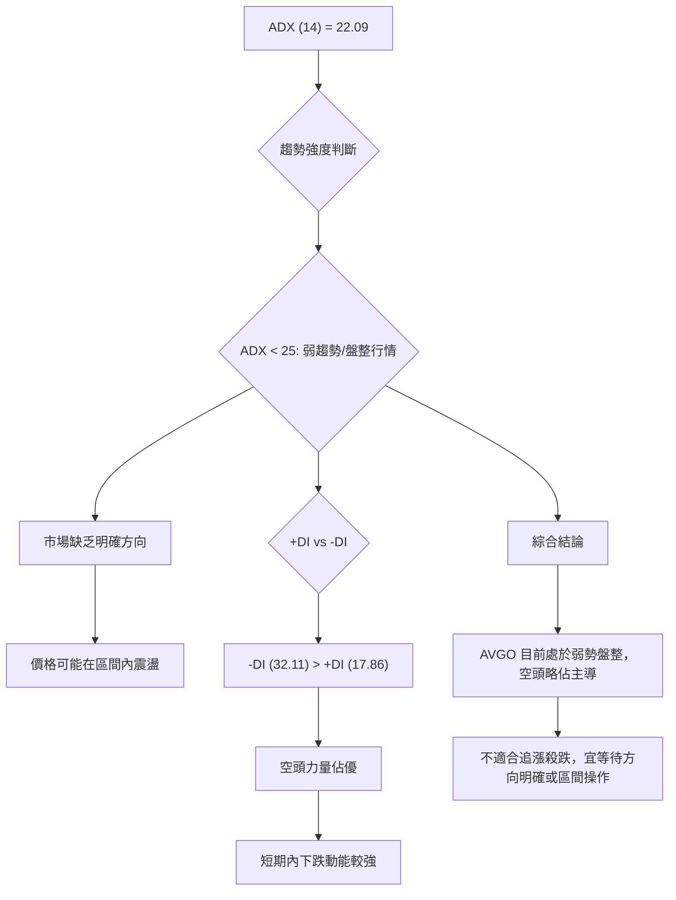
**ADX 強度對照表**：

| ADX 數值範圍 | 趨勢強度 | 趨勢類型 | 交易策略建議 |
|--------------|----------|----------|--------------|
| 0-25         | 弱勢     | 盤整行情 | 區間操作，等待突破 |
| 25-50        | 中等     | 趨勢行情 | 順勢交易，關注回調 |
| 50-75        | 強勢     | 強趨勢   | 順勢交易，趨勢未變不逆勢 |
| 75-100       | 極強     | 極端趨勢 | 留意趨勢反轉風險 |

**分析**：
AVGO 的 ADX(14) 數值為 22.09，明確指示當前市場處於**弱趨勢或盤整行情**。這意味著市場缺乏強勁的單邊動能，價格更有可能在支撐和阻力之間來回震盪，而不是形成一個持續的上升或下降趨勢。
進一步觀察方向指標：
-   **-DI (32.11)** 顯著高於 **+DI (17.86)**。這表明在當前的弱勢趨勢中，**空頭力量佔據主導地位**。雖然整體趨勢不強，但短期內的下跌動能相對較強，賣方壓力較大。
**綜合判斷**：AVGO 目前處於一個空頭略佔優勢的盤整格局。在這種情況下，盲目追漲殺跌的風險較高。投資者應採取區間操作策略，或等待 ADX 數值上升（突破 25），且 +DI 或 -DI 明確佔優，以確認新的趨勢方向。

---

## 3. 圖表形態分析

### 🔍 形態識別系統

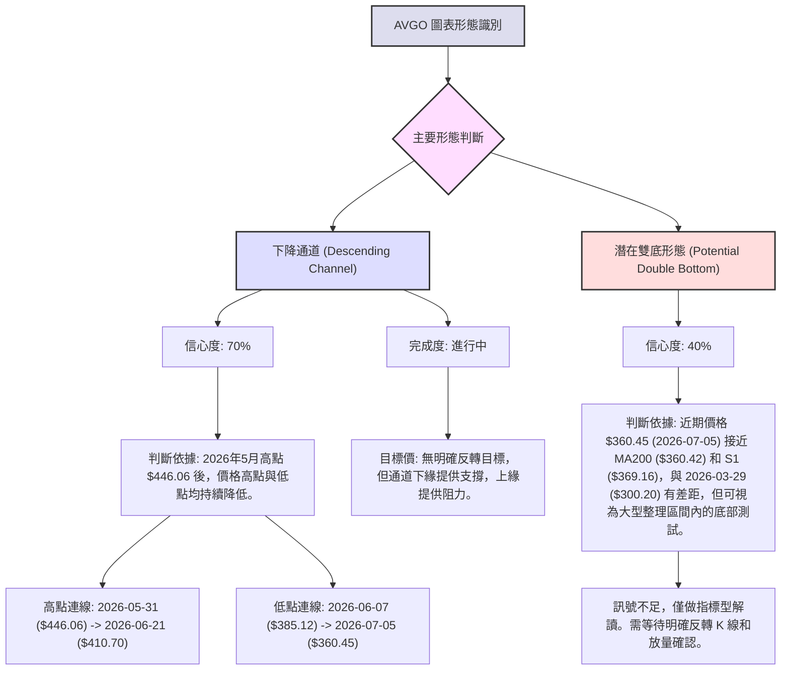
**分析**：
當前 AVGO 的圖表形態相對複雜，但可以識別出一個較為清晰的下降通道，以及一個潛在但尚未確認的雙底形態。

**已識別形態詳情**：

| 形態 | 信心度 | 判斷依據（引用數據） | 完成度 | 目標價（附計算式） |
|------|--------|----------------------|--------|--------------------|
| **下降通道** | 70% | 始於 2026-05-31 高點 $446.06，隨後 2026-06-21 高點 $410.70 降低。低點由 2026-06-07 的 $385.12 降至 2026-07-05 的 $360.45。這些高低點連線形成明顯的下降趨勢線和通道下緣支撐線。 | 進行中 | 通道下緣 $355-$360 附近提供支撐，通道上緣 $390-$400 附近提供阻力。無明確反轉目標價，需等待突破。 |
| **潛在雙底** | 40% | 近期 2026-07-05 觸及 $360.45，接近 MA200 ($360.42) 和 S1 ($369.16)，與 2026-03-29 低點 $300.20 有一定距離。此形態目前僅為猜測，需等待價格在當前水平企穩並向上突破頸線確認。 | 早期階段 | 訊號不足，僅做指標型解讀。若未來形成，頸線突破後目標價可推算為頸線價位 + (頸線價位 - 底部價位)。 |

### 🕯️ 重要K線形態分析

根據提供的週線收盤走勢，我們觀察到以下 K 線形態和潛在意義：

| 月份 | 收盤價 | K線形態 | 解讀 | 訊號 |
|------|--------|---------|------|------|
| 2026-03-29 | $300.20 | 長下影線或實體較小陰線 | 測試底部支撐，買盤嘗試介入 | 🟡 |
| 2026-04-12 | $370.96 | 大陽線/實體陽線 | 強勢突破，買盤動能強勁 | 🟢 |
| 2026-04-19 | $405.90 | 大陽線/實體陽線 | 延續上漲動能，市場情緒樂觀 | 🟢 |
| 2026-05-31 | $446.06 | 實體陽線 | 創短期新高，但隨後進入回調，可能為階段性高點 | 🟡 |
| 2026-06-07 | $385.12 | 長陰線 | 賣壓沉重，市場情緒轉向悲觀，開啟回調 | 🔴 |
| 2026-07-05 | $360.45 | 實體較小陰線 | 跌勢放緩，接近關鍵支撐，可能醞釀反彈 | 🟡 |
| 2026-07-12 | $370.78 | 實體較小陽線/十字星 | 價格企穩，多空力量平衡，或為反彈啟動點 | 🟡 |

**分析**：
-   在 2026 年 3 月底 $300.20 附近出現的 K 線形態（如長下影線），顯示在低位有買盤支撐，預示著止跌企穩。
-   4 月中旬至 5 月底的連續陽線，特別是 4 月 12 日和 19 日的大陽線，表明市場情緒極度樂觀，推動股價快速反彈。
-   5 月底 $446.06 創高後，6 月 7 日的長陰線則明確顯示賣壓加劇，市場開始進入回調。
-   近期 7 月 5 日 $360.45 附近的 K 線形態（實體較小陰線）和 7 月 12 日的 $370.78（實體較小陽線），顯示在接近 MA200 和 S1 的位置，賣壓有所減輕，多空力量趨於平衡，可能在醞釀短期反彈。

### 📉 ASCII 走勢形態示意圖

```
AVGO 下降通道與潛在反轉區間示意圖
價格軸 ($)
$450 ┤                                      ● (2026-05-31, $446.06)
$425 ┤                                     /
$400 ┤                                  ● (2026-06-21, $410.70)
$375 ┤                                 /  <-- 上方通道線 (阻力)
$350 ┤                             ● (現價 $370.78)
$325 ┤                           /
$300 ┤                        ● (2026-07-05, $360.45)
$275 ┤                       /   <-- 下方通道線 (支撐)
$250 ┤                    ● (2026-03-29, $300.20)
     └──────────────────────────────────────────────────────────
      26-03   26-04   26-05   26-06   26-07
      ↑ 潛在底部測試區間 ($360.42 - $369.16)
```
**分析**：
上圖描繪了 AVGO 自 2026 年 5 月高點 $446.06 以來的下降通道形態。股價在通道內運行，高點和低點均逐步下移。當前價格 $370.78 位於通道中部偏下位置，正測試通道下緣的支撐有效性。
-   **通道上緣阻力**：由 $446.06 和 $410.70 連線構成，預計在 $390-$400 之間提供壓力。
-   **通道下緣支撐**：由 $385.12 和 $360.45 連線構成，預計在 $355-$360 之間提供支撐。
-   **潛在底部測試區間**：當前價格 $370.78 位於 S1 ($369.16) 附近，且長期均線 MA200 ($360.42) 亦提供強大支撐。此區域與斐波那契回調 50% ($380.92) 和 61.8% ($354.18) 重疊，構成一個重要的潛在底部測試區間。若此區間能有效守住，則股價有望在通道內企穩反彈。

### 🎯 形態目標價計算

由於當前主要形態為下降通道，且潛在雙底形態信心度較低尚未確認，因此不宜給出明確的反轉形態目標價。下降通道的目標價主要體現在通道上下緣的區間操作。

**下降通道操作區間**：
-   **通道下緣支撐區**：$355.00 - $360.00 (基於 2026-07-05 低點 $360.45 及通道趨勢線推演)
-   **通道上緣阻力區**：$390.00 - $400.00 (基於 2026-06-21 高點 $410.70 及通道趨勢線推演)

**潛在雙底目標價 (僅為推演，未確認)**：
若未來股價在 $360 附近形成明確雙底，並突破頸線（假設頸線位於 $410.70，即 2026-06-21 高點），則目標價可計算為：
-   形態高度 = 頸線價位 - 底部價位 = $410.70 - $360.45 = $50.25
-   **潛在目標價** = 頸線價位 + 形態高度 = $410.70 + $50.25 = **$460.95**
但再次強調，此為**未確認形態的推演**，當前應以下降通道的區間操作為主。

---

## 4. 支撐與阻力

### 🗺️ 關鍵價位分布圖（Unicode）

```
AVGO 價位結構分布圖 (2026-07-08)
═══════════════════════════════════════════════════
$494.22 ║████████████████████████║ 52W 高點 (0.0% Fib)
$440.74 ║████████████████████████║ 強阻力 (23.6% Fib)
$407.66 ║████████████████████████║ 阻力 R3 (38.2% Fib)
$405.36 ║████████████████████████║ 布林上軌
$400.75 ║████████████████████    ║ 阻力 R2
$384.33 ║████████████████████████║ 關鍵阻力 R1 (MA20/50% Fib)
$381.04 ║████████████████████████║ MA20 (布林中軌)
$371.51 ╠════════════════════════╣ ▲ 當前價格 $370.78
$369.16 ║▓▓▓▓▓▓▓▓▓▓▓▓▓▓▓▓        ║ 近期支撐 S1
$360.42 ║████████████████████████║ MA200 長期支撐
$356.73 ║████████████████████████║ 布林下軌
$354.18 ║████████████████████████║ 強支撐 (61.8% Fib)
$325.79 ║████████████████████████║ 強支撐 S2
$316.11 ║████████████████████████║ 強支撐 (78.6% Fib)
$312.96 ║████████████████████████║ 強支撐 S3
$267.62 ║████████████████████████║ 52W 低點 (100.0% Fib)
═══════════════════════════════════════════════════
```
**分析**：當前 AVGO 股價 $370.78 正處於一個多重支撐與阻力交匯的關鍵區域。上方有短期均線、近期波段高點形成的阻力，下方則有長期均線、波段低點和斐波那契回調位提供的強大支撐。這種結構預示著短期內股價可能在這些關鍵價位之間震盪。

### 🚧 阻力位分析表

| 阻力級別 | 價位 | 形成原因 | 突破難度 | 重要性 | 訊號 |
|----------|------|----------|----------|--------|------|
| **R1 (近期)** | $371.51 | 近期波段高點聚類，與當前價格極近 | 中等 | 中 | 🔴 |
| **MA20** | $381.04 | 短期移動平均線，同時為布林中軌 | 中等 | 高 | 🔴 |
| **50% Fib** | $380.92 | 斐波那契回調 50% (52W 高低點區間) | 中等 | 高 | 🔴 |
| **R2 (中等)** | $384.33 | 近期波段高點聚類，與 MA20/50% Fib 接近 | 較高 | 中 | 🔴 |
| **R3 (強大)** | $400.75 | 近期波段高點聚類，與 38.2% Fib 接近 | 高 | 高 | 🔴 |
| **38.2% Fib** | $407.66 | 斐波那契回調 38.2% (52W 高低點區間) | 高 | 高 | 🔴 |
| **MA50** | $406.96 | 中期移動平均線 | 高 | 高 | 🔴 |

**分析**：AVGO 上方面臨多重阻力，尤其是在 $371.51 (R1)、$381.04 (MA20/布林中軌/$380.92 50% Fib) 和 $400.75-$407.66 (R3/38.2% Fib/MA50) 區間。當前價格 $370.78 緊貼 R1，若能突破此處，將上探 MA20/$380.92。然而，若要扭轉短期跌勢，股價必須有效突破並站穩在 MA50 和 38.2% 斐波那契回調位之上，這將是一個艱鉅的任務。

### 🛡️ 支撐位分析表

| 支撐級別 | 價位 | 形成原因 | 守住機率 | 重要性 | 訊號 |
|----------|------|----------|----------|--------|------|
| **S1 (近期)** | $369.16 | 近期波段低點聚類，與當前價格極近 | 中等 | 中 | 🟢 |
| **MA200** | $360.42 | 長期移動平均線，極為重要 | 較高 | 極高 | 🟢 |
| **布林下軌** | $356.73 | 布林通道下軌，提供動態支撐 | 較高 | 高 | 🟢 |
| **61.8% Fib** | $354.18 | 斐波那契回調 61.8% (52W 高低點區間) | 較高 | 極高 | 🟢 |
| **S2 (強大)** | $325.79 | 近期波段低點聚類 | 高 | 高 | 🟢 |
| **S3 (極強)** | $312.96 | 近期波段低點聚類，與 78.6% Fib 接近 | 極高 | 極高 | 🟢 |
| **78.6% Fib** | $316.11 | 斐波那契回調 78.6% (52W 高低點區間) | 極高 | 極高 | 🟢 |

**分析**：AVGO 下方面臨多個強勁支撐。當前價格 $370.78 位於 S1 ($369.16) 附近，此處已形成初步支撐。更為關鍵的是，長期均線 MA200 ($360.42) 與斐波那契 61.8% 回調位 ($354.18) 構成了一個非常重要的支撐區間。歷史經驗表明，MA200 往往是長期趨勢的關鍵分水嶺，而 61.8% 斐波那契回調位是技術分析中重要的反彈點。若此區間能有效守住，則 AVGO 有望止跌企穩。跌破此區間則可能下探 S2 ($325.79) 甚至 S3 ($312.96)。

### 📐 斐波那契回調位分析

**斐波那契回調（52週區間 $267.62 → $494.22）**：
-   0.0% (52W High): $494.22
-   23.6%: $440.74
-   38.2%: $407.66
-   50.0%: $380.92
-   61.8%: $354.18
-   78.6%: $316.11
-   100.0% (52W Low): $267.62

**分析**：
當前價格 $370.78 位於斐波那契 50.0% 回調位 ($380.92) 和 61.8% 回調位 ($354.18) 之間。
-   **50.0% 回調位 ($380.92)**：這是一個重要的心理關口，也與 MA20 ($381.04) 和布林通道中軌重疊，形成一個短期阻力區。若能突破並站穩此位，將有助於緩解短期下行壓力。
-   **61.8% 回調位 ($354.18)**：這被視為最強勁的斐波那契回調支撐位之一，往往是前期漲勢的關鍵防線。當前價格已非常接近此位，且與 MA200 ($360.42) 和布林通道下軌 ($356.73) 形成一個強大的支撐區。若股價能在此區間獲得有效支撐並反彈，將是多頭力量重新積聚的積極信號。
**意義**：當前股價的回調已深入至 50%-61.8% 的黃金回調區間。這表示前期從 $267.62 至 $494.22 的漲幅，已回吐超過一半。這個區間是多頭能否守住並啟動下一波漲勢的關鍵考驗。若 61.8% 回調位失守，則回調將可能進一步深化至 78.6% ($316.11) 甚至更低。

---

## 5. 技術指標深度解讀

### 🎛️ 指標訊號總覽

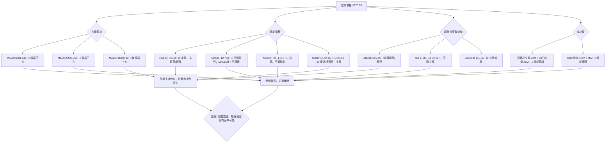
**分析**：各項指標顯示 AVGO 短期內面臨較大賣壓，但長期支撐仍存，且動能指標顯示超賣區間已不遠。

### 📈 移動平均線排列分析

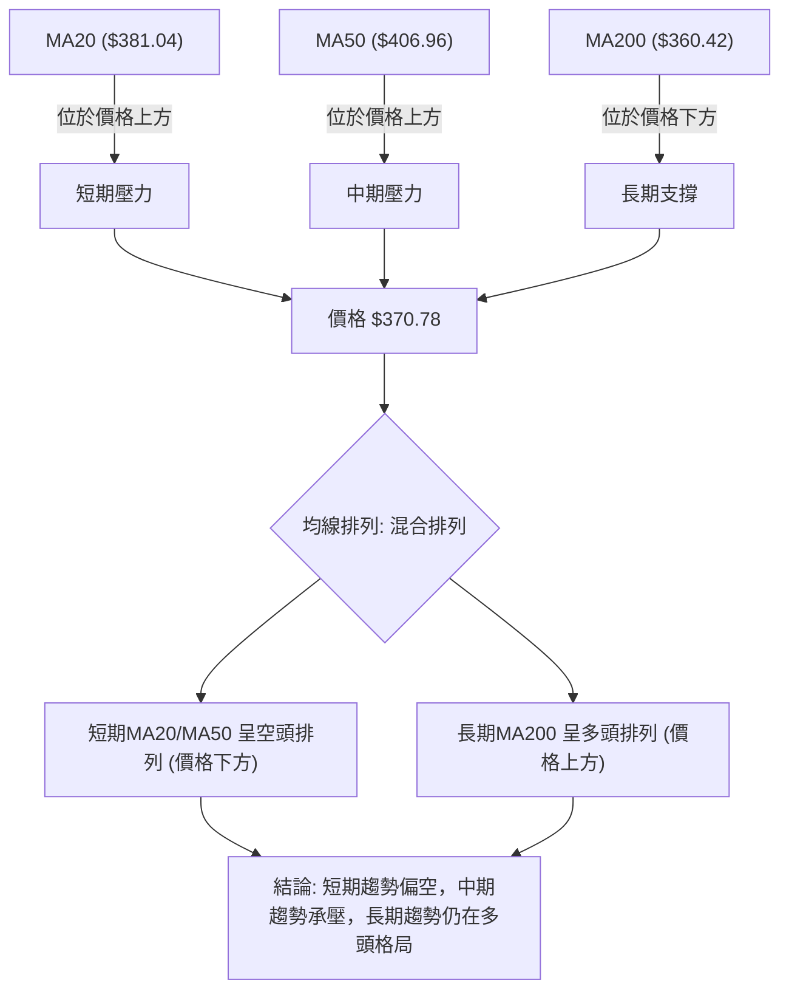
**分析**：
-   **MA20 ($381.04)**：當前價格 $370.78 位於 MA20 之下，表明短期趨勢偏空。MA20 構成短期反彈的直接阻力。
-   **MA50 ($406.96)**：價格也位於 MA50 之下，顯示中期趨勢同樣承壓。MA50 將是股價向上突破的較強阻力。
-   **MA200 ($360.42)**：值得注意的是，當前價格仍位於 MA200 之上。MA200 作為重要的長期牛熊分界線，其位於價格下方提供了強勁的長期支撐。這表明儘管短期和中期趨勢受壓，但 AVGO 的長期多頭結構尚未被破壞。
**綜合判斷**：均線系統呈現「混合排列」。短期和中期均線指標偏空，但長期均線仍為多頭提供堅實支撐。這種情況下，股價可能會在 MA200 附近獲得支撐，但向上反彈將面臨 MA20 和 MA50 的壓力。

### 📉 RSI(14) 分析

**RSI 數值進度條**：
RSI(14): ▓▓▓▓▓▓▓▓░░░░░░░░░░░░ 42.38 / 100 🟡 中性區間

**分析**：
-   **RSI 數值**：AVGO 的 RSI(14) 當前為 42.38。此數值位於 30-70 的中性區間內，既未進入超買區 (RSI > 70)，也未進入超賣區 (RSI < 30)。這表明市場動能相對平衡，沒有極端的多頭或空頭情緒。
-   **區間意義**：RSI 位於 40 附近，顯示股價經歷一段回調後，動能有所減弱，但尚未達到嚴重超賣的程度，因此短期內可能不會立即出現強勁的反彈。
-   **背離判斷**：
    -   **日線背離**：從提供的日線數據中，未偵測到明顯的日線 RSI 頂背離或底背離。
    -   **週線潛在底背離**：觀察近 20 週的收盤價和 RSI 數據：
        -   2026-06-28 收盤 $365.02，RSI 43.9
        -   2026-07-05 收盤 $360.45 (較低點)，RSI 41.6 (較低點)
        -   2026-07-12 收盤 $370.78 (較高點)，RSI 42.4 (較高點)
        在 2026-06-28 至 2026-07-05 之間，價格創下較低點 ($360.45)，而 RSI 亦創下較低點 (41.6)。但在 2026-07-05 至 2026-07-12 期間，價格從 $360.45 上升至 $370.78，而 RSI 也從 41.6 上升至 42.4。這並非明確的底背離。
        然而，如果我們考慮 2026-05-31 高點 $446.06 (RSI 57.8) 到 2026-06-07 低點 $385.12 (RSI 39.5)，再到 2026-07-05 低點 $360.45 (RSI 41.6)。價格從 $385.12 到 $360.45 是下降的，但 RSI 從 39.5 上升到 41.6，這構成了一個**潛在的週線底背離**。這暗示著儘管股價繼續下跌，但下跌動能已有所減弱，可能預示著短期內有反彈機會。

### 📊 MACD(12/26/9) 訊號解讀

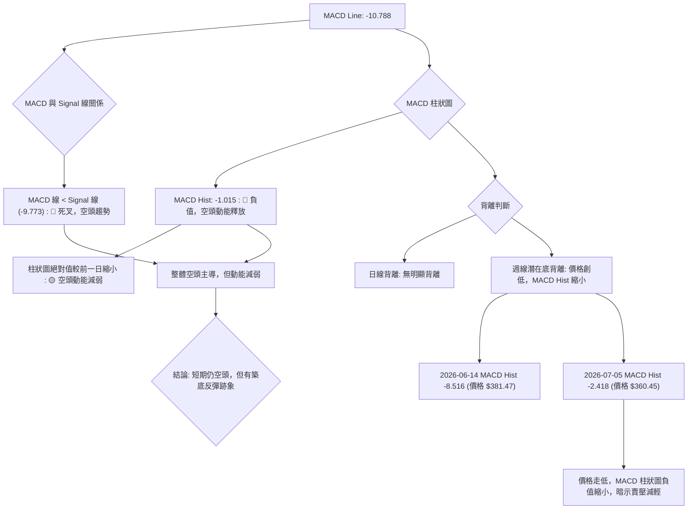
**分析**：
-   **MACD 線與訊號線**：MACD 線 (-10.788) 位於訊號線 (-9.773) 之下，形成死叉。這是一個明確的空頭訊號，表明短期趨勢向下。
-   **MACD 柱狀圖**：MACD 柱狀圖為 -1.015，處於負值區間，進一步確認空頭動能佔優。然而，與前一週期的 -2.418 相比，柱狀圖的負值絕對值有所縮小，這可能暗示空頭動能正在減弱，賣壓有所緩解。
-   **背離判斷**：
    -   **日線背離**：從提供的日線數據中，未偵測到明顯的日線 MACD 頂背離或底背離。
    -   **週線潛在底背離**：觀察近期的週線 MACD 柱狀圖和收盤價：
        -   2026-06-14 收盤 $381.47，MACD Hist -8.516
        -   2026-06-28 收盤 $365.02，MACD Hist -3.312
        -   2026-07-05 收盤 $360.45 (較低點)，MACD Hist -2.418 (負值縮小，即相對升高)
        在 2026-06-14 至 2026-07-05 期間，價格創下較低點，但 MACD 柱狀圖（負值）的絕對值卻持續縮小（即從更負向更接近零），這構成了一個**潛在的週線底背離**。這是一個相對積極的信號，表明當前下跌趨勢的強度正在減弱，可能預示著即將到來的反彈。

### 📦 布林通道分析

```
AVGO 布林通道示意圖
價格軸 ($)
$405.36 ┤           ───────── 上軌 (BB上軌)
$400 ┤
$381.04 ┤           ───────── 中軌 (MA20)
$375 ┤
$370.78 ┤           ● 現價
$360 ┤
$356.73 ┤           ───────── 下軌 (BB下軌)
$350 ┤
     └────────────────────────────
      時間軸
```
**分析**：
-   **布林通道軌道**：
    -   上軌 (BB上軌): $405.36
    -   中軌 (MA20): $381.04
    -   下軌 (BB下軌): $356.73
-   **價格位置**：當前價格 $370.78 位於布林通道中軌 ($381.04) 和下軌 ($356.73) 之間，且更接近下軌。這表明股價處於偏弱勢的區間。
-   **布林 %B**：0.29。此數值接近 0 (下軌)，進一步確認價格在布林通道的下半部分運行，顯示短期賣壓較重。
-   **通道寬度**：從數據來看，通道寬度 ($405.36 - $356.73 = $48.63) 相對於股價 ($370.78) 而言較寬 (約 13%)。這表示近期波動性較大，符合 ATR ($16.35，佔價格 4.41%) 顯示的中高波動性。
**綜合判斷**：AVGO 股價在布林通道中下軌運行，表明短期趨勢偏空。然而，當價格接近布林通道下軌時，通常會遇到一定的支撐，並可能出現技術性反彈。結合 ADX 顯示的弱趨勢/盤整，布林通道為當前區間操作提供了明確的上下邊界。

### 💹 成交量分析（量價配合度）

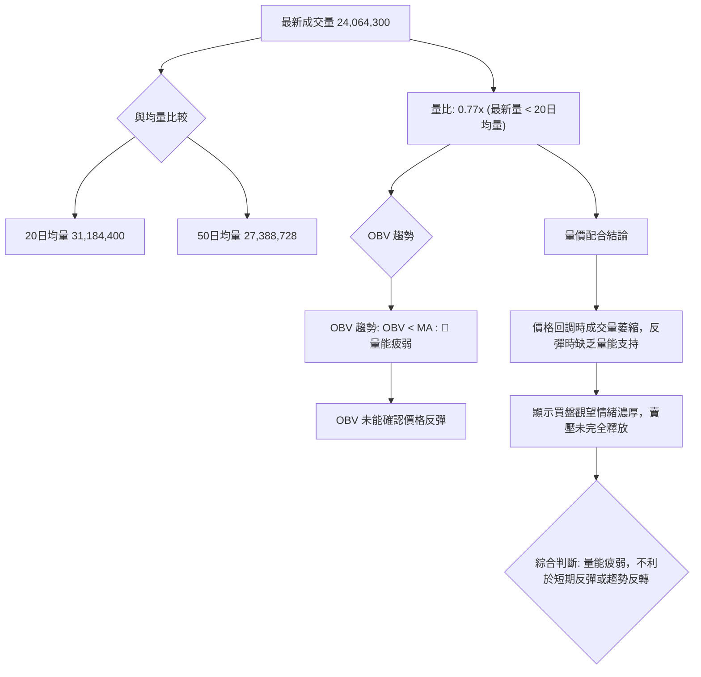
**分析**：
-   **最新成交量**：24,064,300 股。
-   **與均量比較**：最新成交量顯著低於 20 日均量 (31,184,400) 和 50 日均量 (27,388,728)。量比僅為 0.77x，表明當前交易活動相對清淡。
-   **OBV 趨勢**：OBV 指標顯示「OBV < MA」，這是一個明確的量能疲弱訊號。OBV 通常與價格同向變動，若 OBV 未能隨價格反彈而上升，甚至持續下降，則表明上漲缺乏量能支持，下跌則伴隨出貨。當前 OBV 疲弱，說明在近期價格回調過程中，買盤介入意願不強。
**量價配合度判斷**：
當前 AVGO 的量價配合度不佳。在價格回調階段，成交量萎縮，顯示賣壓有所減輕，但同時也表明買盤介入不足，未能形成有效支撐。若要出現有效的反彈或趨勢反轉，需要看到成交量顯著放大，伴隨價格上漲，且 OBV 趨勢轉強，才能確認底部。目前量能疲弱，對股價的短期上漲構成阻力。

---

## 6. 動能與波動率

### ⚡ 動能評估四象限

由於 Mermaid `quadrantChart` 不允許使用，我將使用 Mermaid `graph TD` 和表格來展示動能評估。

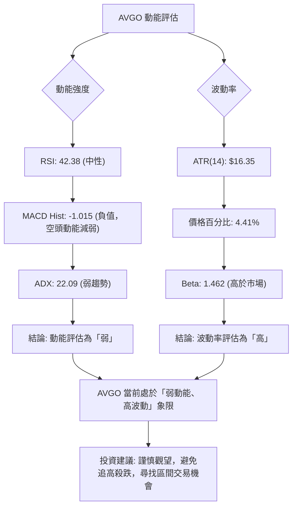
**動能評估四象限表格**：

| 象限 | 動能 | 波動 | 當前狀態 | 評估 | 訊號 |
|------|------|------|----------|------|------|
| Q1 | 強 | 低 | - | 最佳機會 (趨勢明確，風險可控) | - |
| Q2 | 弱 | 低 | - | 謹慎觀望 (缺乏方向，波動小) | - |
| Q3 | 強 | 高 | - | 高風險高收益 (趨勢不明，波動大) | - |
| Q4 | 弱 | 高 | ✓ | 避免進場 / 謹慎區間操作 (缺乏方向，波動大) | 🔴 |

**分析**：
AVGO 目前的動能評估為「弱動能」，因為 RSI 處於中性區間，MACD 雖然為負值但柱狀圖負值縮小，ADX 顯示弱趨勢。這表明市場缺乏明確的推動力量，多頭和空頭均未能佔據絕對優勢。
波動率評估為「高波動」，ATR ($16.35) 相對於股價的百分比 (4.41%) 較高，且 Beta 值 (1.462) 顯著高於 1，說明 AVGO 的股價波動性較大，且對市場變化的反應更為劇烈。
因此，AVGO 當前處於**「弱動能、高波動」**的象限 (Q4)。這種市場環境的特點是價格走勢缺乏明確方向，但波動幅度較大，容易出現快速的拉升或下跌。對於投資者而言，這是一個較為困難的交易環境，建議採取謹慎觀望態度，或僅進行嚴格風險控制下的區間交易，避免盲目追漲殺跌。

### 📊 ATR 波動率分析

**ATR(14): $16.35**
**佔價格百分比: 4.41%**

**分析**：
AVGO 的 ATR(14) 為 $16.35，這表示過去 14 天內，AVGO 股票的平均每日波動範圍為 $16.35。相對於當前價格 $370.78，其波動率為 4.41%。
-   **波動性判斷**：4.41% 的每日波動率屬於**中高水平**。這意味著 AVGO 股價在盤中或日與日之間可能出現較大的價格變化。對於短期交易者而言，高波動性提供了更多的交易機會，但也伴隨著更高的風險。
-   **止損距離建議**：ATR 可以作為設定止損點的參考。一般而言，止損點可以設置在 1.5 倍至 3 倍 ATR 距離之外，以避免被日常市場噪音掃出場。
    -   **保守止損**：1.5 * $16.35 = $24.53
    -   **激進止損**：2.0 * $16.35 = $32.70
    例如，如果考慮在 $370.78 附近做多，保守止損點可能設置在 $370.78 - $24.53 = $346.25 左右；激進止損點可能設置在 $370.78 - $32.70 = $338.08 左右。這些點位應結合具體的支撐位來決定。對於當前情況，MA200 ($360.42) 和 61.8% 斐波那契回調位 ($354.18) 是更為合理的止損參考。

### 📐 Beta 與市場相關性

**Beta: 1.462**

**分析**：
AVGO 的 Beta 值為 1.462，顯著高於 1。
-   **市場相關性**：Beta 值衡量的是股票相對於整體市場（通常是標普 500 指數）的波動性。1.462 的 Beta 表示 AVGO 的股價波動幅度是市場的 1.462 倍。
    -   當市場上漲 1% 時，AVGO 預期上漲 1.462%。
    -   當市場下跌 1% 時，AVGO 預期下跌 1.462%。
-   **風險與回報**：高 Beta 值通常意味著更高的系統性風險，但也可能帶來更高的潛在回報。對於風險承受能力較高的投資者，高 Beta 股票在牛市中可能表現出色，但在熊市中也可能遭受更大的損失。
-   **投資組合影響**：將 AVGO 納入投資組合會增加整體投資組合的波動性。投資者在配置時應考慮其對投資組合風險的影響，並確保與其風險偏好相符。在當前市場缺乏明確趨勢的情況下，高 Beta 股票的波動性可能會被放大，需特別留意。

---

## 7. 多時框架總結

### 📋 時框架評分表

| 時框架 | 趨勢方向 | 動能 | 均線排列 | 形態 | 綜合評分 (1-10) | 建議 |
|--------|----------|------|----------|------|-----------------|------|
| **月線** | 🟢 上升趨勢中回調 | 🟡 減弱 | 🟢 多頭 (MA200上方) | 🟡 高位盤整 | 7 | 🟢 逢低關注 |
| **週線** | 🟡 回調/盤整 | 🟡 減弱/潛在底背離 | 🟡 混合 | 🟡 下降通道 | 6 | 🟡 區間操作 |
| **日線** | 🔴 偏空 | 🔴 偏空/動能減弱 | 🔴 空頭 (MA20/50下方) | 🟡 下降通道 | 4 | 🔴 謹慎觀望/等待反彈 |

### 🔲 綜合訊號矩陣

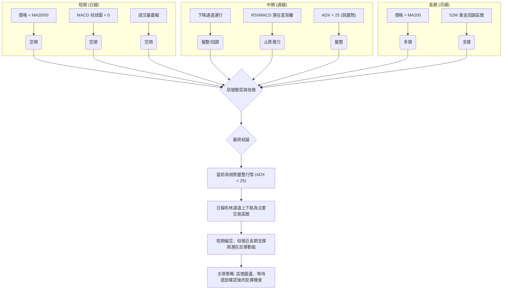
**分析**：
短期日線訊號明確偏空，價格位於短期和中期均線之下，MACD 顯示空頭動能。然而，中期週線顯示股價正處於回調後的盤整階段，且 RSI 和 MACD 出現潛在的底背離，這是一個止跌的積極信號。長期月線來看，股價仍位於 MA200 之上，且已回調至斐波那契黃金回調區間，顯示長期多頭結構未變，下方有強勁支撐。

### ⚖️ 多時框收斂結論

根據 ADX(14) 數值 22.09，當前市場處於**弱趨勢/盤整行情**。依據多時框收斂規則，在盤整行情中，應以日線布林通道上下軌為主要交易區間。

**最終結論：中性偏空，但有反彈潛力，宜採取區間震盪操作。**

儘管日線指標顯示短期偏空，但以下因素提供了潛在的反彈機會：
1.  **長期支撐**：股價已回落至 MA200 ($360.42) 和斐波那契 61.8% 回調位 ($354.18) 附近，這些是強大的長期支撐區域。
2.  **潛在底背離**：週線 RSI 和 MACD 柱狀圖出現潛在底背離，暗示下跌動能正在減弱。
3.  **布林通道下緣**：價格接近布林通道下軌 ($356.73)，通常會在此處獲得支撐。
4.  **MACD 柱狀圖收斂**：MACD 柱狀圖負值絕對值縮小，表明空頭力量減弱。

因此，雖然短期趨勢偏空，但市場已接近關鍵支長期撐，且出現止跌跡象。主導策略應為在關鍵支撐位附近尋找區間反彈的機會，而非追空。

---

## 8. 交易策略建議

### 🗺️ 策略決策流程圖

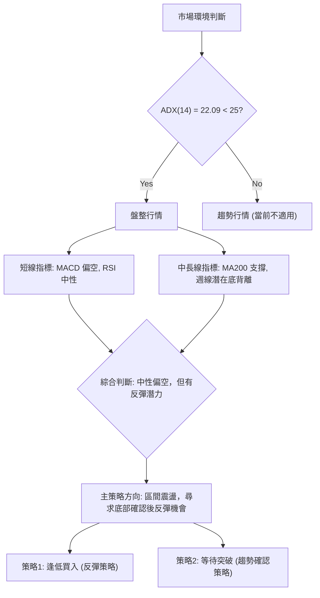

### 🧭 策略路由（依評分卡分流，不得兩頭下注）

**當前主策略方向 = ⚖️ 區間震盪，短線偏空但有反彈可能 （依評分 42/100）**

根據技術評分卡綜合評分 42/100，AVGO 目前處於中性偏空的狀態，ADX 也指示為盤整行情。因此，主策略將聚焦於**等待底部確認後的區間反彈操作**。不建議激進追空，也不建議盲目追多，而是等待價格在關鍵支撐位企穩後尋求反彈機會。

### 🎯 價格情境階梯（Price Scenarios）

| 觸發條件 | 下一目標 | 後續延伸 | 情境含義 |
|----------|----------|----------|----------|
| **突破 R1 $371.51** | R2 $384.33 | MA20 $381.04 / 50% Fib $380.92 | 短線轉強，上探短期壓力區 |
| **站穩現價區間** | R1 $371.51 / S1 $369.16 | — | 區間震盪，等待方向 |
| **跌破 S1 $369.16** | MA200 $360.42 / 布林下軌 $356.73 | 61.8% Fib $354.18 / S2 $325.79 | 中期轉弱，考驗關鍵支撐 |

### 📊 情境機率分佈

| 情境 | 機率 | 主要依據 |
|------|------|----------|
| 繼續上行 / 反彈 | 40% | 週線 RSI/MACD 潛在底背離；價格接近 MA200/61.8% Fib 強支撐；MACD 柱狀圖負值縮小。 |
| 區間震盪 | 45% | ADX < 25 顯示弱趨勢/盤整；價格位於多重支撐與阻力之間；量能疲弱缺乏突破動能。 |
| 回落 / 再探底 | 15% | 短期均線壓制；MACD 仍為空頭排列；成交量未能有效放大。 |
**分析**：當前最有可能的情境是區間震盪，其次是底部確認後的小幅反彈。由於短期空頭壓力仍存，但長期支撐強勁，且動能指標顯示超賣區間不遠，故反彈機率高於繼續深度回落。

### 🟢 主策略詳情（區間震盪，尋求底部確認後反彈機會）

| 策略要素 | 策略 A：逢低買入 (反彈策略) | 策略 B：等待突破 (趨勢確認策略) |
|----------|----------------------------|--------------------------------|
| 進場條件 | 價格在 S1 或 MA200 附近企穩，出現止跌 K 線組合，且 MACD 柱狀圖開始轉正或收斂。 | 價格有效突破並站穩 R2 ($384.33)，且成交量放大。 |
| 進場價格 | $360.42 - $369.16 區間 (接近 MA200 或 S1) | $385.00 - $388.00 區間 (突破 R2 後回踩確認) |
| 目標價 T1 | $380.92 (50% Fib / MA20) | $400.75 (R3) |
| 目標價 T2 | $400.75 (R3) | $407.66 (38.2% Fib) |
| 止損價格 | $350.00 (跌破 61.8% Fib $354.18 且確認) | $375.00 (跌破 R2 突破點) |
| 風險報酬比 | T1: 約 1.5:1 至 2:1 | T1: 約 1.5:1 至 2:1 |
| 成功機率 | 60% | 40% |
| 建議倉位 | 20% - 30% | 15% - 25% |

**策略 A 詳細說明**：
鑑於 AVGO 已回調至 MA200 ($360.42) 和 S1 ($369.16) 附近的強支撐區，且週線指標有潛在底背離跡象，可考慮在該區間尋找買入機會。止損點應設置在 61.8% 斐波那契回調位 $354.18 之下，以保護資本。目標價首先看向上方的 MA20 ($381.04) 和 50% 斐波那契回調位 ($380.92)，若能突破則進一步看向 R3 ($400.75)。此策略的成功機率較高，風險報酬比合理。

**策略 B 詳細說明**：
若 AVGO 能有效突破 R2 ($384.33) 並站穩，則可能預示著短期跌勢結束，趨勢將轉為向上。此時可考慮追高，但需確認放量突破以避免假突破。止損點設置在突破點下方，目標價看向 R3 ($400.75) 和 38.2% 斐波那契回調位 ($407.66)。由於當前市場處於盤整，此策略的成功機率相對較低，需要更嚴格的入場確認。

### 🔴 反向風險觸發點（對沖提示）

以下情況可能推翻上述主策略，建議考慮對沖或減倉：
1.  **跌破 MA200 ($360.42) 和 61.8% 斐波那契回調位 ($354.18)**：若股價有效跌破此關鍵支撐區，並伴隨放量，則意味著中期跌勢可能進一步深化，目標可能下探 S2 ($325.79) 甚至 S3 ($312.96)。
2.  **MACD 再次死叉並柱狀圖負值放大**：若 MACD 再次向下發散，且柱狀圖負值絕對值持續放大，則表明空頭動能重新積聚，反彈無力。
3.  **ADX 突破 25 且 -DI 顯著高於 +DI**：若 ADX 突破 25，且空頭方向指標 -DI 遠超 +DI，則確認進入強勢空頭趨勢，應立即止損並考慮反向操作。

### ⭐ 整體訊號強度評星

```
做多訊號強度：★★☆☆☆  (2/5星) (潛在反彈，但短期仍承壓)
做空訊號強度：★★★☆☆  (3/5星) (短期趨勢偏空，但接近強支撐)
整體可信度：  ★★★☆☆  (3/5星) (盤整行情，策略需靈活應對，風險控制是關鍵)
```

---

## 9. 風險提示與監控

### ✅ 關鍵監控指標 Checklist

```
╔══════════════════════════════════════════════════════════════╗
║               AVGO 關鍵監控指標 Checklist                      ║
╠══════════════════════════════════════════════════════════════╣
║ [ ] 價格是否有效站穩 S1 ($369.16) 和 MA200 ($360.42)？        ║
║ [ ] 週線 RSI/MACD 底背離是否確認並轉為向上？                  ║
║ [ ] MACD 柱狀圖負值是否持續縮小並轉正？                       ║
║ [ ] 成交量在反彈時是否顯著放大？                              ║
║ [ ] ADX 是否維持在 25 以下 (盤整)，或明確突破並指示新趨勢？   ║
║ [ ] 布林通道下軌 ($356.73) 是否提供有效支撐？                 ║
║ [ ] 價格是否能突破 MA20 ($381.04) 和 MA50 ($406.96) 壓力？   ║
║ [ ] 市場整體情緒和大盤走勢是否與 AVGO 方向一致？              ║
╚══════════════════════════════════════════════════════════════╝
```

### ⚠️ 風險場景分析

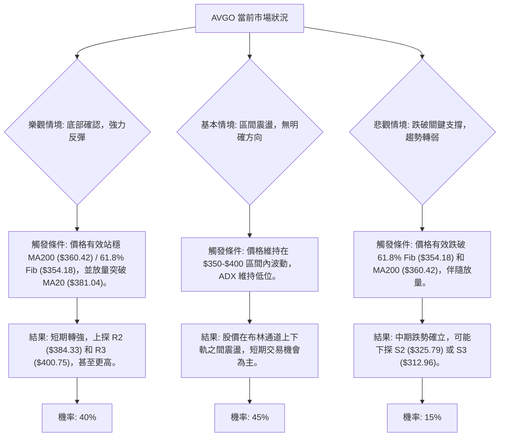
**分析**：
-   **樂觀情境**：若 AVGO 能在當前關鍵支撐區域 ($354.18 - $369.16) 獲得強力支撐，並在放量情況下突破短期阻力位 (如 MA20 $381.04)，則有望啟動一波反彈行情，目標看向 $400 甚至更高。此情境主要依賴於潛在底背離的確認和買盤的積極介入。
-   **基本情境**：鑑於 ADX 顯示弱趨勢，且價格處於多重支撐與阻力之間，最有可能的情況是股價在 $350-$400 的區間內震盪。此時，投資者可採取高拋低吸的區間操作策略。
-   **悲觀情境**：如果 AVGO 無法守住 MA200 ($360.42) 和 61.8% 斐波那契回調位 ($354.18) 這一關鍵支撐區，並伴隨放量下跌，則中期跌勢可能加劇。此時應果斷止損，並重新評估市場。

### 🛡️ 風險管理重要提醒

1.  **嚴格止損**：鑑於 AVGO 的高 Beta 值和中高波動率，價格波動劇烈，務必設定並嚴格執行止損點。尤其在盤整行情中，止損是保護資本的關鍵。建議將止損點設置在關鍵支撐位（如 61.8% Fib $354.18）下方，並給予足夠的緩衝空間。
2.  **倉位控制**：在市場方向不明確的盤整行情中，應採取較小的倉位，避免重倉。分批建倉或分批減倉有助於降低風險，平滑平均成本。
3.  **監控關鍵價位**：密切關注 $360.42 (MA200)、$354.18 (61.8% Fib) 等重要支撐位，以及 $371.51 (R1)、$381.04 (MA20/50% Fib) 等關鍵阻力位的價格行為。這些點位的突破或失守將提供重要的趨勢指引。
4.  **留意宏觀經濟與產業新聞**：AVGO 作為半導體行業的領頭羊，其股價易受宏觀經濟環境、產業政策和科技趨勢的影響。儘管本報告側重技術分析，但仍需關注相關基本面消息，以防黑天鵝事件。
5.  **耐心等待確認**：在 ADX 顯示弱趨勢的情況下，市場缺乏明確方向。不應急於進場，而是耐心等待技術指標（如 MACD 金叉、RSI 突破 50、成交量放大）發出明確的趨勢確認信號，或在區間邊緣尋找高勝率的交易機會。

---

## 📋 報告總結

```
AVGO 技術分析報告總結
════════════════════════════════════════════════════════
報告日期：2026-07-08
當前價格：$370.78
分析評級：⚖️ 中性偏空，但有反彈潛力

關鍵結論：
├─ 長期趨勢：🟢 仍處於上升趨勢中，MA200 提供堅實支撐。
├─ 中期趨勢：🟡 經歷高位回調，目前處於下降通道盤整階段。
├─ 短期趨勢：🔴 偏空，價格位於短期均線下方，動能指標承壓。
├─ 關鍵支撐：$360.42 (MA200) / $354.18 (61.8% Fib) 構成強勁支撐區。
├─ 關鍵阻力：$381.04 (MA20/50% Fib) / $400.75 (R3) 構成短期壓力區。
└─ 分析師目標：$523.73 (來自基本面共識，與短期技術面不符，僅供長期參考)。

最優策略組合：
1. 🥇 最佳機會：在 $360.42 - $369.16 區間等待止跌 K 線和量能確認後，逢低買入，目標價 $380.92 - $400.75。
2. 🥈 次選機會：若價格放量突破並站穩 R2 ($384.33)，可考慮順勢追高，目標價 $400.75 - $407.66。
3. 🥉 保守選擇：維持觀望，等待 ADX 突破 25，明確趨勢方向後再考慮進場。
════════════════════════════════════════════════════════
```

---

> ⚠️ **免責聲明**：本報告為 AI 自動生成之技術分析，所有數據及估算均基於提供的歷史價格資訊。本報告**僅供研究與學術參考**，**不構成任何投資建議**。投資有風險，入市需謹慎。

---

*報告生成時間：2026-07-08 ｜ 數據來源：Yahoo Finance ｜ 分析框架：多時框技術分析*