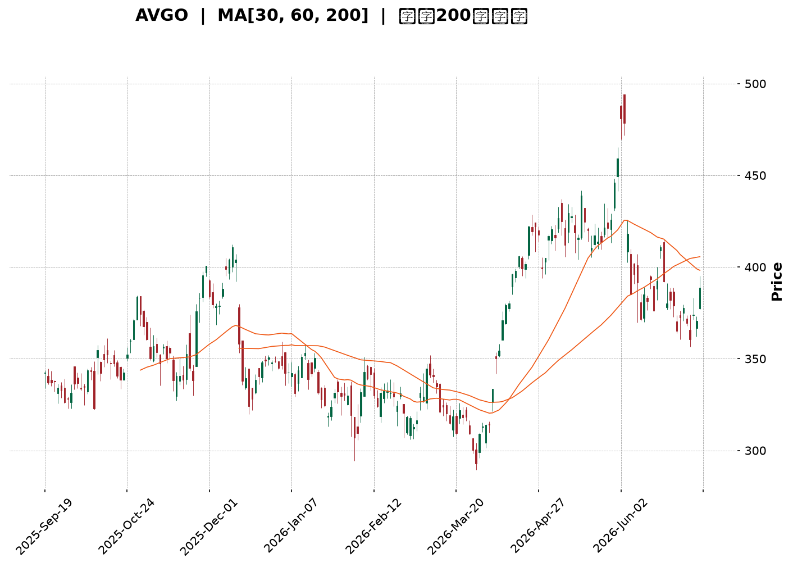
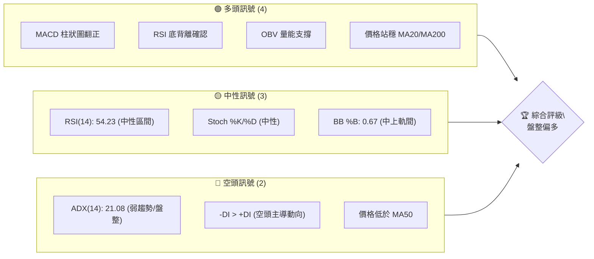
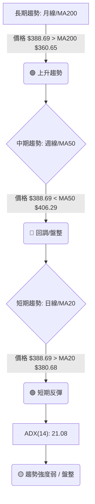
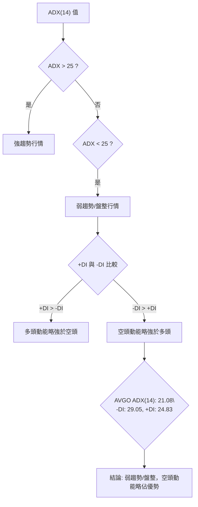
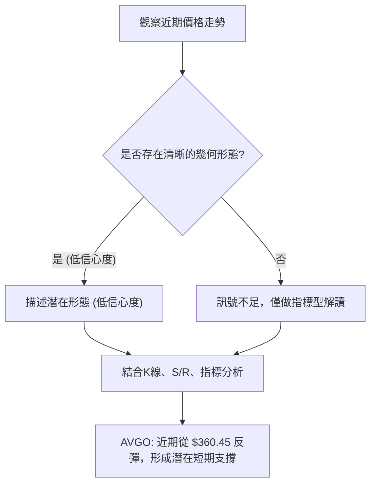
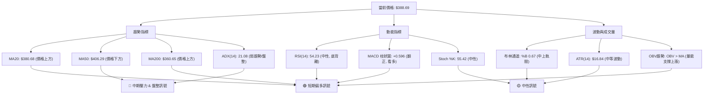
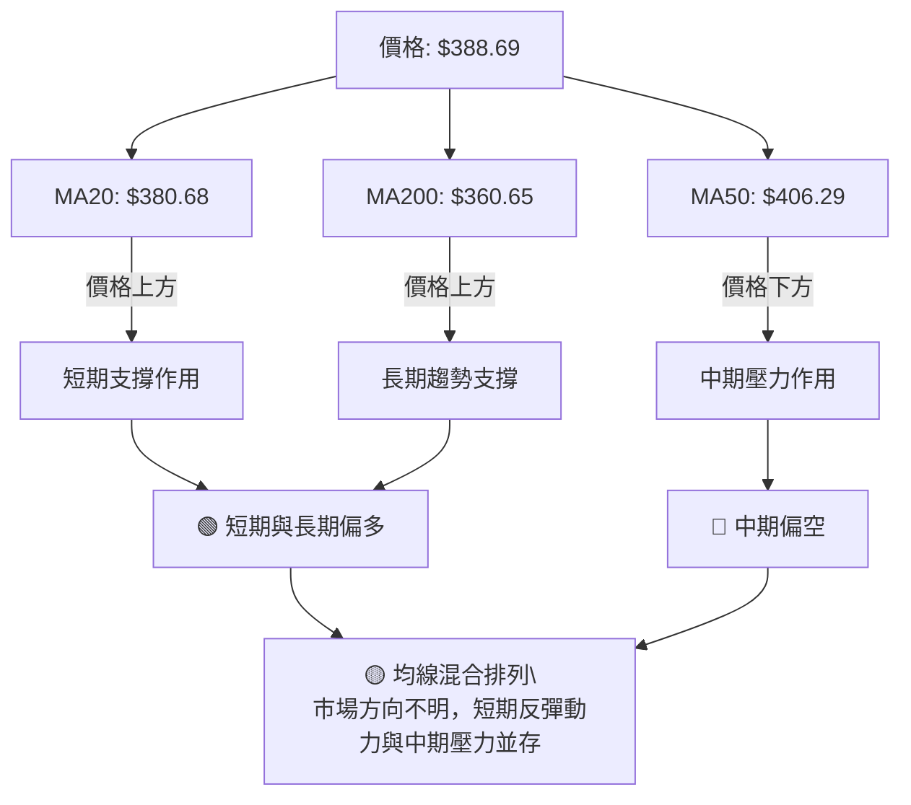
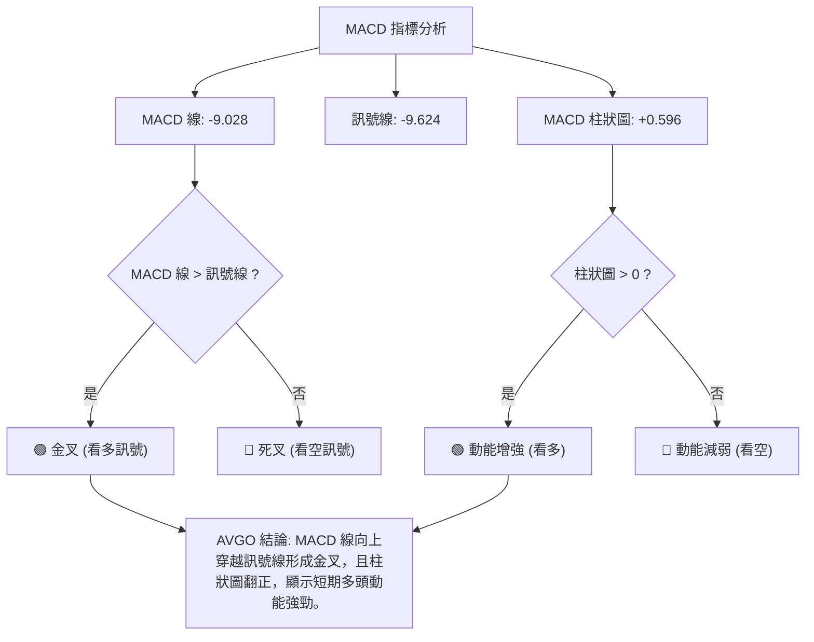
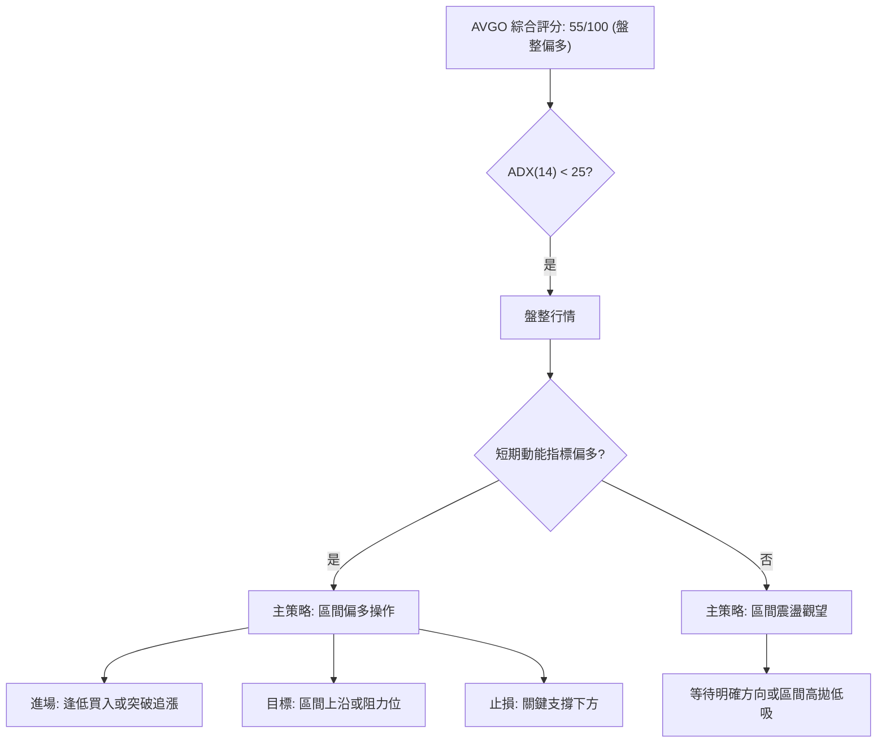
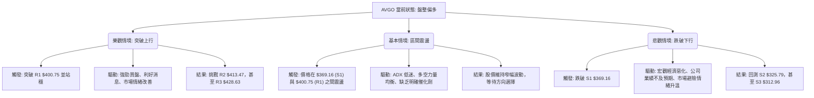

<details>
<summary>📊 靜態圖表 (點擊展開)</summary>

</details>

<html>
<head><meta charset="utf-8" /></head>
<body>
    <div style="height:500px; width:100%;">                        <script>window.PlotlyConfig = {MathJaxConfig: 'local'};</script>
        <script charset="utf-8" src="https://cdn.plot.ly/plotly-3.6.0.min.js" integrity="sha256-QaOVwtVY0T02VaHrr6pnoHLCwayMJp4O5n4YyaE3rJk=" crossorigin="anonymous"></script>                <div id="candlestick-chart" class="plotly-graph-div" style="height:100%; width:100%;"></div>            <script>                window.PLOTLYENV=window.PLOTLYENV || {};                                if (document.getElementById("candlestick-chart")) {                    Plotly.newPlot(                        "candlestick-chart",                        [{"close":{"dtype":"f8","bdata":"AAAAQOVmdUAAAACAbg51QAAAAGDREHVAAAAAYLQWdUAAAADAoeN0QAAAAMCmynRAAAAAgClhdEAAAACgJIF0QAAAAGCDuHRAAAAAwLkEdUAAAADAvwd1QAAAAODs2XRAAAAAQJDodEAAAACAMXl1QAAAAECOcXVAAAAAQCItdEAAAAAAZSt2QAAAACBlY3VAAAAA4PPVdUAAAABg0gJ2QAAAAIAhtnVAAAAAALO0dUAAAACgAUx1QAAAAOB0JnVAAAAA4PBldUAAAAAAgQJ2QAAAAGCEgHZAAAAAgEMud0AAAACAQ\u002f13QAAAAMDzZXdAAAAAIB\u002f5dkAAAADgeIh2QAAAAKCo33VAAAAA4KtPdkAAAACguxl2QAAAAOC4t3VAAAAAwEhGdkAAAAAg+t91QAAAAMDYE3ZAAAAAYF0hdUAAAADg0kh1QAAAAMDYS3VAAAAAoKMpdUAAAAAgHgd2QAAAAAAyjnVAAAAAgN0kdUAAAACAqH13QAAAAOAl7ndAAAAAgKu1eEAAAADAbQt5QAAAAKDa\u002fndAAAAA4Bi3d0AAAACA0qd3QAAAAECBrndAAAAAIAtBeEAAAADA1e14QAAAAKBpQHlAAAAAYLKqeUAAAACAr0F5QAAAAEDJXnZAAAAAAKkedUAAAAAAXjZ1QAAAAOA\u002fQ3RAAAAAYKqAdEAAAAAgaSd1QAAAAEAmQ3VAAAAAYJvAdUAAAABA9M51QAAAAOBm7XVAAAAAILnBdUAAAABADsl1QAAAAMBGjXVAAAAAoIGldUAAAADAjWJ1QAAAAAAiaHVAAAAAINRjdUAAAADgJ7R0QAAAACBDe3VAAAAAYK3udUAAAACg7xR2QAAAAABIKnVAAAAAQC1cdUAAAADgtOZ1QAAAAKARtnRAAAAA4H15dEAAAADguUR0QAAAAIAB7nNAAAAAIIY6dEAAAAAAGbl0QAAAAGBFwHRAAAAAQEKYdEAAAABAWKF0QAAAAOBQnnRAAAAAAHjyc0AAAADgtS5zQAAAACDtVXNAAAAAoCu7dEAAAADA12p1QAAAAGAMM3VAAAAAQAhYdUAAAADgRZ90QAAAAACgP3RAAAAAwBy1dEAAAABAk8R0QAAAAAA6zHRAAAAAoN22dEAAAACgCpJ0QAAAAOC5RHRAAAAAIHKxdEAAAAAATwh0QAAAAAAJ5nNAAAAA4GXac0AAAADAAotzQAAAAGDVxXNAAAAAQMe4dEAAAAAARpR0QAAAAGCyh3VAAAAAoClVdUAAAADgD0V1QAAAAIDK63RAAAAAYKQPdEAAAADgozt0QAAAAIAXAnRAAAAA4FOsc0AAAACAqOpzQAAAACDtVXNAAAAAoAEgdEAAAADAl9xzQAAAAEDm5HNAAAAAoOVOc0AAAAAgR8NyQAAAAEAkT3JAAAAAwFVQc0AAAAAA6o9zQAAAAODYoHNAAAAAIO6ec0AAAACAE9d0QAAAACA34XVAAAAAQJYldkAAAADgZy93QAAAACBmsndAAAAAQNrCd0AAAABgfcF4QAAAACBy3XhAAAAAoFxeeUAAAADg+e94QAAAAGCNGHlAAAAAwLZfekAAAABAbDR6QAAAAMB4YXpAAAAAgKAYekAAAADAK\u002fN4QAAAAADzTHlAAAAAgFMMekAAAAAg1El6QAAAAEB4\u002fXlAAAAAgPSqekAAAACgSIx6QAAAAICHvnlAAAAA4CDVekAAAABADLx6QAAAAOAyKnpAAAAAQBoCekAAAABghXF7QAAAAEBKiHpAAAAAILlAekAAAAAguqZ5QAAAACCZEXpAAAAAgKPeeUAAAAAAxdd5QAAAAKB9VXpAAAAAABhTekAAAACgfp56QAAAAEAG4XtAAAAAAOSzfEAAAADg8Qx+QAAAAGCQ531AAAAAAPgjekAAAACA7RF4QAAAAKCSv3hAAAAAIKV4eEAAAABAMTh3QAAAACBfD3hAAAAA4HXXd0AAAACAFJV4QAAAAODVgXdAAAAAYHeEeEAAAABAM6t5QAAAAIAUgnhAAAAAYGbCd0AAAADAHuF3QAAAAGCPrndAAAAA4FHQdkAAAABAM0d3QAAAAAAAnHdAAAAAoHAVd0AAAABAM4d2QAAAAGBmXndAAAAA4Hosd0AAAABACkt4QA=="},"high":{"dtype":"f8","bdata":"61z7PwV8dUCEoJ4gz4t1QLOWAua8dHVA6wBwrPQidUBkzMoi0QJ1QKgG2aMLE3VAEgs7tGMydUCAwVr6R5N0QOtgRwkRAXVAztXMvsOadUAknm\u002f7sGd1QE1d7yZlY3VA0hXvkZwDdUA3aaqivYl1QJ0gGdr9lXVAwaBpkFbKdUALiyoTCVZ2QAtAd7Zzy3VAuUWNaVpWdkC05t+Bc5N2QLd0Q5A50HVAcAc62aQpdkBnbQA4S9J1QEoLvSEhoXVAkOOGtDeKdUDKPoAQ2kR2QPRLZqWni3ZArPV+Pps\u002fd0BKzzAWOAV4QFUGDFbyA3hAnlBZmVeLd0BiX7P6LEx3QEaAwVdN7nZAL85pzWKtdkDYgoRwlpd2QNywkuRjCHZAyQL2f+ZfdkBrjS7V+H12QIHYGM\u002frTXZAQfCxPEb5dUBHwXy0GW11QCNIxqDL43VAj\u002f2wPH6gdUBE6BC091p2QDeUffe+X3dAc9rTIISqdUDR9Ykn8L13QIwfn7x4H3hAiy2nv0PaeEAEjzO2EAx5QJGN3it2k3hAtxVZzul0eEDpXlIstsJ3QERJLJcC3HdARtls5mN1eEDUzIuzUlB5QF2YK2SYSnlAwPCFUMrEeUAUsFneTXB5QIPEJTfwvXdAB2uRubh\u002fdkAC2Ga5A5l1QP8I737ainVA6QBtXYTidED6M9NWk1h1QPBZFf6Bj3VAZILIPzPNdUCCyB\u002fwCfl1QEdptolB\u002f3VADgiSHrXQdUBoScdUK\u002fZ1QGA\u002fAM2IyXVAd841d2F1dkDsFaW3oRt2QKFhRoBNvHVAbZVkK6rGdUCEv8egsmZ1QJjvlR7XoXVA4DgkOJ4JdkBUP3nDumJ2QOWpWWVy1nVALHxLgVjGdUDHuEmoVxN2QN\u002fQrPMdgnVA9Jq6pBTpdEBhaor+DPx0QC\u002fMGJbuDHRACd1nLJR3dECq5XyCgNh0QLdi1ObfK3VA3qYN53jrdEAgkEEFVw91QNgP87U57XRAeJC+lH8adUArNRbZZeVzQLkRMixOVXRAtptW+1PcdED4fr\u002fYv\u002fB1QPJ\u002f\u002fVK5q3VAg77AwM+edUAzxTwTTpB1QCy5C9J80XRAd35jnkjodEAHU\u002fwNPQp1QN7T61kqE3VA2RZ7msktdUAJWKhUHxR1QH\u002fpRTuucXRAuQ6KodXqdECYNCcDGlZ0QADqKnw17XNAvATWqNjtc0AF40T1h6tzQOkwEy5LF3RAcyBvgy7udEDKGIn+\u002fGN1QL5NXC9gs3VABe5RwID9dUDyCnMip4h1QNwcFflSKXVA1fZ30UARdUDNLLlo3n90QGG0AtnPY3RAwfU56e1DdEBO2O4vViF0QFl0RcNHBXRAHDQXDm1fdEA\u002fkQi0Mj50QNmxS7eZPHRAo8qeFLXGc0BmUKy7OTBzQK53rDidBHNAv9Z8Uh1dc0CB8BT9p7RzQOrKAXgVo3NASenSf2a+c0ApPsKV89l0QBTcQGhJGXZA238wmCFidkAbliODR393QNda13AhxHdAjoeIitDad0BR+4WLPcd4QN4DK2vG8HhA+uIupWVheUBZLyTNcVx5QKzFmV5lL3lAi0+iEIBoekAqJ6UaG8p6QLlHg0BBhXpAbYX9zE9hekALhHQrs1J5QD00LQX8T3lAPPDnmYAbekDhyU1kBWh6QAG9tm6QcnpAF3rMeEgLe0AILRZn0E97QKXY8ZYOnXpAZU1ZgwAle0BjLbWWbw97QOLRYMSVynpAFBlB934fekAMWrZdk5p7QPq6Km4EAntAmCT1lX1VekA5hjcYohR6QH50LgP\u002fd3pAqDPRClNZekAhuuaiODV6QK7kIkv0KXtAK2bHcNsBe0DwgnwvBNB6QLkSyPYMA3xA+03PRQQVfUCm81\u002fzwoB+QK0rUS58435AdafkwOWcekDlDVMNn515QGVMjzxBI3lAe\u002fA6kZtzeUBkz32jNBN4QE9XGfAmTnhAJQZiavIFeEAPG0vfLrl4QEIHEgW8cnhAyc3JNkUAeUCf8SojxMB5QAAAAIA96nlAAAAA4FFweEAAAAAA10t4QAAAAMDMTHhAAAAAQApbd0AAAAAgXIN3QAAAAIDruXdAAAAAAABcd0AAAAAAAGB3QAAAAGCP8ndAAAAAIFxPd0AAAACgcLF4QA=="},"hovertemplate":"\u003cb\u003e%{x|%Y-%m-%d}\u003c\u002fb\u003e\u003cbr\u003e\u958b: $%{open:.2f}\u003cbr\u003e\u9ad8: $%{high:.2f}\u003cbr\u003e\u4f4e: $%{low:.2f}\u003cbr\u003e\u6536: $%{close:.2f}\u003cextra\u003e\u003c\u002fextra\u003e","low":{"dtype":"f8","bdata":"kgkxy7nfdEBuhRJH6AB1QFkn2dNE8nRAUcww7DG\u002fdEA7m+W+nVd0QCHRJ6rNi3RA99tO3ZdbdEAKmVi70Cx0QDpViM0QK3RAlQ+8YRvWdEDksoxI5910QGXriNogy3RAUaj+4ihMdEBHwNsAQ6x0QNRfazUMKHVAz6hqvecjdEB4nOx6sFl1QO4RoEMdHHVAPhIsrQOZdUDpRhtfrbh1QLV5eesXLnVA\u002f6UOlWyedUATS+XQhjZ1QCOPs3Y+2nRANBXQKwwodUAEr4gvy851QH9M\u002fVmeEXZAa1g2jyeIdkBHyu6TwzF3QDL84bD2\u002f3ZAjUV6pwuxdkAMPcJCZ392QC1aB9Wz0HVApGeATTnCdUDTPM\u002fd6Ot1QDN\u002f\u002fhI\u002f9nRAhMXPCCQKdkDZhqelirt1QGXYMq6F23VAZ9WPesPEdEB3iNxgnnN0QOvcF1o5+nRA4P4+hz7adEA3un7hrf50QJHGo+8ZdHVA\u002fMxZvzafdEAKKgNnj5t1QLKlyCPaGndAgR3DZvzRd0CxLXxlJa94QKJJsf5C73dACYOIocaad0CPiRa6WQl3QNydQvjnZndA+RgHsA7wd0C7NLn19rJ4QOm7T9LklHhAKLQ7G1XVeED3OMZG5H94QMiKhXy7EnZAljFOwBD6dEBxFzdwFdN0QEPUuGAP+nNAOj76CjkddECl9PDXn6t0QImN67a3\u002f3RA636jjsIUdUCPQzXt2p11QFkfZTiUp3VAKSy8h8x2dUD7vr+kScB1QHqj5LhvgnVAOl\u002fz16qEdUALL0VnPfR0QFeEa90mDHVA9xhhLVvqdEATlhaEl5R0QK\u002fJQ25qxHRAnAxCxS07dUDwsT8f9Nl1QF6svRoV03RA8\u002f5QC6hGdUAgNBenmGx1QIf918ZQqXRA+QjbhikwdEAbqv1kKTt0QOObf4tQj3NA3ShrHfPGc0AAY8+9HV10QI086PADWHRAm11qGKzxc0A6twzG\u002f3F0QGWG0\u002fPeSHRAhnHRVkY4c0DBgUiLdWNyQOcpgqYwGXNAoU\u002fW2Dmyc0CVnWaq+5Z0QB5MHMV7KXVAjVtW2T3IdEB3thZ0m4V0QN85VRf5N3RA1739nGKyc0DutLPIdmB0QKrVOQuFh3RAkSnRBu2FdECDgik3BEJ0QKyNExe8lHNAWjTQzCSBdEBuW6sCzCxzQLCSSdDLTXNATABzDykhc0Cb5JVPWSRzQKx14YqIaXNAvGaMrIIddEC+t1SNLGN0QOAcILTBJnRAhuY5gsk4dUCpInWcqA91QOV2kkyxr3RA9CFkOQEEdEDflG5PKu5zQBfdrchewXNASsltFkWmc0CKW5gyCzZzQMk9j16FTHNAx5Fb7+qmc0BvOIPUeqVzQCdPCyeDw3NAP\u002fk+PudKc0Dclw0XXaZyQNRnnlQHGHJAMy2anfJ9ckAgDEKb1F9zQBuNjPhe1HJA0LVLnKJcc0CtqkPlqRR0QCgz7ezRX3VAL3cq8hzvdUC\u002fgUdT\u002f4N2QEU2kbhWDndAllUb\u002fpp7d0BO0PIqXw94QMqUNDyue3hAxeMED9ryeECBu4bkY7R4QFC5r\u002fAkn3hAUViUBYZDeUDbldaZPBJ6QBaQPjdsg3lAt0BA25jfeUCRiPUGbKB4QO07ur1ywnhAqnVPz3U5eUCkAcHnB8p5QFap0DwgjnlA8pvLd\u002f8qekCjCyjU6hF6QPKfaQSHWnlAiTvibojVeUDzoYGgDYZ6QLlz+fs7fHlAyfygupBCeUATh+DB7u55QP3D5qIvMnpAr\u002fLxiHHbeUDpAbeYf1N5QJCO0ohRrHlAGeOzF5+deUBQ8dYP\u002fZh5QNbKIA11BXpAWlznQU\u002f9eUBMpKdbsdV5QM9VpYac7HpAfEO84laYe0AsvVYod1t9QEWLIGdKfn1AJqZ1ifgleUDcXP\u002fnsA94QD7YD5u0a3hA0o1iq+obd0DSAO8EVil3QEBdzVduH3dA+AmN8HeGd0AnWxFwxj94QEw0PX7XfXdASL6Jt7ngd0CeAbrD1Et5QAAAAGCPfnhAAAAAYI+Kd0AAAAAgXI93QAAAAEAzS3dAAAAAoEe9dkAAAAAgXId2QAAAAIA9KndAAAAA4HoAd0AAAABA4UZ2QAAAAEDhMndAAAAAACmgdkAAAACAPY53QA=="},"name":"\u50f9\u683c","open":{"dtype":"f8","bdata":"gurwA0pidUATFH3JWEh1QBcqWnOAJXVAPdZGWt0ddUAgyV8dJrJ0QIADsu3K+HRAaZSEOgridEC4O+P0e4R0QGQhftwjZXRAztXMvsOadUDvpq3NjDl1QI9OGm\u002fE4HRASCj6mG3ydEDULIncWr90QHzzGrYrfXVAZPHGXXF3dUDghoZV3ex1QDh9FircwnVAIYvLsukHdkDJHYxC\u002fCx2QFcoxvuVunVAUqgGqUD9dUDzUf+zysB1QJEc0hbVlXVANBXQKwwodUB4S4V6uuh1QEYQHyRneHZAsj9PIZaJdkBHyu6TwzF3QFUGDFbyA3hARd1uR5eCd0AGLjVp1B53QA4w+gxaSHZAgRCI6vPOdUDrbahSpmF2QJNVGDh1A3ZAl6p2z3w+dkDMiH4cg092QLwpKSG3QHZAbpXaFO7ZdUDuV6W99pl0QOZCh7nRHnVAWY1ZPplUdUAcBnnU+ix1QJFTNW9dv3ZAruc4Z8hzdUDXtemNrJx1QMnMZoiO7HdAF6zo4Gv2d0BCPbun\u002fdF4QLdVz25kinhAO\u002fhyBlYieEDez4DsHZ53QMXjTJ3vqHdA4qBqZ0kAeEC\u002f+a2\u002fygN5QHfcAt1xyHhAbinwV1b\u002feEBeLCrHLil5QCBpMeh6nXdAH3dIvPh9dkA0iWCmW+J0QP8I737ainVAuJy6LAridED6A61+t7d0QD7FOAYpjHVArg+gTvI4dUCy+TdPctZ1QPP46DVY3HVA6mOC0gq3dUBksTLy98p1QOdRPa4kx3VA\u002fLmZbcP3dUBk1rkzAhd2QBH\u002fKk5sZXVAg2A2byJHdUCL\u002fWnIWVh1QBxI21vgCnVAnAxCxS07dUBYysShW\u002fl1QM9nmSAHu3VAjyxrLGu9dUDuo4pn\u002fI91QJJ1or5kbXVAcyuzQHXkdECoaPpF6OF0QIOTTMYM4nNAnQjaKgXqc0BAe+Ssy4h0QNMkBqqzGXVA52lgXW61dECvVKechLN0QOCGbQqcTnRAOhOWrRD4dEArNRbZZeVzQPSykCz7knNAJmjFmM3uc0At9plc5Zh0QPOSM5Edo3VAeNY8RG+YdUBZWIvOFml1QKjL8eQ6inRAdpabcxvoc0Cp46wb+IR0QOMYgLuavHRA3H0WHD6ydEAOs3NJfbB0QDES7hizFXRArSka+mqYdEDNXvyW01R0QN4eWor0WHNAscDP1pdDc0BJU6DAnn1zQC1Mwo9XqHNAHy2nj32PdEAaOqrSM3F0QGzfz3vIYHRAyzn5qzO3dUCzsZVqUlV1QA04TsQBCHVAVwmE8AwHdUAHGtLWLE10QA\u002fpXtoHSXRAAHL8ORD0c0C7M97KK3VzQM8spSgf73NAtsam0PXXc0DSTp\u002fO6PdzQFqvr6hIIXRAqArqWWGYc0BuzrpUMilzQK7J5xZQxnJAB576v6uuckCwItJG\u002f41zQC4ZmzwkAHNA93QejP6oc0BmuGVca2N0QFTERmAb83VAwqqihOT7dUBiZHMM6oV2QGFeVc42EXdAk6caZNiUd0D62YIFOVR4QKvRb3UDpnhA82r+oEMEeUA06ClW8VB5QCNgJT127HhAd5vA7GNleUCBFoWkj1t6QGwOooHvhHpAytEzngw9ekCRB6bE1vp4QHOqD1\u002fMLXlADgm5fNDteUA5xqTw8eZ5QEVfEz7yGHpA6cZXROZPekDD3smf8i17QJNXypB0UnpAsma1pC8yekA+kCC+G696QOPF26QsbHpAZFbPd3LyeUA\u002fC\u002fLgJAF6QPq6Km4EAntA8oog2OdLekAGGC43wpJ5QMtbvemFwnlAoukYGljOeUDpuETRSA16QDHnw1drHXpAWp8ZeV+GekA3TbC1l0d6QDIGaBJBBHtA8HSacg8WfEA4iBRFSIB+QLuu13r4335A7bfx1H+FeUAha\u002fBBdG95QM0JGIm9H3lAIwTLFZsPeUDsDtzIWs53QIyPb6axQ3dAVmEbktHxd0CpfpYWKa54QPf3Fn9+WXhAOQOLPohBeEBRNcG07I55QAAAAGCP2nlAAAAAgOudd0AAAACA6yl4QAAAAKBHKXhAAAAAQDMnd0AAAACA61l3QAAAAOCjbHdAAAAAgOs9d0AAAAAgrtt2QAAAAIDCWXdAAAAAwPXodkAAAADgUZh3QA=="},"x":["2025-09-19T00:00:00-04:00","2025-09-22T00:00:00-04:00","2025-09-23T00:00:00-04:00","2025-09-24T00:00:00-04:00","2025-09-25T00:00:00-04:00","2025-09-26T00:00:00-04:00","2025-09-29T00:00:00-04:00","2025-09-30T00:00:00-04:00","2025-10-01T00:00:00-04:00","2025-10-02T00:00:00-04:00","2025-10-03T00:00:00-04:00","2025-10-06T00:00:00-04:00","2025-10-07T00:00:00-04:00","2025-10-08T00:00:00-04:00","2025-10-09T00:00:00-04:00","2025-10-10T00:00:00-04:00","2025-10-13T00:00:00-04:00","2025-10-14T00:00:00-04:00","2025-10-15T00:00:00-04:00","2025-10-16T00:00:00-04:00","2025-10-17T00:00:00-04:00","2025-10-20T00:00:00-04:00","2025-10-21T00:00:00-04:00","2025-10-22T00:00:00-04:00","2025-10-23T00:00:00-04:00","2025-10-24T00:00:00-04:00","2025-10-27T00:00:00-04:00","2025-10-28T00:00:00-04:00","2025-10-29T00:00:00-04:00","2025-10-30T00:00:00-04:00","2025-10-31T00:00:00-04:00","2025-11-03T00:00:00-05:00","2025-11-04T00:00:00-05:00","2025-11-05T00:00:00-05:00","2025-11-06T00:00:00-05:00","2025-11-07T00:00:00-05:00","2025-11-10T00:00:00-05:00","2025-11-11T00:00:00-05:00","2025-11-12T00:00:00-05:00","2025-11-13T00:00:00-05:00","2025-11-14T00:00:00-05:00","2025-11-17T00:00:00-05:00","2025-11-18T00:00:00-05:00","2025-11-19T00:00:00-05:00","2025-11-20T00:00:00-05:00","2025-11-21T00:00:00-05:00","2025-11-24T00:00:00-05:00","2025-11-25T00:00:00-05:00","2025-11-26T00:00:00-05:00","2025-11-28T00:00:00-05:00","2025-12-01T00:00:00-05:00","2025-12-02T00:00:00-05:00","2025-12-03T00:00:00-05:00","2025-12-04T00:00:00-05:00","2025-12-05T00:00:00-05:00","2025-12-08T00:00:00-05:00","2025-12-09T00:00:00-05:00","2025-12-10T00:00:00-05:00","2025-12-11T00:00:00-05:00","2025-12-12T00:00:00-05:00","2025-12-15T00:00:00-05:00","2025-12-16T00:00:00-05:00","2025-12-17T00:00:00-05:00","2025-12-18T00:00:00-05:00","2025-12-19T00:00:00-05:00","2025-12-22T00:00:00-05:00","2025-12-23T00:00:00-05:00","2025-12-24T00:00:00-05:00","2025-12-26T00:00:00-05:00","2025-12-29T00:00:00-05:00","2025-12-30T00:00:00-05:00","2025-12-31T00:00:00-05:00","2026-01-02T00:00:00-05:00","2026-01-05T00:00:00-05:00","2026-01-06T00:00:00-05:00","2026-01-07T00:00:00-05:00","2026-01-08T00:00:00-05:00","2026-01-09T00:00:00-05:00","2026-01-12T00:00:00-05:00","2026-01-13T00:00:00-05:00","2026-01-14T00:00:00-05:00","2026-01-15T00:00:00-05:00","2026-01-16T00:00:00-05:00","2026-01-20T00:00:00-05:00","2026-01-21T00:00:00-05:00","2026-01-22T00:00:00-05:00","2026-01-23T00:00:00-05:00","2026-01-26T00:00:00-05:00","2026-01-27T00:00:00-05:00","2026-01-28T00:00:00-05:00","2026-01-29T00:00:00-05:00","2026-01-30T00:00:00-05:00","2026-02-02T00:00:00-05:00","2026-02-03T00:00:00-05:00","2026-02-04T00:00:00-05:00","2026-02-05T00:00:00-05:00","2026-02-06T00:00:00-05:00","2026-02-09T00:00:00-05:00","2026-02-10T00:00:00-05:00","2026-02-11T00:00:00-05:00","2026-02-12T00:00:00-05:00","2026-02-13T00:00:00-05:00","2026-02-17T00:00:00-05:00","2026-02-18T00:00:00-05:00","2026-02-19T00:00:00-05:00","2026-02-20T00:00:00-05:00","2026-02-23T00:00:00-05:00","2026-02-24T00:00:00-05:00","2026-02-25T00:00:00-05:00","2026-02-26T00:00:00-05:00","2026-02-27T00:00:00-05:00","2026-03-02T00:00:00-05:00","2026-03-03T00:00:00-05:00","2026-03-04T00:00:00-05:00","2026-03-05T00:00:00-05:00","2026-03-06T00:00:00-05:00","2026-03-09T00:00:00-04:00","2026-03-10T00:00:00-04:00","2026-03-11T00:00:00-04:00","2026-03-12T00:00:00-04:00","2026-03-13T00:00:00-04:00","2026-03-16T00:00:00-04:00","2026-03-17T00:00:00-04:00","2026-03-18T00:00:00-04:00","2026-03-19T00:00:00-04:00","2026-03-20T00:00:00-04:00","2026-03-23T00:00:00-04:00","2026-03-24T00:00:00-04:00","2026-03-25T00:00:00-04:00","2026-03-26T00:00:00-04:00","2026-03-27T00:00:00-04:00","2026-03-30T00:00:00-04:00","2026-03-31T00:00:00-04:00","2026-04-01T00:00:00-04:00","2026-04-02T00:00:00-04:00","2026-04-06T00:00:00-04:00","2026-04-07T00:00:00-04:00","2026-04-08T00:00:00-04:00","2026-04-09T00:00:00-04:00","2026-04-10T00:00:00-04:00","2026-04-13T00:00:00-04:00","2026-04-14T00:00:00-04:00","2026-04-15T00:00:00-04:00","2026-04-16T00:00:00-04:00","2026-04-17T00:00:00-04:00","2026-04-20T00:00:00-04:00","2026-04-21T00:00:00-04:00","2026-04-22T00:00:00-04:00","2026-04-23T00:00:00-04:00","2026-04-24T00:00:00-04:00","2026-04-27T00:00:00-04:00","2026-04-28T00:00:00-04:00","2026-04-29T00:00:00-04:00","2026-04-30T00:00:00-04:00","2026-05-01T00:00:00-04:00","2026-05-04T00:00:00-04:00","2026-05-05T00:00:00-04:00","2026-05-06T00:00:00-04:00","2026-05-07T00:00:00-04:00","2026-05-08T00:00:00-04:00","2026-05-11T00:00:00-04:00","2026-05-12T00:00:00-04:00","2026-05-13T00:00:00-04:00","2026-05-14T00:00:00-04:00","2026-05-15T00:00:00-04:00","2026-05-18T00:00:00-04:00","2026-05-19T00:00:00-04:00","2026-05-20T00:00:00-04:00","2026-05-21T00:00:00-04:00","2026-05-22T00:00:00-04:00","2026-05-26T00:00:00-04:00","2026-05-27T00:00:00-04:00","2026-05-28T00:00:00-04:00","2026-05-29T00:00:00-04:00","2026-06-01T00:00:00-04:00","2026-06-02T00:00:00-04:00","2026-06-03T00:00:00-04:00","2026-06-04T00:00:00-04:00","2026-06-05T00:00:00-04:00","2026-06-08T00:00:00-04:00","2026-06-09T00:00:00-04:00","2026-06-10T00:00:00-04:00","2026-06-11T00:00:00-04:00","2026-06-12T00:00:00-04:00","2026-06-15T00:00:00-04:00","2026-06-16T00:00:00-04:00","2026-06-17T00:00:00-04:00","2026-06-18T00:00:00-04:00","2026-06-22T00:00:00-04:00","2026-06-23T00:00:00-04:00","2026-06-24T00:00:00-04:00","2026-06-25T00:00:00-04:00","2026-06-26T00:00:00-04:00","2026-06-29T00:00:00-04:00","2026-06-30T00:00:00-04:00","2026-07-01T00:00:00-04:00","2026-07-02T00:00:00-04:00","2026-07-06T00:00:00-04:00","2026-07-07T00:00:00-04:00","2026-07-08T00:00:00-04:00"],"type":"candlestick"},{"hovertemplate":"MA30: $%{y:.2f}\u003cextra\u003e\u003c\u002fextra\u003e","line":{"color":"#2196F3","dash":"dash","width":2},"mode":"lines","name":"MA30","x":["2025-09-19T00:00:00-04:00","2025-09-22T00:00:00-04:00","2025-09-23T00:00:00-04:00","2025-09-24T00:00:00-04:00","2025-09-25T00:00:00-04:00","2025-09-26T00:00:00-04:00","2025-09-29T00:00:00-04:00","2025-09-30T00:00:00-04:00","2025-10-01T00:00:00-04:00","2025-10-02T00:00:00-04:00","2025-10-03T00:00:00-04:00","2025-10-06T00:00:00-04:00","2025-10-07T00:00:00-04:00","2025-10-08T00:00:00-04:00","2025-10-09T00:00:00-04:00","2025-10-10T00:00:00-04:00","2025-10-13T00:00:00-04:00","2025-10-14T00:00:00-04:00","2025-10-15T00:00:00-04:00","2025-10-16T00:00:00-04:00","2025-10-17T00:00:00-04:00","2025-10-20T00:00:00-04:00","2025-10-21T00:00:00-04:00","2025-10-22T00:00:00-04:00","2025-10-23T00:00:00-04:00","2025-10-24T00:00:00-04:00","2025-10-27T00:00:00-04:00","2025-10-28T00:00:00-04:00","2025-10-29T00:00:00-04:00","2025-10-30T00:00:00-04:00","2025-10-31T00:00:00-04:00","2025-11-03T00:00:00-05:00","2025-11-04T00:00:00-05:00","2025-11-05T00:00:00-05:00","2025-11-06T00:00:00-05:00","2025-11-07T00:00:00-05:00","2025-11-10T00:00:00-05:00","2025-11-11T00:00:00-05:00","2025-11-12T00:00:00-05:00","2025-11-13T00:00:00-05:00","2025-11-14T00:00:00-05:00","2025-11-17T00:00:00-05:00","2025-11-18T00:00:00-05:00","2025-11-19T00:00:00-05:00","2025-11-20T00:00:00-05:00","2025-11-21T00:00:00-05:00","2025-11-24T00:00:00-05:00","2025-11-25T00:00:00-05:00","2025-11-26T00:00:00-05:00","2025-11-28T00:00:00-05:00","2025-12-01T00:00:00-05:00","2025-12-02T00:00:00-05:00","2025-12-03T00:00:00-05:00","2025-12-04T00:00:00-05:00","2025-12-05T00:00:00-05:00","2025-12-08T00:00:00-05:00","2025-12-09T00:00:00-05:00","2025-12-10T00:00:00-05:00","2025-12-11T00:00:00-05:00","2025-12-12T00:00:00-05:00","2025-12-15T00:00:00-05:00","2025-12-16T00:00:00-05:00","2025-12-17T00:00:00-05:00","2025-12-18T00:00:00-05:00","2025-12-19T00:00:00-05:00","2025-12-22T00:00:00-05:00","2025-12-23T00:00:00-05:00","2025-12-24T00:00:00-05:00","2025-12-26T00:00:00-05:00","2025-12-29T00:00:00-05:00","2025-12-30T00:00:00-05:00","2025-12-31T00:00:00-05:00","2026-01-02T00:00:00-05:00","2026-01-05T00:00:00-05:00","2026-01-06T00:00:00-05:00","2026-01-07T00:00:00-05:00","2026-01-08T00:00:00-05:00","2026-01-09T00:00:00-05:00","2026-01-12T00:00:00-05:00","2026-01-13T00:00:00-05:00","2026-01-14T00:00:00-05:00","2026-01-15T00:00:00-05:00","2026-01-16T00:00:00-05:00","2026-01-20T00:00:00-05:00","2026-01-21T00:00:00-05:00","2026-01-22T00:00:00-05:00","2026-01-23T00:00:00-05:00","2026-01-26T00:00:00-05:00","2026-01-27T00:00:00-05:00","2026-01-28T00:00:00-05:00","2026-01-29T00:00:00-05:00","2026-01-30T00:00:00-05:00","2026-02-02T00:00:00-05:00","2026-02-03T00:00:00-05:00","2026-02-04T00:00:00-05:00","2026-02-05T00:00:00-05:00","2026-02-06T00:00:00-05:00","2026-02-09T00:00:00-05:00","2026-02-10T00:00:00-05:00","2026-02-11T00:00:00-05:00","2026-02-12T00:00:00-05:00","2026-02-13T00:00:00-05:00","2026-02-17T00:00:00-05:00","2026-02-18T00:00:00-05:00","2026-02-19T00:00:00-05:00","2026-02-20T00:00:00-05:00","2026-02-23T00:00:00-05:00","2026-02-24T00:00:00-05:00","2026-02-25T00:00:00-05:00","2026-02-26T00:00:00-05:00","2026-02-27T00:00:00-05:00","2026-03-02T00:00:00-05:00","2026-03-03T00:00:00-05:00","2026-03-04T00:00:00-05:00","2026-03-05T00:00:00-05:00","2026-03-06T00:00:00-05:00","2026-03-09T00:00:00-04:00","2026-03-10T00:00:00-04:00","2026-03-11T00:00:00-04:00","2026-03-12T00:00:00-04:00","2026-03-13T00:00:00-04:00","2026-03-16T00:00:00-04:00","2026-03-17T00:00:00-04:00","2026-03-18T00:00:00-04:00","2026-03-19T00:00:00-04:00","2026-03-20T00:00:00-04:00","2026-03-23T00:00:00-04:00","2026-03-24T00:00:00-04:00","2026-03-25T00:00:00-04:00","2026-03-26T00:00:00-04:00","2026-03-27T00:00:00-04:00","2026-03-30T00:00:00-04:00","2026-03-31T00:00:00-04:00","2026-04-01T00:00:00-04:00","2026-04-02T00:00:00-04:00","2026-04-06T00:00:00-04:00","2026-04-07T00:00:00-04:00","2026-04-08T00:00:00-04:00","2026-04-09T00:00:00-04:00","2026-04-10T00:00:00-04:00","2026-04-13T00:00:00-04:00","2026-04-14T00:00:00-04:00","2026-04-15T00:00:00-04:00","2026-04-16T00:00:00-04:00","2026-04-17T00:00:00-04:00","2026-04-20T00:00:00-04:00","2026-04-21T00:00:00-04:00","2026-04-22T00:00:00-04:00","2026-04-23T00:00:00-04:00","2026-04-24T00:00:00-04:00","2026-04-27T00:00:00-04:00","2026-04-28T00:00:00-04:00","2026-04-29T00:00:00-04:00","2026-04-30T00:00:00-04:00","2026-05-01T00:00:00-04:00","2026-05-04T00:00:00-04:00","2026-05-05T00:00:00-04:00","2026-05-06T00:00:00-04:00","2026-05-07T00:00:00-04:00","2026-05-08T00:00:00-04:00","2026-05-11T00:00:00-04:00","2026-05-12T00:00:00-04:00","2026-05-13T00:00:00-04:00","2026-05-14T00:00:00-04:00","2026-05-15T00:00:00-04:00","2026-05-18T00:00:00-04:00","2026-05-19T00:00:00-04:00","2026-05-20T00:00:00-04:00","2026-05-21T00:00:00-04:00","2026-05-22T00:00:00-04:00","2026-05-26T00:00:00-04:00","2026-05-27T00:00:00-04:00","2026-05-28T00:00:00-04:00","2026-05-29T00:00:00-04:00","2026-06-01T00:00:00-04:00","2026-06-02T00:00:00-04:00","2026-06-03T00:00:00-04:00","2026-06-04T00:00:00-04:00","2026-06-05T00:00:00-04:00","2026-06-08T00:00:00-04:00","2026-06-09T00:00:00-04:00","2026-06-10T00:00:00-04:00","2026-06-11T00:00:00-04:00","2026-06-12T00:00:00-04:00","2026-06-15T00:00:00-04:00","2026-06-16T00:00:00-04:00","2026-06-17T00:00:00-04:00","2026-06-18T00:00:00-04:00","2026-06-22T00:00:00-04:00","2026-06-23T00:00:00-04:00","2026-06-24T00:00:00-04:00","2026-06-25T00:00:00-04:00","2026-06-26T00:00:00-04:00","2026-06-29T00:00:00-04:00","2026-06-30T00:00:00-04:00","2026-07-01T00:00:00-04:00","2026-07-02T00:00:00-04:00","2026-07-06T00:00:00-04:00","2026-07-07T00:00:00-04:00","2026-07-08T00:00:00-04:00"],"y":{"dtype":"f8","bdata":"AAAAAAAA+H8AAAAAAAD4fwAAAAAAAPh\u002fAAAAAAAA+H8AAAAAAAD4fwAAAAAAAPh\u002fAAAAAAAA+H8AAAAAAAD4fwAAAAAAAPh\u002fAAAAAAAA+H8AAAAAAAD4fwAAAAAAAPh\u002fAAAAAAAA+H8AAAAAAAD4fwAAAAAAAPh\u002fAAAAAAAA+H8AAAAAAAD4fwAAAAAAAPh\u002fAAAAAAAA+H8AAAAAAAD4fwAAAAAAAPh\u002fAAAAAAAA+H8AAAAAAAD4fwAAAAAAAPh\u002fAAAAAAAA+H8AAAAAAAD4fwAAAAAAAPh\u002fAAAAAAAA+H8AAAAAAAD4fzMzM\u002fMifHVAd3d3R4uJdUCamZk5JZZ1QEREREQKnXVAq6qq6nindUDNzMwcz7F1QN7d3R22uXVAMzMz0+HJdUC8u7ubk9V1QFVVVYUn4XVAiYiI6BvidUBmZmY2R+R1QHd3d1cT6HVAd3d3pz7qdUDe3d29+e51QCIiIiLu73VAvLu7GzD4dUAAAACgdgN2QHd3d7cnGXZAZmZm1q0xdkAiIiLikEt2QFVVVYUOX3ZAzczMDDRwdkDNzMycVIR2QAAAAKDumXZA3t3dXU2ydkB3d3eXNst2QKuqqiqt4nZAAAAAEOT3dkBmZmZ2tAJ3QHd3d8fu+XZAq6qqCh7qdkARERHh2N52QHd3d6cZ0XZAvLu7q6rBdkCrqqralrl2QJqZmRm0tXZAMzMzYz+xdkAAAAAgrrB2QAAAABBmr3ZAREREdL60dkAzMzOzBLl2QImIiAgzu3ZAiYiICFS\u002fdkARERHB17l2QERERPSSuHZA3t3dPay6dkAAAACw46J2QDMzM0P+jXZAAAAAIEt2dkB3d3enAl12QCIiIqLbRHZAZmZmtsIwdkAiIiJCyiF2QERERDRxCHZAMzMzwzDodUARERGRa8B1QCIiIrIBk3VAIiIi0plkdUAzMzMj6j11QBEREfEYMHVAzczMDJ4rdUBERERkpiZ1QN7d3X2vKXVAREREFPIkdUDe3d1NHxR1QHd3d3euA3VAq6qqivf6dEAiIiJCofd0QKuqqgpr8XRAVVVVJeXtdEARERER+ON0QImIiOjY2HRAvLu7i9XQdEBmZmZ2kct0QAAAABBfxnRAzczMHJvAdEAREREBeL90QImIiBgetXRA3t3dDYuqdEC8u7s7Dpl0QFVVVVU\u002fjnRAq6qqWmOBdEARERHRQ210QO\u002fu7s5BZXRAq6qq2l1ndECJiIioBGp0QAAAALCsd3RAmpmZiRiBdEBmZmbmwoV0QFVVVUU2h3RAmpmZeaiCdECJiIiYRH90QLy7u3sPenRAIiIi8rh3dEBERETE\u002fH10QERERMT8fXRAMzMzs9B4dEDNzMxMimt0QFVVVeVmYHRAAAAA4AdPdEDNzMwMKj90QERERGSdLnRARERE5LgidEC8u7v7bhh0QHd3d0d0DnRA7+7ufh8FdEB3d3eXbAd0QAAAAIAsFXRAq6qqGpQhdEBVVVVVezx0QGZmZtbkXHRAzczMDD5+dECrqqqauap0QDMzM8Mt1nRAAAAA4NT9dECamZmJBSN1QM3MzDxzQXVAERER8XdsdUDv7u6elJZ1QO\u002fu7n4rxXVA3t3dXav4dUARERGh6yB2QERERBQVTnZAd3d3d3uEdkCamZnJ2rp2QBEREbGj83ZAZmZmlngrd0BEREQEh2R3QKuqqspylndAd3d396fWd0CamZmJrhp4QO\u002fu7o63XXhAVVVVtdeWeEDv7u6eGNp4QM3MzMwCFXlAIiIioppNeUCJiIi4qHZ5QImIiLhnmnlA3t3dbSy6eUAzMzMz2tB5QLy7u\u002fta53lAiYiI6Dr9eUCamZlZIQ16QM3MzHzZJnpA7+7u7kxDekDNzMzM7m56QO\u002fu7m73l3pAvLu7m\u002fmVekDv7u4uwoN6QM3MzBzUdXpAZmZmZvZnekARERFRMll6QCIiIlKcTnpAIiIiIsg7ekBmZmY2OS16QCIiIiIJGHpAERERoa8FekCrqqrqLv55QM3MzIyi83lAIiIiImnZeUAiIiLiC8F5QERERMTbq3lAq6qqWpmQeUBVVVUVDm15QM3MzKwcVHlAmpmZuRE5eUCJiIgYax55QO\u002fu7t5gB3lAREREhF\u002fweEB3d3cXJuN4QA=="},"type":"scatter"},{"hovertemplate":"MA60: $%{y:.2f}\u003cextra\u003e\u003c\u002fextra\u003e","line":{"color":"#9C27B0","dash":"dash","width":2},"mode":"lines","name":"MA60","x":["2025-09-19T00:00:00-04:00","2025-09-22T00:00:00-04:00","2025-09-23T00:00:00-04:00","2025-09-24T00:00:00-04:00","2025-09-25T00:00:00-04:00","2025-09-26T00:00:00-04:00","2025-09-29T00:00:00-04:00","2025-09-30T00:00:00-04:00","2025-10-01T00:00:00-04:00","2025-10-02T00:00:00-04:00","2025-10-03T00:00:00-04:00","2025-10-06T00:00:00-04:00","2025-10-07T00:00:00-04:00","2025-10-08T00:00:00-04:00","2025-10-09T00:00:00-04:00","2025-10-10T00:00:00-04:00","2025-10-13T00:00:00-04:00","2025-10-14T00:00:00-04:00","2025-10-15T00:00:00-04:00","2025-10-16T00:00:00-04:00","2025-10-17T00:00:00-04:00","2025-10-20T00:00:00-04:00","2025-10-21T00:00:00-04:00","2025-10-22T00:00:00-04:00","2025-10-23T00:00:00-04:00","2025-10-24T00:00:00-04:00","2025-10-27T00:00:00-04:00","2025-10-28T00:00:00-04:00","2025-10-29T00:00:00-04:00","2025-10-30T00:00:00-04:00","2025-10-31T00:00:00-04:00","2025-11-03T00:00:00-05:00","2025-11-04T00:00:00-05:00","2025-11-05T00:00:00-05:00","2025-11-06T00:00:00-05:00","2025-11-07T00:00:00-05:00","2025-11-10T00:00:00-05:00","2025-11-11T00:00:00-05:00","2025-11-12T00:00:00-05:00","2025-11-13T00:00:00-05:00","2025-11-14T00:00:00-05:00","2025-11-17T00:00:00-05:00","2025-11-18T00:00:00-05:00","2025-11-19T00:00:00-05:00","2025-11-20T00:00:00-05:00","2025-11-21T00:00:00-05:00","2025-11-24T00:00:00-05:00","2025-11-25T00:00:00-05:00","2025-11-26T00:00:00-05:00","2025-11-28T00:00:00-05:00","2025-12-01T00:00:00-05:00","2025-12-02T00:00:00-05:00","2025-12-03T00:00:00-05:00","2025-12-04T00:00:00-05:00","2025-12-05T00:00:00-05:00","2025-12-08T00:00:00-05:00","2025-12-09T00:00:00-05:00","2025-12-10T00:00:00-05:00","2025-12-11T00:00:00-05:00","2025-12-12T00:00:00-05:00","2025-12-15T00:00:00-05:00","2025-12-16T00:00:00-05:00","2025-12-17T00:00:00-05:00","2025-12-18T00:00:00-05:00","2025-12-19T00:00:00-05:00","2025-12-22T00:00:00-05:00","2025-12-23T00:00:00-05:00","2025-12-24T00:00:00-05:00","2025-12-26T00:00:00-05:00","2025-12-29T00:00:00-05:00","2025-12-30T00:00:00-05:00","2025-12-31T00:00:00-05:00","2026-01-02T00:00:00-05:00","2026-01-05T00:00:00-05:00","2026-01-06T00:00:00-05:00","2026-01-07T00:00:00-05:00","2026-01-08T00:00:00-05:00","2026-01-09T00:00:00-05:00","2026-01-12T00:00:00-05:00","2026-01-13T00:00:00-05:00","2026-01-14T00:00:00-05:00","2026-01-15T00:00:00-05:00","2026-01-16T00:00:00-05:00","2026-01-20T00:00:00-05:00","2026-01-21T00:00:00-05:00","2026-01-22T00:00:00-05:00","2026-01-23T00:00:00-05:00","2026-01-26T00:00:00-05:00","2026-01-27T00:00:00-05:00","2026-01-28T00:00:00-05:00","2026-01-29T00:00:00-05:00","2026-01-30T00:00:00-05:00","2026-02-02T00:00:00-05:00","2026-02-03T00:00:00-05:00","2026-02-04T00:00:00-05:00","2026-02-05T00:00:00-05:00","2026-02-06T00:00:00-05:00","2026-02-09T00:00:00-05:00","2026-02-10T00:00:00-05:00","2026-02-11T00:00:00-05:00","2026-02-12T00:00:00-05:00","2026-02-13T00:00:00-05:00","2026-02-17T00:00:00-05:00","2026-02-18T00:00:00-05:00","2026-02-19T00:00:00-05:00","2026-02-20T00:00:00-05:00","2026-02-23T00:00:00-05:00","2026-02-24T00:00:00-05:00","2026-02-25T00:00:00-05:00","2026-02-26T00:00:00-05:00","2026-02-27T00:00:00-05:00","2026-03-02T00:00:00-05:00","2026-03-03T00:00:00-05:00","2026-03-04T00:00:00-05:00","2026-03-05T00:00:00-05:00","2026-03-06T00:00:00-05:00","2026-03-09T00:00:00-04:00","2026-03-10T00:00:00-04:00","2026-03-11T00:00:00-04:00","2026-03-12T00:00:00-04:00","2026-03-13T00:00:00-04:00","2026-03-16T00:00:00-04:00","2026-03-17T00:00:00-04:00","2026-03-18T00:00:00-04:00","2026-03-19T00:00:00-04:00","2026-03-20T00:00:00-04:00","2026-03-23T00:00:00-04:00","2026-03-24T00:00:00-04:00","2026-03-25T00:00:00-04:00","2026-03-26T00:00:00-04:00","2026-03-27T00:00:00-04:00","2026-03-30T00:00:00-04:00","2026-03-31T00:00:00-04:00","2026-04-01T00:00:00-04:00","2026-04-02T00:00:00-04:00","2026-04-06T00:00:00-04:00","2026-04-07T00:00:00-04:00","2026-04-08T00:00:00-04:00","2026-04-09T00:00:00-04:00","2026-04-10T00:00:00-04:00","2026-04-13T00:00:00-04:00","2026-04-14T00:00:00-04:00","2026-04-15T00:00:00-04:00","2026-04-16T00:00:00-04:00","2026-04-17T00:00:00-04:00","2026-04-20T00:00:00-04:00","2026-04-21T00:00:00-04:00","2026-04-22T00:00:00-04:00","2026-04-23T00:00:00-04:00","2026-04-24T00:00:00-04:00","2026-04-27T00:00:00-04:00","2026-04-28T00:00:00-04:00","2026-04-29T00:00:00-04:00","2026-04-30T00:00:00-04:00","2026-05-01T00:00:00-04:00","2026-05-04T00:00:00-04:00","2026-05-05T00:00:00-04:00","2026-05-06T00:00:00-04:00","2026-05-07T00:00:00-04:00","2026-05-08T00:00:00-04:00","2026-05-11T00:00:00-04:00","2026-05-12T00:00:00-04:00","2026-05-13T00:00:00-04:00","2026-05-14T00:00:00-04:00","2026-05-15T00:00:00-04:00","2026-05-18T00:00:00-04:00","2026-05-19T00:00:00-04:00","2026-05-20T00:00:00-04:00","2026-05-21T00:00:00-04:00","2026-05-22T00:00:00-04:00","2026-05-26T00:00:00-04:00","2026-05-27T00:00:00-04:00","2026-05-28T00:00:00-04:00","2026-05-29T00:00:00-04:00","2026-06-01T00:00:00-04:00","2026-06-02T00:00:00-04:00","2026-06-03T00:00:00-04:00","2026-06-04T00:00:00-04:00","2026-06-05T00:00:00-04:00","2026-06-08T00:00:00-04:00","2026-06-09T00:00:00-04:00","2026-06-10T00:00:00-04:00","2026-06-11T00:00:00-04:00","2026-06-12T00:00:00-04:00","2026-06-15T00:00:00-04:00","2026-06-16T00:00:00-04:00","2026-06-17T00:00:00-04:00","2026-06-18T00:00:00-04:00","2026-06-22T00:00:00-04:00","2026-06-23T00:00:00-04:00","2026-06-24T00:00:00-04:00","2026-06-25T00:00:00-04:00","2026-06-26T00:00:00-04:00","2026-06-29T00:00:00-04:00","2026-06-30T00:00:00-04:00","2026-07-01T00:00:00-04:00","2026-07-02T00:00:00-04:00","2026-07-06T00:00:00-04:00","2026-07-07T00:00:00-04:00","2026-07-08T00:00:00-04:00"],"y":{"dtype":"f8","bdata":"AAAAAAAA+H8AAAAAAAD4fwAAAAAAAPh\u002fAAAAAAAA+H8AAAAAAAD4fwAAAAAAAPh\u002fAAAAAAAA+H8AAAAAAAD4fwAAAAAAAPh\u002fAAAAAAAA+H8AAAAAAAD4fwAAAAAAAPh\u002fAAAAAAAA+H8AAAAAAAD4fwAAAAAAAPh\u002fAAAAAAAA+H8AAAAAAAD4fwAAAAAAAPh\u002fAAAAAAAA+H8AAAAAAAD4fwAAAAAAAPh\u002fAAAAAAAA+H8AAAAAAAD4fwAAAAAAAPh\u002fAAAAAAAA+H8AAAAAAAD4fwAAAAAAAPh\u002fAAAAAAAA+H8AAAAAAAD4fwAAAAAAAPh\u002fAAAAAAAA+H8AAAAAAAD4fwAAAAAAAPh\u002fAAAAAAAA+H8AAAAAAAD4fwAAAAAAAPh\u002fAAAAAAAA+H8AAAAAAAD4fwAAAAAAAPh\u002fAAAAAAAA+H8AAAAAAAD4fwAAAAAAAPh\u002fAAAAAAAA+H8AAAAAAAD4fwAAAAAAAPh\u002fAAAAAAAA+H8AAAAAAAD4fwAAAAAAAPh\u002fAAAAAAAA+H8AAAAAAAD4fwAAAAAAAPh\u002fAAAAAAAA+H8AAAAAAAD4fwAAAAAAAPh\u002fAAAAAAAA+H8AAAAAAAD4fwAAAAAAAPh\u002fAAAAAAAA+H8AAAAAAAD4f1VVVd0IO3ZAERERqdQ5dkBVVVUNfzp2QN7d3fURN3ZAMzMzy5E0dkC8u7v7sjV2QLy7uxu1N3ZAMzMzm5A9dkDe3d3dIEN2QKuqqspGSHZAZmZmLm1LdkDNzMz0pU52QAAAADCjUXZAAAAAWMlUdkB3d3e\u002faFR2QDMzM4tAVHZAzczMLG5ZdkAAAAAoLVN2QFVVVf2SU3ZAMzMze\u002fxTdkDNzMzESVR2QLy7uxP1UXZAmpmZYXtQdkB3d3dvD1N2QCIiIuovUXZAiYiIED9NdkBEREQU0UV2QGZmZm7XOnZAERER8T4udkDNzMxMTyB2QERERNwDFXZAvLu7C94KdkCrqqqivwJ2QKuqqpJk\u002fXVAAAAAYE7zdUBEREQU2+Z1QImIiEix3HVA7+7udhvWdUARERGxJ9R1QFVVVY1o0HVAzczMzFHRdUAiIiJifs51QImIiPgFynVAIiIiyhTIdUC8u7ubtMJ1QCIiIgJ5v3VAVVVVraO9dUCJiIjYLbF1QN7d3S2OoXVA7+7uFmuQdUCamZlxCHt1QLy7u3uNaXVAiYiICBNZdUCamZkJh0d1QJqZmYHZNnVA7+7uTscndUDNzMwcOBV1QBERETFXBXVA3t3dLdnydEDNzMyE1uF0QDMzM5un23RAMzMzQyPXdEBmZmZ+9dJ0QM3MzHzf0XRAMzMzg1XOdEAREREJDsl0QN7d3Z3VwHRA7+7uHuS5dEB3d3fHlbF0QAAAAPjoqHRAq6qqgnaedEDv7u4OkZF0QGZmZia7g3RAAAAAOMd5dEARERE5AHJ0QLy7u6tpanRA3t3dTd1idEBERERMcmN0QEREREwlZXRARERElA9mdECJiIjIxGp0QN7d3RWSdXRAvLu7s9B\u002fdEDe3d21\u002fot0QBEREcm3nXRAVVVVXZmydEAREREZhcZ0QGZmZvaP3HRAVVVVPcj2dECrqqrCKw51QCIiIuIwJnVAvLu766k9dUDNzMwcGFB1QAAAAEgSZHVAzczMNBp+dUDv7u7Ga5x1QKuqqjrQuHVAzczMpCTSdUCJiIioCOh1QAAAANhs+3VAvLu769cSdkAzMzNL7Cx2QJqZmXkqRnZAzczMTMhcdkBVVVXNQ3l2QCIiIoq7kXZAiYiIEF2pdkAAAACoCr92QERERBzK13ZARERERODtdkBERETEqgZ3QBEREekfIndAq6qqerw9d0AiIiJ67Vt3QAAAAKCDfndAd3d355Cgd0AzMzMr+sh3QN7d3VW17HdAZmZmxjgBeEDv7u5mKw14QN7d3c1\u002fHXhAIiIi4lAweEARERH5Dj14QDMzM7NYTnhAzczMzCFgeEAAAAAACnR4QJqZmWnWhXhAvLu7G5SYeEB3d3f3WrF4QLy7u6sKxXhAzczMjAjYeEDe3d013e14QJqZmanJBHlAAAAAiLgTeUAiIiJakyN5QM3MzLyPNHlA3t3dLVZDeUCJiIjoiUp5QLy7u0vkUHlAERER+UVVeUBVVVUlAFp5QA=="},"type":"scatter"},{"hovertemplate":"MA200: $%{y:.2f}\u003cextra\u003e\u003c\u002fextra\u003e","line":{"color":"#FF6F00","dash":"solid","width":2},"mode":"lines","name":"MA200","x":["2025-09-19T00:00:00-04:00","2025-09-22T00:00:00-04:00","2025-09-23T00:00:00-04:00","2025-09-24T00:00:00-04:00","2025-09-25T00:00:00-04:00","2025-09-26T00:00:00-04:00","2025-09-29T00:00:00-04:00","2025-09-30T00:00:00-04:00","2025-10-01T00:00:00-04:00","2025-10-02T00:00:00-04:00","2025-10-03T00:00:00-04:00","2025-10-06T00:00:00-04:00","2025-10-07T00:00:00-04:00","2025-10-08T00:00:00-04:00","2025-10-09T00:00:00-04:00","2025-10-10T00:00:00-04:00","2025-10-13T00:00:00-04:00","2025-10-14T00:00:00-04:00","2025-10-15T00:00:00-04:00","2025-10-16T00:00:00-04:00","2025-10-17T00:00:00-04:00","2025-10-20T00:00:00-04:00","2025-10-21T00:00:00-04:00","2025-10-22T00:00:00-04:00","2025-10-23T00:00:00-04:00","2025-10-24T00:00:00-04:00","2025-10-27T00:00:00-04:00","2025-10-28T00:00:00-04:00","2025-10-29T00:00:00-04:00","2025-10-30T00:00:00-04:00","2025-10-31T00:00:00-04:00","2025-11-03T00:00:00-05:00","2025-11-04T00:00:00-05:00","2025-11-05T00:00:00-05:00","2025-11-06T00:00:00-05:00","2025-11-07T00:00:00-05:00","2025-11-10T00:00:00-05:00","2025-11-11T00:00:00-05:00","2025-11-12T00:00:00-05:00","2025-11-13T00:00:00-05:00","2025-11-14T00:00:00-05:00","2025-11-17T00:00:00-05:00","2025-11-18T00:00:00-05:00","2025-11-19T00:00:00-05:00","2025-11-20T00:00:00-05:00","2025-11-21T00:00:00-05:00","2025-11-24T00:00:00-05:00","2025-11-25T00:00:00-05:00","2025-11-26T00:00:00-05:00","2025-11-28T00:00:00-05:00","2025-12-01T00:00:00-05:00","2025-12-02T00:00:00-05:00","2025-12-03T00:00:00-05:00","2025-12-04T00:00:00-05:00","2025-12-05T00:00:00-05:00","2025-12-08T00:00:00-05:00","2025-12-09T00:00:00-05:00","2025-12-10T00:00:00-05:00","2025-12-11T00:00:00-05:00","2025-12-12T00:00:00-05:00","2025-12-15T00:00:00-05:00","2025-12-16T00:00:00-05:00","2025-12-17T00:00:00-05:00","2025-12-18T00:00:00-05:00","2025-12-19T00:00:00-05:00","2025-12-22T00:00:00-05:00","2025-12-23T00:00:00-05:00","2025-12-24T00:00:00-05:00","2025-12-26T00:00:00-05:00","2025-12-29T00:00:00-05:00","2025-12-30T00:00:00-05:00","2025-12-31T00:00:00-05:00","2026-01-02T00:00:00-05:00","2026-01-05T00:00:00-05:00","2026-01-06T00:00:00-05:00","2026-01-07T00:00:00-05:00","2026-01-08T00:00:00-05:00","2026-01-09T00:00:00-05:00","2026-01-12T00:00:00-05:00","2026-01-13T00:00:00-05:00","2026-01-14T00:00:00-05:00","2026-01-15T00:00:00-05:00","2026-01-16T00:00:00-05:00","2026-01-20T00:00:00-05:00","2026-01-21T00:00:00-05:00","2026-01-22T00:00:00-05:00","2026-01-23T00:00:00-05:00","2026-01-26T00:00:00-05:00","2026-01-27T00:00:00-05:00","2026-01-28T00:00:00-05:00","2026-01-29T00:00:00-05:00","2026-01-30T00:00:00-05:00","2026-02-02T00:00:00-05:00","2026-02-03T00:00:00-05:00","2026-02-04T00:00:00-05:00","2026-02-05T00:00:00-05:00","2026-02-06T00:00:00-05:00","2026-02-09T00:00:00-05:00","2026-02-10T00:00:00-05:00","2026-02-11T00:00:00-05:00","2026-02-12T00:00:00-05:00","2026-02-13T00:00:00-05:00","2026-02-17T00:00:00-05:00","2026-02-18T00:00:00-05:00","2026-02-19T00:00:00-05:00","2026-02-20T00:00:00-05:00","2026-02-23T00:00:00-05:00","2026-02-24T00:00:00-05:00","2026-02-25T00:00:00-05:00","2026-02-26T00:00:00-05:00","2026-02-27T00:00:00-05:00","2026-03-02T00:00:00-05:00","2026-03-03T00:00:00-05:00","2026-03-04T00:00:00-05:00","2026-03-05T00:00:00-05:00","2026-03-06T00:00:00-05:00","2026-03-09T00:00:00-04:00","2026-03-10T00:00:00-04:00","2026-03-11T00:00:00-04:00","2026-03-12T00:00:00-04:00","2026-03-13T00:00:00-04:00","2026-03-16T00:00:00-04:00","2026-03-17T00:00:00-04:00","2026-03-18T00:00:00-04:00","2026-03-19T00:00:00-04:00","2026-03-20T00:00:00-04:00","2026-03-23T00:00:00-04:00","2026-03-24T00:00:00-04:00","2026-03-25T00:00:00-04:00","2026-03-26T00:00:00-04:00","2026-03-27T00:00:00-04:00","2026-03-30T00:00:00-04:00","2026-03-31T00:00:00-04:00","2026-04-01T00:00:00-04:00","2026-04-02T00:00:00-04:00","2026-04-06T00:00:00-04:00","2026-04-07T00:00:00-04:00","2026-04-08T00:00:00-04:00","2026-04-09T00:00:00-04:00","2026-04-10T00:00:00-04:00","2026-04-13T00:00:00-04:00","2026-04-14T00:00:00-04:00","2026-04-15T00:00:00-04:00","2026-04-16T00:00:00-04:00","2026-04-17T00:00:00-04:00","2026-04-20T00:00:00-04:00","2026-04-21T00:00:00-04:00","2026-04-22T00:00:00-04:00","2026-04-23T00:00:00-04:00","2026-04-24T00:00:00-04:00","2026-04-27T00:00:00-04:00","2026-04-28T00:00:00-04:00","2026-04-29T00:00:00-04:00","2026-04-30T00:00:00-04:00","2026-05-01T00:00:00-04:00","2026-05-04T00:00:00-04:00","2026-05-05T00:00:00-04:00","2026-05-06T00:00:00-04:00","2026-05-07T00:00:00-04:00","2026-05-08T00:00:00-04:00","2026-05-11T00:00:00-04:00","2026-05-12T00:00:00-04:00","2026-05-13T00:00:00-04:00","2026-05-14T00:00:00-04:00","2026-05-15T00:00:00-04:00","2026-05-18T00:00:00-04:00","2026-05-19T00:00:00-04:00","2026-05-20T00:00:00-04:00","2026-05-21T00:00:00-04:00","2026-05-22T00:00:00-04:00","2026-05-26T00:00:00-04:00","2026-05-27T00:00:00-04:00","2026-05-28T00:00:00-04:00","2026-05-29T00:00:00-04:00","2026-06-01T00:00:00-04:00","2026-06-02T00:00:00-04:00","2026-06-03T00:00:00-04:00","2026-06-04T00:00:00-04:00","2026-06-05T00:00:00-04:00","2026-06-08T00:00:00-04:00","2026-06-09T00:00:00-04:00","2026-06-10T00:00:00-04:00","2026-06-11T00:00:00-04:00","2026-06-12T00:00:00-04:00","2026-06-15T00:00:00-04:00","2026-06-16T00:00:00-04:00","2026-06-17T00:00:00-04:00","2026-06-18T00:00:00-04:00","2026-06-22T00:00:00-04:00","2026-06-23T00:00:00-04:00","2026-06-24T00:00:00-04:00","2026-06-25T00:00:00-04:00","2026-06-26T00:00:00-04:00","2026-06-29T00:00:00-04:00","2026-06-30T00:00:00-04:00","2026-07-01T00:00:00-04:00","2026-07-02T00:00:00-04:00","2026-07-06T00:00:00-04:00","2026-07-07T00:00:00-04:00","2026-07-08T00:00:00-04:00"],"y":{"dtype":"f8","bdata":"AAAAAAAA+H8AAAAAAAD4fwAAAAAAAPh\u002fAAAAAAAA+H8AAAAAAAD4fwAAAAAAAPh\u002fAAAAAAAA+H8AAAAAAAD4fwAAAAAAAPh\u002fAAAAAAAA+H8AAAAAAAD4fwAAAAAAAPh\u002fAAAAAAAA+H8AAAAAAAD4fwAAAAAAAPh\u002fAAAAAAAA+H8AAAAAAAD4fwAAAAAAAPh\u002fAAAAAAAA+H8AAAAAAAD4fwAAAAAAAPh\u002fAAAAAAAA+H8AAAAAAAD4fwAAAAAAAPh\u002fAAAAAAAA+H8AAAAAAAD4fwAAAAAAAPh\u002fAAAAAAAA+H8AAAAAAAD4fwAAAAAAAPh\u002fAAAAAAAA+H8AAAAAAAD4fwAAAAAAAPh\u002fAAAAAAAA+H8AAAAAAAD4fwAAAAAAAPh\u002fAAAAAAAA+H8AAAAAAAD4fwAAAAAAAPh\u002fAAAAAAAA+H8AAAAAAAD4fwAAAAAAAPh\u002fAAAAAAAA+H8AAAAAAAD4fwAAAAAAAPh\u002fAAAAAAAA+H8AAAAAAAD4fwAAAAAAAPh\u002fAAAAAAAA+H8AAAAAAAD4fwAAAAAAAPh\u002fAAAAAAAA+H8AAAAAAAD4fwAAAAAAAPh\u002fAAAAAAAA+H8AAAAAAAD4fwAAAAAAAPh\u002fAAAAAAAA+H8AAAAAAAD4fwAAAAAAAPh\u002fAAAAAAAA+H8AAAAAAAD4fwAAAAAAAPh\u002fAAAAAAAA+H8AAAAAAAD4fwAAAAAAAPh\u002fAAAAAAAA+H8AAAAAAAD4fwAAAAAAAPh\u002fAAAAAAAA+H8AAAAAAAD4fwAAAAAAAPh\u002fAAAAAAAA+H8AAAAAAAD4fwAAAAAAAPh\u002fAAAAAAAA+H8AAAAAAAD4fwAAAAAAAPh\u002fAAAAAAAA+H8AAAAAAAD4fwAAAAAAAPh\u002fAAAAAAAA+H8AAAAAAAD4fwAAAAAAAPh\u002fAAAAAAAA+H8AAAAAAAD4fwAAAAAAAPh\u002fAAAAAAAA+H8AAAAAAAD4fwAAAAAAAPh\u002fAAAAAAAA+H8AAAAAAAD4fwAAAAAAAPh\u002fAAAAAAAA+H8AAAAAAAD4fwAAAAAAAPh\u002fAAAAAAAA+H8AAAAAAAD4fwAAAAAAAPh\u002fAAAAAAAA+H8AAAAAAAD4fwAAAAAAAPh\u002fAAAAAAAA+H8AAAAAAAD4fwAAAAAAAPh\u002fAAAAAAAA+H8AAAAAAAD4fwAAAAAAAPh\u002fAAAAAAAA+H8AAAAAAAD4fwAAAAAAAPh\u002fAAAAAAAA+H8AAAAAAAD4fwAAAAAAAPh\u002fAAAAAAAA+H8AAAAAAAD4fwAAAAAAAPh\u002fAAAAAAAA+H8AAAAAAAD4fwAAAAAAAPh\u002fAAAAAAAA+H8AAAAAAAD4fwAAAAAAAPh\u002fAAAAAAAA+H8AAAAAAAD4fwAAAAAAAPh\u002fAAAAAAAA+H8AAAAAAAD4fwAAAAAAAPh\u002fAAAAAAAA+H8AAAAAAAD4fwAAAAAAAPh\u002fAAAAAAAA+H8AAAAAAAD4fwAAAAAAAPh\u002fAAAAAAAA+H8AAAAAAAD4fwAAAAAAAPh\u002fAAAAAAAA+H8AAAAAAAD4fwAAAAAAAPh\u002fAAAAAAAA+H8AAAAAAAD4fwAAAAAAAPh\u002fAAAAAAAA+H8AAAAAAAD4fwAAAAAAAPh\u002fAAAAAAAA+H8AAAAAAAD4fwAAAAAAAPh\u002fAAAAAAAA+H8AAAAAAAD4fwAAAAAAAPh\u002fAAAAAAAA+H8AAAAAAAD4fwAAAAAAAPh\u002fAAAAAAAA+H8AAAAAAAD4fwAAAAAAAPh\u002fAAAAAAAA+H8AAAAAAAD4fwAAAAAAAPh\u002fAAAAAAAA+H8AAAAAAAD4fwAAAAAAAPh\u002fAAAAAAAA+H8AAAAAAAD4fwAAAAAAAPh\u002fAAAAAAAA+H8AAAAAAAD4fwAAAAAAAPh\u002fAAAAAAAA+H8AAAAAAAD4fwAAAAAAAPh\u002fAAAAAAAA+H8AAAAAAAD4fwAAAAAAAPh\u002fAAAAAAAA+H8AAAAAAAD4fwAAAAAAAPh\u002fAAAAAAAA+H8AAAAAAAD4fwAAAAAAAPh\u002fAAAAAAAA+H8AAAAAAAD4fwAAAAAAAPh\u002fAAAAAAAA+H8AAAAAAAD4fwAAAAAAAPh\u002fAAAAAAAA+H8AAAAAAAD4fwAAAAAAAPh\u002fAAAAAAAA+H8AAAAAAAD4fwAAAAAAAPh\u002fAAAAAAAA+H8AAAAAAAD4fwAAAAAAAPh\u002fAAAAAAAA+H\u002fsUbjKVop2QA=="},"type":"scatter"}],                        {"template":{"data":{"barpolar":[{"marker":{"line":{"color":"rgb(17,17,17)","width":0.5},"pattern":{"fillmode":"overlay","size":10,"solidity":0.2}},"type":"barpolar"}],"bar":[{"error_x":{"color":"#f2f5fa"},"error_y":{"color":"#f2f5fa"},"marker":{"line":{"color":"rgb(17,17,17)","width":0.5},"pattern":{"fillmode":"overlay","size":10,"solidity":0.2}},"type":"bar"}],"carpet":[{"aaxis":{"endlinecolor":"#A2B1C6","gridcolor":"#506784","linecolor":"#506784","minorgridcolor":"#506784","startlinecolor":"#A2B1C6"},"baxis":{"endlinecolor":"#A2B1C6","gridcolor":"#506784","linecolor":"#506784","minorgridcolor":"#506784","startlinecolor":"#A2B1C6"},"type":"carpet"}],"choropleth":[{"colorbar":{"outlinewidth":0,"ticks":""},"type":"choropleth"}],"contourcarpet":[{"colorbar":{"outlinewidth":0,"ticks":""},"type":"contourcarpet"}],"contour":[{"colorbar":{"outlinewidth":0,"ticks":""},"colorscale":[[0.0,"#0d0887"],[0.1111111111111111,"#46039f"],[0.2222222222222222,"#7201a8"],[0.3333333333333333,"#9c179e"],[0.4444444444444444,"#bd3786"],[0.5555555555555556,"#d8576b"],[0.6666666666666666,"#ed7953"],[0.7777777777777778,"#fb9f3a"],[0.8888888888888888,"#fdca26"],[1.0,"#f0f921"]],"type":"contour"}],"heatmap":[{"colorbar":{"outlinewidth":0,"ticks":""},"colorscale":[[0.0,"#0d0887"],[0.1111111111111111,"#46039f"],[0.2222222222222222,"#7201a8"],[0.3333333333333333,"#9c179e"],[0.4444444444444444,"#bd3786"],[0.5555555555555556,"#d8576b"],[0.6666666666666666,"#ed7953"],[0.7777777777777778,"#fb9f3a"],[0.8888888888888888,"#fdca26"],[1.0,"#f0f921"]],"type":"heatmap"}],"histogram2dcontour":[{"colorbar":{"outlinewidth":0,"ticks":""},"colorscale":[[0.0,"#0d0887"],[0.1111111111111111,"#46039f"],[0.2222222222222222,"#7201a8"],[0.3333333333333333,"#9c179e"],[0.4444444444444444,"#bd3786"],[0.5555555555555556,"#d8576b"],[0.6666666666666666,"#ed7953"],[0.7777777777777778,"#fb9f3a"],[0.8888888888888888,"#fdca26"],[1.0,"#f0f921"]],"type":"histogram2dcontour"}],"histogram2d":[{"colorbar":{"outlinewidth":0,"ticks":""},"colorscale":[[0.0,"#0d0887"],[0.1111111111111111,"#46039f"],[0.2222222222222222,"#7201a8"],[0.3333333333333333,"#9c179e"],[0.4444444444444444,"#bd3786"],[0.5555555555555556,"#d8576b"],[0.6666666666666666,"#ed7953"],[0.7777777777777778,"#fb9f3a"],[0.8888888888888888,"#fdca26"],[1.0,"#f0f921"]],"type":"histogram2d"}],"histogram":[{"marker":{"pattern":{"fillmode":"overlay","size":10,"solidity":0.2}},"type":"histogram"}],"mesh3d":[{"colorbar":{"outlinewidth":0,"ticks":""},"type":"mesh3d"}],"parcoords":[{"line":{"colorbar":{"outlinewidth":0,"ticks":""}},"type":"parcoords"}],"pie":[{"automargin":true,"type":"pie"}],"scatter3d":[{"line":{"colorbar":{"outlinewidth":0,"ticks":""}},"marker":{"colorbar":{"outlinewidth":0,"ticks":""}},"type":"scatter3d"}],"scattercarpet":[{"marker":{"colorbar":{"outlinewidth":0,"ticks":""}},"type":"scattercarpet"}],"scattergeo":[{"marker":{"colorbar":{"outlinewidth":0,"ticks":""}},"type":"scattergeo"}],"scattergl":[{"marker":{"line":{"color":"#283442"}},"type":"scattergl"}],"scattermapbox":[{"marker":{"colorbar":{"outlinewidth":0,"ticks":""}},"type":"scattermapbox"}],"scattermap":[{"marker":{"colorbar":{"outlinewidth":0,"ticks":""}},"type":"scattermap"}],"scatterpolargl":[{"marker":{"colorbar":{"outlinewidth":0,"ticks":""}},"type":"scatterpolargl"}],"scatterpolar":[{"marker":{"colorbar":{"outlinewidth":0,"ticks":""}},"type":"scatterpolar"}],"scatter":[{"marker":{"line":{"color":"#283442"}},"type":"scatter"}],"scatterternary":[{"marker":{"colorbar":{"outlinewidth":0,"ticks":""}},"type":"scatterternary"}],"surface":[{"colorbar":{"outlinewidth":0,"ticks":""},"colorscale":[[0.0,"#0d0887"],[0.1111111111111111,"#46039f"],[0.2222222222222222,"#7201a8"],[0.3333333333333333,"#9c179e"],[0.4444444444444444,"#bd3786"],[0.5555555555555556,"#d8576b"],[0.6666666666666666,"#ed7953"],[0.7777777777777778,"#fb9f3a"],[0.8888888888888888,"#fdca26"],[1.0,"#f0f921"]],"type":"surface"}],"table":[{"cells":{"fill":{"color":"#506784"},"line":{"color":"rgb(17,17,17)"}},"header":{"fill":{"color":"#2a3f5f"},"line":{"color":"rgb(17,17,17)"}},"type":"table"}]},"layout":{"annotationdefaults":{"arrowcolor":"#f2f5fa","arrowhead":0,"arrowwidth":1},"autotypenumbers":"strict","coloraxis":{"colorbar":{"outlinewidth":0,"ticks":""}},"colorscale":{"diverging":[[0,"#8e0152"],[0.1,"#c51b7d"],[0.2,"#de77ae"],[0.3,"#f1b6da"],[0.4,"#fde0ef"],[0.5,"#f7f7f7"],[0.6,"#e6f5d0"],[0.7,"#b8e186"],[0.8,"#7fbc41"],[0.9,"#4d9221"],[1,"#276419"]],"sequential":[[0.0,"#0d0887"],[0.1111111111111111,"#46039f"],[0.2222222222222222,"#7201a8"],[0.3333333333333333,"#9c179e"],[0.4444444444444444,"#bd3786"],[0.5555555555555556,"#d8576b"],[0.6666666666666666,"#ed7953"],[0.7777777777777778,"#fb9f3a"],[0.8888888888888888,"#fdca26"],[1.0,"#f0f921"]],"sequentialminus":[[0.0,"#0d0887"],[0.1111111111111111,"#46039f"],[0.2222222222222222,"#7201a8"],[0.3333333333333333,"#9c179e"],[0.4444444444444444,"#bd3786"],[0.5555555555555556,"#d8576b"],[0.6666666666666666,"#ed7953"],[0.7777777777777778,"#fb9f3a"],[0.8888888888888888,"#fdca26"],[1.0,"#f0f921"]]},"colorway":["#636efa","#EF553B","#00cc96","#ab63fa","#FFA15A","#19d3f3","#FF6692","#B6E880","#FF97FF","#FECB52"],"font":{"color":"#f2f5fa"},"geo":{"bgcolor":"rgb(17,17,17)","lakecolor":"rgb(17,17,17)","landcolor":"rgb(17,17,17)","showlakes":true,"showland":true,"subunitcolor":"#506784"},"hoverlabel":{"align":"left"},"hovermode":"closest","mapbox":{"style":"dark"},"paper_bgcolor":"rgb(17,17,17)","plot_bgcolor":"rgb(17,17,17)","polar":{"angularaxis":{"gridcolor":"#506784","linecolor":"#506784","ticks":""},"bgcolor":"rgb(17,17,17)","radialaxis":{"gridcolor":"#506784","linecolor":"#506784","ticks":""}},"scene":{"xaxis":{"backgroundcolor":"rgb(17,17,17)","gridcolor":"#506784","gridwidth":2,"linecolor":"#506784","showbackground":true,"ticks":"","zerolinecolor":"#C8D4E3"},"yaxis":{"backgroundcolor":"rgb(17,17,17)","gridcolor":"#506784","gridwidth":2,"linecolor":"#506784","showbackground":true,"ticks":"","zerolinecolor":"#C8D4E3"},"zaxis":{"backgroundcolor":"rgb(17,17,17)","gridcolor":"#506784","gridwidth":2,"linecolor":"#506784","showbackground":true,"ticks":"","zerolinecolor":"#C8D4E3"}},"shapedefaults":{"line":{"color":"#f2f5fa"}},"sliderdefaults":{"bgcolor":"#C8D4E3","bordercolor":"rgb(17,17,17)","borderwidth":1,"tickwidth":0},"ternary":{"aaxis":{"gridcolor":"#506784","linecolor":"#506784","ticks":""},"baxis":{"gridcolor":"#506784","linecolor":"#506784","ticks":""},"bgcolor":"rgb(17,17,17)","caxis":{"gridcolor":"#506784","linecolor":"#506784","ticks":""}},"title":{"x":0.05},"updatemenudefaults":{"bgcolor":"#506784","borderwidth":0},"xaxis":{"automargin":true,"gridcolor":"#283442","linecolor":"#506784","ticks":"","title":{"standoff":15},"zerolinecolor":"#283442","zerolinewidth":2},"yaxis":{"automargin":true,"gridcolor":"#283442","linecolor":"#506784","ticks":"","title":{"standoff":15},"zerolinecolor":"#283442","zerolinewidth":2}}},"xaxis":{"rangeslider":{"visible":false},"title":{"text":"\u65e5\u671f"}},"font":{"size":11},"title":{"text":"AVGO  |  MA(30\u002f60\u002f200)  |  \u6700\u8fd1200\u4ea4\u6613\u65e5"},"yaxis":{"title":{"text":"\u80a1\u50f9 (USD)"}},"hovermode":"x unified","height":500},                        {"responsive": true}                    )                };            </script>        </div>
</body>
</html>

# AVGO 技術分析報告

> **報告日期**：2026-07-09 ｜ **語言**：繁體中文 ｜ **數據來源**：Yahoo Finance ｜ **當前價格**：$388.69

---

## 目錄

| 章節 | 內容 |
|------|------|
| [1. 技術面概覽](#1-技術面概覽) | 訊號儀表板、核心指標、評分卡 |
| [2. 趨勢分析](#2-趨勢分析) | 多時框趨勢、長中短期走勢 |
| [3. 圖表形態分析](#3-圖表形態分析) | 形態識別、K線組合、目標價 |
| [4. 支撐與阻力](#4-支撐與阻力) | 關鍵價位、斐波那契回調 |
| [5. 技術指標深度解讀](#5-技術指標深度解讀) | MA/RSI/MACD/布林/成交量 |
| [6. 動能與波動率](#6-動能與波動率) | 動能評估、ATR、Beta |
| [7. 多時框架總結](#7-多時框架總結) | 時框架評分矩陣 |
| [8. 交易策略建議](#8-交易策略建議) | 多空策略、風險報酬比 |
| [9. 風險提示與監控](#9-風險提示與監控) | 監控指標、風險場景 |

---

## 1. 技術面概覽

### 🎯 技術訊號儀表板

AVGO 在當前市場環境下，顯示出短期動能轉強的跡象，但整體趨勢仍處於盤整區間。多頭訊號主要來自動能指標與成交量配合，而趨勢強度指標則確認了盤整格局。



### 📊 核心指標速覽表

| 指標類別 | 指標名稱 | 當前數值 | 訊號 | 解讀 |
|----------|----------|----------|------|------|
| **價格** | 當前價格 | $388.69 | 🟡 | 位於52週高低點區間中段偏上 |
| **均線** | MA20 | $380.68 | 🟢 | 價格站於短期均線上方，顯示短期買盤支撐 |
| **均線** | MA50 | $406.29 | 🔴 | 價格位於中期均線下方，中期壓力仍在 |
| **均線** | MA200 | $360.65 | 🟢 | 價格站於長期均線上方，長期趨勢仍偏多 |
| **動能** | RSI(14) | 54.23 | 🟡 | 位於中性區間，但存在底背離訊號 |
| **動能** | MACD | +0.596 (柱狀圖) | 🟢 | MACD柱狀圖翻正，顯示短線動能轉強 |
| **波動** | ATR | $16.84 | 🟡 | 每日波動約4.33%，屬中等波動 |
| **趨勢** | ADX(14) | 21.08 | 🔴 | 趨勢強度不足25，確認當前為盤整行情 |

### 🏆 技術評分卡

AVGO 的綜合技術評分顯示其處於盤整偏多的狀態。儘管趨勢強度仍弱，但動能指標和量能配合顯示出短期上攻的潛力，形態上則需等待更明確的突破。

```
技術評分卡 — AVGO (2026-07-09)
════════════════════════════════════════════════════
趨勢強度      ████░░░░░░░░░░░░░░░░  20/100  🔴 (ADX < 25)
動能指標      ████████████░░░░░░░░  60/100  🟢 (MACD Hist+, RSI Bullish Div)
支撐穩定度    ██████████████░░░░░░  70/100  🟢 (成功測試S1與Fib 61.8%)
成交量配合    ██████████░░░░░░░░░░  50/100  🟡 (OBV>MA，但量比僅1.02x)
形態完整度    ██████░░░░░░░░░░░░░░  30/100  🔴 (無明確高信心度形態)
均線排列      ██████░░░░░░░░░░░░░░  50/100  🟡 (混合排列，價格處於MA20/MA50之間)
════════════════════════════════════════════════════
綜合評分      ████████░░░░░░░░░░░░  55/100  🟡 盤整偏多
════════════════════════════════════════════════════
```

---

## 2. 趨勢分析

### 🌐 多時框趨勢分析

AVGO 在不同時間框架下呈現出複雜的趨勢結構。長期而言，股價仍維持在主要上升趨勢之上；中期則經歷了一波顯著回調，目前處於築底階段；短期則顯示出從底部反彈的跡象，但整體趨勢強度不足，市場處於消化前期漲跌的盤整格局。



### 📈 長期趨勢 — 12個月走勢圖（Unicode）

AVGO 過去12個月的走勢顯示出先前的強勁上漲動能，特別是在2025年下半年至2026年4月期間。然而，最近幾個月經歷了一波顯著的修正，但仍遠高於一年前的水平。當前價格 $388.69 位於過去12個月的高點 $446.06 (2026-05) 和低點 $309.02 (2026-03) 之間，並在最近的低點 $360.45 (2026-07-05) 後出現反彈。

```
AVGO 月線走勢圖（過去12個月）
價格軸 ($)
$446.06 ┤                                   ●(2026-05高點)
$416.77 ┤                         ●
$400.71 ┤                 ●
$388.69 ┤                           ●←現在 (2026-07)
$367.57 ┤               ●
$344.83 ┤                     ●
$330.08 ┤                      ●
$328.07 ┤             ●
$318.38 ┤                       ●
$309.02 ┤             ●(2026-03低點)
$295.23 ┤           ●
$291.56 ┤         ●
     └────────────────────────────────────────────────────────────────
      2025-08 2025-09 2025-10 2025-11 2025-12 2026-01 2026-02 2026-03 2026-04 2026-05 2026-06 2026-07
```

**走勢特徵分析表格**

| 階段 | 時間區間 | 主要走勢 | 漲跌幅 (約) | 特徵解讀 |
|------|----------|----------|--------------|----------|
| **強勁上漲** | 2025-08至2025-11 | 穩步上揚 | +35% | 價格從 $295.23 上漲至 $400.71，多頭趨勢確立，動能強勁。 |
| **短期修正** | 2025-12至2026-03 | 震盪下跌 | -25% | 價格從 $400.71 回調至 $309.02，市場消化前期漲幅，但未跌破長期支撐。 |
| **V型反彈** | 2026-03至2026-05 | 快速拉升 | +44% | 價格從 $309.02 強勁反彈至 $446.06，顯示強大買盤承接動能。 |
| **近期回調** | 2026-06至2026-07初 | 震盪下跌 | -19% | 價格從 $446.06 回調至 $360.45，短期獲利了結壓力顯現。 |
| **當前反彈** | 22026-07至今 | 短期反彈 | +7.8% | 價格從 $360.45 反彈至 $388.69，測試前期壓力。 |

### 📊 中期趨勢（週線分析）

中期來看，AVGO 在經歷了2026年4月至5月的快速拉升（從 $309.02 到 $446.06）後，於2026年6月開始進入回調。目前股價 $388.69 位於中期壓力線 MA50 ($406.29) 之下，顯示中期賣壓仍存。然而，價格在近期測試了關鍵支撐 S1 ($369.16) 和斐波那契61.8%回調位 ($354.18) 區域後出現反彈，週線 K 棒顯示出初步的止跌訊號。

```
AVGO 週線壓力與支撐示意圖
價格軸 ($)
$428.63 ┤                                      ▲ R3 (強阻力)
$413.47 ┤                                    ▲ R2
$406.29 ┤------------------------------------ ▲ MA50 (中期壓力)
$400.75 ┤                                  ▲ R1 (近期阻力)
$388.69 ┤                     ● (現價)
$380.68 ┤------------------------------------ ▼ MA20 (短期支撐)
$369.16 ┤                                  ▼ S1 (關鍵支撐)
$354.18 ┤------------------------------------ ▼ Fib 61.8%
$325.79 ┤                                ▼ S2 (強支撐)
     └──────────────────────────────────────────────────
      時間軸
```

### ⚡ 趨勢強度評估（ADX 解讀）

ADX 指標用於衡量趨勢的強度，而非方向。當前 AVGO 的 ADX(14) 數值為 21.08，明顯低於趨勢強度門檻 25。這表明 AVGO 目前處於一個**弱趨勢或盤整行情**。



**ADX 強度對照表**

| ADX 數值範圍 | 趨勢強度 | 市場行為 |
|--------------|----------|----------|
| 0-25         | 弱趨勢 / 盤整 | 市場缺乏明確方向，價格多在區間內震盪 |
| 25-50        | 中等趨勢 | 有明顯方向性趨勢，但強度中等 |
| 50-75        | 強趨勢 | 趨勢非常明確且強勁，通常伴隨價格快速移動 |
| 75-100       | 極強趨勢 | 極端強勁的趨勢，可能出現超買超賣情況 |

**AVGO 解讀**：ADX 數值 21.08 確定了當前 AVGO 處於**盤整行情**。儘管價格近期有所反彈，但這更多是區間內的波動，而非新一輪強勁趨勢的啟動。此外，-DI (29.05) 略高於 +DI (24.83)，表明在當前的盤整格局中，空頭的潛在動能略佔優勢，但差距不大，多空力量相對均衡。投資者應關注區間邊界，等待明確的突破訊號。

---

## 3. 圖表形態分析

### 🔍 形態識別系統

根據提供的數據，AVGO 在近期並未形成具有高信心度的經典幾何圖表形態（如頭肩頂、雙頂、雙底等）。市場走勢更傾向於快速波動後的盤整與反彈。因此，本報告將主要側重於對近期價格行為的解釋，並結合 K 線形態與關鍵支撐阻力進行分析。



**形態信心度評估**：

| 形態 | 信心度 | 判斷依據（引用數據） | 完成度 | 目標價（附計算式） |
|------|--------|----------------------|--------|--------------------|
| **V型反轉** | 60% | 價格從 $360.45 快速反彈至 $388.69，配合RSI底背離。 | 80% | 向上目標為阻力 R1 $400.75 |
| **潛在上升旗形** | 35% | 2026-05 $446.06 至 2026-07 $360.45 的下跌為旗桿，後續小幅反彈形成旗面，但形態尚不明確，需更多數據確認。 | 40% | 訊號不足，僅做指標型解讀 |

**解讀**：
儘管缺乏高信心度的經典圖表形態，但可以觀察到 AVGO 在2026年6月至7月初經歷了一波從 $446.06 到 $360.45 的顯著回調。隨後，股價從 $360.45 迅速反彈至當前價格 $388.69，這顯示出市場在關鍵支撐位（S1: $369.16，斐波那契61.8%: $354.18）附近存在較強的買盤承接力道，形成了類似 **V型反轉** 的短期底部結構。這種V型反轉的信心度評為60%，主要基於其快速反彈的力度以及RSI底背離的確認。

### 🕯️ 重要K線形態分析

近期 AVGO 的日線 K 線圖顯示出幾個值得關注的形態，這些形態為短期走勢提供了線索：

| 日期 (週收盤) | 收盤價 | K線形態 | 解讀 | 訊號 |
|---------------|--------|---------|------|------|
| 2026-07-05    | $360.45 | **長下影線** | 股價在盤中觸及低點後迅速反彈，收盤價遠高於最低價，顯示下方有強勁買盤支撐。這通常是多頭反攻的初步訊號。 | 🟢 |
| 2026-06-07    | $385.12 | **長陰線** | 大幅下跌，實體較長，伴隨較大成交量 (251,144,600)，顯示空頭力量強勁，是近期下跌的開端。 | 🔴 |
| 2026-05-31    | $446.06 | **射擊之星/墓碑線** | 股價衝高後回落，收盤價接近開盤價或較低，形成長上影線，暗示上方賣壓沉重，是潛在反轉的警告訊號。 | 🔴 |
| 2026-04-12    | $370.96 | **大陽線** | 股價大幅上漲，實體較長，伴隨大量成交，顯示多頭強勢，確認突破前期壓力，開啟一波漲勢。 | 🟢 |
| 2026-03-29    | $300.20 | **錘子線** | 股價在下跌後出現長下影線，收盤價接近高點，顯示空頭力量減弱，多頭開始反擊，是潛在底部反轉訊號。 | 🟢 |

### 📉 ASCII 走勢形態示意圖

以下示意圖展示了 AVGO 近期從 $446.06 高點回調至 $360.45 支撐，並從該支撐位反彈的走勢。

```
AVGO 近期走勢與支撐反彈示意圖
價格軸 ($)
$446.06 ┤                ● (2026-05-31 高點)
$428.63 ┤                ╲
$413.47 ┤                 ╲
$400.75 ┤                  ╲
$388.69 ┤                   ● (現價)
$369.16 ┤                   ╱
$360.45 ┤                  ● (2026-07-05 短期低點，配合長下影線K棒)
$354.18 ┤                  ╱
$325.79 ┤                 ╱
     └──────────────────────────────────────────────────
      時間軸 (從高點回調，再從低點反彈)
```

### 🎯 形態目標價計算

由於缺乏高信心度的經典幾何形態，我們將主要依賴關鍵支撐與阻力位來設定目標價，並輔以近期 V 型反轉的短期目標。

*   **近期 V 型反轉的短期目標**：
    *   從 $360.45 的低點反彈，第一個目標是測試近期阻力位 R1 $400.75。
    *   若能有效突破 R1，則第二個目標將是斐波那契38.2%回調位 $407.66 或阻力 R2 $413.47。

*   **計算方式**：此處目標價並非基於複雜形態高度推算，而是基於價格行為在關鍵阻力位上的反應。如果 AVGO 能夠確認站穩 $369.16 (S1) 支撐，其向上動能可能推動股價測試：
    *   **目標價 T1**：$400.75 (阻力 R1)
    *   **目標價 T2**：$413.47 (阻力 R2)

---

## 4. 支撐與阻力

### 🗺️ 關鍵價位分布圖（Unicode）

AVGO 的價格結構顯示其當前位於一個關鍵區間，上方有明確的阻力帶，下方則有較強的支撐區。當前價格 $388.69 正處於斐波那契50%回調位 $380.92 之上，並挑戰近期阻力 R1 $400.75。

```
AVGO 價位結構分布圖
═══════════════════════════════════════════════════
$494.22 ║████████████████████████║ 52W 高點
$440.74 ║████████████████████████║ 斐波那契 23.6%
$428.63 ║████████████████████████║ 強阻力 R3
$413.47 ║████████████████████    ║ 阻力 R2
$407.66 ║████████████████████████║ 斐波那契 38.2%
$404.26 ║████████████████████████║ 布林上軌
$400.75 ║████████████████████████║ 關鍵阻力 R1
$388.69 ╠════════════════════════╣ ◄ 現價
$380.92 ║▓▓▓▓▓▓▓▓▓▓▓▓▓▓▓▓        ║ 斐波那契 50.0%
$380.68 ║▓▓▓▓▓▓▓▓▓▓▓▓▓▓▓▓        ║ 布林中軌 / MA20
$369.16 ║▓▓▓▓▓▓▓▓▓▓▓▓▓▓▓▓        ║ 近期支撐 S1
$360.65 ║████████████████████████║ MA200
$357.10 ║████████████████████████║ 布林下軌
$354.18 ║████████████████████████║ 斐波那契 61.8%
$325.79 ║████████████████████████║ 強支撐 S2
$316.11 ║████████████████████████║ 斐波那契 78.6%
$312.96 ║████████████████████████║ 強支撐 S3
$267.62 ║████████████████████████║ 52W 低點
═══════════════════════════════════════════════════
```

### 🚧 阻力位分析表

AVGO 當前價格 $388.69 距離近期阻力位較近，突破這些阻力將是股價能否延續反彈的關鍵。

| 阻力級別 | 價位 | 形成原因 | 突破難度 | 重要性 |
|----------|------|----------|----------|--------|
| **R1 (近期)** | $400.75 | 近一年波段高點聚類，同時接近斐波那契38.2%回調位 $407.66 和布林上軌 $404.26。 | 中等偏高 | 🟢 (短期反彈能否延續的關鍵) |
| **R2 (中期)** | $413.47 | 近一年波段高點聚類，是突破 R1 後的下一目標區。 | 中等 | 🟡 (確認中期轉強的訊號) |
| **R3 (強勁)** | $428.63 | 近一年波段高點聚類，也是前期高點回調前的關鍵壓力區。 | 較高 | 🔴 (決定能否挑戰前高的重要關卡) |

### 🛡️ 支撐位分析表

AVGO 近期在關鍵支撐位 $369.16 (S1) 附近獲得支撐並反彈，顯示該區域買盤承接力道較強。

| 支撐級別 | 價位 | 形成原因 | 守住機率 | 重要性 |
|----------|------|----------|----------|--------|
| **S1 (近期)** | $369.16 | 近一年波段低點聚類，同時接近斐波那契61.8%回調位 $354.18 和 MA200 $360.65。 | 高 | 🟢 (短期反彈的關鍵防線，跌破則轉弱) |
| **S2 (中期)** | $325.79 | 近一年波段低點聚類，是前期修正的低點區間。 | 中等 | 🟡 (中期趨勢的關鍵支撐，跌破則趨勢轉空) |
| **S3 (強勁)** | $312.96 | 近一年波段低點聚類，接近前期 V 型反轉的底部。 | 較高 | 🔴 (極端情況下的最後防線，跌破則可能形成長期空頭) |

### 📐 斐波那契回調位分析

AVGO 的52週區間高點為 $494.22，低點為 $267.62。根據此區間計算的斐波那契回調位如下：

*   **0.0% (52W High)**: $494.22
*   **23.6%**: $440.74
*   **38.2%**: $407.66
*   **50.0%**: $380.92
*   **61.8%**: $354.18
*   **78.6%**: $316.11
*   **100.0% (52W Low)**: $267.62

當前價格 $388.69 位於斐波那契 **50.0% ($380.92)** 和 **38.2% ($407.66)** 回調位之間。
這意味著股價在經歷了從高點 $494.22 的大幅回調後，成功在 50.0% 回調位上方獲得支撐，並正在嘗試向上挑戰 38.2% 回調位。斐波那契 50% 回調位通常被視為一個重要的心理關口，價格在此上方保持穩定，暗示市場對其未來走勢仍抱有一定期待。若能成功突破 38.2% 回調位，則有望進一步測試 23.6% 回調位。反之，若跌破 50.0% 回調位，則需警惕回測 61.8% 回調位 $354.18 的風險。值得注意的是，近期股價的低點 $360.45 恰好落在 61.8% 回調位 $354.18 和 S1 $369.16 之間，顯示該區域有強勁支撐。

---

## 5. 技術指標深度解讀

### 🎛️ 指標訊號總覽

AVGO 的技術指標顯示出短期動能的積極轉變，儘管整體趨勢強度不高。多數指標支持短線反彈，但上方阻力仍需關注。



### 📈 移動平均線排列分析

AVGO 的移動平均線呈現混合排列，反映出當前市場的盤整狀態，但價格位置顯示出短期和長期均線的支撐。



**均線排列狀態分析**：
*   **MA5 ($372.63) & MA10 ($373.94) & MA20 ($380.68)**：這些短期均線均位於當前價格 $388.69 的下方。這是一個積極訊號，表明短期內買盤力量強於賣盤，價格在近期下跌後獲得支撐並開始反彈。MA5、MA10 向上穿越 MA20 的金叉訊號將進一步確認短期漲勢。
*   **MA50 ($406.29)**：當前價格位於 MA50 之下。這是一個中性偏空訊號，意味著中期趨勢仍處於調整或盤整狀態，MA50 構成上方的中期壓力。要確認中期趨勢轉強，股價需有效突破並站穩 MA50。
*   **MA200 ($360.65)**：當前價格位於 MA200 之上。這是一個強烈的多頭訊號，表明 AVGO 的長期趨勢依然向上。儘管經歷了中期回調，但長期牛市結構未被破壞。MA200 提供了堅實的長期支撐。

**綜合判斷**：均線系統呈現混合排列。短期均線向上，價格站穩短期和長期均線，但受制於中期均線 MA50。這預示著短期內有反彈動能，但中期仍需觀察能否突破 MA50 的壓力，以確立更強勁的上漲趨勢。

### 📉 RSI(14) 分析

*   **RSI 數值**：當前 RSI(14) 為 54.23。
    *   **進度條**：██████████░░░░░░░░░░ (54.23%)
    *   **解讀**：RSI 位於 30-70 的中性區間，既非超買也非超賣。這表明股價在經過前期波動後，市場情緒趨於平衡。單一 RSI 數值在此區間內不提供明確的買賣訊號。

*   **超買超賣區間分析**：
    *   **超買區 (RSI > 70)**：4月下旬至5月上旬，RSI 曾高達 93.9 (4/19)，顯示股價嚴重超買，隨後出現回調。
    *   **超賣區 (RSI < 30)**：3月底 RSI 曾跌至 23.6 (3/29)，顯示股價嚴重超賣，隨後出現強勁反彈。
    *   目前 RSI 遠離極端區間，為股價在當前水平上進一步波動留下了空間。

*   **RSI 背離判斷**：
    *   **⚠️ 底背離 (Bullish Divergence)**：數據顯示存在底背離。
        *   在 2026-06-28 收盤 $365.02 (RSI 43.9) 和 2026-07-05 收盤 $360.45 (RSI 41.6) 期間，股價創出新低或接近前低，但 RSI 數值並未創新低，反而有所回升，或者在價格下跌時RSI下降幅度較小。
        *   更明確的底背離發生在 2026-03-22 的 $309.37 (RSI 45.4) 和 2026-03-29 的 $300.20 (RSI 23.6)，當時 RSI 創下低點，但隨後價格在 2026-04-05 反彈至 $314.05 (RSI 46.1) 時，RSI 顯著回升，而價格僅小幅上漲。
        *   **當前狀態**：雖然最近的數據中直接標註為「底背離」，但從 2026-06-28 ($365.02, RSI 43.9) 到 2026-07-05 ($360.45, RSI 41.6)，價格略創新低而 RSI 略微下降。然而，從 2026-07-05 ($360.45, RSI 41.6) 到 2026-07-12 ($388.69, RSI 54.2)，價格大幅反彈，RSI 也同步大幅回升，確認了從超賣區反彈的動能。這份數據給出的「底背離」訊號，更可能指的是在近期低點區域（例如 $360.45 附近）形成了一個隱含的買入訊號，即價格可能在築底。
    *   **結論**：RSI 的底背離訊號是一個重要的看多訊號，表明儘管價格在下跌，但下跌動能正在減弱，多頭力量可能正在積聚。結合當前 RSI 位於中性區，此背離訊號預示著股價有進一步上漲的潛力。

### 📊 MACD(12/26/9) 訊號解讀

MACD 指標是判斷趨勢和動能的有效工具。



**AVGO MACD 狀態**：
*   **MACD 線 (-9.028)**：位於零軸下方，表明中期趨勢仍偏空。
*   **訊號線 (-9.624)**：位於 MACD 線下方。
*   **MACD 柱狀圖 (+0.596)**：從負值轉為正值。這是一個明確的 **多頭訊號 (🟢)**。

**解讀**：
MACD 線向上穿越訊號線，形成**金叉**。同時，MACD 柱狀圖從負值翻為正值，這兩者都強烈預示著短期內多頭動能正在增強，股價有向上反彈的趨勢。儘管 MACD 線本身仍位於零軸下方，表明中期趨勢的負面影響尚未完全消除，但短期動能的轉變為多頭提供了進場機會。投資者應關注 MACD 線何時能上穿零軸，那將是中期趨勢轉為多頭的更強烈訊號。

### 📦 布林通道分析

布林通道能有效顯示股價的波動範圍和趨勢。

```
AVGO 布林通道示意圖
價格軸 ($)
$404.26 ┤═══════════════════════════════════════════════════════════ 上軌 (BB Upper)
$388.69 ┤               ● (現價)
$380.68 ┤─────────────────────────────────────────────────── 中軌 (MA20)
$357.10 ┤═══════════════════════════════════════════════════════════ 下軌 (BB Lower)
     └──────────────────────────────────────────────────
      時間軸
```

**布林通道狀態**：
*   **BB上軌**: $404.26
*   **BB中軌 (MA20)**: $380.68
*   **BB下軌**: $357.10
*   **BB %B**: 0.67 (位於中軌和上軌之間，偏向上軌)

**解讀**：
當前價格 $388.69 位於布林通道中軌 $380.68 和上軌 $404.26 之間，且更接近上軌，BB %B 數值為 0.67 也印證了這一點。這表明股價在近期反彈後，正在測試布林通道的上半區，顯示出一定的上漲動能。
*   **通道寬度**：從數據中無法直接判斷布林通道的寬度變化，但近期價格的快速波動可能導致通道有所擴張。若通道收窄，則預示著盤整後將有大行情；若通道擴張，則當前波動性較高。
*   **交易訊號**：
    *   價格在布林中軌上方運行，通常被視為短期偏多訊號。
    *   若價格能有效突破並站穩布林上軌 $404.26，將是強烈的多頭突破訊號。
    *   布林中軌 $380.68 將是短期的關鍵支撐位。若跌破中軌，則可能回測下軌 $357.10。

### 💹 成交量分析（量價配合度）

成交量是價格走勢的「燃料」，其變化對於確認價格趨勢至關重要。

*   **最新成交量**: 31,586,800
*   **20日均量**: 30,911,410 (量比: 1.02x)
*   **50日均量**: 27,571,690

**OBV 趨勢**: OBV > MA → 量能支撐上漲 (🟢)

**解讀**：
當前成交量 31,586,800 略高於 20 日均量 (量比 1.02x)，也高於 50 日均量。這表明在當前的反彈過程中，市場活躍度有所提升，買盤力量相對積極。
*   **量價配合**：在價格從 $360.45 反彈至 $388.69 的過程中，成交量相對活躍，配合 OBV 指標的「OBV > MA」訊號，顯示出量能對價格上漲的支撐。這是一個健康的量價配合，證實了當前反彈的可靠性。
*   **潛在風險**：如果股價繼續上漲但成交量未能有效放大，甚至出現萎縮，則需警惕無量上漲的風險，這可能預示著上漲動能不足，容易形成假突破。反之，若在突破關鍵阻力時伴隨巨量，則突破的可靠性將大大增強。

---

## 6. 動能與波動率

### ⚡ 動能評估四象限

根據當前的技術指標，AVGO 處於「弱動能、中等波動」的象限，但短期內有向「強動能」轉移的趨勢。

| 象限 | 動能 | 波動 | 當前狀態 | 評估 |
|------|------|------|----------|------|
| Q1 | 強 | 低 | - | 最佳機會 (股價有趨勢，風險相對低) |
| Q2 | 弱 | 低 | - | 謹慎觀望 (缺乏趨勢，波動小，交易機會少) |
| Q3 | 強 | 高 | - | 高風險高收益 (趨勢強勁但波動大，要求高風險承受能力) |
| Q4 | 弱 | 高 | ✓ | **當前狀態 (盤整偏多)** | 謹慎操作，等待動能確認或區間交易 |

**AVGO 動能評估分析**：
*   **動能維度**：ADX(14) 21.08 顯示趨勢強度弱，因此整體動能被評為「弱」。然而，MACD 柱狀圖翻正 (+0.596) 和 RSI 底背離則顯示短期動能正在積極轉強。因此，可以將 AVGO 視為處於「弱動能但有轉強跡象」的狀態。
*   **波動率維度**：ATR(14) 為 $16.84，佔當前價格 $388.69 的 4.33%。這屬於中等偏高水平的波動，顯示股價每日波動幅度不小，為區間交易提供了機會，但也增加了風險。
*   **綜合結論**：AVGO 目前處於一個「弱動能，中等波動」的狀態，但短期動能指標顯示出向上的積極信號。這意味著在當前的盤整區間內，股價有機會向上測試阻力位。交易者需要耐心等待動能進一步確認，或者進行區間內的低買高賣操作，並嚴格控制風險。

### 📊 ATR 波動率分析

*   **ATR(14)**: $16.84
*   **佔股價比例**: 4.33% ($16.84 / $388.69)

**解讀**：
ATR 衡量的是資產在特定時間段內的平均真實波幅。AVGO 的 ATR 數值為 $16.84，佔其當前價格的 4.33%。
*   **波動性水平**：4.33% 的每日波動率屬於中等偏高水平。這意味著 AVGO 的每日價格波動幅度較大，提供了更多的交易機會，但同時也增加了交易的風險。高波動性可能導致止損更容易被觸及。
*   **止損距離建議**：根據 ATR，可以設定動態止損點。通常建議將止損設置在 1.5 到 3 倍 ATR 之外，以避免被日常波動震出。
    *   1.5 倍 ATR = 1.5 * $16.84 = $25.26
    *   2 倍 ATR = 2 * $16.84 = $33.68
    *   對於當前價格 $388.69，如果考慮做多，一個合理的止損點可能設置在 $388.69 - $25.26 = $363.43 左右，或 $388.69 - $33.68 = $355.01 左右。這與 S1 ($369.16) 和斐波那契 61.8% ($354.18) 區域相符，提供了較好的參考依據。

### 📐 Beta 與市場相關性

*   **Beta**: 1.462

**解讀**：
Beta 值衡量的是個股相對於整體市場（通常是 S&P 500 指數）的波動性。
*   **相關性**：AVGO 的 Beta 值為 1.462，這是一個相對較高的數值。
    *   **高 Beta 意義**：這表示當市場上漲 1% 時，AVGO 的股價預計會上漲 1.462%；反之，當市場下跌 1% 時，AVGO 的股價預計會下跌 1.462%。
    *   **風險與機會**：對於追求高成長和高收益的投資者而言，高 Beta 股票在牛市中能提供超越大盤的漲幅。然而，在熊市或市場調整時，它也可能帶來更大的損失。
    *   **投資組合影響**：將 AVGO 納入投資組合，將增加組合的整體波動性和市場風險。投資者在配置時應考慮其風險承受能力和對市場前景的判斷。在當前市場不確定性較高的情況下，高 Beta 值意味著需要更謹慎的風險管理。

---

## 7. 多時框架總結

### 📋 時框架評分表

| 時框架 | 趨勢方向 | 動能 | 均線排列 | 形態 | 綜合評分 (1-10) | 建議 |
|--------|----------|------|----------|------|-----------------|------|
| **長期 (月線)** | 🟢 上升 | 🟢 穩定 | 🟢 價格 > MA200 | 🟡 長期上升趨勢中的修正 | 8 | 持有 / 逢低佈局 |
| **中期 (週線)** | 🔴 回調 | 🟡 轉強 | 🔴 價格 < MA50 | 🟡 底部築底中 | 5 | 觀望 / 區間操作 |
| **短期 (日線)** | 🟢 反彈 | 🟢 強勁 | 🟢 價格 > MA20 | 🟢 V型反轉初現 | 7 | 偏多操作 / 關注阻力 |

### 🔲 綜合訊號矩陣

| 指標類別 | 長期訊號 | 中期訊號 | 短期訊號 | 一致性 |
|----------|----------|----------|----------|--------|
| **趨勢方向** | 🟢 強勁 | 🔴 修正中 | 🟢 反彈 | 🟡 混合 |
| **動能指標** | 🟡 穩定 | 🟡 轉強 | 🟢 強勁 | 🟢 偏多 |
| **均線排列** | 🟢 多頭 | 🔴 承壓 | 🟢 多頭 | 🟡 混合 |
| **支撐/阻力** | 🟢 守穩 | 🟢 測試 | 🟢 守穩 | 🟢 偏多 |
| **成交量** | 🟢 活躍 | 🟡 正常 | 🟢 配合 | 🟢 偏多 |

**一致性分析**：
長期來看，AVGO 仍處於健康的上漲趨勢中，MA200 提供堅實支撐。中期則經歷了一波回調，股價受制於 MA50，顯示中期壓力仍在。然而，短期日線圖上，動能指標（RSI 底背離、MACD 金叉且柱狀圖翻正）和量價配合均顯示出強勁的反彈動能，價格已站穩短期均線 MA20。這種多空交織的局面，加上 ADX 顯示的弱趨勢/盤整行情，表明市場正處於一個關鍵的轉折點。

### ⚖️ 多時框收斂結論

根據 ADX(14) 數值 21.08， AVGO 目前處於**盤整行情**。依據多時框架分析的收斂規則（ADX<25 時以日線布林通道上下軌為主要交易區間），並結合各項指標，得出以下結論：

**當前主導時框**：日線圖。
**主要市場行為**：區間震盪，但伴隨明確的短期上攻動能。

**結論**：AVGO 雖然長期趨勢保持健康，但中期受制於回調壓力，整體市場處於弱趨勢的盤整格局。然而，短期日線指標（MACD柱狀圖翻正、RSI底背離、OBV量能支撐、價格站穩MA20和MA200）都發出強烈的**偏多訊號**。這表明股價在近期跌至關鍵支撐位 S1 $369.16 和斐波那契 61.8% $354.18 區域後，已啟動一波反彈。

**最終方向性結論**：**盤整偏多**。預計 AVGO 短期內將在當前區間內震盪向上，挑戰布林上軌 $404.26 和近期阻力 R1 $400.75。

---

## 8. 交易策略建議

### 🗺️ 策略決策流程圖



### 🧭 策略路由（依評分卡分流）

**當前主策略方向 = 偏多操作 (綜合評分 55/100)**

由於 AVGO 的綜合評分顯示為「盤整偏多」，且 ADX 值低於 25，表明當前為盤整行情，但短期動能指標發出積極的看多訊號。因此，主策略將聚焦於在盤整區間內進行偏多操作，利用短期反彈動能。

### 🎯 價格情境階梯（Price Scenarios）

| 觸發條件 | 下一目標 | 後續延伸 | 情境含義 |
|----------|----------|----------|----------|
| **突破 R1 $400.75 並站穩** | R2 $413.47 | R3 $428.63 / 斐波那契 23.6% $440.74 | 短線轉強，有望挑戰中期高點，擺脫盤整區間。 |
| **站穩現價區間 ($380.68 - $400.75)** | — | — | 區間震盪，等待明確的突破或跌破訊號。 |
| **跌破 S1 $369.16** | S2 $325.79 | S3 $312.96 / 斐波那契 78.6% $316.11 | 中期轉弱，可能回測前期低點，多頭格局面臨挑戰。 |

### 📊 情境機率分佈

| 情境 | 機率 | 主要依據 |
|------|------|----------|
| **繼續上行 / 反彈** | 55% | MACD柱狀圖翻正、RSI底背離、OBV量能支撐、價格站穩MA20/MA200，且成功從S1/Fib 61.8%反彈。 |
| **區間震盪** | 35% | ADX(14) 21.08 顯示弱趨勢/盤整，價格仍受制於MA50和R1壓力，短期內可能難以形成強勁單邊趨勢。 |
| **回落 / 再探底** | 10% | 若未能有效突破R1，且跌破S1，則前期的反彈動能將被證偽，可能重新測試更低支撐。 |

### 🟢 主策略詳情

基於當前盤整偏多的判斷，建議採取以下兩種偏多策略：

| 策略要素 | 策略 A：突破追漲 | 策略 B：回調買入 (逢低佈局) |
|----------|------------------|------------------------------|
| **進場條件** | 價格有效突破並站穩 R1 $400.75 | 價格回調至關鍵支撐位 S1 $369.16 附近，並出現止跌訊號 |
| **進場價格** | $401.00 - $402.00 | $370.00 - $372.00 |
| **目標價 T1** | $413.47 (R2) | $400.75 (R1) |
| **目標價 T2** | $428.63 (R3) | $413.47 (R2) |
| **止損價格** | $388.00 (跌破現價區間，或 MA20 之下) | $360.00 (跌破 S1 $369.16 和 Fib 61.8% $354.18 附近) |
| **風險報酬比** | (T1: $413.47 - $401.50) : ($401.50 - $388.00) ≈ 1.2:1 | (T1: $400.75 - $371.00) : ($371.00 - $360.00) ≈ 2.7:1 |
| **成功機率** | 50% | 60% |
| **建議倉位** | 中等 (5-10%) | 中等 (5-10%) |

**策略 A 解讀**：此策略適用於趨勢確認型交易者。突破 R1 $400.75 將確認短期強勢，有望開啟一波上漲。止損點設置在現價 $388.69 之下，以控制突破失敗的風險。

**策略 B 解讀**：此策略適用於價值型或區間交易者。在 S1 $369.16 附近佈局，利用關鍵支撐的有效性。止損點設置在 S1 之下，風險報酬比相對較高，適合穩健型投資者。

### 🔴 反向風險觸發點（對沖提示）

以下情況可能推翻上述偏多策略，投資者應密切關注：
*   **價格跌破 S1 $369.16**：這將是短期反彈失敗的明確訊號，可能預示股價將進一步回測 S2 $325.79。
*   **MACD 柱狀圖再次翻負**：表明短期多頭動能減弱，可能重新進入盤整或下跌。
*   **RSI 跌破 40**：若 RSI 再次從中性區跌破 40，顯示空頭力量重新佔據主導。
*   **成交量在下跌時顯著放大**：這將確認賣壓沉重，對多頭不利。

### ⭐ 整體訊號強度評星

```
做多訊號強度：★★★☆☆  (3/5星) - 短期動能積極，但受制於中期壓力與盤整格局。
做空訊號強度：★★☆☆☆  (2/5星) - 中期壓力仍在，但短期缺乏強勁空頭訊號。
整體可信度：  ★★★☆☆  (3/5星) - 盤整行情中，短線反彈機會存在，但需嚴格風控。
```

---

## 9. 風險提示與監控

### ✅ 關鍵監控指標 Checklist

以下是交易者在持有 AVGO 股票時應密切關注的關鍵技術指標和價位：

╔══════════════════════════════════════════════════════════════╗
║ **AVGO 關鍵監控指標清單**                                    ║
╠══════════════════════════════════════════════════════════════╣
║ ├─ **價格行為**                                               ║
║ ║  [ ] 價格是否有效突破 R1 $400.75？ (🟢 突破確認)             ║
║ ║  [ ] 價格是否跌破 S1 $369.16？ (🔴 轉弱警示)                 ║
║ ║  [ ] 價格是否在布林中軌 $380.68 上方運行？ (🟢 短期支撐)     ║
║ ├─ **動能指標**                                               ║
║ ║  [ ] MACD 柱狀圖是否持續為正並放大？ (🟢 動能增強)           ║
║ ║  [ ] RSI(14) 是否保持在 50 上方？ (🟢 多頭動能)              ║
║ ║  [ ] RSI 是否出現頂背離訊號？ (🔴 反轉警示)                  ║
║ ├─ **趨勢與波動**                                             ║
║ ║  [ ] ADX(14) 是否突破 25 並向上？ (🟢 趨勢形成)              ║
║ ║  [ ] +DI 是否持續高於 -DI？ (🟢 多頭主導)                    ║
║ ║  [ ] ATR 是否異常放大？ (🟡 波動風險)                        ║
║ ├─ **成交量**                                                 ║
║ ║  [ ] 價格上漲時成交量是否配合放大？ (🟢 健康上漲)            ║
║ ║  [ ] 價格下跌時成交量是否異常放大？ (🔴 拋壓沉重)            ║
╚══════════════════════════════════════════════════════════════╝

### ⚠️ 風險場景分析

AVGO 在當前盤整偏多的環境下，存在不同的發展情境，投資者應提前做好應對準備。



### 🛡️ 風險管理重要提醒

1.  **止損紀律**：無論採取何種策略，務必嚴格設定並執行止損。特別是在盤整行情中，價格波動劇烈，止損是保護本金的最後防線。建議參考 ATR 或關鍵支撐位來設定止損。
2.  **倉位管理**：在高波動性和不確定性較高的盤整市場中，應避免重倉操作。建議採用分批建倉、逐步加碼的策略，並將單一股票的倉位控制在合理範圍內，以降低集中風險。
3.  **多空平衡**：儘管當前判斷偏多，但若市場環境或公司基本面發生重大變化，應及時調整策略。密切關注宏觀經濟數據、行業新聞以及公司公告，這些因素可能迅速改變技術面走勢。
4.  **避免過度交易**：盤整行情容易誘發頻繁交易，但這往往會增加交易成本並侵蝕利潤。耐心等待明確的突破或回調機會，避免在區間中間盲目進場。
5.  **警惕假突破/假跌破**：在盤整區間，價格可能出現短暫突破阻力或跌破支撐的情況，但隨後迅速反轉。在確認突破或跌破時，應等待價格有效站穩或跌破 1-2 個交易日，並觀察成交量的配合，以提高判斷的可靠性。

---

## 📋 報告總結

```
AVGO 技術分析報告總結
════════════════════════════════════════════════════════
報告日期：2026-07-09
當前價格：$388.69
分析評級：⚖️ 盤整偏多 (綜合評分 55/100)

關鍵結論：
├─ 長期趨勢：🟢 仍處於上升趨勢，MA200 ($360.65) 提供堅實支撐。
├─ 中期趨勢：🔴 處於回調修正階段，受制於 MA50 ($406.29) 壓力。
├─ 短期趨勢：🟢 顯示反彈動能，MACD 金叉、RSI 底背離、OBV 配合。
├─ 關鍵支撐：$369.16 (S1)，同時接近斐波那契 61.8% ($354.18)。
├─ 關鍵阻力：$400.75 (R1)，同時接近布林上軌 ($404.26) 和斐波那契 38.2% ($407.66)。
└─ 分析師目標：根據分析師共識，平均目標價為 $523.73，遠高於當前價格，顯示長期潛力。

最優策略組合：
1. 🥇 **最佳機會（突破追漲）**：若價格能有效突破並站穩 R1 $400.75，可考慮進場，目標價 T1 $413.47，T2 $428.63，止損 $388.00。
2. 🥈 **次選機會（回調買入）**：若價格回調至 S1 $369.16 附近並出現止跌訊號，可逢低佈局，目標價 T1 $400.75，T2 $413.47，止損 $360.00。
3. 🥉 **保守選擇（區間觀望）**：在當前盤整格局中，若無明確突破或回調機會，可選擇觀望，等待更清晰的入場點，或在區間內進行保守的高拋低吸。
════════════════════════════════════════════════════════
```

---

> ⚠️ **免責聲明**：本報告為 AI 自動生成之技術分析，所有數據及估算均基於提供的歷史價格資訊。本報告**僅供研究與學術參考**，**不構成任何投資建議**。投資有風險，入市需謹慎。

---

*報告生成時間：2026-07-09 ｜ 數據來源：Yahoo Finance ｜ 分析框架：多時框技術分析*