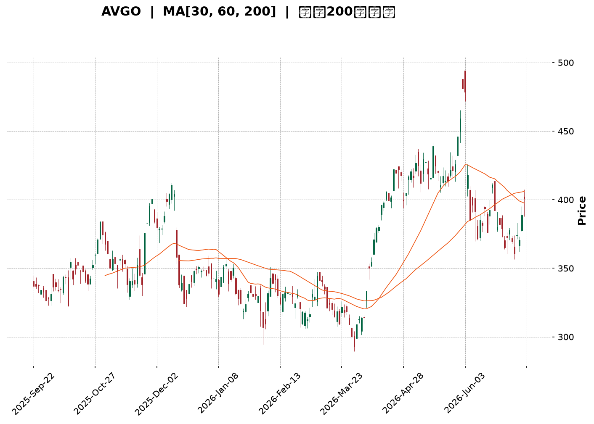
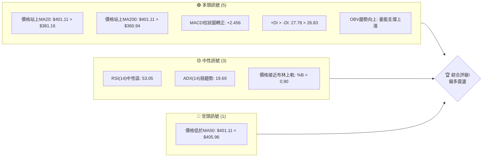
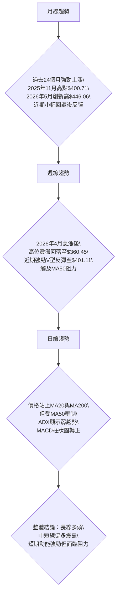
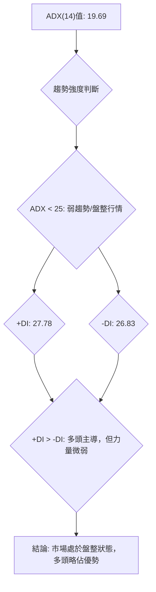
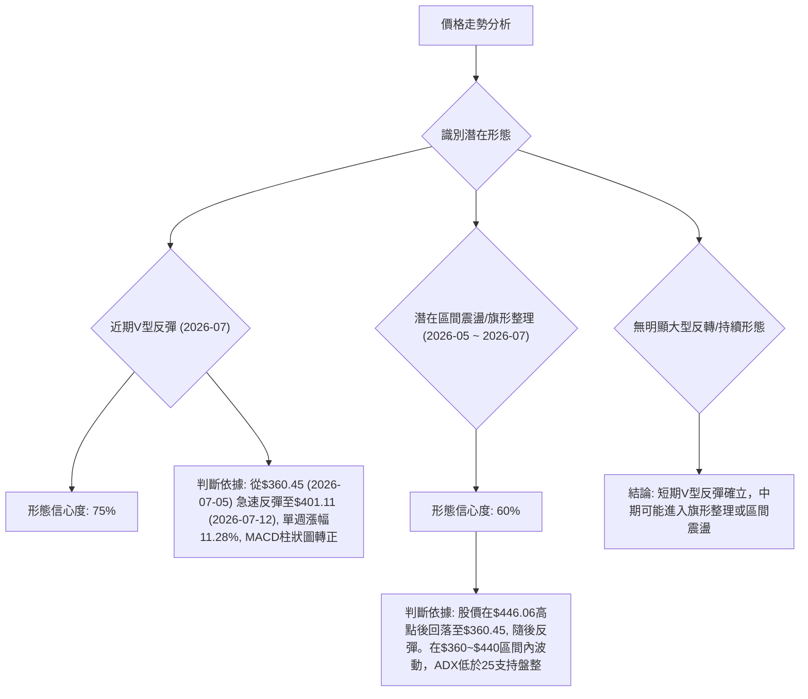
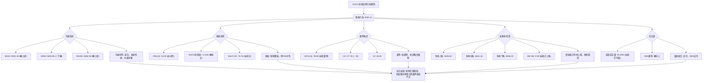
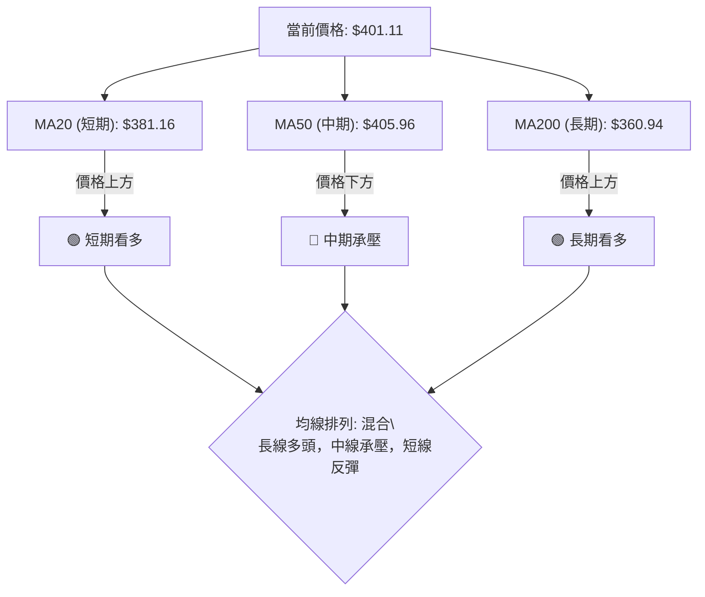
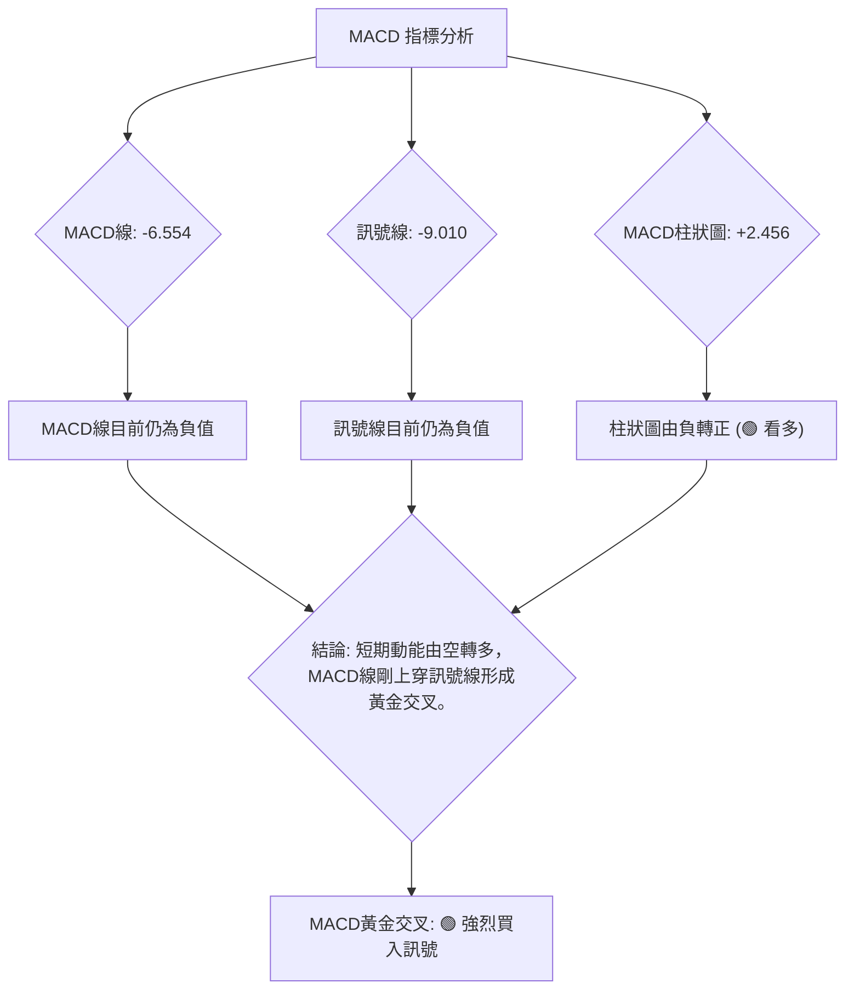
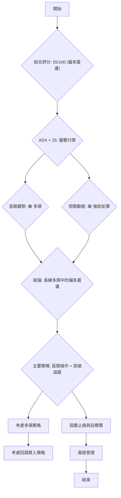
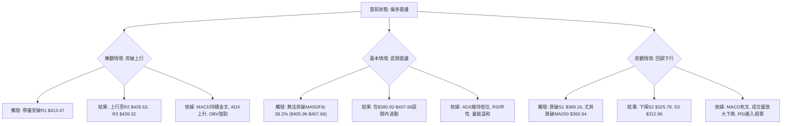

<details>
<summary>📊 靜態圖表 (點擊展開)</summary>

</details>

<html>
<head><meta charset="utf-8" /></head>
<body>
    <div style="height:500px; width:100%;">                        <script>window.PlotlyConfig = {MathJaxConfig: 'local'};</script>
        <script charset="utf-8" src="https://cdn.plot.ly/plotly-3.7.0.min.js" integrity="sha256-jvTGqxNp8AGWEcvNLVuKr+8j5dGe9Yw51LQkmDH+IYA=" crossorigin="anonymous"></script>                <div id="candlestick-chart" class="plotly-graph-div" style="height:100%; width:100%;"></div>            <script>                window.PLOTLYENV=window.PLOTLYENV || {};                                if (document.getElementById("candlestick-chart")) {                    Plotly.newPlot(                        "candlestick-chart",                        [{"close":{"dtype":"f8","bdata":"AAAAYG4OdUAAAABg0RB1QAAAAIC0FnVAAAAAgKHjdEAAAACgpsp0QAAAAKApYXRAAAAAoCSBdEAAAABAg7h0QAAAAMC5BHVAAAAAoL8HdUAAAAAA7dl0QAAAAECQ6HRAAAAAQDF5dUAAAAAgjnF1QAAAAEAiLXRAAAAAAGUrdkAAAAAgZWN1QAAAAODz1XVAAAAAQNICdkAAAACgIbZ1QAAAAACztHVAAAAAoAFMdUAAAADgdCZ1QAAAAODwZXVAAAAA4IACdkAAAABghIB2QAAAAIBDLndAAAAAgEP9d0AAAACg82V3QAAAAAAf+XZAAAAA4HiIdkAAAACgqN91QAAAAOCrT3ZAAAAAwLsZdkAAAADguLd1QAAAAKBIRnZAAAAAIPrfdUAAAACg2BN2QAAAAKBdIXVAAAAA4NJIdUAAAADg2Et1QAAAAICjKXVAAAAAIB4HdkAAAAAAMo51QAAAAKDdJHVAAAAAoKh9d0AAAADgJe53QAAAAICrtXhAAAAAAG4LeUAAAADA2v53QAAAAMAYt3dAAAAAgNKnd0AAAABAga53QAAAACALQXhAAAAA4NXteEAAAACgaUB5QAAAAICyqnlAAAAAgK9BeUAAAABAyV52QAAAAOCoHnVAAAAAAF42dUAAAADgP0N0QAAAAICqgHRAAAAAQGkndUAAAABAJkN1QAAAAGCbwHVAAAAAQPTOdUAAAADgZu11QAAAACC5wXVAAAAAQA7JdUAAAACgRo11QAAAAKCBpXVAAAAAwI1idUAAAAAAImh1QAAAACDUY3VAAAAA4Ce0dEAAAABAQ3t1QAAAAGCt7nVAAAAAoO8UdkAAAAAASCp1QAAAAEAtXHVAAAAA4LTmdUAAAACgEbZ0QAAAAOB9eXRAAAAA4LlEdEAAAABgAe5zQAAAACCGOnRAAAAAABm5dEAAAABgRcB0QAAAAEBCmHRAAAAAYFihdEAAAADgUJ50QAAAACB48nNAAAAAwLUuc0AAAAAg7VVzQAAAAKAru3RAAAAAwNdqdUAAAABgDDN1QAAAAEAIWHVAAAAA4EWfdEAAAAAgoD90QAAAAMActXRAAAAAQJPEdEAAAAAgOsx0QAAAAKDdtnRAAAAAoAqSdEAAAADguUR0QAAAACBysXRAAAAAIE8IdEAAAAAACeZzQAAAAOBl2nNAAAAAwAKLc0AAAACA1cVzQAAAAEDHuHRAAAAAAEaUdEAAAABAsod1QAAAAIApVXVAAAAA4A9FdUAAAACAyut0QAAAAGCkD3RAAAAA4KM7dEAAAACAFwJ0QAAAAMBTrHNAAAAAgKjqc0AAAAAg7VVzQAAAAKABIHRAAAAAwJfcc0AAAABA5uRzQAAAAKDlTnNAAAAAIEfDckAAAABAJE9yQAAAAMBVUHNAAAAAAOqPc0AAAADg2KBzQAAAACDunnNAAAAAgBPXdEAAAAAgN+F1QAAAAECWJXZAAAAA4Gcvd0AAAAAgZrJ3QAAAAEDawndAAAAAYH3BeEAAAAAgct14QAAAAKBcXnlAAAAA4PnveEAAAABgjRh5QAAAAMC2X3pAAAAAQGw0ekAAAADAeGF6QAAAAICgGHpAAAAAwCvzeEAAAAAA80x5QAAAAIBTDHpAAAAAINRJekAAAABAeP15QAAAAID0qnpAAAAAoEiMekAAAACAh755QAAAAOAg1XpAAAAAQAy8ekAAAADgMip6QAAAAEAaAnpAAAAAYIVxe0AAAABASoh6QAAAACC5QHpAAAAAILqmeUAAAAAgmRF6QAAAAICj3nlAAAAAAMXXeUAAAACgfVV6QAAAAAAYU3pAAAAAoH6eekAAAABABuF7QAAAAADks3xAAAAA4PEMfkAAAABgkOd9QAAAAAD4I3pAAAAAgO0ReEAAAACgkr94QAAAACCleHhAAAAAQDE4d0AAAAAgXw94QAAAAOB113dAAAAAgBSVeEAAAADg1YF3QAAAAGB3hHhAAAAAQDOreUAAAACAFIJ4QAAAAGBmwndAAAAAwB7hd0AAAABgj653QAAAAOBR0HZAAAAAQDNHd0AAAAAAAJx3QAAAAKBwFXdAAAAAQDOHdkAAAABgZl53QAAAAOB6LHdAAAAAQApLeEAAAACAwhF5QA=="},"high":{"dtype":"f8","bdata":"URbg\u002f86LdUCzlgLmvHR1QPGXgsz0InVAAUFr4tACdUADm2mDCxN1QJGSg9VjMnVAgMFa+keTdEDGVNfoEAF1QM7VzL7DmnVAX6Hd2rBndUAiVsJHZWN1QNIV75GcA3VAthd5Yr2JdUAkweK5\u002fZV1QMGgaZBWynVAC4sqEwlWdkALQHe2c8t1QLlFjWlaVnZA76INYXOTdkBO6mmwOdB1QHAHOtmkKXZAZ20AOEvSdUBKC70hIaF1QJDjhrQ3inVAOcgf8NlEdkD0S2alp4t2QKz1fj6bP3dASs8wFjgFeECh8jM18gN4QL6jjXhXi3dAYl+z+ixMd0BGgMFXTe52QC\u002fOac1irXZAbb06kZaXdkDcsJLkYwh2QM810V\u002fmX3ZAa40u1fh9dkCgq8Su6012QOPjP39G+XVAR8F8tBltdUD7marBy+N1QIxF\u002fRt+oHVAROgQtPdadkA3lH33vl93QPAfnkGEqnVAPobhR\u002fC9d0CMH5+8eB94QIstp79D2nhAdS819hAMeUDCu6RMdpN4QB\u002f1WK3pdHhA6V5SLLbCd0BESSyXAtx3QEbZbOZjdXhAQzkK1FJQeUBdmCtkmEp5QPJ4pnDKxHlAFLBZ3k1weUCDxCU38L13QHl4epe4f3ZAAthmuQOZdUD\u002fCO9+2op1QGC6BX6E4nRAZZMdd5NYdUDwWRX+gY91QGSCyD8zzXVAgsgf8An5dUBHabaJQf91QA4Ikh610HVAaEnHVCv2dUDrxqasiMl1QHfONXdhdXZA7BWlt6EbdkChYUaATbx1QG2VZCuqxnVAhL\u002fHoLJmdUBqZ88+16F1QOA4JDieCXZAVD95w7pidkDlqVllctZ1QCx8S4FYxnVAx7hJqFcTdkDf0KzzHYJ1QPSauqQU6XRAYWqK\u002fgz8dEArJOd17gx0QAndZyyUd3RAquV8goDYdEC3YtTm3yt1QN6mDed463RAwy3sJVcPdUDYD\u002fO1Oe10QIB3mbZ\u002fGnVASXPlt2Xlc0C5ETIsTlV0QLabVvtT3HRA+H6\u002f2L\u002fwdUDyf\u002f1Suat1QIO+wMDPnnVAM8U8E06QdUApPfLyfNF0QHd+Y55I6HRAB1P8DT0KdUDi+Vh6KhN1QNkWe5rJLXVACVioVB8UdUB\u002f6UU7rnF0QLkOiqHV6nRA\u002fXijIxpWdEAA6ip8Ne1zQLwE1qjY7XNABeNE9Yerc0BqBpdOSxd0QHMgb4Mu7nRAyhiJ\u002fvxjdUBLYhsPYLN1QE9pVZ+A\u002fXVA8gpzIqeIdUDcHBX5Uil1QNX2d9FAEXVAzSy5aN5\u002fdEBhtALZz2N0QAxeQ8jtQ3RATtjuL1YhdEBZdEXDRwV0QBw0Fw5tX3RAP5EItDI+dEDZsUu3mTx0QKPKnhS1xnNAZlCsuzkwc0Cud6w4nQRzQL\u002fWfFIdXXNAgfAU\u002fae0c0DqygF4FaNzQEnp0n9mvnNAKT7ClfPZdEAU3EBoSRl2QNt\u002fMJghYnZAG5Yjg0d\u002fd0DXWtdwIcR3QI6HiIrQ2ndAUfuFiz3HeEDeAytrxvB4QPriLqVlYXlAWS8kzXFceUCsxZleZS95QItPohCAaHpAKielGhvKekC5R4NAQYV6QG2F\u002fcxPYXpAC4R0K7NSeUA9NC0F\u002fE95QDzw55mAG3pA4clNZAVoekABvbZukHJ6QBd6zHhIC3tACC0WZ9BPe0Cl2PGWDp16QGVNWYMAJXtAYy21lm8Pe0Di0WDElcp6QBQZQfd+H3pADFq2XZOae0D6uipuBAJ7QJgk9ZV9VXpAOYY3GKIUekB+dC4D\u002f3d6QKgz0QpTWXpAIbrmojg1ekCu5CJL9Cl7QCtmx3DbAXtA8IJ8LwTQekC5Esj2DAN8QPtNz0UEFX1ApvNf88KAfkCtK1EufON+QHWn5MDlnHpA5Q1TDZ+deUBlTI88QSN5QHvwOpGbc3lAZM99ozQTeEBPVxnwJk54QCUGYmryBXhADxtL3y65eEBCBxIFvHJ4QMnNyTZFAHlAn\u002fEqI8TAeUAAAACAPep5QAAAAOBRcHhAAAAAANdLeEAAAADAzEx4QAAAAEAKW3dAAAAAIFyDd0AAAACA67l3QAAAAAAAXHdAAAAAAABgd0AAAABgj\u002fJ3QAAAACBcT3dAAAAAoHCxeEAAAADgUXh5QA=="},"hovertemplate":"\u003cb\u003e%{x|%Y-%m-%d}\u003c\u002fb\u003e\u003cbr\u003e\u958b: $%{open:.2f}\u003cbr\u003e\u9ad8: $%{high:.2f}\u003cbr\u003e\u4f4e: $%{low:.2f}\u003cbr\u003e\u6536: $%{close:.2f}\u003cextra\u003e\u003c\u002fextra\u003e","low":{"dtype":"f8","bdata":"FBMnJ+gAdUBZJ9nTRPJ0QNACrAsyv3RAl5WSgJ1XdECQi4iKzYt0QG4dRv2XW3RACplYu9AsdEDaxmKuECt0QJUPvGEb1nRAKF\u002fMKOfddEAANnL6IMt0QFGo\u002fuIoTHRAFIk+w0KsdEDGEdkVDCh1QM+oar3nI3RAeJzserBZdUDuEaBDHRx1QD4SLK0DmXVA0hGHP624dUAY+bAKGC51QP+lDpVsnnVAE0vl0IY2dUAjj7N2Ptp0QDQV0CsMKHVAdt3TD8vOdUB\u002fTP1ZnhF2QGtYNo8niHZAR8ruk8Mxd0CQd22R9v92QDCr3ocLsXZADD3CQmd\u002fdkAtWgfVs9B1QKRngE05wnVAg+OM\u002fejrdUAzf\u002f4SP\u002fZ0QLUsJukjCnZA2YanpYq7dUDwe4SOhdt1QHlcd7nDxHRAd4jcYJ5zdEBHN515Ofp0QGgMt2c+2nRAN7p+4a3+dECRxqPvGXR1QE2Hj942n3RARW9yhI+bdUCypcgj2hp3QIEdw2b80XdAJ1uQpCWveEB3fpweQ+93QBy6roHGmndAj4kWulkJd0DcnUL452Z3QPkYB7AO8HdANqNtFfeyeEDpu0\u002fS5JR4QDqxMTpV1XhA9zjGRuR\u002feEDIioV8uxJ2QA+khaAQ+nRAcRc3cBXTdEBD1LhgD\u002fpzQP4IXyo5HXRAorM195+rdECJjeu2t\u002f90QOt+o47CFHVAj0M17dqddUBZH2U4lKd1QCksvIfMdnVA+76\u002fpEnAdUDPu\u002fSYb4J1QDpf89eqhHVACy9FZz30dEBXhGvdJgx1QPcYYS1b6nRAE5YWhJeUdEDoaDONasR0QJwMQsUtO3VA8LE\u002fH\u002fTZdUBerL0aFdN0QPP+UAuoRnVAIDQXp5hsdUCH\u002fdfGUKl0QPkI24YpMHRAG6r9ZCk7dEA0phdsUI9zQN0oax3zxnNAAGPPvR1ddECNPOjwA1h0QJtdahis8XNA6UbD5f9xdEBlhtPz3kh0QGC+pnVGOHNAl5GbbHVjckDnKYKmMBlzQKFP1tg5snNAlZ1mqvuWdEAeTBzFeyl1QI1bVtk9yHRAd7YWdJuFdEAXIkk3+Td0QNe9\u002fZxisnNA7rSzyHZgdEDSHtAqhYd0QJEp0QbthXRAg4IpNwRCdECsjRMXvJRzQFo00MwkgXRAHrVMIcwsc0CwkknQy01zQEwAcw8pIXNAm+SVT1kkc0AaFUyqiGlzQLxmjKyCHXRAvrdUjSxjdEB7ryyWwSZ0QAp3ZGLJOHVAqSJ1nKgPdUDldpJMsa90QPQhZDkBBHRA35RuTyruc0AX3a3IXsFzQMajd\u002fZEpnNAiluYMgs2c0DJPY9ehUxzQMeRW+\u002fqpnNAbziD1Hqlc0AnTwsng8NzQD\u002f5Pj7nSnNA3JcNF12mckDUZ55UBxhyQDMtmp3yfXJAIAxCm9Rfc0AbjYz4XtRyQNC1S5yiXHNArapD5akUdEAoM+3s0V91QC93KvIc73VAv4FHU\u002f+DdkBFNpG4Vg53QJZVG\u002f6ae3dATtDyKl8PeEDKlDQ8rnt4QMXjBA\u002fa8nhAgbuG5GO0eEBQua\u002fwJJ94QFFYlAWGQ3lA25XWmTwSekAWkD43bIN5QLdAQNuY33lAkYj1BmygeEDtO7q9csJ4QKp1T891OXlApAHB5wfKeUBWqdA8II55QPKby3f\u002fKnpAowso1OoRekDyn2kEh1p5QIk74m6I1XlA86GBoA2GekC5c\u002fn7O3x5QMn8oLqQQnlAE4fgwe7ueUD9w+aiLzJ6QK\u002fy8Yhx23lA6QG3mH9TeUCQjtKIUax5QBnjsxefnXlAUPHWD\u002f2YeUDWyiANdQV6QFpc50FP\u002fXlATKSnW7HVeUDPVaWGnOx6QHxDvOJWmHtALL1WKHdbfUBFiyBnSn59QCamdYn4JXlA3Fz\u002f57APeEA+2A+btGt4QNKNYqvqG3dA0gDvBFYpd0BAXc1Xbh93QPgJjfB3hndAJ1sRcMY\u002feEBMND1+1313QEi+ibe54HdAngG6w9RLeUAAAABgj354QAAAAGCPindAAAAAIFyPd0AAAABAM0t3QAAAAKBHvXZAAAAAIFyHdkAAAACAPSp3QAAAAOB6AHdAAAAAQOFGdkAAAABA4TJ3QAAAAAApoHZAAAAAgD2Od0AAAABA4T54QA=="},"name":"\u50f9\u683c","open":{"dtype":"f8","bdata":"IBAlqVhIdUAXKlpzgCV1QJqzUXrdHXVADGT33SWydECV\u002f2rNyvh0QKvxTlsK4nRAuDvj9HuEdEAl4\u002f68I2V0QM7VzL7DmnVAxd9hrYw5dUCjziSPxOB0QEgo+pht8nRAtQ2znlq\u002fdEA5ngmWK311QGTxxl1xd3VA4IaGVd3sdUA4fRYq3MJ1QCGLy7LpB3ZAdNFOIvwsdkBFucwblrp1QFKoBqlA\u002fXVA81H\u002fs8rAdUCRHNIW1ZV1QDQV0CsMKHVADsWqWrrodUBGEB8kZ3h2QLI\u002fTyGWiXZAR8ruk8Mxd0Ch8jM18gN4QAFhryaXgndABi41adQed0AOMPoMWkh2QIEQiOrzznVAUI8Qc6ZhdkCTVRg4dQN2QP7dga98PnZAzIh+HINPdkDxIOgAt0B2QFSZCVfu2XVA7lelvfaZdEBFmkPZ0R51QN+XGB6ZVHVAHAZ51PosdUCRUzVvXb92QGJXsIfIc3VAhH9aq6ycdUDJzGaIjux3QBes6OBr9ndA4HUo5\u002f3ReECua4mPZIp4QHtE4uVVInhA3s+A7B2ed0DF40yd76h3QOKgamdJAHhAGynK38oDeUB33ALdcch4QBKFGndW\u002f3hAXiwqxy4peUAgaTHoep13QFgrNJr4fXZANIlgplvidED\u002fCO9+2op1QHiXUk0K4nRA0g0Enre3dEA+xTgGKYx1QK4PoE7yOHVAsvk3T3LWdUDz+Og1WNx1QOpjgtIKt3VAZLEy8vfKdUBRZueNJMd1QPy5mW3D93VAZNa5MwIXdkAR\u002fypObGV1QINgNm8iR3VAi\u002f1pyFlYdUCd3TN74Ap1QJwMQsUtO3VAWMrEoVv5dUDPZ5kgB7t1QI8sayxrvXVA7qOKZ\u002fyPdUCSdaK+ZG11QHMrs0B15HRAqGj6RejhdEDyxV+mDOJzQJ0I2ioF6nNAQHvkrMuIdEDTJAaqsxl1QOdpYF1utXRADoXDvISzdEDghm0KnE50QAq9Oc8Q+HRASXPlt2Xlc0D0spAs+5JzQCZoxZjN7nNALfaZXOWYdEDzkjORHaN1QHjWPERvmHVAWViLzhZpdUDPsmcFO4p0QHaWm3Mb6HNAqeOsG\u002fiEdECBD2jbmrx0QNx9Fhw+snRADrNzSX2wdEAxEu4YsxV0QK0pGvpqmHRAxJl2t9NUdEDeHlqK9FhzQLHAz9aXQ3NASVOgwJ59c0CqkZKvV6hzQB8tp499j3RAGjqq0jNxdEB2M4ZdyGB0QIwpZoszt3VAs7GValJVdUANOE7EAQh1QFcJhPAMB3VABxrS1ixNdEAP6V7aB0l0QODChxkQ9HNAuzPeyit1c0DPLKUoH+9zQLbGptD113NA0k6fzuj3c0Bar6+oSCF0QKgK6llhmHNAbs66VDIpc0CuyecWUMZyQAee+r+rrnJAsCLSRv+Nc0AuGZs8JABzQPd0Hoz+qHNAZrhlXGtjdEBUxEZgG\u002fN1QMKqooTk+3VAYmRzDOqFdkBhXlXONhF3QJOnGmTYlHdA+tmCBTlUeECr0W91A6Z4QPNq\u002fqBDBHlANOgpVvFQeUAjYCU9dux4QHebwOxjZXlAgRaFpI9bekBsDqKB74R6QMrRM54MPXpAkQemxNb6eEBzqg9fzC15QA4JuXzQ7XlAOcak8PHmeUBFXxM+8hh6QOnGV0TmT3pAw97Jn\u002fIte0CTV8qQdFJ6QLJmtaQvMnpAPpAgvhuvekDjxdukLGx6QGRWz3dy8nlAPwvy4CQBekD6uipuBAJ7QPKKINjnS3pABhguN8KSeUDLW73phcJ5QKLpGBpYznlA6bhE0UgNekAx58NXax16QFqfGXlfhnpAN02wtZdHekAyBmgSQQR7QPB0mnIPFnxAOIgURUiAfkC7rtd6+N9+QO238dR\u002fhXlAIWvwQXRveUDNCRiJvR95QCMEyxWbD3lA7A7cyFrOd0CMj2+msUN3QFZhG5LR8XdAqX6WFimueED39xZ\u002ffll4QDkDiz6IQXhAUTXBtOyOeUAAAABgj9p5QAAAAIDrnXdAAAAAgOspeEAAAACgRyl4QAAAAEAzJ3dAAAAAgOtZd0AAAADgo2x3QAAAAIDrPXdAAAAAIK7bdkAAAACAwll3QAAAAMD16HZAAAAA4FGYd0AAAABACiN5QA=="},"x":["2025-09-22T00:00:00-04:00","2025-09-23T00:00:00-04:00","2025-09-24T00:00:00-04:00","2025-09-25T00:00:00-04:00","2025-09-26T00:00:00-04:00","2025-09-29T00:00:00-04:00","2025-09-30T00:00:00-04:00","2025-10-01T00:00:00-04:00","2025-10-02T00:00:00-04:00","2025-10-03T00:00:00-04:00","2025-10-06T00:00:00-04:00","2025-10-07T00:00:00-04:00","2025-10-08T00:00:00-04:00","2025-10-09T00:00:00-04:00","2025-10-10T00:00:00-04:00","2025-10-13T00:00:00-04:00","2025-10-14T00:00:00-04:00","2025-10-15T00:00:00-04:00","2025-10-16T00:00:00-04:00","2025-10-17T00:00:00-04:00","2025-10-20T00:00:00-04:00","2025-10-21T00:00:00-04:00","2025-10-22T00:00:00-04:00","2025-10-23T00:00:00-04:00","2025-10-24T00:00:00-04:00","2025-10-27T00:00:00-04:00","2025-10-28T00:00:00-04:00","2025-10-29T00:00:00-04:00","2025-10-30T00:00:00-04:00","2025-10-31T00:00:00-04:00","2025-11-03T00:00:00-05:00","2025-11-04T00:00:00-05:00","2025-11-05T00:00:00-05:00","2025-11-06T00:00:00-05:00","2025-11-07T00:00:00-05:00","2025-11-10T00:00:00-05:00","2025-11-11T00:00:00-05:00","2025-11-12T00:00:00-05:00","2025-11-13T00:00:00-05:00","2025-11-14T00:00:00-05:00","2025-11-17T00:00:00-05:00","2025-11-18T00:00:00-05:00","2025-11-19T00:00:00-05:00","2025-11-20T00:00:00-05:00","2025-11-21T00:00:00-05:00","2025-11-24T00:00:00-05:00","2025-11-25T00:00:00-05:00","2025-11-26T00:00:00-05:00","2025-11-28T00:00:00-05:00","2025-12-01T00:00:00-05:00","2025-12-02T00:00:00-05:00","2025-12-03T00:00:00-05:00","2025-12-04T00:00:00-05:00","2025-12-05T00:00:00-05:00","2025-12-08T00:00:00-05:00","2025-12-09T00:00:00-05:00","2025-12-10T00:00:00-05:00","2025-12-11T00:00:00-05:00","2025-12-12T00:00:00-05:00","2025-12-15T00:00:00-05:00","2025-12-16T00:00:00-05:00","2025-12-17T00:00:00-05:00","2025-12-18T00:00:00-05:00","2025-12-19T00:00:00-05:00","2025-12-22T00:00:00-05:00","2025-12-23T00:00:00-05:00","2025-12-24T00:00:00-05:00","2025-12-26T00:00:00-05:00","2025-12-29T00:00:00-05:00","2025-12-30T00:00:00-05:00","2025-12-31T00:00:00-05:00","2026-01-02T00:00:00-05:00","2026-01-05T00:00:00-05:00","2026-01-06T00:00:00-05:00","2026-01-07T00:00:00-05:00","2026-01-08T00:00:00-05:00","2026-01-09T00:00:00-05:00","2026-01-12T00:00:00-05:00","2026-01-13T00:00:00-05:00","2026-01-14T00:00:00-05:00","2026-01-15T00:00:00-05:00","2026-01-16T00:00:00-05:00","2026-01-20T00:00:00-05:00","2026-01-21T00:00:00-05:00","2026-01-22T00:00:00-05:00","2026-01-23T00:00:00-05:00","2026-01-26T00:00:00-05:00","2026-01-27T00:00:00-05:00","2026-01-28T00:00:00-05:00","2026-01-29T00:00:00-05:00","2026-01-30T00:00:00-05:00","2026-02-02T00:00:00-05:00","2026-02-03T00:00:00-05:00","2026-02-04T00:00:00-05:00","2026-02-05T00:00:00-05:00","2026-02-06T00:00:00-05:00","2026-02-09T00:00:00-05:00","2026-02-10T00:00:00-05:00","2026-02-11T00:00:00-05:00","2026-02-12T00:00:00-05:00","2026-02-13T00:00:00-05:00","2026-02-17T00:00:00-05:00","2026-02-18T00:00:00-05:00","2026-02-19T00:00:00-05:00","2026-02-20T00:00:00-05:00","2026-02-23T00:00:00-05:00","2026-02-24T00:00:00-05:00","2026-02-25T00:00:00-05:00","2026-02-26T00:00:00-05:00","2026-02-27T00:00:00-05:00","2026-03-02T00:00:00-05:00","2026-03-03T00:00:00-05:00","2026-03-04T00:00:00-05:00","2026-03-05T00:00:00-05:00","2026-03-06T00:00:00-05:00","2026-03-09T00:00:00-04:00","2026-03-10T00:00:00-04:00","2026-03-11T00:00:00-04:00","2026-03-12T00:00:00-04:00","2026-03-13T00:00:00-04:00","2026-03-16T00:00:00-04:00","2026-03-17T00:00:00-04:00","2026-03-18T00:00:00-04:00","2026-03-19T00:00:00-04:00","2026-03-20T00:00:00-04:00","2026-03-23T00:00:00-04:00","2026-03-24T00:00:00-04:00","2026-03-25T00:00:00-04:00","2026-03-26T00:00:00-04:00","2026-03-27T00:00:00-04:00","2026-03-30T00:00:00-04:00","2026-03-31T00:00:00-04:00","2026-04-01T00:00:00-04:00","2026-04-02T00:00:00-04:00","2026-04-06T00:00:00-04:00","2026-04-07T00:00:00-04:00","2026-04-08T00:00:00-04:00","2026-04-09T00:00:00-04:00","2026-04-10T00:00:00-04:00","2026-04-13T00:00:00-04:00","2026-04-14T00:00:00-04:00","2026-04-15T00:00:00-04:00","2026-04-16T00:00:00-04:00","2026-04-17T00:00:00-04:00","2026-04-20T00:00:00-04:00","2026-04-21T00:00:00-04:00","2026-04-22T00:00:00-04:00","2026-04-23T00:00:00-04:00","2026-04-24T00:00:00-04:00","2026-04-27T00:00:00-04:00","2026-04-28T00:00:00-04:00","2026-04-29T00:00:00-04:00","2026-04-30T00:00:00-04:00","2026-05-01T00:00:00-04:00","2026-05-04T00:00:00-04:00","2026-05-05T00:00:00-04:00","2026-05-06T00:00:00-04:00","2026-05-07T00:00:00-04:00","2026-05-08T00:00:00-04:00","2026-05-11T00:00:00-04:00","2026-05-12T00:00:00-04:00","2026-05-13T00:00:00-04:00","2026-05-14T00:00:00-04:00","2026-05-15T00:00:00-04:00","2026-05-18T00:00:00-04:00","2026-05-19T00:00:00-04:00","2026-05-20T00:00:00-04:00","2026-05-21T00:00:00-04:00","2026-05-22T00:00:00-04:00","2026-05-26T00:00:00-04:00","2026-05-27T00:00:00-04:00","2026-05-28T00:00:00-04:00","2026-05-29T00:00:00-04:00","2026-06-01T00:00:00-04:00","2026-06-02T00:00:00-04:00","2026-06-03T00:00:00-04:00","2026-06-04T00:00:00-04:00","2026-06-05T00:00:00-04:00","2026-06-08T00:00:00-04:00","2026-06-09T00:00:00-04:00","2026-06-10T00:00:00-04:00","2026-06-11T00:00:00-04:00","2026-06-12T00:00:00-04:00","2026-06-15T00:00:00-04:00","2026-06-16T00:00:00-04:00","2026-06-17T00:00:00-04:00","2026-06-18T00:00:00-04:00","2026-06-22T00:00:00-04:00","2026-06-23T00:00:00-04:00","2026-06-24T00:00:00-04:00","2026-06-25T00:00:00-04:00","2026-06-26T00:00:00-04:00","2026-06-29T00:00:00-04:00","2026-06-30T00:00:00-04:00","2026-07-01T00:00:00-04:00","2026-07-02T00:00:00-04:00","2026-07-06T00:00:00-04:00","2026-07-07T00:00:00-04:00","2026-07-08T00:00:00-04:00","2026-07-09T00:00:00-04:00"],"type":"candlestick"},{"hovertemplate":"MA30: $%{y:.2f}\u003cextra\u003e\u003c\u002fextra\u003e","line":{"color":"#2196F3","dash":"dash","width":2},"mode":"lines","name":"MA30","x":["2025-09-22T00:00:00-04:00","2025-09-23T00:00:00-04:00","2025-09-24T00:00:00-04:00","2025-09-25T00:00:00-04:00","2025-09-26T00:00:00-04:00","2025-09-29T00:00:00-04:00","2025-09-30T00:00:00-04:00","2025-10-01T00:00:00-04:00","2025-10-02T00:00:00-04:00","2025-10-03T00:00:00-04:00","2025-10-06T00:00:00-04:00","2025-10-07T00:00:00-04:00","2025-10-08T00:00:00-04:00","2025-10-09T00:00:00-04:00","2025-10-10T00:00:00-04:00","2025-10-13T00:00:00-04:00","2025-10-14T00:00:00-04:00","2025-10-15T00:00:00-04:00","2025-10-16T00:00:00-04:00","2025-10-17T00:00:00-04:00","2025-10-20T00:00:00-04:00","2025-10-21T00:00:00-04:00","2025-10-22T00:00:00-04:00","2025-10-23T00:00:00-04:00","2025-10-24T00:00:00-04:00","2025-10-27T00:00:00-04:00","2025-10-28T00:00:00-04:00","2025-10-29T00:00:00-04:00","2025-10-30T00:00:00-04:00","2025-10-31T00:00:00-04:00","2025-11-03T00:00:00-05:00","2025-11-04T00:00:00-05:00","2025-11-05T00:00:00-05:00","2025-11-06T00:00:00-05:00","2025-11-07T00:00:00-05:00","2025-11-10T00:00:00-05:00","2025-11-11T00:00:00-05:00","2025-11-12T00:00:00-05:00","2025-11-13T00:00:00-05:00","2025-11-14T00:00:00-05:00","2025-11-17T00:00:00-05:00","2025-11-18T00:00:00-05:00","2025-11-19T00:00:00-05:00","2025-11-20T00:00:00-05:00","2025-11-21T00:00:00-05:00","2025-11-24T00:00:00-05:00","2025-11-25T00:00:00-05:00","2025-11-26T00:00:00-05:00","2025-11-28T00:00:00-05:00","2025-12-01T00:00:00-05:00","2025-12-02T00:00:00-05:00","2025-12-03T00:00:00-05:00","2025-12-04T00:00:00-05:00","2025-12-05T00:00:00-05:00","2025-12-08T00:00:00-05:00","2025-12-09T00:00:00-05:00","2025-12-10T00:00:00-05:00","2025-12-11T00:00:00-05:00","2025-12-12T00:00:00-05:00","2025-12-15T00:00:00-05:00","2025-12-16T00:00:00-05:00","2025-12-17T00:00:00-05:00","2025-12-18T00:00:00-05:00","2025-12-19T00:00:00-05:00","2025-12-22T00:00:00-05:00","2025-12-23T00:00:00-05:00","2025-12-24T00:00:00-05:00","2025-12-26T00:00:00-05:00","2025-12-29T00:00:00-05:00","2025-12-30T00:00:00-05:00","2025-12-31T00:00:00-05:00","2026-01-02T00:00:00-05:00","2026-01-05T00:00:00-05:00","2026-01-06T00:00:00-05:00","2026-01-07T00:00:00-05:00","2026-01-08T00:00:00-05:00","2026-01-09T00:00:00-05:00","2026-01-12T00:00:00-05:00","2026-01-13T00:00:00-05:00","2026-01-14T00:00:00-05:00","2026-01-15T00:00:00-05:00","2026-01-16T00:00:00-05:00","2026-01-20T00:00:00-05:00","2026-01-21T00:00:00-05:00","2026-01-22T00:00:00-05:00","2026-01-23T00:00:00-05:00","2026-01-26T00:00:00-05:00","2026-01-27T00:00:00-05:00","2026-01-28T00:00:00-05:00","2026-01-29T00:00:00-05:00","2026-01-30T00:00:00-05:00","2026-02-02T00:00:00-05:00","2026-02-03T00:00:00-05:00","2026-02-04T00:00:00-05:00","2026-02-05T00:00:00-05:00","2026-02-06T00:00:00-05:00","2026-02-09T00:00:00-05:00","2026-02-10T00:00:00-05:00","2026-02-11T00:00:00-05:00","2026-02-12T00:00:00-05:00","2026-02-13T00:00:00-05:00","2026-02-17T00:00:00-05:00","2026-02-18T00:00:00-05:00","2026-02-19T00:00:00-05:00","2026-02-20T00:00:00-05:00","2026-02-23T00:00:00-05:00","2026-02-24T00:00:00-05:00","2026-02-25T00:00:00-05:00","2026-02-26T00:00:00-05:00","2026-02-27T00:00:00-05:00","2026-03-02T00:00:00-05:00","2026-03-03T00:00:00-05:00","2026-03-04T00:00:00-05:00","2026-03-05T00:00:00-05:00","2026-03-06T00:00:00-05:00","2026-03-09T00:00:00-04:00","2026-03-10T00:00:00-04:00","2026-03-11T00:00:00-04:00","2026-03-12T00:00:00-04:00","2026-03-13T00:00:00-04:00","2026-03-16T00:00:00-04:00","2026-03-17T00:00:00-04:00","2026-03-18T00:00:00-04:00","2026-03-19T00:00:00-04:00","2026-03-20T00:00:00-04:00","2026-03-23T00:00:00-04:00","2026-03-24T00:00:00-04:00","2026-03-25T00:00:00-04:00","2026-03-26T00:00:00-04:00","2026-03-27T00:00:00-04:00","2026-03-30T00:00:00-04:00","2026-03-31T00:00:00-04:00","2026-04-01T00:00:00-04:00","2026-04-02T00:00:00-04:00","2026-04-06T00:00:00-04:00","2026-04-07T00:00:00-04:00","2026-04-08T00:00:00-04:00","2026-04-09T00:00:00-04:00","2026-04-10T00:00:00-04:00","2026-04-13T00:00:00-04:00","2026-04-14T00:00:00-04:00","2026-04-15T00:00:00-04:00","2026-04-16T00:00:00-04:00","2026-04-17T00:00:00-04:00","2026-04-20T00:00:00-04:00","2026-04-21T00:00:00-04:00","2026-04-22T00:00:00-04:00","2026-04-23T00:00:00-04:00","2026-04-24T00:00:00-04:00","2026-04-27T00:00:00-04:00","2026-04-28T00:00:00-04:00","2026-04-29T00:00:00-04:00","2026-04-30T00:00:00-04:00","2026-05-01T00:00:00-04:00","2026-05-04T00:00:00-04:00","2026-05-05T00:00:00-04:00","2026-05-06T00:00:00-04:00","2026-05-07T00:00:00-04:00","2026-05-08T00:00:00-04:00","2026-05-11T00:00:00-04:00","2026-05-12T00:00:00-04:00","2026-05-13T00:00:00-04:00","2026-05-14T00:00:00-04:00","2026-05-15T00:00:00-04:00","2026-05-18T00:00:00-04:00","2026-05-19T00:00:00-04:00","2026-05-20T00:00:00-04:00","2026-05-21T00:00:00-04:00","2026-05-22T00:00:00-04:00","2026-05-26T00:00:00-04:00","2026-05-27T00:00:00-04:00","2026-05-28T00:00:00-04:00","2026-05-29T00:00:00-04:00","2026-06-01T00:00:00-04:00","2026-06-02T00:00:00-04:00","2026-06-03T00:00:00-04:00","2026-06-04T00:00:00-04:00","2026-06-05T00:00:00-04:00","2026-06-08T00:00:00-04:00","2026-06-09T00:00:00-04:00","2026-06-10T00:00:00-04:00","2026-06-11T00:00:00-04:00","2026-06-12T00:00:00-04:00","2026-06-15T00:00:00-04:00","2026-06-16T00:00:00-04:00","2026-06-17T00:00:00-04:00","2026-06-18T00:00:00-04:00","2026-06-22T00:00:00-04:00","2026-06-23T00:00:00-04:00","2026-06-24T00:00:00-04:00","2026-06-25T00:00:00-04:00","2026-06-26T00:00:00-04:00","2026-06-29T00:00:00-04:00","2026-06-30T00:00:00-04:00","2026-07-01T00:00:00-04:00","2026-07-02T00:00:00-04:00","2026-07-06T00:00:00-04:00","2026-07-07T00:00:00-04:00","2026-07-08T00:00:00-04:00","2026-07-09T00:00:00-04:00"],"y":{"dtype":"f8","bdata":"AAAAAAAA+H8AAAAAAAD4fwAAAAAAAPh\u002fAAAAAAAA+H8AAAAAAAD4fwAAAAAAAPh\u002fAAAAAAAA+H8AAAAAAAD4fwAAAAAAAPh\u002fAAAAAAAA+H8AAAAAAAD4fwAAAAAAAPh\u002fAAAAAAAA+H8AAAAAAAD4fwAAAAAAAPh\u002fAAAAAAAA+H8AAAAAAAD4fwAAAAAAAPh\u002fAAAAAAAA+H8AAAAAAAD4fwAAAAAAAPh\u002fAAAAAAAA+H8AAAAAAAD4fwAAAAAAAPh\u002fAAAAAAAA+H8AAAAAAAD4fwAAAAAAAPh\u002fAAAAAAAA+H8AAAAAAAD4f97d3T2LiXVAERERMSWWdUC8u7s7Cp11QBEREeF4p3VAZmZmFs+xdUCJiIgYtrl1QLy7u8vhyXVARERElJPVdUDe3d19J+F1QDMzM+Mb4nVAIiIiMkfkdUAzMzNTE+h1QCIiIqI+6nVAq6qquvnudUAAAAAg7u91QKuqqhow+HVAAAAAoHYDdkB3d3e3Jxl2QGZmZtatMXZAVVVV5ZBLdkCJiIiIDl92QO\u002fu7g40cHZA7+7unlSEdkAiIiKi7pl2QAAAAGBNsnZAvLu7mzbLdkDv7u4ureJ2QFVVVRXk93ZAvLu7e7QCd0De3d3N7vl2QBEREREe6nZAd3d359jedkDe3d2tGdF2QDMzM7OqwXZAIiIi4pa5dkAREREhtLV2QLy7u2s\u002fsXZAiYiIKK6wdkCamZkZZq92QLy7u3u+tHZAq6qqugS5dkDe3d0NM7t2QO\u002fu7g5Uv3ZAd3d3x9e5dkCrqqr6krh2QDMzM0OsunZAREREtOOidkCJiIhI\u002fo12QFVVVSVLdnZAq6qqqgJddkBERESk20R2QJqZmbnCMHZAVVVVRcohdkB3d3c3cQh2QGZmZsYw6HVAMzMzk2vAdUAzMzOzAZN1QCIiItKZZHVAMzMzI+o9dUARERHxGDB1QN7d3Q2eK3VAZmZmZqYmdUAAAACAryl1QGZmZhbyJHVA3t3dTR8UdUB3d3d3rgN1QKuqqor3+nRAIiIiQqH3dECrqqoKa\u002fF0QFVVVSXl7XRAEREREfjjdECrqqrq2Nh0QN7d3Y3V0HRAiYiIeJHLdEAzMzMTX8Z0QAAAACCbwHRAREREBHi\u002fdECrqqoaHrV0QAAAABCLqnRA7+7uPg6ZdECJiIhYP450QN7d3V1jgXRARERE1ENtdEAzMzPTQWV0QO\u002fu7t5dZ3RAzczMrARqdEBERES0rHd0QM3MzIwYgXRAmpmZ6cKFdECJiIhINod0QM3MzHyognRAq6qqmkR\u002fdEDe3d19D3p0QCIiIvK4d3RAVVVVxfx9dEBVVVXF\u002fH10QERERLTQeHRA3t3dTYprdEBmZmbmZmB0QBEREeEHT3RA3t3dDSo\u002fdEBERERknS50QEREROS4InRAvLu7+24YdEBmZmZGdA50QN7d3X0fBXRAZmZmlmwHdEDv7u5+LBV0QJqZmRmUIXRAMzMzU3s8dEBERETU5Fx0QKuqqgo+fnRAiYiImLmqdEAAAADALdZ0QM3MzNzU\u002fXRAZmZmhgUjdUCrqqo6c0F1QAAAAPB3bHVA3t3dnZSWdUDe3d19K8V1QM3MzFyr+HVAAAAAoOsgdkAzMzMTFU52QHd3d3d7hHZAmpmZydq6dkARERGxo\u002fN2QGZmZpZ4K3dAREREBIdkd0CrqqrKcpZ3QHd3d\u002fen1ndAmpmZia4aeEDv7u6Ot114QFVVVbXXlnhA7+7unhjaeEDNzMzMAhV5QCIiIqKaTXlAiYiIuKh2eUCJiIi4Z5p5QN7d3W0sunlAMzMzM9rQeUC8u7v7Wud5QImIiOg6\u002fXlAmpmZWSENekDNzMx82SZ6QO\u002fu7u5MQ3pAzczMzO5uekDv7u5u95d6QLy7u5v5lXpA7+7uLsKDekDNzMwc1HV6QGZmZmb2Z3pAERERUTJZekAiIiJSnE56QCIiIiLIO3pAZmZmNjktekAiIiIiCRh6QBEREaGvBXpAq6qq6i7+eUDNzMyMovN5QCIiIiJp2XlAIiIi4gvBeUBERETE26t5QKuqqlqZkHlAVVVVFQ5teUDNzMysHFR5QJqZmbkROXlAiYiIGGseeUDv7u7eYAd5QERERIRf8HhAd3d3FybjeEBmZmaWW9h4QA=="},"type":"scatter"},{"hovertemplate":"MA60: $%{y:.2f}\u003cextra\u003e\u003c\u002fextra\u003e","line":{"color":"#9C27B0","dash":"dash","width":2},"mode":"lines","name":"MA60","x":["2025-09-22T00:00:00-04:00","2025-09-23T00:00:00-04:00","2025-09-24T00:00:00-04:00","2025-09-25T00:00:00-04:00","2025-09-26T00:00:00-04:00","2025-09-29T00:00:00-04:00","2025-09-30T00:00:00-04:00","2025-10-01T00:00:00-04:00","2025-10-02T00:00:00-04:00","2025-10-03T00:00:00-04:00","2025-10-06T00:00:00-04:00","2025-10-07T00:00:00-04:00","2025-10-08T00:00:00-04:00","2025-10-09T00:00:00-04:00","2025-10-10T00:00:00-04:00","2025-10-13T00:00:00-04:00","2025-10-14T00:00:00-04:00","2025-10-15T00:00:00-04:00","2025-10-16T00:00:00-04:00","2025-10-17T00:00:00-04:00","2025-10-20T00:00:00-04:00","2025-10-21T00:00:00-04:00","2025-10-22T00:00:00-04:00","2025-10-23T00:00:00-04:00","2025-10-24T00:00:00-04:00","2025-10-27T00:00:00-04:00","2025-10-28T00:00:00-04:00","2025-10-29T00:00:00-04:00","2025-10-30T00:00:00-04:00","2025-10-31T00:00:00-04:00","2025-11-03T00:00:00-05:00","2025-11-04T00:00:00-05:00","2025-11-05T00:00:00-05:00","2025-11-06T00:00:00-05:00","2025-11-07T00:00:00-05:00","2025-11-10T00:00:00-05:00","2025-11-11T00:00:00-05:00","2025-11-12T00:00:00-05:00","2025-11-13T00:00:00-05:00","2025-11-14T00:00:00-05:00","2025-11-17T00:00:00-05:00","2025-11-18T00:00:00-05:00","2025-11-19T00:00:00-05:00","2025-11-20T00:00:00-05:00","2025-11-21T00:00:00-05:00","2025-11-24T00:00:00-05:00","2025-11-25T00:00:00-05:00","2025-11-26T00:00:00-05:00","2025-11-28T00:00:00-05:00","2025-12-01T00:00:00-05:00","2025-12-02T00:00:00-05:00","2025-12-03T00:00:00-05:00","2025-12-04T00:00:00-05:00","2025-12-05T00:00:00-05:00","2025-12-08T00:00:00-05:00","2025-12-09T00:00:00-05:00","2025-12-10T00:00:00-05:00","2025-12-11T00:00:00-05:00","2025-12-12T00:00:00-05:00","2025-12-15T00:00:00-05:00","2025-12-16T00:00:00-05:00","2025-12-17T00:00:00-05:00","2025-12-18T00:00:00-05:00","2025-12-19T00:00:00-05:00","2025-12-22T00:00:00-05:00","2025-12-23T00:00:00-05:00","2025-12-24T00:00:00-05:00","2025-12-26T00:00:00-05:00","2025-12-29T00:00:00-05:00","2025-12-30T00:00:00-05:00","2025-12-31T00:00:00-05:00","2026-01-02T00:00:00-05:00","2026-01-05T00:00:00-05:00","2026-01-06T00:00:00-05:00","2026-01-07T00:00:00-05:00","2026-01-08T00:00:00-05:00","2026-01-09T00:00:00-05:00","2026-01-12T00:00:00-05:00","2026-01-13T00:00:00-05:00","2026-01-14T00:00:00-05:00","2026-01-15T00:00:00-05:00","2026-01-16T00:00:00-05:00","2026-01-20T00:00:00-05:00","2026-01-21T00:00:00-05:00","2026-01-22T00:00:00-05:00","2026-01-23T00:00:00-05:00","2026-01-26T00:00:00-05:00","2026-01-27T00:00:00-05:00","2026-01-28T00:00:00-05:00","2026-01-29T00:00:00-05:00","2026-01-30T00:00:00-05:00","2026-02-02T00:00:00-05:00","2026-02-03T00:00:00-05:00","2026-02-04T00:00:00-05:00","2026-02-05T00:00:00-05:00","2026-02-06T00:00:00-05:00","2026-02-09T00:00:00-05:00","2026-02-10T00:00:00-05:00","2026-02-11T00:00:00-05:00","2026-02-12T00:00:00-05:00","2026-02-13T00:00:00-05:00","2026-02-17T00:00:00-05:00","2026-02-18T00:00:00-05:00","2026-02-19T00:00:00-05:00","2026-02-20T00:00:00-05:00","2026-02-23T00:00:00-05:00","2026-02-24T00:00:00-05:00","2026-02-25T00:00:00-05:00","2026-02-26T00:00:00-05:00","2026-02-27T00:00:00-05:00","2026-03-02T00:00:00-05:00","2026-03-03T00:00:00-05:00","2026-03-04T00:00:00-05:00","2026-03-05T00:00:00-05:00","2026-03-06T00:00:00-05:00","2026-03-09T00:00:00-04:00","2026-03-10T00:00:00-04:00","2026-03-11T00:00:00-04:00","2026-03-12T00:00:00-04:00","2026-03-13T00:00:00-04:00","2026-03-16T00:00:00-04:00","2026-03-17T00:00:00-04:00","2026-03-18T00:00:00-04:00","2026-03-19T00:00:00-04:00","2026-03-20T00:00:00-04:00","2026-03-23T00:00:00-04:00","2026-03-24T00:00:00-04:00","2026-03-25T00:00:00-04:00","2026-03-26T00:00:00-04:00","2026-03-27T00:00:00-04:00","2026-03-30T00:00:00-04:00","2026-03-31T00:00:00-04:00","2026-04-01T00:00:00-04:00","2026-04-02T00:00:00-04:00","2026-04-06T00:00:00-04:00","2026-04-07T00:00:00-04:00","2026-04-08T00:00:00-04:00","2026-04-09T00:00:00-04:00","2026-04-10T00:00:00-04:00","2026-04-13T00:00:00-04:00","2026-04-14T00:00:00-04:00","2026-04-15T00:00:00-04:00","2026-04-16T00:00:00-04:00","2026-04-17T00:00:00-04:00","2026-04-20T00:00:00-04:00","2026-04-21T00:00:00-04:00","2026-04-22T00:00:00-04:00","2026-04-23T00:00:00-04:00","2026-04-24T00:00:00-04:00","2026-04-27T00:00:00-04:00","2026-04-28T00:00:00-04:00","2026-04-29T00:00:00-04:00","2026-04-30T00:00:00-04:00","2026-05-01T00:00:00-04:00","2026-05-04T00:00:00-04:00","2026-05-05T00:00:00-04:00","2026-05-06T00:00:00-04:00","2026-05-07T00:00:00-04:00","2026-05-08T00:00:00-04:00","2026-05-11T00:00:00-04:00","2026-05-12T00:00:00-04:00","2026-05-13T00:00:00-04:00","2026-05-14T00:00:00-04:00","2026-05-15T00:00:00-04:00","2026-05-18T00:00:00-04:00","2026-05-19T00:00:00-04:00","2026-05-20T00:00:00-04:00","2026-05-21T00:00:00-04:00","2026-05-22T00:00:00-04:00","2026-05-26T00:00:00-04:00","2026-05-27T00:00:00-04:00","2026-05-28T00:00:00-04:00","2026-05-29T00:00:00-04:00","2026-06-01T00:00:00-04:00","2026-06-02T00:00:00-04:00","2026-06-03T00:00:00-04:00","2026-06-04T00:00:00-04:00","2026-06-05T00:00:00-04:00","2026-06-08T00:00:00-04:00","2026-06-09T00:00:00-04:00","2026-06-10T00:00:00-04:00","2026-06-11T00:00:00-04:00","2026-06-12T00:00:00-04:00","2026-06-15T00:00:00-04:00","2026-06-16T00:00:00-04:00","2026-06-17T00:00:00-04:00","2026-06-18T00:00:00-04:00","2026-06-22T00:00:00-04:00","2026-06-23T00:00:00-04:00","2026-06-24T00:00:00-04:00","2026-06-25T00:00:00-04:00","2026-06-26T00:00:00-04:00","2026-06-29T00:00:00-04:00","2026-06-30T00:00:00-04:00","2026-07-01T00:00:00-04:00","2026-07-02T00:00:00-04:00","2026-07-06T00:00:00-04:00","2026-07-07T00:00:00-04:00","2026-07-08T00:00:00-04:00","2026-07-09T00:00:00-04:00"],"y":{"dtype":"f8","bdata":"AAAAAAAA+H8AAAAAAAD4fwAAAAAAAPh\u002fAAAAAAAA+H8AAAAAAAD4fwAAAAAAAPh\u002fAAAAAAAA+H8AAAAAAAD4fwAAAAAAAPh\u002fAAAAAAAA+H8AAAAAAAD4fwAAAAAAAPh\u002fAAAAAAAA+H8AAAAAAAD4fwAAAAAAAPh\u002fAAAAAAAA+H8AAAAAAAD4fwAAAAAAAPh\u002fAAAAAAAA+H8AAAAAAAD4fwAAAAAAAPh\u002fAAAAAAAA+H8AAAAAAAD4fwAAAAAAAPh\u002fAAAAAAAA+H8AAAAAAAD4fwAAAAAAAPh\u002fAAAAAAAA+H8AAAAAAAD4fwAAAAAAAPh\u002fAAAAAAAA+H8AAAAAAAD4fwAAAAAAAPh\u002fAAAAAAAA+H8AAAAAAAD4fwAAAAAAAPh\u002fAAAAAAAA+H8AAAAAAAD4fwAAAAAAAPh\u002fAAAAAAAA+H8AAAAAAAD4fwAAAAAAAPh\u002fAAAAAAAA+H8AAAAAAAD4fwAAAAAAAPh\u002fAAAAAAAA+H8AAAAAAAD4fwAAAAAAAPh\u002fAAAAAAAA+H8AAAAAAAD4fwAAAAAAAPh\u002fAAAAAAAA+H8AAAAAAAD4fwAAAAAAAPh\u002fAAAAAAAA+H8AAAAAAAD4fwAAAAAAAPh\u002fAAAAAAAA+H8AAAAAAAD4f3d3d6fUOXZAREREDH86dkDNzMz0ETd2QCIiIsqRNHZARERE\u002fLI1dkDNzMwctTd2QLy7u5uQPXZAZmZm3iBDdkC8u7vLRkh2QHd3dy9tS3ZAZmZm9qVOdkCJiIgwo1F2QImIiFjJVHZAERERwWhUdkBVVVWNQFR2QO\u002fu7i5uWXZAIiIiKi1TdkAAAAAAk1N2QN7d3X38U3ZAAAAAyElUdkBmZmYW9VF2QERERGR7UHZAIiIicg9TdkDNzMzsL1F2QDMzMxM\u002fTXZAd3d3F9FFdkARERFx1zp2QLy7u\u002fM+LnZAd3d3T08gdkB3d3ffAxV2QHd3dw\u002feCnZA7+7upr8CdkDv7u6WZP11QM3MzGRO83VAAAAAGNvmdUBERERMsdx1QDMzM3sb1nVAVVVVtSfUdUAiIiKSaNB1QImIiNBR0XVA3t3dZX7OdUBERET8Bcp1QGZmZs4UyHVAAAAAoLTCdUDv7u4Geb91QJqZmbGjvXVARERE3C2xdUCamZkxjqF1QKuqqhprkHVAzczMdAh7dUBmZmZ+jWl1QLy7uwsTWXVAzczMDIdHdUBVVVWF2TZ1QKuqqlLHJ3VAAAAAIDgVdUC8u7szVwV1QHd3dy\u002fZ8nRAZmZmhtbhdEDNzMycp9t0QFVVVUUj13RAiYiIgPXSdEDv7u5+39F0QERERIRVznRAmpmZCQ7JdEBmZmae1cB0QHd3dx\u002fkuXRAAAAAyJWxdECJiIj46Kh0QDMzM4N2nnRAd3d3D5GRdEB3d3cnu4N0QBERETnHeXRAIiIiOgBydEDNzMysaWp0QO\u002fu7k7dYnRAVVVVTXJjdEDNzMxMJWV0QM3MzJQPZnRAERERycRqdEBmZmYWknV0QERERLTQf3RAZmZmtv6LdECamZnJt510QN7d3V2ZsnRAmpmZGYXGdEB3d3f3j9x0QGZmZj7I9nRAvLu7wysOdUAzMzPjMCZ1QM3MzOypPXVAVVVVHRhQdUCJiIhIEmR1QM3MzDQafnVAd3d3x2ucdUAzMzM70Lh1QFVVVaUk0nVAERERqQjodUCJiIjYbPt1QEREROzXEnZAvLu7S+wsdkCamZl5KkZ2QM3MzEzIXHZAVVVVzUN5dkCamZmJu5F2QAAAABBdqXZAd3d3pwq\u002fdkC8u7sbytd2QLy7u0Pg7XZAMzMzw6oGd0AAAADoHyJ3QJqZmXm8PXdAERERee1bd0BmZmaeg353QN7d3eWQoHdAmpmZKfrId0DNzMxUtex3QN7d3cU4AXhAZmZmZisNeEBVVVXNfx14QJqZmeFQMHhAiYiI+A49eECrqqqyWE54QM3MzMwhYHhAAAAAAAp0eECamZlp1oV4QLy7uxuUmHhAd3d391qxeEC8u7urCsV4QM3MzIwI2HhA3t3dNd3teECamZmpyQR5QAAAAIi4E3lAIiIiWpMjeUDNzMy8jzR5QN7d3S1WQ3lAiYiI6IlKeUC8u7tL5FB5QBEREflFVXlAVVVVJQBaeUARERFJ2195QA=="},"type":"scatter"},{"hovertemplate":"MA200: $%{y:.2f}\u003cextra\u003e\u003c\u002fextra\u003e","line":{"color":"#FF6F00","dash":"solid","width":2},"mode":"lines","name":"MA200","x":["2025-09-22T00:00:00-04:00","2025-09-23T00:00:00-04:00","2025-09-24T00:00:00-04:00","2025-09-25T00:00:00-04:00","2025-09-26T00:00:00-04:00","2025-09-29T00:00:00-04:00","2025-09-30T00:00:00-04:00","2025-10-01T00:00:00-04:00","2025-10-02T00:00:00-04:00","2025-10-03T00:00:00-04:00","2025-10-06T00:00:00-04:00","2025-10-07T00:00:00-04:00","2025-10-08T00:00:00-04:00","2025-10-09T00:00:00-04:00","2025-10-10T00:00:00-04:00","2025-10-13T00:00:00-04:00","2025-10-14T00:00:00-04:00","2025-10-15T00:00:00-04:00","2025-10-16T00:00:00-04:00","2025-10-17T00:00:00-04:00","2025-10-20T00:00:00-04:00","2025-10-21T00:00:00-04:00","2025-10-22T00:00:00-04:00","2025-10-23T00:00:00-04:00","2025-10-24T00:00:00-04:00","2025-10-27T00:00:00-04:00","2025-10-28T00:00:00-04:00","2025-10-29T00:00:00-04:00","2025-10-30T00:00:00-04:00","2025-10-31T00:00:00-04:00","2025-11-03T00:00:00-05:00","2025-11-04T00:00:00-05:00","2025-11-05T00:00:00-05:00","2025-11-06T00:00:00-05:00","2025-11-07T00:00:00-05:00","2025-11-10T00:00:00-05:00","2025-11-11T00:00:00-05:00","2025-11-12T00:00:00-05:00","2025-11-13T00:00:00-05:00","2025-11-14T00:00:00-05:00","2025-11-17T00:00:00-05:00","2025-11-18T00:00:00-05:00","2025-11-19T00:00:00-05:00","2025-11-20T00:00:00-05:00","2025-11-21T00:00:00-05:00","2025-11-24T00:00:00-05:00","2025-11-25T00:00:00-05:00","2025-11-26T00:00:00-05:00","2025-11-28T00:00:00-05:00","2025-12-01T00:00:00-05:00","2025-12-02T00:00:00-05:00","2025-12-03T00:00:00-05:00","2025-12-04T00:00:00-05:00","2025-12-05T00:00:00-05:00","2025-12-08T00:00:00-05:00","2025-12-09T00:00:00-05:00","2025-12-10T00:00:00-05:00","2025-12-11T00:00:00-05:00","2025-12-12T00:00:00-05:00","2025-12-15T00:00:00-05:00","2025-12-16T00:00:00-05:00","2025-12-17T00:00:00-05:00","2025-12-18T00:00:00-05:00","2025-12-19T00:00:00-05:00","2025-12-22T00:00:00-05:00","2025-12-23T00:00:00-05:00","2025-12-24T00:00:00-05:00","2025-12-26T00:00:00-05:00","2025-12-29T00:00:00-05:00","2025-12-30T00:00:00-05:00","2025-12-31T00:00:00-05:00","2026-01-02T00:00:00-05:00","2026-01-05T00:00:00-05:00","2026-01-06T00:00:00-05:00","2026-01-07T00:00:00-05:00","2026-01-08T00:00:00-05:00","2026-01-09T00:00:00-05:00","2026-01-12T00:00:00-05:00","2026-01-13T00:00:00-05:00","2026-01-14T00:00:00-05:00","2026-01-15T00:00:00-05:00","2026-01-16T00:00:00-05:00","2026-01-20T00:00:00-05:00","2026-01-21T00:00:00-05:00","2026-01-22T00:00:00-05:00","2026-01-23T00:00:00-05:00","2026-01-26T00:00:00-05:00","2026-01-27T00:00:00-05:00","2026-01-28T00:00:00-05:00","2026-01-29T00:00:00-05:00","2026-01-30T00:00:00-05:00","2026-02-02T00:00:00-05:00","2026-02-03T00:00:00-05:00","2026-02-04T00:00:00-05:00","2026-02-05T00:00:00-05:00","2026-02-06T00:00:00-05:00","2026-02-09T00:00:00-05:00","2026-02-10T00:00:00-05:00","2026-02-11T00:00:00-05:00","2026-02-12T00:00:00-05:00","2026-02-13T00:00:00-05:00","2026-02-17T00:00:00-05:00","2026-02-18T00:00:00-05:00","2026-02-19T00:00:00-05:00","2026-02-20T00:00:00-05:00","2026-02-23T00:00:00-05:00","2026-02-24T00:00:00-05:00","2026-02-25T00:00:00-05:00","2026-02-26T00:00:00-05:00","2026-02-27T00:00:00-05:00","2026-03-02T00:00:00-05:00","2026-03-03T00:00:00-05:00","2026-03-04T00:00:00-05:00","2026-03-05T00:00:00-05:00","2026-03-06T00:00:00-05:00","2026-03-09T00:00:00-04:00","2026-03-10T00:00:00-04:00","2026-03-11T00:00:00-04:00","2026-03-12T00:00:00-04:00","2026-03-13T00:00:00-04:00","2026-03-16T00:00:00-04:00","2026-03-17T00:00:00-04:00","2026-03-18T00:00:00-04:00","2026-03-19T00:00:00-04:00","2026-03-20T00:00:00-04:00","2026-03-23T00:00:00-04:00","2026-03-24T00:00:00-04:00","2026-03-25T00:00:00-04:00","2026-03-26T00:00:00-04:00","2026-03-27T00:00:00-04:00","2026-03-30T00:00:00-04:00","2026-03-31T00:00:00-04:00","2026-04-01T00:00:00-04:00","2026-04-02T00:00:00-04:00","2026-04-06T00:00:00-04:00","2026-04-07T00:00:00-04:00","2026-04-08T00:00:00-04:00","2026-04-09T00:00:00-04:00","2026-04-10T00:00:00-04:00","2026-04-13T00:00:00-04:00","2026-04-14T00:00:00-04:00","2026-04-15T00:00:00-04:00","2026-04-16T00:00:00-04:00","2026-04-17T00:00:00-04:00","2026-04-20T00:00:00-04:00","2026-04-21T00:00:00-04:00","2026-04-22T00:00:00-04:00","2026-04-23T00:00:00-04:00","2026-04-24T00:00:00-04:00","2026-04-27T00:00:00-04:00","2026-04-28T00:00:00-04:00","2026-04-29T00:00:00-04:00","2026-04-30T00:00:00-04:00","2026-05-01T00:00:00-04:00","2026-05-04T00:00:00-04:00","2026-05-05T00:00:00-04:00","2026-05-06T00:00:00-04:00","2026-05-07T00:00:00-04:00","2026-05-08T00:00:00-04:00","2026-05-11T00:00:00-04:00","2026-05-12T00:00:00-04:00","2026-05-13T00:00:00-04:00","2026-05-14T00:00:00-04:00","2026-05-15T00:00:00-04:00","2026-05-18T00:00:00-04:00","2026-05-19T00:00:00-04:00","2026-05-20T00:00:00-04:00","2026-05-21T00:00:00-04:00","2026-05-22T00:00:00-04:00","2026-05-26T00:00:00-04:00","2026-05-27T00:00:00-04:00","2026-05-28T00:00:00-04:00","2026-05-29T00:00:00-04:00","2026-06-01T00:00:00-04:00","2026-06-02T00:00:00-04:00","2026-06-03T00:00:00-04:00","2026-06-04T00:00:00-04:00","2026-06-05T00:00:00-04:00","2026-06-08T00:00:00-04:00","2026-06-09T00:00:00-04:00","2026-06-10T00:00:00-04:00","2026-06-11T00:00:00-04:00","2026-06-12T00:00:00-04:00","2026-06-15T00:00:00-04:00","2026-06-16T00:00:00-04:00","2026-06-17T00:00:00-04:00","2026-06-18T00:00:00-04:00","2026-06-22T00:00:00-04:00","2026-06-23T00:00:00-04:00","2026-06-24T00:00:00-04:00","2026-06-25T00:00:00-04:00","2026-06-26T00:00:00-04:00","2026-06-29T00:00:00-04:00","2026-06-30T00:00:00-04:00","2026-07-01T00:00:00-04:00","2026-07-02T00:00:00-04:00","2026-07-06T00:00:00-04:00","2026-07-07T00:00:00-04:00","2026-07-08T00:00:00-04:00","2026-07-09T00:00:00-04:00"],"y":{"dtype":"f8","bdata":"AAAAAAAA+H8AAAAAAAD4fwAAAAAAAPh\u002fAAAAAAAA+H8AAAAAAAD4fwAAAAAAAPh\u002fAAAAAAAA+H8AAAAAAAD4fwAAAAAAAPh\u002fAAAAAAAA+H8AAAAAAAD4fwAAAAAAAPh\u002fAAAAAAAA+H8AAAAAAAD4fwAAAAAAAPh\u002fAAAAAAAA+H8AAAAAAAD4fwAAAAAAAPh\u002fAAAAAAAA+H8AAAAAAAD4fwAAAAAAAPh\u002fAAAAAAAA+H8AAAAAAAD4fwAAAAAAAPh\u002fAAAAAAAA+H8AAAAAAAD4fwAAAAAAAPh\u002fAAAAAAAA+H8AAAAAAAD4fwAAAAAAAPh\u002fAAAAAAAA+H8AAAAAAAD4fwAAAAAAAPh\u002fAAAAAAAA+H8AAAAAAAD4fwAAAAAAAPh\u002fAAAAAAAA+H8AAAAAAAD4fwAAAAAAAPh\u002fAAAAAAAA+H8AAAAAAAD4fwAAAAAAAPh\u002fAAAAAAAA+H8AAAAAAAD4fwAAAAAAAPh\u002fAAAAAAAA+H8AAAAAAAD4fwAAAAAAAPh\u002fAAAAAAAA+H8AAAAAAAD4fwAAAAAAAPh\u002fAAAAAAAA+H8AAAAAAAD4fwAAAAAAAPh\u002fAAAAAAAA+H8AAAAAAAD4fwAAAAAAAPh\u002fAAAAAAAA+H8AAAAAAAD4fwAAAAAAAPh\u002fAAAAAAAA+H8AAAAAAAD4fwAAAAAAAPh\u002fAAAAAAAA+H8AAAAAAAD4fwAAAAAAAPh\u002fAAAAAAAA+H8AAAAAAAD4fwAAAAAAAPh\u002fAAAAAAAA+H8AAAAAAAD4fwAAAAAAAPh\u002fAAAAAAAA+H8AAAAAAAD4fwAAAAAAAPh\u002fAAAAAAAA+H8AAAAAAAD4fwAAAAAAAPh\u002fAAAAAAAA+H8AAAAAAAD4fwAAAAAAAPh\u002fAAAAAAAA+H8AAAAAAAD4fwAAAAAAAPh\u002fAAAAAAAA+H8AAAAAAAD4fwAAAAAAAPh\u002fAAAAAAAA+H8AAAAAAAD4fwAAAAAAAPh\u002fAAAAAAAA+H8AAAAAAAD4fwAAAAAAAPh\u002fAAAAAAAA+H8AAAAAAAD4fwAAAAAAAPh\u002fAAAAAAAA+H8AAAAAAAD4fwAAAAAAAPh\u002fAAAAAAAA+H8AAAAAAAD4fwAAAAAAAPh\u002fAAAAAAAA+H8AAAAAAAD4fwAAAAAAAPh\u002fAAAAAAAA+H8AAAAAAAD4fwAAAAAAAPh\u002fAAAAAAAA+H8AAAAAAAD4fwAAAAAAAPh\u002fAAAAAAAA+H8AAAAAAAD4fwAAAAAAAPh\u002fAAAAAAAA+H8AAAAAAAD4fwAAAAAAAPh\u002fAAAAAAAA+H8AAAAAAAD4fwAAAAAAAPh\u002fAAAAAAAA+H8AAAAAAAD4fwAAAAAAAPh\u002fAAAAAAAA+H8AAAAAAAD4fwAAAAAAAPh\u002fAAAAAAAA+H8AAAAAAAD4fwAAAAAAAPh\u002fAAAAAAAA+H8AAAAAAAD4fwAAAAAAAPh\u002fAAAAAAAA+H8AAAAAAAD4fwAAAAAAAPh\u002fAAAAAAAA+H8AAAAAAAD4fwAAAAAAAPh\u002fAAAAAAAA+H8AAAAAAAD4fwAAAAAAAPh\u002fAAAAAAAA+H8AAAAAAAD4fwAAAAAAAPh\u002fAAAAAAAA+H8AAAAAAAD4fwAAAAAAAPh\u002fAAAAAAAA+H8AAAAAAAD4fwAAAAAAAPh\u002fAAAAAAAA+H8AAAAAAAD4fwAAAAAAAPh\u002fAAAAAAAA+H8AAAAAAAD4fwAAAAAAAPh\u002fAAAAAAAA+H8AAAAAAAD4fwAAAAAAAPh\u002fAAAAAAAA+H8AAAAAAAD4fwAAAAAAAPh\u002fAAAAAAAA+H8AAAAAAAD4fwAAAAAAAPh\u002fAAAAAAAA+H8AAAAAAAD4fwAAAAAAAPh\u002fAAAAAAAA+H8AAAAAAAD4fwAAAAAAAPh\u002fAAAAAAAA+H8AAAAAAAD4fwAAAAAAAPh\u002fAAAAAAAA+H8AAAAAAAD4fwAAAAAAAPh\u002fAAAAAAAA+H8AAAAAAAD4fwAAAAAAAPh\u002fAAAAAAAA+H8AAAAAAAD4fwAAAAAAAPh\u002fAAAAAAAA+H8AAAAAAAD4fwAAAAAAAPh\u002fAAAAAAAA+H8AAAAAAAD4fwAAAAAAAPh\u002fAAAAAAAA+H8AAAAAAAD4fwAAAAAAAPh\u002fAAAAAAAA+H8AAAAAAAD4fwAAAAAAAPh\u002fAAAAAAAA+H8AAAAAAAD4fwAAAAAAAPh\u002fAAAAAAAA+H9cj8KJCI92QA=="},"type":"scatter"}],                        {"template":{"data":{"barpolar":[{"marker":{"line":{"color":"rgb(17,17,17)","width":0.5},"pattern":{"fillmode":"overlay","size":10,"solidity":0.2}},"type":"barpolar"}],"bar":[{"error_x":{"color":"#f2f5fa"},"error_y":{"color":"#f2f5fa"},"marker":{"line":{"color":"rgb(17,17,17)","width":0.5},"pattern":{"fillmode":"overlay","size":10,"solidity":0.2}},"type":"bar"}],"carpet":[{"aaxis":{"endlinecolor":"#A2B1C6","gridcolor":"#506784","linecolor":"#506784","minorgridcolor":"#506784","startlinecolor":"#A2B1C6"},"baxis":{"endlinecolor":"#A2B1C6","gridcolor":"#506784","linecolor":"#506784","minorgridcolor":"#506784","startlinecolor":"#A2B1C6"},"type":"carpet"}],"choropleth":[{"colorbar":{"outlinewidth":0,"ticks":""},"type":"choropleth"}],"contourcarpet":[{"colorbar":{"outlinewidth":0,"ticks":""},"type":"contourcarpet"}],"contour":[{"colorbar":{"outlinewidth":0,"ticks":""},"colorscale":[[0.0,"#0d0887"],[0.1111111111111111,"#46039f"],[0.2222222222222222,"#7201a8"],[0.3333333333333333,"#9c179e"],[0.4444444444444444,"#bd3786"],[0.5555555555555556,"#d8576b"],[0.6666666666666666,"#ed7953"],[0.7777777777777778,"#fb9f3a"],[0.8888888888888888,"#fdca26"],[1.0,"#f0f921"]],"type":"contour"}],"heatmap":[{"colorbar":{"outlinewidth":0,"ticks":""},"colorscale":[[0.0,"#0d0887"],[0.1111111111111111,"#46039f"],[0.2222222222222222,"#7201a8"],[0.3333333333333333,"#9c179e"],[0.4444444444444444,"#bd3786"],[0.5555555555555556,"#d8576b"],[0.6666666666666666,"#ed7953"],[0.7777777777777778,"#fb9f3a"],[0.8888888888888888,"#fdca26"],[1.0,"#f0f921"]],"type":"heatmap"}],"histogram2dcontour":[{"colorbar":{"outlinewidth":0,"ticks":""},"colorscale":[[0.0,"#0d0887"],[0.1111111111111111,"#46039f"],[0.2222222222222222,"#7201a8"],[0.3333333333333333,"#9c179e"],[0.4444444444444444,"#bd3786"],[0.5555555555555556,"#d8576b"],[0.6666666666666666,"#ed7953"],[0.7777777777777778,"#fb9f3a"],[0.8888888888888888,"#fdca26"],[1.0,"#f0f921"]],"type":"histogram2dcontour"}],"histogram2d":[{"colorbar":{"outlinewidth":0,"ticks":""},"colorscale":[[0.0,"#0d0887"],[0.1111111111111111,"#46039f"],[0.2222222222222222,"#7201a8"],[0.3333333333333333,"#9c179e"],[0.4444444444444444,"#bd3786"],[0.5555555555555556,"#d8576b"],[0.6666666666666666,"#ed7953"],[0.7777777777777778,"#fb9f3a"],[0.8888888888888888,"#fdca26"],[1.0,"#f0f921"]],"type":"histogram2d"}],"histogram":[{"marker":{"pattern":{"fillmode":"overlay","size":10,"solidity":0.2}},"type":"histogram"}],"mesh3d":[{"colorbar":{"outlinewidth":0,"ticks":""},"type":"mesh3d"}],"parcoords":[{"line":{"colorbar":{"outlinewidth":0,"ticks":""}},"type":"parcoords"}],"pie":[{"automargin":true,"type":"pie"}],"scatter3d":[{"line":{"colorbar":{"outlinewidth":0,"ticks":""}},"marker":{"colorbar":{"outlinewidth":0,"ticks":""}},"type":"scatter3d"}],"scattercarpet":[{"marker":{"colorbar":{"outlinewidth":0,"ticks":""}},"type":"scattercarpet"}],"scattergeo":[{"marker":{"colorbar":{"outlinewidth":0,"ticks":""}},"type":"scattergeo"}],"scattergl":[{"marker":{"line":{"color":"#283442"}},"type":"scattergl"}],"scattermapbox":[{"marker":{"colorbar":{"outlinewidth":0,"ticks":""}},"type":"scattermapbox"}],"scattermap":[{"marker":{"colorbar":{"outlinewidth":0,"ticks":""}},"type":"scattermap"}],"scatterpolargl":[{"marker":{"colorbar":{"outlinewidth":0,"ticks":""}},"type":"scatterpolargl"}],"scatterpolar":[{"marker":{"colorbar":{"outlinewidth":0,"ticks":""}},"type":"scatterpolar"}],"scatter":[{"marker":{"line":{"color":"#283442"}},"type":"scatter"}],"scatterternary":[{"marker":{"colorbar":{"outlinewidth":0,"ticks":""}},"type":"scatterternary"}],"surface":[{"colorbar":{"outlinewidth":0,"ticks":""},"colorscale":[[0.0,"#0d0887"],[0.1111111111111111,"#46039f"],[0.2222222222222222,"#7201a8"],[0.3333333333333333,"#9c179e"],[0.4444444444444444,"#bd3786"],[0.5555555555555556,"#d8576b"],[0.6666666666666666,"#ed7953"],[0.7777777777777778,"#fb9f3a"],[0.8888888888888888,"#fdca26"],[1.0,"#f0f921"]],"type":"surface"}],"table":[{"cells":{"fill":{"color":"#506784"},"line":{"color":"rgb(17,17,17)"}},"header":{"fill":{"color":"#2a3f5f"},"line":{"color":"rgb(17,17,17)"}},"type":"table"}]},"layout":{"annotationdefaults":{"arrowcolor":"#f2f5fa","arrowhead":0,"arrowwidth":1},"autotypenumbers":"strict","coloraxis":{"colorbar":{"outlinewidth":0,"ticks":""}},"colorscale":{"diverging":[[0,"#8e0152"],[0.1,"#c51b7d"],[0.2,"#de77ae"],[0.3,"#f1b6da"],[0.4,"#fde0ef"],[0.5,"#f7f7f7"],[0.6,"#e6f5d0"],[0.7,"#b8e186"],[0.8,"#7fbc41"],[0.9,"#4d9221"],[1,"#276419"]],"sequential":[[0.0,"#0d0887"],[0.1111111111111111,"#46039f"],[0.2222222222222222,"#7201a8"],[0.3333333333333333,"#9c179e"],[0.4444444444444444,"#bd3786"],[0.5555555555555556,"#d8576b"],[0.6666666666666666,"#ed7953"],[0.7777777777777778,"#fb9f3a"],[0.8888888888888888,"#fdca26"],[1.0,"#f0f921"]],"sequentialminus":[[0.0,"#0d0887"],[0.1111111111111111,"#46039f"],[0.2222222222222222,"#7201a8"],[0.3333333333333333,"#9c179e"],[0.4444444444444444,"#bd3786"],[0.5555555555555556,"#d8576b"],[0.6666666666666666,"#ed7953"],[0.7777777777777778,"#fb9f3a"],[0.8888888888888888,"#fdca26"],[1.0,"#f0f921"]]},"colorway":["#636efa","#EF553B","#00cc96","#ab63fa","#FFA15A","#19d3f3","#FF6692","#B6E880","#FF97FF","#FECB52"],"font":{"color":"#f2f5fa"},"geo":{"bgcolor":"rgb(17,17,17)","lakecolor":"rgb(17,17,17)","landcolor":"rgb(17,17,17)","showlakes":true,"showland":true,"subunitcolor":"#506784"},"hoverlabel":{"align":"left"},"hovermode":"closest","mapbox":{"style":"dark"},"paper_bgcolor":"rgb(17,17,17)","plot_bgcolor":"rgb(17,17,17)","polar":{"angularaxis":{"gridcolor":"#506784","linecolor":"#506784","ticks":""},"bgcolor":"rgb(17,17,17)","radialaxis":{"gridcolor":"#506784","linecolor":"#506784","ticks":""}},"scene":{"xaxis":{"backgroundcolor":"rgb(17,17,17)","gridcolor":"#506784","gridwidth":2,"linecolor":"#506784","showbackground":true,"ticks":"","zerolinecolor":"#C8D4E3"},"yaxis":{"backgroundcolor":"rgb(17,17,17)","gridcolor":"#506784","gridwidth":2,"linecolor":"#506784","showbackground":true,"ticks":"","zerolinecolor":"#C8D4E3"},"zaxis":{"backgroundcolor":"rgb(17,17,17)","gridcolor":"#506784","gridwidth":2,"linecolor":"#506784","showbackground":true,"ticks":"","zerolinecolor":"#C8D4E3"}},"shapedefaults":{"line":{"color":"#f2f5fa"}},"sliderdefaults":{"bgcolor":"#C8D4E3","bordercolor":"rgb(17,17,17)","borderwidth":1,"tickwidth":0},"ternary":{"aaxis":{"gridcolor":"#506784","linecolor":"#506784","ticks":""},"baxis":{"gridcolor":"#506784","linecolor":"#506784","ticks":""},"bgcolor":"rgb(17,17,17)","caxis":{"gridcolor":"#506784","linecolor":"#506784","ticks":""}},"title":{"x":0.05},"updatemenudefaults":{"bgcolor":"#506784","borderwidth":0},"xaxis":{"automargin":true,"gridcolor":"#283442","linecolor":"#506784","ticks":"","title":{"standoff":15},"zerolinecolor":"#283442","zerolinewidth":2},"yaxis":{"automargin":true,"gridcolor":"#283442","linecolor":"#506784","ticks":"","title":{"standoff":15},"zerolinecolor":"#283442","zerolinewidth":2}}},"xaxis":{"rangeslider":{"visible":false},"title":{"text":"\u65e5\u671f"}},"font":{"size":11},"title":{"text":"AVGO  |  MA(30\u002f60\u002f200)  |  \u6700\u8fd1200\u4ea4\u6613\u65e5"},"yaxis":{"title":{"text":"\u80a1\u50f9 (USD)"}},"hovermode":"x unified","height":500},                        {"responsive": true}                    )                };            </script>        </div>
</body>
</html>

# AVGO 技術分析報告

> **報告日期**：2026-07-10 ｜ **語言**：繁體中文 ｜ **數據來源**：Yahoo Finance ｜ **當前價格**：$401.11

---

## 目錄

| 章節 | 內容 |
|------|------|
| [1. 技術面概覽](#1-技術面概覽) | 訊號儀表板、核心指標、評分卡 |
| [2. 趨勢分析](#2-趨勢分析) | 多時框趨勢、長中短期走勢 |
| [3. 圖表形態分析](#3-圖表形態分析) | 形態識別、K線組合、目標價 |
| [4. 支撐與阻力](#4-支撐與阻力) | 關鍵價位、斐波那契回調 |
| [5. 技術指標深度解讀](#5-技術指標深度解讀) | MA/RSI/MACD/布林/成交量 |
| [6. 動能與波動率](#6-動能與波動率) | 動能評估、ATR、Beta |
| [7. 多時框架總結](#7-多時框架總結) | 時框架評分矩陣 |
| [8. 交易策略建議](#8-交易策略建議) | 多空策略、風險報酬比 |
| [9. 風險提示與監控](#9-風險提示與監控) | 監控指標、風險場景 |

---

## 1. 技術面概覽

### 🎯 技術訊號儀表板

本儀表板旨在提供AVGO當前技術面訊號的快速總覽，分類為多頭、中性與空頭訊號。



**儀表板解讀**：
當前AVGO技術面呈現多空交織但偏多頭的態勢。多頭訊號主要來自於短期價格位於重要均線MA20和長期均線MA200之上，且MACD柱狀圖轉正，顯示短線動能增強，配合OBV趨勢向上確認量能配合。然而，中性訊號指出RSI處於中性區間，ADX顯示當前趨勢強度較弱，市場處於盤整或弱勢趨勢，且價格已接近布林通道上軌，可能面臨短期壓力。唯一的空頭訊號是價格仍受制於中期均線MA50之下。綜合來看，AVGO處於一個由短期強勢反彈帶動的偏多震盪格局，但中期壓力與整體趨勢強度不足限制了其上行空間。

### 📊 核心指標速覽表

| 指標類別 | 指標名稱 | 當前數值 | 訊號 | 解讀 |
|----------|----------|----------|------|------|
| **價格** | 當前價格 | $401.11 | 🟡 | 位於52週區間中上部 (58.9%)，近期強勁反彈後接近阻力區。 |
| **均線** | MA20 | $381.16 | 🟢 | 價格在MA20上方，短線偏多。 |
| **均線** | MA50 | $405.96 | 🔴 | 價格在MA50下方，面臨中期阻力。 |
| **均線** | MA200 | $360.94 | 🟢 | 價格在MA200上方，長線趨勢仍為多頭。 |
| **動能** | RSI(14) | 53.05 | 🟡 | 處於中性區間，無超買超賣，動能適中。 |
| **動能** | MACD | +2.456 | 🟢 | MACD柱狀圖轉正，MACD線剛完成黃金交叉，短線動能看多。 |
| **趨勢** | ADX(14) | 19.69 | 🟡 | 趨勢強度較弱，市場處於盤整或弱勢趨勢。 |
| **波動** | ATR(14) | $16.53 | 🟡 | 相對於價格約4.12%，波動性中等偏高。 |
| **成交量** | 量比 | 0.92x | 🟡 | 當日成交量略低於20日均量，反彈量能有待加強。 |

### 🏆 技術評分卡

```
╔══════════════════════════════════════════════════════════════╗
║              AVGO 技術評分卡 (2026-07-10)                      ║
╠══════════════════════════════════════════════════════════════╣
║ 趨勢強度      ████████░░░░░░░░░░░░  40/100  🟡 (ADX低，趨勢不明顯)  ║
║ 動能指標      ████████████░░░░░░░░  65/100  🟢 (MACD金叉，RSI中性)  ║
║ 支撐穩定度    ██████████████░░░░░░  70/100  🟢 (S1/MA200提供良好支撐) ║
║ 成交量配合    ████████░░░░░░░░░░░░  45/100  🟡 (OBV上，但量比偏低)  ║
║ 形態完整度    ████████░░░░░░░░░░░░  40/100  🟡 (V型反彈，但無明確大形態) ║
║ 均線排列      ██████████░░░░░░░░░░  55/100  🟡 (MA200多頭，MA50空頭) ║
╠══════════════════════════════════════════════════════════════╣
║ 綜合評分      ██████████░░░░░░░░░░  55/100  🟡 偏多震盪               ║
╚══════════════════════════════════════════════════════════════╝
```

**評分卡總結**：
AVGO的綜合技術評分為55/100，處於中性偏多的位置。動能指標和支撐穩定度表現較好，顯示短期反彈力量較強且下方有堅實支撐。然而，趨勢強度不足、成交量配合度一般以及圖表形態不明確是主要限制因素。均線排列呈現混合狀態，價格位於長期均線之上但受中期均線壓制。這表明AVGO目前處於一個複雜的市場環境：長線看漲，但短線面臨盤整或震盪，需要進一步的催化劑來突破中期阻力。

---

## 2. 趨勢分析

### 🌐 多時框趨勢分析



**多時框趨勢解讀**：
*   **月線趨勢**：AVGO在過去24個月中展現出強勁的長期上升趨勢，從2024年7月的$157.71一路攀升至2026年5月的歷史高點$446.06，漲幅超過180%。儘管2025年12月至2026年3月經歷了一波調整，但隨後在2026年4月和5月迅速恢復漲勢，並創下新高。近期2026年6月和7月則呈現回調後的反彈，但整體月線級別仍維持多頭格局。
*   **週線趨勢**：從近20週的數據來看，AVGO在2026年4月經歷了一波從$300.20到$422.09的急速拉升，隨後進入高位盤整和回落階段，至2026年7月初跌至$360.45。然而，最近一周（2026年7月12日）出現強勁的V型反彈，收盤價從$360.45直接跳升至$401.11，顯示出強大的買盤力量。目前週線價格正向上測試MA50（$405.99）的阻力。
*   **日線趨勢**：當前日線價格$401.11位於短期MA20 ($381.16) 和長期MA200 ($360.94) 之上，顯示短線和長線趨勢偏多。然而，價格仍受制於中期MA50 ($405.96) 之下，這是一個潛在的阻力。MACD柱狀圖轉正，RSI處於中性區間，表明短期動能轉強。但ADX值19.69表明當前日線趨勢強度較弱，市場可能處於盤整或弱勢趨勢中，這也解釋了價格在MA50附近徘徊的現象。

**綜合判斷**：AVGO的長期趨勢保持多頭，中期在經歷調整後正展現V型反彈。短期動能強勁，但由於ADX顯示趨勢強度不足，且面臨MA50和布林通道上軌的雙重阻力，預計將進入偏多震盪格局，等待突破或回調確認方向。

### 📈 長期趨勢 — 12個月走勢圖（Unicode）

以下是AVGO過去12個月的月線收盤價走勢圖，標註了關鍵高點與低點。

```
AVGO 月線走勢圖（過去12個月）
價格軸 ($)
$450 ┤                                  ●(446.06, 2026-05)
$425 ┤                          ●(416.77, 2026-04)
$400 ┤        ●(400.71, 2025-11)━━━━━━━━━━━━━━━━━━━●(401.11, 2026-07)←現在
$375 ┤                                      ●(377.75, 2026-06)
$350 ┤            ●(344.83, 2025-12)
$325 ┤          ●(328.07, 2025-09)
$300 ┤        ●(295.23, 2025-08)
$275 ┤    ●(273.64, 2025-06)
$250 ┤
     └──────────────────────────────────────────────────────────
      2025-07  2025-08  2025-09  2025-10  2025-11  2025-12  2026-01  2026-02  2026-03  2026-04  2026-05  2026-06  2026-07
```

**走勢特徵分析表格**：

| 階段 | 時間段 | 價格區間 | 漲跌幅 | 主要特徵 |
|------|----------|------------|--------|------------|
| 上升期 | 2025-07 ~ 2025-11 | $291.56 ~ $400.71 | +37.47% | 穩健的上升趨勢，每月收盤價持續創高。 |
| 調整期 | 2025-12 ~ 2026-03 | $344.83 ~ $309.02 | -10.4% | 從高位回調，連續數月下跌，但未跌破2025年8月的較低支撐位。 |
| 反彈期 | 2026-04 ~ 2026-05 | $416.77 ~ $446.06 | +7.02% | 經歷快速反彈，並在5月創下新的歷史高點。 |
| 回調期 | 2026-06 | $377.75 | -15.3% | 從歷史高點大幅回調，跌破MA50。 |
| 反彈期 | 2026-07 | $401.11 | +6.18% | 經歷6月回調後，7月強勁反彈，收復部分失地。 |

**長期趨勢總結**：AVGO在過去一年中呈現出強勁的長期上升趨勢，儘管中間經歷了數次技術性回調，但每次都能在短期內恢復漲勢並創下新高。目前價格位於歷史高點下方約19% ($494.22)，但已從近期低點$360.45強勁反彈，顯示出市場對其長期增長潛力的信心。

### 📊 中期趨勢（週線分析）

中期趨勢主要體現在過去20週的週線走勢上。從數據中可以觀察到，AVGO在2026年4月經歷了一波強勁的拉升，從3月底的$300.20迅速上漲至4月底的$422.09，漲幅高達40.6%。這波上漲伴隨著RSI飆升至90以上，顯示市場情緒極度樂觀。

隨後，股價從5月開始進入震盪回調，從$446.06的高點逐步回落，尤其在6月初經歷了一次急跌，從$446.06跌至$385.12，跌幅達13.7%。這次下跌伴隨著巨大的成交量（251,144,600），顯示多頭獲利了結的壓力。隨後的幾週股價繼續在低位震盪，甚至在7月初探至$360.45。

然而，最新一週（截至2026-07-12）股價出現了明顯的V型反彈，從$360.45大幅上漲至$401.11，單週漲幅達11.28%，且MACD柱狀圖由負轉正，RSI也從41.6回升至53.0。這表明中期跌勢可能暫告一段落，市場正試圖築底反彈。當前價格$401.11正向上測試MA50 ($405.96) 及斐波那契38.2%回調位 ($407.66) 的雙重阻力。

```
AVGO 中期走勢圖 - 壓力與支撐示意
價格 ($)
$440.74 ┤                     R_Fib 23.6%
$428.63 ┤                 R2
$413.47 ┤             R1
$407.66 ┤           R_Fib 38.2%
$401.11 ╠═════════════════════════► 當前價格
$381.16 ┤         BB Mid / MA20
$380.92 ┤         S_Fib 50.0%
$369.16 ┤     S1
$356.29 ┤ BB Lower
$354.18 ┤ S_Fib 61.8%
$325.79 ┤ S2
$316.11 ┤ S_Fib 78.6%
$267.62 ┤ S_52W Low
       └────────────────────────────
        短期看漲，但面臨上方多重阻力區
```

### ⚡ 趨勢強度評估（ADX 解讀）

ADX (Average Directional Index) 指標用於衡量趨勢的強度，而非方向。數值高表示趨勢強勁，數值低表示趨勢疲軟或市場處於盤整。



**ADX 強度對照表**：

| ADX 數值範圍 | 趨勢強度 | 市場狀態 |
|----------------|----------|----------|
| 0-25           | 弱       | 盤整/無趨勢 |
| 25-50          | 中等     | 趨勢明顯 |
| 50-75          | 強       | 強勁趨勢 |
| 75-100         | 極強     | 極端趨勢 |

**當前ADX解讀**：
AVGO的ADX(14)數值為19.69，明顯低於25的閾值，這明確指示當前市場處於**弱勢趨勢或盤整行情**。這意味著股價缺乏明確的方向性動能，可能在一個區間內震盪。
儘管趨勢強度不高，但我們觀察到+DI (27.78) 略高於-DI (26.83)。這表示在當前的弱勢趨勢中，**多頭力量略佔主導地位**，但其優勢並不顯著。這種情況通常發生在股價經歷一波快速反彈後，進入短期整理或面臨上方阻力而動能暫緩的階段。因此，我們不能期望股價在短期內出現單邊強勁的趨勢性行情，而應更關注其在支撐與阻力區間內的震盪行為。

---

## 3. 圖表形態分析

### 🔍 形態識別系統

根據提供的有限數據（月線收盤價和20週收盤價），識別複雜的幾何圖表形態（如頭肩頂/底、雙頂/底）存在較高難度，因為這些形態通常需要更詳細的日線或更短週期的K線數據來確認其結構和成交量配合。然而，我們可以根據近期價格走勢觀察到一些初步的形態特徵。



**已識別形態與信心度表格**：

| 形態 | 信心度 | 判斷依據（引用數據） | 完成度 | 目標價（附計算式） |
|------|--------|----------------------|--------|--------------------|
| **V型反彈** | 75% | 股價從2026-07-05的低點$360.45，單週強勁反彈至2026-07-12的$401.11。MACD柱狀圖由負轉正 (+2.456)，RSI從41.6升至53.0，顯示強勁買盤介入。 | 100% (已完成) | 無特定形態目標，視為趨勢反轉或修正的開始。 |
| **潛在旗形/區間震盪** | 60% | 股價自2026-05高點$446.06回落，並在$360.45獲得支撐後反彈。ADX(14)為19.69，顯示趨勢強度不足，可能在$360-$440區間內構築整理形態。 | 60% (進行中) | 若為旗形突破，目標價 = 旗桿高度 + 突破點。此處旗桿高度約為($446.06 - $300.20) = $145.86。若從$400突破，則目標價約為 $400 + $145.86 = $545.86。 |

**結論**：AVGO近期呈現一個強勁的V型反彈，這表明市場在短期內對股價的下跌反應過度，並迅速進行了修正。然而，由於ADX值較低，且股價在反彈後可能面臨上方阻力，預計中期可能會演變為一個旗形整理或更廣泛的區間震盪形態，以消化之前的漲幅和跌幅。目前無法確認明確的大型反轉或持續形態，需密切關注價格在關鍵阻力位R1 ($413.47) 和斐波那契38.2%回調位 ($407.66) 附近的表現。

### 🕯️ 重要K線形態分析

根據近20週的收盤價數據，分析關鍵週期的K線形態：

| 月份 | 收盤價 | K線形態 (週線) | 解讀 | 訊號 |
|------|--------|-----------------|------|------|
| 2026-03-29 | $300.20 | 長下影線或錘子線 (低點) | 股價觸底反彈，買盤在低位積極介入，形成短期底部。 | 🟢 觸底反轉 |
| 2026-04-19 | $405.90 | 長陽線/大陽線 | 強勁上漲動能，多頭主導市場，突破關鍵阻力。 | 🟢 強勢上漲 |
| 2026-05-31 | $446.06 | 紡錘線/小實體線 (高點附近) | 股價創新高後，多空雙方力量趨於平衡，預示可能變盤。 | 🟡 潛在變盤 |
| 2026-06-07 | $385.12 | 大陰線/長陰線 (高成交量) | 股價大幅下跌，伴隨巨量，顯示多頭獲利了結，空頭力量強勁。 | 🔴 強勢下跌 |
| 2026-07-12 | $401.11 | 長陽線/大陽線 (V型反彈) | 從低點強勁反彈，收復失地，買盤重新主導，確立短期反彈。 | 🟢 強勁反彈 |

### 📉 ASCII 走勢形態示意圖

以下示意圖展示AVGO近期從低點V型反彈的走勢特徵。

```
AVGO 近期V型反彈示意圖
價格 ($)
$446.06 ┤                ● (2026-05-31 高點)
$420.00 ┤              ╱
$401.11 ╠═════════════════════════════════════════► (當前價格)
$380.00 ┤            ╱
$360.45 ┤          ● (2026-07-05 低點)
$340.00 ┤        ╱
     └─────────────────────────────────────────────
          時間軸 (近期)

此圖顯示股價在經歷一波下跌後，於2026年7月5日觸及低點$360.45，
隨後呈現快速且強勁的V型反彈，目前已回升至$401.11。
此形態表明短期內買盤力量強勁，市場情緒迅速扭轉。
```

### 🎯 形態目標價計算

基於上述分析，V型反彈本身沒有明確的形態目標價，它更多是確認了短期趨勢的反轉。然而，如果將近期的高點$446.06和低點$360.45視為一個潛在的整理區間，並且假設它未來可能演變成一個旗形或矩形整理形態，則可以推算其潛在目標價：

**若形成旗形突破**：
*   **旗桿高度**：從2026年3月底的低點$300.20到2026年5月底的高點$446.06，旗桿高度約為 $446.06 - $300.20 = $145.86。
*   **突破點**：假設股價能有效突破近期阻力R1 ($413.47)，並維持漲勢。
*   **推算目標價**：突破點 $413.47 + 旗桿高度 $145.86 = $559.33。
    *   **信心度**：中等偏低 (55%)，因為旗形形態尚未完全確立，且突破點仍需確認。

**注意事項**：上述形態目標價是基於對未來走勢的假設推算。在ADX趨勢強度不足的情況下，股價更可能在現有支撐與阻力區間內震盪，而非直接形成突破。因此，此目標價僅作為長期潛在參考，而非短期交易目標。

---

## 4. 支撐與阻力

### 🗺️ 關鍵價位分布圖（Unicode）

以下圖示清晰展示AVGO當前價格與關鍵支撐/阻力位的相對位置。

```
AVGO 價位結構分布圖
═══════════════════════════════════════════════════
$494.22 ║████████████████████████║ 52W 高點
$440.74 ║████████████████████████║ 斐波那契 23.6% 回調
$439.32 ║████████████████████    ║ 強阻力 R3
$428.63 ║████████████████████████║ 阻力 R2
$413.47 ║████████████████████    ║ 關鍵阻力 R1
$407.66 ║████████████████████████║ 斐波那契 38.2% 回調
$406.02 ║▓▓▓▓▓▓▓▓▓▓▓▓▓▓▓▓        ║ 布林上軌
$405.96 ║▓▓▓▓▓▓▓▓▓▓▓▓▓▓▓▓        ║ MA50 阻力
$401.11 ╠════════════════════════╣ ◄ 現價
$381.16 ║▓▓▓▓▓▓▓▓▓▓▓▓▓▓▓▓        ║ 布林中軌 / MA20
$380.92 ║▓▓▓▓▓▓▓▓▓▓▓▓▓▓▓▓        ║ 斐波那契 50.0% 回調
$369.16 ║████████████████████████║ 近期支撐 S1
$360.94 ║████████████████████████║ MA200 強支撐
$356.29 ║████████████████████████║ 布林下軌
$354.18 ║████████████████████████║ 斐波那契 61.8% 回調
$325.79 ║████████████████████████║ 強支撐 S2
$312.96 ║████████████████████████║ 強支撐 S3
$316.11 ║████████████████████████║ 斐波那契 78.6% 回調
$267.62 ║████████████████████████║ 52W 低點
═══════════════════════════════════════════════════
```

**解讀**：
當前價格$401.11位於多個關鍵價位之間，正向上測試MA50 ($405.96)、布林上軌 ($406.02) 和斐波那契38.2%回調位 ($407.66) 的密集阻力區。一旦突破此區，將進一步面臨R1 ($413.47) 的挑戰。下方則有MA20 ($381.16)、布林中軌 ($381.16) 和斐波那契50.0%回調位 ($380.92) 提供第一道支撐，而S1 ($369.16) 和MA200 ($360.94) 則構成更強的防線。

### 🚧 阻力位分析表

以下為AVGO近一年波段高點聚類形成的關鍵阻力位及其分析。

| 阻力級別 | 價位 | 形成原因 | 突破難度 | 重要性 |
|----------|------|----------|----------|--------|
| **近期阻力** | **$405.96 - $407.66** | MA50 ($405.96)、布林通道上軌 ($406.02) 及斐波那契38.2%回調位 ($407.66) 的匯聚區。這是股價V型反彈後立即面臨的第一道強阻力。 | 高 | 🟢 (突破則中期趨勢轉強) |
| **R1** | **$413.47** | 近期波段高點聚類，對應2026年5月24日附近的高點。 | 中等 | 🟡 (突破則確立反彈勢頭) |
| **R2** | **$428.63** | 歷史價格區間內的較高阻力點，前次反彈高點。 | 中等 | 🟡 (突破則上行空間打開) |
| **R3** | **$439.32** | 接近斐波那契23.6%回調位 ($440.74)，是從52週高點回調後的重要壓力區。 | 高 | 🔴 (突破則有望挑戰52週高點) |
| **52W High** | **$494.22** | 過去52週的最高點，心理及技術層面的強大阻力。 | 極高 | 🔴 (突破則開啟新一輪漲勢) |

### 🛡️ 支撐位分析表

以下為AVGO近一年波段低點聚類形成的關鍵支撐位及其分析。

| 支撐級別 | 價位 | 形成原因 | 守住機率 | 重要性 |
|----------|------|----------|----------|--------|
| **近期支撐** | **$380.92 - $381.16** | 斐波那契50.0%回調位 ($380.92)、MA20 ($381.16) 及布林通道中軌 ($381.16) 的匯聚區。這是V型反彈後的初步回調支撐。 | 中等 | 🟢 (守住則反彈延續) |
| **S1** | **$369.16** | 近期波段低點聚類，V型反彈前的關鍵支撐區域。 | 高 | 🟢 (守住則避免深度回調) |
| **MA200** | **$360.94** | 長期均線，通常提供強勁的長期趨勢支撐。 | 極高 | 🟢 (長線多頭的最後防線) |
| **S2** | **$325.79** | 歷史價格區間內的較低支撐點，前次調整的低點。 | 高 | 🟡 (跌破則中期趨勢轉弱) |
| **S3** | **$312.96** | 歷史價格區間內的更深層次支撐，接近斐波那契78.6%回調位 ($316.11)。 | 極高 | 🔴 (跌破則長線趨勢面臨考驗) |
| **52W Low** | **$267.62** | 過去52週的最低點，極強的心理及技術支撐。 | 極高 | 🔴 (跌破則空頭趨勢確立) |

### 📐 斐波那契回調位分析

AVGO的52週區間為 $267.62 (低點) 至 $494.22 (高點)。根據此區間計算的斐波那契回調位如下：

| 回調比例 | 價位 | 意義 |
|----------|------|------|
| 0.0% (52W High) | $494.22 | 52週最高點，強阻力。 |
| 23.6% | $440.74 | 第一個重要回調阻力，接近R3。 |
| 38.2% | $407.66 | 第二個重要回調阻力，**當前價格面臨的關鍵阻力區。** |
| 50.0% | $380.92 | 通常是回調的常見目標，也是強支撐，接近MA20/布林中軌。 |
| 61.8% | $354.18 | 黃金分割回調位，重要支撐。 |
| 78.6% | $316.11 | 較深的回調支撐。 |
| 100.0% (52W Low) | $267.62 | 52週最低點，極強支撐。 |

**當前價格 ($401.11) 位於斐波那契38.2% ($407.66) 和50.0% ($380.92) 回調位之間**。
這意味著股價已從50.0%回調位下方強勁反彈，並正向上測試38.2%回調位。如果能有效突破38.2%回調位，將為進一步向上挑戰23.6%回調位（$440.74）和R3 ($439.32) 打開空間。反之，若無法突破並回落，50.0%回調位將提供關鍵支撐。此斐波那契區間的分析與上述支撐/阻力位的判斷高度吻合，相互確認了這些關鍵價位的重要性。

---

## 5. 技術指標深度解讀

### 🎛️ 指標訊號總覽



### 📈 移動平均線排列分析

AVGO的移動平均線（MA）系統顯示出混合訊號，反映了不同時間框架下的趨勢狀態。



**均線排列狀態**：
*   **短期MA (MA20)**：$381.16。當前價格$401.11顯著位於MA20之上，且MA20本身呈向上趨勢 (+5.24%)。這是一個明確的**短期多頭訊號**，表明近期的V型反彈是有效的。
*   **中期MA (MA50)**：$405.96。當前價格$401.11位於MA50之下，且MA50呈向下趨勢 (-1.20%)。這是一個**中期空頭訊號**，表明股價在中期仍面臨壓力，MA50構成了一個重要的動態阻力。
*   **長期MA (MA200)**：$360.94。當前價格$401.11顯著位於MA200之上，且MA200呈向上趨勢 (+13.72%)。這是一個強烈的**長期多頭訊號**，確認AVGO的長期上升趨勢未變。

**綜合分析**：
當前均線排列呈現「MA200 < MA20 < 價格 < MA50」的混合排列。這種排列通常被稱為**「多頭回檔」**或**「反彈測試中期阻力」**。長線MA200持續向上，為股價提供了堅實的基礎支撐。短期MA20向上交叉MA50的黃金交叉尚未形成，但價格已站上MA20。然而，MA50仍位於價格上方，構成即時的阻力。這表明AVGO處於一個長線看好，但中短線面臨調整壓力並嘗試反彈的階段。如果股價能有效突破MA50，將預示中期趨勢的轉強。

### 📉 RSI(14) 分析

RSI(14) 數值為 53.05，位於 30-70 的中性區間。

**RSI 強度進度條**：
RSI(14): ▓▓▓▓▓▓▓▓▓▓░░░░░░░░░░ 53.05 (中性) 🟡

**超買超賣區間分析**：
*   RSI 位於 53.05，既未達到超買區（通常為70以上），也未觸及超賣區（通常為30以下）。這表明市場情緒相對平衡，沒有明顯的過熱或恐慌拋售。
*   從近20週的數據來看，RSI在2026年4月19日曾高達93.9，顯示極度超買，隨後股價確實經歷了大幅回調。最近一週RSI從41.6回升至53.0，顯示短期買盤力量回歸，但尚未達到過熱水平，為股價進一步上漲保留了空間。

**背離判斷**：
*   **頂背離**：從2026年4月19日股價$405.90 (RSI 93.9) 到2026年5月31日股價$446.06 (RSI 57.8)。儘管股價創出更高的高點，但RSI卻明顯走低，形成了一個**明顯的週線級別頂背離**。這個頂背離在隨後的6月和7月初得到了確認，股價大幅回調，從$446.06跌至$360.45。
*   **底背離**：當前數據中**未偵測到明顯的底背離訊號**。最近股價從$360.45反彈至$401.11，RSI也同步從41.6上升至53.0，呈現正常的同向走勢。

**結論**：RSI目前處於中性區間，表明短期動能溫和。歷史上的週線級別頂背離已經得到驗證並導致了價格回調。現在RSI的狀態為股價提供了向上動能的潛力，但同時也提醒投資者，若股價再次快速上漲，需警惕RSI是否再次進入超買區。

### 📊 MACD(12/26/9) 訊號解讀

MACD (Moving Average Convergence Divergence) 指標用於判斷趨勢的動能和方向。



**當前MACD數值**：
*   MACD 線 (12,26)：-6.554
*   訊號線 (9)：-9.010
*   MACD 柱狀圖 (Histogram)：+2.456

**MACD解讀**：
*   **MACD柱狀圖轉正**：這是最即時且明確的看多訊號。MACD柱狀圖從負值轉為正值（+2.456），表明MACD線已經上穿訊號線，形成了**黃金交叉**。這通常被視為一個**強烈的短期買入訊號**，預示著股價的上升動能正在增強。
*   **MACD線與訊號線**：雖然MACD線 (-6.554) 和訊號線 (-9.010) 都仍為負值，這表示從中期來看，股價仍處於一個相對較低的水平。但MACD線已高於訊號線，確認了黃金交叉的有效性。這表明空頭力量正在減弱，多頭力量開始佔據上風。

**背離判斷**：
從提供的20週數據看，MACD柱狀圖在2026年4月19日達到+9.261的高峰，當時股價$405.90。隨後在2026年5月31日股價升至$446.06，但MACD柱狀圖卻大幅回落至-0.906，形成了**明顯的週線級別頂背離**。這與RSI的頂背離相互印證，預示了隨後6月的大幅回調。
當前MACD柱狀圖從負值轉正，是V型反彈後的積極訊號，未見底背離。

**結論**：MACD的黃金交叉和柱狀圖轉正提供了強勁的短期看漲訊號，表明股價的上升動能正在積聚。然而，由於MACD線和訊號線仍處於負值區，這提示我們當前的反彈仍處於較低水平，且可能會面臨上方較大的阻力。

### 📦 布林通道分析

布林通道 (Bollinger Bands) 用於衡量股價的波動範圍和相對位置。

**布林通道關鍵數值**：
*   BB上軌: $406.02
*   BB中軌(MA20): $381.16
*   BB下軌: $356.29
*   當前價格: $401.11
*   BB %B: 0.90 (0=下軌, 0.5=中軌, 1=上軌)

**布林通道示意圖**：
```
AVGO 布林通道示意圖
價格 ($)
$406.02 ┤───────────────────● 上軌 (R)
$401.11 ╠═════════════════════════► 當前價格
$381.16 ┤─────────● 中軌 (MA20, S)
$356.29 ┤───────● 下軌 (S)
       └────────────────────────────
        股價接近上軌，通道口略微擴張
```

**布林通道解讀**：
*   **價格位置**：當前價格$401.11位於布林通道中軌MA20 ($381.16) 和上軌 ($406.02) 之間，且**非常接近上軌** (BB %B = 0.90)。這表明股價在經歷V型反彈後，短期內表現強勢，動能向上。
*   **通道寬度**：從數據來看，ATR為$16.53，佔價格的4.12%，顯示波動性中等偏高。布林通道的寬度適中，但隨著股價的快速上漲，通道口可能正在略微擴張，這通常伴隨著趨勢的形成。
*   **交易訊號**：
    *   價格觸及或突破上軌通常被視為短期超買，可能面臨回調壓力。當前價格距離上軌僅有$4.91的空間，表明上行空間有限，短期內有回調或橫盤整理的需求。
    *   中軌 ($381.16) 作為MA20，提供了重要的短期支撐。如果股價回調，中軌將是第一個需要關注的支撐位。

**綜合判斷**：布林通道分析確認了AVGO短期的強勢反彈，但同時也發出了警示訊號，即股價已接近短期超買區間。這與ADX顯示的弱趨勢相符，表明儘管短期動能強勁，但持續單邊上漲的空間有限，可能進入高位震盪或小幅回調。

### 💹 成交量分析（量價配合度）

成交量是確認價格走勢可靠性的重要指標。

*   **最新成交量**：28,030,800
*   **20日均量**：30,463,470 (量比: 0.92x)
*   **50日均量**：27,784,020
*   **OBV趨勢**：OBV > MA → 量能支撐上漲

**量價配合解讀**：
1.  **當日成交量與均量比較**：最新的成交量28,030,800略低於20日均量（0.92x），表明雖然股價呈現強勁反彈，但當日的買盤力度相較於過去20天並未顯著放大。這可能暗示當前的反彈動能存在一定的觀望情緒，或在接近阻力位時買盤有所收斂。
2.  **OBV趨勢**：OBV（On-Balance Volume）趨勢顯示「OBV > MA → 量能支撐上漲」，這是一個積極的訊號。OBV的上升表明在股價上漲的交易日中，成交量總和遠大於下跌日的成交量總和，從累積量能的角度看，買盤力量佔據主導，確認了當前的上升趨勢（或反彈）是受到量能支持的。
3.  **週成交量分析**：從近20週的數據看，2026年6月7日股價從高點回落時，週成交量高達251,144,600，遠超平均水平，顯示出巨大的拋售壓力。然而，最近一周（2026年7月12日）股價強勁反彈，成交量為108,315,600，雖然不及6月高點的拋售量，但相較於前幾週的低量有所放大，這對於V型反彈的確認是積極的。

**量價背離分析**：
*   **無明顯頂背離**：近期股價從低點反彈，OBV同步上升，未見頂背離。
*   **無明顯底背離**：股價在低點反彈時，OBV同步回升，也未見底背離。

**結論**：雖然當日成交量略顯不足，但OBV趨勢的上升以及週成交量在反彈時的放大，共同確認了當前V型反彈的量能基礎。這表明市場對AVGO的短期回升持樂觀態度，但如果股價要持續突破關鍵阻力，未來需要看到更持續且放大的成交量配合。在ADX顯示弱趨勢的情況下，量能的溫和配合也符合盤整格局的特徵。

---

## 6. 動能與波動率

### ⚡ 動能評估四象限

動能評估四象限將股票在「動能強度」與「波動率」兩個維度上進行定位，以判斷當前的市場狀態和潛在交易機會。

| 象限 | 動能 | 波動 | 當前狀態 (AVGO) | 評估 |
|------|------|------|-----------------|------|
| Q1   | 強   | 低   | -               | 最佳機會：趨勢強勁且穩定，風險較低。 |
| Q2   | 弱   | 低   | -               | 謹慎觀望：市場缺乏動能和波動，交易機會少。 |
| Q3   | 強   | 高   | ✓ (偏向此象限)  | 高風險高收益：動能強勁但波動劇烈，適合短線交易者。 |
| Q4   | 弱   | 高   | -               | 避免進場：市場缺乏方向性且波動劇烈，風險極高。 |

**AVGO動能評估**：
*   **動能**：MACD柱狀圖轉正 (+2.456)，RSI(14) 53.05，價格V型反彈，顯示短期動能**偏強**。
*   **波動**：ATR(14)為$16.53，佔當前價格的4.12%，相對於一般股票而言，屬於**中等偏高波動**。Beta值1.462也確認其波動性高於市場平均。

**當前狀態**：AVGO目前傾向於**Q3 (強動能、高波動)**。股價從低點強勁反彈，MACD發出買入訊號，顯示短期動能十足。然而，其每日波動率較高，且ADX顯示整體趨勢強度不足，表明這種強動能可能伴隨著較大的不確定性和快速的價格變化。這意味著AVGO目前適合尋求短期機會的交易者，但需要嚴格的風險控制和止損策略。對於長期投資者而言，則需等待波動率下降或趨勢明確後再考慮。

### 📊 ATR 波動率分析

ATR (Average True Range) 衡量資產價格的平均波動幅度，是設定止損和目標價的重要參考。

*   **ATR(14)**：$16.53
*   **佔當前價格比例**：4.12%

**ATR解讀**：
AVGO的ATR(14)為$16.53，這表示在過去14個交易日中，AVGO的平均每日波動幅度約為$16.53。這個數值佔當前價格$401.11的4.12%，對於大型科技股而言，屬於中等偏高的波動率。高波動性意味著價格可能在短時間內大幅波動，既提供了快速獲利的機會，也增加了潛在的風險。

**止損距離建議**：
基於ATR的止損設定通常建議將止損點設置在當前價格下方1.5倍至3倍ATR的距離。
*   **保守止損** (1.5 x ATR)：$401.11 - (1.5 * $16.53) = $401.11 - $24.80 = **$376.31**
*   **激進止損** (1 x ATR)：$401.11 - (1 * $16.53) = $401.11 - $16.53 = **$384.58**

考慮到AVGO在$380.92-$381.16區間有斐波那契50.0%回調位、MA20和布林中軌等多重支撐，將止損點設置在這些關鍵支撐位下方，同時參考ATR，將會更為穩健。例如，可以將止損點設置在$380.92下方，約為$379.00或更低，以避免被短期震盪洗出。

### 📐 Beta 與市場相關性

*   **Beta**：1.462

**Beta解讀**：
AVGO的Beta值為1.462，這表明其股價波動性高於整體市場。具體來說：
*   當市場上漲1%時，理論上AVGO的股價可能上漲1.462%。
*   當市場下跌1%時，理論上AVGO的股價可能下跌1.462%。

**市場相關性分析**：
1.  **高敏感度**：Beta值高於1，意味著AVGO對市場情緒和波動的反應更為敏感。在牛市中，它可能帶來更高的收益；但在熊市或市場調整中，其跌幅也可能更大。
2.  **行業影響**：作為半導體行業的領頭羊，AVGO的表現與科技行業的整體景氣度高度相關。科技股通常具有較高的Beta值，因為其增長潛力大，但也容易受到經濟週期和利率政策的影響。
3.  **投資策略考量**：對於風險偏好較高的投資者，高Beta股票可以提供更大的潛在回報。但對於風險規避型投資者，則需謹慎考慮其波動風險，並可能需要通過分散投資或對沖來管理風險。在當前ADX指示弱趨勢的情況下，高Beta值意味著股價在區間震盪時可能會有更劇烈的波動。

---

## 7. 多時框架總結

### 📋 時框架評分表

本表綜合評估AVGO在不同時框架下的技術訊號，並給出建議。

| 時框架 | 趨勢方向 | 動能 | 均線排列 | 形態 | 綜合評分 (1-10) | 建議 |
|--------|----------|------|----------|------|-----------------|------|
| **月線** | 🟢 強勁多頭 | 🟢 趨勢延續 | 🟢 多頭排列 | 🟢 上升趨勢 | 8 | 長線持有，關注回調機會。 |
| **週線** | 🟡 偏多震盪 | 🟢 強勁反彈 | 🟡 混合排列 | 🟢 V型反彈 | 7 | 關注短期阻力，可能進入整理。 |
| **日線** | 🟡 偏多震盪 | 🟢 動能轉強 | 🟡 混合排列 | 🟡 V型反彈 | 6 | 短線操作需謹慎，關注突破或回調。 |

### 🔲 綜合訊號矩陣

此矩陣展示了短期、中期、長期各維度訊號的一致性，以判斷整體市場偏向。

| 指標/時框 | 短期 (日線) | 中期 (週線) | 長期 (月線) | 一致性 |
|-----------|-------------|-------------|-------------|--------|
| **趨勢方向** | 🟢 反彈向上 | 🟡 偏多震盪 | 🟢 強勁多頭 | 混合偏多 |
| **動能** | 🟢 MACD金叉 | 🟢 RSI回升 | 🟢 趨勢延續 | 高度一致 |
| **均線排列** | 🟡 混合排列 | 🟡 混合排列 | 🟢 多頭排列 | 混合 |
| **支撐/阻力** | 🔴 面臨阻力 | 🟡 阻力承壓 | 🟢 支撐穩固 | 混合 |
| **成交量** | 🟡 量能溫和 | 🟢 OBV支持 | 🟢 穩健增長 | 混合偏多 |
| **ADX趨勢** | 🟡 弱趨勢 | 🟡 弱趨勢 | 🟢 中等趨勢 | 混合 |

**矩陣分析**：
整體來看，AVGO的長期趨勢是明確的多頭，這是最為穩固的基礎。中期和短期則呈現偏多震盪的格局。動能指標在各時框都表現積極，尤其短期MACD黃金交叉提供了強勁的買入訊號。然而，均線排列在短中期是混合的，且價格在短期正遭遇顯著阻力，ADX也指示趨勢強度不足。這表明AVGO目前處於一個**長線看好，但中短線面臨整理與突破壓力的階段**。

### ⚖️ 多時框收斂結論

根據嚴格要求14的多時框收斂規則：

1.  **判斷當前行情性質**：ADX(14)為19.69，低於25的閾值，這明確指示當前AVGO處於**盤整行情**或弱勢趨勢。
2.  **確定主導時框**：在盤整行情下，日線布林通道上下軌為主要交易區間。然而，我們不能忽視長期趨勢。月線和週線的長期趨勢仍為多頭，尤其價格位於MA200之上。因此，日線級別的盤整應被視為**長期多頭趨勢中的短期修正或整理**。
3.  **最終方向性結論**：綜合考量，AVGO目前處於一個**偏多震盪**的格局。雖然日線級別趨勢強度不足，但強勁的V型反彈和MACD金叉提供了短期上行動能。長期趨勢的支撐使得任何回調都可能被視為買入機會。然而，短期內面臨MA50、布林上軌和斐波那契38.2%回調位的密集阻力，上行空間可能有限，預計會在這些阻力位下方進行整理。

**結論**：AVGO中短期內將維持偏多震盪，主要交易區間將圍繞日線布林通道和關鍵支撐阻力位展開。操作上應以逢低買入、高位減倉的區間交易思路為主，並密切關注對關鍵阻力位的突破情況，以判斷是否能重啟更強勁的上升趨勢。

---

## 8. 交易策略建議

### 🗺️ 策略決策流程圖



### 🧭 策略路由

**當前主策略方向 = 偏多震盪（依評分 55/100）**

根據綜合評分55/100和ADX指示的盤整行情，AVGO目前不適合激進的單邊趨勢追蹤策略。主策略應以**區間操作**為主，結合對關鍵阻力突破的**追蹤策略**。由於長期趨勢仍為多頭，策略應偏向逢低買入。

### 🎯 價格情境階梯（Price Scenarios）

| 觸發條件 | 下一目標 | 後續延伸 | 情境含義 |
|----------|----------|----------|----------|
| **突破 R1 $413.47** | R2 $428.63 | R3 $439.32 | **短線轉強**：若能帶量突破R1，將確認V型反彈動能的延續，有望進一步挑戰R2和R3。此情境下，中期MA50 ($405.96) 和斐波那契38.2%回調位 ($407.66) 需先被成功突破。 |
| **站穩現價區間 ($380.92 - $407.66)** | — | — | **區間震盪**：若無法有效突破MA50/38.2%斐波那契回調位，股價可能在$380.92 (斐波那契50.0%) 和$407.66 (斐波那契38.2%) 之間進行橫盤整理。此情境下，布林通道中軌 ($381.16) 將提供關鍵支撐。 |
| **跌破 S1 $369.16** | S2 $325.79 | S3 $312.96 | **中期轉弱**：若股價跌破S1 ($369.16) 甚至MA200 ($360.94)，將預示短期反彈失敗，中期趨勢可能轉弱，並可能進一步探底至S2甚至S3。此情境下需嚴格止損。 |

### 📊 情境機率分佈

| 情境 | 機率 | 主要依據 |
|------|------|----------|
| 繼續上行 / 反彈 | 45% | MACD金叉、OBV向上、V型反彈動能強勁、長期趨勢支撐。但面臨MA50和Fib 38.2%阻力。 |
| 區間震盪 | 40% | ADX弱趨勢 (19.69)、RSI中性 (53.05)、價格接近布林上軌，上方多重阻力密集。 |
| 回落 / 再探底 | 15% | 若無法突破上方阻力，或市場出現負面消息，可能回調至MA20/S1甚至MA200。 |

**情境分析**：
當前AVGO繼續上行或進入區間震盪的機率最高。強勁的短期動能和長期趨勢支撐了反彈的延續，但ADX的弱勢和密集阻力則增加了區間震盪的可能性。跌破關鍵支撐導致深度回調的機率相對較低，但仍需警惕。

### 🟢 主策略詳情（偏多震盪下的多頭策略）

| 策略要素 | 策略 A：突破追蹤 (短線) | 策略 B：回調買入 (中線) |
|----------|--------------------------|--------------------------|
| **進場條件** | 股價帶量突破R1 $413.47，且MACD柱狀圖持續放大。 | 股價回調至S1 $369.16 或MA200 $360.94 附近，並出現止跌訊號。 |
| **進場價格** | **$414.00 - $415.00** | **$361.00 - $370.00** |
| **目標價 T1** | **$428.63 (R2)** | **$407.66 (Fib 38.2%)** |
| **目標價 T2** | **$439.32 (R3)** | **$413.47 (R1)** |
| **止損價格** | **$405.00** (略低於MA50/Fib 38.2%) | **$358.00** (略低於MA200) |
| **風險報酬比** | (T1: ~$14/$9 = 1.56:1) (T2: ~$24/$9 = 2.67:1) | (T1: ~$36/$9 = 4:1) (T2: ~$45/$9 = 5:1) |
| **成功機率** | 45% | 40% |
| **建議倉位** | 輕倉 (5-10%) | 中倉 (10-15%) |

**策略說明**：
*   **策略A (突破追蹤)**：適用於股價能成功突破近期阻力R1的情況。由於ADX顯示弱趨勢，突破需有明顯的成交量配合，否則假突破風險較高。此策略風險報酬比較為平衡，但成功機率取決於突破的強度。
*   **策略B (回調買入)**：在當前偏多震盪的格局下，逢低買入可能是更穩健的選擇。S1和MA200是重要的支撐區域，特別是MA200作為長期趨勢線，其支撐作用更強。此策略的風險報酬比更高，但需要耐心等待回調的機會。

### 🔴 反向風險觸發點（對沖提示）

以下是可能推翻主策略的關鍵價位與訊號，供風險控制參考：
*   **跌破MA20 ($381.16)**：將削弱短期多頭動能，可能預示回調至S1。
*   **跌破S1 ($369.16)**：V型反彈失敗的初步訊號，可能預示更深度的回調。
*   **跌破MA200 ($360.94)**：將對長期多頭趨勢構成嚴重威脅，可能導致趨勢逆轉。
*   **MACD柱狀圖再次轉負**：短線動能減弱，買盤力量衰退。
*   **成交量在下跌時顯著放大**：顯示拋售壓力增加，多頭失去控制。

### ⭐ 整體訊號強度評星

```
做多訊號強度：★★★☆☆  (3/5星) (短期動能強，長線多頭，但面臨阻力)
做空訊號強度：★★☆☆☆  (2/5星) (短期有回調壓力，但無明確空頭訊號)
整體可信度：  ★★★☆☆  (3/5星) (ADX弱趨勢，策略需靈活，區間操作為主)
```

---

## 9. 風險提示與監控

### ✅ 關鍵監控指標 Checklist

以下是交易AVGO時需要密切關注的關鍵技術指標清單，以確保及時應對市場變化。

```
╔══════════════════════════════════════════════════════════════╗
║              AVGO 關鍵監控指標清單                             ║
╠══════════════════════════════════════════════════════════════╣
║ [ ] 價格是否有效突破R1 ($413.47) 或跌破S1 ($369.16)？          ║
║ [ ] 成交量是否配合價格突破/跌破，而非無量突破或放量下跌？      ║
║ [ ] MACD柱狀圖是否持續為正，或再次轉負？                      ║
║ [ ] RSI是否進入超買區 (>70) 或超賣區 (<30)？                  ║
║ [ ] ADX是否上升突破25，確認新的趨勢形成？                      ║
║ [ ] 布林通道是否持續擴張 (趨勢形成) 或收斂 (盤整加劇)？        ║
║ [ ] 股價是否跌破MA20 ($381.16) 或MA200 ($360.94)？             ║
║ [ ] OBV趨勢是否維持向上，或出現背離？                          ║
╚══════════════════════════════════════════════════════════════╝
```

### ⚠️ 風險場景分析



**風險場景解讀**：
*   **樂觀情境**：如果AVGO能夠成功突破當前密集阻力區（MA50、布林上軌、斐波那契38.2%），並進一步帶量突破R1 ($413.47)，這將確認其強勁的反彈動能，並可能開啟新一輪的漲勢。此時應考慮加碼或追蹤突破。
*   **基本情境**：在ADX指示弱趨勢的情況下，最有可能的情境是股價在短期內無法有效突破上方阻力，轉而進入一個較為狹窄的區間震盪。這個區間可能在斐波那契38.2% ($407.66) 和斐波那契50.0% ($380.92) 之間。此時，高拋低吸的區間操作策略更為適用。
*   **悲觀情境**：如果市場出現不利消息，或者股價反彈動能耗盡並跌破關鍵支撐S1 ($369.16)，特別是跌破長期均線MA200 ($360.94)，則可能預示短期反彈失敗，中期趨勢轉弱，股價將面臨更深度的回調風險。此時應堅決止損，避免損失擴大。

### 🛡️ 風險管理重要提醒

1.  **嚴格止損**：鑑於AVGO的高Beta值和中等偏高的波動率，務必設定並嚴格執行止損點。一旦價格觸及止損位，無論盈虧均應果斷離場，避免情緒化交易。建議參考ATR設定止損，並考慮關鍵支撐位。
2.  **倉位控制**：即使看好AVGO的長期前景，在當前偏多震盪的格局下，應避免重倉。建議採用分批建倉策略，根據股價的走勢和訊號強度逐步調整倉位。
3.  **多時框確認**：在做出交易決策前，應再次確認不同時框架下的訊號是否一致或存在衝突。在當前ADX指示弱趨勢的情況下，避免在日線級別出現強勁單邊訊號時盲目追漲。
4.  **關注宏觀環境**：半導體行業對宏觀經濟和利率政策高度敏感。應密切關注全球經濟數據、科技行業新聞以及美聯儲的貨幣政策動向，這些因素可能對AVGO的股價產生重大影響。
5.  **獲利了結**：在區間震盪行情中，當股價接近阻力位時，可以考慮部分獲利了結，鎖定利潤，待回調至支撐位時再考慮重新建倉。

---

## 📋 報告總結

```
AVGO 技術分析報告總結
════════════════════════════════════════════════════════
報告日期：2026-07-10
當前價格：$401.11
分析評級：⚖️ 偏多震盪 (綜合評分 55/100，ADX < 25)

關鍵結論：
├─ 長期趨勢：🟢 穩健多頭，價格位於MA200之上，基礎堅實。
├─ 中期趨勢：🟡 經歷回調後，正處於強勁V型反彈中，但面臨MA50壓制。
├─ 短期趨勢：🟡 偏多震盪，MACD金叉提供動能，但ADX顯示趨勢強度不足，價格接近布林上軌。
├─ 關鍵支撐：$380.92 (斐波那契50.0%)、$369.16 (S1)、$360.94 (MA200)。
├─ 關鍵阻力：$405.96 (MA50)、$407.66 (斐波那契38.2%)、$413.47 (R1)。
└─ 分析師目標：$523.73 (來自基本面分析，長期潛力)。

最優策略組合：
1. 🥇 **最佳機會（回調買入）**：在股價回調至S1 ($369.16) 或MA200 ($360.94) 附近，並確認止跌訊號時，以中倉位進場。止損設於MA200下方，目標為挑戰R1及更高斐波那契位。風險報酬比優異。
2. 🥈 **次選機會（突破追蹤）**：若股價能帶量突破R1 ($413.47) 並站穩，可考慮輕倉追蹤，目標價為R2 ($428.63) 和R3 ($439.32)。但需警惕假突破風險，並嚴格止損。
3. 🥉 **保守選擇（區間操作）**：在當前ADX弱趨勢下，若股價持續在$380.92-$407.66區間內震盪，可考慮在區間下沿逢低買入，上沿部分獲利了結。
════════════════════════════════════════════════════════
```

---

> ⚠️ **免責聲明**：本報告為 AI 自動生成之技術分析，所有數據及估算均基於提供的歷史價格資訊。本報告**僅供研究與學術參考**，**不構成任何投資建議**。投資有風險，入市需謹慎。

---

*報告生成時間：2026-07-10 ｜ 數據來源：Yahoo Finance ｜ 分析框架：多時框技術分析*