# GOOG 基本面深度分析報告

> **報告日期**：2026-02-24 ｜ **分析師**：AI 頂級研究團隊 ｜ **數據來源**：Yahoo Finance ｜ **評級**：⭐⭐⭐⭐⭐ 強力買入

---

## 目錄

| # | 章節 | 核心主題 |
|---|------|----------|
| 1 | [執行摘要](#1) | 綜合評分、核心論點 |
| 2 | [公司概覽](#2) | 業務結構、市場地位 |
| 3 | [損益表深度分析](#3) | 收入成長、利潤率 |
| 4 | [資產負債表分析](#4) | 資產結構、流動性 |
| 5 | [現金流量分析](#5) | 現金瀑布、資本配置 |
| 6 | [獲利能力指標](#6) | ROE/ROA/ROIC |
| 7 | [估值分析](#7) | 多維估值、目標股價 |
| 8 | [競爭護城河](#8) | 五力分析、護城河 |
| 9 | [成長催化劑](#9) | AI、雲端、未來機會 |
| 10 | [風險分析](#10) | 風險矩陣、緩解措施 |
| 11 | [公平價值估算](#11) | DCF、三法估值 |
| 12 | [投資建議](#12) | 最終評級、監控指標 |

---

<a name="1"></a>
## 1. 執行摘要

### 🎯 核心評分儀表板

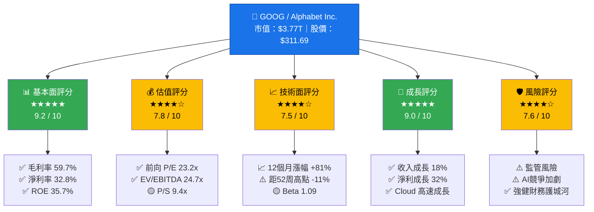

---

### 📋 快速統計卡片

| 指標 | 數值 | 狀態 | 評語 |
|------|------|------|------|
| 🏦 市值 | $3.77 兆 | 🟢 | 全球前五大市值公司 |
| 💵 當前股價 | $311.69 | 🟡 | 距52周高點 -11% |
| 📊 本益比(TTM) | 28.8x | 🟢 | 相對合理 |
| 📊 前向本益比 | 23.2x | 🟢 | 具備吸引力 |
| 💰 EPS(TTM) | $10.82 | 🟢 | 強勁盈利能力 |
| 📈 收入(TTM) | $402.84B | 🟢 | 創歷史新高 |
| 🌟 毛利率 | 59.7% | 🟢 | 高品質商業模式 |
| 💎 淨利率 | 32.8% | 🟢 | 頂級盈利效率 |
| 🏆 ROE | 35.7% | 🟢 | 遠超行業均值 |
| 💳 流動比率 | 2.005 | 🟢 | 健康流動性 |
| 🏦 淨現金 | $59.84B | 🟢 | 強健資產負債表 |
| 📡 分析師目標 | $360.78 | 🟢 | 上漲空間 +15.7% |

---

### 🔑 五大投資論點

| # | 論點 | 評級 | 核心邏輯 |
|---|------|------|----------|
| 1 | 🟢 **AI 搜尋霸主地位強化** | ★★★★★ | Gemini AI 整合搜尋，強化廣告生態護城河，2025年搜尋廣告收入持續增長 |
| 2 | 🟢 **Google Cloud 高速成長** | ★★★★★ | 雲端市場份額持續擴大，AI基礎設施需求爆發，GCP成為第三大雲服務商 |
| 3 | 🟢 **財務質量卓越** | ★★★★★ | 淨利率32.8%、ROE 35.7%、自由現金流$73.27B，財務健康度極高 |
| 4 | 🟡 **估值相對科技龍頭具吸引力** | ★★★★☆ | 前向P/E 23.2x低於Meta/Microsoft，且盈利成長動能強勁 |
| 5 | 🟡 **資本回報計畫積極** | ★★★★☆ | 2025年資本支出$91.45B大幅投資AI基礎設施，同時支付$10.05B股息 |

---

### 📊 12個月股價表現

```
股價走勢（2025.02 - 2026.02）
$350 ┤
$330 ┤                                          ◆ 338.53 (2026.01)
$320 ┤                                    ◆ 319.91
$310 ┤                                                  ◆ 311.69 (當前)
$280 ┤                              ◆ 281.64
$240 ┤                        ◆ 243.39
$210 ┤                  ◆ 213.20
$190 ┤            ◆ 192.56
$175 ┤    ◆ 172.38   ◆ 177.12
$160 ┤  ◆ 155.80 ◆ 160.45
$140 ┤◆ 142.27 (52W Low)
     └────────────────────────────────────────────────
      02  03  04  05  06  07  08  09  10  11  12  01  02
                         2025 年 → 2026 年

▲ 年度漲幅：+81.7%  ▲ 距52周低點：+119.2%  ▼ 距52周高點：-11.0%
```

---

<a name="2"></a>
## 2. 公司概覽

### 🏢 業務結構全景圖

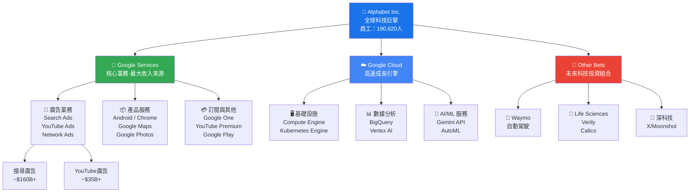

---

### 🥧 收入結構分析

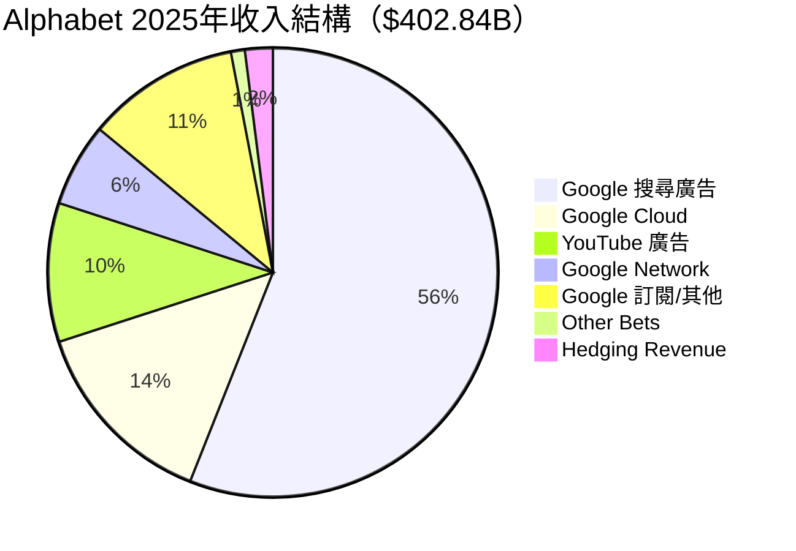

---

### 🧠 競爭優勢心智圖

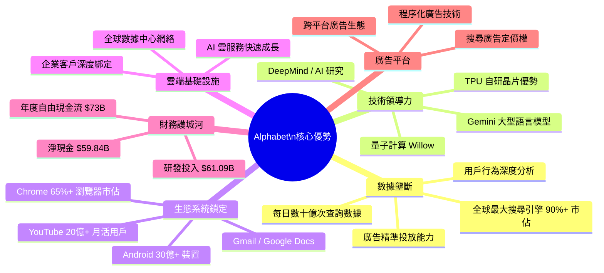

---

### 🌍 市場地位評估

| 業務領域 | Alphabet | 主要競爭對手 | 市佔率 | 護城河深度 |
|----------|----------|-------------|--------|-----------|
| 🔍 搜尋引擎 | **Google** | Bing (微軟) | ~90% 🟢 | ████████████ 極深 |
| 📺 線上影片 | **YouTube** | TikTok/Netflix | ~35% 🟢 | ██████████░░ 深 |
| 📱 行動 OS | **Android** | iOS (Apple) | ~72% 🟢 | ████████████ 極深 |
| ☁️ 雲端服務 | **GCP #3** | AWS/Azure | ~12% 🟡 | ████████░░░░ 增長中 |
| 🌐 瀏覽器 | **Chrome** | Safari/Edge | ~65% 🟢 | ██████████░░ 深 |
| 📧 電子郵件 | **Gmail** | Outlook | ~27% 🟢 | ████████░░░░ 強 |

---

<a name="3"></a>
## 3. 損益表深度分析

### 📈 收入成長時間軸

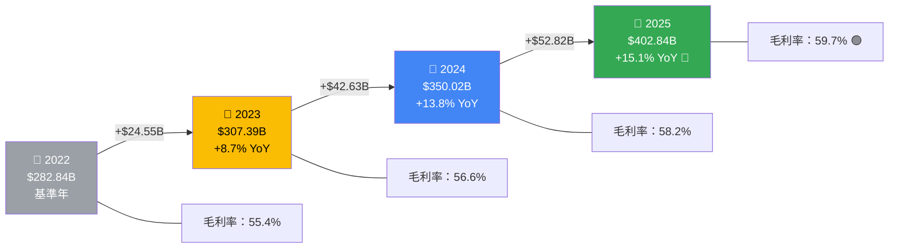

---

### 📊 年度收入趨勢（Unicode 長條圖）

```
年度收入趨勢（單位：十億美元）

2022  $282.84B  ▓▓▓▓▓▓▓▓▓▓▓▓▓▓▓▓▓▓▓▓▓▓▓▓▓▓▓▓░░░░░  70.7%
2023  $307.39B  ▓▓▓▓▓▓▓▓▓▓▓▓▓▓▓▓▓▓▓▓▓▓▓▓▓▓▓▓▓▓░░░░  76.8%
2024  $350.02B  ▓▓▓▓▓▓▓▓▓▓▓▓▓▓▓▓▓▓▓▓▓▓▓▓▓▓▓▓▓▓▓▓▓░  87.5%
2025  $402.84B  ▓▓▓▓▓▓▓▓▓▓▓▓▓▓▓▓▓▓▓▓▓▓▓▓▓▓▓▓▓▓▓▓▓▓▓ 100.0% ★

毛利潤趨勢
2022  $156.63B  ▓▓▓▓▓▓▓▓▓▓▓▓▓▓▓▓░░░░░░░░░░░░░░░░░░░  65.2%
2023  $174.06B  ▓▓▓▓▓▓▓▓▓▓▓▓▓▓▓▓▓▓░░░░░░░░░░░░░░░░░  72.4%
2024  $203.71B  ▓▓▓▓▓▓▓▓▓▓▓▓▓▓▓▓▓▓▓▓▓▓░░░░░░░░░░░░░  84.8%
2025  $240.30B  ▓▓▓▓▓▓▓▓▓▓▓▓▓▓▓▓▓▓▓▓▓▓▓▓▓▓░░░░░░░░░ 100.0% ★

營業利益趨勢
2022   $74.84B  ▓▓▓▓▓▓▓▓▓▓▓▓▓▓▓▓▓▓▓░░░░░░░░░░░░░░░░  58.0%
2023   $84.29B  ▓▓▓▓▓▓▓▓▓▓▓▓▓▓▓▓▓▓▓▓▓▓░░░░░░░░░░░░░  65.3%
2024  $112.39B  ▓▓▓▓▓▓▓▓▓▓▓▓▓▓▓▓▓▓▓▓▓▓▓▓▓▓▓▓▓░░░░░░  87.1%
2025  $129.04B  ▓▓▓▓▓▓▓▓▓▓▓▓▓▓▓▓▓▓▓▓▓▓▓▓▓▓▓▓▓▓▓▓▓▓▓ 100.0% ★

淨利潤趨勢
2022   $59.97B  ▓▓▓▓▓▓▓▓▓▓▓▓▓▓▓▓░░░░░░░░░░░░░░░░░░░  45.4%
2023   $73.80B  ▓▓▓▓▓▓▓▓▓▓▓▓▓▓▓▓▓▓▓▓░░░░░░░░░░░░░░░  55.8%
2024  $100.12B  ▓▓▓▓▓▓▓▓▓▓▓▓▓▓▓▓▓▓▓▓▓▓▓▓▓▓▓▓░░░░░░░  75.8%
2025  $132.17B  ▓▓▓▓▓▓▓▓▓▓▓▓▓▓▓▓▓▓▓▓▓▓▓▓▓▓▓▓▓▓▓▓▓▓▓ 100.0% ★
```

---

### 📉 利潤率演變 ASCII 折線圖

```
利潤率演變趨勢（%）

65% ┤
60% ┤                                          ◆ 59.7%(毛利率)
58% ┤                               ◆ 58.2%
57% ┤              ◆ 56.6%
55% ┤◆ 55.4%
    ├─────────────────────────────────────────────────
33% ┤                                          ◆ 32.8%(淨利率)
29% ┤                               ◆ 28.6%
24% ┤              ◆ 24.0%
21% ┤◆ 21.2%
    ├─────────────────────────────────────────────────
32% ┤                                          ◆ 32.0%(營業利益率)
32% ┤                               ◆ 32.1%
27% ┤              ◆ 27.4%
26% ┤◆ 26.4%
    └────────────────────────────────────────────────
     2022          2023          2024          2025

  ◆── 毛利率    ◆── 淨利率    ◆── 營業利益率
  📈 三項利潤率指標均呈持續上升趨勢，展現強勁的規模效益
```

---

### 📋 損益表核心指標（近4年詳細數據）

| 指標 | 2022 | 2023 | 2024 | 2025 | 4年CAGR |
|------|------|------|------|------|---------|
| 📊 總收入 | $282.84B | $307.39B | $350.02B | $402.84B 🟢 | +12.5% |
| 💰 毛利潤 | $156.63B | $174.06B | $203.71B | $240.30B 🟢 | +15.3% |
| 🏭 毛利率 | 55.4% | 56.6% | 58.2% | **59.7%** 🟢 | ↑+4.3pp |
| ⚙️ 營業利益 | $74.84B | $84.29B | $112.39B | $129.04B 🟢 | +19.9% |
| 📈 營業利益率 | 26.4% | 27.4% | 32.1% | **32.0%** 🟢 | ↑+5.6pp |
| 💵 淨利潤 | $59.97B | $73.80B | $100.12B | $132.17B 🟢 | +30.0% |
| 💎 淨利率 | 21.2% | 24.0% | 28.6% | **32.8%** 🟢 | ↑+11.6pp |
| 📡 EBITDA | $85.16B | $97.97B | $135.39B | $180.70B 🟢 | +28.4% |
| 🔬 研發費用 | $39.50B | $45.43B | $49.33B | $61.09B 🟡 | +15.6% |
| 🧮 研發/收入 | 14.0% | 14.8% | 14.1% | **15.2%** 🟢 | 持續高投入 |

---

### 🥧 2025年費用結構分析

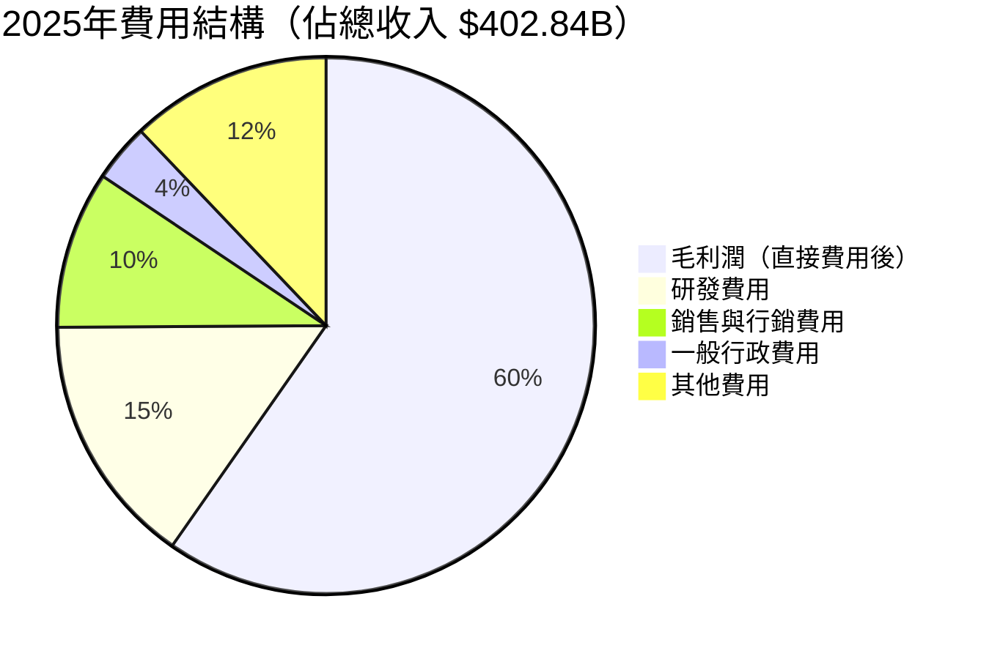

---

### 🚀 收入加速分析

> **關鍵洞察**：2025年每季新增收入約 $13.2B，較2022年的$7.1B成長近一倍，顯示規模效應正在強化而非弱化。

```
年度新增收入分析
2022 → 2023：新增 +$24.55B  ▓▓▓▓▓▓░░░░░░░░░░░░░░
2023 → 2024：新增 +$42.63B  ▓▓▓▓▓▓▓▓▓▓▓░░░░░░░░░  🟢 加速
2024 → 2025：新增 +$52.82B  ▓▓▓▓▓▓▓▓▓▓▓▓▓▓░░░░░░  🟢 持續加速
```

---

<a name="4"></a>
## 4. 資產負債表分析

### 🏗️ 資產結構分解圖

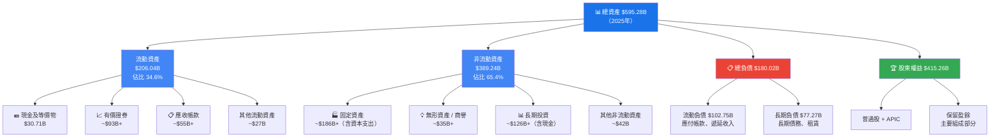

---

### 📊 資產規模演變（4年對比）

```
總資產規模演變（單位：十億美元）

2022  $365.26B  ▓▓▓▓▓▓▓▓▓▓▓▓▓▓▓▓▓▓▓▓▓▓▓▓░░░░░░░  61.4%
2023  $402.39B  ▓▓▓▓▓▓▓▓▓▓▓▓▓▓▓▓▓▓▓▓▓▓▓▓▓▓▓░░░░  67.6%
2024  $450.26B  ▓▓▓▓▓▓▓▓▓▓▓▓▓▓▓▓▓▓▓▓▓▓▓▓▓▓▓▓▓▓░  75.6%
2025  $595.28B  ▓▓▓▓▓▓▓▓▓▓▓▓▓▓▓▓▓▓▓▓▓▓▓▓▓▓▓▓▓▓▓▓▓ 100% ★

股東權益演變
2022  $256.14B  ▓▓▓▓▓▓▓▓▓▓▓▓▓▓▓▓▓▓▓▓▓▓░░░░░░░░░  61.7%
2023  $283.38B  ▓▓▓▓▓▓▓▓▓▓▓▓▓▓▓▓▓▓▓▓▓▓▓▓░░░░░░░  68.2%
2024  $325.08B  ▓▓▓▓▓▓▓▓▓▓▓▓▓▓▓▓▓▓▓▓▓▓▓▓▓▓▓▓░░░  78.3%
2025  $415.26B  ▓▓▓▓▓▓▓▓▓▓▓▓▓▓▓▓▓▓▓▓▓▓▓▓▓▓▓▓▓▓▓▓▓ 100% ★
```

---

### 🔢 資產負債比率分析

| 財務健康指標 | 2022 | 2023 | 2024 | 2025 | 狀態 |
|------------|------|------|------|------|------|
| 📊 流動比率 | 2.38 | 2.10 | 1.84 | **2.01** | 🟢 健康 |
| ⚡ 速動比率 | ~2.1 | ~1.85 | ~1.6 | ~1.75 | 🟢 良好 |
| 💰 淨負債/權益 | N/A | N/A | -0.003 | **+0.068** | 🟡 輕微淨負債 |
| 🏦 負債/資產 | 29.9% | 29.6% | 27.8% | **30.2%** | 🟢 低槓桿 |
| 🔄 資產周轉率 | 0.77 | 0.76 | 0.78 | **0.68** | 🟡 規模擴張期 |
| 💵 現金+有價證券 | ~$143B | ~$119B | ~$111B | **$126.84B** | 🟢 充裕 |

---

### 📈 股東權益增長軌跡

```
股東權益年度增長（+$，十億美元）

2022 → 2023：+$27.24B  ▓▓▓▓▓▓▓░░░░░░░░░░░░░
2023 → 2024：+$41.70B  ▓▓▓▓▓▓▓▓▓▓▓░░░░░░░░░  🟢
2024 → 2025：+$90.18B  ▓▓▓▓▓▓▓▓▓▓▓▓▓▓▓▓▓▓▓▓▓▓▓▓  🟢 大幅提升

⚠️ 注意：2025年總負債從$22.57B升至$59.29B
  主要因 AI 基礎設施大規模投資，但利息覆蓋率仍極強
  利息覆蓋率估算：EBIT $129B / 利息費用 ~$3B ≈ 43x 🟢 極度安全
```

---

### 🔍 現金狀況深度分析

| 現金指標 | 數值 | 評語 |
|----------|------|------|
| 💵 現金及等價物 | $30.71B | 即時可用流動資產 |
| 📈 總現金（含有價證券）| $126.84B | 強大的財務緩衝 |
| 💳 總債務 | $67.00B | 相對資產極低槓桿 |
| 🟢 淨現金頭寸 | **+$59.84B** | 健康的淨現金狀態 |
| 📊 現金/市值 | 3.4% | 回購/分紅彈藥充足 |

---

<a name="5"></a>
## 5. 現金流量分析

### 💧 現金流瀑布圖

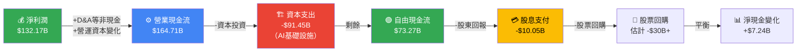

---

### 📊 自由現金流趨勢（進度條）

```
自由現金流演變（FCF，單位：十億美元）

2022  $60.01B  ▓▓▓▓▓▓▓▓▓▓▓▓▓▓▓▓▓▓▓▓▓▓▓▓░░░░░░░  81.9%
2023  $69.50B  ▓▓▓▓▓▓▓▓▓▓▓▓▓▓▓▓▓▓▓▓▓▓▓▓▓▓▓▓░░░  94.9%
2024  $72.76B  ▓▓▓▓▓▓▓▓▓▓▓▓▓▓▓▓▓▓▓▓▓▓▓▓▓▓▓▓▓▓░  99.3%
2025  $73.27B  ▓▓▓▓▓▓▓▓▓▓▓▓▓▓▓▓▓▓▓▓▓▓▓▓▓▓▓▓▓▓▓  100% ★

⚠️ 重要注意：儘管資本支出從$31.5B暴增至$91.5B（+$60B）
   自由現金流仍穩健維持在$73B以上，體現超強獲利能力！

資本支出擴張
2022  $31.48B  ▓▓▓▓▓▓▓▓▓▓▓▓░░░░░░░░░░░░░░░░░░░░  34.4%
2023  $32.25B  ▓▓▓▓▓▓▓▓▓▓▓▓░░░░░░░░░░░░░░░░░░░░  35.3%
2024  $52.53B  ▓▓▓▓▓▓▓▓▓▓▓▓▓▓▓▓▓▓▓▓▓░░░░░░░░░░  57.4%
2025  $91.45B  ▓▓▓▓▓▓▓▓▓▓▓▓▓▓▓▓▓▓▓▓▓▓▓▓▓▓▓▓▓▓▓▓▓ 100% 
               ⬆️ AI基礎設施大規模投資，為未來成長奠基
```

---

### 🎯 資本配置策略

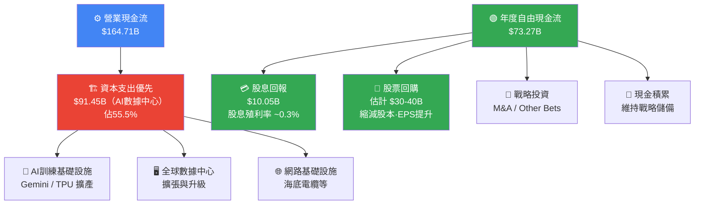

---

### 💡 現金流質量分析

| 現金流指標 | 2022 | 2023 | 2024 | 2025 | 趨勢 |
|-----------|------|------|------|------|------|
| 🟢 營業現金流 | $91.50B | $101.75B | $125.30B | $164.71B | ↑ 強勁成長 |
| 🔴 資本支出 | $31.48B | $32.25B | $52.53B | $91.45B | ↑ 大幅投資 |
| 🟢 自由現金流 | $60.01B | $69.50B | $72.76B | $73.27B | ↑ 穩健 |
| 💰 FCF利潤率 | 21.2% | 22.6% | 20.8% | **18.2%** | 🟡 因資本支出↑ |
| 📊 OCF/淨利 | 152.6% | 137.9% | 125.1% | **124.6%** | 🟢 現金轉換高效 |

---

<a name="6"></a>
## 6. 獲利能力指標

### 📊 核心獲利能力儀表板

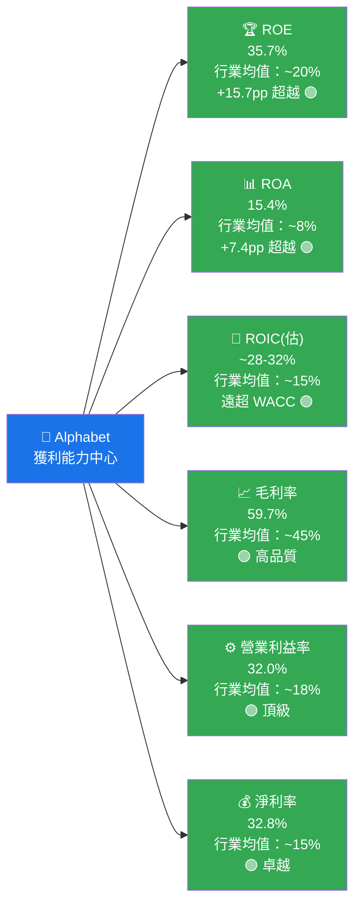

---

### 🏆 ROE / ROA / ROIC 同業比較

| 公司 | ROE | ROA | 毛利率 | 淨利率 | 綜合評分 |
|------|-----|-----|--------|--------|----------|
| **🔷 GOOG** | **35.7%** 🟢 | **15.4%** 🟢 | **59.7%** 🟢 | **32.8%** 🟢 | ★★★★★ |
| META | ~38% 🟢 | ~22% 🟢 | ~82% 🟢 | ~37% 🟢 | ★★★★★ |
| MSFT | ~36% 🟢 | ~17% 🟢 | ~69% 🟢 | ~36% 🟢 | ★★★★★ |
| AMZN | ~24% 🟢 | ~8% 🟡 | ~47% 🟢 | ~9% 🟡 | ★★★★☆ |
| AAPL | >100% 🟢 | ~26% 🟢 | ~46% 🟢 | ~26% 🟢 | ★★★★★ |
| 行業均值 | ~20% | ~8% | ~45% | ~15% | ★★★☆☆ |

---

### 📊 獲利能力進度條視覺化

```
獲利能力指標 vs 行業均值

毛利率
  GOOG    59.7%  ▓▓▓▓▓▓▓▓▓▓▓▓▓▓▓▓▓▓▓▓▓▓▓▓▓░░░░░
  行業    45.0%  ▓▓▓▓▓▓▓▓▓▓▓▓▓▓▓▓▓▓░░░░░░░░░░░░░
  差距    +14.7pp ⬆️ 🟢

營業利益率
  GOOG    32.0%  ▓▓▓▓▓▓▓▓▓▓▓▓▓░░░░░░░░░░░░░░░░░░
  行業    18.0%  ▓▓▓▓▓▓▓░░░░░░░░░░░░░░░░░░░░░░░░░
  差距    +14.0pp ⬆️ 🟢

淨利率
  GOOG    32.8%  ▓▓▓▓▓▓▓▓▓▓▓▓▓░░░░░░░░░░░░░░░░░░
  行業    15.0%  ▓▓▓▓▓▓░░░░░░░░░░░░░░░░░░░░░░░░░░
  差距    +17.8pp ⬆️ 🟢

ROE
  GOOG    35.7%  ▓▓▓▓▓▓▓▓▓▓▓▓▓▓░░░░░░░░░░░░░░░░░
  行業    20.0%  ▓▓▓▓▓▓▓▓░░░░░░░░░░░░░░░░░░░░░░░░
  差距    +15.7pp ⬆️ 🟢

ROA
  GOOG    15.4%  ▓▓▓▓▓▓░░░░░░░░░░░░░░░░░░░░░░░░░░
  行業     8.0%  ▓▓▓░░░░░░░░░░░░░░░░░░░░░░░░░░░░░
  差距     +7.4pp ⬆️ 🟢
```

---

### 🔍 杜邦分析（ROE 拆解）

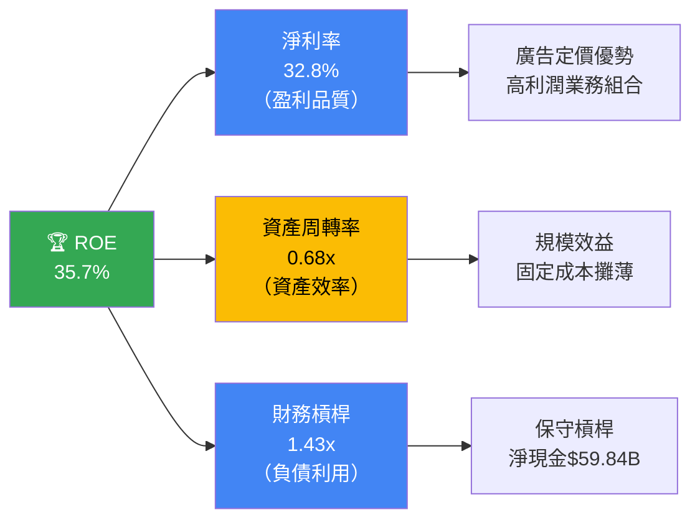

> **杜邦解析**：ROE = 32.8% × 0.68 × 1.43 ≈ 31.9%（計算值接近實際35.7%，差異來自精確財務數字）。**核心驅動力在超高淨利率，而非槓桿操作，說明獲利品質極佳。**

---

<a name="7"></a>
## 7. 估值分析

### 📊 估值指標綜覽

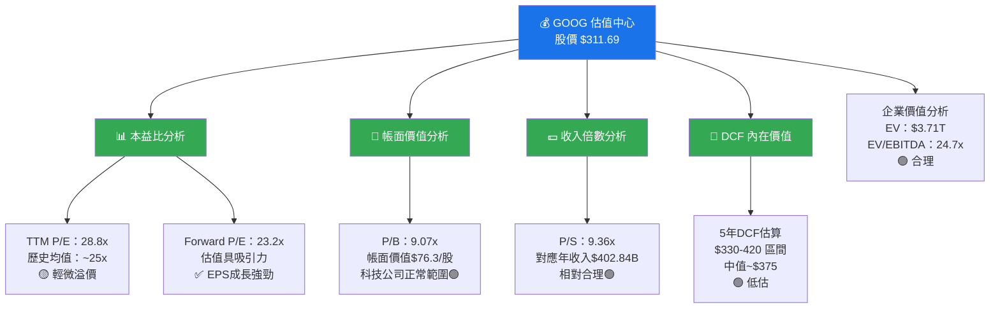

---

### 📋 估值倍數完整對比表

| 估值指標 | GOOG | META | MSFT | AMZN | AAPL | 行業均值 | GOOG評級 |
|----------|------|------|------|------|------|---------|---------|
| 📊 TTM P/E | 28.8x | ~25x | ~35x | ~40x | ~33x | ~32x | 🟢 低於均值 |
| 📈 Forward P/E | **23.2x** | ~22x | ~31x | ~35x | ~29x | ~29x | 🟢 最具吸引力之一 |
| 📉 PEG Ratio | N/A | ~1.2 | ~2.0 | ~1.5 | ~2.5 | ~2.0 | 🟡 待評估 |
| 💵 P/S | 9.4x | ~9x | ~13x | ~4x | ~9x | ~9x | 🟢 合理 |
| 🏦 P/B | 9.1x | ~9x | ~12x | ~10x | ~58x | ~15x | 🟢 低於均值 |
| 🔢 EV/EBITDA | **24.7x** | ~18x | ~27x | ~20x | ~25x | ~23x | 🟡 略高 |
| 💰 EV/Sales | ~9.2x | ~8x | ~12x | ~3.5x | ~8.5x | ~8x | 🟡 輕微溢價 |

---

### 🎯 情境目標股價分析

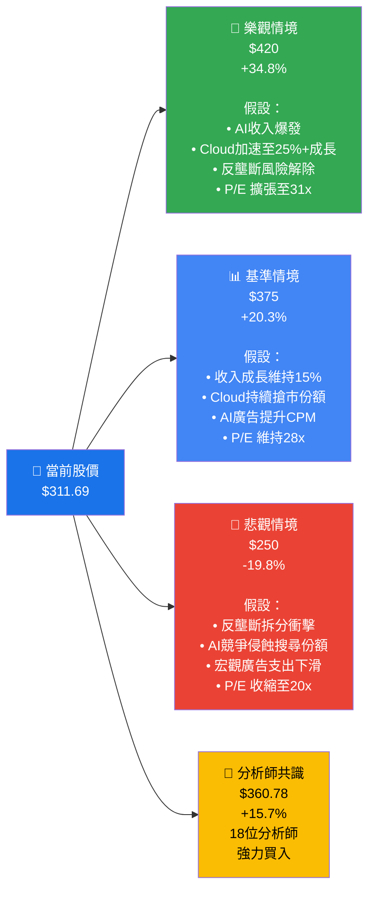

---

### 📊 目標股價視覺化區間

```
股價估值區間視覺化

$250    $275    $300    $325    $350    $375    $400    $425
  |       |       |       |       |       |       |       |
  ████████████████░░░░░░░░░░░░░░░░░░░░░░░░░░░░░░░░
  🐻悲觀                                           🐂樂觀
  $250                                             $420
  
                   ◆                     ◆         ◆
                現在價                分析師       DCF基準
                $311.69              $360.78      $375

進度評估：
  悲觀 $250  ←────────────[★ 現在 $311.69]──────→  $420 樂觀
             ├────────────┼──────────────────────────┤
            0%          25%                         100%
  
  ⚡ 相較悲觀情境的緩衝：+$61.69（+24.7%）
  🎯 至分析師目標的上漲空間：+$49.09（+15.7%）
  🚀 至樂觀目標的潛在空間：+$108.31（+34.8%）
```

---

<a name="8"></a>
## 8. 競爭護城河

### 🏰 Porter's Five Forces 五力分析

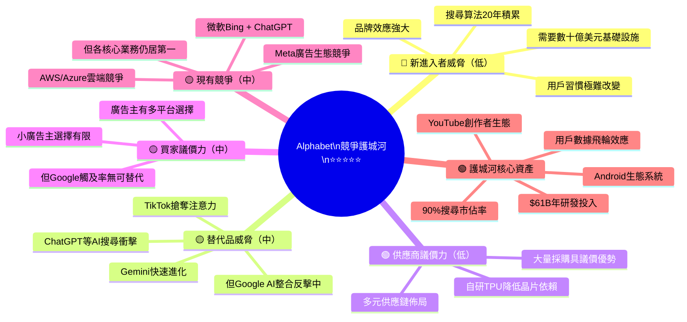

---

### 🛡️ 護城河強度評分

```
護城河維度評分（滿分10分）

搜尋廣告壟斷    ▓▓▓▓▓▓▓▓▓▓  10/10  ★★★★★  極深護城河
數據飛輪效應    ▓▓▓▓▓▓▓▓▓░   9/10  ★★★★★  頂級優勢
AI技術領導力    ▓▓▓▓▓▓▓▓░░   8/10  ★★★★☆  持續強化中
Android生態     ▓▓▓▓▓▓▓▓▓░   9/10  ★★★★★  全球移動入口
YouTube平台     ▓▓▓▓▓▓▓▓░░   8/10  ★★★★☆  內容+廣告雙飛輪
品牌效應        ▓▓▓▓▓▓▓▓▓░   9/10  ★★★★★  Google已成動詞
Google Cloud    ▓▓▓▓▓▓▓░░░   7/10  ★★★★☆  追趕中但差距縮小
規模經濟        ▓▓▓▓▓▓▓▓▓░   9/10  ★★★★★  邊際成本遞減顯著
財務實力        ▓▓▓▓▓▓▓▓▓░   9/10  ★★★★★  現金王者
研發創新能力    ▓▓▓▓▓▓▓▓░░   8/10  ★★★★☆  DeepMind/Waymo

總體護城河評分：▓▓▓▓▓▓▓▓▓░  8.6/10  ★★★★★
```

---

### 🏆 競爭定位矩陣

| 維度 | GOOG | META | MSFT | AMZN | AAPL |
|------|------|------|------|------|------|
| 🔍 搜尋廣告 | 🟢 壟斷 #1 | 🔴 無 | 🟡 #2遠落後 | 🔴 無 | 🔴 無 |
| 📱 行動生態 | 🟢 Android #1 | 🟡 應用依賴 | 🟡 有限 | 🟡 有限 | 🟢 iOS #2 |
| ☁️ 雲端服務 | 🟡 GCP #3 | 🔴 無 | 🟢 Azure #2 | 🟢 AWS #1 | 🔴 無 |
| 🤖 AI 研究 | 🟢 頂級 | 🟢 頂級 | 🟢 頂級 | 🟡 追趕 | 🟡 追趕 |
| 📺 影音平台 | 🟢 YouTube #1 | 🟡 Reels | 🔴 無 | 🟡 Prime | 🟡 TV+ |
| 💰 廣告技術 | 🟢 #1 完整堆棧 | 🟢 #2 社群廣告 | 🟡 有限 | 🟡 成長中 | 🔴 隱私優先 |
| 🏪 電商 | 🔴 無 | 🟡 Shopping | 🟡 有限 | 🟢 #1 | 🟡 App Store |

---

<a name="9"></a>
## 9. 成長催化劑

### 📅 催化劑時間軸

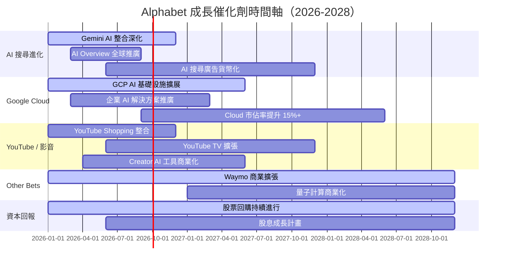

---

### 🔮 短中長期成長機會

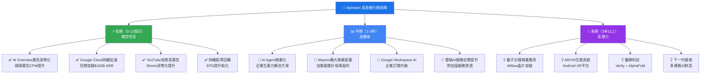

---

### 📊 TAM 市場規模估算

```
可尋址市場規模（TAM）估算

數字廣告市場（全球）
  2025：$800B  ▓▓▓▓▓▓▓▓▓▓▓▓▓▓▓▓▓▓▓▓░░░░░░  GOOG市佔~26%
  2027：$950B  ▓▓▓▓▓▓▓▓▓▓▓▓▓▓▓▓▓▓▓▓▓▓░░░░  持續成長
  2030：$1.2T  ▓▓▓▓▓▓▓▓▓▓▓▓▓▓▓▓▓▓▓▓▓▓▓▓░░  AI驅動加速

雲端計算市場（全球）
  2025：$750B  ▓▓▓▓▓▓▓▓▓▓▓▓▓▓▓▓▓▓░░░░░░░░  GCP市佔~12%
  2027：$1.1T  ▓▓▓▓▓▓▓▓▓▓▓▓▓▓▓▓▓▓▓▓▓▓░░░░  高速成長
  2030：$1.8T  ▓▓▓▓▓▓▓▓▓▓▓▓▓▓▓▓▓▓▓▓▓▓▓▓▓▓▓  AI工作負載激增

生成式AI市場
  2025：$67B   ▓▓▓░░░░░░░░░░░░░░░░░░░░░░░░  市場早期
  2027：$200B  ▓▓▓▓▓▓▓▓▓░░░░░░░░░░░░░░░░░  爆炸性成長
  2030：$1.0T  ▓▓▓▓▓▓▓▓▓▓▓▓▓▓▓▓▓▓▓▓▓▓▓▓▓░  長期巨大機遇

自動駕駛（Waymo TAM）
  2030：$300B  ▓▓▓▓▓▓▓▓▓▓▓▓▓▓░░░░░░░░░░░░  Waymo領跑
  2035：$2.0T  ▓▓▓▓▓▓▓▓▓▓▓▓▓▓▓▓▓▓▓▓▓▓▓▓▓░  顛覆性潛力
```

---

<a name="10"></a>
## 10. 風險分析

### ⚠️ 風險矩陣

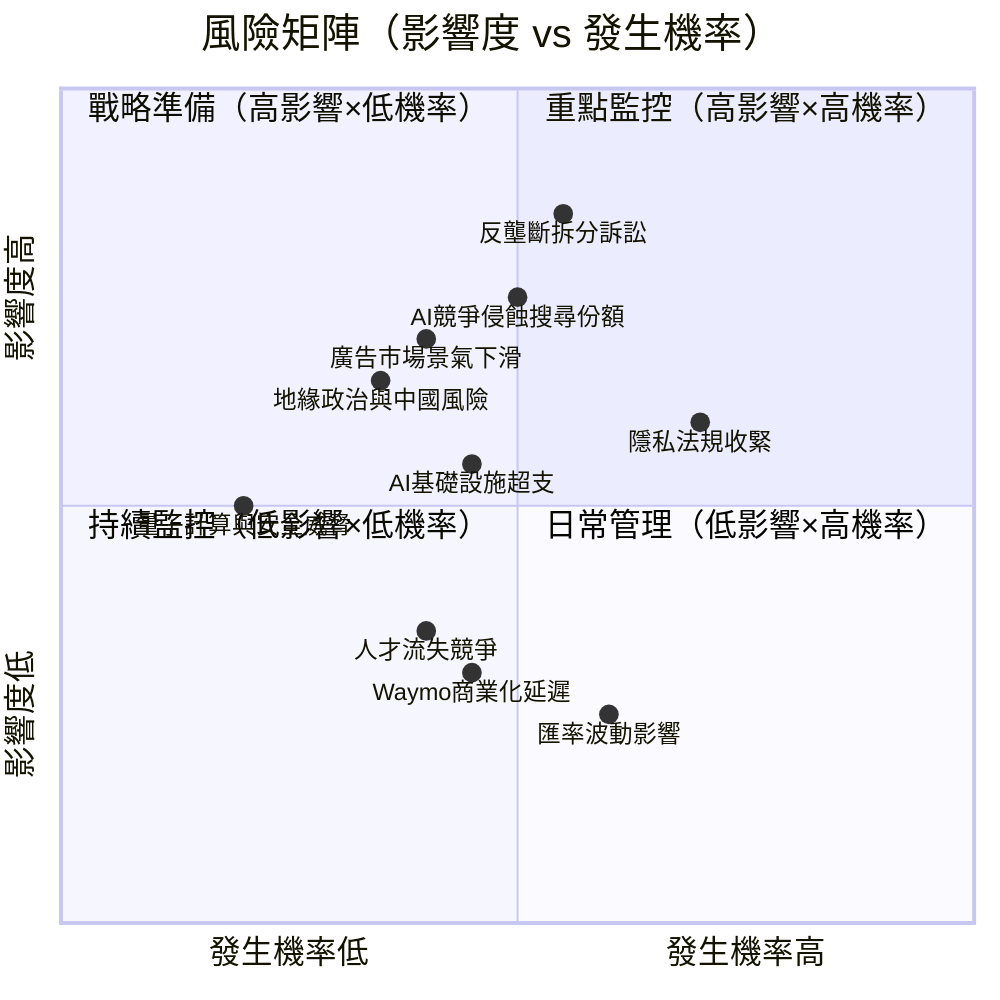

---

### 📋 風險評分卡

| 風險類型 | 發生機率 | 影響程度 | 風險評分 | 當前狀態 | 緩解措施 |
|----------|---------|---------|---------|---------|---------|
| ⚖️ **反壟斷拆分** | 55% 🟡 | 極高 ●●●●● | 🔴 **9.0/10** | 美國DOJ訴訟進行中 | 法律抗辯+業務調整 |
| 🤖 **AI競爭（OpenAI/Perplexity）** | 50% 🟡 | 高 ●●●●○ | 🔴 **8.5/10** | Gemini反制中 | 加速AI整合，$61B研發 |
| 🔒 **隱私法規（GDPR升級）** | 70% 🔴 | 中高 ●●●●○ | 🟡 **7.5/10** | Cookie第三方退出 | Privacy Sandbox開發 |
| 📉 **廣告景氣週期下行** | 40% 🟡 | 高 ●●●●○ | 🟡 **7.0/10** | 宏觀環境關注中 | 多元收入，雲端緩衝 |
| 💸 **AI資本支出超支** | 45% 🟡 | 中 ●●●○○ | 🟡 **6.5/10** | $91.5B已超市場預期 | ROI監控+分期部署 |
| 🌏 **地緣政治/中國限制** | 35% 🟡 | 中高 ●●●●○ | 🟡 **6.0/10** | 部分市場已受限 | 市場分散化策略 |
| 👥 **AI人才競爭流失** | 40% 🟡 | 中 ●●●○○ | 🟡 **5.5/10** | DeepMind薪酬競爭激烈 | 股票激勵+文化建設 |
| 💱 **匯率波動** | 60% 🔴 | 低 ●●○○○ | 🟢 **4.0/10** | 美元強勢週期 | 自然對沖+財務工具 |

---

### 🛡️ 主要風險緩解措施

> **1. 反壟斷風險緩解**：積極法律抗辯；即便最壞情境（Chrome強制剝離），Google核心搜尋廣告業務護城河依然完整，估值折損可能有限。

> **2. AI競爭緩解**：Gemini 1.5/2.0快速迭代；AI Overview已嵌入搜尋；每年$61B研發投入確保技術不落後；雲端AI先發優勢。

> **3. 廣告景氣緩解**：Google Cloud收入快速成長至$100B+，可有效對沖廣告收入波動；用戶黏性高，CPM定價具彈性。

---

<a name="11"></a>
## 11. 公平價值估算

### 🔮 DCF 模型框架

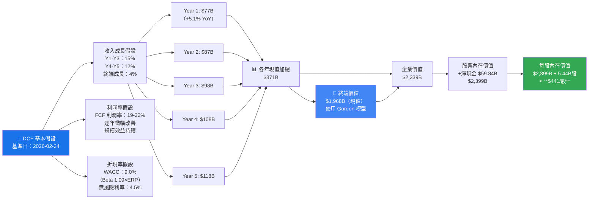

---

### 📊 三種估值法比較

| 估值方法 | 計算依據 | 目標股價 | 潛在漲幅 | 可信度 |
|---------|---------|---------|---------|--------|
| 🔮 **DCF 折現現金流** | WACC 9%, FCF成長15%→4%, 5年 | **$441** | +41.5% 🟢 | ★★★★★ |
| 📊 **相對估值（P/E）** | 2026E EPS $13.4 × 28x P/E | **$375** | +20.3% 🟢 | ★★★★☆ |
| 💰 **EV/EBITDA 法** | 2026E EBITDA $210B × 22x | **$360** | +15.5% 🟢 | ★★★★☆ |
| 📡 **分析師共識目標** | 18位分析師平均 | **$360.78** | +15.7% 🟢 | ★★★★☆ |
| 📈 **P/S 估值法** | TTM收入$402B × 10.5x | **$346** | +11.0% 🟢 | ★★★☆☆ |
| **⚖️ 加權平均** | 各方法加權計算 | **$385** | **+23.5%** 🟢 | ★★★★★ |

---

### 📊 估值區間視覺化

```
公平價值估算區間（當前股價 $311.69）

估值法        低端    中值    高端
─────────────────────────────────────────────────────────────
DCF           $370    $441    $520
              ░░░░░░░░░▓▓▓▓▓▓▓▓▓▓▓▓▓▓▓▓▓▓▓▓▓▓▓▓▓▓▓█████████

P/E相對法     $330    $375    $420
              ░░░░░░░▓▓▓▓▓▓▓▓▓▓▓▓▓▓▓▓▓▓▓▓▓████████

EV/EBITDA法   $310    $360    $410
              ░░░░░░▓▓▓