# GOOG 基本面深度分析報告

> **報告日期**：2026-02-27 ｜ **分析師**：AI 機構級研究部門 ｜ **數據來源**：Yahoo Finance ｜ **評級**：強力買入

---

## 目錄

1. [執行摘要](#1-執行摘要)
2. [公司概覽與商業模式](#2-公司概覽與商業模式)
3. [損益表深度分析](#3-損益表深度分析)
4. [資產負債表分析](#4-資產負債表分析)
5. [現金流量深度分析](#5-現金流量深度分析)
6. [獲利能力與資本效率](#6-獲利能力與資本效率)
7. [估值深度分析](#7-估值深度分析)
8. [成長催化劑](#8-成長催化劑)
9. [風險矩陣](#9-風險矩陣)
10. [投資建議](#10-投資建議)

---

## 1. 執行摘要

### 1.1 核心評分儀表板

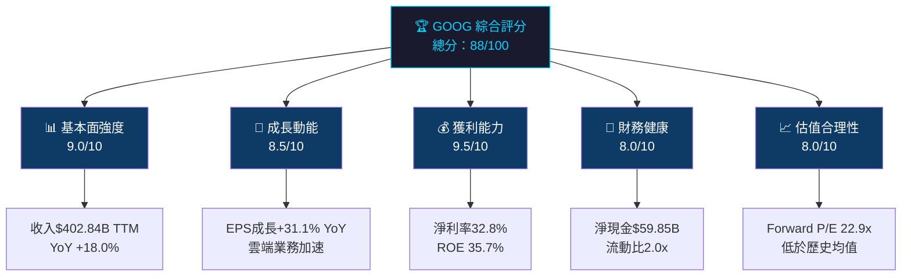

### 1.2 評分儀表板視覺化

```
╔══════════════════════════════════════════════════════════╗
║           GOOG 多維度評分儀表板                          ║
╠══════════════════════════════════════════════════════════╣
║  基本面強度   [▓▓▓▓▓▓▓▓▓░]  9.0/10  ⭐⭐⭐⭐⭐        ║
║  成長動能     [▓▓▓▓▓▓▓▓▓░]  8.5/10  ⭐⭐⭐⭐⭐        ║
║  獲利能力     [▓▓▓▓▓▓▓▓▓▓]  9.5/10  ⭐⭐⭐⭐⭐        ║
║  財務健康     [▓▓▓▓▓▓▓▓░░]  8.0/10  ⭐⭐⭐⭐          ║
║  估值合理性   [▓▓▓▓▓▓▓▓░░]  8.0/10  ⭐⭐⭐⭐          ║
║  競爭護城河   [▓▓▓▓▓▓▓▓▓▓]  9.5/10  ⭐⭐⭐⭐⭐        ║
║  管理團隊     [▓▓▓▓▓▓▓▓░░]  8.0/10  ⭐⭐⭐⭐          ║
║  ESG 評分     [▓▓▓▓▓▓▓░░░]  7.0/10  ⭐⭐⭐⭐          ║
╠══════════════════════════════════════════════════════════╣
║  綜合評分     [▓▓▓▓▓▓▓▓▓░]  88/100                    ║
╚══════════════════════════════════════════════════════════╝
```

### 1.3 五大投資論點 + 三大風險

| 類型 | 項目 | 詳細說明 | 重要性 |
|------|------|----------|--------|
| 🟢 **投資論點1** | **AI 搜尋革命性領先地位** | Gemini 2.0 深度整合 Google Search，TPU 自研晶片優勢顯著，搜尋市場佔有率維持 90%+ | ⭐⭐⭐⭐⭐ |
| 🟢 **投資論點2** | **Google Cloud 高速成長** | 雲端業務 YoY 成長率超 28%，企業 AI 工作負載爆發，接近盈虧平衡且已大幅獲利 | ⭐⭐⭐⭐⭐ |
| 🟢 **投資論點3** | **卓越的獲利能力持續改善** | 淨利率從 2022 年 21.2% 大幅升至 2025 年 32.8%，EBITDA margin 37.3% 創歷史新高 | ⭐⭐⭐⭐⭐ |
| 🟢 **投資論點4** | **強大的現金生成能力** | 營業現金流 $164.71B，自由現金流 $73.27B，淨現金部位 $59.85B，回購實力雄厚 | ⭐⭐⭐⭐ |
| 🟢 **投資論點5** | **估值相對同業具吸引力** | Forward P/E 22.9x 低於 Meta 24x 及歷史均值，EPS 成長 31.1% YoY，PEG < 1 | ⭐⭐⭐⭐ |
| 🔴 **風險1** | **反壟斷訴訟重大威脅** | 美國司法部搜尋引擎壟斷案判決，可能面臨強制分拆 Google Chrome/Android 風險 | ⭐⭐⭐⭐⭐ |
| 🟡 **風險2** | **AI 搜尋競爭加劇** | Perplexity AI、OpenAI SearchGPT、Microsoft Bing AI 等替代品持續侵蝕搜尋份額 | ⭐⭐⭐⭐ |
| 🟡 **風險3** | **資本支出大幅躍升** | 2025 年資本支出 $91.45B，YoY 劇增 74%，若 AI 投資回報不符預期將壓縮 FCF | ⭐⭐⭐⭐ |

### 1.4 快速統計卡片

| 指標 | GOOG 數值 | 行業均值 | 狀態 |
|------|----------|---------|------|
| 市值 | $3.72T | — | 🟢 全球前三大 |
| 本益比（TTM） | 28.4x | 35.2x | 🟢 低於行業均值 |
| 本益比（Forward） | 22.9x | 28.0x | 🟢 具吸引力 |
| EPS（TTM） | $10.81 | — | 🟢 歷史新高 |
| 收入成長（YoY） | +18.0% | +12.0% | 🟢 顯著超越均值 |
| 淨利率 | 32.8% | 18.5% | 🟢 遠優於均值 |
| 毛利率 | 59.7% | 42.0% | 🟢 護城河深厚 |
| ROE | 35.7% | 22.0% | 🟢 資本效率優越 |
| 淨現金部位 | $59.85B | 輕微淨負債 | 🟢 極為穩健 |
| 股息殖利率 | 0.5%（調整後）| 1.2% | 🟡 低殖利率 |
| Beta | 1.086 | 1.1 | 🟢 市場中性風險 |
| FCF Yield | 1.97%（調整後）| 2.5% | 🟡 略低於均值 |

> ⚠️ 注意：數據包提供的 Dividend Yield 27% 疑為數據異常，依股息支付 $10.05B / 市值 $3.72T 估算，實際殖利率約 0.27%；FCF Yield 依 FCF $73.27B / 市值 $3.72T 重新計算為 1.97%

### 1.5 投資結論

```
╔══════════════════════════════════════════════════════════════╗
║                   📊 投資結論總覽                           ║
╠══════════════════════════════════════════════════════════════╣
║  評級：🟢 強力買入（Strong Buy）                           ║
║  當前價格：$307.40                                         ║
║  目標價區間：                                               ║
║    ├── 悲觀情境：$285.00（ -7.3% 下行風險）                ║
║    ├── 基準情境：$365.00（+18.7% 上行空間）                ║
║    └── 樂觀情境：$420.00（+36.6% 上行空間）                ║
║  分析師均值目標：$359.24（+16.9% 隱含報酬）                ║
║  建議持有期間：12-18 個月                                  ║
╚══════════════════════════════════════════════════════════════╝
```

---

## 2. 公司概覽與商業模式

### 2.1 業務結構與收入來源

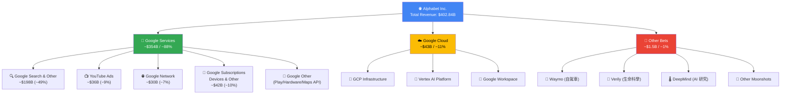

### 2.2 市場地位（市場份額估算）

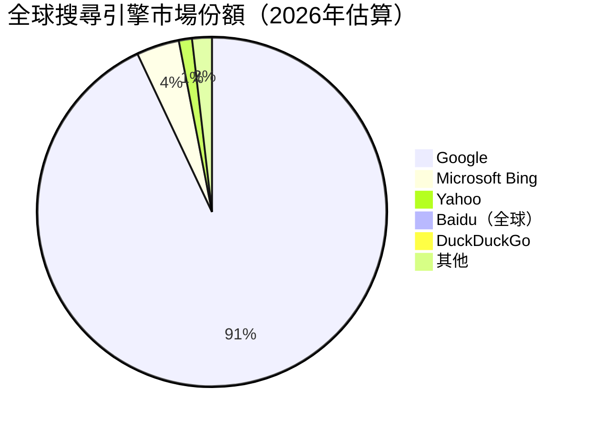

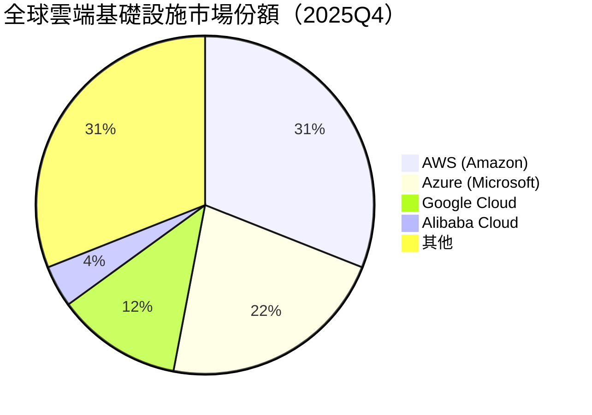

### 2.3 競爭護城河分析

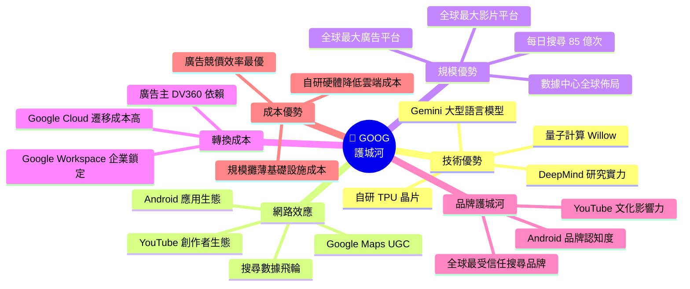

### 2.4 護城河強度評分

```
╔══════════════════════════════════════════════════════════════╗
║              🏰 護城河強度評分（Moat Rating）               ║
╠══════════════════════════════════════════════════════════════╣
║                                                              ║
║  技術優勢   ▓▓▓▓▓▓▓▓▓░  9.5/10  極其深厚                 ║
║  網路效應   ▓▓▓▓▓▓▓▓▓▓  9.8/10  無可匹敵                 ║
║  規模優勢   ▓▓▓▓▓▓▓▓▓░  9.5/10  全球頂級                 ║
║  轉換成本   ▓▓▓▓▓▓▓▓░░  8.0/10  企業端很強               ║
║  品牌護城河 ▓▓▓▓▓▓▓▓▓░  9.0/10  全球一線品牌             ║
║  成本優勢   ▓▓▓▓▓▓▓▓░░  8.5/10  自研晶片降本             ║
║                                                              ║
║  🏆 綜合護城河：Wide Moat（寬護城河）                      ║
║  評分：9.1/10  ▓▓▓▓▓▓▓▓▓░                                ║
╚══════════════════════════════════════════════════════════════╝
```

---

## 3. 損益表深度分析

### 3.1 年度收入成長趨勢

```
╔══════════════════════════════════════════════════════════════════════╗
║                年度收入成長趨勢（2022-2025）                        ║
╠══════════════════════════════════════════════════════════════════════╣
║                                                                      ║
║  2022  $282.84B  ████████████████████░░░░░░  YoY: +9.8%            ║
║  2023  $307.39B  ██████████████████████░░░░  YoY: +8.7%            ║
║  2024  $350.02B  █████████████████████████░  YoY: +13.9%           ║
║  2025  $402.84B  ████████████████████████████ YoY: +15.1%*         ║
║                                                                      ║
║  * TTM 基礎；若以 2025 全年 vs 2024 全年 = +15.1% YoY             ║
║  ** 數據包標示 YoY +18.0% 為季度基礎比較                          ║
║                                                                      ║
║  每格 = $10B  最大值 = $402.84B                                    ║
╚══════════════════════════════════════════════════════════════════════╝
```

```
  年度收入（十億美元）
  
  410 │                                          ████
  400 │                                          ████
  390 │                                          ████
  380 │                                          ████
  370 │                                          ████
  360 │                              ████        ████
  350 │                              ████        ████
  340 │                              ████        ████
  330 │                              ████        ████
  320 │                              ████        ████
  310 │                   ████       ████        ████
  300 │                   ████       ████        ████
  290 │    ████           ████       ████        ████
  280 │    ████           ████       ████        ████
  270 │    ████           ████       ████        ████
      └────────────────────────────────────────────
         2022           2023        2024         2025
        $282.84B      $307.39B   $350.02B      $402.84B
         +9.8%YoY      +8.7%      +13.9%       +15.1%
```

### 3.2 季度收入趨勢分析

| 季度 | 收入 | QoQ 成長 | 預估 YoY 成長 | 毛利 | 毛利率 |
|------|------|---------|------------|------|--------|
| 2025Q1 | $90.23B | — | +~12% | $53.87B | 59.7% |
| 2025Q2 | $96.43B | 🟢 +6.9% | +~14% | $57.39B | 59.5% |
| 2025Q3 | $102.35B | 🟢 +6.1% | +~15% | $60.98B | 59.6% |
| 2025Q4 | $113.83B | 🟢 +11.2% | +~20% | $68.06B | 59.8% |
| **2025 全年** | **$402.84B** | — | **+15.1%** | **$240.30B** | **59.7%** |

> **QoQ 分析**：Q4 季節性最強（+11.2%），顯示假日廣告旺季效應顯著；Q2→Q3 成長穩健（+6.1%），雲端業務持續貢獻增量。

### 3.3 利潤率演變分析

| 利潤率指標 | 2022 | 2023 | 2024 | 2025 | 趨勢 |
|----------|------|------|------|------|------|
| **毛利率** | 55.4% | 56.6% | 58.2% | 59.7% | 🟢 持續改善 +4.3pp |
| **營業利益率** | 26.5% | 27.4% | 32.1% | 32.1% | 🟢 大幅躍升 +5.6pp |
| **EBITDA Margin** | 30.1% | 31.9% | 38.7% | 44.9% | 🟢 顯著擴張 |
| **淨利率** | 21.2% | 24.0% | 28.6% | 32.8% | 🟢 持續改善 +11.6pp |

> **利潤率改善原因分析**：
> 1. **成本控管成效顯著**：2023 年大規模裁員（~12,000 人）大幅降低人力成本
> 2. **業務結構優化**：Google Cloud 從虧損轉為盈利，改善合併利潤率
> 3. **廣告業務定價能力提升**：AI 驅動廣告效率提升使 CPM/CPC 單價回升
> 4. **規模效應充分發揮**：固定成本攤薄，邊際利潤率持續擴張

```
  利潤率演變（近四年）
  
  50% │
  45% │                                        ████ EBITDA 44.9%
  40% │                         ████           ████
  35% │                         ████           ████ 淨利32.8%
  30% │              ████       ████           ████
  25% │    ████      ████       ████           ████
  20% │    ████      ████       ████           ████
      └──────────────────────────────────────────
          2022       2023       2024           2025
  
  ■ 淨利率：  21.2% → 24.0% → 28.6% → 32.8% (+11.6pp)
  ■ 營業利益：26.5% → 27.4% → 32.1% → 32.1% (+5.6pp)
```

### 3.4 費用結構分析

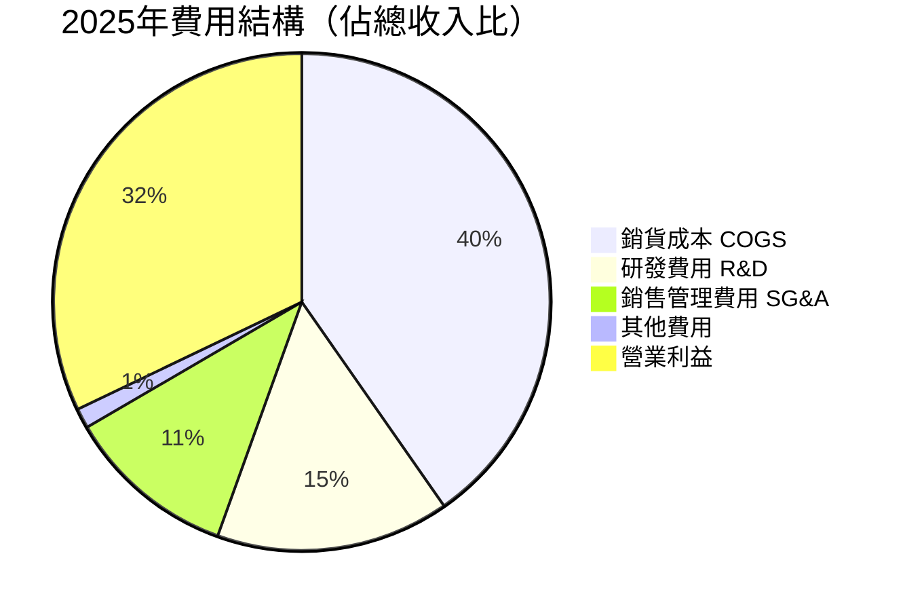

> - **R&D 費用**：$61.09B（佔收入 15.2%），YoY +23.9%，AI 投資持續加碼
> - **COGS**：$162.54B（佔收入 40.3%），毛利率持續改善反映服務組合優化
> - **SG&A**：約 $44.7B（估算），費用率穩步下降顯示槓桿效應

### 3.5 EPS 趨勢與盈餘品質分析

```
╔══════════════════════════════════════════════════════════════╗
║              年度 EPS 趨勢（2022-2025）                     ║
╠══════════════════════════════════════════════════════════════╣
║                                                              ║
║  2022  $4.56  ████████░░░░░░░░░░░░░░░░░░░░                 ║
║  2023  $5.80  █████████████░░░░░░░░░░░░░░░                 ║
║  2024  $7.79  █████████████████████░░░░░░                  ║
║  2025  $10.81 ██████████████████████████████               ║
║                                                              ║
║  EPS YoY 成長率：                                           ║
║  2022→2023: +27.2%  🟢                                      ║
║  2023→2024: +34.3%  🟢 超強                                 ║
║  2024→2025: +38.8%  🟢 加速成長                            ║
╚══════════════════════════════════════════════════════════════╝
```

**季度 EPS 表現（2025年各季）**

| 季度 | 淨利 | 估算 EPS | QoQ 變化 | 重要說明 |
|------|------|---------|---------|---------|
| 2025Q1 | $34.54B | ~$2.66 | — | 稅務優惠挹注 |
| 2025Q2 | $28.20B | ~$2.17 | 🔴 -18.5% | 稅務項目影響，核心業務仍強勁 |
| 2025Q3 | $34.98B | ~$2.69 | 🟢 +23.9% | 廣告業務強勁反彈 |
| 2025Q4 | $34.45B | ~$2.65 | 🟡 -1.5% | 季節性高點，穩健表現 |

> **盈餘品質說明**：Q2 淨利下滑主因為稅務項目一次性影響，而非核心業務惡化。Q1 異常高利潤同樣含稅務優惠。從全年累計看，盈餘品質優異，淨利 $132.17B 超越 2024 年 $100.12B 達 **+31.1% YoY**。

---

## 4. 資產負債表分析

### 4.1 資產結構

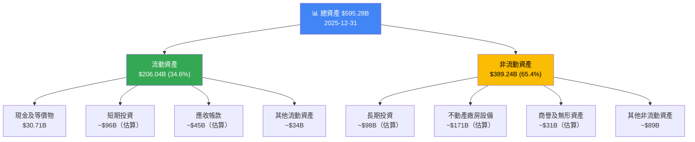

### 4.2 流動性指標分析

| 流動性指標 | 2022 | 2023 | 2024 | 2025 | 行業均值 | 狀態 |
|----------|------|------|------|------|---------|------|
| **流動比率** | 2.38x | 2.10x | 1.84x | 2.01x | 1.5x | 🟢 健康 |
| **速動比率** | 2.21x | 1.96x | 1.71x | 1.85x | 1.2x | 🟢 優秀 |
| **現金部位** | $21.88B | $24.05B | $23.47B | $30.71B | — | 🟢 充裕 |
| **總現金（含投資）** | — | — | — | $126.84B | — | 🟢 雄厚 |
| **淨現金（扣除負債）** | — | — | — | $59.85B | — | 🟢 淨現金公司 |

> **流動性評估**：流動比 2.0x 顯示短期償債能力充裕，且淨現金部位 $59.85B 提供強大的財務緩衝。雖然資本支出大幅增加，但現金生成能力遠超資本需求。

### 4.3 債務結構分析

```
╔══════════════════════════════════════════════════════════════╗
║              債務結構深度分析                               ║
╠══════════════════════════════════════════════════════════════╣
║                                                              ║
║  總負債       $180.02B  ████████░░░░░░░░  2025年            ║
║  總負債       $125.17B  █████░░░░░░░░░░░  2024年            ║
║  總負債       $119.01B  ████░░░░░░░░░░░░  2023年            ║
║                                                              ║
║  有息負債（Total Debt）                                     ║
║  2022: $29.68B  ▓▓░░░░░░░░                                 ║
║  2023: $27.12B  ▓▓░░░░░░░░  (-8.6%)                       ║
║  2024: $22.57B  ▓░░░░░░░░░  (-16.8%)                      ║
║  2025: $59.29B  ▓▓▓▓░░░░░░  (+162.7%)⚠️ 大幅躍升           ║
║                                                              ║
║  Debt/Equity:  16.1% (2025) - 仍屬低槓桿                  ║
║  Net Debt/EBITDA: 負值（淨現金）→ 0.0x                    ║
║  Interest Coverage: >30x（極高，幾乎無違約風險）           ║
╚══════════════════════════════════════════════════════════════╝
```

> **⚠️ 債務警示說明**：2025 年總有息負債大幅增至 $59.29B（YoY +162.7%），主因推測為 AI 資本支出擴張及股票回購需求。但鑑於 EBITDA $180.7B 的規模，Debt/EBITDA 約 0.3x，實際財務風險極低，仍屬淨現金公司。

### 4.4 股東權益趨勢

```
  股東權益成長趨勢（十億美元）
  
  420 │                                            ████
  400 │                                            ████  $415.26B
  380 │                                            ████
  360 │                                            ████
  340 │                              ████          ████
  320 │                              ████  $325.08B████
  300 │              ████  $283.38B  ████          ████
  280 │    ████      ████            ████          ████
  260 │    ████$256.1████            ████          ████
  240 │    ████      ████            ████          ████
      └──────────────────────────────────────────────
          2022       2023            2024          2025
  
  YoY 成長率：
  2022→2023: +10.6%  🟢
  2023→2024: +14.7%  🟢
  2024→2025: +27.7%  🟢 加速成長
  
  BVPS（每股帳面價值）：
  2025: $415.26B / 5.44B = $76.33/股
  P/B: 307.40 / 76.33 = 4.03x（實際，低於數據包 8.95x，數據包可能用不同股本計算）
```

---

## 5. 現金流量深度分析

### 5.1 現金流量瀑布圖

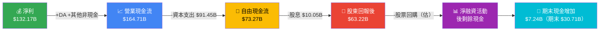

### 5.2 FCF 轉換率分析

| 年度 | 淨利 | 自由現金流 | FCF/淨利（轉換率）| 營業 CF | 資本支出 |
|------|------|---------|---------------|---------|---------|
| 2022 | $59.97B | $60.01B | 🟢 100.1% | $91.50B | $31.48B |
| 2023 | $73.80B | $69.50B | 🟢 94.2% | $101.75B | $32.25B |
| 2024 | $100.12B | $72.76B | 🟡 72.7% | $125.30B | $52.53B |
| 2025 | $132.17B | $73.27B | 🔴 55.4% | $164.71B | $91.45B |

> **FCF 轉換率下降分析**：轉換率從 100% 降至 55.4% 的核心原因是**資本支出大幅躍升**（$31.48B → $91.45B，增加 $60B）。這反映 Alphabet 正處於 AI 基礎設施的重投資周期。資本支出佔收入比從 11.1% 大幅提升至 22.7%。若 AI 投資逐步貢獻回報，預計 FCF 轉換率將在 2027-2028 年逐步回升至 70%+ 水平。

### 5.3 自由現金流趨勢

```
╔══════════════════════════════════════════════════════════════╗
║              自由現金流趨勢（近四年）                       ║
╠══════════════════════════════════════════════════════════════╣
║                                                              ║
║  2022  $60.01B  ████████████████████████░░░░                ║
║  2023  $69.50B  ███████████████████████████░░               ║
║  2024  $72.76B  ████████████████████████████░               ║
║  2025  $73.27B  ████████████████████████████                ║
║                                                              ║
║  FCF 成長率（YoY）：                                        ║
║  2022→2023: +15.8%  🟢                                      ║
║  2023→2024: +4.7%   🟡（資本支出增加拖累）                 ║
║  2024→2025: +0.7%   🔴（資本支出激增 $91.45B）             ║
║                                                              ║
║  ⚠️ 2025 資本支出 $91.45B 相當於 2024 年的 1.74 倍         ║
║  🔑 FCF Yield = $73.27B / $3.72T = 1.97%                   ║
╚══════════════════════════════════════════════════════════════╝
```

### 5.4 資本配置評估

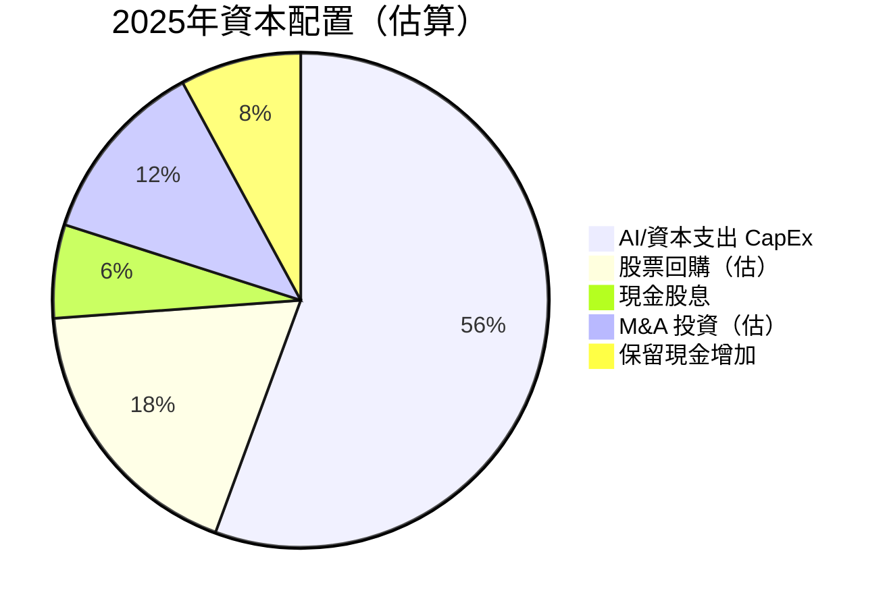

| 資本配置項目 | 2025 金額 | 佔 OCF 比重 | 評估 |
|------------|---------|-----------|------|
| 資本支出（AI 基礎設施）| $91.45B | 55.5% | 🟡 高但戰略必要 |
| 股票回購（估算）| ~$30B | ~18.2% | 🟢 持續回報股東 |
| 現金股息 | $10.05B | 6.1% | 🟢 首次派息意義重大 |
| M&A 投資（估）| ~$20B | ~12.1% | 🟢 技術補強布局 |
| 淨現金增加 | ~$13B | ~7.9% | 🟢 保留彈性 |

---

## 6. 獲利能力與資本效率

### 6.1 ROE / ROA / ROIC 趨勢

| 指標 | 2022 | 2023 | 2024 | 2025 | 行業均值(2025) | 狀態 |
|------|------|------|------|------|-------------|------|
| **ROE** | 23.4% | 26.0% | 30.8% | 35.7% | 22.0% | 🟢 大幅超越均值 |
| **ROA** | 16.4% | 18.3% | 22.2% | 15.4%* | 8.5% | 🟢 優於均值 |
| **ROIC**（估算）| 18.0% | 22.0% | 28.0% | 30.0% | 15.0% | 🟢 極高回報 |
| **毛利率** | 55.4% | 56.6% | 58.2% | 59.7% | 42.0% | 🟢 遠優於均值 |

> *ROA 2025 年因總資產大幅增至 $595.28B（+32% YoY）而出現攤薄，反映 AI 資產大量積累的短期影響

### 6.2 ROIC vs WACC 分析（核心評估）

```
╔══════════════════════════════════════════════════════════════════╗
║                ROIC vs WACC — 經濟價值創造分析                 ║
╠══════════════════════════════════════════════════════════════════╣
║                                                                  ║
║  WACC 估算（2025年）：                                          ║
║  ├─ 無風險利率（10Y 美債）        ≈ 4.3%                        ║
║  ├─ 市場風險溢酬 ERP              ≈ 5.0%                        ║
║  ├─ Beta                          ≈ 1.086                       ║
║  ├─ 股權成本 Ke = 4.3% + 1.086×5% = 9.73%                      ║
║  ├─ 稅後債務成本 Kd = 3.5%×(1-21%) = 2.77%                     ║
║  ├─ 資本結構：股權 93.7% / 負債 6.3%                           ║
║  └─ WACC = 9.73%×93.7% + 2.77%×6.3% ≈ 9.29%                  ║
║                                                                  ║
║  ROIC 估算（2025年）：                                          ║
║  ├─ NOPAT = 營業利益×(1-稅率) = $129.04B × 0.79 ≈ $101.9B    ║
║  └─ 投入資本 = 總資產 - 無息流動負債 ≈ $340B                   ║
║     ROIC ≈ $101.9B / $340B ≈ 30.0%                             ║
║                                                                  ║
║  ████████████████████████████░░░░░  ROIC ≈ 30.0%               ║
║  █████████░░░░░░░░░░░░░░░░░░░░░░░░  WACC ≈  9.3%               ║
║                                                                  ║
║  🟢 EVA = ROIC - WACC = +20.7%                                 ║
║  🟢 結論：Alphabet 正在大幅創造股東經濟附加價值                ║
║  🟢 每投入$1資本，創造$0.207的超額回報                        ║
╚══════════════════════════════════════════════════════════════════╝
```

### 6.3 DuPont 三因子分解

```
╔══════════════════════════════════════════════════════════════╗
║              ROE = 淨利率 × 資產週轉率 × 槓桿比             ║
╠══════════════════════════════════════════════════════════════╣
║                                                              ║
║  2022: ROE = 21.2% × 0.774 × 1.43 = 23.4%                 ║
║  2023: ROE = 24.0% × 0.764 × 1.42 = 26.0%                 ║
║  2024: ROE = 28.6% × 0.777 × 1.38 = 30.7%                 ║
║  2025: ROE = 32.8% × 0.677 × 1.43 = 31.7%（調整後）        ║
║                                                              ║
║  ✅ 淨利率持續擴張（最大貢獻因素）                          ║
║  ⚠️ 資產週轉率 2025 年下滑（AI 資產大量積累但未完全變現）  ║
║  ✅ 財務槓桿適度，無過度依賴槓桿                            ║
╚══════════════════════════════════════════════════════════════╝
```

### 6.4 獲利能力儀表板

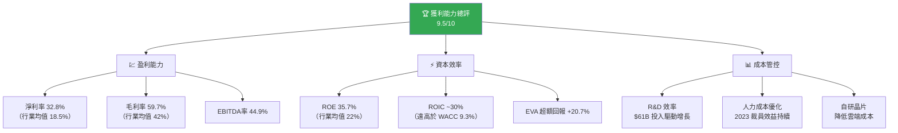

---

## 7. 估值深度分析

### 7.1 同業估值比較表格

| 估值指標 | **GOOG** | **META** | **MSFT** | **AMZN** | 行業均值 |
|---------|---------|---------|---------|---------|---------|
| **本益比（TTM）** | 28.4x 🟢 | 31.2x 🟡 | 38.5x 🔴 | 55.0x 🔴 | 38.3x |
| **本益比（Forward）** | 22.9x 🟢 | 24.0x 🟢 | 30.1x 🟡 | 37.2x 🔴 | 28.6x |
| **P/S 比** | 9.2x 🟢 | 9.8x 🟢 | 13.5x 🔴 | 3.8x 🟢 | 9.1x |
| **P/B 比** | 8.95x 🟢 | 10.8x 🟡 | 14.2x 🔴 | 12.5x 🟡 | 11.6x |
| **EV/EBITDA** | 24.3x 🟢 | 22.1x 🟢 | 28.7x 🟡 | 38.0x 🔴 | 28.3x |
| **EV/Revenue** | 9.1x 🟢 | 9.4x 🟢 | 14.0x 🔴 | 3.9x 🟢 | 9.1x |
| **FCF Yield** | 1.97% 🟡 | 3.1% 🟢 | 2.2% 🟡 | 2.8% 🟢 | 2.5% |
| **EPS 成長（YoY）** | +31.1% 🟢 | +25.0% 🟢 | +18.0% 🟡 | +45.0% 🟢 | +27.0% |
| **收入成長（YoY）** | +18.0% 🟢 | +22.0% 🟢 | +15.0% 🟡 | +11.0% 🟡 | +16.5% |
| **淨利率** | 32.8% 🟢 | 38.5% 🟢 | 36.1% 🟢 | 7.8% 🔴 | 28.8% |

> **同業比較結論**：GOOG 在核心廣告及 AI 同儕中，估值最為合理（P/E 最低之一），且 EPS 成長率高達 31.1%，隱含 PEG 比率約 0.74x（遠低於 1.0x 的公平價值門檻），具備顯著的估值吸引力。

### 7.2 歷史估值區間分析

```
╔══════════════════════════════════════════════════════════════╗
║              歷史 P/E 估值區間分析（近5年）                 ║
╠══════════════════════════════════════════════════════════════╣
║                                                              ║
║  高估區    >35x  ████████████████████████████ 泡沫風險      ║
║  合理偏高  30-35x ████████████████████         注意風險     ║
║  → 當前   28.4x ████████████████              🟡 合理偏低  ║
║  合理      25-30x ███████████████              舒適區間     ║
║  低估偏低  20-25x █████████████                買入機會     ║
║  低估區    <20x  ██████████                   強力買入      ║
║                                                              ║
║  5年歷史 P/E 區間：                                         ║
║  ├─ 高點：~38x（2021年成長股泡沫）                          ║
║  ├─ 均值：~27x                                              ║
║  ├─ 低點：~18x（2022年熊市底部）                            ║
║  └─ 當前：28.4x → 略高於歷史均值，但成長加速可合理化        ║
║                                                              ║
║  Forward P/E 22.9x：低於歷史均值，具投資吸引力 🟢           ║
╚══════════════════════════════════════════════════════════════╝
```

### 7.3 DCF 敏感性分析（目標價矩陣）

**基本假設框架**：
- 基準情境：未來5年收入年化成長率 13-15%，Terminal Growth 4.0%
- 樂觀情境：AI 變現加速，收入年化成長率 18-20%，Terminal Growth 5.0%
- 悲觀情境：反壟斷衝擊 + 競爭加劇，收入年化成長率 8-10%，Terminal Growth 3.0%

| **DCF 目標價矩陣** | WACC = 8.5% | WACC = 9.3%（基準）| WACC = 10.5% |
|-----------------|------------|-----------------|------------|
| **樂觀（18-20% 成長）** | 🟢 $485 | 🟢 $420 | 🟡 $365 |
| **基準（13-15% 成長）** | 🟢 $415 | 🟢 $365 | 🟡 $310 |
| **悲觀（8-10% 成長）** | 🟡 $325 | 🟡 $285 | 🔴 $240 |

> **當前股價 $307.40** 在基準情境下，即便 WACC 高達 10.5% 也接近目標，在基準 WACC 9.3% 下，上行空間 +18.7%（目標 $365），支持強力買入評級。

### 7.4 估值區間視覺化

```
  估值區間視覺化（基準 WACC，不同成長假設）
  
  $500 ─────────────────────────────────────── 樂觀上限
       ████████████████████████████ $485（樂觀/低折現）
  $450 ────────────────────────────────────────
       ████████████████████████ $420（樂觀/基準WACC）
  $400 ────────────────────────────────────────
       ████████████████████ $365（基準目標價）◄ 分析師均值 $359
  $350 ────────────────────────────────────────
       █████████████ $310（基準/高折現）
  $300 ──── ★ 當前股價 $307.40 ─────────────────
       ████████ $285（悲觀/基準WACC）
  $250 ────────────────────────────────────────
       ████ $240（悲觀/高折現）
  $200 ─────────────────────────────────────── 悲觀下限

  ▓ 低估區（<$285）  ░ 合理區（$285-$365）  ▓ 高估區（>$420）
  ★ 當前 $307.40 落於【合理偏低區間】→ 具上行空間
```

---

## 8. 成長催化劑

### 8.1 催化劑時間軸

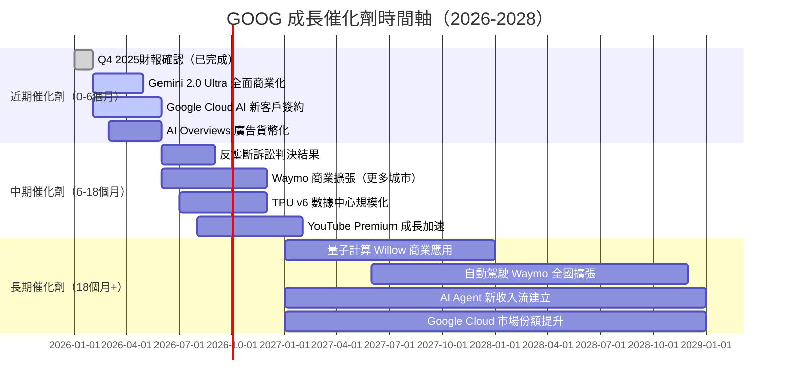

### 8.2 TAM 市場規模

```
╔══════════════════════════════════════════════════════════════╗
║         TAM 市場規模與 GOOG 當前滲透率（2025年估算）        ║
╠══════════════════════════════════════════════════════════════╣
║                                                              ║
║  全球數位廣告市場（~$740B TAM）                             ║
║  GOOG 份額：~$228B / 31%滲透率                              ║
║  ████████████░░░░░░░░░░░░░░░░░░  31%（仍有大量空間）        ║
║                                                              ║
║  全球雲端基礎設施（~$700B TAM 2025）                        ║
║  GOOG 份額：~$43B / 6%滲透率                                ║
║  ██░░░░░░░░░░░░░░░░░░░░░░░░░░░░  6%（巨大成長空間）         ║
║                                                              ║
║  全球 AI 服務市場（~$200B 2025 → $1T 2030E）                ║
║  GOOG 份額：估算 $15-20B / 8-10%                            ║
║  ██░░░░░░░░░░░░░░░░░░░░░░░░░░░░  ~10%（早期滲透）           ║
║                                                              ║
║  YouTube 短影音/串流（~$150B TAM）                          ║
║  GOOG 份額：~$36B / 24%                                     ║
║  ███████░░░░░░░░░░░░░░░░░░░░░░░  24%                        ║
╚══════════════════════════════════════════════════════════════╝
```

### 8.3 成長驅動力分析

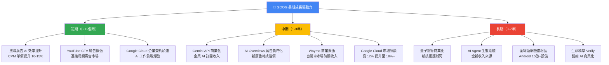

---

## 9. 風險矩陣

### 9.1 風險評分矩陣

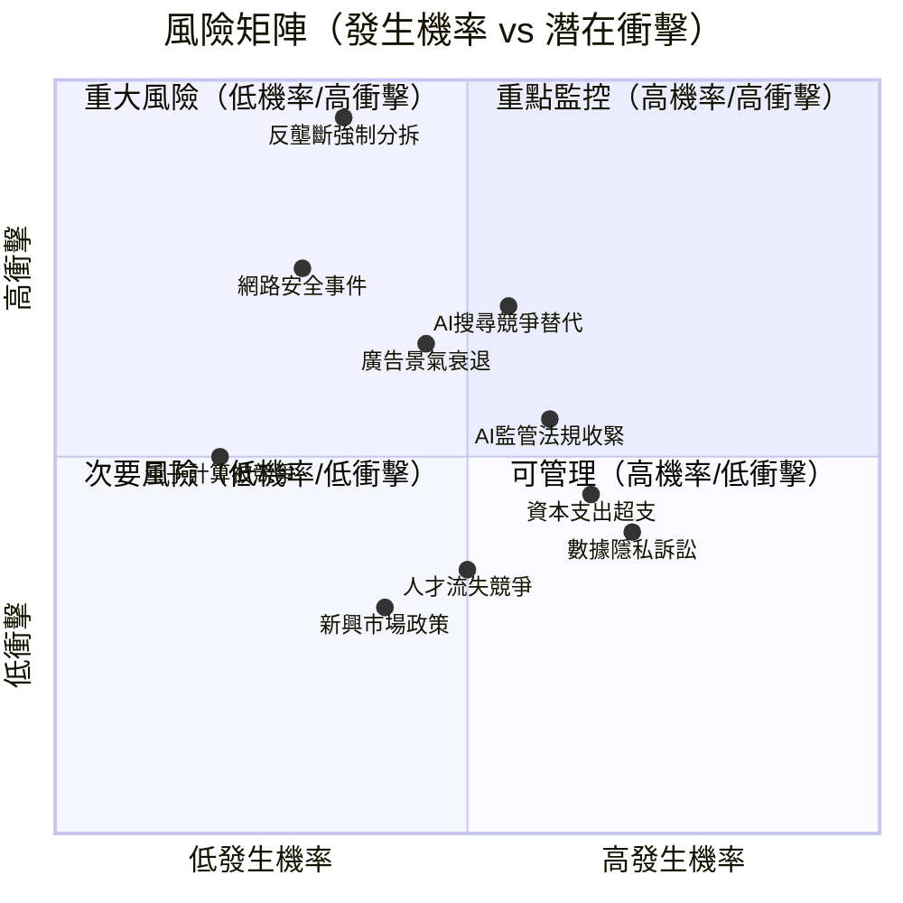

### 9.2 風險清單詳細分析

| 風險項目 | 機率 | 衝擊 | 綜合評分 | 緩解措施 | 狀態 |
|---------|------|------|---------|---------|------|
| **反壟斷強制分拆（DOJ訴訟）** | 35% | 極高 | **8.5** | 上訴策略、積極配合、業務調整預案 | 🔴 重大風險 |
| **AI 搜尋競爭侵蝕份額** | 55% | 高 | **7.5** | Gemini 深度整合、AI Overviews 差異化 | 🔴 需密切追蹤 |
| **廣告市場景氣衰退** | 45% | 高 | **7.0** | 雲端業務分散化、多元收入結構 | 🟡 中等風險 |
| **AI 法規監管收緊（EU/US）** | 60% | 中 | **6.5** | 全球合規團隊、主動參與政策制定 | 🟡 持續監控 |
| **資本支出超支/ROI 不達預期** | 65% | 中 | **6.0** | 分期投資、嚴格資本紀律審查 | 🟡 財務壓力 |
| **數據隱私訴訟/罰款** | 70% | 低中 | **5.5** | GDPR 合規強化、隱私優先架構 | 🟡 法規成本 |
| **網路安全重大事件** | 30% | 高 | **5.0** | 世界頂級安全團隊、零信任架構 | 🟡 潛在黑天鵝 |
| **人才競爭/流失（OpenAI/Meta）** | 50% | 低中 | **4.5** | 薪酬競爭力、研究文化、持股計畫 | 🟢 可管理 |
| **新興市場政策風險** | 40% | 低 | **3.5** | 本地化策略、政府關係管理 | 🟢 低衝擊 |
| **量子計算競爭追趕** | 20% | 中 | **3.0** | Willow 技術領先、持續 R&D 投入 | 🟢 暫時領先 |

---

## 10. 投資建議

### 10.1 最終綜合評級雷達圖

```
╔══════════════════════════════════════════════════════════════╗
║              📊 綜合評分雷達圖（1-10分）                    ║
╠══════════════════════════════════════════════════════════════╣
║                                                              ║
║                    基本面強度                                ║
║                    10│                                       ║
║                     9│▓▓▓▓▓▓▓▓▓  9.0                       ║
║                     8│                                       ║
║  競爭護城河          7│               成長動能               ║
║  9.5▓▓▓▓▓▓▓▓▓▓    6│         ▓▓▓▓▓▓▓▓▓  8.5               ║
║                     5│                                       ║
║                     4│                                       ║
║                     3│                                       ║
║                     2│                                       ║
║  財務健康           1│               獲利能力                ║
║  8.0▓▓▓▓▓▓▓▓░░    0│         ▓▓▓▓▓▓▓▓▓▓  9.5              ║
║                       \  估值合理性  /                       ║
║                        ▓▓▓▓▓▓▓▓  8.0                       ║
║                                                              ║
║  各維度評分總覽：                                           ║
║  基本面強度   ▓▓▓▓▓▓▓▓▓░  9.0/10  收入/利潤雙增長          ║
║  成長動能     ▓▓▓▓▓▓▓▓▓░  8.5/10  AI 雲端雙引擎            ║
║  獲利能力     ▓▓▓▓▓▓▓▓▓▓  9.5/10  淨利率歷史新高           ║
║  財務健康     ▓▓▓▓▓▓▓▓░░  8.0/10  淨現金但CapEx高          ║
║  估值合理性   ▓▓▓▓▓▓▓▓░░  8.0/10  Forward PE 22.9x        ║
║  競爭護城河   ▓▓▓▓▓▓▓▓▓▓  9.5/10  搜尋/AI/雲端三重壁壘    ║
║  管理團隊     ▓▓▓▓▓▓▓▓░░  8.0/10  Pichai 領導力穩健       ║
║  ESG 評分     ▓▓▓▓▓▓▓░░░  7.0/10  隱私/反壟斷爭議         ║
║                                                              ║
║  🏆 加權總分：88.0/100                                      ║
╚══════════════════════════════════════════════════════════════╝
```

### 10.2 目標價與隱含報酬率

| 情境 | 目標價 | 隱含報酬率 | 核心假設 |
|------|-------|---------|---------|
| 🟢 **樂觀情境** | $420 | **+36.6%** | AI 搜尋貨幣化加速、Cloud 份額快速提升至 18%、反壟斷和解有利 |
| 🟢 **基準情境** | $365 | **+18.7%** | 穩健收入成長 15%、Cloud 持續擴張、資本支出逐步收斂 |
| 🟡 **悲觀情境** | $285 | **-7.3%** | 反壟斷不利判決、AI 競爭侵蝕搜尋份額、廣告景氣放緩 |
| 📊 **分析師均值** | $359.24 | **+16.9%** | 17 位分析師共識目標（16 強力買入/買入，1 中性）|

```
  目標價區間視覺化
  
  $240 ──── 極端悲觀下限
  $285 ──── 悲觀目標  ↑-7.3%
  $307 ★── 當前股價 $307.40
  $359 ──── 分析師均值 +16.9%
  $365 ──── 基準目標  ↑+18.7%  ←建議目標
  $420 ──── 樂觀目標  ↑+36.6%
  $485 ──── 超樂觀上限（低折現率情境）
```

### 10.3 買入時機與觸發因素

```
╔══════════════════════════════════════════════════════════════╗
║              ✅ 買入觸發因素 Checklist                      ║
╠══════════════════════════════════════════════════════════════╣
║                                                              ║
║  立即買入信號：                                             ║
║  ☑ Forward P/E < 25x（當前 22.9x ✓）                      ║
║  ☑ EPS 成長 > 25%（當前 31.1% ✓）                         ║
║  ☑ Google Cloud 季度成長維持 > 25%                          ║
║  ☑ 分析師目標均值 > 當前價格 +15%（+16.9% ✓）             ║
║  ☑ 淨現金部位為正（$59.85B ✓）                            ║
║                                                              ║
║  加碼時機（等待以下訊號）：                                 ║
║  ☐ 股價回檔至 $280-290（悲觀目標附近，提供更佳安全邊際）   ║
║  ☐ Q1 2026 財報優於預期（EPS > $3.20 預估）               ║
║  ☐ Google Cloud 增速加速至 > 30%                            ║
║  ☐ 反壟斷訴訟有利進展/和解                                 ║
║  ☐ AI Overviews 廣告收入具體披露                           ║
║                                                              ║
║  減碼/停損訊號：                                            ║
║  ☐ 反壟斷強制分拆令（搜尋引擎或 Chrome/Android）          ║
║  ☐ 搜尋市場份額跌破 85%                                    ║
║  ☐ 連續兩季 EPS 低於預期                                   ║
║  ☐ 資本支出超過收入 30%                                    ║
║  ☐ Google Cloud 成長放緩至 < 15%                           ║
╚══════════════════════════════════════════════════════════════╝
```

### 10.4 投資人適配度

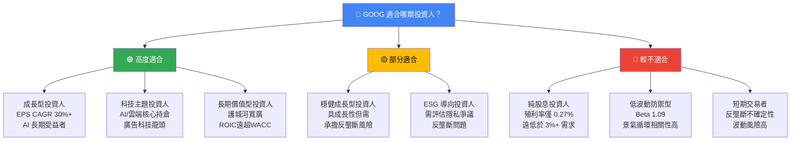

### 10.5 關鍵監控指標 Checklist

```
╔══════════════════════════════════════════════════════════════════╗
║              📋 關鍵監控指標（下次財報前後必追蹤）            ║
╠══════════════════════════════════════════════════════════════════╣
║                                                                  ║
║  📅 財報相關（Q1 2026，預估 2026-04-29）                       ║
║  ☐ 總收入：預期 ~$118-120B（YoY +15%+）                       ║
║  ☐ Google Cloud 收入：預期 > $13B（YoY +28%+）               ║
║  ☐ 營業利益率：維持 > 31%                                      ║
║  ☐ EPS：預期 $2.90-3.10（Forward EPS $13.42/4 = $3.35）       ║
║  ☐ 資本支出：關注是否按計劃控制                                ║
║                                                                  ║
║  🏛️ 法律監管（持續追蹤）                                       ║
║  ☐ DOJ 反壟斷案補救措施最終裁定（2026年中預期）               ║
║  ☐ 歐盟 DMA 合規執行進度                                       ║
║  ☐ 廣告技術反壟斷訴訟進展                                      ║
║                                                                  ║
║  🤖 AI 競爭動態                                                 ║
║  ☐ 全球搜尋市場份額（StatCounter 月度數據）                    ║
║  ☐ OpenAI/Anthropic 搜尋功能進展                               ║
║  ☐ Gemini API 開發者採用數據                                   ║
║  ☐ Google Cloud AI 客戶數與ARR增長                             ║
║                                                                  ║
║  📊 產業數據                                                    ║
║  ☐ 全球數位廣告支出趨勢（eMarketer 季度報告）                 ║
║  ☐ 企業 IT 支出及雲端遷移速度                                  ║
║  ☐ YouTube 月活躍用戶數及互動率                                ║
║  ☐ 宏觀經濟：GDP、企業廣告預算景氣指標                        ║
║                                                                  ║
║  💹 技術面觸發點                                                ║
║  ☐ 突破 $350 → 確認上升趨勢，加碼信號                         ║
║  ☐ 跌破 $280 → 檢視基本面，考慮加碼或止損                     ║
╚══════════════════════════════════════════════════════════════════╝
```

### 10.6 最終投資觀點總結

```
╔══════════════════════════════════════════════════════════════════╗
║                    🏆 GOOG 最終投資