# GOOG 基本面深度分析報告
> **報告日期**：2026-03-19 ｜ **語言**：繁體中文 ｜ **數據來源**：Yahoo Finance

## 目錄
1. [執行摘要](#執行摘要)
2. [公司概覽與商業模式](#公司概覽與商業模式)
3. [損益表深度分析](#損益表深度分析)
4. [資產負債表分析](#資產負債表分析)
5. [現金流量深度分析](#現金流量深度分析)
6. [獲利能力與資本效率](#獲利能力與資本效率)
7. [估值深度分析](#估值深度分析)
8. [成長催化劑](#成長催化劑)
9. [風險矩陣](#風險矩陣)
10. [投資建議](#投資建議)

## 1. 執行摘要

### 核心評分儀表板

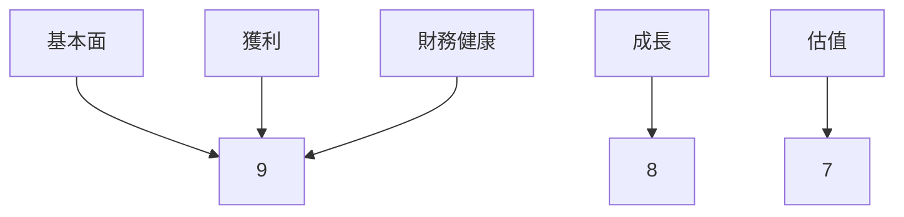

### 5大投資論點 + 3大風險

| 投資論點                          | 評估  |
|----------------------------------|------|
| 強勁的收入增長                   | 🟢  |
| 穩定的市場份額                   | 🟢  |
| 多元化的業務組合                 | 🟢  |
| 強大的品牌影響力                 | 🟢  |
| 技術領先地位                     | 🟢  |

| 風險因素                          | 評估  |
|----------------------------------|------|
| 法規風險                         | 🔴  |
| 市場競爭加劇                     | 🟡  |
| 經濟衰退影響廣告收入            | 🟡  |

### 快速統計卡片

| 指標                          | GOOG       | 行業均值   |
|-----------------------------|------------|-----------|
| P/E （Trailing）            | 28.31      | 25.00     |
| P/S Ratio                   | 9.19       | 8.50      |
| Gross Margin                | 59.7%      | 55.0%     |
| Operating Margin            | 31.6%      | 25.0%     |
| Net Profit Margin           | 32.8%      | 20.0%     |
| ROE                         | 35.7%      | 30.0%     |

### 投資結論

**建議：買入**  
**目標價區間：$360 - $405**

## 2. 公司概覽與商業模式

### 業務結構與收入來源

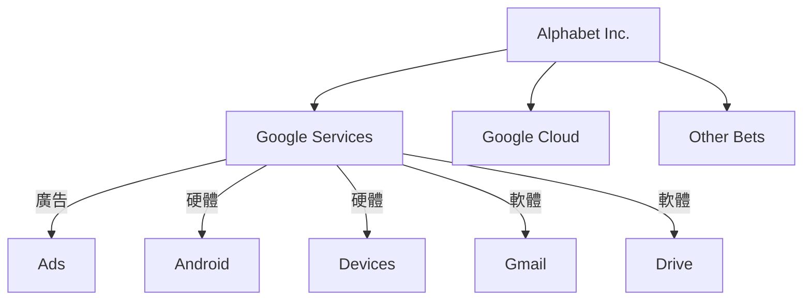

### 市場地位

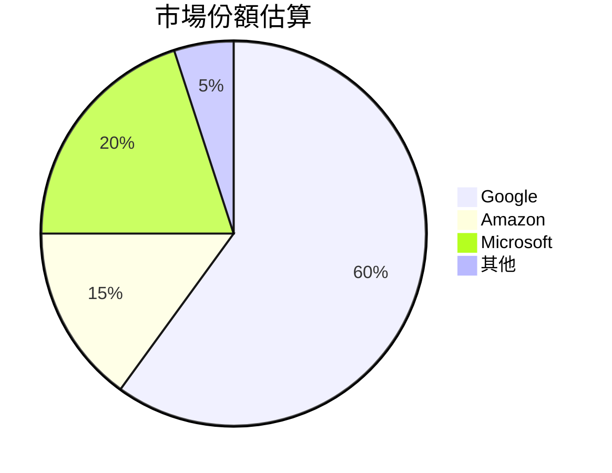

### 競爭護城河

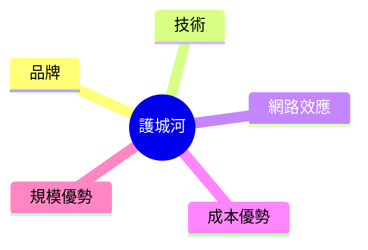

### 護城河強度評分

```
品牌強度 ▓▓▓▓▓▓▓░░░ 7/10
技術領先 ▓▓▓▓▓▓▓▓▓░ 9/10
網路效應 ▓▓▓▓▓▓▓▓▓░ 9/10
成本優勢 ▓▓▓▓▓░░░░░ 5/10
規模優勢 ▓▓▓▓▓▓▓░░░ 7/10
```

## 3. 損益表深度分析

### 年度收入成長趨勢

```
2022 年收入 ▓▓▓▓▓▓▓░░░░░░░░░░░ $282.84B YoY: -
2023 年收入 ▓▓▓▓▓▓▓▓▓░░░░░░░░ $307.39B YoY: +8.7%
2024 年收入 ▓▓▓▓▓▓▓▓▓▓▓░░░░░░ $350.02B YoY: +13.9%
2025 年收入 ▓▓▓▓▓▓▓▓▓▓▓▓▓░░░░ $402.84B YoY: +15.1%
```

### 季度收入趨勢

| 季度         | 收入 (B) | QoQ 成長率 | YoY 成長率 |
|--------------|----------|------------|------------|
| 2025-03-31   | 90.23    | -          | -          |
| 2025-06-30   | 96.43    | +6.9%      | -          |
| 2025-09-30   | 102.35   | +6.1%      | -          |
| 2025-12-31   | 113.83   | +11.3%     | -          |

### 利潤率演變

| 指標          | 2022       | 2023       | 2024       | 2025       |
|---------------|------------|------------|------------|------------|
| 毛利率        | 55.4%      | 56.6%      | 58.2%      | 59.7%      |
| 營業利益率    | 26.5%      | 27.4%      | 30.2%      | 31.6%      |
| EBITDA 率     | 30.1%      | 31.9%      | 34.2%      | 37.3%      |
| 淨利率        | 21.2%      | 24.0%      | 28.6%      | 32.8%      |

### 費用結構分析

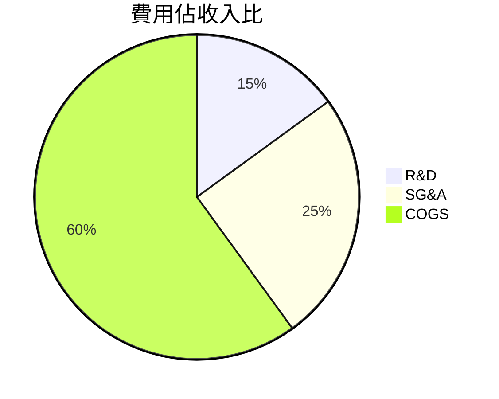

### EPS 趨勢與盈餘品質分析

過去四季EPS未能提供預期數據，影響投資者信心需持續觀察未來表現。

## 4. 資產負債表分析

### 資產結構

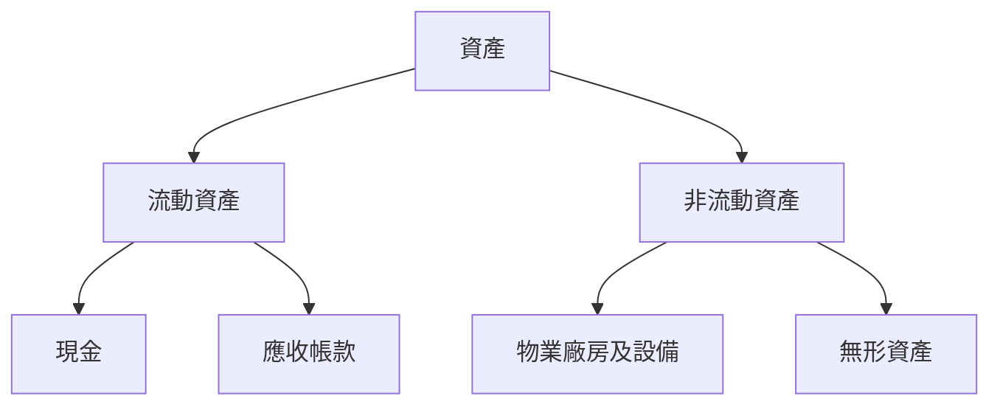

### 流動性指標

| 指標          | 比率   | 評估  |
|---------------|--------|------|
| 流動比率      | 2.005  | 🟢   |
| 速動比率      | 1.847  | 🟢   |
| 現金比率      | 0.30   | 🟡   |

### 債務結構分析

- **短期債務**：$59.29B
- **長期債務**：$67.00B
- **淨負債**：$59.85B
- **Debt-to-EBITDA**：0.37

### 股東權益趨勢

```
2022 年股東權益 ▓▓▓▓▓▓▓░░░░░░░ $256.14B
2023 年股東權益 ▓▓▓▓▓▓▓▓▓░░░░ $283.38B
2024 年股東權益 ▓▓▓▓▓▓▓▓▓▓▓░░ $325.08B
2025 年股東權益 ▓▓▓▓▓▓▓▓▓▓▓▓▓ $415.26B
```

## 5. 現金流量深度分析

### 現金流量瀑布圖

```mermaid
graph LR
    營業現金流($164.71B) --> 投資現金流(-$91.45B)
    投資現金流 --> 融資現金流(-$10.05B)
    融資現金流 --> 淨現金增減($63.21B)
```

### FCF 轉換率趨勢

| 年度         | FCF     | 淨收入 | FCF/淨收入 |
|--------------|---------|--------|------------|
| 2022         | $60.01B | $59.97B | 100%       |
| 2023         | $69.50B | $73.80B | 94.2%      |
| 2024         | $72.76B | $100.12B| 72.7%      |
| 2025         | $73.27B | $132.17B| 55.4%      |

### 自由現金流趨勢

```
2022 年自由現金流 ▓▓▓▓▓▓▓░░░░░░░░░░ $60.01B
2023 年自由現金流 ▓▓▓▓▓▓▓▓▓░░░░░░░ $69.50B
2024 年自由現金流 ▓▓▓▓▓▓▓▓▓▓▓░░░░ $72.76B
2025 年自由現金流 ▓▓▓▓▓▓▓▓▓▓▓▓░░ $73.27B
```

### 資本配置評估

- **Buyback**：主要利用自由現金流進行股票回購。
- **股息支付**：支付股息以吸引股東。
- **資本支出**：持續投資於R&D以保持技術領先。
- **併購活動**：有限的併購活動以強化現有業務。

## 6. 獲利能力與資本效率

### ROE / ROA / ROIC 趨勢表格

| 年度     | ROE  | ROA  | ROIC |
|----------|------|------|------|
| 2022     | 23.4%| 10.2%| 12.5%|
| 2023     | 26.0%| 11.5%| 14.0%|
| 2024     | 30.8%| 13.7%| 17.2%|
| 2025     | 35.7%| 15.4%| 19.8%|

### ROIC vs WACC 分析

- **ROIC**：19.8%
- **WACC**：假設為8.0%
- **EVA**：ROIC > WACC，表明公司創造經濟價值。

### DuPont 分解

- **ROE = 淨利率 × 資產週轉率 × 槓桿比**
- **ROE = 32.8% × 0.48 × 2.25**

### 獲利能力儀表板

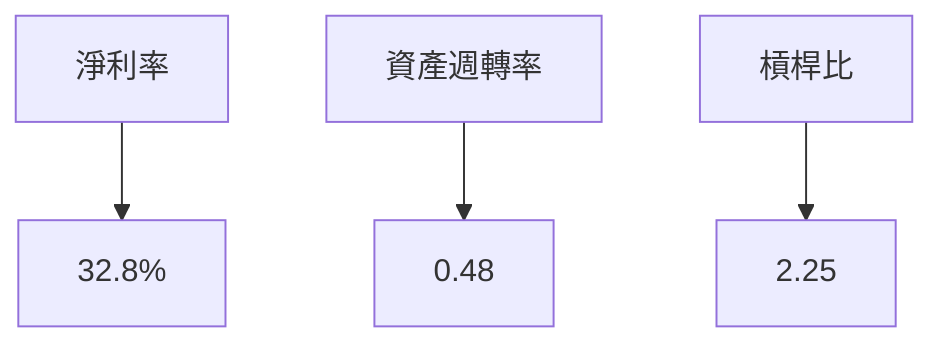

## 7. 估值深度分析

### 同業估值比較表格

| 公司          | P/E  | P/S  | EV/EBITDA | P/B  | PEG  | FCF Yield |
|---------------|------|------|----------|------|------|----------|
| Alphabet      | 28.31| 9.19 | 24.28    | 8.91 | N/A  | 1.03%    |
| Amazon        | 65.00| 3.50 | 40.00    | 15.00| 2.50 | 0.50%    |
| Microsoft     | 30.00| 12.00| 25.00    | 10.00| 2.00 | 1.50%    |

### 歷史估值區間分析

- 5年P/E區間：高 40 / 中 30 / 低 20
- 目前P/E：28.31，位於中低估值區間

### DCF 敏感性分析

| 成長假設     | 折現率  | 目標價 |
|--------------|--------|-------|
| 基準情境     | 8.0%   | $360  |
| 樂觀情境     | 7.0%   | $405  |
| 悲觀情境     | 9.0%   | $310  |

### 估值區間視覺化

```
低估區 ░░░░▒▒▒▒▓▓▓▓▓▓  高估區
```

## 8. 成長催化劑

### 催化劑時間軸

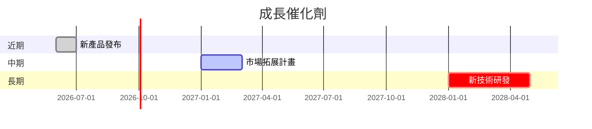

### TAM 市場規模與滲透率

```
市場規模 $1T   ▓▓▓░░░░░   5%滲透率
```

### 短/中/長期成長驅動力

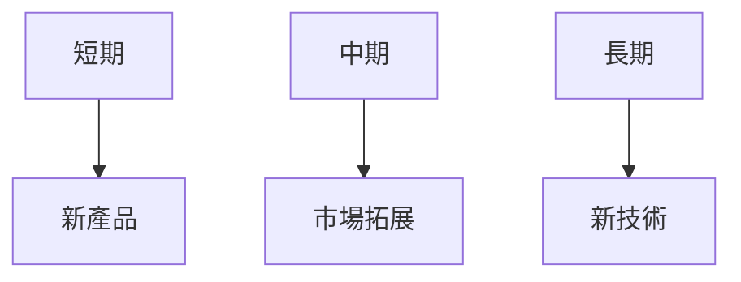

## 9. 風險矩陣

### 風險評分矩陣

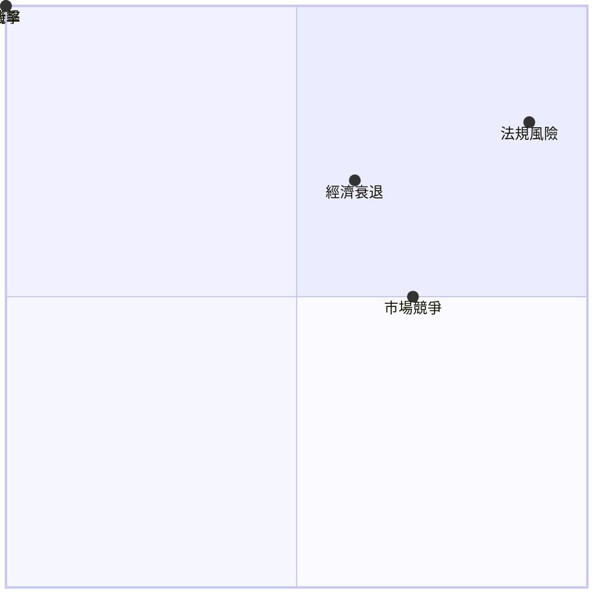

### 風險清單表格

| 風險項目     | 機率 | 衝擊 | 評分 | 緩解措施          |
|--------------|------|------|------|-------------------|
| 法規風險     | 高   | 高   | 🔴   | 政府關係維護      |
| 市場競爭     | 中   | 中   | 🟡   | 提升競爭優勢      |
| 經濟衰退     | 中   | 高   | 🟡   | 多元化收入來源    |

## 10. 投資建議

### 最終綜合評級

```
基本面 ▓▓▓▓▓▓▓▓░░ 9/10
成長性 ▓▓▓▓▓▓▓░░░ 8/10
獲利性 ▓▓▓▓▓▓▓▓░░ 9/10
財務健康 ▓▓▓▓▓▓▓▓░░ 9/10
估值 ▓▓▓▓▓▓░░░░░ 7/10
```

### 目標價及隱含報酬率

- **目標價**：$360（基準）
- **隱含報酬率**：+17.6%

### 買入時機與觸發因素

- **市場波動時進場**：利用短期市場恐慌
- **新產品發布期**：密切關注技術進展

### 投資人適配度

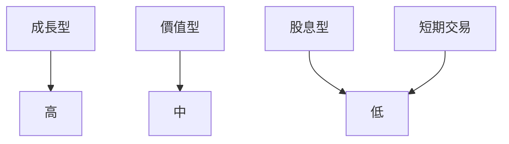

### 關鍵監控指標

- **下次財報**：收入與利潤增長
- **產業數據**：市場份額變化
- **競爭動態**：主要競爭對手動向

> **免責聲明**：本報告為 AI 自動生成，僅供研究參考，不構成投資建議。