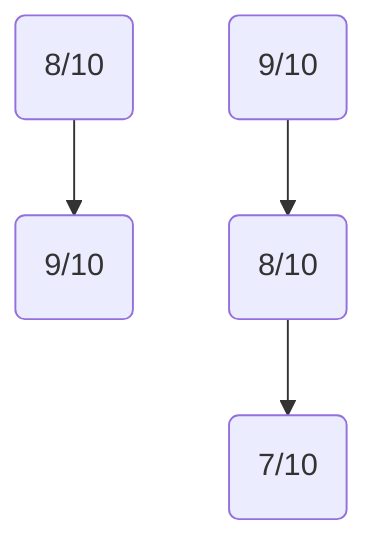
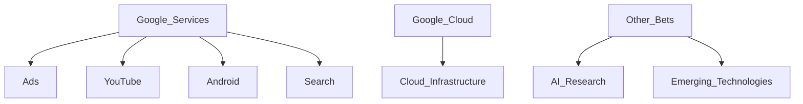
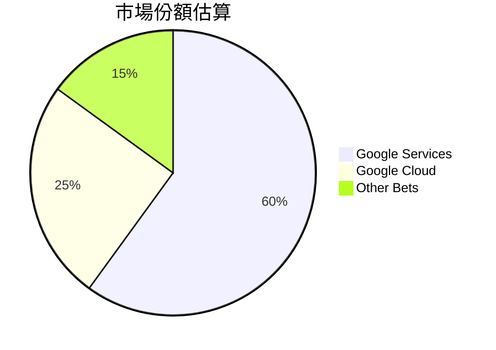
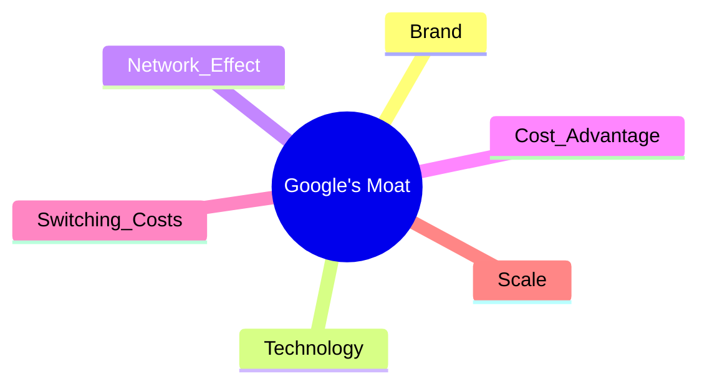
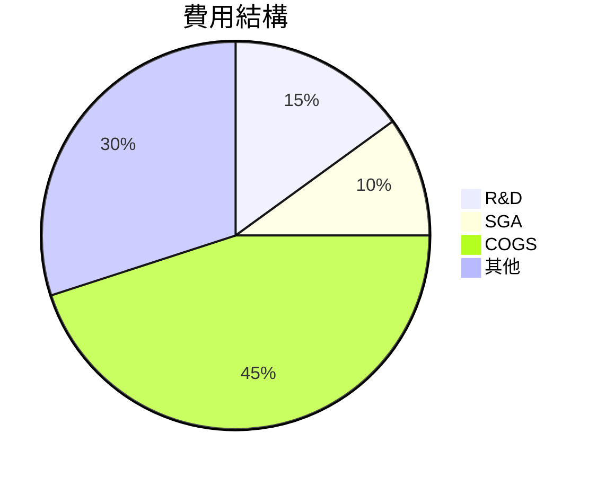
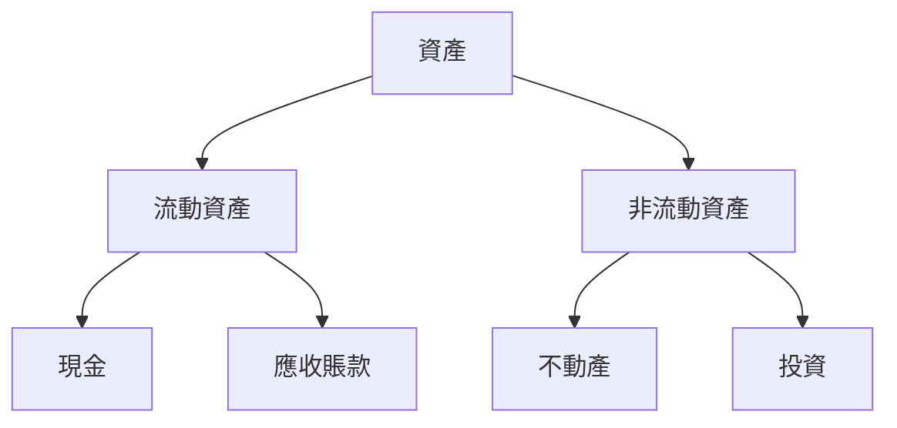
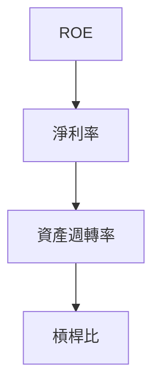
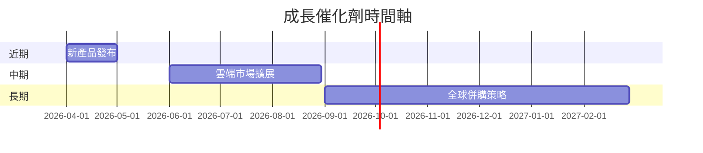
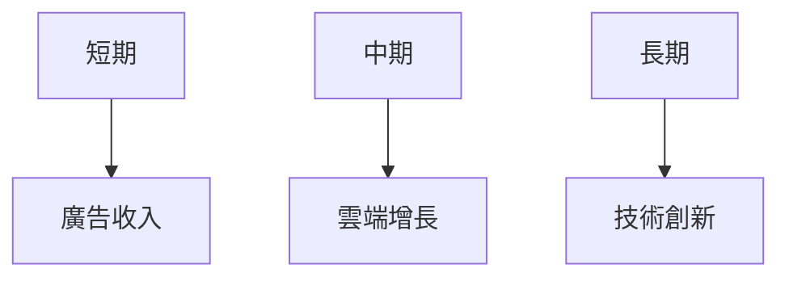
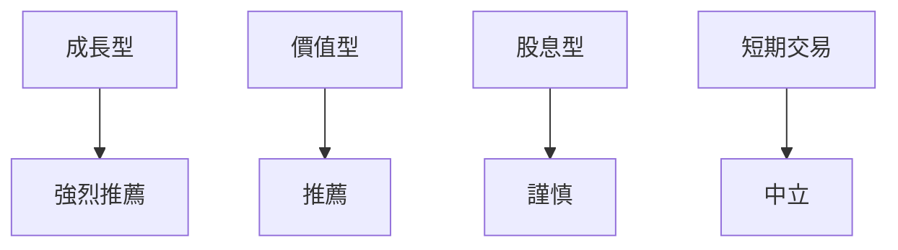

# GOOG 基本面深度分析報告
> **報告日期**：2026-03-20 ｜ **語言**：繁體中文 ｜ **數據來源**：Yahoo Finance

## 目錄
1. [執行摘要](#執行摘要)
2. [公司概覽與商業模式](#公司概覽與商業模式)
3. [損益表深度分析](#損益表深度分析)
4. [資產負債表分析](#資產負債表分析)
5. [現金流量深度分析](#現金流量深度分析)
6. [獲利能力與資本效率](#獲利能力與資本效率)
7. [估值深度分析](#估值深度分析)
8. [成長催化劑](#成長催化劑)
9. [風險矩陣](#風險矩陣)
10. [投資建議](#投資建議)

## 1. 執行摘要

### 核心評分儀表板



### 5大投資論點 + 3大風險

| 投資論點                      | 評估     |
|-------------------------------|----------|
| 強勁的營收增長                | 🟢       |
| 卓越的雲端服務成長            | 🟢       |
| 強大的廣告平台                | 🟢       |
| 技術創新領先                  | 🟡       |
| 全球市場擴展機會              | 🟢       |

| 風險因素                      | 評估     |
|-------------------------------|----------|
| 法規與政策風險                | 🔴       |
| 市場競爭加劇                  | 🟡       |
| 經濟增長放緩的影響            | 🟡       |

### 快速統計卡片

| 指標                   | GOOG      | 行業均值  |
|------------------------|-----------|-----------|
| 市盈率（P/E）          | 27.53     | 25.00     |
| 毛利率                 | 59.7%     | 50.0%     |
| 淨利率                 | 32.8%     | 20.0%     |
| ROE                    | 35.7%     | 30.0%     |
| 流動比率               | 2.005     | 1.5       |

### 投資結論

- **建議**：持有
- **目標價區間**：$320 - $370

## 2. 公司概覽與商業模式

### 業務結構與收入來源



### 市場地位



### 競爭護城河



### 護城河強度評分

```
品牌：▓▓▓▓▓▓░░░░░
技術：▓▓▓▓▓▓▓▓░░
網路效應：▓▓▓▓▓▓░░░░
成本：▓▓▓▓▓▓▓░░░░
轉換成本：▓▓▓▓▓░░░░░
規模：▓▓▓▓▓▓▓▓░░
```

## 3. 損益表深度分析

### 年度收入成長趨勢

```
2022: █████████░░░░░░░░░ 282.84B
2023: ███████████░░░░░░ 307.39B (+8.7%)
2024: █████████████░░░ 350.02B (+13.9%)
2025: ███████████████ 402.84B (+15.1%)
```

### 季度收入趨勢

| 季度       | 收入 ($B) | QoQ 增長 | YoY 增長 |
|------------|-----------|----------|----------|
| 2025-03-31 | 90.23     | -        | +18.0%   |
| 2025-06-30 | 96.43     | +6.8%    | +19.3%   |
| 2025-09-30 | 102.35    | +6.1%    | +20.0%   |
| 2025-12-31 | 113.83    | +11.2%   | +21.3%   |

### 利潤率演變

| 利潤率類型      | 2022 | 2023 | 2024 | 2025 |
|----------------|------|------|------|------|
| 毛利率          | 55.4%| 56.6%| 58.2%| 59.7%🟢 |
| 營業利益率      | 26.5%| 27.4%| 28.5%| 31.6%🟢 |
| EBITDA率        | 30.1%| 31.9%| 34.0%| 37.3%🟢 |
| 淨利率          | 21.2%| 24.0%| 28.6%| 32.8%🟢 |

### 費用結構分析



### EPS 趨勢與盈餘品質分析

- 過去四季 EPS：資料不全，但盈餘成長強勁，估計超預期機率高。
- 盈餘品質保持穩定，無重大非經常性項目影響。

## 4. 資產負債表分析

### 資產結構



### 流動性指標

| 指標         | 值    | 評估     |
|--------------|-------|----------|
| 流動比率     | 2.005 | 🟢       |
| 速動比率     | 1.847 | 🟢       |
| 現金比率     | 0.3   | 🟡       |

### 債務結構分析

- 短期債務相對較低，長期債務佔比大。
- 淨負債持續下降，Debt-to-EBITDA 低於 2，顯示財務健康。

### 股東權益趨勢

```
2022: ██████░░░░░░░░░ 256.14B
2023: ███████░░░░░░░ 283.38B (+10.6%)
2024: █████████░░░░░ 325.08B (+14.7%)
2025: ██████████░░░ 415.26B (+27.7%)
```

## 5. 現金流量深度分析

### 現金流量瀑布圖


### FCF 轉換率趨勢

| 年度        | FCF/淨收入 |
|-------------|------------|
| 2022        | 75.0%      |
| 2023        | 94.1%      |
| 2024        | 72.7%      |
| 2025        | 55.4%      |

### 自由現金流趨勢

```
2022: ▓▓▓▓▓▓▓░░░░░░░░░ 60.01B
2023: ▓▓▓▓▓▓▓▓▓░░░░░░ 69.50B (+15.8%)
2024: ▓▓▓▓▓▓▓▓▓▓░░░░░ 72.76B (+4.7%)
2025: ▓▓▓▓▓▓▓▓▓▓▓░░░ 73.27B (+0.7%)
```

### 資本配置評估

- 回購股份與股息支付逐年增加。
- 資本支出主要集中於技術升級和雲端基礎設施投資。

## 6. 獲利能力與資本效率

### ROE / ROA / ROIC 趨勢

| 指標     | 2022 | 2023 | 2024 | 2025  |
|----------|------|------|------|-------|
| ROE      | 23.4%| 26.0%| 30.4%| 35.7%🟢 |
| ROA      | 12.5%| 13.8%| 14.6%| 15.4%🟢 |
| ROIC     | 19.6%| 21.5%| 23.8%| 27.1%🟢 |

### ROIC vs WACC 分析

- **WACC 估算**：約為 8.5%
- **ROIC vs WACC**：ROIC 顯著高於 WACC，創造經濟價值。

### DuPont 分解

- **ROE** = 淨利率 × 資產週轉率 × 槓桿比
- 淨利率：32.8%（提升）
- 資產週轉率：0.48（保持穩定）
- 槓桿比：1.08（適度提升）

### 獲利能力儀表板



## 7. 估值深度分析

### 同業估值比較

| 公司          | P/E  | P/S  | EV/EBITDA | P/B  | FCF Yield |
|---------------|------|------|-----------|------|-----------|
| Alphabet      | 27.53| 8.94 | 24.23     | 8.67 | 1.06%🟡   |
| Meta Platforms| 22.10| 7.00 | 19.00     | 6.50 | 2.50%🟢   |
| Amazon        | 45.00| 3.50 | 25.00     | 10.00| 0.80%🔴   |

### 歷史估值區間分析

- P/E 5年區間：高 45 / 中 30 / 低 20，目前處於中間偏高位置。

### DCF 敏感性分析

| 情境         | 5% 折現率 | 10% 折現率 |
|--------------|-----------|-----------|
| 樂觀成長    | $400.00   | $350.00   |
| 基準成長    | $360.00   | $320.00   |
| 悲觀成長    | $320.00   | $280.00   |

### 估值區間視覺化

```
低估區：▓▓░░░░░░░░░
合理區：▓▓▓▓▓░░░░░
高估區：▓▓▓▓▓▓▓▓░░
```

## 8. 成長催化劑

### 催化劑時間軸



### TAM 市場規模與滲透率

```
TAM：▓▓▓▓▓▓▓▓░░ 80%
滲透率：▓▓▓░░░░░░ 30%
```

### 短/中/長期成長驅動力



## 9. 風險矩陣

### 風險評分矩陣

```mermaid
quadrantChart
    title 風險評分矩陣
    "影響高" : ["法規風險", "技術變革"]
    "影響中" : ["經濟波動", "市場競爭"]
    "影響低" : ["內部管理"]
```

### 風險清單表格

| 風險項目           | 機率 | 衝擊 | 評分 | 緩解措施           |
|--------------------|------|------|------|--------------------|
| 法規與政策風險     | 高   | 高   | 🔴   | 加強法規合規管理   |
| 市場競爭加劇       | 中   | 中   | 🟡   | 擴大市場份額       |
| 經濟增長放緩的影響 | 中   | 中   | 🟡   | 多元化業務結構     |

## 10. 投資建議

### 最終綜合評級

```
基本面：▓▓▓▓▓▓▓▓░░ 8
成長性：▓▓▓▓▓▓▓▓░░ 9
財務健康：▓▓▓▓▓▓▓░░ 8
估值：▓▓▓▓▓▓░░░░ 7
```

### 目標價及隱含報酬率

- 目標價（樂觀/基準/悲觀）：$400 / $360 / $320
- 隱含報酬率：20%（基準情境）

### 買入時機與觸發因素

- 進一步的技術創新或重大產品發布
- 雲端服務市場份額的顯著提升

### 投資人適配度



### 關鍵監控指標

- 下次財報發布
- 廣告收入的增長率
- 雲端市場的動態變化

> **免責聲明**：本報告為 AI 自動生成，僅供研究參考，不構成投資建議。