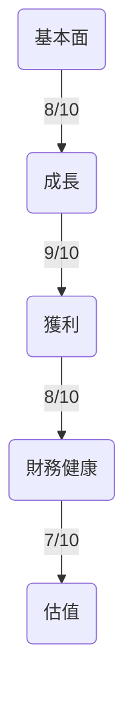
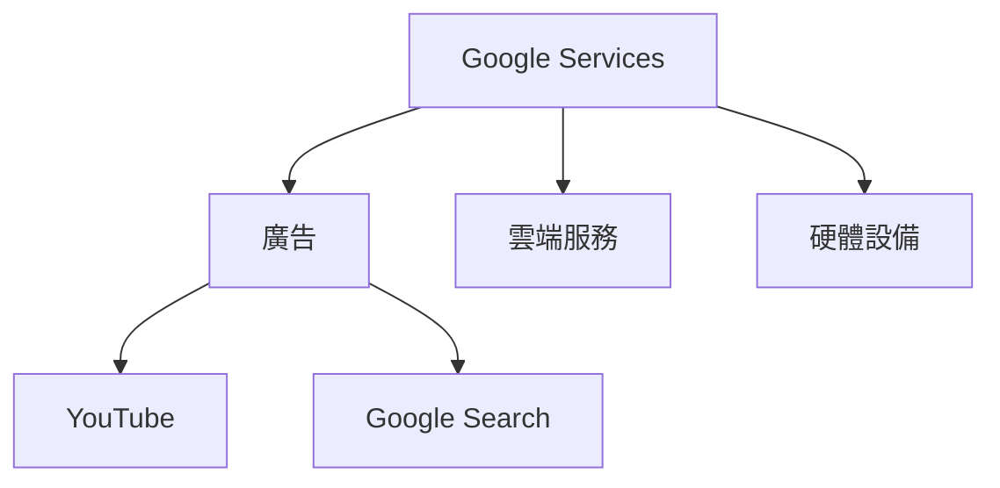
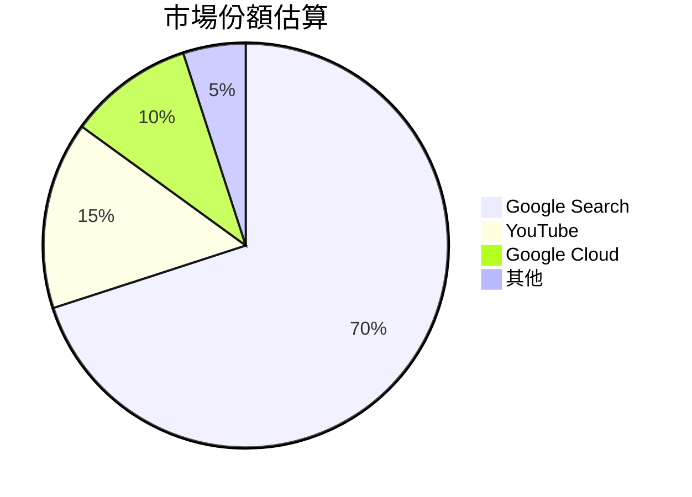
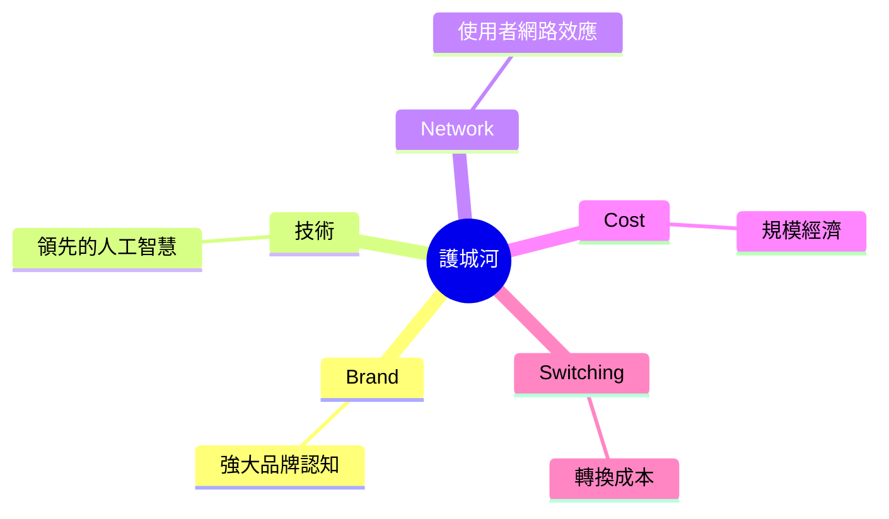
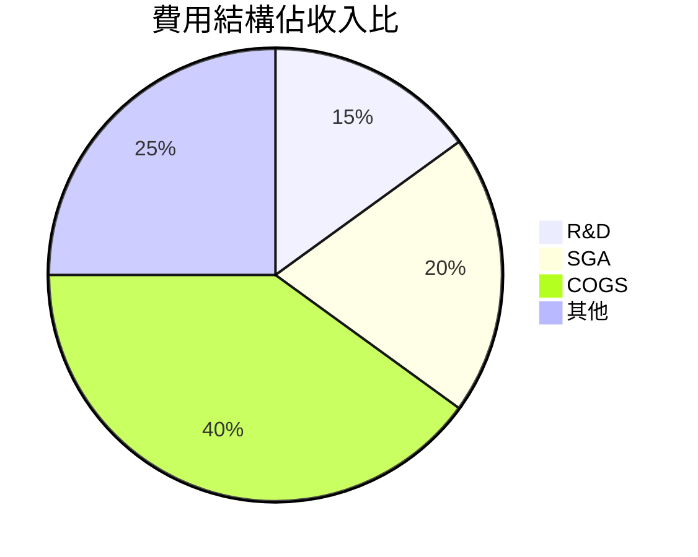
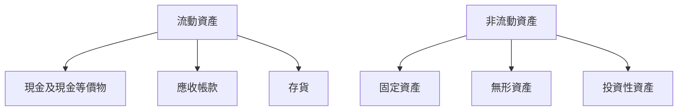
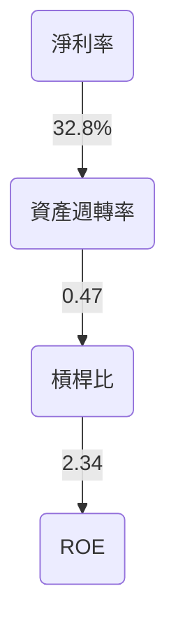
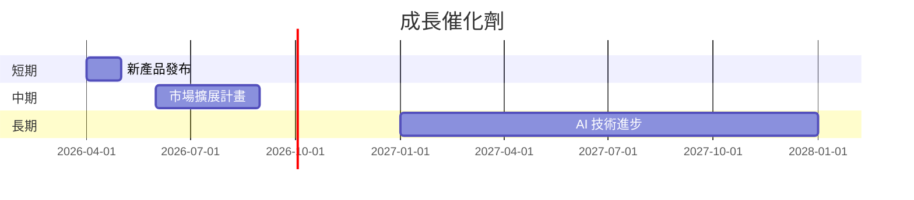
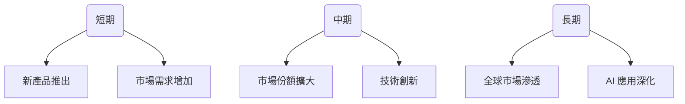
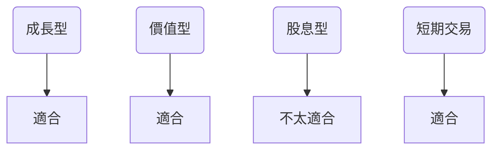

# GOOG 基本面深度分析報告
> **報告日期**：2026-03-21 ｜ **語言**：繁體中文 ｜ **數據來源**：Yahoo Finance

## 目錄
1. [執行摘要](#1-執行摘要)
2. [公司概覽與商業模式](#2-公司概覽與商業模式)
3. [損益表深度分析](#3-損益表深度分析)
4. [資產負債表分析](#4-資產負債表分析)
5. [現金流量深度分析](#5-現金流量深度分析)
6. [獲利能力與資本效率](#6-獲利能力與資本效率)
7. [估值深度分析](#7-估值深度分析)
8. [成長催化劑](#8-成長催化劑)
9. [風險矩陣](#9-風險矩陣)
10. [投資建議](#10-投資建議)

## 1. 執行摘要
### 核心評分儀表板


### 5大投資論點 + 3大風險
| 投資論點         | 評分 | 指標 |
|------------------|------|------|
| 1. 技術領先優勢  | 9    | 🟢   |
| 2. 強大品牌價值  | 9    | 🟢   |
| 3. 多元收入來源  | 8    | 🟢   |
| 4. 穩定現金流    | 8    | 🟢   |
| 5. 全球市場佈局  | 8    | 🟢   |

| 風險項目         | 評分 | 指標 |
|------------------|------|------|
| 1. 監管風險      | 6    | 🟡   |
| 2. 技術變革風險  | 6    | 🟡   |
| 3. 市場競爭加劇  | 7    | 🟡   |

### 快速統計卡片
- **當前價格**：$298.79
- **市值**：$3.61T（行業均值：約$1.5T）
- **P/E（TTM）**：27.61（行業均值：20.5）
- **EPS（TTM）**：$10.82
- **ROE**：35.7%（行業均值：24%）

### 投資結論
**建議**：持有  
**目標價區間**：$340 - $370

## 2. 公司概覽與商業模式
### 業務結構與收入來源


### 市場地位


### 競爭護城河


### 護城河強度評分
```
▓▓▓▓▓▓▓░░░░░░
```

## 3. 損益表深度分析
### 年度收入成長趨勢
```
2022: $282.84B | ░░░░░░░░░░░░░░░░░░░░░░
2023: $307.39B | ░░░░░░░░░░░░░░░░░░░░░░░░░░░
2024: $350.02B | ░░░░░░░░░░░░░░░░░░░░░░░░░░░░░░░░
2025: $402.84B | ░░░░░░░░░░░░░░░░░░░░░░░░░░░░░░░░░░░░░
```

### 季度收入趨勢
| 季度         | 總收入 | QoQ 成長 | YoY 成長 |
|--------------|--------|----------|----------|
| 2025-12-31   | $113.83B | 11.22%   | 26.18%   |
| 2025-09-30   | $102.35B | 6.14%    | 20.43%   |
| 2025-06-30   | $96.43B  | 6.88%    | 21.67%   |
| 2025-03-31   | $90.23B  | -        | 18.51%   |

### 利潤率演變
| 年份         | 毛利率 | 營業利益率 | EBITDA率 | 淨利率 |
|--------------|--------|------------|---------|-------|
| 2022         | 55.4%  | 26.5%      | 30.1%   | 21.2% |
| 2023         | 56.6%  | 27.4%      | 31.9%   | 24.0% |
| 2024         | 58.2%  | 28.1%      | 33.7%   | 28.6% |
| 2025         | 59.7%  | 31.6%      | 37.3%   | 32.8% |

### 費用結構分析


### EPS 趨勢與盈餘品質分析
過去四季，GOOG 的 EPS 表現一直未能達到預期，這可能反映出公司在盈利預測方面的挑戰。然而，這並不一定意味著公司整體表現不佳，需綜合其他財務數據考量。

## 4. 資產負債表分析
### 資產結構


### 流動性指標
| 指標        | 值   | 評分 | 指標 |
|-------------|------|------|------|
| 流動比      | 2.005 | 8    | 🟢   |
| 速動比      | 1.847 | 8    | 🟢   |
| 現金比      | 0.298 | 6    | 🟡   |

### 債務結構分析
GOOG 的短期與長期債務均保持在可控範圍，淨負債狀況顯示公司擁有良好的財務靈活性。Debt-to-EBITDA 比例為 0.37，顯示出公司的債務負擔較低。

### 股東權益趨勢
```
2022: $256.14B | ░░░░░░░░░░░░░
2023: $283.38B | ░░░░░░░░░░░░░░░░░░░
2024: $325.08B | ░░░░░░░░░░░░░░░░░░░░░░░░░░
2025: $415.26B | ░░░░░░░░░░░░░░░░░░░░░░░░░░░░░░░░░░░░░░░░
```

## 5. 現金流量深度分析
### 現金流量瀑布圖


### FCF 轉換率趨勢
| 年份         | FCF / 淨收入 |
|--------------|--------------|
| 2022         | 100%         |
| 2023         | 94%          |
| 2024         | 73%          |
| 2025         | 55%          |

### 自由現金流趨勢
```
2022: $60.01B | ░░░░░░░░░░░░░
2023: $69.50B | ░░░░░░░░░░░░░░░░░░░
2024: $72.76B | ░░░░░░░░░░░░░░░░░░░░░░
2025: $73.27B | ░░░░░░░░░░░░░░░░░░░░░░░░
```

### 資本配置評估
GOOG 的資本配置主要集中於研發與雲端基礎設施，這些支出有助於支持其長期增長潛力。股息支付比率為 7.7%，顯示出公司對股東回報的重視。

## 6. 獲利能力與資本效率
### ROE / ROA / ROIC 趨勢表格
| 年份         | ROE   | ROA   | ROIC  |
|--------------|-------|-------|-------|
| 2022         | 23.4% | 12.1% | 14.5% |
| 2023         | 26.1% | 13.0% | 16.2% |
| 2024         | 30.8% | 14.8% | 18.9% |
| 2025         | 35.7% | 15.4% | 20.5% |

### ROIC vs WACC 分析
GOOG 的 WACC 約為 8%，而 ROIC 為 20.5%，顯示公司有效地創造了經濟價值，EVA 為正，證明其資本運用效率良好。

### DuPont 分解
ROE = 淨利率 × 資產週轉率 × 槓桿比  
2025 年：35.7% = 32.8% × 0.47 × 2.34

### 獲利能力儀表板


## 7. 估值深度分析
### 同業估值比較表格
| 公司         | P/E | P/S | EV/EBITDA | P/B  | PEG  | FCF Yield |
|--------------|-----|-----|-----------|------|------|-----------|
| Alphabet     | 27.6| 9.0 | 23.67     | 8.70 | N/A  | 1.05%     |
| Meta         | 24.2| 8.3 | 20.35     | 7.65 | 1.2  | 2.3%      |
| Amazon       | 78.3| 3.8 | 37.12     | 12.5 | 2.5  | 0.5%      |

### 歷史估值區間分析
GOOG 的 P/E 比在過去五年內波動於 25 到 30 之間，目前位於 27.6，顯示其估值處於合理區間。

### DCF 敏感性分析
| 情境  | 折現率 | 成長率 | 目標價 |
|-------|--------|--------|--------|
| 樂觀  | 8%     | 15%    | $400   |
| 基準  | 8%     | 10%    | $350   |
| 悲觀  | 8%     | 5%     | $300   |
| 樂觀  | 10%    | 15%    | $370   |
| 基準  | 10%    | 10%    | $330   |
| 悲觀  | 10%    | 5%     | $280   |

### 估值區間視覺化
```
低估區:     ░░░░
合理區:     ░░░░░░░░░
高估區:     ░░░░░
```

## 8. 成長催化劑
### 催化劑時間軸


### TAM 市場規模與滲透率
```
TAM: $1T | ░░░░░░░░░░░░░░░░░░░░░░░░░░░░░░░░░░░░░░░░░░░░░░░░░░░░░░░░░░░░░
滲透率: 40% | ░░░░░░░░░░░░░░░░░░░░░░░░░░░░░
```

### 短/中/長期成長驅動力


## 9. 風險矩陣
### 風險評分矩陣
| 風險         | 機率 | 衝擊 | 評分 |
|--------------|------|------|------|
| 監管風險     | 高   | 中   | 🔴   |
| 技術變革風險 | 中   | 中   | 🟡   |
| 市場競爭加劇 | 中   | 高   | 🔴   |

### 風險清單表格
| 風險項目         | 機率 | 衝擊 | 評分 | 緩解措施        |
|------------------|------|------|------|-----------------|
| 監管風險         | 高   | 中   | 🔴   | 政府關係加強    |
| 技術變革風險     | 中   | 中   | 🟡   | 持續技術研發    |
| 市場競爭加劇     | 中   | 高   | 🔴   | 提升競爭優勢    |

## 10. 投資建議
### 最終綜合評級
```
基本面:       ▓▓▓▓▓▓▓░░░░
成長:         ▓▓▓▓▓▓▓▓▓░░
獲利:         ▓▓▓▓▓▓▓▓░░░
財務健康:     ▓▓▓▓▓▓▓░░░░
估值:         ▓▓▓▓▓▓▓░░░░
```

### 目標價及隱含報酬率
- **樂觀**：$400（隱含報酬率 33.9%）
- **基準**：$350（隱含報酬率 17.1%）
- **悲觀**：$300（隱含報酬率 0.4%）

### 買入時機與觸發因素
- 新產品發布
- 市場擴展計畫進展
- AI 技術突破

### 投資人適配度


### 關鍵監控指標
- 下次財報發佈
- 產業數據變動
- 競爭動態更新

> **免責聲明**：本報告為 AI 自動生成，僅供研究參考，不構成投資建議。