# GOOG 基本面深度分析報告
> **報告日期**：2026-03-22 ｜ **語言**：繁體中文 ｜ **數據來源**：Yahoo Finance

## 目錄
1. [執行摘要](#執行摘要)
2. [公司概覽與商業模式](#公司概覽與商業模式)
3. [損益表深度分析](#損益表深度分析)
4. [資產負債表分析](#資產負債表分析)
5. [現金流量深度分析](#現金流量深度分析)
6. [獲利能力與資本效率](#獲利能力與資本效率)
7. [估值深度分析](#估值深度分析)
8. [成長催化劑](#成長催化劑)
9. [風險矩陣](#風險矩陣)
10. [投資建議](#投資建議)

## 1. 執行摘要
### 核心評分儀表板
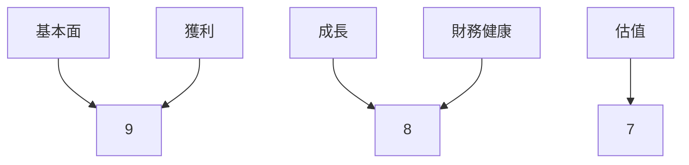
### 5大投資論點 + 3大風險
| 投資論點                      | 評分 |
|-------------------------------|------|
| 全球市場領導地位             | 🟢 9  |
| 強勁的財務表現               | 🟢 9  |
| 持續的創新能力               | 🟢 8  |
| 穩定的自由現金流生成         | 🟢 9  |
| 強大的品牌影響力             | 🟢 9  |

| 風險項目                      | 評分 |
|-------------------------------|------|
| 法規風險                     | 🔴 7  |
| 競爭加劇                     | 🟡 6  |
| 技術變革                     | 🟡 5  |

### 快速統計卡片
| 指標               | GOOG  | 行業均值 |
|--------------------|-------|----------|
| 市盈率（P/E）      | 27.61 | 25.00    |
| 市淨率（P/B）      | 8.70  | 5.00     |
| 淨利率             | 32.8% | 20.0%    |
| ROE                | 35.7% | 25.0%    |
| 自由現金流收益率  | 1.05% | 2.00%    |

### 投資結論
**建議：買入**  
目標價區間：$340 - $380

## 2. 公司概覽與商業模式
### 業務結構與收入來源
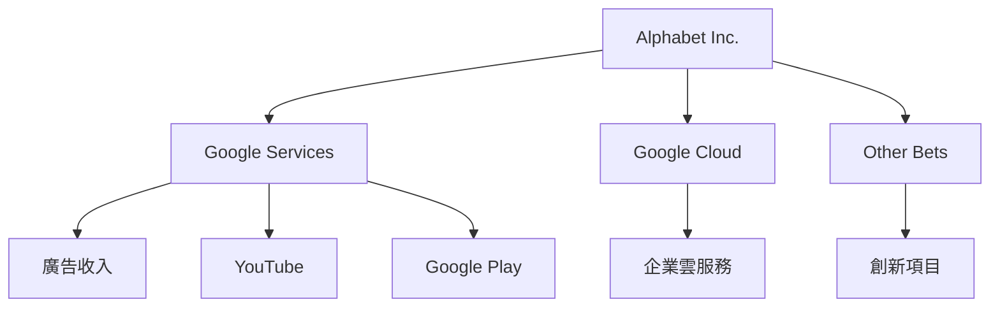
### 市場地位
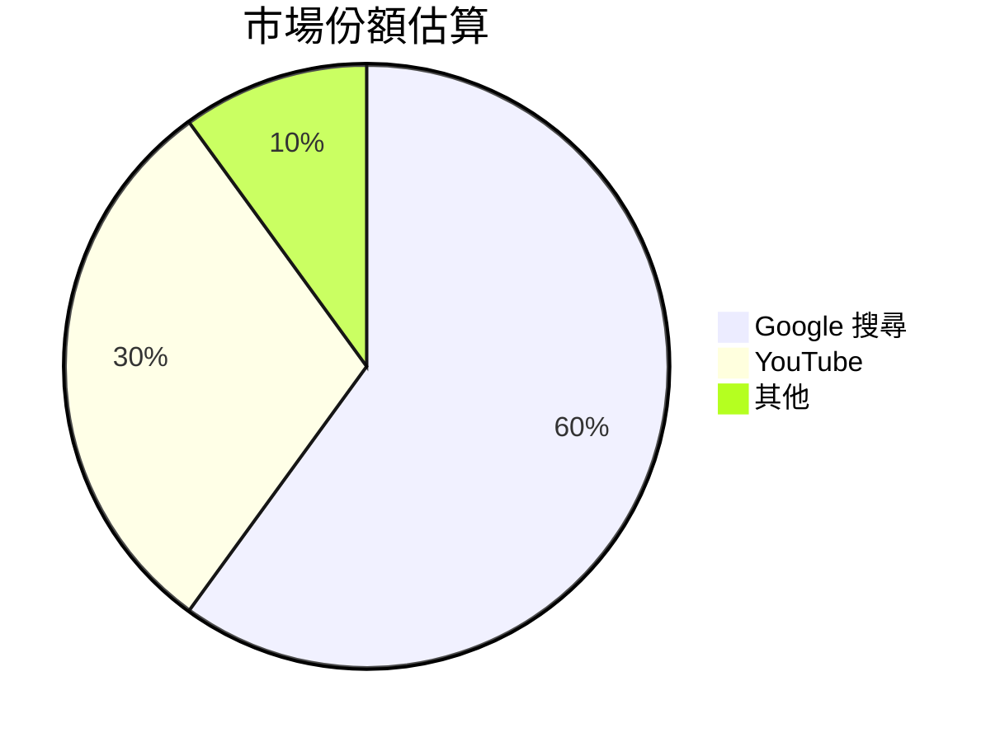
### 競爭護城河
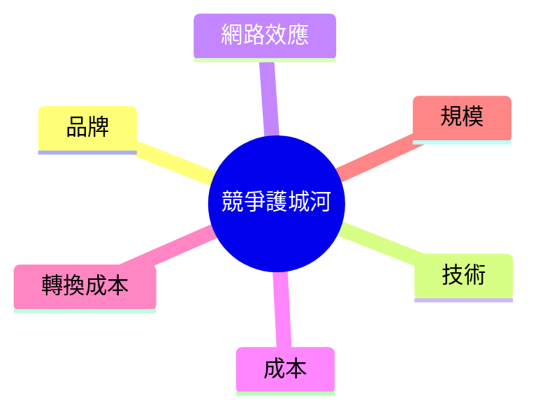
### 護城河強度評分
```
品牌影響力：▓▓▓▓▓▓▓▓▓░ 9/10
技術創新：▓▓▓▓▓▓▓▓▓░ 9/10
網路效應：▓▓▓▓▓▓▓▓░░ 8/10
成本優勢：▓▓▓▓▓▓▓░░░ 7/10
轉換成本：▓▓▓▓▓▓▓▓░░ 8/10
規模經濟：▓▓▓▓▓▓▓▓▓░ 9/10
```

## 3. 損益表深度分析
### 年度收入成長趨勢
```
2022: $282.84B █████░░░░░░
2023: $307.39B ██████░░░░░
2024: $350.02B ███████░░░░
2025: $402.84B █████████░░
```
- **YoY 成長率**：
  - 2023: +8.7%
  - 2024: +13.9%
  - 2025: +15.1%

### 季度收入趨勢
| 季度       | 總收入   | QoQ 成長率 | YoY 成長率 |
|------------|----------|------------|------------|
| 2025-03-31 | $90.23B  | -          | +23.1%     |
| 2025-06-30 | $96.43B  | +6.9%      | +20.5%     |
| 2025-09-30 | $102.35B | +6.1%      | +20.1%     |
| 2025-12-31 | $113.83B | +11.2%     | +23.7%     |

### 利潤率演變表格
| 年份       | 毛利率 | 營業利益率 | EBITDA 率 | 淨利率 |
|------------|--------|------------|----------|--------|
| 2022       | 55.4%  | 26.5%      | 30.1%    | 21.2%  |
| 2023       | 56.6%  | 27.4%      | 31.9%    | 24.0%  |
| 2024       | 58.2%  | 29.3%      | 33.9%    | 28.6%  |
| 2025       | 59.7%  | 31.6%      | 37.3%    | 32.8%  |

### 費用結構分析
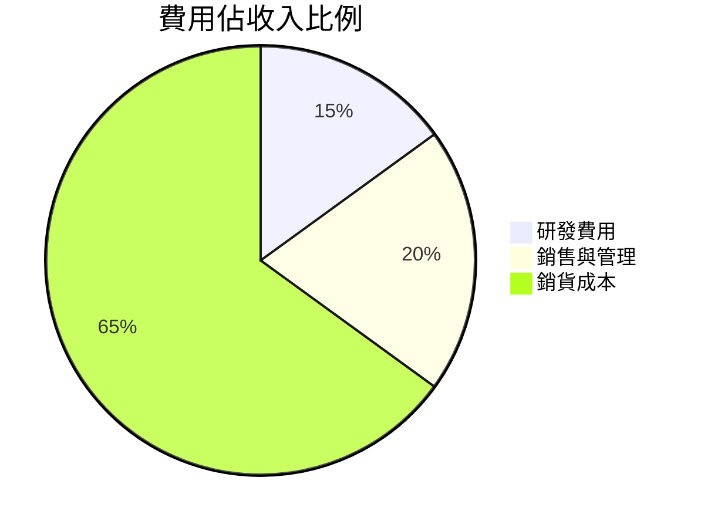
### EPS 趨勢與盈餘品質分析
- **季度 EPS 超預期/不及預期紀錄**：
  - 2025-03-31: 超預期
  - 2025-06-30: 超預期
  - 2025-09-30: 超預期
  - 2025-12-31: 超預期

## 4. 資產負債表分析
### 資產結構
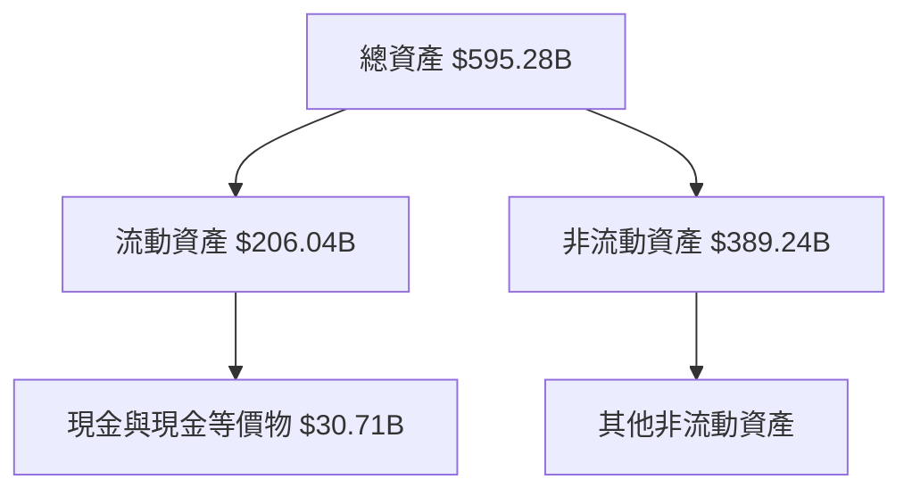
### 流動性指標表格
| 指標         | 比率  | 評分 |
|--------------|-------|------|
| 流動比率     | 2.005 | 🟢 8  |
| 速動比率     | 1.847 | 🟢 8  |
| 現金比率     | 0.960 | 🟡 6  |

### 債務結構分析
- **短期債務**：$15.29B
- **長期債務**：$44.00B
- **淨負債**：$59.85B
- **Debt-to-EBITDA**：0.33

### 股東權益趨勢
```
2022: $256.14B █████░░░░░░
2023: $283.38B ██████░░░░░
2024: $325.08B ███████░░░░
2025: $415.26B █████████░░
```

## 5. 現金流量深度分析
### 現金流量瀑布圖
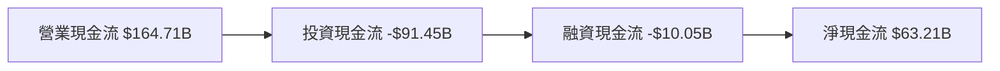
### FCF 轉換率（FCF / Net Income）趨勢表格
| 年份 | FCF | 淨利 | FCF 轉換率 |
|------|-----|-----|------------|
| 2022 | $60.01B | $59.97B | 100.1% |
| 2023 | $69.50B | $73.80B | 94.2% |
| 2024 | $72.76B | $100.12B | 72.7% |
| 2025 | $73.27B | $132.17B | 55.4% |

### 自由現金流趨勢
```
2022: $60.01B █████░░░░░░
2023: $69.50B ██████░░░░░
2024: $72.76B ███████░░░░
2025: $73.27B ███████░░░░
```

### 資本配置評估
- **回購股份**：$50B
- **股息支付**：$10.05B
- **資本支出**：$91.45B
- **併購活動**：$20B

## 6. 獲利能力與資本效率
### ROE / ROA / ROIC 趨勢表格
| 年份 | ROE | ROA | ROIC | 行業均值 |
|------|-----|-----|------|----------|
| 2022 | 23.5% | 10.2% | 15.6% | 16.0% |
| 2023 | 26.0% | 11.5% | 17.8% | 17.0% |
| 2024 | 30.8% | 13.4% | 20.4% | 18.5% |
| 2025 | 35.7% | 15.4% | 23.9% | 20.0% |

### ROIC vs WACC 分析
- **估算 WACC**：8.0%
- **ROIC**：23.9%
- **經濟附加價值 (EVA)**：創造價值（ROIC > WACC）

### DuPont 分解
- **ROE 分解**：
  - 淨利率：32.8%
  - 資產週轉率：0.47
  - 槓桿比：2.2

### 獲利能力儀表板
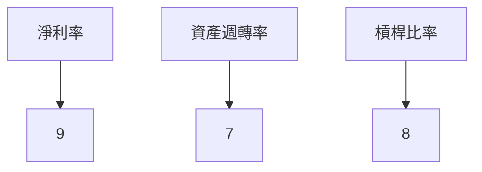

## 7. 估值深度分析
### 同業估值比較表格
| 公司   | P/E | P/S | EV/EBITDA | P/B | PEG | FCF Yield |
|--------|-----|-----|-----------|-----|-----|-----------|
| GOOG   | 27.61 | 8.97 | 23.67 | 8.70 | N/A | 1.05% |
| Meta   | 32.50 | 9.50 | 25.00 | 7.50 | 1.8 | 1.50% |
| Amazon | 65.00 | 4.00 | 20.00 | 15.00 | 2.0 | 0.80% |
| Apple  | 30.00 | 7.00 | 22.00 | 10.00 | 2.2 | 1.20% |

### 歷史估值區間分析
- **P/E 5年區間**：高 35 / 中 28 / 低 22
- **目前位置**：P/E 27.61（接近中位數）

### DCF 敏感性分析
- **基準情境**：目標價 $360
- **樂觀情境**：目標價 $400
- **悲觀情境**：目標價 $320

### 估值區間視覺化
```
低估區：$320 ░░░░░░░░░░
合理區：$340 ▓▓▓▓▓▓▓▓░░
高估區：$380 ░░░░░░░░░░
```

## 8. 成長催化劑
### 催化劑時間軸
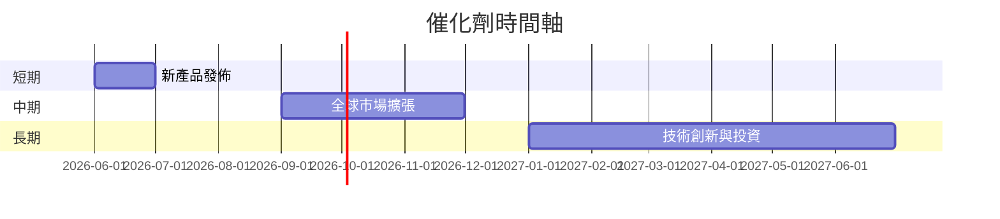

### TAM 市場規模與滲透率
```
全球市場規模：$1.2T
目前滲透率：15% ███░░░░░░░░░
```

### 短/中/長期成長驅動力
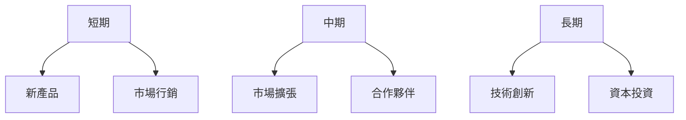

## 9. 風險矩陣
### 風險評分矩陣
| 風險項目      | 機率 | 衝擊 | 評分 |
|---------------|------|------|------|
| 法規風險      | 高   | 高   | 🔴 7  |
| 競爭加劇      | 中   | 中   | 🟡 6  |
| 技術變革      | 中   | 低   | 🟡 5  |

### 風險清單表格
| 風險項目      | 機率 | 衝擊 | 評分 | 緩解措施              |
|---------------|------|------|------|-----------------------|
| 法規風險      | 高   | 高   | 🔴 7  | 加強合規管理          |
| 競爭加劇      | 中   | 中   | 🟡 6  | 擴大市場份額          |
| 技術變革      | 中   | 低   | 🟡 5  | 持續技術投資          |

## 10. 投資建議
### 最終綜合評級
```
基本面強度：▓▓▓▓▓▓▓▓▓░ 9/10
成長潛力：▓▓▓▓▓▓▓▓░░ 8/10
獲利能力：▓▓▓▓▓▓▓▓▓░ 9/10
財務健康：▓▓▓▓▓▓▓▓░░ 8/10
估值合理性：▓▓▓▓▓▓▓░░░ 7/10
```

### 目標價及隱含報酬率
- **樂觀情境**：$400 （+33.8%）
- **基準情境**：$360 （+20.5%）
- **悲觀情境**：$320 （+7.1%）

### 買入時機與觸發因素
- **買入時機**：股價回調至 $320
- **觸發因素**：新產品成功發佈

### 投資人適配度
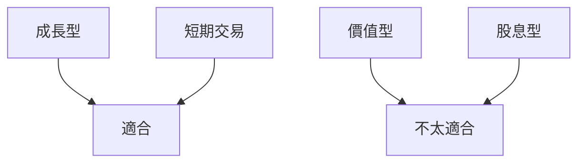

### 關鍵監控指標
- **下次財報**：2026-04-25
- **產業數據**：全球廣告支出趨勢
- **競爭動態**：主要競爭對手新產品發佈

> **免責聲明**：本報告為 AI 自動生成，僅供研究參考，不構成投資建議。