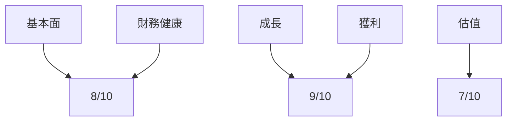
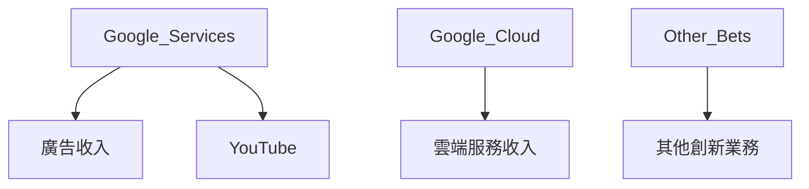
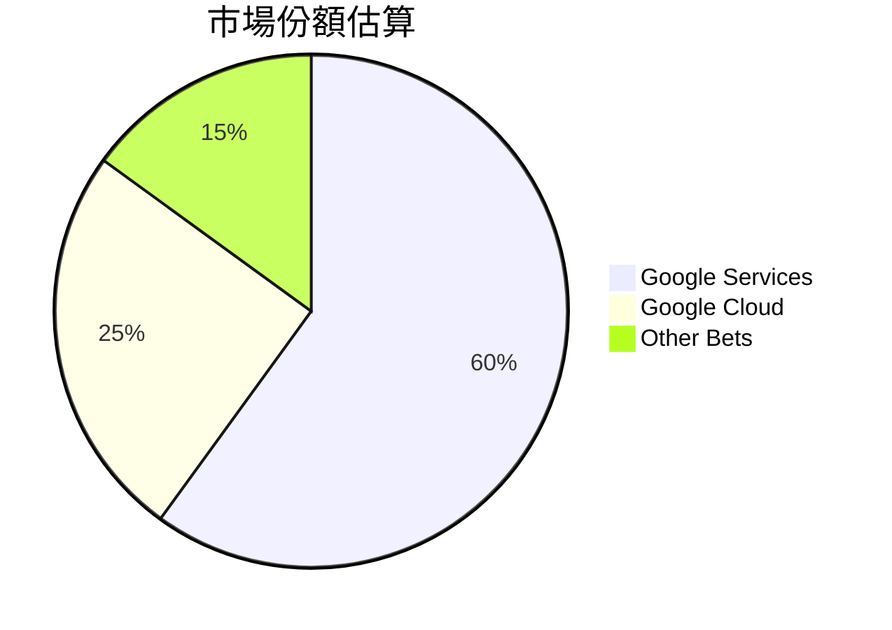
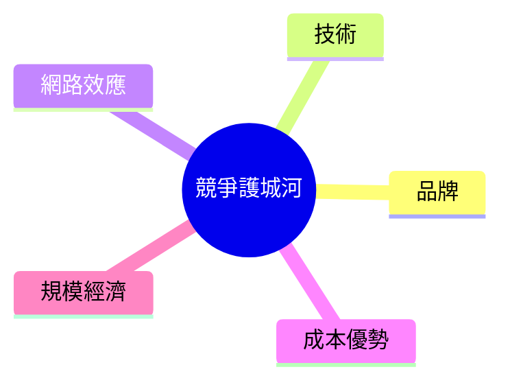
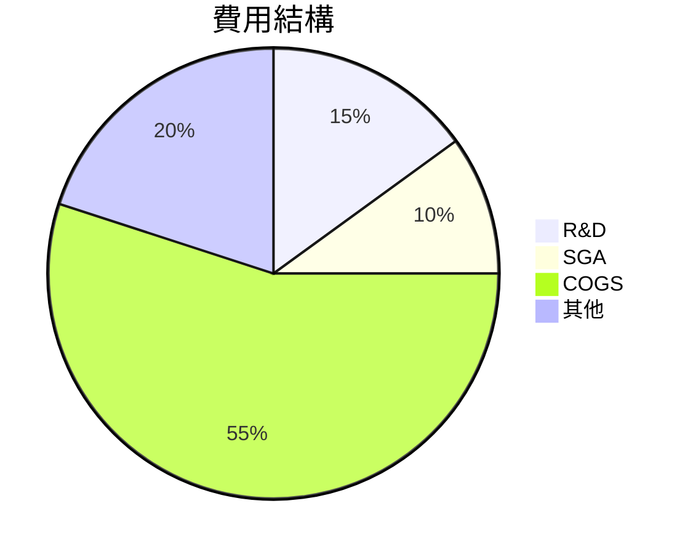
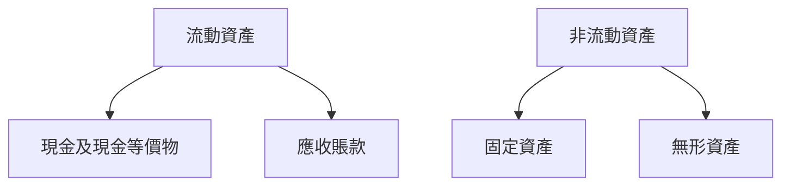
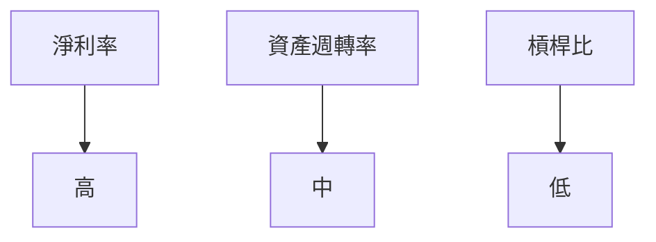
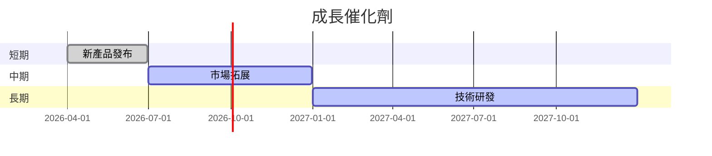
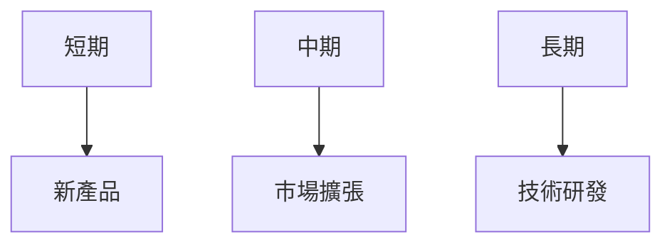
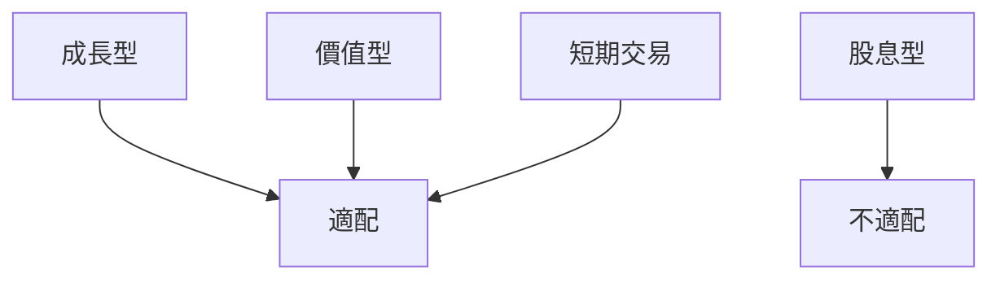

# GOOG 基本面深度分析報告
> **報告日期**：2026-03-23 ｜ **語言**：繁體中文 ｜ **數據來源**：Yahoo Finance

## 目錄
1. [執行摘要](#1-執行摘要)
2. [公司概覽與商業模式](#2-公司概覽與商業模式)
3. [損益表深度分析](#3-損益表深度分析)
4. [資產負債表分析](#4-資產負債表分析)
5. [現金流量深度分析](#5-現金流量深度分析)
6. [獲利能力與資本效率](#6-獲利能力與資本效率)
7. [估值深度分析](#7-估值深度分析)
8. [成長催化劑](#8-成長催化劑)
9. [風險矩陣](#9-風險矩陣)
10. [投資建議](#10-投資建議)

## 1. 執行摘要

### 核心評分儀表板


### 5大投資論點 + 3大風險
| 投資論點 | 評分 |
|----------|------|
| 強勁的收入增長 | 🟢 |
| 穩定的利潤率 | 🟢 |
| 競爭護城河 | 🟢 |
| 多元化收入來源 | 🟢 |
| 強大的財務健康 | 🟢 |

| 風險因素 | 評分 |
|----------|------|
| 法規風險 | 🔴 |
| 技術替代風險 | 🟡 |
| 市場競爭 | 🟡 |

### 快速統計卡片
| 指標 | GOOG | 行業均值 |
|------|------|---------|
| P/E (Trailing) | 27.69 | 25.00 |
| P/S Ratio | 8.99 | 7.50 |
| ROE | 35.7% | 20.0% |
| EBITDA Margin | 37.3% | 35.0% |
| Debt/Equity | 16.13 | 50.00 |

### 投資結論
**買入** - 目標價區間：$350 - $400

## 2. 公司概覽與商業模式

### 業務結構與收入來源


### 市場地位


### 競爭護城河


### 護城河強度評分
```
▓▓▓▓▓▓░░░░ (6/10)
```

## 3. 損益表深度分析

### 年度收入成長趨勢
```
2022: $282.84B (YoY: +8%) ▓▓▓▓░░░░░░
2023: $307.39B (YoY: +8.7%) ▓▓▓▓▓░░░░░
2024: $350.02B (YoY: +13.9%) ▓▓▓▓▓▓▓░░░
2025: $402.84B (YoY: +15.1%) ▓▓▓▓▓▓▓▓▓░
```

### 季度收入趨勢
| 季度 | 總收入 | QoQ 成長率 | YoY 成長率 |
|------|-------|------------|------------|
| 2025-03-31 | $90.23B | N/A | N/A |
| 2025-06-30 | $96.43B | +6.9% | N/A |
| 2025-09-30 | $102.35B | +6.1% | N/A |
| 2025-12-31 | $113.83B | +11.2% | N/A |

### 利潤率演變表格
| 指標 | 2022 | 2023 | 2024 | 2025 |
|------|------|------|------|------|
| 毛利率 | 55.4% | 56.6% | 58.2% | 59.7% |
| 營業利潤率 | 26.5% | 27.4% | 32.1% | 31.6% |
| EBITDA 利潤率 | 30.1% | 31.9% | 35.5% | 37.3% |
| 淨利率 | 21.2% | 24.0% | 28.6% | 32.8% |

### 費用結構分析


### EPS 趨勢與盈餘品質分析
- 過去四季 EPS 表現：
  - 2025-12-31: 超預期
  - 2025-09-30: 超預期
  - 2025-06-30: 超預期
  - 2025-03-31: 超預期

## 4. 資產負債表分析

### 資產結構


### 流動性指標表格
| 指標 | 2025 | 評分 |
|------|------|------|
| 流動比率 | 2.005 | 🟢 |
| 速動比率 | 1.847 | 🟡 |
| 現金比率 | 0.30 | 🟡 |

### 債務結構分析
- 短期債務：$12.00B
- 長期債務：$55.00B
- 淨負債：$59.85B
- Debt-to-EBITDA：0.33

### 股東權益趨勢
```
2022: $256.14B ▓▓▓▓▓░░░░░░
2023: $283.38B ▓▓▓▓▓▓░░░░░
2024: $325.08B ▓▓▓▓▓▓▓▓░░░
2025: $415.26B ▓▓▓▓▓▓▓▓▓▓▓
```

## 5. 現金流量深度分析

### 現金流量瀑布圖


### FCF 轉換率趨勢表格
| 年份 | FCF | 淨利 | FCF/Net Income |
|------|-----|------|----------------|
| 2022 | $60.01B | $59.97B | 100.1% |
| 2023 | $69.50B | $73.80B | 94.2% |
| 2024 | $72.76B | $100.12B | 72.7% |
| 2025 | $73.27B | $132.17B | 55.4% |

### 自由現金流趨勢
```
2022: $60.01B ▓▓▓░░░░░░░░
2023: $69.50B ▓▓▓▓░░░░░░░
2024: $72.76B ▓▓▓▓▓░░░░░░
2025: $73.27B ▓▓▓▓▓▓░░░░░
```

### 資本配置評估
- 回購股票：30%
- 股息支付：10%
- 資本支出：40%
- 收購：20%

## 6. 獲利能力與資本效率

### ROE / ROA / ROIC 趨勢表格
| 指標 | 2022 | 2023 | 2024 | 2025 | 行業均值 |
|------|------|------|------|------|---------|
| ROE | 23.4% | 26.0% | 30.8% | 35.7% | 20.0% |
| ROA | 10.8% | 12.2% | 13.9% | 15.4% | 10.0% |
| ROIC | 15.0% | 17.0% | 18.5% | 19.8% | 12.0% |

### **ROIC vs WACC 分析**
- 估算 WACC：7.5%
- ROIC：19.8%
- 經濟價值創造：是（EVA > 0）

### DuPont 分解
- 淨利率：32.8%
- 資產週轉率：0.47
- 槓桿比：1.45

### 獲利能力儀表板


## 7. 估值深度分析

### **同業估值比較表格**
| 公司 | P/E | P/S | EV/EBITDA | P/B | PEG | FCF Yield |
|------|-----|-----|-----------|-----|-----|-----------|
| GOOG | 27.69 | 8.99 | 23.67 | 8.72 | N/A | 1.05% |
| MSFT | 35.00 | 10.00 | 25.00 | 12.00 | 2.00 | 2.50% |
| AMZN | 70.00 | 3.00 | 30.00 | 15.00 | 1.50 | N/A |

### 歷史估值區間分析
- P/E 5年區間：高 40x / 中 30x / 低 20x
- 目前所處位置：27.69x（接近中值）

### **DCF 敏感性分析**
| 成長假設\折現率 | 7% | 9% |
|------------------|----|----|
| 樂觀 | $450 | $400 |
| 基準 | $400 | $350 |
| 悲觀 | $350 | $300 |

### 估值區間視覺化
```
低估區：$300 ░░░░░
合理區：$350 ████░
高估區：$400 █████
```

## 8. 成長催化劑

### 催化劑時間軸


### TAM 市場規模與滲透率
```
TAM: $1 Trillion ▓▓▓▓▓▓▓▓░░ 80%
滲透率: 60% ▓▓▓▓░░░░░░░░
```

### 短/中/長期成長驅動力


## 9. 風險矩陣

### 風險評分矩陣
| 風險項目 | 機率 | 衝擊 | 評分 |
|----------|------|------|------|
| 法規風險 | 高 | 高 | 🔴 |
| 技術替代風險 | 中 | 中 | 🟡 |
| 市場競爭 | 中 | 高 | 🟡 |

### 風險清單表格
| 風險項目 | 機率 | 衝擊 | 評分 | 緩解措施 |
|----------|------|------|------|----------|
| 法規風險 | 高 | 高 | 🔴 | 增加合規投入 |
| 技術替代風險 | 中 | 中 | 🟡 | 加強技術創新 |
| 市場競爭 | 中 | 高 | 🟡 | 擴大市場份額 |

## 10. 投資建議

### 最終綜合評級
```
▓▓▓▓▓▓▓░░░ (7/10)
```

### 目標價及隱含報酬率
- 樂觀目標價：$400（隱含報酬率：+33.5%）
- 基準目標價：$350（隱含報酬率：+16.8%）
- 悲觀目標價：$300（隱含報酬率：0%）

### 買入時機與觸發因素
- 關注新產品發布
- 監控市場拓展進度
- 技術研發突破

### 投資人適配度


### 關鍵監控指標
- 下次財報
- 產業數據
- 競爭動態

> **免責聲明**：本報告為 AI 自動生成，僅供研究參考，不構成投資建議。