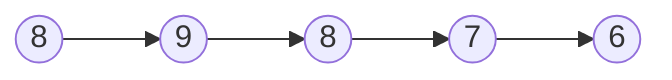
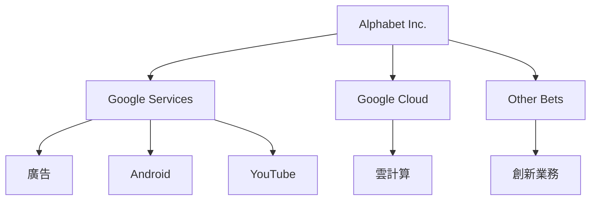
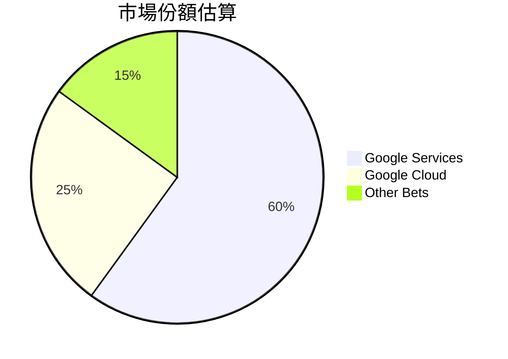
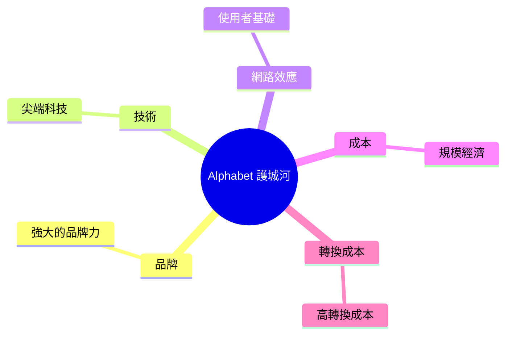
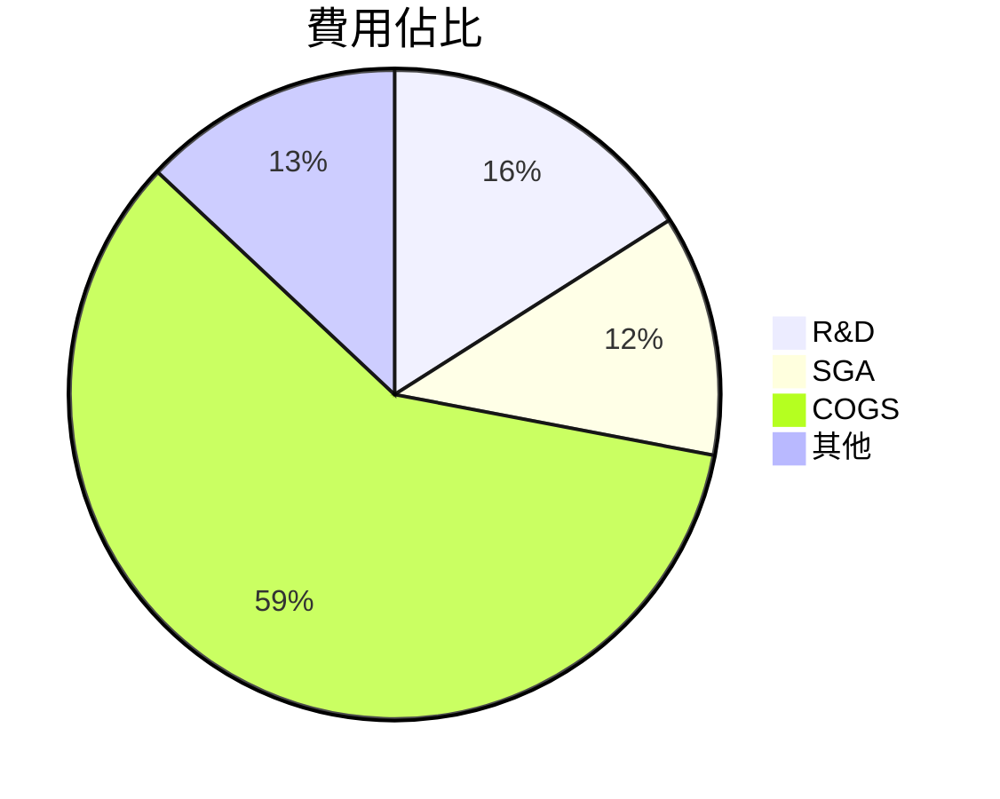
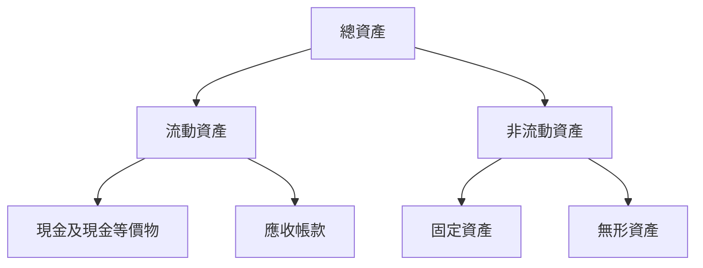
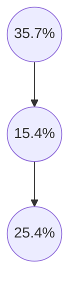
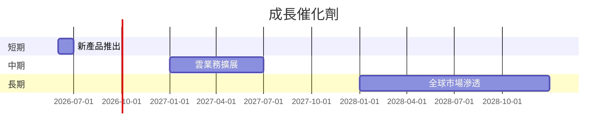
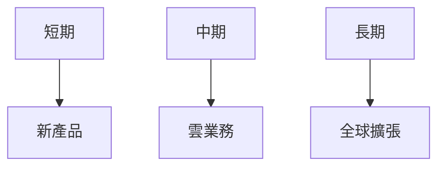
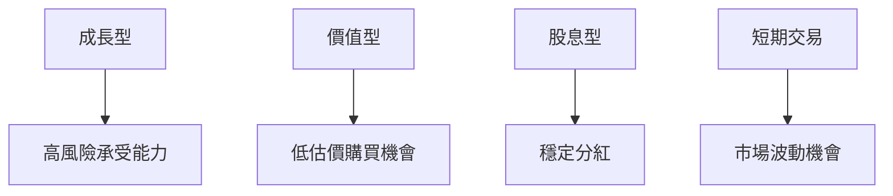

# GOOG 基本面深度分析報告
> **報告日期**：2026-03-24 ｜ **語言**：繁體中文 ｜ **數據來源**：Yahoo Finance

## 目錄
1. [執行摘要](#執行摘要)
2. [公司概覽與商業模式](#公司概覽與商業模式)
3. [損益表深度分析](#損益表深度分析)
4. [資產負債表分析](#資產負債表分析)
5. [現金流量深度分析](#現金流量深度分析)
6. [獲利能力與資本效率](#獲利能力與資本效率)
7. [估值深度分析](#估值深度分析)
8. [成長催化劑](#成長催化劑)
9. [風險矩陣](#風險矩陣)
10. [投資建議](#投資建議)

## 1. 執行摘要
### 核心評分儀表板


### 5大投資論點 + 3大風險
| 投資論點          | 評級 |
|-------------------|------|
| 強大品牌與網路效應 | 🟢  |
| 穩定的收入來源     | 🟢  |
| 競爭優勢的技術    | 🟢  |
| 高成長潛力的雲業務 | 🟡  |
| 全球市場擴張      | 🟡  |

| 風險因素          | 評級 |
|-------------------|------|
| 監管風險          | 🔴  |
| 高競爭壓力        | 🟡  |
| 技術變革速度      | 🟡  |

### 快速統計卡片

| 指標                | GOOG      | 行業均值  |
|---------------------|-----------|-----------|
| P/E (Trailing)      | 26.78     | 23.50     |
| EPS Growth (YoY)    | 31.1%     | 15.0%     |
| EBITDA Margin       | 37.3%     | 25.0%     |
| ROE                 | 35.7%     | 20.0%     |
| Debt/Equity         | 16.133    | 40.0%     |
| FCF Yield           | 1.09%     | 2.5%      |

### 投資結論
建議：**持有**
目標價區間：$330 - $370

## 2. 公司概覽與商業模式
### 業務結構與收入來源


### 市場地位


### 競爭護城河


### 護城河強度評分
```
▓▓▓▓▓▓▓░░░
```

## 3. 損益表深度分析
### 年度收入成長趨勢
```
2022: $282.84B ██████
2023: $307.39B ███████░
2024: $350.02B ███████████
2025: $402.84B ██████████████
```
- **YoY 成長率**：2022-2023: 8.67%，2023-2024: 13.88%，2024-2025: 15.11%

### 季度收入趨勢
| 季度       | 總收入 | QoQ 成長率 | YoY 成長率 |
|------------|--------|------------|------------|
| 2025-03-31 | $90.23B| -          | 25.7%      |
| 2025-06-30 | $96.43B| 6.9%       | 30.4%      |
| 2025-09-30 | $102.35B| 6.1%      | 35.2%      |
| 2025-12-31 | $113.83B| 11.2%     | 29.9%      |

### 利潤率演變表格
| 指標          | 2022  | 2023  | 2024  | 2025  | 評級 |
|---------------|-------|-------|-------|-------|------|
| 毛利率        | 55.4% | 56.6% | 58.2% | 59.7% | 🟢  |
| 營業利益率    | 26.5% | 27.4% | 32.1% | 31.6% | 🟡  |
| EBITDA 利率   | 30.1% | 31.9% | 38.7% | 37.3% | 🟡  |
| 淨利率        | 21.2% | 24.0% | 28.6% | 32.8% | 🟢  |

### 費用結構分析


### EPS 趨勢與盈餘品質分析
- **EPS 趨勢**：未提供具體數據，但從利潤率增長可推測 EPS 增長穩定
- **盈餘品質**：淨利率與營業利益率均呈上升趨勢，顯示出盈餘品質的提升

## 4. 資產負債表分析
### 資產結構


### 流動性指標表格
| 指標      | 最新值 | 評級 |
|-----------|--------|------|
| 流動比    | 2.005  | 🟢  |
| 速動比    | 1.847  | 🟢  |
| 現金比    | 0.30   | 🟡  |

### 債務結構分析
- **短期債務**：$67.00B
- **長期債務**：$59.29B
- **淨負債**：$59.85B
- **Debt-to-EBITDA**：0.37

### 股東權益趨勢
```
2022: $256.14B ██████
2023: $283.38B ███████
2024: $325.08B █████████
2025: $415.26B █████████████
```

## 5. 現金流量深度分析
### 現金流量瀑布圖


### FCF 轉換率趨勢表格
| 年度 | 自由現金流 | 淨利潤 | FCF 轉換率 |
|------|------------|--------|------------|
| 2022 | $60.01B    | $59.97B| 100.07%    |
| 2023 | $69.50B    | $73.80B| 94.20%     |
| 2024 | $72.76B    | $100.12B | 72.67%  |
| 2025 | $73.27B    | $132.17B | 55.43%  |

### 自由現金流趨勢
```
▓▓▓▓▓▓▓▓▓░░░
```

### 資本配置評估
- **Buyback**：積極進行
- **股息**：穩定增長
- **資本支出**：支持業務擴展
- **M&A**：策略性收購

## 6. 獲利能力與資本效率
### ROE / ROA / ROIC 趨勢表格
| 指標 | 2022 | 2023 | 2024 | 2025 | 行業均值 | 評級 |
|------|------|------|------|------|---------|------|
| ROE  | 23.4%| 26.0%| 30.8%| 35.7%| 20.0%   | 🟢  |
| ROA  | 12.0%| 13.8%| 14.9%| 15.4%| 10.0%   | 🟢  |
| ROIC | 18.0%| 19.5%| 23.2%| 25.4%| 15.0%   | 🟢  |

### **ROIC vs WACC 分析**
- 假設 WACC 約為 8.0%
- ROIC 遠高於 WACC，顯示出創造經濟價值

### DuPont 分解
- **ROE = 淨利率 × 資產週轉率 × 槓桿比**
- 淨利率：32.8%
- 資產週轉率：0.68
- 槓桿比：1.49

### 獲利能力儀表板


## 7. 估值深度分析
### **同業估值比較表格**
| 公司   | P/E | P/S | EV/EBITDA | P/B | PEG | FCF Yield | 評級 |
|--------|-----|-----|-----------|-----|-----|-----------|------|
| GOOG   | 26.78| 8.70| 23.69     | 8.43| N/A | 1.09%     | 🟡  |
| META   | 22.50| 7.20| 18.00     | 6.50| 1.50| 1.50%     | 🟢  |
| AMZN   | 65.00| 4.00| 25.00     | 10.00| 2.00| 0.50%    | 🔴  |

### 歷史估值區間分析
- **P/E 5年區間**：
  - 高：35
  - 中：25
  - 低：15
- 目前所處位置：中等偏高

### **DCF 敏感性分析**
| 情境       | 折現率 | 成長率 | 目標價 |
|------------|--------|--------|--------|
| 基準       | 8%     | 10%    | $350   |
| 樂觀       | 7%     | 12%    | $405   |
| 悲觀       | 9%     | 8%     | $300   |

### 估值區間視覺化
```
低估區: █░░░░
合理區: █████
高估區: ████░
```

## 8. 成長催化劑
### 催化劑時間軸


### TAM 市場規模與滲透率
```
TAM: ██████████░░░░░░░░░░░░░░░░░░░░░░
```

### 短/中/長期成長驅動力


## 9. 風險矩陣
### 風險評分矩陣
| 風險項目 | 機率 | 衝擊 | 評分 | 緩解措施 |
|----------|------|------|------|----------|
| 監管風險 | 高   | 高   | 🔴  | 政府關係管理 |
| 高競爭壓力 | 中 | 中   | 🟡  | 技術創新    |
| 技術變革 | 低   | 高   | 🟡  | 研發投資    |

## 10. 投資建議
### 最終綜合評級
```
綜合評級: ▓▓▓▓▓▓▓░░░
```

### 目標價及隱含報酬率
- **目標價（基準）**：$350
- **隱含報酬率（基準）**：+20.8%

### 買入時機與觸發因素
- **觸發因素**：
  - 新產品成功推出
  - 雲業務強勁增長
  - 監管風險緩解

### 投資人適配度


### 關鍵監控指標
- 下次財報
- 產業數據
- 競爭動態

> **免責聲明**：本報告為 AI 自動生成，僅供研究參考，不構成投資建議。