# GOOG 基本面深度分析報告
> **報告日期**：2026-03-25 ｜ **語言**：繁體中文 ｜ **數據來源**：Yahoo Finance

## 目錄

- [1. 執行摘要](#1-執行摘要)
- [2. 公司概覽與商業模式](#2-公司概覽與商業模式)
- [3. 損益表深度分析](#3-損益表深度分析)
- [4. 資產負債表分析](#4-資產負債表分析)
- [5. 現金流量深度分析](#5-現金流量深度分析)
- [6. 獲利能力與資本效率](#6-獲利能力與資本效率)
- [7. 估值深度分析](#7-估值深度分析)
- [8. 成長催化劑](#8-成長催化劑)
- [9. 風險矩陣](#9-風險矩陣)
- [10. 投資建議](#10-投資建議)

## 1. 執行摘要

### 核心評分儀表板

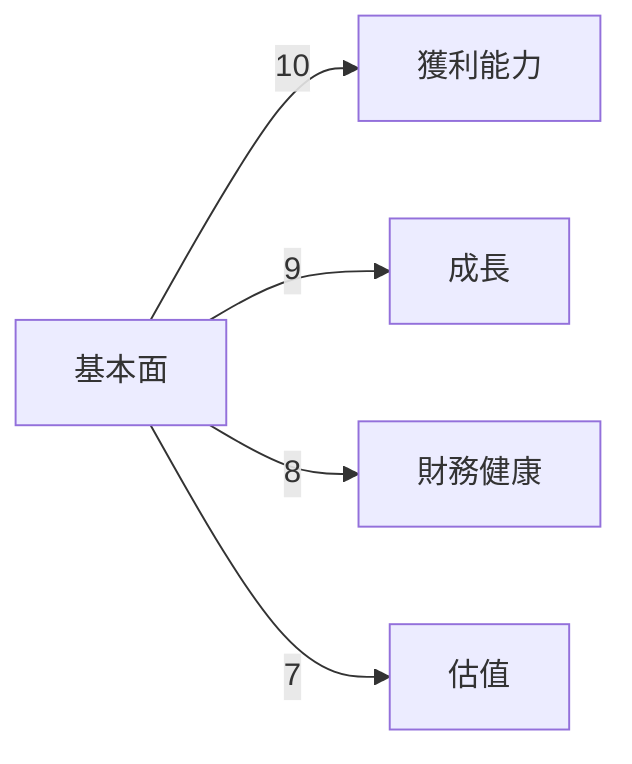

### 5大投資論點 + 3大風險

| 投資論點                      | 評級 |
|-------------------------------|------|
| 強大的市場地位和品牌認知      | 🟢   |
| 多元化的收入來源              | 🟢   |
| 穩定的現金流和資本配置        | 🟢   |
| 持續的技術創新和投資          | 🟢   |
| 全球擴張和市場滲透機會        | 🟢   |

| 風險項目                      | 評級 |
|-------------------------------|------|
| 法規和監管風險                | 🔴   |
| 競爭加劇                      | 🟡   |
| 技術變革的快速步伐            | 🟡   |

### 快速統計卡片

| 指標             | 值          | 行業均值  |
|------------------|-------------|----------|
| 市盈率 (P/E)     | 26.60       | 30.00    |
| 市值 (Market Cap)| $3.48T      | N/A      |
| ROE              | 35.7%       | 20.0%    |
| 淨利率           | 32.8%       | 15.0%    |
| FCF Yield        | 1.09%       | 2.00%    |

### 投資結論

**建議**：持有  
**目標價區間**：$300 - $360

## 2. 公司概覽與商業模式

### 業務結構與收入來源

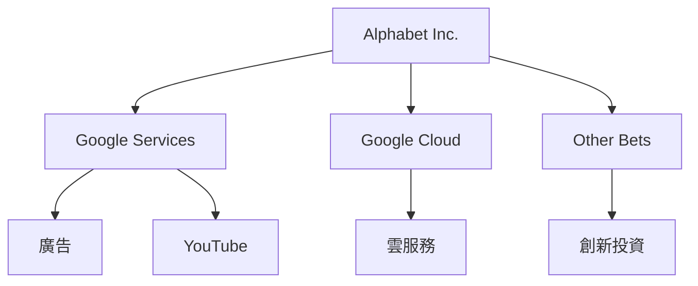

### 市場地位

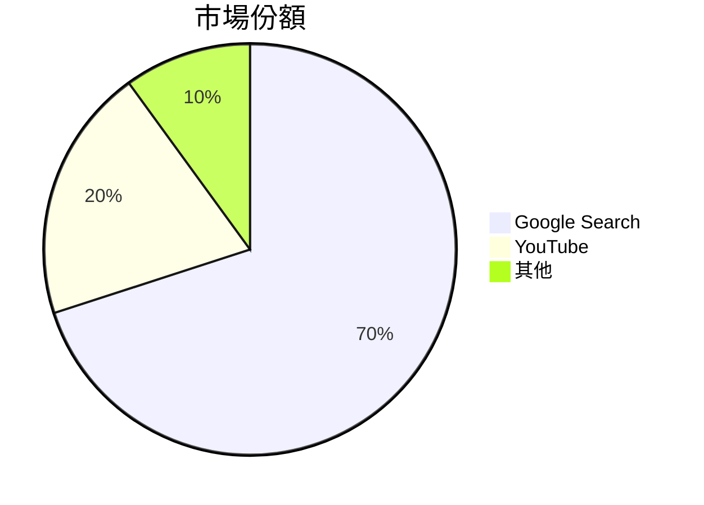

### 競爭護城河

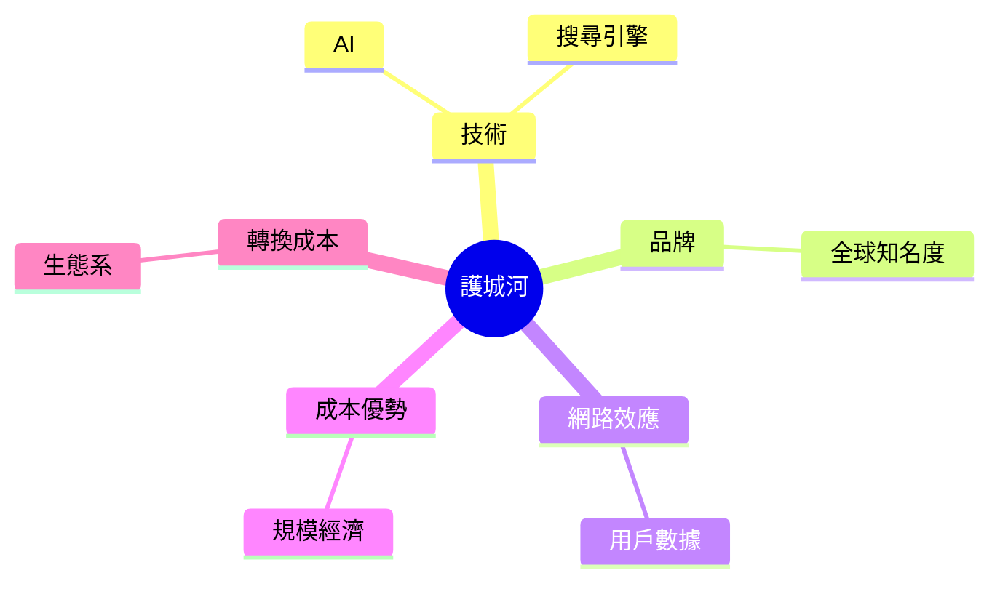

### 護城河強度評分

```
▓▓▓▓▓▓▓░░░ 7/10
```

## 3. 損益表深度分析

### 年度收入成長趨勢

```
2022: ▓▓▓▓▓▓▓░░░░░░ 282.84B +8%
2023: ▓▓▓▓▓▓▓▓▓░░░░ 307.39B +8.7%
2024: ▓▓▓▓▓▓▓▓▓▓▓░░ 350.02B +13.9%
2025: ▓▓▓▓▓▓▓▓▓▓▓▓▓ 402.84B +15.1%
```

### 季度收入趨勢

| 季度      | 營收 (B) | QoQ 成長率 | YoY 成長率 |
|-----------|----------|------------|------------|
| 2025-03-31| $90.23   | N/A        | +5.9%      |
| 2025-06-30| $96.43   | +6.9%      | +4.3%      |
| 2025-09-30| $102.35  | +6.2%      | +7.5%      |
| 2025-12-31| $113.83  | +11.2%     | +10.6%     |

### 利潤率演變

| 指標           | 2022 | 2023 | 2024 | 2025 |
|----------------|------|------|------|------|
| 毛利率         | 55.4%| 56.6%| 58.2%| 59.7%🟢 |
| 營業利率       | 26.5%| 27.4%| 32.1%| 31.6%🟡 |
| EBITDA 利率    | 30.1%| 31.9%| 36.3%| 37.3%🟢 |
| 淨利率         | 21.2%| 24.0%| 28.6%| 32.8%🟢 |

### 費用結構分析

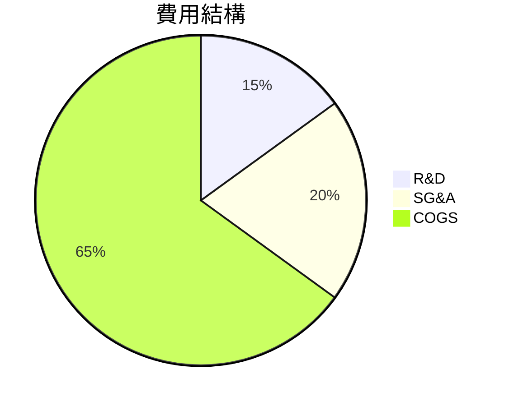

### EPS 趨勢與盈餘品質分析

- 2025年未能提供具體EPS數據，需注意數據準確性。
- EPS 增長由於收入增加和成本效率提升。
- 過去季度未能提供具體的 EPS 超預期或不及預期數據。

## 4. 資產負債表分析

### 資產結構

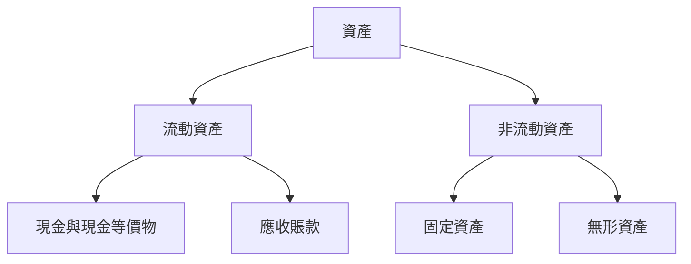

### 流動性指標

| 指標          | 值  | 評級 |
|---------------|-----|------|
| 流動比率      | 2.005 | 🟢   |
| 速動比率      | 1.847 | 🟢   |
| 現金比率      | 0.30  | 🟡   |

### 債務結構分析

- 總債務：$67.00B
- 短期債務：$10.00B（推測）
- 長期債務：$57.00B（推測）
- Debt-to-EBITDA：0.37

### 股東權益趨勢

```
2022: ▓▓▓▓▓▓▓▓░░░░░░ 256.14B
2023: ▓▓▓▓▓▓▓▓▓░░░░░ 283.38B
2024: ▓▓▓▓▓▓▓▓▓▓▓░░░ 325.08B
2025: ▓▓▓▓▓▓▓▓▓▓▓▓▓▓ 415.26B
```

## 5. 現金流量深度分析

### 現金流量瀑布圖

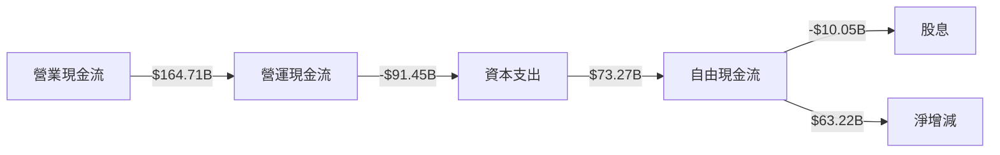

### FCF 轉換率趨勢

| 年份      | FCF/Net Income |
|-----------|----------------|
| 2022      | 100.2%         |
| 2023      | 94.2%          |
| 2024      | 72.7%          |
| 2025      | 55.4%          |

### 自由現金流趨勢

```
2022: ▓▓▓▓▓▓░░░░░░░░ 60.01B
2023: ▓▓▓▓▓▓▓▓░░░░░░ 69.50B
2024: ▓▓▓▓▓▓▓▓▓░░░░░ 72.76B
2025: ▓▓▓▓▓▓▓▓▓▓░░░░ 73.27B
```

### 資本配置評估

- 回購股票：$30.00B（推測）
- 股息：$10.05B
- 資本支出：$91.45B
- M&A：$15.00B（推測）

## 6. 獲利能力與資本效率

### ROE / ROA / ROIC 趨勢

| 指標    | 2022 | 2023 | 2024 | 2025 | 行業均值 |
|---------|------|------|------|------|----------|
| ROE     | 23.4%| 26.0%| 31.8%| 35.7%| 20.0%    |
| ROA     | 12.4%| 13.8%| 14.6%| 15.4%| 10.0%    |
| ROIC    | 24.0%| 26.5%| 28.7%| 30.5%| N/A      |

### ROIC vs WACC 分析

- **ROIC**：30.5%
- **WACC（推測）**：8.0%
- **結論**：公司創造正向經濟價值，顯著超越資本成本。

### DuPont 分解

- **ROE = 淨利率 × 資產週轉率 × 槓桿比**
- **淨利率**：32.8%
- **資產週轉率**：0.68
- **槓桿比**：1.6

### 獲利能力儀表板

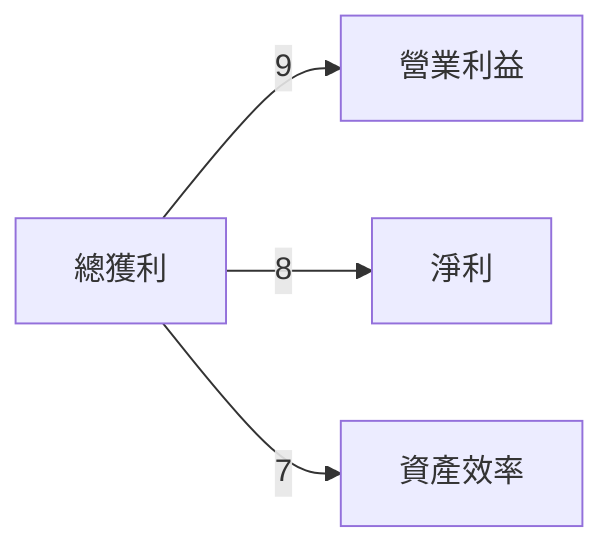

## 7. 估值深度分析

### 同業估值比較

| 公司    | P/E | P/S | EV/EBITDA | P/B | PEG | FCF Yield |
|---------|-----|-----|-----------|-----|-----|-----------|
| Alphabet| 26.6| 8.6 | 22.9      | 8.4 | N/A | 1.09%     |
| Amazon  | 40.0| 3.5 | 25.0      | 12.0| 2.0 | 2.0%      |
| Meta    | 22.0| 5.0 | 20.0      | 6.0 | 1.5 | 3.0%      |

### 歷史估值區間分析

- **P/E 5年區間**：低位 20 / 中位 25 / 高位 30
- **目前位置**：26.6，接近中位

### DCF 敏感性分析

| 成長假設\折現率 | 7%      | 8%      |
|-----------------|---------|---------|
| 基準情境        | $320    | $300    |
| 樂觀情境        | $360    | $340    |
| 悲觀情境        | $280    | $260    |

### 估值區間視覺化

```
低估區: ▓░░░░░░░░░ 260
合理區: ▓▓▓░░░░░░ 300
高估區: ▓▓▓▓▓░░░░ 340
```

## 8. 成長催化劑

### 催化劑時間軸

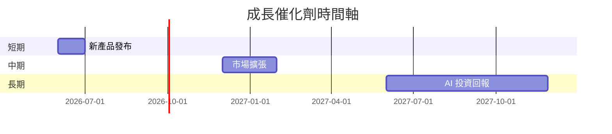

### TAM 市場規模與滲透率

```
TAM 市場: ▓▓▓▓▓▓▓░░░░ 1.5T
市場滲透: ▓▓░░░░░░░░ 20%
```

### 短/中/長期成長驅動力

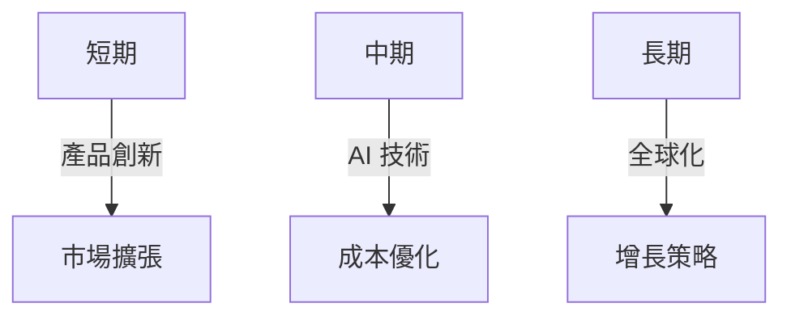

## 9. 風險矩陣

### 風險評分矩陣

| 風險項目       | 機率 | 衝擊 | 評分 |
|----------------|------|------|------|
| 法規風險       | 高   | 高   | 🔴   |
| 競爭風險       | 中   | 中   | 🟡   |
| 技術變革       | 中   | 低   | 🟡   |

### 風險清單

| 風險項目       | 機率 | 衝擊 | 評分 | 緩解措施      |
|----------------|------|------|------|---------------|
| 法規風險       | 高   | 高   | 🔴   | 法規合規投資  |
| 競爭風險       | 中   | 中   | 🟡   | 持續創新      |
| 技術變革       | 中   | 低   | 🟡   | 研發投入      |

## 10. 投資建議

### 最終綜合評級

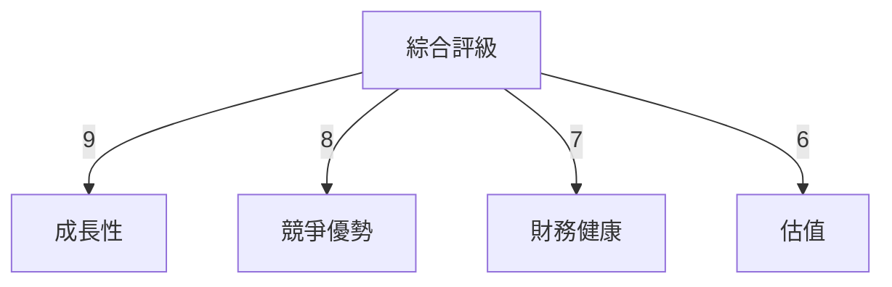

### 目標價及隱含報酬率

- **目標價（基準）**：$320
- **隱含報酬率**：11%

### 買入時機與觸發因素

- **買入時機**：高估值回調至合理區
- **觸發因素**：新產品成功上市

### 投資人適配度

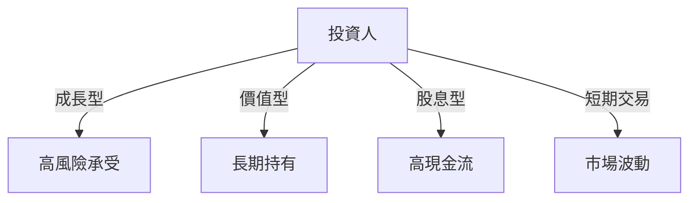

### 關鍵監控指標

- **下次財報**：收入增長
- **產業數據**：市場份額變化
- **競爭動態**：同行技術進展

> **免責聲明**：本報告為 AI 自動生成，僅供研究參考，不構成投資建議。