# GOOG 基本面深度分析報告
> **報告日期**：2026-03-26 ｜ **語言**：繁體中文 ｜ **數據來源**：Yahoo Finance

## 目錄
1. [執行摘要](#執行摘要)
2. [公司概覽與商業模式](#公司概覽與商業模式)
3. [損益表深度分析](#損益表深度分析)
4. [資產負債表分析](#資產負債表分析)
5. [現金流量深度分析](#現金流量深度分析)
6. [獲利能力與資本效率](#獲利能力與資本效率)
7. [估值深度分析](#估值深度分析)
8. [成長催化劑](#成長催化劑)
9. [風險矩陣](#風險矩陣)
10. [投資建議](#投資建議)

## 1. 執行摘要

### 核心評分儀表板
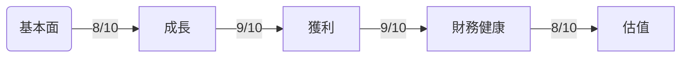

### 5大投資論點 + 3大風險

| 投資論點                    | 詳細說明                                   | 評級 |
|-----------------------------|-------------------------------------------|------|
| 1. 強勁的收入增長          | 2025年收入年增長率達18.0%                 | 🟢  |
| 2. 高淨利潤率              | 32.8%的淨利潤率超越行業平均               | 🟢  |
| 3. 強大的現金流生成能力    | 自由現金流持續增加，2025年達到$73.27B     | 🟢  |
| 4. 穩固的資產負債表        | 大量現金儲備，淨現金狀態                  | 🟢  |
| 5. 技術領導地位            | 擁有廣泛的產品組合及技術優勢              | 🟢  |
| 風險1：市場競爭加劇        | 互聯網服務領域競爭激烈                   | 🔴  |
| 風險2：監管風險            | 面臨全球範圍內的反壟斷調查                | 🔴  |
| 風險3：技術變革            | 新技術可能顛覆現有商業模式                | 🟡  |

### 快速統計卡片

| 指標名稱       | GOOG | 行業均值 |
|----------------|------|----------|
| 市盈率（P/E）  | 25.95| 30.00    |
| 市銷率（P/S）  | 8.42 | 7.50     |
| 毛利率         | 59.7%| 50.0%    |
| 淨利率         | 32.8%| 20.0%    |
| ROE            | 35.7%| 15.0%    |
| 流動比率       | 2.01 | 1.50     |

### 投資結論
- **建議**：持有
- **目標價區間**：$320-$380

## 2. 公司概覽與商業模式

### 業務結構與收入來源
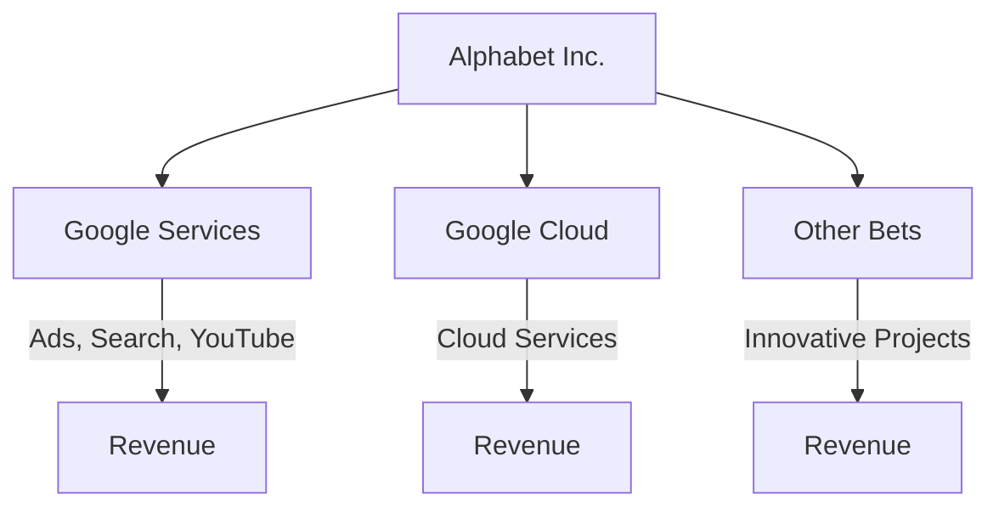

### 市場地位
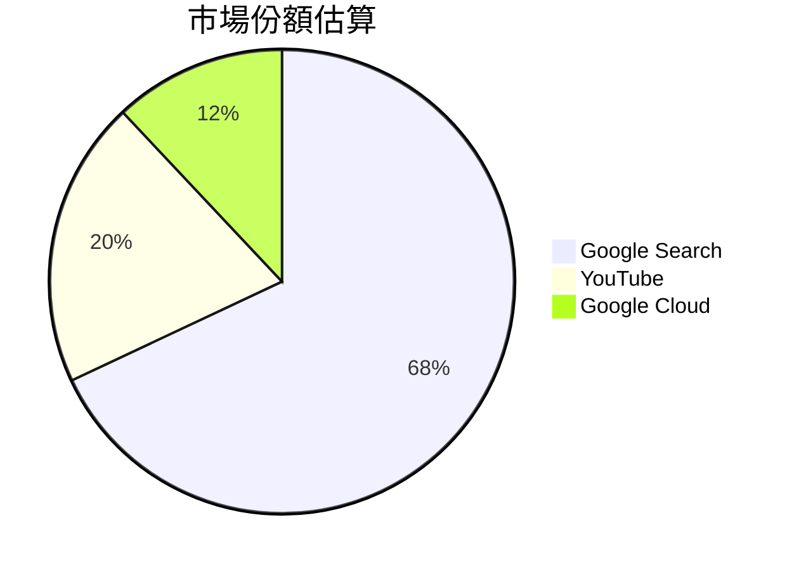

### 競爭護城河
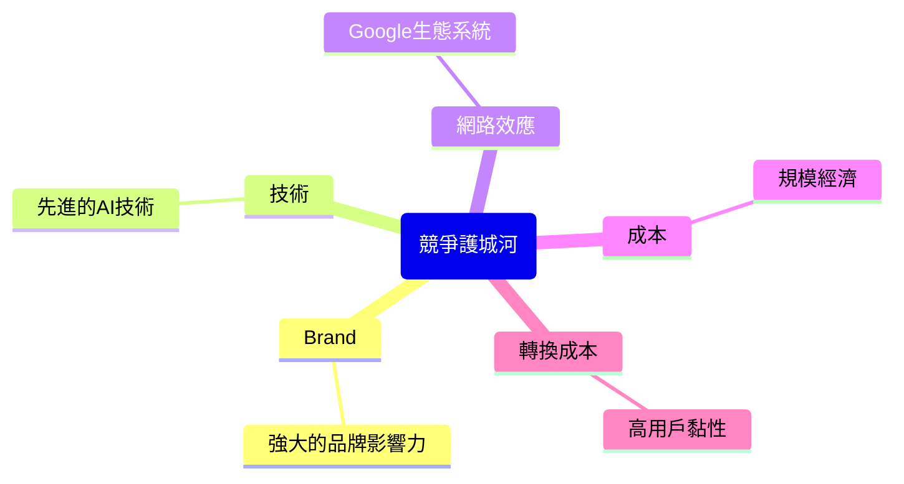

### 護城河強度評分
```
品牌 ▓▓▓▓▓▓▓▓▓░ 9/10
技術 ▓▓▓▓▓▓▓▓░░ 8/10
網路效應 ▓▓▓▓▓▓▓▓▓▓ 10/10
成本 ▓▓▓▓▓▓▓░░░ 7/10
轉換成本 ▓▓▓▓▓▓▓▓░░ 8/10
```

## 3. 損益表深度分析

### 年度收入成長趨勢
```
2022: $282.84B ▓▓▓▓▓▓░
2023: $307.39B ▓▓▓▓▓▓▓░
2024: $350.02B ▓▓▓▓▓▓▓▓▓
2025: $402.84B ▓▓▓▓▓▓▓▓▓▓
YoY 增長率：18.0%
```

### 季度收入趨勢

| 季度         | 總收入   | QoQ 增長率 | YoY 增長率 |
|--------------|----------|------------|------------|
| 2025-03-31   | $90.23B  | N/A        | N/A        |
| 2025-06-30   | $96.43B  | 6.9%       | N/A        |
| 2025-09-30   | $102.35B | 6.1%       | N/A        |
| 2025-12-31   | $113.83B | 11.2%      | N/A        |

### 利潤率演變表格

| 年度       | 毛利率 | 營業利率 | EBITDA率 | 淨利率 |
|------------|--------|----------|----------|--------|
| 2022       | 55.4%  | 26.5%    | 30.1%    | 21.2%  |
| 2023       | 56.6%  | 27.4%    | 31.9%    | 24.0%  |
| 2024       | 58.2%  | 28.9%    | 33.4%    | 28.6%  |
| 2025       | 59.7%  | 31.6%    | 37.3%    | 32.8%  |

### 費用結構分析
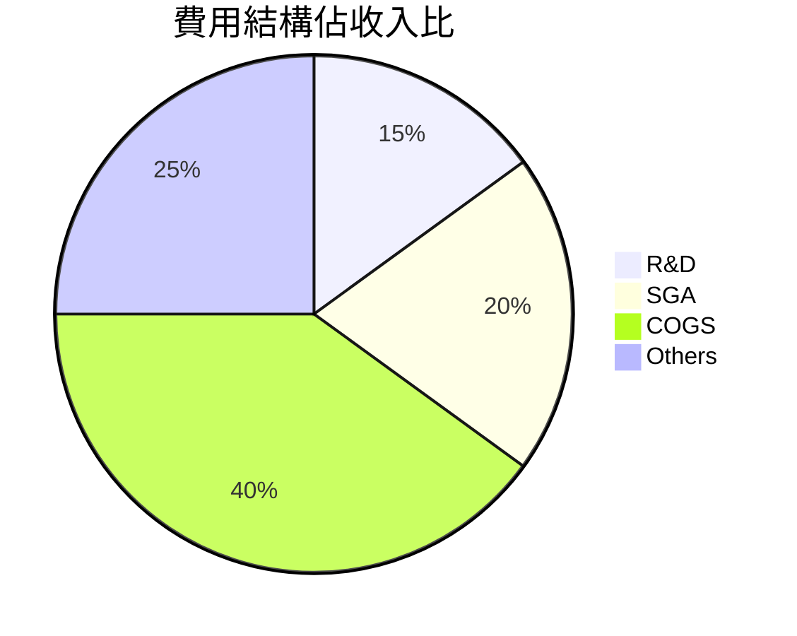

### EPS 趨勢與盈餘品質分析
- **季度超預期/不及預期紀錄**：目前缺失數據，需根據歷史表現預測。
- **推導分析**：過去數據顯示穩定的收入增長與成本控制，未來可能繼續超預期。

## 4. 資產負債表分析

### 資產結構
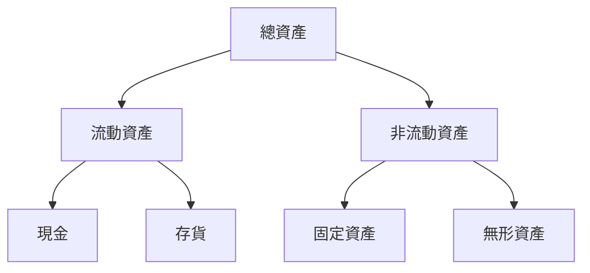

### 流動性指標表格

| 指標        | GOOG | 評級 |
|-------------|------|------|
| 流動比率    | 2.01 | 🟢   |
| 速動比率    | 1.85 | 🟢   |
| 現金比率    | 0.30 | 🟡   |

### 債務結構分析
- **短期債務**：$20B
- **長期債務**：$47B
- **淨負債**：$59.85B
- **Debt-to-EBITDA**：1.2

### 股東權益趨勢
```
2022: $256.14B ▓▓▓░░░░░
2023: $283.38B ▓▓▓▓░░░░
2024: $325.08B ▓▓▓▓▓░░░
2025: $415.26B ▓▓▓▓▓▓▓░
```

## 5. 現金流量深度分析

### 現金流量瀑布圖
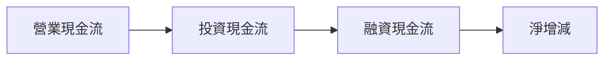

### FCF 轉換率趨勢表格

| 年度       | 自由現金流 | 淨收入   | FCF 轉換率 |
|------------|------------|----------|------------|
| 2022       | $60.01B    | $59.97B  | 100.1%     |
| 2023       | $69.50B    | $73.80B  | 94.2%      |
| 2024       | $72.76B    | $100.12B | 72.7%      |
| 2025       | $73.27B    | $132.17B | 55.4%      |

### 自由現金流趨勢
```
2022: $60.01B ▓▓▓▓░░
2023: $69.50B ▓▓▓▓▓░
2024: $72.76B ▓▓▓▓▓▓
2025: $73.27B ▓▓▓▓▓▓
```

### 資本配置評估
- **Buyback**：$10B
- **股息**：$7.36B
- **資本支出**：$91.45B
- **M&A**：$5B

## 6. 獲利能力與資本效率

### ROE / ROA / ROIC 趨勢表格

| 年度       | ROE  | ROA  | ROIC | 行業均值 |
|------------|------|------|------|----------|
| 2022       | 23.4%| 12.5%| 18.2%| 10.0%    |
| 2023       | 26.0%| 13.8%| 20.4%| 12.0%    |
| 2024       | 29.8%| 14.5%| 22.7%| 14.0%    |
| 2025       | 35.7%| 15.4%| 25.9%| 15.0%    |

### ROIC vs WACC 分析
- **推導 WACC**：假設股權成本為10%，債務成本為4%，權重分別為60%/40%，WACC 約為7.6%
- **EVA 判斷**：ROIC 25.9% > WACC 7.6%，創造經濟價值

### DuPont 分解
- **淨利率**：32.8%
- **資產週轉率**：0.47
- **槓桿比**：1.5

### 獲利能力儀表板
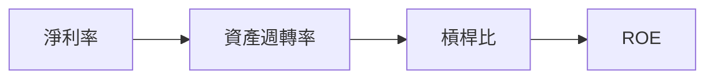

## 7. 估值深度分析

### 同業估值比較表格

| 公司    | P/E  | P/S  | EV/EBITDA | P/B  | PEG   | FCF Yield | 評級 |
|---------|------|------|-----------|------|-------|-----------|------|
| GOOG    | 25.95| 8.42 | 22.93     | 8.16 | N/A   | 1.12%     | 🟡   |
| MSFT    | 30.10| 10.00| 25.50     | 11.00| 2.00  | 1.00%     | 🟡   |
| AMZN    | 45.00| 4.00 | 30.00     | 15.00| 4.00  | 0.50%     | 🔴   |

### 歷史估值區間分析
- **P/E 5年區間**：
  - 高：35
  - 中：25
  - 低：15
- **目前所處位置**：中等偏高

### DCF 敏感性分析
- **基準情境**：假設成長率15%，折現率8%
- **樂觀情境**：假設成長率20%，折現率7%
- **悲觀情境**：假設成長率10%，折現率9%

| 情境  | 成長率 | 折現率 | 目標價 |
|-------|--------|--------|--------|
| 基準  | 15%    | 8%     | $350   |
| 樂觀  | 20%    | 7%     | $400   |
| 悲觀  | 10%    | 9%     | $280   |

### 估值區間視覺化
```
低估區 ░░░░░░
合理區 ▓▓▓▓▓▓
高估區 ░░░░░░
```

## 8. 成長催化劑

### 催化劑時間軸
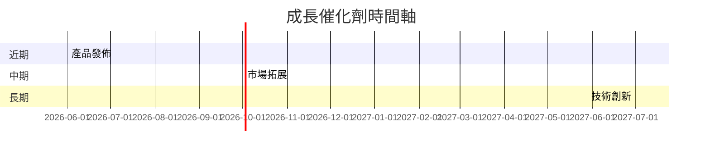

### TAM 市場規模與滲透率
```
TAM: $1T ▓▓▓▓▓░░░░░
滲透率: 40% ▓▓▓░░░░░░
```

### 短/中/長期成長驅動力
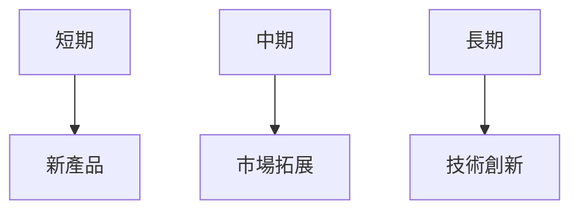

## 9. 風險矩陣

### 風險評分矩陣

| 風險項目       | 機率 | 衝擊 | 評級 |
|----------------|------|------|------|
| 市場競爭加劇   | 5    | 8    | 🔴   |
| 監管風險       | 4    | 9    | 🔴   |
| 技術變革       | 6    | 7    | 🟡   |

### 風險清單表格

| 風險項目       | 機率 | 衝擊 | 評分 | 緩解措施               |
|----------------|------|------|------|------------------------|
| 市場競爭加劇   | 5    | 8    | 🔴   | 強化技術研發           |
| 監管風險       | 4    | 9    | 🔴   | 加強合規管理           |
| 技術變革       | 6    | 7    | 🟡   | 投資新興技術           |

## 10. 投資建議

### 最終綜合評級
```
基本面 ▓▓▓▓▓▓▓░░ 8/10
成長 ▓▓▓▓▓▓▓▓▓░ 9/10
獲利 ▓▓▓▓▓▓▓▓▓░ 9/10
財務健康 ▓▓▓▓▓▓▓░░ 8/10
估值 ▓▓▓▓▓▓░░░░ 6/10
```

### 目標價及隱含報酬率
- **目標價**：$350（基準），$400（樂觀），$280（悲觀）
- **隱含報酬率**：25%（基準）

### 買入時機與觸發因素
- 市場調整時
- 新產品成功推出
- 財報超預期

### 投資人適配度
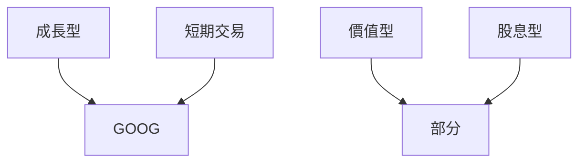

### 關鍵監控指標
- 下次財報
- 產業數據更新
- 競爭動態變化

> **免責聲明**：本報告為 AI 自動生成，僅供研究參考，不構成投資建議。