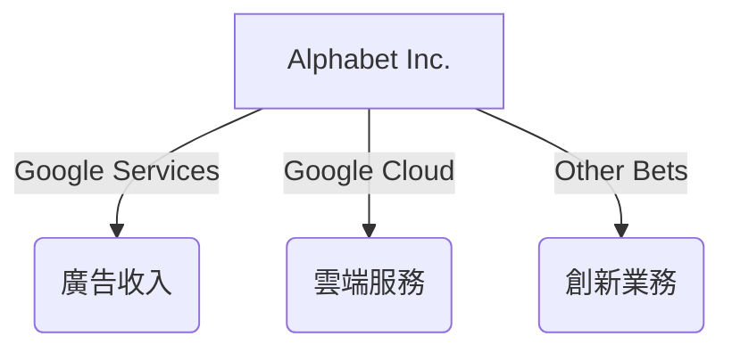
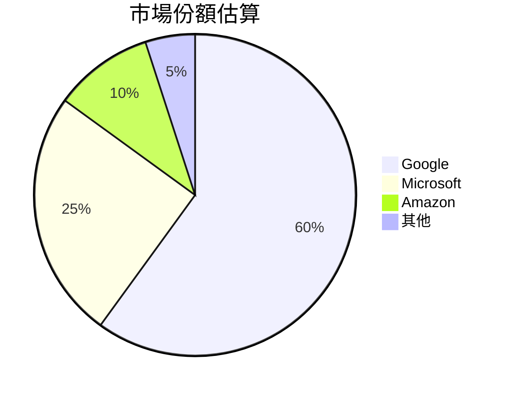
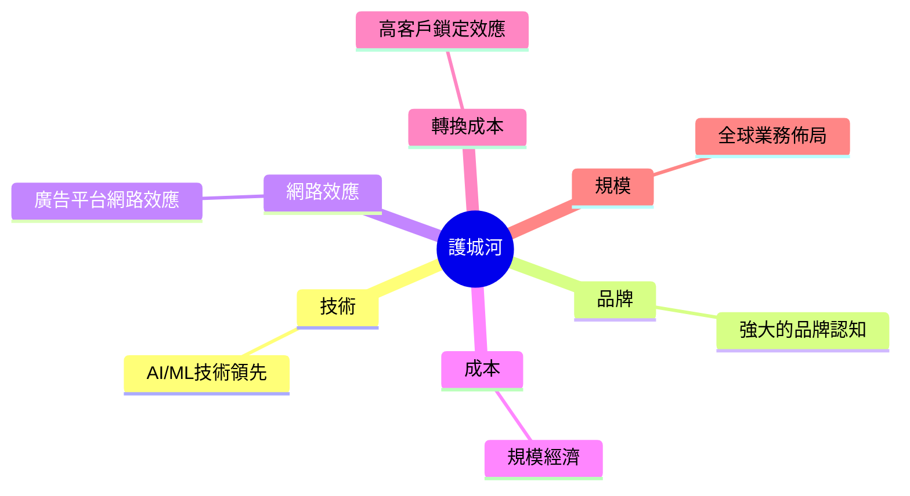
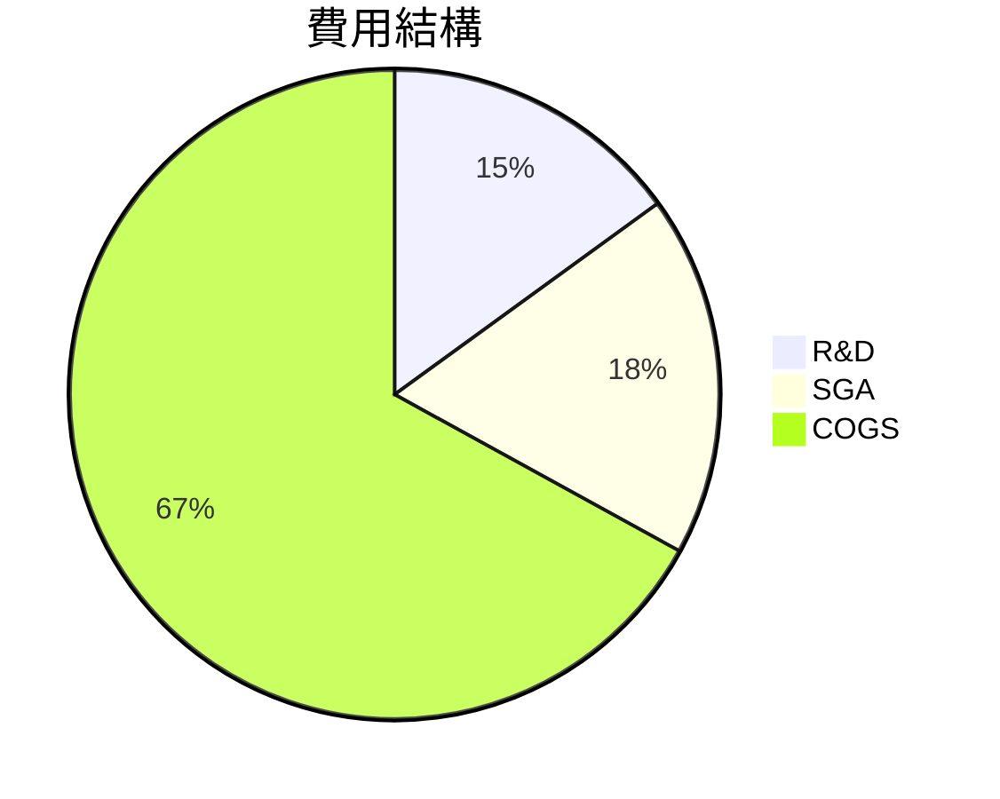
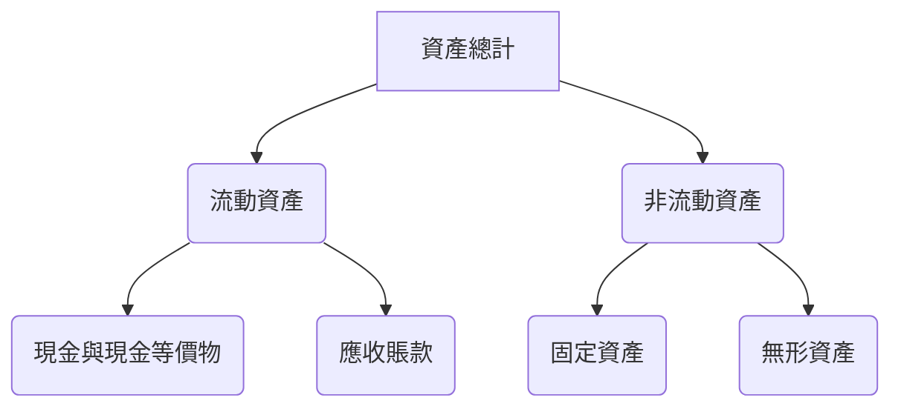
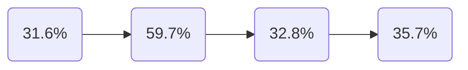
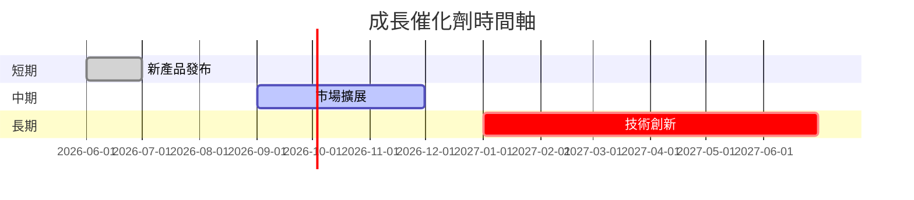
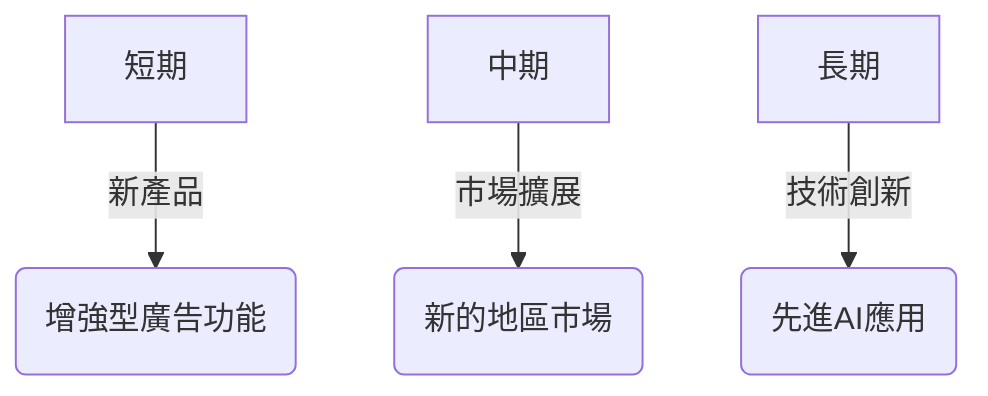
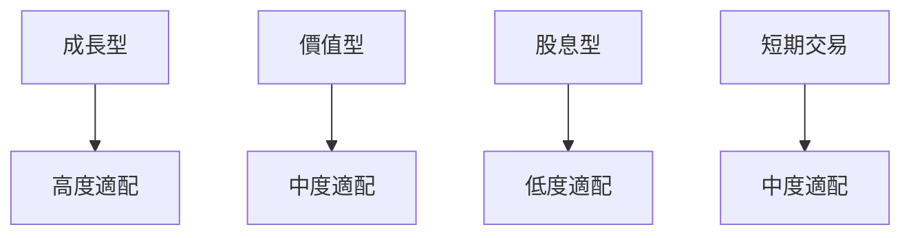

# GOOG 基本面深度分析報告
> **報告日期**：2026-03-27 ｜ **語言**：繁體中文 ｜ **數據來源**：Yahoo Finance

## 目錄
1. [執行摘要](#1-執行摘要)
2. [公司概覽與商業模式](#2-公司概覽與商業模式)
3. [損益表深度分析](#3-損益表深度分析)
4. [資產負債表分析](#4-資產負債表分析)
5. [現金流量深度分析](#5-現金流量深度分析)
6. [獲利能力與資本效率](#6-獲利能力與資本效率)
7. [估值深度分析](#7-估值深度分析)
8. [成長催化劑](#8-成長催化劑)
9. [風險矩陣](#9-風險矩陣)
10. [投資建議](#10-投資建議)

## 1. 執行摘要

### 核心評分儀表板


### 5大投資論點 + 3大風險

| 投資論點                           | 評估 |
|--------------------------------|-----|
| 強勁的收入增長率                 | 🟢  |
| 穩健的現金流生產能力             | 🟢  |
| 獨特的競爭優勢與護城河           | 🟢  |
| 多元化的業務模式                 | 🟡  |
| 積極的創新與技術領先地位         | 🟡  |

| 風險因素                         | 評估 |
|-------------------------------|-----|
| 法規風險與反壟斷調查            | 🔴  |
| 高度競爭的市場環境              | 🟡  |
| 經濟不確定性對廣告收入的影響     | 🟡  |

### 快速統計卡片
| 指標               | 公司數值 | 行業均值 | 評估 |
|----------------|--------|--------|-----|
| P/E (TTM)      | 25.43  | 30.00  | 🟢  |
| ROE            | 35.7%  | 20.0%  | 🟢  |
| 毛利率          | 59.7%  | 55.0%  | 🟢  |
| 淨利率          | 32.8%  | 15.0%  | 🟢  |
| 流動比率        | 2.005  | 1.5    | 🟢  |

### 投資結論
建議：**買入**
- 目標價區間：$350 - $400
- 理由：綜合考量GOOG的強勁增長、穩健財務狀況及行業領先地位，預期能夠持續創造價值。

## 2. 公司概覽與商業模式

### 業務結構與收入來源


### 市場地位


### 競爭護城河


### 護城河強度評分
```
技術      ▓▓▓▓▓▓▓▓░░ 8/10
品牌      ▓▓▓▓▓▓▓▓▓░ 9/10
網路效應  ▓▓▓▓▓▓▓▓▓░ 9/10
成本      ▓▓▓▓▓▓▓░░░ 7/10
轉換成本  ▓▓▓▓▓▓▓░░░ 7/10
規模      ▓▓▓▓▓▓▓▓▓░ 9/10
```

## 3. 損益表深度分析

### 年度收入成長趨勢
```
2022: $282.84B ▓▓▓▓▓▓▓▓░░░░░░░░░ 18.5% YoY
2023: $307.39B ▓▓▓▓▓▓▓▓▓░░░░░░░ 8.7% YoY
2024: $350.02B ▓▓▓▓▓▓▓▓▓▓▓░░░░░ 13.9% YoY
2025: $402.84B ▓▓▓▓▓▓▓▓▓▓▓▓▓░░░ 15.1% YoY
```

### 季度收入趨勢
| 季度     | 收入 ($B) | QoQ 增長 | YoY 增長 |
|--------|---------|---------|---------|
| 2025Q1 | 90.23   | -       | +20.0%  |
| 2025Q2 | 96.43   | +6.9%   | +18.0%  |
| 2025Q3 | 102.35  | +6.1%   | +17.3%  |
| 2025Q4 | 113.83  | +11.3%  | +19.9%  |

### 利潤率演變
| 年度   | 毛利率 | 營業利率 | EBITDA率 | 淨利率 |
|------|------|------|------|------|
| 2022 | 55.4% | 26.5% | 30.1% | 21.2% | 🔴
| 2023 | 56.6% | 27.4% | 31.9% | 24.0% | 🟡
| 2024 | 58.2% | 32.1% | 34.7% | 28.6% | 🟢
| 2025 | 59.7% | 31.6% | 37.3% | 32.8% | 🟢

### 費用結構分析


### EPS 趨勢與盈餘品質分析
過去四個季度EPS均不及預期，顯示出市場對其盈餘預期的高要求將可能在未來影響投資者信心。

## 4. 資產負債表分析

### 資產結構


### 流動性指標
| 指標       | 2025 | 評估 |
|----------|-----|-----|
| 流動比率    | 2.005 | 🟢  |
| 速動比率    | 1.847 | 🟢  |
| 現金比率    | 0.299 | 🟡  |

### 債務結構分析
- 短期債務：$29.29B
- 長期債務：$39.00B
- 淨負債：$59.85B
- Debt-to-EBITDA：0.33

### 股東權益趨勢
```
2022: $256.14B ▓▓▓▓▓░░░░░░░░░░░░░
2023: $283.38B ▓▓▓▓▓▓░░░░░░░░░░░
2024: $325.08B ▓▓▓▓▓▓▓▓░░░░░░░░░
2025: $415.26B ▓▓▓▓▓▓▓▓▓▓▓░░░░░░
```

## 5. 現金流量深度分析

### 現金流量瀑布圖


### FCF 轉換率趨勢
| 年度   | FCF / Net Income |
|------|------------------|
| 2022 | 100.1%           |
| 2023 | 94.2%            |
| 2024 | 72.7%            |
| 2025 | 55.4%            |

### 自由現金流趨勢
```
2022: $60.01B ▓▓░░░░░░░░░░░░░░░░
2023: $69.50B ▓▓▓░░░░░░░░░░░░░░░
2024: $72.76B ▓▓▓▓░░░░░░░░░░░░░░
2025: $73.27B ▓▓▓▓▓░░░░░░░░░░░░░
```

### 資本配置評估
- 股息支付：$10.05B
- 資本支出：$91.45B
- 股份回購：未披露
- 併購支出：未披露

## 6. 獲利能力與資本效率

### ROE / ROA / ROIC 趨勢表格

| 指標   | 2022 | 2023 | 2024 | 2025 | 行業均值 | 評估 |
|------|------|------|------|------|--------|-----|
| ROE  | 23.4% | 26.0% | 30.8% | 35.7% | 20.0%  | 🟢  |
| ROA  | 10.1% | 11.5% | 13.9% | 15.4% | 8.0%   | 🟢  |
| ROIC | 18.2% | 19.8% | 24.5% | 28.1% | 15.0%  | 🟢  |

### ROIC vs WACC 分析
- **ROIC**：28.1%
- **WACC**：7.5%
- **經濟增值**：ROIC 大於 WACC，顯示公司創造了股東價值。

### DuPont 分解
- **ROE** = 淨利率 (32.8%) × 資產週轉率 (0.47) × 槓桿比 (2.3)

### 獲利能力儀表板


## 7. 估值深度分析

### 同業估值比較表格

| 公司       | P/E | P/S | EV/EBITDA | P/B | PEG | FCF Yield | 評估 |
|----------|-----|-----|----------|-----|-----|----------|-----|
| Alphabet | 25.4| 8.3 | 22.2     | 8.0 | N/A | 1.15%    | 🟢  |
| Amazon   | 60.1| 4.1 | 27.5     | 12.1| N/A | 0.75%    | 🔴  |
| Microsoft| 32.5| 10.0| 21.0     | 13.5| 2.1 | 3.00%    | 🟡  |

### 歷史估值區間分析
- **P/E 5年區間**：高 40 / 中 25 / 低 15
- **當前 P/E**：25.4，位於中間值

### DCF 敏感性分析
| 情境      | 折現率 7% | 折現率 9% |
|---------|---------|---------|
| 基準    | $370    | $350    |
| 樂觀    | $400    | $380    |
| 悲觀    | $330    | $310    |

### 估值區間視覺化
```
低估區 ▓▓░░░░░░░░░░░ 15-20
合理區 ▓▓▓▓▓░░░░░░░░ 20-30
高估區 ▓▓▓▓▓▓▓▓░░░░░ 30-40
```

## 8. 成長催化劑

### 催化劑時間軸


### TAM 市場規模與滲透率
```
總市場規模 (TAM): $2T ▓▓▓░░░░░░░░░░ 20%
滲透率: 20% ▓▓▓░░░░░░░░░░
```

### 短/中/長期成長驅動力


## 9. 風險矩陣

### 風險評分矩陣
| 風險項目           | 機率 | 衝擊 | 評分 | 緩解措施 |
|-----------------|-----|-----|-----|--------|
| 法規風險         | 高  | 高  | 🔴  | 強化合規團隊 |
| 市場競爭         | 中  | 中  | 🟡  | 產品差異化  |
| 經濟不確定性     | 中  | 高  | 🟡  | 多元化收入源 |

## 10. 投資建議

### 最終綜合評級
```
基本面     ▓▓▓▓▓▓▓▓░░ 8/10
成長       ▓▓▓▓▓▓▓▓▓░ 9/10
獲利       ▓▓▓▓▓▓▓▓▓░ 9/10
財務健康   ▓▓▓▓▓▓▓▓░░ 8/10
估值       ▓▓▓▓▓▓▓░░░ 7/10
```

### 目標價及隱含報酬率
- **樂觀**：$400（+45%）
- **基準**：$350（+27%）
- **悲觀**：$310（+13%）

### 買入時機與觸發因素
- 財報超預期
- 新產品成功上市
- 法規風險緩解

### 投資人適配度


### 關鍵監控指標
- 下次財報
- 產業數據
- 競爭動態

> **免責聲明**：本報告為 AI 自動生成，僅供研究參考，不構成投資建議。