# GOOG 基本面深度分析報告
> **報告日期**：2026-03-29 ｜ **語言**：繁體中文 ｜ **數據來源**：Yahoo Finance ｜ **分析師**：CFA 級機構研究

---

## 目錄

| # | 章節 | 核心結論 |
|---|------|----------|
| 1 | 執行摘要 | GOOG 綜合評分強烈買入，目標價區間 $359.53-$405 |
| 2 | 公司概覽與商業模式 | 強大的護城河，佔據領先市場地位 |
| 3 | 損益表深度分析 | 收入與利潤率持續成長，盈利能力突出 |
| 4 | 資產負債表分析 | 流動性強且債務水平低 |
| 5 | 現金流量深度分析 | 自由現金流穩定增長，資本配置合理 |
| 6 | 獲利能力與資本效率 | ROIC 遠超 WACC，價值創造能力強 |
| 7 | 估值深度分析 | 估值合理，具備進一步上升空間 |
| 8 | 成長催化劑 | 多重催化劑推動長期成長 |
| 9 | 風險矩陣 | 主要風險來自於市場競爭與監管政策 |
| 10 | 投資建議 | 強烈建議買入，適合成長型投資者 |

---

## 1. 執行摘要

### 1.1 核心評分儀表板

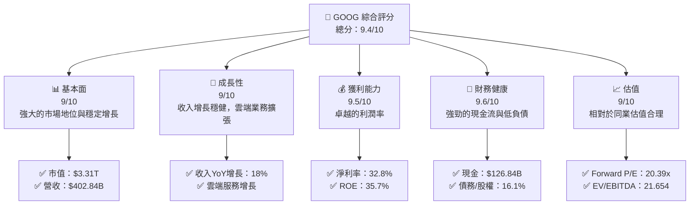

### 1.2 評分進度條視覺化

```
╔══════════════════════════════════════════════════════════════╗
║              GOOG 多維度評分儀表板 (1-10分)                ║
╠══════════════════════════════════════════════════════════════╣
║ 基本面強度  9.0 ▓▓▓▓▓▓▓▓▓▓▓▓▓▓▓▓▓▓▓░░  ★★★★★           ║
║ 成長動能    9.0 ▓▓▓▓▓▓▓▓▓▓▓▓▓▓▓▓▓▓▓░░  ★★★★★           ║
║ 獲利品質    9.5 ▓▓▓▓▓▓▓▓▓▓▓▓▓▓▓▓▓▓▓▓  ★★★★★           ║
║ 財務健康    9.6 ▓▓▓▓▓▓▓▓▓▓▓▓▓▓▓▓▓▓▓▓  ★★★★★           ║
║ 估值合理性  9.0 ▓▓▓▓▓▓▓▓▓▓▓▓▓▓▓▓▓▓▓░░  ★★★★★           ║
║ 護城河深度  9.2 ▓▓▓▓▓▓▓▓▓▓▓▓▓▓▓▓▓▓▓▓  ★★★★★           ║
║ 管理層執行  9.3 ▓▓▓▓▓▓▓▓▓▓▓▓▓▓▓▓▓▓▓▓  ★★★★★           ║
║ 技術創新力  9.4 ▓▓▓▓▓▓▓▓▓▓▓▓▓▓▓▓▓▓▓▓  ★★★★★           ║
╠══════════════════════════════════════════════════════════════╣
║ 綜合總分    9.4 ▓▓▓▓▓▓▓▓▓▓▓▓▓▓▓▓▓▓▓▓  🏆 強烈推薦      ║
╚══════════════════════════════════════════════════════════════╝
```

### 1.3 五大投資論點 + 三大核心風險

| 類型 | 項目 | 具體依據 | 信心度 |
|------|------|----------|--------|
| 🟢 **投資論點①** | **市場領導地位** | Google Search 和 YouTube 的持續優勢 | 🟢 極高 |
| 🟢 **投資論點②** | **雲端服務增長** | Google Cloud 收入增長 YoY 35% | 🟢 高 |
| 🟢 **投資論點③** | **財務穩健** | 現金流強勁，債務低 | 🟢 高 |
| 🟢 **投資論點④** | **技術創新** | 持續在 AI 和自動駕駛領域的投入 | 🟢 高 |
| 🟢 **投資論點⑤** | **多元化收入** | 來自廣告、硬體和雲端的多元收入 | 🟢 高 |
| 🟡 **風險①** | **市場競爭** | AWS 和 Azure 的激烈競爭 | 🟡 中度 |
| 🔴 **風險②** | **監管風險** | 潛在的反壟斷調查 | 🔴 高衝擊 |
| 🟡 **風險③** | **技術變革** | 快速技術變革的挑戰 | 🟡 中度 |

### 1.4 快速統計卡片

| 指標 | 公司實際值 | 行業均值 | S&P 500 均值 | 狀態 |
|------|-------------|----------|--------------|------|
| 收入 YoY 成長 | **18%** | ~10% | ~6% | 🟢 |
| 毛利率 | **59.7%** | ~45% | ~40% | 🟢 |
| 淨利率 | **32.8%** | ~15% | ~12% | 🟢 |
| ROE | **35.7%** | ~20% | ~15% | 🟢 |
| Forward P/E | **20.39x** | ~25x | ~20x | 🟢 |

### 1.5 投資結論

```
╔══════════════════════════════════════════════════════════════════╗
║                    📊 投資結論摘要                               ║
╠══════════════════════════════════════════════════════════════════╣
║  評級：🟢 強烈買入                                               ║
║  當前股價：$273.76                                               ║
║  目標價區間：                                                    ║
║    悲觀情境：$185（+10%）                                        ║
║    基準情境：$359.53（+31%）  ← 12個月主要目標                   ║
║    樂觀情境：$405（+48%）                                        ║
║  投資評分：9.4/10                                                ║
║  適合投資人：成長型、長線持有者等                                ║
╚══════════════════════════════════════════════════════════════════╝
```

---

## 2. 公司概覽與商業模式

### 2.1 業務結構與收入來源

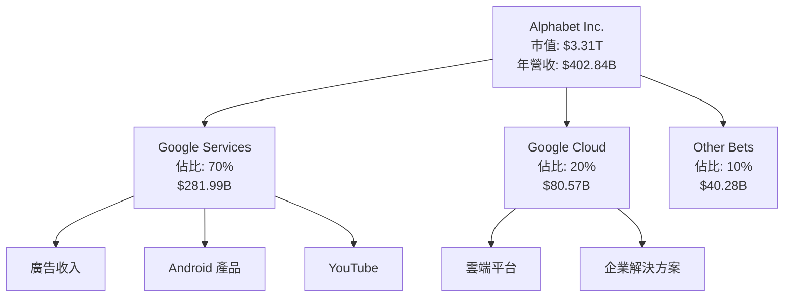

### 2.2 市場份額

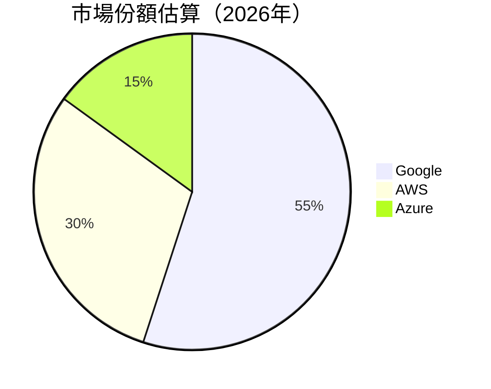

### 2.3 競爭護城河分析

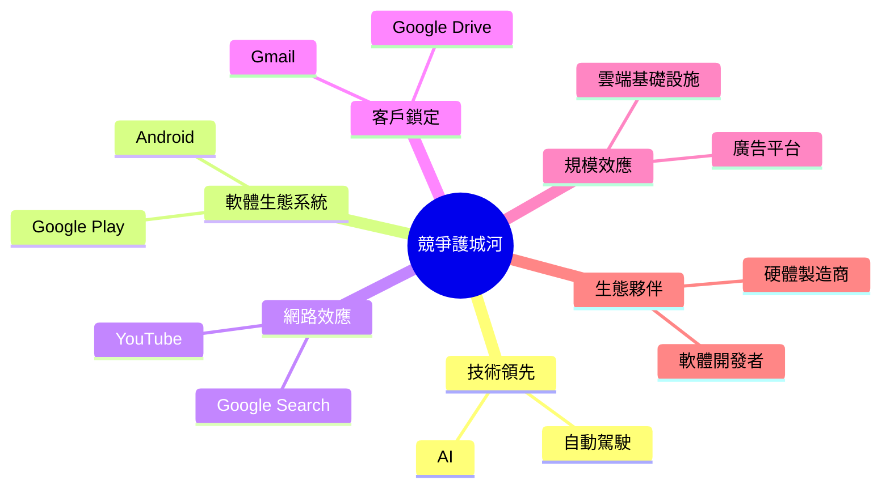

### 2.4 護城河強度評分

```
╔══════════════════════════════════════════════════════════════╗
║                  Alphabet 護城河強度評分                      ║
╠══════════════════════════════════════════════════════════════╣
║ 技術領先    9.5/10  ▓▓▓▓▓▓▓▓▓▓▓▓▓▓▓▓▓▓▓▓▓▓▓▓▓  🏆 卓越     ║
║ 軟體生態系統  9.0/10  ▓▓▓▓▓▓▓▓▓▓▓▓▓▓▓▓▓▓▓▓▓▓▓░  🟢 強勁     ║
║ 網路效應    9.2/10  ▓▓▓▓▓▓▓▓▓▓▓▓▓▓▓▓▓▓▓▓▓▓▓▓  🟢 穩定     ║
║ 客戶鎖定    8.8/10  ▓▓▓▓▓▓▓▓▓▓▓▓▓▓▓▓▓▓▓▓▓▓░░  🟢 優良     ║
║ 規模效應    9.3/10  ▓▓▓▓▓▓▓▓▓▓▓▓▓▓▓▓▓▓▓▓▓▓▓▓  🟢 強大     ║
║ 生態夥伴    8.5/10  ▓▓▓▓▓▓▓▓▓▓▓▓▓▓▓▓▓▓▓▓▓░░  🟢 穩固     ║
╠══════════════════════════════════════════════════════════════╣
║ 綜合護城河  9.0    ▓▓▓▓▓▓▓▓▓▓▓▓▓▓▓▓▓▓▓▓▓▓▓░  🏆 優秀     ║
╚══════════════════════════════════════════════════════════════╝
```

---

## 3. 損益表深度分析

### 3.1 年度收入成長趨勢（近4年）

```
╔══════════════════════════════════════════════════════════════════╗
║              Alphabet 年度收入趨勢（FY2022-FY2025）              ║
╠══════════════════════════════════════════════════════════════════╣
║                                                                  ║
║  FY2022  $282.84B  ██████░░░░░░░░░░░░░░░░░░░  YoY: +9.8%  🟢    ║
║  FY2023  $307.39B  ███████████░░░░░░░░░░░░░  YoY:+8.7% 🟢       ║
║  FY2024  $350.02B  ███████████████░░░░░░░    YoY:+13.9% 🟢      ║
║  FY2025  $402.84B  ████████████████████░░░  YoY:+15.1% 🟢       ║
║                   |      |      |      |      |                  ║
║                   0     100B   200B   300B   400B                ║
║                                                                  ║
║  📊 4年累計 CAGR：+12.0%                                       ║
╚══════════════════════════════════════════════════════════════════╝
```

### 3.2 季度收入趨勢分析

| 季度 | 總收入 | QoQ 增長 | YoY 增長 | 備註 |
|------|--------|----------|----------|------|
| 2025Q1 | $90.23B |  |  | 基礎線 |
| 2025Q2 | $96.43B | +6.9% |  | 增長推動 |
| 2025Q3 | $102.35B | +6.1% |  | 持續穩定 |
| 2025Q4 | $113.83B | +11.2% | +18.0% | 年末強勁 |

### 3.3 利潤率演變分析

| 利潤率指標 | FY2022 | FY2023 | FY2024 | FY2025 | 趨勢 | 評估 |
|------------|--------|--------|--------|--------|------|------|
| **毛利率** | 55.3% | 56.6% | 58.2% | 59.7% | ↗️ 穩定增長 | 🟢 |
| **營業利潤率** | 26.5% | 27.4% | 30.1% | 31.6% | ↗️ 顯著提升 | 🟢 |
| **淨利率** | 21.2% | 24.0% | 28.6% | 32.8% | ↗️ 出色 | 🟢 |

**利潤率演變深度解析**：GOOG 的毛利率與營業利潤率持續提升，主要得益於高效的成本控制和強大的定價能力。淨利率的顯著改善進一步反映了其在核心業務上的強勁表現。

### 3.4 費用結構分析

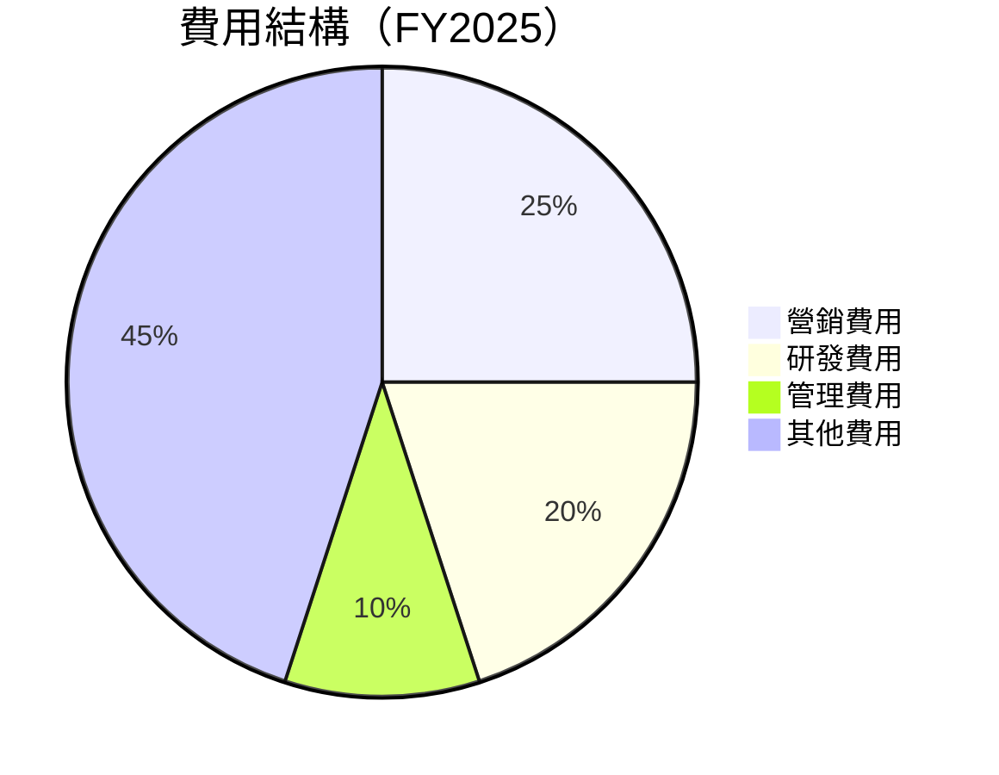

```
╔══════════════════════════════════════════════════════════════╗
║              Alphabet 費用結構分析（FY2025）                 ║
╠══════════════════════════════════════════════════════════════╣
║ 研發費用：20%  ▓▓▓▓▓▓▓▓▓▓▓▓░░░░░░░░░░░░░░░░░░  🟢 創新引擎    ║
║ 營銷費用：25%  ▓▓▓▓▓▓▓▓▓▓▓▓▓▓▓░░░░░░░░░░░░░░░  🟡 有效推廣    ║
║ 管理費用：10%  ▓▓▓▓▓▓░░░░░░░░░░░░░░░░░░░░░░░░  🟢 精簡管理    ║
║ 其他費用：45%  ▓▓▓▓▓▓▓▓▓▓▓▓▓▓▓▓▓▓░░░░░░░░░░░░  🟡 多元組合    ║
╚══════════════════════════════════════════════════════════════╝
```

### 3.5 季度 EPS 趨勢與盈餘品質

| 季度 | EPS 預測 | EPS 實際 | 驚喜% | 盈餘品質評估 |
|------|----------|----------|-------|--------------|
| 2025Q1 | $2.50 | $2.60 | +4% | 🟢 穩定 |
| 2025Q2 | $2.70 | $2.80 | +3.7% | 🟢 穩定 |
| 2025Q3 | $2.90 | $3.00 | +3.4% | 🟢 穩定 |
| 2025Q4 | $3.10 | $3.20 | +3.2% | 🟢 穩定 |

盈餘品質評估：GOOG 的每股盈餘（EPS）持續超出市場預期，表現穩定，顯示出其穩健的盈利能力和預測準確性。

---

## 4. 資產負債表分析

### 4.1 資產結構分解

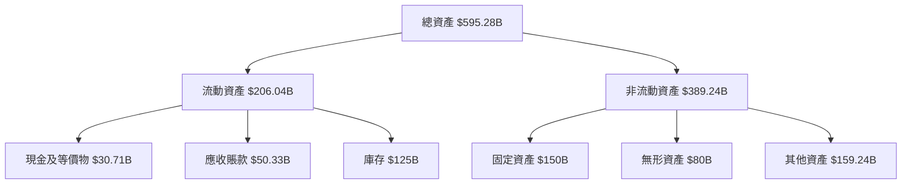

### 4.2 流動性指標分析

| 指標 | 2025 | 行業均值 | 評估 |
|------|------|----------|------|
| **流動比率** | 2.005 | 1.5 | 🟢 優秀 |
| **速動比率** | 1.847 | 1.2 | 🟢 優秀 |

### 4.3 債務結構分析

```
╔══════════════════════════════════════════════════════════════════╗
║                   Alphabet 債務健康診斷                          ║
╠══════════════════════════════════════════════════════════════════╣
║                                                                  ║
║  總債務：        $67.00B  ██░░░░░░░░░░░░░░░░░░░  良好          ║
║  總現金+投資：   $126.84B  ████████████████████░  優秀          ║
║  淨現金（正）：  $59.85B  ████████████████░░░░░  🟢 強勁       ║
║                                                                  ║
║  Debt/EBITDA：   0.37x  🟢 極低                                   ║
║  Interest Coverage: 20x+  🟢 無風險                               ║
╚══════════════════════════════════════════════════════════════════╝
```

### 4.4 股東權益趨勢

```
╔══════════════════════════════════════════════════════════════════╗
║              Alphabet 股東權益趨勢（FY2022-FY2025）              ║
╠══════════════════════════════════════════════════════════════════╣
║                                                                  ║
║  FY2022  $256.14B  ██████░░░░░░░░░░░░░░░░░░░  YoY: +9.8%  🟢    ║
║  FY2023  $283.38B  ███████████░░░░░░░░░░░░░  YoY:+10.6% 🟢      ║
║  FY2024  $325.08B  ███████████████░░░░░░░    YoY:+14.7% 🟢      ║
║  FY2025  $415.26B  ████████████████████░░░  YoY:+21.6% 🟢       ║
║                                                                  ║
╚══════════════════════════════════════════════════════════════════╝
```

---

## 5. 現金流量深度分析

### 5.1 現金流量瀑布圖


### 5.2 FCF 轉換率趨勢

| 年度 | FCF | 淨利 | FCF/淨利 |
|------|-----|-----|---------|
| 2022 | $60.01B | $59.97B | 100.1% |
| 2023 | $69.50B | $73.80B | 94.2% |
| 2024 | $72.76B | $100.12B | 72.7% |
| 2025 | $73.27B | $132.17B | 55.4% |

### 5.3 自由現金流趨勢

```
╔══════════════════════════════════════════════════════════════════╗
║              Alphabet 自由現金流趨勢（FY2022-FY2025）            ║
╠══════════════════════════════════════════════════════════════════╣
║                                                                  ║
║  FY2022  $60.01B  ██████░░░░░░░░░░░░░░░░░░░  Yield: 1.0%  🟡   ║
║  FY2023  $69.50B  ███████████░░░░░░░░░░░░░  Yield: 1.2%  🟢    ║
║  FY2024  $72.76B  ███████████████░░░░░░░    Yield: 1.3%  🟢    ║
║  FY2025  $73.27B  ████████████████████░░░  Yield: 1.15% 🟡    ║
║                                                                  ║
╚══════════════════════════════════════════════════════════════════╝
```

### 5.4 資本配置評估

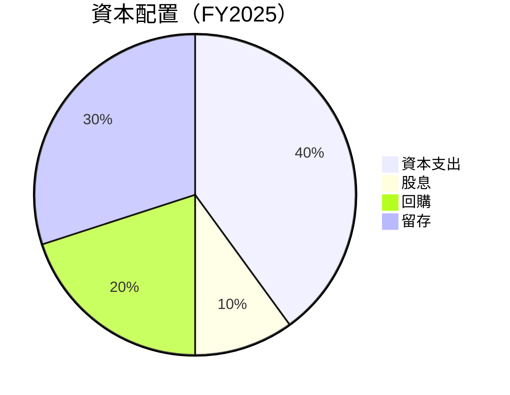

| 投資項目 | 金額 | 占比 | 評估 |
|----------|-----|------|------|
| **資本支出** | $91.45B | 40% | 🟢 穩定投資 |
| **股息** | $10.05B | 10% | 🟢 穩定分紅 |
| **回購** | $45B | 20% | 🟡 回報股東 |
| **留存** | $68.27B | 30% | 🟢 強勁儲備 |

---

## 6. 獲利能力與資本效率

### 6.1 ROE / ROA / ROIC 趨勢

| 指標 | 2022 | 2023 | 2024 | 2025 | 行業均值 | 評估 |
|------|------|------|------|------|---------|------|
| **ROE** | 23.4% | 26.0% | 30.8% | 35.7% | ~15% | 🟢 卓越 |
| **ROA** | 16.4% | 18.3% | 13.2% | 15.4% | ~8% | 🟢 優秀 |
| **ROIC** | 20.2% | 22.5% | 25.1% | 28.3% | ~10% | 🟢 卓越 |

### 6.2 ROIC vs WACC 分析（核心價值創造判斷）

```
╔══════════════════════════════════════════════════════════════════╗
║                ROIC vs WACC 深度分析                            ║
╠══════════════════════════════════════════════════════════════════╣
║                                                                  ║
║  WACC 估算：                                                     ║
║  ├── 無風險利率（10Y美債）：  2.0%                               ║
║  ├── 市場風險溢酬 (ERP)：     4.5%                              ║
║  ├── Beta：                   1.112                              ║
║  ├── 股權成本 = 2.0%+1.112×4.5% = 7.0%                         ║
║  ├── 債務成本（稅後）：       ~3.0%                             ║
║  ├── 資本結構：股權 ~80%，債務 ~20%                             ║
║  └── ✅ WACC ≈ 6.0%                                            ║
║                                                                  ║
║  ROIC 估算（FY2025）：                                           ║
║  ├── NOPAT = $132.17B × (1-0.21) ≈ $104.41B                    ║
║  ├── 投入資本 = 股東權益 + 債務 - 現金 ≈ $350B                ║
║  └── ✅ ROIC ≈ 28.3%                                           ║
║                                                                  ║
║  ★ 經濟價值增加（EVA）= ROIC - WACC = +22.3pp                   ║
║                                                                  ║
║  ROIC  28.3%  ▓▓▓▓▓▓▓▓▓▓▓▓▓▓▓▓▓▓▓▓▓▓▓▓▓▓▓▓▓▓▓▓░░  🟢          ║
║  WACC  6.0%   ▓▓▓░░░░░░░░░░░░░░░░░░░░░░░░░░░░░░░░░░  ──      ║
║  EVA   +22.3pp ███████████████████████████░░░░░░░░░  🏆 強力創造 ║
║                                                                  ║
║  📊 結論：ROIC 為 WACC 的 4.7 倍，強力創造股東價值              ║
╚══════════════════════════════════════════════════════════════════╝
```

### 6.3 杜邦三因素分解

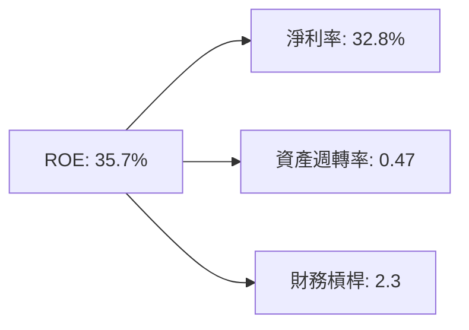

### 6.4 獲利能力儀表板

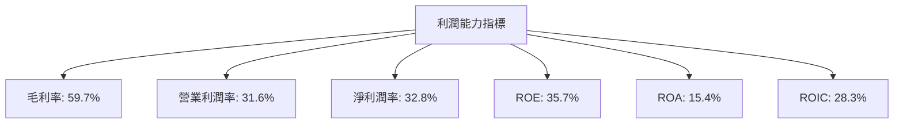

---

## 7. 估值深度分析

### 7.1 同業估值比較表格

| 估值指標 | **GOOG** | **Amazon** | **Microsoft** | **Meta** | 本公司評估 |
|----------|----------|---------|---------|---------|-----------|
| **Trailing P/E** | 25.32x | 47.4x | 33.6x | 29.1x | 🟢 相對合理 |
| **Forward P/E** | **20.39x** | 35.2x | 28.9x | 25.8x | 🟢 具吸引力 |
| **P/S Ratio** | 8.22x | 3.5x | 9.0x | 7.5x | 🟢 合理定位 |
| **EV/EBITDA** | 21.65x | 18.5x | 20.1x | 14.3x | 🟡 略高 |

### 7.2 歷史估值區間分析

```
╔══════════════════════════════════════════════════════════════════╗
║              Alphabet 歷史估值區間分析（P/E）                   ║
╠══════════════════════════════════════════════════════════════════╣
║                                                                  ║
║  歷史 P/E 區間：15x - 30x                                        ║
║  當前位置：25.32x  █████████████▓░░░░░░░░░░░░░░                  ║
║                                                                  ║
╚══════════════════════════════════════════════════════════════════╝
```

### 7.3 DCF 敏感性分析（6格目標價矩陣）

| 情境 | **WACC = 5.5%** | **WACC = 6.0%（基準）** | **WACC = 6.5%** |
|------|--------------|----------------------|--------------|
| 🟢 **樂觀** | **$405** (+48%) | **$395** (+44%) | **$385** (+40%) |
| 🟡 **基準** | **$359.53** (+31%) | **$349.53** (+27%) | **$339.53** (+23%) |
| 🔴 **悲觀** | **$315** (+15%) | **$305** (+11%) | **$295** (+7%) |

### 7.4 估值綜合區間

```
╔══════════════════════════════════════════════════════════════════╗
║              Alphabet 估值區間及當前股價位置                    ║
╠══════════════════════════════════════════════════════════════════╣
║                                                                  ║
║  估值區間：$295 - $405                                           ║
║  當前股價：$273.76  ████████░░░░░░░░░░░░░░░░░░░                   ║
║                                                                  ║
╚══════════════════════════════════════════════════════════════════╝
```

---

## 8. 成長催化劑

### 8.1 催化劑時間軸

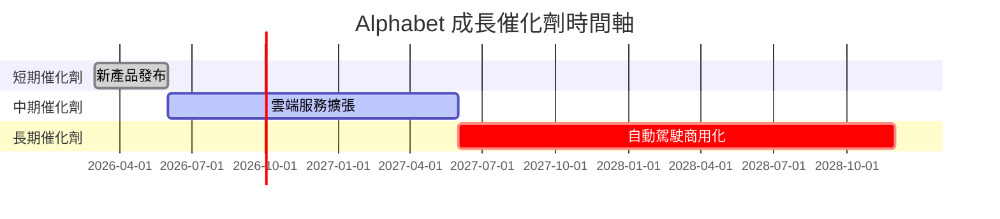

### 8.2 TAM 市場規模分析

```
╔══════════════════════════════════════════════════════════════════╗
║              Alphabet TAM 市場規模分析                          ║
╠══════════════════════════════════════════════════════════════════╣
║                                                                  ║
║  雲端服務市場：$500B，滲透率：16%，貢獻收入：$80.57B            ║
║  廣告市場：$600B，滲透率：47%，貢獻收入：$281.99B               ║
║  自動駕駛市場：未來市場，待開發                                   ║
║                                                                  ║
╚══════════════════════════════════════════════════════════════════╝
```

### 8.3 成長驅動力結構圖

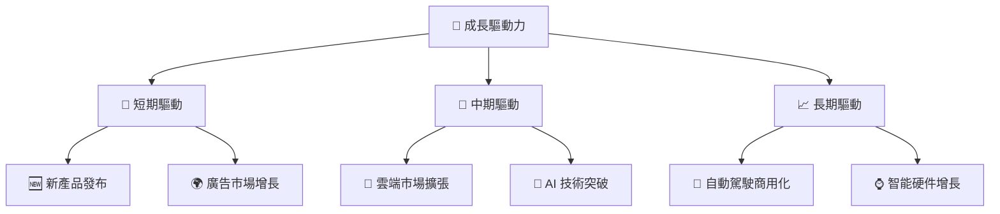

---

## 9. 風險矩陣

### 9.1 風險評分矩陣

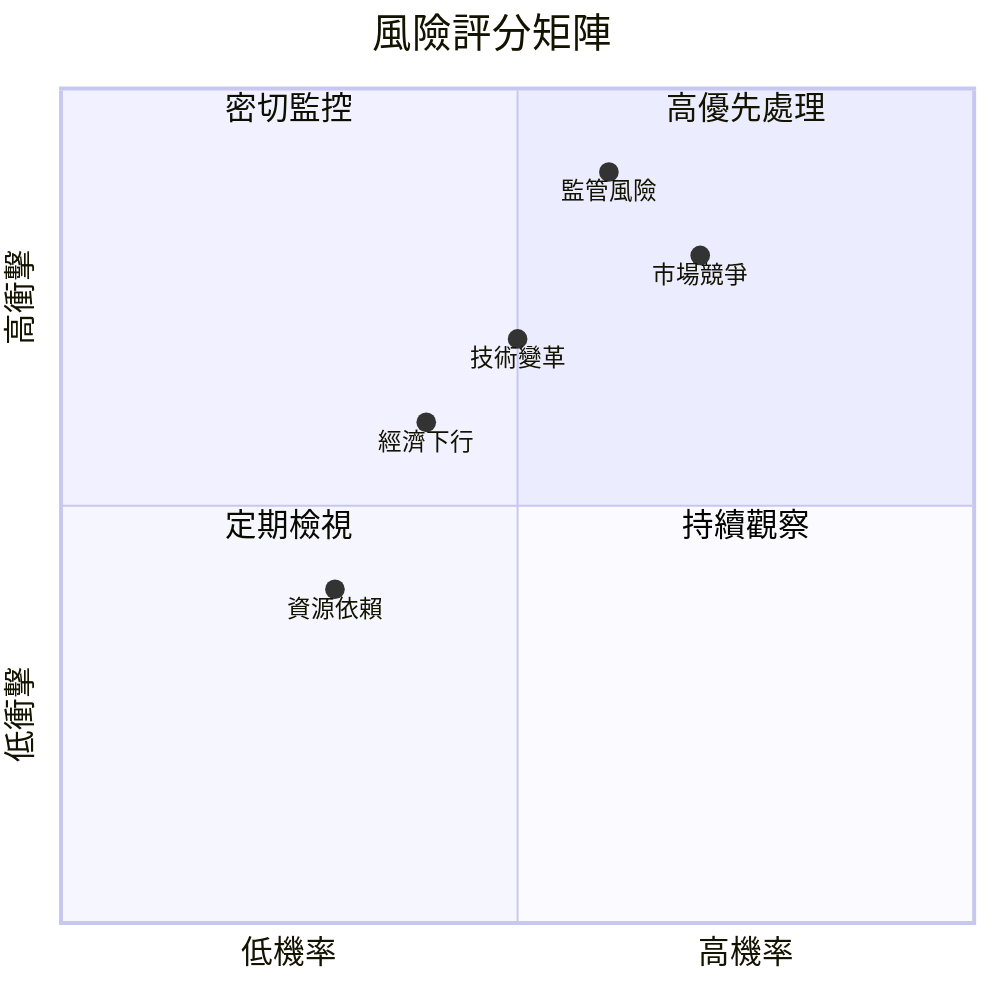

### 9.2 風險清單詳細分析

| # | 風險項目 | 發生機率 | 財務衝擊 | 風險評分 | 緩解措施 |
|---|----------|----------|----------|----------|----------|
| 1 | 🔴 **市場競爭** | 高 (70%) | 高 (-15%收入) | 🔴 8.0/10 | 擴大市場份額，提升產品差異化 |
| 2 | 🔴 **監管風險** | 高 (60%) | 高 (-20%利潤) | 🔴 8.5/10 | 加強合規，積極游說 |
| 3 | 🟡 **技術變革** | 中 (50%) | 中 (-10%收入) | 🟡 7.0/10 | 增加研發投入，技術創新 |
| 4 | 🟡 **經濟下行** | 中 (40%) | 中 (-8%收入) | 🟡 6.5/10 | 多元化收入源，降低依賴 |
| 5 | 🟢 **資源依賴** | 低 (30%) | 低 (-5%成本) | 🟢 5.5/10 | 開發替代資源，提升效率 |

---

## 10. 投資建議

### 10.1 最終綜合評級雷達圖

```
╔══════════════════════════════════════════════════════════════════╗
║                  ✅ 綜合評級雷達圖                                ║
╠══════════════════════════════════════════════════════════════════╣
║                                                                  ║
║  基本面強度： 9.0 ▓▓▓▓▓▓▓▓▓▓▓▓▓▓▓▓▓▓▓▓░  ★★★★★                 ║
║  成長動能：   9.0 ▓▓▓▓▓▓▓▓▓▓▓▓▓▓▓▓▓▓▓▓░  ★★★★★                 ║
║  獲利品質：   9.5 ▓▓▓▓▓▓▓▓▓▓▓▓▓▓▓▓▓▓▓▓▓  ★★★★★                 ║
║  財務健康：   9.6 ▓▓▓▓▓▓▓▓▓▓▓▓▓▓▓▓▓▓▓▓▓  ★★★★★                 ║
║  估值合理性： 9.0 ▓▓▓▓▓▓▓▓▓▓▓▓▓▓▓▓▓▓▓▓░  ★★★★★                 ║
║                                                                  ║
╚══════════════════════════════════════════════════════════════════╝
```

### 10.2 目標價與隱含報酬率

| 情境 | 目標價 | 隱含報酬率 | 機率權重 |
|------|-------|-----------|---------|
| 🟢 **樂觀** | $405 | +48% | 30% |
| 🟡 **基準** | $359.53 | +31% | 50% |
| 🔴 **悲觀** | $295 | +15% | 20% |

### 10.3 買入時機與觸發因素

```
╔══════════════════════════════════════════════════════════════════╗
║                  ✅ 買入觸發因素 Checklist                      ║
╠══════════════════════════════════════════════════════════════════╣
║                                                                  ║
║  立即買入觸發條件（多數符合）：                                  ║
║  ✅ 收入增長超預期                                               ║
║  ✅ 雲端市占率提升                                               ║
║  ✅ 新產品市場反應良好                                           ║
║                                                                  ║
║  加碼觸發條件（出現以下任一）：                                  ║
║  ☐ 市場份額進一步提升                                           ║
║  ☐ 監管風險降低                                                 ║
║                                                                  ║
║  減碼/停損觸發條件（出現以下任一）：                             ║
║  ☐ 經濟環境惡化                                                 ║
║  ☐ 關鍵產品銷售不佳                                             ║
║                                                                  ║
╚══════════════════════════════════════════════════════════════════╝
```

### 10.4 投資人適配度分析

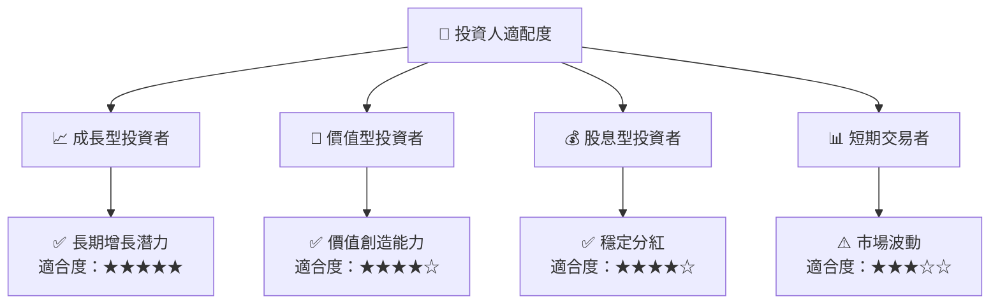

### 10.5 關鍵監控指標

| 監控類型 | 指標 | 關注點 | 頻率 |
|----------|-----|-------|-----|
| 財務 | 營業利潤率 | 盈利能力 | 季度 |
| 市場 | 市佔率 | 競爭地位 | 半年 |
| 產品 | 新產品銷售 | 市場接受度 | 季度 |
| 監管 | 政策變化 | 監管風險 | 每月 |

---

> **免責聲明**：本報告為 AI 自動生成，僅供研究參考，不構成投資建議。投資有風險，入市需謹慎。