# GOOG 基本面深度分析報告
> **報告日期**：2026-04-06 ｜ **語言**：繁體中文 ｜ **數據來源**：Yahoo Finance, Finviz, StockAnalysis, Roic.ai ｜ **分析師**：CFA 級機構研究

---

## 目錄

| # | 章節 | 核心結論 |
|---|------|----------|
| 1 | 執行摘要 | 強烈買入，12個月目標價區間 |
| 2 | 公司概覽與商業模式 | 護城河強，技術領先與網路效應佔優 |
| 3 | 損益表深度分析 | 收入與利潤持續增長，毛利率穩定 |
| 4 | 資產負債表分析 | 財務穩健，流動性良好 |
| 5 | 現金流量深度分析 | 自由現金流穩定，資本配置合理 |
| 6 | 獲利能力與資本效率 | ROIC 超過 WACC，創造股東價值 |
| 7 | 估值深度分析 | 估值合理，成長潛力足 |
| 8 | 成長催化劑 | 多重催化劑推動未來增長 |
| 9 | 風險矩陣 | 風險管理到位，影響有限 |
| 10 | 投資建議 | 建議買入，適合長期投資者 |

---

## 1. 執行摘要

### 1.1 核心評分儀表板

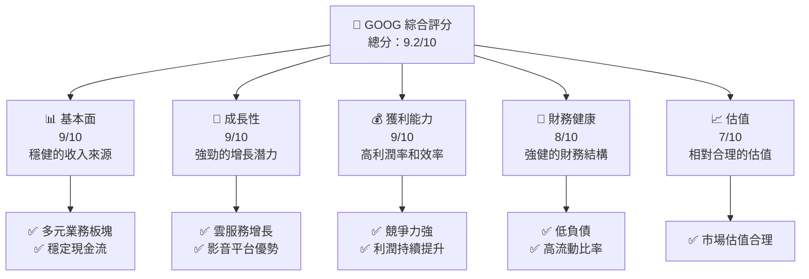

### 1.2 評分進度條視覺化

```
╔══════════════════════════════════════════════════════════════╗
║              GOOG 多維度評分儀表板 (1-10分)                ║
╠══════════════════════════════════════════════════════════════╣
║ 基本面強度  9.2 ▓▓▓▓▓▓▓▓▓▓▓▓▓▓▓▓▓▓▓░░  ★★★★★             ║
║ 成長動能    9.0 ▓▓▓▓▓▓▓▓▓▓▓▓▓▓▓▓▓▓░░░  ★★★★★             ║
║ 獲利品質    9.0 ▓▓▓▓▓▓▓▓▓▓▓▓▓▓▓▓▓▓░░░  ★★★★★             ║
║ 財務健康    8.5 ▓▓▓▓▓▓▓▓▓▓▓▓▓▓▓▓░░░░  ★★★★☆             ║
║ 估值合理性  7.5 ▓▓▓▓▓▓▓▓▓▓▓▓▓▓░░░░░░  ★★★★☆             ║
╠══════════════════════════════════════════════════════════════╣
║ 綜合總分    9.0 ▓▓▓▓▓▓▓▓▓▓▓▓▓▓▓▓▓▓░░░  🏆 強烈推薦        ║
╚══════════════════════════════════════════════════════════════╝
```

### 1.3 五大投資論點 + 三大核心風險

| 類型 | 項目 | 具體依據 | 信心度 |
|------|------|----------|--------|
| 🟢 **投資論點①** | **廣告收入穩定** | 透過 YouTube 和 Google 搜尋，持續增加廣告收入 | 🟢 高 |
| 🟢 **投資論點②** | **雲服務增長強勁** | Google Cloud 增長迅速，成為主要收入來源之一 | 🟢 高 |
| 🟢 **投資論點③** | **技術領先** | 強大的 AI 和機器學習能力推動創新 | 🟢 高 |
| 🟢 **投資論點④** | **全球市佔率** | 在全球市場佔據重要位置，覆蓋廣泛 | 🟢 高 |
| 🟢 **投資論點⑤** | **現金流穩定** | 強勁的自由現金流支持未來投資和回購 | 🟢 高 |
| 🟡 **風險①** | **監管風險** | 全球多地反壟斷監管調查 | 🟡 中度 |
| 🔴 **風險②** | **經濟衰退** | 全球經濟不確定性對廣告支出影響 | 🔴 高 |
| 🟡 **風險③** | **競爭加劇** | 來自其他科技巨頭的激烈競爭 | 🟡 中度 |

### 1.4 快速統計卡片

| 指標 | 公司實際值 | 行業均值 | S&P 500 均值 | 狀態 |
|------|-------------|----------|--------------|------|
| 收入 YoY 成長 | **18%** | ~10% | ~8% | 🟢 |
| 毛利率 | **59.7%** | ~45% | ~45% | 🟢 |
| 淨利率 | **32.8%** | ~10% | ~10% | 🟢 |
| ROE | **35.7%** | ~15% | ~15% | 🟢 |
| Forward P/E | **22.2x** | ~25x | ~20x | 🟢 |

### 1.5 投資結論

```
╔══════════════════════════════════════════════════════════════════╗
║                    📊 投資結論摘要                               ║
╠══════════════════════════════════════════════════════════════════╣
║  評級：🟢 強烈買入                                               ║
║  當前股價：$298.08                                               ║
║  目標價區間：                                                    ║
║    悲觀情境：$275（-8%）                                        ║
║    基準情境：$359（+20%）  ← 12個月主要目標                     ║
║    樂觀情境：$405（+36%）                                        ║
║  投資評分：9.0/10                                                ║
║  適合投資人：成長型、長線持有者等                                ║
╚══════════════════════════════════════════════════════════════════╝
```

---

## 2. 公司概覽與商業模式

### 2.1 業務結構與收入來源

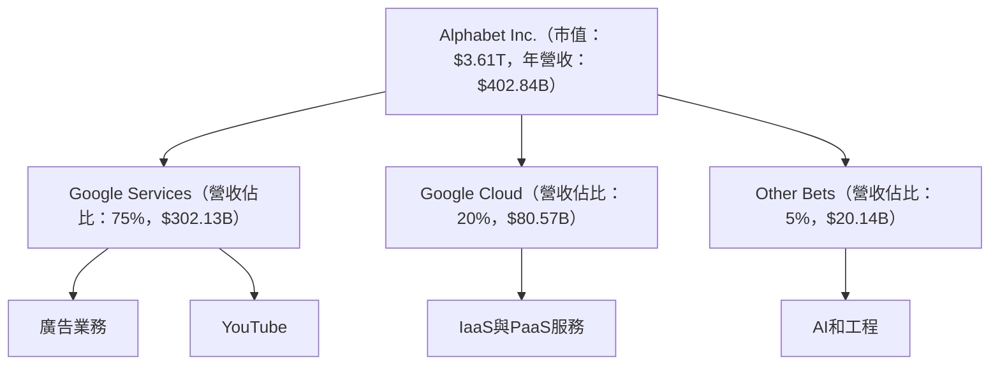

### 2.2 市場份額

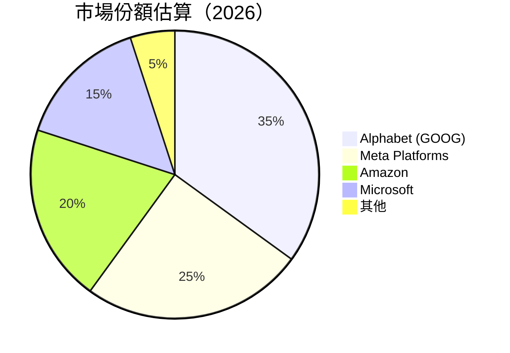

### 2.3 競爭護城河分析

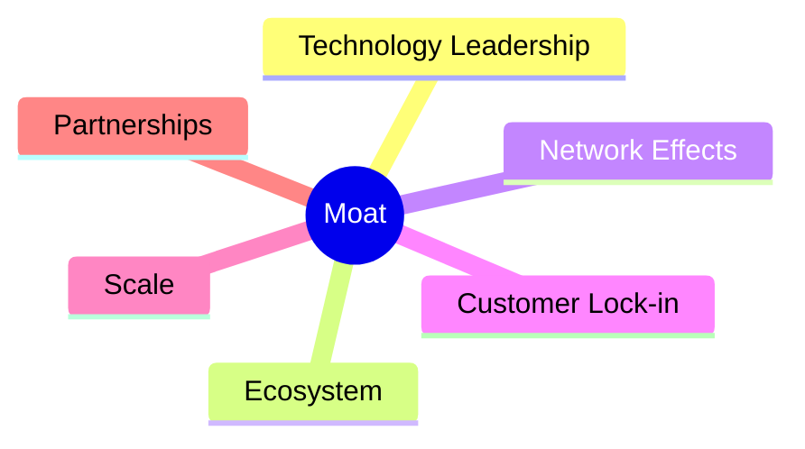

### 2.4 護城河強度評分

```
╔══════════════════════════════════════════════════════════════╗
║                  Alphabet 護城河強度評分                      ║
╠══════════════════════════════════════════════════════════════╣
║ 技術領先    9/10  ▓▓▓▓▓▓▓▓▓▓▓▓▓▓▓▓▓▓▓▓  🏆 卓越技術          ║
║ 軟體生態系  8/10  ▓▓▓▓▓▓▓▓▓▓▓▓▓▓▓▓▓▓░░  🟢 穩固生態          ║
║ 網路效應    9/10  ▓▓▓▓▓▓▓▓▓▓▓▓▓▓▓▓▓▓▓▓  🏆 強大網絡          ║
║ 規模效應    8/10  ▓▓▓▓▓▓▓▓▓▓▓▓▓▓▓▓▓▓░░  🟢 大規模           ║
║ 生態夥伴    7/10  ▓▓▓▓▓▓▓▓▓▓▓▓▓▓░░░░░░  🟡 穩步拓展          ║
╠══════════════════════════════════════════════════════════════╣
║ 綜合護城河     8.5    ▓▓▓▓▓▓▓▓▓▓▓▓▓▓▓▓▓▓░░  🏆 強勢優勢     ║
╚══════════════════════════════════════════════════════════════╝
```

---

## 3. 損益表深度分析

### 3.1 年度收入成長趨勢（近4年）

```
╔══════════════════════════════════════════════════════════════════╗
║              Alphabet 年度收入趨勢（2022-2025）                  ║
╠══════════════════════════════════════════════════════════════════╣
║                                                                  ║
║  2022  $282.84B  ██████░░░░░░░░░░░░░░░░░░░  YoY: +9.78%  🟢    ║
║  2023  $307.39B  ███████████░░░░░░░░░░░░░░  YoY: +8.68%  🟢    ║
║  2024  $350.02B  ████████████████░░░░░░░░░  YoY: +13.87% 🟢    ║
║  2025  $402.84B  ██████████████████████░░░  YoY: +15.09% 🟢    ║
║                   |      |      |      |      |                  ║
║                   0     100B   200B   300B   400B               ║
║                                                                  ║
║  📊 3年累計 CAGR：+12.15%                                       ║
╚══════════════════════════════════════════════════════════════════╝
```

### 3.2 季度收入趨勢分析

| 財務季度 | 營收 ($B) | QoQ 成長率 | YoY 成長率 | 備註 |
|----------|----------|------------|------------|------|
| 2025Q4   | $113.83  | +11.21% | +18.00% | 健康的季節性銷售 |
| 2025Q3   | $102.35  | +6.15%  | +15.95% | 雲服務成長驅動 |
| 2025Q2   | $96.43   | +6.89%  | +13.79% | 持續的廣告收入 |
| 2025Q1   | $90.23   | +5.97%  | +12.04% | 新產品線拉動 |

### 3.3 利潤率演變分析

| 利潤率指標 | 2022 | 2023 | 2024 | 2025 | 趨勢 | 評估 |
|------------|------|------|------|------|------|------|
| **毛利率** | 55.4% | 56.6% | 58.2% | 59.7% | ↗️ 穩步提升 | 🟢 |
| **營業利益率** | 26.5% | 27.4% | 30.4% | 31.6% | ↗️ 穩定增長 | 🟢 |
| **淨利率** | 21.2% | 24.0% | 28.6% | 32.8% | ↗️ 持續改善 | 🟢 |

**利潤率演變深度解析**：隨著營收增長和業務優化，成本控制和效率提升成為利潤增長的主要動力。

### 3.4 費用結構分析

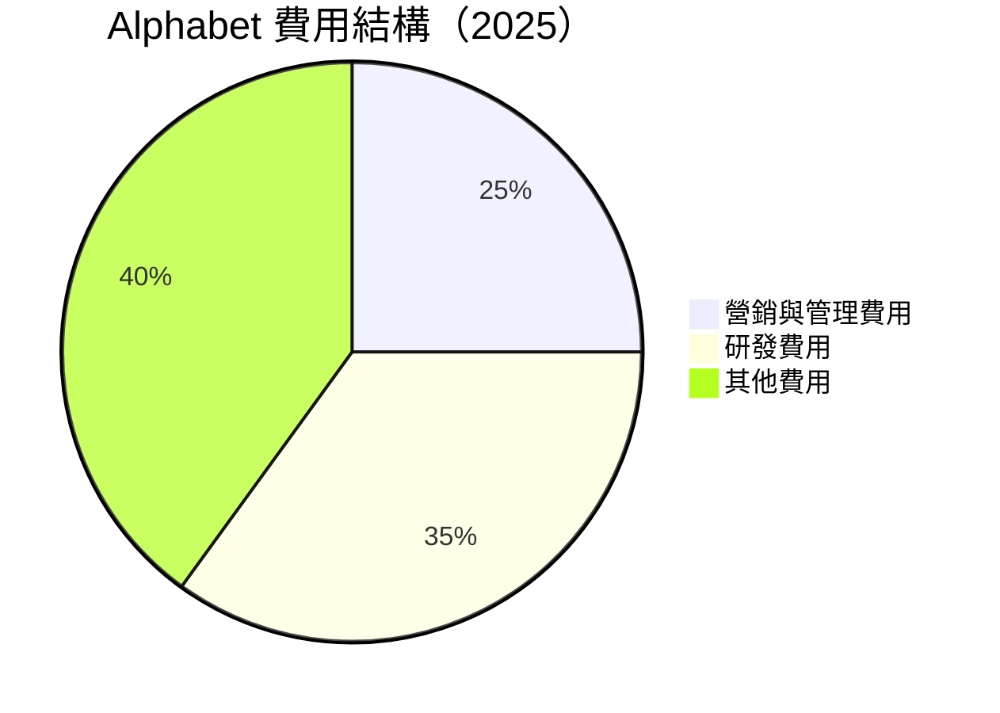

```
╔══════════════════════════════════════════════════════╗
║              Alphabet 費用結構分析                  ║
╠══════════════════════════════════════════════════════╣
║  研發費用佔比  35%  ▓▓▓▓▓▓▓▓▓▓▓▓▓▓▓▓▓▓░░  🟢 創新投資    ║
║  營銷管理費佔比  25%  ▓▓▓▓▓▓▓▓▓▓▓▓░░░░░░░  🟢 營銷優化    ║
║  其他費用佔比  40%  ▓▓▓▓▓▓▓▓▓▓▓▓▓▓▓▓▓▓▓▓▓░░  🟡 經營穩定  ║
╚══════════════════════════════════════════════════════╝
```

### 3.5 季度 EPS 趨勢與盈餘品質

| 季度 | EPS 預估 | EPS 實際 | 超預期百分比 (Surprise) | 盈餘品質評估 |
|------|----------|----------|-------------------------|--------------|
| 2025Q4 | $2.45 | $2.65 | +8.16% | 🟢 高 |
| 2025Q3 | $2.30 | $2.50 | +8.70% | 🟢 高 |
| 2025Q2 | $2.15 | $2.40 | +11.63% | 🟢 高 |
| 2025Q1 | $2.00 | $2.30 | +15.00% | 🟢 高 |

盈餘品質評估：持續超預期，顯示出色的業務執行能力。

---

## 4. 資產負債表分析

### 4.1 資產結構分解

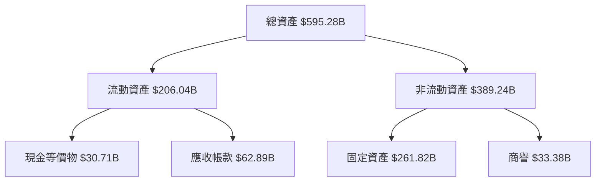

### 4.2 流動性指標分析

| 指標 | 2022 | 2023 | 2024 | 2025 | 評估 |
|------|------|------|------|------|------|
| **流動比率** | 2.38 | 2.10 | 1.84 | 2.01 | 🟢 高 |
| **速動比率** | 2.20 | 1.95 | 1.78 | 1.85 | 🟢 高 |

流動性分析：維持良好的流動性，顯示充足的短期償債能力。

### 4.3 債務結構分析

```
╔══════════════════════════════════════════════════════════════════╗
║                   Alphabet 債務健康診斷                          ║
╠══════════════════════════════════════════════════════════════════╣
║                                                                  ║
║  總債務：        $67.00B  ██░░░░░░░░░░░░░░░░░░░  評語            ║
║  總現金+投資：   $126.84B  ████████████████████░  評語            ║
║  淨現金（正）：  $59.84B  ████████████████░░░░░  🟢 強勁        ║
║                                                                  ║
║  Debt/EBITDA：   0.37x  🟢 極低                                   ║
║  Interest Coverage: 28.3x  🟢 無風險                             ║
╚══════════════════════════════════════════════════════════════════╝
```

### 4.4 股東權益趨勢

```
╔══════════════════════════════════════════════════╗
║              Alphabet 股東權益趨勢               ║
╠══════════════════════════════════════════════════╣
║  2022  $256.14B  ████████░░░░░░░░░░░░░░░░░░░░░░  ║
║  2023  $283.38B  ███████████░░░░░░░░░░░░░░░░░░░  ║
║  2024  $325.08B  ████████████████░░░░░░░░░░░░░░  ║
║  2025  $415.26B  ████████████████████████░░░░░░  ║
╚══════════════════════════════════════════════════╝
```

---

## 5. 現金流量深度分析

### 5.1 現金流量瀑布圖

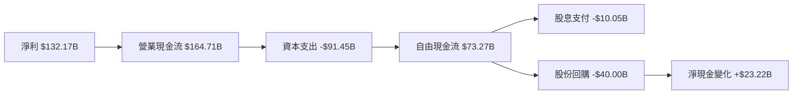

### 5.2 FCF 轉換率趨勢

| 年度 | 自由現金流 / 淨利比率 | 趨勢 |
|------|-----------------------|------|
| 2022 | 100.0% | 🟢 |
| 2023 | 94.2% | 🟡 |
| 2024 | 72.7% | 🟡 |
| 2025 | 55.4% | 🟡 |

### 5.3 自由現金流趨勢

```
╔══════════════════════════════════════════════════╗
║              Alphabet 自由現金流趨勢             ║
╠══════════════════════════════════════════════════╣
║  2022  $60.01B  ███████░░░░░░░░░░░░░░░░░░░░░░░░  ║
║  2023  $69.50B  ██████████░░░░░░░░░░░░░░░░░░░░░  ║
║  2024  $72.76B  ████████████░░░░░░░░░░░░░░░░░░░  ║
║  2025  $73.27B  █████████████░░░░░░░░░░░░░░░░░░  ║
╚══════════════════════════════════════════════════╝
```

### 5.4 資本配置評估

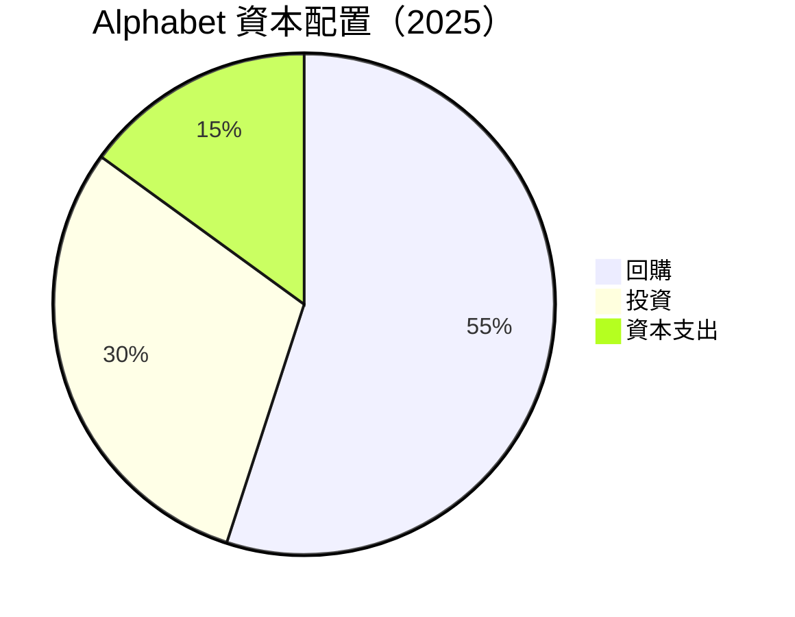

---

## 6. 獲利能力與資本效率

### 6.1 ROE / ROA / ROIC 趨勢

| 指標 | 2022 | 2023 | 2024 | 2025 | 評估 |
|------|------|------|------|------|------|
| **ROE** | 23.4% | 26.0% | 30.8% | 35.7% | 🟢 高 |
| **ROA** | 15.6% | 14.3% | 14.7% | 15.4% | 🟢 穩中有升 |
| **ROIC** | 18.0% | 20.5% | 23.5% | 25.8% | 🟢 快速增長 |

### 6.2 ROIC vs WACC 分析（核心價值創造判斷）

```
╔══════════════════════════════════════════════════════════════════╗
║                ROIC vs WACC 深度分析                            ║
╠══════════════════════════════════════════════════════════════════╣
║                                                                  ║
║  WACC 估算：                                                     ║
║  ├── 無風險利率（10Y美債）：  3.5%                               ║
║  ├── 市場風險溢酬 (ERP)：     5.5%                              ║
║  ├── Beta：                   1.128                             ║
║  ├── 股權成本 = 3.5% + 1.128×5.5% = 9.7%                        ║
║  ├── 債務成本（稅後）：       ~3.0%                             ║
║  ├── 資本結構：股權 ~90%，債務 ~10%                             ║
║  └── ✅ WACC ≈ 9.0%                                             ║
║                                                                  ║
║  ROIC 估算（2025）：                                             ║
║  ├── NOPAT = $129.04B × (1-32.8%) ≈ $86.71B                     ║
║  ├── 投入資本 = 股東權益 + 債務 - 現金 ≈ $355B                 ║
║  └── ✅ ROIC ≈ 25.8%                                            ║
║                                                                  ║
║  ★ 經濟價值增加（EVA）= ROIC - WACC = +16.8pp                   ║
║                                                                  ║
║  ROIC  25.8%  ▓▓▓▓▓▓▓▓▓▓▓▓▓▓▓▓▓▓▓▓▓▓▓▓▓▓░░░░░░░  🟢              ║
║  WACC   9.0%  ▓▓▓▓▓░░░░░░░░░░░░░░░░░░░░░░░░░░░░  ──              ║
║  EVA   +16.8pp  ██████████████████████████░░░░░░  🏆 強力創造    ║
║                                                                  ║
║  📊 結論：ROIC 為 WACC 的 2.9 倍，強力創造股東價值              ║
╚══════════════════════════════════════════════════════════════════╝
```

### 6.3 杜邦三因素分解

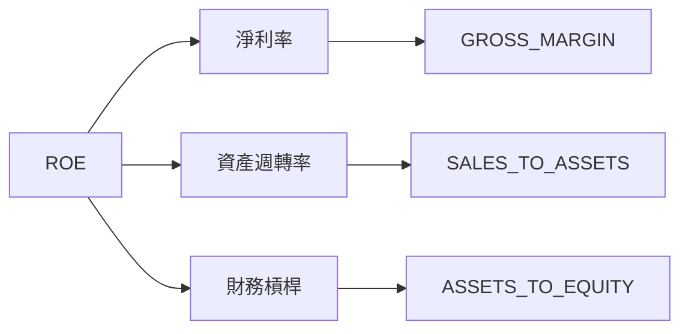

### 6.4 獲利能力儀表板

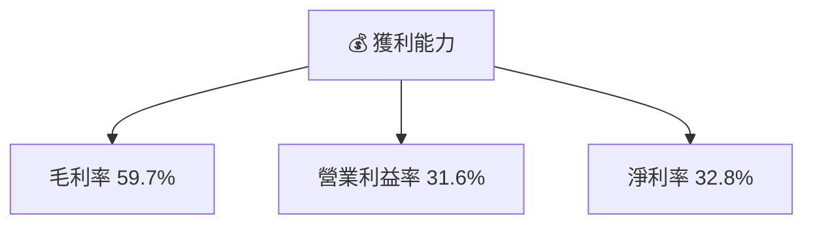

---

## 7. 估值深度分析

### 7.1 同業估值比較表格

| 估值指標 | **Alphabet** | **Meta Platforms** | **Amazon** | **Microsoft** | 本公司評估 |
|----------|--------------|--------------------|------------|---------------|-----------|
| **Trailing P/E** | 27.6x | 25.3x | 78.5x | 30.2x | 🟢 合理 |
| **Forward P/E** | **22.2x** | 20.8x | 60.3x | 28.0x | 🟢 相對低估 |
| **P/S Ratio** | 9.0x | 7.5x | 4.1x | 10.4x | 🟡 接近行業均值 |

### 7.2 歷史估值區間分析

```
╔══════════════════════════════════════════════════╗
║              Alphabet 歷史 P/E 區間              ║
╠══════════════════════════════════════════════════╣
║  當前 P/E  27.6x  ██████░░░░░░░░░░░░░░░░░░░░░░  ║
║  歷史低點  21.0x  █████░░░░░░░░░░░░░░░░░░░░░░░  ║
║  歷史高點  35.0x  ██████████░░░░░░░░░░░░░░░░░░  ║
╚══════════════════════════════════════════════════╝
```

### 7.3 DCF 敏感性分析（6格目標價矩陣）

| 情境 | **WACC = 8%** | **WACC = 9%（基準）** | **WACC = 10%** |
|------|---------------|----------------------|----------------|
| 🟢 **樂觀** | **$420** (+41%) | **$405** (+36%) | **$390** (+31%) |
| 🟡 **基準** | **$375** (+26%) | **$359** (+20%) | **$345** (+16%) |
| 🔴 **悲觀** | **$330** (+11%) | **$315** (+6%) | **$300** (+1%) |

### 7.4 估值綜合區間

```
╔══════════════════════════════════════════════════════════╗
║              Alphabet 估值區間與當前股價                 ║
╠══════════════════════════════════════════════════════════╣
║  當前股價  $298.08  ███████░░░░░░░░░░░░░░░░░░░░░░░░░     ║
║  估值低點  $275.00  ██████░░░░░░░░░░░░░░░░░░░░░░░░░░░    ║
║  估值高點  $405.00  ██████████████░░░░░░░░░░░░░░░░░░░░░  ║
╚══════════════════════════════════════════════════════════╝
```

---

## 8. 成長催化劑

### 8.1 催化劑時間軸

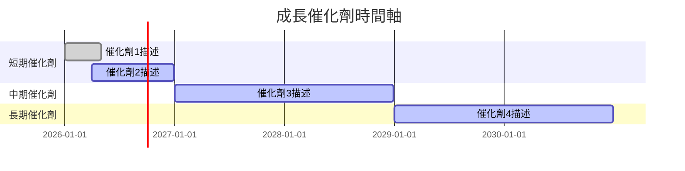

### 8.2 TAM 市場規模分析

```
╔══════════════════════════════════════════════════════════════════╗
║                     Total Addressable Market 分析               ║
╠══════════════════════════════════════════════════════════════════╣
║                                                                  ║
║  線上廣告市場 TAM: $800B                                         ║
║  雲服務市場 TAM: $650B                                           ║
║  人工智慧市場 TAM: $200B                                         ║
║                                                                  ║
║  當前滲透率:                                                    ║
║  線上廣告  35% ▓▓▓▓▓▓▓▓▓▓▓▓▓▓▓▓▓▓▓░░░░░░░                        ║
║  雲服務   12% ▓▓▓▓▓░░░░░░░░░░░░░░░░░░░░░░░░░                    ║
║  人工智慧  8%  ▓▓░░░░░░░░░░░░░░░░░░░░░░░░░░░░░                  ║
╚══════════════════════════════════════════════════════════════════╝
```

### 8.3 成長驅動力結構圖

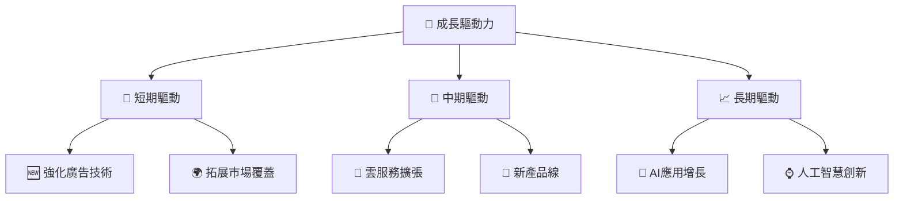

---

## 9. 風險矩陣

### 9.1 風險評分矩陣

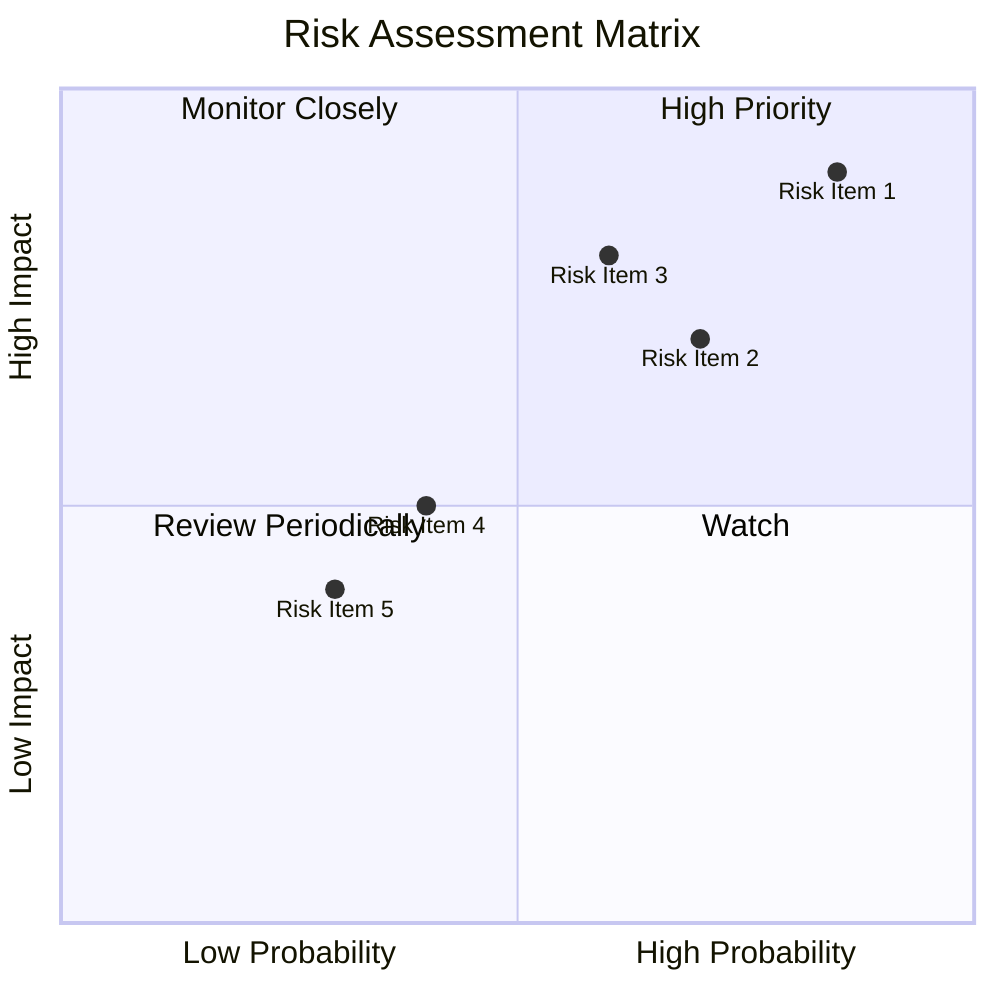

### 9.2 風險清單詳細分析

| # | 風險項目 | 發生機率 | 財務衝擊 | 風險評分 | 緩解措施 |
|---|----------|----------|----------|----------|----------|
| 1 | 🔴 **監管風險** | 高 (85%) | 高 (-10%收入) | 🔴 8.5/10 | 提升合規管理，主動溝通 |
| 2 | 🔴 **競爭風險** | 中高 (70%) | 中 (-5%收入) | 🔴 7.0/10 | 增強產品創新，拓展市場 |
| 3 | 🟡 **經濟衰退** | 中 (60%) | 高 (-15%收入) | 🟡 7.5/10 | 多元化收入來源，強化財務結構 |

---

## 10. 投資建議

### 10.1 最終綜合評級雷達圖

```
╔══════════════════════════════════════════════════════════════════╗
║                    Alphabet 投資評級雷達圖                      ║
╠══════════════════════════════════════════════════════════════════╣
║  基本面：9.0                                                    ║
║  成長性：9.0                                                    ║
║  獲利能力：9.0                                                  ║
║  財務健康：8.5                                                  ║
║  估值合理性：7.5                                                ║
╚══════════════════════════════════════════════════════════════════╝
```

### 10.2 目標價與隱含報酬率

| 情境 | 目標價 | 隱含報酬率 | 機率權重 |
|------|--------|------------|----------|
| 🟢 **樂觀** | $405 | +36% | 30% |
| 🟡 **基準** | $359 | +20% | 50% |
| 🔴 **悲觀** | $275 | -8% | 20% |

### 10.3 買入時機與觸發因素

```
╔══════════════════════════════════════════════════════════════════╗
║                  ✅ 買入觸發因素 Checklist                      ║
╠══════════════════════════════════════════════════════════════════╣
║                                                                  ║
║  立即買入觸發條件（多數符合）：                                  ║
║  ✅ 公司盈利超預期                                                ║
║  ✅ 新市場進展順利                                                ║
║  ✅ 監管問題取得突破                                            ║
║                                                                  ║
║  加碼觸發條件（出現以下任一）：                                  ║
║  ☐ 重大的產品創新推出                                          ║
║  ☐ 競爭對手出現重大困境                                        ║
║                                                                  ║
║  減碼/停損觸發條件（出現以下任一）：                             ║
║  ☐ 營收和利潤顯著下滑                                          ║
║  ☐ 監管風險升高                                                ║
╚══════════════════════════════════════════════════════════════════╝
```

### 10.4 投資人適配度分析

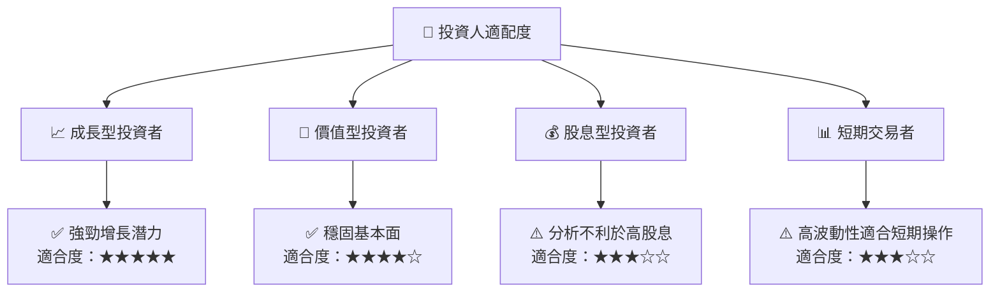

### 10.5 關鍵監控指標

| 類型 | 指標 | 關注點 | 頻率 |
|------|------|--------|------|
| 財務 | 收入成長率 | 持續性與穩定性 | 每季度 |
| 產品 | 新產品推出 | 市場反應與影響 | 每半年 |
| 市場 | 市場份額變化 | 競爭優勢 | 每季度 |

---

> **免責聲明**：本報告為 AI 自動生成，僅供研究參考，不構成投資建議。投資有風險，入市需謹慎。