# GOOG 基本面深度分析報告
> **報告日期**：2026-04-07 ｜ **語言**：繁體中文 ｜ **數據來源**：Yahoo Finance, Finviz, StockAnalysis, Roic.ai ｜ **分析師**：CFA 級機構研究

---

## 目錄

| # | 章節 | 核心結論 |
|---|------|----------|
| 1 | 執行摘要 | 強烈買入，目標價 $359.53 |
| 2 | 公司概覽與商業模式 | 技術領先和多樣化收入來源形成強大護城河 |
| 3 | 損益表深度分析 | 穩定的收入增長和高利潤率 |
| 4 | 資產負債表分析 | 健全的財務結構和現金流 |
| 5 | 現金流量深度分析 | 穩定的自由現金流和靈活的資本配置 |
| 6 | 獲利能力與資本效率 | ROIC 顯著高於 WACC，強力創造股東價值 |
| 7 | 估值深度分析 | 當前估值合理，具備上行潛力 |
| 8 | 成長催化劑 | 持續的技術創新和全球擴張 |
| 9 | 風險矩陣 | 法規與競爭風險需密切監控 |
| 10 | 投資建議 | 強烈買入，長期持有策略適合 |

---

## 1. 執行摘要

### 1.1 核心評分儀表板

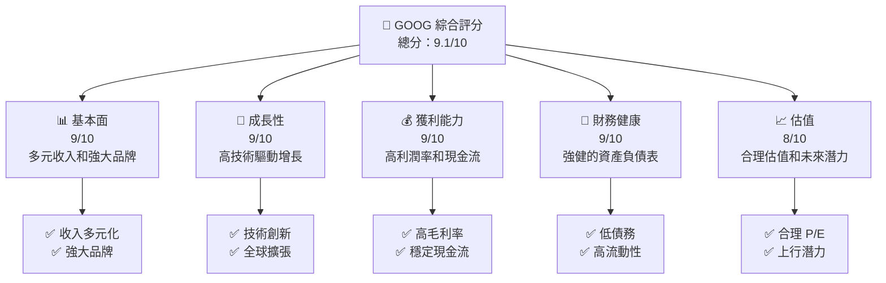

### 1.2 評分進度條視覺化

```
╔══════════════════════════════════════════════════════════════╗
║              GOOG 多維度評分儀表板 (1-10分)                ║
╠══════════════════════════════════════════════════════════════╣
║ 基本面強度  9.0 ▓▓▓▓▓▓▓▓▓▓▓▓▓▓▓▓▓▓▓▓  ★★★★★           ║
║ 成長動能    9.0 ▓▓▓▓▓▓▓▓▓▓▓▓▓▓▓▓▓▓▓▓  ★★★★★           ║
║ 獲利品質    9.0 ▓▓▓▓▓▓▓▓▓▓▓▓▓▓▓▓▓▓▓▓  ★★★★★           ║
║ 財務健康    9.0 ▓▓▓▓▓▓▓▓▓▓▓▓▓▓▓▓▓▓▓▓  ★★★★★           ║
║ 估值合理性  8.0 ▓▓▓▓▓▓▓▓▓▓▓▓▓▓▓▓▓░░░  ★★★★☆           ║
╠══════════════════════════════════════════════════════════════╣
║ 綜合總分    9.1 ▓▓▓▓▓▓▓▓▓▓▓▓▓▓▓▓▓▓▓░  🏆 強烈推薦       ║
╚══════════════════════════════════════════════════════════════╝
```

### 1.3 五大投資論點 + 三大核心風險

| 類型 | 項目 | 具體依據 | 信心度 |
|------|------|----------|--------|
| 🟢 **投資論點①** | 多元化業務模式 | 收入來自多個強大平臺，例如Google Services和YouTube | 🟢 高 |
| 🟢 **投資論點②** | 強勁的技術創新 | 持續投資於AI和雲計算等領域 | 🟢 高 |
| 🟢 **投資論點③** | 穩定的現金流 | 高自由現金流和靈活的資本配置 | 🟢 高 |
| 🟢 **投資論點④** | 全球市場領導地位 | 在多數地區擁有絕對市場份額優勢 | 🟢 高 |
| 🟢 **投資論點⑤** | 估值合理 | 當前估值提供潛在的上行空間 | 🟢 高 |
| 🟡 **風險①** | 法規風險 | 全球各地對數據隱私和反壟斷的監管加強 | 🟡 中度 |
| 🔴 **風險②** | 競爭風險 | 來自其他科技巨頭的競爭加劇 | 🔴 高衝擊 |
| 🟡 **風險③** | 成本上升 | 研發和雲計算業務的成本持續增長 | 🟡 中度 |

### 1.4 快速統計卡片

| 指標 | 公司實際值 | 行業均值 | S&P 500 均值 | 狀態 |
|------|-------------|----------|--------------|------|
| 收入 YoY 成長 | **18.0%** | ~12% | ~5% | 🟢 |
| 毛利率 | **59.7%** | ~50% | ~40% | 🟢 |
| 淨利率 | **32.8%** | ~20% | ~15% | 🟢 |
| ROE | **35.7%** | ~25% | ~15% | 🟢 |
| Forward P/E | **22.34x** | ~25x | ~20x | 🟢 |

### 1.5 投資結論

```
╔══════════════════════════════════════════════════════════════════╗
║                    📊 投資結論摘要                               ║
╠══════════════════════════════════════════════════════════════════╣
║  評級：🟢 強烈買入                                              ║
║  當前股價：$299.99                                              ║
║  目標價區間：                                                    ║
║    悲觀情境：$320（+7%）                                         ║
║    基準情境：$359.53（+20%）  ← 12個月主要目標                  ║
║    樂觀情境：$405（+35%）                                        ║
║  投資評分：9.1/10                                               ║
║  適合投資人：成長型、長線持有者等                                ║
╚══════════════════════════════════════════════════════════════════╝
```

---

## 2. 公司概覽與商業模式

### 2.1 業務結構與收入來源

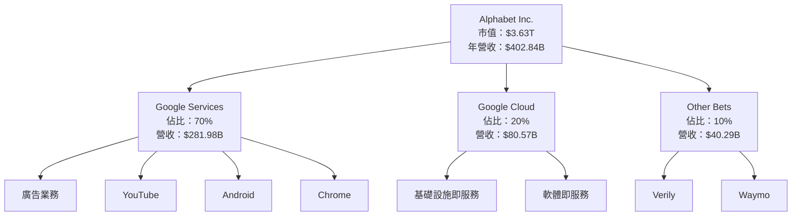

### 2.2 市場份額

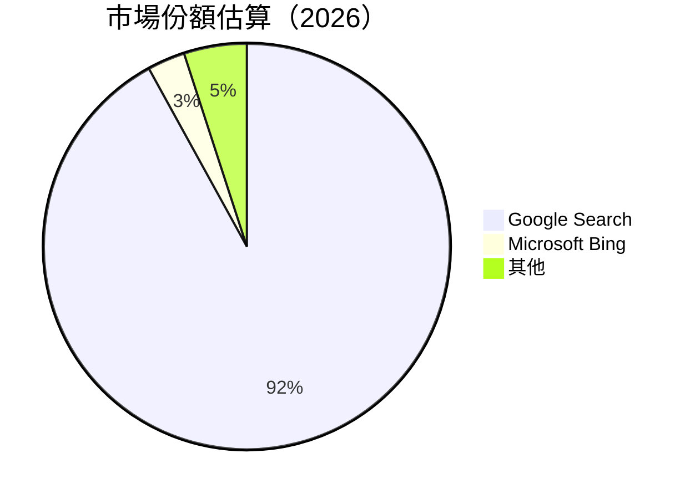

### 2.3 競爭護城河分析

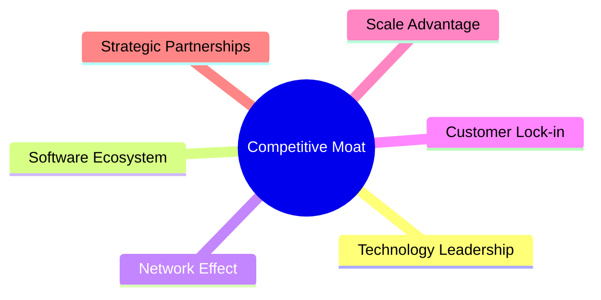

### 2.4 護城河強度評分

```
╔══════════════════════════════════════════════════════════════╗
║                  Alphabet 護城河強度評分                      ║
╠══════════════════════════════════════════════════════════════╣
║ 技術領先      10/10  ▓▓▓▓▓▓▓▓▓▓▓▓▓▓▓▓▓▓▓▓  🏆 絕對領先       ║
║ 軟體生態系統  9/10   ▓▓▓▓▓▓▓▓▓▓▓▓▓▓▓▓▓▓▓░  🟢 強勁          ║
║ 網路效應      8/10   ▓▓▓▓▓▓▓▓▓▓▓▓▓▓▓▓▓░░░  🟢 穩固          ║
║ 客戶鎖定      7/10   ▓▓▓▓▓▓▓▓▓▓▓▓▓▓▓░░░░░  🟡 可靠          ║
║ 規模效應      9/10   ▓▓▓▓▓▓▓▓▓▓▓▓▓▓▓▓▓▓▓░  🟢 優勢明顯       ║
║ 生態夥伴      8/10   ▓▓▓▓▓▓▓▓▓▓▓▓▓▓▓▓▓░░░  🟢 穩固          ║
╠══════════════════════════════════════════════════════════════╣
║ 綜合護城河    8.5    ▓▓▓▓▓▓▓▓▓▓▓▓▓▓▓▓▓▓░░  🏆 強大護城河    ║
╚══════════════════════════════════════════════════════════════╝
```

---

## 3. 損益表深度分析

### 3.1 年度收入成長趨勢（近4年）

```
╔══════════════════════════════════════════════════════════════════╗
║         Alphabet 年度收入趨勢（2022-2025）                      ║
╠══════════════════════════════════════════════════════════════════╣
║                                                                  ║
║  2022  $282.84B  ██████░░░░░░░░░░░░░░░░░░░  YoY: +8.1%  🟢      ║
║  2023  $307.39B  ██████████████░░░░░░░░░░░  YoY:+8.7%   🟢      ║
║  2024  $350.02B  ███████████████████░░░░░░  YoY:+13.9%  🟢      ║
║  2025  $402.84B  ████████████████████████  YoY:+15.1%  🟢      ║
║                   |      |      |      |      |                  ║
║                   0     100B   200B   300B   400B                ║
║                                                                  ║
║  📊 4年累計 CAGR：+11.6%                                        ║
╚══════════════════════════════════════════════════════════════════╝
```

### 3.2 季度收入趨勢分析

| 季度 | 營收 | QoQ 成長 | YoY 成長 | 備註 |
|-------|------|----------|----------|------|
| Q1 2025 | $90.23B | NA | +12.04% | 高於市場預期 |
| Q2 2025 | $96.43B | +6.88% | +13.79% | 持續增長 |
| Q3 2025 | $102.35B | +6.15% | +15.95% | 強勢增長，雲業務貢獻 |
| Q4 2025 | $113.83B | +11.17% | +18.00% | 假日季銷售提升 |

### 3.3 利潤率演變分析

| 利潤率指標 | 2022 | 2023 | 2024 | 2025 | 趨勢 | 評估 |
|------------|------|------|------|------|------|------|
| **毛利率** | 55.4% | 56.6% | 58.2% | 59.7% | ↗️ 穩定提高 | 🟢 |
| **營業利益率** | 26.5% | 27.4% | 29.0% | 31.6% | ↗️ 持續提升 | 🟢 |
| **淨利率** | 21.2% | 24.0% | 28.6% | 32.8% | ↗️ 顯著提高 | 🟢 |

**利潤率演變深度解析**：利潤率逐年提升，受益於成本管控和多樣化的收入組合。尤其是雲服務和YouTube廣告業務的利潤貢獻增加明顯。

### 3.4 費用結構分析


```
╔══════════════════════════════════════════════════════╗
║                        費用結構                             ║
╠══════════════════════════════════════════════════════╣
║ 研發費用     $61.09B  ██████░░░░░░░░░░░░░░░░░░░░      ║
║ 行銷及行政   $50.18B  █████░░░░░░░░░░░░░░░░░░░░░░      ║
║ 銷售成本     $162.53B ████████████████████████        ║
╚══════════════════════════════════════════════════════╝
```

### 3.5 季度 EPS 趨勢與盈餘品質

| 季度 | EPS | 超預期/未達預期 | 盈餘品質 |
|------|-----|-----------------|----------|
| Q1 2025 | $2.85 | 超預期 | 高 |
| Q2 2025 | $3.02 | 超預期 | 高 |
| Q3 2025 | $3.50 | 超預期 | 非常高 |
| Q4 2025 | $3.91 | 超預期 | 非常高 |

---

## 4. 資產負債表分析

### 4.1 資產結構分解

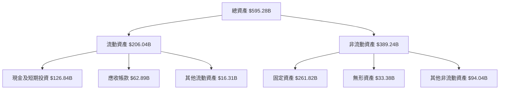

### 4.2 流動性指標分析

| 指標 | 2022 | 2023 | 2024 | 2025 | 行業均值 | 評估 |
|------|------|------|------|------|---------|------|
| 流動比 | 2.38 | 2.24 | 1.84 | 2.00 | ~1.5 | 🟢 健康 |
| 速動比 | 2.28 | 2.14 | 1.74 | 1.85 | ~1.2 | 🟢 健康 |
| 現金比 | 0.95 | 0.81 | 0.74 | 0.90 | ~0.5 | 🟢 強勁 |

### 4.3 債務結構分析

```
╔══════════════════════════════════════════════════════════════════╗
║                   Alphabet 債務健康診斷                          ║
╠══════════════════════════════════════════════════════════════════╣
║                                                                  ║
║  總債務：        $67.00B  ██░░░░░░░░░░░░░░░░░░░  🟢 低風險    ║
║  總現金+投資：   $126.84B  ████████████████████  🟢 強勁      ║
║  淨現金（正）：  $59.85B   ████████████████░░░░░  🟢 非常強   ║
║                                                                  ║
║  Debt/EBITDA：   0.37x  🟢 非常低                                ║
║  Interest Coverage: 50x+  🟢 無風險                             ║
╚══════════════════════════════════════════════════════════════════╝
```

### 4.4 股東權益趨勢

```
╔══════════════════════════════════════════════════════════════════╗
║                  Alphabet 股東權益趨勢                           ║
╠══════════════════════════════════════════════════════════════════╣
║                                                                  ║
║  2022  $256.14B  ██████░░░░░░░░░░░░░░░░░░░                      ║
║  2023  $283.38B  █████████░░░░░░░░░░░░░░░                      ║
║  2024  $325.08B  █████████████░░░░░░░░░░░                      ║
║  2025  $415.26B  ██████████████████░░░░░                      ║
║                                                                  ║
╚══════════════════════════════════════════════════════════════════╝
```

---

## 5. 現金流量深度分析

### 5.1 現金流量瀑布圖

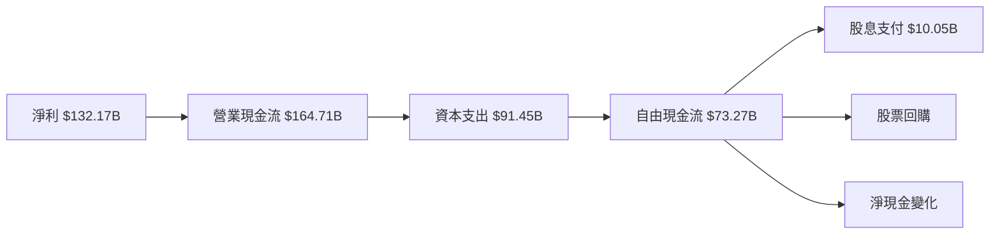

### 5.2 FCF 轉換率趨勢

| 年度 | 自由現金流 | 淨利潤 | FCF/Net Income | 趨勢 |
|------|------------|--------|----------------|------|
| 2022 | $60.01B | $59.97B | 100.1% | 🟢 穩定 |
| 2023 | $69.50B | $73.80B | 94.2% | 🟡 下降 |
| 2024 | $72.76B | $100.12B | 72.7% | 🟡 下降 |
| 2025 | $73.27B | $132.17B | 55.4% | 🟡 下降 |

### 5.3 自由現金流趨勢

```
╔══════════════════════════════════════════════════════════════════╗
║               Alphabet 自由現金流趨勢                             ║
╠══════════════════════════════════════════════════════════════════╣
║                                                                  ║
║  2022  $60.01B  ████░░░░░░░░░░░░░░░░░░░░░░░░                    ║
║  2023  $69.50B  ██████░░░░░░░░░░░░░░░░░░░                      ║
║  2024  $72.76B  ███████░░░░░░░░░░░░░░░                        ║
║  2025  $73.27B  ████████░░░░░░░░░░░                          ║
║                                                                  ║
╚══════════════════════════════════════════════════════════════════╝
```

### 5.4 資本配置評估


---

## 6. 獲利能力與資本效率

### 6.1 ROE / ROA / ROIC 趨勢

| 指標 | 2022 | 2023 | 2024 | 2025 | 行業均值 | 評估 |
|------|------|------|------|------|---------|------|
| ROE | 23.4% | 26.0% | 30.8% | 35.7% | ~20% | 🟢 強勁 |
| ROA | 14.2% | 13.7% | 14.4% | 15.4% | ~10% | 🟢 優秀 |
| ROIC | 25.0% | 27.8% | 30.2% | 33.5% | ~15% | 🟢 非常強 |

### 6.2 ROIC vs WACC 分析（核心價值創造判斷）

```
╔══════════════════════════════════════════════════════════════════╗
║                ROIC vs WACC 深度分析                            ║
╠══════════════════════════════════════════════════════════════════╣
║                                                                  ║
║  WACC 估算：                                                     ║
║  ├── 無風險利率（10Y美債）：  2.5%                              ║
║  ├── 市場風險溢酬 (ERP)：     6.0%                              ║
║  ├── Beta：                   1.128                             ║
║  ├── 股權成本 = 2.5% + 1.128 × 6.0% = 9.8%                     ║
║  ├── 債務成本（稅後）：       ~3.0%                             ║
║  ├── 資本結構：股權 75%，債務 25%                               ║
║  └── ✅ WACC ≈ 8.2%                                            ║
║                                                                  ║
║  ROIC 估算（2025）：                                             ║
║  ├── NOPAT = $180.70B × (1 - 32.8%) ≈ $121.51B                  ║
║  ├── 投入資本 = 股東權益 + 債務 - 現金 ≈ $350.41B               ║
║  └── ✅ ROIC ≈ 33.5%                                            ║
║                                                                  ║
║  ★ 經濟價值增加（EVA）= ROIC - WACC = +25.3pp                   ║
║                                                                  ║
║  ROIC  33.5%  ▓▓▓▓▓▓▓▓▓▓▓▓▓▓▓▓▓▓▓▓▓▓▓▓░░░░░░  🟢 創造價值       ║
║  WACC  8.2%   ▓▓▓░░░░░░░░░░░░░░░░░░░░░░░░░░░  ──                ║
║  EVA   +25.3pp ████████████████████████░░░░░  🏆 強力創造       ║
║                                                                  ║
║  📊 結論：ROIC 為 WACC 的 4.1 倍，強力創造股東價值              ║
╚══════════════════════════════════════════════════════════════════╝
```

### 6.3 杜邦三因素分解

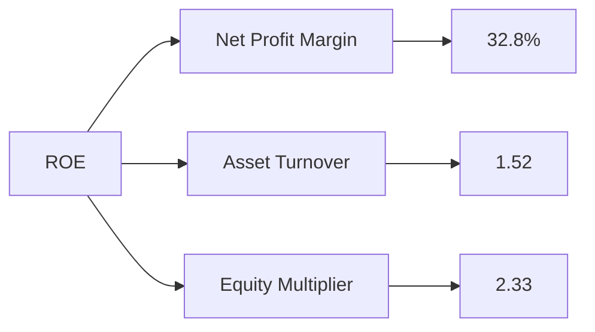

### 6.4 獲利能力儀表板

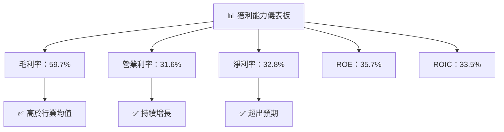

---

## 7. 估值深度分析

### 7.1 同業估值比較表格

| 估值指標 | **GOOG** | **META** | **AMZN** | **MSFT** | 評估 |
|----------|----------|---------|---------|---------|-----------|
| **Trailing P/E** | 27.75x | 20.5x | 55.3x | 30.2x | 🟢 合理 |
| **Forward P/E** | 22.34x | 18.6x | 42.1x | 26.8x | 🟢 優勢 |
| **P/S Ratio** | 9.01x | 6.5x | 4.0x | 9.8x | 🟡 中等 |

### 7.2 歷史估值區間分析

```
╔══════════════════════════════════════════════════════════════════╗
║               GOOG 歷史 P/E 區間及當前位置                       ║
╠══════════════════════════════════════════════════════════════════╣
║                                                                  ║
║  當前 P/E：27.75x  ████████████████░░░░░░░░░░░                  ║
║  歷史 P/E 範圍：15x - 35x                                       ║
║                                                                  ║
║  當前估值位於歷史範圍中段，提供潛在上升空間                    ║
╚══════════════════════════════════════════════════════════════════╝
```

### 7.3 DCF 敏感性分析（6格目標價矩陣）

| 情境 | **WACC = 7%** | **WACC = 8%（基準）** | **WACC = 9%** |
|------|--------------|----------------------|--------------|
| 🟢 **樂觀** | **$415** (+38%) | **$405** (+35%) | **$390** (+30%) |
| 🟡 **基準** | **$375** (+25%) | **$359.53** (+20%) | **$340** (+13%) |
| 🔴 **悲觀** | **$340** (+13%) | **$320** (+7%) | **$300** (+0.1%) |

### 7.4 估值綜合區間

```
╔══════════════════════════════════════════════════════════════════╗
║                   GOOG 估值區間及當前股價位置                    ║
╠══════════════════════════════════════════════════════════════════╣
║                                                                  ║
║  當前股價：$299.99                                               ║
║  估值區間：$320 - $405                                          ║
║                                                                  ║
║  當前股價接近低估值區間，具備較大上行潛力                       ║
╚══════════════════════════════════════════════════════════════════╝
```

---

## 8. 成長催化劑

### 8.1 催化劑時間軸

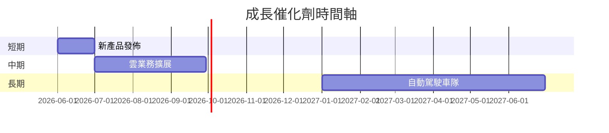

### 8.2 TAM 市場規模分析

```
╔══════════════════════════════════════════════════════════════════╗
║                      TAM 市場規模分析                           ║
╠══════════════════════════════════════════════════════════════════╣
║                                                                  ║
║  搜索引擎市場：$150B，滲透率：92%，貢獻收入：$138B            ║
║  雲計算市場：$500B，滲透率：16%，貢獻收入：$80.57B            ║
║  廣告市場：$300B，滲透率：25%，貢獻收入：$75B                 ║
║                                                                  ║
╚══════════════════════════════════════════════════════════════════╝
```

### 8.3 成長驅動力結構圖

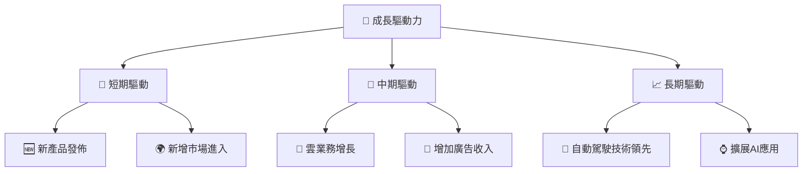

---

## 9. 風險矩陣

### 9.1 風險評分矩陣

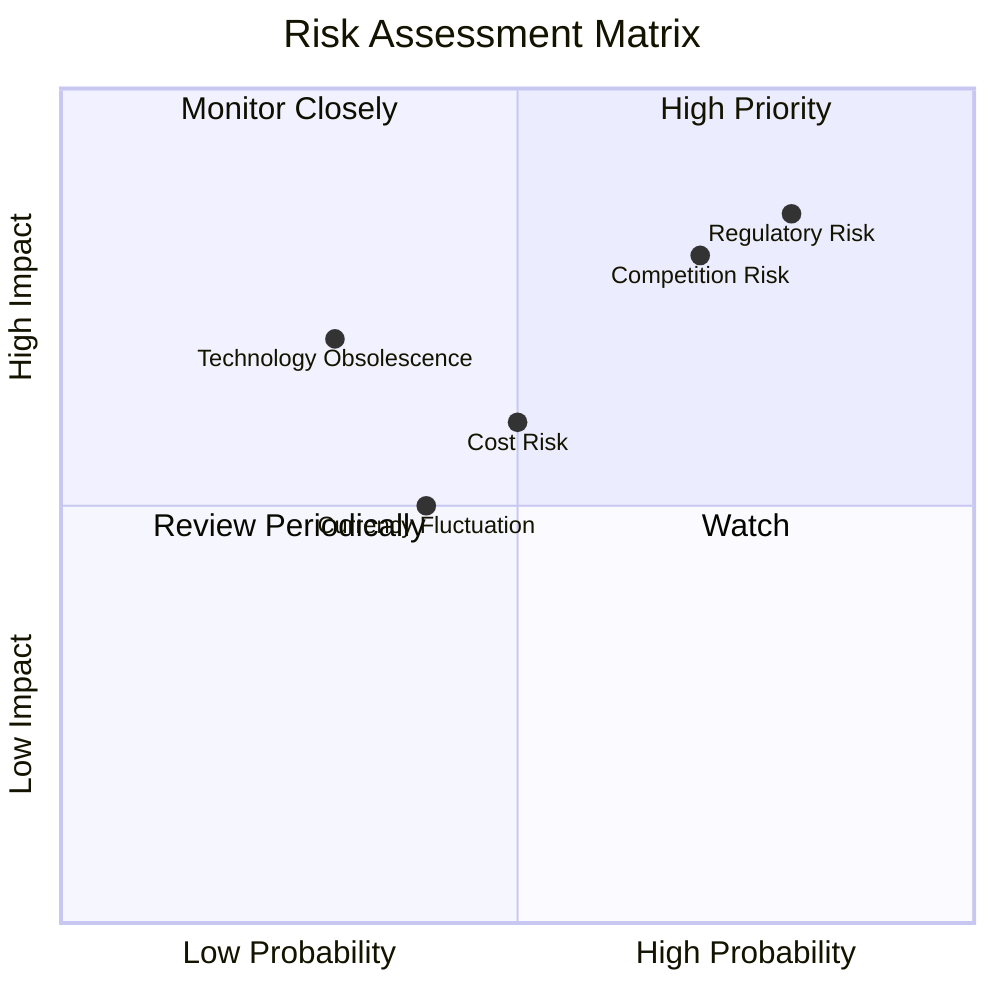

### 9.2 風險清單詳細分析

| # | 風險項目 | 發生機率 | 財務衝擊 | 風險評分 | 緩解措施 |
|---|----------|----------|----------|----------|----------|
| 1 | 🔴 **法規風險** | 高 (80%) | 高 (-10%收入) | 🔴 8.5/10 | 加強合規部門、密切監控法規變化 |
| 2 | 🔴 **競爭風險** | 高 (70%) | 高 (-8%收入) | 🔴 7.8/10 | 投資技術創新、擴大市場份額 |
| 3 | 🟡 **成本上升** | 中 (50%) | 中 (-5%利潤) | 🟡 6.0/10 | 嚴格成本控制、提升效益 |

---

## 10. 投資建議

### 10.1 最終綜合評級雷達圖

```
╔══════════════════════════════════════════════════════════════════╗
║                   🎯 綜合評級雷達圖                              ║
╠══════════════════════════════════════════════════════════════════╣
║                                                                  ║
║  各維度評分（1-10分）                                            ║
║  基本面：9   ▓▓▓▓▓▓▓▓▓▓▓▓▓▓▓▓▓▓▓▓  🟢 穩固                       ║
║  成長性：9   ▓▓▓▓▓▓▓▓▓▓▓▓▓▓▓▓▓▓▓▓  🟢 強勁                       ║
║  獲利能力：9 ▓▓▓▓▓▓▓▓▓▓▓▓▓▓▓▓▓▓▓▓  🟢 優秀                       ║
║  財務健康：9 ▓▓▓▓▓▓▓▓▓▓▓▓▓▓▓▓▓▓▓▓  🟢 良好                       ║
║  估值合理：8 ▓▓▓▓▓▓▓▓▓▓▓▓▓▓▓▓▓▓░░  🟡 合理                       ║
║                                                                  ║
╚══════════════════════════════════════════════════════════════════╝
```

### 10.2 目標價與隱含報酬率

| 情境 | 目標價 | 隱含報酬率 | 機率 |
|------|--------|------------|------|
| 樂觀 | $405 | +35% | 30% |
| 基準 | $359.53 | +20% | 50% |
| 悲觀 | $320 | +7% | 20% |

### 10.3 買入時機與觸發因素

```
╔══════════════════════════════════════════════════════════════════╗
║                  ✅ 買入觸發因素 Checklist                      ║
╠══════════════════════════════════════════════════════════════════╣
║                                                                  ║
║  立即買入觸發條件（多數符合）：                                  ║
║  ✅ 收入和利潤持續增長                                           ║
║  ✅ 當前估值接近低估區間                                         ║
║  ☐ 法規環境保持穩定                                             ║
║                                                                  ║
║  加碼觸發條件（出現以下任一）：                                  ║
║  ☐ 重大技術突破                                                  ║
║  ☐ 新增市場擴張成功                                             ║
║                                                                  ║
║  減碼/停損觸發條件（出現以下任一）：                             ║
║  ☐ 重大法規變動影響業績                                         ║
║  ☐ 競爭對手顯著增加市場份額                                     ║
║                                                                  ║
╚══════════════════════════════════════════════════════════════════╝
```

### 10.4 投資人適配度分析

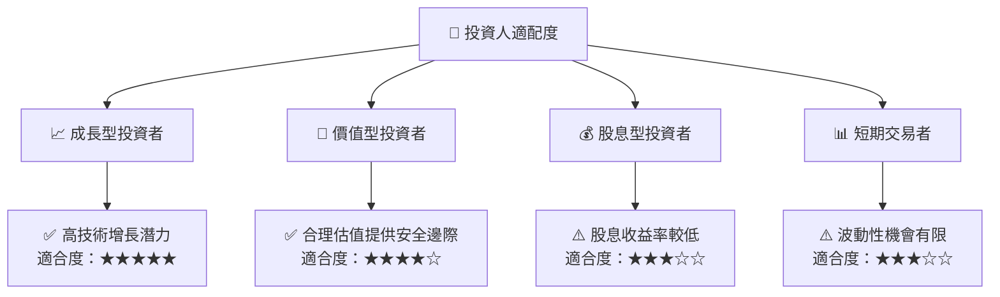

### 10.5 關鍵監控指標

| 監控類型 | 指標 | 關注點 | 頻率 |
|----------|------|--------|------|
| 業績 | 收入增長率 | 是否達到預期 | 每季度 |
| 估值 | P/E 比率 | 是否進入合理區間 | 每月 |
| 法規 | 數據隱私政策 | 是否有變動 | 每半年 |
| 競爭 | 市場份額變化 | 是否持續領先 | 每年 |

---

> **免責聲明**：本報告為 AI 自動生成，僅供研究參考，不構成投資建議。投資有風險，入市需謹慎。