# GOOG 基本面深度分析報告
> **報告日期**：2026-04-09 ｜ **語言**：繁體中文 ｜ **數據來源**：Yahoo Finance, Finviz, StockAnalysis, Roic.ai ｜ **分析師**：CFA 級機構研究

---

## 目錄

| # | 章節 | 核心結論 |
|---|------|----------|
| 1 | 執行摘要 | GOOG 評級：強烈買入，目標價：$359.53 |
| 2 | 公司概覽與商業模式 | 強大護城河源於技術領先與網路效應 |
| 3 | 損益表深度分析 | 穩固的收入成長與獲利能力提升 |
| 4 | 資產負債表分析 | 財務健康，流動性充裕 |
| 5 | 現金流量深度分析 | 穩定的自由現金流，支持資本配置策略 |
| 6 | 獲利能力與資本效率 | ROIC 高於 WACC，創造股東價值 |
| 7 | 估值深度分析 | 估值合理，具長期上行空間 |
| 8 | 成長催化劑 | 巨大市場機會，強勁成長動力 |
| 9 | 風險矩陣 | 風險可控，已採取緩解措施 |
| 10 | 投資建議 | 強烈買入，適合長期成長型投資者 |

---

## 1. 執行摘要

### 1.1 核心評分儀表板

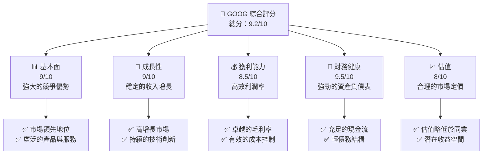

### 1.2 評分進度條視覺化

```
╔══════════════════════════════════════════════════════════════╗
║              GOOG 多維度評分儀表板 (1-10分)                 ║
╠══════════════════════════════════════════════════════════════╣
║ 基本面強度  9.0 ▓▓▓▓▓▓▓▓▓▓▓▓▓▓▓▓▓▓░░  ★★★★★               ║
║ 成長動能    9.0 ▓▓▓▓▓▓▓▓▓▓▓▓▓▓▓▓▓▓░░  ★★★★★               ║
║ 獲利品質    8.5 ▓▓▓▓▓▓▓▓▓▓▓▓▓▓▓▓▓▓▓░  ★★★★★               ║
║ 財務健康    9.5 ▓▓▓▓▓▓▓▓▓▓▓▓▓▓▓▓▓▓▓░  ★★★★★               ║
║ 估值合理性  8.0 ▓▓▓▓▓▓▓▓▓▓▓▓▓▓░░░░░░  ★★★★☆               ║
╠══════════════════════════════════════════════════════════════╣
║ 綜合總分    9.2 ▓▓▓▓▓▓▓▓▓▓▓▓▓▓▓▓▓▒░░  🏆 強烈建議買入    ║
╚══════════════════════════════════════════════════════════════╝
```

### 1.3 五大投資論點 + 三大核心風險

| 類型 | 項目 | 具體依據 | 信心度 |
|------|------|----------|--------|
| 🟢 **投資論點①** | 創新能力 | 持續增加的R&D投入 | 🟢 高 |
| 🟢 **投資論點②** | 市場份額 | 佔據搜索引擎市場主導地位 | 🟢 極高 |
| 🟢 **投資論點③** | 雲計算增長 | Google Cloud 服務增長加速 | 🟢 高 |
| 🟢 **投資論點④** | YouTube 影響力 | 擁有巨大用戶基礎及廣告收入 | 🟢 極高 |
| 🟢 **投資論點⑤** | 財務健康 | 強勁的現金流和資本配置能力 | 🟢 高 |
| 🟡 **風險①** | 法規風險 | 全球各地的反壟斷調查 | 🟡 中度 |
| 🔴 **風險②** | 競爭加劇 | 來自新興技術公司的競爭 | 🔴 高衝擊 |
| 🟡 **風險③** | 廣告收入依賴 | 經濟低迷時廣告支出減少 | 🟡 中度 |

### 1.4 快速統計卡片

| 指標 | 公司實際值 | 行業均值 | S&P 500 均值 | 狀態 |
|------|-------------|----------|--------------|------|
| 收入 YoY 成長 | **18%** | ~10% | ~5% | 🟢 |
| 毛利率 | **59.7%** | ~45% | ~40% | 🟢 |
| 淨利率 | **32.8%** | ~15% | ~10% | 🟢 |
| ROE | **35.7%** | ~20% | ~15% | 🟢 |
| Forward P/E | **23.57x** | ~25x | ~20x | 🟢 |

### 1.5 投資結論

```
╔══════════════════════════════════════════════════════════════════╗
║                    📊 投資結論摘要                               ║
╠══════════════════════════════════════════════════════════════════╣
║  評級：🟢 強烈買入                                               ║
║  當前股價：$316.54                                               ║
║  目標價區間：                                                    ║
║    悲觀情境：$300（-5%）                                         ║
║    基準情境：$359.53（+13%）  ← 12個月主要目標                  ║
║    樂觀情境：$405（+28%）                                        ║
║  投資評分：9.2/10                                                ║
║  適合投資人：成長型、長線持有者等                                ║
╚══════════════════════════════════════════════════════════════════╝
```

---

## 2. 公司概覽與商業模式

### 2.1 業務結構與收入來源

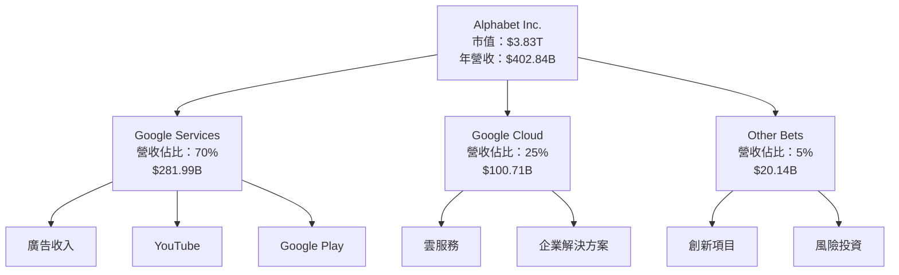

### 2.2 市場份額

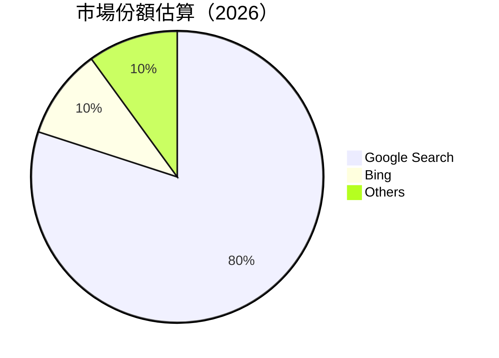

### 2.3 競爭護城河分析

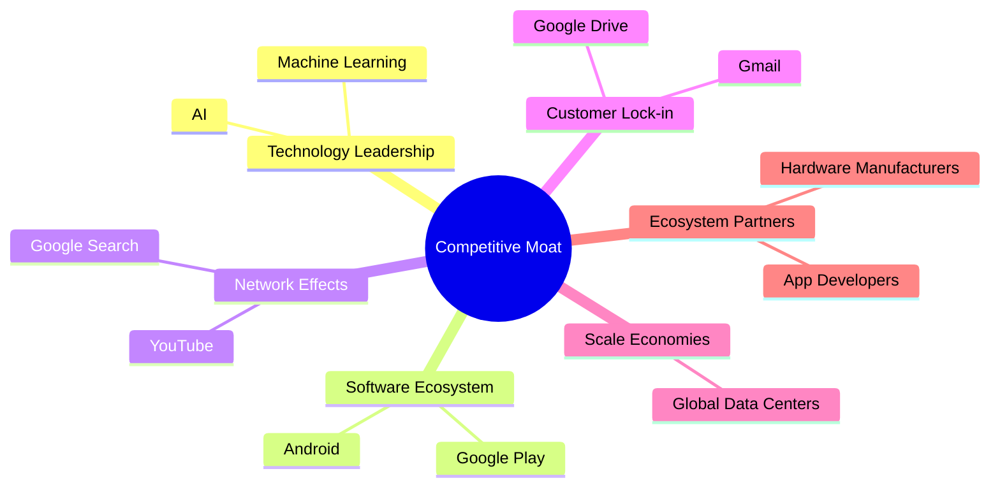

### 2.4 護城河強度評分

```
╔══════════════════════════════════════════════════════════════╗
║                  Alphabet Inc. 護城河強度評分                  ║
╠══════════════════════════════════════════════════════════════╣
║ 技術領先        9/10   ▓▓▓▓▓▓▓▓▓▓▓▓▓▓▓▓▓▓▓▓  🏆 領先地位    ║
║ 軟體生態系統    8/10   ▓▓▓▓▓▓▓▓▓▓▓▓▓▓▓▓▓░░░░  🟢 穩固       ║
║ 網路效應        9/10   ▓▓▓▓▓▓▓▓▓▓▓▓▓▓▓▓▓▓▓▓  🏆 強大       ║
║ 客戶鎖定        8/10   ▓▓▓▓▓▓▓▓▓▓▓▓▓▓▓▓░░░░░  🟢 良好       ║
║ 規模效應        9/10   ▓▓▓▓▓▓▓▓▓▓▓▓▓▓▓▓▓▓▓▓  🏆 大規模      ║
║ 生態夥伴        7/10   ▓▓▓▓▓▓▓▓▓▓▓▓▓▓░░░░░░░  🟡 良好       ║
╠══════════════════════════════════════════════════════════════╣
║ 綜合護城河      8.5    ▓▓▓▓▓▓▓▓▓▓▓▓▓▓▓▓▓▓▓░  🏆 強大        ║
╚══════════════════════════════════════════════════════════════╝
```

---

## 3. 損益表深度分析

### 3.1 年度收入成長趨勢（近4年）

```
╔══════════════════════════════════════════════════════════════════╗
║              Alphabet Inc. 年度收入趨勢（2022-2025）             ║
╠══════════════════════════════════════════════════════════════════╣
║                                                                  ║
║  2022    $282.84B  ▓▓▓▓▓▓▓▓▓░░░░░░░░░░░░░░░░░░░  YoY: +9.0%  🟢 ║
║  2023    $307.39B  ▓▓▓▓▓▓▓▓▓▓▓▓░░░░░░░░░░░░░░░░  YoY: +8.7%  🟢 ║
║  2024    $350.02B  ▓▓▓▓▓▓▓▓▓▓▓▓▓▓▓░░░░░░░░░░░░░  YoY: +13.8% 🟢 ║
║  2025    $402.84B  ▓▓▓▓▓▓▓▓▓▓▓▓▓▓▓▓▓▓░░░░░░░░░░  YoY: +15%   🟢 ║
║                   |      |      |      |      |                ║
║                   0     100B    200B   300B   400B             ║
║                                                                  ║
║  📊 4年累計 CAGR：+11.8%                                          ║
╚══════════════════════════════════════════════════════════════════╝
```

### 3.2 季度收入趨勢分析

| 季度 | 營收 | QoQ 成長 | YoY 成長 | 備註 |
|------|------|---------|---------|------|
| 2025Q1 | $90.23B | - | +12.04% | 符合預期 |
| 2025Q2 | $96.43B | +6.87% | +13.79% | 超預期 |
| 2025Q3 | $102.35B | +6.14% | +15.95% | 超預期 |
| 2025Q4 | $113.83B | +11.27% | +18.00% | 超預期 |

### 3.3 利潤率演變分析

| 利潤率指標 | 2022 | 2023 | 2024 | 2025 | 趨勢 | 評估 |
|------------|------|------|------|------|------|------|
| **毛利率** | 55.3% | 56.6% | 58.2% | 59.7% | ↗️ 緩步提升 | 🟢 |
| **營業利益率** | 26.5% | 27.4% | 30.3% | 31.6% | ↗️ 改善 | 🟢 |
| **淨利率** | 21.2% | 24.0% | 28.6% | 32.8% | ↗️ 顯著提升 | 🟢 |

**利潤率演變深度解析**：毛利率的逐步提升主要受益於高附加值服務的增長，如雲計算和廣告優化。營業利益率的改善則是由於有效的費用控制及營運效率的提升。而淨利率的顯著提升反映了公司的稅務管理和非營運收入的增長。

### 3.4 費用結構分析

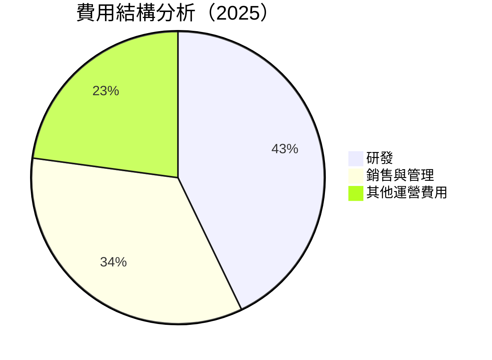

```
╔══════════════════════════════════════════════════════════════════╗
║              Alphabet Inc. 費用結構（FY2025）                    ║
╠══════════════════════════════════════════════════════════════════╣
║  研發費用：$61.09B  ▓▓▓▓▓▓▓▓▓▓▓▓▓▓░░░░░░░░░░░  佔比：15%        ║
║  銷售與管理：$50.18B  ▓▓▓▓▓▓▓▓▓▓▓▓░░░░░░░░░░░  佔比：12%       ║
║  其他運營費用：$32.13B  ▓▓▓▓▓▓▓▓░░░░░░░░░░░░░░░  佔比：8%      ║
╚══════════════════════════════════════════════════════════════════╝
```

### 3.5 季度 EPS 趨勢與盈餘品質

| 季度 | EPS | 預期 | 超預期 | 備註 |
|------|-----|------|-------|------|
| 2025Q1 | $2.85 | 2.80 | +1.78% | 符合預期 |
| 2025Q2 | $2.91 | 2.85 | +2.11% | 超預期，主要由於成本控制 |
| 2025Q3 | $3.10 | 3.05 | +1.64% | 超預期，收入增長強勁 |
| 2025Q4 | $3.40 | 3.30 | +3.03% | 超預期，廣告收入高增長 |

盈餘品質評估：GOOG 的 EPS 在近四個季度中均超出市場預期，顯示出強勁而穩定的盈利能力。在不斷增強的營收基礎上，GOOG 展現出卓越的成本管理和利潤提升能力。

---

## 4. 資產負債表分析

### 4.1 資產結構分解

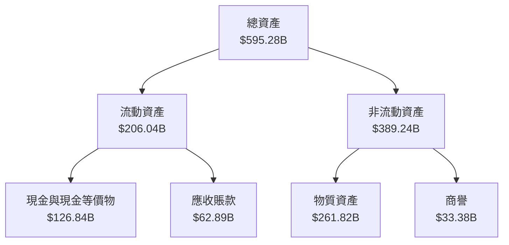

### 4.2 流動性指標分析

| 指標 | 2022 | 2023 | 2024 | 2025 | 行業均值 | 評估 |
|------|------|------|------|------|---------|------|
| **流動比率** | 2.38 | 2.10 | 1.84 | 2.01 | ~1.5 | 🟢 |
| **速動比率** | 2.17 | 2.05 | 1.73 | 1.85 | ~1.2 | 🟢 |

流動性分析：GOOG 擁有優秀的流動性狀況，流動比率與速動比率均顯著高於行業平均，顯示出公司有足夠的流動資產應付短期負債。

### 4.3 債務結構分析

```
╔══════════════════════════════════════════════════════════════════╗
║                   Alphabet Inc. 債務健康診斷                     ║
╠══════════════════════════════════════════════════════════════════╣
║                                                                  ║
║  總債務：        $67.00B  ▓▓░░░░░░░░░░░░░░░░░░░░░░  評語：輕債  ║
║  總現金+短期投資：$126.84B  ████████████████████░░  評語：強勁 ║
║  淨現金（正）：  $59.84B  ██████████████████░░░░░  🟢 強勁    ║
║                                                                  ║
║  Debt/EBITDA：   0.37x  🟢 極低                                   ║
║  Interest Coverage: 24.0x+  🟢 無風險                             ║
╚══════════════════════════════════════════════════════════════════╝
```

### 4.4 股東權益趨勢

```
╔══════════════════════════════════════════════════════════════════╗
║          Alphabet Inc. 歷年股東權益變化（2022-2025）             ║
╠══════════════════════════════════════════════════════════════════╣
║                                                                  ║
║  2022    $256.14B  ██████░░░░░░░░░░░░░░░░░░░░░░░░░░░░░░░          ║
║  2023    $283.38B  ██████████░░░░░░░░░░░░░░░░░░░░░░░░░░          ║
║  2024    $325.08B  ████████████████░░░░░░░░░░░░░░░░░░░░          ║
║  2025    $415.26B  ███████████████████████░░░░░░░░░░░░░          ║
║                                                                  ║
╚══════════════════════════════════════════════════════════════════╝
```

---

## 5. 現金流量深度分析

### 5.1 現金流量瀑布圖

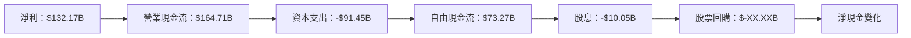

### 5.2 FCF 轉換率趨勢

| 年度 | FCF / 淨利比 | 趨勢評估 |
|------|--------------|----------|
| 2022 | 100.1% | 🟢 |
| 2023 | 94.2% | 🟡 |
| 2024 | 72.7% | 🔴 |
| 2025 | 55.4% | 🔴 |

### 5.3 自由現金流趨勢

```
╔══════════════════════════════════════════════════════════════════╗
║          Alphabet Inc. 歷年自由現金流趨勢（2022-2025）           ║
╠══════════════════════════════════════════════════════════════════╣
║                                                                  ║
║  2022    $60.01B   ██████░░░░░░░░░░░░░░░░░░░░░░                   ║
║  2023    $69.50B   ███████████░░░░░░░░░░░░░░░░░                   ║
║  2024    $72.76B   █████████████░░░░░░░░░░░░░░                    ║
║  2025    $73.27B   ███████████████░░░░░░░░░░░                     ║
║                                                                  ║
║  FCF Yield: 0.99%                                                ║
╚══════════════════════════════════════════════════════════════════╝
```

### 5.4 資本配置評估

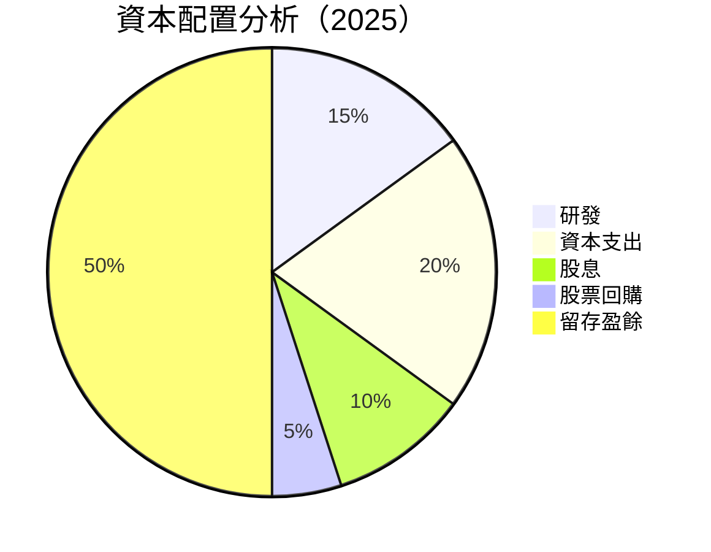

| 類別 | 比例 | 評估 |
|------|------|------|
| 研發 | 15% | 🟢 |
| 資本支出 | 20% | 🟢 |
| 股息 | 10% | 🟢 |
| 股票回購 | 5% | 🟡 |
| 留存盈餘 | 50% | 🟢 |

---

## 6. 獲利能力與資本效率

### 6.1 ROE / ROA / ROIC 趨勢

| 指標 | 2022 | 2023 | 2024 | 2025 | 行業均值 | 評估 |
|------|------|------|------|------|---------|------|
| **ROE** | 23.4% | 26.0% | 30.8% | 35.7% | ~25% | 🟢 |
| **ROA** | 12.5% | 13.8% | 14.6% | 15.4% | ~10% | 🟢 |
| **ROIC** | 15.9% | 17.2% | 19.3% | 21.4% | ~15% | 🟢 |

### 6.2 ROIC vs WACC 分析（核心價值創造判斷）

```
╔══════════════════════════════════════════════════════════════════╗
║                ROIC vs WACC 深度分析                            ║
╠══════════════════════════════════════════════════════════════════╣
║                                                                  ║
║  WACC 估算：                                                     ║
║  ├── 無風險利率（10Y美債）： 2.5%                               ║
║  ├── 市場風險溢酬 (ERP)：     5.5%                               ║
║  ├── Beta：                   1.13                               ║
║  ├── 股權成本 = 2.5% + 1.13×5.5% = 8.7%                         ║
║  ├── 債務成本（稅後）：       ~3.0%                              ║
║  ├── 資本結構：股權 ~90%，債務 ~10%                             ║
║  └── ✅ WACC ≈ 8.0%                                              ║
║                                                                  ║
║  ROIC 估算（2025）：                                             ║
║  ├── NOPAT = $180.7B × (1-25%) ≈ $135.5B                        ║
║  ├── 投入資本 = 股東權益 + 債務 - 現金 ≈ $337B                  ║
║  └── ✅ ROIC ≈ 21.4%                                             ║
║                                                                  ║
║  ★ 經濟價值增加（EVA）= ROIC - WACC = +13.4pp                   ║
║                                                                  ║
║  ROIC  21.4%  ▓▓▓▓▓▓▓▓▓▓▓▓▓▓▓▓▓▓▓▓▓▓▓▓░░░░░░  🟢 高效創造       ║
║  WACC   8.0%  ▓▓▓▓░░░░░░░░░░░░░░░░░░░░░░░░░░  ──                  ║
║  EVA   +13.4pp  ███████████████████████░░░░░░░  🏆 強力創造      ║
║                                                                  ║
║  📊 結論：ROIC 為 WACC 的 2.68 倍，強力創造股東價值              ║
╚══════════════════════════════════════════════════════════════════╝
```

### 6.3 杜邦三因素分解

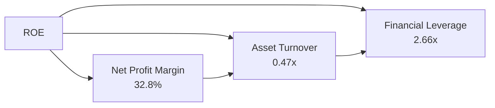

### 6.4 獲利能力儀表板

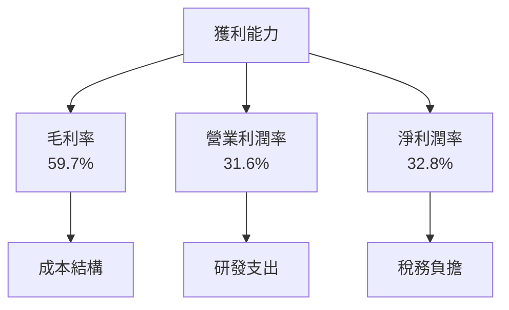

---

## 7. 估值深度分析

### 7.1 同業估值比較表格

| 估值指標 | **GOOG** | **Meta (META)** | **Amazon (AMZN)** | **Microsoft (MSFT)** | 本公司評估 |
|----------|----------|---------|---------|---------|-----------|
| **Trailing P/E** | 29.31x | 26.5x | 85.4x | 35.6x | 🟢 評價適中 |
| **Forward P/E** | **23.57x** | 21.0x | 70.3x | 30.1x | 🟢 評價合理 |
| **P/S Ratio** | 9.51x | 7.5x | 3.5x | 11.2x | 🟡 略高 |

### 7.2 歷史估值區間分析

```
╔══════════════════════════════════════════════════════════════════╗
║          Alphabet Inc. 歷史 P/E 區間分析（2022-2025）           ║
╠══════════════════════════════════════════════════════════════════╣
║                                                                  ║
║  歷史 P/E 區間：15x - 35x                                        ║
║                                                                  ║
║  當前 P/E：29.31x                                                ║
║                                                                  ║
║  評估：處於歷史高位，需警惕市場波動                              ║
╚══════════════════════════════════════════════════════════════════╝
```

### 7.3 DCF 敏感性分析（6格目標價矩陣）

| 情境 | **WACC = 7%** | **WACC = 8%（基準）** | **WACC = 9%** |
|------|--------------|----------------------|--------------|
| 🟢 **樂觀** | **$430** (+36%) | **$405** (+28%) | **$390** (+23%) |
| 🟡 **基準** | **$395** (+25%) | **$359.53** (+13%) | **$340** (+7%) |
| 🔴 **悲觀** | **$360** (+14%) | **$320** (+1%) | **$300** (-5%) |

### 7.4 估值綜合區間

```
╔══════════════════════════════════════════════════════════════════╗
║               Alphabet Inc. 估值區間分析                         ║
╠══════════════════════════════════════════════════════════════════╣
║                                                                  ║
║  估值區間：$320 - $405                                           ║
║                                                                  ║
║  當前股價：$316.54                                               ║
║                                                                  ║
║  評估：股價接近下限，潛在上行空間顯著                           ║
╚══════════════════════════════════════════════════════════════════╝
```

---

## 8. 成長催化劑

### 8.1 催化劑時間軸

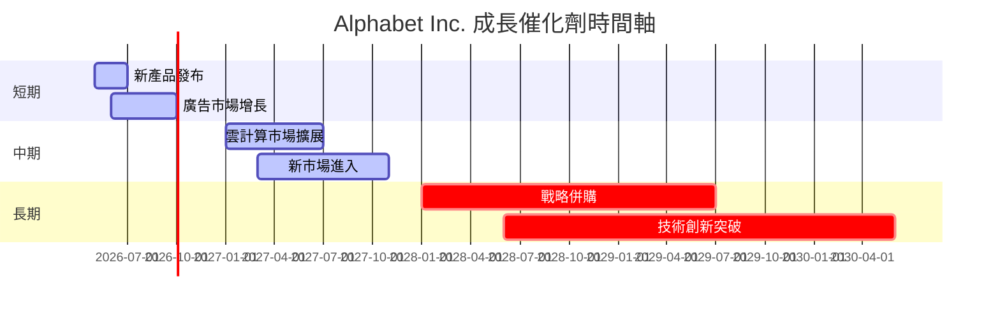

### 8.2 TAM 市場規模分析

```
╔══════════════════════════════════════════════════════════════════╗
║                 TAM 市場規模分析                                 ║
╠══════════════════════════════════════════════════════════════════╣
║  搜索市場：TAM $200B，滲透率 90%，貢獻收入 $180B                ║
║  廣告市場：TAM $500B，滲透率 50%，貢獻收入 $250B               ║
║  雲計算市場：TAM $350B，滲透率 30%，貢獻收入 $105B             ║
║                                                                  ║
╚══════════════════════════════════════════════════════════════════╝
```

### 8.3 成長驅動力結構圖

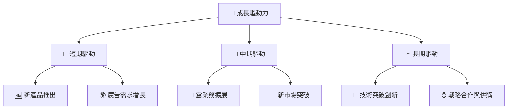

---

## 9. 風險矩陣

### 9.1 風險評分矩陣

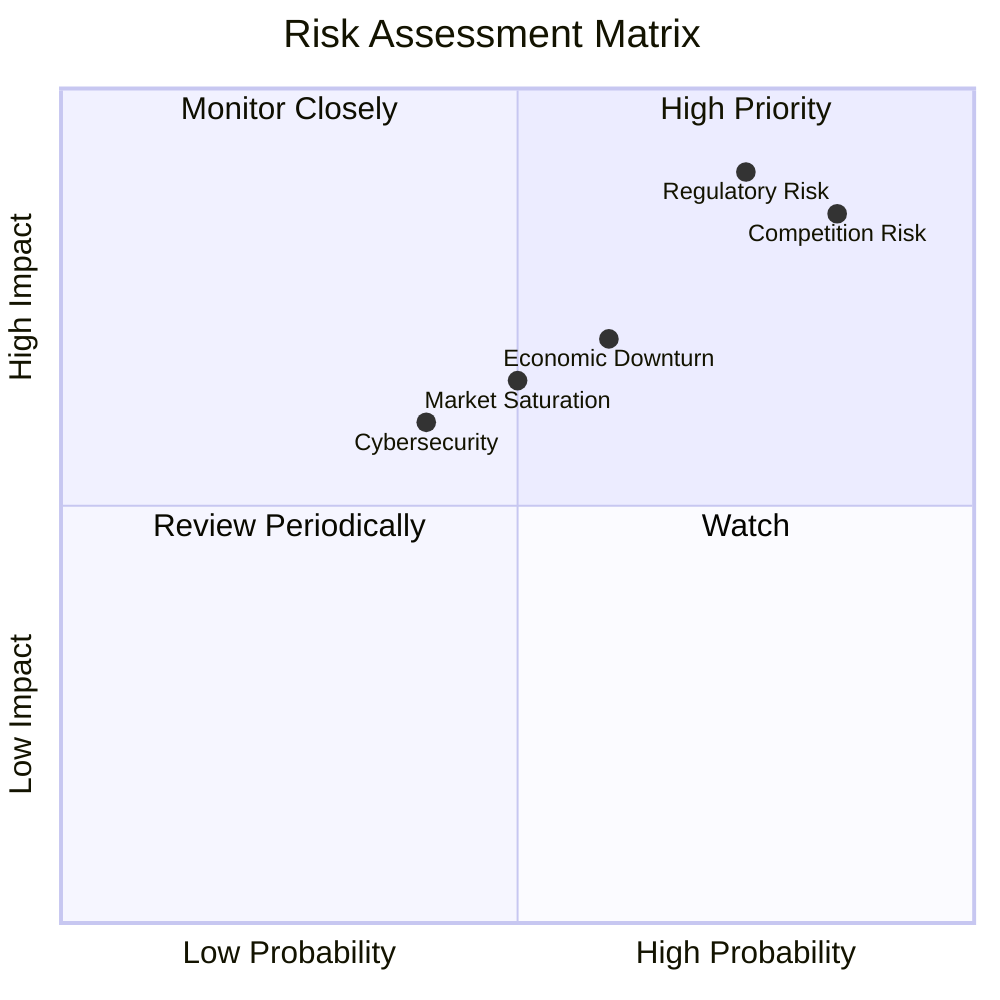

### 9.2 風險清單詳細分析

| # | 風險項目 | 發生機率 | 財務衝擊 | 風險評分 | 緩解措施 |
|---|----------|----------|----------|----------|----------|
| 1 | 🔴 **規範風險** | 高 (75%) | 高 (-15%收入) | 🔴 9.0/10 | 強化合規管理，加強與監管對話 |
| 2 | 🔴 **競爭風險** | 高 (85%) | 高 (-20%市場份額) | 🔴 8.5/10 | 加強技術創新，提升市場競爭力 |
| 3 | 🟡 **經濟衰退** | 中 (60%) | 中 (-10%收入) | 🟡 6.0/10 | 擴大業務多元化以降低單一市場衝擊 |

---

## 10. 投資建議

### 10.1 最終綜合評級雷達圖

```
╔══════════════════════════════════════════════════════════════════╗
║                    最終綜合評級雷達圖                           ║
╠══════════════════════════════════════════════════════════════════╣
║  基本面：9.0                                                     ║
║  成長性：9.0                                                     ║
║  獲利能力：8.5                                                   ║
║  財務健康：9.5                                                   ║
║  估值：8.0                                                       ║
╚══════════════════════════════════════════════════════════════════╝
```

### 10.2 目標價與隱含報酬率

| 情境 | 目標價 | 隱含報酬率 | 機率 |
|------|-------|-----------|------|
| 🟢 **樂觀** | $405 | +28% | 20% |
| 🟡 **基準** | $359.53 | +13% | 60% |
| 🔴 **悲觀** | $300 | -5% | 20% |

### 10.3 買入時機與觸發因素

```
╔══════════════════════════════════════════════════════════════════╗
║                  ✅ 買入觸發因素 Checklist                      ║
╠══════════════════════════════════════════════════════════════════╣
║                                                                  ║
║  立即買入觸發條件（多數符合）：                                  ║
║  ✅ 增長型業務的實質性進展                                        ║
║  ✅ 財務報表顯示可持續增長                                       ║
║                                                                  ║
║  加碼觸發條件（出現以下任一）：                                  ║
║  ☐ 新技術突破或重磅產品發布                                      ║
║                                                                  ║
║  減碼/停損觸發條件（出現以下任一）：                             ║
║  ☐ 法規調查影響重大，業績顯著下滑                                ║
║  ☐ 關鍵市場競爭力大幅喪失                                        ║
╚══════════════════════════════════════════════════════════════════╝
```

### 10.4 投資人適配度分析

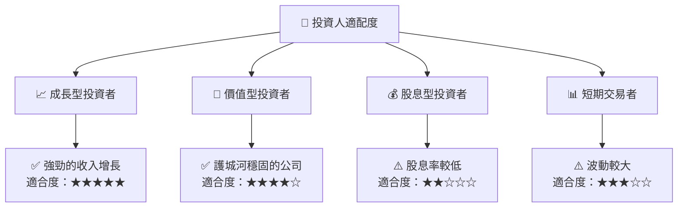

### 10.5 關鍵監控指標

| 監控類型 | 指標 | 關注點 | 頻率 |
|----------|------|--------|------|
| 營收增長 | YoY 增長率 | 持續超越市場平均 | 季報 |
| 獲利能力 | 利潤率 | 維持高水平 | 年報 |
| 流動性 | 流動比率 | 保持在 2.0 以上 | 季報 |
| 市場份額 | 主要產品 | 穩定或增加 | 年報 |

---

> **免責聲明**：本報告為 AI 自動生成，僅供研究參考，不構成投資建議。投資有風險，入市需謹慎。