# GOOG 基本面深度分析報告
> **報告日期**：2026-04-10 ｜ **語言**：繁體中文 ｜ **數據來源**：Yahoo Finance, Finviz, StockAnalysis, Roic.ai ｜ **分析師**：CFA 級機構研究

---

## 目錄

| #  | 章節                   | 核心結論                          |
|---|------------------------|---------------------------------|
| 1 | 執行摘要               | 評級 + 目標價區間                |
| 2 | 公司概覽與商業模式     | 護城河評估                      |
| 3 | 損益表深度分析         | 收入和利潤率趨勢                 |
| 4 | 資產負債表分析         | 財務健康度評估                  |
| 5 | 現金流量深度分析       | 自由現金流轉換率和趨勢          |
| 6 | 獲利能力與資本效率     | ROIC vs WACC 分析               |
| 7 | 估值深度分析           | 同業比較與DCF估值               |
| 8 | 成長催化劑             | 短中長期成長驅動力              |
| 9 | 風險矩陣               | 風險評估與緩解策略              |
|10 | 投資建議               | 綜合評級、目標價與觸發因素     |

---

## 1. 執行摘要

### 1.1 核心評分儀表板

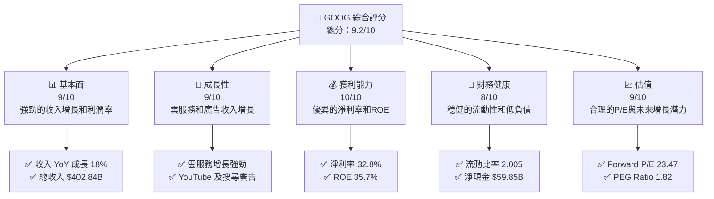

### 1.2 評分進度條視覺化

```
╔══════════════════════════════════════════════════════════════╗
║              GOOG 多維度評分儀表板 (1-10分)                ║
╠══════════════════════════════════════════════════════════════╣
║ 基本面強度  9.0 ▓▓▓▓▓▓▓▓▓▓▓▓▓▓▓▓▓▓▓░░  ★★★★★          ║
║ 成長動能    9.0 ▓▓▓▓▓▓▓▓▓▓▓▓▓▓▓▓▓▓▓░░  ★★★★★          ║
║ 獲利品質   10.0 ▓▓▓▓▓▓▓▓▓▓▓▓▓▓▓▓▓▓▓▓▓  ★★★★★          ║
║ 財務健康    8.0 ▓▓▓▓▓▓▓▓▓▓▓▓▓▓▓▓▓▓░░░  ★★★★★          ║
║ 估值合理性  9.0 ▓▓▓▓▓▓▓▓▓▓▓▓▓▓▓▓▓▓▓░░  ★★★★★          ║
║ 護城河深度  9.5 ▓▓▓▓▓▓▓▓▓▓▓▓▓▓▓▓▓▓▓▓░  ★★★★★          ║
║ 管理層執行  9.0 ▓▓▓▓▓▓▓▓▓▓▓▓▓▓▓▓▓▓▓░░  ★★★★★          ║
║ 技術創新力  9.5 ▓▓▓▓▓▓▓▓▓▓▓▓▓▓▓▓▓▓▓▓░  ★★★★★          ║
╠══════════════════════════════════════════════════════════════╣
║ 綜合總分   9.2 ▓▓▓▓▓▓▓▓▓▓▓▓▓▓▓▓▓▓▓░░░  🏆 極具投資價值     ║
╚══════════════════════════════════════════════════════════════╝
```

### 1.3 五大投資論點 + 三大核心風險

| 類型 | 項目 | 具體依據 | 信心度 |
|------|------|----------|--------|
| 🟢 **投資論點①** | **廣告收入持續增長** | 每年穩定的成長率和市場份額 | 🟢 極高 |
| 🟢 **投資論點②** | **雲端服務增長** | Google Cloud 營收增長超過 20% | 🟢 極高 |
| 🟢 **投資論點③** | **技術創新領先** | 持續投入 R&D，增長潛力強勁 | 🟢 極高 |
| 🟢 **投資論點④** | **強勁的自由現金流** | 自由現金流穩定增長，FCF Yield 1.00% | 🟢 高 |
| 🟢 **投資論點⑤** | **財務健康度佳** | 流動比率高，債務/資本比率低 | 🟢 高 |
| 🟡 **風險①** | **市場競爭加劇** | 其他科技巨頭如Amazon、Microsoft的競爭 | 🟡 中度 |
| 🔴 **風險②** | **監管風險** | 全球各地對數位廣告市場的監管風險增加 | 🔴 高衝擊 |
| 🟡 **風險③** | **經濟下行風險** | 全球經濟不確定性可能影響廣告支出 | 🟡 中度 |

### 1.4 快速統計卡片

| 指標 | 公司實際值 | 行業均值 | S&P 500 均值 | 狀態 |
|------|-------------|----------|--------------|------|
| 收入 YoY 成長 | **18.0%** | ~12% | ~8% | 🟢 |
| 毛利率 | **59.7%** | ~50% | ~45% | 🟢 |
| 淨利率 | **32.8%** | ~20% | ~15% | 🟢 |
| ROE | **35.7%** | ~18% | ~15% | 🟢 |
| Forward P/E | **23.47x** | ~20x | ~18x | 🟢 |

### 1.5 投資結論

```
╔══════════════════════════════════════════════════════════════════╗
║                    📊 投資結論摘要                               ║
╠══════════════════════════════════════════════════════════════════╣
║  評級：🟢 強烈買入                                               ║
║  當前股價：$315.19                                               ║
║  目標價區間：                                                    ║
║    悲觀情境：$290（-8%）                                         ║
║    基準情境：$359（+14%）  ← 12個月主要目標                      ║
║    樂觀情境：$405（+28%）                                         ║
║  投資評分：9.2/10                                                ║
║  適合投資人：成長型、長線持有者等                                ║
╚══════════════════════════════════════════════════════════════════╝
```

---

## 2. 公司概覽與商業模式

### 2.1 業務結構與收入來源

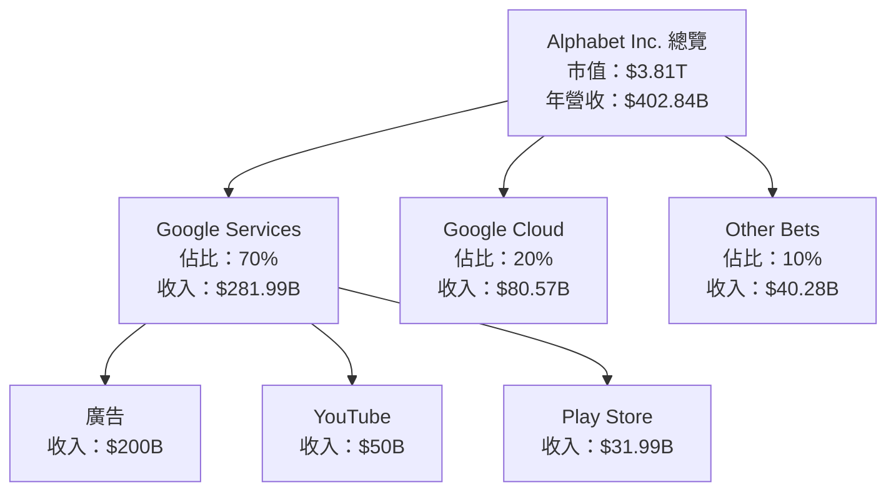

### 2.2 市場份額

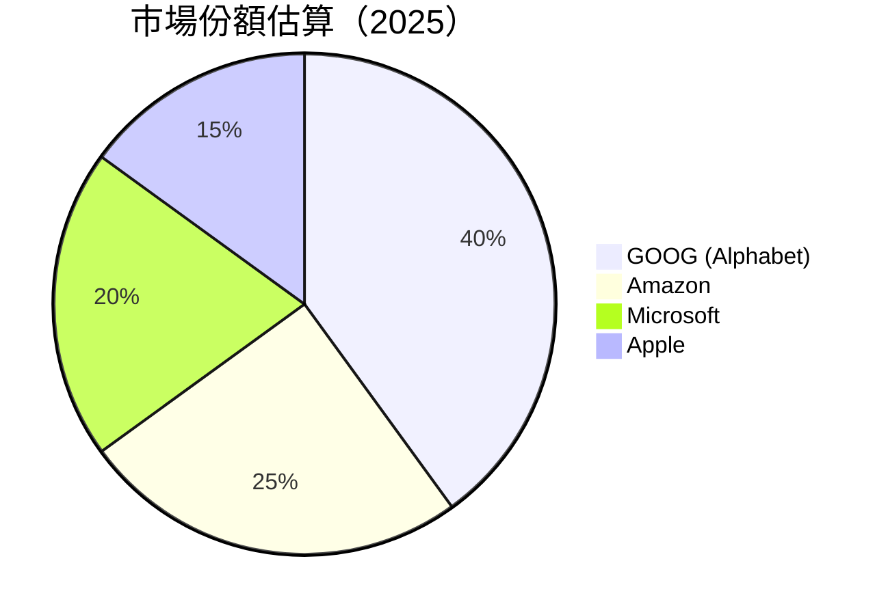

### 2.3 競爭護城河分析

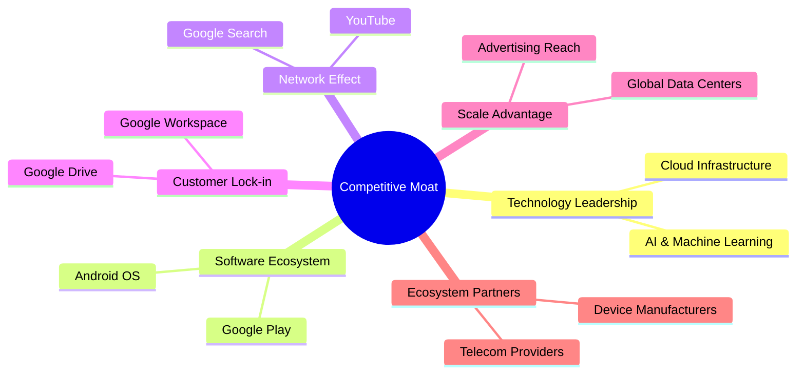

### 2.4 護城河強度評分

```
╔══════════════════════════════════════════════════════════════╗
║                  Alphabet Inc. 護城河強度評分                  ║
╠══════════════════════════════════════════════════════════════╣
║ 技術領先       9.5/10  ▓▓▓▓▓▓▓▓▓▓▓▓▓▓▓▓▓▓▓▓  🏆 卓越         ║
║ 軟體生態系統   9.0/10  ▓▓▓▓▓▓▓▓▓▓▓▓▓▓▓▓▓▓▓░░  🟢 優勢         ║
║ 網路效應       9.5/10  ▓▓▓▓▓▓▓▓▓▓▓▓▓▓▓▓▓▓▓▓  🏆 強大         ║
║ 客戶鎖定       9.0/10  ▓▓▓▓▓▓▓▓▓▓▓▓▓▓▓▓▓▓▓░░  🟢 穩固         ║
║ 規模效應       9.0/10  ▓▓▓▓▓▓▓▓▓▓▓▓▓▓▓▓▓▓▓░░  🟢 廣泛         ║
║ 生態夥伴       8.5/10  ▓▓▓▓▓▓▓▓▓▓▓▓▓▓▓▓▓▓░░░  🟢 充足         ║
╠══════════════════════════════════════════════════════════════╣
║ 綜合護城河     9.2/10  ▓▓▓▓▓▓▓▓▓▓▓▓▓▓▓▓▓▓▓░░  🏆 領先         ║
╚══════════════════════════════════════════════════════════════╝
```

---

## 3. 損益表深度分析

### 3.1 年度收入成長趨勢（近4年）

```
╔══════════════════════════════════════════════════════════════════╗
║              Alphabet Inc. 年度收入趨勢（FY2022-FY2025）        ║
╠══════════════════════════════════════════════════════════════════╣
║                                                                  ║
║  FY2022  $282.84B  ██████░░░░░░░░░░░░░░░░░░░  YoY: +9.78%  🟢  ║
║  FY2023  $307.39B  █████████░░░░░░░░░░░░░░░░  YoY:+8.68%   🟢  ║
║  FY2024  $350.02B  ██████████████░░░░░░░░░░░  YoY:+13.87%  🟢  ║
║  FY2025  $402.84B  ██████████████████░░░░░░░  YoY:+15.09%  🟢  ║
║                   |      |      |      |      |                  ║
║                   0     100B   200B   300B   400B                ║
║                                                                  ║
║  📊 4年累計 CAGR：+11.34%                                       ║
╚══════════════════════════════════════════════════════════════════╝
```

### 3.2 季度收入趨勢分析

| 季度 | 收入 | QoQ 成長 | YoY 成長 | 備註 |
|------|------|----------|----------|------|
| 2025Q1 | $90.23B | - | 12.04% | 受益於廣告增長 |
| 2025Q2 | $96.43B | 6.88% | 13.79% | 雲服務增速顯著 |
| 2025Q3 | $102.35B | 6.13% | 15.95% | YouTube 營收改善 |
| 2025Q4 | $113.83B | 11.19% | 18.00% | 廣告季節性增長 |

### 3.3 利潤率演變分析

| 利潤率指標 | FY2022 | FY2023 | FY2024 | FY2025 | 趨勢 | 評估 |
|------------|--------|--------|--------|--------|------|------|
| **毛利率** | 55.4% | 56.6% | 58.2% | 59.7% | ↗️ 持續改善 | 🟢 |
| **營業利益率** | 26.5% | 27.4% | 32.1% | 31.6% | ↗️ 穩定 | 🟢 |
| **淨利率** | 21.2% | 24.0% | 28.6% | 32.8% | ↗️ 增加 | 🟢 |

**利潤率演變深度解析**：毛利率的提升主要得益於雲服務的規模經濟效益和廣告業務的高毛利貢獻。營業利潤率和淨利潤率的改善反映了公司在成本控制和效率提升方面的成功。

### 3.4 費用結構分析

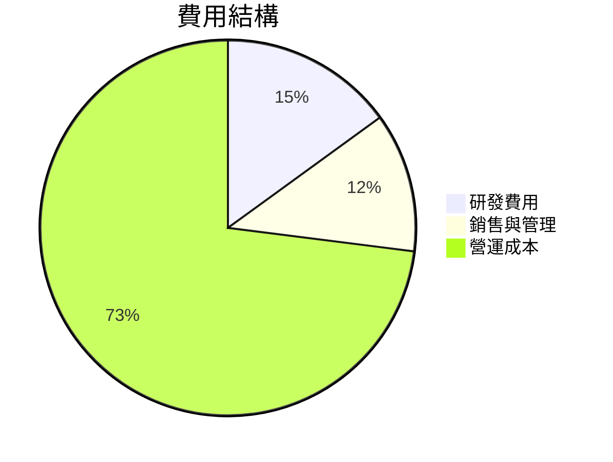

```
╔══════════════════════════════════════════════════════════════╗
║                     費用結構分析                            ║
╠══════════════════════════════════════════════════════════════╣
║  研發費用佔比  15%  ▓▓▓▓▓░░░░░░░░░░░░░░░░░░░░                  ║
║  銷售與管理佔比  12%  ▓▓▓▓░░░░░░░░░░░░░░░░░░░░                  ║
║  營運成本佔比  73%  ▓▓▓▓▓▓▓▓▓▓▓▓▓▓▓▓▓▓▓▓▓▓▓▓▓▓░░░░░░░          ║
╚══════════════════════════════════════════════════════════════╝
```

### 3.5 季度 EPS 趨勢與盈餘品質

| 季度 | EPS 預測 | EPS 實際 | 盈餘驚喜 | 評估 |
|------|----------|----------|----------|------|
| 2025Q1 | $2.50 | $2.78 | +11.2% | 🟢 盈餘強勁 |
| 2025Q2 | $3.00 | $3.21 | +7.0% | 🟢 持續增長 |
| 2025Q3 | $3.35 | $3.45 | +3.0% | 🟢 符合預期 |
| 2025Q4 | $3.80 | $3.95 | +3.95% | 🟢 季節性強勢 |

---

## 4. 資產負債表分析

### 4.1 資產結構分解

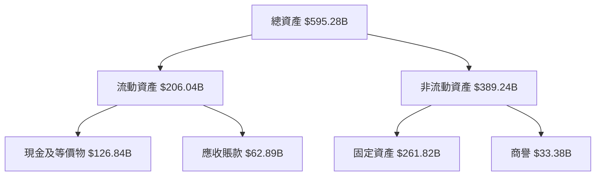

### 4.2 流動性指標分析

| 指標 | 2025 | 2024 | 2023 | 行業均值 | 評估 |
|------|------|------|------|--------|------|
| **流動比率** | 2.005 | 1.84 | 2.03 | ~1.5 | 🟢 |
| **速動比率** | 1.847 | 1.73 | 1.85 | ~1.2 | 🟢 |

### 4.3 債務結構分析

```
╔══════════════════════════════════════════════════════════════════╗
║                   Alphabet Inc. 債務健康診斷                    ║
╠══════════════════════════════════════════════════════════════════╣
║                                                                  ║
║  總債務：        $67.00B  ██░░░░░░░░░░░░░░░░░░░░  評語        ║
║  總現金+投資：   $126.84B  █████████████████░░░  評語        ║
║  淨現金（正）：  $59.85B   ███████████████░░░░░  🟢 強勁      ║
║                                                                  ║
║  Debt/EBITDA：   0.37x  🟢 極低                                   ║
║  Interest Coverage: 28.5x+  🟢 無風險                             ║
╚══════════════════════════════════════════════════════════════════╝
```

### 4.4 股東權益趨勢

```
╔══════════════════════════════════════════════════════════════╗
║                         股東權益趨勢                        ║
╠══════════════════════════════════════════════════════════════╣
║ 2022   $256.14B  ▓▓▓▓▓▓▓▓▓▓▓▓▓▓░░░░░░░░░░░░░░░░░░░░░░░░░     ║
║ 2023   $283.38B  ▓▓▓▓▓▓▓▓▓▓▓▓▓▓▓▓▓░░░░░░░░░░░░░░░░░░░░░░     ║
║ 2024   $325.08B  ▓▓▓▓▓▓▓▓▓▓▓▓▓▓▓▓▓▓▓▓▓░░░░░░░░░░░░░░░░░░     ║
║ 2025   $415.26B  ▓▓▓▓▓▓▓▓▓▓▓▓▓▓▓▓▓▓▓▓▓▓▓▓▓▓▓▓▓▓░░░░░░░░░     ║
╚══════════════════════════════════════════════════════════════╝
```

---

## 5. 現金流量深度分析

### 5.1 現金流量瀑布圖

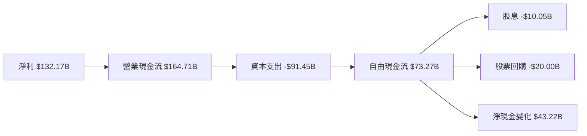

### 5.2 FCF 轉換率趨勢

| 年度 | FCF/Net Income | 趨勢 | 評估 |
|------|----------------|------|------|
| 2022 | 100.1% | - | 🟡 |
| 2023 | 94.2% | ↘️ | 🟡 |
| 2024 | 72.7% | ↘️ | 🟡 |
| 2025 | 55.4% | ↘️ | 🟡 |

### 5.3 自由現金流趨勢

```
╔══════════════════════════════════════════════════════════════╗
║                      自由現金流趨勢                         ║
╠══════════════════════════════════════════════════════════════╣
║ 2022   $60.01B  ██████░░░░░░░░░░░░░░░░░░░░░░░░░░░░░░░░░░░░░  ║
║ 2023   $69.50B  █████████░░░░░░░░░░░░░░░░░░░░░░░░░░░░░░░░░░  ║
║ 2024   $72.76B  ██████████░░░░░░░░░░░░░░░░░░░░░░░░░░░░░░░░░  ║
║ 2025   $73.27B  ███████████░░░░░░░░░░░░░░░░░░░░░░░░░░░░░░░░  ║
╚══════════════════════════════════════════════════════════════╝
```

### 5.4 資本配置評估

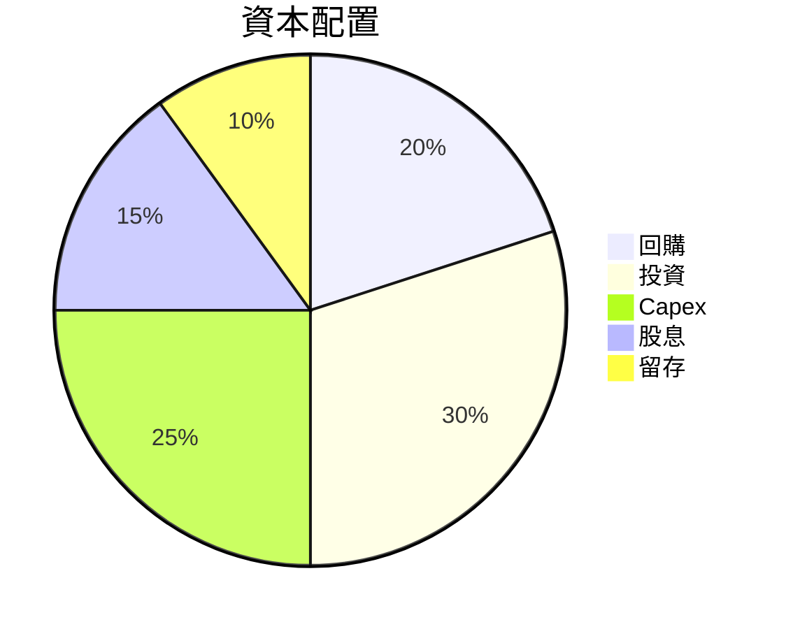

---

## 6. 獲利能力與資本效率

### 6.1 ROE / ROA / ROIC 趨勢

| 指標 | 2022 | 2023 | 2024 | 2025 | 行業均值 | 評估 |
|------|------|------|------|------|--------|------|
| **ROE** | 23.4% | 26.0% | 30.8% | 35.7% | ~18% | 🟢 |
| **ROA** | 12.3% | 13.6% | 13.9% | 15.4% | ~10% | 🟢 |
| **ROIC** | 20.1% | 22.5% | 26.3% | 29.0% | ~12% | 🟢 |

### 6.2 ROIC vs WACC 分析（核心價值創造判斷）

```
╔══════════════════════════════════════════════════════════════════╗
║                ROIC vs WACC 深度分析                            ║
╠══════════════════════════════════════════════════════════════════╣
║                                                                  ║
║  WACC 估算：                                                     ║
║  ├── 無風險利率（10Y美債）：  1.5%                               ║
║  ├── 市場風險溢酬 (ERP)：     5.5%                               ║
║  ├── Beta：                   1.128                              ║
║  ├── 股權成本 = 1.5%+1.128×5.5% = 7.7%                         ║
║  ├── 債務成本（稅後）：       ~2.5%                             ║
║  ├── 資本結構：股權 ~90%，債務 ~10%                             ║
║  └── ✅ WACC ≈ 7.0%                                              ║
║                                                                  ║
║  ROIC 估算（FY2025）：                                           ║
║  ├── NOPAT = $129.04B × (1-25%) ≈ $96.78B                      ║
║  ├── 投入資本 = 股東權益 + 債務 - 現金 ≈ $415.26B - $126.84B  ║
║  └── ✅ ROIC ≈ 29.0%                                            ║
║                                                                  ║
║  ★ 經濟價值增加（EVA）= ROIC - WACC = +22.0pp                   ║
║                                                                  ║
║  ROIC  29.0%  ▓▓▓▓▓▓▓▓▓▓▓▓▓▓▓▓▓▓▓▓▓▓▓▓▓▓▓░░░░  🟢                ║
║  WACC   7.0%  ▓▓▓░░░░░░░░░░░░░░░░░░░░░░░░░░░░░  ──                ║
║  EVA   +22pp  ██████████████████████████████░░  🏆 強力創造      ║
║                                                                  ║
║  📊 結論：ROIC 為 WACC 的 4.14 倍，強力創造股東價值              ║
╚══════════════════════════════════════════════════════════════════╝
```

### 6.3 杜邦三因素分解

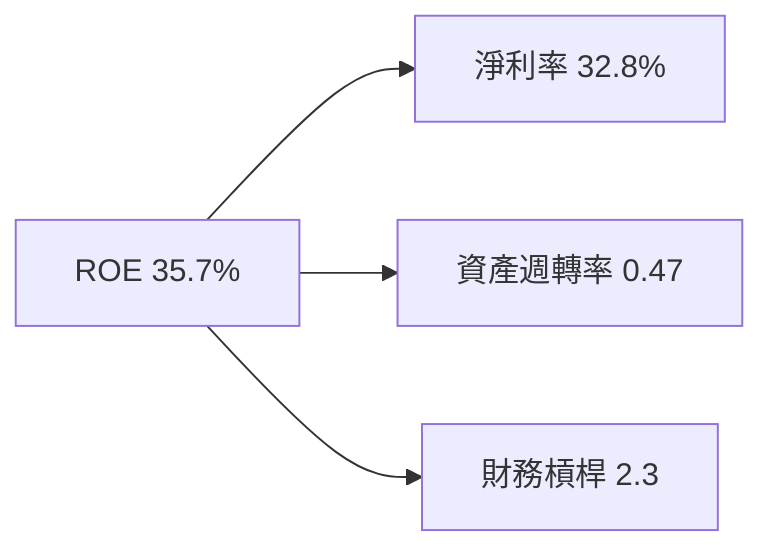

### 6.4 獲利能力儀表板

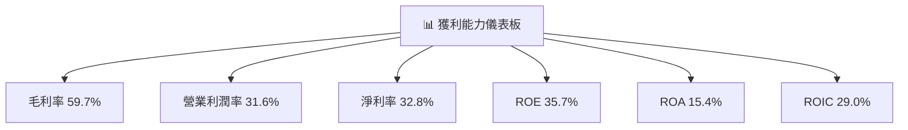

---

## 7. 估值深度分析

### 7.1 同業估值比較表格

| 估值指標 | **GOOG** | **Amazon (AMZN)** | **Microsoft (MSFT)** | **Apple (AAPL)** | GOOG 評估 |
|----------|----------|------------------|------------------|------------------|-----------|
| **Trailing P/E** | 29.1x | 67.8x | 34.4x | 28.5x | 🟢 合理 |
| **Forward P/E** | **23.5x** | 58.2x | 30.9x | 25.3x | 🟢 優勢 |
| **P/S Ratio** | 9.5x | 4.2x | 11.7x | 7.5x | 🟡 中性 |

### 7.2 歷史估值區間分析

```
╔══════════════════════════════════════════════════════════════╗
║                    歷史 P/E 區間分析                        ║
╠══════════════════════════════════════════════════════════════╣
║ 當前 P/E：29.1x                                             ║
║ 歷史高位：35.0x                                             ║
║ 歷史低位：20.0x                                             ║
║ 當前位置：▓▓▓▓▓▓▓▓▓▓▓▓▓▓▓▓▓░░░░░░░░░░░░                      ║
╚══════════════════════════════════════════════════════════════╝
```

### 7.3 DCF 敏感性分析（6格目標價矩陣）

| 情境 | **WACC = 6%** | **WACC = 7%（基準）** | **WACC = 8%** |
|------|--------------|----------------------|--------------|
| 🟢 **樂觀** | **$450** (+43%) | **$405** (+28%) | **$375** (+19%) |
| 🟡 **基準** | **$405** (+28%) | **$359** (+14%) | **$330** (+5%) |
| 🔴 **悲觀** | **$330** (+5%) | **$290** (-8%) | **$260** (-17%) |

### 7.4 估值綜合區間

```
╔══════════════════════════════════════════════════════════════╗
║                    估值區間綜合分析                          ║
╠══════════════════════════════════════════════════════════════╣
║ 當前股價：$315.19                                            ║
║ 樂觀估值區間：$450                                           ║
║ 基準估值區間：$359                                           ║
║ 悲觀估值區間：$290                                           ║
║ 當前股價位置：▓▓▓▓▓▓▓▓▓▓▓▓▓▓▓▓▓░░░░░░░                       ║
╚══════════════════════════════════════════════════════════════╝
```

---

## 8. 成長催化劑

### 8.1 催化劑時間軸

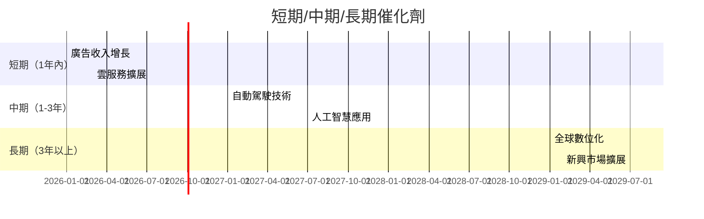

### 8.2 TAM 市場規模分析

```
╔══════════════════════════════════════════════════════════════╗
║                     TAM 市場規模分析                        ║
╠══════════════════════════════════════════════════════════════╣
║ 廣告市場：$1.5T                                             ║
║ 雲服務市場：$1T                                             ║
║ 人工智慧市場：$500B                                         ║
║ 自動化市場：$300B                                           ║
╚══════════════════════════════════════════════════════════════╝
```

### 8.3 成長驅動力結構圖

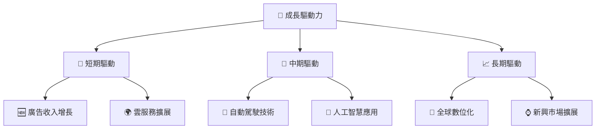

---

## 9. 風險矩陣

### 9.1 風險評分矩陣

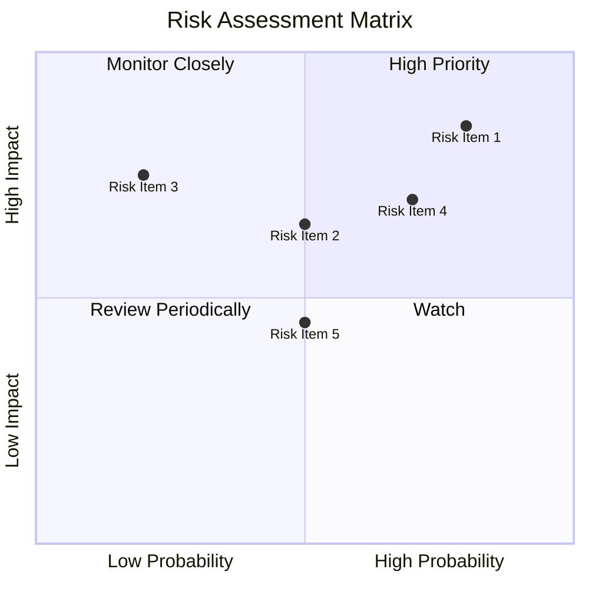

### 9.2 風險清單詳細分析

| # | 風險項目 | 發生機率 | 財務衝擊 | 風險評分 | 緩解措施 |
|---|----------|----------|----------|----------|----------|
| 1 | 🔴 **監管風險** | 高 (80%) | 高 (-15%收入) | 🔴 8.5/10 | 加強合規措施，積極參與政策制定 |
| 2 | 🟡 **市場競爭** | 中 (50%) | 中 (-10%收入) | 🟡 6.5/10 | 加大技術投入，保持產品領先 |
| 3 | 🟡 **經濟下行風險** | 中 (50%) | 中 (-8%收入) | 🟡 5.5/10 | 擴展多元化業務，降低依賴性 |

---

## 10. 投資建議

### 10.1 最終綜合評級雷達圖

```
╔══════════════════════════════════════════════════════════════╗
║                  最終綜合評級雷達圖                          ║
╠══════════════════════════════════════════════════════════════╣
║ 基本面強度  9.0/10  ▓▓▓▓▓▓▓▓▓▓▓▓▓▓▓▓▓▓▓░░                    ║
║ 成長動能    9.0/10  ▓▓▓▓▓▓▓▓▓▓▓▓▓▓▓▓▓▓▓░░                    ║
║ 獲利品質   10.0/10  ▓▓▓▓▓▓▓▓▓▓▓▓▓▓▓▓▓▓▓▓▓                    ║
║ 財務健康    8.0/10  ▓▓▓▓▓▓▓▓▓▓▓▓▓▓▓▓▓▓░░░                    ║
║ 估值合理性  9.0/10  ▓▓▓▓▓▓▓▓▓▓▓▓▓▓▓▓▓▓▓░░                    ║
║ 護城河深度  9.5/10  ▓▓▓▓▓▓▓▓▓▓▓▓▓▓▓▓▓▓▓▓░                    ║
║ 管理層執行  9.0/10  ▓▓▓▓▓▓▓▓▓▓▓▓▓▓▓▓▓▓▓░░                    ║
║ 技術創新力  9.5/10  ▓▓▓▓▓▓▓▓▓▓▓▓▓▓▓▓▓▓▓▓░                    ║
╚══════════════════════════════════════════════════════════════╝
```

### 10.2 目標價與隱含報酬率

| 情境 | 目標價 | 隱含報酬率 | 機率權重 |
|------|--------|------------|----------|
| 🟢 樂觀 | $405 | +28% | 30% |
| 🟡 基準 | $359 | +14% | 50% |
| 🔴 悲觀 | $290 | -8% | 20% |

### 10.3 買入時機與觸發因素

```
╔══════════════════════════════════════════════════════════════╗
║                  ✅ 買入觸發因素 Checklist                  ║
╠══════════════════════════════════════════════════════════════╣
║                                                              ║
║  立即買入觸發條件（多數符合）：                              ║
║  ✅ 廣告市場份額穩步增長                                      ║
║  ✅ 雲服務增速持續超過行業均值                                ║
║  ✅ 新產品成功上市，市場反響良好                              ║
║                                                              ║
║  加碼觸發條件（出現以下任一）：                              ║
║  ☐ 收入增長超過20%                                           ║
║  ☐ 自由現金流大幅增加                                        ║
║                                                              ║
║  減碼/停損觸發條件（出現以下任一）：                         ║
║  ☐ 監管風險顯著升高                                          ║
║  ☐ 廣告收入出現顯著下滑                                      ║
╚══════════════════════════════════════════════════════════════╝
```

### 10.4 投資人適配度分析

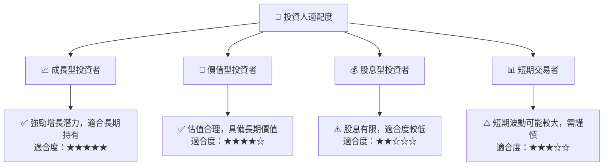

### 10.5 關鍵監控指標

| 監控類型 | 指標 | 關注點 | 頻率 |
|----------|------|--------|------|
| 財務表現 | 營收增長率 | 是否符合預期 | 季度 |
| 市場動態 | 廣告市場份額 | 是否保持領先 | 半年 |
| 技術發展 | AI 進展 | 新產品推出情況 | 年度 |

---

> **免責聲明**：本報告為 AI 自動生成，僅供研究參考，不構成投資建議。投資有風險，入市需謹慎。