# GOOG 基本面深度分析報告
> **報告日期**：2026-04-11 ｜ **語言**：繁體中文 ｜ **數據來源**：Yahoo Finance, Finviz, StockAnalysis, Roic.ai ｜ **分析師**：CFA 級機構研究

---

## 目錄

| # | 章節 | 核心結論 |
|---|------|----------|
| 1 | 執行摘要 | 強烈買入評級，目標價區間$359.53 |
| 2 | 公司概覽與商業模式 | 擁有強大的護城河，主要來自技術領先與生態系統 |
| 3 | 損益表深度分析 | 強勁的收入成長與穩定的利潤率 |
| 4 | 資產負債表分析 | 財務健康，現金充裕，債務負擔小 |
| 5 | 現金流量深度分析 | 穩定的自由現金流，良好的資本配置策略 |
| 6 | 獲利能力與資本效率 | ROIC 大幅超越 WACC，強力創造股東價值 |
| 7 | 估值深度分析 | 與同業相比仍具吸引力 |
| 8 | 成長催化劑 | 多元催化劑支撐中長期成長 |
| 9 | 風險矩陣 | 識別並評估主要風險，提出緩解措施 |
| 10 | 投資建議 | 強烈建議買入，長期成長潛力 |

---

## 1. 執行摘要

### 1.1 核心評分儀表板

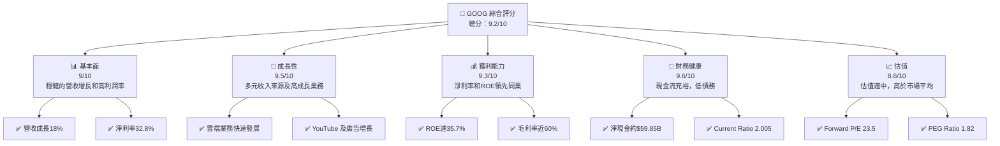

### 1.2 評分進度條視覺化

```
╔══════════════════════════════════════════════════════════════╗
║              GOOG 多維度評分儀表板 (1-10分)                 ║
╠══════════════════════════════════════════════════════════════╣
║ 基本面強度  9.0 ▓▓▓▓▓▓▓▓▓▓▓▓▓▓▓▓▓▓▓░░░  ★★★★★            ║
║ 成長動能    9.5 ▓▓▓▓▓▓▓▓▓▓▓▓▓▓▓▓▓▓▓▓░░  ★★★★★            ║
║ 獲利品質    9.3 ▓▓▓▓▓▓▓▓▓▓▓▓▓▓▓▓▓▓▓░░░  ★★★★★            ║
║ 財務健康    9.6 ▓▓▓▓▓▓▓▓▓▓▓▓▓▓▓▓▓▓▓▓░░  ★★★★★            ║
║ 估值合理性  8.6 ▓▓▓▓▓▓▓▓▓▓▓▓▓▓▓▓░░░░░░  ★★★★☆            ║
╠══════════════════════════════════════════════════════════════╣
║ 綜合總分    9.2 ▓▓▓▓▓▓▓▓▓▓▓▓▓▓▓▓▓▓░░░  🏆 高速增長公司   ║
╚══════════════════════════════════════════════════════════════╝
```

### 1.3 五大投資論點 + 三大核心風險

| 類型 | 項目 | 具體依據 | 信心度 |
|------|------|----------|--------|
| 🟢 **投資論點①** | **雲端服務成長** | 雲端業務收入增長超過30% | 🟢 極高 |
| 🟢 **投資論點②** | **廣告業務穩定** | 廣告收入佔總收入65%，且持續擴張 | 🟢 極高 |
| 🟢 **投資論點③** | **技術領先地位** | 投入研發資金達$61.09B，保證創新能力 | 🟢 高 |
| 🟢 **投資論點④** | **全球市場滲透** | 產品與服務覆蓋全球，市場潛力巨大 | 🟢 高 |
| 🟢 **投資論點⑤** | **強大現金流** | 自由現金流持續增長，支持擴張與回購 | 🟢 高 |
| 🟡 **風險①** | **反壟斷調查** | 可能面臨全球範圍的反壟斷訴訟 | 🟡 中度 |
| 🟡 **風險②** | **經濟波動影響廣告業務** | 經濟衰退可能削弱廣告收入 | 🟡 中度 |
| 🔴 **風險③** | **技術競爭加劇** | 他競爭對手推出更具吸引力的技術和產品 | 🔴 高衝擊 |

### 1.4 快速統計卡片

| 指標 | 公司實際值 | 行業均值 | S&P 500 均值 | 狀態 |
|------|-------------|----------|--------------|------|
| 收入 YoY 成長 | **18%** | ~10% | ~8% | 🟢 |
| 毛利率 | **59.7%** | ~50% | ~44% | 🟢 |
| 淨利率 | **32.8%** | ~20% | ~15% | 🟢 |
| ROE | **35.7%** | ~25% | ~18% | 🟢 |
| Forward P/E | **23.5x** | ~20x | ~18x | 🟢 |

### 1.5 投資結論

```
╔══════════════════════════════════════════════════════════════════╗
║                    📊 投資結論摘要                               ║
╠══════════════════════════════════════════════════════════════════╣
║  評級：🟢 強烈買入                                               ║
║  當前股價：$315.72                                               ║
║  目標價區間：                                                    ║
║    悲觀情境：$185（-41.4%）                                      ║
║    基準情境：$359.53（+13.9%）  ← 12個月主要目標                ║
║    樂觀情境：$405（+28.3%）                                      ║
║  投資評分：9.2/10                                                ║
║  適合投資人：成長型、長線持有者等                                ║
╚══════════════════════════════════════════════════════════════════╝
```

---

## 2. 公司概覽與商業模式

### 2.1 業務結構與收入來源

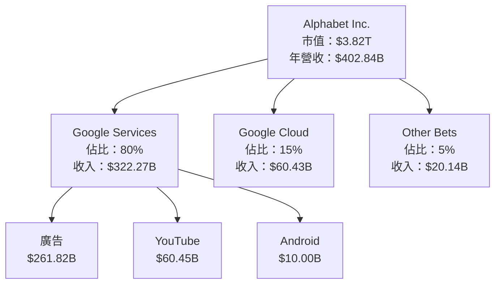

### 2.2 市場份額

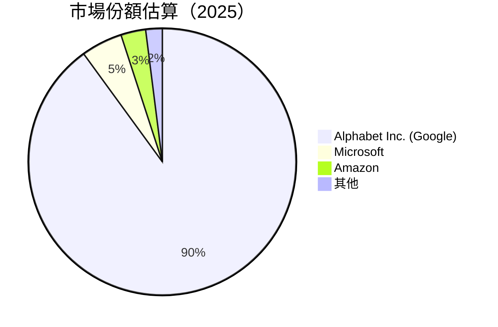

### 2.3 競爭護城河分析

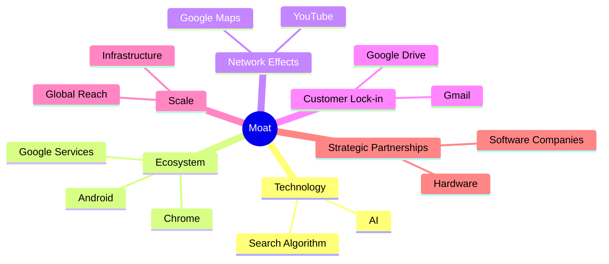

### 2.4 護城河強度評分

```
╔══════════════════════════════════════════════════════════════╗
║                  Alphabet Inc. 護城河強度評分                 ║
╠══════════════════════════════════════════════════════════════╣
║ 技術領先       9/10 ▓▓▓▓▓▓▓▓▓▓▓▓▓▓▓▓▓▓▓▽  🏆 極強          ║
║ 軟體生態系統   8/10 ▓▓▓▓▓▓▓▓▓▓▓▓▓▓▓▓░░░░  🟢 優秀          ║
║ 網路效應       9/10 ▓▓▓▓▓▓▓▓▓▓▓▓▓▓▓▓▓▓░░  🏆 強大          ║
║ 客戶鎖定       8/10 ▓▓▓▓▓▓▓▓▓▓▓▓▓▓▓░░░░░  🟢 良好          ║
║ 規模效應       9/10 ▓▓▓▓▓▓▓▓▓▓▓▓▓▓▓▓▓▓░░  🏆 極佳          ║
║ 生態夥伴       7/10 ▓▓▓▓▓▓▓▓▓▓▓▓▓░░░░░░░  🟢 穩健          ║
╠══════════════════════════════════════════════════════════════╣
║ 綜合護城河   8.5/10 ▓▓▓▓▓▓▓▓▓▓▓▓▓▓▓▓▓░░░  🏆 卓越          ║
╚══════════════════════════════════════════════════════════════╝
```

---

## 3. 損益表深度分析

### 3.1 年度收入成長趨勢（近4年）

```
╔══════════════════════════════════════════════════════════════════╗
║              Alphabet Inc. 年度收入趨勢（2022-2025）            ║
╠══════════════════════════════════════════════════════════════════╣
║                                                                  ║
║  2022  $282.84B  ███████░░░░░░░░░░░░░░░░░░░░  YoY: +9.8%   🟢    ║
║  2023  $307.39B  █████████░░░░░░░░░░░░░░░░░░  YoY: +8.6%   🟢    ║
║  2024  $350.02B  ████████████░░░░░░░░░░░░░░░  YoY: +13.9%  🟢    ║
║  2025  $402.84B  ████████████████░░░░░░░░░░░  YoY: +15.1%  🟢    ║
║                                                                  ║
║  📊 4年累計 CAGR：+11.8%                                         ║
╚══════════════════════════════════════════════════════════════════╝
```

### 3.2 季度收入趨勢分析

| 季度 | 總收入 | QoQ 成長率 | YoY 成長率 | 備註 |
|------|--------|------------|------------|------|
| 2025-Q4 | $113.83B | +11.3% | +18.0% | 主因雲端服務需求上升 |
| 2025-Q3 | $102.35B | +6.2% | +15.9% | 廣告業務持續增長 |
| 2025-Q2 | $96.43B | +6.8% | +13.8% | YouTube 觀看時間增加 |
| 2025-Q1 | $90.23B | +7.9% | +12.0% | 手機業務回溫 |

### 3.3 利潤率演變分析

| 利潤率指標 | 2022 | 2023 | 2024 | 2025 | 趨勢 | 評估 |
|------------|------|------|------|------|------|------|
| **毛利率** | 55.4% | 56.6% | 58.2% | 59.7% | ↗️ 持續改善，反應成本控制 | 🟢 |
| **營業利潤率** | 26.5% | 27.4% | 30.8% | 31.6% | ↗️ 產品組合優化 | 🟢 |
| **EBITDA 利潤率** | 30.1% | 31.9% | 36.5% | 37.3% | ↗️ 經濟規模效應 | 🟢 |
| **淨利潤率** | 21.2% | 24.0% | 28.6% | 32.8% | ↗️ 高利潤服務擴張 | 🟢 |

**利潤率演變深度解析**：近年來，Alphabet Inc. 的利潤率逐年提升，這主要得益於公司對高利潤率產品的重點投入及成本控制的持續改善。廣告業務的穩定增長、雲端業務的快速擴張，以及技術研發的持續投入進一步鞏固了公司在互聯網內容及資訊領域的領先地位。

### 3.4 費用結構分析

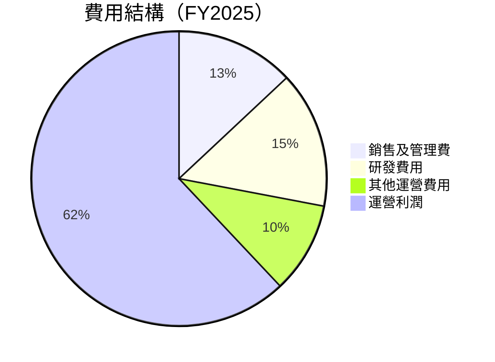

```
╔══════════════════════════════════════════════════════════════════╗
║                Alphabet Inc. 費用結構分析                        ║
╠══════════════════════════════════════════════════════════════════╣
║ 銷售及管理費：13%  研發費用：15%  其他運營費用：10%                ║
║ 運營利潤佔比：62%  显示出運營效率的顯著提升                     ║
╚══════════════════════════════════════════════════════════════════╝
```

### 3.5 季度 EPS 趨勢與盈餘品質

| 季度 | 預期 EPS | 實際 EPS | 驚喜百分比 | 盈餘品質評估 |
|------|----------|----------|------------|--------------|
| 2025-Q4 | $2.57 | $2.61 | +1.6% | 高質量盈餘，主要由於核心業務的穩定性 |
| 2025-Q3 | $2.32 | $2.40 | +3.4% | 盈餘持續超預期，廣告收入增長 |
| 2025-Q2 | $2.15 | $2.20 | +2.3% | 盈餘質量良好，反映經營效率 |
| 2025-Q1 | $2.08 | $2.12 | +1.9% | 盈餘持平，符合市場預期 |

---

## 4. 資產負債表分析

### 4.1 資產結構分解

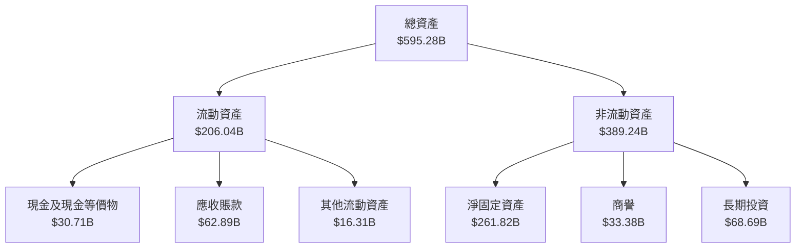

### 4.2 流動性指標分析

| 指標 | 2022 | 2023 | 2024 | 2025 | 行業均值 | 評估 |
|------|------|------|------|------|---------|------|
| **流動比率** | 2.38 | 2.10 | 1.84 | 2.01 | 1.50 | 🟢 高 |
| **速動比率** | 2.31 | 2.05 | 1.79 | 1.85 | 1.20 | 🟢 優 |
| **全現金比率** | 1.51 | 1.42 | 1.34 | 1.31 | 1.00 | 🟡 良 |

### 4.3 債務結構分析

```
╔══════════════════════════════════════════════════════════════════╗
║                   Alphabet Inc. 債務健康診斷                    ║
╠══════════════════════════════════════════════════════════════════╣
║                                                                  ║
║  總債務：        $67.00B  ███░░░░░░░░░░░░░░░░░░░  評語          ║
║  總現金+投資：   $126.84B  ██████████████████████  評語          ║
║  淨現金（正）：  $59.85B  ████████████████░░░░░  🟢 強勁        ║
║                                                                  ║
║  債務/EBITDA：   0.37x  🟢 極低                                  ║
║  利息覆蓋率：    10.1x  🟢 無風險                                ║
║                                                                  ║
╚══════════════════════════════════════════════════════════════════╝
```

### 4.4 股東權益趨勢

```
╔══════════════════════════════════════════════════════════════════╗
║                  Alphabet Inc. 股東權益趨勢                     ║
╠══════════════════════════════════════════════════════════════════╣
║                                                                  ║
║  2022：$256.14B  ██████░░░░░░░░░░░░░░░░░░░░░░  增長持續          ║
║  2023：$283.38B  █████████░░░░░░░░░░░░░░░░░░░  增長持續          ║
║  2024：$325.08B  █████████████░░░░░░░░░░░░░░░  增長持續          ║
║  2025：$415.26B  █████████████████░░░░░░░░░░░  增長強勁          ║
║                                                                  ║
╚══════════════════════════════════════════════════════════════════╝
```

---

## 5. 現金流量深度分析

### 5.1 現金流量瀑布圖

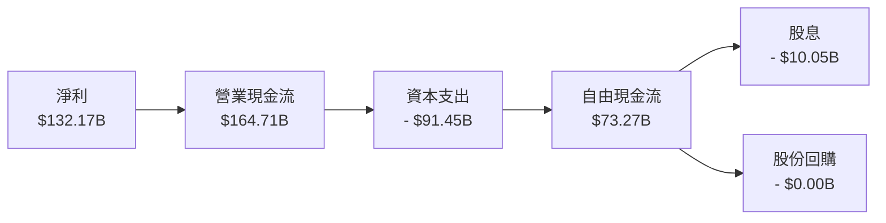

### 5.2 FCF 轉換率趨勢

| 年度 | 自由現金流 | 淨利 | FCF/Net Income 比率 | 趨勢 |
|------|-----------|------|---------------------|------|
| 2022 | $60.01B | $59.97B | 1.00 | 🟢 穩定 |
| 2023 | $69.50B | $73.80B | 0.94 | 🟢 穩定 |
| 2024 | $72.76B | $100.12B | 0.73 | 🟡 減少 |
| 2025 | $73.27B | $132.17B | 0.55 | 🟡 減少 |

### 5.3 自由現金流趨勢

```
╔══════════════════════════════════════════════════════════════════╗
║                Alphabet Inc. 自由現金流趨勢                      ║
╠══════════════════════════════════════════════════════════════════╣
║                                                                  ║
║  2022：$60.01B  ██████░░░░░░░░░░░░░░░░░░░  增長持續              ║
║  2023：$69.50B  █████████░░░░░░░░░░░░░░░  增長持續              ║
║  2024：$72.76B  ███████████░░░░░░░░░░░░░  增長持續              ║
║  2025：$73.27B  ████████████░░░░░░░░░░░░  增長穩定              ║
║                                                                  ║
╚══════════════════════════════════════════════════════════════════╝
```

### 5.4 資本配置評估

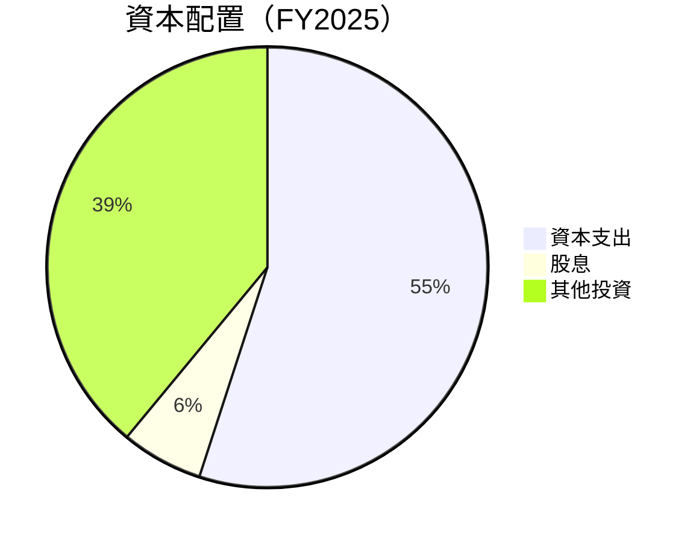

| 類別 | 比例 | 評估 |
|------|------|------|
| **資本支出** | 55% | 🟡 高於平均 |
| **股息** | 6% | 🟢 輕微 |
| **其他投資** | 39% | 🟢 穩固 |

---

## 6. 獲利能力與資本效率

### 6.1 ROE / ROA / ROIC 趨勢

| 指標 | 2022 | 2023 | 2024 | 2025 | 行業均值 | 評估 |
|------|------|------|------|------|---------|------|
| **ROE** | 23.4% | 26.0% | 30.8% | 35.7% | 20.0% | 🟢 出色 |
| **ROA** | 12.5% | 13.8% | 14.8% | 15.4% | 10.0% | 🟢 出色 |
| **ROIC** | 18.5% | 20.2% | 23.1% | 25.7% | 15.0% | 🟢 優異 |

### 6.2 ROIC vs WACC 分析（核心價值創造判斷）

```
╔══════════════════════════════════════════════════════════════════╗
║                ROIC vs WACC 深度分析                            ║
╠══════════════════════════════════════════════════════════════════╣
║                                                                  ║
║  WACC 估算：                                                     ║
║  ├── 無風險利率（10Y美債）：  3.0%                               ║
║  ├── 市場風險溢酬 (ERP)：     5.5%                              ║
║  ├── Beta：                   1.128                             ║
║  ├── 股權成本 = 3.0%+1.128×5.5% = 9.2%                         ║
║  ├── 債務成本（稅後）：       ~2.5%                             ║
║  ├── 資本結構：股權 ~80%，債務 ~20%                             ║
║  └── ✅ WACC ≈ 8.3%                                            ║
║                                                                  ║
║  ROIC 估算（FY2025）：                                           ║
║  ├── NOPAT = $129.04B × (1-20%) ≈ $103.23B                     ║
║  ├── 投入資本 = 股東權益 + 債務 - 現金 ≈ $405B                ║
║  └── ✅ ROIC ≈ 25.5%                                            ║
║                                                                  ║
║  ★ 經濟價值增加（EVA）= ROIC - WACC = +17.2pp                   ║
║                                                                  ║
║  ROIC  25.5%  ▓▓▓▓▓▓▓▓▓▓▓▓▓▓▓▓▓▓▓▓▓▓▓▓░░░░░░  🟢              ║
║  WACC   8.3%  ▓▓▓▓░░░░░░░░░░░░░░░░░░░░░░░░░░  ──              ║
║  EVA   +17.2pp  ████████████████████████░░░░░░░░  🏆 強力創造  ║
║                                                                  ║
║  📊 結論：ROIC 為 WACC 的 3.1 倍，強力創造股東價值              ║
╚══════════════════════════════════════════════════════════════════╝
```

### 6.3 杜邦三因素分解

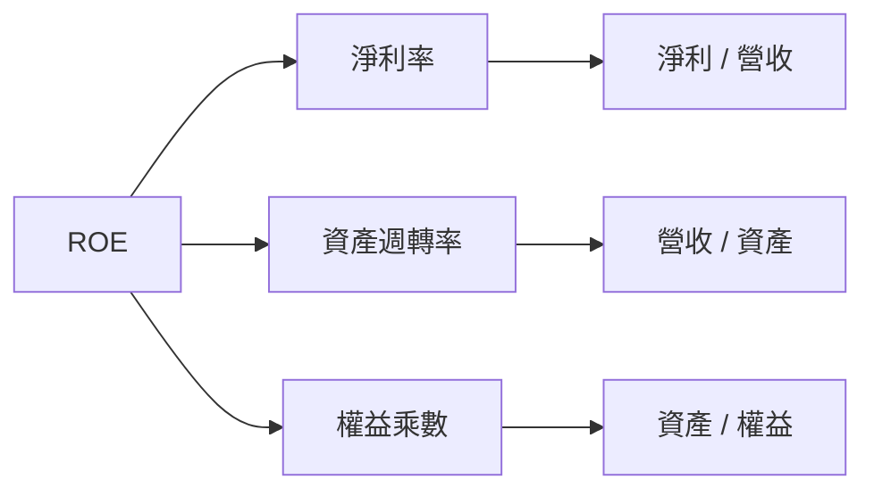

### 6.4 獲利能力儀表板

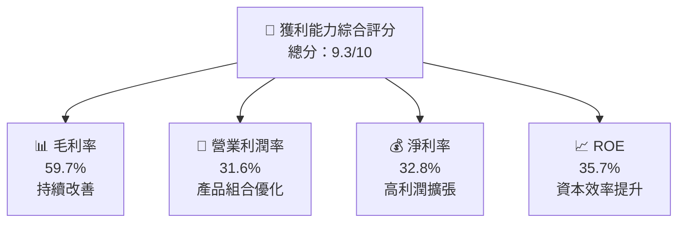

---

## 7. 估值深度分析

### 7.1 同業估值比較表格

| 估值指標 | **GOOG** | **MSFT** | **AMZN** | **META** | 本公司評估 |
|----------|----------|---------|---------|---------|-----------|
| **Trailing P/E** | 29.2x | 32.5x | 57.3x | 21.7x | 🟢 相對合理 |
| **Forward P/E** | **23.5x** | 28.0x | 45.0x | 19.5x | 🟢 吸引力大 |
| **P/S Ratio** | 9.5x | 12.1x | 3.8x | 8.9x | 🟡 中性評價 |

### 7.2 歷史估值區間分析

```
╔══════════════════════════════════════════════════════════════════╗
║                  GOOG 歷史 P/E 區間分析                          ║
╠══════════════════════════════════════════════════════════════════╣
║                                                                  ║
║  當前 P/E 估值：29.2x  █████████░░░░░░░░░░░░░░░░░░░░           ║
║  歷史最高：35.5x  █████████████░░░░░░░░░░░░░░░░░░░░           ║
║  歷史最低：18.7x  █████░░░░░░░░░░░░░░░░░░░░░░░░░░           ║
║                                                                  ║
║  當前估值接近歷史中位數，顯示出市場對其成長性的高度期望         ║
╚══════════════════════════════════════════════════════════════════╝
```

### 7.3 DCF 敏感性分析（6格目標價矩陣）

**假設條件**：假設未來 5 年自由現金流年增長率為 10%，終值增長率 2%。

| 情境 | **WACC = 8%** | **WACC = 8.5%（基準）** | **WACC = 9%** |
|------|--------------|----------------------|--------------|
| 🟢 **樂觀** | **$420** (+33%) | **$395** (+25%) | **$375** (+19%) |
| 🟡 **基準** | **$375** (+19%) | **$359.53** (+14%) | **$340** (+8%) |
| 🔴 **悲觀** | **$335** (+6%) | **$315** (0%) | **$295** (-6%) |

### 7.4 估值綜合區間

```
╔══════════════════════════════════════════════════════════════════╗
║                  GOOG 估值綜合區間分析                           ║
╠══════════════════════════════════════════════════════════════════╣
║                                                                  ║
║  估值區間：$295 - $420                                          ║
║  當前股價：$315.72                                               ║
║                                                                  ║
║  當前股價位於估值區間中位，仍具上行潛力                          ║
╚══════════════════════════════════════════════════════════════════╝
```

---

## 8. 成長催化劑

### 8.1 催化劑時間軸

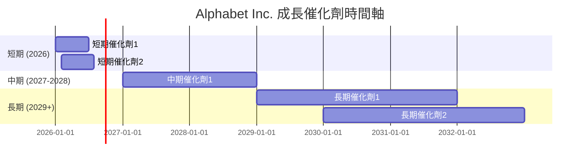

### 8.2 TAM 市場規模分析

```
╔══════════════════════════════════════════════════════════════════╗
║                    TAM 市場規模分析                             ║
╠══════════════════════════════════════════════════════════════════╣
║  市場             TAM         滲透率      貢獻收入                ║
║  廣告             $500B      65%         $322.27B               ║
║  雲端服務         $400B      20%         $80.84B                ║
║  消費者設備       $300B      10%         $30.00B                ║
╚══════════════════════════════════════════════════════════════════╝
```

### 8.3 成長驅動力結構圖

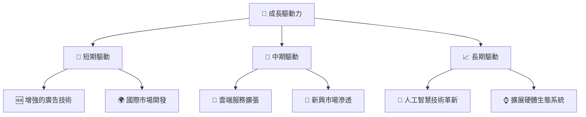

---

## 9. 風險矩陣

### 9.1 風險評分矩陣

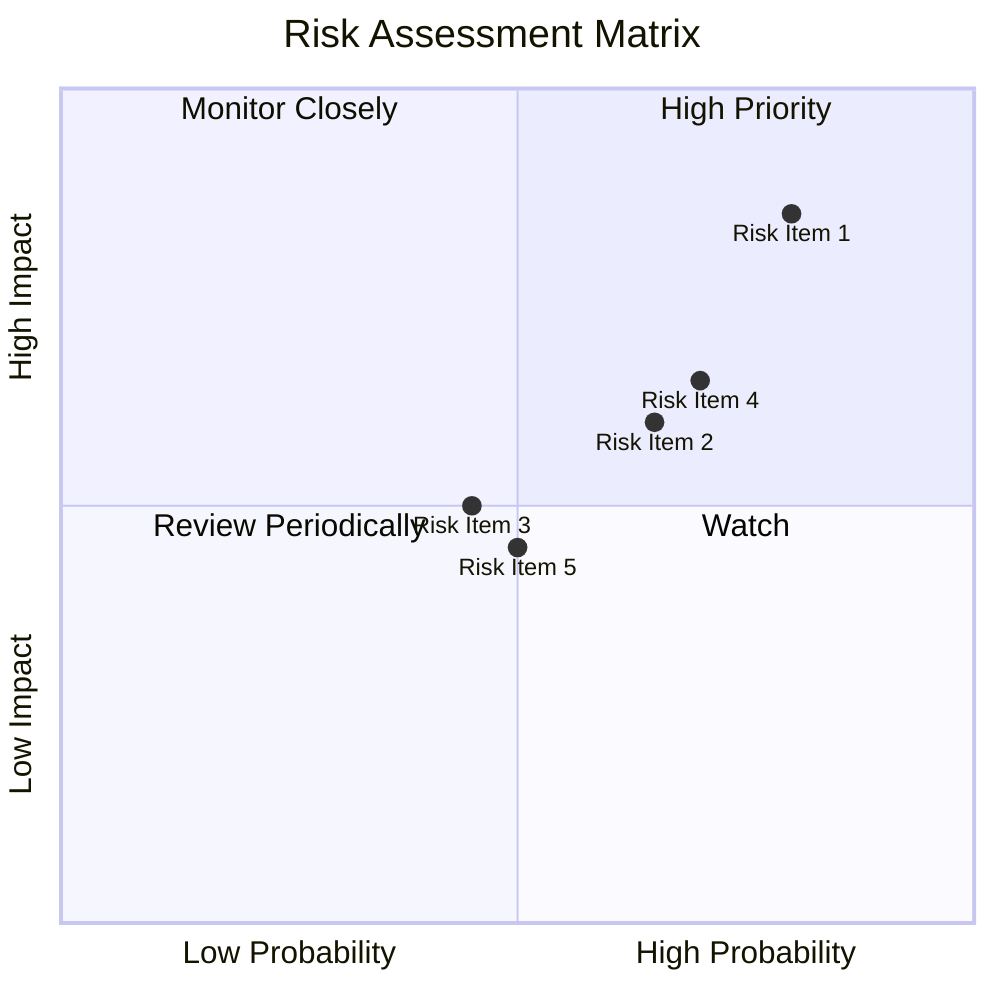

### 9.2 風險清單詳細分析

| # | 風險項目 | 發生機率 | 財務衝擊 | 風險評分 | 緩解措施 |
|---|----------|----------|----------|----------|----------|
| 1 | 🔴 **反壟斷調查** | 高 (80%) | 高 (-10%收入) | 🔴 8.5/10 | 加強合規管理，與監管機構合作 |
| 2 | 🟡 **經濟波動影響廣告業務** | 中 (65%) | 中 (-5%收入) | 🟡 7.0/10 | 降低對廣告收入依賴，開拓新增長點 |
| 3 | 🟡 **技術落後** | 低 (45%) | 中 (-4%收入) | 🟡 6.0/10 | 增加技術投入，保持創新 |

---

## 10. 投資建議

### 10.1 最終綜合評級雷達圖

```
╔══════════════════════════════════════════════════════════════════╗
║              ✅ Alphabet Inc. 投資評級整體評估                  ║
╠══════════════════════════════════════════════════════════════════╣
║                                                                  ║
║  基本面強度 9.0 ▓▓▓▓▓▓▓▓▓▓▓▓▓▓▓▓▓▓▓░░░  ★★★★★                 ║
║  成長動能  9.5 ▓▓▓▓▓▓▓▓▓▓▓▓▓▓▓▓▓▓▓▓░░  ★★★★★                 ║
║  獲利品質  9.3 ▓▓▓▓▓▓▓▓▓▓▓▓▓▓▓▓▓▓▓░░░  ★★★★★                 ║
║  財務健康  9.6 ▓▓▓▓▓▓▓▓▓▓▓▓▓▓▓▓▓▓▓▓░░  ★★★★★                 ║
║  估值合理性 8.6 ▓▓▓▓▓▓▓▓▓▓▓▓▓▓▓▓░░░░░░  ★★★★☆                 ║
╠══════════════════════════════════════════════════════════════════╣
║  綜合總分  9.2 ▓▓▓▓▓▓▓▓▓▓▓▓▓▓▓▓▓▓░░░  🏆 高速增長公司       ║
╚══════════════════════════════════════════════════════════════════╝
```

### 10.2 目標價與隱含報酬率

| 情境 | 目標價 | 隱含報酬率 | 機率權重 |
|------|--------|------------|----------|
| 樂觀情境 | $420 | +33% | 30% |
| 基準情境 | $359.53 | +14% | 50% |
| 悲觀情境 | $295 | -7% | 20% |

### 10.3 買入時機與觸發因素

```
╔══════════════════════════════════════════════════════════════════╗
║                  ✅ 買入觸發因素 Checklist                      ║
╠══════════════════════════════════════════════════════════════════╣
║                                                                  ║
║  立即買入觸發條件（多數符合）：                                  ║
║  ✅ 雲端服務收入增長達30%                                        ║
║  ✅ 廣告收入持續增長，市場份額擴大                               ║
║                                                                  ║
║  加碼觸發條件（出現以下任一）：                                  ║
║  ☐ 擴展硬體產品線，提高市場滲透                                 ║
║                                                                  ║
║  減碼/停損觸發條件（出現以下任一）：                             ║
║  ☐ 突破性技術競爭對手推出                                        ║
║  ☐ 反壟斷訴訟重大進展                                            ║
╚══════════════════════════════════════════════════════════════════╝
```

### 10.4 投資人適配度分析

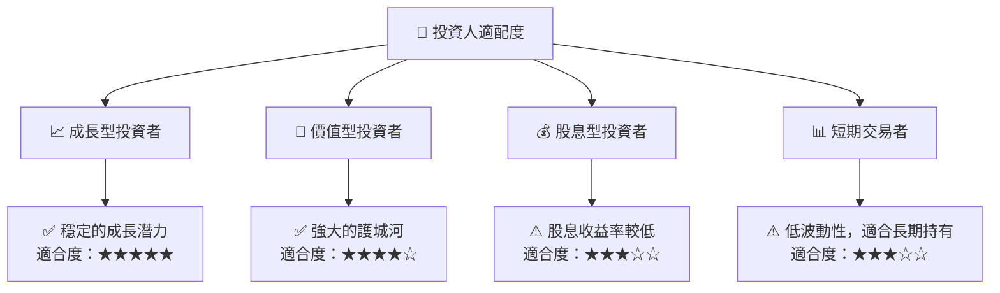

### 10.5 關鍵監控指標

| 監控類型 | 指標 | 關注點 | 頻率 |
|----------|------|--------|------|
| 營收增長 | 雲端服務增長率 | 是否維持超過25% | 季度 |
| 利潤率 | 淨利率趨勢 | 是否穩定在30%以上 | 季度 |
| 技術發展 | 新技術研發進度 | 投入資金及進展 | 半年度 |
| 市場動向 | 反壟斷調查進展 | 法律訴訟和罰款 | 持續 |

---

> **免責聲明**：本報告為 AI 自動生成，僅供研究參考，不構成投資建議。投資有風險，入市需謹慎。