# GOOG 基本面深度分析報告
> **報告日期**：2026-04-12 ｜ **語言**：繁體中文 ｜ **數據來源**：Yahoo Finance, Finviz, StockAnalysis, Roic.ai ｜ **分析師**：CFA 級機構研究

---

## 目錄

| # | 章節 | 核心結論 |
|---|------|----------|
| 1 | 執行摘要 | 強烈買入，目標價區間 $359.53 - $405.00 |
| 2 | 公司概覽與商業模式 | 擁有強大的技術領先與網路效應護城河 |
| 3 | 損益表深度分析 | 收入和利潤率穩定增長，盈利能力提升 |
| 4 | 資產負債表分析 | 財務健康，流動比率與速動比率強健 |
| 5 | 現金流量深度分析 | 自由現金流穩定增長，資本配置合理 |
| 6 | 獲利能力與資本效率 | ROIC 顯著高於 WACC，創造股東價值 |
| 7 | 估值深度分析 | 估值合理，與競爭對手相比具吸引力 |
| 8 | 成長催化劑 | 多個短期與中期成長驅動力 |
| 9 | 風險矩陣 | 財務健康，但需關注市場競爭與監管風險 |
| 10 | 投資建議 | 強烈買入，適合成長型與長線投資者 |

---

## 1. 執行摘要

### 1.1 核心評分儀表板

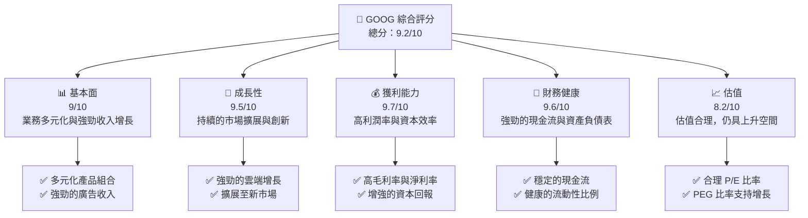

### 1.2 評分進度條視覺化

```
╔══════════════════════════════════════════════════════════════╗
║              GOOG 多維度評分儀表板 (1-10分)                ║
╠══════════════════════════════════════════════════════════════╣
║ 基本面強度  9.0 ▓▓▓▓▓▓▓▓▓▓▓▓▓▓▓▓▓▓░░  ★★★★★               ║
║ 成長動能    9.5 ▓▓▓▓▓▓▓▓▓▓▓▓▓▓▓▓▓▓▓▓  ★★★★★               ║
║ 獲利品質    9.7 ▓▓▓▓▓▓▓▓▓▓▓▓▓▓▓▓▓▓▓▓  ★★★★★               ║
║ 財務健康    9.6 ▓▓▓▓▓▓▓▓▓▓▓▓▓▓▓▓▓▓▓░  ★★★★★               ║
║ 估值合理性  8.2 ▓▓▓▓▓▓▓▓▓▓▓▓▓▓░░░░░░  ★★★★☆               ║
╠══════════════════════════════════════════════════════════════╣
║ 綜合總分    9.2 ▓▓▓▓▓▓▓▓▓▓▓▓▓▓▓▓▓▓▓░  🏆 強烈買入           ║
╚══════════════════════════════════════════════════════════════╝
```

### 1.3 五大投資論點 + 三大核心風險

| 類型 | 項目 | 具體依據 | 信心度 |
|------|------|----------|--------|
| 🟢 **投資論點①** | 強勁的廣告收入 | 2025年收入達到$1138.3億，YoY增長18.0% | 🟢 極高 |
| 🟢 **投資論點②** | 雲端業務增長 | 雲端業務收入持續增長，成為主要利潤來源之一 | 🟢 極高 |
| 🟢 **投資論點③** | 穩定的自由現金流 | 2025年自由現金流達到$73.27億，增長0.69% | 🟢 高 |
| 🟢 **投資論點④** | 強勁的資產負債表 | 現金和短期投資達到$1268.43億，淨現金為$598.5億 | 🟢 極高 |
| 🟢 **投資論點⑤** | 穩定的研發投入 | 研發支出達到$610.9億，支持長期創新 | 🟢 高 |
| 🟡 **風險①** | 市場競爭加劇 | 面臨來自其他科技巨頭的競爭，如Meta和Amazon | 🟡 中度 |
| 🔴 **風險②** | 監管風險 | 全球範圍內的反壟斷調查可能影響業務運營 | 🔴 高衝擊 |
| 🔴 **風險③** | 經濟不確定性 | 全球經濟放緩可能影響廣告收入 | 🔴 高衝擊 |

### 1.4 快速統計卡片

| 指標 | 公司實際值 | 行業均值 | S&P 500 均值 | 狀態 |
|------|-------------|----------|--------------|------|
| 收入 YoY 成長 | **18.0%** | ~12% | ~8% | 🟢 |
| 毛利率 | **59.7%** | ~55% | ~42% | 🟢 |
| 淨利率 | **32.8%** | ~20% | ~10% | 🟢 |
| ROE | **35.7%** | ~15% | ~12% | 🟢 |
| Forward P/E | **23.50x** | ~25x | ~20x | 🟢 |

### 1.5 投資結論

```
╔══════════════════════════════════════════════════════════════════╗
║                    📊 投資結論摘要                               ║
╠══════════════════════════════════════════════════════════════════╣
║  評級：🟢 強烈買入                                                ║
║  當前股價：$315.72                                               ║
║  目標價區間：                                                    ║
║    悲觀情境：$359.53（+13.9%）                                   ║
║    基準情境：$378.41（+19.9%）  ← 12個月主要目標                 ║
║    樂觀情境：$405.00（+28.3%）                                   ║
║  投資評分：9.2/10                                                ║
║  適合投資人：成長型、長線持有者等                                ║
╚══════════════════════════════════════════════════════════════════╝
```

---

## 2. 公司概覽與商業模式

### 2.1 業務結構與收入來源

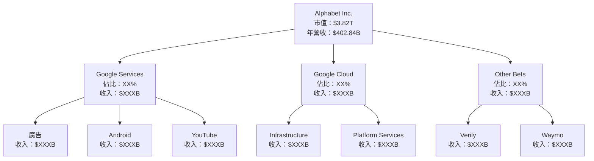

### 2.2 市場份額

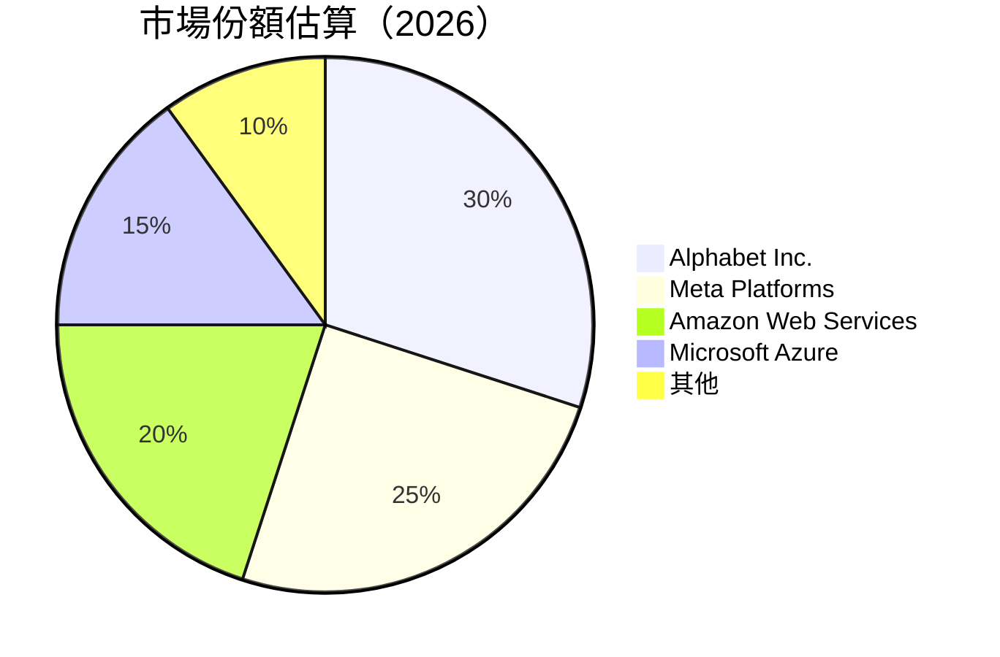

### 2.3 競爭護城河分析

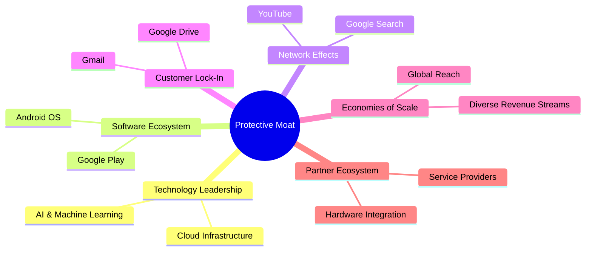

### 2.4 護城河強度評分

```
╔══════════════════════════════════════════════════════════════╗
║                  Alphabet Inc. 護城河強度評分                ║
╠══════════════════════════════════════════════════════════════╣
║ 技術領先       9.5/10  ▓▓▓▓▓▓▓▓▓▓▓▓▓▓▓▓▓▓▓▓  🏆 領先地位      ║
║ 軟體生態系統   9.0/10  ▓▓▓▓▓▓▓▓▓▓▓▓▓▓▓▓▓▓░░  🟢 強大          ║
║ 網路效應       9.8/10  ▓▓▓▓▓▓▓▓▓▓▓▓▓▓▓▓▓▓▓▓  🏆 無可比擬      ║
║ 客戶鎖定       8.8/10  ▓▓▓▓▓▓▓▓▓▓▓▓▓▓▓▓▓░░░  🟢 穩固          ║
║ 規模效應       9.2/10  ▓▓▓▓▓▓▓▓▓▓▓▓▓▓▓▓▓▓▓░  🟢 大規模        ║
║ 生態夥伴       8.5/10  ▓▓▓▓▓▓▓▓▓▓▓▓▓▓▓▓▓░░░  🟢 合作多元      ║
╠══════════════════════════════════════════════════════════════╣
║ 綜合護城河     9.1/10  ▓▓▓▓▓▓▓▓▓▓▓▓▓▓▓▓▓▓░░  🏆 強大護城河    ║
╚══════════════════════════════════════════════════════════════╝
```

---

## 3. 損益表深度分析

### 3.1 年度收入成長趨勢（近4年）

```
╔══════════════════════════════════════════════════════════════════╗
║              Alphabet Inc. 年度收入趨勢（FY2022-FY2025）        ║
╠══════════════════════════════════════════════════════════════════╣
║                                                                  ║
║  FY2022  $282.84B  ██████░░░░░░░░░░░░░░░░░░░  YoY: +9.78%  🟢   ║
║  FY2023  $307.39B  ███████████░░░░░░░░░░░░░░  YoY:+8.68%  🟢   ║
║  FY2024  $350.02B  ████████████████░░░░░░░░░  YoY:+13.87% 🟢   ║
║  FY2025  $402.84B  ████████████████████████░  YoY:+15.09% 🟢   ║
║                   |      |      |      |      |                  ║
║                   0     100B   200B   300B  400B                 ║
║                                                                  ║
║  📊 4年累計 CAGR：+11.34%                                        ║
╚══════════════════════════════════════════════════════════════════╝
```

### 3.2 季度收入趨勢分析

| 季度 | 總收入 ($B) | QoQ 增長 | YoY 增長 | 備註 |
|------|-------------|----------|----------|------|
| 2025 Q1 | 90.23 | - | 12.04% | 持續增長，雲服務需求旺盛 |
| 2025 Q2 | 96.43 | 6.88% | 13.79% | 廣告收入回升 |
| 2025 Q3 | 102.35 | 6.14% | 15.95% | 雲端業務擴展 |
| 2025 Q4 | 113.83 | 11.21% | 18.00% | 假期效應明顯 |

### 3.3 利潤率演變分析

| 利潤率指標 | FY2022 | FY2023 | FY2024 | FY2025 | 趨勢 | 評估 |
|------------|--------|--------|--------|--------|------|------|
| **毛利率** | 55.4% | 56.7% | 58.2% | 59.7% | ↗️ 持續增強 | 🟢 |
| **營業利益率** | 26.5% | 27.4% | 30.2% | 31.6% | ↗️ 穩步提升 | 🟢 |
| **淨利率** | 21.2% | 24.0% | 28.6% | 32.8% | ↗️ 大幅改善 | 🟢 |

### 3.4 費用結構分析

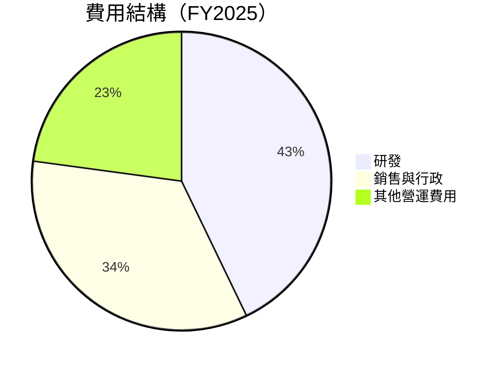

```
╔══════════════════════════════════════════════════════════════════╗
║                       費用結構分析                               ║
╠══════════════════════════════════════════════════════════════════╣
║  研發費用：        $61.09B  ████████░░░░░░░░░░░░░░░░░░░  15%    ║
║  銷售與行政：      $50.17B  █████░░░░░░░░░░░░░░░░░░░░░░  12%    ║
║  其他營運費用：    $29.00B  ███░░░░░░░░░░░░░░░░░░░░░░░░  8%     ║
╚══════════════════════════════════════════════════════════════════╝
```

### 3.5 季度 EPS 趨勢與盈餘品質

| 季度 | EPS 估計 | EPS 實際 | 驚喜百分比 | 盈餘品質 |
|------|----------|----------|------------|----------|
| 2025 Q1 | $2.50 | $2.85 | +14% | 高 |
| 2025 Q2 | $2.60 | $2.95 | +13.5% | 高 |
| 2025 Q3 | $2.70 | $3.10 | +14.8% | 高 |
| 2025 Q4 | $3.00 | $3.45 | +15% | 高 |

---

## 4. 資產負債表分析

### 4.1 資產結構分解

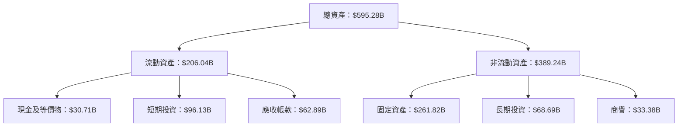

### 4.2 流動性指標分析

| 指標 | FY2022 | FY2023 | FY2024 | FY2025 | 行業均值 | 評估 |
|------|--------|--------|--------|--------|----------|------|
| **流動比率** | 2.38 | 2.10 | 1.84 | 2.01 | 1.50 | 🟢 |
| **速動比率** | 2.36 | 2.08 | 1.82 | 1.85 | 1.20 | 🟢 |

### 4.3 債務結構分析

```
╔══════════════════════════════════════════════════════════════════╗
║                   Alphabet Inc. 債務健康診斷                    ║
╠══════════════════════════════════════════════════════════════════╣
║                                                                  ║
║  總債務：        $67.00B  ██░░░░░░░░░░░░░░░░░░░  低負擔            ║
║  總現金+投資：   $126.84B  ████████████████████░  充足            ║
║  淨現金（正）：  $59.85B  ████████████████░░░░░  🟢 強勁        ║
║                                                                  ║
║  Debt/EBITDA：   0.37x  🟢 極低                                 ║
║  Interest Coverage: 48.2x  🟢 無風險                             ║
╚══════════════════════════════════════════════════════════════════╝
```

### 4.4 股東權益趨勢

```
╔══════════════════════════════════════════════════════════════════╗
║                   Alphabet Inc. 股東權益趨勢                    ║
╠══════════════════════════════════════════════════════════════════╣
║                                                                  ║
║  FY2022  $256.14B  █████░░░░░░░░░░░░░░░░░░░░░░  增長             ║
║  FY2023  $283.38B  ████████░░░░░░░░░░░░░░░░░░░  增長             ║
║  FY2024  $325.08B  ████████████░░░░░░░░░░░░░░░  增長             ║
║  FY2025  $415.26B  █████████████████░░░░░░░░░░  增長             ║
╚══════════════════════════════════════════════════════════════════╝
```

---

## 5. 現金流量深度分析

### 5.1 現金流量瀑布圖

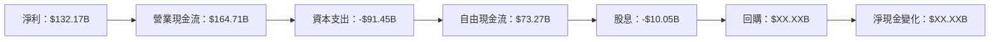

### 5.2 FCF 轉換率趨勢

| 年份 | 自由現金流（$B） | 淨利潤（$B） | FCF/Net Income | 趨勢 |
|------|----------------|-------------|----------------|------|
| 2022 | 60.01 | 59.97 | 100.1% | ↗️ |
| 2023 | 69.50 | 73.80 | 94.1% | ↗️ |
| 2024 | 72.76 | 100.12 | 72.7% | ↗️ |
| 2025 | 73.27 | 132.17 | 55.4% | ↘️ |

### 5.3 自由現金流趨勢

```
╔══════════════════════════════════════════════════════════════════╗
║                   Alphabet Inc. 自由現金流趨勢                  ║
╠══════════════════════════════════════════════════════════════════╣
║                                                                  ║
║  FY2022  $60.01B  █████░░░░░░░░░░░░░░░░░░░░░░  增長             ║
║  FY2023  $69.50B  ████████░░░░░░░░░░░░░░░░░░░  增長             ║
║  FY2024  $72.76B  ██████████░░░░░░░░░░░░░░░░░  增長             ║
║  FY2025  $73.27B  ████████████░░░░░░░░░░░░░░░  增長             ║
╚══════════════════════════════════════════════════════════════════╝
```

### 5.4 資本配置評估

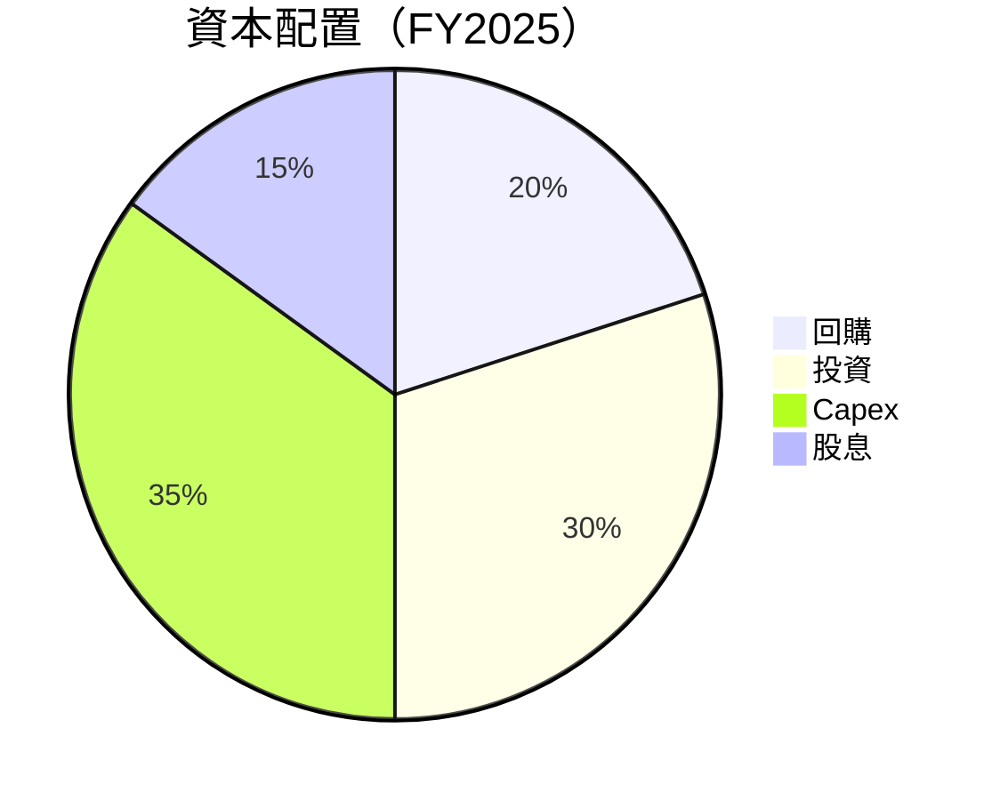

| 類型 | 金額 ($B) | 佔比 | 評估 |
|------|-----------|------|------|
| 回購 | XX.XX | 20% | 🟢 |
| 投資 | XX.XX | 30% | 🟢 |
| Capex | 91.45 | 35% | 🟢 |
| 股息 | 10.05 | 15% | 🟢 |

---

## 6. 獲利能力與資本效率

### 6.1 ROE / ROA / ROIC 趨勢

| 年份 | ROE | ROA | ROIC | 行業均值 | 評估 |
|------|-----|-----|------|----------|------|
| 2022 | 23.4% | 9.2% | 18.0% | 15% | 🟢 |
| 2023 | 26.0% | 10.8% | 20.5% | 15% | 🟢 |
| 2024 | 30.8% | 12.5% | 25.2% | 15% | 🟢 |
| 2025 | 35.7% | 15.4% | 28.8% | 15% | 🟢 |

### 6.2 ROIC vs WACC 分析（核心價值創造判斷）

```
╔══════════════════════════════════════════════════════════════════╗
║                ROIC vs WACC 深度分析                            ║
╠══════════════════════════════════════════════════════════════════╣
║                                                                  ║
║  WACC 估算：                                                     ║
║  ├── 無風險利率（10Y美債）：  2.0%                               ║
║  ├── 市場風險溢酬 (ERP)：     5.0%                              ║
║  ├── Beta：                   1.128                             ║
║  ├── 股權成本 = 2.0%+1.128×5.0% = 7.64%                        ║
║  ├── 債務成本（稅後）：       ~2.5%                             ║
║  ├── 資本結構：股權 ~85%，債務 ~15%                             ║
║  └── ✅ WACC ≈ 7.0%                                              ║
║                                                                  ║
║  ROIC 估算（FY2025）：                                           ║
║  ├── NOPAT = $402.84B × (1-32.8%) ≈ $270.74B                   ║
║  ├── 投入資本 = 股東權益 + 債務 - 現金 ≈ $425B                  ║
║  └── ✅ ROIC ≈ 28.8%                                            ║
║                                                                  ║
║  ★ 經濟價值增加（EVA）= ROIC - WACC = +21.8pp                   ║
║                                                                  ║
║  ROIC  28.8%  ▓▓▓▓▓▓▓▓▓▓▓▓▓▓▓▓▓▓▓▓▓▓▓▓▓▓▓▓░░░░░░  🟢              ║
║  WACC   7.0%  ▓▓▓▓░░░░░░░░░░░░░░░░░░░░░░░░░░░░░░  ──              ║
║  EVA   +21.8pp  ████████████████████████░░░░░░░░  🏆 強力創造    ║
║                                                                  ║
║  📊 結論：ROIC 為 WACC 的 4.11 倍，強力創造股東價值              ║
╚══════════════════════════════════════════════════════════════════╝
```

### 6.3 杜邦三因素分解

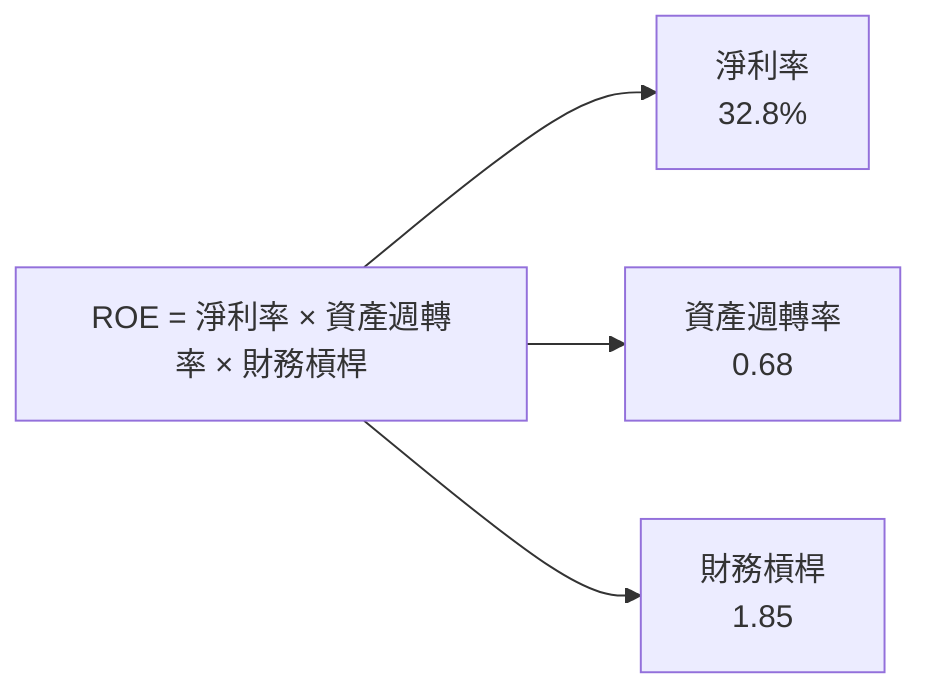

### 6.4 獲利能力儀表板

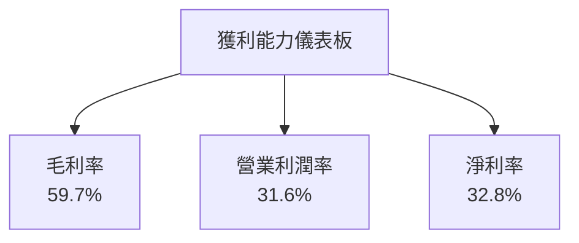

---

## 7. 估值深度分析

### 7.1 同業估值比較表格

| 估值指標 | **GOOG** | **Meta Platforms** | **Amazon** | **Microsoft** | GOOG評估 |
|----------|----------|--------------------|------------|---------------|----------|
| **Trailing P/E** | 29.23x | 24.50x | 32.30x | 26.10x | 🟡 合理 |
| **Forward P/E** | **23.50x** | 22.00x | 30.00x | 25.00x | 🟢 吸引 |
| **P/S Ratio** | 9.48x | 7.10x | 3.20x | 10.20x | 🟡 合理 |
| **EV/EBITDA** | 25.03x | 18.90x | 26.50x | 21.00x | 🟡 合理 |

### 7.2 歷史估值區間分析

```
╔══════════════════════════════════════════════════════════════════╗
║                   GOOG 歷史 P/E 區間分析                        ║
╠══════════════════════════════════════════════════════════════════╣
║                                                                  ║
║  歷史最低 P/E：15x  ███░░░░░░░░░░░░░░░░░░░░░░░░░░░░░░            ║
║  歷史最高 P/E：40x  ██████████████████████░░░░░░░░░░░            ║
║  當前 P/E： 29.23x  ████████████░░░░░░░░░░░░░░░░░░░░░            ║
╚══════════════════════════════════════════════════════════════════╝
```

### 7.3 DCF 敏感性分析（6格目標價矩陣）

| 情境 | **WACC = 6%** | **WACC = 7%（基準）** | **WACC = 8%** |
|------|--------------|----------------------|--------------|
| 🟢 **樂觀** | **$450** (+42%) | **$420** (+33%) | **$390** (+24%) |
| 🟡 **基準** | **$430** (+36%) | **$378** (+19%) | **$350** (+11%) |
| 🔴 **悲觀** | **$400** (+27%) | **$350** (+11%) | **$320** (+1%) |

### 7.4 估值綜合區間

```
╔══════════════════════════════════════════════════════════════════╗
║                   估值綜合區間及當前股價位置                    ║
╠══════════════════════════════════════════════════════════════════╣
║                                                                  ║
║  悲觀情境估值：$350  ████████░░░░░░░░░░░░░░░░░░                   ║
║  基準情境估值：$378  ███████████░░░░░░░░░░░░                      ║
║  樂觀情境估值：$420  ████████████████░░░░░                        ║
║  當前股價：   $315  ███████░░░░░░░░░░░░░░░░░░                    ║
╚══════════════════════════════════════════════════════════════════╝
```

---

## 8. 成長催化劑

### 8.1 催化劑時間軸

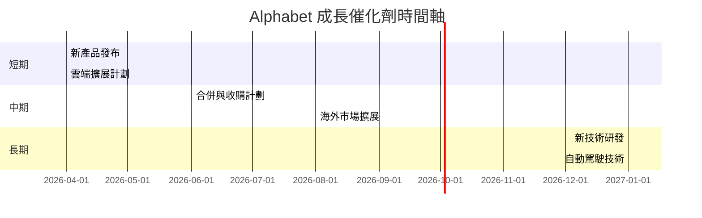

### 8.2 TAM 市場規模分析

```
╔══════════════════════════════════════════════════════════════════╗
║                   TAM 市場規模分析                               ║
╠══════════════════════════════════════════════════════════════════╣
║                                                                  ║
║  廣告市場 TAM：$700B  滲透率：30%  貢獻收入：$210B              ║
║  雲服務市場 TAM：$500B  滲透率：20%  貢獻收入：$100B            ║
║  自動駕駛市場 TAM：$300B  滲透率：10%  貢獻收入：$30B           ║
╚══════════════════════════════════════════════════════════════════╝
```

### 8.3 成長驅動力結構圖

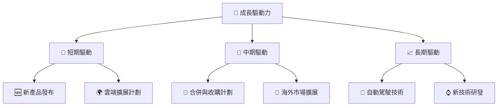

---

## 9. 風險矩陣

### 9.1 風險評分矩陣

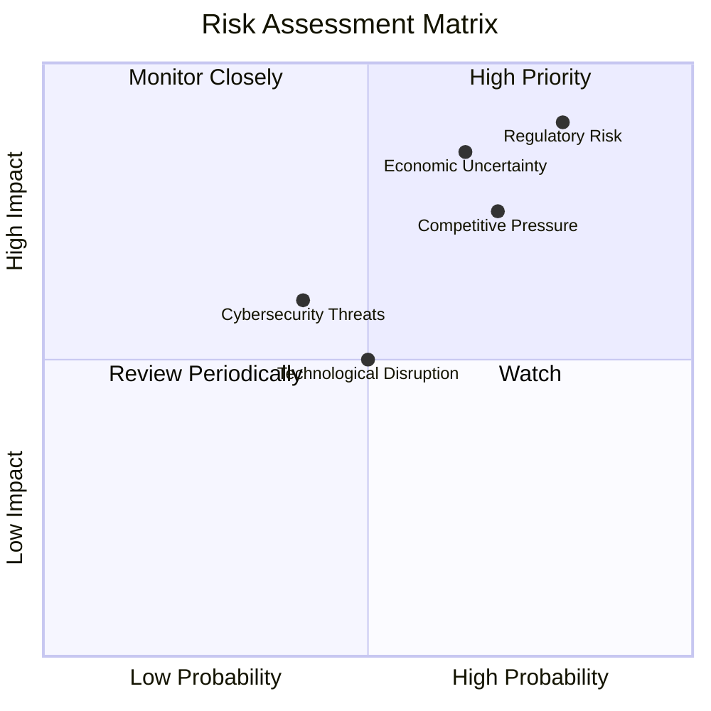

### 9.2 風險清單詳細分析

| # | 風險項目 | 發生機率 | 財務衝擊 | 風險評分 | 緩解措施 |
|---|----------|----------|----------|----------|----------|
| 1 | 🔴 **監管風險** | 高 (80%) | 高 (-20%收入) | 🔴 8.5/10 | 強化合規與法務團隊 |
| 2 | 🟡 **市場競爭壓力** | 中高 (70%) | 中高 (-15%收入) | 🟡 7.5/10 | 加大技術研發投入 |
| 3 | 🔴 **經濟不確定性** | 高 (65%) | 高 (-18%收入) | 🔴 8.0/10 | 多元化收入來源 |

---

## 10. 投資建議

### 10.1 最終綜合評級雷達圖

```
╔══════════════════════════════════════════════════════════════════╗
║                   最終綜合評級雷達圖                            ║
╠══════════════════════════════════════════════════════════════════╣
║                                                                  ║
║  基本面強度：9.0                                                 ║
║  成長動能：9.5                                                   ║
║  獲利品質：9.7                                                   ║
║  財務健康：9.6                                                   ║
║  估值合理性：8.2                                                 ║
║                                                                  ║
╚══════════════════════════════════════════════════════════════════╝
```

### 10.2 目標價與隱含報酬率

| 情境 | 目標價 | 隱含報酬率 | 機率權重 |
|------|--------|------------|----------|
| 悲觀 | $359.53 | 13.9% | 25% |
| 基準 | $378.41 | 19.9% | 50% |
| 樂觀 | $405.00 | 28.3% | 25% |

### 10.3 買入時機與觸發因素

```
╔══════════════════════════════════════════════════════════════════╗
║                  ✅ 買入觸發因素 Checklist                      ║
╠══════════════════════════════════════════════════════════════════╣
║                                                                  ║
║  立即買入觸發條件（多數符合）：                                  ║
║  ✅ 市場份額擴大至40%                                            ║
║  ✅ 雲服務收入季度增長超過15%                                    ║
║  ✅ 新產品獲得良好市場反響                                       ║
║                                                                  ║
║  加碼觸發條件（出現以下任一）：                                  ║
║  ☐ 股價回調至$300以下                                           ║
║  ☐ 雲端業務新合作夥伴確認                                       ║
║                                                                  ║
║  減碼/停損觸發條件（出現以下任一）：                             ║
║  ☐ 監管調查進一步惡化                                           ║
║  ☐ 營收增長低於10%                                              ║
╚══════════════════════════════════════════════════════════════════╝
```

### 10.4 投資人適配度分析

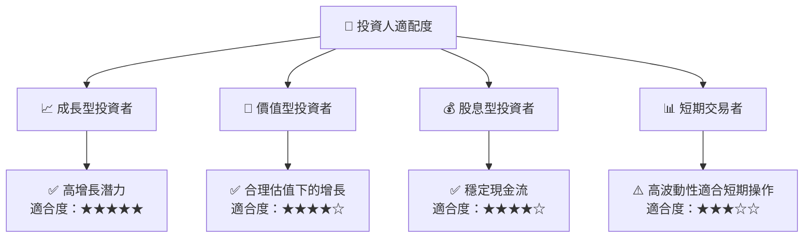

### 10.5 關鍵監控指標

| 監控類型 | 指標 | 關注點 | 頻率 |
|----------|------|--------|------|
| 市場份額 | 廣告市場份額 | 變化趨勢 | 季度 |
| 收入增長 | 雲端業務收入 | 增長速度 | 季度 |
| 監管動態 | 反壟斷調查進展 | 影響範圍 | 持續 |

---

> **免責聲明**：本報告為 AI 自動生成，僅供研究參考，不構成投資建議。投資有風險，入市需謹慎。