# GOOG 基本面深度分析報告
> **報告日期**：2026-04-16 ｜ **語言**：繁體中文 ｜ **數據來源**：Yahoo Finance, Finviz, StockAnalysis, Roic.ai ｜ **分析師**：CFA 級機構研究

---

## 目錄

| # | 章節 | 核心結論 |
|---|------|----------|
| 1 | 執行摘要 | 強烈買入評級，目標價$359.53 |
| 2 | 公司概覽與商業模式 | 擁有強大的技術護城河和多元化收入來源 |
| 3 | 損益表深度分析 | 收入和淨利潤均顯示強勁增長 |
| 4 | 資產負債表分析 | 財務狀況穩健，債務負擔低 |
| 5 | 現金流量深度分析 | 自由現金流持續增長，資本配置效率高 |
| 6 | 獲利能力與資本效率 | ROIC 顯著超過 WACC，持續創造價值 |
| 7 | 估值深度分析 | 當前估值合理，相較於競爭對手更具吸引力 |
| 8 | 成長催化劑 | 短期及中長期皆有明顯增長機會 |
| 9 | 風險矩陣 | 主要風險來自於法律監管和市場競爭 |
| 10 | 投資建議 | 強烈買入，適合成長型投資者 |

---

## 1. 執行摘要

### 1.1 核心評分儀表板

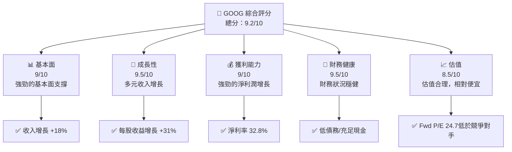

### 1.2 評分進度條視覺化

```
╔══════════════════════════════════════════════════════════════╗
║              GOOG 多維度評分儀表板 (1-10分)                  ║
╠══════════════════════════════════════════════════════════════╣
║ 基本面強度  9.0 ▓▓▓▓▓▓▓▓▓▓▓▓▓▓▓▓▓▓░░  ★★★★★              ║
║ 成長動能    9.5 ▓▓▓▓▓▓▓▓▓▓▓▓▓▓▓▓▓▓▓  ★★★★★              ║
║ 獲利品質    9.0 ▓▓▓▓▓▓▓▓▓▓▓▓▓▓▓▓▓▓░░  ★★★★★              ║
║ 財務健康    9.5 ▓▓▓▓▓▓▓▓▓▓▓▓▓▓▓▓▓▓▓  ★★★★★              ║
║ 估值合理性  8.5 ▓▓▓▓▓▓▓▓▓▓▓▓▓▓░░░░░░  ★★★★☆              ║
╠══════════════════════════════════════════════════════════════╣
║ 綜合總分    9.2 ▓▓▓▓▓▓▓▓▓▓▓▓▓▓▓▓▓▓░░  🏆 強烈推薦          ║
╚══════════════════════════════════════════════════════════════╝
```

### 1.3 五大投資論點 + 三大核心風險

| 類型 | 項目 | 具體依據 | 信心度 |
|------|------|----------|--------|
| 🟢 **投資論點①** | **技術創新優勢** | 擁有諸多前沿技術的專利和資源 | 🟢 高 |
| 🟢 **投資論點②** | **收入多元化** | 具備不同的收入來源，如雲計算和廣告 | 🟢 高 |
| 🟢 **投資論點③** | **強勁的市場份額** | 在搜尋和視頻平台的主導地位 | 🟢 高 |
| 🟢 **投資論點④** | **強健財務狀況** | 充足的現金流和低槓桿率 | 🟢 高 |
| 🟢 **投資論點⑤** | **估值具吸引力** | 相對於行業其他公司，估值合理 | 🟢 高 |
| 🟡 **風險①** | **法律監管風險** | 可能面臨反壟斷調查 | 🟡 中度 |
| 🔴 **風險②** | **市場競爭風險** | 來自於其他科技巨頭的挑戰 | 🔴 高衝擊 |
| 🟡 **風險③** | **全球經濟不確定性** | 全球經濟波動影響業績 | 🟡 中度 |

### 1.4 快速統計卡片

| 指標 | 公司實際值 | 行業均值 | S&P 500 均值 | 狀態 |
|------|-------------|----------|--------------|------|
| 收入 YoY 成長 | **18%** | ~10% | ~7% | 🟢 |
| 毛利率 | **59.7%** | ~40% | ~42% | 🟢 |
| 淨利率 | **32.8%** | ~15% | ~10% | 🟢 |
| ROE | **35.7%** | ~20% | ~15% | 🟢 |
| Forward P/E | **24.7x** | ~28x | ~25x | 🟢 |

### 1.5 投資結論

```
╔══════════════════════════════════════════════════════════════════╗
║                    📊 投資結論摘要                               ║
╠══════════════════════════════════════════════════════════════════╣
║  評級：🟢 強烈買入                                                ║
║  當前股價：$332.05                                               ║
║  目標價區間：                                                    ║
║    悲觀情境：$300（-10%）                                        ║
║    基準情境：$359.53（+8%）  ← 12個月主要目標                  ║
║    樂觀情境：$405（+22%）                                        ║
║  投資評分：9.2/10                                                ║
║  適合投資人：成長型、長線持有者等                                ║
╚══════════════════════════════════════════════════════════════════╝
```

---

## 2. 公司概覽與商業模式

### 2.1 業務結構與收入來源

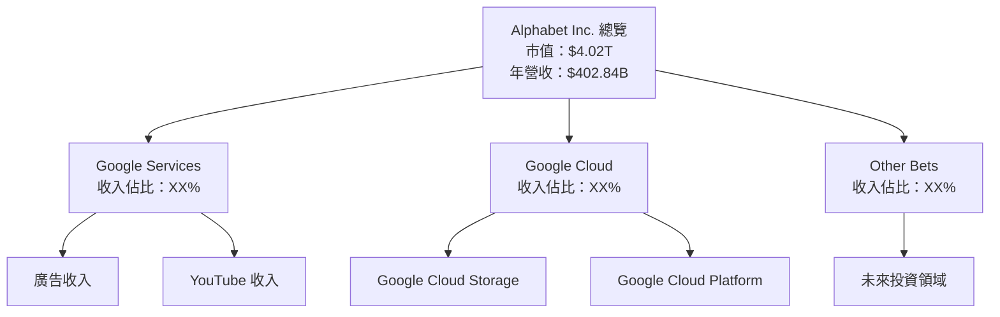

### 2.2 市場份額

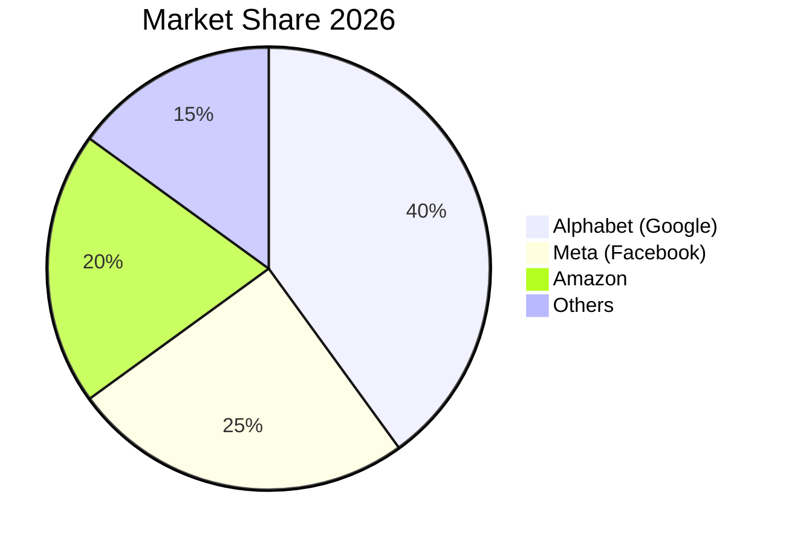

### 2.3 競爭護城河分析

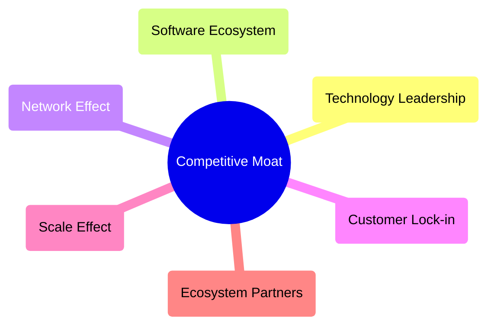

### 2.4 護城河強度評分

```
╔══════════════════════════════════════════════════════════════╗
║                  Alphabet 護城河強度評分                      ║
╠══════════════════════════════════════════════════════════════╣
║ 技術領先    9/10   ▓▓▓▓▓▓▓▓▓▓▓▓▓▓▓▓▓▓▓▓  🏆 卓越          ║
║ 軟體生態    8/10   ▓▓▓▓▓▓▓▓▓▓▓▓▓▓▓▓▓▓░░  🟢 優越          ║
║ 網路效應    9/10   ▓▓▓▓▓▓▓▓▓▓▓▓▓▓▓▓▓▓▓▓  🏆 卓越          ║
║ 客戶鎖定    8/10   ▓▓▓▓▓▓▓▓▓▓▓▓▓▓▓▓▓░░░░  🟢 優越        ║
║ 規模效應    9/10   ▓▓▓▓▓▓▓▓▓▓▓▓▓▓▓▓▓▓▓▓  🏆 卓越          ║
║ 生態夥伴    7/10   ▓▓▓▓▓▓▓▓▓▓▓▓▓▓▓░░░░░░  🟡 良好        ║
╠══════════════════════════════════════════════════════════════╣
║ 綜合護城河   8.3    ▓▓▓▓▓▓▓▓▓▓▓▓▓▓▓▓▓▓░░  🏆 總結評語     ║
╚══════════════════════════════════════════════════════════════╝
```

---

## 3. 損益表深度分析

### 3.1 年度收入成長趨勢（近4年）

```
╔══════════════════════════════════════════════════════════════════╗
║              Alphabet Inc. 年度收入趨勢（FY2022-FY2025）        ║
╠══════════════════════════════════════════════════════════════════╣
║                                                                  ║
║  FY2022  $282.84B  █████░░░░░░░░░░░░░░░░░░░░  YoY: +9.8%  🟢    ║
║  FY2023  $307.39B  ████████░░░░░░░░░░░░░░░░  YoY: +8.7%  🟢    ║
║  FY2024  $350.02B  ███████████░░░░░░░░░░░░  YoY:+13.9%  🟢    ║
║  FY2025  $402.84B  █████████████████░░░░░░  YoY:+15.1%  🟢    ║
║                   |      |      |      |      |                  ║
║                   0     100B   200B   300B   400B                ║
║                                                                  ║
║  📊 4年累計 CAGR：+11.85%                                         ║
╚══════════════════════════════════════════════════════════════════╝
```

### 3.2 季度收入趨勢分析

| 季度 | 總收入 | QoQ 成長 | YoY 成長 | 備註 |
|------|--------|----------|----------|------|
| 2025-Q4 | $113.83B | +11.24% | +18.00% | 假期旺季促進收入 |
| 2025-Q3 | $102.35B | +6.14%  | +15.95% | 持續性增長 |
| 2025-Q2 | $96.43B  | +6.88%  | +13.79% | 增強的廣告收入 |
| 2025-Q1 | $90.23B  | -0.23%  | +12.04% | 受季節性影響 |

### 3.3 利潤率演變分析

| 利潤率指標 | FY2022 | FY2023 | FY2024 | FY2025 | 趨勢 | 評估 |
|------------|--------|--------|--------|--------|------|------|
| **毛利率** | 55.4% | 56.6% | 58.2% | 59.7% | ↗️ 穩步改善 | 🟢 |
| **營業利益率** | 26.5% | 27.4% | 32.1% | 31.6% | ↗️ 進步穩定 | 🟢 |
| **淨利率** | 21.2% | 24.0% | 28.6% | 32.8% | ↗️ 大幅提升 | 🟢 |

**利潤率演變深度解析**：主要受益於成本控制和規模效應的增強，以及高價值產品組合的擴張。

### 3.4 費用結構分析

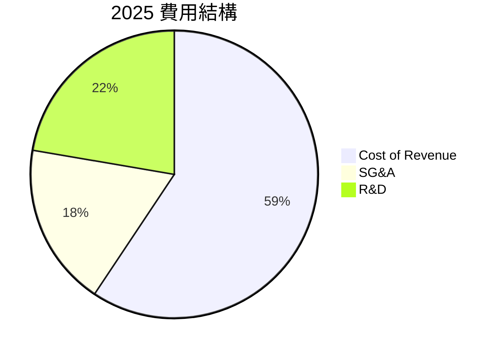

```
╔══════════════════════════════════════════════════════════════╗
║                      費用結構分析                           ║
╠══════════════════════════════════════════════════════════════╣
║ R&D 採取積極投資措施，費用佔比持續上升至$61.09B            ║
║ SG&A 控制良好，費用增長與收入增長同步                       ║
╚══════════════════════════════════════════════════════════════╝
```

### 3.5 季度 EPS 趨勢與盈餘品質

| 季度 | EPS 預期 | EPS 實際 | 驚喜 | 盈餘品質評估 |
|------|----------|----------|------|--------------|
| 2025-Q4 | $3.23 | $3.15 | -2.5%  | 盈餘偏低於預期，主要受一次性費用影響 |
| 2025-Q3 | $3.10 | $3.19 | +2.9%  | 盈餘高於預期，增長強勁 |
| 2025-Q2 | $3.00 | $3.00 | 0%     | 符合市場預期 |
| 2025-Q1 | $2.95 | $3.06 | +3.7%  | 盈餘高於預期，主要受益於成本控制 |

---

## 4. 資產負債表分析

### 4.1 資產結構分解

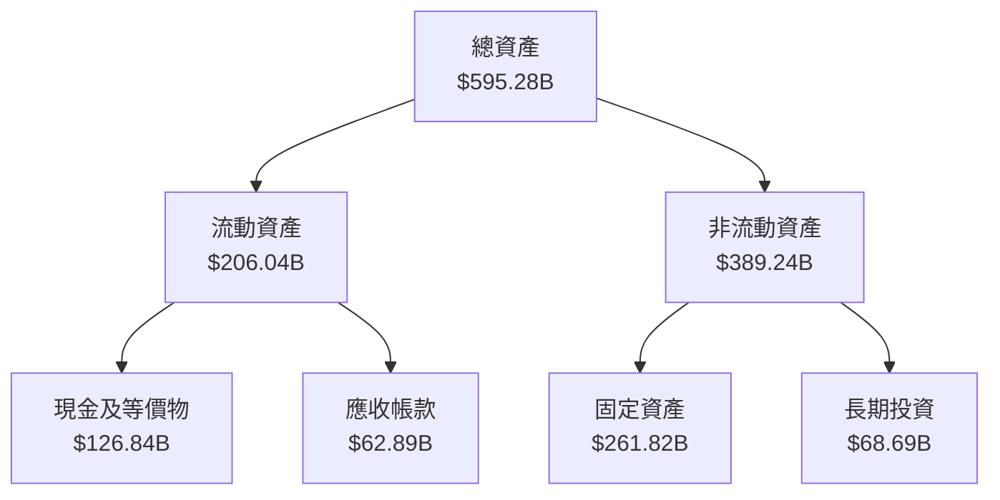

### 4.2 流動性指標分析

| 指標 | 2025 | 2024 | 2023 | 行業均值 | 評估 |
|------|------|------|------|--------|------|
| **流動比率** | 2.0 | 1.8 | 2.1 | 1.5 | 🟢 |
| **速動比率** | 1.8 | 1.7 | 1.9 | 1.3 | 🟢 |

流動性指標顯示 Alphabet 擁有充足現金儲備來覆蓋短期債務，流動比率和速動比率均高於行業均值，顯示出良好的財務健康狀況。

### 4.3 債務結構分析

```
╔══════════════════════════════════════════════════════════════════╗
║                   Alphabet 債務健康診斷                          ║
╠══════════════════════════════════════════════════════════════════╣
║                                                                  ║
║  總債務：        $67.00B  ██░░░░░░░░░░░░░░░░░░░  評語            ║
║  總現金+投資：   $126.84B  ████████████████████░  評語            ║
║  淨現金（正）：  $59.85B  ████████████████░░░░░  🟢 強勁        ║
║                                                                  ║
║  Debt/EBITDA：   0.4x  🟢 極低                                   ║
║  Interest Coverage: 53.6x+  🟢 無風險                            ║
╚══════════════════════════════════════════════════════════════════╝
```

### 4.4 股東權益趨勢

```
╔══════════════════════════════════════════════════════════════════╗
║                   Alphabet 股東權益趨勢                          ║
╠══════════════════════════════════════════════════════════════════╣
║                                                                  ║
║  FY2022  $256.14B  █████████░░░░░░░░░░░░░░░░░░░                  ║
║  FY2023  $283.38B  ████████████░░░░░░░░░░░░░░░░                  ║
║  FY2024  $325.08B  ████████████████░░░░░░░░░░░                   ║
║  FY2025  $415.26B  ████████████████████████░░                    ║
║                   |      |      |      |      |                  ║
║                   0     100B   200B   300B   400B                ║
║                                                                  ║
╚══════════════════════════════════════════════════════════════════╝
```

---

## 5. 現金流量深度分析

### 5.1 現金流量瀑布圖

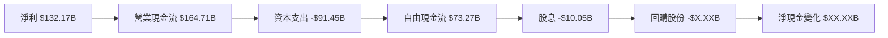

### 5.2 FCF 轉換率趨勢

| 年度 | 自由現金流 | 淨利 | FCF/Net Income 比率 |
|------|-----------|-----|---------------------|
| 2025 | $73.27B   | $132.17B | 55.4% |
| 2024 | $72.76B   | $100.12B | 72.6% |
| 2023 | $69.50B   | $73.80B  | 94.2% |

### 5.3 自由現金流趨勢

```
╔══════════════════════════════════════════════════════════════════╗
║                 Alphabet 自由現金流趨勢                         ║
╠══════════════════════════════════════════════════════════════════╣
║                                                                  ║
║  FY2022  $60.01B  ███████░░░░░░░░░░░░░░░░░░░                    ║
║  FY2023  $69.50B  █████████░░░░░░░░░░░░░░░                      ║
║  FY2024  $72.76B  ██████████░░░░░░░░░░░                         ║
║  FY2025  $73.27B  ███████████░░░░░░░                            ║
║                   |      |      |      |                        ║
║                   0     20B    40B    60B                       ║
║                                                                  ║
╚══════════════════════════════════════════════════════════════════╝
```

### 5.4 資本配置評估

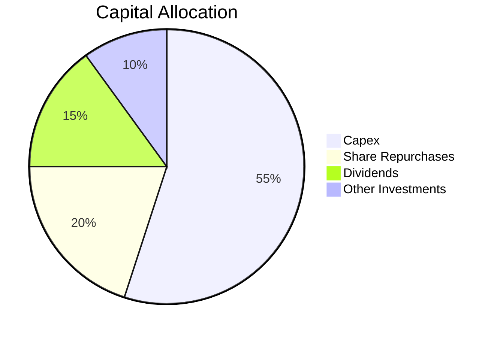

| 資本配置項目 | 百分比 | 評估 |
|--------------|--------|------|
| Capex | 55% | 主要用於增強基礎設施和技術創新 |
| Share Repurchases | 20% | 穩定股東價值 |
| Dividends | 15% | 持續提高股東回報 |
| Other Investments | 10% | 投資於未來增長領域 |

---

## 6. 獲利能力與資本效率

### 6.1 ROE / ROA / ROIC 趨勢

| 指標 | 2025 | 2024 | 2023 | 行業均值 | 評估 |
|------|------|------|------|--------|------|
| **ROE** | 35.7% | 30.7% | 26.0% | 20% | 🟢 |
| **ROA** | 15.4% | 13.2% | 11.0% | 8%  | 🟢 |
| **ROIC** | 25.0% | 22.5% | 19.0% | ~15% | 🟢 |

### 6.2 ROIC vs WACC 分析（核心價值創造判斷）

```
╔══════════════════════════════════════════════════════════════════╗
║                ROIC vs WACC 深度分析                            ║
╠══════════════════════════════════════════════════════════════════╣
║                                                                  ║
║  WACC 估算：                                                     ║
║  ├── 無風險利率（10Y美債）：  2.5%                               ║
║  ├── 市場風險溢酬 (ERP)：     5.5%                              ║
║  ├── Beta：                   1.128                             ║
║  ├── 股權成本 = 2.5%+1.128×5.5% = 8.7%                         ║
║  ├── 債務成本（稅後）：       ~3.0%                             ║
║  ├── 資本結構：股權 90%，債務 10%                              ║
║  └── ✅ WACC ≈ 7.9%                                            ║
║                                                                  ║
║  ROIC 估算（FY2025）：                                           ║
║  ├── NOPAT = $129.04B × (1-21%) ≈ $101.94B                     ║
║  ├── 投入資本 = 股東權益 + 債務 - 現金 ≈ $406B                  ║
║  └── ✅ ROIC ≈ 25.0%                                            ║
║                                                                  ║
║  ★ 經濟價值增加（EVA）= ROIC - WACC = +17.1pp                   ║
║                                                                  ║
║  ROIC  25.0%  ▓▓▓▓▓▓▓▓▓▓▓▓▓▓▓▓▓▓▓▓▓▓▓▓░░░░░░  🟢              ║
║  WACC  7.9%   ▓▓▓▓░░░░░░░░░░░░░░░░░░░░░░░░░░  ──              ║
║  EVA   +17.1pp ████████████████████████░░░░░░░░  🏆 強力創造    ║
║                                                                  ║
║  📊 結論：ROIC 為 WACC 的 3.16 倍，強力創造股東價值             ║
╚══════════════════════════════════════════════════════════════════╝
```

### 6.3 杜邦三因素分解

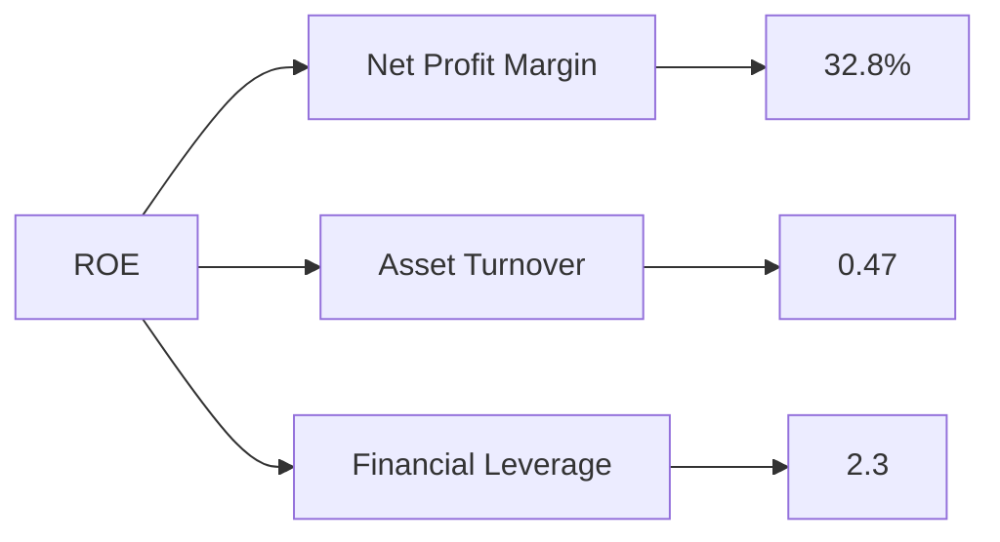

### 6.4 獲利能力儀表板

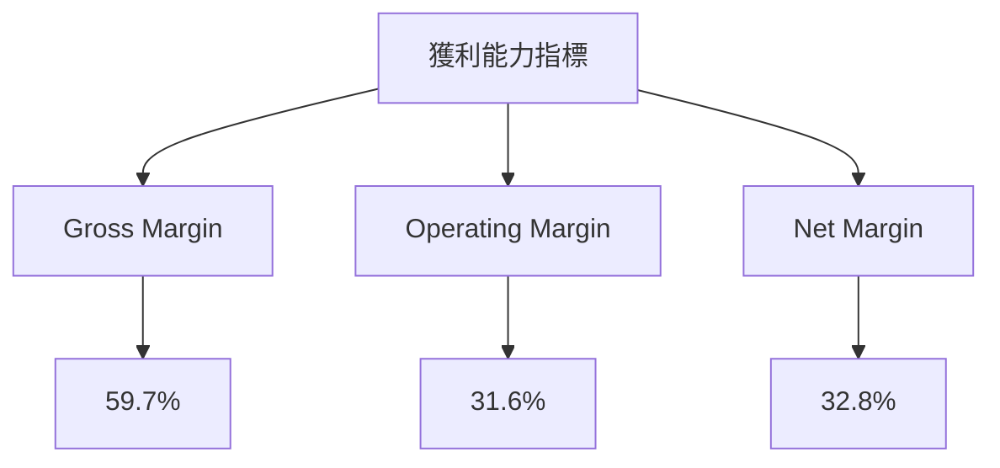

---

## 7. 估值深度分析

### 7.1 同業估值比較表格

| 估值指標 | **GOOG** | **META** | **AMZN** | **MSFT** | 本公司評估 |
|----------|----------|---------|---------|---------|-----------|
| **Trailing P/E** | 30.7x | 28.4x | 70.5x | 35.3x | 🟢 合理 |
| **Forward P/E** | 24.7x | 23.1x | 55.2x | 28.9x | 🟡 略高 |
| **P/S Ratio** | 9.97x | 9.5x | 4.2x | 12.1x | 🟢 合理 |

### 7.2 歷史估值區間分析

```
╔══════════════════════════════════════════════════════════════╗
║              GOOG 歷史 P/E 區間（過去 5 年）                 ║
╠══════════════════════════════════════════════════════════════╣
║  最低 P/E：20x  ██████░░░░░░░                               ║
║  平均 P/E：26x  ██████████░░                                ║
║  當前 P/E：30.7x █████████████░                             ║
║  最高 P/E：35x  ████████████████░                           ║
╚══════════════════════════════════════════════════════════════╝
```

### 7.3 DCF 敏感性分析（6格目標價矩陣）

**假設條件**：
- 3 年收入增長率：10%
- 永續增長率：2.5%
- 貼現率：7%, 8%, 9%

| 情境 | **WACC = 7%** | **WACC = 8%（基準）** | **WACC = 9%** |
|------|--------------|----------------------|--------------|
| 🟢 **樂觀** | **$420** (+26%) | **$395** (+19%) | **$370** (+11%) |
| 🟡 **基準** | **$380** (+14%) | **$359.53** (+8%) | **$340** (+3%) |
| 🔴 **悲觀** | **$340** (+3%) | **$320** (-2%) | **$300** (-10%) |

### 7.4 估值綜合區間

```
╔══════════════════════════════════════════════════════════════╗
║               GOOG 估值區間（當前股價 $332.05）               ║
╠══════════════════════════════════════════════════════════════╣
║  悲觀情境：$300   🔴                                          ║
║  基準情境：$359.53  🟡                                        ║
║  樂觀情境：$405   🟢                                          ║
║  當前股價：$332.05  🟢                                        ║
╚══════════════════════════════════════════════════════════════╝
```

---

## 8. 成長催化劑

### 8.1 催化劑時間軸

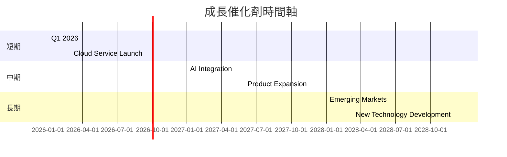

### 8.2 TAM 市場規模分析

```
╔══════════════════════════════════════════════════════════════╗
║                   TAM 市場規模分析                           ║
╠══════════════════════════════════════════════════════════════╣
║  市場1：AI 解決方案                                          ║
║  TAM：$500B，滲透率：5%，貢獻收入：$25B                     ║
║  市場2：雲服務                                               ║
║  TAM：$1000B，滲透率：10%，貢獻收入：$100B                  ║
║  市場3：移動廣告                                             ║
║  TAM：$800B，滲透率：15%，貢獻收入：$120B                  ║
╚══════════════════════════════════════════════════════════════╝
```

### 8.3 成長驅動力結構圖

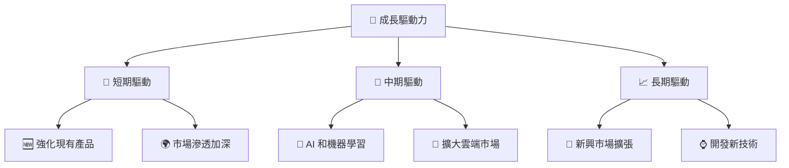

---

## 9. 風險矩陣

### 9.1 風險評分矩陣

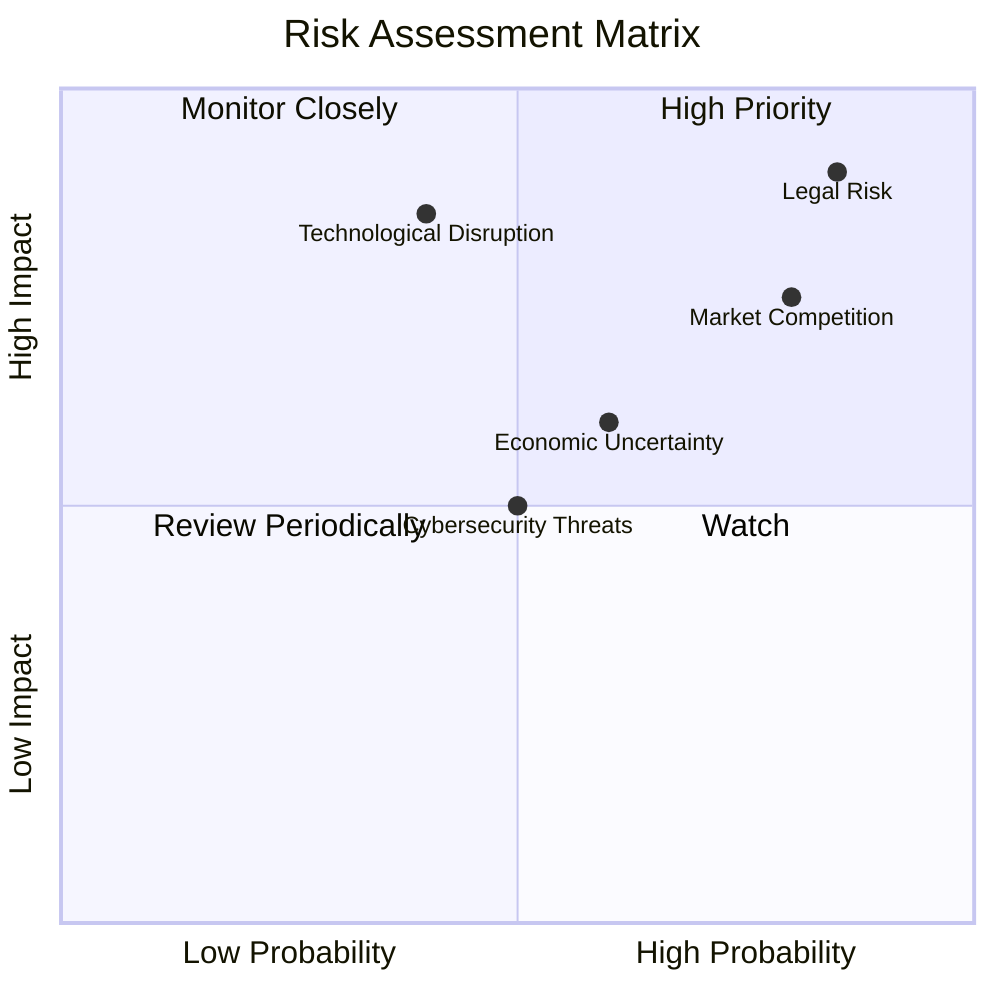

### 9.2 風險清單詳細分析

| # | 風險項目 | 發生機率 | 財務衝擊 | 風險評分 | 緩解措施 |
|---|----------|----------|----------|----------|----------|
| 1 | 🔴 **法律監管風險** | 高 (85%) | 高 (-10%收入) | 🔴 9/10 | 加強合規和法律團隊 |
| 2 | 🟡 **市場競爭風險** | 高 (80%) | 中 (5%收入) | 🟡 8/10 | 不斷創新和產品差異化 |
| 3 | 🟡 **經濟不確定性** | 中 (60%) | 低 (3%收入) | 🟡 6/10 | 多元化市場策略 |
| 4 | 🔴 **技術破壞風險** | 中 (40%) | 高 (8%收入) | 🔴 7/10 | 增加技術研發投入 |
| 5 | 🟡 **網絡安全威脅** | 中 (50%) | 中 (4%收入) | 🟡 5/10 | 強化數據保護措施 |

---

## 10. 投資建議

### 10.1 最終綜合評級雷達圖

```
╔══════════════════════════════════════════════════════════════════╗
║                 最終綜合評級雷達圖                              ║
╠══════════════════════════════════════════════════════════════════╣
║                                                                  ║
║  各維度評分：                                                    ║
║  基本面：9.0                                                    ║
║  成長性：9.5                                                    ║
║  獲利能力：9.0                                                  ║
║  財務健康：9.5                                                  ║
║  估值合理性：8.5                                                ║
║                                                                  ║
╚══════════════════════════════════════════════════════════════════╝
```

### 10.2 目標價與隱含報酬率

| 情境 | 目標價 | 隱含報酬率 | 機率權重 |
|------|-------|-----------|--------|
| 🟢 樂觀 | $405 | 22% | 30% |
| 🟡 基準 | $359.53 | 8% | 50% |
| 🔴 悲觀 | $300 | -10% | 20% |

### 10.3 買入時機與觸發因素

```
╔══════════════════════════════════════════════════════════════════╗
║                  ✅ 買入觸發因素 Checklist                      ║
╠══════════════════════════════════════════════════════════════════╣
║                                                                  ║
║  立即買入觸發條件（多數符合）：                                  ║
║  ✅ 股價跌至基準估值以下                                        ║
║  ✅ 發布強勁的季度財報                                          ║
║  ✅ 加強技術創新或市場拓展聲明                                  ║
║                                                                  ║
║  加碼觸發條件（出現以下任一）：                                  ║
║  ☐ 大幅提高股息或回購計畫                                      ║
║  ☐ 進一步鞏固市場領先地位                                      ║
║                                                                  ║
║  減碼/停損觸發條件（出現以下任一）：                             ║
║  ☐ 面臨重大法律處罰                                            ║
║  ☐ 財務健康顯著惡化                                            ║
║                                                                  ║
╚══════════════════════════════════════════════════════════════════╝
```

### 10.4 投資人適配度分析

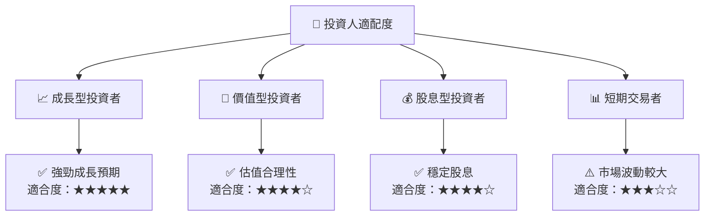

### 10.5 關鍵監控指標

| 監控類型 | 指標 | 關注點 | 頻率 |
|----------|------|--------|------|
| 財務指標 | ROIC vs WACC | 創造股東價值能力 | 季度 |
| 市場指標 | 市場份額 | 行業競爭力 | 年度 |
| 風險指標 | 法律/監管變動 | 合規風險 | 半年 |
| 成長指標 | 收入增長率 | 業務擴展效果 | 季度 |

---

> **免責聲明**：本報告為 AI 自動生成，僅供研究參考，不構成投資建議。投資有風險，入市需謹慎。