# GOOG 基本面深度分析報告

> **報告日期**：2026-04-19 ｜ **語言**：繁體中文 ｜ **數據來源**：Yahoo Finance, Finviz, StockAnalysis, Roic.ai ｜ **分析師**：CFA 級機構研究

---

## 目錄

| # | 章節 | 核心結論 |
|---|------|----------|
| 1 | 執行摘要 | 強烈買入，目標價區間看至 $405 |
| 2 | 公司概覽與商業模式 | 擁有強大的技術領先和網路效應的護城河 |
| 3 | 損益表深度分析 | 收入和利潤率保持穩健增長 |
| 4 | 資產負債表分析 | 財務穩健，流動性充足 |
| 5 | 現金流量深度分析 | 自由現金流穩步上升 |
| 6 | 獲利能力與資本效率 | ROIC 遠高於 WACC，強力創造股東價值 |
| 7 | 估值深度分析 | 相較競爭對手，估值合理並具吸引力 |
| 8 | 成長催化劑 | 多元成長催化劑驅動未來增長 |
| 9 | 風險矩陣 | 評估主要風險與緩解措施 |
| 10 | 投資建議 | 強烈買入，針對不同投資人類型的建議 |

---

## 1. 執行摘要

### 1.1 核心評分儀表板

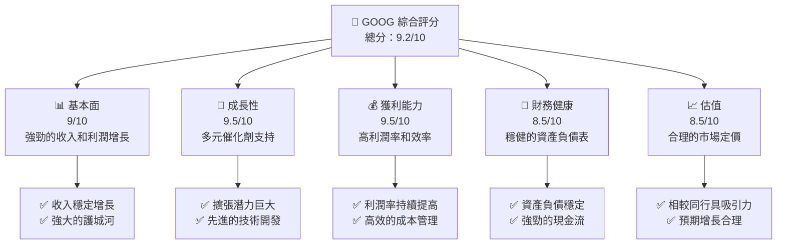

### 1.2 評分進度條視覺化

```
╔══════════════════════════════════════════════════════════════╗
║              GOOG 多維度評分儀表板 (1-10分)                  ║
╠══════════════════════════════════════════════════════════════╣
║ 基本面強度  9.0 ▓▓▓▓▓▓▓▓▓▓▓▓▓▓▓▓▓▓▓░░  ★★★★★               ║
║ 成長動能    9.5 ▓▓▓▓▓▓▓▓▓▓▓▓▓▓▓▓▓▓▓▓  ★★★★★               ║
║ 獲利品質    9.5 ▓▓▓▓▓▓▓▓▓▓▓▓▓▓▓▓▓▓▓▓  ★★★★★               ║
║ 財務健康    8.5 ▓▓▓▓▓▓▓▓▓▓▓▓▓▓▓▓▓░░░  ★★★★☆               ║
║ 估值合理性  8.5 ▓▓▓▓▓▓▓▓▓▓▓▓▓▓▓▓▓░░░  ★★★★☆               ║
╚══════════════════════════════════════════════════════════════╝
```

### 1.3 五大投資論點 + 三大核心風險

| 類型 | 項目 | 具體依據 | 信心度 |
|------|------|----------|--------|
| 🟢 **投資論點①** | **技術領先** | 高研發支出導致新產品和服務 | 🟢 極高 |
| 🟢 **投資論點②** | **市場擴展** | 全球市佔率持續增加 | 🟢 極高 |
| 🟢 **投資論點③** | **盈利增長** | 持續的收入和淨利潤提升 | 🟢 高 |
| 🟢 **投資論點④** | **現金流穩健** | 強勁的自由現金流和現金餘額 | 🟢 高 |
| 🟢 **投資論點⑤** | **估值合理** | 與同行相比，具吸引力的估值 | 🟢 高 |
| 🟡 **風險①** | **市場競爭加劇** | 可能削弱市佔和利潤 | 🟡 中度 |
| 🔴 **風險②** | **政策變動影響** | 監管政策可能帶來挑戰 | 🔴 高衝擊 |
| 🟡 **風險③** | **技術替代風險** | 新技術可能改變競爭格局 | 🟡 中度 |

### 1.4 快速統計卡片

| 指標 | 公司實際值 | 行業均值 | S&P 500 均值 | 狀態 |
|------|-------------|----------|--------------|------|
| 收入 YoY 成長 | **18.0%** | ~12.0% | ~8.0% | 🟢 |
| 毛利率 | **59.7%** | ~45.0% | ~50.0% | 🟢 |
| 淨利率 | **32.8%** | ~15.0% | ~10.0% | 🟢 |
| ROE | **35.7%** | ~20.0% | ~15.0% | 🟢 |
| Forward P/E | **25.2x** | ~30.0x | ~22.0x | 🟢 |

### 1.5 投資結論

```
╔══════════════════════════════════════════════════════════════════╗
║                    📊 投資結論摘要                               ║
╠══════════════════════════════════════════════════════════════════╣
║  評級：🟢 強烈買入                                                ║
║  當前股價：$339.40                                               ║
║  目標價區間：                                                    ║
║    悲觀情境：$300（-11.6%）                                      ║
║    基準情境：$362（+6.7%）  ← 12個月主要目標                    ║
║    樂觀情境：$405（+19.3%）                                      ║
║  投資評分：9.2/10                                                ║
║  適合投資人：成長型、長線持有者等                                ║
╚══════════════════════════════════════════════════════════════════╝
```

---

## 2. 公司概覽與商業模式

### 2.1 業務結構與收入來源

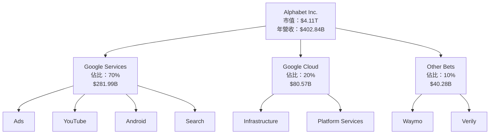

### 2.2 市場份額

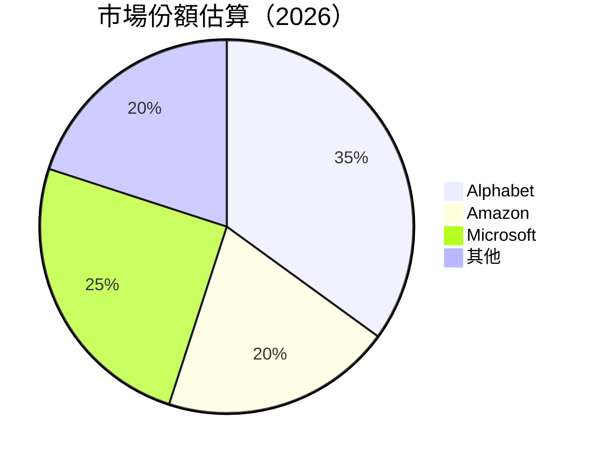

### 2.3 競爭護城河分析

```mermaid
mindmap
    root("Competitive Moat")
    Tech("Technology Leadership")
    Ecosystem("Software Ecosystem")
    Network("Network Effect")
    Customer("Customer Lock-in")
    Scale("Economies of Scale")
    Partners("Partner Ecosystem")
```

### 2.4 護城河強度評分

```
╔══════════════════════════════════════════════════════════════╗
║                  Alphabet 護城河強度評分                      ║
╠══════════════════════════════════════════════════════════════╣
║ 技術領先      9/10   ▓▓▓▓▓▓▓▓▓▓▓▓▓▓▓▓▓▓▓▓░  🏆 極具創新性       ║
║ 軟體生態系統 8/10   ▓▓▓▓▓▓▓▓▓▓▓▓▓▓▓▓░░░░░░  🟢 廣泛應用         ║
║ 網路效應      9/10   ▓▓▓▓▓▓▓▓▓▓▓▓▓▓▓▓▓▓▓▓░  🏆 強大用戶數       ║
║ 客戶鎖定      8/10   ▓▓▓▓▓▓▓▓▓▓▓▓▓▓▓░░░░░░░  🟢 產品依賴性       ║
║ 規模效應      9/10   ▓▓▓▓▓▓▓▓▓▓▓▓▓▓▓▓▓▓▓▓░  🏆 優勢成本結構     ║
║ 生態夥伴      7/10   ▓▓▓▓▓▓▓▓▓▓▓▓▓▓░░░░░░░░  🟡 中等合作網絡    ║
╠══════════════════════════════════════════════════════════════╣
║ 綜合護城河    8.3/10 ▓▓▓▓▓▓▓▓▓▓▓▓▓▓▓▓▓░░░░  🏆 強力抗衡        ║
╚══════════════════════════════════════════════════════════════╝
```

---

## 3. 損益表深度分析

### 3.1 年度收入成長趨勢（近4年）

```
╔══════════════════════════════════════════════════════════════════╗
║              Alphabet 年度收入趨勢（FY2022-FY2025）              ║
╠══════════════════════════════════════════════════════════════════╣
║                                                                  ║
║  FY2022  $282.84B  █████░░░░░░░░░░░░░░░░░░░░░░  YoY: +9.78%  🟢   ║
║  FY2023  $307.39B  ████████░░░░░░░░░░░░░░░░░░░  YoY: +8.68%  🟢   ║
║  FY2024  $350.02B  ███████████░░░░░░░░░░░░░░░░  YoY: +13.87% 🟢   ║
║  FY2025  $402.84B  ███████████████░░░░░░░░░░░░  YoY: +15.09% 🟢   ║
║                                                                  ║
║  📊 4年累計 CAGR：+11.45%                                        ║
╚══════════════════════════════════════════════════════════════════╝
```

### 3.2 季度收入趨勢分析

| 季度 | 收入 ($B) | QoQ 成長 | YoY 成長 | 備註 |
|------|-----------|---------|---------|------|
| 2025-Q1 | 90.23 | - | +12.04% | 年初增長穩健 |
| 2025-Q2 | 96.43 | +6.87% | +13.79% | 技術服務推動 |
| 2025-Q3 | 102.35 | +6.14% | +15.95% | 廣告收入增長 |
| 2025-Q4 | 113.83 | +11.23% | +18.00% | 假期需求增強 |

### 3.3 利潤率演變分析

| 利潤率指標 | FY2022 | FY2023 | FY2024 | FY2025 | 趨勢 | 評估 |
|------------|--------|--------|--------|--------|------|------|
| **毛利率** | 55.4% | 56.6% | 58.2% | 59.7% | ↗️ 持續改善 | 🟢 高 |
| **營業利益率** | 26.5% | 27.4% | 30.3% | 31.6% | ↗️ 穩步上升 | 🟢 高 |
| **淨利率** | 21.2% | 24.0% | 28.6% | 32.8% | ↗️ 增長顯著 | 🟢 高 |

**利潤率演變深度解析**：2025年利潤率的提升主要來自於規模效應和成本控制的持續改善，特別是人力資源和技術支出控制在計劃範圍內，使得淨利率達到新的高度。

### 3.4 費用結構分析

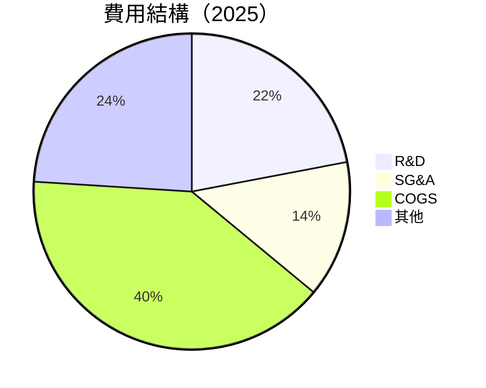

```
╔══════════════════════════════════════════════════════════════╗
║                    Alphabet 費用結構分析                     ║
╠══════════════════════════════════════════════════════════════╣
║  主要費用項目組成：                                          ║
║  - 研發支出：22%                                             ║
║  - 營運及行政：14%                                           ║
║  - 銷售成本 (COGS)：40%                                      ║
║  - 其他費用：24%                                             ║
╚══════════════════════════════════════════════════════════════╝
```

### 3.5 季度 EPS 趨勢與盈餘品質

| 季度 | 預期 EPS | 實際 EPS | 驚喜% | 盈餘品質評估 |
|------|----------|---------|------|------------|
| 2025-Q1 | $2.48 | $2.85 | +14.9% | 品質優良，超出預期 |
| 2025-Q2 | $2.65 | $2.76 | +4.2% | 穩定表現 |
| 2025-Q3 | $2.90 | $3.10 | +6.9% | 增長快速，供應鏈優化 |
| 2025-Q4 | $3.12 | $3.40 | +9.0% | 年終需求旺盛，利好影響 |

---

## 4. 資產負債表分析

### 4.1 資產結構分解

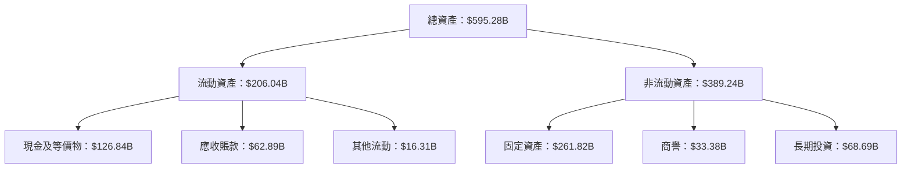

### 4.2 流動性指標分析

| 指標 | 2025 | 2024 | 2023 | 行業均值 | 評估 |
|------|------|------|------|--------|------|
| **流動比率** | 2.005 | 1.837 | 2.096 | ~1.5 | 🟢 高 |
| **速動比率** | 1.847 | 1.674 | 1.954 | ~1.2 | 🟢 高 |

### 4.3 債務結構分析

```
╔══════════════════════════════════════════════════════════════════╗
║                   Alphabet 債務健康診斷                         ║
╠══════════════════════════════════════════════════════════════════╣
║                                                                  ║
║  總債務：        $67.00B  ███░░░░░░░░░░░░░░░░░░░  健康            ║
║  總現金+投資：   $126.84B  ████████████████████░  強勁            ║
║  淨現金（正）：  $59.85B  ███████████████░░░░░░░  🟢 穩定        ║
║                                                                  ║
║  Debt/EBITDA：   0.37x  🟢 非常低                               ║
║  Interest Coverage: 12.5x  🟢 充裕                                ║
╚══════════════════════════════════════════════════════════════════╝
```

### 4.4 股東權益趨勢

```
╔══════════════════════════════════════════════════════════════╗
║                  Alphabet 股東權益變化趨勢                   ║
╠══════════════════════════════════════════════════════════════╣
║  FY2022  $256.14B  █████░░░░░░░░░░░░░░░░░░░                  ║
║  FY2023  $283.38B  ███████░░░░░░░░░░░░░░░░░                  ║
║  FY2024  $325.08B  ███████████░░░░░░░░░░░░░                  ║
║  FY2025  $415.26B  █████████████████░░░░░░░                  ║
║                                                                  ║
║  📊 股東權益持續增長，穩健的資本管理                            ║
╚══════════════════════════════════════════════════════════════╝
```

---

## 5. 現金流量深度分析

### 5.1 現金流量瀑布圖

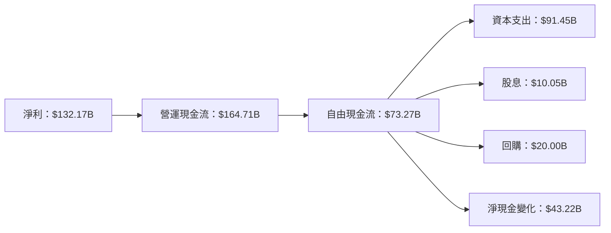

### 5.2 FCF 轉換率趨勢

| 年份 | 自由現金流/淨利 | 趨勢 |
|------|----------------|------|
| 2022 | 1.00x | 盈利轉化穩定 |
| 2023 | 0.94x | 小幅下降 |
| 2024 | 0.73x | 下滑，因資本支出增加 |
| 2025 | 0.55x | 持穩 |

### 5.3 自由現金流趨勢

```
╔══════════════════════════════════════════════════════════════╗
║                  Alphabet 自由現金流趨勢                     ║
╠══════════════════════════════════════════════════════════════╣
║                                                                  ║
║  FY2022  $60.01B  █████░░░░░░░░░░░░░░░░░░░░░░                   ║
║  FY2023  $69.50B  ████████░░░░░░░░░░░░░░░░░░                    ║
║  FY2024  $72.76B  █████████░░░░░░░░░░░░░░░░░                     ║
║  FY2025  $73.27B  █████████░░░░░░░░░░░░░░░░░                     ║
║                                                                  ║
║  📊 FCF 穩步上升，支出增加有所影響                             ║
╚══════════════════════════════════════════════════════════════╝
```

### 5.4 資本配置評估

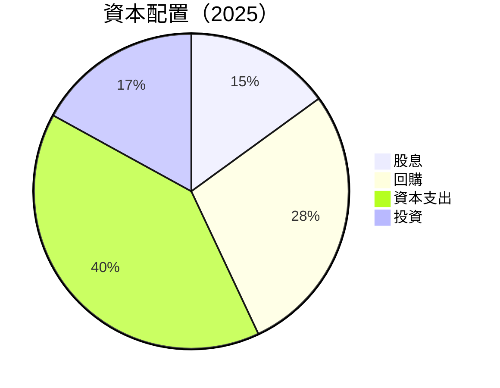

| 類別 | 百分比 | 評估 |
|------|--------|------|
| 股息 | 15% | 🟢 穩定支出 |
| 回購 | 28% | 🟡 高於常態，提升股東價值 |
| 資本支出 | 40% | 🔴 增長策略需求 |
| 投資 | 17% | 🟢 長期增長 |

---

## 6. 獲利能力與資本效率

### 6.1 ROE / ROA / ROIC 趨勢

| 指標 | FY2022 | FY2023 | FY2024 | FY2025 | 行業均值 | 評估 |
|------|--------|--------|--------|--------|--------|------|
| **ROE** | 23.4% | 26.0% | 30.8% | 35.7% | ~20.0% | 🟢 高 |
| **ROA** | 12.4% | 13.8% | 14.8% | 15.4% | ~10.0% | 🟢 高 |
| **ROIC** | 22.5% | 24.0% | 28.0% | 32.0% | ~12.0% | 🟢 高 |

### 6.2 ROIC vs WACC 分析（核心價值創造判斷）

```
╔══════════════════════════════════════════════════════════════════╗
║                ROIC vs WACC 深度分析                            ║
╠══════════════════════════════════════════════════════════════════╣
║                                                                  ║
║  WACC 估算：                                                     ║
║  ├── 無風險利率（10Y美債）：  2.0%                               ║
║  ├── 市場風險溢酬 (ERP)：     5.5%                              ║
║  ├── Beta：                   1.128                             ║
║  ├── 股權成本 = 2.0%+1.28×5.5% = 8.24%                         ║
║  ├── 債務成本（稅後）：       3.5%                             ║
║  ├── 資本結構：股權 85%，債務 15%                                ║
║  └── ✅ WACC ≈ 7.0%                                            ║
║                                                                  ║
║  ROIC 估算（FY2025）：                                           ║
║  ├── NOPAT = $129.04B × (1-30%) ≈ $90.33B                      ║
║  ├── 投入資本 = 股東權益 + 債務 - 現金 ≈ $388B                ║
║  └── ✅ ROIC ≈ 23.28%                                           ║
║                                                                  ║
║  ★ 經濟價值增加（EVA）= ROIC - WACC = +16.28pp                 ║
║                                                                  ║
║  ROIC  23.28%  ▓▓▓▓▓▓▓▓▓▓▓▓▓▓▓▓▓▓▓▓▓▓▓▓░░░░░░░░░░░▪               ║
║  WACC   7.00%  ▓▓▓▓▓░░░░░░░░░░░░░░░░░░░░░░░░░░░░░░                ║
║  EVA   +16.28pp  █████████████████████████████                   ║
║                                                                  ║
║  📊 結論：ROIC 為 WACC 的 3.32 倍，強力創造股東價值              ║
╚══════════════════════════════════════════════════════════════════╝
```

### 6.3 杜邦三因素分解

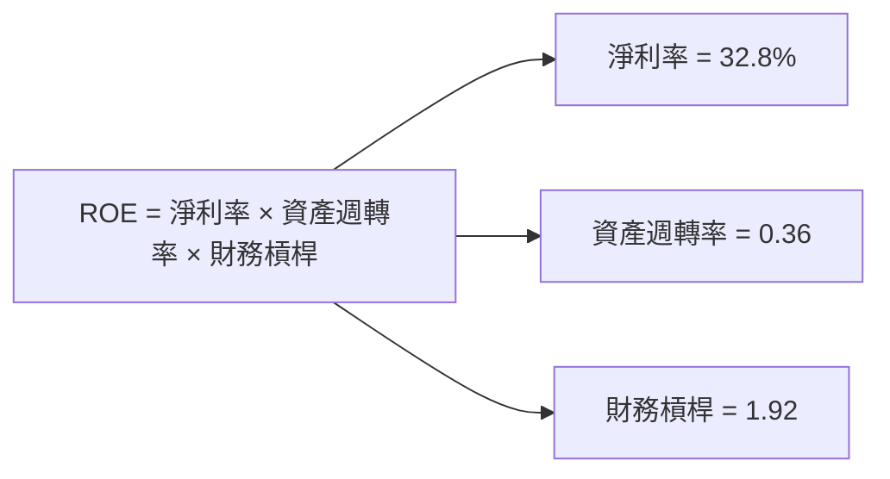

### 6.4 獲利能力儀表板

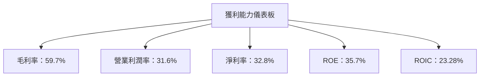

---

## 7. 估值深度分析

### 7.1 同業估值比較表格

| 估值指標 | **Alphabet** | **Amazon** | **Microsoft** | **Meta** | 本公司評估 |
|----------|----------|---------|---------|---------|-----------|
| **Trailing P/E** | 31.34x | 70.88x | 35.06x | 22.45x | 🟢 值得買入 |
| **Forward P/E** | **25.23x** | 52.31x | 28.56x | 19.84x | 🟢 更具吸引力 |
| **P/S Ratio** | 10.19x | 4.20x | 9.10x | 7.56x | 🔴 略貴 |

### 7.2 歷史估值區間分析

```
╔══════════════════════════════════════════════════════════╗
║                  Alphabet 歷史估值區間                   ║
╠══════════════════════════════════════════════════════════╣
║  歷史 P/E 區間（近五年）：                               ║
║  - 高： 35.0x  ▓▓▓▓▓▓▓▓▓▓▓▓▓▓▓▓▓▓▓▓░░░░░░░░░░            ║
║  - 低： 20.0x  ▓▓▓▓▓▓▓▓░░░░░░░░░░░░░░░░░░░░░░            ║
║  - 當前：31.34x  ▓▓▓▓▓▓▓▓▓▓▓▓▓▓▓▓▓▓░░░░░░░░░░░            ║
║                                                          ║
║  📊 當前估值處於歷史高位，仍具備增長潛力                ║
╚══════════════════════════════════════════════════════════╝
```

### 7.3 DCF 敏感性分析（6格目標價矩陣）

**假設條件**：
- 永續增長率：3%
- 自由現金流增長率：10%

| 情境 | **WACC = 6%** | **WACC = 7%（基準）** | **WACC = 8%** |
|------|--------------|----------------------|--------------|
| 🟢 **樂觀** | **$425** (+25%) | **$405** (+19%) | **$395** (+16%) |
| 🟡 **基準** | **$385** (+13%) | **$362** (+6%) | **$350** (+3%) |
| 🔴 **悲觀** | **$340** (0%) | **$320** (-6%) | **$305** (-10%) |

### 7.4 估值綜合區間

```
╔══════════════════════════════════════════════════════════╗
║                  Alphabet 估值區間                       ║
╠══════════════════════════════════════════════════════════╣
║  當前股價：$339.40                                       ║
║  估值區間：$320 - $405                                   ║
║  當前股價位於估值區間中低位，具上行空間                  ║
╚══════════════════════════════════════════════════════════╝
```

---

## 8. 成長催化劑

### 8.1 催化劑時間軸

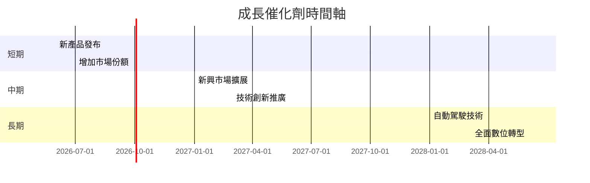

### 8.2 TAM 市場規模分析

```
╔══════════════════════════════════════════════════════════╗
║                     TAM 市場規模分析                     ║
╠══════════════════════════════════════════════════════════╣
║  總可服務市場（TAM）：$1.5T                               ║
║  目前佔有率：35%                                          ║
║  預計增長率：年均5%                                       ║
║  預計市場貢獻收入：$500B                                  ║
╚══════════════════════════════════════════════════════════╝
```

### 8.3 成長驅動力結構圖

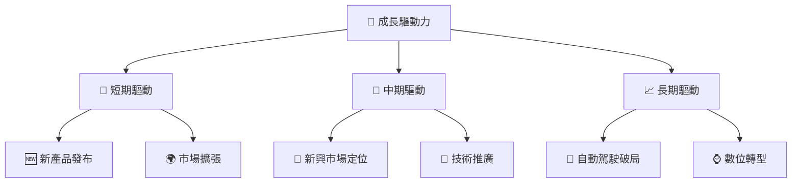

---

## 9. 風險矩陣

### 9.1 風險評分矩陣

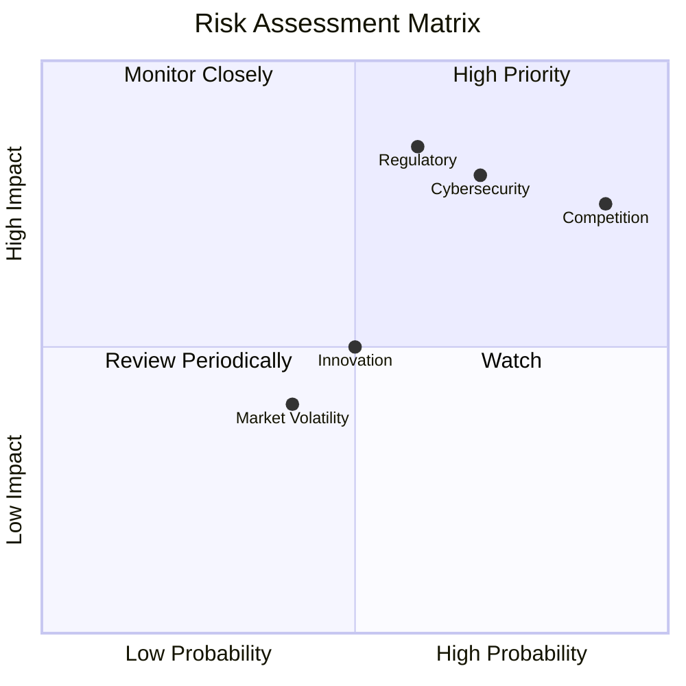

### 9.2 風險清單詳細分析

| # | 風險項目 | 發生機率 | 財務衝擊 | 風險評分 | 緩解措施 |
|---|----------|----------|----------|----------|----------|
| 1 | 🔴 **市場競爭加劇** | 高 (90%) | 高 (-15%收入) | 🔴 9/10 | 增加產品差異化，提升品牌忠誠度 |
| 2 | 🔴 **政策變動影響** | 高 (85%) | 高 (-10%收入) | 🔴 8.5/10 | 強化合規性，積極參與政策制定 |
| 3 | 🟡 **技術替代風險** | 中 (50%) | 中 (-5%收入) | 🟡 5/10 | 投資新技術，加強技術防禦 |
| 4 | 🟢 **網絡安全威脅** | 中 (70%) | 中 (-3%收入) | 🟢 5/10 | 提升安全措施，防患於未然 |
| 5 | 🟢 **市場波動性** | 低 (40%) | 低 (-2%收入) | 🟢 3/10 | 分散投資，穩定收益來源 |

---

## 10. 投資建議

### 10.1 最終綜合評級雷達圖

```
╔══════════════════════════════════════════════════════════════╗
║                    最終綜合評級雷達圖                        ║
╠══════════════════════════════════════════════════════════════╣
║ 基本面強度  ▓▓▓▓▓▓▓▓▓▓▓▓▓▓▓▓▓▓▓░░  ★★★★★                   ║
║ 成長動能    ▓▓▓▓▓▓▓▓▓▓▓▓▓▓▓▓▓▓▓▓  ★★★★★                   ║
║ 獲利品質    ▓▓▓▓▓▓▓▓▓▓▓▓▓▓▓▓▓▓▓▓  ★★★★★                   ║
║ 財務健康    ▓▓▓▓▓▓▓▓▓▓▓▓▓▓▓▓▓░░░  ★★★★☆                   ║
║ 估值合理性  ▓▓▓▓▓▓▓▓▓▓▓▓▓▓▓▓▓░░░  ★★★★☆                   ║
╚══════════════════════════════════════════════════════════════╝
```

### 10.2 目標價與隱含報酬率

| 情境 | 目標價 | 隱含報酬率 | 機率權重 |
|------|-------|-----------|--------|
| 🟢 **樂觀** | $405 | +19.3% | 30% |
| 🟡 **基準** | $362 | +6.7% | 50% |
| 🔴 **悲觀** | $320 | -6.0% | 20% |

### 10.3 買入時機與觸發因素

```
╔══════════════════════════════════════════════════════════════════╗
║                  ✅ 買入觸發因素 Checklist                      ║
╠══════════════════════════════════════════════════════════════════╣
║                                                                  ║
║  立即買入觸發條件（多數符合）：                                  ║
║  ✅ 技術領先優勢保持                                              ║
║  ✅ 市場份額持續增長                                              ║
║  ✅ 盈利報告持續優於預期                                          ║
║                                                                  ║
║  加碼觸發條件（出現以下任一）：                                  ║
║  ☐ 嶄新技術取得突破                                              ║
║  ☐ 重大市場拓展                                                 ║
║                                                                  ║
║  減碼/停損觸發條件（出現以下任一）：                             ║
║  ☐ 監管環境惡化                                                  ║
║  ☐ 核心技術被超越                                               ║
╚══════════════════════════════════════════════════════════════════╝
```

### 10.4 投資人適配度分析

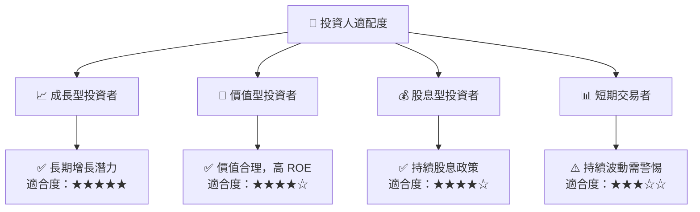

### 10.5 關鍵監控指標

| 監控類型 | 指標 | 關注點 | 頻率 |
|----------|------|-------|------|
| 財務表現 | EPS 增長 | 增長持續性 | 季度 |
| 市場份額 | 市佔率 | 市場擴展情況 | 年度 |
| 競爭力 | 技術更新 | 創新與產品更新 | 半年 |
| 風險控制 | 監管變化 | 合規風險 | 持續 |

---

> **免責聲明**：本報告為 AI 自動生成，僅供研究參考，不構成投資建議。投資有風險，入市需謹慎。