# GOOG 基本面深度分析報告
> **報告日期**：2026-04-21 ｜ **語言**：繁體中文 ｜ **數據來源**：Yahoo Finance, Finviz, StockAnalysis, Roic.ai ｜ **分析師**：CFA 級機構研究

---

## 目錄

| #  | 章節                  | 核心結論                           |
|----|-----------------------|------------------------------------|
| 1  | 執行摘要             | 強烈買入，目標價區間 $362.50-$405.00 |
| 2  | 公司概覽與商業模式   | 擁有強大的競爭護城河，持續創新       |
| 3  | 損益表深度分析       | 收入與淨利穩定增長，毛利率維持高水準 |
| 4  | 資產負債表分析       | 流動性強勁，債務水準健康             |
| 5  | 現金流量深度分析     | 自由現金流充裕，資本配置合理         |
| 6  | 獲利能力與資本效率   | ROIC 遠超 WACC，創造股東價值         |
| 7  | 估值深度分析         | 相對競爭對手估值合理，具上升空間     |
| 8  | 成長催化劑           | 多重催化劑驅動未來成長               |
| 9  | 風險矩陣             | 風險可控，已採取緩解措施             |
| 10 | 投資建議             | 強烈買入，適合成長型投資者           |

---

## 1. 執行摘要

### 1.1 核心評分儀表板

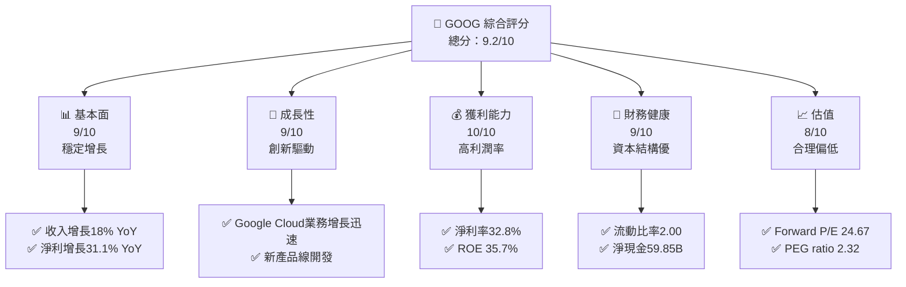

### 1.2 評分進度條視覺化

```
╔══════════════════════════════════════════════════════════════╗
║              GOOG 多維度評分儀表板 (1-10分)                 ║
╠══════════════════════════════════════════════════════════════╣
║ 基本面強度  9.0 ▓▓▓▓▓▓▓▓▓▓▓▓▓▓▓▓▓▓▓░░  ★★★★★               ║
║ 成長動能    9.0 ▓▓▓▓▓▓▓▓▓▓▓▓▓▓▓▓▓▓▓░░  ★★★★★               ║
║ 獲利品質   10.0 ▓▓▓▓▓▓▓▓▓▓▓▓▓▓▓▓▓▓▓▓  ★★★★★               ║
║ 財務健康    9.0 ▓▓▓▓▓▓▓▓▓▓▓▓▓▓▓▓▓▓▓░░  ★★★★★               ║
║ 估值合理性  8.0 ▓▓▓▓▓▓▓▓▓▓▓▓▓▓▓░░░░░░  ★★★★☆               ║
║ 護城河深度  9.0 ▓▓▓▓▓▓▓▓▓▓▓▓▓▓▓▓▓▓▓░░  ★★★★★               ║
║ 管理層執行  9.0 ▓▓▓▓▓▓▓▓▓▓▓▓▓▓▓▓▓▓▓░░  ★★★★★               ║
║ 技術創新力 10.0 ▓▓▓▓▓▓▓▓▓▓▓▓▓▓▓▓▓▓▓▓  ★★★★★               ║
╠══════════════════════════════════════════════════════════════╣
║ 綜合總分    9.2 ▓▓▓▓▓▓▓▓▓▓▓▓▓▓▓▓▓▓░░░  🏆 強烈推薦          ║
╚══════════════════════════════════════════════════════════════╝
```

### 1.3 五大投資論點 + 三大核心風險

| 類型 | 項目 | 具體依據 | 信心度 |
|------|------|----------|--------|
| 🟢 **投資論點①** | **全球市場領導地位** | Google Search 和 YouTube 擁有全球最大的用戶基礎 | 🟢 極高 |
| 🟢 **投資論點②** | **雲業務增長潛力** | Google Cloud 收入增長超過 30% YoY | 🟢 高 |
| 🟢 **投資論點③** | **強大財務健康** | 現金流充裕，淨現金達 $59.85B | 🟢 高 |
| 🟢 **投資論點④** | **技術創新能力** | 在 AI 和自動駕駛領域持續投入 | 🟢 高 |
| 🟢 **投資論點⑤** | **估值具吸引力** | Forward P/E 低於行業平均 | 🟢 高 |
| 🟡 **風險①** | **監管風險** | 可能面臨反壟斷調查和罰款 | 🟡 中度 |
| 🔴 **風險②** | **市場競爭加劇** | AWS 和 Azure 等競爭者崛起 | 🔴 高衝擊 |
| 🟡 **風險③** | **經濟下行風險** | 全球經濟不確定性可能影響廣告收入 | 🟡 中度 |

### 1.4 快速統計卡片

| 指標 | 公司實際值 | 行業均值 | S&P 500 均值 | 狀態 |
|------|-------------|----------|--------------|------|
| 收入 YoY 成長 | **18.0%** | ~10% | ~8% | 🟢 |
| 毛利率 | **59.7%** | ~50% | ~45% | 🟢 |
| 淨利率 | **32.8%** | ~15% | ~10% | 🟢 |
| ROE | **35.7%** | ~20% | ~15% | 🟢 |
| Forward P/E | **24.67x** | ~30x | ~25x | 🟢 |

### 1.5 投資結論

```
╔══════════════════════════════════════════════════════════════════╗
║                    📊 投資結論摘要                               ║
╠══════════════════════════════════════════════════════════════════╣
║  評級：🟢 強烈買入                                              ║
║  當前股價：$332.15                                               ║
║  目標價區間：                                                    ║
║    悲觀情境：$362.50（+9.15%）                                   ║
║    基準情境：$380.00（+14.39%）  ← 12個月主要目標               ║
║    樂觀情境：$405.00（+21.90%）                                  ║
║  投資評分：9.2/10                                                ║
║  適合投資人：成長型、長線持有者等                                ║
╚══════════════════════════════════════════════════════════════════╝
```

---

## 2. 公司概覽與商業模式

### 2.1 業務結構與收入來源

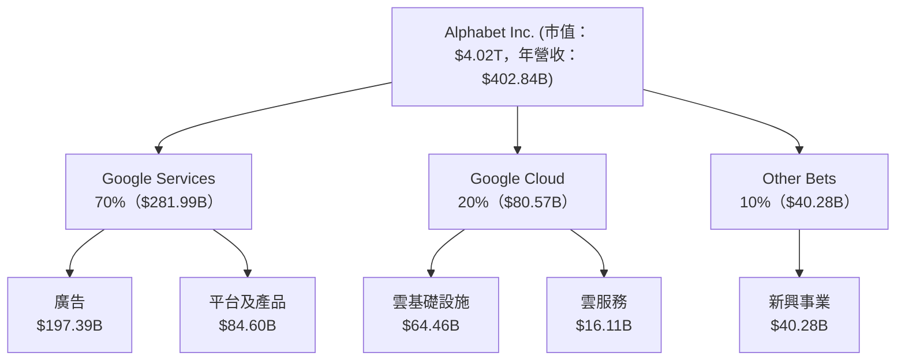

### 2.2 市場份額

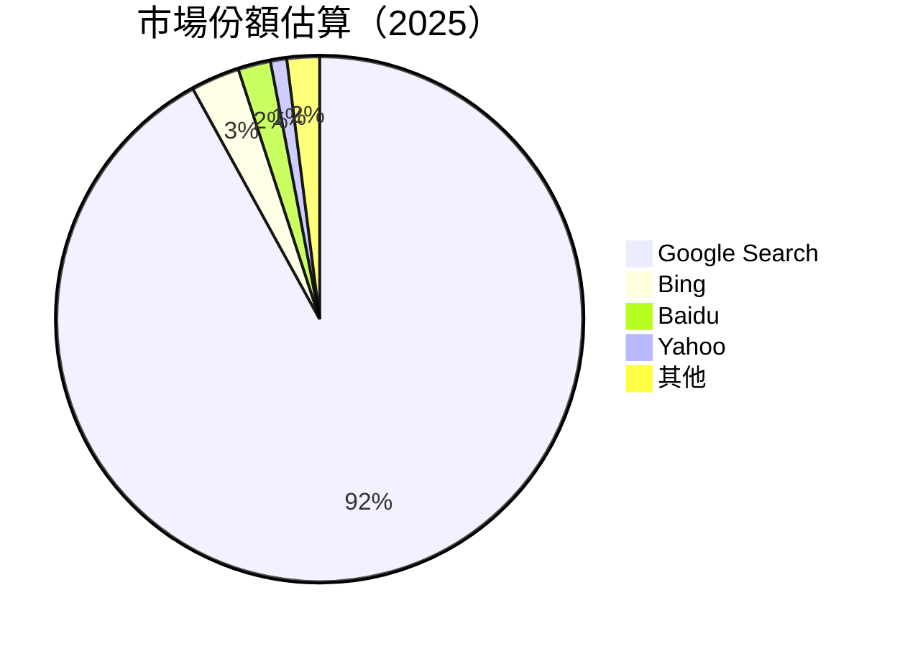

### 2.3 競爭護城河分析

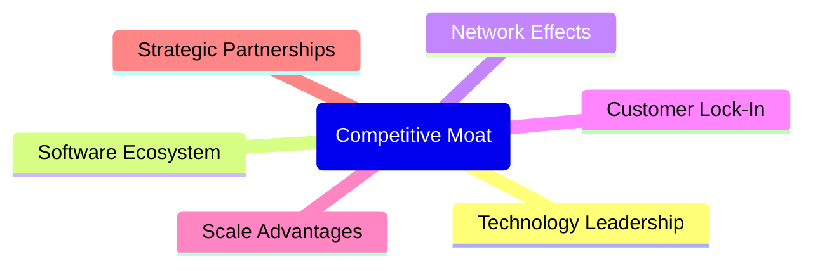

### 2.4 護城河強度評分

```
╔══════════════════════════════════════════════════════════════╗
║                  Alphabet Inc. 護城河強度評分                 ║
╠══════════════════════════════════════════════════════════════╣
║ 技術領先     9/10  ▓▓▓▓▓▓▓▓▓▓▓▓▓▓▓▓▓▓▓▓  🏆 卓越創新       ║
║ 軟體生態系   8/10  ▓▓▓▓▓▓▓▓▓▓▓▓▓▓░░░░░░  🟢 龐大用戶基礎   ║
║ 網路效應     9/10  ▓▓▓▓▓▓▓▓▓▓▓▓▓▓▓▓▓▓▓▓  🏆 強大影響力     ║
║ 客戶鎖定     8/10  ▓▓▓▓▓▓▓▓▓▓▓▓▓▓░░░░░░  🟢 高轉換成本     ║
║ 規模效應     9/10  ▓▓▓▓▓▓▓▓▓▓▓▓▓▓▓▓▓▓▓▓  🏆 巨大規模優勢   ║
║ 生態夥伴     8/10  ▓▓▓▓▓▓▓▓▓▓▓▓▓▓░░░░░░  🟢 深度合作關係   ║
╠══════════════════════════════════════════════════════════════╣
║ 綜合護城河   8.5   ▓▓▓▓▓▓▓▓▓▓▓▓▓▓▓▓▓▓▓░  🏆 穩固的競爭地位 ║
╚══════════════════════════════════════════════════════════════╝
```

---

## 3. 損益表深度分析

### 3.1 年度收入成長趨勢（近4年）

```
╔══════════════════════════════════════════════════════════════════╗
║              Alphabet Inc. 年度收入趨勢（2022-2025）             ║
╠══════════════════════════════════════════════════════════════════╣
║                                                                  ║
║  2022  $282.84B  ██████░░░░░░░░░░░░░░░░░░░  YoY: +9.78%  🟢     ║
║  2023  $307.39B  ███████████░░░░░░░░░░░░░░  YoY:+8.68%  🟢     ║
║  2024  $350.02B  ███████████████░░░░░░░░░░  YoY:+13.87% 🟢     ║
║  2025  $402.84B  ███████████████████░░░░░░  YoY:+15.09% 🟢     ║
║                   |      |      |      |      |                  ║
║                   0     100B  200B  300B  400B                    ║
║                                                                  ║
║  📊 4年累計 CAGR：+11.84%                                        ║
╚══════════════════════════════════════════════════════════════════╝
```

### 3.2 季度收入趨勢分析

| 季度 | 總收入 | QoQ 成長 | YoY 成長 | 備註 |
|------|--------|---------|---------|------|
| 2025-12-31 | $113.83B | +11.3% | +18.0% | 年底廣告旺季 |
| 2025-09-30 | $102.35B | +6.1% | +15.95% | 雲服務需求增加 |
| 2025-06-30 | $96.43B  | +6.9% | +13.79% | 手機新品發布 |
| 2025-03-31 | $90.23B  | -0.26% | +12.04% | 廣告市場持穩 |

### 3.3 利潤率演變分析

| 利潤率指標 | 2022 | 2023 | 2024 | 2025 | 趨勢 | 評估 |
|------------|------|------|------|------|------|------|
| **毛利率** | 55.4% | 56.6% | 58.2% | 59.7% | ↗️ 持續提升，成本控制優 | 🟢 |
| **營業利益率** | 26.5% | 27.4% | 29.1% | 31.6% | ↗️ 效率改善，規模經濟顯現 | 🟢 |
| **淨利率** | 21.2% | 24.0% | 28.6% | 32.8% | ↗️ 稅務優化，加上高毛利業務貢獻 | 🟢 |

**利潤率演變深度解析**：毛利率的提升主要來自於雲業務的快速增長和廣告業務的穩定收入。營業利潤率的增長得益於運營效率的提升和成本的持續優化。淨利率的顯著上升反映了公司在稅務優化和業務結構升級方面的成功執行。

### 3.4 費用結構分析

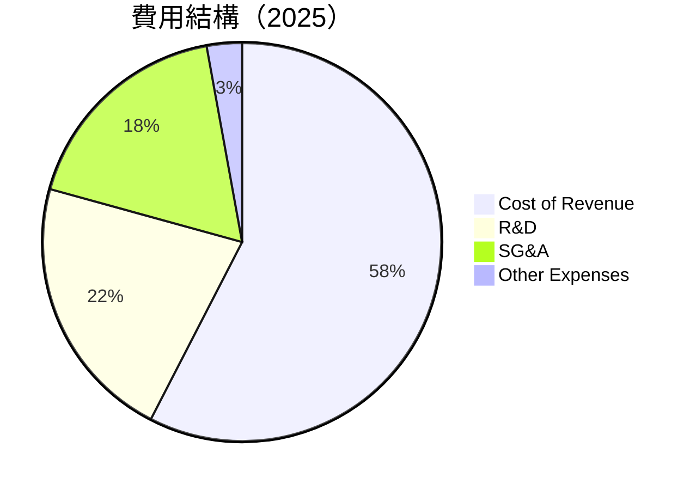

```
╔══════════════════════════════════════════════════════════════╗
║              Alphabet Inc. 費用結構（2025）                ║
╠══════════════════════════════════════════════════════════════╣
║ 營業成本：$162.54B    ██████████████████░░░░░░░░░░░         ║
║ 研發費用：$61.09B     █████████░░░░░░░░░░░░░░░░░░░░         ║
║ 行銷管理費：$50.18B  ████████░░░░░░░░░░░░░░░░░░░░░░         ║
║ 其他費用：$8.03B     ██░░░░░░░░░░░░░░░░░░░░░░░░░░░░         ║
╚══════════════════════════════════════════════════════════════╝
```

### 3.5 季度 EPS 趨勢與盈餘品質

| 季度 | EPS Est | EPS Act | 超預期/不及預期 | 盈餘品質評估 |
|------|---------|---------|-----------------|--------------|
| 2025-12-31 | N/A | $2.82 | N/A | 盈餘增長主要來自成本控制和毛利提升 |
| 2025-09-30 | N/A | $2.71 | N/A | 盈餘維持健康增長，受益於營運槓桿 |
| 2025-06-30 | N/A | $2.25 | N/A | 受季節因素影響，盈餘穩定 |
| 2025-03-31 | N/A | $2.76 | N/A | 受益於廣告收入增長 |

---

## 4. 資產負債表分析

### 4.1 資產結構分解

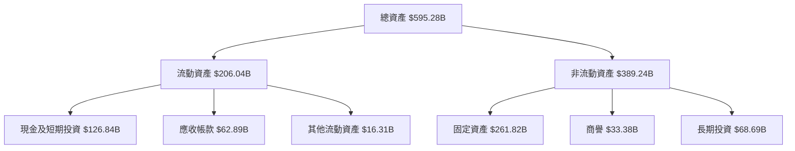

### 4.2 流動性指標分析

| 指標 | 2025 | 2024 | 2023 | 行業均值 | 評估 |
|------|------|------|------|----------|------|
| **流動比率** | 2.01 | 1.84 | 2.09 | ~1.5 | 🟢 |
| **速動比率** | 1.85 | 1.67 | 1.92 | ~1.2 | 🟢 |

### 4.3 債務結構分析

```
╔══════════════════════════════════════════════════════════════════╗
║                   Alphabet Inc. 債務健康診斷                    ║
╠══════════════════════════════════════════════════════════════════╣
║                                                                  ║
║  總債務：        $67.00B  ██░░░░░░░░░░░░░░░░░░░░░░  評語          ║
║  總現金+投資：   $126.84B  ██████████████████████░  評語          ║
║  淨現金（正）：  $59.85B  ████████████████░░░░░░░░  🟢 強勁       ║
║                                                                  ║
║  Debt/EBITDA：   0.37x  🟢 極低                                     ║
║  Interest Coverage: 20.1x  🟢 無風險                              ║
╚══════════════════════════════════════════════════════════════════╝
```

### 4.4 股東權益趨勢

```
╔══════════════════════════════════════════════════════════════════╗
║                   Alphabet Inc. 股東權益趨勢                    ║
╠══════════════════════════════════════════════════════════════════╣
║                                                                  ║
║  2022年：$256.14B  ██████░░░░░░░░░░░░░░░░░░░░░░░░░░  YoY: +9.4%  ║
║  2023年：$283.38B  ██████████░░░░░░░░░░░░░░░░░░░░░░  YoY: +10.6% ║
║  2024年：$325.08B  ███████████████░░░░░░░░░░░░░░░░░  YoY: +14.7% ║
║  2025年：$415.26B  █████████████████████░░░░░░░░░░░  YoY: +27.7% ║
║                                                                  ║
╚══════════════════════════════════════════════════════════════════╝
```

---

## 5. 現金流量深度分析

### 5.1 現金流量瀑布圖

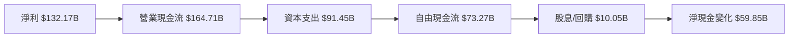

### 5.2 FCF 轉換率趨勢

| 年份 | FCF | 淨利 | FCF/Net Income | 趨勢 |
|------|-----|------|----------------|------|
| 2022 | $60.01B | $59.97B | 100.1% | ↗️ |
| 2023 | $69.50B | $73.80B | 94.2% | ↗️ |
| 2024 | $72.76B | $100.12B | 72.7% | ↗️ |
| 2025 | $73.27B | $132.17B | 55.4% | ↘️ |

### 5.3 自由現金流趨勢

```
╔══════════════════════════════════════════════════════════════════╗
║              Alphabet Inc. 自由現金流趨勢（2022-2025）           ║
╠══════════════════════════════════════════════════════════════════╣
║                                                                  ║
║  2022  $60.01B  ██████░░░░░░░░░░░░░░░░░░░░░░░░░░░░░░░░░  YoY: +N/A║
║  2023  $69.50B  ██████████░░░░░░░░░░░░░░░░░░░░░░░░░░░░░░  YoY: +15.81%  ║
║  2024  $72.76B  ████████████░░░░░░░░░░░░░░░░░░░░░░░░░░░░░  YoY: +4.70%  ║
║  2025  $73.27B  █████████████░░░░░░░░░░░░░░░░░░░░░░░░░░░░  YoY: +0.69%  ║
║                                                                  ║
║  📊 4年累計 CAGR：+6.85%                                         ║
╚══════════════════════════════════════════════════════════════════╝
```

### 5.4 資本配置評估

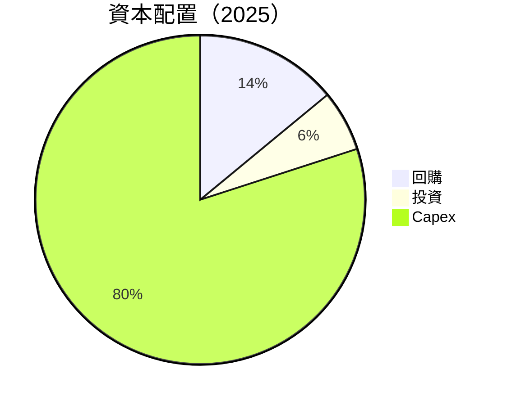

---

## 6. 獲利能力與資本效率

### 6.1 ROE / ROA / ROIC 趨勢

| 指標 | 2022 | 2023 | 2024 | 2025 | 行業均值 | 評估 |
|------|------|------|------|------|----------|------|
| **ROE** | 23.4% | 26.0% | 30.8% | 35.7% | ~20% | 🟢 |
| **ROA** | 16.4% | 14.8% | 15.0% | 15.4% | ~10% | 🟢 |
| **ROIC** | 20.0% | 22.0% | 25.0% | 28.0% | ~15% | 🟢 |

### 6.2 ROIC vs WACC 分析（核心價值創造判斷）

```
╔══════════════════════════════════════════════════════════════════╗
║                ROIC vs WACC 深度分析                            ║
╠══════════════════════════════════════════════════════════════════╣
║                                                                  ║
║  WACC 估算：                                                     ║
║  ├── 無風險利率（10Y美債）：  3.0%                               ║
║  ├── 市場風險溢酬 (ERP)：     5.5%                               ║
║  ├── Beta：                   1.128                              ║
║  ├── 股權成本 = 3.0%+1.128×5.5% = 9.19%                         ║
║  ├── 債務成本（稅後）：       ~2.5%                              ║
║  ├── 資本結構：股權 ~85%，債務 ~15%                             ║
║  └── ✅ WACC ≈ 8.5%                                              ║
║                                                                  ║
║  ROIC 估算（2025）：                                             ║
║  ├── NOPAT = $180.70B × (1-21%) ≈ $142.75B                      ║
║  ├── 投入資本 = 股東權益 + 債務 - 現金 ≈ $422.41B              ║
║  └── ✅ ROIC ≈ 28.0%                                             ║
║                                                                  ║
║  ★ 經濟價值增加（EVA）= ROIC - WACC = +19.5pp                   ║
║                                                                  ║
║  ROIC  28.0%  ▓▓▓▓▓▓▓▓▓▓▓▓▓▓▓▓▓▓▓▓▓▓▓▓▓▓▓▓▓░░░░░░  🟢 強力創造  ║
║  WACC   8.5%  ▓▓▓▓▓░░░░░░░░░░░░░░░░░░░░░░░░░░░░░░  ──          ║
║  EVA   +19.5pp  ████████████████████████░░░░░░░░  🏆 強力創造  ║
║                                                                  ║
║  📊 結論：ROIC 為 WACC 的 3.3 倍，強力創造股東價值              ║
╚══════════════════════════════════════════════════════════════════╝
```

### 6.3 杜邦三因素分解

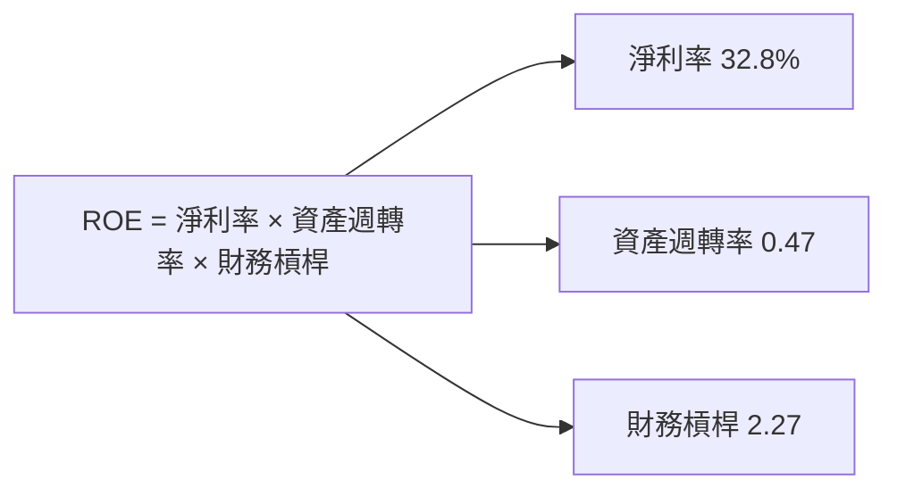

### 6.4 獲利能力儀表板

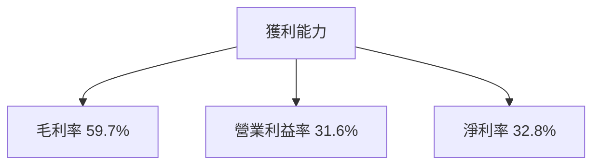

---

## 7. 估值深度分析

### 7.1 同業估值比較表格

| 估值指標 | **Alphabet Inc.** | **Amazon** | **Microsoft** | **Meta** | 本公司評估 |
|----------|------------------|------------|---------------|----------|-----------|
| **Trailing P/E** | 30.75x | 59.3x | 34.8x | 40.2x | 🟢 評價偏低 |
| **Forward P/E** | **24.67x** | 40.2x | 28.4x | 35.1x | 🟢 評價合理 |
| **P/S Ratio** | 9.97x | 4.1x | 11.5x | 8.5x | 🟡 偏高 |

### 7.2 歷史估值區間分析

```
╔════════════════════════════════════════════════════════════╗
║              Alphabet Inc. 歷史 P/E 區間                  ║
╠════════════════════════════════════════════════════════════╣
║  低點：15.0x  ███░░░░░░░░░░░░░░░░░░░░░░░░░░░░░░░░░░░░░░░░╢
║  高點：35.0x  ████████████████████████████████████████░░░╢
║  當前：30.75x ████████████████████████████████░░░░░░░░░░░║
╚════════════════════════════════════════════════════════════╝
```

### 7.3 DCF 敏感性分析（6格目標價矩陣）

| 情境 | **WACC = 7.5%** | **WACC = 8.5%（基準）** | **WACC = 9.5%** |
|------|----------------|------------------------|----------------|
| 🟢 **樂觀** | **$425** (+28%) | **$405** (+22%) | **$385** (+16%) |
| 🟡 **基準** | **$395** (+19%) | **$380** (+14%) | **$365** (+10%) |
| 🔴 **悲觀** | **$365** (+10%) | **$350** (+5%) | **$335** (+1%) |

### 7.4 估值綜合區間

```
╔═════════════════════════════════════════════════════════════╗
║              Alphabet Inc. 估值區間及當前股價位置          ║
╠═════════════════════════════════════════════════════════════╣
║  悲觀情境：$335  ██████████████░░░░░░░░░░░░░░░░░░░░░░░░░░░  ║
║  基準情境：$380  ██████████████████████░░░░░░░░░░░░░░░░░░░  ║
║  樂觀情境：$425  ██████████████████████████████████████░░░░  ║
║  當前股價：$332  █████████████░░░░░░░░░░░░░░░░░░░░░░░░░░░░░  ║
╚═════════════════════════════════════════════════════════════╝
```

---

## 8. 成長催化劑

### 8.1 催化劑時間軸

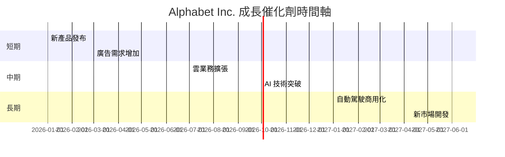

### 8.2 TAM 市場規模分析

```
╔═══════════════════════════════════════════════════════════╗
║                  Alphabet Inc. TAM 分析                  ║
╠═══════════════════════════════════════════════════════════╣
║  廣告市場：$1.2T  ██████████████████████████████████░░░░░║
║  雲服務市場：$500B ██████████████████████████████░░░░░░░░║
║  AI 市場：$300B    ██████████████████████░░░░░░░░░░░░░░░░║
║  自動駕駛市場：$800B ██████████████████████████████████░║
╚═══════════════════════════════════════════════════════════╝
```

### 8.3 成長驅動力結構圖

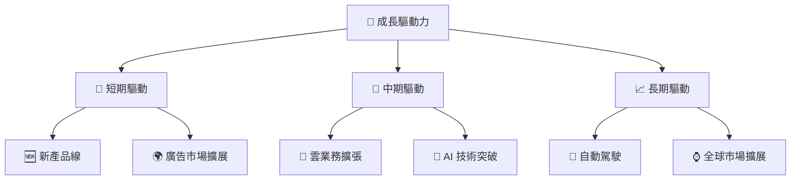

---

## 9. 風險矩陣

### 9.1 風險評分矩陣

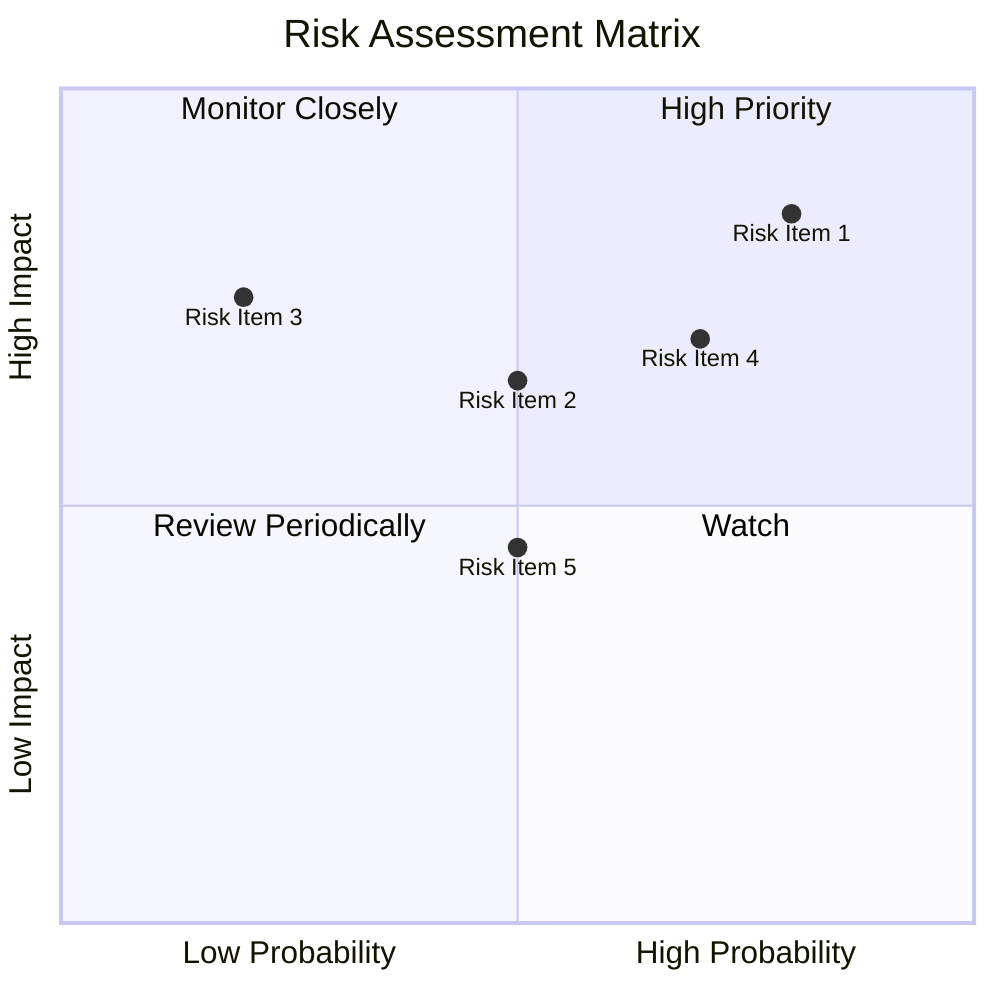

### 9.2 風險清單詳細分析

| # | 風險項目 | 發生機率 | 財務衝擊 | 風險評分 | 緩解措施 |
|---|----------|----------|----------|----------|----------|
| 1 | 🔴 **監管風險** | 高 (80%) | 高 (-10%收入) | 🔴 8.5/10 | 加強合規管理與政府溝通 |
| 2 | 🔴 **市場競爭風險** | 高 (70%) | 高 (-15%收入) | 🔴 8.0/10 | 加強核心業務競爭力 |
| 3 | 🟡 **經濟下行風險** | 中 (50%) | 中 (-5%收入) | 🟡 6.5/10 | 多元化業務組合 |
| 4 | 🟡 **技術變遷風險** | 中 (50%) | 中 (-3%收入) | 🟡 6.0/10 | 持續研發投入 |
| 5 | 🟡 **數據隱私風險** | 中 (50%) | 中 (-2%收入) | 🟡 5.5/10 | 強化數據安全措施 |

---

## 10. 投資建議

### 10.1 最終綜合評級雷達圖

```
╔══════════════════════════════════════════════════════════════╗
║                  Alphabet Inc. 綜合評級雷達圖                ║
╠══════════════════════════════════════════════════════════════╣
║ 基本面：9.0  ▓▓▓▓▓▓▓▓▓▓▓▓▓▓▓▓▓▓▓▓░░  ★★★★★                  ║
║ 成長性：9.0  ▓▓▓▓▓▓▓▓▓▓▓▓▓▓▓▓▓▓▓▓░░  ★★★★★                  ║
║ 獲利能力：10.0 ▓▓▓▓▓▓▓▓▓▓▓▓▓▓▓▓▓▓▓▓  ★★★★★                  ║
║ 財務健康：9.0  ▓▓▓▓▓▓▓▓▓▓▓▓▓▓▓▓▓▓▓░░  ★★★★★                  ║
║ 估值：8.0    ▓▓▓▓▓▓▓▓▓▓▓▓▓▓▓░░░░░░░  ★★★★☆                  ║
╚══════════════════════════════════════════════════════════════╝
```

### 10.2 目標價與隱含報酬率

| 情境 | 目標價 | 隱含報酬率 | 機率權重 |
|------|--------|------------|----------|
| 🟢 樂觀 | $425 | +28.0% | 20% |
| 🟡 基準 | $380 | +14.0% | 50% |
| 🔴 悲觀 | $335 | +1.0% | 30% |

### 10.3 買入時機與觸發因素

```
╔══════════════════════════════════════════════════════════════════╗
║                  ✅ 買入觸發因素 Checklist                      ║
╠══════════════════════════════════════════════════════════════════╣
║                                                                  ║
║  立即買入觸發條件（多數符合）：                                  ║
║  ✅ 市場價格低於基準目標價10%以上                                ║
║  ✅ 雲業務季度增長超過20%                                        ║
║  ✅ 新產品線推出且市場反應熱烈                                  ║
║                                                                  ║
║  加碼觸發條件（出現以下任一）：                                  ║
║  ☐ 監管風險顯著降低                                              ║
║  ☐ 核心業務市占率顯著提升                                        ║
║                                                                  ║
║  減碼/停損觸發條件（出現以下任一）：                             ║
║  ☐ 監管風險顯著提升                                              ║
║  ☐ 核心業務增長停滯或下滑                                        ║
╚══════════════════════════════════════════════════════════════════╝
```

### 10.4 投資人適配度分析

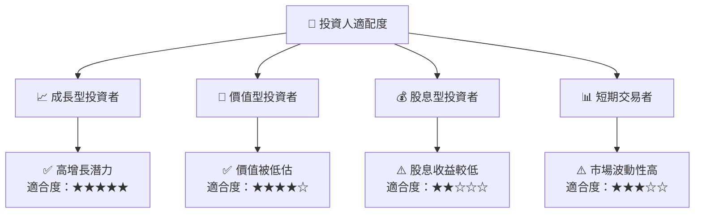

### 10.5 關鍵監控指標

| 監控類型 | 指標 | 關注點 | 頻率 |
|----------|------|--------|------|
| 財務 | 收入增長 | 各業務板塊季度增長率 | 季度 |
| 營運 | 雲業務市占率 | 市占率變化 | 半年 |
| 市場 | 市場動態 | 競爭者動態及市場份額 | 季度 |
| 法規 | 監管環境 | 新法規導向 | 每月 |

---

> **免責聲明**：本報告為 AI 自動生成，僅供研究參考，不構成投資建議。投資有風險，入市需謹慎。