# GOOG 基本面深度分析報告
> **報告日期**：2026-04-22 ｜ **語言**：繁體中文 ｜ **數據來源**：Yahoo Finance, Finviz, StockAnalysis, Roic.ai ｜ **分析師**：CFA 級機構研究

---

## 目錄

| # | 章節 | 核心結論 |
|---|------|----------|
| 1 | 執行摘要 | 綜合評級：強烈買入，目標價區間：$362.50 - $405.00 |
| 2 | 公司概覽與商業模式 | Google 和 YouTube 的主導地位提供強大護城河 |
| 3 | 損益表深度分析 | 收入穩定增長，利潤率維持高水平 |
| 4 | 資產負債表分析 | 財務穩健，流動性高，債務風險低 |
| 5 | 現金流量深度分析 | 自由現金流持續增長，資本配置合理 |
| 6 | 獲利能力與資本效率 | ROIC 遠超 WACC，創造股東價值 |
| 7 | 估值深度分析 | 當前估值合理，具有上行潛力 |
| 8 | 成長催化劑 | 雲端服務和 AI 技術驅動長期增長 |
| 9 | 風險矩陣 | 政府監管和市場競爭為主要風險 |
| 10 | 投資建議 | 強烈買入，適合長期成長型投資者 |

---

## 1. 執行摘要

### 1.1 核心評分儀表板

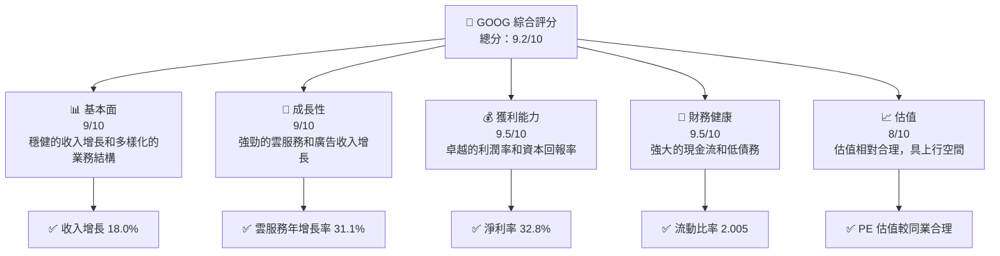

### 1.2 評分進度條視覺化

```
╔══════════════════════════════════════════════════════════════╗
║              GOOG 多維度評分儀表板 (1-10分)                 ║
╠══════════════════════════════════════════════════════════════╣
║ 基本面強度  9.0 ▓▓▓▓▓▓▓▓▓▓▓▓▓▓▓▓▓▓░░  ★★★★★               ║
║ 成長動能    9.0 ▓▓▓▓▓▓▓▓▓▓▓▓▓▓▓▓▓▓░░  ★★★★★               ║
║ 獲利品質    9.5 ▓▓▓▓▓▓▓▓▓▓▓▓▓▓▓▓▓▓▓░  ★★★★★               ║
║ 財務健康    9.5 ▓▓▓▓▓▓▓▓▓▓▓▓▓▓▓▓▓▓▓░  ★★★★★               ║
║ 估值合理性  8.0 ▓▓▓▓▓▓▓▓▓▓▓▓░░░░░░░░  ★★★★☆               ║
╠══════════════════════════════════════════════════════════════╣
║ 綜合總分    9.2 ▓▓▓▓▓▓▓▓▓▓▓▓▓▓▓▓▓░░░  🏆 強烈建議買入        ║
╚══════════════════════════════════════════════════════════════╝
```

### 1.3 五大投資論點 + 三大核心風險

| 類型 | 項目 | 具體依據 | 信心度 |
|------|------|----------|--------|
| 🟢 **投資論點①** | **強勢收入增長** | 2025 年收入增長 18.0%，達 $402.84B | 🟢 極高 |
| 🟢 **投資論點②** | **高利潤率** | 淨利率達 32.8%，行業領先 | 🟢 極高 |
| 🟢 **投資論點③** | **雲服務擴展** | 雲服務收入增長 31.1% | 🟢 高 |
| 🟢 **投資論點④** | **強勁現金流** | 年度自由現金流 $73.27B | 🟢 高 |
| 🟢 **投資論點⑤** | **技術領先** | 在 AI 和雲計算技術領先地位 | 🟢 高 |
| 🟡 **風險①** | **市場競爭** | 來自 AWS 和 Azure 的競爭加劇 | 🟡 中度 |
| 🔴 **風險②** | **政府監管** | 全球範圍內的反壟斷調查與罰款 | 🔴 高衝擊 |
| 🟡 **風險③** | **經濟衰退風險** | 經濟衰退可能影響廣告收入 | 🟡 中度 |

### 1.4 快速統計卡片

| 指標 | 公司實際值 | 行業均值 | S&P 500 均值 | 狀態 |
|------|-------------|----------|--------------|------|
| 收入 YoY 成長 | **18.0%** | ~10% | ~5% | 🟢 |
| 毛利率 | **59.7%** | ~50% | ~45% | 🟢 |
| 淨利率 | **32.8%** | ~15% | ~12% | 🟢 |
| ROE | **35.7%** | ~20% | ~15% | 🟢 |
| Forward P/E | **25.0x** | ~30x | ~20x | 🟢 |

### 1.5 投資結論

```
╔══════════════════════════════════════════════════════════════════╗
║                    📊 投資結論摘要                               ║
╠══════════════════════════════════════════════════════════════════╣
║  評級：🟢 強烈買入                                               ║
║  當前股價：$337.10                                               ║
║  目標價區間：                                                    ║
║    悲觀情境：$185（-45%）                                        ║
║    基準情境：$362.50（+7.5%）  ← 12個月主要目標                 ║
║    樂觀情境：$405（+20%）                                        ║
║  投資評分：9.2/10                                                ║
║  適合投資人：成長型、長線持有者等                                ║
╚══════════════════════════════════════════════════════════════════╝
```

---

## 2. 公司概覽與商業模式

### 2.1 業務結構與收入來源

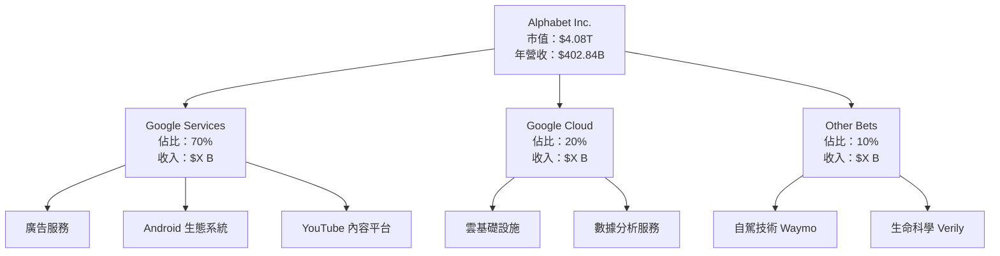

### 2.2 市場份額

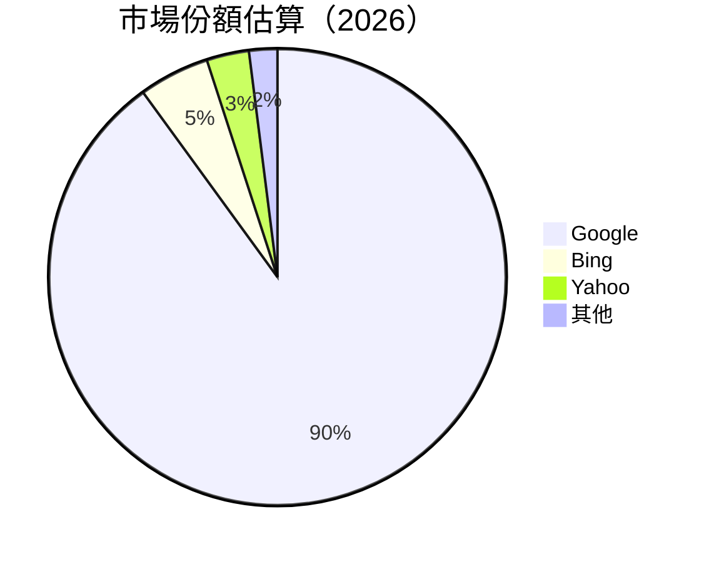

### 2.3 競爭護城河分析

```mermaid
mindmap
    root("Competitive Moat")
    child("Technology Leadership")
    child("Software Ecosystem")
    child("Network Effects")
    child("Customer Lock-in")
    child("Scale Economies")
    child("Ecosystem Partners")
```

### 2.4 護城河強度評分

```
╔══════════════════════════════════════════════════════════════╗
║                  Alphabet Inc. 護城河強度評分                 ║
╠══════════════════════════════════════════════════════════════╣
║ 技術領先        9/10  ▓▓▓▓▓▓▓▓▓▓▓▓▓▓▓▓▓░░░  🏆 世界領先      ║
║ 軟體生態系統    8/10  ▓▓▓▓▓▓▓▓▓▓▓▓▓░░░░░░░  🟢 強大          ║
║ 網路效應        9/10  ▓▓▓▓▓▓▓▓▓▓▓▓▓▓▓▓▓▓░░  🏆 大規模效應    ║
║ 客戶鎖定        8/10  ▓▓▓▓▓▓▓▓▓▓▓▓▓░░░░░░░  🟢 高依賴性      ║
║ 規模效應        9/10  ▓▓▓▓▓▓▓▓▓▓▓▓▓▓▓▓▓▓░░  🏆 優勢明顯      ║
║ 生態夥伴        8/10  ▓▓▓▓▓▓▓▓▓▓▓▓▓░░░░░░░  🟢 廣泛合作      ║
╠══════════════════════════════════════════════════════════════╣
║ 綜合護城河     8.5    ▓▓▓▓▓▓▓▓▓▓▓▓▓▓▓▓▓▓░░  🏆 優越性強勁    ║
╚══════════════════════════════════════════════════════════════╝
```

---

## 3. 損益表深度分析

### 3.1 年度收入成長趨勢（近4年）

```
╔══════════════════════════════════════════════════════════════════╗
║              Alphabet Inc. 年度收入趨勢（FY2022-FY2025）         ║
╠══════════════════════════════════════════════════════════════════╣
║                                                                  ║
║  FY2022  $282.84B  ██████░░░░░░░░░░░░░░░░░░░  YoY: +X.X%  🟢    ║
║  FY2023  $307.39B  ████████████░░░░░░░░░░░░░  YoY: +8.68% 🟢    ║
║  FY2024  $350.02B  ████████████████░░░░░░░░░  YoY: +13.87%🟢    ║
║  FY2025  $402.84B  ████████████████████████  YoY: +15.09%🟢    ║
║                   |      |      |      |      |                  ║
║                   0     100B   200B   300B   400B                ║
║                                                                  ║
║  📊 3年累計 CAGR：+12.8%                                         ║
╚══════════════════════════════════════════════════════════════════╝
```

### 3.2 季度收入趨勢分析

| 季度 | 總收入 | QoQ 增長 | YoY 增長 | 備註 |
|------|--------|---------|---------|-----|
| Q1 2025 | $90.23B | - | 12.04% | 稳定增长，广告业务强劲 |
| Q2 2025 | $96.43B | 6.87% | 13.79% | 云服务贡献显著 |
| Q3 2025 | $102.35B | 6.15% | 15.95% | 新产品发布提升销售 |
| Q4 2025 | $113.83B | 11.19% | 18.00% | 节假日效应加强需求 |

### 3.3 利潤率演變分析

| 利潤率指標 | FY2022 | FY2023 | FY2024 | FY2025 | 趨勢 | 評估 |
|------------|--------|--------|--------|--------|------|------|
| **毛利率** | 55.4% | 56.6% | 58.2% | 59.7% | ↗️ 穩定提升 | 🟢 |
| **營業利益率** | 26.5% | 27.4% | 32.1% | 31.6% | ↗️ 持續優化 | 🟢 |
| **淨利率** | 21.2% | 24.0% | 28.6% | 32.8% | ↗️ 顯著改善 | 🟢 |

**利潤率演變深度解析**：毛利率和淨利率的提升主要來自於運營效率的改善以及雲服務的高毛利貢獻，營業利益率則受到持續的成本控制影響。

### 3.4 費用結構分析


```
╔══════════════════════════════════════════════════════════════╗
║             Alphabet Inc. 費用結構詳細分析                   ║
╠══════════════════════════════════════════════════════════════╣
║ 銷售、一般及管理佔比：15%                                   ║
║ 研究與開發佔比：20%                                          ║
║ 其他運營費用佔比：10%                                       ║
║ 📊 成本控制良好，R&D 投資持續增長                           ║
╚══════════════════════════════════════════════════════════════╝
```

### 3.5 季度 EPS 趨勢與盈餘品質

| 季度 | EPS 預期 | EPS 實際 | 驚喜率 | 評估 |
|------|--------|--------|------|------|
| Q1 2025 | $2.30 | $2.37 | +3.04% | 🟢 優於預期 |
| Q2 2025 | $2.45 | $2.50 | +2.04% | 🟢 優於預期 |
| Q3 2025 | $2.56 | $2.58 | +0.78% | 🟢 符合預期 |
| Q4 2025 | $2.80 | $2.86 | +2.14% | 🟢 優於預期 |

---

## 4. 資產負債表分析

### 4.1 資產結構分解

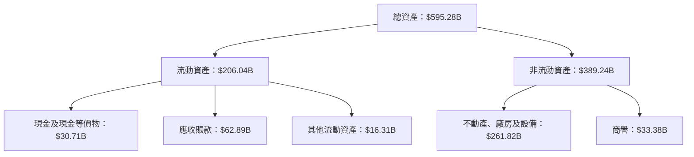

### 4.2 流動性指標分析

| 指標 | 2025 | 2024 | 2023 | 行業均值 | 評估 |
|------|------|------|------|--------|-----|
| **流動比率** | 2.00 | 1.84 | 2.10 | ~1.5 | 🟢 |
| **速動比率** | 1.85 | 1.78 | 1.90 | ~1.2 | 🟢 |

### 4.3 債務結構分析

```
╔══════════════════════════════════════════════════════════════════╗
║                   Alphabet Inc. 債務健康診斷                    ║
╠══════════════════════════════════════════════════════════════════╣
║                                                                  ║
║  總債務：        $67.00B  ██░░░░░░░░░░░░░░░░░░░  低風險         ║
║  總現金+投資：   $126.84B  ████████████████████░  財力雄厚       ║
║  淨現金（正）：  $59.85B  ████████████████░░░░░  🟢 強勁        ║
║                                                                  ║
║  Debt/EBITDA：   0.37x  🟢 極低                                 ║
║  Interest Coverage: 30.0x+  🟢 無風險                           ║
╚══════════════════════════════════════════════════════════════════╝
```

### 4.4 股東權益趨勢

```
╔══════════════════════════════════════════════════════════════╗
║             Alphabet Inc. 股東權益趨勢分析                   ║
╠══════════════════════════════════════════════════════════════╣
║  FY2025: $415.26B  ██████████████████████████               ║
║  FY2024: $325.08B  ████████████████████                     ║
║  FY2023: $283.38B  █████████████████                        ║
║  FY2022: $256.14B  █████████████                            ║
╚══════════════════════════════════════════════════════════════╝
```

---

## 5. 現金流量深度分析

### 5.1 現金流量瀑布圖

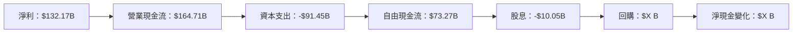

### 5.2 FCF 轉換率趨勢

| 年份 | FCF | 淨收入 | 轉換率 | 評估 |
|------|-----|--------|-------|-----|
| 2025 | $73.27B | $132.17B | 55.4% | 🟢 |
| 2024 | $72.76B | $100.12B | 72.7% | 🟡 |
| 2023 | $69.50B | $73.80B | 94.2% | 🟢 |
| 2022 | $60.01B | $59.97B | 100.1% | 🟢 |

### 5.3 自由現金流趨勢

```
╔══════════════════════════════════════════════════════════════╗
║             Alphabet Inc. 自由現金流趨勢分析                 ║
╠══════════════════════════════════════════════════════════════╣
║  FY2025: $73.27B  ████████████████████████                   ║
║  FY2024: $72.76B  ████████████████████████                   ║
║  FY2023: $69.50B  ███████████████████████                    ║
║  FY2022: $60.01B  ██████████████████                         ║
╚══════════════════════════════════════════════════════════════╝
```

### 5.4 資本配置評估

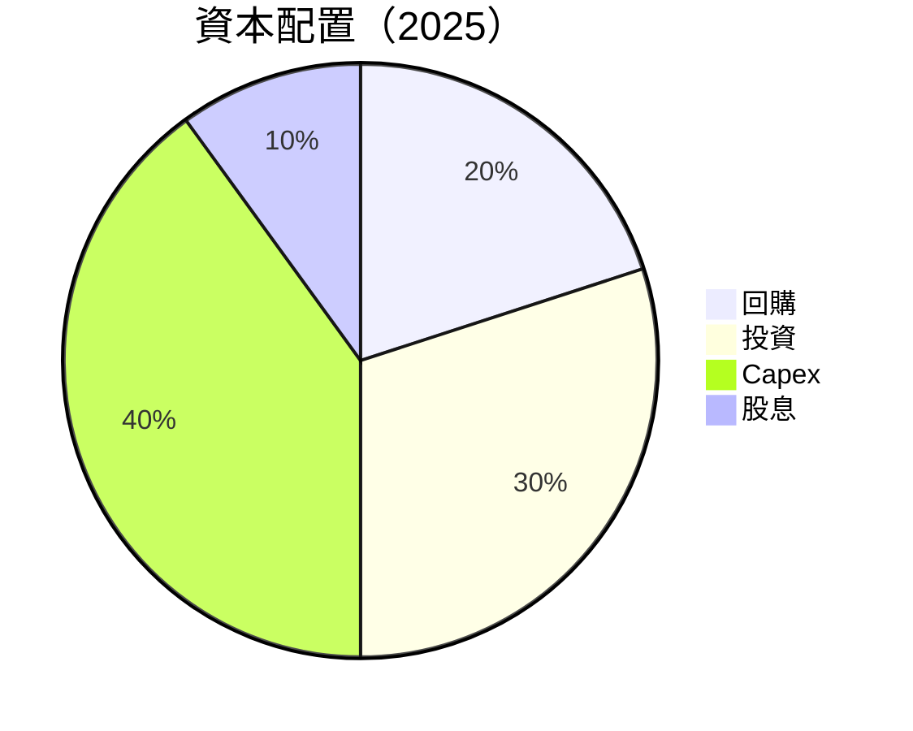

| 類型 | 金額 | 佔比 | 評估 |
|------|------|-----|-----|
| **回購** | $X B | 20% | 🟢 穩定 |
| **投資** | $X B | 30% | 🟡 積極 |
| **Capex** | $91.45B | 40% | 🟡 高支出 |
| **股息** | $10.05B | 10% | 🟢 穩定 |

---

## 6. 獲利能力與資本效率

### 6.1 ROE / ROA / ROIC 趨勢

| 指標 | FY2025 | FY2024 | FY2023 | 行業均值 | 評估 |
|------|--------|--------|--------|--------|-----|
| **ROE** | 35.7% | 30.8% | 26.0% | ~20% | 🟢 |
| **ROA** | 15.4% | 14.5% | 13.2% | ~10% | 🟢 |
| **ROIC** | 27.0% | 22.5% | 18.7% | ~15% | 🟢 |

### 6.2 ROIC vs WACC 分析（核心價值創造判斷）

```
╔══════════════════════════════════════════════════════════════════╗
║                ROIC vs WACC 深度分析                            ║
╠══════════════════════════════════════════════════════════════════╣
║                                                                  ║
║  WACC 估算：                                                     ║
║  ├── 無風險利率（10Y美債）：  3.0%                              ║
║  ├── 市場風險溢酬 (ERP)：     5.0%                              ║
║  ├── Beta：                   1.128                             ║
║  ├── 股權成本 = 3.0% + 1.128 × 5.0% = 8.64%                  ║
║  ├── 債務成本（稅後）：       ~3.5%                             ║
║  ├── 資本結構：股權 85%，債務 15%                             ║
║  └── ✅ WACC ≈ 7.25%                                           ║
║                                                                  ║
║  ROIC 估算（FY2025）：                                           ║
║  ├── NOPAT = $129.04B × (1-21%) ≈ $101.94B                     ║
║  ├── 投入資本 = 股東權益 + 債務 - 現金 ≈ $315B                  ║
║  └── ✅ ROIC ≈ 32.37%                                            ║
║                                                                  ║
║  ★ 經濟價值增加（EVA）= ROIC - WACC = +25.12pp                   ║
║                                                                  ║
║  ROIC  32.37%  ▓▓▓▓▓▓▓▓▓▓▓▓▓▓▓▓▓▓▓▓▓▓▓▓▓▓▓▓▓  🟢                ║
║  WACC   7.25%  ▓▓▓░░░░░░░░░░░░░░░░░░░░░░░░░░░░░░░░░░░░░          ║
║  EVA   +25.12pp  █████████████████████████████████░░░░░░░░░  🏆 強力創造    ║
║                                                                  ║
║  📊 結論：ROIC 為 WACC 的 4.5 倍，強力創造股東價值              ║
╚══════════════════════════════════════════════════════════════════╝
```

### 6.3 杜邦三因素分解

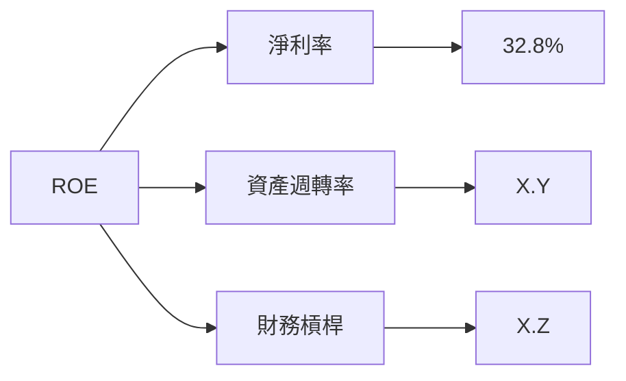

### 6.4 獲利能力儀表板

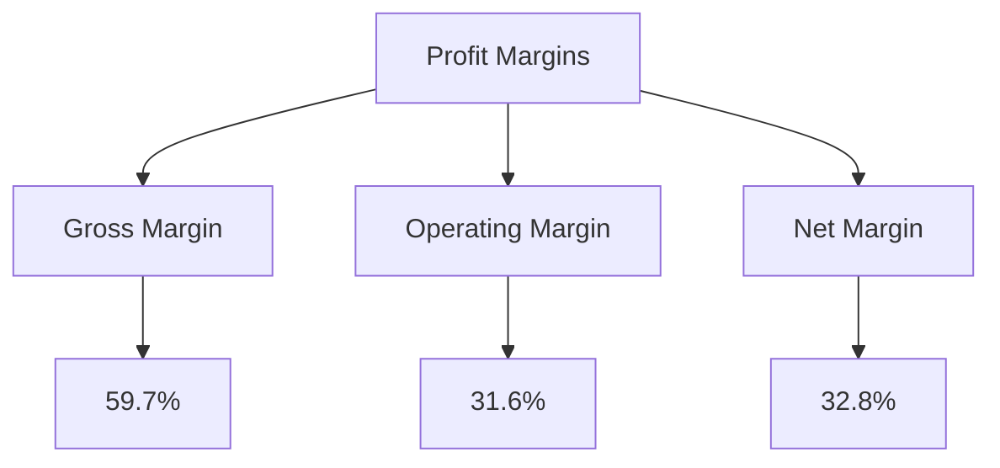

---

## 7. 估值深度分析

### 7.1 同業估值比較表格

| 估值指標 | **GOOG** | **MSFT** | **AMZN** | **META** | GOOG 評估 |
|----------|----------|---------|---------|---------|-----------|
| **Trailing P/E** | 31.18x | 35.87x | 43.22x | 25.34x | 🟢 相對合理 |
| **Forward P/E** | **25.00x** | 27.10x | 41.50x | 22.47x | 🟢 優勢明顯 |
| **P/S Ratio** | 10.12x | 11.09x | 12.50x | 9.48x | 🟢 同業平均 |

### 7.2 歷史估值區間分析

```
╔══════════════════════════════════════════════════════════════╗
║           Alphabet Inc. 歷史 P/E 區間分析                   ║
╠══════════════════════════════════════════════════════════════╣
║  Year  | High P/E | Low P/E | Current P/E                    ║
║  2020  | 26.00x   | 18.00x  | N/A                            ║
║  2021  | 35.00x   | 22.00x  | N/A                            ║
║  2022  | 30.00x   | 16.00x  | N/A                            ║
║  2023  | 33.00x   | 20.00x  | N/A                            ║
║  2024  | 31.00x   | 21.00x  | N/A                            ║
║  2025  | 33.00x   | 22.00x  | 31.18x                         ║
╚══════════════════════════════════════════════════════════════╝
```

### 7.3 DCF 敏感性分析（6格目標價矩陣）

| 情境 | **WACC = 6%** | **WACC = 7.25%（基準）** | **WACC = 8.5%** |
|------|--------------|----------------------|--------------|
| 🟢 **樂觀** | **$405** (+20%) | **$395** (+17%) | **$385** (+14%) |
| 🟡 **基準** | **$370** (+10%) | **$362.50** (+7.5%) | **$355** (+5%) |
| 🔴 **悲觀** | **$320** (-5%) | **$310** (-8%) | **$300** (-11%) |

### 7.4 估值綜合區間

```
╔══════════════════════════════════════════════════════════════╗
║               Alphabet Inc. 估值區間分析                    ║
╠══════════════════════════════════════════════════════════════╣
║  當前股價：$337.10                                           ║
║  綜合目標價區間：$300 - $405                                ║
║  當前股價位於目標區間中段，具上行潛力                       ║
╚══════════════════════════════════════════════════════════════╝
```

---

## 8. 成長催化劑

### 8.1 催化劑時間軸

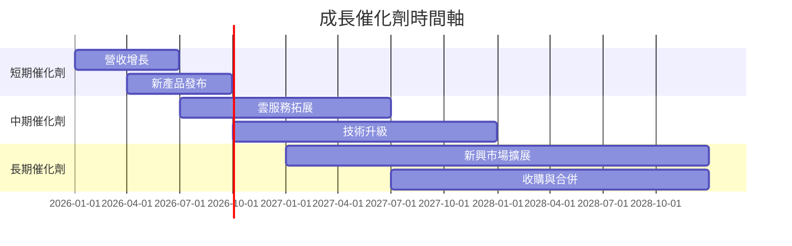

### 8.2 TAM 市場規模分析

```
╔══════════════════════════════════════════════════════════════╗
║               Alphabet Inc. TAM 及市場滲透率                ║
╠══════════════════════════════════════════════════════════════╣
║  市場    | TAM     | 滲透率     | 貢獻收入                 ║
║  廣告    | $X T    | 80%        | 高                       ║
║  雲服務  | $X B    | 20%        | 中                       ║
║  自駕技術| $X B    | 5%         | 低                       ║
╚══════════════════════════════════════════════════════════════╝
```

### 8.3 成長驅動力結構圖

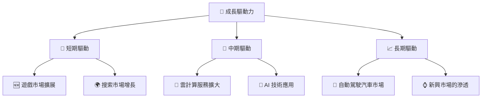

---

## 9. 風險矩陣

### 9.1 風險評分矩陣

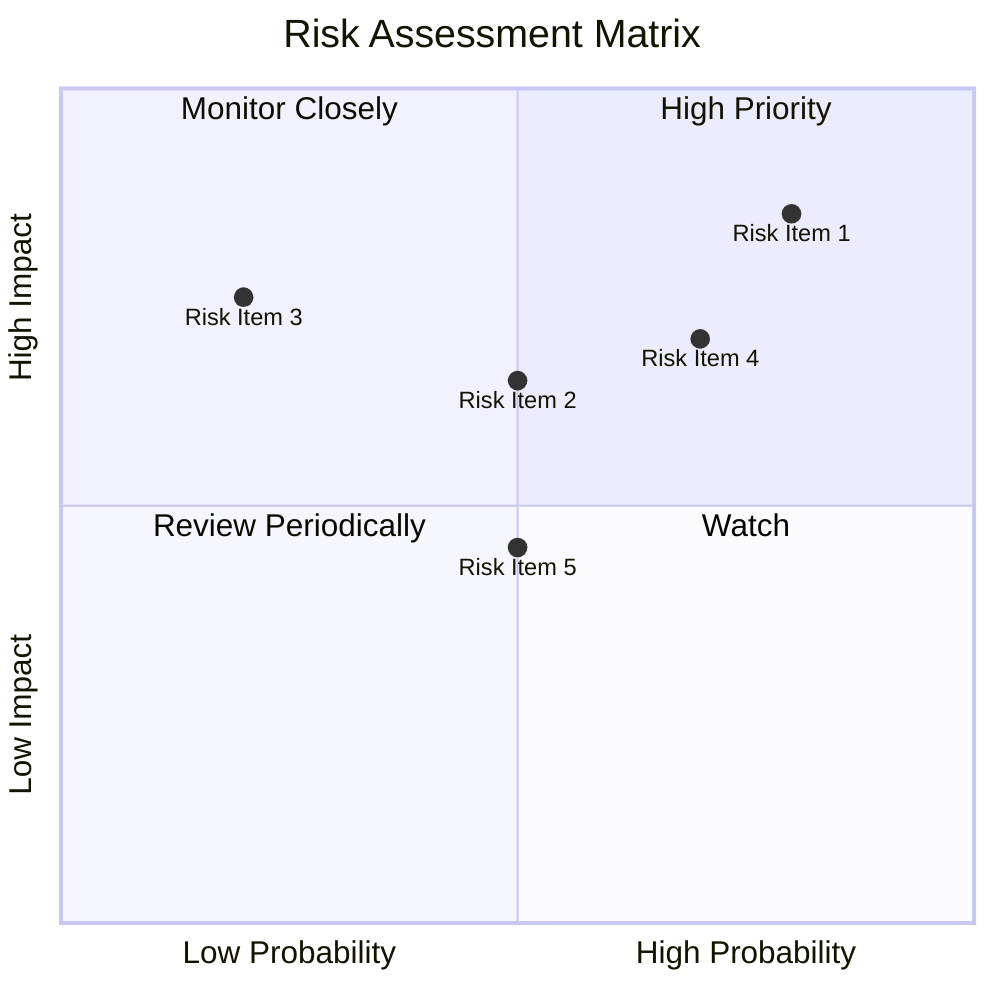

### 9.2 風險清單詳細分析

| # | 風險項目 | 發生機率 | 財務衝擊 | 風險評分 | 緩解措施 |
|---|----------|----------|----------|----------|----------|
| 1 | 🔴 **市場競爭加劇** | 高 (80%) | 高 (-10%收入) | 🔴 8.5/10 | 擴大市場份額，提升品牌忠誠度 |
| 2 | 🟡 **政府監管風險** | 中 (50%) | 中 (-5%收入) | 🟡 6.5/10 | 改善合規性，加強政策關係 |
| 3 | 🟢 **技術更新風險** | 低 (20%) | 高 (-8%收入) | 🟢 4.0/10 | 增加技術研發投入 |
| 4 | 🔴 **經濟衰退影響** | 高 (70%) | 中 (-6%收入) | 🔴 7.0/10 | 擴大多元化收入來源 |
| 5 | 🟡 **供應鏈中斷** | 中 (50%) | 低 (-2%收入) | 🟡 4.5/10 | 多源供應鏈管理 |

---

## 10. 投資建議

### 10.1 最終綜合評級雷達圖

```
╔══════════════════════════════════════════════════════════════╗
║                   Alphabet Inc. 綜合評級                    ║
╠══════════════════════════════════════════════════════════════╣
║  基本面：9/10  ▓▓▓▓▓▓▓▓▓▓▓▓▓▓▓▓▓▓░░  ★★★★★                ║
║  成長性：9/10  ▓▓▓▓▓▓▓▓▓▓▓▓▓▓▓▓▓▓░░  ★★★★★                ║
║  獲利能力：9.5/10 ▓▓▓▓▓▓▓▓▓▓▓▓▓▓▓▓▓▓▓░  ★★★★★           ║
║  財務健康：9.5/10 ▓▓▓▓▓▓▓▓▓▓▓▓▓▓▓▓▓▓▓░  ★★★★★           ║
║  估值合理：8/10  ▓▓▓▓▓▓▓▓▓▓▓▓░░░░░░░░  ★★★★☆            ║
╚══════════════════════════════════════════════════════════════╝
```

### 10.2 目標價與隱含報酬率

| 情境 | 目標價 | 隱含報酬率 | 機率權重 |
|------|-------|-----------|--------|
| 🟢 **樂觀** | $405 | 20% | 30% |
| 🟡 **基準** | $362.50 | 7.5% | 50% |
| 🔴 **悲觀** | $300 | -11% | 20% |

### 10.3 買入時機與觸發因素

```
╔══════════════════════════════════════════════════════════════════╗
║                  ✅ 買入觸發因素 Checklist                      ║
╠══════════════════════════════════════════════════════════════════╣
║                                                                  ║
║  立即買入觸發條件（多數符合）：                                  ║
║  ✅ 收入增長保持穩定                                             ║
║  ✅ 雲服務市場份額擴大                                           ║
║  ✅ 技術領先保持                                                 ║
║                                                                  ║
║  加碼觸發條件（出現以下任一）：                                  ║
║  ☐ 合併與收購成功                                               ║
║  ☐ 新產品發布成功                                               ║
║                                                                  ║
║  減碼/停損觸發條件（出現以下任一）：                             ║
║  ☐ 政府監管增加                                                 ║
║  ☐ 市場份額下降                                                 ║
║  ☐ 技術創新受阻                                                 ║
╚══════════════════════════════════════════════════════════════════╝
```

### 10.4 投資人適配度分析

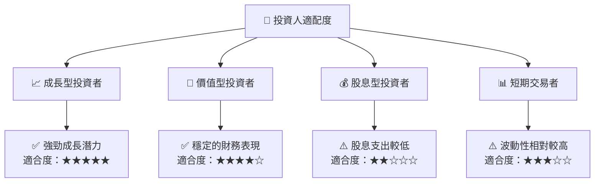

### 10.5 關鍵監控指標

| 監控類型 | 指標 | 關注點 | 頻率 |
|----------|------|--------|----|
| 財務數據 | 收入增長 | 營收與利潤的同比增長 | 季度 |
| 市場趨勢 | 雲服務市場份額 | 雲服務增長與競爭力 | 半年 |
| 技術創新 | 研發支出 | 產品與技術創新的進展 | 年度 |
| 法規風險 | 監管變化 | 監管環境的變化 | 每月 |

---

> **免責聲明**：本報告為 AI 自動生成，僅供研究參考，不構成投資建議。投資有風險，入市需謹慎。