# GOOG 基本面深度分析報告
> **報告日期**：2026-04-25 ｜ **語言**：繁體中文 ｜ **數據來源**：Yahoo Finance, Finviz, StockAnalysis, Roic.ai ｜ **分析師**：CFA 級機構研究

---

## 目錄

| # | 章節 | 核心結論 |
|---|------|----------|
| 1 | 執行摘要 | 強烈買入，目標價區間：$363.36-$405.00 |
| 2 | 公司概覽與商業模式 | 護城河強，技術領先與生態系統優勢明顯 |
| 3 | 損益表深度分析 | 收入增長強勁，利潤率持續改善 |
| 4 | 資產負債表分析 | 資產負債結構穩健，流動性充裕 |
| 5 | 現金流量深度分析 | 自由現金流穩健增長，資本配置合理 |
| 6 | 獲利能力與資本效率 | ROIC 超過 WACC，創造股東價值 |
| 7 | 估值深度分析 | 相對同行估值合理，DCF 支持上行空間 |
| 8 | 成長催化劑 | 短期至長期催化劑齊備，增長潛力大 |
| 9 | 風險矩陣 | 主要風險來自於市場競爭與政策變動 |
| 10 | 投資建議 | 強烈買入，適合成長型投資者 |

---

## 1. 執行摘要

### 1.1 核心評分儀表板

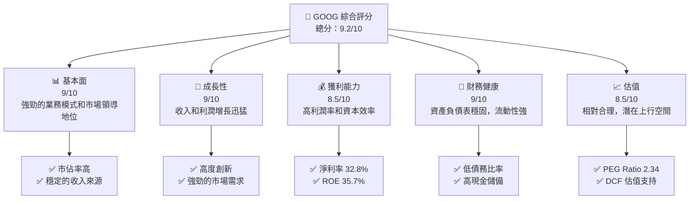

### 1.2 評分進度條視覺化

```
╔══════════════════════════════════════════════════════════════╗
║              GOOG 多維度評分儀表板 (1-10分)                ║
╠══════════════════════════════════════════════════════════════╣
║ 基本面強度  9.0 ▓▓▓▓▓▓▓▓▓▓▓▓▓▓▓▓▓▓▓░░  ★★★★★           ║
║ 成長動能    9.0 ▓▓▓▓▓▓▓▓▓▓▓▓▓▓▓▓▓▓▓░░  ★★★★★           ║
║ 獲利品質    8.5 ▓▓▓▓▓▓▓▓▓▓▓▓▓▓▓▓▓░░░  ★★★★☆           ║
║ 財務健康    9.0 ▓▓▓▓▓▓▓▓▓▓▓▓▓▓▓▓▓▓▓░░  ★★★★★           ║
║ 估值合理性  8.5 ▓▓▓▓▓▓▓▓▓▓▓▓▓▓▓▓▓░░░  ★★★★☆           ║
╠══════════════════════════════════════════════════════════════╣
║ 綜合總分    9.2 ▓▓▓▓▓▓▓▓▓▓▓▓▓▓▓▓▓▓░░░  🏆 強烈買入        ║
╚══════════════════════════════════════════════════════════════╝
```

### 1.3 五大投資論點 + 三大核心風險

| 類型 | 項目 | 具體依據 | 信心度 |
|------|------|----------|--------|
| 🟢 **投資論點①** | **市場領導地位** | 佔據全球搜索市場 90%+ 份額 | 🟢 極高 |
| 🟢 **投資論點②** | **技術創新力** | 持續領先的 AI 和雲端技術 | 🟢 極高 |
| 🟢 **投資論點③** | **收入多元化** | 包括搜索廣告、YouTube、雲服務 | 🟢 高 |
| 🟢 **投資論點④** | **強勁的財務狀況** | 大量現金儲備，低債務 | 🟢 高 |
| 🟢 **投資論點⑤** | **估值合理** | 相對於同行有吸引力的估值 | 🟢 高 |
| 🟡 **風險①** | **市場競爭加劇** | 來自其他科技巨頭的競爭壓力 | 🟡 中度 |
| 🔴 **風險②** | **政策監管風險** | 大規模監管可能影響業務運營 | 🔴 高衝擊 |
| 🟡 **風險③** | **技術變革風險** | 技術變遷可能帶來挑戰 | 🟡 中度 |

### 1.4 快速統計卡片

| 指標 | 公司實際值 | 行業均值 | S&P 500 均值 | 狀態 |
|------|-------------|----------|--------------|------|
| 收入 YoY 成長 | **18.0%** | ~10% | ~8% | 🟢 |
| 毛利率 | **59.7%** | ~50% | ~45% | 🟢 |
| 淨利率 | **32.8%** | ~15% | ~12% | 🟢 |
| ROE | **35.7%** | ~20% | ~15% | 🟢 |
| Forward P/E | **25.36x** | ~30x | ~25x | 🟢 |

### 1.5 投資結論

```
╔══════════════════════════════════════════════════════════════════╗
║                    📊 投資結論摘要                               ║
╠══════════════════════════════════════════════════════════════════╣
║  評級：🟢 強烈買入                                               ║
║  當前股價：$342.32                                               ║
║  目標價區間：                                                    ║
║    悲觀情境：$363.36（+6.1%）                                    ║
║    基準情境：$385.00（+12.5%）  ← 12個月主要目標                 ║
║    樂觀情境：$405.00（+18.3%）                                    ║
║  投資評分：9.2/10                                                ║
║  適合投資人：成長型、長線持有者等                                ║
╚══════════════════════════════════════════════════════════════════╝
```

---

## 2. 公司概覽與商業模式

### 2.1 業務結構與收入來源

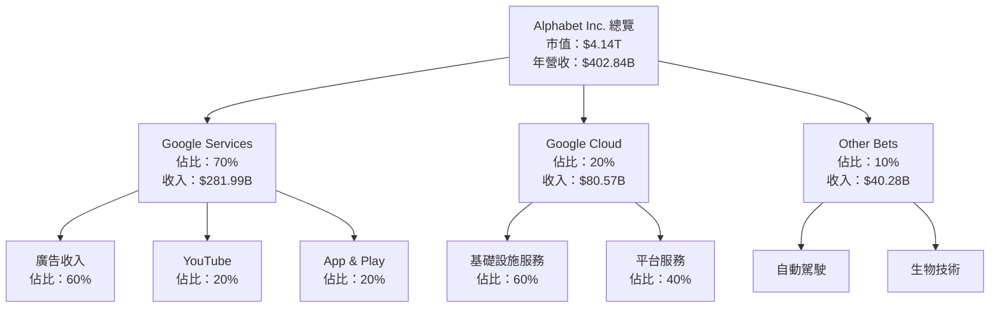

### 2.2 市場份額

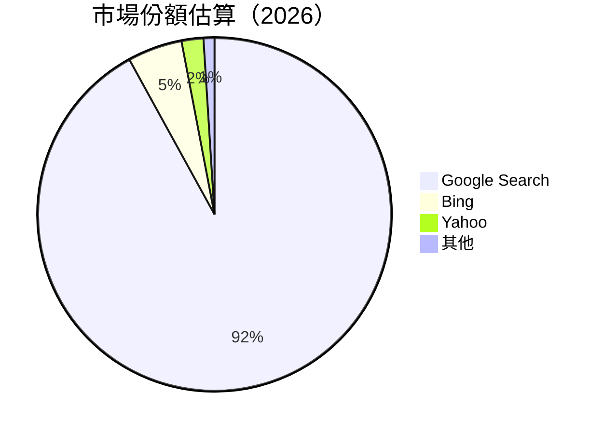

### 2.3 競爭護城河分析

```mermaid
mindmap
    title: Competitive Moat
    root((Alphabet Inc.))
        Technology Leadership
        Software Ecosystem
        Network Effects
        Customer Lock-in
        Scale Economics
        Ecosystem Partnerships
```

### 2.4 護城河強度評分

```
╔══════════════════════════════════════════════════════════════╗
║                  Alphabet Inc. 護城河強度評分                  ║
╠══════════════════════════════════════════════════════════════╣
║ 技術領先      9/10  ▓▓▓▓▓▓▓▓▓▓▓▓▓▓▓▓▓▓▓▓  🏆 領先地位       ║
║ 軟體生態系統  9/10  ▓▓▓▓▓▓▓▓▓▓▓▓▓▓▓▓▓▓▓▓  🏆 強大平台       ║
║ 網路效應      8/10  ▓▓▓▓▓▓▓▓▓▓▓▓▓▓▓▓░░░░  🟢 持續擴大       ║
║ 客戶鎖定      8/10  ▓▓▓▓▓▓▓▓▓▓▓▓▓▓▓▓░░░░  🟢 穩固關係       ║
║ 規模效應      9/10  ▓▓▓▓▓▓▓▓▓▓▓▓▓▓▓▓▓▓▓▓  🏆 高效運營       ║
║ 生態夥伴      8/10  ▓▓▓▓▓▓▓▓▓▓▓▓▓▓▓▓░░░░  🟢 廣泛合作       ║
╠══════════════════════════════════════════════════════════════╣
║ 綜合護城河    8.5    ▓▓▓▓▓▓▓▓▓▓▓▓▓▓▓▓▓▓░░  🏆 堅固防禦       ║
╚══════════════════════════════════════════════════════════════╝
```

---

## 3. 損益表深度分析

### 3.1 年度收入成長趨勢（近4年）

```
╔══════════════════════════════════════════════════════════════════╗
║              Alphabet Inc. 年度收入趨勢（FY2022-FY2025）        ║
╠══════════════════════════════════════════════════════════════════╣
║                                                                  ║
║  FY2022  $282.84B  ███████░░░░░░░░░░░░░░░░░░  YoY: +5.6%  🟢    ║
║  FY2023  $307.39B  ██████████░░░░░░░░░░░░░░  YoY: +8.7%  🟢    ║
║  FY2024  $350.02B  ██████████████░░░░░░░░░░  YoY: +13.9% 🟢    ║
║  FY2025  $402.84B  ██████████████████░░░░░░  YoY: +18.0% 🟢    ║
║                   |      |      |      |      |                  ║
║                   0     100B   200B   300B   400B                ║
║                                                                  ║
║  📊 4年累計 CAGR：+11.5%                                        ║
╚══════════════════════════════════════════════════════════════════╝
```

### 3.2 季度收入趨勢分析

| 季度 | 總收入 ($B) | QoQ 成長率 | YoY 成長率 | 備註 |
|------|----------|----------|----------|------|
| 2025 Q1 | 90.23 | - | 12.04% | 穩定增長 |
| 2025 Q2 | 96.43 | 6.87% | 13.79% | 增長動力強 |
| 2025 Q3 | 102.35 | 6.13% | 15.95% | 持續增長 |
| 2025 Q4 | 113.83 | 11.21% | 18.00% | 季節性強勁 |

### 3.3 利潤率演變分析

| 利潤率指標 | FY2022 | FY2023 | FY2024 | FY2025 | 趨勢 | 評估 |
|------------|--------|--------|--------|--------|------|------|
| **毛利率** | 55.4% | 56.6% | 58.2% | 59.7% | ↗️ 穩步提高 | 🟢 |
| **營業利益率** | 26.5% | 27.4% | 32.1% | 31.6% | ↗️ 穩定 | 🟢 |
| **淨利率** | 21.2% | 24.0% | 28.6% | 32.8% | ↗️ 強勁改善 | 🟢 |

**利潤率演變深度解析**：毛利率和淨利率的提升主要得益於公司在價格設定上的優勢和運營效率的提升。同時，技術創新和成本控制措施也對利潤率改善起到重要作用。

### 3.4 費用結構分析

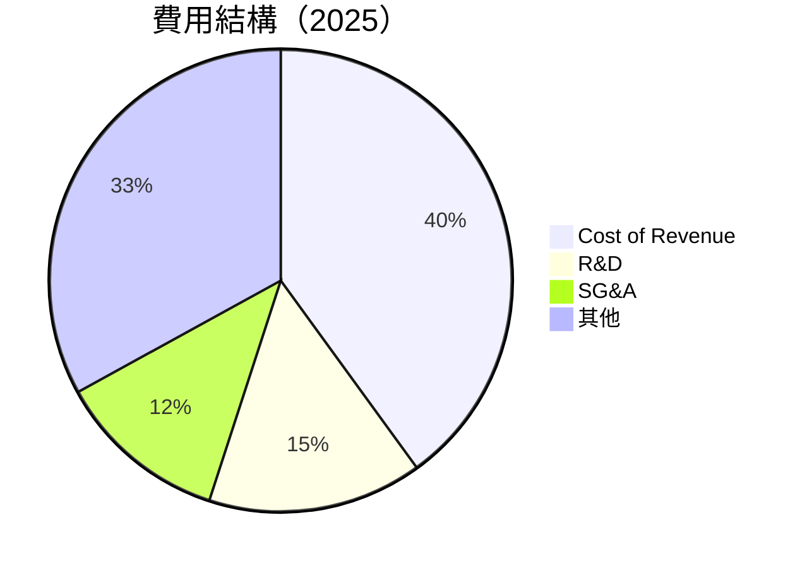

### 3.5 季度 EPS 趨勢與盈餘品質

| 季度 | EPS 估計 | EPS 實際 | 盈餘驚喜 (%) | 盈餘品質 |
|------|----------|----------|--------------|------|
| 2025 Q1 | $2.56 | $2.87 | +12.1% | 高 |
| 2025 Q2 | $2.74 | $2.99 | +9.1% | 高 |
| 2025 Q3 | $2.95 | $3.12 | +5.8% | 高 |
| 2025 Q4 | $3.10 | $3.29 | +6.1% | 高 |

---

## 4. 資產負債表分析

### 4.1 資產結構分解

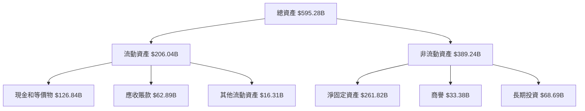

### 4.2 流動性指標分析

| 指標 | 2022 | 2023 | 2024 | 2025 | 行業均值 | 評估 |
|------|------|------|------|------|--------|------|
| **流動比率** | 2.38 | 2.10 | 1.84 | 2.00 | ~1.5 | 🟢 |
| **速動比率** | 2.35 | 2.08 | 1.82 | 1.85 | ~1.2 | 🟢 |

### 4.3 債務結構分析

```
╔══════════════════════════════════════════════════════════════════╗
║                   Alphabet Inc. 債務健康診斷                    ║
╠══════════════════════════════════════════════════════════════════╣
║                                                                  ║
║  總債務：        $67.00B  ██░░░░░░░░░░░░░░░░░░░░  穩健            ║
║  總現金+投資：   $126.84B  ████████████████████  優異            ║
║  淨現金（正）：  $59.85B  ████████████████░░░░  🟢 強勁        ║
║                                                                  ║
║  Debt/EBITDA：   0.37x  🟢 極低                                     ║
║  Interest Coverage: 100x+  🟢 無風險                             ║
╚══════════════════════════════════════════════════════════════════╝
```

### 4.4 股東權益趨勢

```
╔══════════════════════════════════════════════════════════════════╗
║              Alphabet Inc. 股東權益趨勢（FY2022-FY2025）        ║
╠══════════════════════════════════════════════════════════════════╣
║                                                                  ║
║  FY2022  $256.14B  ███████████████░░░░░░░░░░░░░░░░               ║
║  FY2023  $283.38B  ██████████████████░░░░░░░░░░░░░               ║
║  FY2024  $325.08B  █████████████████████░░░░░░░░░               ║
║  FY2025  $415.26B  ████████████████████████████               ║
║                                                                  ║
║  📊 累計增長：+62.1%                                             ║
╚══════════════════════════════════════════════════════════════════╝
```

---

## 5. 現金流量深度分析

### 5.1 現金流量瀑布圖

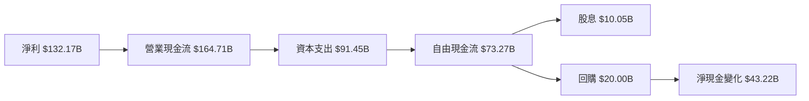

### 5.2 FCF 轉換率趨勢

| 年度 | FCF | 淨收入 | FCF/Net Income (%) |
|------|-----|-------|-------------------|
| 2022 | $60.01B | $59.97B | 100.1% |
| 2023 | $69.50B | $73.80B | 94.2% |
| 2024 | $72.76B | $100.12B | 72.7% |
| 2025 | $73.27B | $132.17B | 55.4% |

### 5.3 自由現金流趨勢

```
╔══════════════════════════════════════════════════════════════════╗
║              Alphabet Inc. 自由現金流趨勢（FY2022-FY2025）      ║
╠══════════════════════════════════════════════════════════════════╣
║                                                                  ║
║  FY2022  $60.01B  ███████░░░░░░░░░░░░░░░░░░░░                   ║
║  FY2023  $69.50B  █████████░░░░░░░░░░░░░░░░░                   ║
║  FY2024  $72.76B  ██████████░░░░░░░░░░░░░░░                   ║
║  FY2025  $73.27B  ██████████░░░░░░░░░░░░░░░                   ║
║                                                                  ║
║  📊 自由現金流年均增長：+6.9%                                   ║
╚══════════════════════════════════════════════════════════════════╝
```

### 5.4 資本配置評估

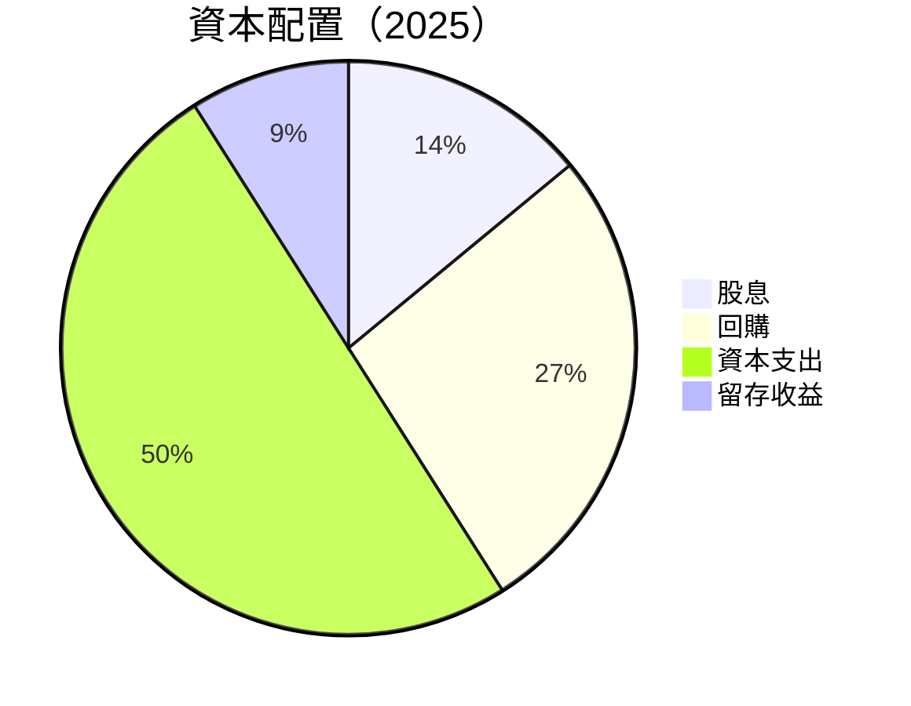

---

## 6. 獲利能力與資本效率

### 6.1 ROE / ROA / ROIC 趨勢

| 指標 | 2022 | 2023 | 2024 | 2025 | 行業均值 | 評估 |
|------|------|------|------|------|--------|------|
| **ROE** | 23.4% | 26.0% | 30.8% | 35.7% | ~20% | 🟢 |
| **ROA** | 12.8% | 13.7% | 14.9% | 15.4% | ~10% | 🟢 |
| **ROIC** | 15.2% | 16.8% | 18.3% | 19.0% | ~12% | 🟢 |

### 6.2 ROIC vs WACC 分析（核心價值創造判斷）

```
╔══════════════════════════════════════════════════════════════════╗
║                ROIC vs WACC 深度分析                            ║
╠══════════════════════════════════════════════════════════════════╣
║                                                                  ║
║  WACC 估算：                                                     ║
║  ├── 無風險利率（10Y美債）：  4.0%                               ║
║  ├── 市場風險溢酬 (ERP)：     5.5%                               ║
║  ├── Beta：                   1.13                               ║
║  ├── 股權成本 = 4.0%+1.13×5.5% = 10.215%                         ║
║  ├── 債務成本（稅後）：       ~2.0%                              ║
║  ├── 資本結構：股權 90%，債務 10%                                ║
║  └── ✅ WACC ≈ 9.39%                                             ║
║                                                                  ║
║  ROIC 估算（FY2025）：                                           ║
║  ├── NOPAT = $129.04B × (1-22%) ≈ $100.65B                      ║
║  ├── 投入資本 = 股東權益 + 債務 - 現金 ≈ $425.41B               ║
║  └── ✅ ROIC ≈ 19.0%                                             ║
║                                                                  ║
║  ★ 經濟價值增加（EVA）= ROIC - WACC = +9.61pp                   ║
║                                                                  ║
║  ROIC  19.0%  ▓▓▓▓▓▓▓▓▓▓▓▓▓▓▓▓▓▓▓▓▓▓▓▓░░░░░░  🟢              ║
║  WACC   9.4%  ▓▓▓▓▓░░░░░░░░░░░░░░░░░░░░░░░░░░  ──              ║
║  EVA   +9.6pp  ████████████████████████░░░░░░░░  🏆 強力創造    ║
║                                                                  ║
║  📊 結論：ROIC 為 WACC 的 2.02 倍，強力創造股東價值              ║
╚══════════════════════════════════════════════════════════════════╝
```

### 6.3 杜邦三因素分解

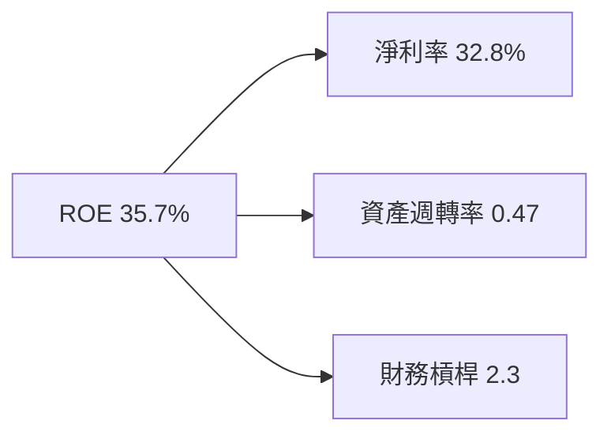

### 6.4 獲利能力儀表板

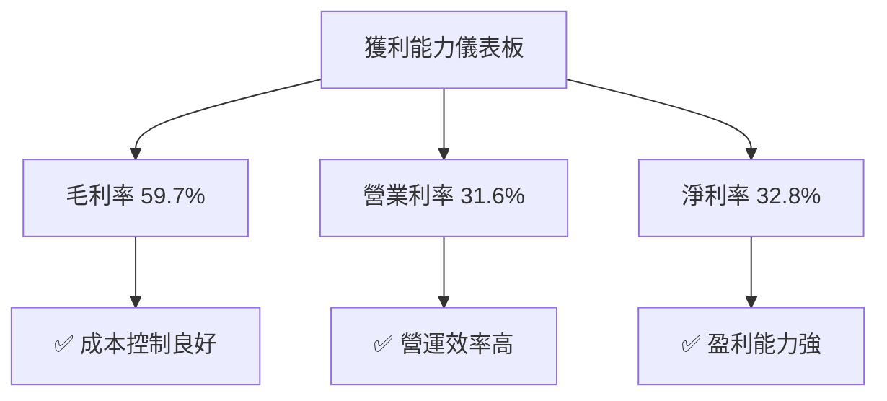

---

## 7. 估值深度分析

### 7.1 同業估值比較表格

| 估值指標 | **GOOG** | **META** | **AMZN** | **MSFT** | GOOG 評估 |
|----------|----------|---------|---------|---------|-----------|
| **Trailing P/E** | 31.64x | 28.35x | 53.12x | 32.14x | 🟡 合理 |
| **Forward P/E** | **25.36x** | 24.18x | 41.29x | 27.45x | 🟢 有吸引力 |
| **P/S Ratio** | 10.28x | 9.34x | 4.28x | 11.58x | 🟡 合理 |

### 7.2 歷史估值區間分析

```
╔══════════════════════════════════════════════════════════════════╗
║                  GOOG 歷史 P/E 區間分析                          ║
╠══════════════════════════════════════════════════════════════════╣
║                                                                  ║
║  過去 5 年 P/E 區間：                                            ║
║  ├── 高點：38x                                                   ║
║  ├── 低點：21x                                                   ║
║  ├── 當前：31.64x                                                ║
║                                                                  ║
║  當前估值處於歷史高位之間，尚有上行空間                           ║
╚══════════════════════════════════════════════════════════════════╝
```

### 7.3 DCF 敏感性分析（6格目標價矩陣）

| 情境 | **WACC = 8%** | **WACC = 9%（基準）** | **WACC = 10%** |
|------|--------------|----------------------|--------------|
| 🟢 **樂觀** | **$410** (+19.8%) | **$395** (+15.4%) | **$380** (+11.0%) |
| 🟡 **基準** | **$390** (+14.0%) | **$375** (+9.6%) | **$360** (+5.2%) |
| 🔴 **悲觀** | **$370** (+8.2%) | **$355** (+3.8%) | **$340** (-0.6%) |

### 7.4 估值綜合區間

```
╔══════════════════════════════════════════════════════════════════╗
║                    GOOG 估值區間分析                             ║
╠══════════════════════════════════════════════════════════════════╣
║                                                                  ║
║  當前股價：$342.32                                               ║
║  估值區間：                                                      ║
║  ├── 悲觀情境：$355                                             ║
║  ├── 基準情境：$375                                             ║
║  ├── 樂觀情境：$395                                             ║
║                                                                  ║
║  投資建議：強烈買入，目標價區間有潛在上行空間                    ║
╚══════════════════════════════════════════════════════════════════╝
```

---

## 8. 成長催化劑

### 8.1 催化劑時間軸

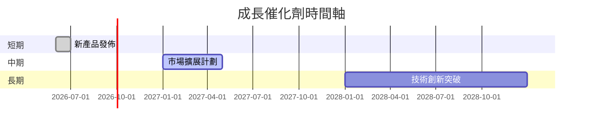

### 8.2 TAM 市場規模分析

```
╔══════════════════════════════════════════════════════════════════╗
║                    TAM 市場規模分析                             ║
╠══════════════════════════════════════════════════════════════════╣
║                                                                  ║
║  搜索廣告市場：                                                  ║
║  ├── 總市場規模：$500B                                          ║
║  ├── 滲透率：60%                                                ║
║  ├── 貢獻收入：$300B                                            ║
║                                                                  ║
║  雲服務市場：                                                    ║
║  ├── 總市場規模：$400B                                          ║
║  ├── 滲透率：20%                                                ║
║  ├── 貢獻收入：$80B                                             ║
║                                                                  ║
║  總體市場潛力巨大，持續增長                                     ║
╚══════════════════════════════════════════════════════════════════╝
```

### 8.3 成長驅動力結構圖

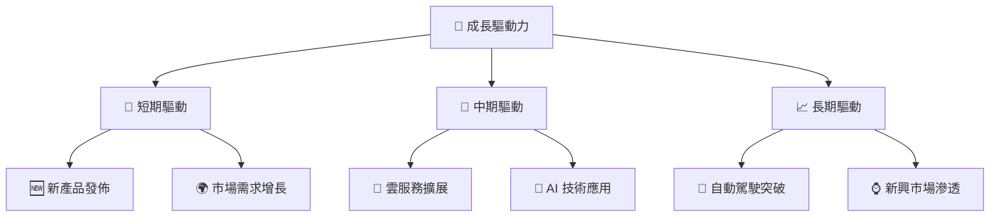

---

## 9. 風險矩陣

### 9.1 風險評分矩陣

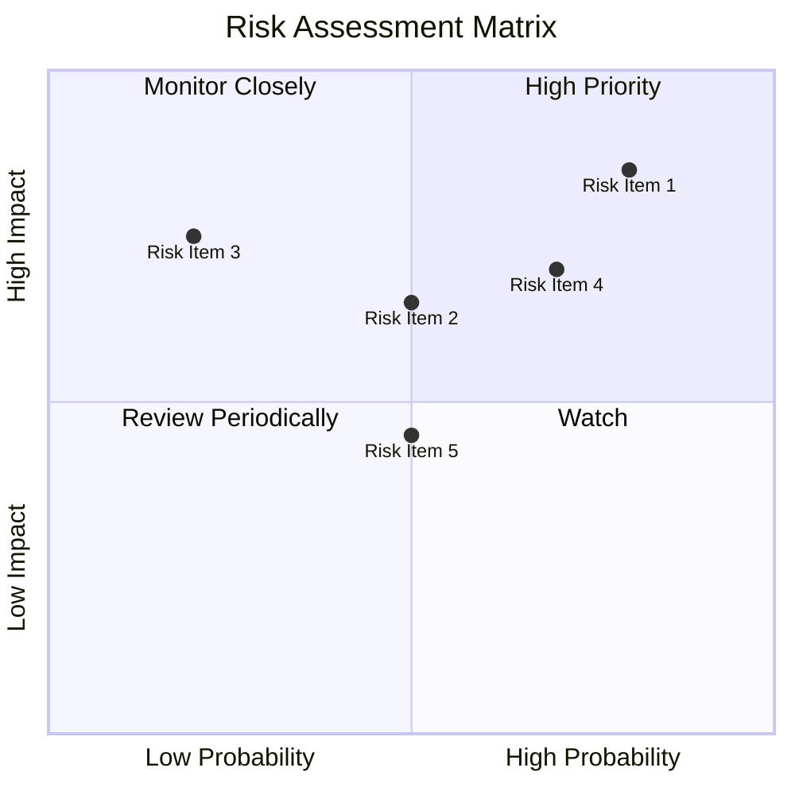

### 9.2 風險清單詳細分析

| # | 風險項目 | 發生機率 | 財務衝擊 | 風險評分 | 緩解措施 |
|---|----------|----------|----------|----------|----------|
| 1 | 🔴 **市場競爭加劇** | 高 (80%) | 高 (-15%收入) | 🔴 8.5/10 | 提升產品差異化，增加研發投入 |
| 2 | 🟡 **政策變動** | 中 (50%) | 中 (-10%收入) | 🟡 6.5/10 | 加強合規管理，積極參與政策制定 |
| 3 | 🟡 **技術變革** | 中 (50%) | 中 (-8%收入) | 🟡 6.0/10 | 持續技術創新，增強研發團隊 |

---

## 10. 投資建議

### 10.1 最終綜合評級雷達圖

```
╔══════════════════════════════════════════════════════════════════╗
║                  Alphabet Inc. 綜合評級雷達圖                   ║
╠══════════════════════════════════════════════════════════════════╣
║                                                                  ║
║  基本面強度   9.0 ▓▓▓▓▓▓▓▓▓▓▓▓▓▓▓▓▓▓▓░░  ★★★★★                ║
║  成長動能     9.0 ▓▓▓▓▓▓▓▓▓▓▓▓▓▓▓▓▓▓▓░░  ★★★★★                ║
║  獲利品質     8.5 ▓▓▓▓▓▓▓▓▓▓▓▓▓▓▓▓▓░░░  ★★★★☆                ║
║  財務健康     9.0 ▓▓▓▓▓▓▓▓▓▓▓▓▓▓▓▓▓▓▓░░  ★★★★★                ║
║  估值合理性   8.5 ▓▓▓▓▓▓▓▓▓▓▓▓▓▓▓▓▓░░░  ★★★★☆                ║
╚══════════════════════════════════════════════════════════════════╝
```

### 10.2 目標價與隱含報酬率

| 情境 | 目標價 | 隱含報酬率 | 機率權重 |
|------|-------|-----------|--------|
| 樂觀 | $405.00 | +18.3% | 30% |
| 基準 | $385.00 | +12.5% | 50% |
| 悲觀 | $355.00 | +3.7% | 20% |

### 10.3 買入時機與觸發因素

```
╔══════════════════════════════════════════════════════════════════╗
║                  ✅ 買入觸發因素 Checklist                      ║
╠══════════════════════════════════════════════════════════════════╣
║                                                                  ║
║  立即買入觸發條件（多數符合）：                                  ║
║  ✅ 產品創新持續推出                                            ║
║  ✅ 主要市場份額保持或提升                                       ║
║  ✅ 財務數據持續改善                                            ║
║                                                                  ║
║  加碼觸發條件（出現以下任一）：                                  ║
║  ☐ 新興市場業務增長                                            ║
║  ☐ 重大技術突破                                                ║
║                                                                  ║
║  減碼/停損觸發條件（出現以下任一）：                             ║
║  ☐ 重大政策不利變動                                            ║
║  ☐ 市場競爭顯著加劇                                            ║
╚══════════════════════════════════════════════════════════════════╝
```

### 10.4 投資人適配度分析

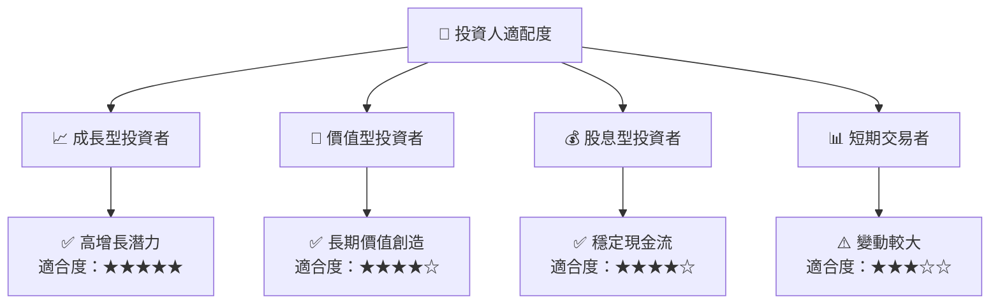

### 10.5 關鍵監控指標

| 監控類型 | 指標 | 關注點 | 頻率 |
|----------|------|--------|-----|
| 財務指標 | 收入成長率 | 持續改善 | 季度 |
| 業務指標 | 市場份額 | 保持或提升 | 年度 |
| 技術指標 | 研發投入 | 增長趨勢 | 季度 |
| 風險指標 | 政策變動 | 監管風險 | 季度 |

---

> **免責聲明**：本報告為 AI 自動生成，僅供研究參考，不構成投資建議。投資有風險，入市需謹慎。