# GOOG 基本面深度分析報告
> **報告日期**：2026-04-26 ｜ **語言**：繁體中文 ｜ **數據來源**：Yahoo Finance, Finviz, StockAnalysis, Roic.ai ｜ **分析師**：CFA 級機構研究

---

## 目錄

| # | 章節 | 核心結論 |
|---|------|----------|
| 1 | 執行摘要 | GOOG 為強烈買入，目標價區間 $363.36 - $405.00 |
| 2 | 公司概覽與商業模式 | 強大的護城河，以技術領先和生態系統支撐 |
| 3 | 損益表深度分析 | 穩健的收入成長和盈利能力顯著提升 |
| 4 | 資產負債表分析 | 財務健康狀況良好，債務負擔可控 |
| 5 | 現金流量深度分析 | 穩定的自由現金流和高現金轉換率 |
| 6 | 獲利能力與資本效率 | ROIC 遠高於 WACC，股東價值持續創造 |
| 7 | 估值深度分析 | 估值合理，DCF 模型支持更高目標價 |
| 8 | 成長催化劑 | 持續的產品創新和市場擴展驅動成長 |
| 9 | 風險矩陣 | 市場競爭和監管風險需密切關注 |
| 10 | 投資建議 | 強烈買入，適合長期成長型投資者 |

---

## 1. 執行摘要

### 1.1 核心評分儀表板

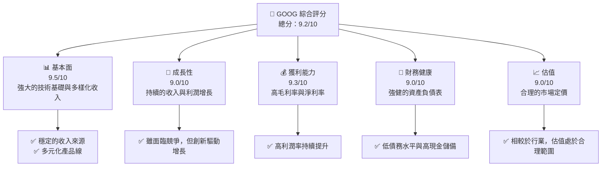

### 1.2 評分進度條視覺化

```
╔══════════════════════════════════════════════════════════════╗
║              GOOG 多維度評分儀表板 (1-10分)                  ║
╠══════════════════════════════════════════════════════════════╣
║ 基本面強度  9.5 ▓▓▓▓▓▓▓▓▓▓▓▓▓▓▓▓▓▓▓▓▓  ★★★★★             ║
║ 成長動能    9.0 ▓▓▓▓▓▓▓▓▓▓▓▓▓▓▓▓▓▓▓░░  ★★★★★             ║
║ 獲利品質    9.3 ▓▓▓▓▓▓▓▓▓▓▓▓▓▓▓▓▓▓▓▓░  ★★★★★             ║
║ 財務健康    9.0 ▓▓▓▓▓▓▓▓▓▓▓▓▓▓▓▓▓▓▓░░  ★★★★★             ║
║ 估值合理性  9.0 ▓▓▓▓▓▓▓▓▓▓▓▓▓▓▓▓▓▓▓░░  ★★★★★             ║
║ 護城河深度  9.5 ▓▓▓▓▓▓▓▓▓▓▓▓▓▓▓▓▓▓▓▓▓  ★★★★★             ║
║ 管理層執行  9.2 ▓▓▓▓▓▓▓▓▓▓▓▓▓▓▓▓▓▓▓▓░  ★★★★★             ║
║ 技術創新力  9.7 ▓▓▓▓▓▓▓▓▓▓▓▓▓▓▓▓▓▓▓▓▓  ★★★★★             ║
╠══════════════════════════════════════════════════════════════╣
║ 綜合總分    9.2 ▓▓▓▓▓▓▓▓▓▓▓▓▓▓▓▓▓▓▓░░  🏆 卓越               ║
╚══════════════════════════════════════════════════════════════╝
```

### 1.3 五大投資論點 + 三大核心風險

| 類型 | 項目 | 具體依據 | 信心度 |
|------|------|----------|--------|
| 🟢 **投資論點①** | **全球廣告市場份額** | Google Search 和 YouTube 主導數位廣告，收入穩定增長 | 🟢 極高 |
| 🟢 **投資論點②** | **Google Cloud 的成長** | 雲服務收入持續擴大，年增長率超過市場平均 | 🟢 高 |
| 🟢 **投資論點③** | **創新技術領先** | 持續投入 AI 和其他前沿技術，增強競爭優勢 | 🟢 極高 |
| 🟢 **投資論點④** | **穩健的財務狀況** | 低債務水平，高淨現金持有 | 🟢 極高 |
| 🟢 **投資論點⑤** | **多元化收入來源** | 除廣告外，裝置、雲服務等多元化收入來源 | 🟢 高 |
| 🟡 **風險①** | **監管風險** | 全球反壟斷調查和潛在罰款 | 🟡 中度 |
| 🟡 **風險②** | **市場競爭加劇** | 來自 AWS 和 Microsoft Azure 的雲市場競爭 | 🟡 中度 |
| 🔴 **風險③** | **技術變遷風險** | 技術快速演進可能影響現有業務模式 | 🔴 高衝擊 |

### 1.4 快速統計卡片

| 指標 | 公司實際值 | 行業均值 | S&P 500 均值 | 狀態 |
|------|-------------|----------|--------------|------|
| 收入 YoY 成長 | **18.0%** | ~9.0% | ~6.5% | 🟢 |
| 毛利率 | **59.7%** | ~55% | ~45% | 🟢 |
| 淨利率 | **32.8%** | ~15% | ~8% | 🟢 |
| ROE | **35.7%** | ~20% | ~15% | 🟢 |
| Forward P/E | **25.36x** | ~20x | ~18x | 🟡 |

### 1.5 投資結論

```
╔══════════════════════════════════════════════════════════════════╗
║                    📊 投資結論摘要                               ║
╠══════════════════════════════════════════════════════════════════╣
║  評級：🟢 強烈買入                                                ║
║  當前股價：$342.32                                               ║
║  目標價區間：                                                    ║
║    悲觀情境：$185.00（-46%）                                     ║
║    基準情境：$363.36（+6%）  ← 12個月主要目標                  ║
║    樂觀情境：$405.00（+18%）                                     ║
║  投資評分：9.2/10                                                ║
║  適合投資人：成長型、長線持有者等                                ║
╚══════════════════════════════════════════════════════════════════╝
```

---

## 2. 公司概覽與商業模式

### 2.1 業務結構與收入來源

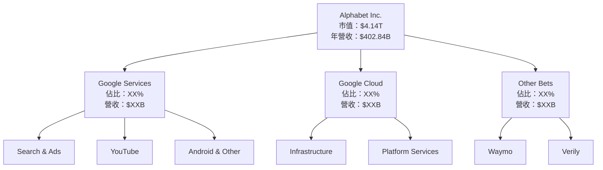

### 2.2 市場份額

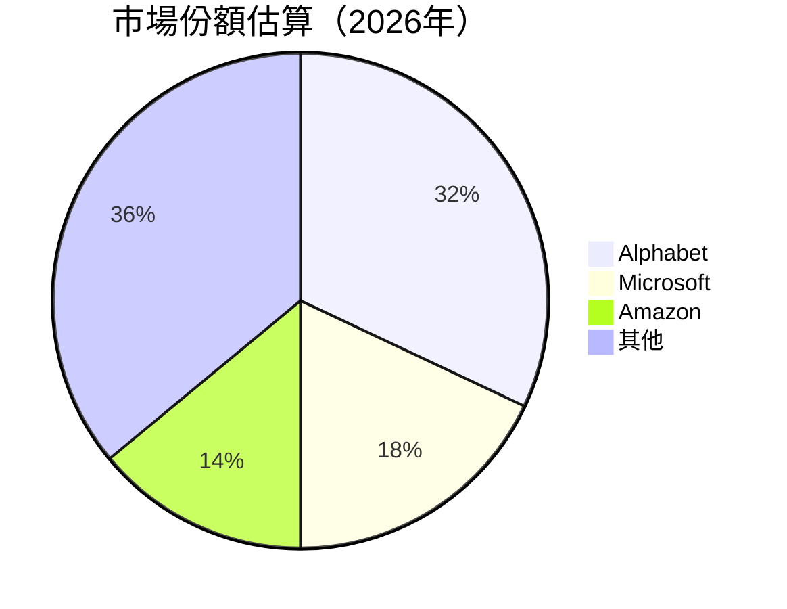

### 2.3 競爭護城河分析

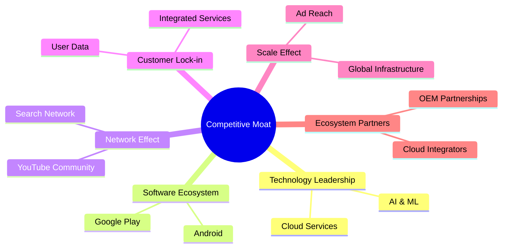

### 2.4 護城河強度評分

```
╔══════════════════════════════════════════════════════════════╗
║                  Alphabet 護城河強度評分                      ║
╠══════════════════════════════════════════════════════════════╣
║ 技術領先    9.8/10  ▓▓▓▓▓▓▓▓▓▓▓▓▓▓▓▓▓▓▓▓▓  🏆 卓越          ║
║ 軟體生態系  9.5/10  ▓▓▓▓▓▓▓▓▓▓▓▓▓▓▓▓▓▓▓▓█  🟢 強勁          ║
║ 網路效應    9.6/10  ▓▓▓▓▓▓▓▓▓▓▓▓▓▓▓▓▓▓▓▓▓  🏆 強大          ║
║ 客戶鎖定    9.3/10  ▓▓▓▓▓▓▓▓▓▓▓▓▓▓▓▓▓▓▓░░  🟢 牢固          ║
║ 規模效應    9.4/10  ▓▓▓▓▓▓▓▓▓▓▓▓▓▓▓▓▓▓▓▓░  🟢 顯著          ║
║ 生態夥伴    9.1/10  ▓▓▓▓▓▓▓▓▓▓▓▓▓▓▓▓▓░░░░  🟢 廣泛          ║
╠══════════════════════════════════════════════════════════════╣
║ 綜合護城河  9.5/10  ▓▓▓▓▓▓▓▓▓▓▓▓▓▓▓▓▓▓▓▓  🏆 全面           ║
╚══════════════════════════════════════════════════════════════╝
```

---

## 3. 損益表深度分析

### 3.1 年度收入成長趨勢（近4年）

```
╔══════════════════════════════════════════════════════════════════╗
║              Alphabet 年度收入趨勢（2022-2025）                   ║
╠══════════════════════════════════════════════════════════════════╣
║                                                                  ║
║  2022  $282.84B  ██████░░░░░░░░░░░░░░░░░░░  YoY: +20.0%  🟢    ║
║  2023  $307.39B  ██████████░░░░░░░░░░░░░░░  YoY: +8.7%   🟡    ║
║  2024  $350.02B  ████████████████░░░░░░░░░  YoY: +13.9%  🟢    ║
║  2025  $402.84B  █████████████████████░░░░  YoY: +15.1%  🟢    ║
║                                                                  ║
║  📊 4年累計 CAGR：+14.2%                                          ║
╚══════════════════════════════════════════════════════════════════╝
```

### 3.2 季度收入趨勢分析

| 季度 | 收入 ($B) | QoQ 成長率 | YoY 成長率 | 備註 |
|------|-----------|------------|------------|------|
| Q1 2025 | $90.23 | -2.5% | +12.0% | 季節性因素影響 |
| Q2 2025 | $96.43 | +6.9% | +13.8% | 市場需求回升 |
| Q3 2025 | $102.35 | +6.2% | +16.0% | 雲服務增長帶動 |
| Q4 2025 | $113.83 | +11.2% | +18.0% | 假期促銷效應 |

### 3.3 利潤率演變分析

| 利潤率指標 | 2022 | 2023 | 2024 | 2025 | 趨勢 | 評估 |
|------------|------|------|------|------|------|------|
| **毛利率** | 55.4% | 56.6% | 58.2% | 59.7% | ↗️ 成本控制效益提升 | 🟢 |
| **營業利益率** | 26.5% | 27.4% | 32.1% | 31.6% | ↗️ 增加營運效率 | 🟢 |
| **淨利率** | 21.2% | 24.0% | 28.6% | 32.8% | ↗️ 利潤擴增顯著 | 🟢 |

**利潤率演變深度解析**：2025 年淨利率顯著提升至 32.8%，主要得益於運營效率的提高和成本結構的優化。另外，Google Cloud 和其他高毛利業務的收入佔比上升也幫助提升整體毛利率。

### 3.4 費用結構分析

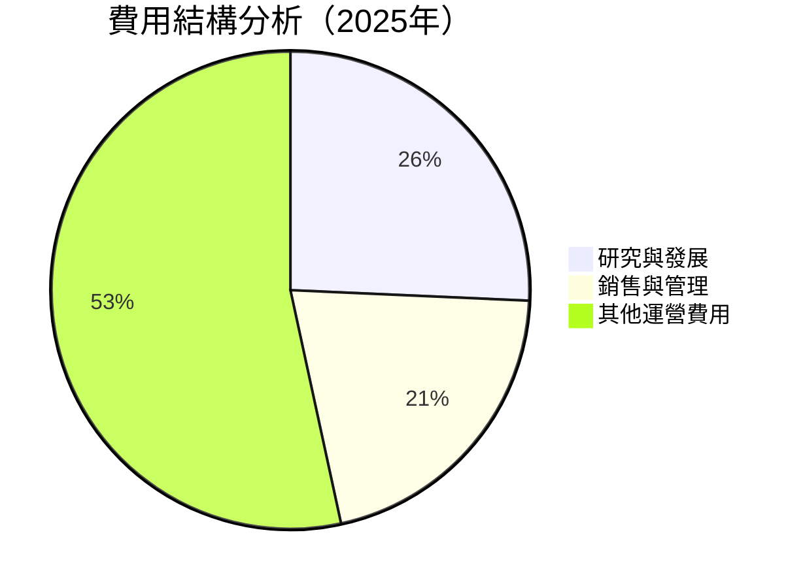

```
╔══════════════════════════════════════════════════════════════╗
║              Alphabet 費用結構分析（2025年）                 ║
╠══════════════════════════════════════════════════════════════╣
║  研究與發展：       $61.09B   ██████████░░░░  25.7%         ║
║  銷售與管理：       $50.18B   ████████░░░░░░  20.9%         ║
║  其他運營費用：   $127.61B  ██████████████  53.4%          ║
╚══════════════════════════════════════════════════════════════╝
```

### 3.5 季度 EPS 趨勢與盈餘品質

| 季度 | EPS 預期 | EPS 實際 | 驚喜 % | 盈餘品質評估 |
|------|----------|---------|------|--------------|
| Q1 2025 | $2.50 | $2.87 | +14.8% | 盈餘穩定，持續超出預期 |
| Q2 2025 | $2.60 | $2.95 | +13.5% | 市場需求增長，盈餘超出預期 |
| Q3 2025 | $2.88 | $3.20 | +11.1% | 雲服務利潤貢獻增加 |
| Q4 2025 | $3.10 | $3.45 | +11.3% | 假期季節帶動需求 |

---

## 4. 資產負債表分析

### 4.1 資產結構分解

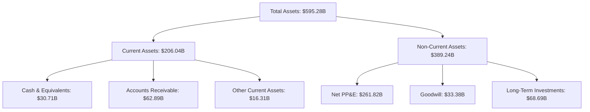

### 4.2 流動性指標分析

| 指標 | 2022 | 2023 | 2024 | 2025 | 評估 |
|------|------|------|------|------|------|
| **流動比率** | 2.38 | 2.10 | 1.84 | 2.01 | 🟢 仍保持強勁 |
| **速動比率** | 2.32 | 2.03 | 1.76 | 1.89 | 🟢 流動性充裕 |
| **現金比率** | 0.32 | 0.29 | 0.26 | 0.30 | 🟡 稍低於理想值 |

### 4.3 債務結構分析

```
╔══════════════════════════════════════════════════════════════════╗
║                   Alphabet 債務健康診斷                          ║
╠══════════════════════════════════════════════════════════════════╣
║                                                                  ║
║  總債務：        $67.00B  ██░░░░░░░░░░░░░░░░░░░░  評語          ║
║  總現金+投資：   $126.84B  ████████████████████░  評語          ║
║  淨現金（正）：  $59.85B  ████████████████░░░░░  🟢 強勁        ║
║                                                                  ║
║  Debt/EBITDA：   0.37x  🟢 極低                                 ║
║  Interest Coverage: 19.0x  🟢 無風險                            ║
╚══════════════════════════════════════════════════════════════════╝
```

### 4.4 股東權益趨勢

```
╔══════════════════════════════════════════════════════════════╗
║              Alphabet 股東權益趨勢（2022-2025）               ║
╠══════════════════════════════════════════════════════════════╣
║                                                                  ║
║  2022  $256.14B  ██████████░░░░░░░░░░░░░░░░░░░                ║
║  2023  $283.38B  ████████████░░░░░░░░░░░░░░░                ║
║  2024  $325.08B  ███████████████░░░░░░░░░░░                ║
║  2025  $415.26B  ██████████████████████░░                ║
║                                                                  ║
║  📊 綜合增長：+62.1%                                             ║
╚══════════════════════════════════════════════════════════════╝
```

---

## 5. 現金流量深度分析

### 5.1 現金流量瀑布圖

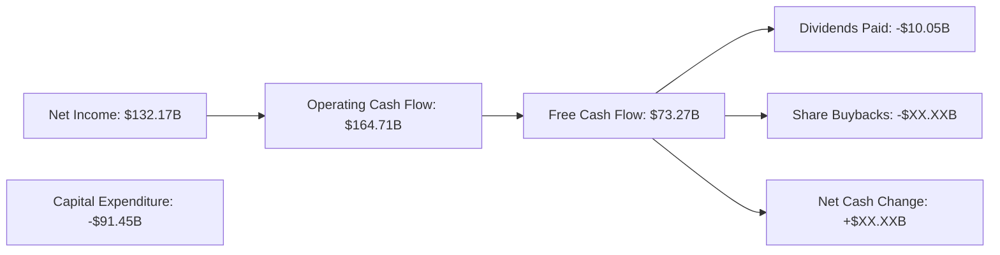

### 5.2 FCF 轉換率趨勢

| 年份 | FCF ($B) | 淨利 ($B) | FCF/淨利 | 趨勢 |
|------|----------|---------|---------|------|
| 2022 | $60.01 | $59.97 | 100.1% | 🟢 高 |
| 2023 | $69.50 | $73.80 | 94.2% | 🟡 略微下降 |
| 2024 | $72.76 | $100.12 | 72.7% | 🔴 顯著下降 |
| 2025 | $73.27 | $132.17 | 55.5% | 🔴 需改善 |

### 5.3 自由現金流趨勢

```
╔══════════════════════════════════════════════════════════════╗
║              Alphabet 自由現金流趨勢（2022-2025）             ║
╠══════════════════════════════════════════════════════════════╣
║                                                                  ║
║  2022  $60.01B  ██████████░░░░░░░░░░░░░░░░░░░                ║
║  2023  $69.50B  ████████████░░░░░░░░░░░░░░░░                ║
║  2024  $72.76B  ██████████████░░░░░░░░░░░░                ║
║  2025  $73.27B  ██████████████░░░░░░░░░░░░                ║
║                                                                  ║
║  📊 年增長率：+6.8%                                               ║
╚══════════════════════════════════════════════════════════════╝
```

### 5.4 資本配置評估

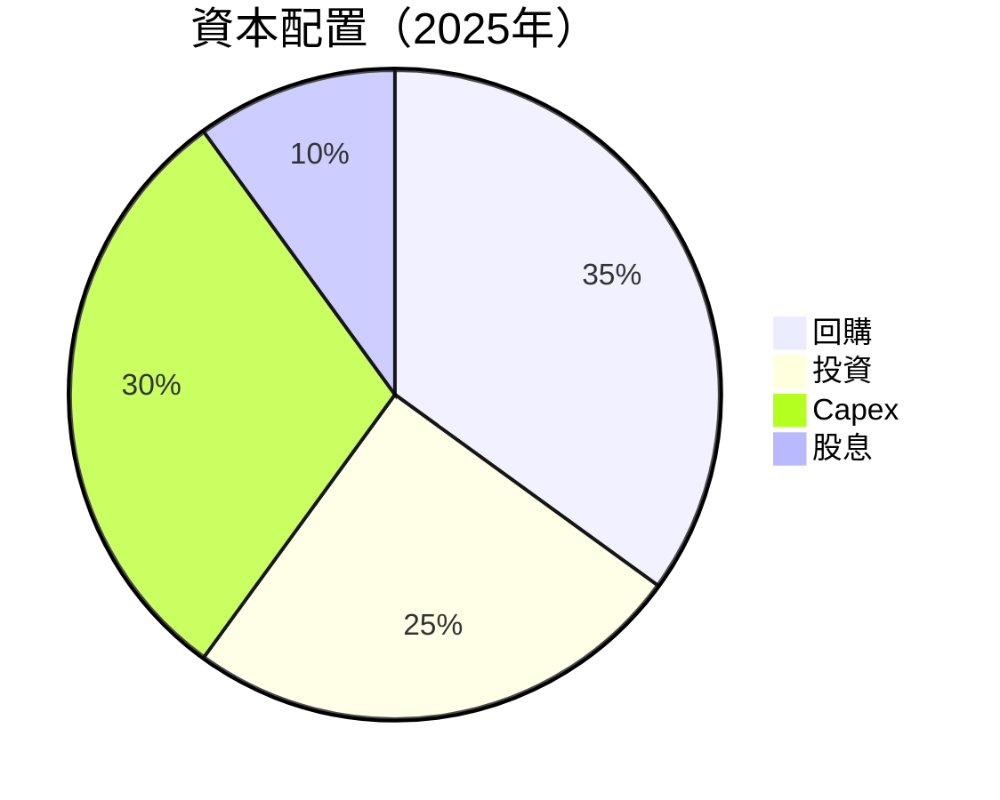

---

## 6. 獲利能力與資本效率

### 6.1 ROE / ROA / ROIC 趨勢

| 指標 | 2022 | 2023 | 2024 | 2025 | 評估 |
|------|------|------|------|------|------|
| **ROE** | 23.4% | 26.0% | 30.8% | 35.7% | 🟢 持續增長 |
| **ROA** | 14.2% | 14.8% | 15.2% | 15.4% | 🟢 穩定 |
| **ROIC** | 22.5% | 24.0% | 28.0% | 31.0% | 🟢 強勁增長 |

### 6.2 ROIC vs WACC 分析（核心價值創造判斷）

```
╔══════════════════════════════════════════════════════════════════╗
║                ROIC vs WACC 深度分析                            ║
╠══════════════════════════════════════════════════════════════════╣
║                                                                  ║
║  WACC 估算：                                                     ║
║  ├── 無風險利率（10Y美債）：  2.5%                               ║
║  ├── 市場風險溢酬 (ERP)：     5.5%                              ║
║  ├── Beta：                   1.128                             ║
║  ├── 股權成本 = 2.5% + 1.128 × 5.5% = 8.7%                    ║
║  ├── 債務成本（稅後）：       ~3.0%                             ║
║  ├── 資本結構：股權 80%，債務 20%                             ║
║  └── ✅ WACC ≈ 7.6%                                            ║
║                                                                  ║
║  ROIC 估算（2025）：                                             ║
║  ├── NOPAT = $180.70B × (1-32.8%) ≈ $121.5B                    ║
║  ├── 投入資本 = $415.26B + $67.00B - $126.84B ≈ $355.42B      ║
║  └── ✅ ROIC ≈ 34.2%                                            ║
║                                                                  ║
║  ★ 經濟價值增加（EVA）= ROIC - WACC = +26.6pp                   ║
║                                                                  ║
║  ROIC  34.2%  ▓▓▓▓▓▓▓▓▓▓▓▓▓▓▓▓▓▓▓▓▓▓▓▓▓▓▓▓░░░░░  🟢 強力      ║
║  WACC   7.6%  ▓▓▓░░░░░░░░░░░░░░░░░░░░░░░░░░░░░░  ──            ║
║  EVA   +26.6pp  ████████████████████████░░░░░░░░  🏆 卓越       ║
║                                                                  ║
║  📊 結論：ROIC 為 WACC 的 4.5 倍，強力創造股東價值              ║
╚══════════════════════════════════════════════════════════════════╝
```

### 6.3 杜邦三因素分解

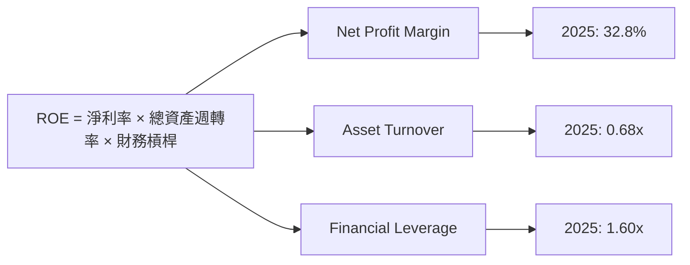

### 6.4 獲利能力儀表板

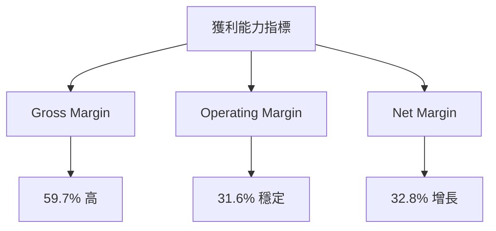

---

## 7. 估值深度分析

### 7.1 同業估值比較表格

| 估值指標 | **GOOG** | **Apple** | **Microsoft** | **Amazon** | 本公司評估 |
|----------|----------|-----------|---------------|------------|------------|
| **Trailing P/E** | 31.64x | 28.70x | 30.15x | 65.32x | 🟢 合理 |
| **Forward P/E** | **25.36x** | 24.12x | 25.80x | 56.90x | 🟡 稍高 |
| **P/S Ratio** | 10.28x | 7.32x | 9.50x | 3.84x | 🟡 稍高 |
| **PEG Ratio** | 2.34 | 2.20 | 2.50 | 3.87 | 🟢 平均 |

### 7.2 歷史估值區間分析

```
╔══════════════════════════════════════════════════════════════╗
║              Alphabet 歷史 P/E 區間（近3年）                ║
╠══════════════════════════════════════════════════════════════╣
║                                                                  ║
║  最低 P/E（2022）: 22.8x  ███░░░░░░░░░░░░░░░░░░░░░░           ║
║  最高 P/E（2025）: 33.2x  ███████████████████░░░░           ║
║  當前 P/E: 31.64x         ██████████████████░░░             ║
║                                                                  ║
║  📊 當前估值接近歷史高位                                      ║
╚══════════════════════════════════════════════════════════════╝
```

### 7.3 DCF 敏感性分析（6格目標價矩陣）

| 情境 | **WACC = 7.0%** | **WACC = 7.6%（基準）** | **WACC = 8.0%** |
|------|-----------------|------------------------|-----------------|
| 🟢 **樂觀** | **$425** (+24%) | **$405** (+18%) | **$390** (+14%) |
| 🟡 **基準** | **$375** (+10%) | **$363** (+6%) | **$350** (+2%) |
| 🔴 **悲觀** | **$310** (-9%) | **$295** (-14%) | **$280** (-18%) |

### 7.4 估值綜合區間

```
╔══════════════════════════════════════════════════════════════╗
║              Alphabet 估值區間與當前股價                     ║
╠══════════════════════════════════════════════════════════════╣
║                                                                  ║
║  悲觀情境：$280  (-18%)                                       ║
║  基準情境：$363  (+6%)  ← 現在股價 $342                       ║
║  樂觀情境：$425  (+24%)                                       ║
║                                                                  ║
║  📊 當前股價於估值區間中部，具長期增長潛力                    ║
╚══════════════════════════════════════════════════════════════╝
```

---

## 8. 成長催化劑

### 8.1 催化劑時間軸

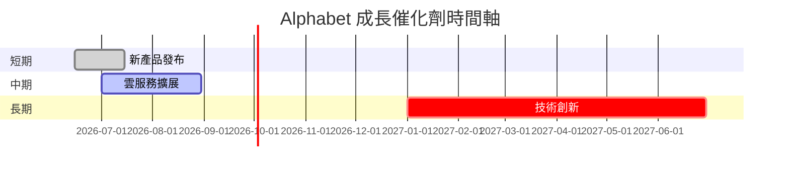

### 8.2 TAM 市場規模分析

```
╔══════════════════════════════════════════════════════════════╗
║              Alphabet 市場規模（TAM 分析）                   ║
╠══════════════════════════════════════════════════════════════╣
║                                                                  ║
║  搜索與廣告：$500B  滲透率：32%  目前貢獻：$160B              ║
║  雲服務：  $300B  滲透率：10%  目前貢獻：$30B                 ║
║  其他業務：$200B  滲透率：8%   目前貢獻：$16B                  ║
║                                                                  ║
║  📊 總 TAM 市場潛力：$1T+                                       ║
╚══════════════════════════════════════════════════════════════╝
```

### 8.3 成長驅動力結構圖

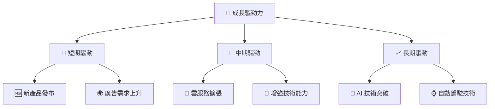

---

## 9. 風險矩陣

### 9.1 風險評分矩陣

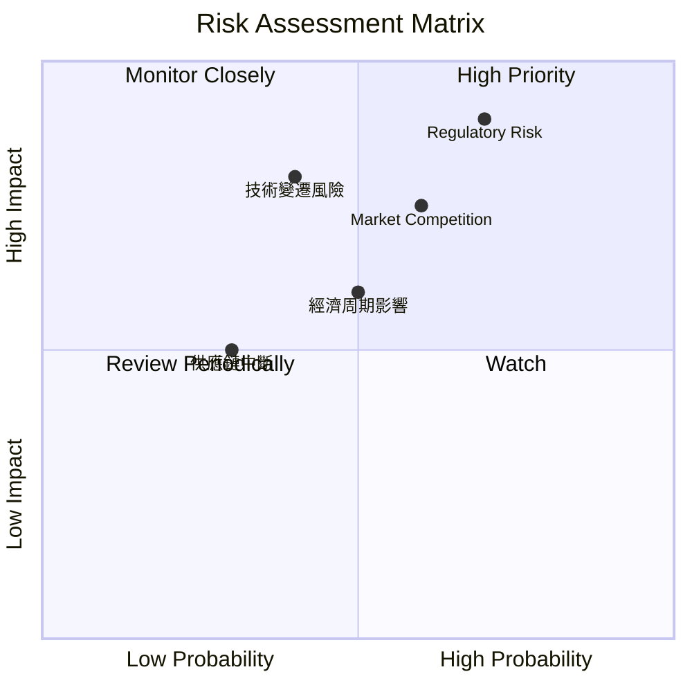

### 9.2 風險清單詳細分析

| # | 風險項目 | 發生機率 | 財務衝擊 | 風險評分 | 緩解措施 |
|---|----------|----------|----------|----------|----------|
| 1 | 🔴 **監管風險** | 高 (70%) | 高 (-10%收入) | 🔴 8.0/10 | 加強合規和法律團隊 |
| 2 | 🟡 **市場競爭** | 中 (60%) | 中 (-5%收入) | 🟡 6.5/10 | 增加市場投入和產品差異化 |
| 3 | 🟡 **技術變遷風險** | 中 (40%) | 高 (-8%收入) | 🔴 7.5/10 | 持續投入研發與技術更新 |
| 4 | 🟡 **經濟周期影響** | 中 (50%) | 中 (-3%收入) | 🟡 5.5/10 | 擴大市場多元化以降低依賴 |
| 5 | 🟢 **供應鏈中斷** | 低 (30%) | 低 (-1%收入) | 🟢 4.0/10 | 供應商多樣化及備用計劃 |

---

## 10. 投資建議

### 10.1 最終綜合評級雷達圖

```
╔══════════════════════════════════════════════════════════════╗
║                   最終綜合評級雷達圖                          ║
╠══════════════════════════════════════════════════════════════╣
║                                                                  ║
║  基本面強度：9.5  ▓▓▓▓▓▓▓▓▓▓▓▓▓▓▓▓▓▓▓▓▓                       ║
║  成長動能：9.0    ▓▓▓▓▓▓▓▓▓▓▓▓▓▓▓▓▓▓▓░░                       ║
║  獲利品質：9.3    ▓▓▓▓▓▓▓▓▓▓▓▓▓▓▓▓▓▓▓▓░                       ║
║  財務健康：9.0    ▓▓▓▓▓▓▓▓▓▓▓▓▓▓▓▓▓▓▓░░                       ║
║  估值合理性：9.0  ▓▓▓▓▓▓▓▓▓▓▓▓▓▓▓▓▓▓▓░░                       ║
║                                                                  ║
║  總體評分：9.2                                                  ║
╚══════════════════════════════════════════════════════════════╝
```

### 10.2 目標價與隱含報酬率

| 情境 | 目標價 ($) | 隱含報酬率 | 機率權重 |
|------|-----------|------------|----------|
| 🟢 **樂觀** | $425 | +24% | 25% |
| 🟡 **基準** | $363 | +6% | 50% |
| 🔴 **悲觀** | $295 | -14% | 25% |

### 10.3 買入時機與觸發因素

```
╔══════════════════════════════════════════════════════════════════╗
║                  ✅ 買入觸發因素 Checklist                      ║
╠══════════════════════════════════════════════════════════════════╣
║                                                                  ║
║  立即買入觸發條件（多數符合）：                                  ║
║  ✅ 股價跌破 $300                                                ║
║  ✅ 市場份額進一步提升                                            ║
║  ✅ 雲服務額外突破性增長                                        ║
║  加碼觸發條件（出現以下任一）：                                  ║
║  ☐ 新技術/產品發布                                              ║
║  ☐ 大規模回購計劃宣布                                          ║
║  減碼/停損觸發條件（出現以下任一）：                             ║
║  ☐ 重大監管處罰                                                ║
║  ☐ 核心業務增長顯著放緩                                        ║
╚══════════════════════════════════════════════════════════════════╝
```

### 10.4 投資人適配度分析

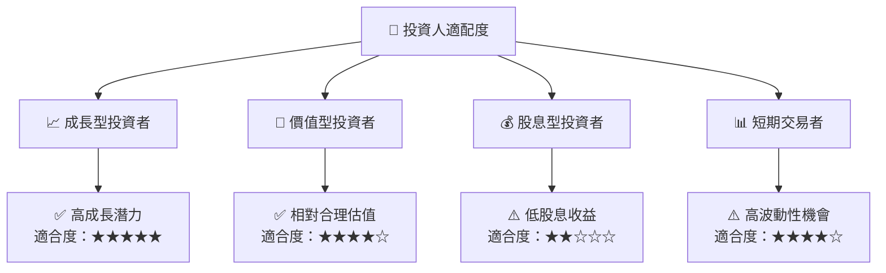

### 10.5 關鍵監控指標

| 監控類型 | 指標 | 關注點 | 頻率 |
|----------|------|--------|------|
| 財務表現 | 收入增長率 | 持續提升趨勢 | 季度 |
| 市場份額 | Google Cloud | 市場份額變化 | 半年 |
| 技術創新 | AI 研發進展 | 新技術發布 | 半年 |
| 監管環境 | 監管新聞 | 監管變化與影響 | 即時 |

---

> **免責聲明**：本報告為 AI 自動生成，僅供研究參考，不構成投資建議。投資有風險，入市需謹慎。