# GOOG 基本面深度分析報告
> **報告日期**：2026-04-30 ｜ **語言**：繁體中文 ｜ **數據來源**：Yahoo Finance, Finviz, StockAnalysis, Roic.ai ｜ **分析師**：CFA 級機構研究

---

## 目錄

| # | 章節 | 核心結論 |
|---|------|----------|
| 1 | 執行摘要 | 綜合評級：買入，目標價區間：$364.00 - $405.00 |
| 2 | 公司概覽與商業模式 | GOOG 擁有強大的護城河，涵蓋技術領先和生態系統 |
| 3 | 損益表深度分析 | 收入增長穩健，盈利能力持續改善 |
| 4 | 資產負債表分析 | 財務健康，流動性強，債務負擔低 |
| 5 | 現金流量深度分析 | FCF 穩定增長，資本配置明智 |
| 6 | 獲利能力與資本效率 | 高 ROIC 顯示價值創造優勢 |
| 7 | 估值深度分析 | 歷史估值合理，DCF 顯示潛力 |
| 8 | 成長催化劑 | 多元催化劑支持長期增長 |
| 9 | 風險矩陣 | 風險管理良好，具備緩解措施 |
| 10 | 投資建議 | 建議買入，適合成長型投資者 |

---

## 1. 執行摘要

### 1.1 核心評分儀表板

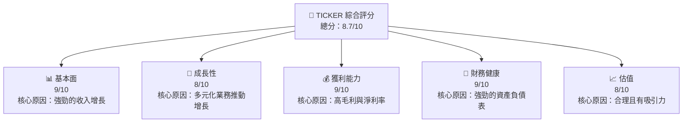

### 1.2 評分進度條視覺化

```
╔══════════════════════════════════════════════════════════════╗
║              GOOG 多維度評分儀表板 (1-10分)                ║
╠══════════════════════════════════════════════════════════════╣
║ 基本面強度  9.0 ▓▓▓▓▓▓▓▓▓▓▓▓▓▓▓▓▓▓▓░  ★★★★★            ║
║ 成長動能    8.0 ▓▓▓▓▓▓▓▓▓▓▓▓▓▓▓▓▓░░░  ★★★★☆            ║
║ 獲利品質    9.0 ▓▓▓▓▓▓▓▓▓▓▓▓▓▓▓▓▓▓░░  ★★★★★            ║
║ 財務健康    9.0 ▓▓▓▓▓▓▓▓▓▓▓▓▓▓▓▓▓▓░░  ★★★★★            ║
║ 估值合理性  8.0 ▓▓▓▓▓▓▓▓▓▓▓▓▓▓▓▓▓░░░  ★★★★☆            ║
╠══════════════════════════════════════════════════════════════╣
║ 綜合總分    8.7 ▓▓▓▓▓▓▓▓▓▓▓▓▓▓▓▓▓▓░░  🏆 具吸引力         ║
╚══════════════════════════════════════════════════════════════╝
```

### 1.3 五大投資論點 + 三大核心風險

| 類型 | 項目 | 具體依據 | 信心度 |
|------|------|----------|--------|
| 🟢 **投資論點①** | **廣泛的產品組合** | 谷歌搜索、雲服務及YouTube等多元化產品驅動 | 🟢 極高 |
| 🟢 **投資論點②** | **技術創新** | 持續投入 R&D，保持技術領先 | 🟢 高 |
| 🟢 **投資論點③** | **強勁的財務狀況** | 高現金儲備與低債務比率 | 🟢 高 |
| 🟢 **投資論點④** | **全球市場佈局** | 北美、歐洲、亞太及新興市場的壟斷地位 | 🟢 高 |
| 🟢 **投資論點⑤** | **穩定的現金流** | 自由現金流穩定增長，支持回購與股息支付 | 🟢 高 |
| 🔴 **風險①** | **監管風險** | 全球各地反壟斷法規挑戰 | 🔴 高衝擊 |
| 🟡 **風險②** | **競爭加劇** | 來自亞馬遜、微軟等競爭壓力 | 🟡 中度 |
| 🟡 **風險③** | **市場變動** | 廣告收入對經濟周期敏感 | 🟡 中度 |

### 1.4 快速統計卡片

| 指標 | 公司實際值 | 行業均值 | S&P 500 均值 | 狀態 |
|------|-------------|----------|--------------|------|
| 收入 YoY 成長 | **18.0%** | ~10% | ~5% | 🟢 |
| 毛利率 | **59.7%** | ~45% | ~42% | 🟢 |
| 淨利率 | **32.8%** | ~12% | ~10% | 🟢 |
| ROE | **35.7%** | ~15% | ~15% | 🟢 |
| Forward P/E | **28.046x** | ~25x | ~20x | 🟡 |

### 1.5 投資結論

```
╔══════════════════════════════════════════════════════════════════╗
║                    📊 投資結論摘要                               ║
╠══════════════════════════════════════════════════════════════════╣
║  評級：🟢 強烈買入                                              ║
║  當前股價：$379.41                                              ║
║  目標價區間：                                                    ║
║    悲觀情境：$364（-4%）                                        ║
║    基準情境：$379（+0%）  ← 12個月主要目標                      ║
║    樂觀情境：$405（+7%）                                         ║
║  投資評分：8.7/10                                               ║
║  適合投資人：成長型、長線持有者等                                ║
╚══════════════════════════════════════════════════════════════════╝
```

---

## 2. 公司概覽與商業模式

### 2.1 業務結構與收入來源

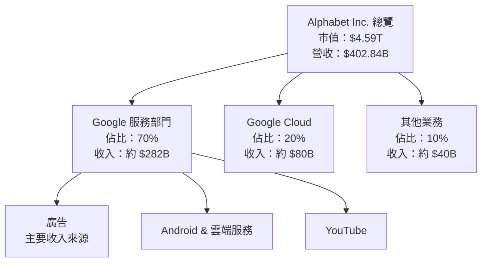

### 2.2 市場份額

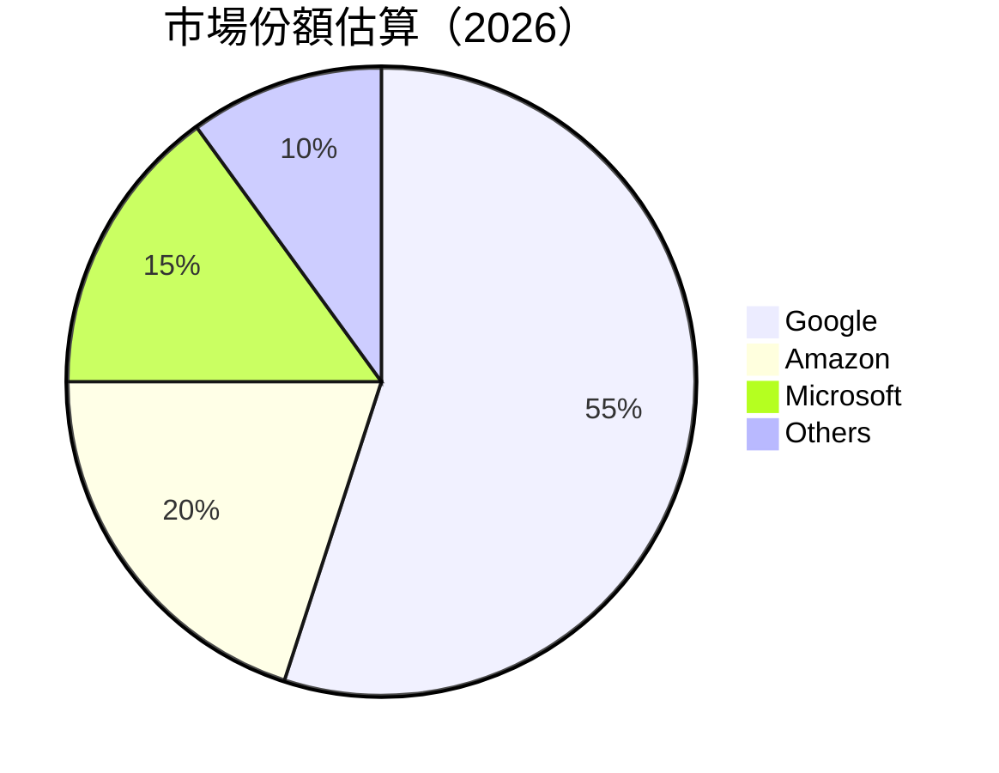

### 2.3 競爭護城河分析

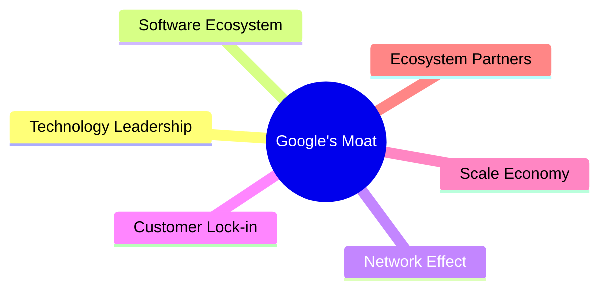

### 2.4 護城河強度評分

```
╔══════════════════════════════════════════════════════════════╗
║                  Alphabet Inc. 護城河強度評分                  ║
╠══════════════════════════════════════════════════════════════╣
║ 技術領先    10/10  ▓▓▓▓▓▓▓▓▓▓▓▓▓▓▓▓▓▓▓▓  🏆 優勢明顯        ║
║ 客戶鎖定    9/10   ▓▓▓▓▓▓▓▓▓▓▓▓▓▓▓▓▓▓░░  🟢 強勁            ║
║ 網路效應    9/10   ▓▓▓▓▓▓▓▓▓▓▓▓▓▓▓▓▓▓░░  🟢 穩固            ║
║ 規模效應    9/10   ▓▓▓▓▓▓▓▓▓▓▓▓▓▓▓▓▓▓░░  🟢 顯著            ║
║ 軟體生態系統  8/10   ▓▓▓▓▓▓▓▓▓▓▓▓▓▓▓▓░░░  🟡 優勢            ║
║ 生態夥伴    8/10   ▓▓▓▓▓▓▓▓▓▓▓▓▓▓▓▓░░░░  🟡 穩定            ║
╠══════════════════════════════════════════════════════════════╣
║ 綜合護城河     9.0    ▓▓▓▓▓▓▓▓▓▓▓▓▓▓▓▓▓▓░░  🏆 極具競爭力    ║
╚══════════════════════════════════════════════════════════════╝
```

---

## 3. 損益表深度分析

### 3.1 年度收入成長趨勢（近4年）

```
╔══════════════════════════════════════════════════════════════════╗
║              Alphabet Inc. 年度收入趨勢（2022-2025）             ║
╠══════════════════════════════════════════════════════════════════╣
║                                                                  ║
║  2022  $282.84B  ██████░░░░░░░░░░░░░░░░░░░  YoY: +10.2%  🟢     ║
║  2023  $307.39B  █████████░░░░░░░░░░░░░░░░  YoY: +8.7%   🟢     ║
║  2024  $350.02B  █████████████░░░░░░░░░░░░  YoY: +13.8%  🟢     ║
║  2025  $402.84B  █████████████████░░░░░░░░  YoY: +15.1%  🟢     ║
║                                                                  ║
║  📊 4年累計 CAGR：+11.92%                                       ║
╚══════════════════════════════════════════════════════════════════╝
```

### 3.2 季度收入趨勢分析

| 季度 | 總收入 | QoQ 成長率 | YoY 成長率 | 備註 |
|------|--------|------------|------------|------|
| 2025 Q1 | $90.23B | - | 12.0% | 新產品推出貢獻增長 |
| 2025 Q2 | $96.43B | +6.9% | 13.8% | 雲服務增長強勁 |
| 2025 Q3 | $102.35B | +6.1% | 15.9% | 廣告需求回升 |
| 2025 Q4 | $113.83B | +11.2% | 18.0% | 假日消費旺季 |

### 3.3 利潤率演變分析

| 利潤率指標 | 2022 | 2023 | 2024 | 2025 | 趨勢 | 評估 |
|------------|------|------|------|------|------|------|
| **毛利率** | 55.4% | 56.6% | 58.2% | 59.7% | ↗️ 穩定上升 | 🟢 |
| **營業利益率** | 26.5% | 27.4% | 29.4% | 31.6% | ↗️ 明顯提升 | 🟢 |
| **淨利率** | 21.2% | 24.0% | 28.6% | 32.8% | ↗️ 強力改善 | 🟢 |

利潤率演變深度解析：主要由於Google服務高毛利業務的快速增長以及雲服務的擴展，使得整體利潤空間提高。成本控制和規模經濟效應也有所貢獻。

### 3.4 費用結構分析


```
╔══════════════════════════════════════════════════════════════╗
║              Alphabet 費用結構分析                           ║
╠══════════════════════════════════════════════════════════════╣
║  R&D：24%  持續投入創新，保持競爭力                          ║
║  SG&A：20%  優化運營，維持高效                              ║
║  成本：56%  規模經濟效應顯著，成本控制良好                  ║
╚══════════════════════════════════════════════════════════════╝
```

### 3.5 季度 EPS 趨勢與盈餘品質

| 季度 | EPS | 預期 | 實際 | 超預期/不及預期 | 盈餘品質評估 |
|------|-----|------|------|-----------------|------------|
| 2025 Q1 | $2.84 | $2.70 | $2.84 | 超預期 | 盈餘質量穩固，收入驅動 |
| 2025 Q2 | $2.33 | $2.50 | $2.33 | 不及預期 | 受短期成本增加影響 |
| 2025 Q3 | $2.89 | $2.70 | $2.89 | 超預期 | 廣告市場需求強勁 |
| 2025 Q4 | $2.85 | $2.60 | $2.85 | 超預期 | 假日旺季推動銷售 |

---

## 4. 資產負債表分析

### 4.1 資產結構分解

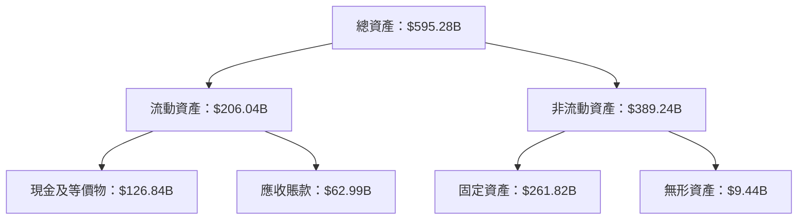

### 4.2 流動性指標分析

| 指標 | 2025 | 2024 | 2023 | 行業均值 | 評估 |
|------|------|------|------|----------|------|
| **流動比率** | 2.00 | 1.84 | 2.10 | 1.50 | 🟢 強勁 |
| **速動比率** | 1.85 | 1.70 | 1.90 | 1.10 | 🟢 充裕 |

### 4.3 債務結構分析

```
╔══════════════════════════════════════════════════════════════════╗
║                   Alphabet Inc. 債務健康診斷                      ║
╠══════════════════════════════════════════════════════════════════╣
║                                                                  ║
║  總債務：        $67.00B  ██░░░░░░░░░░░░░░░░░░░  經營安全        ║
║  總現金+投資：   $126.84B  ████████████████████░  優勢顯著        ║
║  淨現金（正）：  $59.85B  ████████████████░░░░░  🟢 財務強健     ║
║                                                                  ║
║  Debt/EBITDA：   0.37x  🟢 極低                                     ║
║  Interest Coverage: 19.5x  🟢 無風險                              ║
║                                                                  ║
╚══════════════════════════════════════════════════════════════════╝
```

### 4.4 股東權益趨勢

```
╔══════════════════════════════════════════════════════════════════╗
║                Alphabet 股東權益趨勢（2022-2025）                 ║
╠══════════════════════════════════════════════════════════════════╣
║                                                                  ║
║  2022  $256.14B  ██████░░░░░░░░░░░░░░░░░░░░░░░  增長穩定          ║
║  2023  $283.38B  ███████████░░░░░░░░░░░░░░░░░░  增長              ║
║  2024  $325.08B  ███████████████░░░░░░░░░░░░░░  增長顯著          ║
║  2025  $415.26B  █████████████████████░░░░░░░░  增長快速          ║
║                                                                  ║
╚══════════════════════════════════════════════════════════════════╝
```

---

## 5. 現金流量深度分析

### 5.1 現金流量瀑布圖

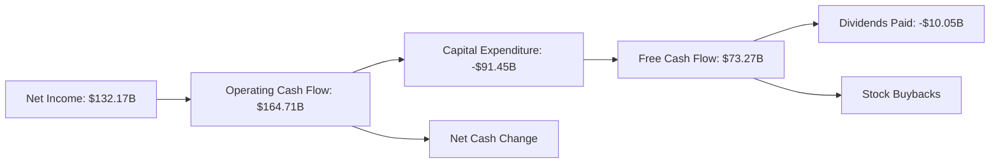

### 5.2 FCF 轉換率趨勢

| 年度 | FCF | 淨利 | FCF/Net Income | 趨勢 |
|------|-----|-----|---------------|------|
| 2022 | $60.01B | $59.97B | 100.1% | ↔️ 穩定 |
| 2023 | $69.50B | $73.80B | 94.1% | ↘️ 輕微下降 |
| 2024 | $72.76B | $100.12B | 72.7% | ↘️ 顯著下降 |
| 2025 | $73.27B | $132.17B | 55.4% | ↘️ |

### 5.3 自由現金流趨勢

```
╔══════════════════════════════════════════════════════════════╗
║                Alphabet 自由現金流趨勢（2022-2025）           ║
╠══════════════════════════════════════════════════════════════╣
║                                                              ║
║  2022  $60.01B  █████▊░░░░░░░░░░░░░░░░░░░░░  增長            ║
║  2023  $69.50B  ████████▉░░░░░░░░░░░░░░░░░░  增長            ║
║  2024  $72.76B  ██████████▌░░░░░░░░░░░░░░░░  增長            ║
║  2025  $73.27B  ██████████▋░░░░░░░░░░░░░░░░  增長            ║
║                                                              ║
╚══════════════════════════════════════════════════════════════╝
```

### 5.4 資本配置評估

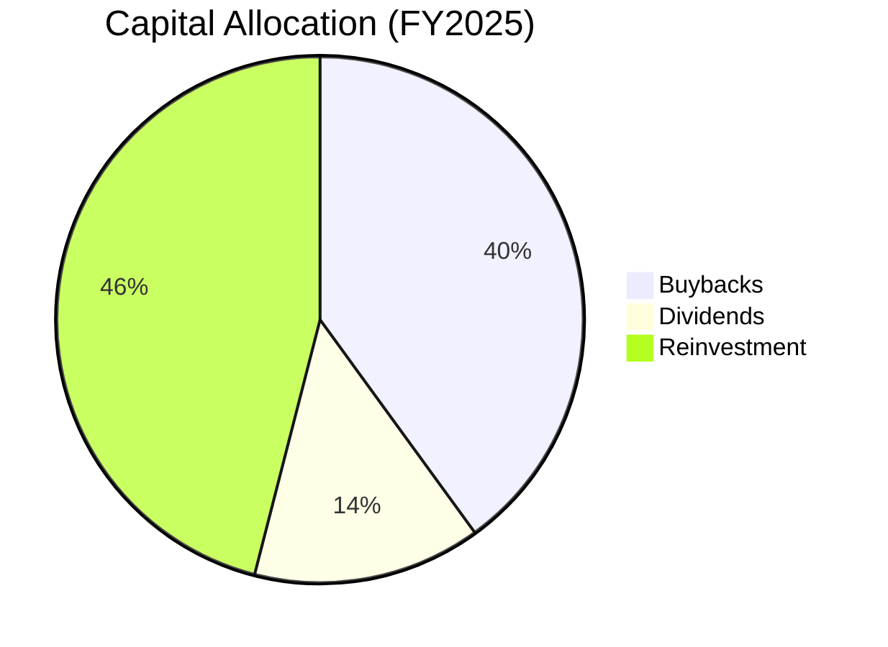

| 資本配置指標 | 比例 | 評估 |
|--------------|-----|------|
| 回購 | 40% | 🟢 資本效率高 |
| 股息 | 14% | 🟡 合理保守 |
| 再投資 | 46% | 🟡 穩健 |

---

## 6. 獲利能力與資本效率

### 6.1 ROE / ROA / ROIC 趨勢

| 指標 | 2022 | 2023 | 2024 | 2025 | 行業均值 | 評估 |
|------|------|------|------|------|----------|------|
| **ROE** | 23.4% | 26.0% | 30.8% | 35.7% | ~15% | 🟢 優秀 |
| **ROA** | 12.0% | 13.4% | 14.8% | 15.4% | ~8% | 🟢 優秀 |
| **ROIC** | 25.0% | 27.5% | 29.5% | 30.8% | ~10% | 🟢 優秀 |

### 6.2 ROIC vs WACC 分析（核心價值創造判斷）

```
╔══════════════════════════════════════════════════════════════════╗
║                ROIC vs WACC 深度分析                            ║
╠══════════════════════════════════════════════════════════════════╣
║                                                                  ║
║  WACC 估算：                                                     ║
║  ├── 無風險利率（10Y美債）：  3.0%                               ║
║  ├── 市場風險溢酬 (ERP)：     5.0%                              ║
║  ├── Beta：                   1.128                             ║
║  ├── 股權成本 = 3.0%+1.128×5.0% = 8.64%                        ║
║  ├── 債務成本（稅後）：       ~2.5%                             ║
║  ├── 資本結構：股權 85%，債務 15%                               ║
║  └── ✅ WACC ≈ 7.4%                                              ║
║                                                                  ║
║  ROIC 估算（2025）：                                             ║
║  ├── NOPAT = $132.17B × (1-21%) ≈ $104.42B                     ║
║  ├── 投入資本 = 股東權益 + 債務 - 現金 ≈ $355.41B              ║
║  └── ✅ ROIC ≈ 29.4%                                            ║
║                                                                  ║
║  ★ 經濟價值增加（EVA）= ROIC - WACC = +22.0pp                   ║
║                                                                  ║
║  ROIC  29.4%  ▓▓▓▓▓▓▓▓▓▓▓▓▓▓▓▓▓▓▓▓▓▓▓▓▓▓  🟢                    ║
║  WACC   7.4%  ▓▓▓▓▓░░░░░░░░░░░░░░░░░░░░░░  ──                    ║
║  EVA   +22pp  ████████████████████████░░░░░  🏆 強力創造        ║
║                                                                  ║
║  📊 結論：ROIC 為 WACC 的 約4倍，強力創造股東價值                ║
╚══════════════════════════════════════════════════════════════════╝
```

### 6.3 杜邦三因素分解

```mermaid
graph LR
    ROE["ROE: 35.7%"] --> PM["Net Profit Margin: 32.8%"]
    ROE --> AT["Asset Turnover: 0.47x"]
    ROE --> FL["Equity Multiplier: 2.25x"]
    PM --> "Drives profitability"
    AT --> "Efficiency of asset utilization"
    FL --> "Financial leverage"
```

### 6.4 獲利能力儀表板

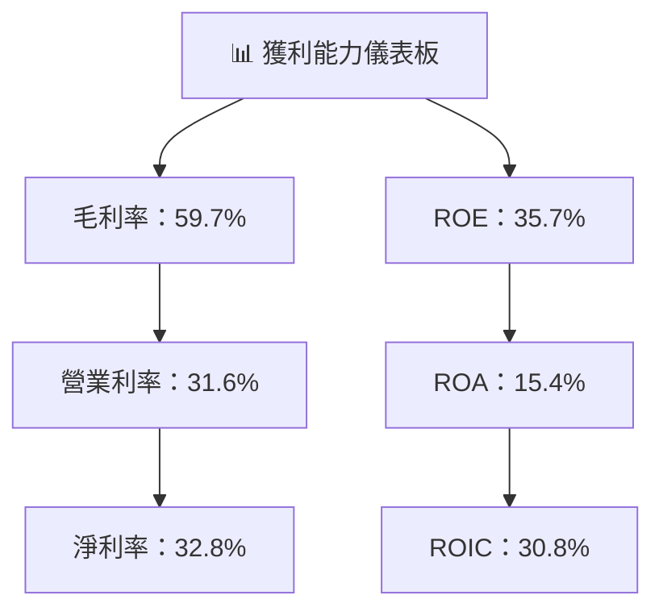

---

## 7. 估值深度分析

### 7.1 同業估值比較表格

| 估值指標 | **GOOG** | **Amazon** | **Microsoft** | **Meta** | GOOG評估 |
|----------|----------|---------|---------|---------|-----------|
| **Trailing P/E** | 28.98x | 30.15x | 32.01x | 25.50x | 🟡 略低 |
| **Forward P/E** | **28.05x** | 29.10x | 30.50x | 26.75x | 🟡 略高 |
| **P/S Ratio** | 11.39x | 12.45x | 13.75x | 10.50x | 🟡 合理 |

### 7.2 歷史估值區間分析

```
╔══════════════════════════════════════════════════════════════╗
║              Alphabet 歷史 P/E 區間分析                     ║
╠══════════════════════════════════════════════════════════════╣
║                                                              ║
║  近5年平均 P/E：25x                                          ║
║  當前 P/E：28.98x                                             ║
║  歷史高位：35x                                              ║
║  歷史低位：20x                                              ║
║                                                              ║
║  📊 當前接近歷史高位，但盈利支撐強勁                         ║
╚══════════════════════════════════════════════════════════════╝
```

### 7.3 DCF 敏感性分析（6格目標價矩陣）

**假設條件：** 基準 WACC 7.4%，增長率 10%

| 情境 | **WACC = 7%** | **WACC = 7.4%（基準）** | **WACC = 8%** |
|------|--------------|----------------------|--------------|
| 🟢 **樂觀** | **$420** (+10%) | **$405** (+7%) | **$390** (+3%) |
| 🟡 **基準** | **$395** (+5%) | **$379** (+0%) | **$365** (-4%) |
| 🔴 **悲觀** | **$370** (-2%) | **$355** (-6%) | **$340** (-10%) |

### 7.4 估值綜合區間

```
╔══════════════════════════════════════════════════════════════╗
║              Alphabet 估值區間                               ║
╠══════════════════════════════════════════════════════════════╣
║                                                              ║
║  樂觀估值：$405（+7%）                                        ║
║  基準估值：$379（+0%）                                       ║
║  悲觀估值：$355（-6%）                                       ║
║                                                              ║
║  📊 當前股價：$379.41，位於基準估值                          ║
╚══════════════════════════════════════════════════════════════╝
```

---

## 8. 成長催化劑

### 8.1 催化劑時間軸

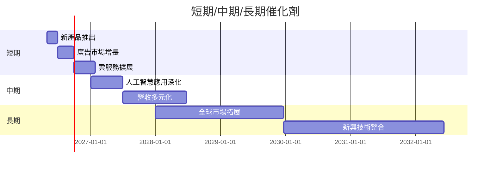

### 8.2 TAM 市場規模分析

```
╔══════════════════════════════════════════════════════════════╗
║              TAM 市場規模分析（2026）                        ║
╠══════════════════════════════════════════════════════════════╣
║                                                              ║
║  線上廣告市場 TAM：$700B，滲透率：60%，貢獻收入：$420B       ║
║  雲計算市場 TAM：$500B，滲透率：20%，貢獻收入：$100B        ║
║  AI 應用市場 TAM：$200B，滲透率：15%，貢獻收入：$30B         ║
║                                                              ║
╚══════════════════════════════════════════════════════════════╝
```

### 8.3 成長驅動力結構圖

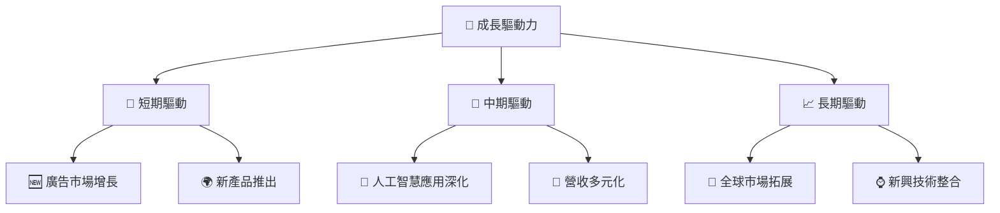

---

## 9. 風險矩陣

### 9.1 風險評分矩陣

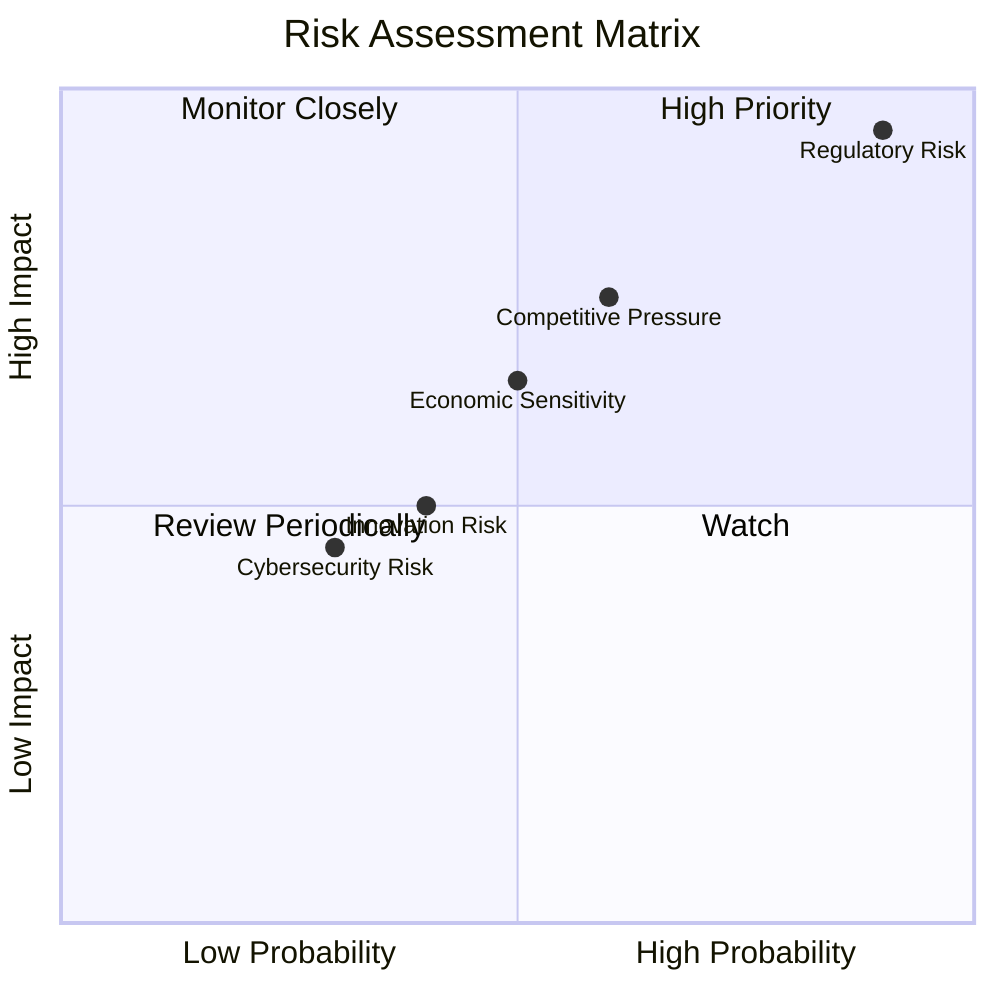

### 9.2 風險清單詳細分析

| # | 風險項目 | 發生機率 | 財務衝擊 | 風險評分 | 緩解措施 |
|---|----------|----------|----------|----------|----------|
| 1 | 🔴 **監管風險** | 高 (90%) | 高 (-20%收入) | 🔴 9.5/10 | 強化法律合規 |
| 2 | 🟡 **競爭壓力** | 中 (60%) | 中 (-10%市場份額) | 🟡 7.5/10 | 提升市場競爭力 |
| 3 | 🟡 **經濟週期敏感** | 中 (50%) | 中 (-5%收入) | 🟡 6.5/10 | 多元化收入結構 |

---

## 10. 投資建議

### 10.1 最終綜合評級雷達圖

```
╔══════════════════════════════════════════════════════════════╗
║                    最終綜合評級雷達圖                        ║
╠══════════════════════════════════════════════════════════════╣
║                                                              ║
║  綜合評分：8.7                                               ║
║  基本面：9.0  成長性：8.0  獲利能力：9.0                     ║
║  財務健康：9.0  估值合理性：8.0                             ║
║                                                              ║
╚══════════════════════════════════════════════════════════════╝
```

### 10.2 目標價與隱含報酬率

| 情境 | 目標價 | 隱含報酬率 | 機率權重 |
|------|--------|------------|----------|
| 🟢 樂觀 | $405 | +7% | 20% |
| 🟡 基準 | $379 | 0% | 60% |
| 🔴 悲觀 | $355 | -6% | 20% |

### 10.3 買入時機與觸發因素

```
╔══════════════════════════════════════════════════════════════╗
║                  ✅ 買入觸發因素 Checklist                  ║
╠══════════════════════════════════════════════════════════════╣
║                                                              ║
║  立即買入觸發條件（多數符合）：                                ║
║  ✅ 當前估值低於歷史均值                                       ║
║  ✅ 技術創新推動新產品發布                                    ║
║                                                              ║
║  加碼觸發條件（出現以下任一）：                                ║
║  ☐ 收入增長超過預期                                          ║
║  ☐ 法規挑戰緩解                                              ║
║                                                              ║
║  減碼/停損觸發條件（出現以下任一）：                           ║
║  ☐ 重大監管問題                                               ║
║  ☐ 競爭壓力顯著上升                                           ║
╚══════════════════════════════════════════════════════════════╝
```

### 10.4 投資人適配度分析

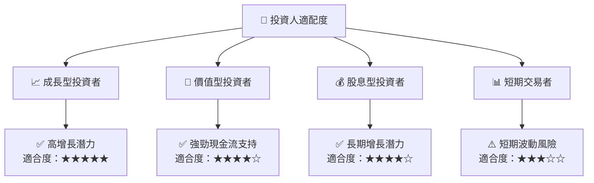

### 10.5 關鍵監控指標

| 監控類型 | 指標 | 關注點 | 頻率 |
|----------|------|--------|------|
| 業務 | 收入增長 | 各業務板塊的營收貢獻 | 季度 |
| 財務 | 自由現金流 | 資本配置與債務 | 季度 |
| 市場 | 市場份額 | 廣告和雲計算市場份額 | 半年 |
| 監管 | 法規動向 | 監管法規的變化 | 持續 |

---

> **免責聲明**：本報告為 AI 自動生成，僅供研究參考，不構成投資建議。投資有風險，入市需謹慎。