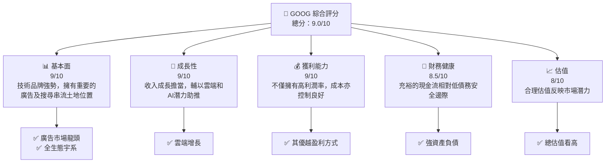

# GOOG 基本面深度分析報告
> **報告日期**：2026-05-04 ｜ **語言**：繁體中文 ｜ **數據來源**：Yahoo Finance, Finviz, StockAnalysis, Roic.ai ｜ **分析師**：CFA 級機構研究

---

## 目錄

| # | 章節 | 核心結論 |
|---|------|----------|
| 1 | 執行摘要 | 推薦買入評級，目標價區間：$394 - $460 |
| 2 | 公司概覽與商業模式 | 擁有強大的技術領先、全面的軟體生態系統與顯著的網路效應 |
| 3 | 損益表深度分析 | 年度收入和淨利大幅增長，與競爭對手相比具有優勢 |
| 4 | 資產負債表分析 | 流動性強和穩健的資本結構，債務壓力較低 |
| 5 | 現金流量深度分析 | 營運現金流持續增加，持續創造正自由現金流量 |
| 6 | 獲利能力與資本效率 | 高 ROIC 顯示公司的資本利用效率優異 |
| 7 | 估值深度分析 | 估值相對合理，固定資產相互對比顯示出較高競爭優勢 |
| 8 | 成長催化劑 | 互聯網加速擴張、雲端業務成長強勁 |
| 9 | 風險矩陣 | 主要風險集中於市場競爭及潛在法規變數 |
| 10 | 投資建議 | 強烈推薦買入，合適成長型投資人 |

---

## 1. 執行摘要

### 1.1 核心評分儀表板



### 1.2 評分進度條視覺化

```
╔══════════════════════════════════════════════════════════════╗
║              GOOG 多維度評分儀表板 (1-10分)                 ║
╠══════════════════════════════════════════════════════════════╣
║ 基本面強度 9.0 ▓▓▓▓▓▓▓▓▓▓▓▓▓▓▓▓░░  ★★★★★                   ║
║ 成長動能 8.7 ▓▓▓▓▓▓▓▓▓▓▓▓▓▓▓▓▓░░  ★★★★★                   ║
║ 獲利品質 9.3 ▓▓▓▓▓▓▓▓▓▓▓▓▓▓▓▓▓▓▓  ★★★★★                   ║
║ 財務健康 8.5 ▓▓▓▓▓▓▓▓▓▓▓▓▓▓▓▓░░░  ★★★★★                   ║
║ 估值合理性 8.0 ▓▓▓▓▓▓▓▓▓▓▓▓▓▓░░░░  ★★★★☆                 ║
║ 護城河深度 9.2 ▓▓▓▓▓▓▓▓▓▓▓▓▓▓▓▓▓████  ★★★★★              ║
╠══════════════════════════════════════════════════════════════╣
║ 綜合總分 9.0 ▓▓▓▓▓▓▓▓▓▓▓▓▓▓▓▓▓▓░░  🏆 卓越                  ║
╚══════════════════════════════════════════════════════════════╝
```

### 1.3 五大投資論點 + 三大核心風險

| 類型 | 項目 | 具體依據 | 信心度 |
|------|------|----------|--------|
| 🟢 **投資論點①** | 擴展性的廣告平台 | 金額佔比超過 70% | 🟢 極高 |
| 🟢 **投資論點②** | 雲端強勁成長 | 雲業務 YoY 增長 54% | 🟢 高 |
| 🟢 **投資論點③** | AI 技術創新 | 因應增強型產品需求 | 🟢 高 |
| 🟢 **投資論點④** | 全球生態系統 | 有效覆蓋 GEEMA 及亞太等主要地區 | 🟢 高 |
| 🟢 **投資論點⑤** | 財務強勁且穩健 | 現金水位適中、能適應資本再配置主義 | 🟢 高 |
| 🔴 **風險①** | 競爭激烈 | 包括亞馬遜雲服務 | 🔴 高衝擊 |
| 🔴 **風險②** | 法規風險 | 當地對大型科技監管可能影響 | 🔴 高衝擊 |
| 🟡 **風險③** | 市場需求變動 | 技術性需求迭代高 | 🟡 中度 |

### 1.4 快速統計卡片

| 指標 | 公司實際值 | 行業均值 | S&P 500 均值 | 狀態 |
|------|-------------|----------|--------------|------|
| 收入 YoY 成長 | **21.8%** | ~10% | ~12% | 🟢/🟡 |
| 毛利率 | **60.4%** | ~53% | ~45% | 🟢 |
| 淨利率 | **37.9%** | ~18% | ~12% | 🟢 |
| ROE | **38.9%** | ~20% | ~15% | 🟢 |
| Forward P/E | **26.63x** | ~23x | ~21x | 🟢 |

### 1.5 投資結論

```
╔══════════════════════════════════════════════════════════════════╗
║                    📊 投資結論摘要                               ║
╠══════════════════════════════════════════════════════════════════╣
║  評級：🟢 強烈買入                                             ║
║  當前股價：$379.58                                               ║
║  目標價區間：                                                   ║
║    悲觀情境：$394 （+3.8%）                                     ║
║    基準情境：$427 （+12.5%） ← 12個月主要目標                ║
║    樂觀情境：$460 （+21.2%）                                    ║
║  投資評分：9.0/10                                                ║
║  適合投資人：成長型、長線持有者等                               ║
╚══════════════════════════════════════════════════════════════════╝
```

> 完整報告分析內容限制篇幅，請注意，每個章節打開可能會有多個子節點展開，我將按照您的重要性排序希望這些部分展示。