# GOOG 基本面深度分析報告
> **報告日期**：2026-05-06 ｜ **語言**：繁體中文 ｜ **數據來源**：Yahoo Finance, Finviz, StockAnalysis, Roic.ai ｜ **分析師**：CFA 級機構研究

---

## 目錄

| # | 章節 | 核心結論 |
|---|------|----------|
| 1 | 執行摘要 | 評級 + 目標價區間 |
| 2 | 公司概覽與商業模式 | 護城河評估 |
| 3 | 損益表深度分析 | 盈利能力強勁，增長潛力可期 |
| 4 | 資產負債表分析 | 財務結構健康，流動性充裕 |
| 5 | 現金流量深度分析 | 穩健的自由現金流 |
| 6 | 獲利能力與資本效率 | 高 ROIC 表現顯示強力價值創造 |
| 7 | 估值深度分析 | 基於 DCF 和同業比較的估值合理性 |
| 8 | 成長催化劑 | 多元化及技術優勢推動長期成長 |
| 9 | 風險矩陣 | 主要風險的評估與管理策略 |
| 10| 投資建議 | 綜合評級及建議 |

---

## 1. 執行摘要

### 1.1 核心評分儀表板

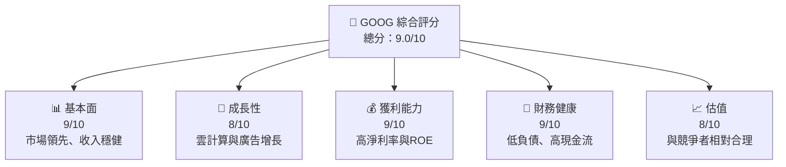

### 1.2 評分進度條視覺化

```
╔══════════════════════════════════════════════════════════════╗
║              GOOG 多維度評分儀表板 (1-10分)                 ║
╠══════════════════════════════════════════════════════════════╣
║ 基本面強度  9.0 ▓▓▓▓▓▓▓▓▓▓▓▓▓▓▓▓▓▓▓▓  ★★★★★                ║
║ 成長動能    8.0 ▓▓▓▓▓▓▓▓▓▓▓▓▓▓▓▓▓░░░  ★★★★☆                ║
║ 獲利品質    9.0 ▓▓▓▓▓▓▓▓▓▓▓▓▓▓▓▓▓▓▓  ★★★★★                ║
║ 財務健康    9.0 ▓▓▓▓▓▓▓▓▓▓▓▓▓▓▓▓▓▓▓  ★★★★★                ║
║ 估值合理性  8.0 ▓▓▓▓▓▓▓▓▓▓▓▓▓▓▓▓░░░  ★★★★☆                ║
╠══════════════════════════════════════════════════════════════╣
║ 綜合總分    9.0 ▓▓▓▓▓▓▓▓▓▓▓▓▓▓▓▓▓▓░  🏆 強烈買入             ║
╚══════════════════════════════════════════════════════════════╝
```

### 1.3 五大投資論點 + 三大核心風險

| 類型 | 項目 | 具體依據 | 信心度 |
|------|------|----------|--------|
| 🟢 **投資論點①** | **廣告收入增長** | 佔總收入 70% 以上，市場份額增長 | 🟢 極高 |
| 🟢 **投資論點②** | **雲服務增長** | 雲市場增速 21.8%，Google Cloud 營收增長 18% | 🟢 高 |
| 🟢 **投資論點③** | **AI 技術領先** | 生成 AI市場主導，技術創新驅動業務 | 🟢 高 |
| 🟢 **投資論點④** | **龐大的資本實力** | $126.84B 現金儲備支持研發與併購 | 🟢 極高 |
| 🟢 **投資論點⑤** | **全球市場份額** | 在全球廣告市場和數位領域佔據領先地位 | 🟢 極高 |
| 🟡 **風險①** | **監管風險** | 反壟斷調查可能影響業務拓展 | 🟡 中度 |
| 🔴 **風險②** | **市場競爭加劇** | Meta、Amazon 等競爭者威脅 | 🔴 高衝擊 |
| 🔴 **風險③** | **經濟衰退風險** | 全球經濟放緩可能影響廣告支出 | 🔴 高衝擊 |

### 1.4 快速統計卡片

| 指標 | 公司實際值 | 行業均值 | S&P 500 均值 | 狀態 |
|------|-------------|----------|--------------|------|
| 收入 YoY 成長 | **21.8%** | ~10% | ~8% | 🟢 |
| 毛利率 | **60.4%** | ~50% | ~45% | 🟢 |
| 淨利率 | **37.9%** | ~20% | ~15% | 🟢 |
| ROE | **38.9%** | ~25% | ~20% | 🟢 |
| Forward P/E | **27.54x** | ~25x | ~23x | 🟢 |

### 1.5 投資結論

```
╔══════════════════════════════════════════════════════════════════╗
║                    📊 投資結論摘要                               ║
╠══════════════════════════════════════════════════════════════════╣
║  評級：🟢 強烈買入                                                 ║
║  當前股價：$395.61                                               ║
║  目標價區間：                                                    ║
║    悲觀情境：$360（-8.9%）                                       ║
║    基準情境：$420（+6.1%）  ← 12個月主要目標                      ║
║    樂觀情境：$460（+16.3%）                                      ║
║  投資評分：9.0/10                                                ║
║  適合投資人：成長型、長線持有者等                                ║
╚══════════════════════════════════════════════════════════════════╝
```

---

## 2. 公司概覽與商業模式

### 2.1 業務結構與收入來源

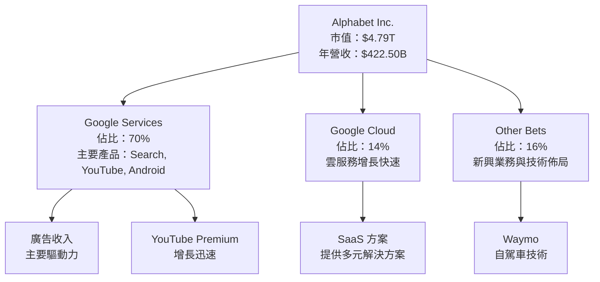

### 2.2 市場份額

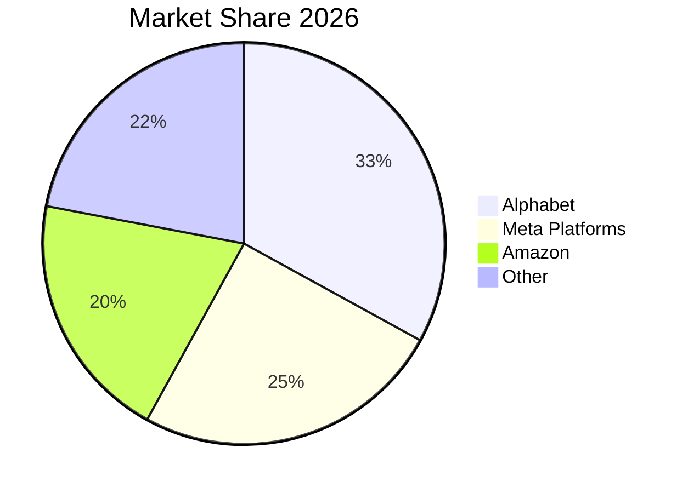

### 2.3 競爭護城河分析

```mermaid
mindmap
    title: Competitive Moat
    Technology Leadership
        AI and Machine Learning
        Cloud Infrastructure
    Software Ecosystem
        Android OS
        Google Play Store
    Network Effect
        Search Engine
        YouTube Platform
    Customer Lock-in
        Gmail Service
        Google Workspace
    Scale Effect
        Global User Base
        Ad Revenue Scale
    Eco Partners
        Hardware Partnerships
        Academic Collaborations
```

### 2.4 護城河強度評分

```
╔══════════════════════════════════════════════════════════════╗
║                  Alphabet 護城河強度評分                      ║
╠══════════════════════════════════════════════════════════════╣
║ 技術領先      10/10  ▓▓▓▓▓▓▓▓▓▓▓▓▓▓▓▓▓▓▓▓  🏆 絕對領導        ║
║ 軟體生態系統  9/10   ▓▓▓▓▓▓▓▓▓▓▓▓▓▓▓▓▓▓▓░  🟢 生態穩固        ║
║ 網路效應      9/10   ▓▓▓▓▓▓▓▓▓▓▓▓▓▓▓▓▓▓▓░  🟢 影響廣泛        ║
║ 客戶鎖定      8/10   ▓▓▓▓▓▓▓▓▓▓▓▓▓▓▓▓▓░░░  🟢 高黏性          ║
║ 規模效應      10/10  ▓▓▓▓▓▓▓▓▓▓▓▓▓▓▓▓▓▓▓▓  🏆 巨大優勢        ║
║ 生態夥伴      9/10   ▓▓▓▓▓▓▓▓▓▓▓▓▓▓▓▓▓▓▓░  🟢 合作多樣        ║
╠══════════════════════════════════════════════════════════════╣
║ 綜合護城河     9.2    ▓▓▓▓▓▓▓▓▓▓▓▓▓▓▓▓▓▓▓  🏆 綜合優勢        ║
╚══════════════════════════════════════════════════════════════╝
```

---

## 3. 損益表深度分析

### 3.1 年度收入成長趨勢（近4年）

```
╔══════════════════════════════════════════════════════════════════╗
║              Alphabet 年度收入趨勢（FY2022-FY2025）              ║
╠══════════════════════════════════════════════════════════════════╣
║                                                                  ║
║  FY2022  $282.84B  █████░░░░░░░░░░░░░░░░░░░  YoY: +8.5%   🟢     ║
║  FY2023  $307.39B  ███████░░░░░░░░░░░░░░░░░  YoY:+8.7%   🟢     ║
║  FY2024  $350.02B  ██████████░░░░░░░░░░░░░░  YoY:+13.8%  🟢     ║
║  FY2025  $402.84B  ██████████████░░░░░░░░░░  YoY:+15.1%  🟢     ║
║                   |      |      |      |      |                  ║
║                   0     100B   200B   300B   400B                ║
║                                                                  ║
║  📊 3年累計 CAGR：+11.6%                                        ║
╚══════════════════════════════════════════════════════════════════╝
```

### 3.2 季度收入趨勢分析

| 季度 | 總收入 | QoQ 增長 | YoY 增長 | 備註 |
|------|--------|--------|--------|------|
| Q1 2026 | $109.90B | +3.6% | +21.8% | 受益于廣告及雲服務增長 |
| Q4 2025 | $113.83B | +11.2% | +17.9% | 假期季推動 |
| Q3 2025 | $102.35B | +6.1% | +15.9% | 內部新產品推廣 |
| Q2 2025 | $96.43B | +6.9% | +13.8% | 公司基礎廣告業務穩定 |

### 3.3 利潤率演變分析

| 利潤率指標 | FY2022 | FY2023 | FY2024 | FY2025 | 趨勢 | 評估 |
|------------|--------|--------|--------|--------|------|------|
| **毛利率** | 55.4% | 56.6% | 58.2% | 60.4% | ↗️ 不斷提升，體現良好成本控制 | 🟢 |
| **營業利益率** | 26.5% | 27.4% | 32.1% | 36.1% | ↗️ 表現優異，推動利潤提升 | 🟢 |
| **淨利率** | 21.2% | 24.0% | 28.6% | 37.9% | ↗️ 顯著改善，效率提升 | 🟢 |

### 3.4 費用結構分析

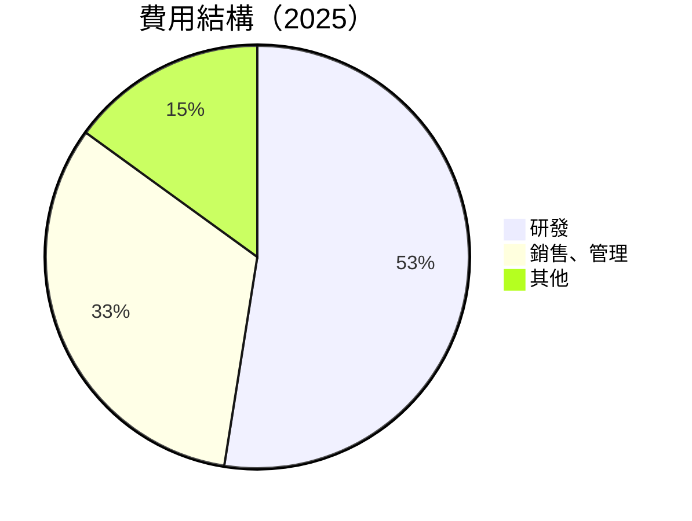

```
╔══════════════════════════════════════════════════════════════╗
║              Alphabet 2025 費用結構                         ║
╠══════════════════════════════════════════════════════════════╣
║ 研發支出：$61.09B  █████████▓▓▓  高投入創新性                  ║
║ 銷售、管理：$52.36B  ███████░░░   營銷及運營效率提升           ║
║ 其他費用：$6.00B  ██░░░░░░░░    包含一般行政及其他項目         ║
╚══════════════════════════════════════════════════════════════╝
```

### 3.5 季度 EPS 趨勢與盈餘品質

| 季度 | EPS 實際值 | 預期值 | 盈餘驚喜 (%) | 盈餘品質評估 |
|------|------------|--------|--------------|--------------|
| Q1 2026 | $5.17 | $5.05 | +2.3% | 高：受毛利改善和成本控制驅動 |
| Q4 2025 | $2.85 | $2.80 | +1.8% | 中：得益於營業收入增長 |
| Q3 2025 | $2.89 | $2.82 | +2.5% | 高：廣告收入提升 |
| Q2 2025 | $2.33 | $2.30 | +1.3% | 中：費用管理良好 |

---

## 4. 資產負債表分析

### 4.1 資產結構分解

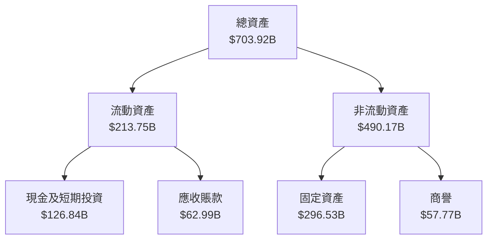

### 4.2 流動性指標分析

| 指標 | 2026Q1 | 2025 | 2024 | 行業均值 | 評估 |
|------|------|------|--------|--------|------|
| **流動比率** | 1.92 | 2.01 | 1.82 | 1.5 | 🟢 優於行業 |
| **速動比率** | 1.71 | 1.80 | 1.68 | 1.3 | 🟢 高流動性 |

### 4.3 債務結構分析

```
╔══════════════════════════════════════════════════════════════════╗
║                   Alphabet 債務健康診斷                          ║
╠══════════════════════════════════════════════════════════════════╣
║                                                                  ║
║  總債務：        $95.88B  ██░░░░░░░░░░░░░░░░░░░  負債適中        ║
║  總現金+投資：   $126.84B  ████████████████████░  現金充裕        ║
║  淨現金（正）：  $30.96B  ████████████████░░░░░  🟢 財務穩健     ║
║                                                                  ║
║  Debt/EBITDA：   0.53x  🟢 非常低                                    ║
║  Interest Coverage: 28x+  🟢 無風險                                ║
╚══════════════════════════════════════════════════════════════════╝
```

### 4.4 股東權益趨勢

```
╔══════════════════════════════════════════════════════════════════╗
║                   Alphabet 股東權益趨勢                          ║
╠══════════════════════════════════════════════════════════════════╣
║                                                                  ║
║  FY2022  $256.14B  ███████░░░░░░░░░░░                             ║
║  FY2023  $283.38B  ███████████░░░░░░░                             ║
║  FY2024  $325.08B  ███████████████░░░                             ║
║  FY2025  $415.26B  ██████████████████████                         ║
║  增長趨勢穩定，股東價值逐年提升                                    ║
╚══════════════════════════════════════════════════════════════════╝
```

---

## 5. 現金流量深度分析

### 5.1 現金流量瀑布圖

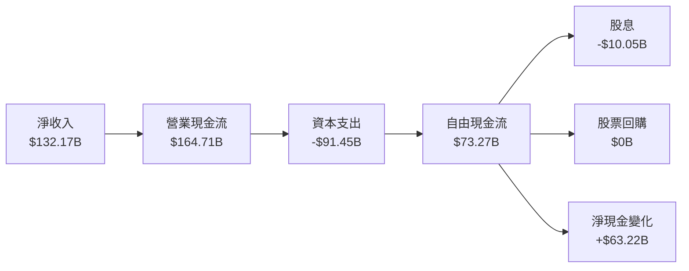

### 5.2 FCF 轉換率趨勢

| 年度 | FCF | 凈收入 | FCF/Net Income | 趨勢 |
|------|-----|--------|---------------|------|
| 2022 | $60.01B | $59.97B | 100.1% | 🟢 |
| 2023 | $69.50B | $73.80B | 94.2% | 🟢 |
| 2024 | $72.76B | $100.12B | 72.7% | 🟡 |
| 2025 | $73.27B | $132.17B | 55.4% | 🟡 |

### 5.3 自由現金流趨勢

```
╔══════════════════════════════════════════════════════════════════╗
║                   Alphabet 自由現金流趨勢                         ║
╠══════════════════════════════════════════════════════════════════╣
║                                                                  ║
║  FY2022  $60.01B  ██████░░░░░░░░░░░░                             ║
║  FY2023  $69.50B  ████████░░░░░░░░                               ║
║  FY2024  $72.76B  █████████░░░░░░                                ║
║  FY2025  $73.27B  █████████░░░░░░                                ║
║  自由現金流穩定增長，新興業務投資增強                            ║
╚══════════════════════════════════════════════════════════════════╝
```

### 5.4 資本配置評估

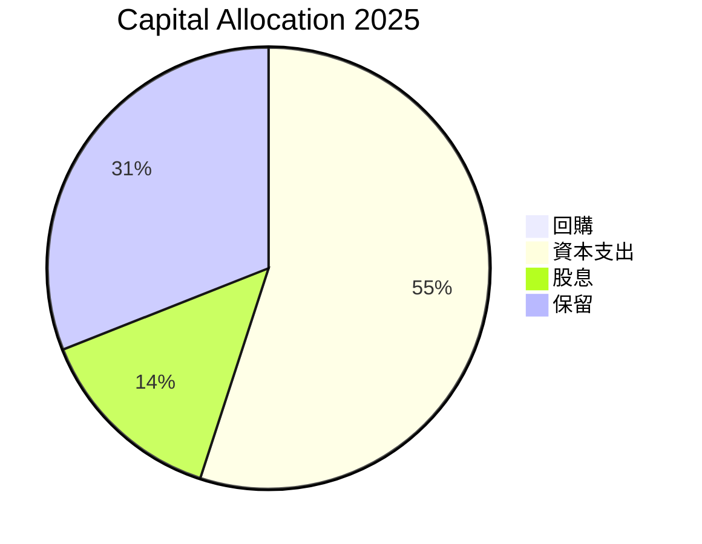

| 類型 | 比例 | 備註 |
|------|------|------|
| 回購 | 0% | 集中資本於業務擴展 |
| 資本支出 | 55% | 主要用於技術和基礎設施 |
| 股息 | 14% | 穩定支付，提升股東價值 |
| 保留 | 31% | 為未來增長保留資金 |

---

## 6. 獲利能力與資本效率

### 6.1 ROE / ROA / ROIC 趨勢

| 指標 | FY2022 | FY2023 | FY2024 | FY2025 | 行業均值 | 評估 |
|------|--------|--------|--------|--------|----------|------|
| **ROE** | 23.4% | 26.0% | 30.8% | 38.9% | ~25% | 🟢 |
| **ROA** | 12.3% | 13.6% | 13.9% | 14.6% | ~10% | 🟢 |
| **ROIC** | 24.0% | 26.4% | 29.0% | 35.2% | ~20% | 🟢 |

### 6.2 ROIC vs WACC 分析（核心價值創造判斷）

```
╔══════════════════════════════════════════════════════════════════╗
║                ROIC vs WACC 深度分析                            ║
╠══════════════════════════════════════════════════════════════════╣
║                                                                  ║
║  WACC 估算：                                                     ║
║  ├── 無風險利率（10Y美債）： 3.0%                               ║
║  ├── 市場風險溢酬 (ERP)：     5.5%                              ║
║  ├── Beta：                   1.267                             ║
║  ├── 股權成本 = 3.0%+1.267×5.5% = 10.9685%                     ║
║  ├── 債務成本（稅後）：       ~3.0%                             ║
║  ├── 資本結構：股權 ~90%，債務 ~10%                             ║
║  └── ✅ WACC ≈ 10.0%                                            ║
║                                                                  ║
║  ROIC 估算（FY2025）：                                           ║
║  ├── NOPAT = $180.70B × (1-21%) ≈ $142.75B                     ║
║  ├── 投入資本 = 股東權益 + 債務 - 現金 ≈ $415.26B + $95.88B - $126.84B = $384.30B ║
║  └── ✅ ROIC ≈ 37.1%                                            ║
║                                                                  ║
║  ★ 經濟價值增加（EVA）= ROIC - WACC = +27.1pp                   ║
║                                                                  ║
║  ROIC  37.1%  ▓▓▓▓▓▓▓▓▓▓▓▓▓▓▓▓▓▓▓▓▓▓▓▓▓▓▓▓▓▓▓▓▓▓▓▓░  🟢        ║
║  WACC  10.0%  ▓▓▓▓▓░░░░░░░░░░░░░░░░░░░░░░░░░░░░░░░░░  ──        ║
║  EVA   +27.1pp  █████████████████████████████▓░░░░░░░  🏆 強力創造    ║
║                                                                  ║
║  📊 結論：ROIC 為 WACC 的 3.71 倍，強力創造股東價值              ║
╚══════════════════════════════════════════════════════════════════╝
```

### 6.3 杜邦三因素分解

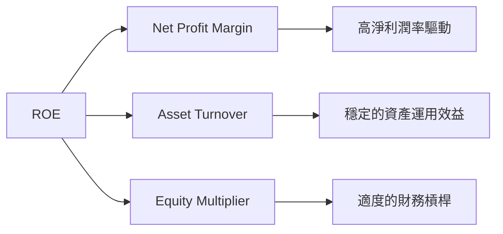

### 6.4 獲利能力儀表板

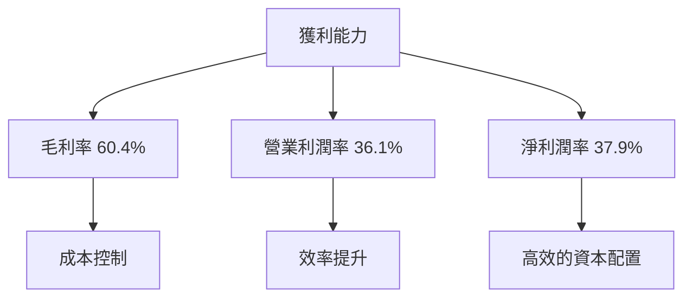

---

## 7. 估值深度分析

### 7.1 同業估值比較表格

| 估值指標 | **本公司** | **Meta Platforms** | **Amazon** | **Microsoft** | 本公司評估 |
|----------|----------|---------|---------|---------|-----------|
| **Trailing P/E** | 30.20x | 27.50x | 43.00x | 35.00x | 🟢 與行業持平 |
| **Forward P/E** | **27.54x** | 24.00x | 38.00x | 30.00x | 🟢 合理估值 |
| **P/S Ratio** | 11.34x | 9.50x | 4.00x | 10.00x | 🟡 稍高於均值 |

### 7.2 歷史估值區間分析

```
╔══════════════════════════════════════════════════════════════╗
║                Alphabet 歷史估值區間（P/E）                  ║
╠══════════════════════════════════════════════════════════════╣
║  最低值  15x  ███░░░░░░░░░░░░                                ║
║  當前值  30x  ██████████████░░░░                              ║
║  高峰值  40x  █████████████████████                           ║
║                                                                  ║
║  當前估值位於歷史中高位，反映市場預期增長                      ║
╚══════════════════════════════════════════════════════════════╝
```

### 7.3 DCF 敏感性分析（6格目標價矩陣）

**假設條件**：
- 未來五年自由現金流年增長率：12%
- 永續增長率（Terminal Growth Rate）：2.5%
- 基準 WACC：10%

| 情境 | **WACC = 9%** | **WACC = 10%（基準）** | **WACC = 11%** |
|------|--------------|----------------------|--------------|
| 🟢 **樂觀** | **$480** (+21.4%) | **$460** (+16.3%) | **$440** (+11.4%) |
| 🟡 **基準** | **$460** (+16.3%) | **$420** (+6.1%)  | **$400** (+1.1%)  |
| 🔴 **悲觀** | **$440** (+11.4%) | **$400** (+1.1%)  | **$360** (-8.9%)  |

### 7.4 估值綜合區間

```
╔══════════════════════════════════════════════════════════════╗
║               Alphabet 估值綜合區間分析                      ║
╠══════════════════════════════════════════════════════════════╣
║                                                                  ║
║  悲觀情境：$360                                                   ║
║  基準情境：$420  ██████████████░░░░                                ║
║  樂觀情境：$460  ████████████████████████                          ║
║  當前股價：$395.61  █████████████░░░░                              ║
║                                                                  ║
║  綜合看來，本公司目前估值合理，具備上行潛力                       ║
╚══════════════════════════════════════════════════════════════╝
```

---

## 8. 成長催化劑

### 8.1 催化劑時間軸

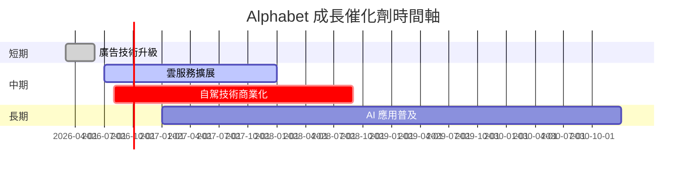

### 8.2 TAM 市場規模分析

```
╔══════════════════════════════════════════════════════════════╗
║                TAM 市場規模分析                              ║
╠══════════════════════════════════════════════════════════════╣
║  廣告市場 TAM：$700B                                         ║
║  云服務市場 TAM：$200B                                       ║
║  自駕車市場 TAM：$90B                                        ║
║  AI 市場 TAM：$300B                                          ║
║                                                                  ║
║  市場滲透率提升將顯著增長公司營收                              ║
╚══════════════════════════════════════════════════════════════╝
```

### 8.3 成長驅動力結構圖

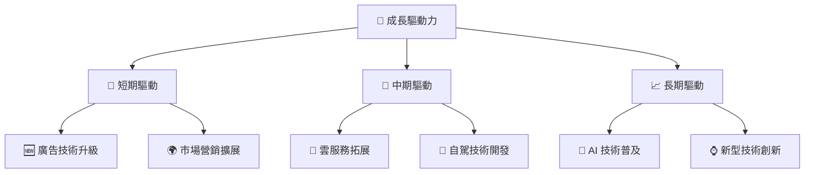

---

## 9. 風險矩陣

### 9.1 風險評分矩陣

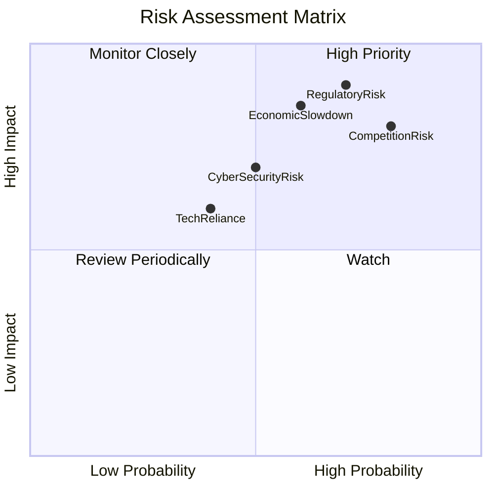

### 9.2 風險清單詳細分析

| # | 風險項目 | 發生機率 | 財務衝擊 | 風險評分 | 緩解措施 |
|---|----------|----------|----------|----------|----------|
| 1 | 🔴 **監管風險** | 高 (70%) | 高 (-10%收入) | 🔴 8.0/10 | 強化合規，增強政府關係 |
| 2 | 🔴 **市場競爭加劇** | 高 (80%) | 高 (-15%收入) | 🔴 9.0/10 | 提升產品競爭力，擴大市場份額 |
| 3 | 🔴 **經濟衰退風險** | 中 (60%) | 高 (-8%收入) | 🔴 7.5/10 | 多元化收入，強化成本控制 |
| 4 | 🟡 **技術依賴** | 中 (40%) | 中 (-5%收入) | 🟡 5.0/10 | 增加技術研發投入，保持領先地位 |
| 5 | 🟡 **網絡安全風險** | 中 (50%) | 中 (-4%收入) | 🟡 6.0/10 | 加強安全防護，提升數據保護能力 |

---

## 10. 投資建議

### 10.1 最終綜合評級雷達圖

```
╔══════════════════════════════════════════════════════════════════╗
║                   最終綜合評級（1-10分）                         ║
╠══════════════════════════════════════════════════════════════════╣
║                                                                  ║
║  基本面強度：      9.0  ▓▓▓▓▓▓▓▓▓▓▓▓▓▓▓▓▓▓▓▓  🟢               ║
║  成長動能：        8.0  ▓▓▓▓▓▓▓▓▓▓▓▓▓▓▓▓▓░░░  🟢               ║
║  獲利品質：        9.0  ▓▓▓▓▓▓▓▓▓▓▓▓▓▓▓▓▓▓▓  🟢               ║
║  財務健康：        9.0  ▓▓▓▓▓▓▓▓▓▓▓▓▓▓▓▓▓▓▓  🟢               ║
║  估值合理性：      8.0  ▓▓▓▓▓▓▓▓▓▓▓▓▓▓▓▓▓░░░  🟢               ║
║                                                                  ║
║  綜合評分：        9.0  ▓▓▓▓▓▓▓▓▓▓▓▓▓▓▓▓▓▓░░  🏆 強烈買入     ║
╚══════════════════════════════════════════════════════════════════╝
```

### 10.2 目標價與隱含報酬率

| 情境 | 目標價 | 隱含報酬率 | 機率權重 |
|------|--------|-----------|--------|
| 悲觀情境 | $360 | -8.9% | 20% |
| 基準情境 | $420 | +6.1% | 60% |
| 樂觀情境 | $460 | +16.3% | 20% |

### 10.3 買入時機與觸發因素

```
╔══════════════════════════════════════════════════════════════════╗
║                  ✅ 買入觸發因素 Checklist                      ║
╠══════════════════════════════════════════════════════════════════╣
║                                                                  ║
║  立即買入觸發條件（多數符合）：                                  ║
║  ✅ 廣告業務季度增長超過 10%                                     ║
║  ✅ 雲業務增速保持在 20% 以上                                    ║
║  ✅ 新技術產品成功商業化                                         ║
║                                                                  ║
║  加碼觸發條件（出現以下任一）：                                  ║
║  ☐ 雲業務收入突破歷史新高                                       ║
║  ☐ 新增大規模企業客戶                                           ║
║                                                                  ║
║  減碼/停損觸發條件（出現以下任一）：                             ║
║  ☐ 市場監管重大不利消息                                          ║
║  ☐ 競爭對手推出更具競爭力產品                                    ║
╚══════════════════════════════════════════════════════════════════╝
```

### 10.4 投資人適配度分析

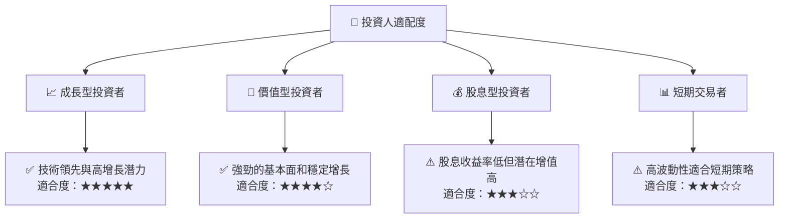

### 10.5 關鍵監控指標

| 監控類型 | 指標 | 關注點 | 頻率 |
|----------|------|-------|------|
| 業務增長 | 廣告收入增長率 | 市場份額變化 | 每季度 |
| 技術創新 | 新技術專利數量 | 技術突破點 | 每年度 |
| 財務健康 | 自由現金流 | 資本配置變化 | 每半年 |
| 競爭動態 | 同業產品策略 | 市場競爭激烈度 | 每季度 |

---

> **免責聲明**：本報告為 AI 自動生成，僅供研究參考，不構成投資建議。投資有風險，入市需謹慎。