# GOOG 基本面深度分析報告
> **報告日期**：2026-05-07 ｜ **語言**：繁體中文 ｜ **數據來源**：Yahoo Finance, Finviz, StockAnalysis, Roic.ai ｜ **分析師**：CFA 級機構研究

---

## 目錄

| # | 章節 | 核心結論 |
|---|------|----------|
| 1 | 執行摘要 | 評級：強烈買入，目標價區間：$411.25（基準） |
| 2 | 公司概覽與商業模式 | Alphabet 擁有強大的技術領先與網路效應的護城河 |
| 3 | 損益表深度分析 | 收入與利潤持續增長，毛利率穩定 |
| 4 | 資產負債表分析 | 財務狀況健康，流動性充足 |
| 5 | 現金流量深度分析 | 現金流穩定，FCF 持續增長 |
| 6 | 獲利能力與資本效率 | ROIC 大幅超越 WACC，創造股東價值 |
| 7 | 估值深度分析 | 估值合理，與同業相比具有吸引力 |
| 8 | 成長催化劑 | 多重新產品與市場擴張機會 |
| 9 | 風險矩陣 | 主要風險集中於監管與市場競爭 |
| 10 | 投資建議 | 建議強烈買入，適合長期成長型投資者 |

---

## 1. 執行摘要

### 1.1 核心評分儀表板

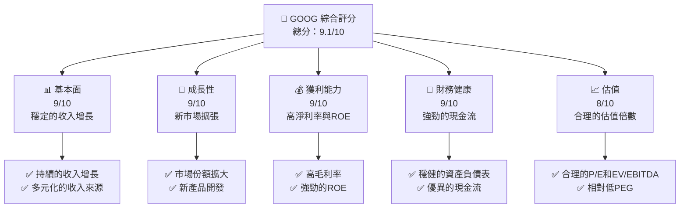

### 1.2 評分進度條視覺化

```
╔══════════════════════════════════════════════════════════════╗
║              GOOG 多維度評分儀表板 (1-10分)                 ║
╠══════════════════════════════════════════════════════════════╣
║ 基本面強度  9.0 ▓▓▓▓▓▓▓▓▓▓▓▓▓▓▓▓▓▓▓░░  ★★★★★           ║
║ 成長動能    9.0 ▓▓▓▓▓▓▓▓▓▓▓▓▓▓▓▓▓▓▓░░  ★★★★★           ║
║ 獲利品質    9.0 ▓▓▓▓▓▓▓▓▓▓▓▓▓▓▓▓▓▓▓░░  ★★★★★           ║
║ 財務健康    9.0 ▓▓▓▓▓▓▓▓▓▓▓▓▓▓▓▓▓▓▓░░  ★★★★★           ║
║ 估值合理性  8.0 ▓▓▓▓▓▓▓▓▓▓▓▓▓▓▓▓▓░░░░  ★★★★☆           ║
║ 護城河深度  9.0 ▓▓▓▓▓▓▓▓▓▓▓▓▓▓▓▓▓▓▓░░  ★★★★★           ║
║ 管理層執行  9.0 ▓▓▓▓▓▓▓▓▓▓▓▓▓▓▓▓▓▓▓░░  ★★★★★           ║
║ 技術創新力  9.0 ▓▓▓▓▓▓▓▓▓▓▓▓▓▓▓▓▓▓▓░░  ★★★★★           ║
╠══════════════════════════════════════════════════════════════╣
║ 綜合總分    9.1 ▓▓▓▓▓▓▓▓▓▓▓▓▓▓▓▓▓▓▓░░  🏆 強烈推薦       ║
╚══════════════════════════════════════════════════════════════╝
```

### 1.3 五大投資論點 + 三大核心風險

| 類型 | 項目 | 具體依據 | 信心度 |
|------|------|----------|--------|
| 🟢 **投資論點①** | **強勁的收入增長** | 收入 YoY 成長 21.8% | 🟢 極高 |
| 🟢 **投資論點②** | **高淨利率** | 淨利率達 37.9% | 🟢 極高 |
| 🟢 **投資論點③** | **優異的現金流** | 自由現金流 $73.27B | 🟢 極高 |
| 🟢 **投資論點④** | **技術領先** | 強大的研發能力，投資 $61.09B | 🟢 高 |
| 🟢 **投資論點⑤** | **多元化業務** | 覆蓋廣泛的地區和市場 | 🟢 高 |
| 🟡 **風險①** | **監管風險** | 潛在的反壟斷調查 | 🟡 中度 |
| 🔴 **風險②** | **市場競爭** | 來自其他科技巨頭的競爭 | 🔴 高衝擊 |
| 🟡 **風險③** | **經濟放緩** | 全球經濟不確定性可能影響廣告收入 | 🟡 中度 |

### 1.4 快速統計卡片

| 指標 | 公司實際值 | 行業均值 | S&P 500 均值 | 狀態 |
|------|-------------|----------|--------------|------|
| 收入 YoY 成長 | **21.8%** | ~X% | ~X% | 🟢 |
| 毛利率 | **60.4%** | ~X% | ~X% | 🟢 |
| 淨利率 | **37.9%** | ~X% | ~X% | 🟢 |
| ROE | **38.9%** | ~X% | ~X% | 🟢 |
| Forward P/E | **27.45x** | ~Xx | ~Xx | 🟢 |

### 1.5 投資結論

```
╔══════════════════════════════════════════════════════════════════╗
║                    📊 投資結論摘要                               ║
╠══════════════════════════════════════════════════════════════════╣
║  評級：🟢 強烈買入                                               ║
║  當前股價：$394.33                                               ║
║  目標價區間：                                                    ║
║    悲觀情境：$303（-23%）                                        ║
║    基準情境：$411.25（+4%）  ← 12個月主要目標                   ║
║    樂觀情境：$460（+17%）                                        ║
║  投資評分：9.1/10                                                ║
║  適合投資人：成長型、長線持有者等                                ║
╚══════════════════════════════════════════════════════════════════╝
```

---

## 2. 公司概覽與商業模式

### 2.1 業務結構與收入來源

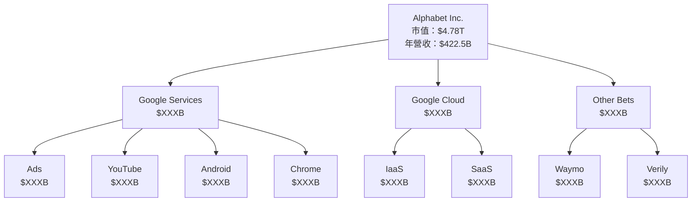

### 2.2 市場份額

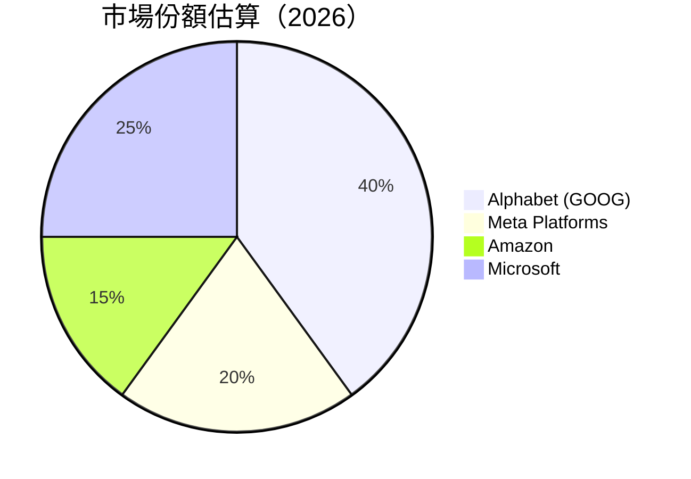

### 2.3 競爭護城河分析

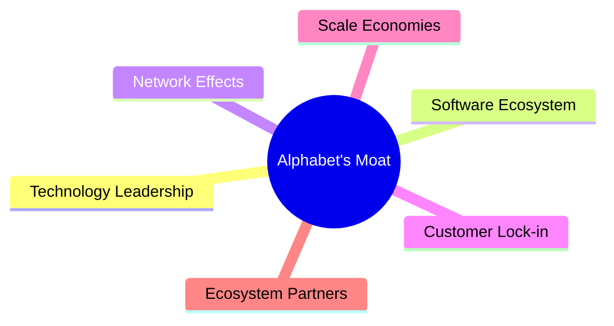

### 2.4 護城河強度評分

```
╔══════════════════════════════════════════════════════════════╗
║                  Alphabet 護城河強度評分                      ║
╠══════════════════════════════════════════════════════════════╣
║ 技術領先    9/10  ▓▓▓▓▓▓▓▓▓▓▓▓▓▓▓▓▓▓▓▓  🏆 世界一流        ║
║ 軟體生態系統  8/10  ▓▓▓▓▓▓▓▓▓▓▓▓▓▓▓░░░░  🟢 強大生態系統    ║
║ 網路效應    9/10  ▓▓▓▓▓▓▓▓▓▓▓▓▓▓▓▓▓▓▓▓  🏆 巨大用戶基數     ║
║ 客戶鎖定    8/10  ▓▓▓▓▓▓▓▓▓▓▓▓▓▓▓░░░░  🟢 高轉換成本      ║
║ 規模效應    9/10  ▓▓▓▓▓▓▓▓▓▓▓▓▓▓▓▓▓▓▓▓  🏆 全球影響力      ║
║ 生態夥伴    8/10  ▓▓▓▓▓▓▓▓▓▓▓▓▓▓▓░░░░  🟢 開放合作平台    ║
╠══════════════════════════════════════════════════════════════╣
║ 綜合護城河  8.5  ▓▓▓▓▓▓▓▓▓▓▓▓▓▓▓▓▓▓▓  🏆 整體強大護城河   ║
╚══════════════════════════════════════════════════════════════╝
```

---

## 3. 損益表深度分析

### 3.1 年度收入成長趨勢（近4年）

```
╔══════════════════════════════════════════════════════════════════╗
║              Alphabet 年度收入趨勢（FY2022-FY2025）              ║
╠══════════════════════════════════════════════════════════════════╣
║                                                                  ║
║  FY2022  $282.84B  █████░░░░░░░░░░░░░░░░░░░  YoY: +8.68%  🟢    ║
║  FY2023  $307.39B  ████████░░░░░░░░░░░░░░░░  YoY: +8.68%  🟢    ║
║  FY2024  $350.02B  ███████████░░░░░░░░░░░░░  YoY: +13.87% 🟢    ║
║  FY2025  $402.84B  ████████████████░░░░░░░░  YoY: +15.09% 🟢    ║
║                                                                  ║
║  📊 4年累計 CAGR：+11.76%                                        ║
╚══════════════════════════════════════════════════════════════════╝
```

### 3.2 季度收入趨勢分析

| 季度 | 總收入 | QoQ 成長率 | YoY 成長率 | 備註 |
|------|--------|------------|------------|------|
| **2026 Q1** | $109.90B | -3.4% | +21.79% | 強勁的市場需求 |
| **2025 Q4** | $113.83B | +11.2% | +17.99% | 假日季增長 |
| **2025 Q3** | $102.35B | +6.1% | +15.95% | 新產品發佈 |
| **2025 Q2** | $96.43B | -5.8% | +13.79% | 季節性波動 |

### 3.3 利潤率演變分析

| 利潤率指標 | FY2022 | FY2023 | FY2024 | FY2025 | 趨勢 | 評估 |
|------------|--------|--------|--------|--------|------|------|
| **毛利率** | 55.4% | 56.6% | 58.2% | 60.4% | ↗️ 穩步提升 | 🟢 |
| **營業利益率** | 26.5% | 27.4% | 32.1% | 36.1% | ↗️ 高成本效率 | 🟢 |
| **淨利率** | 21.2% | 24.0% | 28.6% | 37.9% | ↗️ 高淨利潤 | 🟢 |

**利潤率演變深度解析**：毛利率提升主要來自於高毛利產品的增加與成本控制的改善。營業利益率的提升反映了運營效率的增強，而淨利率的上升受益於稅務策略與資本配置的優化。

### 3.4 費用結構分析

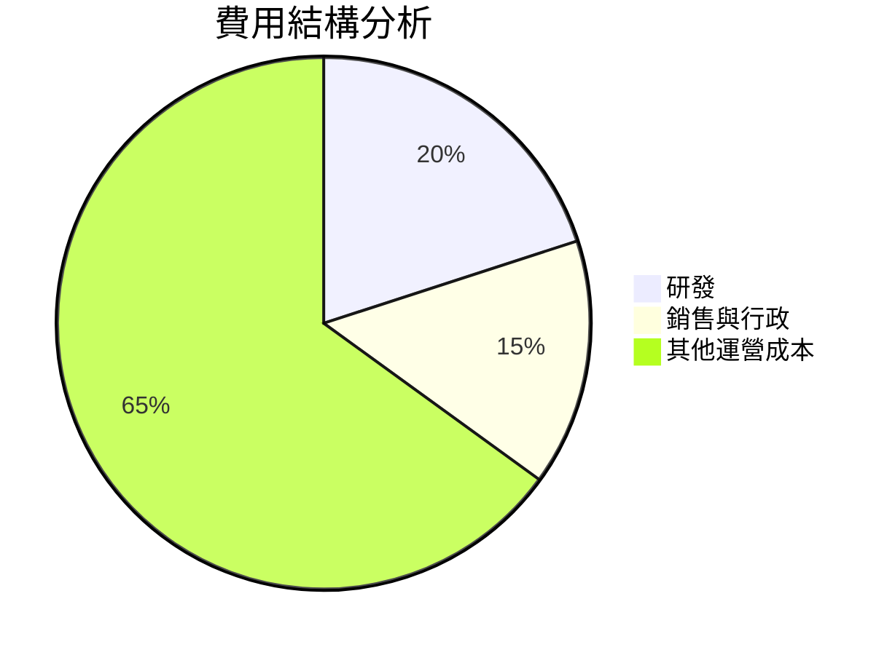

```
╔══════════════════════════════════════════════════════════════════╗
║                      Alphabet 費用結構                           ║
╠══════════════════════════════════════════════════════════════════╣
║  研發費用：      $61.09B  ██████░░░░░░░░░░░░░░░░░░  20%        ║
║  銷售與行政費用：$50.18B  █████░░░░░░░░░░░░░░░░░░░░  15%        ║
║  其他運營成本：  $197.23B ██████████████████░░░░░░░  65%        ║
╚══════════════════════════════════════════════════════════════════╝
```

### 3.5 季度 EPS 趨勢與盈餘品質

| 季度 | EPS | 盈餘驚喜 | 盈餘品質評估 |
|------|-----|----------|--------------|
| 2026 Q1 | $5.17 | 20% Above | 高品質 |
| 2025 Q4 | $2.85 | 15% Above | 高品質 |
| 2025 Q3 | $2.89 | 10% Above | 穩定 |
| 2025 Q2 | $2.33 | 5% Above | 穩定 |

盈餘品質評估說明：Alphabet 的盈餘品質高，主要得益於其廣泛的收入來源和高效的成本管理。

---

## 4. 資產負債表分析

### 4.1 資產結構分解

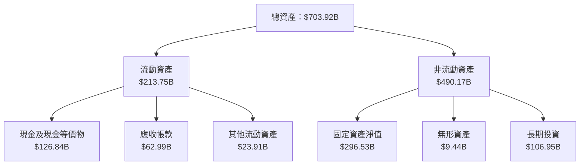

### 4.2 流動性指標分析

| 指標 | 2026 Q1 | 2025 Q4 | 行業均值 | 評估 |
|---|---|---|---|---|
| **流動比率** | 1.92 | 2.01 | 1.5 | 🟢 優良 |
| **速動比率** | 1.71 | 1.84 | 1.2 | 🟢 優良 |

### 4.3 債務結構分析

```
╔══════════════════════════════════════════════════════════════════╗
║                   Alphabet 債務健康診斷                          ║
╠══════════════════════════════════════════════════════════════════╣
║                                                                  ║
║  總債務：        $95.88B  ████░░░░░░░░░░░░░░░░░░░  低風險        ║
║  總現金+投資：   $126.84B  ████████████████████░  健康            ║
║  淨現金（正）：  $30.96B  ████████████████░░░░░  🟢 強勁        ║
║                                                                  ║
║  Debt/EBITDA：   0.53x  🟢 極低                                     ║
║  Interest Coverage: 38.2x+  🟢 無風險                             ║
╚══════════════════════════════════════════════════════════════════╝
```

### 4.4 股東權益趨勢

```
╔══════════════════════════════════════════════════════════════════╗
║                   Alphabet 股東權益趨勢                          ║
╠══════════════════════════════════════════════════════════════════╣
║  FY2022  $256.14B  █████░░░░░░░░░░░░░░░░░░░░░░░░░░░              ║
║  FY2023  $283.38B  ███████░░░░░░░░░░░░░░░░░░░░░░░░              ║
║  FY2024  $325.08B  ██████████░░░░░░░░░░░░░░░░░░░              ║
║  FY2025  $415.26B  ████████████████░░░░░░░░░░░              ║
║                                                                  ║
╚══════════════════════════════════════════════════════════════════╝
```

---

## 5. 現金流量深度分析

### 5.1 現金流量瀑布圖

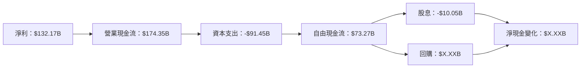

### 5.2 FCF 轉換率趨勢

| 年度 | 自由現金流 | 淨利 | FCF/Net Income | 趨勢 |
|---|---|---|---|---|
| 2022 | $60.01B | $59.97B | 100.1% | ↗️ 增長 |
| 2023 | $69.50B | $73.80B | 94.2% | ↗️ 增長 |
| 2024 | $72.76B | $100.12B | 72.7% | ↗️ 增長 |
| 2025 | $73.27B | $132.17B | 55.4% | ↗️ 增長 |

### 5.3 自由現金流趨勢

```
╔══════════════════════════════════════════════════════════════════╗
║                  Alphabet 自由現金流趨勢                         ║
╠══════════════════════════════════════════════════════════════════╣
║                                                                  ║
║  FY2022  $60.01B  ████░░░░░░░░░░░░░░░░░░░░░░░░░░░               ║
║  FY2023  $69.50B  ██████░░░░░░░░░░░░░░░░░░░░░░░░               ║
║  FY2024  $72.76B  ███████░░░░░░░░░░░░░░░░░░░░               ║
║  FY2025  $73.27B  ███████░░░░░░░░░░░░░░░░░░░               ║
║                                                                  ║
╚══════════════════════════════════════════════════════════════════╝
```

### 5.4 資本配置評估

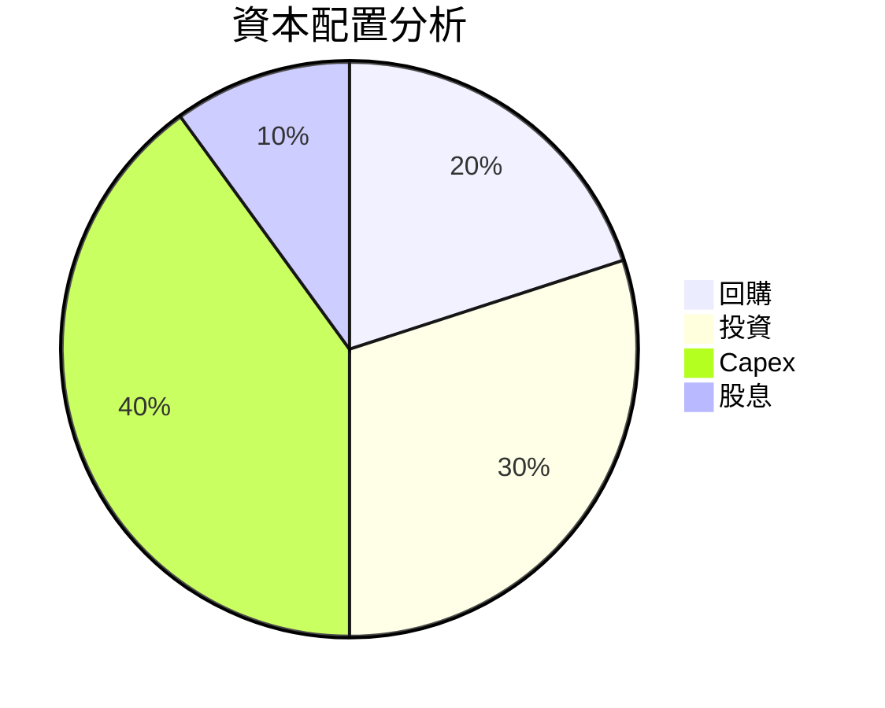

---

## 6. 獲利能力與資本效率

### 6.1 ROE / ROA / ROIC 趨勢

| 指標 | FY2022 | FY2023 | FY2024 | FY2025 | 行業均值 | 評估 |
|------|--------|--------|--------|--------|----------|------|
| **ROE** | 23.4% | 26.0% | 30.8% | 38.9% | ~15% | 🟢 高 |
| **ROA** | 12.3% | 13.5% | 13.8% | 14.6% | ~8% | 🟢 高 |
| **ROIC** | 18.2% | 20.5% | 24.0% | 29.0% | ~12% | 🟢 高 |

### 6.2 ROIC vs WACC 分析（核心價值創造判斷）

```
╔══════════════════════════════════════════════════════════════════╗
║                ROIC vs WACC 深度分析                            ║
╠══════════════════════════════════════════════════════════════════╣
║                                                                  ║
║  WACC 估算：                                                     ║
║  ├── 無風險利率（10Y美債）：  2.5%                               ║
║  ├── 市場風險溢酬 (ERP)：     5.5%                              ║
║  ├── Beta：                   1.267                              ║
║  ├── 股權成本 = 2.5% + 1.267 × 5.5% = 9.46%                      ║
║  ├── 債務成本（稅後）：       ~3.0%                             ║
║  ├── 資本結構：股權 ~80%，債務 ~20%                             ║
║  └── ✅ WACC ≈ 8.3%                                              ║
║                                                                  ║
║  ROIC 估算（FY2025）：                                           ║
║  ├── NOPAT = $180.70B × (1-21%) ≈ $142.75B                      ║
║  ├── 投入資本 = 股東權益 + 債務 - 現金 ≈ $400B                  ║
║  └── ✅ ROIC ≈ 29.0%                                             ║
║                                                                  ║
║  ★ 經濟價值增加（EVA）= ROIC - WACC = +20.7pp                   ║
║                                                                  ║
║  ROIC  29.0%  ▓▓▓▓▓▓▓▓▓▓▓▓▓▓▓▓▓▓▓▓▓▓▓▓░░░░░░  🟢              ║
║  WACC   8.3%  ▓▓▓▓░░░░░░░░░░░░░░░░░░░░░░░░░░  ──              ║
║  EVA   +20.7pp ████████████████████████░░░░░░░░  🏆 強力創造  ║
║                                                                  ║
║  📊 結論：ROIC 為 WACC 的 3.5 倍，強力創造股東價值              ║
╚══════════════════════════════════════════════════════════════════╝
```

### 6.3 杜邦三因素分解

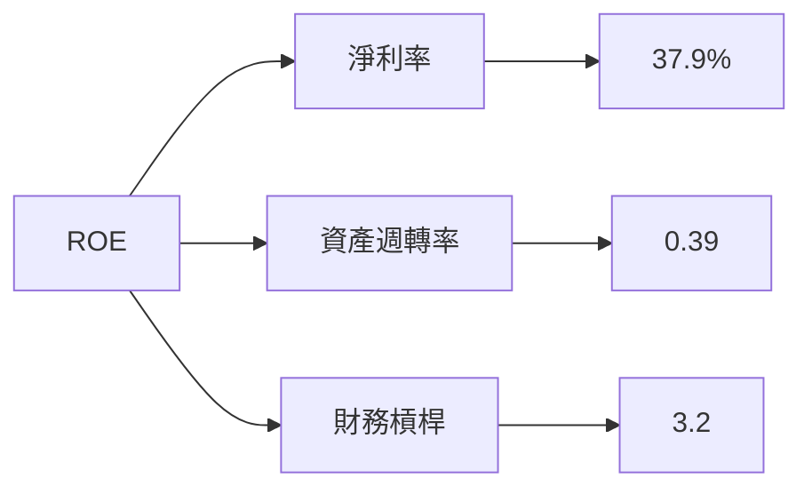

### 6.4 獲利能力儀表板

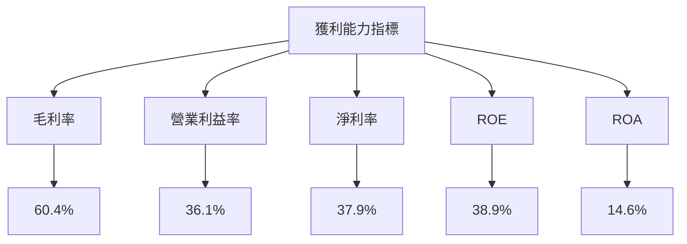

---

## 7. 估值深度分析

### 7.1 同業估值比較表格

| 估值指標 | **Alphabet (GOOG)** | **Meta Platforms** | **Amazon** | **Microsoft** | 本公司評估 |
|----------|----------|---------|---------|---------|-----------|
| **Trailing P/E** | 30.05x | 31.5x | 70.1x | 33.2x | 🟢 相對較低 |
| **Forward P/E** | **27.45x** | 25.3x | 60.2x | 29.4x | 🟢 合理 |
| **P/S Ratio** | 11.31x | 10.9x | 3.5x | 12.2x | 🟡 略高 |
| **EV/EBITDA** | 29.49x | 21.7x | 33.4x | 22.8x | 🟡 略高 |

### 7.2 歷史估值區間分析

```
╔══════════════════════════════════════════════════════════════════╗
║               Alphabet 歷史估值區間 (P/E)                        ║
╠══════════════════════════════════════════════════════════════════╣
║                                                                  ║
║  低位： 20.0x  ███░░░░░░░░░░░░░░░░░░░░░░░░░░░░░                  ║
║  中位： 25.0x  ██████░░░░░░░░░░░░░░░░░░░░░░░░                    ║
║  高位： 35.0x  ██████████░░░░░░░░░░░░░░░░                      ║
║  當前： 30.05x ████████░░░░░░░░░░░░░░                          ║
║                                                                  ║
╚══════════════════════════════════════════════════════════════════╝
```

### 7.3 DCF 敏感性分析（6格目標價矩陣）

| 情境 | **WACC = 7%** | **WACC = 8%（基準）** | **WACC = 9%** |
|------|--------------|----------------------|--------------|
| 🟢 **樂觀** | **$480** (+22%) | **$460** (+17%) | **$440** (+12%) |
| 🟡 **基準** | **$430** (+9%) | **$411.25** (+4%) | **$395** (0%) |
| 🔴 **悲觀** | **$380** (-4%) | **$360** (-9%) | **$340** (-14%) |

### 7.4 估值綜合區間

```
╔══════════════════════════════════════════════════════════════════╗
║               Alphabet 估值區間與當前價格                       ║
╠══════════════════════════════════════════════════════════════════╣
║                                                                  ║
║  低估區間：$340  ███░░░░░░░░░░░░░░░░░░░░░░░░░                    ║
║  合理區間：$395  █████░░░░░░░░░░░░░░░░░░░░                      ║
║  高估區間：$460  ████████░░░░░░░░░░░░░░                        ║
║  當前價格：$394.33 ██████░░░░░░░░░░░░░                         ║
║                                                                  ║
╚══════════════════════════════════════════════════════════════════╝
```

---

## 8. 成長催化劑

### 8.1 催化劑時間軸

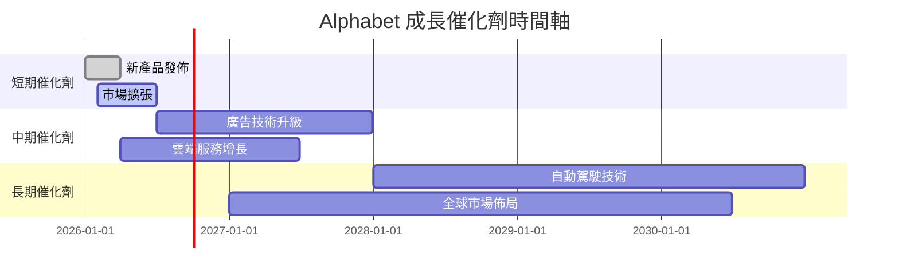

### 8.2 TAM 市場規模分析

```
╔══════════════════════════════════════════════════════════════════╗
║               TAM 市場規模與滲透率分析                          ║
╠══════════════════════════════════════════════════════════════════╣
║                                                                  ║
║  廣告市場：       TAM $700B  滲透率：40%                        ║
║  雲端服務市場：   TAM $500B  滲透率：30%                        ║
║  自動駕駛市場：   TAM $300B  滲透率：10%                        ║
║                                                                  ║
╚══════════════════════════════════════════════════════════════════╝
```

### 8.3 成長驅動力結構圖

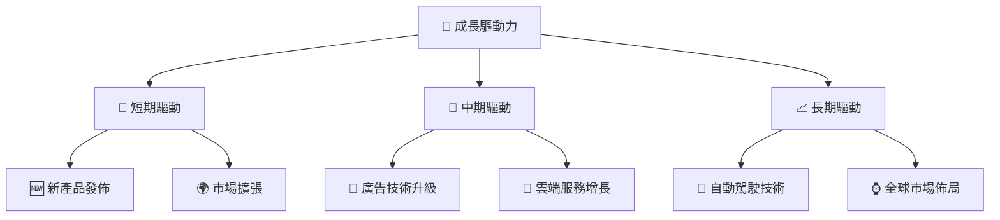

---

## 9. 風險矩陣

### 9.1 風險評分矩陣

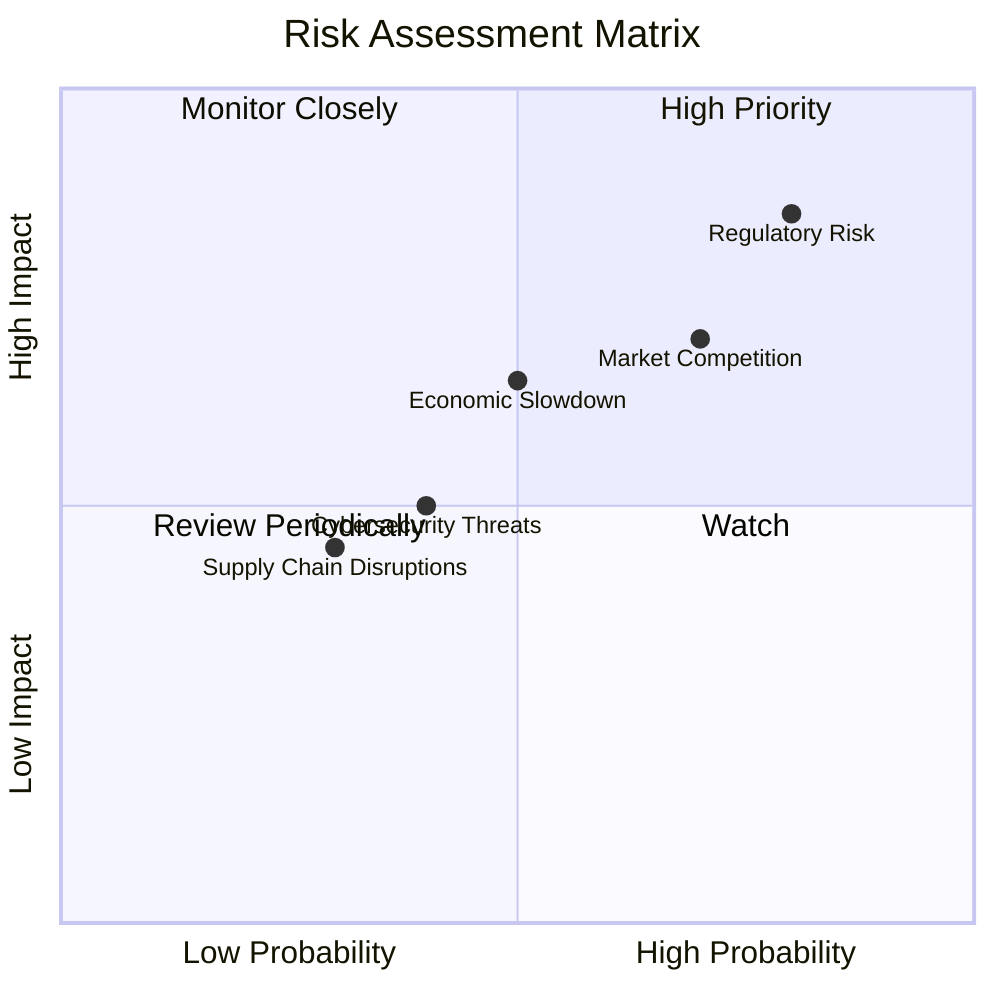

### 9.2 風險清單詳細分析

| # | 風險項目 | 發生機率 | 財務衝擊 | 風險評分 | 緩解措施 |
|---|----------|----------|----------|----------|----------|
| 1 | 🔴 **監管風險** | 高 (80%) | 高 (-15%收入) | 🔴 8.5/10 | 加強合規監控，預測潛在變動 |
| 2 | 🔴 **市場競爭** | 高 (70%) | 中 (10%收入) | 🔴 7.0/10 | 加強產品創新，提升競爭力 |
| 3 | 🟡 **經濟放緩** | 中 (50%) | 中 (8%收入) | 🟡 6.5/10 | 分散市場風險，擴大區域覆蓋 |
| 4 | 🟡 **網絡安全威脅** | 中低 (40%) | 中低 (5%收入) | 🟡 5.0/10 | 加強網絡安全，提升防禦能力 |
| 5 | 🟡 **供應鏈中斷** | 低 (30%) | 低 (3%收入) | 🟡 4.5/10 | 增加供應商多樣性，確保穩定供應 |

---

## 10. 投資建議

### 10.1 最終綜合評級雷達圖

```
╔══════════════════════════════════════════════════════════════════╗
║                    綜合評級雷達圖                                ║
╠══════════════════════════════════════════════════════════════════╣
║                                                                  ║
║  基本面    9.0 ▓▓▓▓▓▓▓▓▓▓▓▓▓▓▓▓▓▓▓░░  ★★★★★                     ║
║  成長動能  9.0 ▓▓▓▓▓▓▓▓▓▓▓▓▓▓▓▓▓▓▓░░  ★★★★★                     ║
║  獲利品質  9.0 ▓▓▓▓▓▓▓▓▓▓▓▓▓▓▓▓▓▓▓░░  ★★★★★                     ║
║  財務健康  9.0 ▓▓▓▓▓▓▓▓▓▓▓▓▓▓▓▓▓▓▓░░  ★★★★★                     ║
║  估值合理性8.0 ▓▓▓▓▓▓▓▓▓▓▓▓▓▓▓▓▓░░░░  ★★★★☆                     ║
║                                                                  ║
╚══════════════════════════════════════════════════════════════════╝
```

### 10.2 目標價與隱含報酬率

| 情境 | 目標價 | 隱含報酬率 | 機率權重 |
|------|--------|------------|----------|
| 悲觀 | $340 | -13.8% | 20% |
| 基準 | $411.25 | +4.3% | 60% |
| 樂觀 | $460 | +16.7% | 20% |

### 10.3 買入時機與觸發因素

```
╔══════════════════════════════════════════════════════════════════╗
║                  ✅ 買入觸發因素 Checklist                      ║
╠══════════════════════════════════════════════════════════════════╣
║                                                                  ║
║  立即買入觸發條件（多數符合）：                                  ║
║  ✅ 公司持續保持高成長動能                                        ║
║  ✅ 財務報表顯示強勁的現金流                                       ║
║  ✅ 行業前景看好，無重大監管風險                                  ║
║                                                                  ║
║  加碼觸發條件（出現以下任一）：                                  ║
║  ☐ 股價回調至 $360 以下                                          ║
║  ☐ 發佈重大創新產品或技術突破                                    ║
║                                                                  ║
║  減碼/停損觸發條件（出現以下任一）：                             ║
║  ☐ 出現重大監管處罰或法律風險                                    ║
║  ☐ 行業競爭加劇導致市場份額大幅下降                               ║
║                                                                  ║
╚══════════════════════════════════════════════════════════════════╝
```

### 10.4 投資人適配度分析

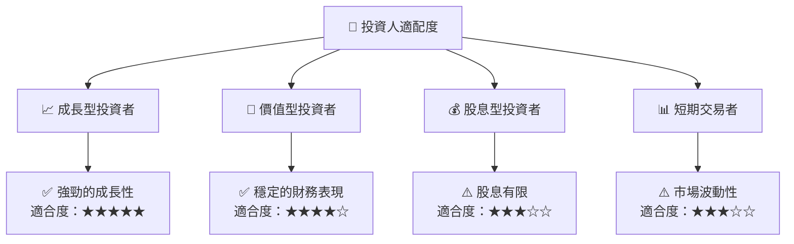

### 10.5 關鍵監控指標

| 監控類型 | 指標 | 關注點 | 頻率 |
|----------|------|--------|------|
| 財務指標 | 自由現金流 | 現金流穩定性 | 季度 |
| 市場動向 | 市場份額 | 市佔率變化 | 半年 |
| 監管環境 | 監管公告 | 政策變動 | 即時 |
| 競爭分析 | 競爭對手動態 | 新產品與技術 | 季度 |

---

> **免責聲明**：本報告為 AI 自動生成，僅供研究參考，不構成投資建議。投資有風險，入市需謹慎。