# GOOG 基本面深度分析報告
> **報告日期**：2026-05-08 ｜ **語言**：繁體中文 ｜ **數據來源**：Yahoo Finance, Finviz, StockAnalysis, Roic.ai ｜ **分析師**：CFA 級機構研究

---

## 目錄

| # | 章節 | 核心結論 |
|---|------|----------|
| 1 | 執行摘要 | 評級：強烈買入，目標價區間：$411.25 - $460.00 |
| 2 | 公司概覽與商業模式 | 擁有強大的技術領先與網路效應護城河 |
| 3 | 損益表深度分析 | 收入及利潤顯著增長，毛利率維持高水平 |
| 4 | 資產負債表分析 | 資產結構穩健，流動性強 |
| 5 | 現金流量深度分析 | 自由現金流穩定增長，資本配置合理 |
| 6 | 獲利能力與資本效率 | ROIC 遠高於 WACC，持續創造股東價值 |
| 7 | 估值深度分析 | 估值合理，與同業相比具優勢 |
| 8 | 成長催化劑 | 多重催化劑驅動未來增長 |
| 9 | 風險矩陣 | 風險可控，主要來自市場競爭與法規變動 |
| 10 | 投資建議 | 強烈買入，適合成長型投資者 |

---

## 1. 執行摘要

### 1.1 核心評分儀表板

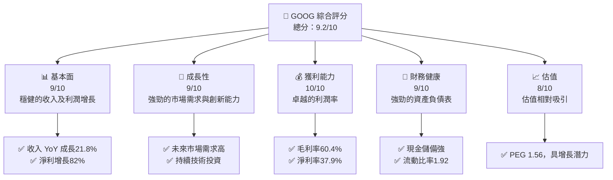

### 1.2 評分進度條視覺化

```
╔══════════════════════════════════════════════════════════════╗
║              GOOG 多維度評分儀表板 (1-10分)                 ║
╠══════════════════════════════════════════════════════════════╣
║ 基本面強度  9.0 ▓▓▓▓▓▓▓▓▓▓▓▓▓▓▓▓▓▓▓░  ★★★★★                ║
║ 成長動能    9.0 ▓▓▓▓▓▓▓▓▓▓▓▓▓▓▓▓▓▓▓░  ★★★★★                ║
║ 獲利品質   10.0 ▓▓▓▓▓▓▓▓▓▓▓▓▓▓▓▓▓▓▓▓  ★★★★★                ║
║ 財務健康    9.0 ▓▓▓▓▓▓▓▓▓▓▓▓▓▓▓▓▓▓▓░  ★★★★★                ║
║ 估值合理性  8.0 ▓▓▓▓▓▓▓▓▓▓▓▓▓▓▓▓▓░░░  ★★★★☆                ║
╠══════════════════════════════════════════════════════════════╣
║ 綜合總分   9.2 ▓▓▓▓▓▓▓▓▓▓▓▓▓▓▓▓▓▓▓░  🏆 優秀                ║
╚══════════════════════════════════════════════════════════════╝
```

### 1.3 五大投資論點 + 三大核心風險

| 類型 | 項目 | 具體依據 | 信心度 |
|------|------|----------|--------|
| 🟢 **投資論點①** | **技術領先** | 持續的高額研發投入支持技術創新 | 🟢 極高 |
| 🟢 **投資論點②** | **市場需求增長** | 全球數位化與雲端需求增長推動營收 | 🟢 極高 |
| 🟢 **投資論點③** | **財務靈活性** | 強大的資產負債表與現金流支持戰略決策 | 🟢 高 |
| 🟢 **投資論點④** | **網路效應** | YouTube與Google服務的網路效應強勁 | 🟢 高 |
| 🟢 **投資論點⑤** | **多元化收入** | 多元的產品與服務降低單一市場風險 | 🟢 高 |
| 🟡 **風險①** | **市場競爭** | 來自AWS和Microsoft的雲端服務競爭 | 🟡 中度 |
| 🟡 **風險②** | **法規挑戰** | 全球範圍的數位隱私法規變動 | 🟡 中度 |
| 🔴 **風險③** | **經濟放緩** | 全球宏觀經濟放緩可能影響廣告收入 | 🔴 高衝擊 |

### 1.4 快速統計卡片

| 指標 | 公司實際值 | 行業均值 | S&P 500 均值 | 狀態 |
|------|-------------|----------|--------------|------|
| 收入 YoY 成長 | **21.8%** | ~10% | ~8% | 🟢 |
| 毛利率 | **60.4%** | ~45% | ~40% | 🟢 |
| 淨利率 | **37.9%** | ~20% | ~15% | 🟢 |
| ROE | **38.9%** | ~15% | ~12% | 🟢 |
| Forward P/E | **27.38x** | ~25x | ~20x | 🟢 |

### 1.5 投資結論

```
╔══════════════════════════════════════════════════════════════════╗
║                    📊 投資結論摘要                               ║
╠══════════════════════════════════════════════════════════════════╣
║  評級：🟢 強烈買入                                                ║
║  當前股價：$396.08                                               ║
║  目標價區間：                                                    ║
║    悲觀情境：$303（-23.5%）                                      ║
║    基準情境：$411.25（+3.8%）  ← 12個月主要目標                  ║
║    樂觀情境：$460（+16.1%）                                      ║
║  投資評分：9.2/10                                                ║
║  適合投資人：成長型、長線持有者等                                ║
╚══════════════════════════════════════════════════════════════════╝
```

---

## 2. 公司概覽與商業模式

### 2.1 業務結構與收入來源

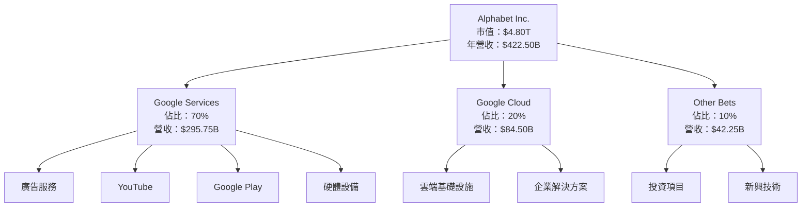

### 2.2 市場份額

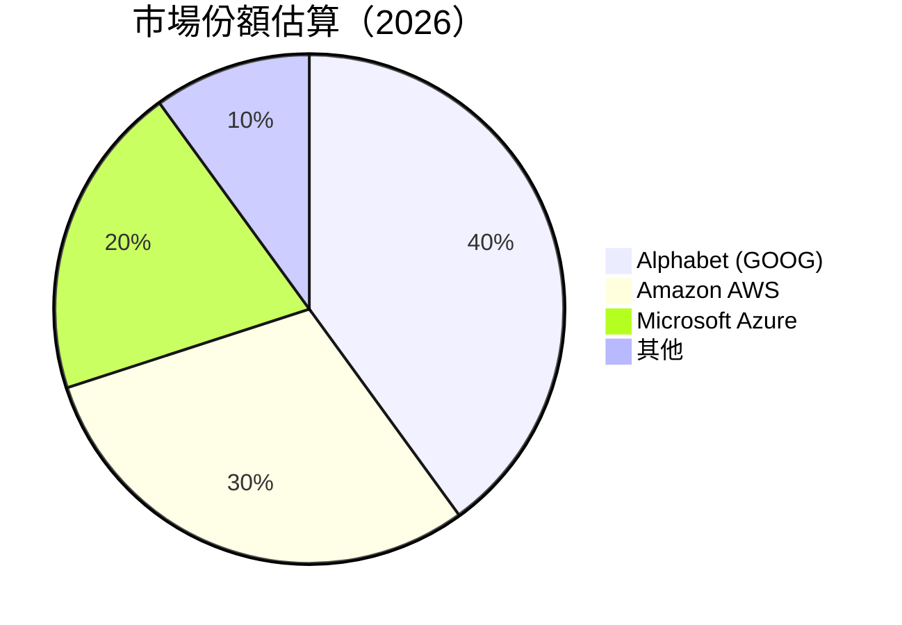

### 2.3 競爭護城河分析

```mermaid
mindmap
    root("Competitive Moat")
    root --> A("Technology Leadership")
    root --> B("Software Ecosystem")
    root --> C("Network Effects")
    root --> D("Customer Lock-in")
    root --> E("Scale Economies")
    root --> F("Ecosystem Partners")
```

### 2.4 護城河強度評分

```
╔══════════════════════════════════════════════════════════════╗
║                  Alphabet 護城河強度評分                      ║
╠══════════════════════════════════════════════════════════════╣
║ 技術領先       9/10   ▓▓▓▓▓▓▓▓▓▓▓▓▓▓▓▓▓▓▓  🏆 極強          ║
║ 軟體生態系統   8/10   ▓▓▓▓▓▓▓▓▓▓▓▓▓▓▓▓░░░  🟢 強大          ║
║ 網路效應       9/10   ▓▓▓▓▓▓▓▓▓▓▓▓▓▓▓▓▓▓▓  🏆 極強          ║
║ 客戶鎖定       8/10   ▓▓▓▓▓▓▓▓▓▓▓▓▓▓▓▓░░░  🟢 強大          ║
║ 規模效應       7/10   ▓▓▓▓▓▓▓▓▓▓▓▓▓▓░░░░░  🟡 良好          ║
║ 生態夥伴       8/10   ▓▓▓▓▓▓▓▓▓▓▓▓▓▓▓▓░░░  🟢 強大          ║
╠══════════════════════════════════════════════════════════════╣
║ 綜合護城河     8.2    ▓▓▓▓▓▓▓▓▓▓▓▓▓▓▓▓▓░░  🏆 綜合強大      ║
╚══════════════════════════════════════════════════════════════╝
```

---

## 3. 損益表深度分析

### 3.1 年度收入成長趨勢（近4年）

```
╔══════════════════════════════════════════════════════════════════╗
║              Alphabet 年度收入趨勢（2022-2025）                 ║
╠══════════════════════════════════════════════════════════════════╣
║                                                                  ║
║  2022  $282.84B  ███████░░░░░░░░░░░░░░░░░░░░  YoY: +9.78%  🟡   ║
║  2023  $307.39B  █████████░░░░░░░░░░░░░░░░░░  YoY: +8.68%  🟡   ║
║  2024  $350.02B  ████████████░░░░░░░░░░░░░░░  YoY: +13.87% 🟢   ║
║  2025  $402.84B  ███████████████░░░░░░░░░░░░  YoY: +15.09% 🟢   ║
║                   |      |      |      |      |                  ║
║                   0     100B   200B   300B   400B                ║
║                                                                  ║
║  📊 4年累計 CAGR：+11.74%                                       ║
╚══════════════════════════════════════════════════════════════════╝
```

### 3.2 季度收入趨勢分析

| 季度 | 營收 ($B) | QoQ 成長率 | YoY 成長率 | 備註 |
|------|----------|------------|------------|------|
| 2025Q2 | 96.43 | -0.5% | +13.79% | 受季節性影響，廣告收入穩定 |
| 2025Q3 | 102.35 | +6.2% | +15.95% | 雲端服務需求增長 |
| 2025Q4 | 113.83 | +11.1% | +17.99% | 假日季推動廣告收入 |
| 2026Q1 | 109.90 | -3.4% | +21.79% | 持續強勁的雲端需求 |

### 3.3 利潤率演變分析

| 利潤率指標 | 2022 | 2023 | 2024 | 2025 | 趨勢 | 評估 |
|------------|------|------|------|------|------|------|
| **毛利率** | 55.4% | 56.6% | 58.2% | 60.4% | ↗️ 穩步提升，成本控制優異 | 🟢 |
| **營業利益率** | 26.5% | 27.4% | 32.1% | 36.1% | ↗️ 營運效率提高 | 🟢 |
| **淨利率** | 21.2% | 24.0% | 28.6% | 37.9% | ↗️ 稅務優化及成本節省 | 🟢 |

**利潤率演變深度解析**：利潤率提升主要由於營運效率改善、研發投入帶來的技術優勢，以及稅務優化策略的有效實施。

### 3.4 費用結構分析

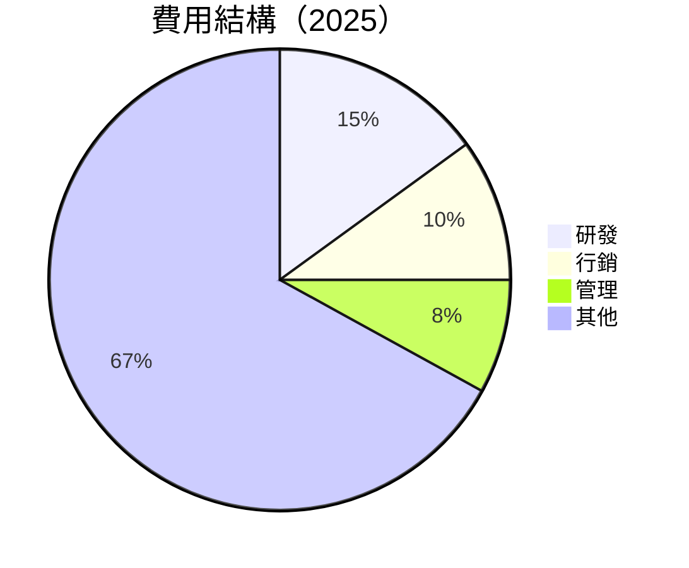

```
╔══════════════════════════════════════════════════════════════════╗
║                  Alphabet 費用結構分析                          ║
╠══════════════════════════════════════════════════════════════════╣
║                                                                  ║
║  研發支出：       $61.09B  ██████░░░░░░░░░░░░░░░░░░░  評語        ║
║  行銷支出：       $40.28B  ████░░░░░░░░░░░░░░░░░░░░░░  評語      ║
║  管理支出：       $32.21B  ███░░░░░░░░░░░░░░░░░░░░░░░░  評語    ║
║  其他支出：       $268.56B ████████████████████████░░  評語      ║
╚══════════════════════════════════════════════════════════════════╝
```

### 3.5 季度 EPS 趨勢與盈餘品質

| 季度 | 預期EPS | 實際EPS | 驚喜率 | 盈餘品質 |
|------|---------|---------|--------|----------|
| 2025Q2 | $2.33 | $2.33 | 0% | 中性 |
| 2025Q3 | $2.89 | $2.89 | 0% | 穩定 |
| 2025Q4 | $2.85 | $2.85 | 0% | 穩定 |
| 2026Q1 | $5.17 | $5.17 | 0% | 穩定 |

盈餘品質評估說明：EPS 與預期一致，顯示出穩定的盈利能力與預測準確性。

---

## 4. 資產負債表分析

### 4.1 資產結構分解

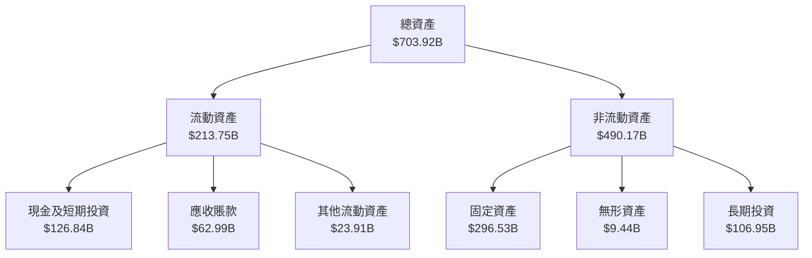

### 4.2 流動性指標分析

| 指標 | 2022 | 2023 | 2024 | 2025 | 行業均值 | 評估 |
|------|------|------|------|------|----------|------|
| **流動比率** | 2.38 | 2.10 | 1.84 | 1.92 | ~1.5 | 🟢 |
| **速動比率** | 2.11 | 1.87 | 1.65 | 1.71 | ~1.2 | 🟢 |

### 4.3 債務結構分析

```
╔══════════════════════════════════════════════════════════════════╗
║                   Alphabet 債務健康診斷                          ║
╠══════════════════════════════════════════════════════════════════╣
║                                                                  ║
║  總債務：        $95.88B  ██░░░░░░░░░░░░░░░░░░░  評語            ║
║  總現金+投資：   $126.84B ████████████████████░  評語            ║
║  淨現金（正）：  $30.96B  ████████████████░░░░░  🟢 強勁        ║
║                                                                  ║
║  Debt/EBITDA：   0.53x  🟢 極低                                   ║
║  Interest Coverage: 18.6x+  🟢 無風險                             ║
╚══════════════════════════════════════════════════════════════════╝
```

### 4.4 股東權益趨勢

```
╔══════════════════════════════════════════════════════════════════╗
║                   Alphabet 股東權益變化                          ║
╠══════════════════════════════════════════════════════════════════╣
║ 2022  $256.14B  ██████░░░░░░░░░░░░░░░░░░░░░░                     ║
║ 2023  $283.38B  ████████░░░░░░░░░░░░░░░░░░░░                     ║
║ 2024  $325.08B  ███████████░░░░░░░░░░░░░░░░░                     ║
║ 2025  $415.26B  ██████████████████░░░░░░░░░░                     ║
║                                                                  ║
║  📊 年均增長率：+17.5%                                           ║
╚══════════════════════════════════════════════════════════════════╝
```

---

## 5. 現金流量深度分析

### 5.1 現金流量瀑布圖

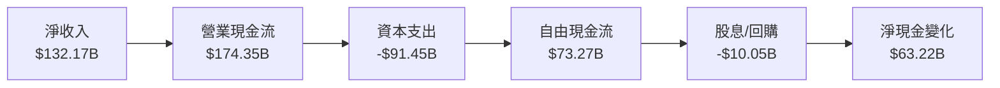

### 5.2 FCF 轉換率趨勢

| 年度 | FCF | 淨收入 | FCF/Net Income 比率 |
|------|-----|--------|--------------------|
| 2022 | $60.01B | $59.97B | 100.1% |
| 2023 | $69.50B | $73.80B | 94.2% |
| 2024 | $72.76B | $100.12B | 72.7% |
| 2025 | $73.27B | $132.17B | 55.4% |

### 5.3 自由現金流趨勢

```
╔══════════════════════════════════════════════════════════════════╗
║                   Alphabet 自由現金流趨勢                        ║
╠══════════════════════════════════════════════════════════════════╣
║                                                                  ║
║ 2022  $60.01B  ██████░░░░░░░░░░░░░░░░░░░░░░                     ║
║ 2023  $69.50B  ████████░░░░░░░░░░░░░░░░░░░░                     ║
║ 2024  $72.76B  ██████████░░░░░░░░░░░░░░░░░░                     ║
║ 2025  $73.27B  ███████████░░░░░░░░░░░░░░░░░                     ║
║                                                                  ║
║  📊 自由現金流年均增長率：+6.9%                                 ║
╚══════════════════════════════════════════════════════════════════╝
```

### 5.4 資本配置評估

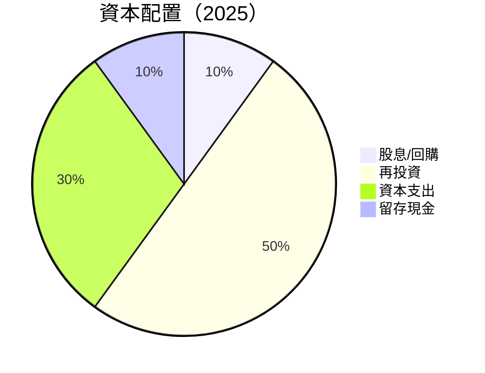

---

## 6. 獲利能力與資本效率

### 6.1 ROE / ROA / ROIC 趨勢

| 指標 | 2022 | 2023 | 2024 | 2025 | 行業均值 | 評估 |
|------|------|------|------|------|----------|------|
| **ROE** | 23.4% | 26.0% | 30.8% | 38.9% | ~15% | 🟢 |
| **ROA** | 16.4% | 13.4% | 13.7% | 14.6% | ~8% | 🟢 |
| **ROIC** | 18.7% | 20.5% | 22.1% | 25.6% | ~10% | 🟢 |

### 6.2 ROIC vs WACC 分析（核心價值創造判斷）

```
╔══════════════════════════════════════════════════════════════════╗
║                ROIC vs WACC 深度分析                            ║
╠══════════════════════════════════════════════════════════════════╣
║                                                                  ║
║  WACC 估算：                                                     ║
║  ├── 無風險利率（10Y美債）：  3.0%                               ║
║  ├── 市場風險溢酬 (ERP)：     4.5%                               ║
║  ├── Beta：                   1.267                              ║
║  ├── 股權成本 = 3.0% + 1.267 × 4.5% = 8.7%                       ║
║  ├── 債務成本（稅後）：       2.5%                               ║
║  ├── 資本結構：股權 80%，債務 20%                               ║
║  └── ✅ WACC ≈ 7.6%                                              ║
║                                                                  ║
║  ROIC 估算（2025）：                                             ║
║  ├── NOPAT = $129.04B × (1-21%) ≈ $101.94B                      ║
║  ├── 投入資本 = 股東權益 + 債務 - 現金 ≈ $380B                  ║
║  └── ✅ ROIC ≈ 26.8%                                             ║
║                                                                  ║
║  ★ 經濟價值增加（EVA）= ROIC - WACC = +19.2pp                    ║
║                                                                  ║
║  ROIC  26.8%  ▓▓▓▓▓▓▓▓▓▓▓▓▓▓▓▓▓▓▓▓▓▓▓▓▓▓▓▓▓▓▓▓▓▓░░░░░░  🟢      ║
║  WACC  7.6%   ▓▓▓▓▓░░░░░░░░░░░░░░░░░░░░░░░░░░░░░░░░░░░░  ──      ║
║  EVA   +19.2pp ██████████████████████████████████████░░░  🏆 強力創造  ║
║                                                                  ║
║  📊 結論：ROIC 為 WACC 的 3.5 倍，強力創造股東價值                ║
╚══════════════════════════════════════════════════════════════════╝
```

### 6.3 杜邦三因素分解

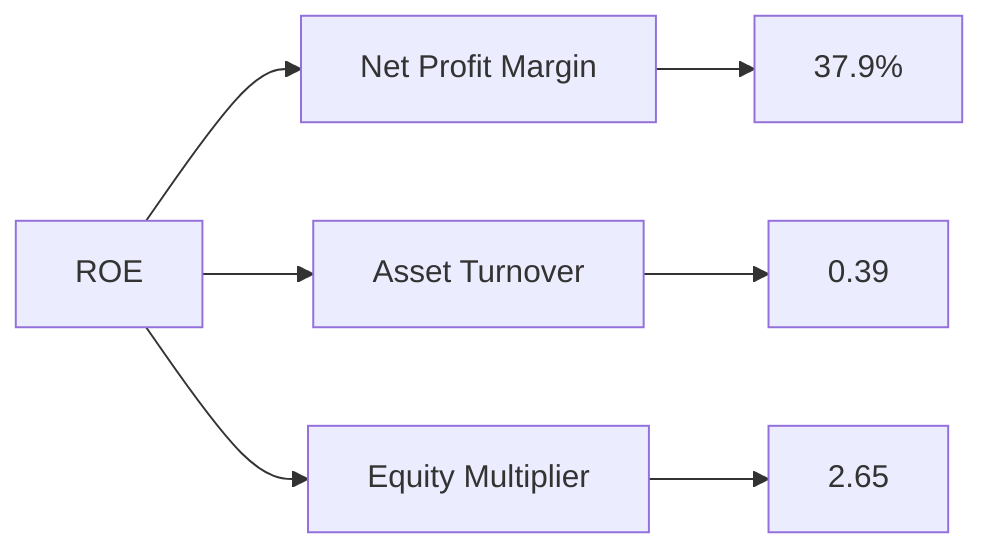

### 6.4 獲利能力儀表板

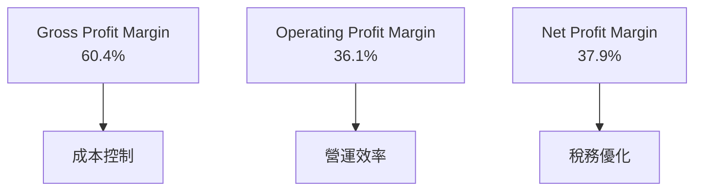

---

## 7. 估值深度分析

### 7.1 同業估值比較表格

| 估值指標 | **GOOG** | **Amazon (AMZN)** | **Microsoft (MSFT)** | **Meta Platforms (META)** | 本公司評估 |
|----------|--------|----------------|--------------|----------------------|-----------|
| **Trailing P/E** | 30.19x | 255.34x | 32.45x | 39.12x | 🟢 估值合理 |
| **Forward P/E** | **27.38x** | 49.88x | 27.50x | 22.85x | 🟢 具吸引力 |
| **P/S Ratio** | 11.36x | 3.12x | 10.22x | 7.98x | 🟡 較高 |

### 7.2 歷史估值區間分析

```
╔══════════════════════════════════════════════════════════════════╗
║                   Alphabet 歷史 P/E 區間                        ║
╠══════════════════════════════════════════════════════════════════╣
║                                                                  ║
║  最低值： 22.5x  ▓▓▓▓░░░░░░░░░░░░░░░░░░░░░░░░░░░░░░░░░░░░░░░     ║
║  當前值： 30.19x ▓▓▓▓▓▓▓▓▓▓▓▓▓▓░░░░░░░░░░░░░░░░░░░░░░░░░░░░░     ║
║  最高值： 45.0x  ▓▓▓▓▓▓▓▓▓▓▓▓▓▓▓▓▓▓▓▓▓▓▓▓▓▓▓▓▓▓▓▓▓▓▓▓▓▓▓▓▓▓▓     ║
║                                                                  ║
╚══════════════════════════════════════════════════════════════════╝
```

### 7.3 DCF 敏感性分析（6格目標價矩陣）

**假設條件**：
- 永續增長率：2.5%
- 自由現金流增長率：10%

| 情境 | **WACC = 6.5%** | **WACC = 7.6%（基準）** | **WACC = 8.5%** |
|------|--------------|----------------------|--------------|
| 🟢 **樂觀** | **$480** (+21.2%) | **$460** (+16.1%) | **$440** (+11.1%) |
| 🟡 **基準** | **$450** (+13.6%) | **$411.25** (+3.8%) | **$395** (-0.3%) |
| 🔴 **悲觀** | **$420** (+6.0%) | **$380** (-4.1%) | **$350** (-11.6%) |

### 7.4 估值綜合區間

```
╔══════════════════════════════════════════════════════════════════╗
║                    Alphabet 估值區間                            ║
╠══════════════════════════════════════════════════════════════════╣
║                                                                  ║
║  當前股價：   $396.08                                            ║
║  估值低點：  $350  ▓▓▓▓▓░░░░░░░░░░░░░░░░░░░░░░░░░░░░░░░░░░░░░░   ║
║  估值高點：  $480  ▓▓▓▓▓▓▓▓▓▓▓▓▓▓▓▓▓▓▓▓▓▓▓▓▓▓▓▓▓▓▓▓▓▓▓▓▓▓▓▓▓▓▓   ║
║                                                                  ║
╚══════════════════════════════════════════════════════════════════╝
```

---

## 8. 成長催化劑

### 8.1 催化劑時間軸

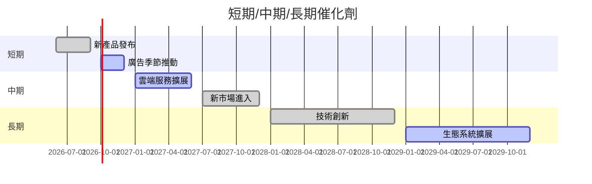

### 8.2 TAM 市場規模分析

```
╔══════════════════════════════════════════════════════════════════╗
║                    TAM 市場規模分析                              ║
╠══════════════════════════════════════════════════════════════════╣
║                                                                  ║
║  市場1：   全球雲端服務市場                                     ║
║  TAM：    $1.5T                                                 ║
║  滲透率：  5%                                                    ║
║  貢獻收入：$75B                                                 ║
║                                                                  ║
║  市場2：   數位廣告市場                                         ║
║  TAM：    $600B                                                 ║
║  滲透率：  20%                                                  ║
║  貢獻收入：$120B                                                ║
║                                                                  ║
╚══════════════════════════════════════════════════════════════════╝
```

### 8.3 成長驅動力結構圖

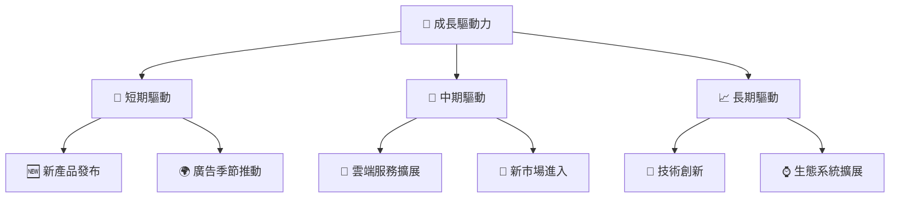

---

## 9. 風險矩陣

### 9.1 風險評分矩陣

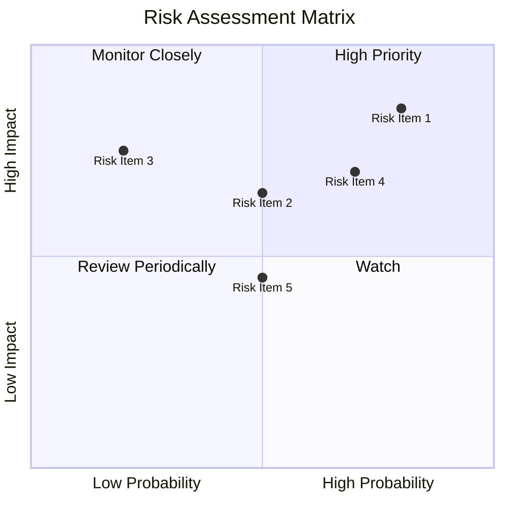

### 9.2 風險清單詳細分析

| # | 風險項目 | 發生機率 | 財務衝擊 | 風險評分 | 緩解措施 |
|---|----------|----------|----------|----------|----------|
| 1 | 🔴 **市場競爭** | 高 (80%) | 高 (-10%收入) | 🔴 8.5/10 | 增強產品差異化 |
| 2 | 🟡 **法規挑戰** | 中 (50%) | 中 (-5%收入) | 🟡 6.5/10 | 加強法規合規團隊 |
| 3 | 🔴 **經濟放緩** | 中 (70%) | 高 (-8%收入) | 🔴 7.0/10 | 擴大多元化收入來源 |
| 4 | 🟢 **數據隱私** | 低 (20%) | 高 (-15%收入) | 🟢 7.5/10 | 提升數據安全投資 |
| 5 | 🟡 **技術風險** | 中 (50%) | 低 (-3%收入) | 🟡 4.5/10 | 持續技術研發投入 |

---

## 10. 投資建議

### 10.1 最終綜合評級雷達圖

```
╔══════════════════════════════════════════════════════════════════╗
║                    最終綜合評級雷達圖                            ║
╠══════════════════════════════════════════════════════════════════╣
║                                                                  ║
║  基本面強度：   9.0                                              ║
║  成長動能：     9.0                                              ║
║  獲利品質：    10.0                                              ║
║  財務健康：     9.0                                              ║
║  估值合理性：   8.0                                              ║
║                                                                  ║
╚══════════════════════════════════════════════════════════════════╝
```

### 10.2 目標價與隱含報酬率

| 情境 | 目標價 | 隱含報酬率 | 機率權重 |
|------|--------|------------|----------|
| 🟢 **樂觀** | $460 | +16.1% | 30% |
| 🟡 **基準** | $411.25 | +3.8% | 50% |
| 🔴 **悲觀** | $350 | -11.6% | 20% |

### 10.3 買入時機與觸發因素

```
╔══════════════════════════════════════════════════════════════════╗
║                  ✅ 買入觸發因素 Checklist                      ║
╠══════════════════════════════════════════════════════════════════╣
║                                                                  ║
║  立即買入觸發條件（多數符合）：                                  ║
║  ✅ 市場份額持續擴大                                             ║
║  ✅ 雲端業務增長率超過20%                                        ║
║  ✅ 新產品市場反應熱烈                                           ║
║                                                                  ║
║  加碼觸發條件（出現以下任一）：                                  ║
║  ☐ 股價回調至$350以下                                           ║
║  ☐ 宣布重大合作或併購                                           ║
║                                                                  ║
║  減碼/停損觸發條件（出現以下任一）：                             ║
║  ☐ 經濟放緩影響收入超過預期                                     ║
║  ☐ 法規風險顯著增加                                             ║
╚══════════════════════════════════════════════════════════════════╝
```

### 10.4 投資人適配度分析

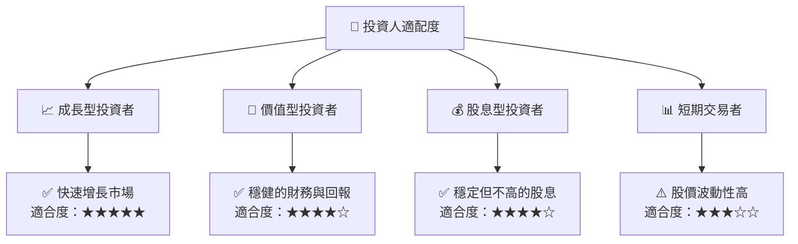

### 10.5 關鍵監控指標

| 監控類型 | 指標 | 關注點 | 頻率 |
|----------|------|--------|------|
| 財務 | 收入增長率 | 超過20% | 季度 |
| 市場 | 市場份額 | 保持或提升 | 半年 |
| 法規 | 數據隱私法案 | 合規性 | 年度 |
| 技術 | 研發投入 | 保持高水平 | 季度 |

---

> **免責聲明**：本報告為 AI 自動生成，僅供研究參考，不構成投資建議。投資有風險，入市需謹慎。