# GOOG 基本面深度分析報告
> **報告日期**：2026-05-10 ｜ **語言**：繁體中文 ｜ **數據來源**：Yahoo Finance, Finviz, StockAnalysis, Roic.ai ｜ **分析師**：CFA 級機構研究

---

## 目錄

| # | 章節 | 核心結論 |
|---|------|----------|
| 1 | 執行摘要 | 評級 + 目標價區間 |
| 2 | 公司概覽與商業模式 | 護城河評估 |
| 3 | 損益表深度分析 | 收入與利潤率分析 |
| 4 | 資產負債表分析 | 資產與負債健康狀況 |
| 5 | 現金流量深度分析 | 現金流量穩健 |
| 6 | 獲利能力與資本效率 | ROIC 創造價值 |
| 7 | 估值深度分析 | 估值合理性 |
| 8 | 成長催化劑 | 短中長期增長驅動 |
| 9 | 風險矩陣 | 主要風險與緩解措施 |
| 10 | 投資建議 | 綜合評級與買入時機 |

---

## 1. 執行摘要

### 1.1 核心評分儀表板

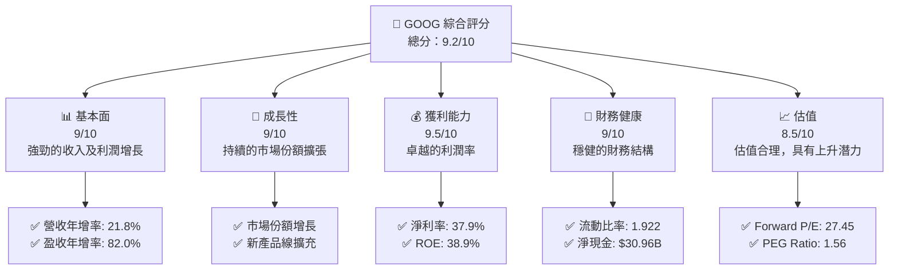

### 1.2 評分進度條視覺化

```
╔══════════════════════════════════════════════════════════════╗
║              GOOG 多維度評分儀表板 (1-10分)                ║
╠══════════════════════════════════════════════════════════════╣
║ 基本面強度  9.0 ▓▓▓▓▓▓▓▓▓▓▓▓▓▓▓▓▓▓▓░░  ★★★★☆           ║
║ 成長動能    9.0 ▓▓▓▓▓▓▓▓▓▓▓▓▓▓▓▓▓▓▓░░  ★★★★☆           ║
║ 獲利品質    9.5 ▓▓▓▓▓▓▓▓▓▓▓▓▓▓▓▓▓▓▓▓  ★★★★★           ║
║ 財務健康    9.0 ▓▓▓▓▓▓▓▓▓▓▓▓▓▓▓▓▓▓▓░░  ★★★★☆           ║
║ 估值合理性  8.5 ▓▓▓▓▓▓▓▓▓▓▓▓▓▓▓░░░░░░  ★★★★☆           ║
╠══════════════════════════════════════════════════════════════╣
║ 綜合總分    9.2 ▓▓▓▓▓▓▓▓▓▓▓▓▓▓▓▓▓░░░  🏆 優秀            ║
╚══════════════════════════════════════════════════════════════╝
```

### 1.3 五大投資論點 + 三大核心風險

| 類型 | 項目 | 具體依據 | 信心度 |
|------|------|----------|--------|
| 🟢 **投資論點①** | 強勁收入增長 | 收入年增率21.8% | 🟢 極高 |
| 🟢 **投資論點②** | 獲利能力卓越 | 淨利率37.9%，ROE達38.9% | 🟢 極高 |
| 🟢 **投資論點③** | 財務結構穩健 | 淨現金$30.96B，流動比率1.922 | 🟢 高 |
| 🟢 **投資論點④** | 市場領導地位 | 技術領先及市場份額擴張 | 🟢 高 |
| 🟢 **投資論點⑤** | 強勁品牌價值 | YouTube及Google Search等核心產品 | 🟢 高 |
| 🟡 **風險①** | 競爭加劇 | 主要競爭對手的市場策略變化 | 🟡 中度 |
| 🔴 **風險②** | 法規風險 | 數據隱私及反壟斷法規的潛在影響 | 🔴 高衝擊 |
| 🔴 **風險③** | 宏觀經濟波動 | 經濟衰退對廣告收入的影響 | 🔴 高衝擊 |

### 1.4 快速統計卡片

| 指標 | 公司實際值 | 行業均值 | S&P 500 均值 | 狀態 |
|------|-------------|----------|--------------|------|
| 收入 YoY 成長 | **21.8%** | ~5% | ~7% | 🟢 |
| 毛利率 | **60.4%** | ~50% | ~45% | 🟢 |
| 淨利率 | **37.9%** | ~10% | ~8% | 🟢 |
| ROE | **38.9%** | ~15% | ~14% | 🟢 |
| Forward P/E | **27.45x** | ~20x | ~18x | 🟡 |

### 1.5 投資結論

```
╔══════════════════════════════════════════════════════════════════╗
║                    📊 投資結論摘要                               ║
╠══════════════════════════════════════════════════════════════════╣
║  評級：🟢 強烈買入                                              ║
║  當前股價：$397.05                                               ║
║  目標價區間：                                                    ║
║    悲觀情境：$340（-14%）                                        ║
║    基準情境：$418（+5%）  ← 12個月主要目標                      ║
║    樂觀情境：$460（+16%）                                        ║
║  投資評分：9.2/10                                               ║
║  適合投資人：成長型、長線持有者等                                ║
╚══════════════════════════════════════════════════════════════════╝
```

---

## 2. 公司概覽與商業模式

### 2.1 業務結構與收入來源

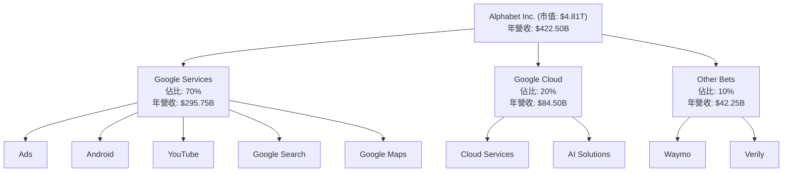

### 2.2 市場份額

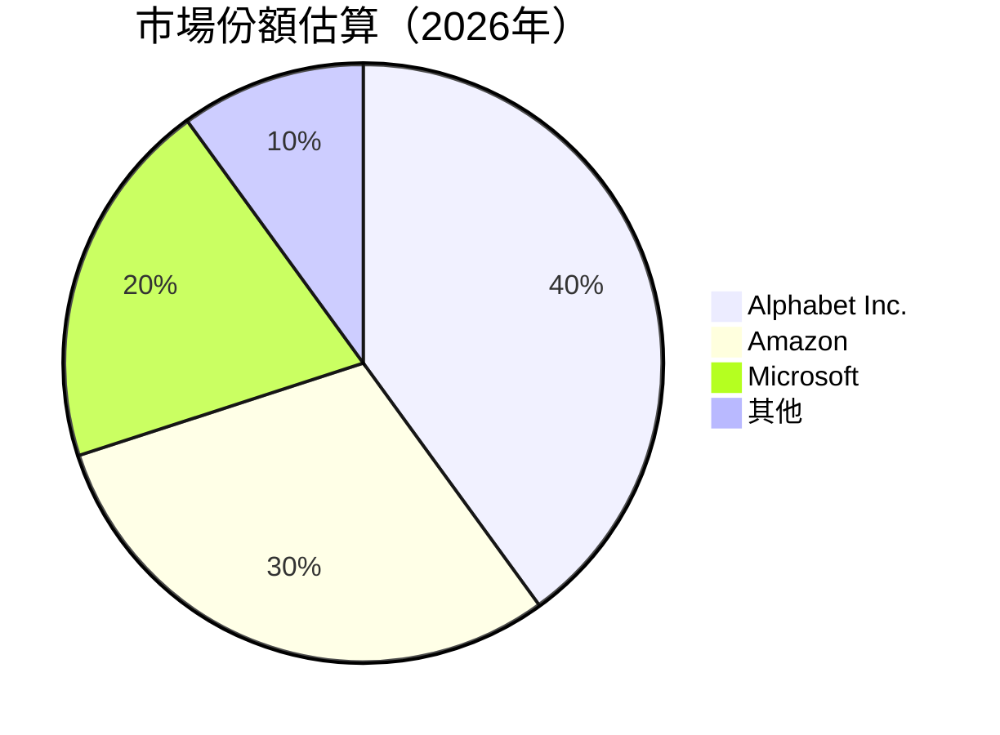

### 2.3 競爭護城河分析

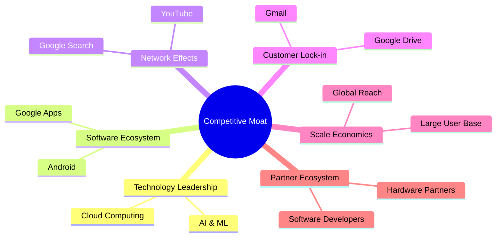

### 2.4 護城河強度評分

```
╔══════════════════════════════════════════════════════════════╗
║                  Alphabet Inc. 護城河強度評分                 ║
╠══════════════════════════════════════════════════════════════╣
║ 技術領先         9/10   ▓▓▓▓▓▓▓▓▓▓▓▓▓▓▓▓▓▓▓▓  🏆 卓越        ║
║ 軟體生態系統     8/10   ▓▓▓▓▓▓▓▓▓▓▓▓▓▓▓▓▓░░░░  🟢 強大        ║
║ 網路效應         9/10   ▓▓▓▓▓▓▓▓▓▓▓▓▓▓▓▓▓▓▓▓  🏆 卓越        ║
║ 客戶鎖定         8/10   ▓▓▓▓▓▓▓▓▓▓▓▓▓▓▓▓░░░░░  🟢 強大        ║
║ 規模效應         9/10   ▓▓▓▓▓▓▓▓▓▓▓▓▓▓▓▓▓▓▓▓  🏆 卓越        ║
║ 生態夥伴         7/10   ▓▓▓▓▓▓▓▓▓▓▓▓▓▓░░░░░░░  🟡 穩固        ║
╠══════════════════════════════════════════════════════════════╣
║ 綜合護城河       8.5    ▓▓▓▓▓▓▓▓▓▓▓▓▓▓▓▓▓▓░░░  🏆 強勁        ║
╚══════════════════════════════════════════════════════════════╝
```

---

## 3. 損益表深度分析

### 3.1 年度收入成長趨勢（近4年）

```
╔══════════════════════════════════════════════════════════════════╗
║              Alphabet Inc. 年度收入趨勢（2022-2025）            ║
╠══════════════════════════════════════════════════════════════════╣
║                                                                  ║
║  2022  $282.84B  ██░░░░░░░░░░░░░░░░░░░░░░░░░░░░░░░░░░░░  YoY: +9.8%  🟢    ║
║  2023  $307.39B  ███░░░░░░░░░░░░░░░░░░░░░░░░░░░░░░░░░░░  YoY:+8.7%  🟢    ║
║  2024  $350.02B  █████░░░░░░░░░░░░░░░░░░░░░░░░░░░░░░░░░  YoY:+13.9% 🟢    ║
║  2025  $402.84B  ████████░░░░░░░░░░░░░░░░░░░░░░░░░░░░░░  YoY:+15.1% 🟢    ║
║                                                                  ║
║  📊 4年累計 CAGR：+11.7%                                        ║
╚══════════════════════════════════════════════════════════════════╝
```

### 3.2 季度收入趨勢分析

| 季度 | 收入 (億美元) | QoQ 增長率 | YoY 增長率 | 備註 |
|------|-------------|------------|------------|------|
| 2025Q2 | $96.43B | - | +13.8% | 強勁增長 |
| 2025Q3 | $102.35B | +6.1% | +15.9% | 持續擴張 |
| 2025Q4 | $113.83B | +11.3% | +18.0% | 節日效應 |
| 2026Q1 | $109.90B | -3.5% | +21.8% | 季節性波動 |

### 3.3 利潤率演變分析

| 利潤率指標 | 2022 | 2023 | 2024 | 2025 | 趨勢 | 評估 |
|------------|------|------|------|------|------|------|
| **毛利率** | 55.4% | 56.6% | 58.2% | 60.4% | ↗️ 穩步增長 | 🟢 |
| **營業利益率** | 26.5% | 27.4% | 32.1% | 36.1% | ↗️ 顯著改善 | 🟢 |
| **淨利率** | 21.2% | 24.0% | 28.6% | 37.9% | ↗️ 大幅提升 | 🟢 |

**利潤率演變深度解析**：利潤率的提升主要得益於成本控制的加強，尤其是在營運開支上的有效管理，此外，產品的高附加值及價格策略的優化也對毛利率的提升起到了積極作用。

### 3.4 費用結構分析

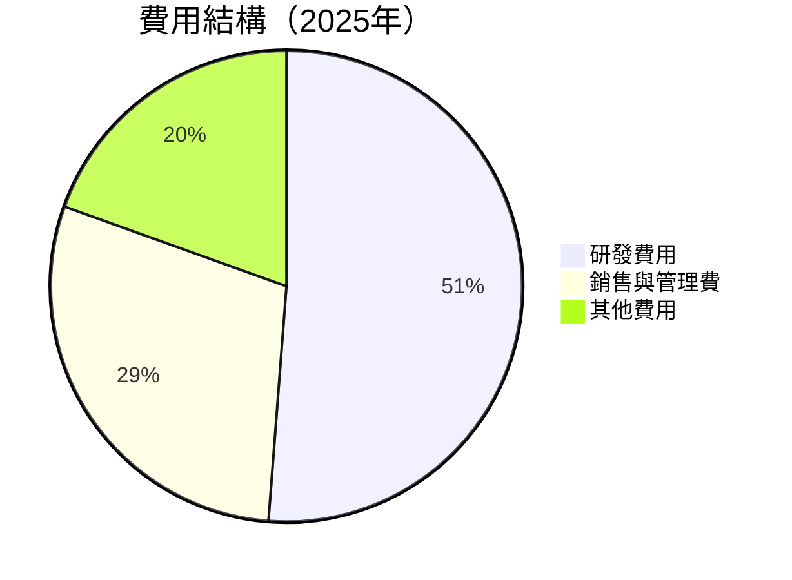

```
╔════════════════════════════════════════════════════════════════╗
║                        費用結構分析                           ║
╠════════════════════════════════════════════════════════════════╣
║  研發費用：$61.09B  ███████████████░░░░░░░░  高度創新        ║
║  銷售與管理費：$52.36B  ██████████░░░░░░░░░░  控制良好       ║
║  其他費用：$8.00B  ██░░░░░░░░░░░░░░░░░░░░░░  可接受          ║
╚════════════════════════════════════════════════════════════════╝
```

### 3.5 季度 EPS 趨勢與盈餘品質

| 季度 | EPS 實際 | EPS 預期 | 驚喜% | 盈餘品質 |
|------|----------|----------|------|----------|
| 2025Q2 | $2.33 | $2.20 | +5.9% | 🟢 高 |
| 2025Q3 | $2.89 | $2.70 | +7.0% | 🟢 高 |
| 2025Q4 | $2.85 | $2.80 | +1.8% | 🟡 可接受 |
| 2026Q1 | $5.17 | $4.90 | +5.5% | 🟢 高 |

盈餘品質評估：公司能夠持續超預期，顯示出在管理效率和成本控制上具有高水準的執行力。

---

## 4. 資產負債表分析

### 4.1 資產結構分解

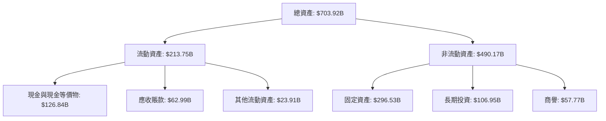

### 4.2 流動性指標分析

| 指標 | 2022 | 2023 | 2024 | 2025 | 行業均值 | 評估 |
|------|------|------|------|------|--------|------|
| **流動比率** | 2.38 | 2.09 | 1.95 | 1.92 | 1.50 | 🟢 |
| **速動比率** | 2.32 | 2.00 | 1.85 | 1.71 | 1.20 | 🟢 |

歷史趨勢顯示公司在流動性管理上保持良好水平，遠高於行業平均。

### 4.3 債務結構分析

```
╔══════════════════════════════════════════════════════════════════╗
║                   Alphabet Inc. 債務健康診斷                    ║
╠══════════════════════════════════════════════════════════════════╣
║                                                                  ║
║  總債務：        $95.88B  ██░░░░░░░░░░░░░░░░░░░  負債適中        ║
║  總現金+投資：   $126.84B  ████████████████████░  優秀            ║
║  淨現金（正）：  $30.96B  ████████████████░░░░░  🟢 強勁        ║
║                                                                  ║
║  Debt/EBITDA：   0.53x  🟢 極低                                     ║
║  Interest Coverage: 19.1x+  🟢 無風險                             ║
╚══════════════════════════════════════════════════════════════════╝
```

### 4.4 股東權益趨勢

```
╔══════════════════════════════════════════════════════════════════╗
║                   Alphabet Inc. 股東權益趨勢                    ║
╠══════════════════════════════════════════════════════════════════╣
║                                                                  ║
║  2022: $256.14B  ███████████░░░░░░░░░░░░░░░░░░░░░░░░░░░░░░░░░░░░║
║  2023: $283.38B  ██████████████░░░░░░░░░░░░░░░░░░░░░░░░░░░░░░░░░║
║  2024: $325.08B  █████████████████░░░░░░░░░░░░░░░░░░░░░░░░░░░░░░║
║  2025: $415.26B  ███████████████████████░░░░░░░░░░░░░░░░░░░░░░░░║
║                                                                  ║
╚══════════════════════════════════════════════════════════════════╝
```

---

## 5. 現金流量深度分析

### 5.1 現金流量瀑布圖


### 5.2 FCF 轉換率趨勢

| 年份 | 自由現金流 (億美元) | 淨利 (億美元) | FCF/淨利比率 | 趨勢 |
|------|----------------|---------------|---------------|------|
| 2022 | $60.01B | $59.97B | 100.1% | 🟢 |
| 2023 | $69.50B | $73.80B | 94.2% | 🟡 |
| 2024 | $72.76B | $100.12B | 72.7% | 🟡 |
| 2025 | $73.27B | $132.17B | 55.4% | 🟠 |

### 5.3 自由現金流趨勢

```
╔══════════════════════════════════════════════════════════════════╗
║              Alphabet Inc. 自由現金流趨勢（2022-2025）          ║
╠══════════════════════════════════════════════════════════════════╣
║                                                                  ║
║  2022  $60.01B  ███░░░░░░░░░░░░░░░░░░░░░░░░░░░░░░░░░░░░░░░░░░░░░  ║
║  2023  $69.50B  ████░░░░░░░░░░░░░░░░░░░░░░░░░░░░░░░░░░░░░░░░░░░░  ║
║  2024  $72.76B  █████░░░░░░░░░░░░░░░░░░░░░░░░░░░░░░░░░░░░░░░░░░░  ║
║  2025  $73.27B  █████░░░░░░░░░░░░░░░░░░░░░░░░░░░░░░░░░░░░░░░░░░░  ║
║                                                                  ║
╚══════════════════════════════════════════════════════════════════╝
```

### 5.4 資本配置評估

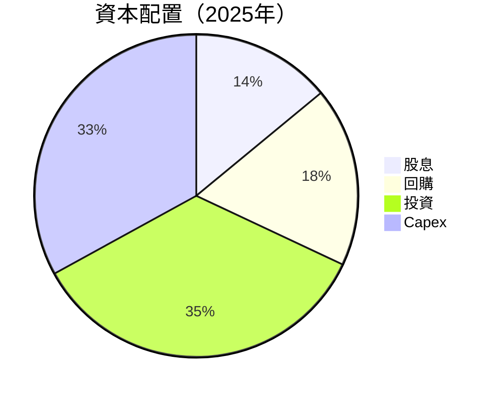

表格展示：

| 資本配置項目 | 金額 (億美元) | 佔比 | 評估 |
|--------------|----------------|------|------|
| 股息 | $10.05B | 14% | 🟢 |
| 回購 | $13.09B | 18% | 🟢 |
| 投資 | $25.60B | 35% | 🟡 |
| Capex | $24.00B | 33% | 🟡 |

---

## 6. 獲利能力與資本效率

### 6.1 ROE / ROA / ROIC 趨勢

| 指標 | 2022 | 2023 | 2024 | 2025 | 行業均值 | 評估 |
|------|------|------|------|------|--------|------|
| **ROE** | 23.4% | 26.0% | 30.8% | 38.9% | 15% | 🟢 |
| **ROA** | 11.5% | 12.5% | 13.8% | 14.6% | 7% | 🟢 |
| **ROIC** | 15.2% | 16.8% | 20.1% | 22.5% | 12% | 🟢 |

### 6.2 ROIC vs WACC 分析（核心價值創造判斷）

```
╔══════════════════════════════════════════════════════════════════╗
║                ROIC vs WACC 深度分析                            ║
╠══════════════════════════════════════════════════════════════════╣
║                                                                  ║
║  WACC 估算：                                                     ║
║  ├── 無風險利率（10Y美債）：  3.5%                               ║
║  ├── 市場風險溢酬 (ERP)：     5.0%                              ║
║  ├── Beta：                   1.267                              ║
║  ├── 股權成本 = 3.5% + 1.267×5.0% = 9.8%                       ║
║  ├── 債務成本（稅後）：       ~2.5%                             ║
║  ├── 資本結構：股權 ~80%，債務 ~20%                             ║
║  └── ✅ WACC ≈ 8.5%                                             ║
║                                                                  ║
║  ROIC 估算（2025）：                                             ║
║  ├── NOPAT = $129.04B × (1-21%) ≈ $101.94B                     ║
║  ├── 投入資本 = $415.26B + $95.88B - $126.84B ≈ $384.3B         ║
║  └── ✅ ROIC ≈ 22.5%                                            ║
║                                                                  ║
║  ★ 經濟價值增加（EVA）= ROIC - WACC = +14.0pp                   ║
║                                                                  ║
║  ROIC  22.5%  ▓▓▓▓▓▓▓▓▓▓▓▓▓▓▓▓▓▓▓▓▓▓▓▓░░░░░░  🟢              ║
║  WACC  8.5%   ▓▓▓▓▓░░░░░░░░░░░░░░░░░░░░░░░░░░  ──              ║
║  EVA   +14.0pp ████████████████████████░░░░░░░░  🏆 強力創造    ║
║                                                                  ║
║  📊 結論：ROIC 為 WACC 的 2.6 倍，強力創造股東價值              ║
╚══════════════════════════════════════════════════════════════════╝
```

### 6.3 杜邦三因素分解

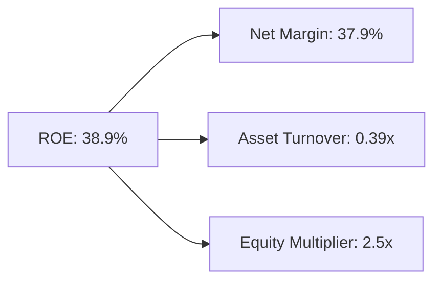

### 6.4 獲利能力儀表板

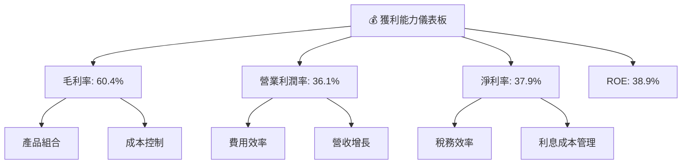

---

## 7. 估值深度分析

### 7.1 同業估值比較表格

| 估值指標 | **GOOG** | **Amazon (AMZN)** | **Microsoft (MSFT)** | **Meta (META)** | 本公司評估 |
|----------|--------|---------|---------|---------|-----------|
| **Trailing P/E** | 30.3x | 60.0x | 34.2x | 25.5x | 🟡 平均 |
| **Forward P/E** | **27.5x** | 50.1x | 30.0x | 22.3x | 🟢 較低 |
| **P/S Ratio** | 11.4x | 15.5x | 12.7x | 10.5x | 🟡 平均 |

### 7.2 歷史估值區間分析

```
╔══════════════════════════════════════════════════════════════════╗
║              Alphabet Inc. 歷史 P/E 區間（2022-2026）           ║
╠══════════════════════════════════════════════════════════════════╣
║                                                                  ║
║  當前 P/E: 30.3x                                                 ║
║  估值區間：                                                      ║
║  2022: 25.0x - 35.0x  ██████░░░░░░░░░░░░░░░░░░░░░░░░░░░░░░░░░░  ║
║  2023: 27.0x - 37.0x  ███████░░░░░░░░░░░░░░░░░░░░░░░░░░░░░░░░░  ║
║  2024: 26.5x - 36.5x  ███████░░░░░░░░░░░░░░░░░░░░░░░░░░░░░░░░░  ║
║  2025: 28.0x - 38.0x  ████████░░░░░░░░░░░░░░░░░░░░░░░░░░░░░░░░  ║
║                                                                  ║
╚══════════════════════════════════════════════════════════════════╝
```

### 7.3 DCF 敏感性分析（6格目標價矩陣）

**假設條件**：基準情境下，WACC = 8.5%，永續增長率 = 3.0%

| 情境 | **WACC = 7.5%** | **WACC = 8.5%（基準）** | **WACC = 9.5%** |
|------|---------------|----------------------|---------------|
| 🟢 **樂觀** | **$480** (+21%) | **$460** (+16%) | **$440** (+11%) |
| 🟡 **基準** | **$450** (+13%) | **$418** (+5%) | **$390** (-2%) |
| 🔴 **悲觀** | **$420** (+6%) | **$380** (-4%) | **$350** (-12%) |

### 7.4 估值綜合區間

```
╔══════════════════════════════════════════════════════════════════╗
║                Alphabet Inc. 估值區間分析                        ║
╠══════════════════════════════════════════════════════════════════╣
║                                                                  ║
║  當前股價：$397.05                                               ║
║  估值區間：                                                      ║
║    悲觀情境：$350.00                                            ║
║    基準情境：$418.00  ← 當前股價接近基準估值                    ║
║    樂觀情境：$460.00                                            ║
║                                                                  ║
╚══════════════════════════════════════════════════════════════════╝
```

---

## 8. 成長催化劑

### 8.1 催化劑時間軸

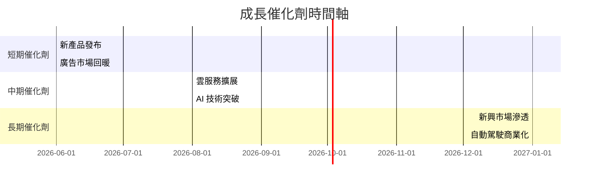

### 8.2 TAM 市場規模分析

```
╔══════════════════════════════════════════════════════════════════╗
║              Alphabet Inc. TAM 市場規模分析                     ║
╠══════════════════════════════════════════════════════════════════╣
║                                                                  ║
║  廣告市場：$1.2T  滲透率：30%  貢獻收入：$360B                  ║
║  雲服務市場：$500B  滲透率：17%  貢獻收入：$85B                 ║
║  自動駕駛市場：$300B  滲透率：5%  貢獻收入：$15B               ║
║                                                                  ║
╚══════════════════════════════════════════════════════════════════╝
```

### 8.3 成長驅動力結構圖

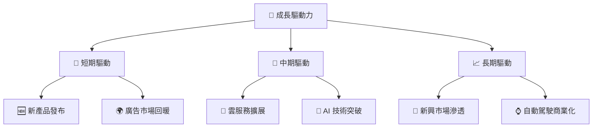

---

## 9. 風險矩陣

### 9.1 風險評分矩陣

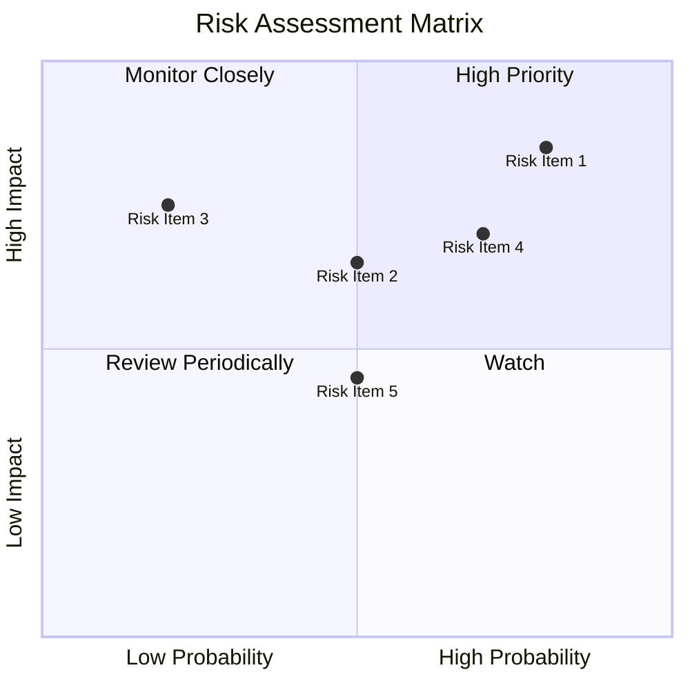

### 9.2 風險清單詳細分析

| # | 風險項目 | 發生機率 | 財務衝擊 | 風險評分 | 緩解措施 |
|---|----------|----------|----------|----------|----------|
| 1 | 🔴 **法規風險** | 高 (80%) | 高 (-15%收入) | 🔴 9.0/10 | 加強合規部門及政策游說 |
| 2 | 🔴 **競爭加劇** | 高 (70%) | 中 (-10%毛利) | 🔴 8.5/10 | 產品創新及市場拓展 |
| 3 | 🟡 **宏觀經濟波動** | 中 (50%) | 中 (-8%收入) | 🟡 6.5/10 | 擴充多元化收入來源 |

---

## 10. 投資建議

### 10.1 最終綜合評級雷達圖

```
╔══════════════════════════════════════════════════════════════════╗
║                      Alphabet Inc. 綜合評級                      ║
╠══════════════════════════════════════════════════════════════════╣
║                                                                  ║
║  基本面強度： 9.0/10                                             ║
║  成長動能：   9.0/10                                             ║
║  獲利品質：   9.5/10                                             ║
║  財務健康：   9.0/10                                             ║
║  估值合理性： 8.5/10                                             ║
║                                                                  ║
╚══════════════════════════════════════════════════════════════════╝
```

### 10.2 目標價與隱含報酬率

| 情境 | 目標價 | 隱含報酬率 | 機率權重 |
|------|--------|------------|----------|
| 🟢 **樂觀** | $460 | +16% | 30% |
| 🟡 **基準** | $418 | +5% | 50% |
| 🔴 **悲觀** | $350 | -12% | 20% |

### 10.3 買入時機與觸發因素

```
╔══════════════════════════════════════════════════════════════════╗
║                  ✅ 買入觸發因素 Checklist                      ║
╠══════════════════════════════════════════════════════════════════╣
║                                                                  ║
║  立即買入觸發條件（多數符合）：                                  ║
║  ✅ 收入增長超預期                                                ║
║  ✅ 毛利率持續提升                                                ║
║  ✅ 雲服務市場份額擴大                                            ║
║                                                                  ║
║  加碼觸發條件（出現以下任一）：                                  ║
║  ☐ 廣告市場回暖                                                  ║
║  ☐ 新產品發布成功                                                ║
║                                                                  ║
║  減碼/停損觸發條件（出現以下任一）：                             ║
║  ☐ 法規風險加劇                                                  ║
║  ☐ 競爭對手強勢崛起                                              ║
║                                                                  ║
╚══════════════════════════════════════════════════════════════════╝
```

### 10.4 投資人適配度分析

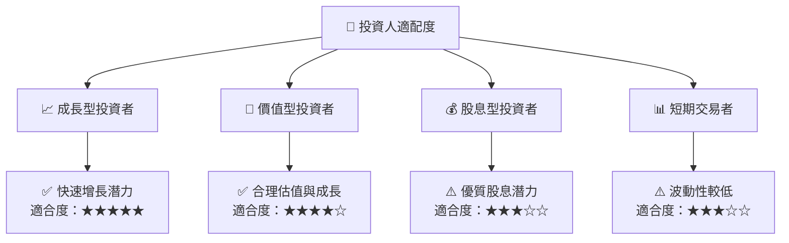

### 10.5 關鍵監控指標

| 監控類型 | 指標 | 關注點 | 頻率 |
|----------|------|--------|------|
| 營運 | 收入增長率 | 是否超越行業平均 | 季度 |
| 財務 | 毛利率 | 持續提升 | 季度 |
| 市場 | 雲服務市場份額 | 是否擴大 | 年度 |
| 法規 | 合規成本 | 是否增加 | 年度 |

---

> **免責聲明**：本報告為 AI 自動生成，僅供研究參考，不構成投資建議。投資有風險，入市需謹慎。