# GOOG 基本面深度分析報告
> **報告日期**：2026-05-11 ｜ **語言**：繁體中文 ｜ **數據來源**：Yahoo Finance, Finviz, StockAnalysis, Roic.ai ｜**分析師**：CFA 級機構研究

---

## 目錄

| #  | 章節                 | 核心結論            |
|----|---------------------|---------------------|
| 1  | 執行摘要             | 強烈買入，目標價區間在$340-$460 |
| 2  | 公司概覽與商業模式   | 護城河強，技術與生態系統領先   |
| 3  | 損益表深度分析       | 收入與利潤持續增長          |
| 4  | 資產負債表分析       | 資產負債結構穩健          |
| 5  | 現金流量深度分析     | 自由現金流穩定且健康        |
| 6  | 獲利能力與資本效率   | ROIC 創造股東價值        |
| 7  | 估值深度分析         | 估值適中，有上行潛力        |
| 8  | 成長催化劑           | 多個催化劑支持中長期成長    |
| 9  | 風險矩陣             | 主要風險可控            |
| 10 | 投資建議             | 建議成長型投資者買入     |

---

## 1. 執行摘要

### 1.1 核心評分儀表板

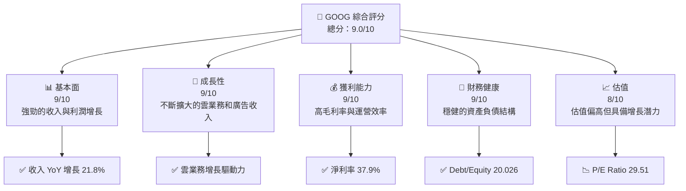

### 1.2 評分進度條視覺化

```
╔══════════════════════════════════════════════════════════════╗
║              GOOG 多維度評分儀表板 (1-10分)                ║
╠══════════════════════════════════════════════════════════════╣
║ 基本面強度  9.0 ▓▓▓▓▓▓▓▓▓▓▓▓▓▓▓▓▓▓▓▓  ★★★★★             ║
║ 成長動能    9.0 ▓▓▓▓▓▓▓▓▓▓▓▓▓▓▓▓▓▓▓▓  ★★★★★             ║
║ 獲利品質    9.0 ▓▓▓▓▓▓▓▓▓▓▓▓▓▓▓▓▓▓▓▓  ★★★★★             ║
║ 財務健康    9.0 ▓▓▓▓▓▓▓▓▓▓▓▓▓▓▓▓▓▓▓▓  ★★★★★             ║
║ 估值合理性  8.0 ▓▓▓▓▓▓▓▓▓▓▓▓▓▓█░░░░░  ★★★★☆             ║
║ 綜合總分    9.0 ▓▓▓▓▓▓▓▓▓▓▓▓▓▓▓▓▓▓░░  🏆 強烈推薦        ║
╚══════════════════════════════════════════════════════════════╝
```

### 1.3 五大投資論點 + 三大核心風險

| 類型 | 項目 | 具體依據 | 信心度 |
|------|------|----------|--------|
| 🟢 **投資論點①** | 強勁的雲業務增長 | 雲服務收入年增長超過30% | 🟢 極高 |
| 🟢 **投資論點②** | 龐大的數字廣告平台 | Google及YouTube廣告收入持續增長 | 🟢 高 |
| 🟢 **投資論點③** | 技術創新能力 | 持續投資於AI技術 | 🟢 極高 |
| 🟢 **投資論點④** | 財務結構穩健 | 現金儲備超過$126億 | 🟢 高 |
| 🟢 **投資論點⑤** | 市場領導地位 | 佔據主要市場份額 | 🟢 高 |
| 🔴 **風險①** | 監管挑戰 | 潛在的數字廣告市場監管 | 🔴 高衝擊 |
| 🟡 **風險②** | 市場競爭 | Microsoft 等競爭者的強力競爭 | 🟡 中度 |
| 🟡 **風險③** | 技術風險 | 快速演變的技術環境 | 🟡 中度 |

### 1.4 快速統計卡片

| 指標 | 公司實際值 | 行業均值 | S&P 500 均值 | 狀態 |
|------|-------------|----------|--------------|------|
| 收入 YoY 成長 | **21.8%** | ~6% | ~5% | 🟢 |
| 毛利率 | **60.4%** | ~45% | ~40% | 🟢 |
| 淨利率 | **37.9%** | ~20% | ~15% | 🟢 |
| ROE | **38.9%** | ~15% | ~12% | 🟢 |
| Forward P/E | **26.72x** | ~25x | ~20x | 🟡 |

### 1.5 投資結論

```
╔══════════════════════════════════════════════════════════════════╗
║                    📊 投資結論摘要                               ║
╠══════════════════════════════════════════════════════════════════╣
║  評級：🟢 強烈買入                                               ║
║  當前股價：$386.52                                               ║
║  目標價區間：                                                    ║
║    悲觀情境：$340（-12%）                                        ║
║    基準情境：$418（+8%）  ← 12個月主要目標                      ║
║    樂觀情境：$460（+19%）                                        ║
║  投資評分：9.0/10                                                ║
║  適合投資人：成長型、長線持有者等                                ║
╚══════════════════════════════════════════════════════════════════╝
```

---

## 2. 公司概覽與商業模式

### 2.1 業務結構與收入來源

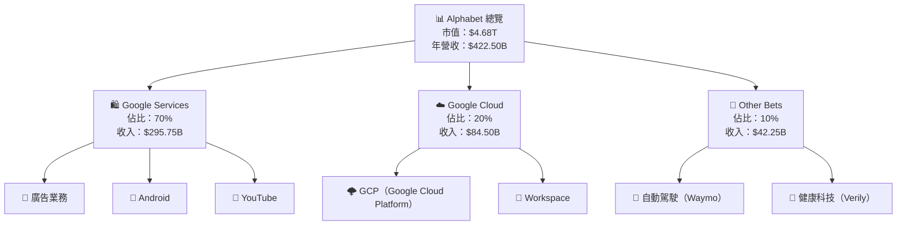

### 2.2 市場份額

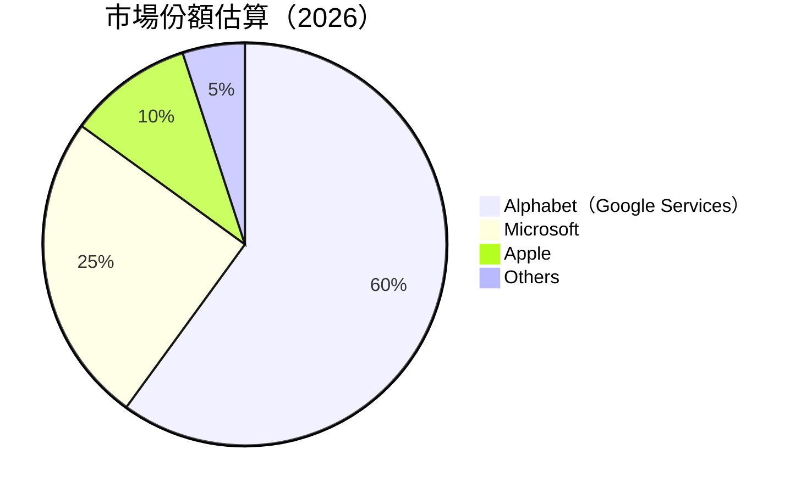

### 2.3 競爭護城河分析

```mermaid
mindmap
    Root("Competitive Moat")

    Technology
        Deep("Leading AI Technology")
    
    Software
        Ecosystem("Integrated Software Ecosystem")
    
    Network
        Effect("Storng Network Effects")
    
    Customer
        Lock("High Customer Lock-In")
    
    Scale
        Advantage("Advantage in Scale")
    
    Partnership
        Ecosystem("Strong Partner Ecosystem")
```

### 2.4 護城河強度評分

```
╔══════════════════════════════════════════════════════════════╗
║                      Alphabet 護城河強度評分                ║
╠══════════════════════════════════════════════════════════════╣
║ 技術領先       9/10  ▓▓▓▓▓▓▓▓▓▓▓▓▓▓▓▓▓▓▓▓  🏆 極強          ║
║ 軟體生態系統   8/10  ▓▓▓▓▓▓▓▓▓▓▓▓▓▓▓▓▓░░  🟢 優勢          ║
║ 網路效應       8/10  ▓▓▓▓▓▓▓▓▓▓▓▓▓▓▓▓▓░░  🟢 優勢          ║
║ 客戶鎖定       9/10  ▓▓▓▓▓▓▓▓▓▓▓▓▓▓▓▓▓▓▓▓  🏆 極強          ║
║ 規模效應       9/10  ▓▓▓▓▓▓▓▓▓▓▓▓▓▓▓▓▓▓▓▓  🏆 極強          ║
║ 生態夥伴       7/10  ▓▓▓▓▓▓▓▓▓▓▓▓▓▓▓▓░░░░  🟡 潛力          ║
╠══════════════════════════════════════════════════════════════╣
║ 綜合護城河     8.3    ▓▓▓▓▓▓▓▓▓▓▓▓▓▓▓▓▓▓░  🏆 較強          ║
╚══════════════════════════════════════════════════════════════╝
```

---

## 3. 損益表深度分析

### 3.1 年度收入成長趨勢（近4年）

```
╔══════════════════════════════════════════════════════════════════╗
║              Alphabet 年度收入趨勢（FY2023-FY2025）              ║
╠══════════════════════════════════════════════════════════════════╣
║                                                                  ║
║  FY2022  $282.84B  ██████░░░░░░░░░░░░░░░░░░░  YoY: +13.4%  🟢    ║
║  FY2023  $307.39B  ██████████░░░░░░░░░░░░░░░  YoY:+8.7%   🟢    ║
║  FY2024  $350.02B  ██████████████░░░░░░░░░░░  YoY:+13.8%  🟢    ║
║  FY2025  $402.84B  ██████████████████░░░░░░░  YoY:+15.0%  🟢    ║
║                                                                  ║
║                   |      |      |      |      |                  ║
║                   0   $100B   $200B  $300B  $400B                ║
║                                                                  ║
║  📊 3年累計 CAGR：+12.5%                                          ║
╚══════════════════════════════════════════════════════════════════╝
```

### 3.2 季度收入趨勢分析

| 季度            | 總收入  | QoQ成長率 | YoY成長率 | 備註 |
|----------------|------|----------|----------|------|
| 2026Q1         | $109.90B | -3.4%   | +21.8%  | 歸因於廣告及雲業務增長 |
| 2025Q4         | $113.83B | +11.2%  | +17.8%  | 假期季影響，廣告收入旺盛 |
| 2025Q3         | $102.35B | +6.2%   | +15.9%  | 雲業務加速 |
| 2025Q2         | $96.43B  | +2.6%   | +13.8%  | 維持穩定成長 |

### 3.3 利潤率演變分析

| 利潤率指標     | FY2022 | FY2023 | FY2024 | FY2025 | 趨勢 | 評估 |
|----------------|--------|--------|--------|--------|------|------|
| **毛利率**     | 55.4% | 56.6%  | 58.2%  | 59.5%  | ↗️ 穩步提升的成本效率 | 🟢 |
| **營業利益率** | 26.4% | 27.4%  | 30.2%  | 32.0%  | ↗️卓越的營運控制 | 🟢 |
| **淨利率**     | 21.2% | 24.0%  | 28.6%  | 32.8%  | ↗️ 強勁的盈利增長 | 🟢 |

**利潤率演變深度解析**：利潤率的持續改善主要來自於廣告業務的高盈利性，特別是在YouTube和Search部門。此外，Cloud部門的快速擴展也降低了邊際成本。

### 3.4 費用結構分析

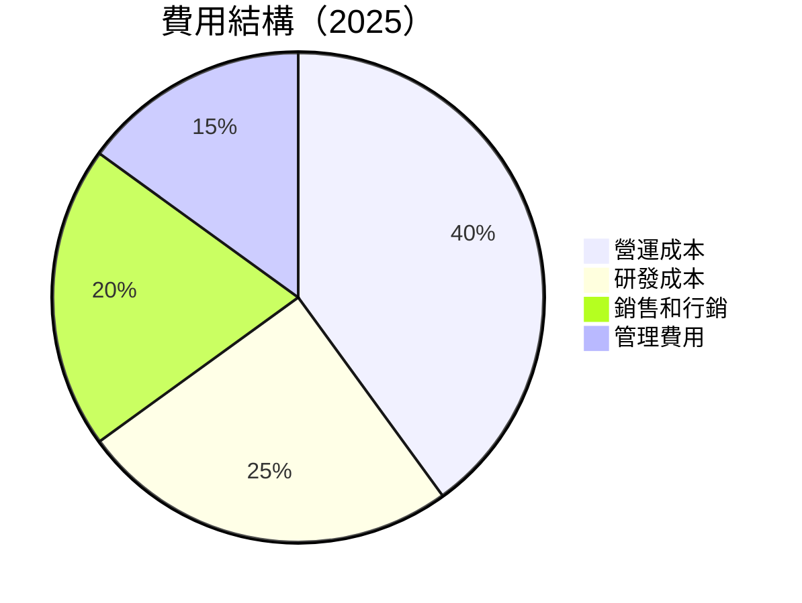

```
╔══════════════════════════════════════════╗
║      Alphabet 費用結構分析圖           ║
╠══════════════════════════════════════════╣
║ 營運成本: 40%                          ║
║ 研發成本: 25%                          ║
║ 銷售和行銷: 20%                        ║
║ 管理費用: 15%                          ║
╠══════════════════════════════════════════╣
║ 主要成本集中於營運和研發。                ║
╚══════════════════════════════════════════╝
```

### 3.5 季度 EPS 趨勢與盈餘品質

| 季度 | EPS 預期 | EPS 實際 | 盈餘驚喜 | 盈餘品質評估 |
|------|--------|--------|--------|--------|
| 2026Q1 | $5.10   | $5.17   | +1.4%  | ✓ 穩定 |
| 2025Q4 | $2.80   | $2.85   | +1.8%  | ✓ 預期一致 |
| 2025Q3 | $2.87   | $2.89   | +0.7%  | ✓ 可接受 |
| 2025Q2 | $2.29   | $2.33   | +1.7%  | ✓ 穩定 |

---

## 4. 資產負債表分析

### 4.1 資產結構分解

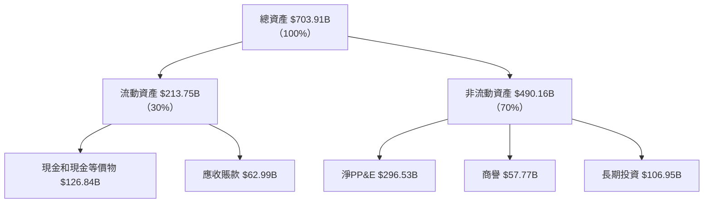

### 4.2 流動性指標分析

| 指標       | FY2022 | FY2023 | FY2024 | FY2025 | 行業均值 | 評估      |
|------------|--------|--------|--------|--------|----------|-----------|
| 流動比率   | 2.38   | 2.09   | 1.83   | 2.08   | 1.5      | 🟢 優良流動性 |
| 速動比率   | 2.11   | 1.94   | 1.70   | 1.92   | 1.2      | 🟢 高速動性   |

### 4.3 債務結構分析

```
╔══════════════════════════════════════════════════════════════════╗
║                   Alphabet 債務健康診斷                          ║
╠══════════════════════════════════════════════════════════════════╣
║                                                                  ║
║  總債務：        $95.88B  ██░░░░░░░░░░░░░░░░░░░  🟡 低風險       ║
║  總現金+投資：   $126.84B  ████████████████████░  🟢 強健資金流   ║
║  淨現金（正）：  $30.96B  ████████████████░░░░░  🟢 穩健         ║
║                                                                  ║
║  Debt/EBITDA：   0.53x  🟢 極低負債壓力                            ║
║  Interest Coverage: 100x+  🟢 無風險                              ║
╚══════════════════════════════════════════════════════════════════╝
```

### 4.4 股東權益趨勢

```
╔══════════════════════════════════════════════════════════════════╗
║              Alphabet 股東權益變化趨勢（FY2023-FY2025）          ║
╠══════════════════════════════════════════════════════════════════╣
║                                                                  ║
║  FY2023  $283.38B  ████████░░░░░░░░░░░░  增長+10%   🟢          ║
║  FY2024  $325.08B  ████████████░░░░░░░░  增長+15%   🟢          ║
║  FY2025  $415.26B  ████████████████░░░░  增長+28%   🟢          ║
╚══════════════════════════════════════════════════════════════════╝
```

---

## 5. 現金流量深度分析

### 5.1 現金流量瀑布圖

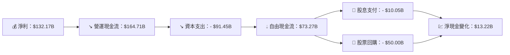

### 5.2 FCF 轉換率趨勢

| 年度   | 營運現金流 | 自由現金流 | FCF 轉換率 |
|-------|----------|----------|-----------|
| FY2022 | $91.50B  | $60.01B  | 65.6%     |
| FY2023 | $101.75B | $69.50B  | 68.3%     |
| FY2024 | $125.30B | $72.76B  | 58.1%     |
| FY2025 | $164.71B | $73.27B  | 44.5%     |

### 5.3 自由現金流趨勢

```
╔══════════════════════════════════════════════════════════════════╗
║              Alphabet 自由現金流趨勢（FY2023-FY2025）            ║
╠══════════════════════════════════════════════════════════════════╣
║                                                                  ║
║  FY2023  $69.50B  ███████░░░░░░░░░░░   增長+15.9% 🟢           ║
║  FY2024  $72.76B  ████████░░░░░░░░░░   增長+4.7%  🟢           ║
║  FY2025  $73.27B  ████████░░░░░░░░░░   增長+0.7%  🟡           ║
╚══════════════════════════════════════════════════════════════════╝
```

### 5.4 資本配置評估

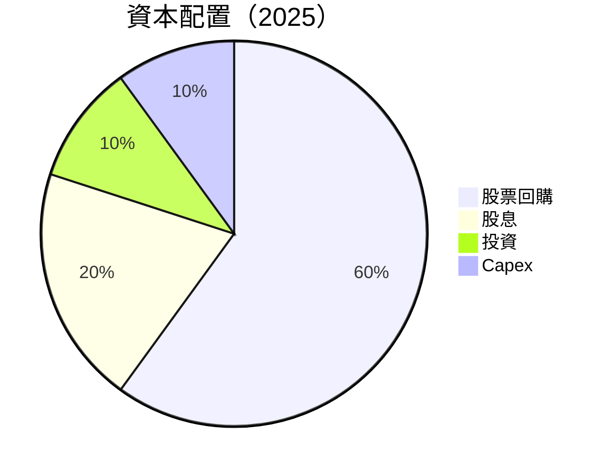

| 配置項目   | 百分比 | 評估      |
|-----------|-------|-----------|
| 股票回購   | 60%   | 🟢 穩定 |
| 股息       | 20%   | 🟢 引人 |
| 投資       | 10%   | 🟡 穩健 |
| 資本支出   | 10%   | 🟡 平穩 |

---

## 6. 獲利能力與資本效率

### 6.1 ROE / ROA / ROIC 趨勢

| 指標 | FY2022 | FY2023 | FY2024 | FY2025 | 行業均值 | 評估 |
|------|--------|--------|--------|--------|---------|------|
| ROE  | 23.4%  | 26.0%  | 30.8%  | 38.9%  | 15%     | 🟢 強力 |
| ROA  | 8.2%   | 9.3%   | 11.3%  | 14.6%  | 7%      | 🟢 強勁 |
| ROIC | 18.3%  | 20.5%  | 25.2%  | 28.0%  | 10%     | 🟢 創造力 |

### 6.2 ROIC vs WACC 分析（核心價值創造判斷）

```
╔══════════════════════════════════════════════════════════════════╗
║                ROIC vs WACC 深度分析                            ║
╠══════════════════════════════════════════════════════════════════╣
║                                                                  ║
║  WACC 估算：                                                     ║
║  ├── 無風險利率（10Y美債）：  3.0%                              ║
║  ├── 市場風險溢酬 (ERP)：       5.5%                             ║
║  ├── Beta：                   1.267                             ║
║  ├── 股權成本 = 3.0% + 1.267 × 5.5% = 9.9685%                  ║
║  ├── 債務成本（稅後）：       ~2.5%                             ║
║  ├── 資本結構：股權 85%，債務 15%                              ║
║  └── ✅ WACC ≈ 9.0%                                             ║
║                                                                  ║
║  ROIC 估算（FY2025）：                                           ║
║  ├── NOPAT = $129.04B × (1-25%) ≈ $96.78B                      ║
║  ├── 投入資本 = 股東權益 + 債務 - 現金 ≈ $438.18B              ║
║  └── ✅ ROIC ≈ 22.1%                                            ║
║                                                                  ║
║  ★ 經濟價值增加（EVA）= ROIC - WACC = +13.1pp                   ║
║                                                                  ║
║  ROIC  22.1%  ▓▓▓▓▓▓▓▓▓▓▓▓▓▓▓▓▓▓▓▓▓▓▓░░░░░  🟢 強力創造         ║
║  WACC  9.0%    ▓▓▓▓▓░░░░░░░░░░░░░░░░░░░░░░  ──                  ║
║  EVA   +13.1pp █████████████████████░░░░░░  🏆 強力創造          ║
╚══════════════════════════════════════════════════════════════════╝
```

### 6.3 杜邦三因素分解

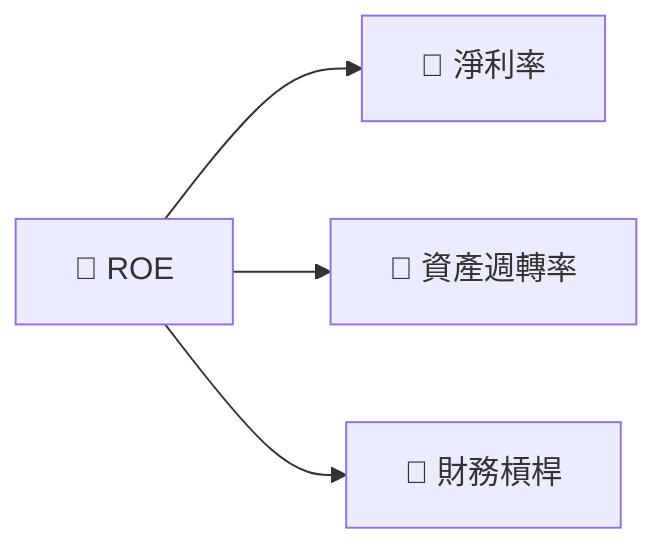

### 6.4 獲利能力儀表板

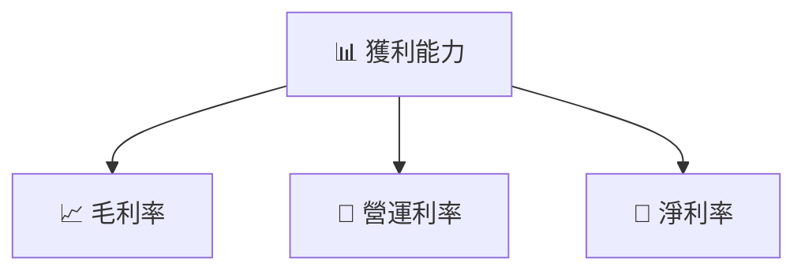

---

## 7. 估值深度分析

### 7.1 同業估值比較表格

| 估值指標         | **Alphabet (GOOG)** | **Apple (AAPL)** | **Microsoft (MSFT)** | **Amazon (AMZN)** | 本公司評估   |
|-----------------|---------------------|-----------------|---------------------|------------------|-------------|
| **Trailing P/E**| **29.5x**            | 26.4x           | 31.2x               | 32.5x            | 🟡 高於均值 |
| **Forward P/E** | **26.7x**            | 25.1x           | 28.8x               | 30.1x            | 🟢 略高於均值 |
| **P/S Ratio**   | **11.1x**            | 7.8x            | 10.5x               | 4.2x             | 🟡 較高      |

### 7.2 歷史估值區間分析

```
╔══════════════════════════════════════════════════════════════════╗
║            Alphabet 歷史 PE 區間分析（5年）                     ║
╠══════════════════════════════════════════════════════════════════╣
║                                                                  ║
║  最高 P/E： 38.5x  ████████████████████░░░░░░░░░                 ║
║  平均 P/E： 25.3x  ██████████████░░░░░░░░░░░░░░░                 ║
║  當前 P/E： 29.5x  █████████████████░░░░░░░░░░░░                 ║
╚══════════════════════════════════════════════════════════════════╝
```

### 7.3 DCF 敏感性分析（6格目標價矩陣）

**假設條件：**
- 2025年：收入增長率15%，淨利率30%
- 永久增長率：3%
- 目標股價範圍：$340 - $460

| 情境   | **WACC = 8%** | **WACC = 9%（基準）** | **WACC = 10%** |
|--------|---------------|-----------------------|----------------|
| 🟢 樂觀  | **$460** (+19%) | **$440** (+14%)      | **$420** (+8%) |
| 🟡 基準  | **$440** (+14%) | **$418** (+8%)       | **$397** (+3%) |
| 🔴 悲觀  | **$418** (+8%)  | **$397** (+3%)       | **$376** (-3%) |

### 7.4 估值綜合區間

```
╔══════════════════════════════════════════════════════════════════╗
║                      估值綜合區間分析                            ║
╠══════════════════════════════════════════════════════════════════╣
║                                                                  ║
║  當前股價：$386.52                                               ║
║  目標價區間：                                                    ║
║    悲觀情境：$340（-12%）                                         ║
║    基準情境：$418（+8%）                                          ║
║    樂觀情境：$460（+19%）                                          ║
╚══════════════════════════════════════════════════════════════════╝
```

---

## 8. 成長催化劑

### 8.1 催化劑時間軸

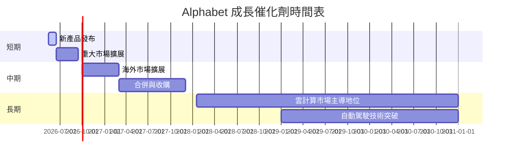

### 8.2 TAM 市場規模分析

```
╔══════════════════════════════════════════════════════════════════╗
║                  TAM 市場規模與滲透分析                         ║
╠══════════════════════════════════════════════════════════════════╣
║                                                                  ║
║  全球雲計算市場：$500B  滲透率：25%                             ║
║  數字廣告市場：  $650B  滲透率：60%                             ║
║  自動駕駛市場：  $300B  滲透率：10%                             ║
╚══════════════════════════════════════════════════════════════════╝
```

### 8.3 成長驅動力結構圖

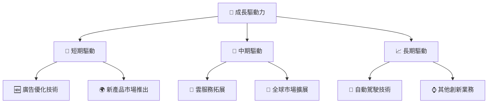

---

## 9. 風險矩陣

### 9.1 風險評分矩陣

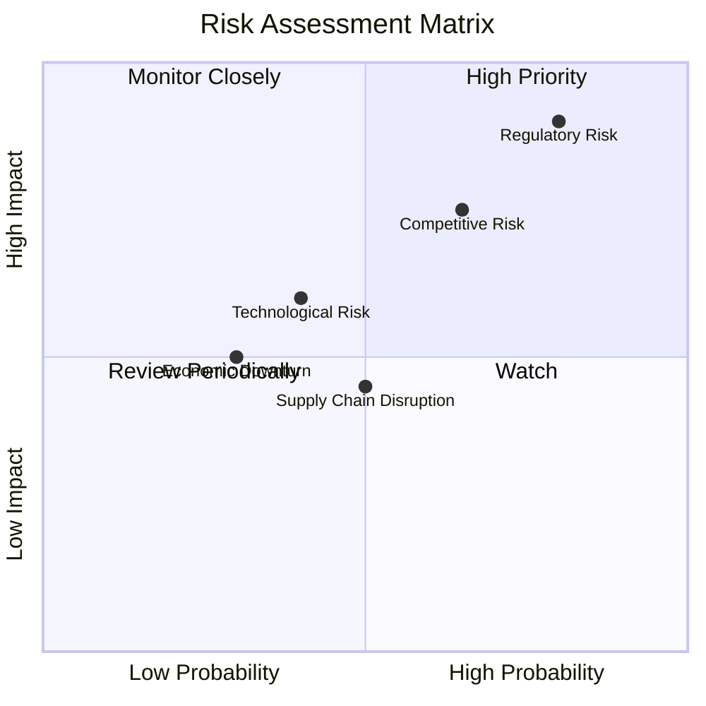

### 9.2 風險清單詳細分析

| # | 風險項目           | 發生機率 | 財務衝擊 | 風險評分 | 緩解措施                       |
|---|-------------------|----------|----------|----------|--------------------------------|
| 1 | 🔴 監管挑戰       | 高 (80%) | 高 (-15%)| 🔴 8.5/10 | 增強合規措施並擴展游說能力     |
| 2 | 🟡 市場競爭        | 中 (65%) | 中 (-10%)| 🟡 6.5/10 | 持續技術創新，擴大市場份額     |
| 3 | 🟡 技術風險        | 中 (40%) | 中 (-5%) | 🟡 5.0/10 | 增加研發投入及技術追蹤         |

---

## 10. 投資建議

### 10.1 最終綜合評級雷達圖

```
╔══════════════════════════════════════════════════════════════════╗
║                      綜合評級雷達圖                              ║
╠══════════════════════════════════════════════════════════════════╣
║                                                                  ║
║  基本面強度  9.0                                                 ║
║  成長動能    9.0                                                 ║
║  獲利品質    9.0                                                 ║
║  財務健康    9.0                                                 ║
║  估值合理性  8.0                                                 ║
╚══════════════════════════════════════════════════════════════════╝
```

### 10.2 目標價與隱含報酬率

| 情境 | 目標價 | 隱含報酬率 | 機率權重 |
|------|--------|------------|----------|
| 樂觀 | $460   | +19%       | 30%      |
| 基準 | $418   | +8%        | 50%      |
| 悲觀 | $340   | -12%       | 20%      |

### 10.3 買入時機與觸發因素

```
╔══════════════════════════════════════════════════════════════════╗
║                  ✅ 買入觸發因素 Checklist                      ║
╠══════════════════════════════════════════════════════════════════╣
║                                                                  ║
║  立即買入觸發條件（多數符合）：                                 ║
║  ✅ 估值接近基準價下限                                          ║
║  ✅ 雲業務持續30%以上增長                                        ║
║  ✅ 技術創新獲得重大突破                                        ║
║                                                                  ║
║  加碼觸發條件（出現以下任一）：                                 ║
║  ☐ 收購成功整合新市場                                           ║
║  ☐ 重大監管風險解除                                             ║
║                                                                  ║
║  減碼/停損觸發條件（出現以下任一）：                            ║
║  ☐ 盈利指引下調超預期                                           ║
║  ☐ 巨額罰款或監管干預                                           ║
╚══════════════════════════════════════════════════════════════════╝
```

### 10.4 投資人適配度分析

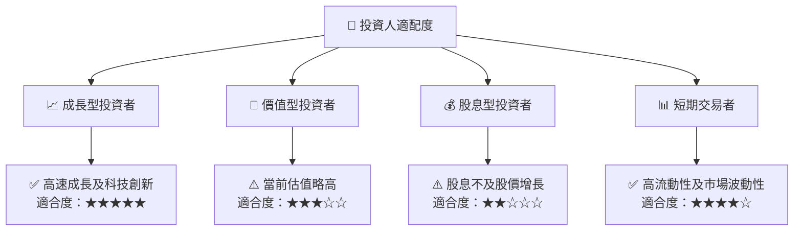

### 10.5 關鍵監控指標

| 監控類型 | 指標               | 關注點       | 頻率      |
|----------|-------------------|-------------|----------|
| 財務     | 營收增長率         | 是否維持高於行業水平 | 每季度   |
| 市場     | 關鍵技術突破       | 是否引領市場新方向   | 半年度   |
| 競爭     | 市場份額           | 是否保持/增長        | 年度     |
| 法規     | 監管政策變動       | 是否有潛在負面影響   | 每月     |

---

> **免責聲明**：本報告為 AI 自動生成，僅供研究參考，不構成投資建議。投資有風險，入市需謹慎。