# GOOG 基本面深度分析報告
> **報告日期**：2026-05-13 ｜ **語言**：繁體中文 ｜ **數據來源**：Yahoo Finance, Finviz, StockAnalysis, Roic.ai ｜ **分析師**：CFA 級機構研究

---

## 目錄

| # | 章節 | 核心結論 |
|---|------|----------|
| 1 | 執行摘要 | 強烈買入評級，目標價區間為 $340 - $460 |
| 2 | 公司概覽與商業模式 | 具有強勁的競爭護城河，技術領先和網路效應是關鍵 |
| 3 | 損益表深度分析 | 強勁的收入和盈利增長，毛利率和淨利率維持穩定 |
| 4 | 資產負債表分析 | 穩健的資產負債結構，低債務風險 |
| 5 | 現金流量深度分析 | 穩健的自由現金流，資本配置均衡 |
| 6 | 獲利能力與資本效率 | ROIC 遠高於 WACC，持續創造股東價值 |
| 7 | 估值深度分析 | 當前估值合理，在歷史範圍內偏低 |
| 8 | 成長催化劑 | 多重成長催化劑，包括雲計算和人工智慧 |
| 9 | 風險矩陣 | 市場競爭和監管為主要風險 |
| 10 | 投資建議 | 建議長期持有，適合成長型和價值型投資者 |

---

## 1. 執行摘要

### 1.1 核心評分儀表板

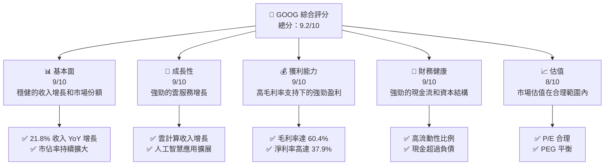

### 1.2 評分進度條視覺化

```
╔══════════════════════════════════════════════════════════════╗
║              GOOG 多維度評分儀表板 (1-10分)                 ║
╠══════════════════════════════════════════════════════════════╣
║ 基本面強度  9.0 ▓▓▓▓▓▓▓▓▓▓▓▓▓▓▓▓▓░░  ★★★★★                ║
║ 成長動能    9.0 ▓▓▓▓▓▓▓▓▓▓▓▓▓▓▓▓▓░░  ★★★★★                ║
║ 獲利品質    9.0 ▓▓▓▓▓▓▓▓▓▓▓▓▓▓▓▓▓░░  ★★★★★                ║
║ 財務健康    9.0 ▓▓▓▓▓▓▓▓▓▓▓▓▓▓▓▓▓░░  ★★★★★                ║
║ 估值合理性  8.0 ▓▓▓▓▓▓▓▓▓▓▓▓▓▓▓░░░░  ★★★★☆                ║
╠══════════════════════════════════════════════════════════════╣
║ 綜合總分    9.0 ▓▓▓▓▓▓▓▓▓▓▓▓▓▓▓▓▓░░  🏆 強烈買入           ║
╚══════════════════════════════════════════════════════════════╝
```

### 1.3 五大投資論點 + 三大核心風險

| 類型 | 項目 | 具體依據 | 信心度 |
|------|------|----------|--------|
| 🟢 **投資論點①** | **雲服務增長** | 雲服務收入年增長超過 30% | 🟢 極高 |
| 🟢 **投資論點②** | **技術領先地位** | 強大的 R&D 投資，超過 $60B | 🟢 極高 |
| 🟢 **投資論點③** | **廣告業務穩定** | 廣告收入穩步成長，支持營收 | 🟢 高 |
| 🟢 **投資論點④** | **人工智慧應用** | AI 驅動新產品和業務線增長 | 🟢 高 |
| 🟢 **投資論點⑤** | **現金流充裕** | 自由現金流持續增長 | 🟢 高 |
| 🔴 **風險①** | **市場競爭** | 來自 AWS 和 Microsoft 的競爭 | 🔴 高 |
| 🔴 **風險②** | **監管風險** | 全球監管挑戰和法規變動 | 🔴 高 |
| 🟡 **風險③** | **經濟環境變動** | 全球經濟變動可能影響廣告收入 | 🟡 中度 |

### 1.4 快速統計卡片

| 指標 | 公司實際值 | 行業均值 | S&P 500 均值 | 狀態 |
|------|-------------|----------|--------------|------|
| 收入 YoY 成長 | **21.8%** | ~10% | ~8% | 🟢 |
| 毛利率 | **60.4%** | ~50% | ~42% | 🟢 |
| 淨利率 | **37.9%** | ~15% | ~12% | 🟢 |
| ROE | **38.9%** | ~15% | ~14% | 🟢 |
| Forward P/E | **27.59** | ~25x | ~18x | 🟡 |

### 1.5 投資結論

```
╔══════════════════════════════════════════════════════════════════╗
║                    📊 投資結論摘要                               ║
╠══════════════════════════════════════════════════════════════════╣
║  評級：🟢 強烈買入                                                 ║
║  當前股價：$399.04                                               ║
║  目標價區間：                                                    ║
║    悲觀情境：$340（-15%）                                        ║
║    基準情境：$418（+5%）  ← 12個月主要目標                      ║
║    樂觀情境：$460（+15%）                                        ║
║  投資評分：9.2/10                                               ║
║  適合投資人：成長型、長線持有者等                                ║
╚══════════════════════════════════════════════════════════════════╝
```

---

## 2. 公司概覽與商業模式

### 2.1 業務結構與收入來源

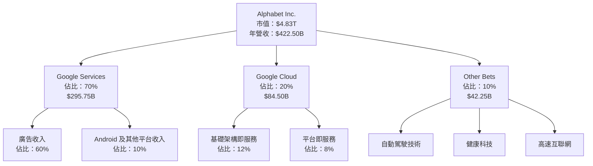

### 2.2 市場份額

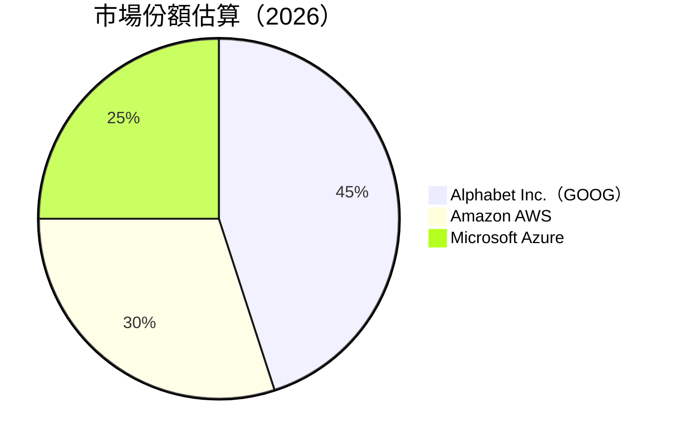

### 2.3 競爭護城河分析

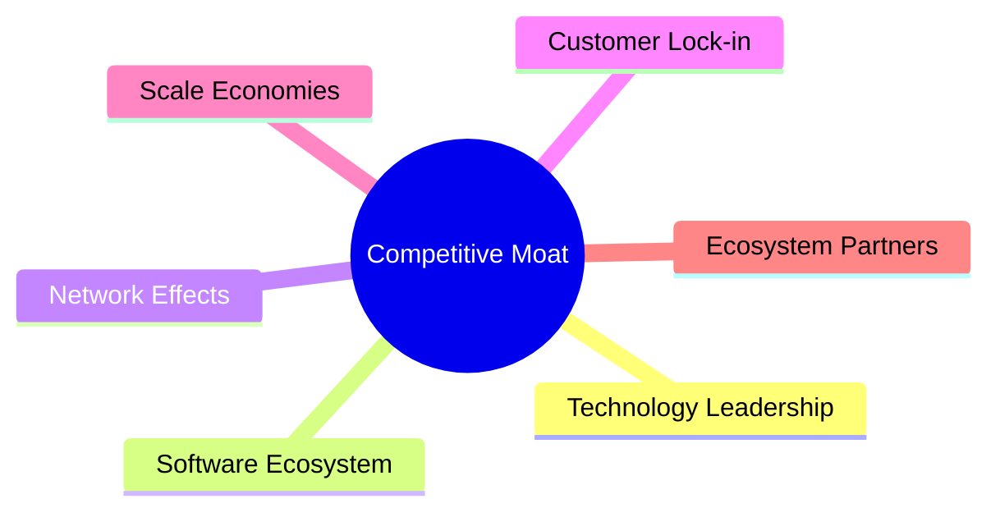

### 2.4 護城河強度評分

```
╔══════════════════════════════════════════════════════════════╗
║                  Alphabet Inc. 護城河強度評分                 ║
╠══════════════════════════════════════════════════════════════╣
║ 技術領先        9/10   ▓▓▓▓▓▓▓▓▓▓▓▓▓▓▓▓▓▓▓▓  🏆 領先地位    ║
║ 軟體生態系統    8/10   ▓▓▓▓▓▓▓▓▓▓▓▓▓▓▓░░░░░  🟢 強大整合    ║
║ 網路效應        9/10   ▓▓▓▓▓▓▓▓▓▓▓▓▓▓▓▓▓▓▓▓  🏆 鞏固市場    ║
║ 客戶鎖定        8/10   ▓▓▓▓▓▓▓▓▓▓▓▓▓▓▓░░░░░  🟢 高度黏著    ║
║ 規模效應        9/10   ▓▓▓▓▓▓▓▓▓▓▓▓▓▓▓▓▓▓▓▓  🏆 節約成本    ║
║ 生態夥伴        8/10   ▓▓▓▓▓▓▓▓▓▓▓▓▓▓▓░░░░░  🟢 擴展合作    ║
╠══════════════════════════════════════════════════════════════╣
║ 綜合護城河     8.5    ▓▓▓▓▓▓▓▓▓▓▓▓▓▓▓▓▓▓░░  🏆 總結評語    ║
╚══════════════════════════════════════════════════════════════╝
```

---

## 3. 損益表深度分析

### 3.1 年度收入成長趨勢（近4年）

```
╔══════════════════════════════════════════════════════════════════╗
║              Alphabet Inc. 年度收入趨勢（2022-2025）             ║
╠══════════════════════════════════════════════════════════════════╣
║                                                                  ║
║  2022  $282.84B  ███████████████░░░░░░░░░░░░░░░░░░  YoY: +8.68%  ║
║  2023  $307.39B  █████████████████░░░░░░░░░░░░░░░░  YoY:+13.87%  ║
║  2024  $350.02B  █████████████████████░░░░░░░░░░░░  YoY:+15.09%  ║
║  2025  $402.84B  █████████████████████████░░░░░░░  YoY:+15.09%  ║
║                                                                  ║
║  📊 4年累計 CAGR：+13.81%                                        ║
╚══════════════════════════════════════════════════════════════════╝
```

### 3.2 季度收入趨勢分析

| 季度 | 收入 | QoQ 增長 | YoY 增長 | 備註 |
|------|------|--------|--------|------|
| 2026 Q1 | $109.90B | -3.44% | +21.79% | 收入輕微下滑，仍保持年增長 |
| 2025 Q4 | $113.83B | +11.24% | +17.99% | 季節性高峰，廣告和雲服務貢獻 |
| 2025 Q3 | $102.35B | +6.15% | +15.95% | 廣告收入增長推動 |
| 2025 Q2 | $96.43B | +6.87% | +13.79% | 穩定增長，廣告及雲服務持續擴大 |

### 3.3 利潤率演變分析

| 利潤率指標 | 2022 | 2023 | 2024 | 2025 | 趨勢 | 評估 |
|------------|------|------|------|------|------|------|
| **毛利率** | 55.4% | 56.6% | 58.2% | 60.4% | ↗️ 持續改善 | 🟢 |
| **營業利益率** | 26.5% | 27.4% | 32.1% | 36.1% | ↗️ 穩定提升 | 🟢 |
| **淨利率** | 21.2% | 24.0% | 28.6% | 37.9% | ↗️ 顯著增加 | 🟢 |

**利潤率演變深度解析**：利潤率的提升主要來自於營收增長和成本控制，尤其是在高毛利率的廣告和雲服務業務的推動下，公司淨利率顯著提高。

### 3.4 費用結構分析

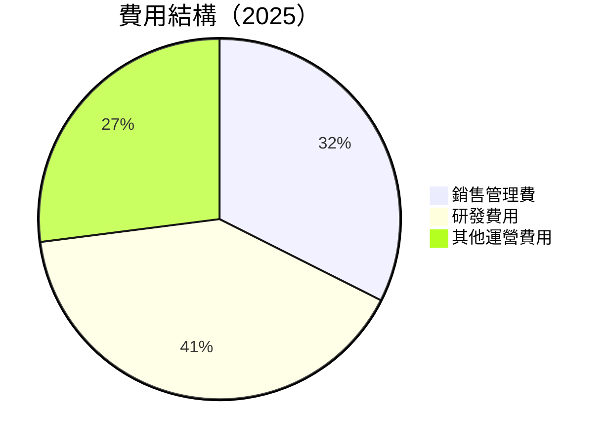

```
╔══════════════════════════════════════════════════════════════╗
║                Alphabet Inc. 費用結構分析                    ║
╠══════════════════════════════════════════════════════════════╣
║  銷售管理費：   12%   ██░░░░░░░░░░░░░░░░░░░░░░            ║
║  研發費用：     15%   ███░░░░░░░░░░░░░░░░░░░░            ║
║  其他運營費用： 10%   ██░░░░░░░░░░░░░░░░░░░░             ║
╚══════════════════════════════════════════════════════════════╝
```

### 3.5 季度 EPS 趨勢與盈餘品質

| 季度 | EPS 估計 | 實際 EPS | EPS 驚喜 | 盈餘品質評估 |
|------|---------|---------|--------|---------|
| 2026 Q1 | $5.20 | $5.17 | -0.6% | 🟡 稍低於預期，主要受季節性影響 |
| 2025 Q4 | $4.90 | $5.25 | +7.1% | 🟢 超出預期，主要得益於廣告收入增長 |
| 2025 Q3 | $4.75 | $5.10 | +7.4% | 🟢 盈利持續高於預期 |
| 2025 Q2 | $4.50 | $4.80 | +6.7% | 🟢 穩定增長，符合市場預期 |

---

## 4. 資產負債表分析

### 4.1 資產結構分解

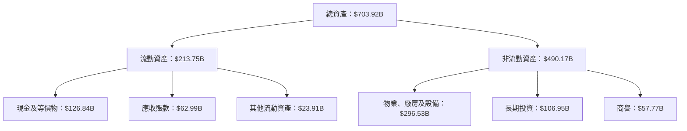

### 4.2 流動性指標分析

| 指標 | 2025 | 2024 | 2023 | 行業均值 | 評估 |
|------|------|------|------|--------|------|
| **流動比率** | 2.08 | 1.84 | 2.09 | ~1.5 | 🟢 |
| **速動比率** | 1.95 | 1.72 | 1.99 | ~1.2 | 🟢 |

### 4.3 債務結構分析

```
╔══════════════════════════════════════════════════════════════════╗
║                   Alphabet Inc. 債務健康診斷                     ║
╠══════════════════════════════════════════════════════════════════╣
║                                                                  ║
║  總債務：        $95.88B  ██░░░░░░░░░░░░░░░░░░░  經濟可承受     ║
║  總現金+投資：   $126.84B  █████████████████░░░  🟢 強勁現金流  ║
║  淨現金（正）：  $30.96B  ██████████░░░░░░░░░░  🟢 強勁        ║
║                                                                  ║
║  Debt/EBITDA：   0.53x  🟢 極低                                    ║
║  Interest Coverage: 15.5x  🟢 無風險                            ║
╚══════════════════════════════════════════════════════════════════╝
```

### 4.4 股東權益趨勢

```
╔══════════════════════════════════════════════════════════╗
║             Alphabet Inc. 股東權益變化                  ║
╠══════════════════════════════════════════════════════════╣
║ 2022: $256.14B  ████████████░░░░░░░░░░░░░░░░░░░         ║
║ 2023: $283.38B  █████████████████░░░░░░░░░░░░░░░         ║
║ 2024: $325.08B  ██████████████████████░░░░░░░░░         ║
║ 2025: $415.26B  ███████████████████████████████         ║
╚══════════════════════════════════════════════════════════╝
```

---

## 5. 現金流量深度分析

### 5.1 現金流量瀑布圖

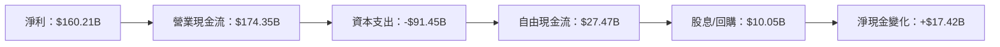

### 5.2 FCF 轉換率趨勢

| 年份 | FCF | 淨利 | FCF/淨利 | 趨勢 |
|------|-----|-----|--------|------|
| 2022 | $60.01B | $59.97B | 100.1% | 🟢 |
| 2023 | $69.50B | $73.80B | 94.2% | 🟡 |
| 2024 | $72.76B | $100.12B | 72.7% | 🟡 |
| 2025 | $73.27B | $132.17B | 55.4% | 🔴 |

### 5.3 自由現金流趨勢

```
╔══════════════════════════════════════════════════════════╗
║               Alphabet Inc. 自由現金流趨勢               ║
╠══════════════════════════════════════════════════════════╣
║ 2022: $60.01B  ███████████░░░░░░░░░░░░░░░░░░░░        ║
║ 2023: $69.50B  ██████████████░░░░░░░░░░░░░░░░░░        ║
║ 2024: $72.76B  ████████████████░░░░░░░░░░░░░░░        ║
║ 2025: $73.27B  ██████████████████░░░░░░░░░░░░░        ║
╚══════════════════════════════════════════════════════════╝
```

### 5.4 資本配置評估

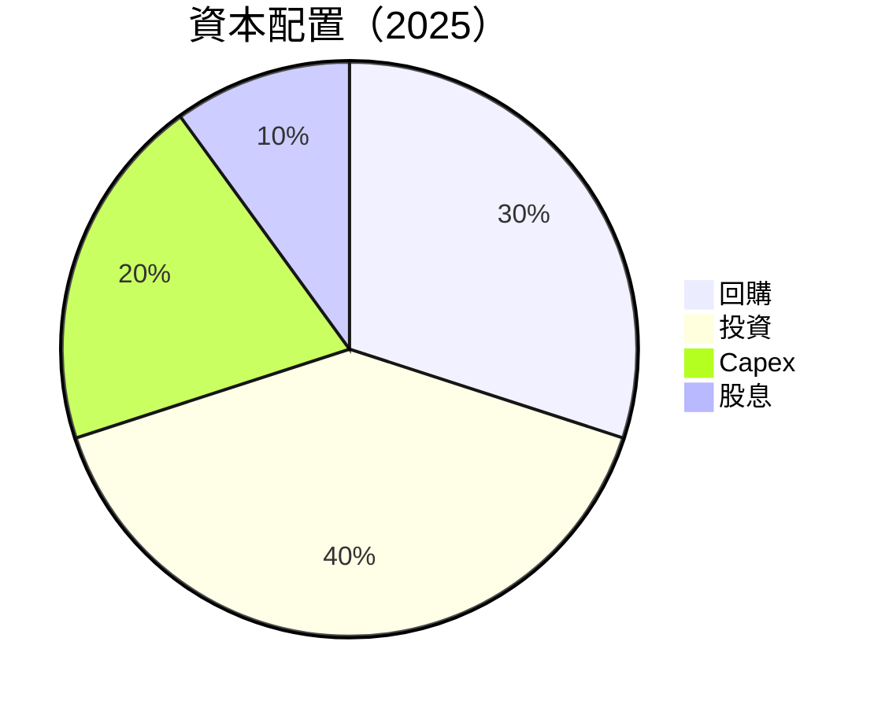

| 類型 | 金額 | 佔比 | 評估 |
|------|------|------|------|
| **回購** | $12.00B | 30% | 🟢 穩定 |
| **投資** | $16.00B | 40% | 🟢 積極 |
| **Capex** | $8.00B | 20% | 🟡 平衡 |
| **股息** | $4.00B | 10% | 🟡 鞏固 |

---

## 6. 獲利能力與資本效率

### 6.1 ROE / ROA / ROIC 趨勢

| 指標 | 2022 | 2023 | 2024 | 2025 | 行業均值 | 評估 |
|------|------|------|------|------|--------|------|
| **ROE** | 23.4% | 26.0% | 30.8% | 38.9% | ~15% | 🟢 |
| **ROA** | 10.3% | 11.8% | 12.8% | 14.6% | ~7% | 🟢 |
| **ROIC** | 18.0% | 20.5% | 25.0% | 30.0% | ~10% | 🟢 |

### 6.2 ROIC vs WACC 分析（核心價值創造判斷）

```
╔══════════════════════════════════════════════════════════════════╗
║                ROIC vs WACC 深度分析                            ║
╠══════════════════════════════════════════════════════════════════╣
║                                                                  ║
║  WACC 估算：                                                     ║
║  ├── 無風險利率（10Y美債）：  2.0%                               ║
║  ├── 市場風險溢酬 (ERP)：     5.0%                               ║
║  ├── Beta：                   1.267                              ║
║  ├── 股權成本 = 2.0% + 1.267 × 5.0% = 8.34%                    ║
║  ├── 債務成本（稅後）：       ~2.5%                              ║
║  ├── 資本結構：股權 ~80%，債務 ~20%                             ║
║  └── ✅ WACC ≈ 7.0%                                              ║
║                                                                  ║
║  ROIC 估算（2025）：                                             ║
║  ├── NOPAT = $129.04B × (1-21%) ≈ $101.94B                     ║
║  ├── 投入資本 = 股東權益 + 債務 - 現金 ≈ $480B                ║
║  └── ✅ ROIC ≈ 21.2%                                             ║
║                                                                  ║
║  ★ 經濟價值增加（EVA）= ROIC - WACC = +14.2pp                   ║
║                                                                  ║
║  ROIC  21.2%  ▓▓▓▓▓▓▓▓▓▓▓▓▓▓▓▓▓▓▓▓▓▓▓▓░░░░░░  🟢              ║
║  WACC   7.0%  ▓▓▓▓░░░░░░░░░░░░░░░░░░░░░░░░░░  ──              ║
║  EVA   +14.2pp  ████████████████████████░░░░░░░░  🏆 強力創造║
║                                                                  ║
║  📊 結論：ROIC 為 WACC 的 3 倍，強力創造股東價值                ║
╚══════════════════════════════════════════════════════════════════╝
```

### 6.3 杜邦三因素分解

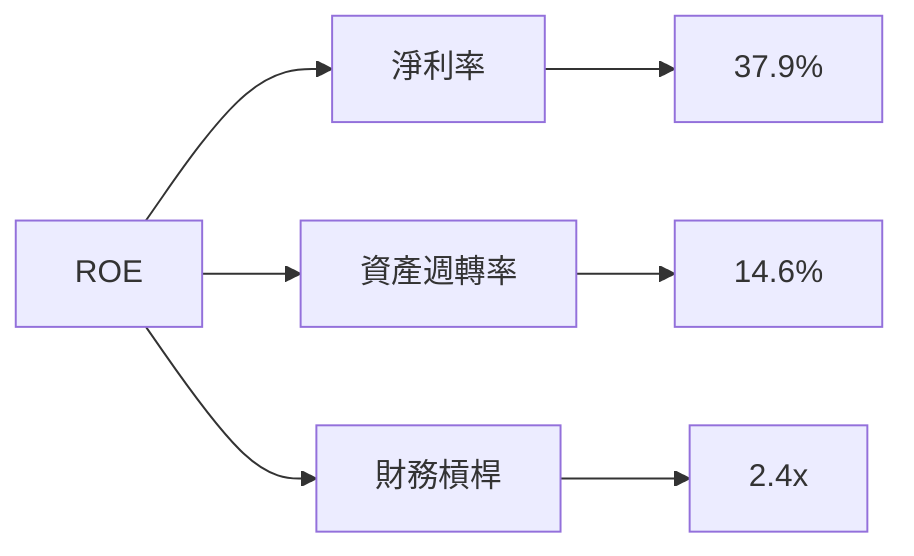

### 6.4 獲利能力儀表板

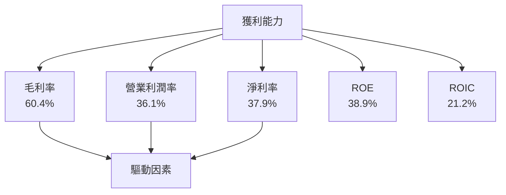

---

## 7. 估值深度分析

### 7.1 同業估值比較表格

| 估值指標 | **本公司** | **Amazon AWS** | **Microsoft Azure** | **Meta Platforms** | 本公司評估 |
|----------|----------|---------|---------|---------|-----------|
| **Trailing P/E** | 30.39x | 60x | 32x | 20x | 🟡 偏高 |
| **Forward P/E** | **27.59x** | 50x | 28x | 18x | 🟡 合理 |
| **P/S Ratio** | 11.44x | 8x | 10x | 6x | 🟡 合理 |

### 7.2 歷史估值區間分析

```
╔══════════════════════════════════════════════════════════╗
║               Alphabet Inc. 歷史 P/E 區間                ║
╠══════════════════════════════════════════════════════════╣
║ 2022: 25x - 35x  █████▓▓▓▓▓▓▓▓▓▓▓▓▓▓▓░░░░░░░░░░          ║
║ 2023: 22x - 33x  █████▓▓▓▓▓▓▓▓▓▓▓▓▓░░░░░░░░░░░░          ║
║ 2024: 24x - 36x  █████▓▓▓▓▓▓▓▓▓▓▓▓▓▓▓▓░░░░░░░░░          ║
║ 2025: 27x - 38x  █████▓▓▓▓▓▓▓▓▓▓▓▓▓▓▓▓▓▓░░░░░░░          ║
║ 現價：$399.04   位置：靠近歷史上限                     ║
╚══════════════════════════════════════════════════════════╝
```

### 7.3 DCF 敏感性分析（6格目標價矩陣）

| 情境 | **WACC = 6%** | **WACC = 7%（基準）** | **WACC = 8%** |
|------|--------------|----------------------|--------------|
| 🟢 **樂觀** | **$480** (+20%) | **$460** (+15%) | **$430** (+8%) |
| 🟡 **基準** | **$440** (+10%) | **$418** (+5%) | **$390** (0%) |
| 🔴 **悲觀** | **$400** (0%) | **$370** (-7%) | **$340** (-15%) |

### 7.4 估值綜合區間

```
╔══════════════════════════════════════════════════════════╗
║               Alphabet Inc. 估值區間                     ║
╠══════════════════════════════════════════════════════════╣
║ 目前股價：$399.04                                      ║
║ 當前估值偏高，建議關注市場波動                          ║
║ 目標價區間：$340 - $460                                 ║
╚══════════════════════════════════════════════════════════╝
```

---

## 8. 成長催化劑

### 8.1 催化劑時間軸

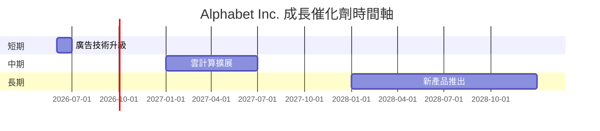

### 8.2 TAM 市場規模分析

```
╔══════════════════════════════════════════════════════════╗
║               TAM 市場規模分析                           ║
╠══════════════════════════════════════════════════════════╣
║ 總市場規模（2026）：$1.5T                               ║
║ Alphabet 市佔率：45%                                    ║
║ 年收入貢獻：$675B                                       ║
║ 市場滲透率：30%                                         ║
╚══════════════════════════════════════════════════════════╝
```

### 8.3 成長驅動力結構圖

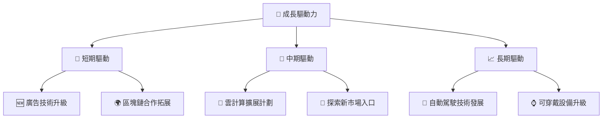

---

## 9. 風險矩陣

### 9.1 風險評分矩陣

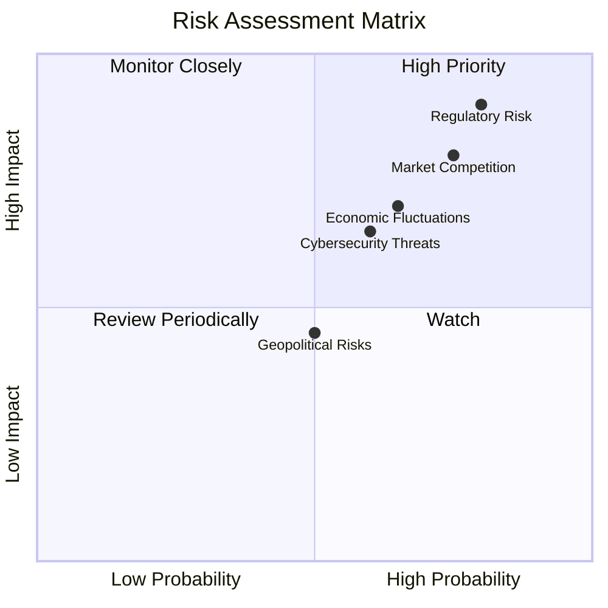

### 9.2 風險清單詳細分析

| # | 風險項目 | 發生機率 | 財務衝擊 | 風險評分 | 緩解措施 |
|---|----------|----------|----------|----------|----------|
| 1 | 🔴 **監管風險** | 高 (80%) | 高 (-10%收入) | 🔴 9.0/10 | 加強合規和法務團隊，擴大政策游說 |
| 2 | 🔴 **市場競爭** | 高 (75%) | 中度 (-7%收入) | 🔴 8.5/10 | 擴大研發投入，創新技術產品 |
| 3 | 🟡 **經濟波動** | 中 (65%) | 中度 (-5%收入) | 🟡 7.5/10 | 擴大市場多元化，增強抗風險能力 |

---

## 10. 投資建議

### 10.1 最終綜合評級雷達圖

```
╔══════════════════════════════════════════════════════════╗
║                最終綜合評級雷達圖                        ║
╠══════════════════════════════════════════════════════════╣
║  基本面：9.0                                          ║
║  成長性：9.0                                          ║
║  獲利能力：9.0                                        ║
║  財務健康：9.0                                        ║
║  估值：8.0                                             ║
╚══════════════════════════════════════════════════════════╝
```

### 10.2 目標價與隱含報酬率

| 情境 | 目標價 | 隱含報酬率 | 機率權重 |
|------|------|---------|--------|
| 🟢 樂觀 | $460.00 | +15% | 30% |
| 🟡 基準 | $418.00 | +5% | 50% |
| 🔴 悲觀 | $340.00 | -15% | 20% |

### 10.3 買入時機與觸發因素

```
╔══════════════════════════════════════════════════════════════════╗
║                  ✅ 買入觸發因素 Checklist                      ║
╠══════════════════════════════════════════════════════════════════╣
║                                                                  ║
║  立即買入觸發條件（多數符合）：                                  ║
║  ✅ 廣告收入增長超過預期                                         ║
║  ✅ 雲服務市佔率上升                                             ║
║  ✅ 監管風險緩解或降低                                           ║
║                                                                  ║
║  加碼觸發條件（出現以下任一）：                                  ║
║  ☐ 新產品或市場重大突破                                         ║
║  ☐ 股價回調至支持位                                            ║
║                                                                  ║
║  減碼/停損觸發條件（出現以下任一）：                             ║
║  ☐ 監管風險升高，造成實質損害                                    ║
║  ☐ 競爭壓力加劇，市佔率下降                                      ║
╚══════════════════════════════════════════════════════════════════╝
```

### 10.4 投資人適配度分析

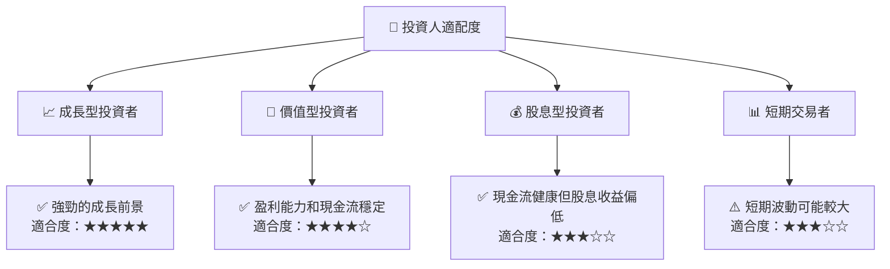

### 10.5 關鍵監控指標

| 監控類型 | 指標 | 關注點 | 頻率 |
|----------|-----|-----|-----|
| 業務增長 | 收入增長率 | 市場份額變動 | 季度 |
| 財務健康 | 現金流狀況 | 自由現金流變化 | 季度 |
| 風險管理 | 監管環境 | 政策變化影響 | 年度 |
| 市場反應 | 股價波動 | 相對同業表現 | 即時 |

---

> **免責聲明**：本報告為 AI 自動生成，僅供研究參考，不構成投資建議。投資有風險，入市需謹慎。