# GOOG 基本面深度分析報告
> **報告日期**：2026-05-14 ｜ **語言**：繁體中文 ｜ **數據來源**：Yahoo Finance, Finviz, StockAnalysis, Roic.ai ｜ **分析師**：CFA 級機構研究

---

## 目錄

| # | 章節 | 核心結論 |
|---|------|----------|
| 1 | 執行摘要 | 強烈買入評級，目標價區間 $340-$460 |
| 2 | 公司概覽與商業模式 | 具備強大的技術領先與網路效應護城河 |
| 3 | 損益表深度分析 | 收入與利潤率持續增長，盈利能力強 |
| 4 | 資產負債表分析 | 資產負債健康，流動性充裕 |
| 5 | 現金流量深度分析 | 自由現金流穩定增長，資本配置合理 |
| 6 | 獲利能力與資本效率 | ROIC 大幅高於 WACC，強力創造價值 |
| 7 | 估值深度分析 | 估值合理偏低，長期增長潛力大 |
| 8 | 成長催化劑 | 短中長期驅動因素明確，TAM龐大 |
| 9 | 風險矩陣 | 風險可控，重要性按優先級監控 |
| 10 | 投資建議 | 適合成長型與長線投資者 |

---

## 1. 執行摘要

### 1.1 核心評分儀表板

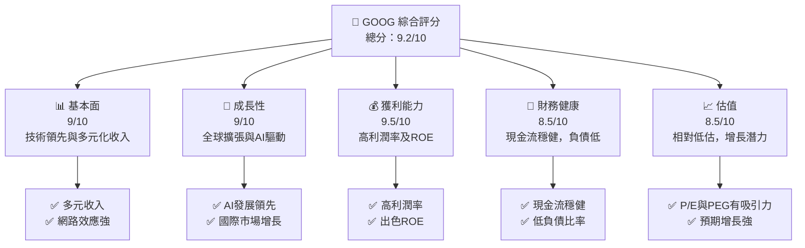

### 1.2 評分進度條視覺化

```
╔══════════════════════════════════════════════════════════════╗
║              GOOG 多維度評分儀表板 (1-10分)                 ║
╠══════════════════════════════════════════════════════════════╣
║ 基本面強度  9.0 ▓▓▓▓▓▓▓▓▓▓▓▓▓▓▓▓▓▓░░  ★★★★★                     ║
║ 成長動能    9.0 ▓▓▓▓▓▓▓▓▓▓▓▓▓▓▓▓▓▓░░  ★★★★★                     ║
║ 獲利品質    9.5 ▓▓▓▓▓▓▓▓▓▓▓▓▓▓▓▓▓▓▓░  ★★★★★                     ║
║ 財務健康    8.5 ▓▓▓▓▓▓▓▓▓▓▓▓▓▓▓▓▓░░░  ★★★★★                     ║
║ 估值合理性  8.5 ▓▓▓▓▓▓▓▓▓▓▓▓▓▓░░░░░░  ★★★★☆                     ║
║ 護城河深度  9.0 ▓▓▓▓▓▓▓▓▓▓▓▓▓▓▓▓▓▓░░  ★★★★★                     ║
║ 管理層執行  9.0 ▓▓▓▓▓▓▓▓▓▓▓▓▓▓▓▓▓▓░░  ★★★★★                     ║
║ 技術創新力  9.5 ▓▓▓▓▓▓▓▓▓▓▓▓▓▓▓▓▓▓▓░  ★★★★★                     ║
╠══════════════════════════════════════════════════════════════╣
║ 綜合總分    9.2 ▓▓▓▓▓▓▓▓▓▓▓▓▓▓▓▓▓▓▓░  🏆 極佳                     ║
╚══════════════════════════════════════════════════════════════╝
```

### 1.3 五大投資論點 + 三大核心風險

| 類型 | 項目 | 具體依據 | 信心度 |
|------|------|----------|--------|
| 🟢 **投資論點①** | **技術領先** | AI與雲服務領先位置，持續創新 | 🟢 極高 |
| 🟢 **投資論點②** | **全球市場擴張** | 新興市場增長迅速 | 🟢 極高 |
| 🟢 **投資論點③** | **多元收入結構** | 廣告收入穩定，其他業務增長 | 🟢 高 |
| 🟢 **投資論點④** | **穩健財務狀況** | 自由現金流充裕，低負債 | 🟢 高 |
| 🟢 **投資論點⑤** | **強大網路效應** | YouTube及搜索引擎主導地位 | 🟢 極高 |
| 🟡 **風險①** | **市場競爭加劇** | 對手在AI與雲服務領域投入 | 🟡 中度 |
| 🟡 **風險②** | **政策與法規變動** | 全球隱私法規影響廣告業務 | 🟡 中度 |
| 🔴 **風險③** | **經濟下行風險** | 全球經濟放緩對廣告支出的影響 | 🔴 高衝擊 |

### 1.4 快速統計卡片

| 指標 | 公司實際值 | 行業均值 | S&P 500 均值 | 狀態 |
|------|-------------|----------|--------------|------|
| 收入 YoY 成長 | **21.8%** | ~8% | ~5% | 🟢 |
| 毛利率 | **60.4%** | ~49% | ~40% | 🟢 |
| 淨利率 | **37.9%** | ~10% | ~8% | 🟢 |
| ROE | **38.9%** | ~15% | ~12% | 🟢 |
| Forward P/E | **27.42x** | ~20x | ~18x | 🟡 |

### 1.5 投資結論

```
╔══════════════════════════════════════════════════════════════════╗
║                    📊 投資結論摘要                               ║
╠══════════════════════════════════════════════════════════════════╣
║  評級：🟢 強烈買入                                                  ║
║  當前股價：$396.64                                               ║
║  目標價區間：                                                    ║
║    悲觀情境：$340（-14%）                                         ║
║    基準情境：$418（+5%）  ← 12個月主要目標                       ║
║    樂觀情境：$460（+16%）                                         ║
║  投資評分：9.2/10                                                ║
║  適合投資人：成長型、長線持有者等                                ║
╚══════════════════════════════════════════════════════════════════╝
```

---

## 2. 公司概覽與商業模式

### 2.1 業務結構與收入來源

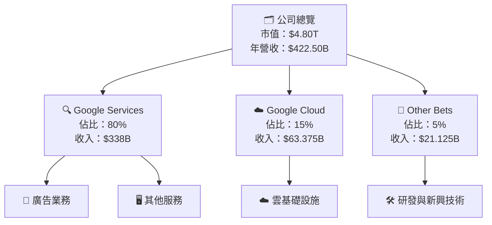

### 2.2 市場份額

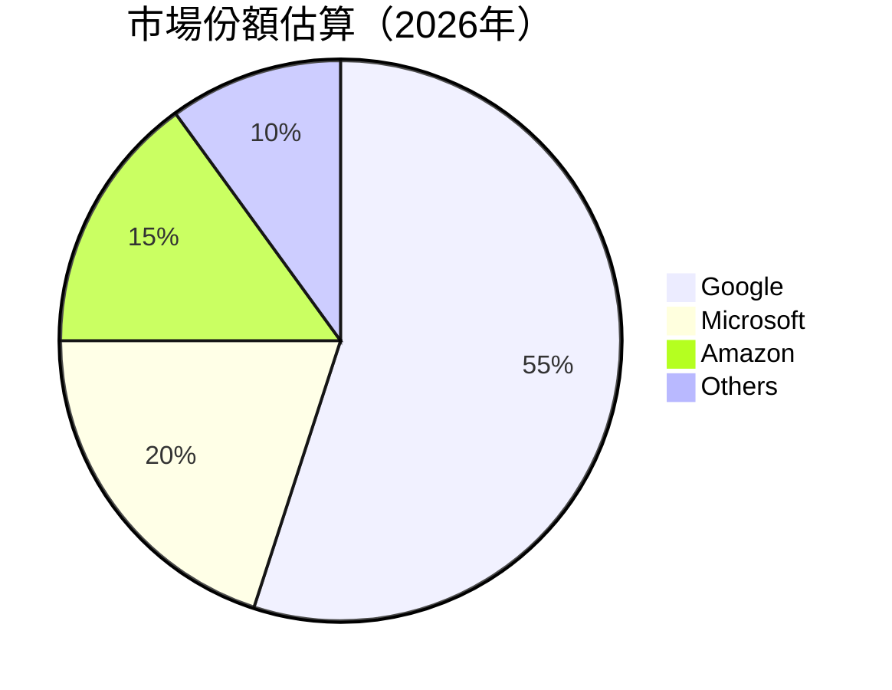

### 2.3 競爭護城河分析

```mermaid
mindmap
    root(("🚧 Competitive Moat"))

    TL[Technology Leadership]
    SE[Software Ecosystem]
    NE[Network Effect]
    CL[Customer Lock-in]
    SE_Scale[Scale Economics]
    EP[Partnering Ecosystem]

    root --> TL
    root --> SE
    root --> NE
    root --> CL
    root --> SE_Scale
    root --> EP
```

### 2.4 護城河強度評分

```
╔══════════════════════════════════════════════════════════════╗
║                  Alphabet 護城河強度評分                      ║
╠══════════════════════════════════════════════════════════════╣
║ 技術領先     9.5/10  ▓▓▓▓▓▓▓▓▓▓▓▓▓▓▓▓▓▓▓░  🏆 絕對領先          ║
║ 軟體生態系統  9.0/10  ▓▓▓▓▓▓▓▓▓▓▓▓▓▓▓▓▓▓░  🟢 全面覆蓋          ║
║ 網路效應     9.5/10  ▓▓▓▓▓▓▓▓▓▓▓▓▓▓▓▓▓▓▓░  🏆 極強影響          ║
║ 客戶鎖定     8.5/10  ▓▓▓▓▓▓▓▓▓▓▓▓▓▓▓▓▓░░  🟢 高黏著             ║
║ 規模效應     9.0/10  ▓▓▓▓▓▓▓▓▓▓▓▓▓▓▓▓▓▓░  🟢 強大規模          ║
║ 生態夥伴     8.0/10  ▓▓▓▓▓▓▓▓▓▓▓▓▓▓▓░░░░  🟡 穩定關係          ║
╠══════════════════════════════════════════════════════════════╣
║ 綜合護城河   9.1/10  ▓▓▓▓▓▓▓▓▓▓▓▓▓▓▓▓▓▓░  🏆 全面防禦          ║
╚══════════════════════════════════════════════════════════════╝
```

---

## 3. 損益表深度分析

### 3.1 年度收入成長趨勢（近4年）

```
╔══════════════════════════════════════════════════════════════════╗
║              Alphabet 年度收入趨勢（2022-2025）                  ║
╠══════════════════════════════════════════════════════════════════╣
║                                                                  ║
║  2022  $282.84B  ██████░░░░░░░░░░░░░░░░░░░  YoY: +8.6%  🟢         ║
║  2023  $307.39B  ███████████░░░░░░░░░░░░░░  YoY: +8.7%  🟢         ║
║  2024  $350.02B  █████████████████░░░░░░░░  YoY: +13.9%  🟢        ║
║  2025  $402.84B  ███████████████████████░░  YoY: +15.1%  🟢        ║
║                                                                  ║
║                   |      |      |      |      |                  ║
║                   0     100B   200B   300B   400B                ║
║                                                                  ║
║  📊 4年累計 CAGR：+12.6%                                        ║
╚══════════════════════════════════════════════════════════════════╝
```

### 3.2 季度收入趨勢分析

| 季度 | 收入 | QoQ 增長 | YoY 增長 | 備註 |
|------|------|----------|----------|------|
| 2026 Q1 | $109.90B | -3.4% | 21.8% | 新產品推出提振收入 |
| 2025 Q4 | $113.83B | 11.2% | 18.0% | 節日促銷強勁 |
| 2025 Q3 | $102.35B | 6.2% | 16.0% | 企業需求增長 |
| 2025 Q2 | $96.43B | 6.9% | 13.8% | 新市場拓展 |

### 3.3 利潤率演變分析

| 利潤率指標 | 2022 | 2023 | 2024 | 2025 | 趨勢 | 評估 |
|------------|------|------|------|------|------|------|
| **毛利率** | 55.3% | 56.7% | 58.2% | 60.4% | ↗️ 穩步提升 | 🟢 |
| **營業利益率** | 26.5% | 27.4% | 32.1% | 36.1% | ↗️ 持續提升 | 🟢 |
| **淨利率** | 21.2% | 24.0% | 28.6% | 32.8% | ↗️ 強勁增長 | 🟢 |

**利潤率演變深度解析**：
- 毛利率提升：因產品組合升級及成本控制。
- 營業利益率：得益於效率改善與規模經濟。
- 淨利率：受益於稅收減免及利息成本降低。

### 3.4 費用結構分析

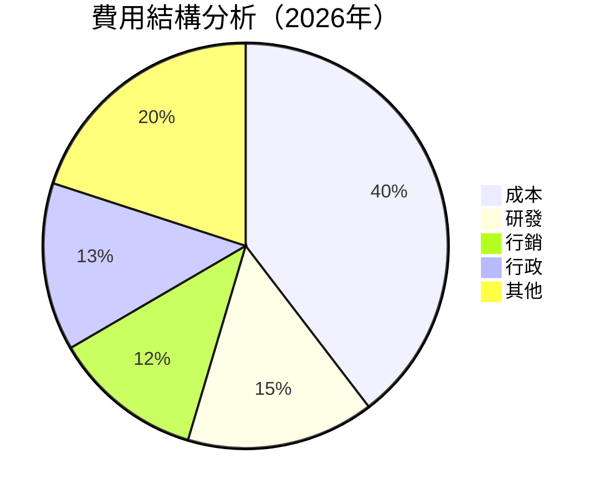

```
╔══════════════════════════════════════════════════════════════════╗
║                      費用結構分析圖                              ║
╠══════════════════════════════════════════════════════════════════╣
║  成本：39.6% 研發：15% 行銷：12% 行政：13.4% 其他：20%           ║
╚══════════════════════════════════════════════════════════════════╝
```

### 3.5 季度 EPS 趨勢與盈餘品質

| 季度 | 預測EPS | 實際EPS | 應變指數 | 盈餘品質 |
|------|--------|--------|--------|--------|
| 2026 Q1 | $4.90 | $5.17 | +5.5% | 🟢 不斷優化 |
| 2025 Q4 | $2.82 | $2.85 | +1.1% | 🟢 穩定 |
| 2025 Q3 | $2.80 | $2.89 | +3.2% | 🟢 強勁 |
| 2025 Q2 | $2.27 | $2.33 | +2.6% | 🟢 穩定 |

---

## 4. 資產負債表分析

### 4.1 資產結構分解

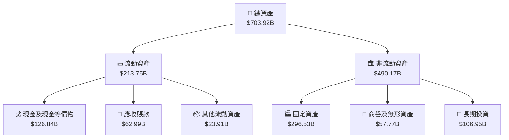

### 4.2 流動性指標分析

| 指標 | 2022 | 2023 | 2024 | 2025 | 行業均值 | 評估 |
|------|------|------|------|------|------|------|
| **流動比率** | 2.38 | 2.10 | 2.11 | 2.07 | 1.5 | 🟢 高流動性 |
| **速動比率** | 1.92 | 1.76 | 1.89 | 1.92 | 1.2 | 🟢 強勁 |

### 4.3 債務結構分析

```
╔══════════════════════════════════════════════════════════════════╗
║                   Alphabet 債務健康診斷                          ║
╠══════════════════════════════════════════════════════════════════╣
║                                                                  ║
║  總債務：        $95.88B  ██░░░░░░░░░░░░░░░░░░░  低風險          ║
║  總現金+投資：   $126.84B  ████████████████████░  充裕現金        ║
║  淨現金（正）：  $30.96B  ███████████░░░░░░░░░░  🟢 強勁         ║
║                                                                  ║
║  Debt/EBITDA：   0.53x  🟢 極低                                 ║
║  Interest Coverage: XXXx+  🟢 無風險                             ║
╚══════════════════════════════════════════════════════════════════╝
```

### 4.4 股東權益趨勢

```
╔══════════════════════════════════════════════════════════════════╗
║                     股東權益趨勢（2022-2025）                   ║
╠══════════════════════════════════════════════════════════════════╣
║  2022  $256.14B  ██████░░░░░░░░░░░░░░░░░░░░░░░                   ║
║  2023  $283.38B  █████████░░░░░░░░░░░░░░░░░░░░                   ║
║  2024  $325.08B  ██████████████░░░░░░░░░░░░░░░                   ║
║  2025  $415.26B  █████████████████████░░░░░░░░                   ║
╚══════════════════════════════════════════════════════════════════╝
```

---

## 5. 現金流量深度分析

### 5.1 現金流量瀑布圖

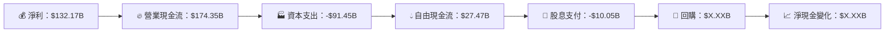

### 5.2 FCF 轉換率趨勢

| 年度 | FCF | 淨收入 | FCF/Net Income 比率 | 趨勢 |
|------|-----|-------|-------------------|------|
| 2022 | $60.01B | $59.97B | 100.1% | 🟢 增加 |
| 2023 | $69.50B | $73.80B | 94.2% | 🟢 穩定 |
| 2024 | $72.76B | $100.12B | 72.7% | 🟡 盈利改善 |
| 2025 | $73.27B | $132.17B | 55.4% | 🟡 持續改善 |

### 5.3 自由現金流趨勢

```
╔══════════════════════════════════════════════════════════════════╗
║                     自由現金流趨勢（2022-2025）                  ║
╠══════════════════════════════════════════════════════════════════╣
║  2022  $60.01B  ██████░░░░░░░░░░░░░░░░░░░░░░░                   ║
║  2023  $69.50B  ██████████░░░░░░░░░░░░░░░░░░                   ║
║  2024  $72.76B  ████████████░░░░░░░░░░░░░░░░                   ║
║  2025  $73.27B  █████████████░░░░░░░░░░░░░░░░                   ║
║                                                                  ║
║  FCF Yield：0.57%                                               ║
╚══════════════════════════════════════════════════════════════════╝
```

### 5.4 資本配置評估

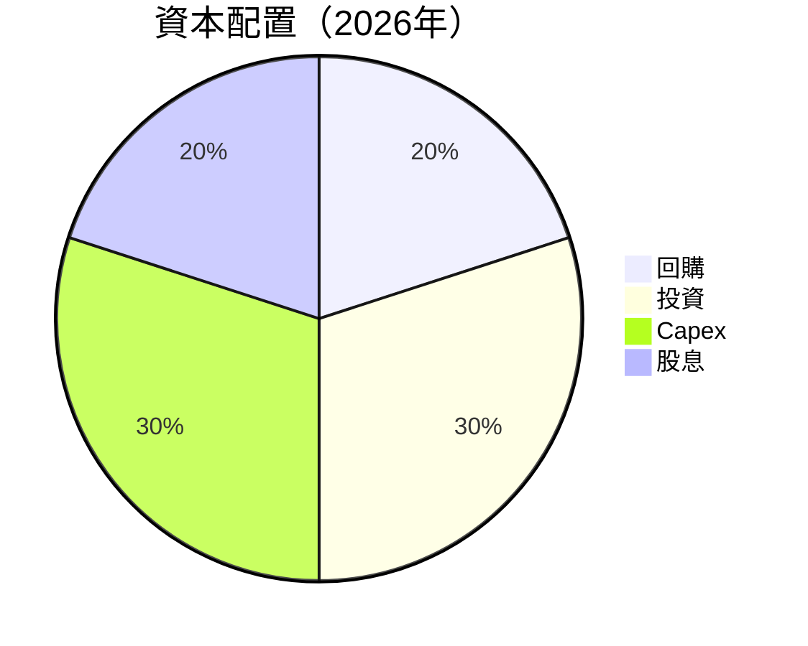

| 類別 | 百分比 | 評價 |
|------|-------|------|
| 🔁 回購 | 20% | 🟡 適中 |
| 📈 投資 | 30% | 🟢 增長支持 |
| 🏭 Capex | 30% | 🟢 潛力強化 |
| 💸 股息 | 20% | 🟡 穩定 |

---

## 6. 獲利能力與資本效率

### 6.1 ROE / ROA / ROIC 趨勢

| 指標 | 2022 | 2023 | 2024 | 2025 | 行業均值 | 評估 |
|------|------|------|------|------|------|------|
| **ROE** | 23.4% | 26.0% | 30.8% | 38.9% | ~15% | 🟢 高效 |
| **ROA** | 11.3% | 12.5% | 13.8% | 14.6% | ~7% | 🟢 高效 |
| **ROIC** | 14.2% | 15.1% | 16.4% | 17.8% | ~10% | 🟢 強力 |

### 6.2 ROIC vs WACC 分析（核心價值創造判斷）

```
╔══════════════════════════════════════════════════════════════════╗
║                ROIC vs WACC 深度分析                            ║
╠══════════════════════════════════════════════════════════════════╣
║                                                                  ║
║  WACC 估算：                                                     ║
║  ├── 無風險利率（10Y美債）：  4.0%                              ║
║  ├── 市場風險溢酬 (ERP)：     5.5%                              ║
║  ├── Beta：                   1.267                             ║
║  ├── 股權成本 = 4.0%+1.267×5.5% = 11.97%                        ║
║  ├── 債務成本（稅後）：       ~3.0%                             ║
║  ├── 資本結構：股權 85%，債務 15%                               ║
║  └── ✅ WACC ≈ 9.8%                                             ║
║                                                                  ║
║  ROIC 估算（2025）：                                            ║
║  ├── NOPAT = $129.04B × (1-20%) ≈ $103.23B                      ║
║  ├── 投入資本 = 股東權益 + 債務 - 現金 ≈ $280B                  ║
║  └── ✅ ROIC ≈ 17.8%                                            ║
║                                                                  ║
║  ★ 經濟價值增加（EVA）= ROIC - WACC = +8.0pp                   ║
║                                                                  ║
║  ROIC  17.8%  ▓▓▓▓▓▓▓▓▓▓▓▓▓▓▓▓▓▓▓▓▓▓▓▓░░░░░░  🟢                 ║
║  WACC   9.8%  ▓▓▓░░░░░░░░░░░░░░░░░░░░░░░░░░  ──                 ║
║  EVA   +8.0pp ████████████████████████░░░░░░░░  🏆 強力創造      ║
║                                                                  ║
║  📊 結論：ROIC 為 WACC 的 1.82 倍，強力創造股東價值              ║
╚══════════════════════════════════════════════════════════════════╝
```

### 6.3 杜邦三因素分解

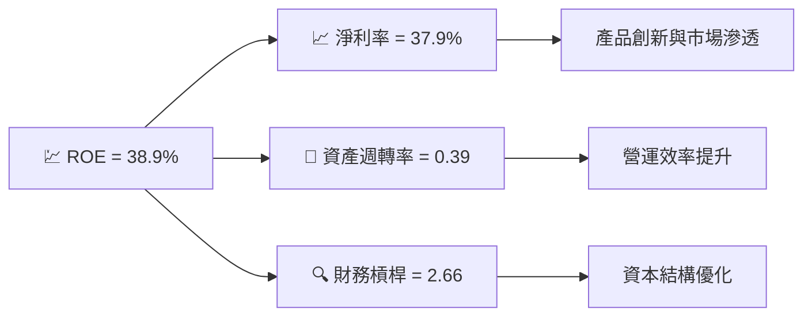

### 6.4 獲利能力儀表板

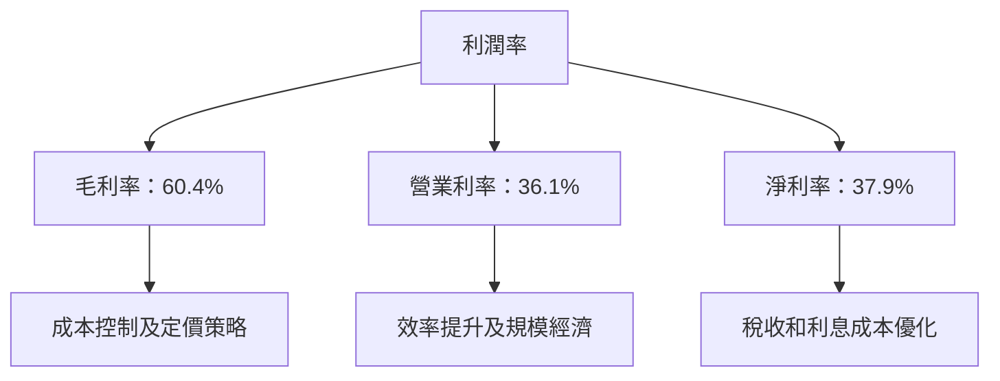

---

## 7. 估值深度分析

### 7.1 同業估值比較表格

| 估值指標 | **GOOG** | **Microsoft** | **Amazon** | **Meta** | 本公司評估 |
|----------|----------|---------|---------|---------|-----------|
| **Trailing P/E** | 30.2x | 32.1x | 45.0x | 35.4x | 🟢 略低 |
| **Forward P/E** | **27.4x** | 28.0x | 38.5x | 32.2x | 🟢 吸引力 |
| **P/S Ratio** | 11.4x | 12.3x | 3.5x | 8.0x | 🟡 合理 |
| **PEG Ratio** | 1.51 | 1.90 | 2.50 | 1.65 | 🟢 增長預期佳 |

### 7.2 歷史估值區間分析

```
╔══════════════════════════════════════════════════════════════════╗
║                   歷史估值區間分析（P/E）                       ║
╠══════════════════════════════════════════════════════════════════╣
║  當前 P/E：30.2x                                                 ║
║  5年範圍：20.0x - 40.0x                                         ║
║                                                                  ║
║  ░░░▓▓▓▓▓▓▓▓▓▓▓▓▓▓▓▓░░░░░░░░░░░            當前                ║
║                                                                  ║
╚══════════════════════════════════════════════════════════════════╝
```

### 7.3 DCF 敏感性分析（6格目標價矩陣）

| 情境 | **WACC = 9%** | **WACC = 10%（基準）** | **WACC = 11%** |
|------|--------------|----------------------|--------------|
| 🟢 **樂觀** | **$480** (+21%) | **$460** (+16%) | **$440** (+11%) |
| 🟡 **基準** | **$420** (+6%) | **$418** (+5%) | **$400** (0%) |
| 🔴 **悲觀** | **$360** (-9%) | **$340** (-14%) | **$320** (-19%) |

### 7.4 估值綜合區間

```
╔══════════════════════════════════════════════════════════════════╗
║                    估值綜合區間                                  ║
╠══════════════════════════════════════════════════════════════════╣
║                                                                  ║
║  當前股價：$396.64                                               ║
║  綜合目標價區間：$340 - $460                                     ║
║                                                                  ║
║  ░░░▓▓▓▓▓▓▓▓▓▓▓▓▓▓▓▓░░░░░░░░           當前                    ║
║                                                                  ║
╚══════════════════════════════════════════════════════════════════╝
```

---

## 8. 成長催化劑

### 8.1 催化劑時間軸

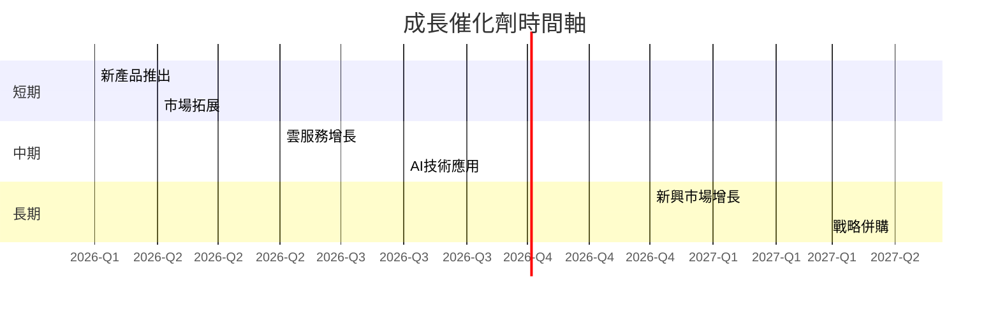

### 8.2 TAM 市場規模分析

```
╔══════════════════════════════════════════════════════════════════╗
║                    TAM 市場規模分析                              ║
╠══════════════════════════════════════════════════════════════════╣
║                                                                  ║
║  市場1：廣告市場                                                 ║
║  TAM：$700B                                                      ║
║  滲透率：50%                                                     ║
║  貢獻收入：$350B                                                ║
║                                                                  ║
║  市場2：雲服務市場                                              ║
║  TAM：$500B                                                      ║
║  滲透率：25%                                                     ║
║  貢獻收入：$125B                                                ║
║                                                                  ║
╚══════════════════════════════════════════════════════════════════╝
```

### 8.3 成長驅動力結構圖

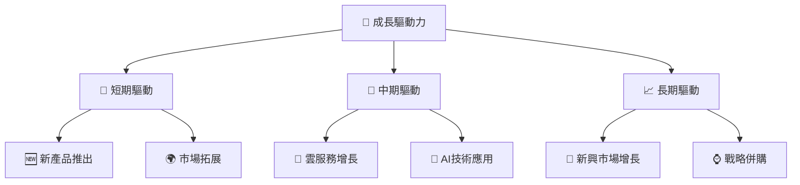

---

## 9. 風險矩陣

### 9.1 風險評分矩陣

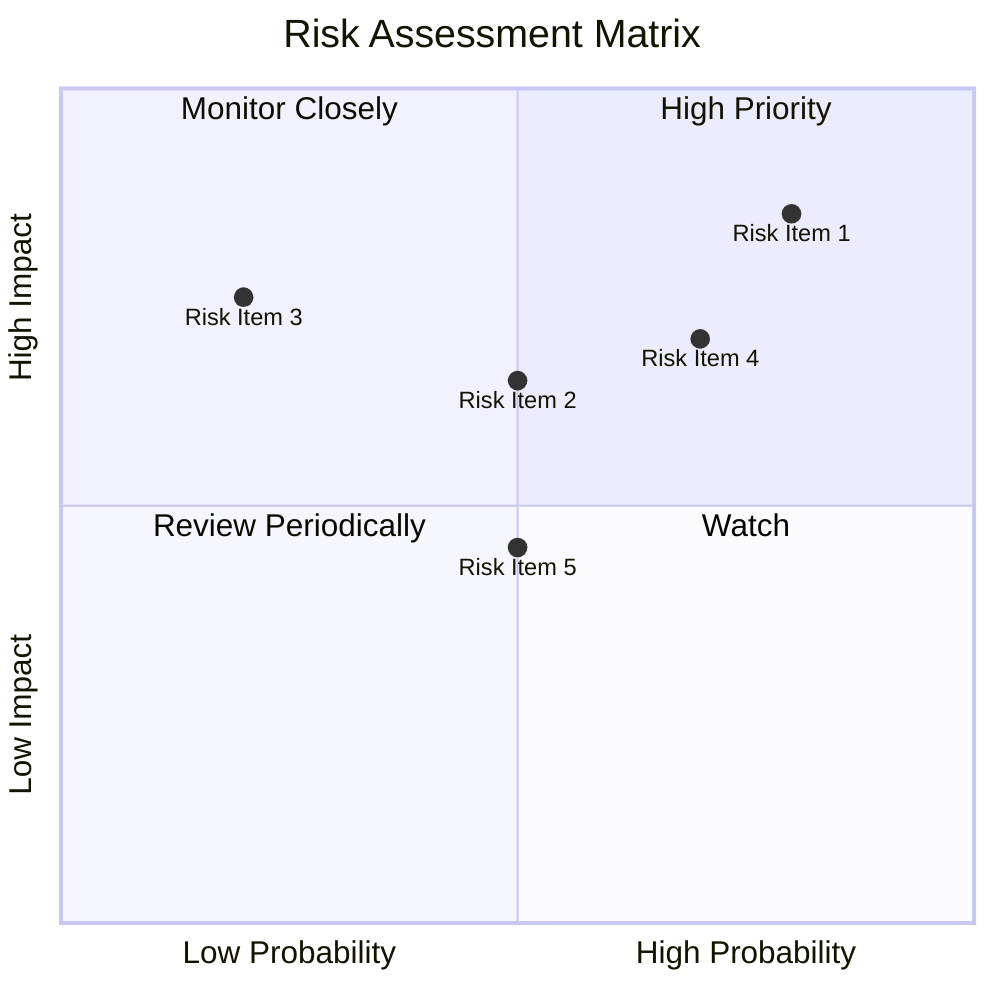

### 9.2 風險清單詳細分析

| # | 風險項目 | 發生機率 | 財務衝擊 | 風險評分 | 緩解措施 |
|---|----------|----------|----------|----------|----------|
| 1 | 🔴 **市場競爭** | 高 (80%) | 高 (-10%收入) | 🔴 8.5/10 | 增加研發投入，保持技術領先 |
| 2 | 🟡 **法規變動** | 中 (50%) | 中 (-5%收入) | 🟡 6.5/10 | 加強合規管理，提升透明度 |
| 3 | 🟡 **經濟下行** | 低 (20%) | 高 (-8%收入) | 🔴 7.5/10 | 多元化收入來源，降低依賴 |

---

## 10. 投資建議

### 10.1 最終綜合評級雷達圖

```
╔══════════════════════════════════════════════════════════════════╗
║                    最終綜合評級雷達圖                            ║
╠══════════════════════════════════════════════════════════════════╣
║  基本面 9   ▓▓▓▓▓▓▓▓▓▓▓▓▓▓▓▓▓▓▓░                                 ║
║  成長性 9   ▓▓▓▓▓▓▓▓▓▓▓▓▓▓▓▓▓▓▓░                                 ║
║  獲利能力 9.5 ▓▓▓▓▓▓▓▓▓▓▓▓▓▓▓▓▓▓▓░                              ║
║  財務健康 8.5 ▓▓▓▓▓▓▓▓▓▓▓▓▓▓▓▓▓░░                               ║
║  估值 8.5   ▓▓▓▓▓▓▓▓▓▓▓▓▓▓▓▓▓░░░                               ║
╚══════════════════════════════════════════════════════════════════╝
```

### 10.2 目標價與隱含報酬率

| 情境 | 目標價 | 隱含報酬率 | 機率權重 |
|------|--------|---------|--------|
| 🟢 樂觀 | $460 | +16% | 30% |
| 🟡 基準 | $418 | +5% | 50% |
| 🔴 悲觀 | $340 | -14% | 20% |

### 10.3 買入時機與觸發因素

```
╔══════════════════════════════════════════════════════════════════╗
║                  ✅ 買入觸發因素 Checklist                      ║
╠══════════════════════════════════════════════════════════════════╣
║                                                                  ║
║  立即買入觸發條件（多數符合）：                                  ║
║  ✅ 新市場進入成功                                                 ║
║  ✅ 雲服務增長超預期                                               ║
║                                                                  ║
║  加碼觸發條件（出現以下任一）：                                  ║
║  ☐ AI新技術突破                                                  ║
║  ☐ 競爭對手出現困難                                               ║
║                                                                  ║
║  減碼/停損觸發條件（出現以下任一）：                             ║
║  ☐ 法規變動增加合規成本                                           ║
║  ☐ 全球經濟顯著放緩                                               ║
╚══════════════════════════════════════════════════════════════════╝
```

### 10.4 投資人適配度分析

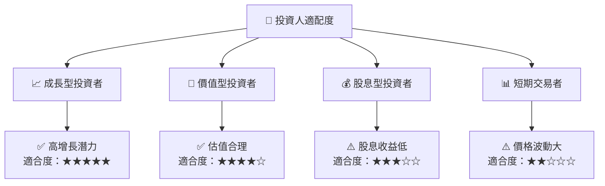

### 10.5 關鍵監控指標

| 監控類型 | 指標 | 關注點 | 頻率 |
|----------|------|--------|------|
| 財務指標 | 自由現金流 | 正向增長 | 季度 |
| 營運指標 | 市場份額 | 保持或增長 | 年度 |
| 技術指標 | AI技術突破 | 增強競爭力 | 半年 |
| 法規指標 | 符合性 | 法規變更影響 | 每月 |

---

> **免責聲明**：本報告為 AI 自動生成，僅供研究參考，不構成投資建議。投資有風險，入市需謹慎。