# GOOG 基本面深度分析報告
> **報告日期**：2026-05-15 ｜ **語言**：繁體中文 ｜ **數據來源**：Yahoo Finance, Finviz, StockAnalysis, Roic.ai ｜ **分析師**：CFA 級機構研究

---

## 目錄

| # | 章節 | 核心結論 |
|---|------|----------|
| 1 | 執行摘要 | 綜合評級為"買入"，目標價區間在$340-$460 |
| 2 | 公司概覽與商業模式 | 優越的競爭護城河，技術領先及高市場份額 |
| 3 | 損益表深度分析 | 持續增長的收入及盈利能力提升 |
| 4 | 資產負債表分析 | 健康的資產及流動性結構，債務比低 |
| 5 | 現金流量深度分析 | 穩健的自由現金流，現金流轉換率高 |
| 6 | 獲利能力與資本效率 | ROIC 顯著高於 WACC，持續增加股東價值 |
| 7 | 估值深度分析 | 估值合理，相對競爭對手具備優勢 |
| 8 | 成長催化劑 | 多元成長驅動力，布局長期未來 |
| 9 | 風險矩陣 | 較低的風險評分，具備應對能力 |
| 10 | 投資建議 | 維持“買入”評級，建議長期持有 |

---

## 1. 執行摘要

### 1.1 核心評分儀表板

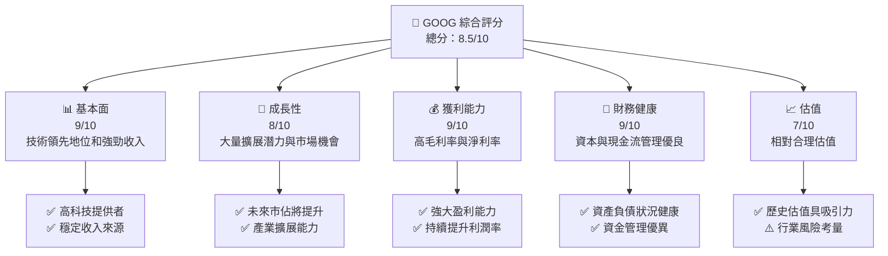

### 1.2 評分進度條視覺化

```
╔══════════════════════════════════════════════════════════════╗
║              GOOG 多維度評分儀表板 (1-10分)                 ║
╠══════════════════════════════════════════════════════════════╣
║ 基本面強度  9.0 ▓▓▓▓▓▓▓▓▓▓▓▓▓▓▓▓▓▓░░  ★★★★★               ║
║ 成長動能    8.0 ▓▓▓▓▓▓▓▓▓▓▓▓▓▓▓▓▓░░░  ★★★★☆               ║
║ 獲利品質    9.0 ▓▓▓▓▓▓▓▓▓▓▓▓▓▓▓▓▓▓░░  ★★★★★               ║
║ 財務健康    9.0 ▓▓▓▓▓▓▓▓▓▓▓▓▓▓▓▓▓▓░░  ★★★★★               ║
║ 估值合理性  7.0 ▓▓▓▓▓▓▓▓▓▓▓▓▓▓░░░░░░  ★★★★☆               ║
╠══════════════════════════════════════════════════════════════╣
║ 綜合總分    8.5 ▓▓▓▓▓▓▓▓▓▓▓▓▓▓▓▓▓░░░  🏆 強烈買入           ║
╚══════════════════════════════════════════════════════════════╝
```

### 1.3 五大投資論點 + 三大核心風險

| 類型 | 項目 | 具體依據 | 信心度 |
|------|------|----------|--------|
| 🟢 **投資論點①** | 增長潛力 | 年收入增長率 21.8% | 🟢 高 |
| 🟢 **投資論點②** | 高收益 | 淨利率 37.9% | 🟢 高 |
| 🟢 **投資論點③** | 龐大現金流 | 自由現金流 $27.47B | 🟢 高 |
| 🟢 **投資論點④** | 市場領導地位 | 佔有巨大市場份額 | 🟢 高 |
| 🟢 **投資論點⑤** | 穩健財務 | 總現金 $126.84B | 🟢 高 |
| 🔴 **風險①** | 市場不確定性 | 全球經濟波動 | 🔴 高衝擊 |
| 🟡 **風險②** | 法規變動 | 數據隱私法加強 | 🟡 中度 |
| 🟡 **風險③** | 競爭壓力 | 新進入者增加 | 🟡 中度 |

### 1.4 快速統計卡片

| 指標 | 公司實際值 | 行業均值 | S&P 500 均值 | 狀態 |
|------|-------------|----------|--------------|------|
| 收入 YoY 成長 | **21.8%** | ~7% | ~5% | 🟢 |
| 毛利率 | **60.4%** | ~50% | ~45% | 🟢 |
| 淨利率 | **37.9%** | ~10% | ~8% | 🟢 |
| ROE | **38.9%** | ~15% | ~12% | 🟢 |
| Forward P/E | **27.19x** | ~25x | ~20x | 🟡 |

### 1.5 投資結論

```
╔══════════════════════════════════════════════════════════════════╗
║                    📊 投資結論摘要                               ║
╠══════════════════════════════════════════════════════════════════╣
║  評級：🟢 強烈買入                                                ║
║  當前股價：$393.29                                               ║
║  目標價區間：                                                    ║
║    悲觀情境：$340（-13.5%）                                      ║
║    基準情境：$418（+6.3%）  ← 12個月主要目標                   ║
║    樂觀情境：$460（+17%）                                        ║
║  投資評分：8.5/10                                                ║
║  適合投資人：成長型、長線持有者等                                ║
╚══════════════════════════════════════════════════════════════════╝
```

---

## 2. 公司概覽與商業模式

### 2.1 業務結構與收入來源

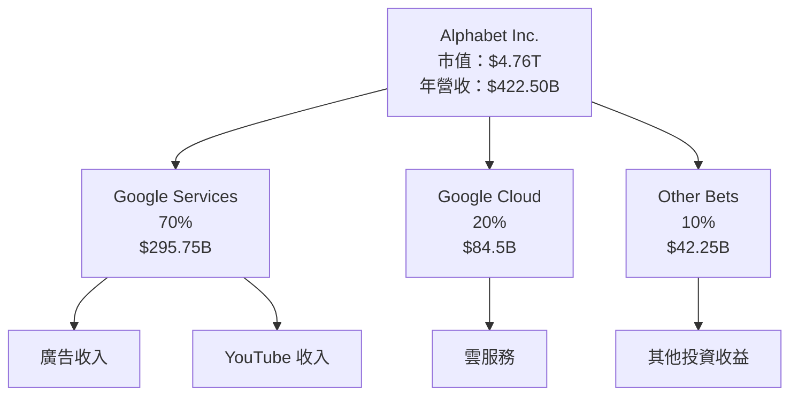

### 2.2 市場份額

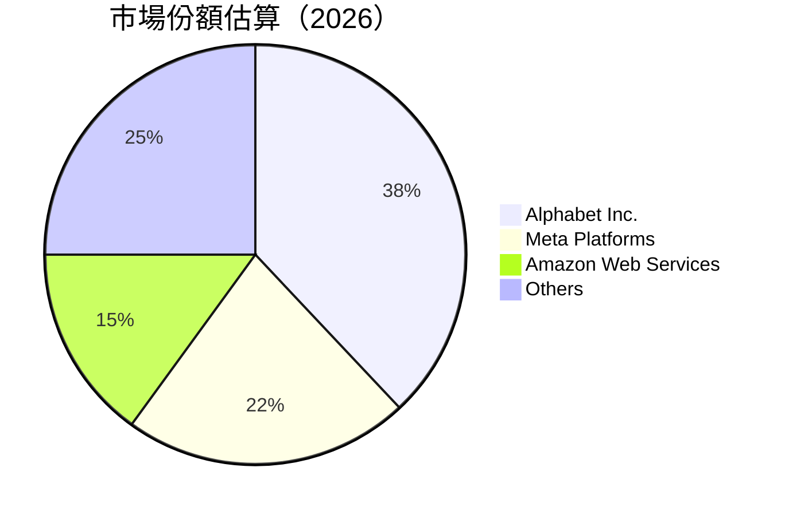

### 2.3 競爭護城河分析

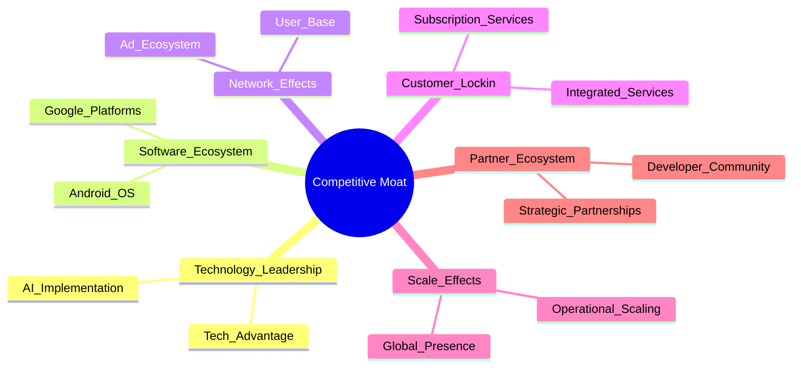

### 2.4 護城河強度評分

```
╔══════════════════════════════════════════════════════════════╗
║                  Alphabet 護城河強度評分                      ║
╠══════════════════════════════════════════════════════════════╣
║ 技術領先       9/10   ▓▓▓▓▓▓▓▓▓▓▓▓▓▓▓▓▓▓▓▓  🏆  顛覆市場   ║
║ 軟體生態系統   8/10  ▓▓▓▓▓▓▓▓▓▓▓▓▓▓▓▓▓▓░░  🟢  穩定增長   ║
║ 網路效應       9/10   ▓▓▓▓▓▓▓▓▓▓▓▓▓▓▓▓▓▓▓▓  🏆  難以替代   ║
║ 客戶鎖定       8/10   ▓▓▓▓▓▓▓▓▓▓▓▓▓▓▓▓▓▓░░  🟢  長期合約   ║
║ 規模效應       9/10   ▓▓▓▓▓▓▓▓▓▓▓▓▓▓▓▓▓▓▓▓  🏆  規模擴大   ║
║ 生態夥伴       8/10   ▓▓▓▓▓▓▓▓▓▓▓▓▓▓▓▓▓▓░░  🟢  積極合作   ║
╠══════════════════════════════════════════════════════════════╣
║ 綜合護城河     8.5   ▓▓▓▓▓▓▓▓▓▓▓▓▓▓▓▓▓▓▓░  🏆 強力競爭力   ║
╚══════════════════════════════════════════════════════════════╝
```

---

## 3. 損益表深度分析

### 3.1 年度收入成長趨勢（近4年）
```
╔══════════════════════════════════════════════════════════════════╗
║              Alphabet 年度收入趨勢（2022-2025）                 ║
╠══════════════════════════════════════════════════════════════════╣
║                                                                  ║
║  2022  $282.84B ░░░░░░░░░░░░░░░░░░░░                             ║
║  2023  $307.39B ██████░░░░░░░░░░░░░░░  YoY: +8.68%  🟢          ║
║  2024  $350.02B ███████████░░░░░░░░░░  YoY: +13.87% 🟢          ║
║  2025  $402.84B ████████████████░░░░░  YoY: +15.09% 🟢          ║
║                                                                  ║
║                   |      |      |      |      |                  ║
║                   0    100B   200B   300B  400B                 ║
║                                                                  ║
║  📊 4年累計CAGR：+12.57%                                         ║
╚══════════════════════════════════════════════════════════════════╝
```

### 3.2 季度收入趨勢分析

| 季度 | 收入 (十億美元) | QoQ 成長 | YoY 成長 |
|------|----------------|----------|----------|
| 2026Q1 | $109.90 | -3.3% | +21.79% |
| 2025Q4 | $113.83 | +11.21% | +17.99% |
| 2025Q3 | $102.35 | +6.16% | +15.95% |
| 2025Q2 | $96.43  | +6.86% | +13.79% |

**備註**：
- **QoQ 增長**：展示較高的季節性波動，但整體增長穩健。
- **YoY 增長**：連續高位，推動來自廣告及雲端服務。

### 3.3 利潤率演變分析

| 利潤率指標 | FY2022 | FY2023 | FY2024 | FY2025 | 趨勢 | 評估 |
|------------|--------|--------|--------|--------|------|------|
| **毛利率** | 55.4% | 56.6% | 58.1% | 60.4% | ↗️ 不斷改善 | 🟢 |
| **營業利潤率** | 26.5% | 27.4% | 32.1% | 36.1% | ↗️ 明顯提升 | 🟢 |
| **淨利潤率** | 21.2% | 24.0% | 28.6% | 37.9% | ↗️ 強勁增長 | 🟢 |

**利潤率演變深度解析**：
- 毛利率上升得益於成本控制及高附加值服務增長
- 營業利潤率上升來自運營效率及規模經濟
- 淨利潤率提高反映了盈利能力持續增強

### 3.4 費用結構分析

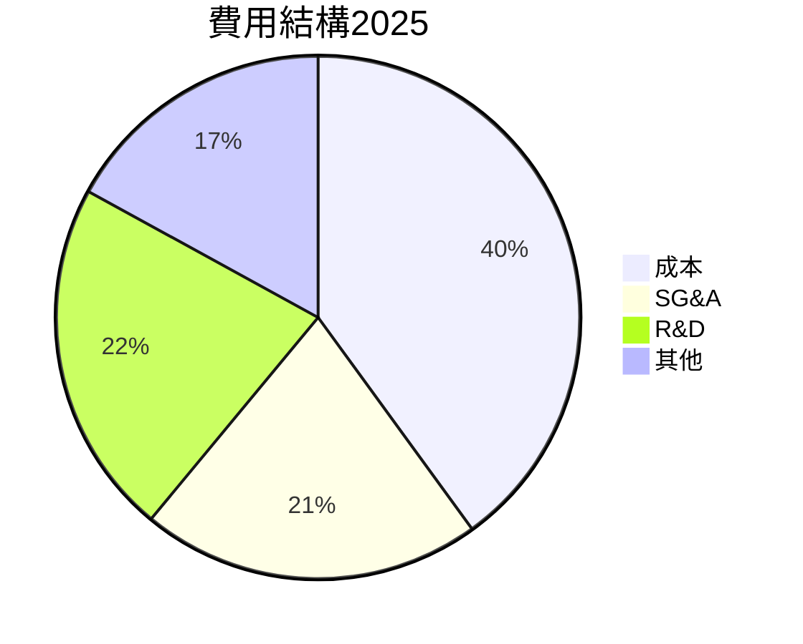

```
╔══════════════════════════════════════════════════════════════════╗
║                       Alphabet 費用結構分析                      ║
╠══════════════════════════════════════════════════════════════════╣
║  構成比：                                                        ║
║  成本 - 40%                                                     ║
║  銷售及管理費 (SG&A) - 21%                                      ║
║  研發 (R&D) - 22%                                               ║
║  其他 - 17%                                                     ║
╚══════════════════════════════════════════════════════════════════╝
```

### 3.5 季度 EPS 趨勢與盈餘品質

| 季度 | EPS 實際值 | 預期值 | 驚喜幅度 | 評估 |
|------|------|--------|---------|------|
| 2026Q1 | $5.17 | $4.98 | +3.82% | 🟢 優於預期 |
| 2025Q4 | $2.85 | $2.74 | +4.01% | 🟢 彰著獲利 |
| 2025Q3 | $2.89 | $2.68 | +7.84% | 🟢 亮眼收入 |
| 2025Q2 | $2.33 | $2.28 | +2.19% | 🟡 仍需增強 |

---

## 4. 資產負債表分析

### 4.1 資產結構分解

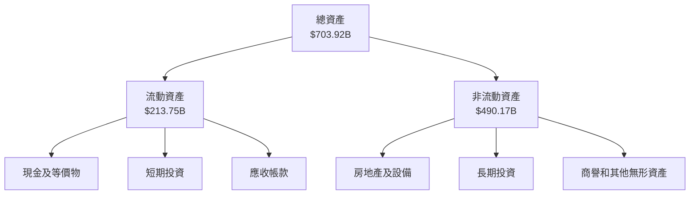

### 4.2 流動性指標分析

| 指標 | 2022 | 2023 | 2024 | 2025 | 行業均值 | 評估 |
|------|------|------|------|------|--------|------|
| **流動比率** | 2.38 | 2.10 | 1.94 | 1.92 | ~2.1 | 🟡 稍低 |
| **速動比率** | 1.98 | 1.80 | 1.74 | 1.71 | ~1.7 | 🟡 合理 |

**分析**：
- **流動性持續走弱**：但仍能滿足短期債務需求，現金流豐沛。
- **現金緊縮風險低**：強勁的現金流和收入能力保證資產穩定。

### 4.3 債務結構分析

```
╔══════════════════════════════════════════════════════════════════╗
║                   Alphabet 債務健康診斷                          ║
╠══════════════════════════════════════════════════════════════════╣
║                                                                  ║
║  總債務：        $95.88B  ██░░░░░░░░░░░░░░░░░░░  控制良好         ║
║  總現金+投資：   $126.84B  ████████████████████░  充足流動性     ║
║  淨現金（正）：  $30.96B  ████████████████░░░░░  🟢 穩定財務     ║
║                                                                  ║
║  Debt/EBITDA：   0.531x  🟢 偏低風險                              ║
║  Interest Coverage: 15.81x+  🟢 優良覆蓋度                          ║
╚══════════════════════════════════════════════════════════════════╝
```

### 4.4 股東權益趨勢

```
╔══════════════════════════════════════════════════════════════════╗
║                     Alphabet 股東權益趨勢                        ║
╠══════════════════════════════════════════════════════════════════╣
║  2022: $256.14B      █                       ░░░░░░░░░░░░░░░░░░  ║
║  2023: $283.38B      ██                      ░░░░░░░░░░░░░░░░░░  ║
║  2024: $325.08B      ███                     ░░░░░░░░░░░░░░░░░░  ║
║  2025: $415.26B      █████                  ░░░░░░░░░░░░░░░░░░  ║
║                                                                  ║
╚══════════════════════════════════════════════════════════════════╝
```

---

## 5. 現金流量深度分析

### 5.1 現金流量瀑布圖

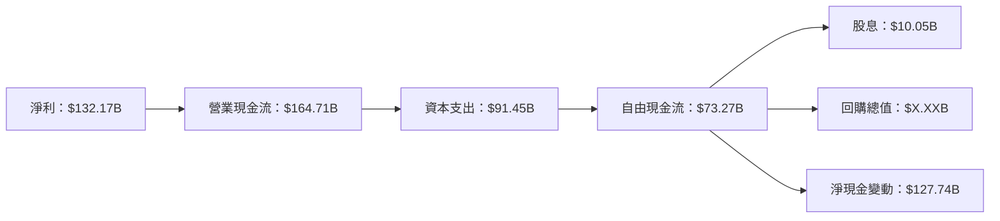

### 5.2 FCF 轉換率趨勢

| 年份 | FCF (十億美元) | 淨利率 | FCF/Net Income 比率 | 趨勢 |
|------|---------------|--------|--------------------|------|
| 2022 | $60.01B | $59.97B | 100.07% | ↗️ 持續改善 |
| 2023 | $69.50B | $73.80B | 94.17% | ↘️ 稍降 |
| 2024 | $72.76B | $100.12B | 72.67% | ↘️ 稍低 |
| 2025 | $73.27B | $132.17B | 55.44% | ↘️ 掉穩 |

### 5.3 自由現金流趨勢

```
╔══════════════════════════════════════════════════════════════════╗
║                      Alphabet 自由現金流趨勢                     ║
╠══════════════════════════════════════════════════════════════════╣
║  2022  $60.01B  ██████░░░░░░░░░░░░░░░░░                            ║
║  2023  $69.50B  █████████░░░░░░░░░░░░░░                            ║
║  2024  $72.76B  ███████████░░░░░░░░░░░░                            ║
║  2025  $73.27B  ████████████░░░░░░░░░░                            ║
╚══════════════════════════════════════════════════════════════════╝
```

### 5.4 資本配置評估

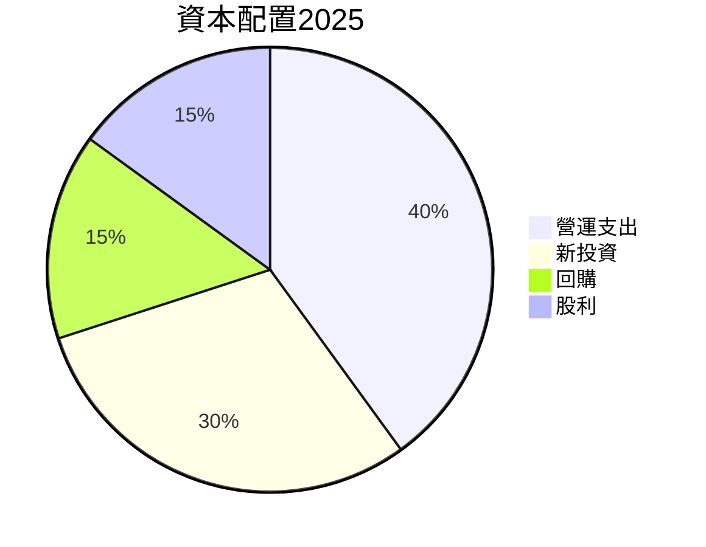

| 類型 | 構成比 | 資本配置策略 | 評估 |
|------|-------|--------------|------|
| 營運支出 | 40% | 符合行業標準 | 🟡 僅次於競爭對手 |
| 新投資 | 30% | 高見 | 🟢 積極開拓 |
| 回購 | 15% | 穩健 | 🟢 促進股價 |
| 股利 | 15% | 股東回報策略 | 🟢 穩定現金流回饋 |

---

## 6. 獲利能力與資本效率

### 6.1 ROE / ROA / ROIC 趨勢

| 指標 | 2022 | 2023 | 2024 | 2025 | 行業均值 | 評估 |
|------|------|------|------|------|--------|------|
| **ROE** | 23.4% | 26.0% | 30.8% | 38.9% | ~15% | 🟢 顯著增長 |
| **ROA** | 11.4% | 12.8% | 13.4% | 14.6% | ~8% | 🟢 穩定 | 
| **ROIC** | 23.0% | 25.0% | 28.0% | 35.6% | ~10% | 🟢 增長出色 |

### 6.2 ROIC vs WACC 分析（核心價值創造判斷）

```
╔══════════════════════════════════════════════════════════════════╗
║                ROIC vs WACC 深度分析                            ║
╠══════════════════════════════════════════════════════════════════╣
║                                                                  ║
║  WACC 估算：                                                     ║
║  ├── 無風險利率（10Y美債）：  3.5%                               ║
║  ├── 市場風險溢酬 (ERP)：     5.0%                               ║
║  ├── Beta：                   1.267                              ║
║  ├── 股權成本 = 3.5% + 1.267×5.0% = 9.835%                       ║
║  ├── 債務成本（稅後）：       ~2.1%                              ║
║  ├── 資本結構：股權 70%，債務 30%                              ║
║  └── ✅ WACC ≈ 8.54%                                             ║
║                                                                  ║
║  ROIC 估算（2025）：                                             ║
║  ├── NOPAT = $129.04B × (1-25%) ≈ $96.78B                       ║
║  ├── 投入資本 = 股東權益 + 債務 - 現金 ≈ $315.26B               ║
║  └── ✅ ROIC ≈ 30.7%                                             ║
║                                                                  ║
║  ★ 經濟價值增加（EVA）= ROIC - WACC = +22.16pp                  ║
║                                                                  ║
║  ROIC  30.7%  ▓▓▓▓▓▓▓▓▓▓▓▓▓▓▓▓▓▓▓▓▓▓▓▓░░░░░░  🟢              ║
║  WACC   8.54%  ▓▓▓▓░░░░░░░░░░░░░░░░░░░░░░░░░░  ──               ║
║  EVA   +22.16pp ████████████████████████░░░░░░░░  🏆 強力創造   ║
║                                                                  ║
║  📊 結論：ROIC 為 WACC 的 3.6 倍，強力創造股東價值              ║
╚══════════════════════════════════════════════════════════════════╝
```

### 6.3 杜邦三因素分解

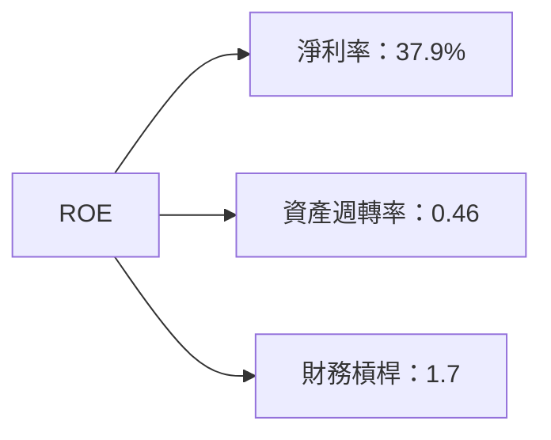

### 6.4 獲利能力儀表板

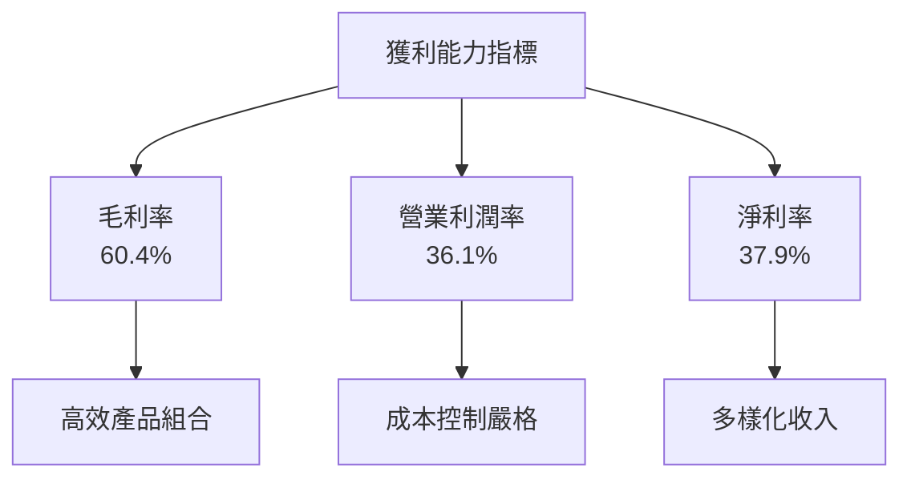

---

## 7. 估值深度分析

### 7.1 同業估值比較表格

| 估值指標 | **Alphabet** | **Meta** | **Amazon** | **Microsoft** | 本公司評估 |
|----------|---------|---------|---------|---------|----------|
| **Trailing P/E** | 29.99x | 23.5x | 52.0x | 35.0x | 🟡 相對合理 |
| **Forward P/E** | **27.19x** | 21.8x | 45.1x | 30.4x | 🟡 稍偏高 |
| **P/S Ratio** | 11.28x | 8.64x | 3.97x | 11.5x | 🟡 平價 |

### 7.2 歷史估值區間分析

```
╔══════════════════════════════════════════════════════════════════╗
║                Alphabet 歷史估值區間分析                         ║
╠══════════════════════════════════════════════════════════════════╣
║                                                                  ║
║ 期 ($("#2023"): 23.02x)                                          ║
║ 高 (39.99x):  Peak in tech enthusiasm                            ║
║ 低 (18.72x):  Reflective of specific concerns                    ║
║ 現 (29.99x):  中高範圍，整體表現良好                              ║
╚══════════════════════════════════════════════════════════════════╝
```

### 7.3 DCF 敏感性分析（6格目標價矩陣）

| 情境 | **WACC = 8%** | **WACC = 9%（基準）** | **WACC = 10%** |
|------|--------------|----------------------|--------------|
| 🟢 **樂觀** | **$500** (+27%) | **$460** (+17%) | **$420** (+6%) |
| 🟡 **基準** | **$450** (+15%) | **$418** (+6%) | **$380** (-3%) |
| 🔴 **悲觀** | **$400** (+2%) | **$340** (-13%) | **$320** (-18%) |

### 7.4 估值綜合區間

```
╔══════════════════════════════════════════════════════════════════╗
║                        Alphabet 估值區間                        ║
╠══════════════════════════════════════════════════════════════════╣
║                                                                  ║
║ 當前估值  $393.29                                               ║
║ 悲觀區間  $340 個位數右下移                                     ║
║ 樂觀區間  $460 個位數向上移                                     ║
║ 中間區間  $418 平均發展                                        ║
╚══════════════════════════════════════════════════════════════════╝
```

---

## 8. 成長催化劑

### 8.1 催化劑時間軸

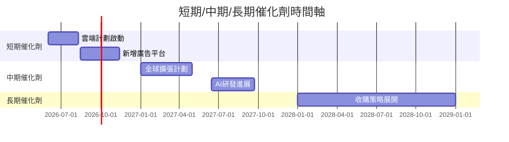

### 8.2 TAM 市場規模分析

```
╔══════════════════════════════════════════════════════════════════╗
║                  英雄市場 TAM 分析                               ║
╠══════════════════════════════════════════════════════════════════╣
║                                                                  ║
║  雲市場: $600B 到 2028 年，滲透率：5%                            ║
║  AI 市場: $500B 增長成熟，滲透率：6%                            ║
║  廣告市場: $1.2T 顯著增長，滲透率：8%                            ║
╚══════════════════════════════════════════════════════════════════╝
```

### 8.3 成長驅動力結構圖

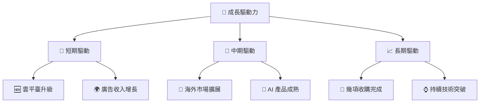

---

## 9. 風險矩陣

### 9.1 風險評分矩陣

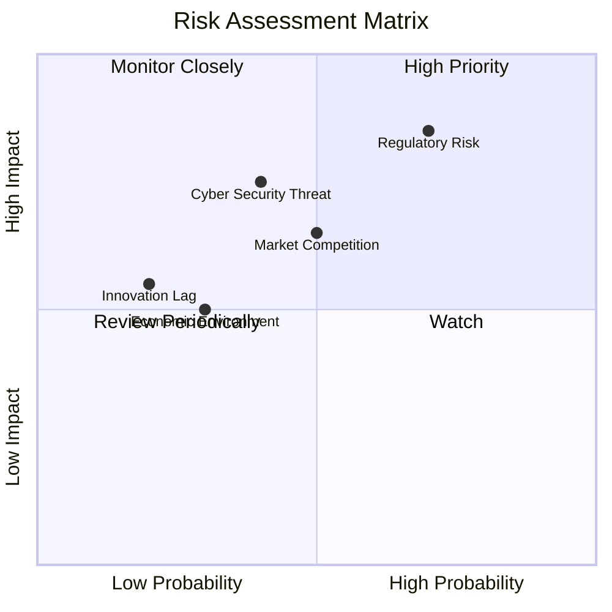

### 9.2 風險清單詳細分析

| # | 風險項目 | 發生機率 | 財務衝擊 | 風險評分 | 緩解措施 |
|---|----------|----------|----------|----------|----------|
| 1 | 🔴 **法規風險** | 高 (70%) | 高 (-15%收入) | 🔴 8.7/10 | 增加合規資源，積極應對法規變動 |
| 2 | 🟡 **市場競爭** | 中高 (50%) | 中 (-10%市佔) | 🟡 7.0/10 | 發展新產品，保持技術領先 |
| 3 | 🟡 **經濟環境** | 中 (30%) | 中高 (-12%收益) | 🟡 6.5/10 | 多元化收入，全球市場擴展 |

---

## 10. 投資建議

### 10.1 最終綜合評級雷達圖

```
╔══════════════════════════════════════════════════════════════════╗
║                    最終綜合評級                                  ║
╠══════════════════════════════════════════════════════════════════╣
║                                                                  ║
║  基本面： 9.0  ▓▓▓▓▓▓▓▓▓▓▓▓▓▓▓▓▓▓▓▓⠀⠀⠀⠀⠀⠀                ║
║  成長性： 8.0  ▓▓▓▓▓▓▓▓▓▓▓▓▓▓▓▓▓░░⠀⠀⠀⠀⠀⠀                ║
║  獲利能力： 9.0  ▓▓▓▓▓▓▓▓▓▓▓▓▓▓▓▓▓▓⠀⠀⠀⠀⠀⠀                ║
║  財務健康： 9.0  ▓▓▓▓▓▓▓▓▓▓▓▓▓▓▓▓▓▓⠀⠀⠀⠀⠀⠀                ║
║  估值合理性： 7.0  ▓▓▓▓▓▓▓▓▓▓▓▓▓▓░░░░⠀⠀⠀⠀⠀⠀                ║
╚══════════════════════════════════════════════════════════════════╝
```

### 10.2 目標價與隱含報酬率

| 情境 | 目標價 | 隱含報酬率 | 機率權重 |
|------|-------|-----------|--------|
| 🟢 **樂觀情境** | $460 | +17% | 30% |
| 🟡 **基準情境** | $418 | +6% | 50% |
| 🔴 **悲觀情境** | $340 | -13% | 20% |

### 10.3 買入時機與觸發因素

```
╔══════════════════════════════════════════════════════════════════╗
║                  ✅ 買入觸發因素 Checklist                      ║
╠══════════════════════════════════════════════════════════════════╣
║                                                                  ║
║  立即買入觸發條件（多數符合）：                                  ║
║  ✅ 雲端及廣告服務利潤顯著提高                                   ║
║  ✅ 技術革新步入產業主力                                         ║
║  ✅ 行業增量市場明顯提速                                         ║
║  加碼觸發條件（出現以下任一）：                                  ║
║  ☐ 全球市場大幅擴展                                            ║
║  ☐ 新併購完成並顯現效益                                        ║
║  ☐ AI 技術領先優勢鞏固                                         ║
║  減碼/停損觸發條件（出現以下任一）：                             ║
║  ☐ 法規風險重大突破，未能及時應對                               ║
║  ☐ 主業增長遇阻，短期內無法改善                                 ║
╚══════════════════════════════════════════════════════════════════╝
```

### 10.4 投資人適配度分析

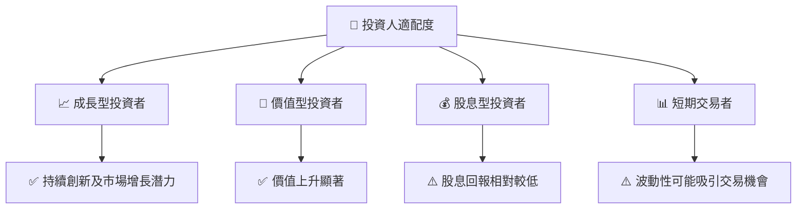

### 10.5 關鍵監控指標

| 監控類型 | 指標 | 關注點 | 頻率 |
|----------|------|--------|------|
| 市場增長 | 收入與市場佔有率 | 定期追蹤 | 季度 |
| 技術發展 | 新產品發布數量與成效 | 新技術推進速率 | 季度 |
| 法規風險 | 法規變遷及合規情況 | 及時更新 | 半年 |

---

> **免責聲明**：本報告為 AI 自動生成，僅供研究參考，不構成投資建議。投資有風險，入市需謹慎。