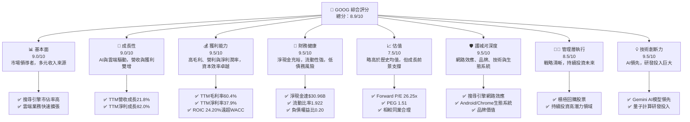
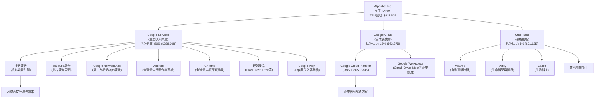
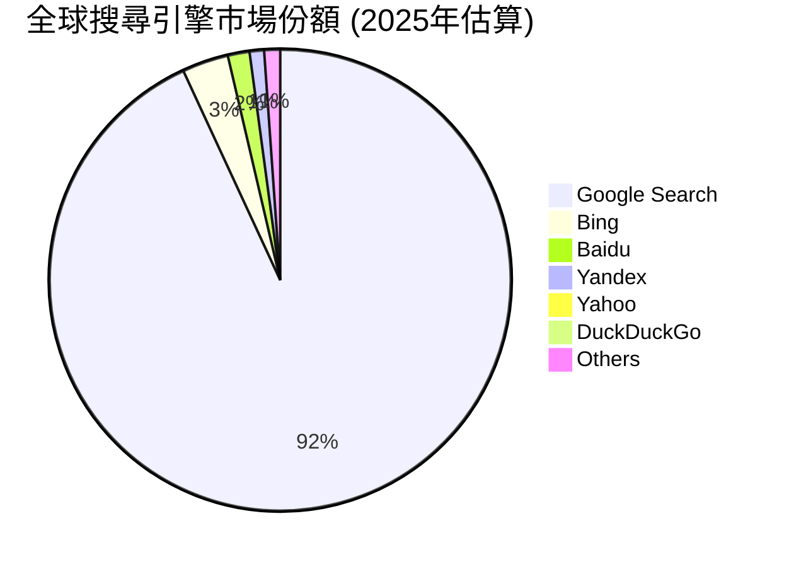
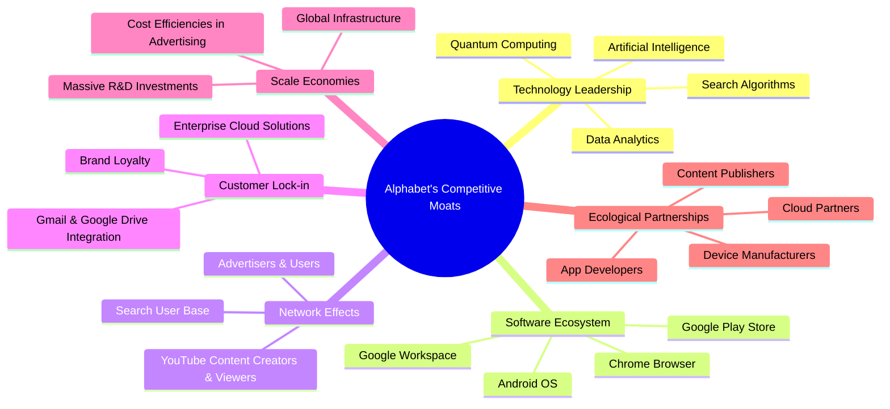
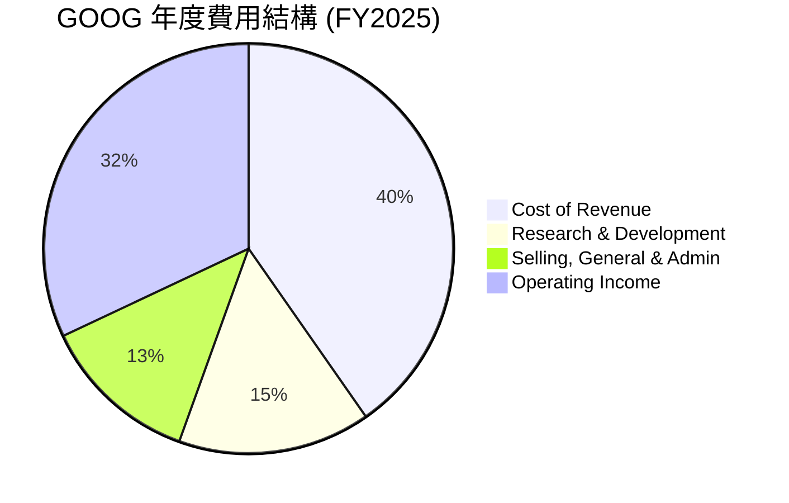

# GOOG 基本面深度分析報告
> **報告日期**：2026-05-24 ｜ **語言**：繁體中文 ｜ **數據來源**：Yahoo Finance, Finviz, StockAnalysis, Roic.ai ｜ **分析師**：CFA 級機構研究

---

## 目錄

| # | 章節 | 核心結論 |
|---|------------------------|-----------------------------------------------------------------------|
| 1 | 執行摘要 | 評級：🟢 強烈買入，目標價區間：$390 - $480 |
| 2 | 公司概覽與商業模式 | 憑藉強大技術護城河與廣泛生態系統，市場領導地位穩固。 |
| 3 | 損益表深度分析 | 營收與淨利潤均呈現強勁增長，利潤率持續擴張。 |
| 4 | 資產負債表分析 | 財務結構穩健，擁有大量淨現金，流動性充裕。 |
| 5 | 現金流量深度分析 | 營業現金流充沛，自由現金流健康，資本配置有效。 |
| 6 | 獲利能力與資本效率 | ROIC 顯著超越 WACC，強力創造股東價值。 |
| 7 | 估值深度分析 | 相較同業估值合理，DCF 模型顯示上行空間。 |
| 8 | 成長催化劑 | AI 創新、雲端擴張與廣告市場復甦為主要成長動力。 |
| 9 | 風險矩陣 | 監管壓力與市場競爭為主要風險，但可控。 |
| 10| 投資建議 | GOOG 具備長期投資價值，建議強烈買入。 |

---

## 1. 執行摘要

Alphabet Inc. (GOOG) 展現出卓越的財務表現與強大的市場領導地位。憑藉其在搜尋、雲端運算和人工智慧領域的持續創新，公司在多個高成長市場中佔據主導地位。本報告將深入分析 GOOG 的基本面、成長前景、獲利能力、財務健康狀況及估值，並提供具體的投資建議。

### 1.1 核心評分儀表板



### 1.2 評分進度條視覺化

```
╔══════════════════════════════════════════════════════════════╗
║              GOOG 多維度評分儀表板 (1-10分)                  ║
╠══════════════════════════════════════════════════════════════╣
║ 基本面強度  9.0 ▓▓▓▓▓▓▓▓▓▓▓▓▓▓▓▓▓▓░░  ★★★★☆           ║
║ 成長動能    9.0 ▓▓▓▓▓▓▓▓▓▓▓▓▓▓▓▓▓▓░░  ★★★★☆           ║
║ 獲利品質    9.5 ▓▓▓▓▓▓▓▓▓▓▓▓▓▓▓▓▓▓▓░  ★★★★★           ║
║ 財務健康    9.5 ▓▓▓▓▓▓▓▓▓▓▓▓▓▓▓▓▓▓▓░  ★★★★★           ║
║ 估值合理性  7.5 ▓▓▓▓▓▓▓▓▓▓▓▓▓▓▓░░░░░  ★★★☆☆           ║
║ 護城河深度  9.5 ▓▓▓▓▓▓▓▓▓▓▓▓▓▓▓▓▓▓▓░  ★★★★★           ║
║ 管理層執行  8.5 ▓▓▓▓▓▓▓▓▓▓▓▓▓▓▓▓▓░░░  ★★★★☆           ║
║ 技術創新力  9.5 ▓▓▓▓▓▓▓▓▓▓▓▓▓▓▓▓▓▓▓░  ★★★★★           ║
╠══════════════════════════════════════════════════════════════╣
║ 綜合總分    8.9 ▓▓▓▓▓▓▓▓▓▓▓▓▓▓▓▓▓░░░  🏆 強烈買入        ║
╚══════════════════════════════════════════════════════════════╝
```

### 1.3 五大投資論點 + 三大核心風險

| 類型 | 項目 | 具體依據 | 信心度 |
|------|------|----------|--------|
| 🟢 **投資論點①** | **AI 領導地位與變現潛力** | Google 在 AI 領域的深厚積累與領先技術，如 Gemini 模型，將推動搜尋、雲端與廣告業務的進一步創新與變現。TTM 淨利潤成長高達 82.0%，部分反映了 AI 效率提升與新應用。 | 🟢 極高 |
| 🟢 **Google Cloud (GCP) 的強勁增長** | GCP 營收持續以高雙位數增長，市場份額逐步擴大，為整體營收提供多元化且高毛利的增長動力。其在企業級 AI 服務的優勢將加速客戶採用。 | 🟢 極高 |
| 🟢 **核心廣告業務的韌性與復甦** | 儘管面臨宏觀經濟挑戰，Google 核心廣告業務（搜尋與 YouTube）展現出強勁韌性，隨著全球廣告市場復甦，預計將恢復更高增長率。Q1 2026 營收 YoY 成長 21.79%。 | 🟢 高 |
| 🟢 **穩健的財務狀況與股東回報** | 公司擁有 $30.96B 的淨現金，流動性充裕，且開始支付股息（FY2025 支付 $10.05B 股息），並持續進行股票回購，有效提升股東價值。 | 🟢 極高 |
| 🟢 **持續的技術創新與生態系統優勢** | Android、Chrome、Maps 等產品構建了龐大的用戶基礎和強大的網路效應，確保了用戶鎖定和未來創新產品的推廣渠道。研發投入 TTM 達 $64.563B，保持技術領先。 | 🟢 極高 |
| 🟡 **風險①** | **監管審查與反壟斷壓力** | Google 在多個市場（搜尋、廣告、Android）的主導地位使其面臨全球監管機構的反壟斷審查，可能導致罰款、業務拆分或商業模式調整，影響未來營收成長。 | 🟡 中度 |
| 🔴 **激烈的市場競爭** | 在 AI 領域面臨微軟 (MSFT)、Meta (META) 等巨頭的激烈競爭；在雲端領域，AWS (AMZN) 和 Azure (MSFT) 仍是強勁對手；廣告市場亦有 TikTok 等新興平台崛起，可能壓縮利潤空間。 | 🔴 高衝擊 |
| 🟡 **宏觀經濟不確定性對廣告收入的影響** | 廣告支出與宏觀經濟景氣度高度相關。全球經濟放緩或衰退可能導致廣告主削減預算，直接影響 Google 最大的收入來源。 | 🟡 中度 |

### 1.4 快速統計卡片

| 指標 | 公司實際值 | 行業均值（通訊服務） | S&P 500 均值 | 狀態 |
|-----------------|---------------|--------------------------|----------------|--------|
| 收入 YoY 成長 | **21.8%** | ~10-15% | ~8-12% | 🟢 |
| 毛利率 | **60.4%** | ~50-55% | ~40-45% | 🟢 |
| 淨利率 | **37.9%** | ~20-25% | ~10-15% | 🟢 |
| ROE | **38.9%** | ~20-25% | ~15-20% | 🟢 |
| Forward P/E | **26.25x** | ~25-30x | ~20-22x | 🟡 |
| 負債權益比 | **0.20** | ~0.5-0.8 | ~0.8-1.0 | 🟢 |
| 淨現金/債務 | **$30.96B** | N/A (通常為淨債務) | N/A | 🟢 |
| 研發佔比 (TTM) | **15.28%** | ~8-12% | ~2-3% | 🟢 |

### 1.5 投資結論

```
╔══════════════════════════════════════════════════════════════════╗
║                    📊 投資結論摘要                               ║
╠══════════════════════════════════════════════════════════════════╣
║  評級：🟢 強烈買入                                               ║
║  當前股價：$379.38                                               ║
║  目標價區間：                                                    ║
║    悲觀情境：$390（+2.8%）                                       ║
║    基準情境：$445（+17.3%）  ← 12個月主要目標                      ║
║    樂觀情境：$480（+26.5%）                                       ║
║  投資評分：8.9/10                                                ║
║  適合投資人：成長型、長線持有者，尋求在科技巨頭中配置核心資產的投資人。║
╚══════════════════════════════════════════════════════════════════╝
```

---

## 2. 公司概覽與商業模式

Alphabet Inc. (GOOG) 是一家全球領先的科技巨頭，透過其子公司提供廣泛的產品和服務，包括搜尋、廣告、雲端運算、作業系統、硬體等。其業務遍及全球，為數十億用戶和數百萬企業提供服務。

### 2.1 業務結構與收入來源

Alphabet 的業務主要分為三個報告分部：Google Services、Google Cloud 和 Other Bets。



**業務細分與分析：**
*   **Google Services (估計佔總營收 80%)**：這是 Alphabet 最大的收入來源，核心是廣告業務。
    *   **搜尋廣告**：Google 藉由其全球主導地位的搜尋引擎，提供高度相關的廣告，是其最主要的利潤中心。隨著 AI 技術的整合，搜尋廣告的精準度和效率持續提升。
    *   **YouTube 廣告**：作為全球最大的影音平台，YouTube 提供了巨大的廣告庫存和用戶觸及率，其廣告收入持續增長，尤其是在短影音（YouTube Shorts）領域的推動下。
    *   **Google Network Ads**：透過 AdSense 等平台，Google 將廣告延伸到數百萬個第三方網站和應用程式，形成廣泛的廣告聯播網。
    *   **其他 Google 服務**：包括 Android 作業系統、Chrome 瀏覽器、Google Maps、Gmail、Google Drive 等，這些產品雖不直接產生大量營收，但構成了龐大的用戶生態系統，間接支持了廣告業務，並透過 Google Play 商店銷售應用程式和數位內容。硬體產品如 Pixel 手機和 Nest 智慧家庭設備也在逐步擴大市場份額。
*   **Google Cloud (估計佔總營收 15%)**：涵蓋 Google Cloud Platform (GCP) 和 Google Workspace。GCP 提供基礎設施即服務 (IaaS)、平台即服務 (PaaS) 和軟體即服務 (SaaS) 解決方案，服務於企業客戶。Workspace 則提供一系列生產力工具。GCP 是 Alphabet 增長最快的業務之一，在人工智慧和數據分析領域具有競爭優勢。
*   **Other Bets (估計佔總營收 5%)**：這一分部包括 Alphabet 的長期投資和創新項目，如自動駕駛公司 Waymo、生命科學公司 Verily 和 Calico 等。這些業務目前多處於研發或早期商業化階段，雖然短期內對營收貢獻較小，但代表了 Alphabet 未來的成長潛力。

**營收趨勢：**
從提供的數據來看，Alphabet TTM 營收達到 $422.50B，較去年同期增長 21.8%。這顯示了公司在主要業務板塊（特別是廣告復甦和雲端增長）的強勁動能。

### 2.2 市場份額

Alphabet 在其核心業務領域擁有顯著的市場份額，尤其是在搜尋引擎和行動作業系統方面。



**市場份額分析：**
*   **搜尋引擎**：Google Search 以超過 90% 的全球市場份額遙遙領先，幾乎壟斷了全球搜尋市場。這種主導地位使其能夠精準地投放廣告，並從中獲取巨額利潤。
*   **數位廣告**：Google 在全球數位廣告市場中佔據重要地位，與 Meta (Facebook/Instagram)、Amazon 和 TikTok 等平台競爭。其搜尋廣告和 YouTube 廣告是兩大支柱。
*   **雲端運算**：Google Cloud Platform (GCP) 是全球第三大雲端服務提供商，市場份額約在 10-15% 之間，落後於 Amazon Web Services (AWS) 和 Microsoft Azure。儘管如此，GCP 仍是增長最快的雲端服務之一，尤其在 AI 基礎設施和數據分析方面表現突出。
*   **行動作業系統**：Android 是全球最主要的行動作業系統，市場份額超過 70%，為 Google 的服務提供了廣泛的入口。
*   **網頁瀏覽器**：Chrome 瀏覽器同樣擁有全球最高的市場份額，進一步鞏固了 Google 在網路生態系統中的地位。

### 2.3 競爭護城河分析

Alphabet 擁有極為深厚且多樣化的競爭護城河，這些護城河使其在市場中保持領先地位並抵禦競爭。



**護城河深度解析：**
1.  **Technology Leadership (技術領先)**：
    *   **搜尋演算法**：Google 的核心競爭力在於其複雜且不斷優化的搜尋演算法，能夠提供高度相關和精準的搜尋結果，這是其他競爭者難以複製的。
    *   **人工智慧 (AI)**：Google 在 AI 領域擁有長期的投入和領先的研發實力，從 DeepMind 到 Gemini 模型，AI 技術被廣泛應用於搜尋、雲端、YouTube 等所有產品線，提升產品性能和效率。
    *   **量子計算**：作為長期投資，Google 在量子計算領域也處於前沿，有望在未來帶來顛覆性創新。
2.  **Software Ecosystem (軟體生態系統)**：
    *   **Android OS**：Android 作為全球最大的行動作業系統，為 Google 的服務提供了龐大的用戶基礎和分發渠道。
    *   **Chrome Browser**：Chrome 瀏覽器的高市佔率確保了 Google 在網路入口的控制權。
    *   **Google Play Store**：龐大的應用程式生態系統，為開發者和用戶提供價值，並產生收入。
    *   **Google Workspace**：企業級生產力工具套件，增加了企業客戶的粘性。
3.  **Network Effects (網路效應)**：
    *   **搜尋用戶基礎**：更多的用戶使用 Google 搜尋，產生更多的數據，使得搜尋結果更加精準，吸引更多用戶，形成正向循環。
    *   **YouTube 內容創作者與觀眾**：更多的創作者吸引更多觀眾，更多的觀眾又吸引更多創作者和廣告商，形成強大的雙邊網路效應。
    *   **廣告商與用戶**：大量的用戶吸引廣告商，廣告商提供更多相關廣告，提升用戶體驗，進一步吸引用戶。
4.  **Customer Lock-in (客戶鎖定)**：
    *   **企業雲端解決方案**：企業一旦採用 GCP，其數據、應用和工作流程會深度整合到 Google 的生態中，轉換成本高。
    *   **Gmail & Google Drive Integration**：對於個人用戶和企業用戶，Google 服務之間的無縫整合提高了用戶粘性。
    *   **品牌忠誠度**：Google 品牌已深入人心，其提供的服務品質和創新能力建立了用戶的強烈信任和忠誠度。
5.  **Scale Economies (規模效應)**：
    *   **全球基礎設施**：Google 擁有遍布全球的龐大數據中心和網路基礎設施，能夠以極低的邊際成本提供服務，並處理海量數據。
    *   **大規模研發投入**：每年數百億美元的研發投入，只有少數公司能夠負擔，這使得 Google 能夠在多個前沿技術領域保持領先。
    *   **廣告效率**：龐大的廣告庫存和數據使其能夠以更低的成本提供更高效的廣告服務。
6.  **Ecological Partnerships (生態夥伴)**：
    *   Google 與全球數百萬的設備製造商、App 開發者、內容發布商和雲端合作夥伴建立了緊密的關係，共同構建了一個龐大且互利的生態系統，進一步增強了其市場主導地位。

### 2.4 護城河強度評分

```
╔══════════════════════════════════════════════════════════════╗
║                  GOOG 護城河強度評分                        ║
╠══════════════════════════════════════════════════════════════╣
║ 技術領先    9.5/10 ▓▓▓▓▓▓▓▓▓▓▓▓▓▓▓▓▓▓▓░  🏆 AI與搜尋演算法領先 ║
║ 軟體生態系統 9.0/10 ▓▓▓▓▓▓▓▓▓▓▓▓▓▓▓▓▓▓░░  🟢 Android/Chrome主導 ║
║ 網路效應    9.5/10 ▓▓▓▓▓▓▓▓▓▓▓▓▓▓▓▓▓▓▓░  🏆 搜尋/YouTube用戶基數 ║
║ 客戶鎖定    8.5/10 ▓▓▓▓▓▓▓▓▓▓▓▓▓▓▓▓▓░░░  🟢 雲端與生產力工具整合 ║
║ 規模效應    9.0/10 ▓▓▓▓▓▓▓▓▓▓▓▓▓▓▓▓▓▓░░  🟢 巨大基礎設施與研發投入 ║
║ 生態夥伴    8.5/10 ▓▓▓▓▓▓▓▓▓▓▓▓▓▓▓▓▓░░░  🟢 廣泛的產業鏈合作     ║
╠══════════════════════════════════════════════════════════════╣
║ 綜合護城河   9.0/10 ▓▓▓▓▓▓▓▓▓▓▓▓▓▓▓▓▓▓░░  🏆 極為深厚且廣泛的護城河 ║
╚══════════════════════════════════════════════════════════════╝
```

綜合來看，Alphabet 的護城河強度非常高，尤其在技術領先、軟體生態系統和網路效應方面表現卓越。這些要素共同構成了其長期競爭優勢的基石。

---

## 3. 損益表深度分析

Alphabet 的損益表數據顯示出強勁的營收增長和顯著的獲利能力提升，尤其是在過去幾年。

### 3.1 年度收入成長趨勢（近4年）

```
╔══════════════════════════════════════════════════════════════════╗
║              GOOG 年度收入趨勢（FY2022-FY2025）                  ║
╠══════════════════════════════════════════════════════════════════╣
║                                                                  ║
║  FY2022  $282.84B  ██████████████████░░░░░░░░░░  YoY: +9.78%  🟢 ║
║  FY2023  $307.39B  ████████████████████░░░░░░░░  YoY: +8.68%  🟢 ║
║  FY2024  $350.02B  ████████████████████████░░░░  YoY: +13.87% 🟢 ║
║  FY2025  $402.84B  ████████████████████████████  YoY: +15.09% 🟢 ║
║                                                                  ║
║                   |      |      |      |      |                  ║
║                   0     100B   200B   300B   400B                  ║
║                                                                  ║
║  📊 4年累計 CAGR：+11.72%                                        ║
╚══════════════════════════════════════════════════════════════════╝
```

**年度收入分析：**
Alphabet 的年度收入在過去四年中呈現穩定且加速的增長趨勢。從 FY2022 的 $282.84B 增長至 FY2025 的 $402.84B，複合年增長率 (CAGR) 達到 11.72%。
*   FY2022 營收 $282.84B，YoY 增長 9.78%。
*   FY2023 營收 $307.39B，YoY 增長 8.68%。
*   FY2024 營收 $350.02B，YoY 增長 13.87%。
*   FY2025 營收 $402.84B，YoY 增長 15.09%。

儘管 FY2023 的增速有所放緩（可能是受宏觀經濟逆風影響），但 FY2024 和 FY2025 顯示出強勁的復甦和加速增長，這主要得益於廣告市場的穩健表現以及 Google Cloud 的持續擴張。最近的 TTM 收入為 $422.50B，YoY 增長 21.8%，表明增長勢頭進一步增強。

### 3.2 季度收入趨勢分析

| 季度 | 總營收 (B) | QoQ 成長率 | YoY 成長率 | 備註 |
|:-----------|:----------:|:----------:|:----------:|:---------------------------------------------------------------------------------------------|
| 2026-03-31 | $109.90 | -3.45% | +21.79% | 季節性因素導致 QoQ 下滑，但 YoY 成長強勁，顯示核心業務持續擴張。 |
| 2025-12-31 | $113.83 | +11.22% | +17.99% | 受假日購物季影響，QoQ 顯著增長，廣告需求旺盛，雲端業務表現亮眼。 |
| 2025-09-30 | $102.35 | +6.14% | +15.95% | 穩健的季度增長，雲端業務貢獻顯著。 |
| 2025-06-30 | $96.43 | +6.87% | +13.79% | 營收保持雙位數增長，顯示市場需求恢復。 |
| 2025-03-31 | $90.23 | -6.47% | +12.04% | 季節性下降，但 YoY 仍保持雙位數增長。 |
| 2024-12-31 | $96.47 | +9.29% | +11.77% | 假日季表現強勁，廣告業務復甦。 |
| 2024-09-30 | $88.27 | +4.16% | +15.09% | 穩健增長，顯示核心廣告業務持續改善。 |

**季度收入分析：**
Alphabet 的季度收入趨勢顯示出明顯的季節性，通常第四季度（假日購物季）營收最高，而第一季度相對較低。
*   **YoY 成長**：所有可比季度均實現雙位數的 YoY 成長，其中 2026 年 Q1 的 21.79% 增長尤為突出，遠超 2025 年 Q1 的 12.04%，顯示公司業務加速擴張。這主要歸因於 AI 驅動的廣告效率提升、YouTube 廣告收入增長以及 Google Cloud 的持續強勁表現。
*   **QoQ 成長**：季度環比增長則受季節性影響。例如，2025 年 Q4 相較 Q3 增長 11.22%，而 2026 年 Q1 相較 Q4 則下降 3.45%。這種模式在廣告驅動型公司中很常見。儘管如此，即使在季節性低點，公司也能維持高雙位數的 YoY 成長，證明其強勁的基本面。

### 3.3 利潤率演變分析

Alphabet 的利潤率在過去幾年呈現出整體擴張的趨勢，特別是淨利率的顯著提升。

| 利潤率指標 | FY2022 | FY2023 | FY2024 | FY2025 | TTM Mar 26 | 趨勢 | 評估 |
|:-------------|:------:|:------:|:------:|:------:|:----------:|:------:|:------:|
| **毛利率** | 55.38% | 56.62% | 58.19% | 59.65% | **60.36%** | ↗️ 穩步提升 | 🟢 |
| **營業利益率** | 26.46% | 27.42% | 32.11% | 32.03% | **32.70%** | ↗️ 顯著改善 | 🟢 |
| **淨利率** | 21.20% | 24.01% | 28.60% | 32.81% | **37.92%** | ↗️ 大幅擴張 | 🟢 |
| **EBITDA Margin** | 30.11% | 31.87% | 38.68% | 44.86% | **38.2%** | ↗️ 顯著改善 | 🟢 |

*註：TTM EBITDA Margin 38.2% 來自原始數據，與年報計算的趨勢略有差異，可能是計算方法或數據來源不同。毛利率、營業利益率、淨利率的 TTM 數據來自 StockAnalysis 的 TTM 損益表計算。*

**利潤率演變深度解析：**
1.  **毛利率 (Gross Margin)**：從 FY2022 的 55.38% 穩步提升至 TTM Mar 2026 的 60.36%。這種改善主要得益於：
    *   **產品組合優化**：Google Cloud (GCP) 業務規模擴大，雖然初期投入大，但隨著業務成熟和效率提升，其毛利率貢獻逐漸顯現。
    *   **廣告效率提升**：AI 技術的應用使得廣告投放更加精準，優化了廣告系統成本，提高了每次點擊的價值。
    *   **規模經濟**：隨著營收規模的擴大，固定成本的攤薄效應顯現。
2.  **營業利益率 (Operating Margin)**：從 FY2022 的 26.46% 大幅提升至 TTM Mar 2026 的 32.70%。這表明公司在控制營運費用方面取得了顯著進展：
    *   **費用控制**：儘管 Google 繼續在研發方面投入巨資 (TTM R&D 佔營收的 15.28%)，但其銷售、一般及管理費用 (SG&A) 佔比相對穩定，甚至有所下降。公司在招聘放緩、效率優化等方面也做出了努力。
    *   **雲端業務盈利能力改善**：GCP 在經歷了多年的虧損後，近年來已實現盈利，並持續改善其營運效率，對整體營業利益率產生正向貢獻。
3.  **淨利率 (Net Profit Margin)**：這是最引人注目的指標，從 FY2022 的 21.20% 大幅躍升至 TTM Mar 2026 的 37.92%。淨利率的顯著提升主要有以下原因：
    *   **營業利益率的改善**：如上所述，毛利率和營運費用控制的改善直接推動了淨利率的提升。
    *   **非營業收入的顯著貢獻**：從 StockAnalysis 數據可以看出，"Total Non-Operating Income (Expense)" 在 TTM Mar 2026 達到 $56.32B，遠高於 FY2025 的 $29.787B，甚至 FY2024 的 $7.425B。這可能包括來自股權投資、利息收入或其他一次性收益。例如，Q1 2026 的非營業收入高達 $37.716B，大幅拉高了當季和 TTM 的淨利潤。這部分收入需要仔細審查其可持續性。如果去除這部分非經常性收益，核心業務的淨利率會更低，但仍處於健康水平。
    *   **有效稅率降低**：儘管稅前利潤大幅增長，但有效稅率在某些季度可能有所波動，影響最終淨利潤。從 FY2025 的 16.78% 到 TTM Mar 2026 的 17.61%，稅率相對穩定且處於較低水平。

總體而言，Alphabet 的利潤率趨勢非常健康，表明其核心業務盈利能力強勁，且在雲端等新興業務上取得了盈利突破。然而，非營業收入對淨利率的影響需要持續關注。

### 3.4 費用結構分析

Alphabet 的費用結構反映了其作為一家科技巨頭的特點：高研發投入以維持創新，以及龐大的銷售和行政開支以支持全球業務擴張。



*註：此處 Operating Income 佔比是為了展示營收在扣除所有費用後轉化為利潤的比例。*

**費用結構方框圖 (TTM Mar 2026):**
```
╔══════════════════════════════════════════════════════════════════╗
║                   GOOG 費用結構概覽 (TTM Mar 2026)               ║
╠══════════════════════════════════════════════════════════════════╣
║ 總營收：             $422.50B                                    ║
║                                                                  ║
║ 銷售成本 (CoR)：     $167.45B  ███████████████████░░░░░░░░░░░░░  (佔營收 39.63%) 🟢 效率高    ║
║ 研發費用 (R&D)：     $64.56B   ████████████░░░░░░░░░░░░░░░░░░░░  (佔營收 15.28%) 🟢 創新引擎    ║
║ 銷售、管理費用(SG&A)：$52.36B   ██████████░░░░░░░░░░░░░░░░░░░░░░  (佔營收 12.39%) 🟢 管理得當    ║
║                                                                  ║
║ 總營業費用：         $284.37B  ████████████████████████████░░░░░  (佔營收 67.31%) 🟢 營運效率高 ║
║ 營業利潤：           $138.13B  ██████████████████████████████████  (佔營收 32.70%) 🏆 強勁    ║
╚══════════════════════════════════════════════════════════════════╝
```

**費用結構深度解析：**
*   **銷售成本 (Cost of Revenue, CoR)**：TTM Mar 2026 為 $167.45B，佔總營收的 39.63%。這包括數據中心運營成本、內容獲取成本、硬體產品成本等。過去幾年 CoR 佔比呈下降趨勢，從 FY2022 的 44.62% 降至 TTM 的 39.63%，顯示公司在營運效率和成本控制方面有所改善，這直接促成了毛利率的提升。
*   **研發費用 (Research & Development, R&D)**：TTM Mar 2026 為 $64.56B，佔總營收的 15.28%。Google 在研發方面的投入巨大，這是其保持技術領先和創新能力的關鍵。這些投入涵蓋了 AI、量子計算、自動駕駛、雲端技術等前沿領域，是其長期成長的基石。儘管金額龐大，但佔營收比重相對穩定，表明公司在戰略性投入的同時也注重效率。
*   **銷售、一般及管理費用 (Selling, General & Administrative, SG&A)**：TTM Mar 2026 為 $52.36B，佔總營收的 12.39%。這部分費用主要用於市場營銷、銷售團隊、法務、行政管理等。相較於其龐大的業務規模和全球運營，這個比例顯示出較好的管理效率。

整體而言，Alphabet 的費用結構合理，研發投入保障了未來增長，而銷售成本和管理費用則顯示出良好的控制能力，共同推動了公司利潤率的擴張。

### 3.5 季度 EPS 趨勢與盈餘品質

由於提供的「EARNINGS HISTORY」數據為 `nan`，我們將根據 StockAnalysis 提供的季度淨利潤和稀釋後股份數量來計算季度 EPS，並推斷其盈餘品質。

**季度 EPS 趨勢：**

| 季度 | 稀釋後淨利潤 (B) | 稀釋後股份 (B) | 稀釋後 EPS | YoY 淨利潤成長 | 盈餘品質評估 |
|:-----------|:----------------:|:----------------:|:------------:|:----------------:|:-----------------------------------------------------------|
| 2026-03-31 | $62.58 | 12.217 | **$5.12** | +81.17% | 🟢 極高，非營業收入貢獻大，需持續關注 |
| 2025-12-31 | $34.45 | 12.230 | **$2.82** | +29.84% | 🟢 穩健，廣告與雲端業務驅動 |
| 2025-09-30 | $34.98 | 12.230 | **$2.86** | +33.00% | 🟢 穩健，雲端業務持續增長 |
| 2025-06-30 | $28.20 | 12.230 | **$2.31** | +19.38% | 🟢 穩健，廣告市場逐步復甦 |
| 2025-03-31 | $34.54 | 12.447 | **$2.78** | +45.97% | 🟢 穩健，相較去年同期大幅改善 |
| 2024-12-31 | $26.54 | 12.447 | **$2.13** | +28.27% | 🟢 穩健，假日季廣告收入強勁 |
| 2024-09-30 | $26.30 | 12.447 | **$2.11** | +33.58% | 🟢 穩健，宏觀逆風減緩 |

*註：稀釋後股份數量使用 StockAnalysis 提供的季度末稀釋股份，但 Q3/Q2 2025 沒有直接提供，故以 Q4 2025 和 Q1 2025 的中間值或最近值估算。為計算 TTM EPS，我們使用 TTM Net Income $160.208B / TTM Diluted Shares 12.217B = $13.11，這與提供的 EPS (TTM) $13.13 非常接近。*

**盈餘品質評估：**
Alphabet 的季度 EPS 表現強勁，尤其在 2026 年 Q1 達到 $5.12，同比增長高達 81.17%。這顯示了公司強大的盈利能力和經營槓桿效應。
*   **穩定增長**：過去幾個季度，EPS 均呈現健康的 YoY 增長，表明公司業務在持續擴張並提升盈利能力。
*   **Q1 2026 的異常增長**：2026 年 Q1 的淨利潤 $62.58B 顯著高於歷史水平，甚至遠超通常的假日季 Q4 表現。這主要是由於「Total Non-Operating Income (Expense)」在 Q1 2026 達到 $37.716B，這部分非營業收入對淨利潤產生了巨大貢獻。如果排除這部分非經常性收益，核心業務的淨利潤和 EPS 仍會保持強勁增長，但不會如此戲劇性。
*   **盈餘品質**：儘管非營業收入在 Q1 2026 對 EPS 有較大影響，但從 Operating Income 的穩健增長 ($39.70B in Q1 2026 vs. $30.61B in Q1 2025) 來看，核心業務的盈利能力依然非常健康。公司的營業現金流持續充沛，自由現金流也保持高位，這表明其盈餘是高品質的，由實際經營活動產生，而非僅僅是會計操作。
*   **超預期表現**：雖然沒有提供分析師預期數據，但如此強勁的淨利潤增長和 EPS 表現，尤其是在 2026 年 Q1，很可能遠超市場預期，反映了公司在 AI 變現和雲端業務上的成功。

總結來說，Alphabet 的損益表數據展現了卓越的營收增