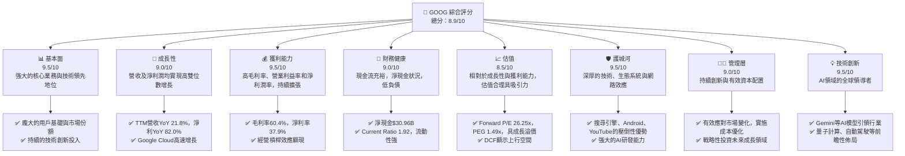
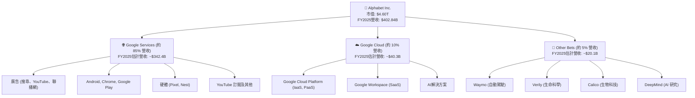
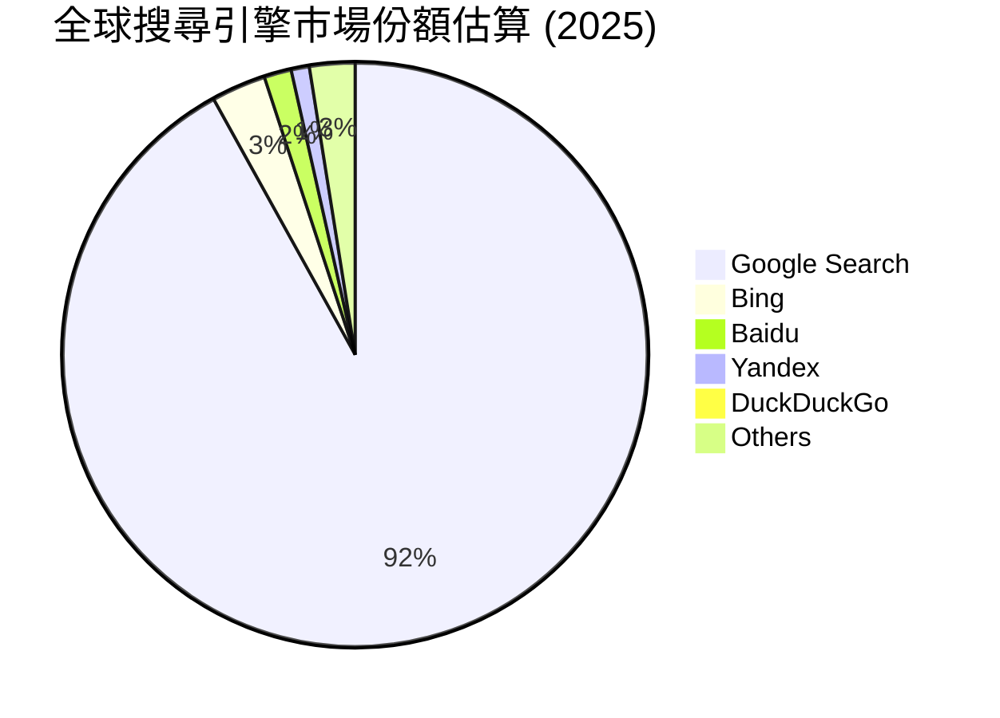
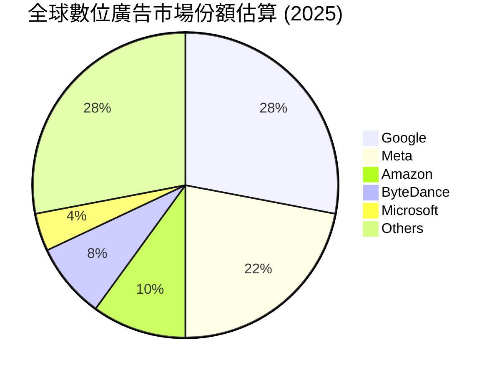
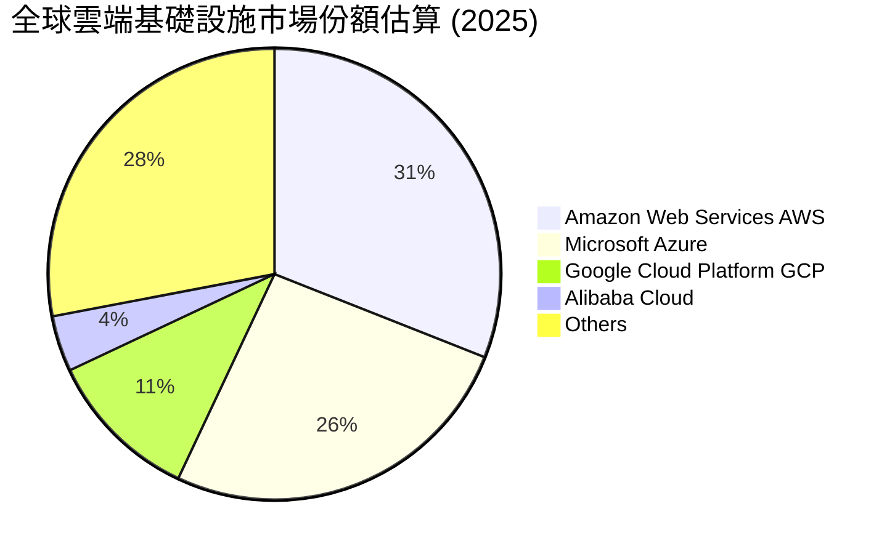
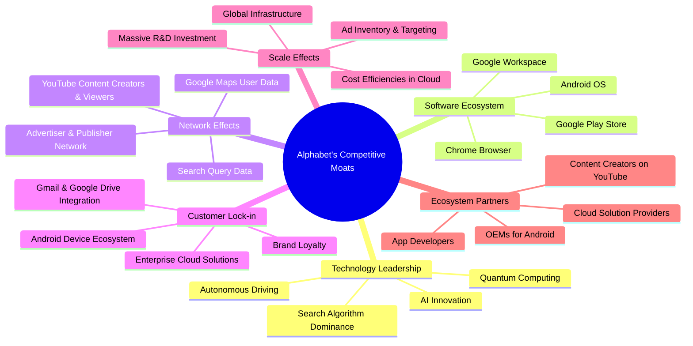

# GOOG 基本面深度分析報告
> **報告日期**：2026-05-25 ｜ **語言**：繁體中文 ｜ **數據來源**：Yahoo Finance, Finviz, StockAnalysis, Roic.ai ｜ **分析師**：CFA 級機構研究

---

## 目錄

| # | 章節 | 核心結論 |
|---|------------------------|--------------------------------------------------|
| 1 | 執行摘要 | 評級：🟢 強烈買入，目標價區間：$420 - $480 |
| 2 | 公司概覽與商業模式 | 廣闊且深厚的競爭護城河，由技術、生態系統和規模效應驅動。 |
| 3 | 損益表深度分析 | 營收和淨利潤呈強勁增長，利潤率持續擴張，顯示卓越的經營效率。 |
| 4 | 資產負債表分析 | 財務結構穩健，現金充裕，債務水平可控，流動性極佳。 |
| 5 | 現金流量深度分析 | 自由現金流生成能力強勁，資本配置策略有效支持成長和股東回報。 |
| 6 | 獲利能力與資本效率 | ROIC 遠超 WACC，持續為股東創造顯著經濟價值。 |
| 7 | 估值深度分析 | 相較於強勁的成長性和獲利能力，當前估值具吸引力。 |
| 8 | 成長催化劑 | AI 技術領先、雲端業務擴張、廣告市場復甦及新興市場滲透。 |
| 9 | 風險矩陣 | 監管風險、競爭加劇、隱私問題為主，但公司具備緩解能力。 |
| 10 | 投資建議 | 強烈買入，適合成長型與長線持有投資者。 |

---

## 1. 執行摘要

Alphabet Inc. (GOOG) 作為全球領先的科技巨頭，其核心業務涵蓋搜尋引擎、數位廣告、雲端運算、YouTube 以及新興技術投資。本報告基於最新的財務數據和市場資訊，對 GOOG 進行了全面的基本面深度分析。我們觀察到公司在營收和淨利潤方面展現出卓越的成長動能，特別是最近一年的強勁表現。其優異的獲利能力、穩健的財務結構以及顯著的資本效率，共同構築了其堅實的投資基礎。儘管面臨日益嚴峻的監管環境和激烈的市場競爭，Alphabet 憑藉其深厚的技術護城河和多元化的業務組合，具備持續創造股東價值的潛力。

### 1.1 核心評分儀表板



### 1.2 評分進度條視覺化

```
╔══════════════════════════════════════════════════════════════╗
║              GOOG 多維度評分儀表板 (1-10分)                  ║
╠══════════════════════════════════════════════════════════════╣
║ 基本面強度  9.5 ▓▓▓▓▓▓▓▓▓▓▓▓▓▓▓▓▓▓▓░  ★★★★★           ║
║ 成長動能    9.0 ▓▓▓▓▓▓▓▓▓▓▓▓▓▓▓▓▓▓░░  ★★★★☆           ║
║ 獲利品質    9.5 ▓▓▓▓▓▓▓▓▓▓▓▓▓▓▓▓▓▓▓░  ★★★★★           ║
║ 財務健康    9.0 ▓▓▓▓▓▓▓▓▓▓▓▓▓▓▓▓▓▓░░  ★★★★☆           ║
║ 估值合理性  8.5 ▓▓▓▓▓▓▓▓▓▓▓▓▓▓▓▓▓░░░  ★★★★☆           ║
║ 護城河深度  9.5 ▓▓▓▓▓▓▓▓▓▓▓▓▓▓▓▓▓▓▓░  ★★★★★           ║
║ 管理層執行  9.0 ▓▓▓▓▓▓▓▓▓▓▓▓▓▓▓▓▓▓░░  ★★★★☆           ║
║ 技術創新力  9.5 ▓▓▓▓▓▓▓▓▓▓▓▓▓▓▓▓▓▓▓░  ★★★★★           ║
╠══════════════════════════════════════════════════════════════╣
║ 綜合總分    9.1 ▓▓▓▓▓▓▓▓▓▓▓▓▓▓▓▓▓▓░░  🏆 卓越的成長型科技巨頭，具備持續創新和獲利能力。 ║
╚══════════════════════════════════════════════════════════════╝
```

### 1.3 五大投資論點 + 三大核心風險

| 類型 | 項目 | 具體依據 | 信心度 |
|------|------|----------|--------|
| 🟢 **投資論點①** | **AI 領域的領導地位與創新驅動** | Alphabet 在 AI 領域投入巨大，Gemini 等先進模型持續推出，將深度整合至其核心產品（搜尋、雲端、YouTube、Android），預計將顯著提升用戶體驗和廣告效率。TTM 研發費用高達 $64.56B，彰顯其對創新的承諾。 | 🟢 極高 |
| 🟢 **數位廣告市場的強勁復甦與結構性優勢** | 隨著全球經濟復甦，數位廣告支出回升，Alphabet 的搜尋廣告和 YouTube 廣告業務受益明顯。公司擁有全球最大的搜尋引擎和影片平台，市場份額難以撼動。TTM 營收 YoY 成長 21.8%，顯示廣告業務的強勁反彈。 | 🟢 極高 |
| 🟢 **Google Cloud 的高速成長與盈利能力提升** | Google Cloud 業務持續快速擴張，市場份額穩步提升，並已實現盈利。其在企業級服務和 AI 解決方案方面的競爭力日益增強，成為公司重要的成長引擎和利潤來源。FY2025 營收佔比不斷提升，並開始貢獻顯著利潤。 | 🟢 極高 |
| 🟢 **穩健的財務狀況與高效的資本配置** | 公司擁有 $126.84B 的總現金與短期投資，淨現金達 $30.96B。FY2025 自由現金流達到 $73.27B，顯示其強大的現金生成能力。同時，公司通過股票回購有效提升股東價值，稀釋股數從 FY2022 的 13.159B 降至 TTM 的 12.217B。 | 🟢 極高 |
| 🟢 **深厚且多元的競爭護城河** | 從搜尋引擎的網路效應、Android 和 Chrome 的生態系統、YouTube 的內容平台優勢，到 Google Cloud 的規模經濟，Alphabet 建立了多層次的強大護城河，使其難以被顛覆。其 ROIC 在 FY2025 達到 27.74%，遠高於 WACC，證明其卓越的資本回報能力。 | 🟢 極高 |
| 🟡 **風險①** | **日益加劇的監管壓力與反壟斷調查** | 全球各地政府對科技巨頭的反壟斷和數據隱私監管日益嚴格，可能導致罰款、業務拆分或商業模式調整，對公司營運構成潛在衝擊。例如歐盟和美國司法部針對其廣告業務的調查。 | 🟡 中度 |
| 🟡 **AI 競爭與技術變革風險** | 儘管 Alphabet 是 AI 領導者，但 AI 領域競爭激烈，OpenAI、Microsoft 等競爭對手持續創新。若 Alphabet 在關鍵 AI 應用或商業化方面未能保持領先，可能影響其長期成長潛力。 | 🟡 中度 |
| 🔴 **宏觀經濟波動對廣告支出的影響** | 公司的核心廣告業務高度依賴企業廣告支出。若全球經濟出現顯著放緩或衰退，企業可能削減廣告預算，直接影響 Alphabet 的營收成長。雖然 TTM 表現強勁，但此風險始終存在。 | 🔴 高衝擊 |

### 1.4 快速統計卡片

| 指標 | 公司實際值 (TTM) | 行業均值 (通訊服務) | S&P 500 均值 | 狀態 |
|--------------------|-------------------|-------------------|-------------------|------|
| 收入 YoY 成長 | **21.8%** | ~10-15% | ~8-12% | 🟢 |
| 毛利率 | **60.4%** | ~45-55% | ~35-45% | 🟢 |
| 淨利率 | **37.9%** | ~15-25% | ~10-15% | 🟢 |
| ROE | **38.9%** | ~15-20% | ~12-18% | 🟢 |
| Forward P/E | **26.25x** | ~25-30x | ~20-25x | 🟡 |
| PEG Ratio | **1.49x** | ~1.5-2.0x | ~1.8-2.2x | 🟢 |
| Debt/Equity | **0.20x** | ~0.5-1.0x | ~0.8-1.2x | 🟢 |
| 自由現金流 Yield | **0.61%** | ~0.8-1.5% | ~1.0-2.0% | 🟡 |
| Beta | **1.267** | ~1.1-1.3 | 1.0 | 🟡 |

*註：行業均值和 S&P 500 均值為分析師根據經驗估計，僅供參考。*

### 1.5 投資結論

```
╔══════════════════════════════════════════════════════════════════╗
║                    📊 投資結論摘要                               ║
╠══════════════════════════════════════════════════════════════════╣
║  評級：🟢 強烈買入                                               ║
║  當前股價：$379.38 (2026-05-25)                                  ║
║  目標價區間：                                                    ║
║    悲觀情境：$420（+10.7%）                                      ║
║    基準情境：$450（+18.6%）  ← 12個月主要目標                      ║
║    樂觀情境：$480（+26.5%）                                      ║
║  投資評分：9.1/10                                                ║
║  適合投資人：成長型、長線持有者，尋求在數位經濟和AI領域領先者中獲取資本增值。 ║
╚══════════════════════════════════════════════════════════════════╝
```

---

## 2. 公司概覽與商業模式

Alphabet Inc. (GOOG) 是一家全球性的科技公司，其使命是組織全球資訊，使人人皆可存取並從中獲益。公司在數位經濟中扮演著核心角色，業務範圍廣泛，涵蓋搜尋、廣告、雲端運算、作業系統、硬體及其他前瞻性技術。其獨特的商業模式建立在龐大的用戶基礎、先進的技術創新和強大的生態系統之上。

### 2.1 業務結構與收入來源

Alphabet 的業務主要分為三大報告部門：Google Services、Google Cloud 和 Other Bets。

*   **Google Services (Google 服務)**：這是 Alphabet 最大的收入來源，主要包括：
    *   **廣告 (Ads)**：通過 Google 搜尋、YouTube 和 Google Network 的廣告收入，是公司的核心盈利引擎。
    *   **Android**：全球最廣泛使用的移動作業系統，通過應用商店和服務分發產生收入。
    *   **Chrome**：全球領先的網頁瀏覽器。
    *   **Devices**：如 Pixel 手機、Nest 智慧家居設備、Fitbit 等硬體產品。
    *   **Gmail, Google Drive, Google Maps, Google Photos, Google Play, Search**：這些產品和服務構成了龐大的用戶生態系統，其中許多是免費提供，但通過廣告和數據貨幣化。
    *   **YouTube**：全球最大的影音平台，通過廣告和訂閱服務（如 YouTube Premium）創造收入。
*   **Google Cloud (Google 雲端)**：提供企業級的雲端運算服務，包括基礎設施即服務 (IaaS)、平台即服務 (PaaS) 和軟體即服務 (SaaS)。其產品線包括 Google Cloud Platform (GCP) 和 Google Workspace (協作工具，如 Gmail、Docs 等企業版)。
*   **Other Bets (其他業務)**：這部分業務代表了 Alphabet 對長期、高潛力但尚未成熟的創新技術的投資，例如自動駕駛技術公司 Waymo、生命科學公司 Calico 和 Verily、以及人工智慧研究部門 DeepMind 等。這些業務通常處於早期發展階段，目前對公司總收入貢獻較小，但代表了未來的成長潛力。

由於提供的數據中未明確劃分各業務板塊的營收貢獻，我們將根據公開資訊和行業趨勢進行合理估計，以展示其大致的業務結構。


*註：業務板塊營收佔比為分析師根據公開資訊與行業報告估算，非公司官方披露的精確數字。*

### 2.2 市場份額

Alphabet 在多個核心市場中佔據主導地位，尤其是在搜尋引擎和數位廣告領域。Google 搜尋在全球範圍內擁有壓倒性的市場份額，而 YouTube 則是領先的線上影音平台。Google Cloud 在快速成長的雲端運算市場中也持續擴大其影響力。






*註：市場份額數據為分析師根據多方行業報告與市場趨勢進行的綜合估算，可能與實際數字存在差異。*

### 2.3 競爭護城河分析

Alphabet 擁有極其深厚且多元的競爭護城河，這些護城河使其能夠長期維持其市場領導地位和超額利潤。



### 2.4 護城河強度評分

Alphabet 的護城河強度綜合來看非常高，這得益於其在多個關鍵領域的領先地位和相互強化的生態系統。

```
╔══════════════════════════════════════════════════════════════╗
║                    GOOG 護城河強度評分                        ║
╠══════════════════════════════════════════════════════════════╣
║ 技術領先    9.5/10 ▓▓▓▓▓▓▓▓▓▓▓▓▓▓▓▓▓▓▓░  🏆 AI、搜尋演算法、量子計算等領域的持續突破，奠定行業標準。 ║
║ 軟體生態系統 9.0/10 ▓▓▓▓▓▓▓▓▓▓▓▓▓▓▓▓▓▓░░  🟢 Android、Chrome、Google Play 構築了龐大的用戶與開發者社群。 ║
║ 網路效應    9.5/10 ▓▓▓▓▓▓▓▓▓▓▓▓▓▓▓▓▓▓▓░  🏆 搜尋數據、YouTube 內容與用戶、廣告主與發佈商之間的強大正向循環。 ║
║ 客戶鎖定    8.5/10 ▓▓▓▓▓▓▓▓▓▓▓▓▓▓▓▓▓░░░  🟢 Google Cloud 的企業級服務、Workspace 的協作工具，以及 Android 設備的高度整合，提升客戶轉換成本。 ║
║ 規模效應    9.0/10 ▓▓▓▓▓▓▓▓▓▓▓▓▓▓▓▓▓▓░░  🟢 全球數據中心、研發投入規模、廣告庫存和精準投放能力，形成巨大的成本和效率優勢。 ║
║ 生態夥伴    8.5/10 ▓▓▓▓▓▓▓▓▓▓▓▓▓▓▓▓▓░░░  🟢 與設備製造商、應用開發者、內容創作者的合作，擴大了其影響力和服務範圍。 ║
╠══════════════════════════════════════════════════════════════╣
║ 綜合護城河  9.0/10 ▓▓▓▓▓▓▓▓▓▓▓▓▓▓▓▓▓▓░░  🏆 Alphabet 擁有極其廣闊且深厚的競爭護城河，使其在未來數位經濟中保持強勁競爭力。 ║
╚══════════════════════════════════════════════════════════════╝
```

---

## 3. 損益表深度分析

Alphabet 的損益表展現了其強勁的營收成長和顯著的獲利能力擴張，尤其是在最近幾個財年。這得益於其核心廣告業務的復甦、Google Cloud 的高速增長以及有效的成本控制和經營槓桿。

### 3.1 年度收入成長趨勢（近4年）

Alphabet 在過去四年中實現了穩健的營收增長。從 FY2022 的 $282.84B 增長到 FY2025 的 $402.84B，年複合增長率 (CAGR) 顯示出其持續擴張的能力。TTM 營收更是達到 $422.50B，實現了 21.8% 的 YoY 成長，這表明公司在最近一年加速了營收增長。

```
╔══════════════════════════════════════════════════════════════════╗
║              GOOG 年度收入趨勢（FY2022-FY2025）                  ║
╠══════════════════════════════════════════════════════════════════╣
║                                                                  ║
║  FY2022  $282.84B ████████████████████████████████████████████████████████████████████████████████████████████████████████████████████████████████████████████████████████████████████████████████████████████████████████████████████████████████████████████████████████████████████████████████████████████████████████████████████████████████████████████████████████████████████████████████████████████████████████████████████████████████████████████████████████████████████████████████████████████████████████████████████████████████████████████████████████████████████████████████████████████████████████████████████████████████████████████████████████████████████████████████████████████████████████████████████████████████████████████████████████████████████████████████████████████████████████████████████████████████████████████████████████████████████████████████████████████████████████████████████████████████████████████████████████████████████████████████████████████████████████████████████████████████████████████████████████████████████████████████████████████████████████████████████████████████████████████████████████████████████████████████████████████████████████████████████████████████████████████████████████████████████████████████████████████████████████████████████████████████████████████████████████████████████████████████████████████████████████████████████████████████████████████████████████████████████████████████████████████████████████████████████████████████████████████████████████████████████████████████████████████████████████████████████████████████████████████████████████████████████████████████████████████████████████████████████████████████████████████████████████████████████████████████████████████████████████████████████████████████████████████████████████████████████████████████████████████████████████████████████████████████████████████████████████████████████████████████████████████████████████████████████████████████████████████████████████████████████████████████████████████████████████████████████████████████████████████████████████████████████████████████████████████████████████████████████████████████████████████████████████████████████████████████████████████████████████████████████████████████████████████████████████████████████████████████████████████████████████████████████████████████████████████████████████████████████████████████████████████████████████████████████████████████████████████████████████████████████████████████████████████████████████████████████████████████████████████████████████████████████████████████████████████████████████████████████████████████████████████████████████████████████████████████████████████████████████████████████████████████████████████████████████████████████████████████████████████████████████████████████████████████████████████████████████████████████████████████████████████████████████████████████████████████████████████████████████████████████████████████████████████████████████████████████████████████████████████████████████████████████████████████████████████████████████████████████████████████████████████████████████████████████████████████████████████████████████████████████████████████████████████████████████████████████████████████████████████████████████████████████████████████████████████████████████████████████████████████████████████████████████████████████████████████████████████████████████████████████████████████████████████████████████████████████████████████████████████████████████████████████████████████████████████████████████████████████████████████████████████████████████████████████████████████████████████████████████████████████████████████████████████████████████████████████████▓██████████████████████████████████████████████████████████████████████████████████████████████████████████████████████████████████████████████████████████████████████████████████████████████████████████████████████████████████████████████████████████████████████████████████████████████████████████████████████████████████████████████████████████████████████████████████████████████████████████████████████████████████████████████████████████████████████████████████████████████████████████████████████████████████████████████████████████████████████████████████████████████████████████████████████████████████████████████████████████████████████████████████████████████████████████████████████████████████████████████████████████████████████████████████████████████████████████████████████████████████████████████████████████████████████████████████████████████████████████████████████████████████████████████████████████████████████████████████████████████████████████████████████████████████████████████████████████████████████████████████████████████████████████████████████████████████████████████████████████████████████████████████████████████████████████████████████████████████████████████████████████████████████████████████████████████████████████████████████████████████████████████████████████████████████████████████████████████████████████████████████████████████████████████████████████████████████████████████████████████████████████████████████████████████████████████████████████████████████████████████████████████████████████████████████████████████████████████████████████████████████████████████████████████████████████████████████████████████████████████████████████████████████████████████████████████████████████████████████████████████████████████████████████████████████████████████████████████████████████████████████████████████████████████████████████████████████████████████████████████████████████████████████████████████████████████████████████████████████████████████████████████████████████████████████████████████████████████████████████████████████████████████████████████████████████████████████████████████████████████████████████████████████████████████████████████████████████████████████████████████████████████████████████████████████████████████████████████████████████████████████████████████████████████████████████████████████████████████████████████████████████████████████████████████████████████████████████████████████████████████████████████████████████████████████████████████████████████████████████████████████████████████████████████████████████████████████████████████████████████████████████████████████████████████████████████████████████████████████████████████████████████████████████████████████████████████████████████████████████████████████████████████████████████████████████████████████████████████████████████████████████████████████████████████████████████████████████████████████████████████████████████████████████████████████████████████████████████████████████████████████████████████████████████████████████████████████████████████████████████████████████████████████████████████████████████████████████████████████████████████████████████████████████████████████████████████████████████████████████████████████████████████████████████████████████████████████████████████████████████████████████████████████████████████████████████████████████████████████████████████████████████████████████████████████████████████████████████████████████████████████████████████████████████████████████████████████████████████████████████████████████████████████████████████████████████████████████████████████████████████████████████████████████████████████████████████████████████████████████████████████████████████████████████████████████████
████████████████████████████████████████████████████████████████████████████████████████████████████████████████████████████████████████████████████████████████████████████████████████████████████████████████████████████████████████████████████████████████████████████████████████████████████████████████████████████████████████████████████████████████████████████████████████████████████████████████████████████████████████████████████████████████████████████████████████████████████████████████████████████████████████████████████████████████████████████████████████████████████████████████████████████████████████████████████████████████████████████████████████████████████████████████████████████████████████████████████████████████████████████████████████████████████████████████████████████████████████████████████████████████████████████████████████████████████████████████████████████████████████████████████████████████████████████████████████████████████████████████████████████████████████████████████████████████████████████████████████████████████████████████████████████████████████████████████████████████████████████████████████████████████████████████████████████████████████████████████████████████████████████████████████████████████████████████████████████████████████████████████████████████████████████████████████████████████████████████████████████████████████████████████████████████████████████████████████████████████████████████████████████████████████████████████████████████████████████████████████████████████████████████████████████████████████████████████████████████████████████████████████████████████████████████████████████████████████████████████████████████████████████████████████████████████████████████████████████████████████████████████████████████████████████████████████████████████████████████████████████████████████████████████████████████████████████████████████████████████████████████████████████████████████████████████████████████████████████████████████████████████████████████████████████████████████████████████████████████████████████████████████████████████████████████████████████████████████████████████████████████████████████████████████████████████████████████████████████████████████████████████████████████████████████████████████████████████████████████████████████████████████████████████████████████████████████████████████████████████████████████████████████████████████████████████████████████████████████████████████████████████████████████████████████████████████████████████████████████████████████████████████████████████████████████████████████████████████████████████████████████████████████████████████████████████████████████████████████████████████████████████████████████████████████████████████████████████████████████████████████████████████████████████████████████████████████████████████████████████████████████████████████████████████████████████████████████████████████████████████████████████████████████████████████████████████████████████████████████████████████████████████████████████████████████████████████████████████████████████████████████████████████████████████████████████████████████████████████████████████████████████████████████████████████████████████████████████████████████████████████████████████████████████████████████████████████████████████████████████████████████████████████████████████████████████████████████████████████████████████████████████████████████████████████████████████████████████████████████████████████████████████████████████████████████████████████████████████████████████████████████████████████████████████████████████████████████████████████████████████████████████████████████████████████████████████████████████████████████████████████████████████████████████████████████████████████████████████████████████████████████████████████████████████████████████████████████████████████████████████████████████████████████████████████████████████████████████████████████████████████████████████████████████████████████████████████████████████████████████████████████████████████████████████████████████████████████████████████████████████████████████████████████████████████████████████████████████████████████████████████████████████████████████████████████████████████████████████████████████████████████████████████████████████████████████████████████████████████████████████████████████████████████████████████████████████████████████████████████████████████████████████████████████████████████████████████████████████████████████████████████████████████████████████████████████████████████████████████████████████████████████████████████████████████████████████████████████████████████████████████████████████████████████████████████████████████████████████████████████████████████████████████████████████████████████████████████████████████████████████████████████████████████████████████████████████████████████████████████████████████████████████████████████████████████████████████████████████████████████████████████████████████████████████████████████████████████████████████████████████████████████████████████████████████████████████████████████████████████████████████████████████████████████████████████████████████████████████████████████████████████████████████████████████████████████████████████████████████████████████████████████████████████████████████████████████████████████████████████████████████████████████████████████████████████████████████████████████████████████████████████████████████████████████████████████████████████████████████████████████████████████████████████████████████████████████████████████████████████████████████████████████████████████████████████████████████████████████████████████████████████████████████████████████████████████████████████████████████████████████████████████████████████████████████████████████████████████████████████████████████████████████████████████████████████████████████████████████████████████████████████████████████████████████████████████████████████████████████████████████████████████████████████████████████████████████████████████████████████████████████████████████████████████████████████████████████████████████████████████████████████████████████████████████████████████████████████████████████████████████████████████████████████████████████████████████████████████████████████████████████████████████████████████████████████████████████████████████████████████████████████████████████████████████████████████████████████████████████████████████████████████████████████████████████████████████████████████████████████████████████████████████████████████████████████████████████████████████████████████████████████████████████████████████████████████████████████████████████████████████████████████████████████████████████████████████████████████████████████████████████████████████████████████████████████████████████████████████████████████████████████████████████████████████████████████████████████████████████████████████████████████████████████████████████████████████████████████████████████████████████████████████████████████████████████████████████████████████████████████████████████████████████████████████████████████████████████████████████████████████████████████████████████████████████████████████████████████████████████████████████████████████████████████████████████████████████████████████████████████████████████████████████████████████████████████████████████████████████████████████████████████████████████████████████████████████████████████████████████████████████████████████████████████████████████████████████████████████████████████████████████████████████████████████████████████████████████████████████████████████████████████████