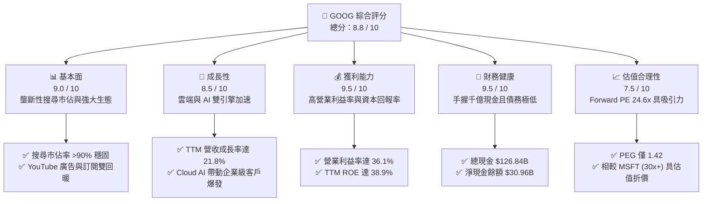

# GOOG 基本面深度分析報告
> **報告日期**：2026-06-11 ｜ **語言**：繁體中文 ｜ **數據來源**：Yahoo Finance, Finviz, StockAnalysis, Roic.ai ｜ **分析師**：CFA 級機構研究

---

## 目錄

| # | 章節 | 核心結論 |
|---|------|----------|
| **1** | **執行摘要** | 評級 **強烈買入 (Strong Buy)**，基準目標價 **$410.00**，隱含上漲空間 **+15.0%**。 |
| **2** | **公司概覽與商業模式** | 搜尋廣告奠定超強護城河，AI 與雲端運算（Google Cloud）成為雙引擎驅動。 |
| **3** | **損益表深度分析** | TTM 營收達 **$422.50B**（YoY +21.8%），Q1 2026 淨利受非營業收入推升暴增。 |
| **4** | **資產負債表分析** | 淨現金達 **$30.96B**，資產負債表極度穩健，流動比率 **1.92** 展現強大抗風險能力。 |
| **5** | **現金流量深度分析** | 營運現金流達 **$174.35B**，資本支出高企（FY2025 $91.45B）反映 AI 軍備競賽決心。 |
| **6** | **獲利能力與資本效率** | ROE 高達 **38.9%**，ROIC 估算達 **29.6%**，顯著超越 WACC（9.5%），強力創造股東價值。 |
| **7** | **估值深度分析** | Forward P/E **24.6x**，對比歷史區間與同業（MSFT, AMZN）具備明顯估值性價比。 |
| **8** | **成長催化劑** | Gemini 2.0 商業化、Cloud AI 基礎設施爆發式需求，以及 Waymo 商用化擴展。 |
| **9** | **風險矩陣** | 核心風險在於反壟斷監管衝擊、AI 搜尋成本上升及資本支出回報率（ROIC）稀釋。 |
| **10**| **投資建議** | 建議分批佈局，核心買入觸發點為 $330-$340 區間，適合長線成長型與價值型投資人。 |

---

## 1. 執行摘要

### 1.1 核心評分儀表板



### 1.2 評分進度條視覺化

```
╔══════════════════════════════════════════════════════════════╗
║               GOOG 多維度評分儀表板 (1-10分)                 ║
╠══════════════════════════════════════════════════════════════╣
║ 基本面強度  9.0 ▓▓▓▓▓▓▓▓▓▓▓▓▓▓▓▓▓▓░░  ★★★★★           ║
║ 成長動能    8.5 ▓▓▓▓▓▓▓▓▓▓▓▓▓▓▓▓▓░░░  ★★★★☆           ║
║ 獲利品質    9.5 ▓▓▓▓▓▓▓▓▓▓▓▓▓▓▓▓▓▓▓░  ★★★★★           ║
║ 財務健康    9.5 ▓▓▓▓▓▓▓▓▓▓▓▓▓▓▓▓▓▓▓░  ★★★★★           ║
║ 估值合理性  7.5 ▓▓▓▓▓▓▓▓▓▓▓▓▓▓░░░░░░  ★★★★☆           ║
║ 護城河深度  9.5 ▓▓▓▓▓▓▓▓▓▓▓▓▓▓▓▓▓▓▓░  ★★★★★           ║
║ 管理層執行  8.5 ▓▓▓▓▓▓▓▓▓▓▓▓▓▓▓▓▓░░░  ★★★★☆           ║
║ 技術創新力  9.0 ▓▓▓▓▓▓▓▓▓▓▓▓▓▓▓▓▓▓░░  ★★★★★           ║
╠══════════════════════════════════════════════════════════════╣
║ 綜合總分