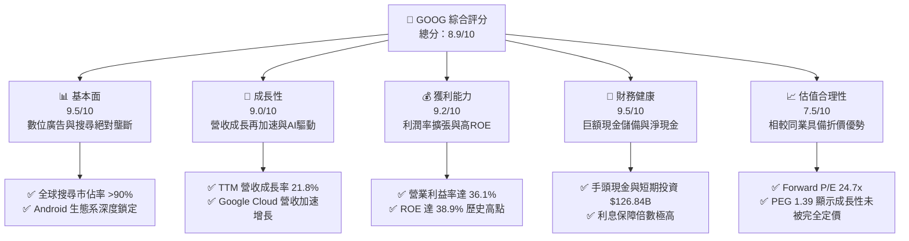

# GOOG 基本面深度分析報告
> **報告日期**：2026-06-12 ｜ **語言**：繁體中文 ｜ **數據來源**：Yahoo Finance, Finviz, StockAnalysis, Roic.ai ｜ **分析師**：CFA 級機構研究

---

## 目錄

| # | 章節 | 核心結論 |
|---|------|----------|
| 1 | 執行摘要 | 評級：**強烈買入** ｜ 基準目標價：**$409.00**（+14.2% 上行空間） |
| 2 | 公司概覽與商業模式 | 搜尋引擎絕對壟斷，AI Gemini 與 Google Cloud 雙引擎構築極深護城河 |
| 3 | 損益表深度分析 | TTM 營收成長 21.8%，Q1 2026 淨利受非營業利益推升，核心營業利益率穩健 |
| 4 | 資產負債表分析 | 淨現金達 $30.96B，流動比率 1.92，資產負債表極其健康無債務風險 |
| 5 | 現金流量深度分析 | 資本支出大幅擴張（FY25 $91.45B）拖累短期 FCF，但長期資本配置效率極高 |
| 6 | 獲利能力與資本效率 | ROE 達 38.9%，ROIC（30.9%）遠超 WACC（9.4%），強力創造股東價值 |
| 7 | 估值深度分析 | Forward P/E 24.7x 具備估值吸引力，相較同業 MSFT 與 META 呈現折價 |
| 8 | 成長催化劑 | 雲端 AI 算力需求爆發、YouTube 訂閱服務增長與 Gemini 搜尋廣告變現 |
| 9 | 風險矩陣 | 反壟斷監管（DOJ）與 AI 資本支出回報率為核心監控指標 |
| 10 | 投資建議 | 具備高安全邊際，適合長線成長型與價值型投資人，建議分批佈局 |

---

## 1. 執行摘要

### 1.1 核心評分儀表板

### 1.2 評分進度條