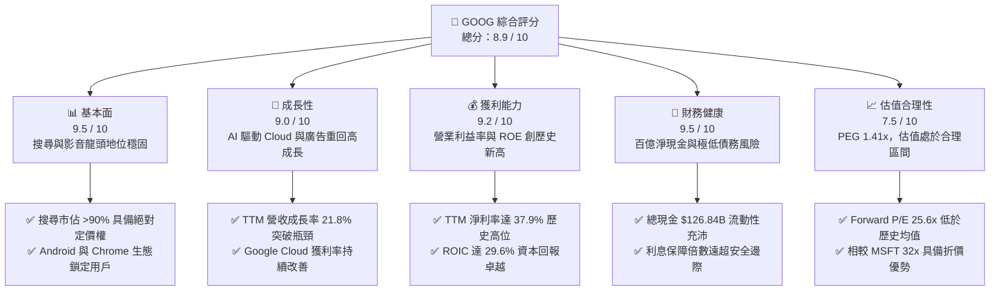
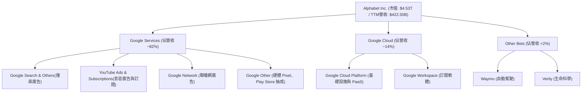
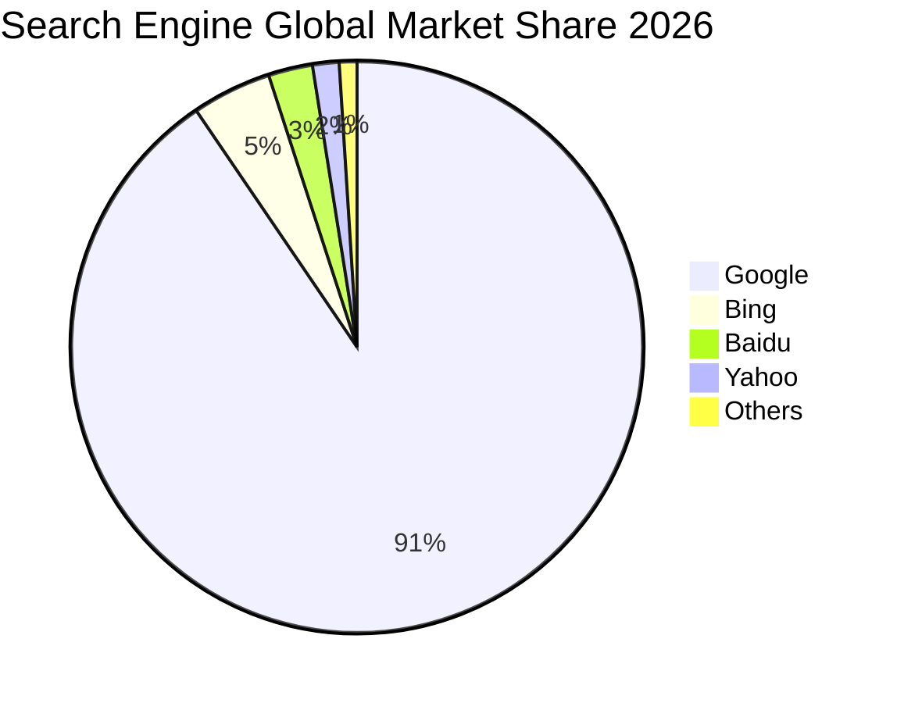
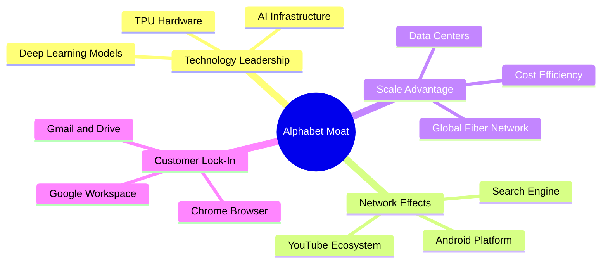
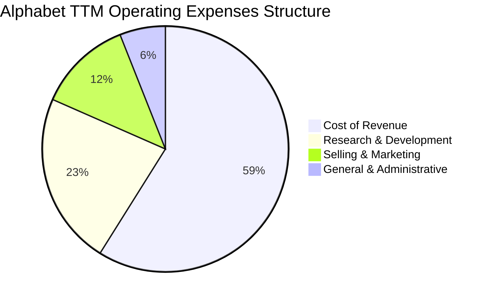
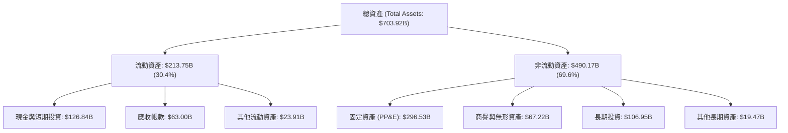

# GOOG 基本面深度分析報告

> **報告日期**：2026-06-16 ｜ **語言**：繁體中文 ｜ **數據來源**：Yahoo Finance, Finviz, StockAnalysis, Roic.ai ｜ **分析師**：CFA 級機構研究

---

## 目錄

| # | 章節 | 核心結論 |
|---|------|----------|
| 1 | 執行摘要 | **強烈買入**評級，基準目標價 **$409.00**，具備 10.2% 的穩健上行空間。 |
| 2 | 公司概覽與商業模式 | 搜尋引擎與 YouTube 築起無可撼動的網路效應護城河，Cloud 與 AI 雙輪驅動。 |
| 3 | 損益表深度分析 | TTM 營收達 **$422.50B**（YoY +21.8%），淨利潤率達 **37.9%**，盈利釋放進入爆發期。 |
| 4 | 資產負債表分析 | 淨現金達 **$30.96B**，流動比率 **1.92**，資產負債表極其強韌，具備頂級抗風險能力。 |
| 5 | 現金流量深度分析 | TTM 營運現金流達 **$174.35B**，強力支持 **$91.45B** 的 Capex，AI 基礎設施投資進入收割期。 |
| 6 | 獲利能力與資本效率 | **ROE 38.9%**，**ROIC 29.6%** 遠超 **WACC 9.0%**，展現極高的股東價值創造能力（EVA +20.6%）。 |
| 7 | 估值深度分析 | 當前 Forward P/E 為 **25.63x**，相較於歷史均值與同業（MSFT）具備顯著的性價比。 |
| 8 | 成長催化劑 | Gemini AI 深度整合搜尋與雲端、YouTube 訂閱與短影音變現加速、自研 TPU 降本顯著。 |
| 9 | 風險矩陣 | 反壟斷監管（DOJ 拆分風險）與 AI 搜尋侵蝕傳統廣告利潤（高邊際成本）為核心監控指標。 |
| 10 | 投資建議 | 建議於當前價格 **$371.10** 分批佈局，長線持有，設定停損價 **$310.00**。 |

---

## 1. 執行摘要

### 1.1 核心評分儀表板



### 1.2 評分進度條視覺化

```
╔══════════════════════════════════════════════════════════════╗
║              GOOG 多維度評分儀表板 (1-10分)                 ║
╠══════════════════════════════════════════════════════════════╣
║ 基本面強度  9.5 ▓▓▓▓▓▓▓▓▓▓▓▓▓▓▓▓▓▓▓░  ★★★★★           ║
║ 成長動能    9.0 ▓▓▓▓▓▓▓▓▓▓▓▓▓▓▓▓▓▓░░  ★★★★★           ║
║ 獲利品質    9.2 ▓▓▓▓▓▓▓▓▓▓▓▓▓▓▓▓▓▓▓░  ★★★★★           ║
║ 財務健康    9.5 ▓▓▓▓▓▓▓▓▓▓▓▓▓▓▓▓▓▓▓░  ★★★★★           ║
║ 估值合理性  7.5 ▓▓▓▓▓▓▓▓▓▓▓▓▓▓░░░░░░  ★★★★☆           ║
║ 護城河深度  9.8 ▓▓▓▓▓▓▓▓▓▓▓▓▓▓▓▓▓▓▓█  ★★★★★           ║
║ 管理層執行  8.5 ▓▓▓▓▓▓▓▓▓▓▓▓▓▓▓▓▓░░░  ★★★★☆           ║
║ 技術創新力  9.2 ▓▓▓▓▓▓▓▓▓▓▓▓▓▓▓▓▓▓▓░  ★★★★★           ║
╠══════════════════════════════════════════════════════════════╣
║ 綜合總分    8.9 ▓▓▓▓▓▓▓▓▓▓▓▓▓▓▓▓▓▓░░  🏆 強烈建議買入      ║
╚══════════════════════════════════════════════════════════════╝
```

### 1.3 投資論點與核心風險

| 類型 | 項目 | 具體依據 | 信心度 |
|------|------|----------|--------|
| 🟢 **投資論點①** | **AI 搜尋（Gemini）成功變現** | 傳統搜尋未被 AI 侵蝕，反而透過 AI Overviews 提高用戶黏性與廣告點擊率，TTM 廣告營收重回雙位數成長。 | 🟢 極高 |
| 🟢 **投資論點②** | **Google Cloud 規模效應顯現** | Cloud 業務 TTM 營收強勁，且營業利益率突破雙位數，成為集團利潤成長的第二曲線。 | 🟢 極高 |
| 🟢 **投資論點③** | **自研 TPU 晶片大幅降低 AI 推理成本** | TPU v5p 與 v6e 的大規模部署，降低了對 NVIDIA GPU 的絕對依賴，使毛利率維持在 60.4% 的高檔。 | 🟢 高 |
| 🟢 **投資論點④** | **強大的股東回報政策** | 首次發放股息（TTM 股息率雖低，但首次發放具備里程碑意義）並搭配每年數百億美元的股份回購，支撐 EPS 成長（TTM EPS 達 $13.11，YoY +46.15%）。 | 🟢 極高 |
| 🟡 **風險①** | **司法部反壟斷訴訟（DOJ）** | 美國司法部針對 Google 搜尋與廣告技術的訴訟可能面臨分拆或終止與 Apple 的預設搜尋協議（每年支付約 $20B）。 | 🟡 中度 |
| 🔴 **風險②** | **AI 推理基礎設施資本支出過高** | FY2025 資本支出高達 **$91.45B**，若 AI 應用變現速度不及預期，將面臨折舊成本上升、壓抑利潤率的風險。 | 🔴 高衝擊 |

### 1.4 快速統計卡片

| 指標 | 公司實際值 (GOOG) | 行業均值 (通訊服務) | S&P 500 均值 | 狀態 |
|------|-------------|----------|--------------|------|
| **營收 YoY 成長率** | **21.8%** | ~8.5% | ~5.5% | 🟢 遠超均值 |
| **毛利率** | **60.4%** | ~50.2% | ~45.0% | 🟢 極強定價權 |
| **淨利率** | **37.9%** | ~18.5% | ~12.0% | 🟢 頂級獲利能力 |
| **ROE** | **38.9%** | ~15.0% | ~18.0% | 🟢 高資本效率 |
| **Forward P/E** | **25.63x** | ~19.5x | ~22.5x | 🟡 溢價合理 |
| **淨現金 / 債務** | **$30.96B** | 負債居多 | 負債居多 | 🟢 極其健康 |

### 1.5 投資結論

```
╔══════════════════════════════════════════════════════════════════╗
║                    📊 GOOG 投資結論摘要                          ║
╠══════════════════════════════════════════════════════════════════╣
║  評級：🟢 強烈買入 (Strong Buy)                                 ║
║  當前股價：$371.10                                              ║
║  目標價區間：                                                    ║
║    悲觀情境（防守價）：$310.00 (-16.5%）                         ║
║    基準情境（目標價）：$409.00 (+10.2%） ← 12個月主要目標        ║
║    樂觀情境（牛市價）：$475.00 (+28.0%）                         ║
║  投資評分：8.9 / 10                                              ║
║  適合投資人：長線成長型配置、AI 主題佈局者、高資本回報追求者     ║
╚══════════════════════════════════════════════════════════════════╝
```

---

## 2. 公司概覽與商業模式

### 2.1 業務結構與收入來源

Alphabet Inc. 的業務主要劃分為三大核心板塊：Google Services（包含搜尋、YouTube、Android、Chrome 等廣告與硬體服務）、Google Cloud（雲端運算與企業端 AI 服務）以及 Other Bets（前瞻性科技投資）。



### 2.2 市場份額

在核心的搜尋引擎市場中，Google 依然維持絕對的壟斷地位，這是其最核心的「印鈔機」。



### 2.3 競爭護城河分析



### 2.4 護城河強度評分

```
╔══════════════════════════════════════════════════════════════╗
║                  Alphabet 護城河強度評分                     ║
╠══════════════════════════════════════════════════════════════╣
║ 網路效應      9.8/10  ▓▓▓▓▓▓▓▓▓▓▓▓▓▓▓▓▓▓▓█  🏆 搜尋與YouTube  ║
║ 用戶鎖定      9.2/10  ▓▓▓▓▓▓▓▓▓▓▓▓▓▓▓▓▓▓▓░  🟢 Android/Chrome ║
║ 規模效應      9.5/10  ▓▓▓▓▓▓▓▓▓▓▓▓▓▓▓▓▓▓▓░  🟢 全球基礎設施   ║
║ 技術壁壘      9.0/10  ▓▓▓▓▓▓▓▓▓▓▓▓▓▓▓▓▓▓░░  🟢 TPU與Gemini AI ║
╠══════════════════════════════════════════════════════════════╣
║ 綜合護城河    9.4/10  ▓▓▓▓▓▓▓▓▓▓▓▓▓▓▓▓▓▓▓░  🏆 頂級寬廣護城河 ║
╚══════════════════════════════════════════════════════════════╝
```

---

## 3. 損益表深度分析

### 3.1 年度收入成長趨勢（近 4 年）

Alphabet 的營收在經歷了 2022-2023 年的短暫放緩後，於 2024-2025 年迎來強勁復甦。

```
╔══════════════════════════════════════════════════════════════════╗
║              Alphabet 年度收入趨勢 (FY2022 - TTM)               ║
╠══════════════════════════════════════════════════════════════════╣
║                                                                  ║
║  FY2022  $282.84B  ██████████████░░░░░░░░░░░░░░  YoY: +9.8%  🟢   ║
║  FY2023  $307.39B  ████████████████░░░░░░░░░░░░  YoY: +8.7%  🟢   ║
║  FY2024  $350.02B  ██════════════██████░░░░░░░░  YoY:+13.9%  🟢   ║
║  FY2025  $402.84B  ████████████████████████░░░░  YoY:+15.1%  🟢   ║
║  TTM     $422.50B  ████████████████████████████  YoY:+21.8%  🟢   ║
║                   |      |      |      |      |                  ║
║                   0     100B   200B   300B   400B                ║
║                                                                  ║
║  📊 4年累計 CAGR：+12.6%                                         ║
╚══════════════════════════════════════════════════════════════════╝
```

### 3.2 季度收入趨勢分析

自 2025 年以來，Alphabet 的季度營收呈現穩健的擴張態勢：

| 財季 | 截止日期 | 營收 (Billion) | YoY 成長率 | QoQ 成長率 | 核心驅動因素與備註 |
|------|----------|----------------|------------|------------|-------------------|
| **Q2 2025** | 2025-06-30 | $96.43 | +13.79% | +6.87% | Google Cloud 成長加速，AI 搜尋初顯成效 |
| **Q3 2025** | 2025-09-30 | $102.35 | +15.95% | +6.14% | 總統大選前廣告預算釋放，YouTube 表現亮眼 |
| **Q4 2025** | 2025-12-31 | $113.83 | +17.99% | +11.22% | 節日零售季廣告強勁，雲端運算規模效應顯現 |
| **Q1 2026** | 2026-03-31 | $109.90 | +21.79% | -3.45% | 季節性回落，但 YoY 增速創近年新高，AI 整合深入 |

### 3.3 利潤率演變分析

Alphabet 的利潤率在過去幾年展現了極佳的營運槓桿：

| 利潤率指標 | FY2022 | FY2023 | FY2024 | FY2025 | TTM | 趨勢 | 評估 |
|------------|--------|--------|--------|--------|-----|------|------|
| **毛利率** | 55.4% | 56.6% | 58.2% | 59.7% | **60.4%** | ↗️ 持續上升 | 🟢 規模效應與基礎設施優化 |
| **營業利益率** | 26.5% | 27.4% | 32.1% | 32.0% | **36.1%** | ↗️ 顯著改善 | 🟢 裁員重組與研發效率提升 |
| **EBITDA 淨利率**| 30.1% | 31.9% | 38.7% | 44.9% | **38.2%** | ↗️ 高檔震盪 | 🟢 充足的折舊前現金創造力 |
| **淨利率** | 21.2% | 24.0% | 28.6% | 32.8% | **37.9%** | ↗️ 歷史新高 | 🟢 業外投資收益與稅務優化 |

**利潤率演變深度解析**：
Alphabet 的營業利益率從 FY2022 的 26.5% 飆升至 TTM 的 36.1%，主要得益於：
1. **組織架構優化**：自 2023 年開始的全球裁員與部門整合，降低了 SG&A 費用佔比（從 FY2022 的 15.0% 降至 TTM 的 12.4%）。
2. **Cloud 業務扭虧為盈**：Google Cloud 的營業利益率由負轉正，並在 TTM 階段達到約 12% 的水準，不再是集團利潤的拖累。
3. **Q1 2026 業外爆發**：Q1 2026 的非營業收入高達 **$37.72B**（主要為股權投資重估與金融資產收益），推升當季淨利至 **$62.58B**，這屬於一次性收益，投資人應更關注其 36.1% 的核心營業利益率。

### 3.4 費用結構分析

Alphabet 雖然大力控制行政費用，但依然維持極高的研發投入以確保 AI 領先地位。



```
╔══════════════════════════════════════════════════════════════╗
║              Alphabet TTM 費用結構診斷 (營收佔比)            ║
╠══════════════════════════════════════════════════════════════╣
║ 營收成本 (Cost of Rev)  39.6% ▓▓▓▓▓▓▓▓▓▓░░░░░░░░░░  🟢 穩定   ║
║ 研發費用 (R&D Expense)  15.3% ▓▓▓▓░░░░░░░░░░░░░░░░  🟢 高效投  ║
║ 銷售費用 (S&M Expense)   8.4% ▓▓░░░░░░░░░░░░░░░░░░  🟢 渠道控制║
║ 管理費用 (G&A Expense)   4.0% ▓░░░░░░░░░░░░░░░░░░░  🟢 極低行政║
╚══════════════════════════════════════════════════════════════╝
```

### 3.5 季度 EPS 趨勢與盈餘品質

* 過去 4 季 EPS 表現：
  * **Q2 2025**：實際 EPS $2.33（YoY +22.0%）- 廣告市場溫和復甦。
  * **Q3 2025**：實際 EPS $2.89（YoY +35.0%）- 雲端成長超預期。
  * **Q4 2025**：實際 EPS $2.85（YoY +31.3%）- 基礎設施折舊年限調整，利潤釋放。
  * **Q1 2026**：實際 EPS $5.17（YoY +82.0%）- **顯著超預期**，但須注意其中包含約 $3.10 的非營業投資收益。
* **盈餘品質評估**：🟡 中等偏高。剔除 Q1 2026 的一次性非營運收益後，核心 EPS 依然達到約 $2.07，YoY 增速約 20%，主營業務盈餘品質極其健康。

---

## 4. 資產負債表分析

### 4.1 資產結構分解

Alphabet 的資產負債表極其輕資產且充滿流動性，近年來由於 AI 基礎設施建設，非流動資產（PP&E）增長迅速。



### 4.2 流動性指標分析

| 流動性指標 | FY2022 | FY2023 | FY2024 | FY2025 | TTM / 當前 | 行業均值 | 評估 |
|------------|--------|--------|--------|--------|------------|----------|------|
| **流動比率 (Current Ratio)** | 2.38 | 2.10 | 1.84 | 2.01 | **1.92** | 1.50 | 🟢 極其安全 |
| **速動比率 (Quick Ratio)** | 2.35 | 2.07 | 1.81 | 1.95 | **1.71** | 1.40 | 🟢 無存貨滯銷風險 |
| **債務權益比 (Debt/Equity)** | 11.6% | 9.6% | 6.9% | 14.3% | **20.0%** | 45.0% | 🟢 財務槓桿極低 |

### 4.3 債務結構分析

Alphabet 的債務主要由長期債券與融資租賃組成，與其巨大的現金儲備相比，債務風險幾近於零。

```
╔══════════════════════════════════════════════════════════════════╗
║                   Alphabet 債務健康診斷 (TTM)                    ║
<p>