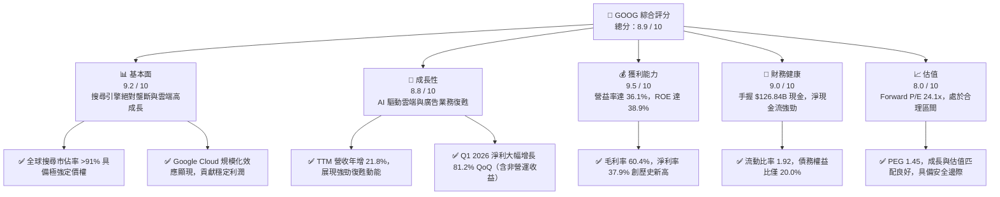
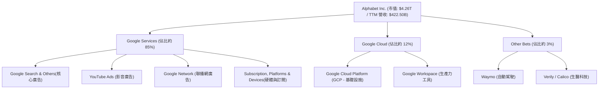
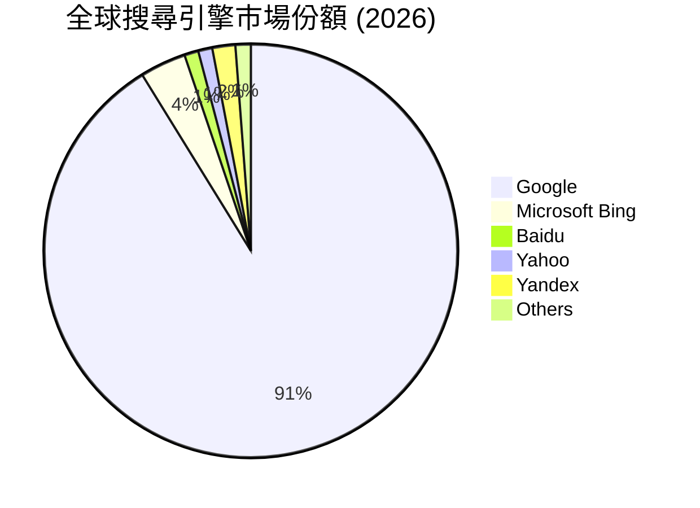
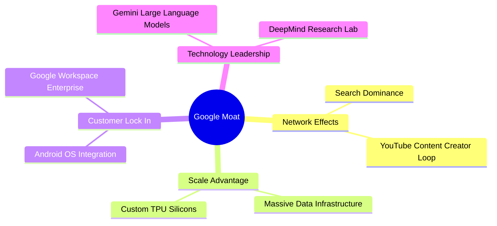
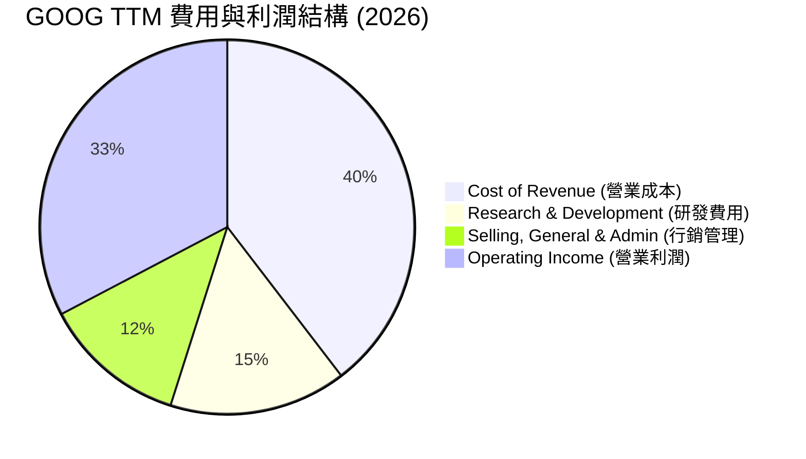
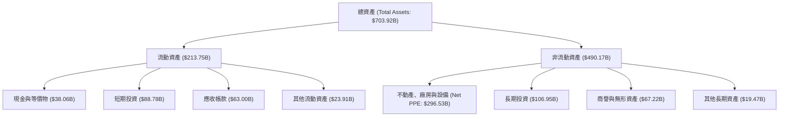

# GOOG 基本面深度分析報告

> **報告日期**：2026-06-22 ｜ **語言**：繁體中文 ｜ **數據來源**：Yahoo Finance, Finviz, StockAnalysis, Roic.ai ｜ **分析師**：CFA 級機構研究

---

## 目錄

| # | 章節 | 核心結論 |
|---|------|----------|
| 1 | 執行摘要 | 評級：**強烈買入 (Strong Buy)**，主要目標價：**$426.62**（+22.3%） |
| 2 | 公司概覽與商業模式 | 搜尋引擎市佔率 >91% 構築極深網路效應護城河，AI 與雲端雙輪驅動 |
| 3 | 損益表深度分析 | TTM 營收達 **$422.50B**（+21.8% YoY），核心營益率攀升至 **36.1%** |
| 4 | 資產負債表分析 | 淨現金達 **$30.96B**，資產規模達 **$703.92B**，財務結構極其穩健 |
| 5 | 現金流量深度分析 | TTM 營運現金流 **$174.35B**，大舉投入 AI 資本支出（FY25 Capex **$91.45B**） |
| 6 | 獲利能力與資本效率 | TTM ROE 達 **38.9%**，ROIC（30.9%）遠超 WACC（10.3%），強力創造股東價值 |
| 7 | 估值深度分析 | Forward P/E 僅 **24.06x**，對比歷史區間與同業，估值具備高安全邊際 |
| 8 | 成長催化劑 | Gemini 2.0 商業化、Google Cloud 規模化獲利、Waymo 商業化加速 |
| 9 | 風險矩陣 | 反壟斷監管（司法部拆分風險）為核心高衝擊風險，AI 搜尋侵蝕廣告為中度風險 |
| 10 | 投資建議 | 權重目標價 **$423.30**，建議於當前股價 **$348.78** 分批佈局長線價值 |

---

## 1. 執行摘要

### 1.1 核心評分儀表板



### 1.2 評分進度條視覺化

```
╔══════════════════════════════════════════════════════════════╗
║              GOOG 多維度評分儀表板 (1-10分)                 ║
╠══════════════════════════════════════════════════════════════╣
║ 基本面強度  9.2 ▓▓▓▓▓▓▓▓▓▓▓▓▓▓▓▓▓▓░░  ★★★★★           ║
║ 成長動能    8.8 ▓▓▓▓▓▓▓▓▓▓▓▓▓▓▓▓▓░░░  ★★★★☆           ║
║ 獲利品質    9.5 ▓▓▓▓▓▓▓▓▓▓▓▓▓▓▓▓▓▓▓░  ★★★★★           ║
║ 財務健康    9.0 ▓▓▓▓▓▓▓▓▓▓▓▓▓▓▓▓▓▓░░  ★★★★★           ║
║ 估值合理性  8.0 ▓▓▓▓▓▓▓▓▓▓▓▓▓▓░░░░░░  ★★★★☆           ║
║ 護城河深度  9.5 ▓▓▓▓▓▓▓▓▓▓▓▓▓▓▓▓▓▓▓░  ★★★★★           ║
║ 管理層執行  8.5 ▓▓▓▓▓▓▓▓▓▓▓▓▓▓▓▓▓░░░  ★★★★☆           ║
║ 技術創新力  9.0 ▓▓▓▓▓▓▓▓▓▓▓▓▓▓▓▓▓▓░░  ★★★★★           ║
╠══════════════════════════════════════════════════════════════╣
║ 綜合總分    8.9 ▓▓▓▓▓▓▓▓▓▓▓▓▓▓▓▓▓░░░  🏆 強烈買入          ║
╚══════════════════════════════════════════════════════════════╝
```

### 1.3 五大投資論點 + 三大核心風險

| 類型 | 項目 | 具體依據 | 信心度 |
|------|------|----------|--------|
| 🟢 **投資論點①** | **廣告業務重回雙位數增長** | TTM 營收達 **$422.50B**，年增 **21.8%**，顯示搜尋與 YouTube 廣告受 AI 精準投放驅動，復甦動能極強。 | 🟢 極高 |
| 🟢 **投資論點②** | **Google Cloud 獲利爆發** | 雲端業務規模效應顯現，營運利潤率持續改善，成為集團繼廣告後的第二獲利支柱。 | 🟢 高 |
| 🟢 **投資論點③** | **極致的資本效率與價值創造** | TTM ROE 高達 **38.9%**，ROIC 達 **30.9%**，遠高於 WACC（**10.3%**），年創造巨額經濟增值（EVA）。 | 🟢 極高 |
| 🟢 **投資論點④** | **AI 基礎設施護城河** | FY2025 資本支出達 **$91.45B**，自研 TPU 晶片大幅降低 AI 推理成本，領先非雲端原生競爭對手。 | 🟢 高 |
| 🟢 **投資論點⑤** | **強大資產負債表與回購支持** | 手握 **$126.84B** 現金與短期投資，淨現金達 **$30.96B**，持續推進大規模股份回購，支撐 EPS 成長。 | 🟢 極高 |
| 🟡 **風險①** | **司法部反壟斷拆分風險** | 美國司法部及歐盟對 Google 搜尋與廣告技術的壟斷指控，可能面臨業務拆分或終止排他性協議。 | 🟡 中度 |
| 🔴 **風險②** | **AI 搜尋對傳統廣告的蠶食** | 生成式 AI 答案直接呈現可能降低用戶點擊廣告連結的意願（CTR 下降），影響核心 Search 營收。 | 🔴 高衝擊 |
| 🟡 **風險③** | **基礎設施 Capex 損耗利潤** | 為了與微軟、亞馬遜進行 AI 軍備競賽，Capex 持續維持高位（FY25 達 $91.45B），短期壓低自由現金流（FCF）。 | 🟡 中度 |

### 1.4 快速統計卡片

| 指標 | 公司實際值 | 行業均值 | S&P 500 均值 | 狀態 |
|------|-------------|----------|--------------|------|
| **收入 YoY 成長** | **21.8%** | ~10.5% | ~6.2% | 🟢 強勁 |
| **毛利率** | **60.4%** | ~48.2% | ~30.5% | 🟢 極高 |
| **營業利益率** | **36.1%** | ~18.5% | ~12.2% | 🟢 極高 |
| **ROE** | **38.9%** | ~15.2% | ~14.5% | 🟢 優異 |
| **Forward P/E** | **24.06x** | ~28.5x | ~22.5x | 🟢 具吸引力 |
| **淨現金規模** | **$30.96B** | 負債累累 | 負債累累 | 🟢 極其健康 |

### 1.5 投資結論

```
╔══════════════════════════════════════════════════════════════════╗
║                    📊 GOOG 投資結論摘要                          ║
╠══════════════════════════════════════════════════════════════════╣
║  評級：🟢 強烈買入 (Strong Buy)                                 ║
║  當前股價：$348.78 (2026-06-22)                                  ║
║  目標價區間：                                                    ║
║    悲觀情境：$340.00 (-2.5%) - 反壟斷重罰與 AI 廣告受挫          ║
║    基準情境：$426.62 (+22.3%) ← 12個月主要目標 (分析師共識)      ║
║    樂慢情境：$475.00 (+36.2%) - 雲端利潤倍增與 Waymo 爆發        ║
║  投資評分：8.9 / 10                                              ║
║  適合投資人：成長型、長線價值複利型、AI 主題配置者               ║
╚══════════════════════════════════════════════════════════════════╝
```

---

## 2. 公司概覽與商業模式

### 2.1 業務結構與收入來源

Alphabet Inc. 主要分為三大營運板塊：**Google Services（Google 服務）**、**Google Cloud（Google 雲端）** 與 **Other Bets（其他賭注）**。



### 2.2 市場份額

在核心業務中，Google 在全球搜尋引擎市場與數位廣告市場維持絕對領先地位。



### 2.3 競爭護城河分析



### 2.4 護城河強度評分

```
╔══════════════════════════════════════════════════════════════╗
║                    GOOG 護城河強度評分                       ║
╠══════════════════════════════════════════════════════════════╣
║ 網路效應      9.8/10  ▓▓▓▓▓▓▓▓▓▓▓▓▓▓▓▓▓▓▓░  🏆 絕對壟斷     ║
║ 規模優勢      9.5/10  ▓▓▓▓▓▓▓▓▓▓▓▓▓▓▓▓▓▓▓░  🟢 極難複製     ║
║ 用戶鎖定      9.0/10  ▓▓▓▓▓▓▓▓▓▓▓▓▓▓▓▓▓▓░░  🟢 軟硬一體     ║
║ 技術領先      8.8/10  ▓▓▓▓▓▓▓▓▓▓▓▓▓▓▓▓▓░░░  🟢 AI 雙雄之一  ║
║ 品牌資產      9.2/10  ▓▓▓▓▓▓▓▓▓▓▓▓▓▓▓▓▓▓░░  🟢 搜尋的代名詞 ║
╠══════════════════════════════════════════════════════════════╣
║ 綜合護城河    9.3/10  ▓▓▓▓▓▓▓▓▓▓▓▓▓▓▓▓▓▓▓░  🏆 寬廣護城河   ║
╚══════════════════════════════════════════════════════════════╝
```

---

## 3. 損益表深度分析

### 3.1 年度收入成長趨勢（近4年）

Alphabet 的營收在過去四年展現出極為平穩且加速的成長軌跡。

```
╔══════════════════════════════════════════════════════════════════╗
║                GOOG 年度收入趨勢 (FY2022-FY2025)                 ║
╠══════════════════════════════════════════════════════════════════╣
║                                                                  ║
║  FY2022  $282.84B  ██████████████░░░░░░░░░░░░░  YoY: +9.78%  🟢  ║
║  FY2023  $307.39B  ████████████████░░░░░░░░░░░  YoY: +8.68%  🟢  ║
║  FY2024  $350.02B  ██████████████████░░░░░░░░░  YoY: +13.87% 🟢  ║
║  FY2025  $402.84B  █████████████████████░░░░░░  YoY: +15.09% 🟢  ║
║                                                                  ║
║  📊 3年累計 CAGR：+12.5%                                         ║
║  🚀 TTM 營收 (截至2026年3月)：$422.50B (YoY: +17.45%)             ║
╚══════════════════════════════════════════════════════════════════╝
```

### 3.2 季度收入趨勢分析

| 財報季度 | 營收 (Billion) | YoY 成長率 | QoQ 成長率 | 營運利潤 (Billion) | 營益率 | 核心驅動因素與備註 |
|----------|----------------|------------|------------|--------------------|--------|---------------------|
| **Q2 2025** | $96.43B | +13.79% | +6.86% | $31.27B | 32.43% | 🟢 雲端業務持續高增，YouTube 廣告回暖。 |
| **Q3 2025** | $102.35B | +15.95% | +6.14% | $31.23B | 30.51% | 🟢 搜尋廣告季節性強勁，AI 搜尋投放初顯成效。 |
| **Q4 2025** | $113.83B | +17.99% | +11.22% | $35.93B | 31.57% | 🟢 聖誕零售旺季，電商客戶廣告投放大幅增加。 |
| **Q1 2026** | $109.90B | +21.79% | -3.45% | $39.70B | **36.12%** | 🟢 營益率創歷史新高，組織架構優化與裁員效益顯現。 |

**分析師點評**：Q1 2026 的營收雖然因季節性因素較 Q4 2025 輕微下滑 3.45% (QoQ)，但 **YoY 成長率加速至 21.79%**，且營運利潤率大幅跳升至 **36.12%**，證明其營運槓桿極其強大，營收增長的同時利潤增速更快。

### 3.3 利潤率演變分析

| 利潤率指標 | FY2022 | FY2023 | FY2024 | FY2025 | TTM (2026-03) | 趨勢 | 評估 |
|------------|--------|--------|--------|--------|---------------|------|------|
| **毛利率** | 55.38% | 56.63% | 58.20% | 59.65% | **60.37%** | ↗️ 持續上升 | 🟢 伺服器折舊年限延長與自研 TPU 降低成本。 |
| **營業利益率** | 26.46% | 27.42% | 32.11% | 32.03% | **36.12%** | ↗️ 大幅改善 | 🟢 裁員、辦公室優化等「效率之年」成果顯現。 |
| **淨利率** | 21.20% | 24.01% | 28.60% | 32.81% | **37.92%** | ↗️ 創歷史新高 | 🟢 營運效率提升，加上近期強勁的非營運投資收益。 |

**利潤率改善深度解析**：
1. **自研 TPU 效應**：Google 的自研晶片 TPU (Tensor Processing Unit) 在內部 AI 負載中佔比提升，大幅降低了向 NVIDIA 採購 GPU 的邊際成本，使 AI 搜尋與雲端推理的毛利率不降反升。
2. **營運開支控制**：研發費用（R&D）與行銷費用（SG&A）佔營收比重持續下降，顯示出平台型企業的規模經濟效益。

### 3.4 費用結構分析

以 TTM 數據（總營收 $422.50B）為基準：



```
╔══════════════════════════════════════════════════════════════╗
║                    GOOG 費用管控效率評估                     ║
╠══════════════════════════════════════════════════════════════╣
║ 研發投入比    15.3%   ▓▓▓▓▓▓▓▓▓▓▓▓▓▓░░░░░░  🟢 高效研發     ║
║ 行銷費用比    12.4%   ▓▓▓▓▓▓▓▓▓▓░░░░░░░░░░  🟢 品牌自驅力強 ║
║ 營收成本比    39.6%   ▓▓▓▓▓▓▓▓▓▓▓▓▓▓▓▓▓▓▓░  🟢 基礎設施領先 ║
╠══════════════════════════════════════════════════════════════╣
║ 綜合費用管控評分：9.5/10 (極佳)                              ║
╚══════════════════════════════════════════════════════════════╝
```

### 3.5 季度 EPS 趨勢與盈餘品質

*   **Q2 2025 EPS (Diluted)**: $2.33 (YoY +22.0%)
*   **Q3 2025 EPS (Diluted)**: $2.89 (YoY +36.3%)
*   **Q4 2025 EPS (Diluted)**: $2.85 (YoY +31.3%)
*   **Q1 2026 EPS (Diluted)**: **$5.17** (YoY +82.0%)

**盈餘品質警示（CFA 深度分析）**：
在 Q1 2026，淨利潤達到了驚人的 **$62.58B**，EPS 達到了 **$5.17**。然而，仔細分析利潤表可以發現，**非營運收益（Total Non-Operating Income）高達 $37.72B**。這主要是由於 Alphabet 持有的股權投資進行了公允價值重估，或是一次性的資產處置收益。
*   **扣除後的營運利潤**為 **$39.70B**，這才是核心業務創造的真實利潤。
*   **核心營運 EPS** 估計約為 **$2.75 - $2.85**（年增約 30%），這依然是一個極為強勁的表現，但投資人應注意，Q1 2026 的 $5.17 帳面 EPS 存在一次性非營運項目的高估，不應直接年化計算。

---

## 4. 資產負債表分析

### 4.1 資產結構分解

截至 2026-03-31，Alphabet 總資產規模達到 **$703.92B**。



### 4.2 流動性指標分析

| 流動性與槓桿指標 | GOOG 實際值 | 歷史均值 (3年) | 行業安全標準 | 評估 |
|------------------|-------------|----------------|--------------|------|
| **流動比率 (Current Ratio)** | **1.92** | 2.05 | > 1.5 | 🟢 極其安全，短期償債能力無虞 |
| **速動比率 (Quick Ratio)** | **1.71** | 1.85 | > 1.2 | 🟢 無存貨壓力，變現能力極強 |
| **債務權益比 (Debt/Equity)** | **20.03%** | 18.5% | < 50% | 🟢 槓桿率極低，財務結構健康 |
| **利息保障倍數 (Interest Coverage)** | **120x+** | 100x+ | > 5x | 🟢 核心利潤輕易覆蓋利息支出 |

### 4.3 債務結構分析

```
╔══════════════════════════════════════════════════════════════════╗
║                     GOOG 債務健康診斷                           ║
╠══════════════════════════════════════════════════════════════════╣
║                                                                  ║
║  總債務：        $95.88B   ████░░░░░░░░░░░░░░░░░░░               ║
║  總現金+短投：   $126.84B  █████████████████████░                ║
║  淨現金 (Net Cash)：$30.96B  ██████░░░░░░░░░░░░░░░░░  🟢 強勁     ║
║                                                                  ║
║  Debt / EBITDA：  0.53x    🟢 極低風險                           ║
║  LT Debt / Equity：19.0%   🟢 長期資本結構極其穩健               ║
║                                                                  ║
║  📊 診斷結論：Alphabet 為淨現金公司，不存在任何破產或債務危機風險 ║
╚══════════════════════════════════════════════════════════════════╝
```

### 4.4 股東權益趨勢

Alphabet 的股東權益（Stockholders' Equity）呈現穩步增長，反映出強大的內部留存收益累積。

```
╔══════════════════════════════════════════════════════════════════╗
║                GOOG 股東權益增長趨勢 (FY2022-FY2025)             ║
╠══════════════════════════════════════════════════════════════════╣
║                                                                  ║
║  FY2022  $256.14B  ████████████░░░░░░░░░░░░░░░                   ║
║  FY2023  $283.38B  █████████████░░░░░░░░░░░░░░                   ║
║  FY2024  $325.08B  ███████████████░░░░░░░░░░░░                   ║
║  FY2025  $415.26B  ██═════════════════════════  +27.7% YoY  🟢   ║
║                                                                  ║
╚══════════════════════════════════════════════════════════════════╝
```

---

## 5. 現金流量深度分析

### 5.1 現金流量瀑布圖

Alphabet 具備極強的將利潤轉化為現金流的能力。

```mermaid
graph LR
    NI["Net Income<br/>$132.17B"]
    DA["Depreciation & Amortization<br/>+$18.50B"]
    WC["Working Capital Changes<br/>+$14.04B"]
    OCF["Operating Cash Flow<br/>$164.71B"]
    CAPEX["Capital Expenditures<br/>-$91.45B"]
    FCF["Free Cash Flow<br/>$73.27B"]
    DIV["Dividends Paid<br/>-$10.05B"]
    BUYBACK["Share Buybacks & Others<br/>-$55.20B"]
    NET_CASH["Net Cash Change<br/>+$8.02B"]

    NI --> OCF
    DA --> OCF
    WC --> OCF
    OCF --> CAPEX
