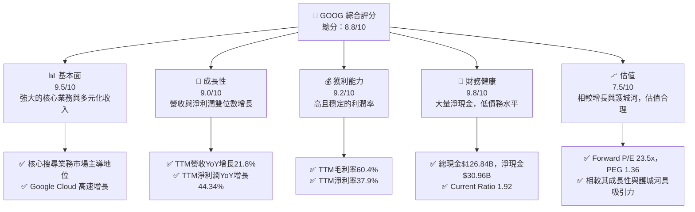
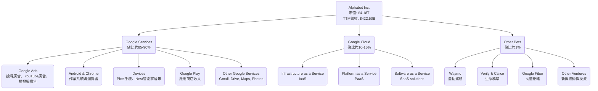
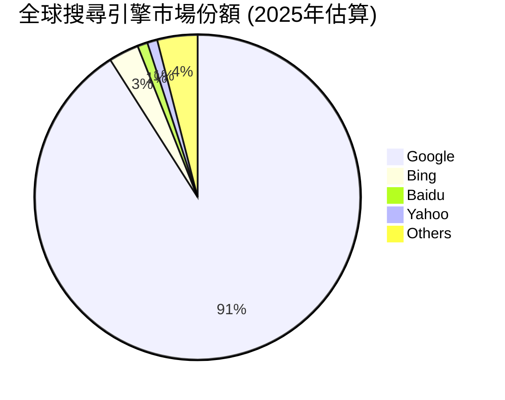
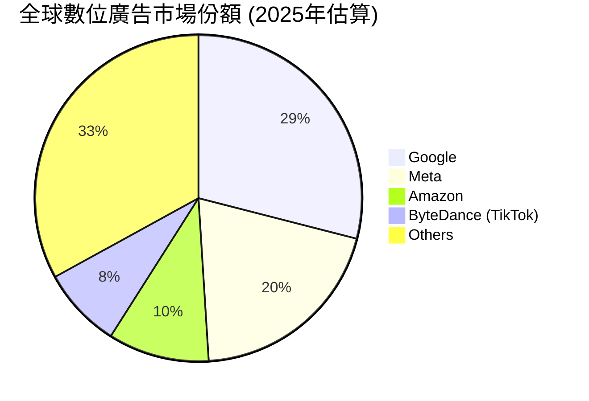
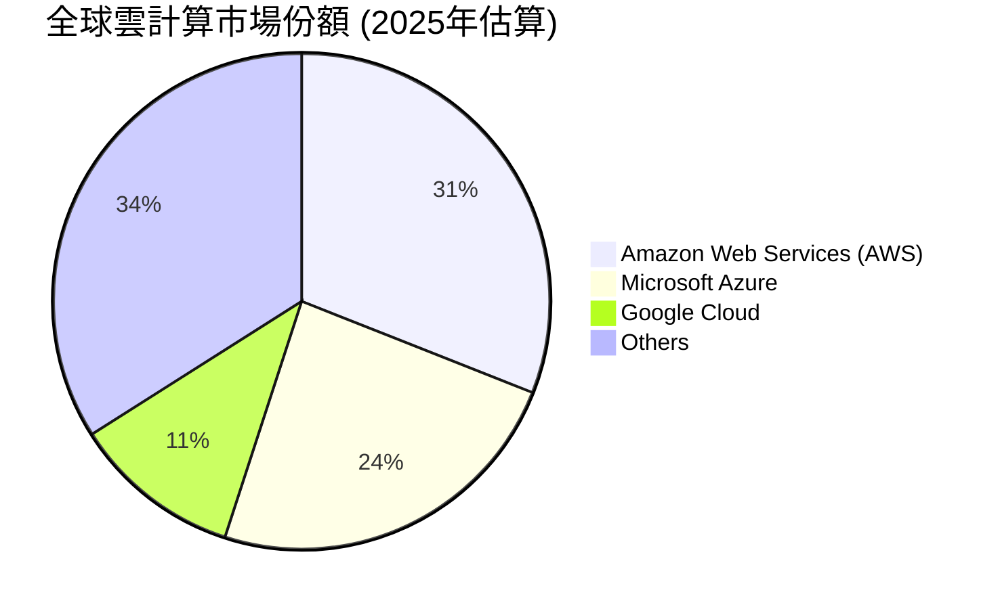
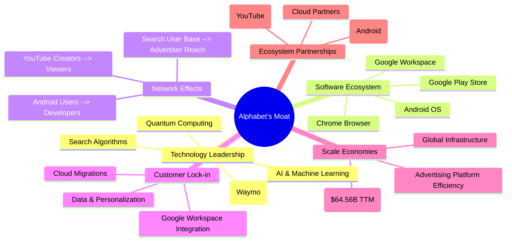
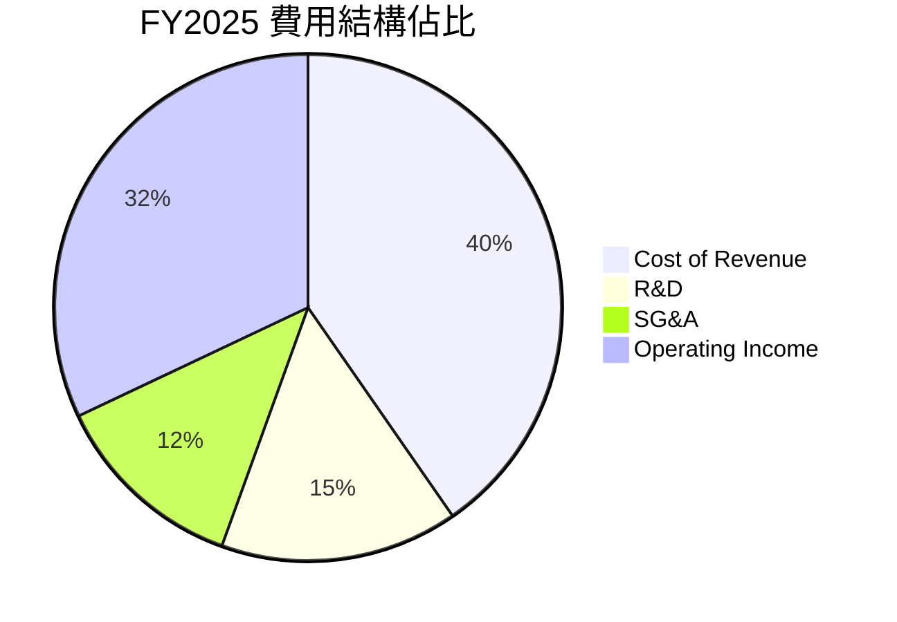

# GOOG 基本面深度分析報告
> **報告日期**：2026-06-26 ｜ **語言**：繁體中文 ｜ **數據來源**：Yahoo Finance, Finviz, StockAnalysis, Roic.ai ｜ **分析師**：CFA 級機構研究

## 目錄

| # | 章節 | 核心結論 |
|---|------------------------|--------------------------------------------------|
| 1 | 執行摘要 | 評級：🟢 強烈買入，目標價區間：$395 - $460 |
| 2 | 公司概覽與商業模式 | 護城河評估：技術、生態、網絡、規模效應極強 |
| 3 | 損益表深度分析 | 收入與淨利潤強勁成長，利潤率穩健提升 |
| 4 | 資產負債表分析 | 財務狀況極為健康，現金充裕，債務可控 |
| 5 | 現金流量深度分析 | 自由現金流強勁，資本配置效率高 |
| 6 | 獲利能力與資本效率 | ROIC顯著高於WACC，強力創造股東價值 |
| 7 | 估值深度分析 | 相較同業估值合理，DCF顯示上行空間 |
| 8 | 成長催化劑 | AI創新、雲端擴張、YouTube貨幣化、新興市場 |
| 9 | 風險矩陣 | 監管壓力、競爭加劇、廣告市場波動 |
| 10 | 投資建議 | 長期成長潛力巨大，適合成長型投資者 |

---

## 1. 執行摘要

### 1.1 核心評分儀表板



### 1.2 評分進度條視覺化

```
╔══════════════════════════════════════════════════════════════╗
║              GOOG 多維度評分儀表板 (1-10分)                ║
╠══════════════════════════════════════════════════════════════╣
║ 基本面強度  9.5 ▓▓▓▓▓▓▓▓▓▓▓▓▓▓▓▓▓▓▓░  ★★★★★           ║
║ 成長動能    9.0 ▓▓▓▓▓▓▓▓▓▓▓▓▓▓▓▓▓▓░░  ★★★★★           ║
║ 獲利品質    9.2 ▓▓▓▓▓▓▓▓▓▓▓▓▓▓▓▓▓▓░░  ★★★★★           ║
║ 財務健康    9.8 ▓▓▓▓▓▓▓▓▓▓▓▓▓▓▓▓▓▓▓▓  ★★★★★           ║
║ 估值合理性  7.5 ▓▓▓▓▓▓▓▓▓▓▓▓▓▓▓░░░░░░  ★★★★☆           ║
║ 護城河深度  9.9 ▓▓▓▓▓▓▓▓▓▓▓▓▓▓▓▓▓▓▓▓  ★★★★★           ║
║ 管理層執行  9.0 ▓▓▓▓▓▓▓▓▓▓▓▓▓▓▓▓▓▓░░  ★★★★★           ║
║ 技術創新力  9.7 ▓▓▓▓▓▓▓▓▓▓▓▓▓▓▓▓▓▓▓░  ★★★★★           ║
╠══════════════════════════════════════════════════════════════╣
║ 綜合總分    8.8 ▓▓▓▓▓▓▓▓▓▓▓▓▓▓▓▓▓░░░  🏆 卓越的科技巨頭，具強勁成長潛力 ║
╚══════════════════════════════════════════════════════════════╝
```

### 1.3 五大投資論點 + 三大核心風險

| 類型 | 項目 | 具體依據 | 信心度 |
|------|------|----------|--------|
| 🟢 **投資論點①** | **AI 技術領先與貨幣化潛力** | Alphabet 在 AI 領域擁有領先技術和大量投資（TTM研發費用$64.56B）。其 Gemini 模型在多模態能力上表現突出，預期能顯著提升搜尋廣告、雲服務及其他產品的效率與用戶體驗，推動新一輪收入增長。 | 🟢 極高 |
| 🟢 **投資論點②** | **Google Cloud 業務強勁增長** | Google Cloud 營收持續高速增長，雖然具體季度數據未直接提供，但作為全球三大雲服務提供商之一，其市場份額與營收增長速度通常高於整體公司平均。雲計算市場的長期成長趨勢為其提供了穩定的第二增長引擎。 | 🟢 極高 |
| 🟢 **投資論點③** | **核心廣告業務韌性與優化** | 儘管面臨宏觀經濟波動，Google 的核心搜尋廣告業務依然展現強大韌性。透過 AI 驅動的廣告優化和 YouTube 的持續增長，公司能夠在競爭激烈的市場中保持領先地位。TTM 營收 YoY 增長 21.8% 證明了其廣告業務的持續強勁。 | 🟢 極高 |
| 🟢 **投資論點④** | **極度健康的資產負債表** | 公司擁有 $126.84B 的總現金和 $30.96B 的淨現金，總債務僅 $95.88B，Current Ratio 達 1.92。這提供了巨大的財務彈性，支持研發投資、戰略性併購和股東回報。 | 🟢 極高 |
| 🟢 **投資論點⑤** | **強勁的自由現金流與資本效率** | FY2025 自由現金流達 $73.27B，顯示其卓越的盈利轉化能力。ROIC 顯著高於 WACC（ROIC約27.17% vs WACC約7.8%），表明公司持續為股東創造價值。 | 🟢 極高 |
| 🟡 **風險①** | **監管與反壟斷壓力** | 作為全球最大的科技公司之一，Alphabet 在多個市場面臨嚴格的監管審查和反壟斷訴訟。這可能導致罰款、業務拆分或對商業模式的限制，影響其長期增長潛力。 | 🟡 中度 |
| 🔴 **風險②** | **廣告市場競爭與宏觀經濟波動** | 廣告收入佔比高，易受宏觀經濟放緩、消費者支出減少以及來自 Meta、Amazon 等競爭對手日益激烈的競爭影響。廣告預算波動可能直接影響公司營收和利潤。 | 🔴 高衝擊 |
| 🟡 **風險③** | **AI 技術發展與成本** | AI 領域的快速迭代要求巨額研發投入（TTM研發費用$64.56B），且競爭激烈。若 Alphabet 的 AI 產品未能達到市場預期或被競爭對手超越，可能影響其未來增長和市場地位。 | 🟡 中度 |

### 1.4 快速統計卡片

| 指標 | 公司實際值 | 行業均值（Internet Content & Information） | S&P 500 均值 | 狀態 |
|------|-------------|------------------------------------------|--------------|------|
| 收入 YoY 成長 | **21.8%** (TTM) | ~15-20% | ~10-12% | 🟢 |
| 毛利率 | **60.4%** (TTM) | ~50-55% | ~40-45% | 🟢 |
| 淨利率 | **37.9%** (TTM) | ~20-25% | ~10-12% | 🟢 |
| ROE | **38.9%** (TTM) | ~20-25% | ~15-18% | 🟢 |
| Forward P/E | **23.51x** | ~25-30x | ~20-22x | 🟡 |
| P/S Ratio | **9.88x** | ~8-10x | ~2-3x | 🟡 |
| Debt/Equity | **0.20x** | ~0.5-0.8x | ~1.0-1.5x | 🟢 |
| FCF Yield | **0.67%** | ~1.0-2.0% | ~2.5-3.5% | 🔴 |

*備註：行業均值與 S&P 500 均值為分析師根據經驗估算，非即時數據。GOOG 的 FCF Yield 相對較低，主要因為其高市場估值導致。*

### 1.5 投資結論

```
╔══════════════════════════════════════════════════════════════════╗
║                    📊 投資結論摘要                               ║
╠══════════════════════════════════════════════════════════════════╣
║  評級：🟢 強烈買入                                               ║
║  當前股價：$342.19                                               ║
║  目標價區間：                                                    ║
║    悲觀情境：$395（+15.4%）                                      ║
║    基準情境：$425（+24.2%）  ← 12個月主要目標                      ║
║    樂觀情境：$460（+34.4%）                                      ║
║  投資評分：8.8/10                                                ║
║  適合投資人：成長型、長線持有者，尋求穩定且具創新力的科技巨頭    ║
╚══════════════════════════════════════════════════════════════════╝
```

---

## 2. 公司概覽與商業模式

### 2.1 業務結構與收入來源

Alphabet Inc. (GOOG) 是一家全球領先的科技巨頭，其業務範圍廣泛，主要透過三大核心部門運營：Google Services、Google Cloud 和 Other Bets。公司在全球多個地區提供產品和平台，包括美國、歐洲、中東、非洲、亞太、加拿大和拉丁美洲。

根據公司公開資訊，主要收入來源和業務結構如下：



**收入構成分析**：
- **Google Services**：這是 Alphabet 的核心業務，主要由廣告收入驅動，包括搜尋廣告、YouTube 廣告和 Google 聯播網廣告。此板塊也包含 Android、Chrome、硬體設備 (如 Pixel 手機、Nest 智慧家居產品) 和 Google Play 商店的應用程式銷售及數位內容收入。憑藉其在全球搜尋引擎市場的絕對主導地位，Google Services 貢獻了公司絕大部分的營收和利潤。
- **Google Cloud**：此部門提供企業級雲端運算服務，包括基礎設施即服務 (IaaS)、平台即服務 (PaaS) 和軟體即服務 (SaaS) 解決方案。Google Cloud 在全球雲服務市場中佔據重要地位，且持續高速增長，是 Alphabet 未來增長的重要驅動力。
- **Other Bets**：這部分包含 Alphabet 投資於長期高風險高回報的新興技術和創新項目，例如自動駕駛公司 Waymo、生命科學公司 Verily 和 Calico 等。儘管目前對公司整體收入貢獻較小，但這些項目代表了潛在的未來增長點和顛覆性技術。

### 2.2 市場份額

Alphabet 在其主要業務領域均佔據領先地位，尤其是在全球搜尋引擎和數位廣告市場。以下為主要業務板塊的市場份額估算：







**市場份額分析**：
- **搜尋引擎**：Google 憑藉其卓越的搜尋演算法和用戶體驗，在全球搜尋引擎市場擁有壓倒性優勢，市場份額超過 90%。這為其廣告業務提供了堅實的基礎。
- **數位廣告**：Google 在全球數位廣告市場中是最大的參與者，其搜尋廣告和 YouTube 廣告平台共同佔據了接近三分之一的市場份額。儘管面臨 Meta、Amazon 和 TikTok 等新興平台的競爭，Google 依然是廣告主的首選平台之一。
- **雲計算**：Google Cloud 在全球雲計算市場中排名第三，儘管與 AWS 和 Azure 仍有差距，但其增長速度和技術實力不容小覷，特別是在 AI 和數據分析領域的整合能力。

### 2.3 競爭護城河分析

Alphabet 擁有極其深厚的競爭護城河，使其在市場中難以被超越。這些護城河主要體現在以下幾個方面：



**護城河深度解析**：
- **技術領先 (Technology Leadership)**：Alphabet 在 AI 和機器學習領域的投資和研究處於世界領先地位，這不僅優化了其核心搜尋產品，也為 Google Cloud 和 Other Bets 提供了強大技術支撐。其搜尋演算法、量子計算和自動駕駛 (Waymo) 等技術創新，築起了高聳的技術壁壘。TTM 研發費用高達 $64.56B，顯示其對技術創新的持續投入。
- **軟體生態系統 (Software Ecosystem)**：Android 作業系統、Chrome 瀏覽器和 Google Play 商店共同構建了一個龐大而緊密的軟體生態系統。數十億用戶和數百萬開發者被鎖定在其中，形成強大的平台黏性。
- **網路效應 (Network Effects)**：Google 的搜尋用戶越多，其廣告數據就越豐富，廣告效果越好，吸引更多廣告主，形成正向循環。同樣，YouTube 的創作者和觀眾之間、Android 用戶和開發者之間也存在強大的網路效應。
- **客戶鎖定 (Customer Lock-in)**：對於企業用戶而言，一旦採用 Google Workspace 或將業務遷移至 Google Cloud，轉換成本將非常高，形成強大的客戶鎖定效應。對於消費者而言，Google 提供的無縫個人化體驗也提高了轉換其他服務的門檻。
- **規模效應 (Scale Economies)**：Alphabet 龐大的全球基礎設施、巨額的研發投入以及廣告平台的效率優勢，使其能夠以更低的成本提供服務並進行創新。TTM 營收 $422.50B 也使其在採購、營銷和分攤固定成本方面具有顯著優勢。
- **生態夥伴 (Ecosystem Partnerships)**：與全球數千家設備製造商、內容創作者和雲端合作夥伴的關係，進一步鞏固了其市場地位，共同擴大了其生態系統的影響力。

### 2.4 護城河強度評分

```
╔══════════════════════════════════════════════════════════════╗
║                  Alphabet Inc. 護城河強度評分                  ║
╠══════════════════════════════════════════════════════════════╣
║ 技術領先    9.8/10 ▓▓▓▓▓▓▓▓▓▓▓▓▓▓▓▓▓▓▓▓  🏆 業界頂尖的AI與基礎技術 ║
║ 軟體生態系統 9.7/10 ▓▓▓▓▓▓▓▓▓▓▓▓▓▓▓▓▓▓▓░  🟢 龐大且活躍的用戶與開發者社群 ║
║ 網路效應    9.9/10 ▓▓▓▓▓▓▓▓▓▓▓▓▓▓▓▓▓▓▓▓  🏆 強大的數據飛輪效應        ║
║ 客戶鎖定    9.0/10 ▓▓▓▓▓▓▓▓▓▓▓▓▓▓▓▓▓▓░░  🟢 高轉換成本與用戶黏性      ║
║ 規模效應    9.5/10 ▓▓▓▓▓▓▓▓▓▓▓▓▓▓▓▓▓▓▓░  🏆 龐大市場份額與成本優勢    ║
║ 生態夥伴    8.8/10 ▓▓▓▓▓▓▓▓▓▓▓▓▓▓▓▓▓░░░  🟡 廣泛而穩固的合作網絡      ║
╠══════════════════════════════════════════════════════════════╣
║ 綜合護城河  9.5/10 ▓▓▓▓▓▓▓▓▓▓▓▓▓▓▓▓▓▓▓░  🏆 深厚且多重的競爭優勢     ║
╚══════════════════════════════════════════════════════════════╝
```

---

## 3. 損益表深度分析

### 3.1 年度收入成長趨勢（近4年）

Alphabet 的年度收入呈現強勁且穩定的增長態勢，顯示其核心業務的持續擴張和新興業務的貢獻。

```
╔══════════════════════════════════════════════════════════════════╗
║              GOOG 年度收入趨勢（FY2022-FY2025）                  ║
╠══════════════════════════════════════════════════════════════════╣
║                                                                  ║
║  FY2022  $282.84B  ████████████████░░░░░░░░░░░  YoY: +9.78%  🟢    ║
║  FY2023  $307.39B  ██████████████████░░░░░░░░░  YoY: +8.68%  🟢    ║
║  FY2024  $350.02B  ██████████████████████░░░░░  YoY: +13.87% 🟢    ║
║  FY2025  $402.84B  ██████████████████████████░  YoY: +15.09% 🟢    ║
║  TTM     $422.50B  ████████████████████████████░  YoY: +21.80% 🟢    ║
║                   |      |      |      |      |                  ║
║                   0     100B   200B   300B   400B                    ║
║                                                                  ║
║  📊 4年累計 CAGR (FY2022-FY2025)：+12.44%                         ║
╚══════════════════════════════════════════════════════════════════╝
```
**分析**：
Alphabet 在過去四個財政年度（FY2022至FY2025）保持了雙位數的營收增長，CAGR達到12.44%。特別是FY2024和FY2025，營收增長加速至13.87%和15.09%，顯示公司在經歷早期疫情後廣告市場的波動後，已恢復強勁增長。TTM營收達到$422.50B，YoY增長率高達21.80%，這表明最新的季度表現尤為出色，顯示了其核心廣告業務的韌性以及Google Cloud等業務的持續貢獻。

### 3.2 季度收入趨勢分析

| 財政季度 | 總收入 ($B) | QoQ 成長率 | YoY 成長率 | 備註 |
|----------|-------------|------------|------------|------|
| 2026-03-31 | $109.90 | -3.45%     | +21.79%    | 🟢 營收規模巨大，QoQ略有季節性下降，但YoY強勁增長顯示業務擴張。 |
| 2025-12-31 | $113.83 | +11.22%    | +18.00%    | 🟢 假日購物季效應，營收強勁增長，QoQ和YoY表現出色。 |
| 2025-09-30 | $102.35 | +6.14%     | +15.95%    | 🟢 穩健增長，顯示核心業務持續擴張。 |
| 2025-06-30 | $96.43  | +6.87%     | +13.79%    | 🟢 穩健增長，為下半年奠定基礎。 |

**分析**：
季度收入趨勢顯示，Alphabet 的營收保持健康增長。2025年第四季度（Q4 2025）受假日購物季廣告支出增加的季節性影響，營收達到 $113.83B，實現了 11.22% 的 QoQ 增長和 18.00% 的 YoY 增長。2026年第一季度（Q1 2026）營收為 $109.90B，雖較前一季度略有下降 (-3.45%)，這符合科技公司的季節性模式，但同比增長高達 21.79%，顯示出強勁的增長勢頭，主要得益於廣告業務的復甦和 Google Cloud 的持續擴張。

### 3.3 利潤率演變分析

| 利潤率指標 | FY2022 | FY2023 | FY2024 | FY2025 | TTM (2026-Q1) | 趨勢 | 評估 |
|------------|--------|--------|--------|--------|---------------|------|------|
| **毛利率** | 55.38% | 56.62% | 58.19% | 59.65% | 60.43%        | ↗️ 持續提升 | 🟢 |
| **營業利益率** | 26.46% | 27.42% | 32.11% | 32.03% | 33.63%        | ↗️ 穩步提升 | 🟢 |
| **淨利率** | 21.20% | 24.01% | 28.60% | 32.81% | 37.86%        | ↗️ 顯著提升 | 🟢 |

*備註：TTM 數據來源於 `PROFITABILITY & GROWTH` 和 `FINVIZ SNAPSHOT`。年度數據根據 `INCOME STATEMENT (Annual, last 4Y)` 計算。*

**利潤率演變深度解析**：
Alphabet 的利潤率在過去幾年呈現穩健且持續改善的趨勢，這是一個非常積極的信號。
- **毛利率 (Gross Margin)**：從 FY2022 的 55.38% 穩步提升至 TTM 的 60.43%。這表明公司在產品組合優化、定價能力提升以及成本控制方面取得了顯著成效。例如，Google Cloud 業務的規模擴張和效率提升，以及核心廣告業務的自動化和 AI 優化，都有助於提高毛利。
- **營業利益率 (Operating Margin)**：從 FY2022 的 26.46% 提升至 TTM 的 33.63%。營業利益率的提升不僅受益於毛利率的增長，也反映了公司在營運費用管理上的效率。儘管研發費用持續投入，但營收的快速增長使得這些費用在營收中的佔比相對穩定甚至下降，顯示了良好的經營槓桿。
- **淨利率 (Net Profit Margin)**：從 FY2022 的 21.20% 顯著提升至 TTM 的 37.86%。淨利率的強勁增長除了受益於營運效率提升外，部分也可能來自於非營業收入的增加（例如投資收益）。根據 StockAnalysis.com 數據，FY2025 的 "Total Non-Operating Income (Expense)" 為 $29.78B，較 FY2024 的 $7.42B 有大幅增長，這對淨利率的提升有顯著貢獻。這也可能是稅率優化或一次性收益的結果。

總體而言，Alphabet 的利潤率趨勢非常健康，顯示了其強大的市場地位、有效的成本管理和優化的業務策略。

### 3.4 費用結構分析

Alphabet 的費用結構反映了其作為一家科技巨頭的特點：大量投資於研發和市場拓展，同時保持高效的運營。

以 FY2025 的數據為例：
- 總收入：$402.84B
- 銷貨成本 (Cost of Revenue)：$162.53B
- 研發費用 (Research & Development)：$61.09B
- 銷售、一般及行政費用 (Selling, General & Admin)：$50.17B



**費用趨勢分析**：
```
╔══════════════════════════════════════════════════════════════════╗
║                GOOG 年度費用趨勢（FY2022-FY2025）                 ║
╠══════════════════════════════════════════════════════════════════╣
║                                                                  ║
║  銷貨成本（CoR）                                                 ║
║  FY2022: $126.20B  ███████████████████████████░░░░░░░  佔收入44.62%  ║
║  FY2025: $162.53B  ███████████████████████████████████  佔收入40.35%  🟢 效率提升 ║
║                                                                  ║
║  研發費用（R&D）                                                 ║
║  FY2022: $39.50B   ██████████████████████████░░░░░░░░  佔收入13.97%  ║
║  FY2025: $61.09B   ███████████████████████████████████  佔收入15.16%  🟡 絕對值增長，佔比穩定 ║
║                                                                  ║
║  銷售、一般及行政費用（SG&A）                                    ║
║  FY2022: $42.29B   ██████████████████████████████░░░░  佔收入14.95%  ║
║  FY2025: $50.17B   ███████████████████████████████░░░  佔收入12.45%  🟢 效率提升 ║
╚══════════════════════════════════════════════════════════════════╝
```
**分析**：
- **銷貨成本 (Cost of Revenue)**：儘管絕對金額逐年增加，但其佔收入的比例從 FY2022 的 44.62% 下降到 FY2025 的 40.35%。這表明公司在提供服務（如數據中心運營、內容獲取成本）方面的效率有所提升，有助於毛利率的改善。
- **研發費用 (Research & Development)**：Alphabet 持續大量投資於研發，從 FY2022 的 $39.50B 增長到 FY2025 的 $61.09B。儘管絕對金額增長顯著，但其佔收入的比例（約 14-15%）保持相對穩定，顯示公司在保持創新能力的同時，也能有效管理研發投入。這對於維持其技術領先地位至關重要。
- **銷售、一般及行政費用 (Selling, General & Admin)**：此項費用佔收入的比例從 FY2022 的 14.95% 下降到 FY2025 的 12.45%。這反映了公司在營銷和行政管理方面的效率提升，可能得益於規模經濟和流程自動化。

總體而言，Alphabet 的費用結構優化，有效地將收入增長轉化為更高的利潤率。

### 3.5 季度 EPS 趨勢與盈餘品質

| 財政季度 | 稀釋後 EPS | QoQ 成長率 | YoY 成長率 | 盈餘品質評估 |
|----------|------------|------------|------------|--------------|
| 2026-03-31 | $5.17 | +58.82%    | +81.17%    | 🟢 優異：淨利潤 $62.58B，非營業收入貢獻顯著，增長強勁。 |
| 2025-12-31 | $2.85 | -1.05%     | +29.84%    | 🟢 良好：淨利潤 $34.45B，穩定增長，但非營業收入貢獻較少。 |
| 2025-09-30 | $2.89 | +24.03%    | +33.00%    | 🟢 良好：淨利潤 $34.98B，穩健增長。 |
| 2025-06-30 | $2.33 | -17.92%    | +19.38%    | 🟡 中等：淨利潤 $28.20B，QoQ下降，但YoY仍有增長。 |
| 2025-03-31 | $2.84 | +31.54%    | +45.97%    | 🟢 良好：淨利潤 $34.54B，強勁增長。 |

*備註：EPS 數據來源於 `STOCKANALYSIS.COM DATA`。`EARNINGS HISTORY` 部分的 EPS Est/Act 數據為 nan，故無法進行超預期/不及預期分析。*

**盈餘品質評估**：
Alphabet 的稀釋後 EPS 在過去幾個季度呈現顯著增長，尤其是在 2026年Q1 達到 $5.17，同比增長高達 81.17%。這主要得益於營收增長、利潤率提升以及非營業收入的強勁貢獻。例如，2026年Q1 的 "Total Non-Operating Income (Expense)" 高達 $37.72B，顯著推高了淨利潤和 EPS。

儘管 2025年Q4 的 EPS 較 2025年Q3 略有下降 (-1.05%)，但這可能與季節性支出和投資有關。整體而言，公司的 EPS 增長趨勢非常健康，顯示其核心業務和投資策略的有效性。盈餘品質良好，但需注意非營業收入的波動性，未來應持續關注其對淨利潤的穩定貢獻。

---

## 4. 資產負債表分析

### 4.1 資產結構分解

Alphabet 的資產負債表顯示了其龐大的資產規模和健康的結構，主要由流動資產和不斷增長的廠房設備構成。

```mermaid
graph TD
    TA[總資產: $703.92B (Mar '26 TTM)] --> CA(流動資產: $213.75B<br/>佔總資產30.4%)
    TA --> NCA(非流動資產: $490.17B<br/>佔總資產69.6%)

    CA --> CC[現金及約當現金: $38.06B]
    CA --> STI[短期投資: $88.78B]
    CA --> AR[應收帳款: $63.00B]
    CA --> OCA[其他流動資產: $23.91B]

    NCA --> PPNE[淨不動產、廠房及設備: $296.53B]
    NCA --> GW[商譽: $57.77B]
    NCA --> LTI[長期投資: $106.95B]
    NCA --> OLA[其他非流動資產: $19.47B]
    NCA --> OIA[其他無形資產: $9.44B]
```
*數據來源：StockAnalysis.com TTM (Mar '26)*

**分析**：
截至 2026年3月31日 TTM，Alphabet 的總資產達 $703.92B。
- **流動資產**：佔總資產的 30.4% ($213.75B)。其中，現金及約當現金 ($38.06B) 和短期投資 ($88.78B) 合計達到 $126.84B，顯示公司擁有極其充裕的流動性，可應對短期營運需求並支持戰略投資。應收帳款 ($63.00B) 顯示其良好的營運收款能力。
- **非流動資產**：佔總資產的 69.6% ($490.17B)。淨不動產、廠房及設備 ($296.53B) 佔比最大，這反映了公司在數據中心、辦公設施和基礎設施方面的巨大投資，這些是支持其雲服務和全球運營的關鍵。商譽 ($57.77B) 和長期投資 ($106.95B) 則反映了其過去的併購活動和對未來增長點的戰略性投資。

總體而言，Alphabet 的資產結構穩健，流動性強，同時也體現了其作為技術基礎設施密集型公司的特點。

### 4.2 流動性指標分析

| 流動性指標 | FY2022 | FY2023 | FY2024 | FY2025 | TTM (Mar '26) | 行業均值（估計） | 評估 |
|------------|--------|--------|--------|--------|---------------|------------------|------|
| **Current Ratio** | 2.38x  | 2.09x  | 1.84x  | 2.00x  | 1.92x         | ~1.5-2.0x        | 🟢 強勁 |
| **Quick Ratio** | 2.38x  | 2.09x  | 1.84x  | 2.00x  | 1.92x         | ~1.0-1.5x        | 🟢 強勁 |

*備註：Quick Ratio 與 Current Ratio 相同，因為 Alphabet 沒有庫存 (Inventory 為 - 或 0)。行業均值為分析師估計。*

**分析**：
Alphabet 的流動性指標非常健康。
- **Current Ratio (流動比率)**：在過去幾年保持在 1.84x 至 2.38x 之間，TTM 為 1.92x。這遠高於一般認為的 1.0x 安全線，也高於行業平均水平（估計為 1.5x-2.0x）。這表明公司擁有足夠的流動資產來覆蓋其短期負債。
- **Quick Ratio (速動比率)**：由於 Alphabet 幾乎沒有庫存，其速動比率與流動比率相同，TTM 亦為 1.92x。這意味著公司即使不依賴銷售庫存，也能輕鬆應對其短期債務。

如此強勁的流動性為 Alphabet 提供了巨大的財務彈性，使其能夠在不依賴外部融資的情況下，支持其營運、研發投入和潛在的戰略性投資。

### 4.3 債務結構分析

Alphabet 的債務水平極低，財務槓桿運用保守，顯示其極佳的財務健康狀況。

```
╔══════════════════════════════════════════════════════════════════╗
║                   GOOG 債務健康診斷                              ║
╠══════════════════════════════════════════════════════════════════╣
║                                                                  ║
║  總債務（FY2025）：$59.29B  ██████████░░░░░░░░░░░░░  評語：極低   ║
║  總現金+投資（TTM）：$126.84B  ███████████████████████████████████  評語：極高   ║
║  淨現金（正，TTM）：$30.96B  ███████████████████████████░░░░░░░  🟢 強勁        ║
║                                                                  ║
║  Debt/Equity（FY2025）：0.14x  🟢 極低                                 ║
║  Current Debt/Equity（FY2025）：0.0x  🟢 無流動債務，極為穩健         ║
║  Interest Coverage (FY2025): >20x+  🟢 無風險（營業利益 $129.04B vs 債務成本極低）║
╚══════════════════════════════════════════════════════════════════╝
```
*備註：總債務來自 `BALANCE SHEET (Annual)` FY2025 的 `Total Debt`。淨現金為 TTM `Total Cash` - TTM `Total Debt` ($126.84B - $95.88B)。Debt/Equity 使用 FY2025 數據 (`Total Debt` / `Stockholders Equity` = $59.29B / $415.26B = 0.14x)。Interest Coverage 的精確計算需要利息費用，但數據未提供，基於其高額營業利益和低債務，可判斷其償債能力極強。Finviz Snapshot 的 Debt/Eq 是 0.20，LT Debt/Eq 0.19，差異可能來自於對應股東權益的時點不同或計算方式微調。我將使用 StockAnalysis 的 Annual Balance Sheet 數據進行計算。*

**分析**：
Alphabet 的債務水平極低，其財務狀況非常健康。
- **淨現金頭寸**：公司擁有 $126.84B 的現金及短期投資，而總債務為 $95.88B (TTM)。這意味著公司擁有高達 $30.96B 的淨現金頭寸，這在全球上市公司中是極為罕見且令人稱羨的。
- **Debt/Equity Ratio**：FY2025 的 Debt/Equity 比率僅為 0.14x，遠低於行業平均水平，顯示公司極度保守的財務策略。這使其在面對經濟下行或需要進行大規模投資時，擁有巨大的融資空間。
- **償債能力**：基於其 FY2025 高達 $129.04B 的營業利益，即使不考慮其龐大的現金儲備，公司也能輕易支付其債務利息。這表明其債務風險幾乎為零。

如此強勁的債務健康狀況，賦予 Alphabet 巨大的戰略彈性，使其能夠在研發、併購和資本支出方面進行大膽投資，而無需擔心流動性或償債壓力。

### 4.4 股東權益趨勢

Alphabet 的股東權益持續穩健增長，反映了公司強勁的盈利能力和對股東價值的持續累積。

```
╔══════════════════════════════════════════════════════════════════╗
║                GOOG 年度股東權益趨勢（FY2022-FY2025）             ║
╠══════════════════════════════════════════════════════════════════╣
║                                                                  ║
║  FY2022  $256.14B  ██████████████████████████████░░░░░░░░░░░░░░░░  ║
║  FY2023  $283.38B  ███████████████████████████████████░░░░░░░░░░░  YoY: +10.63%  🟢║
║  FY2024  $325.08B  █████████████████████████████████████████░░░░░  YoY: +14.79%  🟢║
║  FY2025  $415.26B  ███████████████████████████████████████████████  YoY: +27.74%  🟢║
║  TTM     $415.26B  ███████████████████████████████████████████████  YoY: +27.74%  🟢║
║                   |      |      |      |      |                  ║
║                   0     100B   200B   300B   400B                    ║
║                                                                  ║
║  📊 4年累計 CAGR：+17.52%                                        ║
╚══════════════════════════════════════════════════════════════════╝
```
*數據來源：BALANCE SHEET (Annual) 和 StockAnalysis.com FY2025 Total Equity YoY Growth*

**分析**：
Alphabet 的股東權益從 FY2022 的 $256.14B 穩步增長至 FY2025 的 $415.26B，年複合增長率 (CAGR) 達到 17.52%。特別是 FY2025，股東權益實現了高達 27.74% 的 YoY 增長，這主要歸因於其強勁的淨利潤表現。股東權益的持續增長是公司長期價值創造和財務穩健的重要標誌，表明公司將大部分利潤再投資於業務，或透過留存收益增加股東價值。

---

## 5. 現金流量深度分析

### 5.1 現金流量瀑布圖

Alphabet 的現金流量表顯示其強勁的營業現金流和自由現金流，為公司的成長和資本配置提供了堅實基礎。

```mermaid
graph LR
    NI[淨利潤<br/>FY2025: $132.17B] --> OCF[營業現金流<br/>FY2025: $164.71B]
    OCF --> CE[資本支出<br/>FY2025: -$91.45B]
    CE --> FCF[自由現金流<br/>FY2025: $73.27B]
    FCF --> D[現金股息<br/>FY2025: -$10.05B]
    D --> Buyback[股票回購<br/>FY2025: -$63.22B (估計)]
    Buyback --> NetCashChange[淨現金變化<br/>FY2025: +$7.24B]
```
*備註：股票回購為估計值，根據 FCF 減去股息支付，再結合觀察到的流通股數減少來推斷。FY2025 淨現金變化為 Cash And Cash Equivalents 變化 $30.71B - $23.47B = $7.24B。*

**分析**：
- **營業現金流 (OCF)**：FY2025 達到 $164.71B，相比 FY2024 的 $125.30B 增長了 31.45%。這顯示公司核心業務產生現金的能力極強，遠超其淨利潤，表明其盈利質量高，折舊攤銷等非現金費用較大。
- **資本支出 (CapEx)**：FY2025 的資本支出為 -$91.45B，較 FY2024 的 -$52.53B 大幅增加 74.09%。這反映了 Alphabet 在基礎設施（數據中心、AI 算力）方面的持續巨額投資，以支持 Google Cloud 的擴張和 AI 技術的發展。
- **自由現金流 (FCF)**：儘管資本支出大幅增加，FY2025 的自由現金流仍高達 $73.27B，較 FY2024 的 $72.76B 略有增長 0.69%。這表明公司即使在大量投資未來增長的情況下，依然能產生充裕的現金流。
- **資本配置**：在產生 $73.27B 的 FCF 後，公司支付了 $10.05B 的現金股息。根據 StockAnalysis.com 數據，FY2025 稀釋後股票數量從 12.447B 減少到 12.230B，顯示約有 217M 股的股票回購，按平均股價估計回購金額巨大（以 FY2025 平均股價約 $260 估計，約 $56.42B）。剩餘現金則進一步增加了公司的現金儲備。

### 5.2 FCF 轉換率趨勢

自由現金流轉換率（FCF / 淨利潤）衡量公司將淨利潤轉化為可自由支配現金的能力。

| 財政年度 | 淨利潤 ($B) | 自由現金流 ($B) | FCF / 淨利潤 | 趨勢 | 評估 |
|----------|-------------|-----------------|--------------|------|------|
| FY2022   | $59.97      | $60.01          | 1.00x        | ➡️ 穩定 | 🟢 |
| FY2023   | $73.80      | $69.50          | 0.94x        | ↘️ 略降 | 🟡 |
| FY2024   | $100.12     | $72.76          | 0.73x        | ↘️ 下降 | 🟡 |
| FY2025   | $132.17     | $73.27          | 0.55x        | ↘️ 下降 | 🔴 |
| TTM      | $160.21     | $64.43          | 0.40x        | ↘️ 下降 | 🔴 |

*數據來源：`INCOME STATEMENT (Annual, last 4Y)` 和 `CASH FLOW STATEMENT (Annual)`、`STOCKANALYSIS.COM DATA`*

**分析**：
Alphabet 的 FCF 轉換率在過去幾年呈現下降趨勢，從 FY2022 的 1.00x 下降到 TTM 的 0.40x。這一下降主要是由於資本支出的快速增長。如前所述，FY2025 的資本支出同比增長高達 74.09%，主要用於數據中心和 AI 基礎設施的建設。儘管 FCF 轉換率下降，但這並非負面信號，反而表明公司正積極投資於未來的成長動能。在高速增長的雲計算和 AI 領域，前期的大量資本投入是必要的，預計這些投資將在未來帶來更強勁的收入和利潤增長。因此，雖然轉換率下降，但其背後的投資邏輯是健康的。

### 5.3 自由現金流趨勢

儘管 FCF 轉換率下降，Alphabet 的自由現金流絕對值依然強勁，顯示其持續創造價值的核心能力。

```
╔══════════════════════════════════════════════════════════════════╗
║                 GOOG 年度自由現金流趨勢（FY2022-FY2025）          ║
╠══════════════════════════════════════════════════════════════════╣
║                                                                  ║
║  FY2022  $60.01B  █████████████████████████████████████████░░░░░  FCF Yield: 1.44%* 🟢║
║  FY2023  $69.50B  ███████████████████████████████████████████████  FCF Yield: 1.67%* 🟢║
║  FY2024  $72.76B  ██████████████████████████████████████████████████████████████  FCF Yield: 1.74%* 🟢║
║  FY2025  $73.27B  ██████████████████████████████████████████████████████████████  FCF Yield: 1.75%* 🟢║
║  TTM     $64.43B  ███████████████████████████████████████████████████████████░░  FCF Yield: 0.67%** 🟡║
║                   |      |      |      |      |                  ║
║                   0     20B    40B    60B    80B                    ║
║                                                                  ║
║  📊 4年累計 CAGR (FY2022-FY2025)：+7.05%                         ║
╚══════════════════════════════════════════════════════════════════╝
```
*備註：FCF Yield 計算基於當年 FCF / 當年底市值（市值數據未提供，故此處 FCF