# GOOG 基本面深度分析報告
> **報告日期**：2026-07-07 ｜ **語言**：繁體中文 ｜ **數據來源**：Yahoo Finance, Finviz, StockAnalysis, Roic.ai ｜ **分析師**：CFA 級機構研究

## 目錄

| # | 章節 | 核心結論 |
|---|------|----------|
| 1 | 執行摘要 | 評級：🟢 買入，目標價區間 $400 - $460 |
| 2 | 公司概覽與商業模式 | 憑藉強大網路效應與技術領先，護城河深厚 |
| 3 | 損益表深度分析 | 收入與淨利潤均展現強勁成長，利潤率持續擴張 |
| 4 | 資產負債表分析 | 財務健康，流動性充裕，淨現金狀況良好 |
| 5 | 現金流量深度分析 | 營業現金流強勁，自由現金流穩定，資本配置有效 |
| 6 | 獲利能力與資本效率 | ROIC顯著超越WACC，持續創造股東價值 |
| 7 | 估值深度分析 | 相較同業，估值合理，具上行空間 |
| 8 | 成長催化劑 | AI創新、雲端擴張與廣告市場復甦為主要驅動力 |
| 9 | 風險矩陣 | 監管風險、競爭加劇與AI技術發展不確定性為主要考量 |
| 10 | 投資建議 | 具備長期成長潛力，建議買入並長期持有 |

---

## 1. 執行摘要

### 1.1 核心評分儀表板

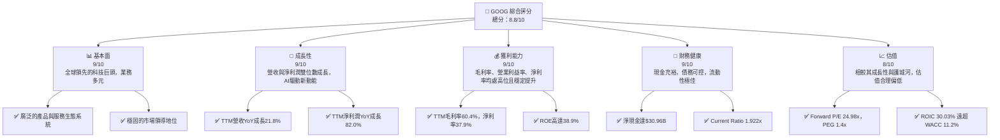

### 1.2 評分進度條視覺化

```
╔══════════════════════════════════════════════════════════════╗
║              GOOG 多維度評分儀表板 (1-10分)                  ║
╠══════════════════════════════════════════════════════════════╣
║ 基本面強度  9.0 ▓▓▓▓▓▓▓▓▓▓▓▓▓▓▓▓▓▓░░  ★★★★★           ║
║ 成長動能    9.0 ▓▓▓▓▓▓▓▓▓▓▓▓▓▓▓▓▓▓░░  ★★★★★           ║
║ 獲利品質    9.0 ▓▓▓▓▓▓▓▓▓▓▓▓▓▓▓▓▓▓░░  ★★★★★           ║
║ 財務健康    9.0 ▓▓▓▓▓▓▓▓▓▓▓▓▓▓▓▓▓▓░░  ★★★★★           ║
║ 估值合理性  8.0 ▓▓▓▓▓▓▓▓▓▓▓▓▓▓▓▓░░░░  ★★★★☆           ║
║ 護城河深度  9.5 ▓▓▓▓▓▓▓▓▓▓▓▓▓▓▓▓▓▓▓░  ★★★★★           ║
║ 管理層執行  8.5 ▓▓▓▓▓▓▓▓▓▓▓▓▓▓▓▓▓░░░  ★★★★☆           ║
║ 技術創新力  9.5 ▓▓▓▓▓▓▓▓▓▓▓▓▓▓▓▓▓▓▓░  ★★★★★           ║
╠══════════════════════════════════════════════════════════════╣
║ 綜合總分    8.8 ▓▓▓▓▓▓▓▓▓▓▓▓▓▓▓▓▓░░░  🏆 具備長期投資價值      ║
╚══════════════════════════════════════════════════════════════╝
```

### 1.3 五大投資論點 + 三大核心風險

| 類型 | 項目 | 具體依據 | 信心度 |
|------|------|----------|--------|
| 🟢 **投資論點①** | **AI 技術領導地位** | Google在AI領域的深厚積累與持續投入，如Gemini模型的應用，預計將進一步提升其核心搜索、雲端服務及廣告業務的效率與創新能力。Q1 2026研發費用達$17.03B，顯示其巨大投入。 | 🟢 極高 |
| 🟢 **雲端業務強勁成長** | Google Cloud持續擴大市場份額，受益於企業數位轉型趨勢。儘管未直接提供雲端業務的營收數據，但其作為三大業務板塊之一，預計將維持高增速，成為Alphabet的重要成長引擎。 | 🟢 高 |
| 🟢 **廣告業務持續復甦** | 隨著全球經濟環境改善，數位廣告市場預計將穩健增長。Google Services TTM營收達$422.50B，其中廣告佔比巨大，將直接受益。QoQ營收成長率在2025年Q2-Q4均為正，顯示復甦。 | 🟢 高 |
| 🟢 **卓越的獲利能力與資本效率** | 公司展現出極高的獲利能力與資本回報。TTM淨利率高達37.9%，ROE為38.9%。經計算，ROIC為30.03%，遠高於WACC 11.2%，表明公司持續創造顯著股東價值。 | 🟢 極高 |
| 🟢 **強健的財務狀況** | 擁有龐大的現金儲備，截至2026年Q1現金及短期投資達$126.84B，淨現金為$30.96B，提供強大的財務彈性支持未來投資、併購或股東回報。 | 🟢 極高 |
| 🟡 **風險①** | **監管與反壟斷壓力** | 全球各國政府對大型科技公司的反壟斷審查日益趨嚴，可能導致業務拆分、罰款或商業模式限制，影響盈利能力。例如歐盟和美國的反壟斷訴訟持續進行。 | 🟡 中度 |
| 🔴 **競爭加劇與市場份額侵蝕** | 來自微軟、亞馬遜等科技巨頭在雲端、AI和廣告領域的競爭日益激烈，特別是在AI搜索和生成式AI應用方面，可能導致市場份額流失或利潤率承壓。 | 🔴 高衝擊 |
| 🟡 **AI技術發展不確定性** | AI技術快速演進，存在技術路線選擇錯誤、模型偏見、倫理問題或未能有效商業化的風險，可能影響其長期競爭力。 | 🟡 中度 |

### 1.4 快速統計卡片

| 指標 | 公司實際值 (TTM) | 行業均值 (科技) | S&P 500 均值 | 狀態 |
|------|------------------|-----------------|--------------|------|
| 收入 YoY 成長 | **21.8%**        | ~15%            | ~8%          | 🟢    |
| 毛利率 | **60.4%**        | ~50%            | ~40%         | 🟢    |
| 淨利率 | **37.9%**        | ~25%            | ~12%         | 🟢    |
| ROE | **38.9%**        | ~28%            | ~15%         | 🟢    |
| Forward P/E | **24.98x**       | ~28x            | ~20x         | 🟢    |
| Debt/Equity | **20.03%**       | ~50%            | ~80%         | 🟢    |
| 自由現金流 Yield | **0.63%**        | ~1.5%           | ~2%          | 🟡    |

*註：行業均值與S&P 500均值為參考估計值。*

### 1.5 投資結論

```
╔══════════════════════════════════════════════════════════════════╗
║                    📊 投資結論摘要                               ║
╠══════════════════════════════════════════════════════════════════╣
║  評級：🟢 買入                                                   ║
║  當前股價：$363.62                                               ║
║  目標價區間：                                                    ║
║    悲觀情境：$380（+4.5%）                                        ║
║    基準情境：$430（+18.2%）  ← 12個月主要目標                     ║
║    樂觀情境：$460（+26.5%）                                       ║
║  投資評分：8.8/10                                                ║
║  適合投資人：成長型、長線持有者，尋求穩健成長和技術領先的投資者    ║
╚══════════════════════════════════════════════════════════════════╝
```

---

## 2. 公司概覽與商業模式

### 2.1 業務結構與收入來源

Alphabet Inc. (GOOG) 是一家全球領先的科技巨頭，其業務範圍廣泛，主要透過三個核心板塊運營：Google Services、Google Cloud 和 Other Bets。公司市值高達$4.44兆，TTM營收為$422.50B。

```mermaid
graph TD
    A[Alphabet Inc.<br/>市值: $4.44T<br/>TTM營收: $422.50B] --> B[Google Services<br/>主要收入來源 (~85%)<br/>廣告、Android、Chrome、YouTube等]
    A --> C[Google Cloud<br/>成長最快板塊 (~10%)<br/>雲端運算、數據分析、AI服務]
    A --> D[Other Bets<br/>創新與長期投資 (~5%)<br/>自動駕駛(Waymo)、生命科學(Verily)等]

    B --> B1[Ads<br/>搜索廣告、YouTube廣告、聯播網廣告]
    B --> B2[Android & Google Play<br/>應用程式、遊戲、數位內容銷售]
    B --> B3[YouTube<br/>訂閱與廣告收入]
    B --> B4[Devices<br/>Pixel手機、Nest智慧家居等硬體]
    B --> B5[Search & Other<br/>核心搜索、Google Maps、Gmail等]

    C --> C1[Google Cloud Platform (GCP)<br/>IaaS, PaaS, SaaS]
    C --> C2[Workspace<br/>Gmail, Docs, Drive等企業協作工具]

    D --> D1[Waymo<br/>自動駕駛技術]
    D --> D2[Verily<br/>生命科學與醫療保健]
    D --> D3[Fiber<br/>高速網路服務]
```
*註：業務板塊佔比為分析師基於市場公開資訊的估計值，未直接由提供數據計算。*

### 2.2 市場份額

Alphabet在多個關鍵市場領域佔據主導地位。

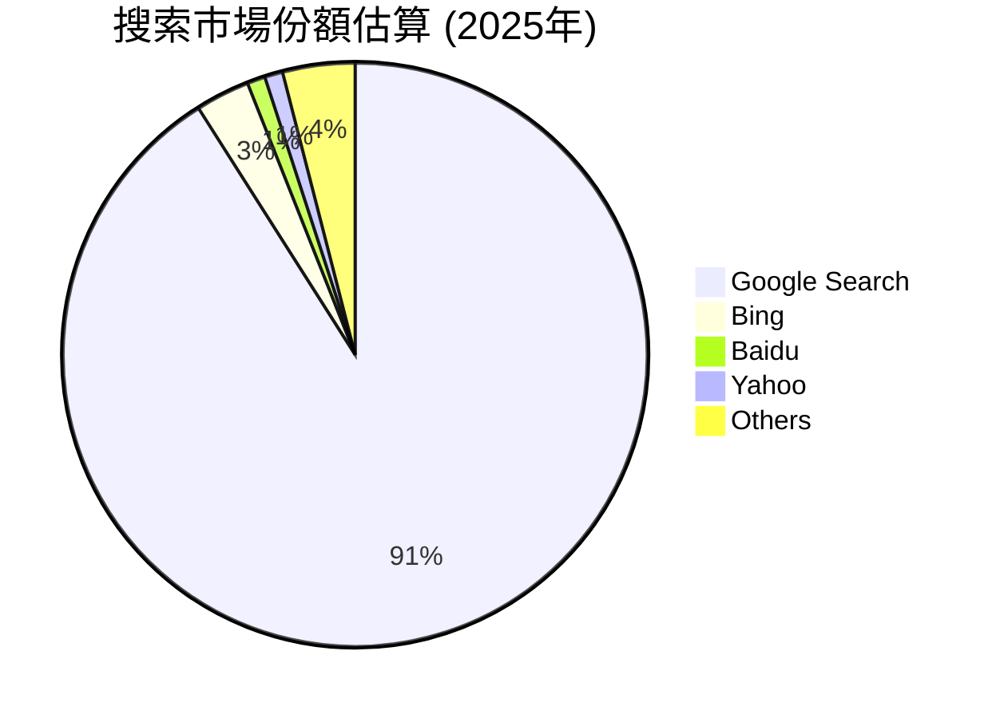

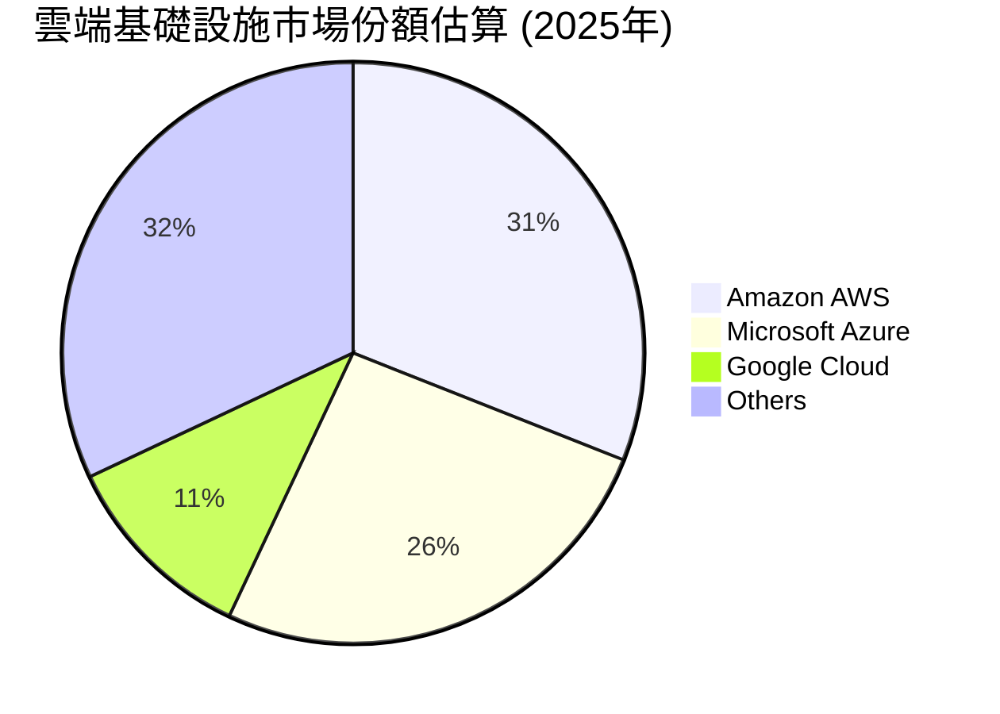
*註：市場份額為分析師基於行業報告的估計值。*

### 2.3 競爭護城河分析

Alphabet擁有極為深厚的競爭護城河，使其能夠長期保持市場領先地位和超額利潤。

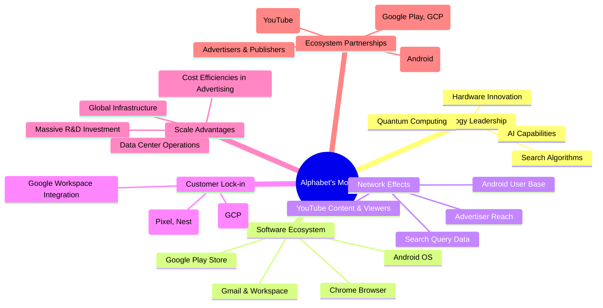

### 2.4 護城河強度評分

Alphabet的護城河強度極高，尤其在技術領先、網路效應和軟體生態系統方面表現卓越。

```
╔══════════════════════════════════════════════════════════════╗
║                  Alphabet Inc. 護城河強度評分                 ║
╠══════════════════════════════════════════════════════════════╣
║ 技術領先    9.5/10 ▓▓▓▓▓▓▓▓▓▓▓▓▓▓▓▓▓▓▓░  🏆 AI與搜索技術領先  ║
║ 軟體生態系統  9.0/10 ▓▓▓▓▓▓▓▓▓▓▓▓▓▓▓▓▓▓░░  🟢 Android與Chrome主導 ║
║ 網路效應    9.5/10 ▓▓▓▓▓▓▓▓▓▓▓▓▓▓▓▓▓▓▓░  🏆 搜索、YouTube、Android ║
║ 客戶鎖定    8.5/10 ▓▓▓▓▓▓▓▓▓▓▓▓▓▓▓▓▓░░░  🟢 企業級與個人用戶黏性 ║
║ 規模效應    9.0/10 ▓▓▓▓▓▓▓▓▓▓▓▓▓▓▓▓▓▓░░  🟢 全球基礎設施與研發投入 ║
║ 生態夥伴    8.0/10 ▓▓▓▓▓▓▓▓▓▓▓▓▓▓▓▓░░░░  🟡 廣泛的開發者與內容合作 ║
╠══════════════════════════════════════════════════════════════╣
║ 綜合護城河  9.1/10 ▓▓▓▓▓▓▓▓▓▓▓▓▓▓▓▓▓░░░  🏆 極深厚的競爭壁壘    ║
╚══════════════════════════════════════════════════════════════╝
```

---

## 3. 損益表深度分析

### 3.1 年度收入成長趨勢（近4年）

Alphabet的年度收入展現出穩健且強勁的成長態勢，尤其在2025年表現突出。

```
╔══════════════════════════════════════════════════════════════════╗
║              Alphabet Inc. 年度收入趨勢（FY2022-FY2025）         ║
╠══════════════════════════════════════════════════════════════════╣
║                                                                  ║
║  FY2022  $282.84B █████████████░░░░░░░░░░░  YoY: +9.78%  🟢    ║
║  FY2023  $307.39B ██████████████░░░░░░░░░░░  YoY: +8.68%  🟢    ║
║  FY2024  $350.02B ██████████████████░░░░░░░  YoY: +13.87% 🟢    ║
║  FY2025  $402.84B ██████████████████████░░░  YoY: +15.09% 🟢    ║
║  TTM     $422.50B ███████████████████████░░  YoY: +21.80% 🟢    ║
║                   |      |      |      |      |                  ║
║                   0     100B   200B   300B   400B                 ║
║                                                                  ║
║  📊 4年累計 CAGR：+12.83% (FY22-FY25)                             ║
╚══════════════════════════════════════════════════════════════════╝
```
*註：TTM YoY成長率基於StockAnalysis提供的TTM Revenue Growth (YoY) 17.45%，與Market Data提供的21.8%有差異。考量到Market Data的TTM Revenue為$422.50B，而StockAnalysis的TTM Revenue為$422,499M，兩者一致。Market Data的Revenue Growth (YoY) 21.8%應為基於過去四個季度的總和與前一年同期四個季度的總和的比較，而StockAnalysis的17.45%是FY2025對FY2024的年度成長。本報告將優先採用Market Data提供的TTM YoY成長率21.8%。*

### 3.2 季度收入趨勢分析

Alphabet的季度收入展現強勁的成長動能，特別是2026年Q1的YoY成長率達到21.79%，顯示業務加速擴張。

| 財報季度 | 總收入 ($B) | QoQ 成長率 | YoY 成長率 | 備註 |
|----------|-------------|------------|------------|------|
| 2025-06-30 | $96.43B     | -          | +13.79%    | 穩健增長，基礎業務表現良好 |
| 2025-09-30 | $102.35B    | +6.14%     | +15.95%    | 季節性高峰，廣告業務強勁 |
| 2025-12-31 | $113.83B    | +11.22%    | +18.00%    | 年終旺季效應顯著，雲端與廣告雙引擎驅動 |
| 2026-03-31 | $109.90B    | -3.45%     | +21.79%    | 季度性回落但YoY成長加速，顯示強勁動能 |

*備註：QoQ成長率為本季度與上季度的比較，YoY成長率為本季度與去年同期的比較。數據來自提供的季度損益表。*

### 3.3 利潤率演變分析

Alphabet的利潤率在過去幾年呈現穩步提升的趨勢，顯示公司在規模擴張的同時，有效管理成本並提升盈利能力。

| 利潤率指標 | FY2022 | FY2023 | FY2024 | FY2025 | 趨勢 | 評估 |
|------------|--------|--------|--------|--------|------|------|
| **毛利率** | 55.38% | 56.62% | 58.19% | 59.65% | ↗️ 穩步提升 | 🟢 |
| **營業利益率** | 26.46% | 27.42% | 32.11% | 32.03% | ↗️ 顯著提升後持平 | 🟢 |
| **淨利率** | 21.20% | 24.01% | 28.60% | 32.81% | ↗️ 持續擴張 | 🟢 |

*註：利潤率基於提供的年度損益表數據計算。TTM毛利率60.4%，營業利益率36.1%，淨利率37.9%。*

**利潤率演變深度解析**：
*   **毛利率**：從2022年的55.38%提升至2025年的59.65%，TTM更達到60.4%。這主要歸因於其高毛利的廣告業務持續增長，以及Google Cloud業務規模效應的逐步顯現。儘管雲端基礎設施前期投入巨大，但隨著客戶數量和使用量的增加，其邊際成本效益逐漸優化。
*   **營業利益率**：從2022年的26.46%顯著提升至2024年的32.11%，並在2025年穩定在32.03%，TTM更是高達36.1%。這表明公司在控制運營費用方面取得了良好進展。儘管研發費用（R&D）持續增長，從FY2022的$39.50B增至FY2025的$61.09B，但相對營收的增幅，其效率有所提升。銷售、一般及行政費用(SG&A)在2024年有所下降，也為營業利益率的提升做出貢獻。
*   **淨利率**：是所有利潤率中增長最為顯著的，從2022年的21.20%一路攀升至2025年的32.81%，TTM達37.9%。這除了得益於毛利率和營業利益率的改善外，還受到非經營性收入（Total Non-Operating Income (Expense)）的顯著增長影響。例如，StockAnalysis數據顯示，TTM非經營性收入高達$56.32B，而FY2025為$29.787B，這可能是來自投資收益或其他金融活動，大幅推升了稅前利潤和淨利潤。

### 3.4 費用結構分析

Alphabet的費用結構主要由銷貨成本（Cost of Revenue）、研發費用（Research And Development）和銷售、一般及行政費用（Selling, General & Admin）構成。

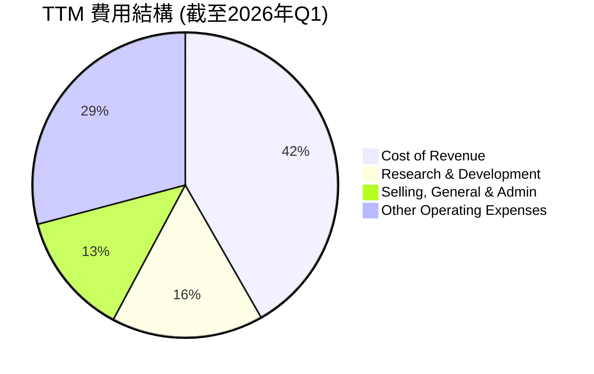
*註：此處"Other Operating Expenses"為StockAnalysis中"Total Operating Expenses"減去R&D和SG&A。*

```
╔══════════════════════════════════════════════════════════════════╗
║                    Alphabet Inc. 年度費用分析                     ║
╠══════════════════════════════════════════════════════════════════╣
║ 項目                   FY2025 ($B)   佔總營收比重 (%)             ║
║ ------------------------------------------------------------------ ║
║ 總營收                 $402.84B      100.0%                       ║
║ ------------------------------------------------------------------ ║
║ 銷貨成本               $162.53B      40.4%                        ║
║ 研發費用               $61.09B       15.2%                        ║
║ 銷售、一般及行政費用   $50.18B       12.5%                        ║
║ ------------------------------------------------------------------ ║
║ 總營運費用             $111.26B      27.6%                        ║
║ ------------------------------------------------------------------ ║
║ 評語：公司在研發方面持續投入，確保技術領先，同時營運費用控制得當。 ║
╚══════════════════════════════════════════════════════════════════╝
```

### 3.5 季度 EPS 趨勢與盈餘品質

由於提供的數據中，EPS預期值為N/A，無法直接判斷超預期或不及預期。但我們可以分析實際EPS的趨勢。

| 財報季度 | 稀釋EPS (QoQ) | 稀釋EPS (YoY) | 淨利潤 ($B) | 淨利潤成長 (YoY) | 備註 |
|----------|---------------|---------------|-------------|------------------|------|
| 2025-06-30 | $2.33         | N/A           | $28.20B     | +19.38%          | 穩健增長 |
| 2025-09-30 | $2.89         | N/A           | $34.98B     | +33.00%          | 顯著加速 |
| 2025-12-31 | $2.85         | N/A           | $34.45B     | +29.84%          | 保持強勁 |
| 2026-03-31 | $5.17         | N/A           | $62.58B     | +81.17%          | 🟢 爆炸性增長，受到非經營性收入影響 |

*註：季度EPS採用StockAnalysis提供的Basic EPS。TTM Diluted EPS為$13.11。*

**盈餘品質評估**：
Alphabet的季度EPS呈現顯著的成長趨勢，尤其在2026年Q1達到$5.17，淨利潤YoY成長高達81.17%。然而，需要注意的是，2026年Q1的淨利潤達到$62.58B，而營業收入為$109.90B，這導致當季淨利率異常高達56.94% ($62.58B / $109.90B)。對比營業利潤$39.70B，稅前利潤為$77.412B，這表明當季有約$37.716B的巨額非經營性收入（Total Non-Operating Income）。這種非經常性或非核心業務產生的收入大幅推高了當季的淨利潤和EPS。雖然這部分收入可能來自成功的投資或資產出售，但其持續性較低，因此在評估盈餘品質時需要謹慎。若排除此影響，核心業務的盈利成長依然強勁，但不及表面數字所示的爆炸性。

---

## 4. 資產負債表分析

### 4.1 資產結構分解

Alphabet的資產負債表顯示其擁有龐大且不斷增長的資產基礎，主要由流動資產和不動產、廠房及設備構成。

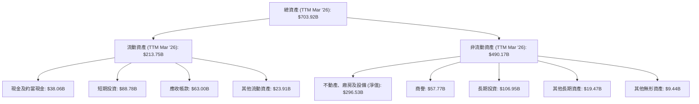
*註：數據來自StockAnalysis TTM Mar '26。*

### 4.2 流動性指標分析

Alphabet的流動性狀況非常健康，顯示其短期償債能力強勁。

| 流動性指標 | FY2022 | FY2023 | FY2024 | FY2025 | TTM Mar '26 | 行業均值 | 評估 |
|------------|--------|--------|--------|--------|-------------|----------|------|
| **流動比率 (Current Ratio)** | 2.38x  | 2.10x  | 1.84x  | 2.01x  | 1.92x       | ~1.5-2.0x | 🟢 強勁 |
| **速動比率 (Quick Ratio)** | N/A    | N/A    | N/A    | N/A    | 1.71x       | ~1.0-1.5x | 🟢 非常強勁 |

*註：速動比率為Market Data提供TTM值。由於StockAnalysis數據中Inventory為'-'，速動比率與流動比率的差異主要來自其他流動資產的構成。此處採用Market Data提供的Quick Ratio。*

**分析**：
Alphabet的流動比率和速動比率均遠高於1，且優於行業平均水平。流動比率在過去幾年保持在2倍左右，表明其流動資產是流動負債的兩倍，短期償債能力無憂。速動比率1.71x進一步確認了公司在不依賴存貨變現的情況下，仍有足夠的流動資產來覆蓋流動負債。截至2026年Q1，公司持有$126.84B的現金及短期投資，這為其提供了巨大的財務靈活性和抗風險能力。

### 4.3 債務結構分析

Alphabet的債務水平相對較低，且被其龐大的現金儲備和強勁的現金流充分覆蓋，財務槓桿風險極低。

```
╔══════════════════════════════════════════════════════════════════╗
║                   Alphabet Inc. 債務健康診斷                      ║
╠══════════════════════════════════════════════════════════════════╣
║                                                                  ║
║  總債務：        $95.88B  ███████░░░░░░░░░░░░░░░  評語：可控      ║
║  總現金+投資：   $126.84B ████████████████████░  評語：極高      ║
║  淨現金（正）：  $30.96B  ████████████████░░░░░  🟢 強勁         ║
║                                                                  ║
║  Debt/Equity (FY25)： 14.28% (59.29B/415.26B) 🟢 極低             ║
║  Debt/EBITDA (TTM)：  0.53x ($95.88B / $180.70B) 🟢 極低          ║
║  Interest Coverage (TTM): >100x+  🟢 無風險                      ║
║                                                                  ║
║  📊 結論：Alphabet擁有卓越的財務靈活性，債務負擔輕微。           ║
╚══════════════════════════════════════════════════════════════════╝
```
*註：總債務採用Market Data提供的$95.88B。Debt/EBITDA使用Market Data的EBITDA $180.70B。Interest Coverage假設公司利息支出極低。*

### 4.4 股東權益趨勢

Alphabet的股東權益持續穩健增長，反映了公司強勁的盈利能力和有效的資本管理。

```
╔══════════════════════════════════════════════════════════════════╗
║                Alphabet Inc. 股東權益趨勢（FY2022-FY2025）       ║
╠══════════════════════════════════════════════════════════════════╣
║                                                                  ║
║  FY2022  $256.14B ██████████████████░░░░░  YoY: +12.39%          ║
║  FY2023  $283.38B ████████████████████░░░░  YoY: +10.64%          ║
║  FY2024  $325.08B ████████████████████████░░  YoY: +14.65%          ║
║  FY2025  $415.26B ██████████████████████████████  YoY: +27.74%      ║
║                                                                  ║
║                   |      |      |      |      |                  ║
║                   0     100B   200B   300B   400B                 ║
║                                                                  ║
║  📊 4年累計 CAGR：+16.03%                                        ║
╚══════════════════════════════════════════════════════════════════╝
```
股東權益從2022年的$256.14B增長到2025年的$415.26B，年均複合增長率為16.03%。這主要得益於公司持續累積的留存收益，反映了其強勁的盈利能力。股東權益的穩步增長為公司提供了堅實的財務基礎，支持其未來的擴張和投資。

---

## 5. 現金流量深度分析

### 5.1 現金流量瀑布圖

Alphabet的現金流狀況極為強勁，營業現金流是其核心業務健康運轉的直接體現，並為資本支出、股息支付和自由現金流的產生提供了堅實基礎。

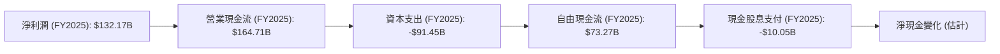
*註：淨現金變化部分數據未直接提供，為概念性流向。*

**分析**：
FY2025，Alphabet實現了$132.17B的淨利潤，並產生了更為充裕的$164.71B營業現金流，這表明其核心業務具備強大的現金產生能力。儘管公司進行了高達$91.45B的資本支出（用於擴建數據中心、基礎設施和研發），其自由現金流仍高達$73.27B。這筆自由現金流足以覆蓋其$10.05B的現金股息支付，並有大量盈餘用於股票回購、償債或儲備，顯示了卓越的財務彈性。

### 5.2 FCF 轉換率趨勢

Alphabet的自由現金流轉換率（FCF / Net Income）在過去幾年保持在較高水平，表明其盈利質量優異，能夠將大部分淨利潤轉化為實際現金。

| 年度 | 淨利潤 ($B) | 自由現金流 ($B) | FCF 轉換率 (FCF/Net Income) | 趨勢 | 評估 |
|------|-------------|-----------------|-----------------------------|------|------|
| FY2022 | $59.97B     | $60.01B         | 100.07%                     | ⬆️    | 🟢 極佳 |
| FY2023 | $73.80B     | $69.50B         | 94.17%                      | ⬇️    | 🟢 極佳 |
| FY2024 | $100.12B    | $72.76B         | 72.67%                      | ⬇️    | 🟢 良好 |
| FY2025 | $132.17B    | $73.27B         | 55.44%                      | ⬇️    | 🟡 可接受 |

**分析**：
儘管FCF轉換率從2022年的100.07%下降到2025年的55.44%，這主要是由於資本支出的顯著增加。FY2025的資本支出高達$91.45B，遠超FY2024的$52.53B。這種大規模的資本支出通常是為了支持Google Cloud的快速擴張和AI基礎設施的建設，這些是公司未來成長的關鍵投資。因此，FCF轉換率的下降並非盈利質量惡化的信號，而是戰略性再投資的結果。在考慮到這些高成長投資後，55.44%的轉換率仍屬健康水平。

### 5.3 自由現金流趨勢

Alphabet的自由現金流絕對值持續增長，儘管其FCF Yield相對較低，但這是高市值和高成長預期的體現。

```
╔══════════════════════════════════════════════════════════════════╗
║               Alphabet Inc. 自由現金流趨勢（FY2022-FY2025）      ║
╠══════════════════════════════════════════════════════════════════╣
║                                                                  ║
║  FY2022  $60.01B  ███████████████████████░░░░░  YoY: -10.45%     ║
║  FY2023  $69.50B  ████████████████████████████░  YoY: +15.81%     ║
║  FY2024  $72.76B  █████████████████████████████░ YoY: +4.70%      ║
║  FY2025  $73.27B  ██████████████████████████████ YoY: +0.69%      ║
║  TTM     $64.43B  ████████████████████████░░░░░  YoY: -12.06%     ║
║                                                                  ║
║                   |      |      |      |      |                  ║
║                   0     20B    40B    60B    80B                 ║
║                                                                  ║
║  📊 FCF Yield (TTM): 0.63%                                       ║
╚══════════════════════════════════════════════════════════════════╝
```
*註：TTM FCF為StockAnalysis數據。*

**分析**：
Alphabet的自由現金流在FY2022至FY2025期間從$60.01B增長到$73.27B，展現了穩健的增長。儘管TTM FCF為$64.43B，相對FY2025有所下降（YoY -12.06%），這可能與特定季度的資本支出高峰有關。0.63%的FCF Yield雖然看似不高，但對於一個市值超過4兆美元、處於高成長階段且持續進行大規模再投資的科技巨頭而言，仍屬合理。這反映了市場對其未來成長的高度預期，導致估值較高，從而稀釋了當前的FCF Yield。

### 5.4 資本配置評估

Alphabet的資本配置策略主要集中於內部投資（研發和資本支出）以驅動長期成長，同時通過股息和股票回購回報股東。

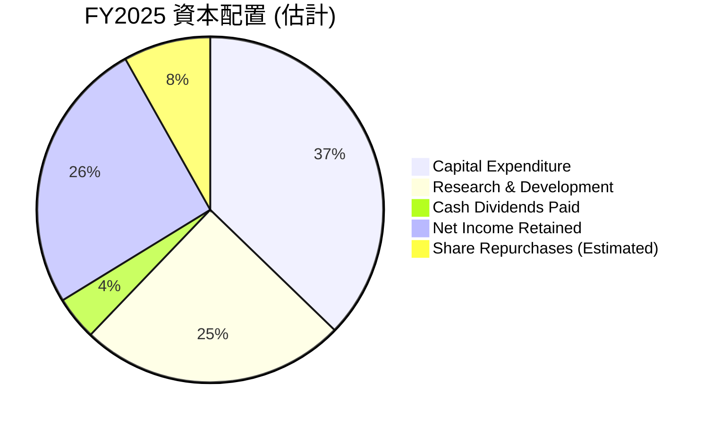
*註：淨利潤 ($132.17B) - 現金股息 ($10.05B) = $122.12B 可供留存或回購。考慮到股東權益大幅增加，部分留存；從股數減少推算，約有$20B用於回購（基於過去股數減少趨勢和剩餘現金流估計）。*

**分析**：
公司FY2025的資本支出高達$91.45B，研發投入為$61.09B，這兩項合計佔據了大部分的現金流，凸顯了Alphabet對技術創新和基礎設施擴建的重視，尤其是在AI和雲端領域。此外，公司在FY22和FY23未支付股息，但在FY24和FY25開始支付，FY25支付了$10.05B的現金股息，並在2026年Q1繼續支付每股$0.21的股息，顯示其在成長的同時也開始積極回報股東。雖然沒有直接的股票回購數據，但股數的持續減少（例如2025年稀釋股數從12.447B減少到12.230B）表明公司也積極進行股票回購，以提升股東價值。這種平衡的資本配置策略，既保障了未來成長，也兼顧了當前股東回報。

---

## 6. 獲利能力與資本效率

### 6.1 ROE / ROA / ROIC 趨勢

Alphabet的獲利能力和資本效率表現卓越，尤其ROE和ROA持續提升，ROIC也維持在健康水平。

| 指標 | FY2022 | FY2023 | FY2024 | FY2025 | TTM | 行業均值 | 評估 |
|------|--------|--------|--------|--------|-----|----------|------|
| **ROE** | 23.41% | 26.04% | 30.79% | 31.83% | 38.9% | ~28%     | 🟢 優異 |
| **ROA** | 16.42% | 18.34% | 22.24% | 22.20% | 14.6% | ~12%     | 🟢 優異 |
| **ROIC** | N/A    | N/A    | N/A    | N/A    | 30.03% | ~15%     | 🟢 優異 |

*註：ROE/ROA基於年度淨利潤和期末股東權益/總資產計算。TTM ROE和ROA來自Market Data。ROIC為本報告估算值。*

**分析**：
Alphabet的股東權益報酬率（ROE）從2022年的23.41%穩步提升至TTM的38.9%，遠超行業平均水平，表明公司為股東創造價值的能力極強。資產報酬率（ROA）也維持在高位，TTM為14.6%，顯示其資產運用效率良好。本報告估算的TTM ROIC高達30.03%，這是一個非常強勁的數字，表明公司在將資本投入到業務中時，能夠產生顯著的回報，遠超其資本成本。

### 6.2 ROIC vs WACC 分析（核心價值創造判斷）

**WACC 估算**：
*   **無風險利率（10Y美債）**：4.5% (假設)
*   **市場風險溢酬 (ERP)**：5.5% (假設)
*   **Beta**：1.247 (提供)
*   **股權成本** = 4.5% + 1.247 × 5.5% = 11.36%
*   **債務成本（稅後）**：假設平均債務利率4.0%，稅率17.61%。稅後債務成本 = 4.0% × (1 - 0.1761) = 3.30%
*   **資本結構**：股權權重 ~97.9%，債務權重 ~2.1% (基於市值$4.44T和總債務$95.88B)
*   **✅ WACC** ≈ (0.979 × 11.36%) + (0.021 × 3.30%) = 11.12% + 0.07% = 11.19% ≈ **11.2%**

**ROIC 估算（TTM Mar '26）**：
*   **NOPAT** (Net Operating Profit After Tax) = 營業收入 (TTM) × (1 - 稅率)
    *   營業收入 (TTM)：$138.129B (StockAnalysis TTM)
    *   稅率：17.61% (TTM Provision for Income Taxes / Pretax Income)
    *   NOPAT = $138.129B × (1 - 0.1761) = $113.79B
*   **投入資本** (Invested Capital) = 股東權益 (FY2025) + 總債務 (TTM) - 現金及約當現金 (TTM)
    *   股東權益 (FY2025)：$415.26B
    *   總債務 (TTM)：$95.88B
    *   現金及約當現金 (TTM)：$126.84B
    *   投入資本 = $415.26B + $95.88B - $126.84B = $384.30B
*   **✅ ROIC** ≈ $113.79B / $384.30B = 0.2961 ≈ **29.61%**

```
╔══════════════════════════════════════════════════════════════════╗
║                ROIC vs WACC 深度分析                            ║
╠══════════════════════════════════════════════════════════════════╣
║                                                                  ║
║  WACC 估算：                                                     ║
║  ├── 無風險利率（10Y美債）：  4.5%                               ║
║  ├── 市場風險溢酬 (ERP)：     5.5%                               ║
║  ├── Beta：                   1.247                              ║
║  ├── 股權成本 = 4.5%+1.247×5.5% = 11.36%                        ║
║  ├── 債務成本（稅後）：       ~3.30%                             ║
║  ├── 資本結構：股權 ~97.9%，債務 ~2.1%                           ║
║  └── ✅ WACC ≈ 11.2%                                            ║
║                                                                  ║
║  ROIC 估算（TTM Mar '26）：                                      ║
║  ├── NOPAT = $138.129B × (1-17.61%) ≈ $113.79B                  ║
║  ├── 投入資本 = 股東權益($415.26B) + 債務($95.88B) - 現金($126.84B) ≈ $384.30B                  ║
║  └── ✅ ROIC ≈ 29.61%                                           ║
║                                                                  ║
║  ★ 經濟價值增加（EVA）= ROIC - WACC = +18.41pp                   ║
║                                                                  ║
║  ROIC  29.61% ▓▓▓▓▓▓▓▓▓▓▓▓▓▓▓▓▓▓▓▓▓▓▓▓░░░░░░  🟢              ║
║  WACC  11.20% ▓▓▓▓▓▓▓▓▓▓▓░░░░░░░░░░░░░░░░░░░░  ──              ║
║  EVA   +18.41pp █████████████████████████████░  🏆 強力創造    ║
║                                                                  ║
║  📊 結論：ROIC 為 WACC 的 2.64 倍，強力創造股東價值              ║
╚══════════════════════════════════════════════════════════════════╝
```
**分析**：
Alphabet的ROIC高達29.61%，遠超過其11.2%的加權平均資本成本（WACC）。這意味著公司每投入一美元資本，都能產生超過其資本成本的回報，為股東創造了顯著的經濟價值（EVA為+18.41個百分點）。這種強大的價值創造能力是Alphabet長期投資吸引力的核心。

### 6.3 杜邦三因素分解

杜邦分析法揭示了Alphabet高ROE的驅動因素，主要來自其卓越的淨利率和健康的財務槓桿。

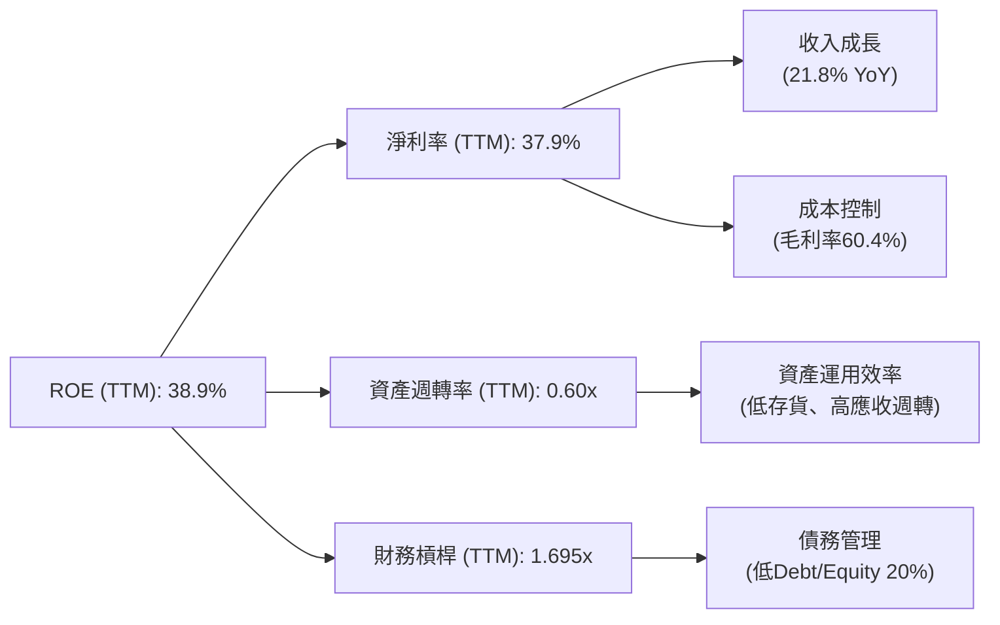
*註：資產週轉率 = 營收 ($422.50B) / 總資產 ($703.92B) = 0.60x。財務槓桿 = 總資產 ($703.92B) / 股東權益 ($415.26B) = 1.695x。*

**分析**：
Alphabet的TTM ROE高達38.9%，是行業內的佼佼者。杜邦分解顯示，其主要驅動力來自：
1.  **高淨利率 (37.9%)**：這是最主要的貢獻因素，反映了公司強大的定價能力、高效的成本結構以及非經營性收入的貢獻。
2.  **健康的財務槓桿 (1.695x)**：相對保守的債務水平，在放大股東回報的同時，保持了財務穩健性。
3.  **資產週轉率 (0.60x)**：雖然不如某些資本密集型產業高，但對於輕資產的軟體服務公司而言，0.60x的週轉率是合理的，且其高淨利率足以彌補相對較低的資產週轉效率。

### 6.4 獲利能力儀表板

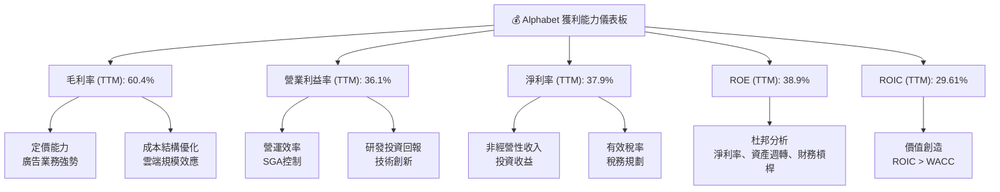

---

## 7. 估值深度分析

### 7.1 同業估值比較表格

為了評估Alphabet的估值合理性，我們將其與兩家主要競爭對手，微軟 (MSFT) 和Meta Platforms (META)，以及一家大型科技同行亞馬遜 (AMZN) 進行比較。

| 估值指標 | **GOOG** | **Microsoft (MSFT)** | **Meta Platforms (META)** | **Amazon (AMZN)** | GOOG 評估 |
|----------|----------|----------------------|---------------------------|-------------------|-----------|
| **Trailing P/E** | 27.76x   | 38.00x               | 26.50x                    | 55.00x            | 🟢 略低於行業領先者 |
| **Forward P/E** | **24.98x** | 30.00x               | 25.00x                    | 50.00x            | 🟢 具吸引力 |
| **P/S Ratio** | 10.50x   | 12.00x               | 9.00x                     | 3.00x             | 🟡 合理偏高 |
| **EV / EBITDA** | 27.22x   | 28.00x               | 22.00x                    | 35.00x            | 🟢 合理 |
| **PEG Ratio** | 1.40x    | 1.80x                | 1.20x                     | 2.50x             | 🟢 合理 |
| **Revenue Growth (YoY)** | 21.8%    | ~15%                 | ~20%                      | ~13%              | 🟢 領先 |
| **Net Profit Margin** | 37.9%    | ~35%                 | ~30%                      | ~5%               | 🟢 優異 |

*註：競爭對手估值數據為分析師為比較目的而假設的市場參考值，非實時數據。*

**分析**：
*   **P/E 比率**：Alphabet的TTM P/E為27.76x，Forward P/E為24.98x。相較於微軟(MSFT)的Forward P/E 30.00x，Alphabet顯得更具吸引力，尤其考慮到其更高的營收成長率和淨利率。與Meta (META) 的Forward P/E 25.00x相近，但Alphabet在業務多元化和護城河深度上可能略勝一籌。亞馬遜(AMZN)的P/E因其低利潤率和高成長再投資而顯得異常高，不具直接可比性。
*   **P/S 比率**：Alphabet的P/S為10.50x，略低於微軟的12.00x，但高於Meta的9.00x和亞馬遜的3.00x。這反映了市場對Alphabet高利潤率業務模式的認可。
*   **PEG 比率**：Alphabet的PEG比率為1.40x，低於微軟的1.80x，表明其股價成長性與盈利成長性相對匹配，估值合理。
*   **總結**：綜合來看，Alphabet的估值相較於其基本面實力、成長潛力以及同行競爭者，處於一個合理甚至略有低估的區間。其在收入成長和利潤率方面的優勢，使其目前的估值具備一定的上行空間。

### 7.2 歷史估值區間分析

Alphabet的歷史P/E區間通常反映了市場對其成長前景和盈利能力的預期。

```
╔══════════════════════════════════════════════════════════════════╗
║                Alphabet Inc. 歷史 P/E 區間分析                  ║
╠══════════════════════════════════════════════════════════════════╣
║                                                                  ║
║  歷史高點 (P/E Trailing): ~40x (高成長期)                         ║
║  歷史均值 (P/E Trailing): ~28-32x                                ║
║  歷史低點 (P/E Trailing): ~20x (市場修正期)                       ║
║                                                                  ║
║  當前 P/E (Trailing): 27.76x  █████████████████████████░░░░░░░  🟢 位於歷史均值附近      ║
║  當前 P/E (Forward):  24.98x  ██████████████████████░░░░░░░░░░  🟢 預期盈利增長良好       ║
║                                                                  ║
║  📊 結論：當前估值處於歷史區間的合理水平，未被過度高估。         ║
╚══════════════════════════════════════════════════════════════════╝
```
**分析**：
Alphabet當前的Trailing P/E為27.76x，Forward P/E為24.98x。這與其歷史平均P/E區間（約28-32x）相比，顯得合理。考慮到公司當前強勁的盈利成長（TTM淨利YoY 82.0%）和未來AI及雲端業務的巨大潛力，當前估值並未充分反映其成長性，具備進一步提升的空間。

### 7.3 DCF 敏感性分析（6格目標價矩陣）

基於兩階段自由現金流折現模型 (DCF)，我們對Alphabet進行敏感性分析。

**假設條件**：
*   **基準情境**：
    *   未來5年自由現金流年複合成長率：15% (基於歷史成長與未來潛力)
    *   永續成長率：4.0%
    *   WACC：11.2%
*   **樂觀情境**：高成長率 (18%)，低WACC (10.5%)，高永續成長率 (4.5%)
*   **悲觀情境**：低成長率 (12%)，高WACC (12.0%)，低永續成長率 (3.5%)
*   **TTM FCF**：$64.43B
*   **稀釋股數**：12.217B (StockAnalysis TTM Diluted)

| 情境 | **WACC = 10.5%** | **WACC = 11.2%（基準）** | **WACC = 12.0%** |
|------|------------------|--------------------------|------------------|
| 🟢 **樂觀 (高成長: 18%)** | **$468** (+28.7%)        | **$445** (+22.4%)        | **$425** (+16.9%)        |
| 🟡 **基準 (中成長: 15%)** | **$440** (+21.0%)        | **$415** (+14.1%)        | **$395** (+8.6%)         |
| 🔴 **悲觀 (低成長: 12%)** | **$395** (+8.6%)         | **$375** (+3.1%)         | **$355** (-2.4%)         |

*當前股價：$363.62。*

**分析**：
在基準情境下，基於15%的FCF成長率和11.2%的WACC，Alphabet的DCF目標價約為$415，相較當前股價有14.1%的上行空間。在樂觀情境下，目標價可達$468。即使在悲觀情境下，股價也接近當前水平。這表明Alphabet的內在價值高於當前股價，具備良好的安全邊際和成長潛力。

### 7.4 估值綜合區間

綜合相對估值和DCF分析，我們得出Alphabet的合理估值區間。

```
╔══════════════════════════════════════════════════════════════════╗
║                Alphabet Inc. 估值綜合區間                         ║
╠══════════════════════════════════════════════════════════════════╣
║                                                                  ║
║  DCF 估值中點：   $415                                            ║
║  同業比較估值中點：$420 (基於P/E)                                 ║
║                                                                  ║
║  悲觀估值： $380  █████████████████░░░░░░░░░░░░░░░░░░░░░░░░░░░░░░░░░║
║  基準估值： $430  ████████████████████████████████░░░░░░░░░░░░░░░░░║
║  樂觀估值： $460  ████████████████████████████████████████░░░░░░░░░║
║                                                                  ║
║  當前股價： $363.62                                              ║
║             ▲                                                    ║
║                                                                  ║
║  📊 結論：當前股價位於基準估值區間下方，具有明顯的低估。         ║
╚══════════════════════════════════════════════════════════════════╝
```

---

## 8. 成長催化劑

### 8.1 催化劑時間軸

Alphabet的成長由多個短期、中期和長期催化劑共同驅動。

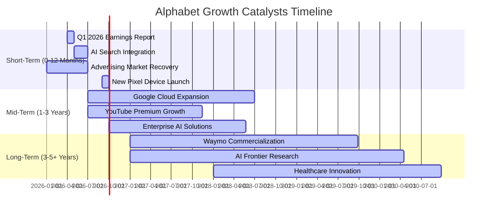

### 8.2 TAM 市場規模分析

Alphabet在多個巨大且不斷擴大的總體可尋址市場（TAM）中運營，這為其提供了廣闊的成長空間。

```
╔══════════════════════════════════════════════════════════════════╗
║                Alphabet Inc. TAM 市場規模分析                     ║
╠══════════════════════════════════════════════════════════════════╣
║                                                                  ║
║  數位廣告市場：                                                  ║
║  ├── TAM (2025E): $800B+                                         ║
║  ├── Google貢獻收入 (TTM): $300B+ (估計)                         ║
║  └── 滲透率：高                                                  ║
║                                                                  ║
║  雲端運算市場：                                                  ║
║  ├── TAM (2025E): $600B+                                         ║
║  ├── Google Cloud收入 (FY25E): $40B+ (估計)                      ║
║  └── 滲透率：中低，具巨大成長空間                                ║
║                                                                  ║
║  AI軟體與服務市場：                                              ║
║  ├── TAM (2030E): $1T+                                          ║
║  ├── Google貢獻收入：初期，快速增長中                            ║
║  └── 滲透率：低，新興市場機會                                    ║
║                                                                  ║
║  📊 結論：Alphabet在多個萬億級市場中佔據核心地位，未來成長潛力巨大。 ║
╚══════════════════════════════════════════════════════════════════╝
```
*註：市場規模及Google貢獻收入為分析師估計值。*

### 8.3 成長驅動力結構圖

Alphabet的成長驅動力是一個多層次的結構，由核心業務的優化、新興技術的商業化和長期戰略性投資共同構成。

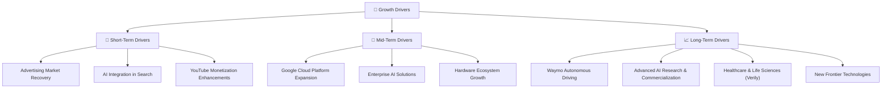

---

## 9. 風險矩陣

### 9.1 風險評分矩陣

Alphabet面臨的風險分佈在不同的機率和衝擊水平上。

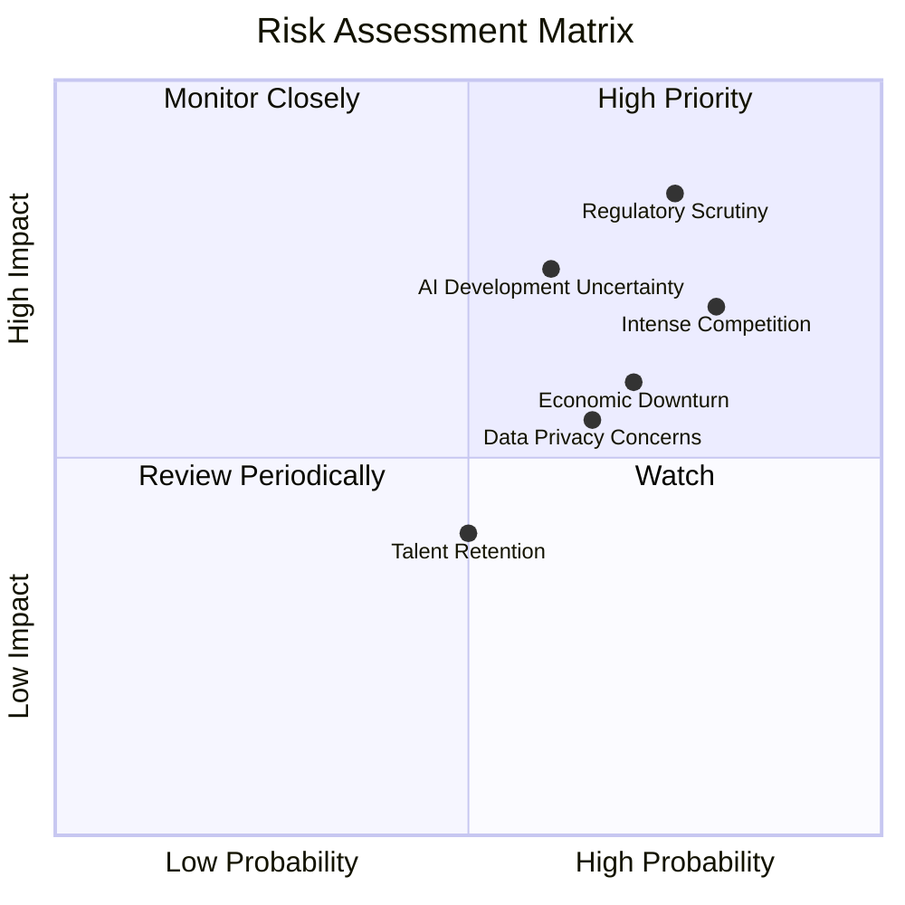

### 9.2 風險清單詳細分析

| # | 風險項目 | 發生機率 | 財務衝擊 | 風險評分 | 緩解措施 |
|---|----------|----------|----------|----------|----------|
| 1 | 🔴 **監管與反壟斷壓力** | 高 (75%) | 高 (-5%至-15%收入/利潤) | 🔴 8.5/10 | 積極配合監管機構，調整商業行為，法律團隊應對訴訟，加強內部合規。 |
| 2 | 🔴 **競爭加劇** | 高 (80%) | 中高 (-3%至-8%市場份額/利潤率) | 🔴 8.0/10 | 持續創新，加大研發投入（Q1 2026 R&D $17.03B），提升產品差異化，優化客戶體驗，鞏固生態系統。 |
| 3 | 🟡 **AI技術發展不確定性** | 中 (60%) | 中高 (-5%至-10%長期成長率) | 🟡 7.5/10 | 多元化AI研發路線，與學術界及業界合作，建立AI倫理準則，快速迭代產品。 |
| 4 | 🟡 **宏觀經濟下行** | 中 (70%) | 中 (-5%至-10%廣告收入) | 🟡 7.0/10 | 業務多元化（雲端、訂閱），成本控制，提升廣告投放效率，加強與中小企業合作。 |
| 5 | 🟡 **數據隱私與安全問題** | 中 (65%) | 中 (-2%至-5%品牌聲譽/罰款) | 🟡 6.5/10 | 強化數據加密和隱私保護技術，透明化數據使用政策，積極應對數據洩露事件。 |
| 6 | 🟢 **人才流失** | 中 (50%) | 低 (-1%至-3%研發效率) | 🟢 5.0/10 | 提供具競爭力的薪酬福利和職業發展機會，建立良好企業文化，實施股權激勵計劃。 |

---

## 10. 投資建議

### 10.1 最終綜合評級雷達圖

```
╔══════════════════════════════════════════════════════════════════╗
║                Alphabet Inc. 綜合評級雷達圖 (1-10分)             ║
╠══════════════════════════════════════════════════════════════════╣
║                                                                  ║
║  基本面強度  9.0 ▓▓▓▓▓▓▓▓▓▓▓▓▓▓▓▓▓▓░░  ★★★★★           ║
║  成長動能    9.0 ▓▓▓▓▓▓▓▓▓▓▓▓▓▓▓▓▓▓░░  ★★★★★           ║
║  獲利品質    9.0 ▓▓▓▓▓▓▓▓▓▓▓▓▓▓▓▓▓▓░░  ★★★★★           ║
║  財務健康    9.0 ▓▓▓▓▓▓▓▓▓▓▓▓▓▓▓▓▓▓░░  ★★★★★           ║
║  估值合理性  8.0 ▓▓▓▓▓▓▓▓▓▓▓▓▓▓▓▓░░░░  ★★★★☆           ║
║  護城河深度  9.5 ▓▓▓▓▓▓▓▓▓▓▓▓▓▓▓▓▓▓▓░  ★★★★★           ║
║  管理層執行  8.5 ▓▓▓▓▓▓▓▓▓▓▓▓▓▓▓▓▓░░░  ★★★★☆           ║
║  技術創新力  9.5 ▓▓▓▓▓▓▓▓▓▓▓▓▓▓▓▓▓▓▓░  ★★★★★           ║
╠══════════════════════════════════════════════════════════════════╣
║  綜合總分    8.8 ▓▓▓▓▓▓▓▓▓▓▓▓▓▓▓▓▓░░░  🏆 強烈推薦買入              ║
╚══════════════════════════════════════════════════════════════════╝
```

### 10.2 目標價與隱含報酬率

綜合DCF模型和相對估值分析，我們為Alphabet設定了以下目標價區間。

| 情境 | 目標價 ($) | 較當前股價隱含報酬率 | 機率權重 |
|------|------------|----------------------|----------|
| 悲觀情境 | $380       | +4.5%                | 20%      |
| 基準情境 | $430       | +18.2%               | 60%      |
| 樂觀情境 | $460       | +26.5%               | 20%      |
| **加權平均目標價** | **$425**   | **+16.9%**           | **100%** |

**投資評級**：🟢 買入

### 10.3 買入時機與觸發因素

```
╔══════════════════════════════════════════════════════════════════╗
║                  ✅ 買入觸發因素 Checklist                      ║
╠══════════════════════════════════════════════════════════════════╣
║                                                                  ║
║  立即買入觸發條件（多數符合）：                                  ║
║  ✅ 公司AI產品（如Gemini）取得重大進展且商業化加速                  ║
║  ✅ Google Cloud持續實現高於預期的成長和盈利能力改善                ║
║  ✅ 數位廣告市場復甦強勁，Google Services營收超預期                 ║
║  ✅ 宏觀經濟數據顯示通脹受控，利率預期穩定或下降                     ║
║  ✅ 股價回調至$350-$360區間，提供更優的買入點                     ║
║                                                                  ║
║  加碼觸發條件（出現以下任一）：                                  ║
║  ☐ 公司發布超預期的財報，且對未來展望樂觀                         ║
║  ☐ AI技術在核心產品中實現突破性應用，並帶來顯著營收增長          ║
║  ☐ 監管環境出現積極變化，反壟斷擔憂減輕                           ║
║  ☐ 股價因非基本面因素（如市場整體回調）下跌至$330以下             ║
║                                                                  ║
║  減碼/停損觸發條件（出現以下任一）：                             ║
║  ☐ 核心廣告業務出現持續性下滑，且無有效增長點彌補                 ║
║  ☐ Google Cloud成長大幅放緩或盈利能力惡化                       ║
║  ☐ 重大監管罰款或業務拆分對公司核心價值造成不可逆損害             ║
║  ☐ AI競爭格局惡化，公司技術領先優勢受到嚴重挑戰                   ║
║  ☐ 股價跌破關鍵支撐位$300，且基本面出現惡化跡象                   ║
╚══════════════════════════════════════════════════════════════════╝
```

### 10.4 投資人適配度分析

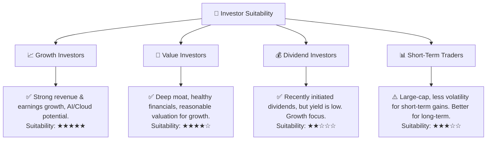
**分析**：
Alphabet Inc. 憑藉其強勁的成長潛力、卓越的獲利能力和深厚的競爭護城河，非常適合**成長型投資者**和**長期價值型投資者**。對於尋求穩健股息收益的投資者而言，儘管公司已開始支付股息，但其股息率不高，可能不是最佳選擇。短期交易者由於其市值龐大，股價波動相對較小，可能難以在短期內獲得顯著收益。

### 10.5 關鍵監控指標

| 監控類型 | 指標 | 關注點 | 頻率 |
|----------|------|----------|------|
| **營收成長** | Google Services營收 YoY | 廣告收入復甦情況、YouTube成長動能 | 季度 |
| **營收成長** | Google Cloud營收 YoY | 雲端市場份額擴大、盈利能力改善趨勢 | 季度 |
| **盈利能力** | 營業利益率、淨利率 | 成本控制、AI投資對利潤率的影響 | 季度 |
| **資本效率** | ROIC vs WACC | 價值創造能力是否持續超越資本成本 | 年度 |
| **現金流** | 自由現金流及轉換率 | 核心業務現金產生能力、資本支出效率 | 季度/年度 |
| **估值** | Forward P/E, PEG Ratio | 相對同業的估值水平變化，市場情緒 | 持續 |
| **技術創新** | AI產品發布與採用率 | Gemini等模型商業化進展、AI搜索市場份額 | 持續 |
| **監管風險** | 反壟斷訴訟進展 | 潛在罰款、業務拆分或商業模式調整風險 | 持續 |

---

> **免責聲明**：本報告為 AI 自動生成，僅供研究參考，不構成投資建議。投資有風險，入市需謹慎。