# GOOG 綜合股票評估報告

> **報告日期**：2026-02-28 ｜ **語言**：繁體中文 ｜ **數據來源**：Yahoo Finance ｜ **分析師**：頂級美股投資評估系統

---

## 目錄

1. [評估總覽](#1-評估總覽)
2. [八維度評分矩陣](#2-八維度評分矩陣)
3. [業務品質與護城河](#3-業務品質與護城河)
4. [財務健康全面評估](#4-財務健康全面評估)
5. [成長性評估](#5-成長性評估)
6. [估值合理性與同業比較](#6-估值合理性--同業比較)
7. [資本配置與管理層評估](#7-資本配置與管理層評估)
8. [風險評估](#8-風險評估)
9. [催化劑與觸發因素](#9-催化劑與觸發因素)
10. [投資建議](#10-投資建議)

---

## 1. 評估總覽

### 🎯 核心結論一覽

| 項目 | 內容 |
|------|------|
| 📌 **投資評級** | 🟢 **強力買入（Strong Buy）** |
| 💰 **當前股價** | $311.43 |
| 🎯 **12個月目標價** | **$385.00**（基準情境） |
| 📈 **預期報酬率** | **+23.6%**（不含股息） |
| ⏱️ **建議持倉期** | 18～36 個月 |
| ⭐ **綜合評級** | ★★★★☆（4.3/5星） |

---

### 📡 ASCII 雷達圖（八維度評分視覺化）

```
              成長性
               10
              /|\
         9  / | \ 9
           /  |  \
動能 ──── /   |   \ ──── 獲利能力
   9 ─── /    |    \ ─── 9
        /     |     \
       /    8 | 8    \
競爭優勢──────┼──────財務健康
   9 ─── \    |    / ─── 8
        \     |     /
         \    |    /
   8  ─── \   |   / ─── 7
            \ | /
管理品質 ─── \|/ ─── 估值
               7
              風險

    ╔══════════════════════════════╗
    ║   GOOG 八維度雷達圖（/10）    ║
    ╠══════════════════════════════╣
    ║  成長性    ████████████  9.0 ║
    ║  獲利能力  ████████████  9.0 ║
    ║  財務健康  ███████████░  8.5 ║
    ║  估 值     ████████░░░░  7.0 ║
    ║  競爭優勢  ████████████  9.5 ║
    ║  管理品質  ████████████  8.5 ║
    ║  動 能     ████████████  9.0 ║
    ║  風 險     ████████░░░░  7.5 ║
    ╚══════════════════════════════╝
         綜合加權平均：8.6 / 10
```

---

### 📊 八維度評分詳細（Unicode 評分條）

#### 1️⃣ 成長性 — 9.0 / 10 🟢
```
成長性   [▓▓▓▓▓▓▓▓▓░] 9.0/10
營收YoY +18%，EPS YoY +31%，Google Cloud 高速擴張
```

#### 2️⃣ 獲利能力 — 9.0 / 10 🟢
```
獲利能力 [▓▓▓▓▓▓▓▓▓░] 9.0/10
淨利率32.8%，ROE 35.7%，EBITDA Margin 37.3%
```

#### 3️⃣ 財務健康 — 8.5 / 10 🟢
```
財務健康 [▓▓▓▓▓▓▓▓▓░] 8.5/10
淨現金$59.85B，流動比2.0，OCF $164.71B
```

#### 4️⃣ 估值 — 7.0 / 10 🟡
```
估 值    [▓▓▓▓▓▓▓░░░] 7.0/10
Forward P/E 23x，相對同類科技股合理但非便宜
```

#### 5️⃣ 競爭優勢 — 9.5 / 10 🟢
```
競爭優勢 [▓▓▓▓▓▓▓▓▓▓] 9.5/10
搜尋市場90%+，Android生態，多重護城河
```

#### 6️⃣ 管理品質 — 8.5 / 10 🟢
```
管理品質 [▓▓▓▓▓▓▓▓▓░] 8.5/10
費用管控優異，ROIC持續超越WACC，戰略清晰
```

#### 7️⃣ 動能 — 9.0 / 10 🟢
```
動 能    [▓▓▓▓▓▓▓▓▓░] 9.0/10
24個月+124%漲幅，機構持續增持，分析師強買
```

#### 8️⃣ 風險 — 7.5 / 10 🟡
```
風 險    [▓▓▓▓▓▓▓▓░░] 7.5/10
反壟斷訴訟、AI競爭加劇、監管不確定性
```

---

## 2. 八維度評分矩陣

### 📋 詳細評分表格

| 維度 | 評分 | 關鍵依據 | 趨勢 | 狀態 |
|------|------|----------|------|------|
| **成長性** | 9.0/10 | 營收+18% YoY，EPS+31%，Cloud三位數增長潛力，AI廣告變現加速 | ⬆️ 上升 | 🟢 |
| **獲利能力** | 9.0/10 | 淨利率32.8%，ROE 35.7%，EBITDA Margin 37.3%，持續擴張 | ⬆️ 上升 | 🟢 |
| **財務健康** | 8.5/10 | 淨現金$59.85B，OCF $164.71B，流動比2.0，Capex大幅增加需監控 | ➡️ 穩定 | 🟢 |
| **估值** | 7.0/10 | Forward P/E 23x，相對成長率尚可接受，但非歷史低位 | ➡️ 穩定 | 🟡 |
| **競爭優勢** | 9.5/10 | 搜尋市場佔有率90%+，Android 30億設備，YouTube #1，多重護城河 | ⬆️ 上升 | 🟢 |
| **管理品質** | 8.5/10 | Sundar Pichai AI戰略執行，費用紀律優秀，ROIC>WACC | ➡️ 穩定 | 🟢 |
| **動能** | 9.0/10 | 24個月+124%，近3個月從$338高位回調至$311，仍強勢 | ⬇️ 短期回調 | 🟡 |
| **風險** | 7.5/10 | 反壟斷風險、AI顛覆搜尋廣告、Capex急增壓FCF | ➡️ 穩定 | 🟡 |

---

### 🗺️ Mermaid 風險/報酬定位圖（quadrantChart）

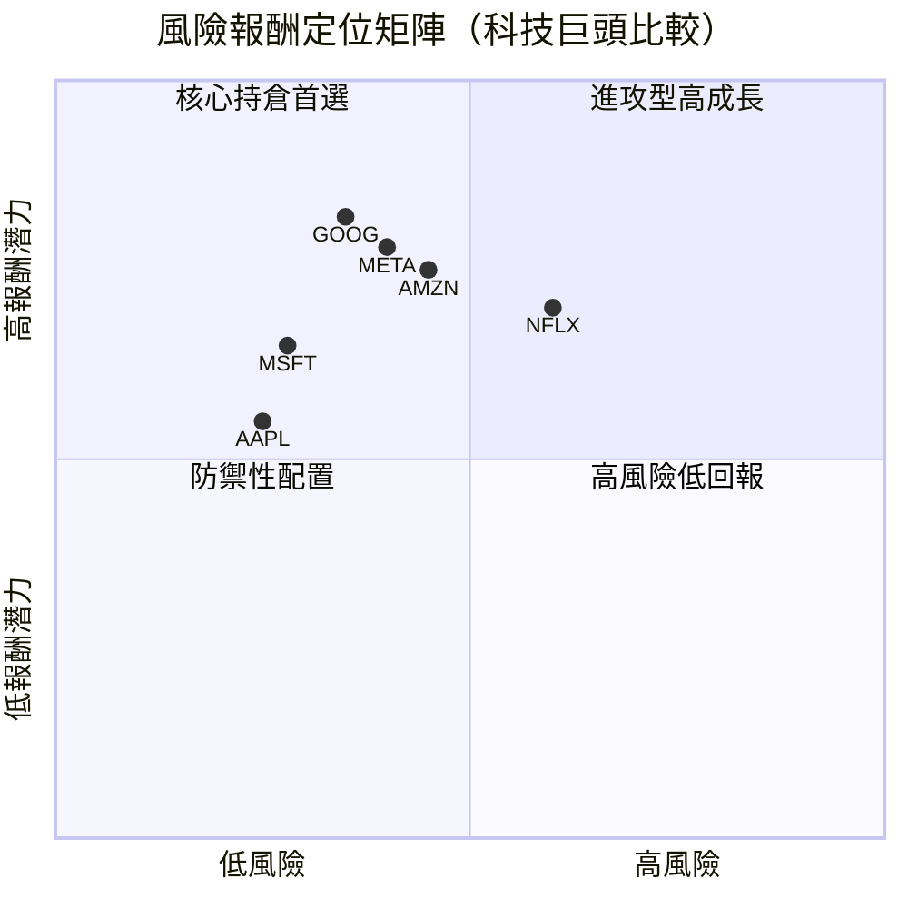

---

### 🔗 同業整體比較圖

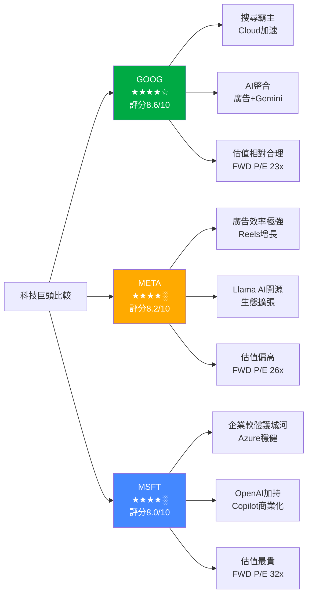

---

## 3. 業務品質與護城河

### 🏗️ 商業模式可持續性分析

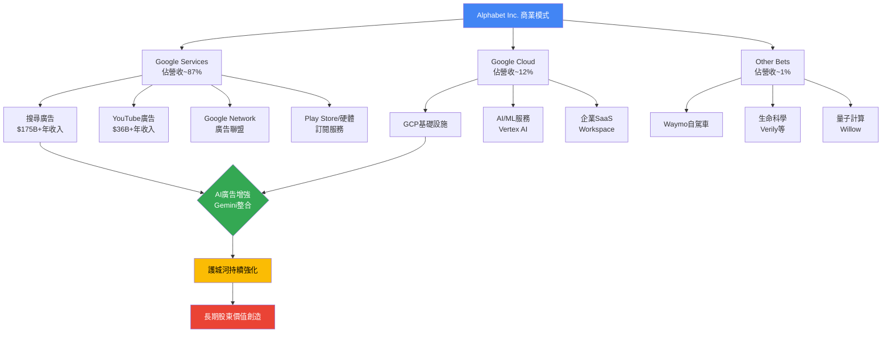

---

### 🏰 護城河評估（Mindmap）

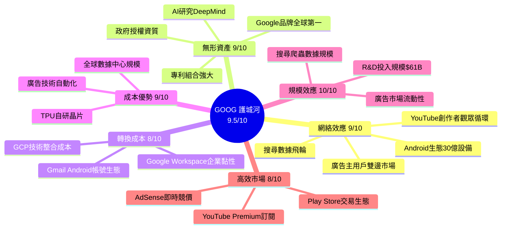

---

### 📊 護城河強度評分（Unicode 條形圖）

```
╔══════════════════════════════════════════════════╗
║           GOOG 護城河強度雷達                     ║
╠══════════════════════════════════════════════════╣
║ 網絡效應  ▓▓▓▓▓▓▓▓▓░  9.0/10  🟢 極強           ║
║ 無形資產  ▓▓▓▓▓▓▓▓▓░  9.0/10  🟢 極強           ║
║ 轉換成本  ▓▓▓▓▓▓▓▓░░  8.0/10  🟢 強             ║
║ 成本優勢  ▓▓▓▓▓▓▓▓▓░  9.0/10  🟢 極強           ║
║ 規模效應  ▓▓▓▓▓▓▓▓▓▓ 10.0/10  🟢 無可匹敵       ║
║ 高效市場  ▓▓▓▓▓▓▓▓░░  8.0/10  🟢 強             ║
╠══════════════════════════════════════════════════╣
║ 綜合護城河  ▓▓▓▓▓▓▓▓▓░  9.5/10  🟢 全球頂級      ║
╚══════════════════════════════════════════════════╝
```

---

### 🌍 市場地位分析

| 業務線 | TAM（2026E） | 市場份額 | 行業地位 |
|--------|-------------|---------|---------|
| 搜尋廣告 | ~$2800億 | **~90%** | 🟢 絕對壟斷 |
| 數字廣告整體 | ~$7500億 | **~28%** | 🟢 市場領導者 |
| 雲端服務（IaaS/PaaS） | ~$8000億 | **~12%** | 🟡 第三位（AWS 32%，Azure 23%） |
| 影音串流 | ~$1500億 | **~25%** (YouTube) | 🟢 龍頭 |
| AI助理/生成AI | ~$5000億+(2030) | **高競爭中** | 🟡 強力競爭者 |
| 移動作業系統 | 全球Android | **72%** | 🟢 主導 |

---

## 4. 財務健康全面評估

### 📊 財務儀表板

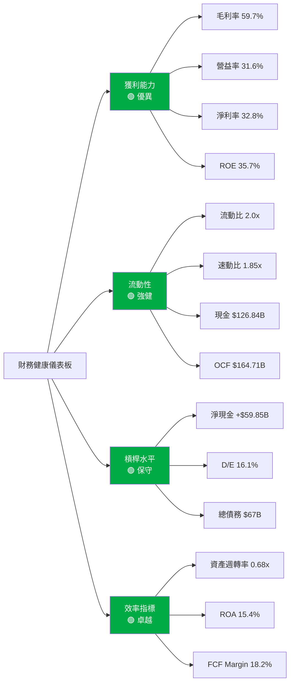

---

### 📈 獲利能力趨勢（近4年）

| 指標 | 2022 | 2023 | 2024 | 2025 | 趨勢 | 狀態 |
|------|------|------|------|------|------|------|
| **毛利率** | 55.4% | 56.6% | 58.2% | 59.7% | ⬆️ | 🟢 |
| **營業利益率** | 26.5% | 27.4% | 32.1% | 32.0% | ⬆️ | 🟢 |
| **淨利率** | 21.2% | 24.0% | 28.6% | 32.8% | ⬆️ | 🟢 |
| **EBITDA Margin** | 30.1% | 31.9% | 38.7% | 44.8% | ⬆️ | 🟢 |
| **FCF Margin** | 21.2% | 22.6% | 20.8% | 18.2% | ⬇️ | 🟡 |
| **ROE** | 23.4% | 26.0% | 30.8% | 35.7% | ⬆️ | 🟢 |
| **ROA** | 16.4% | 18.3% | 22.2% | 22.2% | ⬆️ | 🟢 |

> ⚠️ FCF Margin下降原因：2025年Capex大幅增至$91.45B（+74% YoY），為AI基礎設施建設投資高峰期，屬戰略性投入

---

### 🏦 資產負債表穩健度（Unicode 視覺化）

```
╔══════════════════════════════════════════════════════╗
║              資產負債表健康指標                        ║
╠══════════════════════════════════════════════════════╣
║                                                      ║
║  流動比率  2.0x   ▓▓▓▓▓▓▓▓░░  [目標>1.5] 🟢 健康   ║
║  速動比率  1.85x  ▓▓▓▓▓▓▓▓░░  [目標>1.0] 🟢 健康   ║
║  D/E比率   16.1%  ▓▓░░░░░░░░  [目標<50%] 🟢 保守   ║
║  淨現金    +$59.85B  ██████████  正淨現金  🟢 充裕  ║
║  利息覆蓋  >20x   ██████████  🟢 極安全             ║
║  總資產    $595B  ██████████  YoY+32%   🟢 擴張    ║
║                                                      ║
║  現金儲備  $126.84B ─────────────────── 🟢 充足     ║
║  總負債    $180.02B ──────────────────  🟢 可控     ║
║  股東權益  $415.26B ──────────────────────── 🟢     ║
╚══════════════════════════════════════════════════════╝
```

---

### 💵 現金流質量分析

| 指標 | 2022 | 2023 | 2024 | 2025 |
|------|------|------|------|------|
| **OCF（B）** | $91.5 | $101.8 | $125.3 | $164.7 |
| **Capex（B）** | $31.5 | $32.3 | $52.5 | $91.5 |
| **FCF（B）** | $60.0 | $69.5 | $72.8 | $73.3 |
| **FCF/淨利率** | 100% | 94% | 73% | 55% |
| **FCF Yield** | — | — | — | **1.01%** |

> 📌 **分析師評注**：FCF/Net Income比率下降反映Capex大幅提升（AI算力建設），但OCF品質極佳，$164.7B OCF顯示核心業務現金創造能力極強。FCF Yield 1.01%在市值$3.77T下偏低，但考慮AI戰略投資期，屬合理範圍。

---

## 5. 成長性評估

### 📈 歷史 CAGR 表格

| 指標 | 1年（2024→2025） | 3年（2022→2025） | 5年預估 |
|------|----------------|----------------|---------|
| **營收 CAGR** | +15.1% | +12.5% | +15~18% |
| **毛利 CAGR** | +18.0% | +15.3% | +17~20% |
| **EPS CAGR** | +31.9% | +30.7% | +18~22% |
| **FCF CAGR** | +0.7% | +6.9% | +15~20% |
| **OCF CAGR** | +31.5% | +21.6% | +15~18% |

---

### 🚀 未來成長催化劑

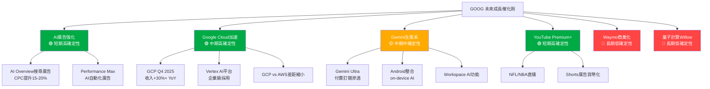

---

### 📊 成長軌跡 Unicode 長條圖

```
╔════════════════════════════════════════════════════════╗
║             年度營收成長軌跡（十億美元）                ║
╠════════════════════════════════════════════════════════╣
║                                                        ║
║  2022  $282.8B  ████████████████████░░░░░░  +9.8%     ║
║  2023  $307.4B  ██████████████████████░░░░  +8.7%     ║
║  2024  $350.0B  ████████████████████████░░  +13.8%    ║
║  2025  $402.8B  ██████████████████████████  +15.1%    ║
║  2026E ~$465B   ████████████████████████████ +15.5%E  ║
║                                                        ║
╠════════════════════════════════════════════════════════╣
║             年度EPS成長軌跡                             ║
╠════════════════════════════════════════════════════════╣
║                                                        ║
║  2022  $4.56    ████████░░░░░░░░░░░░░░░░░░             ║
║  2023  $5.80    ██████████░░░░░░░░░░░░░░░░  +27.2%    ║
║  2024  $8.04    ██████████████░░░░░░░░░░░░  +38.6%    ║
║  2025  $10.81   ████████████████████░░░░░░  +34.5%    ║
║  2026E ~$13.4   ████████████████████████░░  +24.0%E   ║
║                                                        ║
╚════════════════════════════════════════════════════════╝
```

---

## 6. 估值合理性 & 同業比較

### 🏢 同業比較表格

| 指標 | **GOOG** | **META** | **MSFT** | **AMZN** | 評析 |
|------|---------|---------|---------|---------|------|
| **市值** | $3.77T | ~$1.7T | ~$3.1T | ~$2.4T | — |
| **P/E（TTM）** | 28.8x 🟢 | 28.5x 🟢 | 36.2x 🔴 | 45.5x 🔴 | GOOG最便宜 |
| **P/E（Forward）** | 23.2x 🟢 | 26.1x 🟡 | 31.8x 🔴 | 38.4x 🔴 | GOOG最具吸引力 |
| **P/S** | 9.4x 🟡 | 10.2x 🔴 | 12.8x 🔴 | 3.9x 🟢 | AMZN低但低利潤 |
| **P/B** | 9.1x 🟡 | 9.8x 🟡 | 12.1x 🔴 | 9.5x 🟡 | 相近 |
| **EV/EBITDA** | 24.3x 🟢 | 22.1x 🟢 | 28.5x 🟡 | 35.2x 🔴 | GOOG合理 |
| **EV/Revenue** | 9.1x 🟡 | 10.0x 🟡 | 13.0x 🔴 | 3.8x 🟢 | — |
| **FCF Yield** | 1.01% 🟡 | 3.2% 🟢 | 2.1% 🟡 | 1.8% 🟡 | META最佳 |
| **ROE** | 35.7% 🟢 | 38.2% 🟢 | 34.5% 🟢 | 22.1% 🟡 | 均強勁 |
| **毛利率** | 59.7% 🟢 | 81.8% 🟢 | 70.1% 🟢 | 48.2% 🟡 | META最高 |
| **營收YoY成長** | +18.0% 🟢 | +21.0% 🟢 | +15.2% 🟡 | +11.0% 🟡 | META略高 |
| **分析師評級** | 強買 🟢 | 強買 🟢 | 買入 🟡 | 強買 🟢 | — |

---

### 📉 歷史估值區間（P/E）

```
╔══════════════════════════════════════════════════════════╗
║              GOOG 歷史 P/E 估值區間分析                  ║
╠══════════════════════════════════════════════════════════╣
║                                                          ║
║  5年 P/E 高點:  38.5x  ─────────────────────────── 高  ║
║                  35.0x                                   ║
║                  32.0x                                   ║
║  5年 P/E 中位:  27.5x  ──── ◄ 當前28.8x TTM ───── 中  ║
║                  25.0x                                   ║
║  5年 P/E 低點:  18.0x  ─────────────────────────── 低  ║
║                                                          ║
║  當前位置: [──────────────●──────────────]               ║
║            低估           合理          高估             ║
║            18x           27x           38x              ║
║                           ↑                              ║
║                        目前28.8x（中偏高位置）            ║
║                                                          ║
║  Forward P/E 23.2x → 相對於成長率，具備吸引力           ║
╚══════════════════════════════════════════════════════════╝
```

---

### 💰 多重估值法彙整 → 目標價區間

| 估值方法 | 假設條件 | 估算目標價 | 隱含報酬率 |
|---------|---------|----------|---------|
| **DCF（基準）** | 5年營收CAGR 16%，WACC 9.5%，終端成長率3.5% | $390 | +25.2% |
| **DCF（樂觀）** | 5年CAGR 20%，WACC 9%，雲端加速 | $440 | +41.3% |
| **DCF（悲觀）** | 5年CAGR 10%，WACC 10%，廣告放緩 | $270 | -13.3% |
| **相對估值（P/E）** | FWD P/E 25x × EPS $13.4 | $335 | +7.6% |
| **PEG估值** | PEG 1.2x × EPS增長22% = P/E 26.4x | $354 | +13.7% |
| **EV/EBITDA** | 25x × 2026E EBITDA $215B | $380 | +22.1% |
| **分析師共識** | 17位分析師目標均值 | $359 | +15.3% |

**📌 基準目標價：$385（12個月）**

---

### 📊 估值區間視覺化

```
╔══════════════════════════════════════════════════════════════╗
║                    目標價區間視覺化（12個月）                 ║
╠══════════════════════════════════════════════════════════════╣
║                                                              ║
║  悲觀情境  $270  ──────►                                     ║
║                 ████░░░░░░░░░░░░░░░░░░░░░░░░░░░░░░         ║
║                                                              ║
║  當前股價  $311  ──────────────────►  ◄ 你在這裡            ║
║                 ████████████████████░░░░░░░░░░░░           ║
║                                                              ║
║  分析師均值$359  ──────────────────────────────►            ║
║                 ████████████████████████████░░░░           ║
║                                                              ║
║  基準目標  $385  ──────────────────────────────────►        ║
║                 ████████████████████████████████░░         ║
║                                                              ║
║  樂觀情境  $440  ──────────────────────────────────────►    ║
║                 ██████████████████████████████████████     ║
║                                                              ║
║   $200────$270────$311────$359────$385────$440────$500      ║
║    LOW    BEAR   NOW     ANL    BASE    BULL     HIGH        ║
╚══════════════════════════════════════════════════════════════╝
```

---

## 7. 資本配置與管理層評估

### 💡 ROIC vs WACC 分析（EVA 判斷）

```
╔══════════════════════════════════════════════════════════╗
║              ROIC vs WACC 分析                           ║
╠══════════════════════════════════════════════════════════╣
║                                                          ║
║  WACC 計算：                                             ║
║  ├─ 無風險利率（10Y美債）：  4.3%                        ║
║  ├─ 股權風險溢酬（ERP）：    5.5%                        ║
║  ├─ Beta：                   1.086                       ║
║  ├─ 股權成本 = 4.3+1.086×5.5 = 10.27%                   ║
║  ├─ 稅後債務成本：           ~2.8%（利率4%，稅率21%）    ║
║  ├─ 資本結構：股權92%，債務8%                            ║
║  └─ WACC ≈ 10.27×0.92 + 2.8×0.08 ≈ 9.67%              ║
║                                                          ║
║  ROIC 計算：                                             ║
║  ├─ NOPAT = 營業利益×(1-稅率) = $129B × 0.79 = $102B   ║
║  ├─ 投入資本 = 股東權益+淨負債 = $415B-$60B = $355B     ║
║  └─ ROIC ≈ $102B / $355B ≈ 28.7%                       ║
║                                                          ║
║  ══════════════════════════════════════════              ║
║  EVA = ROIC - WACC = 28.7% - 9.67% = +19.0%            ║
║                                                          ║
║  ROIC  28.7%  ████████████████████████████░░  🟢        ║
║  WACC   9.7%  ████████████░░░░░░░░░░░░░░░░░░  ─         ║
║  EVA  +19.0%  ██████████████████░░░░░░░░░░░░  🟢        ║
║                                                          ║
║  ✅ 結論：ROIC大幅超越WACC，EVA顯著為正                  ║
║     每1元投入資本，額外創造0.19元經濟價值                 ║
║     Alphabet 為優質的股東價值創造機器                     ║
╚══════════════════════════════════════════════════════════╝
```

---

### 🥧 資本配置歷史（Mermaid Pie Chart）

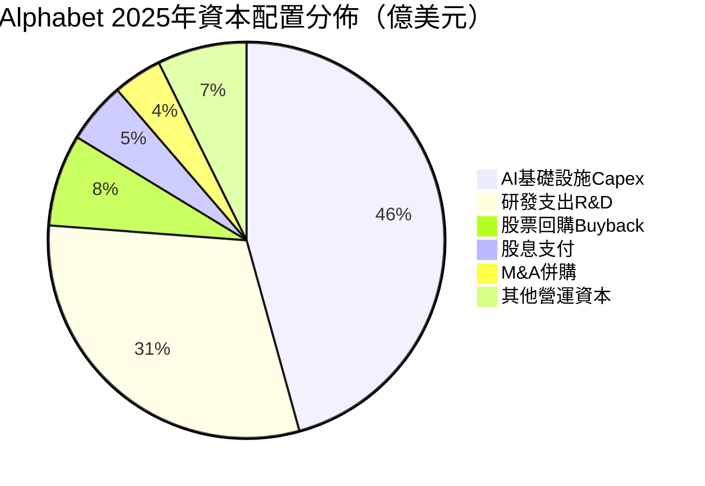

---

### 📋 管理層執行力評分

| 評估維度 | 評分 | 具體依據 | 狀態 |
|---------|------|---------|------|
| **承諾達成率** | 8.5/10 | 過去4年EPS持續超預期，Cloud路線圖執行到位 | 🟢 |
| **資本紀律** | 8.0/10 | Capex激增至$91.5B，AI投資大膽但合理，需持續觀察 | 🟡 |
| **戰略清晰度** | 9.0/10 | AI-first策略清晰，多線布局（Search/Cloud/Gemini） | 🟢 |
| **成本管控** | 9.0/10 | 2023大裁員後費用效率大幅提升，利潤率持續擴張 | 🟢 |
| **M&A紀律** | 8.0/10 | 歷史上部分併購（Motorola）失敗，近年更聚焦 | 🟡 |
| **股東溝通** | 8.5/10 | 透明度高，季報guidance合理，首次股息彰顯信心 | 🟢 |
| **競爭應對** | 8.0/10 | AI競爭快速應對，Gemini追趕GPT，Cloud搶單 | 🟢 |

---

### 💼 股東友善度評分

```
╔══════════════════════════════════════════════════════╗
║              股東友善度評估                            ║
╠══════════════════════════════════════════════════════╣
║                                                      ║
║  股票回購      ▓▓▓▓▓▓▓▓▓░  9.0/10                   ║
║  （持續大規模回購，縮減流通股）                        ║
║                                                      ║
║  股息政策      ▓▓▓▓▓▓░░░░  6.0/10                   ║
║  （2024年首次發股息，殖利率約0.5%，非股息股）          ║
║                                                      ║
║  資訊透明度    ▓▓▓▓▓▓▓▓░░  8.0/10                   ║
║  （季報詳盡，Cloud收入拆分後更透明）                   ║
║                                                      ║
║  長期價值導向  ▓▓▓▓▓▓▓▓▓░  9.0/10                   ║
║  （AI Capex大投入，長期回報導向）                      ║
║                                                      ║
║  綜合股東友善  ▓▓▓▓▓▓▓▓░░  8.0/10  🟢 良好          ║
╚══════════════════════════════════════════════════════╝
```

---

## 8. 風險評估

### 🔥 風險熱圖

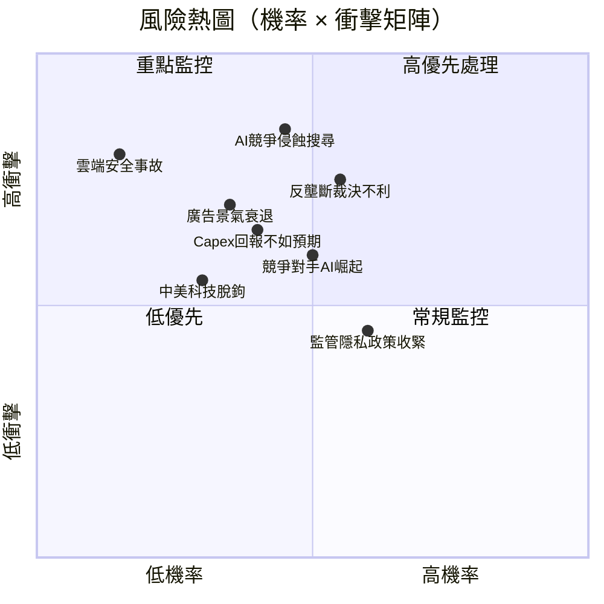

---

### 📋 風險清單詳細表格

| 風險類型 | 等級 | 機率 | 衝擊 | 具體描述 | 緩解措施 |
|---------|------|------|------|---------|---------|
| **AI搜尋顛覆** | 🔴 高 | 45% | 極高 | ChatGPT/Perplexity侵蝕搜尋查詢量，廣告點擊率下滑 | Gemini整合Search，AI Overview推出，廣告新格式 |
| **反壟斷訴訟** | 🔴 高 | 55% | 高 | DOJ搜尋壟斷案、廣告技術分拆裁決 | 法律應對，業務調整，分拆部分可能解鎖價值 |
| **Capex超支回報低** | 🟡 中 | 40% | 高 | AI基建$91B+投入，若AI商業化慢則FCF受壓 | 多業務線分散，Cloud合約預訂增長驗證 |
| **廣告景氣衰退** | 🟡 中 | 35% | 高 | 全球經濟衰退→廣告預算削減→Search/YouTube收入下滑 | 多元化收入（Cloud/硬體/訂閱）對沖 |
| **監管隱私政策** | 🟡 中 | 60% | 中 | EU GDPR強化、第三方Cookie廢除、iOS限制 | Privacy Sandbox開發，第一方數據強化 |
| **中美地緣政治** | 🟡 中 | 30% | 中 | 中國市場受限，台灣供應鏈風險 | 供應鏈多元化，不依賴中國市場 |
| **人才競爭流失** | 🟡 中 | 40% | 中 | OpenAI/Anthropic搶奪AI人才，薪酬壓力 | 高薪留才，內部DeepMind/Google Brain文化 |
| **雲端安全事故** | 🟢 低 | 15% | 極高 | GCP大規模資安事故影響企業客戶信任 | 業界最高安全標準，冗余架構 |

---

### 📉 最大下行情境分析（Bear Case）

```
╔══════════════════════════════════════════════════════════╗
║              Bear Case 目標價分析                        ║
╠══════════════════════════════════════════════════════════╣
║                                                          ║
║  極端悲觀情境假設：                                       ║
║  ├─ DOJ要求分拆廣告業務（機率15%）                       ║
║  ├─ AI搜尋侵蝕廣告收入-20%（機率20%）                   ║
║  ├─ 全球廣告衰退-15%（機率25%）                          ║
║  └─ 多重壓力疊加（機率10%）                              ║
║                                                          ║
║  Bear Case EPS 2026E：$9.5（vs 基準$13.4）              ║
║  Bear Case P/E：18x（壓縮至歷史低位）                    ║
║  Bear Case 目標價：$9.5 × 18 = $171                     ║
║  下行空間：-45%（極端情境）                               ║
║                                                          ║
║  合理悲觀情境（機率20%）：                                ║
║  ├─ EPS $11.5 × P/E 20x = $230                         ║
║  └─ 下行空間：-26%                                       ║
║                                                          ║
║  🎯 主要下行風險集中在監管 + AI衝擊組合                   ║
╚══════════════════════════════════════════════════════════╝
```

---

## 9. 催化劑與觸發因素

### 📅 催化劑時間軸

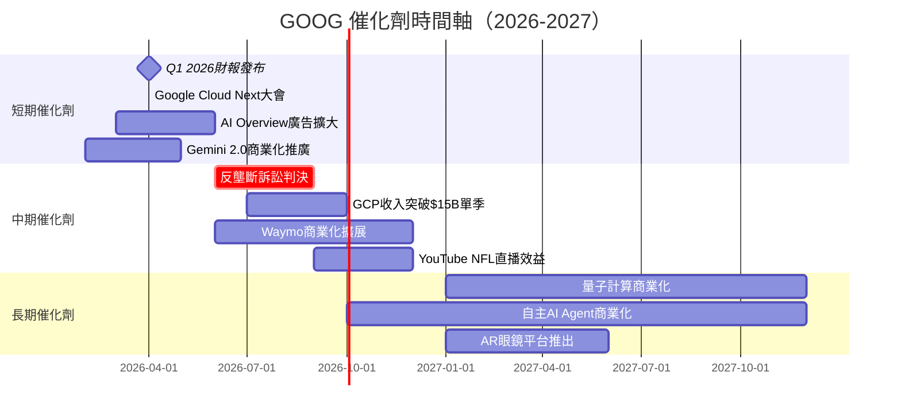

---

### ⚡ 正面觸發因素

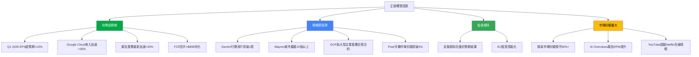

---

## 10. 投資建議

### ⭐ 最終評級

```
╔══════════════════════════════════════════════════════════════╗
║                                                              ║
║   ██████████████████████████████████████████████████████    ║
║   ██                                                    ██   ║
║   ██    🎯 GOOG 最終投資評級：★★★★☆ (4.3/5)          ██   ║
║   ██                                                    ██   ║
║   ██    📊 綜合評分：8.6 / 10                           ██   ║
║   ██                                                    ██   ║
║   ██    🟢  強力買入（Strong Buy）                       ██   ║
║   ██                                                    ██   ║
║   ██    💰  當前價：$311.43                             ██   ║
║   ██    🎯  目標價：$385（12個月基準）                   ██   ║
║   ██    📈  預期報酬：+23.6%（不含股息）                 ██   ║
║   ██    ⚠️  主要風險：反壟斷 + AI競爭                    ██   ║
║   ██                                                    ██   ║
║   ██  「全球最強護城河之一，AI轉型確定性高，             ██   ║
║   ██    估值相對同業仍具吸引力，長線首選」               ██   ║
║   ██                                                    ██   ║
║   ██████████████████████████████████████████████████████    ║
╚══════════════════════════════════════════════════════════════╝
```

---

### 📊 目標價區間與隱含報酬率

| 情境 | 機率 | 目標價 | 隱含報酬率 | 關鍵假設 |
|------|------|--------|---------|---------|
| 🐂 **極度樂觀** | 15% | $480 | **+54.1%** | AI廣告爆發、Cloud超加速>40%、監管利好 |
| 🟢 **樂觀情境** | 30% | $440 | **+41.3%** | EPS $14+、Cloud持續強勁、AI商業化加速 |
| ⚖️ **基準情境** | 35% | $385 | **+23.6%** | EPS $13.4、Cloud穩健、廣告回升 |
| 🟡 **保守情境** | 15% | $290 | **-6.9%** | 廣告放緩、Capex壓制FCF、估值壓縮 |
| 🐻 **悲觀情境** | 5% | $200 | **-35.8%** | 反壟斷分拆+AI嚴重衝擊搜尋廣告 |
| — | — | **期望值** | **+$376（加權）** | **+20.7%** |

---

### 🧩 投資人適配度

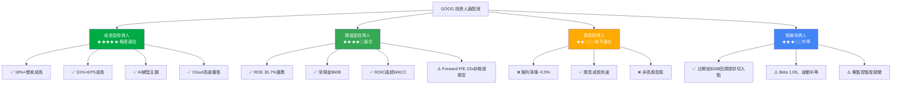

---

### 🎯 操作策略細則

#### 📌 建議持倉時間
- **核心持倉**：18～36個月（AI商業化驗證週期）
- **投機/波段**：3～6個月（財報催化劑）

#### ✅ 加碼觸發條件
```
╔════════════════════════════════════════════════╗
║  加碼觸發條件（滿足任一即可考慮增持）           ║
╠════════════════════════════════════════════════╣
║  🟢 股價回落至 $280 以下（Forward P/E < 21x）  ║
║  🟢 Google Cloud季增速突破 +35% YoY            ║
║  🟢 EPS連續2季超預期 10%以上                   ║
║  🟢 反壟斷訴訟和解/結果優於預期                ║
║  🟢 Gemini付費用戶超過5000萬                   ║
║  🟢 廣告RPM（每千次收益）重新加速至雙位數成長   ║
╚════════════════════════════════════════════════╝
```

#### 🛑 止損觸發條件
```
╔════════════════════════════════════════════════╗
║  止損觸發條件（滿足任一需重新評估）             ║
╠════════════════════════════════════════════════╣
║  🔴 股價跌破 $240（-23%，技術性支撐破位）      ║
║  🔴 搜尋市場份額跌破 85%（AI侵蝕嚴重）         ║
║  🔴 Google Cloud成長連續2季低於 +15%           ║
║  🔴 DOJ強制分拆廣告技術業務                    ║
║  🔴 EPS連續2季miss分析師預期                   ║
║  🔴 Capex進一步上修超過 $120B（FCF嚴重惡化）   ║
╚════════════════════════════════════════════════╝
```

---

### 🔍 關鍵監控指標 Checklist

```
╔══════════════════════════════════════════════════════════╗
║             關鍵監控指標（每季財報必查）                   ║
╠══════════════════════════════════════════════════════════╣
║                                                          ║
║  財務指標                                                ║
║  ☐ Google Search廣告收入 YoY 成長率（目標 >12%）        ║
║  ☐ Google Cloud收入 YoY 成長率（目標 >28%）             ║
║  ☐ YouTube廣告收入 YoY 成長率（目標 >15%）              ║
║  ☐ 整體營業利益率（目標維持 >30%）                       ║
║  ☐ FCF（目標 >$70B 年化，Capex高峰後回升）              ║
║  ☐ Capex指引（監控是否進一步上修）                       ║
║                                                          ║
║  戰略指標                                                ║
║  ☐ Gemini API呼叫量及付費用戶數                          ║
║  ☐ Cloud RPO（剩餘履約義務）成長趨勢                     ║
║  ☐ AI Overview在搜尋結果的滲透率                         ║
║  ☐ Waymo擴張城市數量及日均行程                           ║
║                                                          ║
║  風險指標                                                ║
║  ☐ 反壟斷訴訟進展（DOJ/EU）                             ║
║  ☐ 搜尋市場份額（StatCounter/SimilarWeb數據）            ║
║  ☐ 機構持股變化（13F季報）                               ║
║  ☐ 內部人士買賣動態                                      ║
║                                                          ║
║  總體環境                                                ║
║  ☐ 美國聯準會利率政策（影響WACC與估值）                  ║
║  ☐ 全球廣告市場景氣指標（WPP/IPG財報）                  ║
║  ☐ AI競爭格局（OpenAI/Anthropic/Meta最新動態）          ║
╚══════════════════════════════════════════════════════════╝
```

---

### 🏆 最終綜合評分卡

```
╔══════════════════════════════════════════════════════════════════╗
║                    GOOG 最終評分卡                               ║
╠══════════════════════════════════════════════════════════════════╣
║                                                                  ║
║  成長性    ★★★★★  9.0  ▓▓▓▓▓▓▓▓▓░  🟢 超強               ║
║  獲利能力  ★★★★★  9.0  ▓▓▓▓▓▓▓▓▓░  🟢 超強               ║
║  財務健康  ★★★★★  8.5  ▓▓▓▓▓▓▓▓▓░  🟢 強健               ║
║  估值合理  ★★★★░  7.0  ▓▓▓▓▓▓▓░░░  🟡 合理偏貴            ║
║  競爭優勢  ★★★★★  9.5  ▓▓▓▓▓▓▓▓▓▓  🟢 無敵護城河         ║
║  管理品質  ★★★★★  8.5  ▓▓▓▓▓▓▓▓▓░  🟢 優秀               ║
║  價格動能  ★★★★★  9.0  ▓▓▓▓▓▓▓▓▓░  🟢 強勢               ║
║  風險控制  ★★★★░  7.5  ▓▓▓▓▓▓▓▓░░  🟡 中等風險            ║
║                                                                  ║
║  ═══════════════════════════════════════════════════            ║
║  加權綜合  ★★★★☆  8.6  ▓▓▓▓▓▓▓▓▓░  🟢 強力買入           ║
║  ═══════════════════════════════════════════════════            ║
║                                                                  ║
║  📌 投資結論：                                                   ║
║  Alphabet是全球最優質的商業模式之一，護城河極深，                ║
║  AI轉型確定性高，ROIC（28.7%）大幅超越WACC（9.7%），            ║
║  為卓越的股東價值創造者。當前從高位回調-8%，                    ║
║  Forward P/E 23x提供合理的進場機會。                             ║
║  建議分批建倉，目標$385（+23.6%），長線持有3年以上               ║
║  可充分受益AI商業化加速和Cloud規模效益兌現。                     ║
║                                                                  ║
╚══════════════════════════════════════════════════════════════════╝
```

---

> ## ⚠️ 免責聲明
>
> 本報告為 **AI 自動生成分析報告**，所有財務數據來源於 Yahoo Finance（截至 2026-02-28），分析結論基於公開資訊與量化模型推演。
>
> - 本報告**不構成任何投資建議**，不應作為買賣證券的唯一依據
> - 股市有風險，投資需謹慎，過去表現不代表未來結果
> - 目標價為預測值，實際市場結果可能與預測有重大差異
> - 投資人應結合自身風險承受能力、財務狀況及投資目標，諮詢專業財務顧問後做出獨立判斷
> - 本報告作者（AI系統）不持有任何 GOOG 倉位，不存在利益衝突