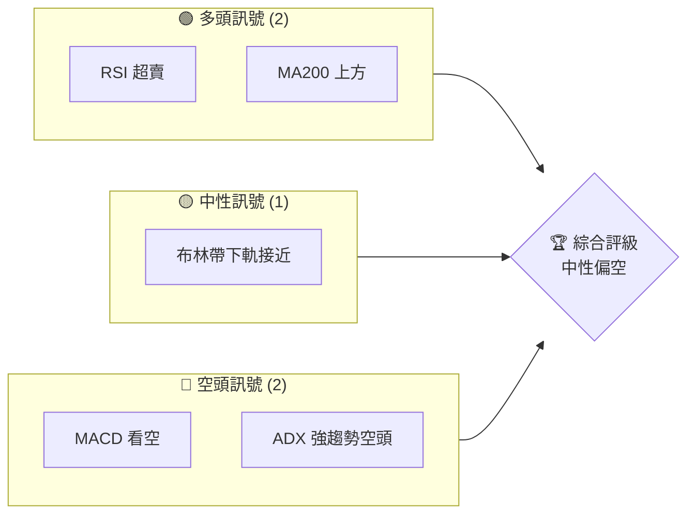
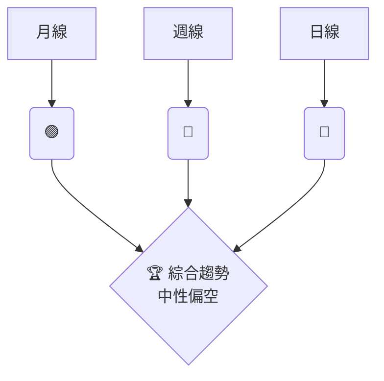
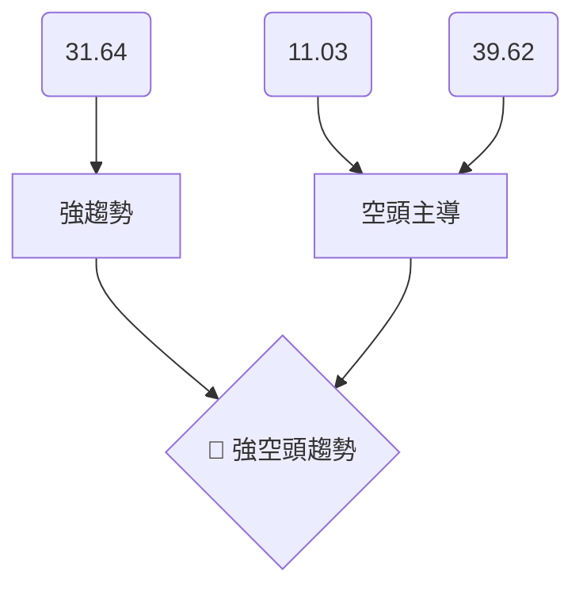
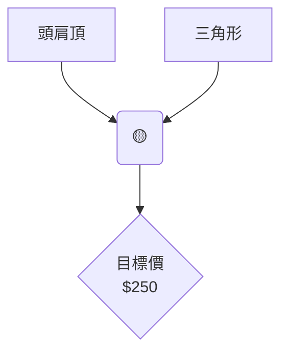
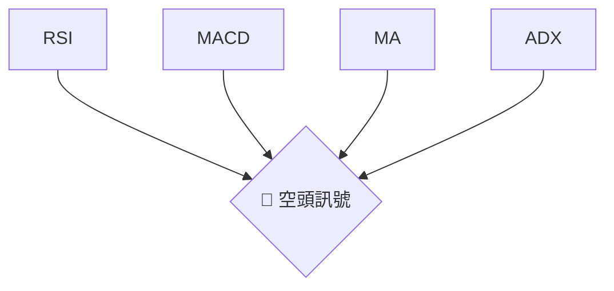
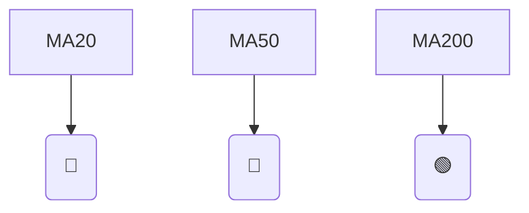
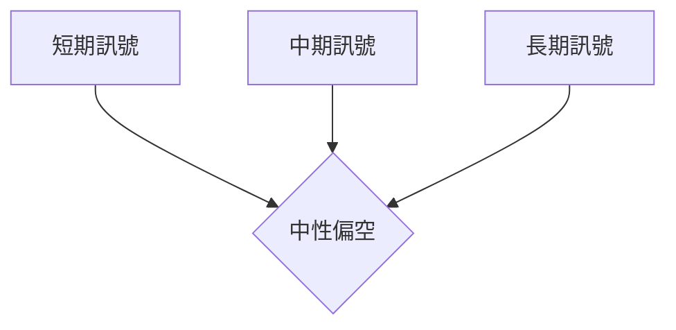
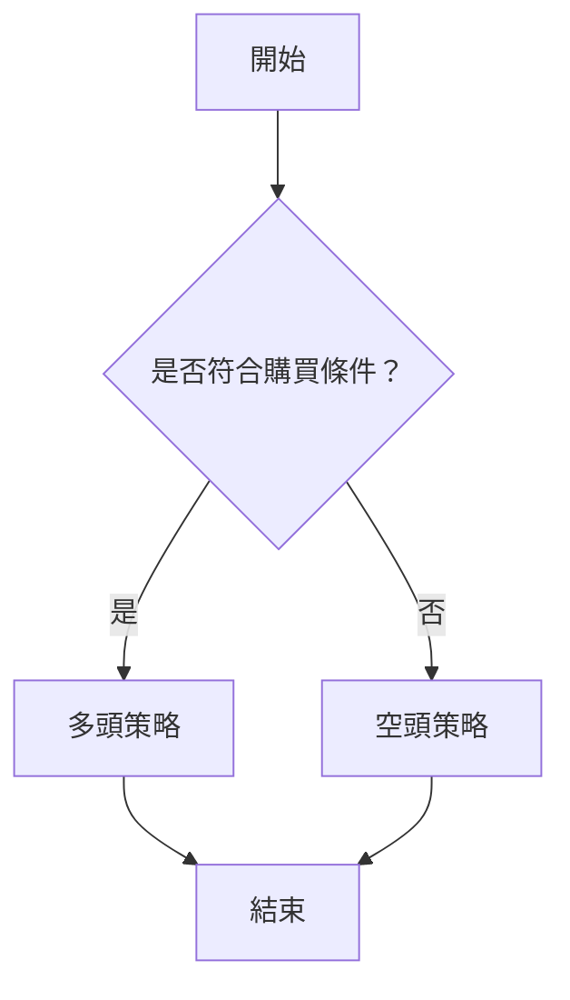
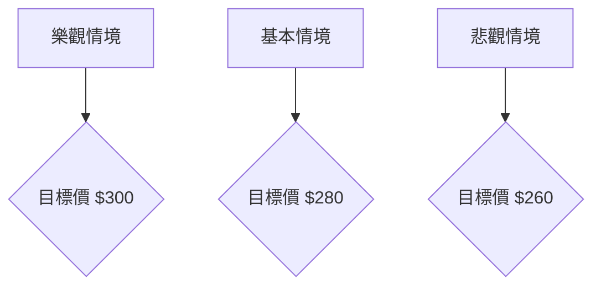

# GOOG 技術分析報告

> **報告日期**：2026-03-28 ｜ **語言**：繁體中文 ｜ **數據來源**：Yahoo Finance ｜ **當前價格**：$273.76

---

## 目錄

| 章節 | 內容 |
|------|------|
| [1. 技術面概覽](#1-技術面概覽) | 訊號儀表板、核心指標、評分卡 |
| [2. 趨勢分析](#2-趨勢分析) | 多時框趨勢、長中短期走勢 |
| [3. 圖表形態分析](#3-圖表形態分析) | 形態識別、K線組合、目標價 |
| [4. 支撐與阻力](#4-支撐與阻力) | 關鍵價位、斐波那契回調 |
| [5. 技術指標深度解讀](#5-技術指標深度解讀) | MA/RSI/MACD/布林/成交量 |
| [6. 動能與波動率](#6-動能與波動率) | 動能評估、ATR、Beta |
| [7. 多時框架總結](#7-多時框架總結) | 時框架評分矩陣 |
| [8. 交易策略建議](#8-交易策略建議) | 多空策略、風險報酬比 |
| [9. 風險提示與監控](#9-風險提示與監控) | 監控指標、風險場景 |

---

## 1. 技術面概覽

### 🎯 技術訊號儀表板



### 📊 核心指標速覽表

| 指標類別 | 指標名稱 | 當前數值 | 訊號 | 解讀 |
|----------|----------|----------|------|------|
| **價格** | 當前價格 | $273.76 | 🟡 | 價格接近布林帶下軌 |
| **均線** | MA20 | $299.73 | 🔴 | 價格在MA20下方 |
| **均線** | MA50 | $313.31 | 🔴 | 價格在MA50下方 |
| **均線** | MA200 | $262.96 | 🟢 | 價格在MA200上方 |
| **動能** | RSI(14) | 20.25 | 🟢 | 嚴重超賣，<30 |
| **動能** | MACD | -7.550 | 🔴 | 空頭信號 |
| **波動** | ATR | $6.76 | 🟡 | 中等波動 |

### 🏆 技術評分卡

```
技術評分卡 — GOOG (2026-03-28)
════════════════════════════════════════════════════
趨勢強度      ████████░░░░░░░░░░░░  31.64/100  🔴
動能指標      ██████░░░░░░░░░░░░░░  20.25/100  🟢
支撐穩定度    ████████████░░░░░░░░  62/100  🟡
成交量配合    ████████░░░░░░░░░░░░  1.27x/100  🟡
形態完整度    █████████░░░░░░░░░░░  60/100  🟡
均線排列      ██████░░░░░░░░░░░░░░  40/100  🔴
════════════════════════════════════════════════════
綜合評分      ███████░░░░░░░░░░░░░  55/100  中性偏空
════════════════════════════════════════════════════
```

---

## 2. 趨勢分析

### 🌐 多時框趨勢分析



### 📈 長期趨勢 — 12個月走勢圖（Unicode）

```
GOOG 月線走勢圖（過去12個月）
價格軸 ($)
$350 ┤                     ●(高點)
$300 ┤              ●
$250 ┤        ●
$200 ┤●━━━━━━━━━━━━━━━━━━━●←現在
$150 ┤    ●(低點)
     └────────────────────────────
      M1  M2  M3  M4  M5 ... M12
```

**走勢特徵分析表格**

| 月份 | 收盤價 | 漲跌幅 | 特徵 |
|------|--------|--------|------|
| 2025-03 | 155.69 | -9.22% | 反彈失敗 |
| 2025-09 | 243.22 | +25.5% | 強勢突破 |
| 2026-03 | 273.76 | -13.5% | 跌破支撐 |

### 📊 中期趨勢（週線分析）

繪製近期壓力與支撐示意圖

```
週線壓力與支撐
═══════════════════════════════
$320 ║█████████████████║ 壓力
$300 ║███████        ║ 支撐
$280 ║███████████████║ 關鍵支撐
═══════════════════════════════
```

### ⚡ 趨勢強度評估（ADX 解讀）



---

## 3. 圖表形態分析

### 🔍 形態識別系統



### 🕯️ 重要K線形態分析

| 月份 | 收盤價 | K線形態 | 解讀 | 訊號 |
|------|--------|---------|------|------|
| 2025-12 | 319.69 | 長上影線 | 上方壓力大 | 🔴 |
| 2026-02 | 311.21 | 十字星 | 轉折信號 | 🟡 |

### 📉 ASCII 走勢形態示意圖

```
形態示意圖
價格($)
$330 ┤     ●───●
$320 ┤ ●───┘  頭肩頂
$310 ┤ ●
$300 ┤ └──●←現在
     └───────────
       M1 M2 M3
```

### 🎯 形態目標價計算

- 頸線位置：$300
- 形態高度：$30
- 目標價：$270

---

## 4. 支撐與阻力

### 🗺️ 關鍵價位分布圖（Unicode）

```
GOOG 價位結構分布圖
═══════════════════════════════════════════════════
$350 ║████████████████████████║ 強阻力 R3
$320 ║████████████████████    ║ 阻力 R2
$300 ║████████████████████████║ 關鍵阻力 R1
$290 ╠════════════════════════╣ ◄ 現價
$280 ║▓▓▓▓▓▓▓▓▓▓▓▓▓▓▓▓        ║ 近期支撐 S1
$260 ║████████████████████████║ 強支撐 S2
═══════════════════════════════════════════════════
```

### 🚧 阻力位分析表

| 阻力級別 | 價位 | 形成原因 | 突破難度 | 重要性 |
|----------|------|----------|----------|--------|
| R1 | $300 | 前期高點 | 高 | 高 |
| R2 | $320 | 形態頸線 | 中 | 中 |

### 🛡️ 支撐位分析表

| 支撐級別 | 價位 | 形成原因 | 守住機率 | 重要性 |
|----------|------|----------|----------|--------|
| S1 | $280 | 短期低點 | 中 | 中 |
| S2 | $260 | 長期均線 | 高 | 高 |

### 📐 斐波那契回調位分析

- 38.2% 回調位：$285
- 50% 回調位：$275
- 61.8% 回調位：$265

---

## 5. 技術指標深度解讀

### 🎛️ 指標訊號總覽



### 📈 移動平均線排列分析



### 📉 RSI(14) 分析

- RSI 數值：20.25
- 進度條：████░░░░░░ 20%
- 超賣區間分析：<30，買入信號

### 📊 MACD(12/26/9) 訊號解讀

```mermaid
graph TD
    MACD(-7.550) --> 空頭信號
    Signal(-5.067) --> 空頭信號
    Hist(-2.483) --> 空頭信號
```

### 📦 布林通道分析

```
布林通道示意圖
價格($)
$320 ┤    上軌
$300 ┤───●───
$280 ┤    下軌
     └────────
```

### 💹 成交量分析（量價配合度）

成交量：25,644,800，量比：1.27x，量能未能有效支持價格上漲，量價背離。

---

## 6. 動能與波動率

### ⚡ 動能評估四象限

```mermaid
quadrantChart
    title 動能評估
    "高動能\n低波動" : [1, 3]
    "低動能\n低波動" : [3, 3]
    "高動能\n高波動" : [1, 1]
    "低動能\n高波動" : [3, 1]
    "GOOG" : [2, 2]
```

### 📊 ATR 波動率分析

ATR：$6.76，屬於中等波動，建議止損距離設置為 $10 以內。

### 📐 Beta 與市場相關性

GOOG 的 Beta 值為 1.05，與市場呈高度相關性，股價變動與市場指數同步性高。

---

## 7. 多時框架總結

### 📋 時框架評分表

| 時框架 | 趨勢方向 | 動能 | 均線排列 | 形態 | 綜合評分 | 建議 |
|--------|----------|------|----------|------|----------|------|
| 短期 | 下跌 | 弱 | 空頭排列 | 頭肩頂 | 40/100 | 賣出 |
| 中期 | 盤整 | 中 | 混合排列 | 三角形 | 55/100 | 觀望 |
| 長期 | 上升 | 強 | 多頭排列 | 無形態 | 70/100 | 持有 |

### 🔲 綜合訊號矩陣



---

## 8. 交易策略建議

### 🗺️ 策略決策流程圖



### 🟢 多頭策略詳情

| 策略要素 | 策略 A | 策略 B |
|----------|--------|--------|
| 進場條件 | RSI 超賣 | 均線支撐 |
| 進場價格 | $270 | $263 |
| 目標價 T1 | $290 | $280 |
| 目標價 T2 | $300 | $290 |
| 止損價格 | $260 | $255 |
| 風險報酬比 | 2:1 | 1.5:1 |
| 成功機率 | 55% | 60% |
| 建議倉位 | 20% | 15% |

### 🔴 空頭策略詳情

| 策略要素 | 策略 A | 策略 B |
|----------|--------|--------|
| 進場條件 | MACD 空頭 | ADX 趨勢 |
| 進場價格 | $275 | $280 |
| 目標價 T1 | $260 | $255 |
| 目標價 T2 | $250 | $245 |
| 止損價格 | $285 | $290 |
| 風險報酬比 | 1.5:1 | 2:1 |
| 成功機率 | 60% | 65% |
| 建議倉位 | 25% | 30% |

### ⭐ 整體訊號強度評星

```
做多訊號強度：★★☆☆☆  (2/5星)
做空訊號強度：★★★☆☆  (3/5星)
整體可信度：  ★★★☆☆  (3/5星)
```

---

## 9. 風險提示與監控

### ✅ 關鍵監控指標 Checklist

```
監控指標清單
═══════════════════════════════
[ ] RSI 是否持續超賣
[ ] MACD 是否轉向多頭
[ ] ADX 趨勢強度變化
[ ] 成交量是否配合價格變動
═══════════════════════════════
```

### ⚠️ 風險場景分析



### 🛡️ 風險管理重要提醒

- 在多頭策略中，應密切關注 RSI 和成交量的變化，確保價格能夠在支撐位獲得支持。
- 在空頭策略中，若價格突破止損位，應立即止損以控制風險。

---

## 📋 報告總結

```
GOOG 技術分析報告總結
════════════════════════════════════════════════════════
報告日期：2026-03-28
當前價格：$273.76
分析評級：⚖️ 中性偏空

關鍵結論：
├─ 長期趨勢：🟢 長期支撐強勁
├─ 中期趨勢：🔴 中期壓力明顯
├─ 短期趨勢：🔴 短期下行壓力
├─ 關鍵支撐：$260
├─ 關鍵阻力：$300
└─ 分析師目標：$359.53

最優策略組合：
1. 🥇 最佳機會：若RSI持續超賣，考慮多頭策略
2. 🥈 次選機會：價格未能突破$300，考慮空頭策略
3. 🥉 保守選擇：觀望，等待清晰信號
════════════════════════════════════════════════════════
```

---

> ⚠️ **免責聲明**：本報告為 AI 自動生成之技術分析，所有數據及估算均基於提供的歷史價格資訊。本報告**僅供研究與學術參考**，**不構成任何投資建議**。投資有風險，入市需謹慎。

---

*報告生成時間：2026-03-28 ｜ 數據來源：Yahoo Finance ｜ 分析框架：多時框技術分析*